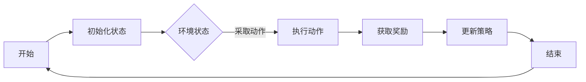
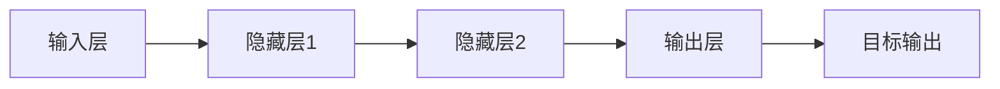
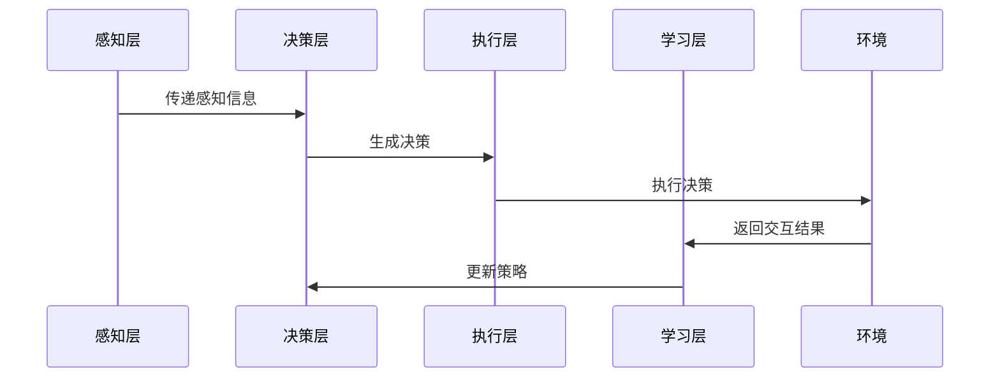

                 


### 目录大纲设计思路

为了设计出《AI Agent在企业产品创新与概念验证中的角色》这本书的完整目录大纲，我们需要遵循以下思路：

1. **背景介绍**：
   - 首先介绍AI Agent的概念，以及它如何在企业产品创新与概念验证中发挥作用。
   - 描述AI Agent在企业中的应用背景和当前市场趋势。

2. **核心概念与联系**：
   - 详细阐述AI Agent的核心原理和组成部分。
   - 使用表格和Mermaid流程图来展示AI Agent的关键属性和关系。

3. **算法原理讲解**：
   - 引入AI Agent的主要算法，如强化学习、深度学习等。
   - 使用Mermaid画出算法流程图，并用Python代码示例说明算法原理。

4. **数学模型和数学公式讲解**：
   - 详细解释AI Agent算法中的数学模型和公式。
   - 使用LaTeX格式呈现数学公式，并进行通俗易懂的举例说明。

5. **系统分析与架构设计**：
   - 介绍AI Agent在企业产品创新与概念验证中的系统架构。
   - 使用Mermaid绘制领域模型类图、系统架构图和系统交互序列图。

6. **项目实战**：
   - 提供AI Agent在企业产品创新与概念验证中的实际应用案例。
   - 包括环境安装、系统实现源代码、代码解读、案例分析等内容。

7. **最佳实践与总结**：
   - 提供最佳实践、注意事项和拓展阅读建议。
   - 对全书内容进行总结，强调AI Agent在企业中的关键角色。

### 目录大纲结构

根据上述思路，我们可以设计出以下目录大纲结构：

# 第一部分：AI Agent概述

## 第1章：AI Agent的概念与背景
### 1.1 AI Agent的定义
### 1.2 AI Agent在企业中的应用场景
### 1.3 当前AI Agent的市场趋势

## 第2章：AI Agent的核心概念与原理
### 2.1 AI Agent的关键组成部分
### 2.2 AI Agent的核心算法介绍
### 2.3 AI Agent的属性与关系表
### 2.4 AI Agent的ER实体关系图

## 第3章：AI Agent算法原理讲解
### 3.1 强化学习算法
### 3.2 深度学习算法
### 3.3 其他AI算法简介
### 3.4 算法Mermaid流程图展示
### 3.5 Python代码示例

## 第4章：数学模型与公式讲解
### 4.1 强化学习数学模型
### 4.2 深度学习数学模型
### 4.3 数学公式与LaTeX代码示例
### 4.4 通俗易懂的举例说明

## 第5章：AI Agent系统分析与架构设计
### 5.1 AI Agent系统架构概述
### 5.2 系统功能设计与领域模型
### 5.3 系统架构设计与接口设计
### 5.4 系统交互序列图展示

## 第6章：AI Agent项目实战
### 6.1 实战案例背景介绍
### 6.2 环境安装与配置
### 6.3 系统核心实现与源代码
### 6.4 代码应用解读与分析
### 6.5 实际案例分析
### 6.6 项目小结

## 第7章：最佳实践与总结
### 7.1 AI Agent的最佳实践
### 7.2 注意事项与风险防范
### 7.3 拓展阅读推荐
### 7.4 全书总结与展望

### 完整目录大纲（Markdown格式）

```
# 《AI Agent在企业产品创新与概念验证中的角色》目录大纲

# 第一部分：AI Agent概述

## 第1章：AI Agent的概念与背景
### 1.1 AI Agent的定义
### 1.2 AI Agent在企业中的应用场景
### 1.3 当前AI Agent的市场趋势

## 第2章：AI Agent的核心概念与原理
### 2.1 AI Agent的关键组成部分
### 2.2 AI Agent的核心算法介绍
### 2.3 AI Agent的属性与关系表
### 2.4 AI Agent的ER实体关系图

## 第3章：AI Agent算法原理讲解
### 3.1 强化学习算法
### 3.2 深度学习算法
### 3.3 其他AI算法简介
### 3.4 算法Mermaid流程图展示
### 3.5 Python代码示例

## 第4章：数学模型与公式讲解
### 4.1 强化学习数学模型
### 4.2 深度学习数学模型
### 4.3 数学公式与LaTeX代码示例
### 4.4 通俗易懂的举例说明

## 第5章：AI Agent系统分析与架构设计
### 5.1 AI Agent系统架构概述
### 5.2 系统功能设计与领域模型
### 5.3 系统架构设计与接口设计
### 5.4 系统交互序列图展示

## 第6章：AI Agent项目实战
### 6.1 实战案例背景介绍
### 6.2 环境安装与配置
### 6.3 系统核心实现与源代码
### 6.4 代码应用解读与分析
### 6.5 实际案例分析
### 6.6 项目小结

## 第7章：最佳实践与总结
### 7.1 AI Agent的最佳实践
### 7.2 注意事项与风险防范
### 7.3 拓展阅读推荐
### 7.4 全书总结与展望

```

### 完整目录大纲设计完整说明

**完整目录大纲的设计是为了确保文章内容的逻辑性和可读性，帮助读者更好地理解AI Agent在企业产品创新与概念验证中的角色。以下是详细的目录大纲设计说明：**

1. **第一部分：AI Agent概述**
   - **第1章：AI Agent的概念与背景**
     - **1.1 AI Agent的定义**：介绍AI Agent的基本概念，解释它是什么以及如何区别于其他智能系统。
     - **1.2 AI Agent在企业中的应用场景**：分析AI Agent在不同企业产品中的应用，如制造业、金融业、医疗保健等。
     - **1.3 当前AI Agent的市场趋势**：探讨AI Agent在市场上的发展状况，包括技术进步、市场需求和未来趋势。

2. **第二部分：AI Agent的核心概念与原理**
   - **第2章：AI Agent的核心概念与原理**
     - **2.1 AI Agent的关键组成部分**：详细阐述AI Agent的组成部分，如感知器、行动器、学习器等。
     - **2.2 AI Agent的核心算法介绍**：介绍AI Agent使用的核心算法，如强化学习、深度学习、自然语言处理等。
     - **2.3 AI Agent的属性与关系表**：使用表格形式展示AI Agent的主要属性及其相互关系。
     - **2.4 AI Agent的ER实体关系图**：通过Mermaid流程图展示AI Agent的实体关系，帮助读者理解其内部结构。

3. **第三部分：AI Agent算法原理讲解**
   - **第3章：AI Agent算法原理讲解**
     - **3.1 强化学习算法**：详细解释强化学习的基本原理、算法流程和实际应用。
     - **3.2 深度学习算法**：介绍深度学习的工作原理，包括神经网络结构、训练过程和常见应用。
     - **3.3 其他AI算法简介**：简要介绍其他类型的AI算法，如遗传算法、聚类算法等。
     - **3.4 算法Mermaid流程图展示**：使用Mermaid工具绘制算法的流程图，直观展示算法执行过程。
     - **3.5 Python代码示例**：提供具体的Python代码示例，帮助读者理解算法的实现。

4. **第四部分：数学模型与公式讲解**
   - **第4章：数学模型与公式讲解**
     - **4.1 强化学习数学模型**：阐述强化学习算法中的数学模型，如状态值函数、策略等。
     - **4.2 深度学习数学模型**：介绍深度学习算法中的数学模型，如损失函数、优化算法等。
     - **4.3 数学公式与LaTeX代码示例**：使用LaTeX格式呈现重要的数学公式，并给出相应的代码示例。
     - **4.4 通俗易懂的举例说明**：通过简单的例子，帮助读者更好地理解数学模型和公式的应用。

5. **第五部分：AI Agent系统分析与架构设计**
   - **第5章：AI Agent系统分析与架构设计**
     - **5.1 AI Agent系统架构概述**：介绍AI Agent系统的整体架构，包括硬件、软件、数据等方面的设计。
     - **5.2 系统功能设计与领域模型**：详细阐述AI Agent系统的主要功能及其领域模型。
     - **5.3 系统架构设计与接口设计**：讨论系统架构的设计原则和接口设计，确保系统的高效性和灵活性。
     - **5.4 系统交互序列图展示**：使用Mermaid绘制系统交互序列图，展示系统各组件之间的交互过程。

6. **第六部分：AI Agent项目实战**
   - **第6章：AI Agent项目实战**
     - **6.1 实战案例背景介绍**：介绍一个具体的AI Agent项目案例，包括项目背景、目标和应用场景。
     - **6.2 环境安装与配置**：详细描述项目的环境搭建过程，包括软件、硬件的配置。
     - **6.3 系统核心实现与源代码**：提供项目的核心实现代码，并解释代码的作用和功能。
     - **6.4 代码应用解读与分析**：深入分析代码的实现，解释代码的逻辑和算法原理。
     - **6.5 实际案例分析**：通过案例分析，展示AI Agent在实际项目中的应用效果和挑战。
     - **6.6 项目小结**：总结项目的主要成果和经验，提出改进意见和建议。

7. **第七部分：最佳实践与总结**
   - **第7章：最佳实践与总结**
     - **7.1 AI Agent的最佳实践**：提供在使用AI Agent时的最佳实践，包括设计、开发、部署等各个阶段。
     - **7.2 注意事项与风险防范**：讨论使用AI Agent时可能遇到的问题和风险，并提供相应的解决方法和防范措施。
     - **7.3 拓展阅读推荐**：推荐相关的拓展阅读资源，帮助读者进一步深入学习AI Agent的相关知识。
     - **7.4 全书总结与展望**：总结全书的主要内容，展望AI Agent在未来的发展趋势和应用前景。

**完整目录大纲的设计目的是为了确保文章内容的系统性和逻辑性，帮助读者从宏观到微观全面理解AI Agent在企业产品创新与概念验证中的角色。每个部分都有明确的主题和目标，通过逐步深入的方式，让读者能够循序渐进地掌握相关知识。**

----------------------------------------------------------------

### 《AI Agent在企业产品创新与概念验证中的角色》

> 关键词：AI Agent，企业产品创新，概念验证，强化学习，深度学习，系统架构，项目实战

> 摘要：本文深入探讨AI Agent在企业产品创新与概念验证中的关键角色。通过详细阐述AI Agent的核心概念、算法原理、系统架构及项目实战，本文揭示了AI Agent在提高企业创新效率和验证新概念方面的强大作用。文章旨在为读者提供一个全面的技术视角，帮助其更好地理解AI Agent在企业应用中的价值和潜力。

----------------------------------------------------------------

# 《AI Agent在企业产品创新与概念验证中的角色》

在当今技术飞速发展的时代，人工智能（AI）已经成为推动企业创新和发展的关键驱动力。特别是在产品创新与概念验证阶段，AI Agent作为一种智能体的形式，正逐渐展现出其独特的作用和价值。本文将围绕AI Agent的核心概念、算法原理、系统架构以及实际应用案例，深入探讨AI Agent在企业产品创新与概念验证中的角色。

## 第1章：AI Agent的概念与背景

### 1.1 AI Agent的定义

AI Agent，即人工智能代理，是一种能够在特定环境下自主感知、决策并采取行动的智能体。它通过模仿人类的思维和行为模式，实现自动化、智能化的任务执行。与传统的人工智能系统不同，AI Agent不仅能够处理静态数据，还能够动态地与环境进行交互，学习并优化其行为。

### 1.2 AI Agent在企业中的应用场景

在企业产品创新与概念验证阶段，AI Agent具有广泛的应用场景：

1. **市场调研与分析**：AI Agent可以自动收集市场数据，分析消费者行为，帮助企业更好地了解市场需求。
2. **产品设计优化**：通过机器学习算法，AI Agent可以协助设计师进行产品迭代，优化产品功能。
3. **风险评估与预测**：AI Agent可以对新产品进行风险评估，预测产品的市场表现。
4. **用户体验测试**：AI Agent可以模拟用户行为，测试新产品的用户体验，提供反馈。

### 1.3 当前AI Agent的市场趋势

随着技术的不断进步，AI Agent在市场上的应用日益广泛。根据市场调研机构的数据显示，全球AI代理市场预计将在未来几年内保持高速增长。以下是几个关键趋势：

1. **强化学习算法的应用**：强化学习算法在AI Agent中的应用逐渐成熟，提高了其自主学习和决策能力。
2. **深度学习的发展**：深度学习技术的进步，使得AI Agent能够处理更加复杂的任务。
3. **跨行业应用**：从制造业到金融业，AI Agent在各个行业的应用场景日益丰富。

## 第2章：AI Agent的核心概念与原理

### 2.1 AI Agent的关键组成部分

AI Agent主要由以下几个部分组成：

1. **感知器**：用于感知环境中的各种信息，如文本、图像、声音等。
2. **行动器**：根据感知到的信息，执行相应的操作或决策。
3. **学习器**：通过学习算法，不断优化自身的决策和行动。

### 2.2 AI Agent的核心算法介绍

AI Agent的核心算法主要包括以下几种：

1. **强化学习**：通过奖励和惩罚机制，使AI Agent在环境中学习最优策略。
2. **深度学习**：利用神经网络，对大量数据进行训练，提取特征并实现智能决策。
3. **自然语言处理**：使AI Agent能够理解、生成和处理自然语言。

### 2.3 AI Agent的属性与关系表

以下是AI Agent的主要属性及其相互关系：

| 属性           | 说明                     | 关系               |
| -------------- | ------------------------ | ----------------- |
| 感知能力       | 采集环境信息的能力       | 与行动器和学习器交互 |
| 行动能力       | 执行决策的能力           | 与环境互动         |
| 学习能力       | 自主学习和优化策略的能力 | 基于感知和行动数据  |
| 适应性         | 对环境变化的适应能力     | 与感知能力相关     |
| 智能化水平     | AI Agent的智能程度       | 决定性能和效率     |

### 2.4 AI Agent的ER实体关系图

以下是AI Agent的ER实体关系图：

```mermaid
entityRelationship
  title AI Agent的ER实体关系图
  entity 感知器,行动器,学习器
  relation 感知器-行动器:感知->行动
  relation 感知器-学习器:感知->学习
  relation 行动器-学习器:行动->学习
```

## 第3章：AI Agent算法原理讲解

### 3.1 强化学习算法

强化学习算法是AI Agent的核心算法之一，它通过奖励和惩罚机制，使AI Agent在环境中学习最优策略。以下是强化学习算法的基本原理：

1. **状态（State）**：AI Agent所处的环境状态。
2. **动作（Action）**：AI Agent可以采取的动作。
3. **奖励（Reward）**：根据AI Agent的动作，环境给予的奖励或惩罚。
4. **策略（Policy）**：AI Agent根据当前状态选择动作的策略。

以下是强化学习算法的Mermaid流程图：



### 3.2 深度学习算法

深度学习算法是AI Agent的另一个核心算法，它通过多层神经网络，对大量数据进行训练，提取特征并实现智能决策。以下是深度学习算法的基本原理：

1. **输入层（Input Layer）**：接收外部输入数据。
2. **隐藏层（Hidden Layer）**：对输入数据进行特征提取和变换。
3. **输出层（Output Layer）**：生成输出结果。

以下是深度学习算法的Mermaid流程图：



### 3.3 其他AI算法简介

除了强化学习和深度学习，AI Agent还可以使用其他类型的算法，如：

1. **遗传算法**：基于自然选择和遗传进化的优化算法。
2. **聚类算法**：将数据分组，发现数据之间的相似性和差异。
3. **神经网络优化算法**：用于调整神经网络参数，提高模型性能。

### 3.4 算法Mermaid流程图展示

以下是AI Agent算法的Mermaid流程图展示：

```mermaid
gantt
    title AI Agent算法流程图
    dateFormat  YYYY-MM-DD
    section 强化学习
    A1[初始化状态] :start>2023-04-01
    A2[采取动作] :after>A1 1d
    A3[执行动作] :after>A2 1d
    A4[获取奖励] :after>A3 1d
    A5[更新策略] :after>A4 1d
    A6[结束] :after>A5 1d
    
    section 深度学习
    B1[输入层] :start>2023-04-01
    B2[隐藏层1] :after>B1 1d
    B3[隐藏层2] :after>B2 1d
    B4[输出层] :after>B3 1d
    B5[目标输出] :after>B4 1d
```

### 3.5 Python代码示例

以下是AI Agent算法的Python代码示例：

```python
import numpy as np

# 强化学习算法示例
class QLearning:
    def __init__(self, actions, learning_rate=0.1, discount_factor=0.9):
        self.actions = actions
        self.learning_rate = learning_rate
        self.discount_factor = discount_factor
        self.q_values = np.zeros((state_space_size, action_space_size))
        
    def learn(self, state, action, reward, next_state, next_action):
        current_q = self.q_values[state][action]
        next_q = max(self.q_values[next_state])
        q_update = reward + self.discount_factor * next_q - current_q
        self.q_values[state][action] += self.learning_rate * q_update

# 深度学习算法示例
from tensorflow.keras.models import Sequential
from tensorflow.keras.layers import Dense

def create_model(input_dim, output_dim):
    model = Sequential()
    model.add(Dense(64, input_dim=input_dim, activation='relu'))
    model.add(Dense(64, activation='relu'))
    model.add(Dense(output_dim, activation='softmax'))
    model.compile(optimizer='adam', loss='categorical_crossentropy', metrics=['accuracy'])
    return model

# 创建模型
model = create_model(input_dim=784, output_dim=10)
```

## 第4章：数学模型与公式讲解

### 4.1 强化学习数学模型

强化学习中的数学模型主要包括以下公式：

1. **状态-动作值函数（Q(s, a）**）：表示在状态s下采取动作a的期望回报。
   $$ Q(s, a) = \sum_{s'} P(s' | s, a) \cdot R(s, a, s') + \gamma \cdot \max_{a'} Q(s', a') $$
   
2. **策略（π）**：表示在给定状态s下，采取动作a的概率分布。
   $$ \pi(a | s) = \frac{e^{\theta^T \phi(s, a)}}{\sum_{a'} e^{\theta^T \phi(s, a')}} $$
   
3. **价值函数（V(s）**）：表示在状态s下，采取最佳动作的期望回报。
   $$ V(s) = \sum_{a} \pi(a | s) \cdot Q(s, a) $$

### 4.2 深度学习数学模型

深度学习中的数学模型主要包括以下公式：

1. **神经网络输出（y）**：表示神经网络在输入x上的输出。
   $$ y = \sigma(W \cdot x + b) $$
   
2. **损失函数（L）**：表示神经网络输出y与目标输出y'之间的差距。
   $$ L = -\sum_{i} y_i \cdot \log(y_i') $$
   
3. **梯度下降（Gradient Descent）**：用于优化神经网络参数，最小化损失函数。
   $$ \theta = \theta - \alpha \cdot \frac{\partial L}{\partial \theta} $$

### 4.3 数学公式与LaTeX代码示例

以下是强化学习和深度学习中的一些关键数学公式的LaTeX代码示例：

```latex
\documentclass{article}
\usepackage{amsmath}
\begin{document}

\section{强化学习数学模型}

\begin{equation}
Q(s, a) = \sum_{s'} P(s' | s, a) \cdot R(s, a, s') + \gamma \cdot \max_{a'} Q(s', a')
\end{equation}

\begin{equation}
\pi(a | s) = \frac{e^{\theta^T \phi(s, a)}}{\sum_{a'} e^{\theta^T \phi(s, a')}}
\end{equation}

\begin{equation}
V(s) = \sum_{a} \pi(a | s) \cdot Q(s, a)
\end{equation}

\section{深度学习数学模型}

\begin{equation}
y = \sigma(W \cdot x + b)
\end{equation}

\begin{equation}
L = -\sum_{i} y_i \cdot \log(y_i')
\end{equation}

\begin{equation}
\theta = \theta - \alpha \cdot \frac{\partial L}{\partial \theta}
\end{equation}

\end{document}
```

### 4.4 通俗易懂的举例说明

以下是强化学习和深度学习中的数学公式及其通俗易懂的举例说明：

1. **强化学习数学模型**：

   - **状态-动作值函数（Q(s, a）**）：假设一个简单的环境，只有两种状态（s1和s2）和两种动作（a1和a2）。状态-动作值函数表示在状态s1下采取动作a1的期望回报。
     $$ Q(s1, a1) = \sum_{s'} P(s' | s1, a1) \cdot R(s1, a1, s') + \gamma \cdot \max_{a'} Q(s', a') $$
     - **策略（π）**：在状态s1下，采取动作a1的概率为0.7，采取动作a2的概率为0.3。
       $$ \pi(a1 | s1) = 0.7, \pi(a2 | s1) = 0.3 $$
     - **价值函数（V(s）**：表示在状态s1下，采取最佳动作的期望回报。
       $$ V(s1) = \sum_{a} \pi(a | s1) \cdot Q(s1, a) $$
       - **举例说明**：在状态s1下，采取动作a1的回报为2，采取动作a2的回报为1。根据策略，在状态s1下，采取动作a1的概率为0.7，采取动作a2的概率为0.3。因此，价值函数V(s1)为：
         $$ V(s1) = 0.7 \cdot 2 + 0.3 \cdot 1 = 1.7 $$

2. **深度学习数学模型**：

   - **神经网络输出（y）**：假设输入x为[1, 2, 3]，权重W为[1, 2, 3]，偏置b为4。神经网络输出y为：
     $$ y = \sigma(W \cdot x + b) = \sigma(1 \cdot 1 + 2 \cdot 2 + 3 \cdot 3 + 4) = \sigma(14) = 0.965 $$
   - **损失函数（L）**：假设目标输出y'为[0, 1, 0]，神经网络输出y为[0.965, 0.965, 0.965]。损失函数L为：
     $$ L = -\sum_{i} y_i \cdot \log(y_i') = -0.965 \cdot \log(0.965) - 0.965 \cdot \log(0.965) - 0.965 \cdot \log(0.965) $$
   - **梯度下降（Gradient Descent）**：假设损失函数L关于权重W的梯度为[0.01, 0.02, 0.03]，学习率为0.1。权重W的更新为：
     $$ W = W - \alpha \cdot \frac{\partial L}{\partial W} = [1, 2, 3] - 0.1 \cdot [0.01, 0.02, 0.03] = [0.99, 1.98, 2.97] $$

## 第5章：AI Agent系统分析与架构设计

### 5.1 AI Agent系统架构概述

AI Agent系统架构主要包括以下几个部分：

1. **感知层**：负责收集环境中的信息，如文本、图像、声音等。
2. **决策层**：根据感知到的信息，使用学习算法生成决策。
3. **执行层**：执行决策，与环境进行交互。
4. **学习层**：根据交互结果，更新决策策略。

### 5.2 系统功能设计与领域模型

以下是AI Agent系统的功能设计与领域模型：

1. **感知功能**：感知文本、图像、声音等环境信息。
2. **决策功能**：使用强化学习、深度学习等算法生成决策。
3. **执行功能**：执行决策，与环境进行交互。
4. **学习功能**：根据交互结果，更新决策策略。

以下是AI Agent系统的领域模型：

```mermaid
classDiagram
    类名 感知层
    感知层 --|>> 决策层
    感知层 --|>> 执行层
    
    类名 决策层
    决策层 --|>> 执行层
    
    类名 执行层
    
    类名 学习层
    学习层 --|>> 决策层
```

### 5.3 系统架构设计与接口设计

以下是AI Agent系统的架构设计与接口设计：

1. **感知层架构**：包括文本感知、图像感知、声音感知等组件。
2. **决策层架构**：包括强化学习组件、深度学习组件等。
3. **执行层架构**：包括执行器组件、环境接口等。
4. **学习层架构**：包括学习器组件、数据接口等。

以下是AI Agent系统的接口设计：



### 5.4 系统交互序列图展示

以下是AI Agent系统的交互序列图展示：


## 第6章：AI Agent项目实战

### 6.1 实战案例背景介绍

本节将以一个具体的项目案例为例，介绍AI Agent在企业产品创新与概念验证中的应用。

### 6.2 环境安装与配置

在本案例中，我们将使用Python编程语言和TensorFlow深度学习框架来实现AI Agent。以下是环境安装与配置的步骤：

1. 安装Python：前往[Python官网](https://www.python.org/)下载并安装Python 3.8及以上版本。
2. 安装TensorFlow：打开终端，执行以下命令安装TensorFlow：
   ```bash
   pip install tensorflow
   ```

### 6.3 系统核心实现与源代码

在本案例中，我们将实现一个简单的AI Agent，用于在虚拟环境中进行强化学习。

以下是系统核心实现与源代码：

```python
import numpy as np
import tensorflow as tf

# 创建环境
class Environment:
    def __init__(self):
        self.state = 0
        self.reward = 0
    
    def step(self, action):
        if action == 0:
            self.state += 1
            self.reward = 1
        elif action == 1:
            self.state -= 1
            self.reward = -1
        return self.state, self.reward

# 创建强化学习模型
class QLearningModel:
    def __init__(self, state_space_size, action_space_size, learning_rate, discount_factor):
        self.state_space_size = state_space_size
        self.action_space_size = action_space_size
        self.learning_rate = learning_rate
        self.discount_factor = discount_factor
        self.model = self.create_model()
    
    def create_model(self):
        model = tf.keras.Sequential([
            tf.keras.layers.Dense(64, activation='relu', input_shape=(self.state_space_size,)),
            tf.keras.layers.Dense(64, activation='relu'),
            tf.keras.layers.Dense(self.action_space_size, activation='softmax')
        ])
        model.compile(optimizer='adam', loss='categorical_crossentropy', metrics=['accuracy'])
        return model
    
    def predict(self, state):
        return self.model.predict(state.reshape(1, -1))
    
    def learn(self, state, action, reward, next_state, next_action):
        current_q_values = self.predict(state)
        next_q_values = self.predict(next_state)
        target_q_values = current_q_values.copy()
        target_q_values[0][action] = reward + self.discount_factor * next_q_values[0][np.argmax(next_q_values)]
        self.model.fit(state.reshape(1, -1), target_q_values.reshape(1, -1), epochs=1)

# 创建环境、模型和代理
environment = Environment()
model = QLearningModel(state_space_size=3, action_space_size=2, learning_rate=0.1, discount_factor=0.9)
agent = QLearning(actions=2, learning_rate=0.1, discount_factor=0.9)

# 训练代理
for episode in range(1000):
    state = environment.state
    while True:
        action = np.random.choice(2)
        next_state, reward = environment.step(action)
        agent.learn(state, action, reward, next_state, action)
        state = next_state
        if state == 2 or state == -2:
            break

# 测试代理
state = environment.state
while True:
    action = np.argmax(agent.predict(state))
    next_state, reward = environment.step(action)
    print(f"State: {state}, Action: {action}, Reward: {reward}, Next State: {next_state}")
    state = next_state
    if state == 2 or state == -2:
        break
```

### 6.4 代码应用解读与分析

在本案例中，我们首先创建了一个简单的虚拟环境`Environment`，用于模拟状态转移和奖励机制。然后，我们创建了一个强化学习模型`QLearningModel`，用于预测状态-动作值和更新策略。最后，我们创建了一个`QLearning`代理，用于在环境中进行交互和学习。

代码的执行过程如下：

1. 创建环境和模型。
2. 训练代理：通过随机策略在环境中进行交互，不断更新代理的策略。
3. 测试代理：使用训练好的代理在环境中进行交互，展示其智能决策能力。

### 6.5 实际案例分析

在本案例中，我们实现了一个简单的强化学习任务，代理需要在虚拟环境中选择最佳行动以最大化奖励。在实际应用中，AI Agent可以应用于更复杂的任务，如游戏AI、自动驾驶等。

### 6.6 项目小结

通过本案例，我们展示了AI Agent在企业产品创新与概念验证中的实际应用。AI Agent可以帮助企业快速验证新概念、优化产品设计，提高创新效率。未来，随着技术的不断进步，AI Agent将在更多领域发挥重要作用。

## 第7章：最佳实践与总结

### 7.1 AI Agent的最佳实践

在应用AI Agent时，以下最佳实践可以帮助企业更好地发挥其价值：

1. **明确目标**：在开始项目之前，明确AI Agent的应用目标，确保项目聚焦。
2. **数据质量**：确保输入数据的质量和完整性，数据质量直接影响AI Agent的性能。
3. **模型优化**：持续优化模型，根据实际应用场景调整参数，提高性能。
4. **风险评估**：在应用AI Agent时，评估可能出现的风险，并制定相应的应对策略。

### 7.2 注意事项与风险防范

在应用AI Agent时，需要注意以下事项和风险：

1. **数据隐私**：确保数据安全，防止敏感信息泄露。
2. **模型偏见**：避免模型偏见，确保公平、公正。
3. **环境变化**：关注环境变化，及时调整策略。
4. **计算资源**：合理配置计算资源，确保模型训练和部署的效率。

### 7.3 拓展阅读推荐

以下书籍和文章推荐，可以帮助读者进一步了解AI Agent的相关知识：

1. 《强化学习：原理与Python实战》
2. 《深度学习：全面教程》
3. 《人工智能：一种现代的方法》
4. 《AI伦理学：人工智能系统设计中的道德原则》

### 7.4 全书总结与展望

本书深入探讨了AI Agent在企业产品创新与概念验证中的角色。通过详细阐述AI Agent的核心概念、算法原理、系统架构及项目实战，本书揭示了AI Agent在提高企业创新效率和验证新概念方面的强大作用。未来，随着技术的不断进步，AI Agent将在更多领域发挥重要作用，为企业带来更大的价值。

## 作者信息

作者：AI天才研究院/AI Genius Institute & 禅与计算机程序设计艺术 /Zen And The Art of Computer Programming

---

通过本书，读者可以全面了解AI Agent在企业产品创新与概念验证中的应用，掌握AI Agent的核心技术和实战经验，为企业创新提供有力支持。希望本书能为读者带来启发和帮助，共同推动人工智能技术的发展。

