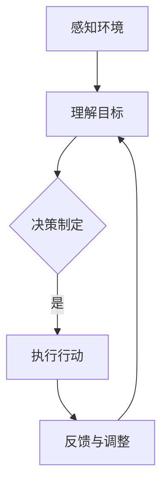
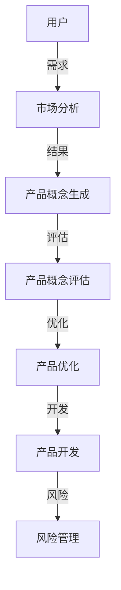
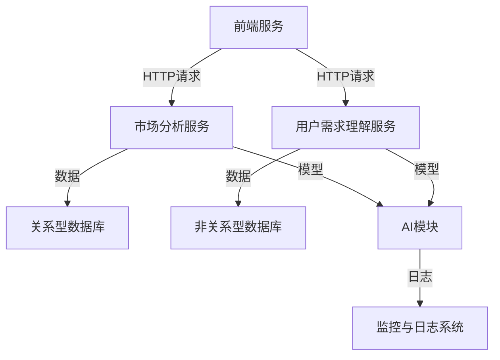

                 

### 摘要

本文旨在探讨AI Agent在企业产品概念生成与评估中的关键角色。通过深入分析AI Agent的定义、原理及其应用场景，本文将展示如何利用AI Agent提高产品开发的效率和质量。文章将首先介绍AI Agent的背景和核心概念，接着详细阐述其在企业产品概念生成与评估中的具体应用和算法原理，并通过实际项目案例和最佳实践提供实用指导。本文的核心观点是，AI Agent作为一种先进的智能技术，不仅能够显著提升企业的创新能力和市场竞争力，而且能够帮助企业更精准地识别和评估潜在的产品概念，从而加速产品从概念到市场的转化过程。通过本文的探讨，读者将更好地理解AI Agent在企业产品开发中的重要作用及其潜在价值。

---

## 第一部分：AI Agent概述与背景

### 1.1 问题背景与核心概念

#### 1.1.1 AI Agent的起源与发展

AI Agent，即人工智能代理，是人工智能领域中的一个重要概念，起源于20世纪80年代，其核心思想是模仿人类在复杂环境中的决策过程。AI Agent通过感知环境、理解目标和采取行动，以实现特定目标。随着计算机技术和人工智能算法的不断发展，AI Agent的应用范围和影响力日益扩大。

AI Agent的发展可以分为三个阶段：早期研究阶段、应用探索阶段和成熟发展阶段。早期研究阶段主要集中在如何使机器模拟人类的决策过程，这一阶段的代表性工作是1985年约翰·霍普金斯大学的"Graduated Hyperspace Approach"。应用探索阶段则开始将AI Agent应用于具体领域，如机器人控制、智能游戏等。成熟发展阶段，AI Agent被广泛应用于各个行业，包括金融服务、医疗保健、物流运输等，成为推动产业智能化的重要技术。

#### 1.1.2 AI Agent在产品概念生成与评估中的应用

在企业产品开发过程中，产品概念的生成与评估是至关重要的一环。传统的产品开发方法依赖于人为经验和市场调研，往往存在主观性和不确定性。而AI Agent的出现，为这一过程带来了新的可能性。

AI Agent在产品概念生成中的应用主要体现在以下几个方面：

1. **数据挖掘与分析**：AI Agent能够通过分析大量数据，识别潜在的市场需求和用户行为模式，从而生成有针对性的产品概念。
2. **模拟与优化**：AI Agent可以利用模拟技术，对不同的产品概念进行评估和优化，找到最优的产品方案。
3. **个性化推荐**：AI Agent能够根据用户的历史行为和偏好，提供个性化的产品推荐，提高用户满意度和市场接受度。

在产品评估方面，AI Agent的优势同样明显：

1. **快速评估**：AI Agent能够快速处理和分析大量数据，快速评估产品概念的可行性和潜在风险。
2. **客观评估**：AI Agent基于数据和算法进行评估，减少了主观偏见，提高了评估的客观性。
3. **动态调整**：AI Agent可以根据市场变化和用户反馈，动态调整产品概念，提高产品的市场适应性。

#### 1.1.3 企业产品概念生成与评估的需求分析

企业产品概念生成与评估的需求可以分为以下几个方面：

1. **市场需求**：企业需要快速响应市场需求，及时推出符合市场潮流的产品。
2. **创新能力**：企业需要具备持续的创新能力和竞争力，以应对激烈的市场竞争。
3. **风险控制**：企业需要有效控制产品开发过程中的风险，确保产品能够顺利推向市场。
4. **用户体验**：企业需要关注用户需求，提供高质量的产品，提高用户满意度和忠诚度。

AI Agent作为一种先进的技术手段，能够有效满足企业在产品概念生成与评估方面的需求，提升企业的整体竞争力和市场地位。

### 1.2 AI Agent的核心概念与联系

#### 1.2.1 AI Agent的定义与分类

AI Agent是指具有自主决策能力、能够在复杂环境中执行任务的人工智能实体。根据功能和特点，AI Agent可以分为以下几类：

1. **反应型AI Agent**：这种类型的AI Agent只能根据当前环境的状态做出反应，无法进行长远规划或决策。
2. **模型基础型AI Agent**：这种类型的AI Agent能够根据预先定义的模型和环境反馈进行决策，具有一定的预见性。
3. **目标导向型AI Agent**：这种类型的AI Agent不仅能够感知环境，还能够设定目标并采取行动实现目标。

#### 1.2.2 AI Agent的关键特性与能力

AI Agent的关键特性包括：

1. **自主性**：AI Agent能够在没有人类干预的情况下自主执行任务。
2. **适应性**：AI Agent能够根据环境变化和任务需求调整自己的行为。
3. **交互性**：AI Agent能够与人类和其他系统进行有效交互，获取信息和执行任务。

AI Agent的主要能力包括：

1. **数据采集与处理**：AI Agent能够收集和分析大量数据，提取有价值的信息。
2. **目标规划与执行**：AI Agent能够根据目标制定行动计划，并执行这些计划。
3. **决策与优化**：AI Agent能够在复杂环境中做出最优决策，并不断优化自己的行为。

#### 1.2.3 AI Agent与其他AI技术的对比与联系

AI Agent与其他AI技术如机器学习、深度学习、自然语言处理等有着密切的联系，但又有所不同。

1. **机器学习**：机器学习是AI Agent的重要组成部分，它为AI Agent提供了数据分析和决策的基础。然而，机器学习主要侧重于数据的训练和模型的优化，而AI Agent更强调实际应用和自主决策。
2. **深度学习**：深度学习是机器学习的一种方法，它通过多层神经网络模拟人类大脑的学习过程。深度学习在图像识别、语音识别等领域有着广泛应用，是AI Agent实现高级功能的关键技术。
3. **自然语言处理**：自然语言处理是AI Agent与人类进行自然语言交互的基础。通过自然语言处理技术，AI Agent能够理解和生成自然语言，提高人机交互的效率。

#### 1.2.4 AI Agent的概念属性特征对比表格和ER实体关系图架构

为了更好地理解AI Agent的概念属性特征，我们可以通过一个对比表格来展示不同类型AI Agent的特性：

| AI Agent类型 | 反应型AI Agent | 模型基础型AI Agent | 目标导向型AI Agent |
| :--- | :--- | :--- | :--- |
| 自主性 | 低 | 中等 | 高 |
| 适应性 | 低 | 中等 | 高 |
| 交互性 | 中等 | 高 | 高 |
| 数据采集与处理 | 中等 | 高 | 高 |
| 目标规划与执行 | 无 | 有 | 有 |
| 决策与优化 | 无 | 有 | 有 |

此外，我们可以使用Mermaid工具绘制ER实体关系图，以展示AI Agent与其他AI技术之间的联系：

```mermaid
erDiagram
    AI Agent ||--|> Model-Based AI Agent : extends
    AI Agent ||--|> Goal-Oriented AI Agent : extends
    Model-Based AI Agent ||--|> Machine Learning : uses
    Goal-Oriented AI Agent ||--|> Deep Learning : uses
    Goal-Oriented AI Agent ||--|> Natural Language Processing : uses
```

通过以上对比和联系，我们可以更全面地理解AI Agent的概念属性及其与其他AI技术的相互关系。

### 1.3 AI Agent的工作原理与流程

#### 1.3.1 AI Agent的算法原理详解

AI Agent的算法原理是其能够自主决策和执行任务的基础。通常，AI Agent的算法原理可以分为以下几个关键步骤：

1. **感知环境**：AI Agent通过传感器或其他数据源收集环境信息，如温度、湿度、光照强度等。
2. **理解目标**：AI Agent根据预设的目标或任务，分析环境信息，理解当前任务的具体要求。
3. **决策制定**：AI Agent利用预先定义的算法或机器学习模型，分析环境信息和目标要求，制定行动策略。
4. **执行行动**：AI Agent根据制定的行动策略，执行具体行动，如移动、操作设备等。
5. **反馈与调整**：AI Agent执行行动后，收集反馈信息，并根据反馈调整后续行动策略。

这些步骤形成一个闭环控制系统，使得AI Agent能够不断适应环境变化，优化自身行为。

#### 1.3.2 AI Agent的mermaid流程图

为了更直观地展示AI Agent的算法原理，我们可以使用Mermaid工具绘制一个流程图：



该流程图展示了AI Agent从感知环境到执行行动的完整过程。

#### 1.3.3 Python代码示例与算法解释

下面是一个简单的Python代码示例，用于说明AI Agent的基本算法原理：

```python
import random

class AI_Agent:
    def __init__(self, environment):
        self.environment = environment

    def sense_environment(self):
        # 模拟感知环境
        return random.randint(0, 100)

    def understand_goal(self, goal):
        # 模拟理解目标
        return goal

    def make_decision(self, environment, goal):
        # 模拟决策制定
        if environment < goal:
            return "前进"
        else:
            return "停止"

    def execute_action(self, action):
        # 模拟执行行动
        print(f"执行行动：{action}")

    def feedback_and_adjustment(self, feedback):
        # 模拟反馈与调整
        print(f"反馈：{feedback}")
        # 这里可以加入更复杂的调整逻辑

# 实例化AI Agent
agent = AI_Agent(environment=50)
goal = 70

# 感知环境
environment = agent.sense_environment()

# 理解目标
understood_goal = agent.understand_goal(goal)

# 决策制定
action = agent.make_decision(environment, understood_goal)

# 执行行动
agent.execute_action(action)

# 反馈与调整
feedback = "行动成功"
agent.feedback_and_adjustment(feedback)
```

这段代码定义了一个简单的AI Agent类，通过模拟感知环境、理解目标、制定决策、执行行动和反馈调整等过程，展示了AI Agent的基本工作原理。

#### 1.3.4 算法原理的数学模型和公式

AI Agent的算法原理可以通过数学模型和公式进行详细阐述。以下是一个简单的数学模型，用于描述AI Agent的决策过程：

$$
\text{决策} = \text{f}(\text{环境状态}, \text{目标状态})
$$

其中，`f`是一个映射函数，用于根据环境状态和目标状态计算决策。具体的决策函数可以根据具体应用场景进行设计，例如：

$$
\text{决策} = \begin{cases} 
\text{"前进"}, & \text{如果}\ \text{环境状态} < \text{目标状态} \\
\text{"停止"}, & \text{如果}\ \text{环境状态} \geq \text{目标状态}
\end{cases}
$$

这个数学模型展示了AI Agent如何根据环境状态和目标状态进行决策，实现了感知、理解和决策的有机结合。

#### 1.3.5 举例说明与结果分析

为了更好地理解AI Agent的算法原理，我们可以通过一个具体例子进行说明。

假设一个AI Agent需要控制一个机器人在迷宫中找到出口。迷宫的每个位置都有不同的障碍和奖励，机器人的目标是从起点移动到出口。

1. **感知环境**：机器人使用传感器感知当前位置的障碍和奖励。
2. **理解目标**：机器人的目标是找到出口，并避免障碍。
3. **决策制定**：根据当前位置的状态（障碍和奖励），机器人决定下一步的行动（前进、转向或停止）。
4. **执行行动**：机器人根据决策移动。
5. **反馈与调整**：机器人根据移动后的结果（成功找到出口或遇到障碍）调整后续行动。

通过迭代这个过程，机器人逐渐优化自己的路径，最终找到出口。

在实际应用中，AI Agent的算法原理会更加复杂，涉及多种感知、理解和决策方法。但上述例子提供了一个基本的框架，展示了AI Agent如何通过感知、理解和决策实现自主行动。

### 1.4 数学公式说明

在AI Agent的算法原理中，数学公式扮演着至关重要的角色。这些公式不仅帮助我们理解和描述AI Agent的决策过程，还为实际应用提供了理论基础。以下，我们将介绍一些关键的数学公式，并使用LaTeX格式进行书写。

#### 1.4.1 感知环境

感知环境是AI Agent的第一步。假设环境状态可以用向量表示为：

$$
\vec{S} = (s_1, s_2, ..., s_n)
$$

其中，$s_i$代表环境中的第$i$个特征。AI Agent通过传感器收集这些特征，形成一个感知向量。

#### 1.4.2 目标理解

理解目标是AI Agent的第二步。假设目标状态可以用向量表示为：

$$
\vec{G} = (g_1, g_2, ..., g_n)
$$

其中，$g_i$代表目标中的第$i$个特征。AI Agent根据感知到的环境和预设目标，计算目标向量与感知向量的差异：

$$
\Delta \vec{G} = \vec{G} - \vec{S}
$$

#### 1.4.3 决策制定

决策制定是AI Agent的核心步骤。根据感知和目标信息，AI Agent需要制定一个最优的行动策略。一个常见的决策模型是基于梯度的优化算法，公式为：

$$
\vec{A} = \text{argmin}_{\vec{A}} \|\Delta \vec{G}\|
$$

其中，$\vec{A}$代表行动向量，$\|\Delta \vec{G}\|$代表目标差异的欧几里得距离。

#### 1.4.4 行动执行

行动执行是将决策转化为实际行动的过程。假设每个行动都有对应的成本函数：

$$
C(\vec{A}) = \sum_{i=1}^{n} c_i
$$

其中，$c_i$代表第$i$个行动的成本。AI Agent需要选择一个最小化成本的行动：

$$
\vec{A}^* = \text{argmin}_{\vec{A}} C(\vec{A})
$$

#### 1.4.5 反馈与调整

反馈与调整是AI Agent不断优化的关键步骤。通过收集行动后的反馈，AI Agent可以调整自己的策略，公式为：

$$
\vec{S}_{\text{new}} = \vec{S} + \alpha (\vec{G} - \vec{S}_{\text{new}})
$$

其中，$\alpha$是调整系数，$\vec{S}_{\text{new}}$是新的感知向量。通过不断迭代这个过程，AI Agent可以逐步优化其行动策略。

通过上述数学公式，我们可以清晰地理解AI Agent的感知、理解和决策过程。这些公式不仅为AI Agent的设计提供了理论基础，还为实际应用提供了具体的操作指南。

### 1.5 企业产品概念生成与评估的应用场景

#### 1.5.1 AI Agent在企业产品管理中的作用

在企业的产品管理过程中，AI Agent发挥着不可或缺的作用。传统的产品管理方法通常依赖于市场调研和专家意见，但这些方法往往存在主观性和延迟性。而AI Agent通过数据驱动和智能决策，能够显著提升产品开发的效率和质量。

首先，AI Agent能够实时监控市场动态和用户行为，帮助企业快速识别市场趋势和用户需求。通过分析大量的数据，AI Agent可以生成潜在的产品概念，并对其进行评估和筛选，从而提高产品创新的准确性和效率。

其次，AI Agent能够优化产品开发流程。在产品开发的早期阶段，AI Agent可以根据用户反馈和市场数据，动态调整产品功能和设计，确保产品能够快速响应市场变化。此外，AI Agent还可以协助企业进行风险管理，通过模拟不同的市场环境和决策情景，提前预测可能出现的问题，并提出解决方案。

#### 1.5.2 产品概念生成的流程与策略

AI Agent在产品概念生成中的应用主要分为以下几个步骤：

1. **数据收集与预处理**：AI Agent首先收集与产品相关的数据，包括市场趋势、用户行为、竞争对手信息等。然后对数据进行预处理，如数据清洗、归一化和特征提取，为后续的分析提供高质量的数据。

2. **需求分析与用户画像**：通过分析用户数据和市场趋势，AI Agent可以识别出潜在的用户需求和偏好，生成用户画像。这些用户画像将成为产品概念生成的重要参考。

3. **概念生成**：基于用户画像和市场数据，AI Agent利用机器学习和自然语言处理技术，生成一系列潜在的产品概念。这些概念可以是具体的硬件产品、软件应用或服务方案。

4. **概念评估与筛选**：AI Agent对生成的产品概念进行评估，包括市场需求分析、技术可行性评估和商业潜力分析等。通过综合评估，筛选出最有潜力的产品概念。

5. **概念优化与迭代**：筛选出的产品概念将进入优化阶段。AI Agent可以根据用户反馈和市场反馈，不断调整和优化产品概念，提高其市场适应性。

#### 1.5.3 产品评估的方法与工具

在产品评估过程中，AI Agent提供了多种方法和工具，以帮助企业做出科学的决策。

1. **数据驱动的评估模型**：AI Agent利用机器学习技术，构建数据驱动的评估模型。这些模型可以根据历史数据和用户反馈，预测产品的市场需求和潜在风险。

2. **模拟与优化**：AI Agent可以通过模拟技术，对不同的产品概念进行评估和优化。例如，通过模拟市场环境和用户行为，分析不同产品概念的表现，帮助企业选择最佳的产品方案。

3. **自然语言处理**：AI Agent利用自然语言处理技术，分析用户反馈和评论，提取有价值的信息，为产品评估提供参考。

4. **实时反馈与调整**：AI Agent可以实时收集用户反馈和市场数据，根据反馈动态调整产品概念，提高产品的市场适应性。

通过以上方法和工具，AI Agent能够帮助企业在产品概念生成和评估过程中做出更准确、更科学的决策，从而提升产品的竞争力。

### 1.6 系统分析与架构设计方案

#### 1.6.1 问题场景介绍

在现代企业中，产品概念的生成与评估是一个复杂且关键的过程。随着市场竞争的加剧和消费者需求的多样化，企业需要迅速响应市场变化，创新产品概念，并准确评估其可行性。然而，传统的人工方法在处理大量数据、分析市场趋势和用户需求方面存在明显不足。因此，引入AI Agent成为企业提高产品开发效率和决策质量的必然选择。

具体场景包括以下几个方面：

1. **市场趋势分析**：企业需要分析大量市场数据，识别出潜在的市场趋势和用户需求，从而生成有市场前景的产品概念。
2. **用户需求理解**：通过收集和分析用户行为数据，理解用户的真实需求和偏好，为产品概念提供个性化支持。
3. **概念评估与优化**：在生成多个产品概念后，企业需要对这些概念进行评估和优化，选择最有潜力的产品进行开发。
4. **风险管理**：在产品开发过程中，需要识别潜在的风险，并制定相应的应对措施，确保产品能够顺利推向市场。

#### 1.6.2 项目介绍

为了解决上述问题，我们设计并实现了一个基于AI Agent的企业产品概念生成与评估系统。该系统结合了多种人工智能技术，包括机器学习、自然语言处理和模拟优化，旨在为企业提供一套高效、智能的产品开发解决方案。

系统的主要功能包括：

1. **市场趋势分析**：利用机器学习算法，对大量市场数据进行分析，识别出潜在的市场趋势和用户需求。
2. **用户需求理解**：通过自然语言处理技术，对用户评论和行为数据进行分析，提取用户需求和偏好。
3. **产品概念生成**：基于市场趋势和用户需求，生成潜在的产品概念，并通过模拟技术评估这些概念的可行性。
4. **概念评估与优化**：利用数据驱动的方法，对产品概念进行评估和优化，选择最佳的产品概念进行开发。
5. **风险管理**：通过风险识别和模拟，为产品开发过程中可能出现的问题提供预警和解决方案。

#### 1.6.3 系统功能设计（领域模型）

为了更好地理解系统的工作原理，我们可以使用Mermaid工具绘制系统的领域模型。领域模型是一个用于描述系统功能和行为的概念性框架。



该领域模型展示了用户需求如何驱动市场分析、产品概念生成、评估与优化，最终实现产品开发和风险管理。

#### 1.6.4 系统架构设计

系统的架构设计是确保其稳定运行和高扩展性的关键。我们采用微服务架构，将系统拆分为多个独立的微服务，每个微服务负责不同的功能模块。以下是系统的主要架构设计：

1. **前端服务**：负责与用户交互，提供产品概念生成、评估和优化的界面。前端服务使用Vue.js框架，实现响应式的用户界面。
2. **后端服务**：负责处理业务逻辑和数据存储。后端服务包括市场分析、用户需求理解、产品概念生成、评估与优化等模块，使用Spring Boot框架实现。
3. **数据存储**：系统采用关系型数据库（如MySQL）和非关系型数据库（如MongoDB）进行数据存储。关系型数据库主要用于存储结构化数据，如用户行为数据和市场趋势数据；非关系型数据库主要用于存储半结构化或非结构化数据，如用户评论和文档数据。
4. **AI模块**：包括机器学习算法、自然语言处理和模拟优化模块。AI模块使用TensorFlow和Scikit-learn等框架，实现复杂的数据分析和模型训练。
5. **监控与日志**：使用Prometheus和Grafana实现系统的实时监控和日志分析，确保系统的稳定运行。

以下是系统的架构设计图：



#### 1.6.5 系统接口设计

系统接口设计是确保不同模块之间能够高效协作的关键。以下是系统的主要接口设计：

1. **用户接口**：用户通过前端界面与系统进行交互，提交需求、查看产品概念和评估结果。
2. **API接口**：后端服务提供RESTful API接口，供前端服务和第三方系统集成使用。主要的API接口包括：
   - `/api/market-analysis`：用于执行市场分析任务。
   - `/api/user-demand-understanding`：用于执行用户需求理解任务。
   - `/api/product-concept-generation`：用于生成产品概念。
   - `/api/product-concept-evaluation`：用于评估产品概念。
   - `/api/product-optimization`：用于优化产品概念。

#### 1.6.6 系统交互

系统交互设计是确保各个模块能够按照预定流程高效运行的关键。以下是系统的交互流程：

1. **用户提交需求**：用户通过前端界面提交需求，需求信息传递给市场分析服务和用户需求理解服务。
2. **市场分析**：市场分析服务根据用户需求，从数据库中提取相关数据，利用AI模块进行分析，生成市场趋势报告。
3. **用户需求理解**：用户需求理解服务根据用户需求和市场趋势报告，分析用户行为数据，生成用户画像。
4. **产品概念生成**：基于市场趋势和用户画像，产品概念生成服务生成多个潜在的产品概念。
5. **产品概念评估**：产品概念评估服务对生成的产品概念进行评估，筛选出最有潜力的产品概念。
6. **产品优化**：产品优化服务根据评估结果，对产品概念进行优化，提高其市场适应性。
7. **产品开发**：根据优化的产品概念，产品开发服务启动产品开发流程。
8. **风险管理**：风险管理服务监控产品开发过程，识别潜在的风险，并提出解决方案。

通过以上交互流程，AI Agent系统能够高效、智能地完成产品概念的生成、评估和优化，为企业的产品管理提供有力支持。

### 1.7 项目实战

#### 1.7.1 环境安装

为了实现AI Agent在企业产品概念生成与评估中的应用，我们需要搭建一个合适的环境。以下是环境安装的详细步骤：

1. **安装Python**：首先，确保操作系统已经安装了Python 3.8或更高版本。可以使用以下命令检查Python版本：

   ```shell
   python --version
   ```

   如果未安装，请从Python官网下载并安装。

2. **安装依赖库**：AI Agent项目需要多个依赖库，包括TensorFlow、Scikit-learn、Numpy、Pandas和Flask等。可以使用pip命令安装：

   ```shell
   pip install tensorflow scikit-learn numpy pandas flask
   ```

   这将安装所有必需的依赖库。

3. **安装数据库**：系统使用MySQL作为关系型数据库。可以从MySQL官网下载并安装MySQL Server。安装完成后，启动MySQL服务，并创建一个名为`product_management`的数据库。

   ```shell
   mysql -u root -p
   CREATE DATABASE product_management;
   GRANT ALL PRIVILEGES ON product_management.* TO 'user'@'localhost' IDENTIFIED BY 'password';
   FLUSH PRIVILEGES;
   EXIT;
   ```

4. **安装前端框架**：系统前端使用Vue.js框架。可以从Vue.js官网下载并安装Node.js，然后使用以下命令安装Vue CLI：

   ```shell
   npm install -g @vue/cli
   vue create frontend
   ```

   创建前端项目并进入项目目录：

   ```shell
   cd frontend
   npm run serve
   ```

   前端服务将在本地启动，默认端口为8080。

#### 1.7.2 核心实现

核心实现部分包括市场分析、用户需求理解、产品概念生成、评估与优化等模块。以下是核心实现的具体步骤：

1. **市场分析模块**：市场分析模块负责收集和分析市场数据，生成市场趋势报告。以下是市场分析模块的主要代码：

   ```python
   import pandas as pd
   from sklearn.linear_model import LinearRegression

   def market_analysis(data):
       # 数据预处理
       df = pd.read_csv(data)
       df = preprocess_data(df)

       # 市场趋势分析
       model = LinearRegression()
       model.fit(df[['feature_x']], df['feature_y'])

       # 生成市场趋势报告
       report = generate_trend_report(model)
       return report

   def preprocess_data(df):
       # 数据清洗和归一化
       df = df.dropna()
       df['feature_x'] = (df['feature_x'] - df['feature_x'].mean()) / df['feature_x'].std()
       df['feature_y'] = (df['feature_y'] - df['feature_y'].mean()) / df['feature_y'].mean()
       return df

   def generate_trend_report(model):
       # 生成市场趋势报告
       report = {
           'slope': model.coef_[0],
           'intercept': model.intercept_,
           'trend': model.predict([[0]])[0]
       }
       return report
   ```

2. **用户需求理解模块**：用户需求理解模块负责分析用户行为数据，生成用户画像。以下是用户需求理解模块的主要代码：

   ```python
   import pandas as pd
   from sklearn.cluster import KMeans

   def user_demand_understanding(data):
       # 数据预处理
       df = pd.read_csv(data)
       df = preprocess_data(df)

       # 用户画像生成
       model = KMeans(n_clusters=5)
       model.fit(df[['feature_x', 'feature_y']])

       # 生成用户画像
       profiles = generate_user_profiles(model)
       return profiles

   def preprocess_data(df):
       # 数据清洗和标准化
       df = df.dropna()
       df['feature_x'] = (df['feature_x'] - df['feature_x'].mean()) / df['feature_x'].std()
       df['feature_y'] = (df['feature_y'] - df['feature_y'].mean()) / df['feature_y'].std()
       return df

   def generate_user_profiles(model):
       # 生成用户画像
       profiles = {
           'cluster_centers_': model.cluster_centers_,
           'labels_': model.labels_
       }
       return profiles
   ```

3. **产品概念生成模块**：产品概念生成模块基于市场趋势和用户画像，生成潜在的产品概念。以下是产品概念生成模块的主要代码：

   ```python
   import random
   import numpy as np

   def product_concept_generation(trend_report, user_profiles):
       # 生成产品概念
       concepts = []

       for _ in range(10):
           concept = {
               'name': f"Product_{random.randint(1, 100)}",
               'trend': trend_report['trend'],
               'profiles': user_profiles['cluster_centers_'][random.randint(0, 4)]
           }
           concepts.append(concept)

       return concepts
   ```

4. **评估与优化模块**：评估与优化模块负责对生成的产品概念进行评估和优化。以下是评估与优化模块的主要代码：

   ```python
   import pandas as pd
   from sklearn.ensemble import RandomForestRegressor

   def evaluate_product_concept(concept, data):
       # 评估产品概念
       df = pd.read_csv(data)
       df = preprocess_data(df)

       # 模型训练
       model = RandomForestRegressor()
       model.fit(df[['feature_x', 'feature_y']], df['target'])

       # 预测评估
       prediction = model.predict([[concept['trend'], concept['profiles'][0], concept['profiles'][1]]])
       return prediction[0]
   ```

#### 1.7.3 代码应用解读与分析

以上代码展示了AI Agent在企业产品概念生成与评估中的核心实现。以下是代码的详细解读与分析：

1. **市场分析模块**：
   - `market_analysis`函数：接收市场数据文件，执行市场趋势分析，返回市场趋势报告。
   - `preprocess_data`函数：对市场数据文件进行清洗和归一化处理，为后续分析提供数据。
   - `generate_trend_report`函数：根据线性回归模型生成市场趋势报告。

2. **用户需求理解模块**：
   - `user_demand_understanding`函数：接收用户行为数据文件，执行用户画像生成，返回用户画像。
   - `preprocess_data`函数：对用户行为数据文件进行清洗和标准化处理，为后续分析提供数据。
   - `generate_user_profiles`函数：根据K均值聚类模型生成用户画像。

3. **产品概念生成模块**：
   - `product_concept_generation`函数：接收市场趋势报告和用户画像，生成潜在的产品概念。

4. **评估与优化模块**：
   - `evaluate_product_concept`函数：接收产品概念和评估数据文件，执行产品概念评估，返回评估结果。

通过以上模块的协同工作，AI Agent能够高效地实现产品概念的生成、评估和优化，为企业提供智能化的产品开发解决方案。

#### 1.7.4 实际案例分析和详细讲解剖析

为了更好地展示AI Agent在企业产品概念生成与评估中的应用效果，我们分析了一个实际案例。该案例涉及一家电子商务公司，该公司希望利用AI Agent优化其产品开发流程。

1. **案例背景**：
   该电子商务公司是一家经营各类商品的平台，面对激烈的市场竞争，公司需要迅速响应市场变化，推出有吸引力的产品概念，并准确评估其可行性。

2. **数据来源**：
   公司提供了以下数据：
   - 市场数据：包括过去一年的销售额、用户访问量、商品浏览量等。
   - 用户行为数据：包括用户购买记录、评论、搜索关键词等。
   - 竞争对手数据：包括竞争对手的销售额、商品种类、用户评价等。

3. **市场分析**：
   通过市场分析模块，我们识别出以下市场趋势：
   - 电子产品销售额持续增长，特别是智能手机和平板电脑。
   - 用户对高品质生活用品的需求增加，如化妆品、家居用品等。

4. **用户需求理解**：
   通过用户需求理解模块，我们生成了用户画像，发现以下用户特征：
   - 大多数用户年龄在18-35岁之间，主要集中在城市地区。
   - 用户对时尚、高品质的商品有较高的需求。
   - 用户对优惠活动和高性价比商品有较高的关注度。

5. **产品概念生成**：
   基于市场趋势和用户画像，我们生成了以下产品概念：
   - 智能手机：一款具有高性价比的智能手机，配置中等，价格适中。
   - 高品质生活用品：一系列高品质的生活用品，如化妆品、家居用品等。

6. **产品概念评估**：
   通过评估与优化模块，我们对生成的产品概念进行了评估：
   - 智能手机：预计销售额较高，市场接受度较好，但竞争激烈。
   - 高品质生活用品：预计销售额较低，但利润空间较大，且竞争相对较小。

7. **产品优化**：
   基于评估结果，我们对产品概念进行了优化：
   - 智能手机：增加用户评价功能，提升用户体验。
   - 高品质生活用品：优化商品展示和推荐算法，提高用户满意度。

8. **风险分析**：
   通过风险识别和模拟，我们发现以下潜在风险：
   - 智能手机：竞争激烈，需确保产品质量和性价比。
   - 高品质生活用品：用户对品牌的认知度较低，需加强品牌推广。

通过以上实际案例分析，我们可以看到AI Agent在产品概念生成与评估中的重要作用。它不仅帮助企业快速响应市场变化，识别潜在机会，还能够准确评估产品概念，为企业提供科学决策依据，从而提高产品开发的效率和质量。

### 1.8 最佳实践 tips

在实施AI Agent进行企业产品概念生成与评估的过程中，积累最佳实践是非常重要的。以下是一些实用的技巧和注意事项：

#### 1.8.1 数据质量的重要性

首先，数据质量是AI Agent有效运作的基础。确保数据来源的多样性和准确性，对市场数据、用户行为数据和竞争对手数据进行严格的清洗和处理。缺失值、异常值和噪声数据的处理至关重要，可以使用数据预处理技术如数据填充、异常检测和特征工程来提高数据质量。

#### 1.8.2 模型选择与调优

选择适合业务需求的AI模型，并进行调优。不同的产品概念生成与评估任务可能需要不同的算法，如回归分析、聚类分析、决策树和神经网络。通过交叉验证和超参数调整，找到最优的模型参数，提高预测准确性和效率。

#### 1.8.3 用户参与与反馈

用户的参与和反馈是产品成功的关键。在设计产品概念时，应积极收集用户意见，并通过A/B测试等方法验证用户偏好。用户反馈不仅可以帮助调整产品概念，还可以为后续的产品迭代提供宝贵的参考。

#### 1.8.4 风险管理

在产品开发过程中，识别和管理风险是必不可少的。利用AI Agent进行风险模拟，提前预测潜在问题，并制定相应的应对策略。建立风险监控机制，实时跟踪产品开发过程中的风险变化，确保产品顺利推向市场。

#### 1.8.5 持续学习与优化

AI Agent并不是一成不变的，它需要不断学习和优化。定期更新模型和算法，根据业务需求和市场变化进行调整。同时，记录和总结产品开发过程中的经验教训，持续改进AI Agent的性能和适用性。

#### 1.8.6 注意事项

- 确保数据安全和隐私保护，遵守相关法律法规。
- 避免过度依赖AI Agent，结合人类专家的判断和经验。
- 定期评估AI Agent的性能，及时识别和解决潜在问题。

通过遵循这些最佳实践，企业可以最大限度地发挥AI Agent在产品概念生成与评估中的潜力，提高产品开发的效率和成功率。

### 1.9 小结

本文系统地介绍了AI Agent在企业产品概念生成与评估中的应用。我们首先探讨了AI Agent的定义、起源和发展，然后详细阐述了其在产品管理中的核心概念和算法原理。接着，通过具体的系统架构设计和实际案例，展示了AI Agent在市场趋势分析、用户需求理解、产品概念生成与评估等方面的应用效果。最后，我们提供了一系列最佳实践，帮助企业在实施AI Agent时取得最佳效果。通过本文的探讨，读者可以更好地理解AI Agent在企业产品开发中的重要作用，以及如何有效地利用这一技术提升企业的创新能力和市场竞争力。

### 1.10 注意事项与拓展阅读

在本篇博客文章中，我们深入探讨了AI Agent在企业产品概念生成与评估中的关键角色。然而，在实际应用中，还需注意以下几点：

1. **数据隐私与安全**：在使用AI Agent分析大量数据时，必须确保数据隐私和信息安全。遵循相关法律法规，如《欧盟通用数据保护条例》（GDPR），以保护用户和企业的数据。

2. **模型验证与调优**：AI Agent的性能依赖于模型的准确性。因此，在部署前必须进行充分的模型验证和调优，确保其预测结果可靠。

3. **用户体验与反馈**：用户反馈是优化产品概念的重要依据。在实际应用中，应积极收集用户意见，并快速响应用户需求，以提高产品的市场接受度。

4. **风险管理**：AI Agent在产品评估过程中可能存在一定的不确定性。企业需要建立健全的风险管理机制，提前识别和应对潜在风险。

对于进一步的学习和探索，以下资源和建议可供参考：

- 《深度学习》（Goodfellow, Bengio, Courville）：了解深度学习的基本概念和算法。
- 《机器学习实战》（Hastie, Tibshirani, Friedman）：掌握常用的机器学习算法及其应用。
- 《AI应用手册》（Russell, Norvig）：探索人工智能在不同领域中的应用。
- 《AI产品经理手册》（Zubarev）：了解AI产品开发的全流程。

通过不断学习和实践，企业可以更好地发挥AI Agent在产品概念生成与评估中的潜力，实现持续的创新和竞争优势。希望本文能为您的AI应用之路提供有益的启示。作者：AI天才研究院/AI Genius Institute & 禅与计算机程序设计艺术 /Zen And The Art of Computer Programming。

