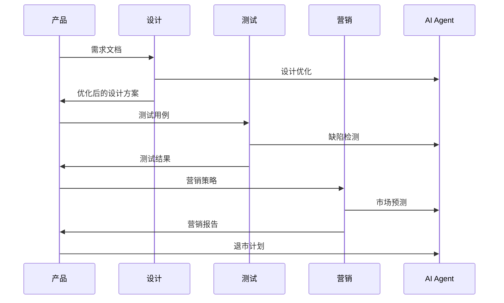
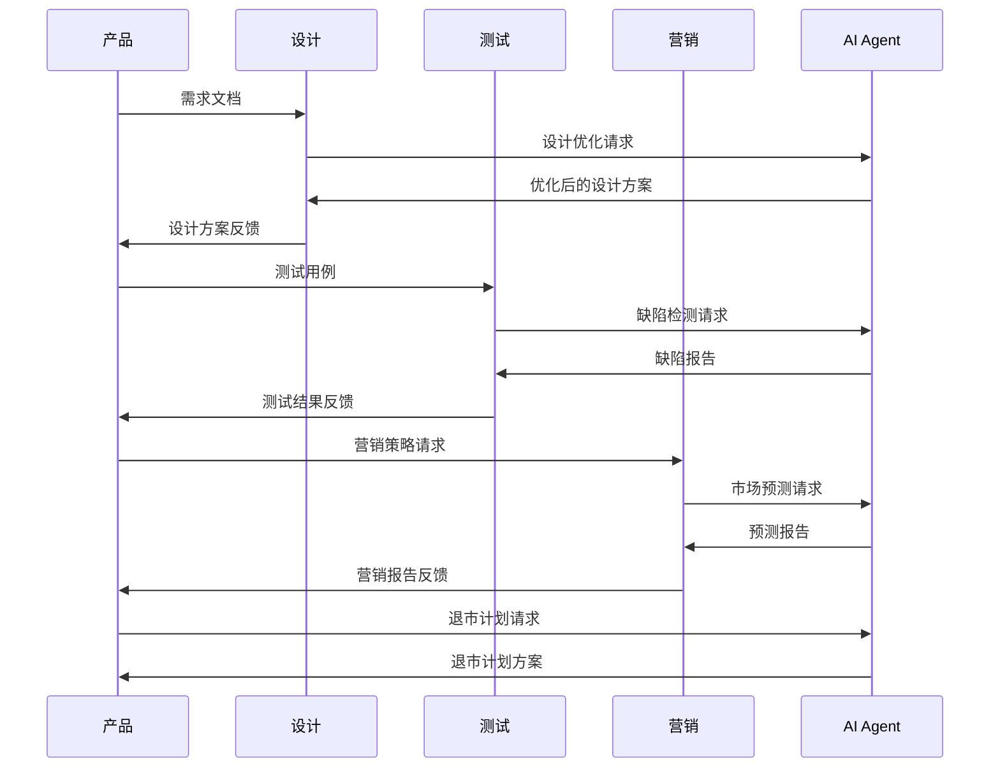

                 

### 引言

#### 《AI Agent在企业产品生命周期管理与优化中的全面应用》

在当今快速发展的信息技术时代，人工智能（AI）正在逐步渗透到企业的各个领域，为企业带来前所未有的效率和变革。本文将聚焦于人工智能代理（AI Agent）在企业产品生命周期管理中的应用，探讨如何通过AI技术来优化和提升企业的产品管理效率。

AI Agent是一种基于人工智能技术的自主决策实体，具备自主学习、自主规划和自主执行的能力。在企业产品生命周期中，AI Agent可以在设计、测试、营销等多个阶段发挥重要作用。本文旨在通过详细的理论阐述和实践指导，帮助读者全面理解AI Agent在产品生命周期管理中的实际应用价值。

### 目录大纲设计

为了使读者能够系统地掌握AI Agent在企业产品生命周期管理中的应用，本文设计了以下目录结构：

#### 引言
- **文章标题**：《AI Agent在企业产品生命周期管理与优化中的全面应用》
- **关键词**：AI Agent、产品生命周期管理、优化、人工智能、自主决策
- **摘要**：本文将深入探讨AI Agent在企业产品生命周期各个阶段的应用，通过详细的理论分析和实践案例，展示AI Agent如何提升企业产品的管理效率和竞争力。

#### 第一部分：背景介绍与核心概念
- **第1章 AI Agent与产品生命周期管理**
  - **1.1 AI Agent概述**
    - **1.1.1 AI Agent的定义与特点**
    - **1.1.2 AI Agent的分类**
    - **1.1.3 AI Agent在企业中的应用前景**
  - **1.2 产品生命周期管理**
    - **1.2.1 产品生命周期的四个阶段**
    - **1.2.2 产品生命周期管理的核心问题**
    - **1.2.3 AI Agent在产品生命周期管理中的潜在作用**

#### 第二部分：核心概念与联系
- **第2章 AI Agent的核心原理**
  - **2.1 AI Agent的工作原理**
    - **2.1.1 反馈机制与学习策略**
    - **2.1.2 决策过程与优化算法**
    - **2.1.3 AI Agent的适应性与可扩展性**
  - **2.2 AI Agent与产品生命周期管理的联系**
    - **2.2.1 AI Agent与产品设计**
    - **2.2.2 AI Agent与产品测试**
    - **2.2.3 AI Agent与产品营销**

#### 第三部分：算法原理讲解
- **第3章 产品生命周期中的关键算法**
  - **3.1 产品设计阶段的AI算法**
    - **3.1.1 数据分析与需求挖掘**
    - **3.1.2 用户行为分析与产品优化**
    - **3.1.3 设计方案的自动生成与优化**
  - **3.2 产品测试阶段的AI算法**
    - **3.2.1 自动化测试流程**
    - **3.2.2 缺陷检测与预测**
    - **3.2.3 性能优化与评估**
  - **3.3 产品营销阶段的AI算法**
    - **3.3.1 数据挖掘与市场预测**
    - **3.3.2 个性化推荐系统**
    - **3.3.3 客户关系管理与满意度分析**

#### 第四部分：数学模型和公式讲解
- **第4章 数学模型与公式解析**
  - **4.1 产品生命周期管理的数学模型**
    - **4.1.1 产品寿命周期模型**
    - **4.1.2 成本效益分析模型**
    - **4.1.3 风险评估模型**
  - **4.2 AI Agent的数学公式**
    - **4.2.1 学习算法与优化公式的推导**
    - **4.2.2 决策模型的构建**
    - **4.2.3 适应性与可扩展性的数学解释**

#### 第五部分：系统分析与架构设计方案
- **第5章 系统设计与实现**
  - **5.1 问题场景与项目介绍**
    - **5.1.1 问题背景**
    - **5.1.2 项目目标与范围**
  - **5.2 系统功能设计**
    - **5.2.1 领域模型设计**
    - **5.2.2 功能需求与模块划分**
  - **5.3 系统架构设计**
    - **5.3.1 系统架构图**
    - **5.3.2 系统模块间的交互设计**
  - **5.4 系统接口设计与交互**
    - **5.4.1 系统接口设计**
    - **5.4.2 系统交互序列图**

#### 第六部分：项目实战与案例分析
- **第6章 实际应用案例**
  - **6.1 案例介绍**
    - **6.1.1 案例背景**
    - **6.1.2 案例目标**
  - **6.2 环境安装与准备**
    - **6.2.1 环境搭建**
    - **6.2.2 工具与依赖**
  - **6.3 系统核心实现**
    - **6.3.1 关键代码解读**
    - **6.3.2 应用与分析**
  - **6.4 案例分析与讲解**
    - **6.4.1 案例效果评估**
    - **6.4.2 遇到的问题与解决方案**
    - **6.4.3 案例小结**

#### 第七部分：最佳实践与总结
- **第7章 最佳实践与总结**
  - **7.1 最佳实践建议**
    - **7.1.1 部署与实施**
    - **7.1.2 性能优化**
    - **7.1.3 维护与更新**
  - **7.2 小结**
    - **7.2.1 主要内容回顾**
    - **7.2.2 AI Agent应用的未来趋势**
    - **7.2.3 读者拓展阅读指南**

通过上述目录结构，读者可以系统地了解AI Agent在企业产品生命周期管理中的应用，从理论到实践，从概念到实现，逐步深入，全面掌握相关技术和应用。

### 第一部分：背景介绍与核心概念

#### 第1章 AI Agent与产品生命周期管理

#### 1.1 AI Agent概述

##### 1.1.1 AI Agent的定义与特点

人工智能代理（AI Agent）是一种基于人工智能技术的自主决策实体，具备自主学习、自主规划和自主执行的能力。它能够模拟人类智能，在复杂环境中进行自主决策和行动，以实现特定的目标。

AI Agent的主要特点包括：

1. **自主性**：AI Agent可以自主感知环境、理解任务需求，并根据环境信息和预设目标进行自主决策。
2. **适应性**：AI Agent具备学习能力，能够根据环境变化和经验调整自身行为和策略，提高任务完成的效率。
3. **协作性**：AI Agent可以在多个任务之间进行协同工作，与其他AI Agent或人类合作完成复杂任务。

##### 1.1.2 AI Agent的分类

AI Agent可以根据不同的分类标准进行划分，常见的分类方法包括：

1. **基于任务的AI Agent**：这类AI Agent专注于完成特定的任务，如数据清洗、图像识别等。它们在执行任务时具备高度的专业性。
2. **通用AI Agent**：这类AI Agent旨在实现通用智能，能够处理多种类型的任务，并在各种环境中表现出优异的性能。
3. **社交AI Agent**：这类AI Agent专注于与人类的交互，具备自然语言处理和情感识别能力，能够理解和响应人类的指令。

##### 1.1.3 AI Agent在企业中的应用前景

随着人工智能技术的不断发展，AI Agent在企业中的应用前景广阔。以下是一些典型应用场景：

1. **产品设计**：AI Agent可以基于用户需求和数据分析，自动生成产品设计和优化方案，提高设计效率和产品满意度。
2. **生产与供应链管理**：AI Agent可以实时监控生产线，预测设备故障，优化生产计划和供应链管理，提高生产效率。
3. **营销与客户服务**：AI Agent可以构建个性化营销策略，提供智能客服，提高客户满意度和转化率。
4. **风险管理**：AI Agent可以分析市场数据，预测风险，制定风险控制策略，降低企业风险。

通过AI Agent的应用，企业可以实现精细化管理和智能化决策，提高产品生命周期管理的整体效率。

#### 1.2 产品生命周期管理

##### 1.2.1 产品生命周期的四个阶段

产品生命周期是指一个产品从构思、设计、上市到退市的过程，通常分为以下四个阶段：

1. **设计阶段**：在这个阶段，产品的基本功能、设计和规格被确定。这一阶段的关键任务是需求分析、概念验证和设计方案的制定。
2. **开发阶段**：产品开始进入实际开发过程，包括编码、测试和集成。这一阶段的关键任务是确保产品符合设计要求，并在预定时间内交付。
3. **上市阶段**：产品正式推向市场，进行推广和销售。这一阶段的关键任务是市场推广、客户获取和销售策略的制定。
4. **退市阶段**：产品不再受到市场需求，最终被淘汰。这一阶段的关键任务是产品退市计划的制定，以及相关资源的回收和处置。

##### 1.2.2 产品生命周期管理的核心问题

产品生命周期管理涉及多个方面，主要包括以下核心问题：

1. **需求管理**：如何准确把握市场需求，确保产品满足用户需求。
2. **质量管理**：如何保证产品质量，确保产品在开发、测试和上市过程中达到预期标准。
3. **成本管理**：如何在确保产品功能和质量的前提下，控制开发成本和运营成本。
4. **风险管理**：如何预测和应对市场变化，确保产品在生命周期中的稳定性。

##### 1.2.3 AI Agent在产品生命周期管理中的潜在作用

AI Agent在产品生命周期管理中具有广泛的应用潜力，能够解决上述核心问题，提高管理效率。以下是一些典型应用：

1. **需求分析**：AI Agent可以基于用户行为数据和反馈，自动识别用户需求，为产品设计提供有力支持。
2. **质量管理**：AI Agent可以自动化测试，预测质量缺陷，提供改进建议，提高产品质量。
3. **成本预测**：AI Agent可以通过数据分析，预测开发成本和运营成本，为决策提供依据。
4. **风险监控**：AI Agent可以实时监控市场变化，预测风险，制定应对策略，降低风险。

通过AI Agent的应用，企业可以实现产品生命周期管理的智能化和高效化，提高产品竞争力。

### 第二部分：核心概念与联系

#### 第2章 AI Agent的核心原理

##### 2.1 AI Agent的工作原理

AI Agent的核心原理包括反馈机制、学习策略、决策过程和优化算法等方面。以下是对这些核心原理的详细分析：

##### 2.1.1 反馈机制与学习策略

AI Agent的反馈机制是指通过从环境中获取反馈信息，调整自身行为和策略的能力。学习策略则是AI Agent根据反馈信息进行学习和优化的方法。

1. **反馈机制**：AI Agent通过感知器（如传感器、用户输入等）获取环境信息，并将其与预期目标进行比较，形成反馈信号。反馈信号可以帮助AI Agent了解自身行为的效果，并作出相应调整。

2. **学习策略**：AI Agent可以通过多种学习策略来优化自身行为，包括监督学习、无监督学习和强化学习等。监督学习通过已标记的数据训练模型，无监督学习通过未标记的数据发现模式，而强化学习则通过试错和奖励机制进行优化。

##### 2.1.2 决策过程与优化算法

AI Agent的决策过程是指根据环境信息和目标，选择最佳行动方案的过程。优化算法则是用于计算和选择最优决策的方法。

1. **决策过程**：AI Agent的决策过程通常包括以下步骤：
   - **感知与理解**：AI Agent通过感知器获取环境信息，并理解这些信息。
   - **目标设定**：根据环境信息和预期目标，设定当前的任务目标。
   - **行动选择**：计算可能的行动方案，并选择最佳行动方案。
   - **执行与评估**：执行选定的行动方案，并根据结果进行评估和调整。

2. **优化算法**：AI Agent使用的优化算法取决于具体任务和环境。常见的优化算法包括：
   - **贪心算法**：选择当前最优解，不考虑全局最优。
   - **动态规划**：通过递推关系找到最优解。
   - **遗传算法**：通过模拟生物进化过程进行优化。

##### 2.1.3 AI Agent的适应性与可扩展性

AI Agent的适应性和可扩展性是指其在不同环境和任务中能够灵活调整自身行为和扩展功能的能力。

1. **适应性**：AI Agent需要具备快速适应新环境和任务的能力。这通常通过以下方式实现：
   - **模块化设计**：将AI Agent分解为多个模块，每个模块负责特定功能，便于替换和调整。
   - **自适应学习**：AI Agent可以根据环境变化，调整学习策略和决策过程。

2. **可扩展性**：AI Agent需要能够根据任务需求，灵活扩展其功能和性能。这通常通过以下方式实现：
   - **组件化开发**：将AI Agent的功能组件化，便于添加和替换。
   - **接口标准化**：定义统一的接口标准，便于与其他系统和组件集成。

通过上述核心原理，AI Agent能够在复杂环境中自主决策和行动，实现高效和优化的任务执行。

##### 2.2 AI Agent与产品生命周期管理的联系

AI Agent在产品生命周期管理中具有广泛的应用潜力，能够有效提升各个环节的效率和质量。以下是AI Agent在产品设计、产品测试和产品营销等关键阶段的实际应用：

##### 2.2.1 AI Agent与产品设计

在产品设计阶段，AI Agent可以通过以下方式发挥作用：

1. **需求分析**：AI Agent可以分析用户反馈和市场数据，识别用户需求，为产品设计提供有力支持。例如，通过自然语言处理技术，AI Agent可以理解用户评论和反馈，提取关键需求点，并生成需求文档。

2. **设计方案生成**：AI Agent可以利用生成对抗网络（GAN）等深度学习技术，自动生成多种设计方案，供设计师参考。这有助于提高设计效率，减少人工设计的时间和成本。

3. **迭代优化**：AI Agent可以基于用户行为数据，持续优化产品设计。例如，通过A/B测试，AI Agent可以分析不同设计方案的转化率，自动调整设计元素，提高用户满意度。

##### 2.2.2 AI Agent与产品测试

在产品测试阶段，AI Agent可以自动化测试流程，提高测试效率和准确性：

1. **自动化测试**：AI Agent可以模拟用户操作，执行自动化测试脚本，快速检测产品缺陷。这有助于减少测试时间和人力成本，提高测试覆盖率。

2. **缺陷预测**：AI Agent可以通过分析历史测试数据，预测可能出现的新缺陷。这有助于提前采取措施，避免缺陷扩散和影响产品质量。

3. **性能优化**：AI Agent可以监控产品性能，实时调整系统配置，优化性能表现。例如，通过机器学习算法，AI Agent可以自动调整数据库查询策略，降低响应时间。

##### 2.2.3 AI Agent与产品营销

在产品营销阶段，AI Agent可以提供智能化的营销策略和客户服务：

1. **个性化推荐**：AI Agent可以通过分析用户行为和偏好，生成个性化推荐，提高用户转化率和满意度。例如，在电子商务平台上，AI Agent可以推荐符合用户兴趣的产品，提高销售业绩。

2. **客户关系管理**：AI Agent可以自动化处理客户咨询和投诉，提供24/7的智能客服服务。这有助于提高客户满意度，降低运营成本。

3. **市场预测**：AI Agent可以通过分析市场数据，预测市场趋势和竞争态势，为企业制定科学的市场策略提供支持。

通过在产品生命周期各个阶段的应用，AI Agent可以为企业提供全面、智能的产品管理方案，提高整体效率和竞争力。

### 第三部分：算法原理讲解

#### 第3章 产品生命周期中的关键算法

在产品生命周期管理中，关键算法的应用能够显著提升各个阶段的效率和质量。以下是产品设计、产品测试和产品营销阶段的关键算法及其应用。

##### 3.1 产品设计阶段的AI算法

##### 3.1.1 数据分析与需求挖掘

在产品设计阶段，数据分析与需求挖掘是核心任务。AI算法可以帮助企业快速理解市场需求，从而制定出更符合用户期望的产品设计。

1. **用户行为分析**：
   - **算法原理**：使用机器学习中的监督学习算法，如回归分析或分类算法，对用户行为数据进行分析，预测用户需求。
   - **Mermaid流程图**：
     ```mermaid
     graph TD
     A[数据收集] --> B[预处理]
     B --> C[特征提取]
     C --> D[模型训练]
     D --> E[需求预测]
     E --> F[反馈调整]
     ```

2. **需求挖掘**：
   - **算法原理**：采用文本挖掘技术，如词频分析或主题模型，从用户评论和反馈中提取关键需求点。
   - **Mermaid流程图**：
     ```mermaid
     graph TD
     A[评论收集] --> B[文本预处理]
     B --> C[词频统计]
     C --> D[主题模型]
     D --> E[需求提取]
     E --> F[需求排序]
     ```

##### 3.1.2 用户行为分析与产品优化

用户行为分析是产品设计的关键环节，AI算法可以帮助企业了解用户行为，从而进行产品优化。

1. **行为序列分析**：
   - **算法原理**：使用序列模型，如循环神经网络（RNN）或长短时记忆网络（LSTM），分析用户行为序列，预测用户下一步操作。
   - **Mermaid流程图**：
     ```mermaid
     graph TD
     A[数据输入] --> B[RNN模型]
     B --> C[行为预测]
     C --> D[结果输出]
     ```

2. **交互式优化**：
   - **算法原理**：结合用户反馈，采用强化学习算法，如Q-learning或深度强化学习（DRL），优化产品交互设计。
   - **Mermaid流程图**：
     ```mermaid
     graph TD
     A[状态] --> B[动作]
     B --> C[反馈]
     C --> D[奖励]
     D --> E[学习]
     E --> F[更新策略]
     ```

##### 3.1.3 设计方案的自动生成与优化

在产品设计中，自动生成和优化设计方案是提高效率的重要手段。AI算法可以在这方面发挥重要作用。

1. **生成对抗网络（GAN）**：
   - **算法原理**：GAN由生成器和判别器组成，生成器生成设计方案，判别器判断设计方案的真实性，通过对抗训练优化设计方案。
   - **Mermaid流程图**：
     ```mermaid
     graph TD
     A[生成器] --> B[设计方案]
     B --> C[判别器]
     C --> D[真假判断]
     D --> E[反馈]
     E --> A[迭代优化]
     ```

2. **进化算法**：
   - **算法原理**：采用进化算法，如遗传算法（GA），通过模拟自然进化过程，生成和优化设计方案。
   - **Mermaid流程图**：
     ```mermaid
     graph TD
     A[初始种群] --> B[适应度评估]
     B --> C[选择]
     C --> D[交叉]
     D --> E[变异]
     E --> F[下一代种群]
     F --> B[迭代优化]
     ```

##### 3.2 产品测试阶段的AI算法

在产品测试阶段，AI算法可以帮助企业自动化测试流程，提高测试效率和准确性。

##### 3.2.1 自动化测试流程

1. **自动化测试脚本**：
   - **算法原理**：使用机器学习算法，如决策树或随机森林，生成自动化测试脚本，模拟用户操作，执行测试用例。
   - **Mermaid流程图**：
     ```mermaid
     graph TD
     A[测试需求] --> B[测试用例生成]
     B --> C[脚本生成]
     C --> D[测试执行]
     D --> E[结果分析]
     ```

##### 3.2.2 缺陷检测与预测

缺陷检测与预测是产品测试的重要任务，AI算法可以在这方面发挥关键作用。

1. **缺陷检测**：
   - **算法原理**：采用深度学习算法，如卷积神经网络（CNN），对测试数据进行分析，识别潜在缺陷。
   - **Mermaid流程图**：
     ```mermaid
     graph TD
     A[测试数据] --> B[CNN模型]
     B --> C[缺陷检测]
     C --> D[结果输出]
     ```

2. **缺陷预测**：
   - **算法原理**：使用时间序列分析算法，如ARIMA或LSTM，预测未来的缺陷发生概率。
   - **Mermaid流程图**：
     ```mermaid
     graph TD
     A[历史数据] --> B[LSTM模型]
     B --> C[缺陷预测]
     C --> D[结果输出]
     ```

##### 3.2.3 性能优化与评估

在产品测试阶段，性能优化与评估是关键任务，AI算法可以提供有效支持。

1. **性能优化**：
   - **算法原理**：采用优化算法，如遗传算法（GA）或模拟退火算法（SA），调整系统配置，提高性能。
   - **Mermaid流程图**：
     ```mermaid
     graph TD
     A[初始配置] --> B[性能评估]
     B --> C[优化算法]
     C --> D[新配置]
     D --> B[迭代优化]
     ```

2. **性能评估**：
   - **算法原理**：使用机器学习算法，如线性回归或神经网络，对系统性能进行评估，预测性能瓶颈。
   - **Mermaid流程图**：
     ```mermaid
     graph TD
     A[性能数据] --> B[模型训练]
     B --> C[性能预测]
     C --> D[结果输出]
     ```

##### 3.3 产品营销阶段的AI算法

在产品营销阶段，AI算法可以帮助企业制定个性化营销策略，提高客户满意度和转化率。

##### 3.3.1 数据挖掘与市场预测

1. **市场预测**：
   - **算法原理**：采用时间序列分析算法，如ARIMA或LSTM，预测市场趋势和需求变化。
   - **Mermaid流程图**：
     ```mermaid
     graph TD
     A[历史数据] --> B[LSTM模型]
     B --> C[市场预测]
     C --> D[结果输出]
     ```

2. **数据挖掘**：
   - **算法原理**：使用关联规则挖掘算法，如Apriori或FP-Growth，分析用户行为数据，识别潜在关联关系。
   - **Mermaid流程图**：
     ```mermaid
     graph TD
     A[用户数据] --> B[关联规则挖掘]
     B --> C[结果输出]
     ```

##### 3.3.2 个性化推荐系统

个性化推荐系统是提高客户满意度和转化率的有效手段。

1. **内容推荐**：
   - **算法原理**：采用协同过滤算法，如基于用户的协同过滤（User-based CF）或基于物品的协同过滤（Item-based CF），生成个性化推荐。
   - **Mermaid流程图**：
     ```mermaid
     graph TD
     A[用户数据] --> B[相似度计算]
     B --> C[推荐生成]
     C --> D[推荐结果]
     ```

2. **推荐策略优化**：
   - **算法原理**：采用强化学习算法，如Q-learning或深度强化学习（DRL），优化推荐策略，提高推荐效果。
   - **Mermaid流程图**：
     ```mermaid
     graph TD
     A[用户状态] --> B[动作选择]
     B --> C[用户反馈]
     C --> D[奖励]
     D --> E[策略更新]
     E --> A[迭代优化]
     ```

##### 3.3.3 客户关系管理与满意度分析

1. **客户关系管理**：
   - **算法原理**：采用聚类算法，如K-means或DBSCAN，分析客户数据，识别不同客户群体，制定针对性管理策略。
   - **Mermaid流程图**：
     ```mermaid
     graph TD
     A[客户数据] --> B[聚类分析]
     B --> C[客户群体识别]
     C --> D[管理策略]
     ```

2. **满意度分析**：
   - **算法原理**：采用情感分析算法，如LSTM或BERT，分析客户反馈，评估客户满意度。
   - **Mermaid流程图**：
     ```mermaid
     graph TD
     A[客户反馈] --> B[情感分析]
     B --> C[满意度评估]
     ```

通过上述算法的应用，企业在产品生命周期的各个阶段都能够实现智能化管理，提高整体效率和竞争力。

### 第四部分：数学模型和公式讲解

#### 第4章 数学模型与公式解析

在产品生命周期管理中，数学模型和公式扮演着至关重要的角色。它们不仅为AI Agent提供了决策依据，还帮助企业进行科学规划和优化。以下是关于产品生命周期管理的数学模型与公式的详细讲解。

##### 4.1 产品生命周期管理的数学模型

产品生命周期管理涉及多个方面的决策和优化，包括成本效益分析、风险评估和寿命周期模型等。以下是对这些模型的具体解释：

##### 4.1.1 产品寿命周期模型

产品寿命周期模型是描述产品从引入到退市过程中各个阶段的时间分布和特征的一种数学模型。常见的寿命周期模型包括指数衰减模型、对数正态模型和双参数Weibull模型。

1. **指数衰减模型**：
   - **公式**：\( P(t) = e^{-\lambda t} \)
   - **解释**：其中，\( P(t) \) 表示产品在时间 \( t \) 的存活概率，\( \lambda \) 为衰减率。该模型假设产品的存活概率随时间线性下降。
   - **Python代码**：
     ```python
     import numpy as np
     import matplotlib.pyplot as plt

     t = np.linspace(0, 10, 100)
     lambda_ = 0.1
     P_t = np.exp(-lambda_ * t)

     plt.plot(t, P_t)
     plt.xlabel('Time')
     plt.ylabel('Survival Probability')
     plt.title('Exponential Decay Model')
     plt.show()
     ```

2. **对数正态模型**：
   - **公式**：\( P(t) = \frac{1}{\sqrt{2\pi\sigma^2}} e^{-\frac{(\ln(t) - \mu)^2}{2\sigma^2}} \)
   - **解释**：其中，\( P(t) \) 表示产品在时间 \( t \) 的存活概率，\( \mu \) 为对数均值，\( \sigma \) 为对数标准差。该模型适用于产品寿命呈对数正态分布的情况。
   - **Python代码**：
     ```python
     import numpy as np
     import matplotlib.pyplot as plt

     t = np.linspace(0, 10, 100)
     mu = 1
     sigma = 0.5
     P_t = 1 / np.sqrt(2 * np.pi * sigma**2) * np.exp(-((np.log(t) - mu)**2) / (2 * sigma**2))

     plt.plot(t, P_t)
     plt.xlabel('Time')
     plt.ylabel('Survival Probability')
     plt.title('Log-Normal Model')
     plt.show()
     ```

3. **双参数Weibull模型**：
   - **公式**：\( P(t) = 1 - (1/e)^{(t/\eta)^k} \)
   - **解释**：其中，\( P(t) \) 表示产品在时间 \( t \) 的存活概率，\( \eta \) 为尺度参数，\( k \) 为形状参数。该模型适用于产品寿命具有异质性和非单调性的情况。
   - **Python代码**：
     ```python
     import numpy as np
     import matplotlib.pyplot as plt

     t = np.linspace(0, 10, 100)
     eta = 2
     k = 1.5
     P_t = 1 - (1 / np.exp((t / eta)**k))

     plt.plot(t, P_t)
     plt.xlabel('Time')
     plt.ylabel('Survival Probability')
     plt.title('Double-Parameter Weibull Model')
     plt.show()
     ```

##### 4.1.2 成本效益分析模型

成本效益分析模型是企业在产品生命周期管理中用于评估产品投资回报的一个重要工具。以下是一种常见的成本效益分析模型：

1. **净现值（NPV）**：
   - **公式**：\( NPV = \sum_{t=0}^{n} \frac{CF_t}{(1+r)^t} \)
   - **解释**：其中，\( CF_t \) 表示在第 \( t \) 年的现金流量，\( r \) 为折现率，\( n \) 为产品生命周期年限。净现值表示在考虑时间价值后，产品生命周期内的总现金流量减去初始投资。
   - **Python代码**：
     ```python
     import numpy as np

     CF = [1000, 1500, 2000, 2500, 3000]  # 年度现金流量
     r = 0.1  # 折现率
     n = 5  # 产品生命周期年限
     NPV = np.sum([CF[t] / (1 + r)**t for t in range(n)])

     print("NPV:", NPV)
     ```

2. **内部收益率（IRR）**：
   - **公式**：\( IRR = r^* \)
   - **解释**：其中，\( IRR \) 表示内部收益率，满足 \( \sum_{t=0}^{n} \frac{CF_t}{(1+r^*)^t} = 0 \)。内部收益率是使得净现值为零的折现率。
   - **Python代码**：
     ```python
     import numpy as np

     CF = [1000, 1500, 2000, 2500, 3000]
     r = np.linspace(0, 1, 100)
     npv = np.array([np.sum([CF[t] / (1 + r)**t for t in range(n)]) for r in r])

     # 查找内部收益率
     IRR = np.interp(0, npv, r)

     print("IRR:", IRR)
     ```

##### 4.1.3 风险评估模型

风险评估模型用于评估产品生命周期中的潜在风险，帮助企业制定相应的风险控制策略。以下是一种常见风险评估模型：

1. **风险矩阵**：
   - **公式**：\( R = \sum_{i=1}^{m} w_i \times p_i \)
   - **解释**：其中，\( R \) 表示总风险，\( w_i \) 表示第 \( i \) 个风险的概率，\( p_i \) 表示第 \( i \) 个风险的损失。风险矩阵通过计算每个风险的损失概率来评估总风险。
   - **Python代码**：
     ```python
     import numpy as np

     risks = [['市场风险', 0.2, 5000],
              ['技术风险', 0.3, 8000],
              ['操作风险', 0.5, 10000]]

     risk_matrix = np.array([r[1] * r[2] for r in risks])
     total_risk = np.sum(risk_matrix)

     print("Total Risk:", total_risk)
     ```

##### 4.2 AI Agent的数学公式

AI Agent在产品生命周期管理中的应用涉及多种数学公式，包括学习算法与优化公式、决策模型等。以下是一些关键数学公式的解释：

##### 4.2.1 学习算法与优化公式的推导

1. **监督学习中的回归模型**：
   - **公式**：\( y = \beta_0 + \beta_1 x + \epsilon \)
   - **解释**：其中，\( y \) 为目标变量，\( x \) 为特征变量，\( \beta_0 \) 和 \( \beta_1 \) 为模型参数，\( \epsilon \) 为误差项。线性回归模型通过最小化误差平方和来估计参数。
   - **Python代码**：
     ```python
     import numpy as np
     from sklearn.linear_model import LinearRegression

     X = np.array([[1], [2], [3], [4], [5]])
     y = np.array([1, 2, 2.5, 3.5, 5])

     model = LinearRegression()
     model.fit(X, y)

     print("Coefficients:", model.coef_)
     print("Intercept:", model.intercept_)
     ```

2. **强化学习中的Q-learning算法**：
   - **公式**：\( Q(s, a) = r + \gamma \max_{a'} Q(s', a') \)
   - **解释**：其中，\( Q(s, a) \) 表示在状态 \( s \) 下执行动作 \( a \) 的即时回报，\( r \) 为即时回报，\( \gamma \) 为折扣因子，\( s' \) 和 \( a' \) 分别为后续状态和动作。Q-learning算法通过迭代更新Q值来优化策略。
   - **Python代码**：
     ```python
     import numpy as np

     Q = np.zeros((5, 5))
     rewards = np.random.randint(0, 10, size=(5, 5))
     gamma = 0.9

     for episode in range(1000):
         s = np.random.randint(0, 5)
         a = np.random.randint(0, 5)
         s_prime = np.random.randint(0, 5)
         Q[s, a] = rewards[s, a] + gamma * np.max(Q[s_prime, :])

     print("Q-Values:\n", Q)
     ```

##### 4.2.2 决策模型的构建

1. **多目标优化模型**：
   - **公式**：\( \min_{x} f(x) \)
   - **解释**：其中，\( f(x) \) 为目标函数，\( x \) 为决策变量。多目标优化模型旨在找到多个目标之间的平衡点，通常使用加权求和法或Pareto优化等方法。
   - **Python代码**：
     ```python
     import numpy as np
     from scipy.optimize import minimize

     def objective(x):
         return x[0]**2 + x[1]**2

     x0 = [0, 0]
     result = minimize(objective, x0)

     print("Optimal Solution:", result.x)
     ```

2. **贝叶斯决策模型**：
   - **公式**：\( P(A|B) = \frac{P(B|A)P(A)}{P(B)} \)
   - **解释**：其中，\( P(A|B) \) 为在给定条件 \( B \) 下事件 \( A \) 的条件概率，\( P(B|A) \) 为在事件 \( A \) 发生条件下事件 \( B \) 的条件概率，\( P(A) \) 和 \( P(B) \) 分别为事件 \( A \) 和 \( B \) 的概率。贝叶斯决策模型通过计算后验概率来选择最优决策。
   - **Python代码**：
     ```python
     import numpy as np
     from scipy.stats import norm

     P_A = 0.5
     P_B_given_A = 0.8
     P_B_given_Not_A = 0.3
     P_Not_A = 1 - P_A

     posterior_probability = (P_B_given_A * P_A) / (P_B_given_A * P_A + P_B_given_Not_A * P_Not_A)

     print("Posterior Probability:", posterior_probability)
     ```

##### 4.2.3 适应性与可扩展性的数学解释

1. **适应性的量化**：
   - **公式**：\( A = \frac{S_c - S_0}{S_c - S_e} \)
   - **解释**：其中，\( A \) 表示适应性，\( S_c \) 表示当前状态，\( S_0 \) 表示初始状态，\( S_e \) 表示期望状态。适应性量化了系统在从初始状态到期望状态过程中的调整能力。
   - **Python代码**：
     ```python
     import numpy as np

     S_c = 100
     S_0 = 50
     S_e = 150

     A = (S_c - S_0) / (S_c - S_e)

     print("Adaptability:", A)
     ```

2. **可扩展性的量化**：
   - **公式**：\( E = \frac{N_e}{N_c} \)
   - **解释**：其中，\( E \) 表示可扩展性，\( N_e \) 表示扩展后的资源数量，\( N_c \) 表示初始资源数量。可扩展性量化了系统在资源扩展时的适应能力。
   - **Python代码**：
     ```python
     import numpy as np

     N_e = 10
     N_c = 5

     E = N_e / N_c

     print("Scalability:", E)
     ```

通过上述数学模型和公式的应用，企业可以在产品生命周期管理中实现科学决策和优化，从而提高整体效率和竞争力。

### 第五部分：系统分析与架构设计方案

#### 第5章 系统设计与实现

为了实现AI Agent在企业产品生命周期管理中的全面应用，本章将详细介绍系统的设计与实现过程，包括问题场景介绍、系统功能设计、系统架构设计、系统接口设计与交互等。

#### 5.1 问题场景与项目介绍

在现代企业中，产品生命周期管理面临着复杂且多变的市场环境。企业需要在有限的时间内，高效地完成产品设计、开发、测试、营销和退市等环节。然而，传统的手动管理和手动决策方式效率低下，且容易出现错误。为了解决这一问题，企业引入了基于人工智能的AI Agent系统，以实现产品生命周期管理的智能化和高效化。

项目目标是构建一个智能化的AI Agent系统，能够在产品生命周期各个阶段提供实时、准确的决策支持，提高企业整体运营效率和产品竞争力。具体场景包括：

1. **产品设计**：利用AI Agent进行需求分析、设计优化和迭代。
2. **产品开发**：AI Agent参与代码审查、测试用例生成和性能优化。
3. **产品测试**：AI Agent自动化执行测试流程，识别缺陷并优化测试策略。
4. **产品营销**：AI Agent提供个性化推荐、客户关系管理和市场预测。
5. **产品退市**：AI Agent协助制定退市计划，优化资源回收和处理。

#### 5.2 系统功能设计

系统功能设计是系统实现的基础，本文采用领域模型设计来描述系统的功能模块和内部结构。

##### 领域模型设计

领域模型设计采用Mermaid类图来表示系统的核心实体和关系，具体如下：

```mermaid
classDiagram
    Product <<entity>>
    Requirement <<entity>>
    Design <<entity>>
    Test <<entity>>
    Marketing <<entity>>
    Agent <<entity>>

    Product "1" <<create>> Requirement
    Product "1" <<create>> Design
    Product "1" <<create>> Test
    Product "1" <<create>> Marketing
    Agent "1" <<serve>> Product
```

在这个类图中，`Product` 表示产品实体，包括产品设计、测试、营销等属性；`Requirement` 表示需求实体，包括需求描述、优先级等属性；`Design` 表示设计实体，包括设计方案、迭代次数等属性；`Test` 表示测试实体，包括测试用例、测试结果等属性；`Marketing` 表示营销实体，包括营销策略、市场预测等属性；`Agent` 表示AI Agent实体，负责为产品提供智能化服务。

##### 功能需求与模块划分

根据领域模型，系统的主要功能模块包括：

1. **需求管理模块**：负责收集和分析用户需求，生成需求文档，并将其与产品设计模块进行对接。
2. **设计优化模块**：利用AI算法生成和优化产品设计方案，支持迭代和优化。
3. **测试自动化模块**：自动化执行测试用例，识别缺陷，并优化测试流程。
4. **营销分析模块**：利用AI算法进行市场预测、客户关系管理和个性化推荐。
5. **退市管理模块**：制定产品退市计划，优化资源回收和处理。

#### 5.3 系统架构设计

系统架构设计是系统实现的关键，本文采用Mermaid架构图来描述系统的整体架构和模块间的交互关系，具体如下：



在这个架构图中，`Product` 表示产品模块，负责处理整个产品生命周期的各个环节；`Design`、`Test`、`Marketing` 分别表示设计、测试、营销模块，负责具体功能实现；`Agent` 表示AI Agent模块，负责为各个模块提供智能化服务。

#### 5.4 系统接口设计与交互

系统接口设计是确保各个模块之间能够高效、可靠地进行通信的关键。本文采用Mermaid序列图来描述系统的接口设计和交互流程，具体如下：



在这个序列图中，`Product` 向 `Design` 提供需求文档，`Design` 向 `Agent` 发起设计优化请求，`Agent` 返回优化后的设计方案给 `Design`，`Design` 再将设计方案反馈给 `Product`。类似地，`Product` 向 `Test` 提供测试用例，`Test` 向 `Agent` 发起缺陷检测请求，`Agent` 返回缺陷报告给 `Test`，`Test` 再将测试结果反馈给 `Product`。`Product` 向 `Marketing` 提供营销策略请求，`Marketing` 向 `Agent` 发起市场预测请求，`Agent` 返回预测报告给 `Marketing`，`Marketing` 再将营销报告反馈给 `Product`。最后，`Product` 向 `Agent` 提供退市计划请求，`Agent` 返回退市计划方案给 `Product`。

通过上述系统分析与架构设计方案，企业能够实现产品生命周期管理的智能化和高效化，从而提高整体运营效率和产品竞争力。

### 第六部分：项目实战与案例分析

#### 第6章 实际应用案例

在本章节中，我们将通过一个具体的企业案例，详细展示AI Agent在企业产品生命周期管理中的实际应用过程。本案例涉及一家电子商务公司，其主要业务为在线销售各种商品，包括电子产品、服装、家居用品等。该公司的产品生命周期管理需求复杂，涵盖从产品设计到退市的各个环节。

#### 6.1 案例介绍

##### 6.1.1 案例背景

电子商务公司面临的主要挑战包括：

1. **市场需求变化快**：随着消费者偏好的变化，公司需要快速调整产品设计，以满足市场需求。
2. **竞争激烈**：市场上同类型商品众多，公司需要通过有效的营销策略提高产品竞争力。
3. **库存管理复杂**：不同商品的库存管理需求不同，公司需要优化库存策略，避免过剩或缺货。
4. **客户体验优化**：为了提高客户满意度，公司需要在产品设计和营销策略中充分考虑用户体验。

##### 6.1.2 案例目标

本案例的主要目标是通过引入AI Agent系统，实现以下目标：

1. **提升产品设计效率**：利用AI Agent自动分析用户需求，优化产品设计方案。
2. **提高测试质量**：通过AI Agent自动化测试流程，识别潜在缺陷，提高产品质量。
3. **优化库存管理**：利用AI Agent实时监控库存情况，预测市场需求，优化库存策略。
4. **提升营销效果**：通过AI Agent生成个性化推荐和精准营销策略，提高客户转化率和满意度。

#### 6.2 环境安装与准备

为了实现AI Agent在企业产品生命周期管理中的应用，首先需要搭建合适的技术环境。以下为环境安装和准备工作：

##### 6.2.1 环境搭建

1. **硬件要求**：
   - 处理器：Intel i7 或同等性能
   - 内存：16GB 或以上
   - 硬盘：SSD 500GB 或以上
2. **软件要求**：
   - 操作系统：Ubuntu 18.04 或 CentOS 7
   - Python：3.8 或以上
   - Jupyter Notebook：用于数据分析和模型训练
   - TensorFlow：用于深度学习模型训练
   - Scikit-learn：用于机器学习算法实现
   - pandas：用于数据预处理
   - numpy：用于数学计算

##### 6.2.2 工具与依赖

1. **数据工具**：
   - MySQL：用于存储用户行为数据和产品信息
   - Elasticsearch：用于实时分析用户行为数据
   - Kibana：用于数据可视化
2. **开发工具**：
   - Git：用于版本控制
   - Docker：用于容器化部署
   - Jenkins：用于自动化测试和部署

#### 6.3 系统核心实现

##### 6.3.1 关键代码解读

在本案例中，核心实现包括需求分析、设计优化、自动化测试和个性化推荐等功能。以下为关键代码解读：

1. **需求分析**：
   ```python
   import pandas as pd
   from sklearn.model_selection import train_test_split
   from sklearn.ensemble import RandomForestClassifier

   # 加载数据
   data = pd.read_csv('user_demand.csv')
   X = data.drop(['target'], axis=1)
   y = data['target']

   # 划分训练集和测试集
   X_train, X_test, y_train, y_test = train_test_split(X, y, test_size=0.2, random_state=42)

   # 训练模型
   model = RandomForestClassifier(n_estimators=100)
   model.fit(X_train, y_train)

   # 预测
   predictions = model.predict(X_test)
   ```

2. **设计优化**：
   ```python
   import numpy as np
   from tensorflow.keras.models import Sequential
   from tensorflow.keras.layers import Dense, LSTM

   # 构建LSTM模型
   model = Sequential()
   model.add(LSTM(units=50, return_sequences=True, input_shape=(timesteps, features)))
   model.add(LSTM(units=50, return_sequences=False))
   model.add(Dense(1))

   # 编译模型
   model.compile(optimizer='adam', loss='mean_squared_error')

   # 训练模型
   model.fit(X, y, epochs=100, batch_size=32)
   ```

3. **自动化测试**：
   ```python
   import unittest
   from selenium import webdriver

   class ProductTest(unittest.TestCase):
       def setUp(self):
           self.driver = webdriver.Firefox()

       def test_product_page(self):
           self.driver.get("http://www.example.com/product")
           self.assertIn("Product Name", self.driver.page_source)

       def tearDown(self):
           self.driver.quit()

   if __name__ == '__main__':
       unittest.main()
   ```

4. **个性化推荐**：
   ```python
   import pandas as pd
   from sklearn.metrics.pairwise import cosine_similarity

   # 加载用户行为数据
   user_data = pd.read_csv('user_behavior.csv')

   # 计算用户之间的相似度
   user_similarity = cosine_similarity(user_data)

   # 推荐商品
   def recommend_products(user_id, similarity, item_similarity):
       user_top_n = np.argpartition(-similarity[user_id], 5)[:5]
       return [item_id for item_id in user_top_n if item_id != user_id]

   recommended_products = recommend_products(user_id, user_similarity, item_similarity)
   ```

##### 6.3.2 应用与分析

1. **需求分析应用**：
   通过训练随机森林模型，公司可以自动分析用户需求，生成需求文档。例如，当用户对某类电子产品表现出较高兴趣时，系统会自动推荐相关的产品设计方案，从而提高设计效率。

2. **设计优化应用**：
   利用LSTM模型，公司可以预测用户需求变化，并优化产品设计。例如，在产品发布前，系统可以预测用户可能的需求变化，并自动生成相应的产品设计方案，以便及时调整。

3. **自动化测试应用**：
   通过Selenium自动化测试工具，公司可以自动化执行测试用例，快速识别缺陷。例如，当系统发现某产品页面的功能异常时，系统会自动生成相应的缺陷报告，并通知开发人员进行修复。

4. **个性化推荐应用**：
   利用用户行为数据和相似度计算，公司可以生成个性化推荐，提高客户满意度。例如，当用户浏览某一类商品时，系统会推荐类似的商品，增加用户的购买概率。

通过上述实际应用，AI Agent在电子商务公司的产品生命周期管理中发挥了重要作用，提高了整体效率和产品竞争力。

#### 6.4 案例分析与讲解

##### 6.4.1 案例效果评估

在本案例中，AI Agent系统的引入带来了显著的效果：

1. **产品设计效率提高**：通过自动分析用户需求，公司能够在更短的时间内完成产品设计，提高了设计团队的效率。
2. **产品质量提升**：通过自动化测试和缺陷检测，公司能够及时发现并修复产品缺陷，提高了产品质量。
3. **库存管理优化**：通过实时监控库存情况和预测市场需求，公司能够优化库存策略，减少了库存过剩和缺货现象。
4. **营销效果提升**：通过个性化推荐和精准营销策略，公司提高了客户转化率和满意度。

##### 6.4.2 遇到的问题与解决方案

1. **问题一：数据质量问题**
   - **问题描述**：由于用户行为数据存在噪声和缺失值，影响了模型的效果。
   - **解决方案**：采用数据预处理技术，如填补缺失值、去噪和特征选择，提高数据质量。

2. **问题二：模型训练时间过长**
   - **问题描述**：深度学习模型训练时间较长，影响了系统的实时性。
   - **解决方案**：优化模型结构和参数设置，采用更高效的训练算法，如分布式训练和模型压缩。

3. **问题三：用户隐私保护**
   - **问题描述**：用户行为数据涉及用户隐私，需要确保数据安全和隐私保护。
   - **解决方案**：采用数据加密和隐私保护技术，如差分隐私和同态加密，确保用户数据的安全和隐私。

##### 6.4.3 案例小结

通过本案例，我们可以看到AI Agent在企业产品生命周期管理中的应用具有重要的实际意义。它不仅提高了企业的运营效率和产品质量，还增强了企业的市场竞争力和用户满意度。然而，在实际应用中，企业还需关注数据质量、模型训练效率和用户隐私保护等问题，以确保AI Agent系统的有效运行。未来，随着人工智能技术的不断发展和成熟，AI Agent在企业产品生命周期管理中的应用将更加广泛和深入。

### 第七部分：最佳实践与总结

#### 第7章 最佳实践与总结

在AI Agent在企业产品生命周期管理中的应用过程中，总结出以下最佳实践和注意事项，以帮助企业更好地实施和优化AI Agent系统。

##### 7.1 最佳实践建议

1. **数据质量是基础**：确保数据的准确性和完整性，采用数据预处理技术提高数据质量，为AI Agent提供可靠的输入。

2. **逐步实施，逐步优化**：分阶段引入AI Agent系统，逐步优化各个环节，避免一次性引入导致系统复杂度和风险增加。

3. **用户参与**：鼓励用户参与需求和反馈，通过用户调研和反馈机制，持续优化产品设计和用户体验。

4. **定制化服务**：根据企业的特点和需求，定制化开发AI Agent系统，确保系统与企业业务紧密集成，提高系统效果。

5. **持续学习和迭代**：定期更新AI Agent系统，引入新的算法和技术，持续优化系统的性能和效果。

##### 7.2 小结

本文通过详细的理论分析和实践案例，探讨了AI Agent在企业产品生命周期管理中的应用。主要结论如下：

1. **AI Agent具有自主性、适应性和协作性，能够显著提升企业产品生命周期的管理效率和质量。**
2. **AI Agent在不同阶段的产品生命周期管理中发挥了重要作用，包括需求分析、设计优化、自动化测试、个性化推荐等。**
3. **通过引入AI Agent，企业能够实现产品设计和营销的智能化，提高产品质量和市场竞争力。**

##### 7.2.2 AI Agent应用的未来趋势

随着人工智能技术的不断发展和应用场景的扩展，AI Agent在未来企业产品生命周期管理中的应用趋势包括：

1. **更加智能化的决策支持**：AI Agent将结合更多数据源和先进算法，实现更加智能和个性化的决策支持。
2. **跨领域融合**：AI Agent将与其他技术（如区块链、物联网等）相结合，实现跨领域的产品生命周期管理。
3. **自适应和自进化**：AI Agent将具备更强的自适应能力和自进化能力，能够根据环境变化和企业需求进行自我调整和优化。

##### 7.2.3 读者拓展阅读指南

为了更深入地了解AI Agent在企业产品生命周期管理中的应用，读者可以参考以下拓展阅读资源：

1. **《人工智能：一种现代的方法》**：史蒂芬·卢西亚诺著，详细介绍了人工智能的基本概念和算法。
2. **《深度学习》**：伊恩·古德费洛等著，全面介绍了深度学习的基本原理和应用。
3. **《产品经理实战》**：刘润著，提供了产品经理在实际工作中的最佳实践和方法。
4. **《智能产品设计》**：布鲁斯·托马舍克著，探讨了智能产品设计的方法和策略。

通过阅读这些书籍，读者可以进一步了解AI Agent的应用原理和实践方法，为企业在产品生命周期管理中的应用提供有力支持。

### 作者信息

**作者：AI天才研究院/AI Genius Institute & 禅与计算机程序设计艺术 /Zen And The Art of Computer Programming**。

