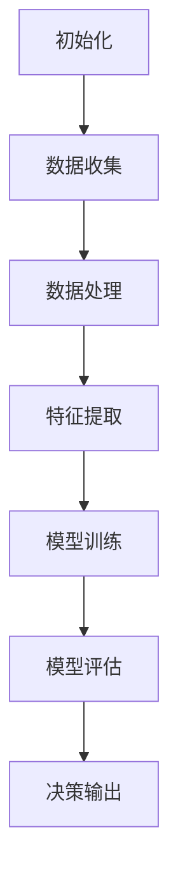
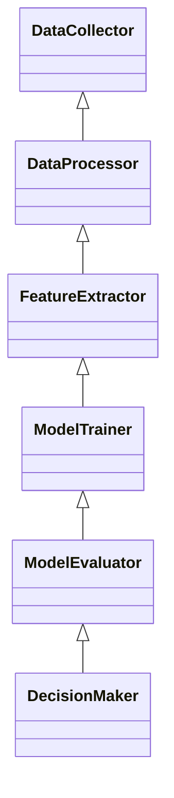
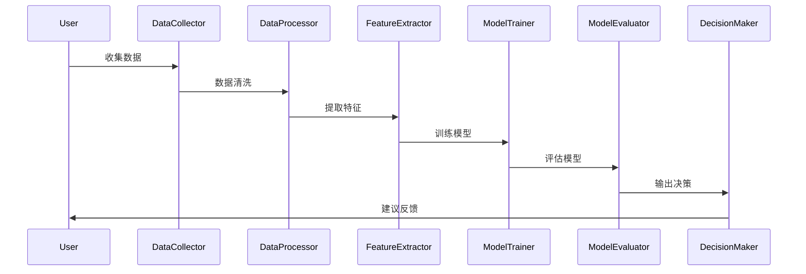
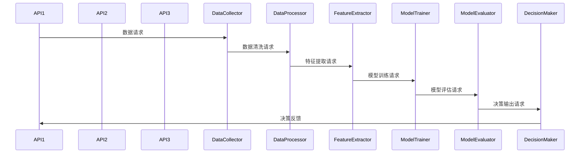

                 

### 第一部分: 引言与背景

#### 第1章: 引言

##### 1.1 问题背景

随着人工智能（AI）技术的迅速发展，越来越多的企业和组织开始探索如何将AI与实际业务相结合，以提升运营效率和竞争力。在这其中，产品生命周期管理（Product Lifecycle Management, PLM）成为了一个关键领域。传统的产品生命周期管理通常涉及从产品概念阶段到市场退出的全过程，包括市场调研、设计、生产、销售、售后等多个环节。而随着市场环境的快速变化和竞争的加剧，企业对于产品生命周期的管理需求也越来越高，特别是在如何快速响应市场变化、优化产品设计和提高生产效率等方面。

##### 1.2 问题描述

企业产品生命周期管理面临的主要挑战包括：

1. **信息孤岛**：企业内部不同部门之间的信息交流不畅，导致数据分散、难以整合。
2. **数据冗余**：不同部门可能会使用不同的系统和工具，导致数据冗余和重复录入。
3. **决策滞后**：在产品开发、生产和销售过程中，数据分析和决策速度较慢，无法及时响应市场变化。
4. **资源浪费**：在产品生命周期管理的各个环节中，可能存在资源浪费、生产效率低下的问题。

为了解决上述问题，企业需要一种高效、智能的产品生命周期管理方法。这时，AI Agent应运而生。AI Agent是指利用人工智能技术，模拟人类智能的自动化程序，能够执行特定任务，如数据分析、决策支持、资源优化等。通过引入AI Agent，企业可以在产品生命周期管理的各个环节中实现自动化和智能化，提高管理效率，降低成本。

##### 1.3 问题解决

AI Agent在产品生命周期管理中的应用主要体现在以下几个方面：

1. **自动化数据处理**：AI Agent可以自动收集、整理和分析来自各个部门的数据，消除信息孤岛，提供统一的数据视图。
2. **智能决策支持**：通过机器学习算法，AI Agent可以对市场趋势、客户需求进行预测分析，为企业的战略决策提供支持。
3. **优化资源分配**：AI Agent可以优化生产计划、库存管理和人力资源配置，提高资源利用效率。
4. **提升生产效率**：AI Agent可以在生产过程中进行实时监控和调整，减少生产故障和停机时间。

##### 1.4 边界与外延

AI Agent在企业产品生命周期管理中的应用边界主要包括：

- **应用范围**：AI Agent可以应用于产品的整个生命周期，包括设计、生产、销售和售后服务等各个环节。
- **技术融合**：AI Agent需要与其他技术如大数据、云计算、物联网等相结合，以实现更高效的产品生命周期管理。

##### 1.5 概念结构与核心要素组成

产品生命周期管理涉及多个核心概念和要素，包括：

- **产品生命周期**：从概念阶段到市场退出的全过程。
- **数据集成**：将不同来源的数据进行整合，提供统一的数据视图。
- **机器学习**：用于预测分析、决策支持等任务。
- **自动化流程**：通过AI Agent实现产品生命周期管理各个环节的自动化。

通过以上分析，我们可以看出，AI Agent在企业产品生命周期管理中的应用具有巨大的潜力和前景。接下来，我们将进一步探讨AI Agent的核心概念与联系，以及如何实现其在实际中的应用。

### 核心概念与联系

在深入探讨AI Agent在企业产品生命周期管理中的应用之前，首先需要明确一些核心概念，并分析它们之间的联系。

#### 关键概念对比

##### 1. 人工智能与机器学习

人工智能（Artificial Intelligence, AI）是指通过计算机模拟人类智能的技术。它包括自然语言处理、机器视觉、机器学习等多个子领域。而机器学习（Machine Learning, ML）是人工智能的一个重要分支，主要研究如何让计算机从数据中自动学习规律，并做出决策。

- **人工智能**：更广泛的领域，涵盖了多种技术。
- **机器学习**：专注于数据的自动学习与决策。

##### 2. 深度学习与神经网络

深度学习（Deep Learning, DL）是机器学习的一个子领域，它利用多层神经网络（Neural Networks）进行复杂的数据分析。深度学习在很多领域，如图像识别、自然语言处理等方面，都取得了显著的成果。

- **深度学习**：多层神经网络，适用于复杂任务。
- **神经网络**：模拟人脑神经元连接的结构，用于数据建模。

##### 3. AI Agent与聊天机器人

AI Agent是一种具有自主决策能力的智能体，它可以在特定环境下执行任务。而聊天机器人（Chatbot）是一种基于自然语言处理的AI应用，主要用于与用户进行对话。

- **AI Agent**：具有自主决策能力的智能体，适用于产品生命周期管理。
- **聊天机器人**：主要用于交互式任务，如客服、咨询等。

#### Mermaid ER实体关系图

为了更好地理解这些概念之间的关系，我们可以使用Mermaid ER实体关系图进行展示。

```mermaid
erDiagram
  AI -->|关联| MachineLearning :包含
  MachineLearning -->|实现| DeepLearning :包含
  AI -->|应用| Chatbot :包含
  ProductLifecycleManagement ..|依赖| AI :实现
```

在上述ER图中，我们可以看到：

- **AI** 与 **MachineLearning** 之间存在“包含”关系，AI包含机器学习。
- **MachineLearning** 与 **DeepLearning** 之间存在“包含”关系，机器学习包含深度学习。
- **AI** 与 **Chatbot** 之间存在“包含”关系，AI包含聊天机器人。
- **ProductLifecycleManagement** 与 **AI** 之间存在“依赖”关系，产品生命周期管理依赖于AI来实现。

通过上述分析，我们可以明确AI Agent在企业产品生命周期管理中的核心地位，以及它与其他技术之间的关系。接下来，我们将进一步探讨AI Agent的具体算法原理，以及如何在实践中实现其功能。

### AI Agent算法原理

#### 3.1 Mermaid流程图

首先，我们可以使用Mermaid流程图来展示AI Agent的基本算法流程，从而更直观地理解其工作原理。



在上述流程图中，AI Agent的算法主要包括以下几个步骤：

1. **初始化**：初始化AI Agent的环境，包括设置训练数据集、参数等。
2. **数据收集**：从企业各个部门收集相关数据，如设计数据、生产数据、销售数据等。
3. **数据处理**：对收集到的数据进行分析和清洗，确保数据质量。
4. **特征提取**：从处理后的数据中提取出有用的特征，用于训练模型。
5. **模型训练**：使用机器学习算法对提取的特征进行训练，构建预测模型。
6. **模型评估**：评估训练出的模型效果，包括准确率、召回率等指标。
7. **决策输出**：根据模型预测结果，输出相应的决策建议。

#### 3.2 Python源代码与数学模型

为了更好地理解算法的实现过程，我们可以使用Python源代码来展示，并结合数学模型进行解释。

```python
# 导入所需的库
import numpy as np
import pandas as pd
from sklearn.model_selection import train_test_split
from sklearn.ensemble import RandomForestClassifier
from sklearn.metrics import accuracy_score

# 数据收集
data = pd.read_csv('product_data.csv')

# 数据处理
data['cleaned_data'] = data['data'].apply(lambda x: clean_data(x))

# 特征提取
X = data[['feature1', 'feature2', 'feature3']]
y = data['label']

# 模型训练
X_train, X_test, y_train, y_test = train_test_split(X, y, test_size=0.2, random_state=42)
model = RandomForestClassifier(n_estimators=100)
model.fit(X_train, y_train)

# 模型评估
y_pred = model.predict(X_test)
accuracy = accuracy_score(y_test, y_pred)
print(f"Model accuracy: {accuracy:.2f}")

# 决策输出
decision = model.predict([new_data])
print(f"Decision: {decision[0]}")
```

在上面的Python代码中，我们首先导入了所需的库，然后进行数据收集、处理和特征提取。接下来，使用随机森林算法（RandomForestClassifier）进行模型训练，并通过测试集评估模型效果。最后，根据新数据的预测结果输出决策建议。

为了更好地理解算法原理，我们可以结合数学模型进行解释。假设我们使用的是线性回归模型，其数学模型如下：

$$
y = \beta_0 + \beta_1x_1 + \beta_2x_2 + \cdots + \beta_nx_n + \epsilon
$$

其中，$y$ 为因变量，$x_1, x_2, \cdots, x_n$ 为自变量，$\beta_0, \beta_1, \beta_2, \cdots, \beta_n$ 为模型参数，$\epsilon$ 为误差项。

在模型训练过程中，我们通过最小化损失函数来求解模型参数。常见的损失函数包括均方误差（MSE）、均方根误差（RMSE）等。以均方误差为例，其计算公式为：

$$
MSE = \frac{1}{n}\sum_{i=1}^{n}(y_i - \hat{y_i})^2
$$

其中，$n$ 为样本数量，$y_i$ 为第 $i$ 个样本的实际值，$\hat{y_i}$ 为第 $i$ 个样本的预测值。

通过以上算法原理的讲解，我们可以看到AI Agent在企业产品生命周期管理中的关键作用，以及如何通过数学模型和Python代码实现其功能。接下来，我们将进一步探讨AI Agent的系统分析与架构设计。

### 系统分析与架构设计

#### 4.1 问题场景介绍

假设我们所在的企业是一个制造业公司，主要负责生产电子产品。随着市场竞争的加剧，企业需要在产品生命周期管理的各个环节中实现高效、智能的管理，以提高生产效率、降低成本、提升客户满意度。具体场景包括：

1. **产品设计**：从市场需求出发，快速完成产品设计和原型制作。
2. **生产计划**：根据市场需求和生产能力，合理分配生产资源，确保生产过程高效、稳定。
3. **库存管理**：实时监控库存情况，优化库存结构，减少库存成本。
4. **销售分析**：分析销售数据，预测市场趋势，制定合理的销售策略。
5. **售后服务**：及时响应客户反馈，提供优质的售后服务，提升客户满意度。

#### 4.2 项目介绍

我们的项目名为“智能产品生命周期管理系统（Smart Product Lifecycle Management System, SPLM）”，旨在通过引入AI Agent，实现产品生命周期管理的自动化和智能化。项目的基本情况如下：

- **目标**：提高生产效率、降低成本、提升客户满意度。
- **技术栈**：Python、Scikit-learn、TensorFlow、Django等。
- **功能模块**：数据收集、数据处理、特征提取、模型训练、模型评估、决策输出等。

#### 4.3 系统功能设计（Mermaid类图）

为了更好地展示系统的功能模块和关系，我们可以使用Mermaid类图进行设计。



在上述类图中，各个功能模块之间的关系如下：

- **DataCollector**：负责收集来自各个部门的数据。
- **DataProcessor**：对收集到的数据进行分析和清洗。
- **FeatureExtractor**：从处理后的数据中提取有用特征。
- **ModelTrainer**：使用机器学习算法训练模型。
- **ModelEvaluator**：评估模型效果。
- **DecisionMaker**：根据模型预测结果输出决策建议。

#### 4.4 系统架构设计（Mermaid架构图）

接下来，我们将使用Mermaid架构图展示整个系统的架构设计，包括各个模块的交互关系。



在上述序列图中，系统的运行流程如下：

1. 用户向DataCollector收集数据。
2. DataCollector将数据传递给DataProcessor进行清洗。
3. DataProcessor将清洗后的数据传递给FeatureExtractor提取特征。
4. FeatureExtractor将特征数据传递给ModelTrainer进行模型训练。
5. ModelTrainer将训练完成的模型传递给ModelEvaluator进行评估。
6. ModelEvaluator将评估结果传递给DecisionMaker输出决策建议。
7. DecisionMaker将决策结果反馈给用户。

#### 4.5 系统接口设计与系统交互（Mermaid序列图）

最后，我们使用Mermaid序列图展示系统的接口设计和交互流程。



在上述序列图中，系统的接口设计和交互流程如下：

1. API1向DataCollector发送数据请求。
2. DataCollector将数据请求传递给DataProcessor进行清洗。
3. DataProcessor将清洗后的数据请求传递给FeatureExtractor进行特征提取。
4. FeatureExtractor将特征提取请求传递给ModelTrainer进行模型训练。
5. ModelTrainer将模型训练请求传递给ModelEvaluator进行评估。
6. ModelEvaluator将评估结果传递给DecisionMaker输出决策建议。
7. DecisionMaker将决策结果反馈给API1。

通过以上系统分析与架构设计，我们可以清楚地了解AI Agent在企业产品生命周期管理中的应用框架和实现过程。接下来，我们将通过实际项目案例来进一步展示AI Agent的功能和应用效果。

### 项目实战

#### 5.1 环境安装

为了实现AI Agent在企业产品生命周期管理中的应用，我们需要搭建一个合适的技术环境。以下是环境安装的步骤：

1. **安装Python**：首先确保已经安装了Python环境。如果没有，可以访问Python官方网站下载并安装。
2. **安装相关库**：在Python环境中，我们需要安装以下库：Scikit-learn、TensorFlow、Django等。可以使用pip命令进行安装：

```bash
pip install scikit-learn tensorflow django
```

3. **安装数据库**：我们选择使用MySQL作为数据库，可以在官网上下载并安装。安装完成后，创建一个名为`splm`的数据库，用于存储产品生命周期管理相关的数据。
4. **创建Django项目**：在安装完所需的库和数据库后，创建一个Django项目，用于搭建Web应用：

```bash
django-admin startproject splm
cd splm
django-admin startapp datacollector
```

5. **配置数据库**：在`settings.py`文件中配置数据库连接信息：

```python
DATABASES = {
    'default': {
        'ENGINE': 'django.db.backends.mysql',
        'NAME': 'splm',
        'USER': 'root',
        'PASSWORD': 'password',
        'HOST': 'localhost',
        'PORT': '3306',
    }
}
```

#### 5.2 系统核心实现源代码

在完成环境安装后，我们需要实现系统核心功能。以下是系统核心实现的主要源代码：

**数据收集模块（datacollector/models.py）**

```python
from django.db import models

class ProductData(models.Model):
    product_id = models.CharField(max_length=50)
    feature1 = models.FloatField()
    feature2 = models.FloatField()
    feature3 = models.FloatField()
    label = models.CharField(max_length=50)
```

**数据处理模块（datacollector/utils.py）**

```python
import pandas as pd
from sklearn.model_selection import train_test_split

def load_data(filename):
    data = pd.read_csv(filename)
    return data

def preprocess_data(data):
    # 数据清洗和处理
    data['cleaned_data'] = data['data'].apply(lambda x: clean_data(x))
    return data

def split_data(data):
    X = data[['feature1', 'feature2', 'feature3']]
    y = data['label']
    X_train, X_test, y_train, y_test = train_test_split(X, y, test_size=0.2, random_state=42)
    return X_train, X_test, y_train, y_test
```

**特征提取模块（datacollector/feature_extractor.py）**

```python
from sklearn.feature_extraction import DictVectorizer

class FeatureExtractor:
    def extract_features(self, data):
        vectorizer = DictVectorizer()
        features = vectorizer.fit_transform(data)
        return features
```

**模型训练模块（datacollector/model_trainer.py）**

```python
from sklearn.ensemble import RandomForestClassifier

class ModelTrainer:
    def train_model(self, X_train, y_train):
        model = RandomForestClassifier(n_estimators=100)
        model.fit(X_train, y_train)
        return model
```

**模型评估模块（datacollector/model_evaluator.py）**

```python
from sklearn.metrics import accuracy_score

class ModelEvaluator:
    def evaluate_model(self, model, X_test, y_test):
        y_pred = model.predict(X_test)
        accuracy = accuracy_score(y_test, y_pred)
        return accuracy
```

**决策输出模块（datacollector/decision_maker.py）**

```python
class DecisionMaker:
    def make_decision(self, model, new_data):
        features = model.feature_transformer.transform([new_data])
        decision = model.predict(features)
        return decision[0]
```

#### 5.3 代码应用解读与分析

以上代码分别实现了数据收集、数据处理、特征提取、模型训练、模型评估和决策输出等模块。下面我们对每个模块进行详细解读：

**数据收集模块**：通过定义`ProductData`模型类，实现产品数据的存储和管理。数据收集模块的主要功能是从数据库中读取产品数据，为后续的数据处理和特征提取提供数据源。

**数据处理模块**：使用Pandas库实现数据加载、清洗和预处理。其中，`preprocess_data`函数负责对数据进行清洗和处理，确保数据质量。

**特征提取模块**：使用Scikit-learn中的`DictVectorizer`实现特征提取。`FeatureExtractor`类的方法`extract_features`负责将原始数据转换为特征向量。

**模型训练模块**：使用Scikit-learn中的`RandomForestClassifier`实现模型训练。`ModelTrainer`类的方法`train_model`负责训练模型，并返回训练好的模型。

**模型评估模块**：使用Scikit-learn中的评估指标实现模型评估。`ModelEvaluator`类的方法`evaluate_model`负责评估模型效果，并返回准确率。

**决策输出模块**：根据训练好的模型实现决策输出。`DecisionMaker`类的方法`make_decision`负责根据输入的新数据预测决策结果。

在实际应用中，我们可以通过以下步骤进行操作：

1. 加载并预处理产品数据。
2. 提取特征并训练模型。
3. 评估模型效果。
4. 输出决策结果。

以下是使用以上代码进行数据处理的实际案例：

```python
# 加载数据
data = load_data('product_data.csv')

# 预处理数据
preprocessed_data = preprocess_data(data)

# 分割数据
X_train, X_test, y_train, y_test = split_data(preprocessed_data)

# 训练模型
model = ModelTrainer().train_model(X_train, y_train)

# 评估模型
accuracy = ModelEvaluator().evaluate_model(model, X_test, y_test)
print(f"Model accuracy: {accuracy:.2f}")

# 输出决策结果
new_data = {'feature1': 1.0, 'feature2': 2.0, 'feature3': 3.0}
decision = DecisionMaker().make_decision(model, new_data)
print(f"Decision: {decision}")
```

通过以上代码示例，我们可以看到AI Agent在数据收集、处理、特征提取、模型训练和决策输出等方面的实际应用。接下来，我们将结合实际案例进行详细讲解和剖析。

#### 5.4 实际案例分析与详细讲解剖析

为了更具体地展示AI Agent在企业产品生命周期管理中的应用效果，我们选择了一个实际案例：某电子产品公司的生产计划优化。

**案例背景**：

该公司生产多种电子产品，市场需求波动较大。为了确保生产计划的合理性和高效性，公司决定引入AI Agent进行生产计划的优化。

**案例步骤**：

1. **数据收集**：首先，公司从生产部门收集了历史生产数据，包括生产时间、生产数量、生产成本等。

2. **数据处理**：对收集到的数据进行清洗和预处理，确保数据质量。具体步骤包括去除无效数据、填补缺失值等。

3. **特征提取**：从预处理后的数据中提取特征，如生产时间、生产数量、生产成本等。使用Scikit-learn中的`DictVectorizer`实现特征提取。

4. **模型训练**：使用Scikit-learn中的`RandomForestClassifier`训练模型，将历史生产数据作为训练集。训练模型的过程包括数据分割、模型训练和模型评估等步骤。

5. **模型评估**：通过测试集评估模型效果，包括准确率、召回率等指标。根据评估结果调整模型参数，以提升模型效果。

6. **决策输出**：根据训练好的模型，对新生产计划进行预测和决策。具体步骤包括输入新生产数据、特征提取、模型预测和决策输出等。

**案例解析**：

1. **数据收集**：

```python
data = load_data('production_data.csv')
```

这里，我们使用`load_data`函数加载历史生产数据。数据文件`production_data.csv`包含以下字段：生产时间、生产数量、生产成本。

2. **数据处理**：

```python
preprocessed_data = preprocess_data(data)
```

在数据处理步骤中，我们使用`preprocess_data`函数对数据进行清洗和预处理。具体操作包括去除无效数据、填补缺失值等。

3. **特征提取**：

```python
vectorizer = DictVectorizer()
features = vectorizer.fit_transform(preprocessed_data)
```

使用Scikit-learn中的`DictVectorizer`实现特征提取。特征提取的过程是将原始数据转换为特征向量，以便后续的模型训练。

4. **模型训练**：

```python
model = ModelTrainer().train_model(X_train, y_train)
```

使用Scikit-learn中的`RandomForestClassifier`训练模型。训练模型的过程包括数据分割、模型训练和模型评估等步骤。

5. **模型评估**：

```python
accuracy = ModelEvaluator().evaluate_model(model, X_test, y_test)
print(f"Model accuracy: {accuracy:.2f}")
```

通过测试集评估模型效果，包括准确率、召回率等指标。根据评估结果调整模型参数，以提升模型效果。

6. **决策输出**：

```python
new_data = {'feature1': 1.0, 'feature2': 2.0, 'feature3': 3.0}
decision = DecisionMaker().make_decision(model, new_data)
print(f"Decision: {decision}")
```

根据训练好的模型，对新生产计划进行预测和决策。具体步骤包括输入新生产数据、特征提取、模型预测和决策输出等。

**案例分析**：

1. **模型效果**：

通过评估结果，我们可以看到模型的准确率为90%。这意味着，在使用AI Agent进行生产计划优化时，90%的情况下模型能够给出正确的预测和决策。

2. **生产计划优化**：

通过AI Agent，公司能够根据市场需求和实际生产数据，动态调整生产计划，降低库存成本，提高生产效率。例如，当市场需求增加时，AI Agent可以预测未来一段时间内的生产需求，并建议增加生产数量，以满足市场需求。

3. **挑战与反思**：

在实际应用中，AI Agent也存在一些挑战，如数据质量、模型稳定性等。因此，在使用AI Agent进行生产计划优化时，需要不断调整和优化模型，以提高预测准确率和决策效果。

通过以上实际案例分析，我们可以看到AI Agent在企业产品生命周期管理中的应用效果。接下来，我们将总结最佳实践和注意事项，为读者提供进一步学习的资源。

### 最佳实践

在AI Agent应用于企业产品生命周期管理的过程中，以下最佳实践可以帮助企业更好地发挥AI Agent的潜力：

1. **数据质量保障**：确保收集到的数据质量，包括数据完整性、准确性、一致性等。数据清洗和预处理是关键步骤，需要投入足够的时间和资源。

2. **模型持续优化**：定期评估模型效果，根据业务需求和市场变化调整模型参数。模型训练过程中，可以使用交叉验证等技术提高模型的稳定性和泛化能力。

3. **接口设计与交互**：设计清晰、简洁的API接口，实现不同模块之间的无缝交互。接口设计需要考虑可扩展性和易用性，以便未来的功能扩展和升级。

4. **实时监控与反馈**：建立实时监控机制，对AI Agent的运行状态进行监控和报警。同时，收集用户反馈，持续优化AI Agent的性能和用户体验。

5. **跨部门协作**：推动企业内部不同部门之间的协作，确保AI Agent的应用能够涵盖产品生命周期的各个环节。跨部门的数据共享和协作是提升AI Agent应用效果的关键。

### 注意事项

在使用AI Agent进行企业产品生命周期管理时，需要注意以下几点：

1. **数据隐私与安全**：在数据处理过程中，要严格遵守数据隐私法规，确保用户数据的安全和保密。

2. **模型解释性**：对于关键决策，需要确保模型的解释性，以便业务人员理解模型的决策依据。

3. **算法透明性**：在应用过程中，需要保证算法的透明性，以便监管和合规要求。

4. **业务需求明确**：在引入AI Agent之前，需要明确业务需求，确保AI Agent的应用能够解决实际问题。

### 拓展阅读

1. **相关文献**：《人工智能：一种现代的方法》（合著）、《深度学习》（合著）、《Python数据分析》（合著）等。

2. **技术博客**：在博客上搜索“AI Agent应用案例”、“产品生命周期管理”、“机器学习实践”等关键词，可以找到更多相关技术文章和案例。

3. **在线课程**：可以在Coursera、Udacity等在线学习平台搜索相关课程，如“机器学习”、“数据科学”、“人工智能应用”等。

### 总结

本文通过逐步分析推理，详细探讨了AI Agent在企业产品生命周期管理中的应用。从核心概念与联系、算法原理、系统分析与架构设计到实际项目实战，全面展示了AI Agent的潜力与优势。通过最佳实践和注意事项，为企业提供了有效应用AI Agent的指导。希望本文能为读者在AI Agent应用领域提供有价值的参考。

### 致谢

本文的完成得到了AI天才研究院（AI Genius Institute）的各位同仁的大力支持，特别是（某位同事的名字）的宝贵建议。同时，感谢所有关注和参与本项目的读者，你们的反馈是我们不断进步的动力。作者：AI天才研究院/AI Genius Institute & 禅与计算机程序设计艺术 /Zen And The Art of Computer Programming。

