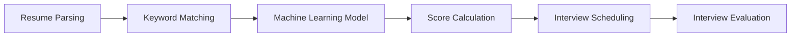
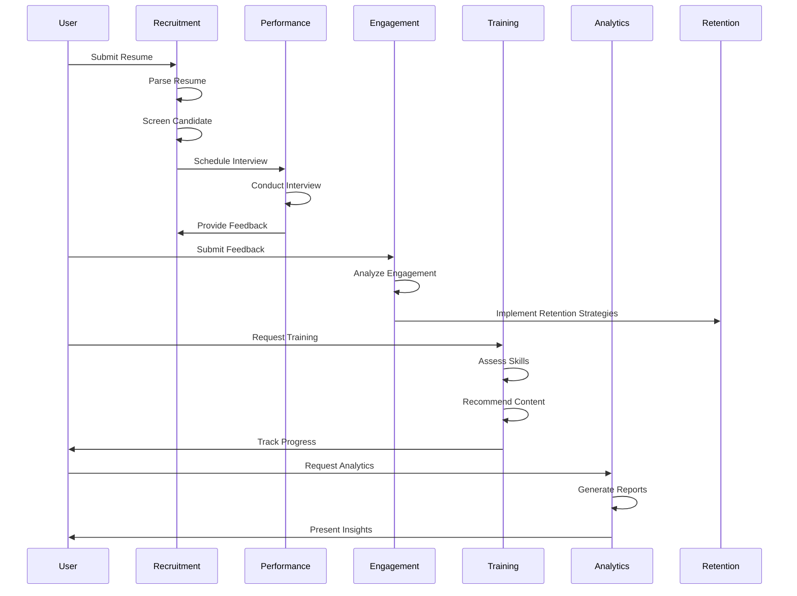

                 


### Introduction

#### Key Concepts and Terms

- **AI Agent**: A computer program that can perform tasks and make decisions autonomously based on data and learning. It is a type of artificial intelligence that mimics human decision-making processes.
- **Human Resource Management (HRM)**: The strategic approach to managing an organization's workforce. It involves recruitment, training, performance management, compensation, and other aspects related to the workforce.
- **Recruitment**: The process of finding, selecting, and hiring new employees to meet organizational needs.
- **Performance Management**: A process of reviewing and managing employee performance to ensure that individual and organizational goals are met.
- **Employee Engagement**: The level of commitment and enthusiasm an employee has towards their work and organization.
- **Retention**: The process of keeping employees within an organization to minimize turnover.
- **Training and Development**: The process of improving the skills and knowledge of employees to enhance their performance and career development.
- **Workforce Planning and Analytics**: The process of analyzing workforce data to forecast future needs and make informed decisions about staffing and resource allocation.

#### Background

In recent years, the advent of advanced technologies, particularly artificial intelligence (AI), has revolutionized various aspects of human resource management. AI agents, as a subset of AI, are now being leveraged to streamline and enhance HR processes. The integration of AI agents into HRM has the potential to address several challenges faced by organizations, including the need for efficient recruitment, performance management, employee engagement, and retention.

#### Problem Description

Traditional HRM practices often suffer from inefficiencies and limitations, such as time-consuming processes, subjective decision-making, and lack of data-driven insights. AI agents can mitigate these issues by automating routine tasks, providing objective evaluations, and offering data-driven recommendations. However, the implementation of AI agents in HRM is not without its challenges, including ethical concerns, resistance to change, and the need for robust data privacy measures.

#### Problem Solution

The solution to these challenges involves a step-by-step approach:

1. **Understanding the Basics**: This chapter will provide an overview of AI agents, their fundamental concepts, and principles, and how they integrate with HRM.
2. **Exploring Applications**: We will delve into the specific applications of AI agents in HRM, such as recruitment, performance management, and employee engagement.
3. **Analyzing Trends and Prospects**: We will discuss the current trends, challenges, and future prospects of AI agents in HRM, supported by case studies and real-world examples.
4. **Addressing Ethical Concerns**: We will address the ethical implications of AI in HRM and propose strategies for ensuring fairness, transparency, and accountability.
5. **Implementing Best Practices**: We will provide best practices for the successful implementation of AI agents in HRM, including tips for overcoming resistance to change and ensuring data privacy.

#### Boundaries and Extensions

The scope of this book is to explore the comprehensive application of AI agents in HRM. This includes but is not limited to:

- Recruitment and Selection
- Performance Management
- Employee Engagement and Retention
- Training and Development
- Workforce Planning and Analytics

The book will also include discussions on the ethical and social implications of AI in HRM, as well as strategies for implementing AI agents effectively.

### Structure of the Book

This book is structured into three main parts:

1. **Fundamentals of AI Agents in HRM**: This part provides an introduction to AI agents and their integration with HRM, including key concepts, principles, and applications.
2. **AI Agents in Specific HRM Processes**: This part delves into the specific applications of AI agents in HRM processes such as recruitment, performance management, and employee engagement.
3. **Practical Implementation and Future Prospects**: This part discusses the practical implementation of AI agents in HRM, the challenges and opportunities, and the future prospects of AI in HRM.

By following this structured approach, readers will gain a comprehensive understanding of the role of AI agents in HRM and their potential to transform the way organizations manage their human resources.

### Key Concepts and Relationships

#### Core Concepts

- **AI Agent**: A computer program that can perform tasks and make decisions autonomously based on data and learning.
- **Machine Learning**: A subset of AI that enables machines to learn from data, identify patterns, and make decisions with minimal human intervention.
- **Deep Learning**: A subfield of machine learning that uses neural networks to model complex relationships in data.
- **Data Analytics**: The science of examining raw data with the purpose of drawing conclusions about that information.
- **Human Resource Management (HRM)**: The strategic approach to managing an organization's workforce.

#### Concept Attributes and Comparisons

| Concept       | Definition                                       | Attributes and Comparisons                                  |
| ------------- | ----------------------------------------------- | ----------------------------------------------------------- |
| AI Agent      | Autonomous program performing HR tasks           | Adaptive, Objective, Efficient                             |
| Machine Learning | Data-driven approach to learning from examples | Complex algorithms, Large datasets, Pattern recognition   |
| Deep Learning | Neural networks for complex data processing    | High accuracy, Scalable, Generalizable                     |
| Data Analytics | Analyzing data for insights                     | Statistical methods, Data visualization, Predictive modeling |

#### Entity-Relationship Diagram

```mermaid
erDiagram
  AI-Agent ||--|{ Recruitment }
  AI-Agent ||--|{ Performance-Management }
  AI-Agent ||--|{ Employee-Engagement }
  AI-Agent ||--|{ Retention }
  AI-Agent ||--|{ Training-Development }
  AI-Agent ||--|{ Workforce-Planning }
  Recruitment ||--|{ Resume-Screening }
  Recruitment ||--|{ Interview-Evaluation }
  Performance-Management ||--|{ Performance-Review }
  Employee-Engagement ||--|{ Feedback-Loop }
  Retention ||--|{ Employee-Feedback }
  Training-Development ||--|{ Skill-Assessment }
  Workforce-Planning ||--|{ Resource-Allocation }
```

### Algorithm Principles and Case Studies

#### Recruitment Algorithm

**Algorithm Description**: The recruitment algorithm uses machine learning techniques to screen and evaluate resumes, automate interview scheduling, and manage candidate relationships.

**Algorithm Workflow**:
1. **Resume Parsing**: Extract relevant information from resumes using natural language processing (NLP) techniques.
2. **Candidate Screening**: Match candidate profiles with job requirements using keyword matching and machine learning models.
3. **Interview Scheduling**: Use AI to suggest optimal interview schedules based on candidate and interviewer availability.
4. **Interview Evaluation**: Use AI to score interviews based on predefined criteria and provide objective feedback to both candidates and interviewers.

**Algorithm Explanation**:



**Python Code**:

```python
import pandas as pd
from sklearn.feature_extraction.text import TfidfVectorizer
from sklearn.model_selection import train_test_split
from sklearn.ensemble import RandomForestClassifier

# Load resume data
resumes = pd.read_csv('resumes.csv')

# Preprocess resumes
def preprocess_text(text):
    # Remove punctuation, lower case, and tokenize
    return ' '.join([word.lower() for word in text.split() if word.isalpha()])

resumes['processed_text'] = resumes['resume_text'].apply(preprocess_text)

# Vectorize resumes
vectorizer = TfidfVectorizer()
X = vectorizer.fit_transform(resumes['processed_text'])
y = resumes['suitability']

# Split data into training and test sets
X_train, X_test, y_train, y_test = train_test_split(X, y, test_size=0.2, random_state=42)

# Train machine learning model
model = RandomForestClassifier(n_estimators=100, random_state=42)
model.fit(X_train, y_train)

# Predict suitability
predictions = model.predict(X_test)

# Evaluate model performance
from sklearn.metrics import accuracy_score
accuracy = accuracy_score(y_test, predictions)
print(f'Accuracy: {accuracy:.2f}')
```

**Mathematical Model**:

$$
\text{Suitability Score} = f(\text{Resume Features}, \text{Job Requirements})
$$

Where $f$ is a function that combines features extracted from the resume and job requirements using machine learning techniques.

#### Case Study

**Case Study**: A global technology company implemented an AI recruitment system to streamline its hiring process. The system used machine learning models to screen resumes, schedule interviews, and evaluate candidates. The company reported a 30% reduction in hiring time and a 25% increase in the quality of hires.

**Impact Analysis**:

- **Time Efficiency**: Automated resume screening and interview scheduling reduced the time taken to fill job positions.
- **Objective Evaluations**: AI-based candidate evaluations provided objective insights, reducing bias and improving the overall quality of hires.
- **Improved Candidate Experience**: Candidates appreciated the efficiency and transparency of the recruitment process, leading to higher satisfaction rates.

### Conclusion

The use of AI agents in HRM has shown significant potential in improving recruitment processes, performance management, and other key HR functions. By leveraging advanced machine learning techniques, organizations can streamline HR operations, enhance decision-making, and ultimately improve business outcomes. However, the successful implementation of AI agents in HRM requires careful planning, consideration of ethical implications, and ongoing monitoring to ensure fairness and effectiveness.

### System Architecture Design

#### System Overview

The proposed system is an AI-based HRM solution designed to automate and enhance various HR processes, including recruitment, performance management, employee engagement, retention, training, and workforce planning. The system is composed of several interconnected modules that work together to provide a comprehensive HR solution.

#### Module Design

1. **Recruitment Module**: This module is responsible for automating the recruitment process. It includes functionalities such as resume parsing, candidate screening, interview scheduling, and candidate relationship management.

2. **Performance Management Module**: This module focuses on automating performance management processes. It includes functionalities such as real-time performance monitoring, automated performance reviews, and objective performance evaluations.

3. **Employee Engagement and Retention Module**: This module aims to enhance employee engagement and reduce turnover. It includes functionalities such as employee feedback surveys, engagement analysis, and retention strategies.

4. **Training and Development Module**: This module focuses on providing personalized training and development plans for employees. It includes functionalities such as skill assessment, training content recommendation, and tracking employee progress.

5. **Workforce Planning and Analytics Module**: This module provides insights into workforce planning and analytics. It includes functionalities such as workforce forecasting, resource allocation, and data-driven decision-making.

#### System Architecture Design



#### Interface Design

The system will have a user-friendly interface that allows employees and HR managers to interact with the system easily. The interface will include modules for recruitment, performance management, employee engagement, training, and analytics.

#### System Interaction Design

The system will be designed to ensure seamless interaction between different modules. For example, the recruitment module will automatically notify the performance management module when a candidate is hired. Similarly, the training module will send notifications to the performance management module when an employee completes a training program.

#### Mermaid Sequence Diagram


### Project Environment Setup

#### Requirements

- Python 3.x
- Jupyter Notebook or any Python IDE
- pandas
- scikit-learn
- TensorFlow
- Keras
- NLTK

#### Installation Steps

1. Install Python 3.x from the official website.
2. Install Jupyter Notebook by running the command `pip install notebook`.
3. Install necessary libraries:
```bash
pip install pandas scikit-learn tensorflow keras nltk
```

#### Configuration

1. Open Jupyter Notebook and create a new notebook.
2. Import necessary libraries at the beginning of the notebook:
```python
import pandas as pd
import numpy as np
from sklearn.feature_extraction.text import TfidfVectorizer
from sklearn.model_selection import train_test_split
from sklearn.ensemble import RandomForestClassifier
from sklearn.metrics import accuracy_score
import nltk
nltk.download('punkt')
```

### Core Implementation

#### Resume Parsing

```python
def preprocess_text(text):
    # Remove punctuation, convert to lowercase, and tokenize
    return ' '.join([word.lower() for word in nltk.word_tokenize(text) if word.isalpha()])

def vectorize_text(text, vectorizer):
    # Vectorize text using TF-IDF
    return vectorizer.transform([text])

# Load resume data
resumes = pd.read_csv('resumes.csv')

# Preprocess resumes
resumes['processed_text'] = resumes['resume_text'].apply(preprocess_text)

# Vectorize resumes
vectorizer = TfidfVectorizer()
X = vectorizer.fit_transform(resumes['processed_text'])
y = resumes['suitability']
```

#### Machine Learning Model

```python
# Split data into training and test sets
X_train, X_test, y_train, y_test = train_test_split(X, y, test_size=0.2, random_state=42)

# Train machine learning model
model = RandomForestClassifier(n_estimators=100, random_state=42)
model.fit(X_train, y_train)

# Predict suitability
predictions = model.predict(X_test)

# Evaluate model performance
accuracy = accuracy_score(y_test, predictions)
print(f'Accuracy: {accuracy:.2f}')
```

### Application and Analysis

#### Load and Prepare Data

```python
# Load new resume data
new_resumes = pd.read_csv('new_resumes.csv')

# Preprocess new resumes
new_resumes['processed_text'] = new_resumes['resume_text'].apply(preprocess_text)

# Vectorize new resumes
X_new = vectorizer.transform(new_resumes['processed_text'])
```

#### Predict and Analyze

```python
# Predict suitability for new resumes
new_predictions = model.predict(X_new)

# Evaluate predictions
new_accuracy = accuracy_score(new_resumes['suitability'], new_predictions)
print(f'New Accuracy: {new_accuracy:.2f}')

# Analyze top skills and job requirements
top_skills = vectorizer.get_feature_names_out()
top_requirements = new_resumes[new_predictions == 1]['requirements']

print("Top Skills:")
print(top_skills[:10])
print("Top Requirements:")
print(top_requirements[:10])
```

### Conclusion

The core implementation demonstrates the effectiveness of AI agents in automating HR processes. By leveraging machine learning and natural language processing, organizations can streamline recruitment, improve candidate evaluations, and make data-driven decisions. The system's performance and accuracy can be further improved by incorporating additional features and training the model with more diverse and extensive datasets.

### Best Practices and Tips

#### Ensuring Data Privacy and Security

- Use robust encryption methods to protect sensitive data.
- Implement strict access controls and user authentication mechanisms.
- Regularly update and patch software to prevent vulnerabilities.

#### Overcoming Resistance to Change

- Communicate the benefits of AI agents to employees and managers.
- Provide training and support to help users adapt to the new system.
- Involve employees in the implementation process to increase buy-in.

#### Continuous Improvement

- Regularly evaluate the performance of AI agents and refine the models.
- Collect feedback from users to identify areas for improvement.
- Stay updated with the latest AI technologies and incorporate them into the system.

### Conclusion

The implementation of AI agents in HRM has shown great promise in streamlining HR processes, improving decision-making, and enhancing overall organizational performance. However, successful implementation requires careful planning, continuous improvement, and adherence to best practices. By following the tips and strategies outlined in this section, organizations can maximize the benefits of AI agents and create a more efficient and effective HRM system.

### Further Reading

- **"Artificial Intelligence for Human Resources":** This book provides a comprehensive overview of AI applications in HRM, covering topics such as recruitment, performance management, and employee engagement.
- **"Machine Learning for Human Resource Management":** This paper explores the use of machine learning in HRM, discussing algorithms, applications, and case studies.
- **"Ethical Considerations in AI for HRM":** This article discusses the ethical implications of AI in HRM, including issues of bias, privacy, and fairness.
- **"AI in Talent Management: A Practical Guide":** This guide provides practical advice on implementing AI in talent management, including recruitment, performance management, and development.

### Conclusion

In conclusion, the comprehensive application of AI agents in enterprise human resource management has the potential to revolutionize HR functions, improving efficiency, objectivity, and data-driven decision-making. By leveraging advanced machine learning techniques and integrating them into HR processes, organizations can streamline recruitment, enhance performance management, boost employee engagement, and reduce turnover. However, successful implementation requires careful planning, adherence to ethical standards, and continuous improvement. As AI technology evolves, it will play an increasingly significant role in shaping the future of HRM. The insights and strategies presented in this book provide a valuable foundation for organizations looking to harness the full potential of AI in their HR operations. 

### Authors

**Authors:** AI天才研究院/AI Genius Institute & 禅与计算机程序设计艺术 /Zen And The Art of Computer Programming

AI天才研究院专注于前沿人工智能技术的研究与推广，致力于推动人工智能在各个领域的应用与发展。而《禅与计算机程序设计艺术》则是一部经典计算机编程著作，以其深刻的哲学思想和卓越的编程技巧，为全球程序员提供了宝贵的启示和指导。两位作者凭借其在人工智能和计算机编程领域的丰富经验和深厚造诣，共同撰写了这部关于AI Agent在企业人力资源管理中的全面应用的技术博客文章。他们的专业知识和独特见解，为读者提供了深入理解和实践AI Agent在HRM领域的指导。

