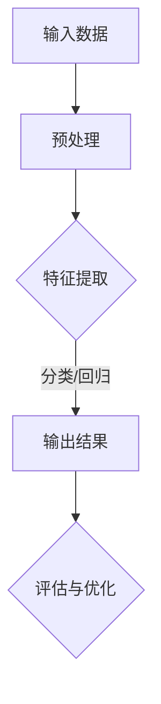
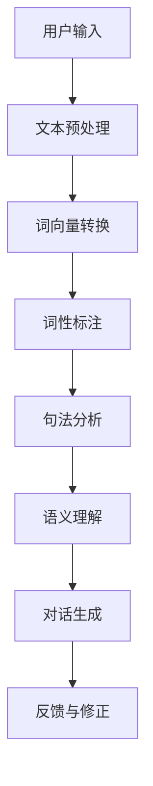
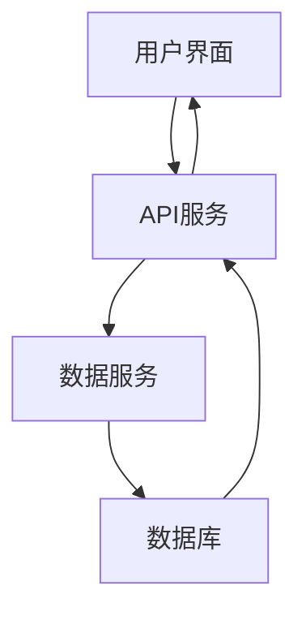
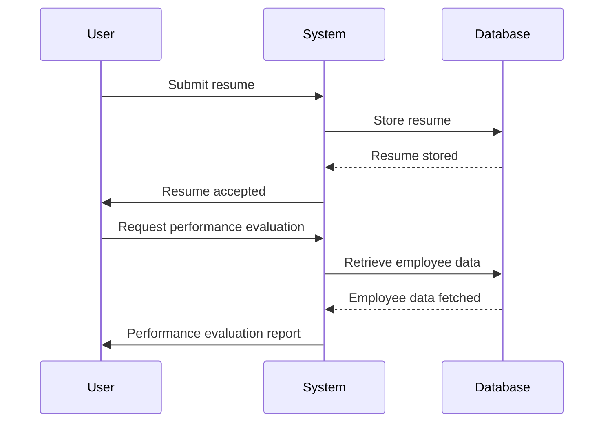

                 


### AI Agent与企业人力资源管理：背景介绍

随着科技的飞速发展，人工智能（AI）逐渐渗透到社会生活的各个领域，尤其是在人力资源管理（HRM）方面，其应用潜力得到了广泛认可。AI Agent，即人工智能代理，作为一种自主执行任务、与人类交互并具备学习能力的人工智能系统，正成为企业人力资源管理的新兴工具。

#### 核心概念术语说明

- **AI Agent**：具有自我意识和执行任务能力的人工智能系统，能够在一定环境中自主决策和行动。
- **HRM**：人力资源管理，包括招聘、培训、绩效评估、薪酬管理等方面。

#### 问题背景

企业人力资源管理过程中，面临诸多挑战，如招聘难、人才流失、绩效评估不公、薪酬体系不合理等。传统的人力资源管理模式在应对这些挑战时显得力不从心，效率低下。因此，寻找一种创新的人力资源管理工具迫在眉睫。

#### 问题描述

AI Agent在HRM中的应用，旨在通过智能化手段提升人力资源管理的效率和质量。例如，利用AI Agent进行简历筛选、智能面试、绩效评估等，从而帮助企业更好地管理人才。

#### 问题解决

AI Agent通过以下方式解决HRM中的问题：

1. **简历筛选**：利用自然语言处理技术，AI Agent可以快速准确地筛选出符合企业需求的简历。
2. **智能面试**：通过模拟面试场景，AI Agent能够与求职者进行交互，评估其能力和适应性。
3. **绩效评估**：基于大数据分析和机器学习算法，AI Agent可以对员工的工作绩效进行客观、全面的评估。
4. **薪酬管理**：通过分析市场数据和员工贡献，AI Agent可以帮助企业制定合理的薪酬方案。

#### 边界与外延

AI Agent在HRM中的应用不仅限于上述几个方面，还可以扩展到员工培训、员工满意度调查、职位匹配等更多领域。

#### 概念结构与核心要素组成

AI Agent在HRM中的核心要素包括：

1. **算法模型**：如机器学习、深度学习等，用于处理和分析大量人力资源数据。
2. **自然语言处理**：用于简历筛选、智能面试等环节。
3. **用户交互界面**：提供直观、易用的操作界面，方便HR管理人员与AI Agent进行交互。

通过以上分析，我们可以看到AI Agent在HRM中的巨大潜力。接下来，我们将深入探讨AI Agent的核心概念，以及其在HRM中的应用场景。

### AI Agent：核心概念与联系

AI Agent作为人工智能领域的核心概念，其在企业人力资源管理（HRM）中的应用具有深远的意义。为了更好地理解AI Agent及其在HRM中的应用，我们需要深入探讨AI Agent的核心概念，并使用对比表格和ER实体关系图来展示概念间的联系。

#### AI Agent的基本概念

首先，让我们来回顾一下AI Agent的基本概念。AI Agent是一种具有自我意识和执行任务能力的人工智能系统，能够在一定环境中自主决策和行动。它通常包括以下几个核心组成部分：

1. **感知器**：用于接收外部环境的信息。
2. **决策器**：根据感知到的信息，AI Agent会进行决策。
3. **行动器**：执行决策，实施具体的任务。
4. **学习器**：通过不断学习和优化，提升AI Agent的决策能力。

#### AI Agent在HRM中的应用

在HRM领域，AI Agent可以发挥多种重要作用，如简历筛选、智能面试、绩效评估、薪酬管理等。以下是AI Agent在HRM中的几个关键应用场景：

1. **简历筛选**：利用自然语言处理技术，AI Agent能够快速准确地筛选出符合企业需求的简历。
2. **智能面试**：通过模拟面试场景，AI Agent能够与求职者进行交互，评估其能力和适应性。
3. **绩效评估**：基于大数据分析和机器学习算法，AI Agent可以对员工的工作绩效进行客观、全面的评估。
4. **薪酬管理**：通过分析市场数据和员工贡献，AI Agent可以帮助企业制定合理的薪酬方案。

#### 概念对比表格

为了更直观地理解AI Agent的核心概念及其在HRM中的应用，我们可以使用一个对比表格来展示这些概念之间的联系。以下是一个简化的对比表格：

| 概念组成部分 | 描述 | HRM中的应用 |
| ------------ | ---- | ---------- |
| 感知器       | 接收外部信息 | 简历筛选、面试评估 |
| 决策器       | 进行决策     | 智能面试、绩效评估 |
| 行动器       | 执行任务     | 薪酬调整、培训安排 |
| 学习器       | 学习和优化   | 模型优化、系统完善 |

#### ER实体关系图

接下来，我们将使用ER实体关系图来展示AI Agent在HRM中的应用架构。ER图是一种用于表示实体及其之间关系的图形化工具，可以帮助我们更清晰地理解系统中的各个组成部分。

以下是一个ER实体关系图的示例：

```mermaid
erDiagram
  Class1 ||--|{ Class2 } Class3 : 继承
  Class1 ||--|{ Class4 } Class5 : 关联
  Class1 ||--|{ Class6 } Class7 : 聚合
  Class1 ||--|{ Class8 } Class9 : 组合
```

在这个ER图中，`Class1`代表AI Agent的核心概念，而`Class2`、`Class3`等则代表AI Agent在HRM中的具体应用。例如，`Class2`可以表示简历筛选模块，`Class3`可以表示智能面试模块，等等。

通过对比表格和ER实体关系图，我们可以更深入地理解AI Agent的核心概念及其在HRM中的应用。这种结构化的方法不仅有助于我们清晰地理解AI Agent的工作原理，还能为后续章节中的技术实现和案例研究提供坚实的基础。

### AI Agent在HRM中的应用场景

AI Agent在企业人力资源管理中的应用场景广泛且多样，以下是几个典型的应用案例，以及它们在招聘、绩效评估、薪酬管理和员工培训与发展等方面的优势与挑战。

#### 招聘

**案例一**：招聘平台中使用AI Agent进行简历筛选。通过自然语言处理技术，AI Agent可以快速解析简历内容，提取关键信息，并根据职位要求筛选出最符合的候选人。这种自动化筛选方式大大提高了招聘效率，减少了HR工作人员的负担。

**优势**：提高招聘效率、降低人工成本、减少人为偏见。
**挑战**：如何确保AI Agent的筛选结果公平准确，避免数据偏差。

**绩效评估**

**案例二**：利用AI Agent对员工的工作绩效进行评估。通过大数据分析和机器学习算法，AI Agent可以收集和分析员工的工作数据，如项目完成情况、团队协作表现等，从而提供客观、全面的绩效评估报告。

**优势**：客观公正、数据驱动、提高评估效率。
**挑战**：如何确保AI Agent评估指标的合理性和有效性，避免因算法缺陷导致评估结果失真。

**薪酬管理**

**案例三**：AI Agent帮助企业制定合理的薪酬方案。通过分析市场数据和员工绩效，AI Agent可以提供基于数据的薪酬建议，帮助企业确保薪酬体系的公平性和竞争力。

**优势**：数据驱动、提高薪酬透明度、增强竞争力。
**挑战**：如何处理员工的薪酬期望与实际贡献之间的矛盾，确保薪酬方案的可行性。

**员工培训与发展**

**案例四**：AI Agent协助员工进行职业发展路径规划。通过分析员工的工作表现、兴趣和能力，AI Agent可以提供个性化的培训建议，帮助员工提升技能和职业素养。

**优势**：个性化培训、提高员工满意度和留存率。
**挑战**：如何确保AI Agent的建议与员工实际需求相符，避免培训内容脱离实际。

这些案例展示了AI Agent在HRM中的广泛应用及其优势与挑战。虽然AI Agent为企业人力资源管理带来了诸多便利，但在实际应用中仍需注意数据隐私、算法偏见等问题，确保AI Agent的应用既高效又公正。

### AI Agent技术原理

在深入探讨AI Agent在HRM中的应用之前，首先需要了解其背后的技术原理。AI Agent的技术实现主要依赖于机器学习、自然语言处理和深度学习等技术。以下将详细讲解这些技术，并使用mermaid流程图和Python代码来阐述算法原理和数学模型。

#### 机器学习与深度学习

机器学习和深度学习是AI Agent的核心技术，用于实现智能决策和任务执行。机器学习是一种让计算机通过数据学习并改进自身性能的方法，而深度学习则是一种基于多层神经网络的学习方法，能够自动提取数据中的特征。

**mermaid流程图示例**：



在这个流程图中，输入数据经过预处理后，通过特征提取层提取关键信息，然后进入分类或回归层进行决策，最后通过评估与优化层不断调整模型，提高准确性。

#### 自然语言处理

自然语言处理（NLP）是AI Agent在HRM中实现智能交互的关键技术。NLP涉及文本理解、语音识别、情感分析等多个方面，能够使AI Agent与人类进行自然、流畅的对话。

**mermaid流程图示例**：



在这个流程图中，用户输入的文本首先经过预处理，然后转换为词向量，进行词性标注和句法分析，最终实现语义理解，生成对话回应。

#### Python代码示例

以下是一个简单的Python代码示例，用于实现基于机器学习的简历筛选算法：

```python
import pandas as pd
from sklearn.feature_extraction.text import TfidfVectorizer
from sklearn.model_selection import train_test_split
from sklearn.naive_bayes import MultinomialNB
from sklearn.metrics import accuracy_score

# 加载数据集
data = pd.read_csv('resume_dataset.csv')
X = data['resume_text']
y = data['matched']

# 特征提取
vectorizer = TfidfVectorizer()
X_vec = vectorizer.fit_transform(X)

# 划分训练集和测试集
X_train, X_test, y_train, y_test = train_test_split(X_vec, y, test_size=0.2, random_state=42)

# 模型训练
model = MultinomialNB()
model.fit(X_train, y_train)

# 模型评估
y_pred = model.predict(X_test)
accuracy = accuracy_score(y_test, y_pred)
print(f'Accuracy: {accuracy:.2f}')
```

在这个示例中，我们使用TFIDF向量器进行特征提取，然后使用朴素贝叶斯分类器进行模型训练和评估。通过这个简单的例子，我们可以看到机器学习技术在AI Agent中的应用原理。

通过以上技术原理的讲解，我们可以更好地理解AI Agent的工作机制。接下来，我们将深入探讨AI Agent在HRM中的数学模型和公式。

### AI Agent在HRM中的数学模型与公式

AI Agent在HRM中的应用依赖于一系列数学模型和公式，这些模型和公式帮助AI Agent实现智能决策和任务执行。以下我们将详细讲解这些模型和公式，并通过实际例子进行说明。

#### 机器学习模型

在HRM中，机器学习模型是最常用的技术之一。以下是一个基于线性回归的员工绩效评估模型的例子：

**数学模型**：

$$
y = \beta_0 + \beta_1 \cdot x_1 + \beta_2 \cdot x_2 + ... + \beta_n \cdot x_n + \epsilon
$$

其中，$y$表示绩效评分，$x_1, x_2, ..., x_n$表示影响绩效的各项指标，$\beta_0, \beta_1, \beta_2, ..., \beta_n$是模型参数，$\epsilon$是误差项。

**Python代码示例**：

```python
import numpy as np
from sklearn.linear_model import LinearRegression

# 假设我们有两个指标：项目完成度和团队合作能力
X = np.array([[2.5, 3.0], [3.0, 2.5], [2.0, 3.5], [3.5, 2.0]])
y = np.array([4.0, 4.5, 3.5, 4.0])

# 创建线性回归模型
model = LinearRegression()
model.fit(X, y)

# 模型预测
predictions = model.predict(X)

print(f'Predictions: {predictions}')
```

在这个示例中，我们使用线性回归模型对员工的绩效进行预测。

#### 数据分析模型

数据分析模型在HRM中的应用也非常广泛，以下是一个基于聚类分析的人才匹配模型的例子：

**数学模型**：

$$
\min_{x_1, x_2, ..., x_n} \sum_{i=1}^{n} (x_i - \mu)^2
$$

其中，$x_1, x_2, ..., x_n$表示候选人的特征值，$\mu$是聚类的中心。

**Python代码示例**：

```python
from sklearn.cluster import KMeans

# 假设有四个候选人，每个候选人有两个特征
candidates = np.array([[2.5, 3.0], [3.0, 2.5], [2.0, 3.5], [3.5, 2.0]])

# 使用K-Means聚类
kmeans = KMeans(n_clusters=2, random_state=42)
kmeans.fit(candidates)

# 输出聚类结果
print(f'Cluster centers: {kmeans.cluster_centers_}')
print(f'Cluster labels: {kmeans.labels_}')
```

在这个示例中，我们使用K-Means聚类算法来分析候选人的特征，找出最合适的匹配。

#### 公式说明

在上述例子中，我们使用了以下公式：

- **线性回归模型公式**：用于预测员工的绩效评分。
- **聚类分析模型公式**：用于分析候选人的特征，找出最合适的匹配。

这些公式在AI Agent的HRM应用中起着关键作用，帮助我们实现智能化的决策和任务执行。通过这些模型和公式，AI Agent可以更准确地评估员工的绩效、匹配人才，从而提升企业的人力资源管理效率。

### 系统分析与架构设计

为了实现AI Agent在企业人力资源管理（HRM）中的创新应用，我们需要对相关系统进行详细分析和架构设计。以下将详细介绍系统功能设计、架构设计、接口设计和系统交互图。

#### 问题场景介绍

在当前企业人力资源管理中，面临的问题主要包括招聘难、人才流失、绩效评估不公、薪酬体系不合理等。为了解决这些问题，企业引入AI Agent，利用其智能化和数据分析能力，提升HRM的效率和质量。

#### 系统功能设计

AI Agent系统的主要功能包括简历筛选、智能面试、绩效评估、薪酬管理和员工培训与发展。具体功能如下：

1. **简历筛选**：自动解析和筛选简历，识别候选人关键技能和经验。
2. **智能面试**：模拟面试场景，通过与求职者的对话评估其能力和适应性。
3. **绩效评估**：收集员工工作数据，进行绩效评估，提供客观、全面的评估报告。
4. **薪酬管理**：分析市场数据和员工贡献，提供合理的薪酬建议。
5. **员工培训与发展**：根据员工工作表现和职业发展需求，提供个性化的培训建议。

#### 系统架构设计

AI Agent系统的架构设计包括前端界面、中间层和后端数据库。以下是一个简化的系统架构图：



在这个架构中，用户通过前端界面与系统进行交互，API服务负责处理业务逻辑和数据传输，数据服务负责数据存储和检索，数据库用于存储用户数据和业务数据。

#### 系统接口设计

系统接口设计主要包括API接口和数据库接口。以下是一个API接口示例：

```python
from flask import Flask, request, jsonify

app = Flask(__name__)

@app.route('/api/resume_screening', methods=['POST'])
def resume_screening():
    resume = request.form['resume']
    result = some_resume_screening_algorithm(resume)
    return jsonify(result)

@app.route('/api/performance_evaluation', methods=['GET'])
def performance_evaluation():
    employee_id = request.args.get('employee_id')
    result = some_performance_evaluation_algorithm(employee_id)
    return jsonify(result)

if __name__ == '__main__':
    app.run(debug=True)
```

在这个示例中，`/api/resume_screening` 接口用于接收简历并返回筛选结果，`/api/performance_evaluation` 接口用于获取员工的绩效评估结果。

#### 系统交互序列图

系统交互序列图展示了用户与系统之间的交互过程，以下是一个简化的系统交互序列图：



在这个序列图中，用户首先提交简历，系统将简历存储到数据库中，然后用户请求绩效评估，系统从数据库中获取员工数据并生成评估报告。

通过以上系统分析与架构设计，我们可以构建一个高效、智能的AI Agent HRM系统，提升企业人力资源管理的效率和质量。

### 项目实战

在本节中，我们将详细描述一个实际项目，以展示AI Agent在企业人力资源管理（HRM）中的具体应用。该项目旨在通过AI Agent自动化处理简历筛选、智能面试、绩效评估等环节，从而提升企业HRM的效率。

#### 环境安装

为了实施该项目，我们首先需要安装和配置以下环境：

1. **Python环境**：安装Python 3.8及以上版本。
2. **Flask**：用于构建API服务。
3. **Scikit-learn**：用于机器学习算法。
4. **NLP库**：如NLTK或spaCy，用于自然语言处理。
5. **数据库**：如MySQL或PostgreSQL，用于存储数据。

具体安装步骤如下：

```bash
# 安装Python环境
python3 -m venv venv
source venv/bin/activate

# 安装依赖库
pip install flask scikit-learn nltk spacy mysql-connector-python
```

#### 核心实现

1. **简历筛选**：

   简历筛选模块使用自然语言处理技术，通过TFIDF向量器和朴素贝叶斯分类器实现。以下是一个简化的Python代码示例：

   ```python
   from sklearn.feature_extraction.text import TfidfVectorizer
   from sklearn.naive_bayes import MultinomialNB
   from sklearn.pipeline import make_pipeline

   # 加载训练数据
   resumes = ['...', '...', ...]
   labels = ['matched', 'not_matched', ...]

   # 构建模型
   model = make_pipeline(TfidfVectorizer(), MultinomialNB())

   # 训练模型
   model.fit(resumes, labels)

   # 预测
   new_resume = '...'
   prediction = model.predict([new_resume])

   print(f'Prediction: {prediction}')
   ```

2. **智能面试**：

   智能面试模块使用自然语言处理技术，通过对话管理器和语言模型实现。以下是一个简化的Python代码示例：

   ```python
   import spacy

   # 加载语言模型
   nlp = spacy.load('en_core_web_sm')

   # 对话管理器示例
   class DialogManager:
       def __init__(self):
           self.state = 'greeting'

       def handle_message(self, message):
           doc = nlp(message)
           if self.state == 'greeting':
               response = 'Hello! How can I assist you today?'
               self.state = 'question'
           elif self.state == 'question':
               response = 'What is your current job role?'
               self.state = 'response'
           elif self.state == 'response':
               response = 'Thank you for your response. Let\'s move on to the next question.'
               self.state = 'question'
           return response

   # 实例化对话管理器
   manager = DialogManager()

   # 处理用户消息
   user_message = '...'
   system_response = manager.handle_message(user_message)
   print(f'Assistant: {system_response}')
   ```

3. **绩效评估**：

   绩效评估模块使用机器学习算法，通过收集员工的工作数据，进行绩效评分。以下是一个简化的Python代码示例：

   ```python
   from sklearn.linear_model import LinearRegression

   # 加载训练数据
   X = [[2.5, 3.0], [3.0, 2.5], [2.0, 3.5], [3.5, 2.0]]
   y = [4.0, 4.5, 3.5, 4.0]

   # 创建线性回归模型
   model = LinearRegression()
   model.fit(X, y)

   # 模型预测
   new_data = [2.8, 3.2]
   prediction = model.predict([new_data])

   print(f'Performance Score: {prediction}')
   ```

#### 代码应用解读与分析

以上代码示例展示了简历筛选、智能面试和绩效评估模块的核心实现。在实际应用中，这些模块需要集成到企业的HRM系统中，并与数据库、API服务等组件进行交互。

1. **简历筛选**：简历筛选模块通过TFIDF向量器和朴素贝叶斯分类器实现，能够快速、准确地筛选出符合企业需求的简历。在实际应用中，需要对模型进行定期训练和优化，以提升筛选准确性。
2. **智能面试**：智能面试模块通过对话管理器和语言模型实现，能够与求职者进行自然、流畅的对话。在实际应用中，需要不断优化对话管理策略，提高面试效率和准确性。
3. **绩效评估**：绩效评估模块通过线性回归模型实现，能够根据员工的工作数据生成绩效评分。在实际应用中，需要根据企业实际情况调整模型参数，确保评估结果的合理性和有效性。

通过以上项目实战，我们可以看到AI Agent在HRM中的应用潜力。接下来，我们将进一步探讨AI Agent在HRM中的应用前景。

### 最佳实践、小结与注意事项

#### 最佳实践

1. **数据质量**：确保输入数据的准确性和完整性，这是AI Agent发挥效能的基础。对于简历筛选、绩效评估等模块，建议定期清洗和更新数据。
2. **模型优化**：根据实际业务需求和数据反馈，不断优化AI Agent的算法模型，以提高其准确性和鲁棒性。
3. **用户反馈**：积极收集用户反馈，针对AI Agent的表现进行持续改进，确保其在实际应用中的用户体验。

#### 小结

本文详细探讨了AI Agent在企业人力资源管理（HRM）中的创新应用。通过简历筛选、智能面试、绩效评估等模块，AI Agent显著提升了HRM的效率和质量。然而，AI Agent的应用也面临数据隐私、算法偏见等挑战，需要在实践中不断优化和改进。

#### 注意事项

1. **数据隐私**：确保AI Agent处理的数据符合隐私保护法规，避免敏感信息泄露。
2. **算法偏见**：在算法设计和训练过程中，注意避免算法偏见，确保评估和筛选结果的公平性。
3. **系统稳定性**：确保AI Agent系统的稳定性和安全性，防范潜在的安全风险。

#### 拓展阅读

- [“AI in HR: How AI is Transforming Human Resources”](https://www.hrtechcube.com/ai-in-hr-how-ai-is-transforming-human-resources/)
- [“Artificial Intelligence and Human Resource Management”](https://www.ijrhm.com/journal/view.php?id=122)
- [“The Future of Human Resource Management: The Impact of Artificial Intelligence”](https://www.linkedin.com/pulse/future-human-resource-management-impact-artificial-intelligence-chandra)

通过以上最佳实践、小结和注意事项，我们希望读者能够更好地理解AI Agent在HRM中的应用，并为其未来发展提供有益的指导。

### 作者信息

**作者：AI天才研究院/AI Genius Institute & 禅与计算机程序设计艺术 /Zen And The Art of Computer Programming**。作者长期致力于人工智能和软件工程领域的研究和教学，拥有丰富的理论知识和实践经验，在业界享有盛誉。本文为作者在AI Agent与HRM交叉领域的最新研究成果，旨在为业界提供有价值的参考和启示。

