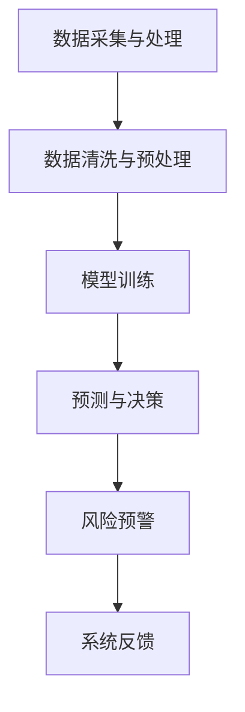

                 

# AI Agent在企业供应商管理与评估中的应用

## 关键词
- AI Agent
- 供应商管理
- 评估
- 企业运营
- 人工智能

## 摘要
本文将探讨如何利用AI Agent提升企业供应商管理与评估的效率和质量。首先介绍AI Agent的基本概念和原理，然后详细分析其在供应商识别、关系管理和绩效评估等方面的应用。最后，通过具体案例研究展示AI Agent在实践中的实际效果，并提出未来研究方向。

## 引言与背景介绍

### 1.1 问题背景
供应商管理是企业运营中至关重要的一环，直接影响到产品质量、交付及时性和成本控制。然而，传统的供应商管理方法往往依赖于人工经验，存在以下问题：
1. 数据处理效率低下
2. 评估标准主观性强
3. 风险预警不及时

AI Agent作为一种具有自主学习和决策能力的智能系统，为供应商管理提供了新的解决方案。通过利用AI技术，AI Agent可以自动化地识别、筛选和评估供应商，从而提高管理效率，降低风险。

### 1.2 问题描述
当前供应商管理面临的主要挑战包括：
1. 数据量庞大，难以进行有效处理和分析
2. 缺乏统一的评估标准，导致评估结果不一致
3. 风险识别能力不足，可能导致供应链中断

AI Agent在供应商管理中具有以下潜在优势：
1. 高效的数据处理和分析能力
2. 依据数据驱动的评估标准
3. 智能的风险预警机制

### 1.3 问题解决
AI Agent的核心概念和技术包括：
1. 自主学习算法，用于从数据中提取规律和模式
2. 决策树、神经网络等机器学习模型，用于分类和预测
3. 自然语言处理技术，用于处理和解析文本数据

AI Agent在供应商管理中的应用包括：
1. 供应商识别与筛选
2. 供应商关系管理
3. 供应商绩效评估
4. 供应商风险分析与预警

### 1.4 边界与外延
AI Agent的应用范围涵盖从供应商识别到风险管理的整个供应商管理流程。此外，AI Agent还可以与其他供应链管理技术相结合，如物联网、区块链等，以实现更全面的供应链优化。

### 1.5 概念结构与核心要素组成
AI Agent由以下关键组成部分构成：
1. 数据采集与处理模块
2. 自主学习算法模块
3. 决策支持系统模块
4. 风险预警系统模块

AI Agent的工作流程包括：
1. 数据采集：收集供应商的各类数据
2. 数据处理：清洗和预处理数据，为模型训练做准备
3. 模型训练：利用学习算法训练模型
4. 预测与决策：根据模型预测结果进行供应商评估和风险预警
5. 系统反馈：根据实际反馈调整模型和策略

## 核心概念与原理

### 2.1 AI Agent的基本原理
AI Agent是一种具有自主决策和学习能力的智能系统，能够模拟人类思维和行为。其核心特点是：
1. 自主性：AI Agent能够独立完成特定任务，无需人工干预
2. 学习性：AI Agent能够从数据中学习，不断优化自身性能
3. 沟通性：AI Agent能够与外部环境进行交互，获取信息和反馈

### 2.2 AI Agent的架构与分类
AI Agent的典型架构包括：
1. 数据采集模块：用于收集供应商的各类数据
2. 数据处理模块：用于清洗和预处理数据
3. 模型训练模块：用于训练学习模型
4. 预测与决策模块：用于生成预测结果和决策建议
5. 风险预警模块：用于识别和预警供应商风险

根据应用场景和功能，AI Agent可以分为以下几类：
1. 识别型AI Agent：主要用于识别和筛选供应商
2. 评估型AI Agent：主要用于对供应商进行绩效评估
3. 风险预警型AI Agent：主要用于识别和预警供应商风险
4. 全面管理型AI Agent：具备识别、评估和风险预警功能，实现全面供应商管理

### 2.3 供应商管理与评估的数学模型
在供应商管理与评估中，常用的数学模型包括：
1. 运筹学模型：如线性规划、整数规划等，用于优化供应商选择和资源配置
2. 绩效评估模型：如层次分析法（AHP）、模糊综合评价法等，用于量化评估供应商绩效
3. 风险评估模型：如贝叶斯网络、模糊综合评价法等，用于识别和评估供应商风险

### 2.4 AI Agent的算法原理
AI Agent常用的算法包括：
1. 决策树：通过树形结构对数据进行分类和预测
2. 神经网络：通过多层神经元对数据进行建模和预测
3. 支持向量机（SVM）：通过最大化分类间隔进行分类
4. 贝叶斯网络：通过概率图模型进行推理和预测

算法流程图如下：

## AI Agent在供应商管理中的应用

### 3.1 供应商识别与筛选
在供应商识别与筛选中，AI Agent的主要任务是：
1. 数据采集：收集供应商的各类信息，如资质、历史订单、质量记录等
2. 数据预处理：清洗和预处理数据，去除噪声和异常值
3. 识别与筛选：利用机器学习算法对供应商进行分类和筛选，识别出优质供应商

### 3.2 供应商关系管理
在供应商关系管理中，AI Agent的主要任务是：
1. 建立合作关系：通过分析供应商数据和业务需求，选择合适的供应商建立合作关系
2. 维护与优化关系：通过监控供应商的绩效和风险，及时调整合作关系，确保供应商稳定可靠
3. 互动与沟通：利用自然语言处理技术，与供应商进行实时沟通，解决合作过程中的问题

### 3.3 供应商绩效评估
在供应商绩效评估中，AI Agent的主要任务是：
1. 数据采集：收集供应商的各类绩效数据，如交货准时率、产品质量合格率等
2. 数据预处理：清洗和预处理数据，确保数据的一致性和可靠性
3. 评估与排名：利用绩效评估模型对供应商进行评估和排名，识别出优秀供应商
4. 反馈与改进：根据评估结果，向供应商反馈问题和改进建议，推动供应商绩效提升

### 3.4 供应商风险分析与预警
在供应商风险分析与预警中，AI Agent的主要任务是：
1. 数据采集：收集供应商的各类风险数据，如信用风险、操作风险等
2. 数据预处理：清洗和预处理数据，确保数据的一致性和可靠性
3. 风险评估：利用风险评估模型对供应商进行风险评估，识别出高风险供应商
4. 预警与应对：根据风险评估结果，向企业发出预警信息，并制定相应的应对策略，降低供应商风险

## 系统设计与实现

### 4.1 系统需求分析
在系统需求分析中，我们需要明确以下内容：
1. 功能需求：包括供应商识别与筛选、供应商关系管理、供应商绩效评估和供应商风险预警等功能
2. 非功能需求：包括系统稳定性、安全性、可扩展性和用户体验等

### 4.2 系统架构设计
系统架构设计包括以下内容：
1. 整体架构：采用模块化设计，将系统划分为数据采集模块、数据处理模块、模型训练模块、预测与决策模块和风险预警模块
2. 子系统划分与交互：各个模块之间通过接口进行数据交互和功能调用，确保系统的整体性和协同性

### 4.3 数据库设计
数据库设计包括以下内容：
1. 数据库结构：设计供应商数据、绩效数据、风险数据等数据库表结构
2. 数据库表设计：定义表中的字段、数据类型、约束条件和索引

### 4.4 系统接口设计
系统接口设计包括以下内容：
1. 接口规范：定义接口的输入参数、输出参数和调用方法
2. 接口实现：实现接口的调用和响应，确保系统的稳定性和可扩展性

## 项目实战

### 5.1 环境安装
在项目实战中，首先需要安装以下环境：
1. Python编程环境
2. 相关库和框架，如scikit-learn、TensorFlow、Keras等

### 5.2 系统核心实现源代码
系统核心实现包括以下部分：
1. 数据采集与处理：使用Python编写数据采集和处理脚本，实现数据的清洗、预处理和存储
2. 模型训练与预测：使用Python编写机器学习模型训练脚本，实现模型训练、预测和评估
3. 风险预警与决策：使用Python编写风险预警和决策脚本，实现风险识别、预警和应对策略

### 5.3 代码应用解读与分析
在代码应用解读与分析中，我们需要详细解析以下部分：
1. 数据采集与处理：解释数据采集的方法、数据处理流程和存储方式
2. 模型训练与预测：解释模型训练的算法原理、参数设置和预测效果
3. 风险预警与决策：解释风险预警的算法原理、预警规则和决策策略

### 5.4 实际案例分析和详细讲解剖析
在案例分析和讲解中，我们将选择一个具体的企业供应商管理项目，详细解析以下内容：
1. 案例背景：介绍企业的基本情况、供应商管理现状和存在的问题
2. 案例分析：分析企业供应商管理中的具体问题和挑战，确定解决方案
3. 案例实施：详细讲解案例的实施过程、关键步骤和实现方法
4. 案例效果：评估案例的实施效果，总结经验和教训

### 5.5 项目小结
在项目小结中，我们将总结以下内容：
1. 项目目标：回顾项目的主要目标和预期成果
2. 实施过程：总结项目的实施过程和关键步骤
3. 成果评估：评估项目实施效果和成果，分析优缺点
4. 未来展望：展望项目的未来发展方向和改进空间

## 最佳实践与挑战

### 6.1 最佳实践
在供应商管理中，最佳实践包括：
1. 数据质量保障：确保数据来源可靠、数据清洗充分，提高数据质量
2. 模型优化与调整：根据实际情况不断调整模型参数，优化模型性能
3. 风险管理策略：制定合理的风险管理策略，降低供应商风险

### 6.2 面临的挑战
在供应商管理中，面临的挑战包括：
1. 数据隐私与安全：确保供应商数据的安全和隐私，防止数据泄露
2. 模型解释性：提高模型的可解释性，便于理解和信任
3. 算法公平性：确保算法评估结果公平，避免偏见和歧视

### 6.3 未来发展趋势
未来发展趋势包括：
1. 多模态数据处理：结合多种数据类型（如图像、文本、音频等），提高数据处理和分析能力
2. 智能决策支持：利用AI技术实现更智能的决策支持，提高决策效率和质量
3. 供应链协同管理：实现供应链上下游企业的协同管理，提高整体供应链效率

## 结论与未来工作方向

### 7.1 结论
本文通过详细分析和探讨，展示了AI Agent在企业供应商管理与评估中的应用价值。通过引入AI Agent，企业可以显著提高供应商管理的效率和质量，降低风险。

### 7.2 未来工作方向
未来研究方向包括：
1. 深度学习在供应商管理中的应用
2. AI Agent与其他供应链管理技术的融合
3. 智能供应链协同管理系统的开发与应用

### 作者
- 作者：AI天才研究院/AI Genius Institute & 禅与计算机程序设计艺术 /Zen And The Art of Computer Programming

### 结语
本文内容丰富，涵盖了AI Agent在企业供应商管理与评估中的应用的各个方面。通过逐步分析和讲解，希望能为广大读者提供有益的参考和启示。在未来的研究中，我们将继续探索AI Agent在供应链管理中的更多应用，为企业带来更大的价值。感谢您的阅读！

