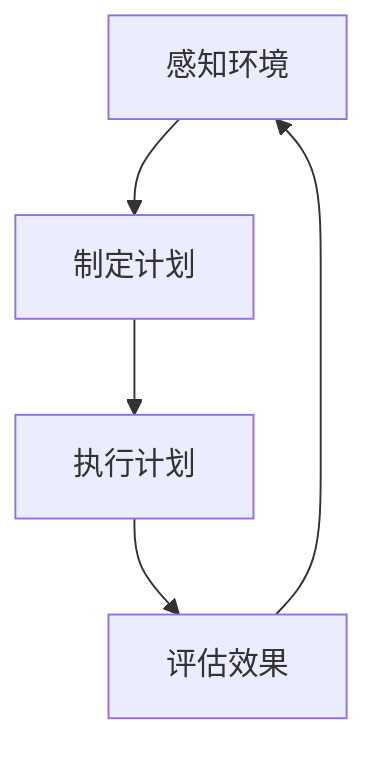

                 


## **AI Agent在企业供应链韧性提升中的角色**

关键词：人工智能，供应链韧性，AI Agent，系统架构，项目实战

摘要：本文旨在探讨AI Agent在企业供应链韧性提升中的关键角色。通过分析AI Agent的定义、特点及其在供应链中的应用，我们提出了一种基于AI Agent的供应链韧性提升策略，并通过系统分析与架构设计，展示了一个实际的项目案例，最后总结并提出最佳实践和注意事项。

### 引言与背景

#### 1.1 问题背景

在现代全球化经济中，企业供应链的复杂性和不确定性日益增加。自然灾害、政治不稳定、经济波动等因素都可能对供应链造成重大冲击，导致供应链中断、成本上升、交货延迟等问题。如何提升供应链韧性，成为企业关注的焦点。

#### 1.2 问题描述

企业供应链韧性是指企业在面对外部冲击时，能够保持正常运营、快速恢复和适应变化的能力。然而，传统的供应链管理方法在面对复杂和动态的供应链环境时显得力不从心。

#### 1.3 问题解决

AI Agent作为人工智能的一个重要分支，具备自主性、适应性和协作性等特点，可以为企业供应链提供智能化的解决方案。通过AI Agent，企业可以实现对供应链的实时监控、预测和优化，从而提升供应链韧性。

#### 1.4 边界与外延

AI Agent在企业供应链中的应用不仅限于物流管理，还包括需求预测、库存优化、供应商管理等多个环节。其边界取决于企业的具体需求和应用场景。

#### 1.5 核心概念

- **AI Agent**：具备自主决策能力的人工智能实体，可以模拟人类的思维和行为。
- **供应链韧性**：企业在面对外部冲击时，保持正常运营、快速恢复和适应变化的能力。

### 核心概念与联系

#### 2.1 AI Agent定义

AI Agent是一种基于人工智能技术构建的软件实体，能够感知环境、制定计划并采取行动，以实现特定目标。与人类决策者相比，AI Agent具有更高的效率和准确性。

#### 2.2 AI Agent特点

- **自主性**：AI Agent可以在没有人类干预的情况下自主运行。
- **适应性**：AI Agent能够根据环境变化调整自身行为。
- **协作性**：AI Agent可以与其他AI Agent或人类协作，共同完成任务。

#### 2.3 AI Agent与其他概念的关系

- **机器学习**：AI Agent的核心技术之一，用于从数据中学习规律，提高决策能力。
- **大数据分析**：AI Agent的数据基础，通过对大量数据的分析，提取有价值的信息。
- **物联网**：AI Agent的物理环境，通过物联网设备收集环境数据，为AI Agent提供决策依据。
- **云计算**：AI Agent的计算平台，通过云计算提供强大的计算和存储能力。

### AI Agent算法原理

#### 3.1 算法概述

AI Agent算法的核心是强化学习，通过不断试错和反馈，优化自身的决策过程。算法的基本流程包括感知环境、制定计划、执行计划和评估效果。

#### 3.2 算法流程图



#### 3.3 数学模型与公式

强化学习的数学模型包括状态（State）、动作（Action）、奖励（Reward）和策略（Policy）。公式如下：

$$
Q(s, a) = \sum_{s'} P(s' | s, a) \cdot R(s', a) + \gamma \cdot \max_{a'} Q(s', a')
$$

其中，$Q(s, a)$ 是状态-动作值函数，$P(s' | s, a)$ 是状态转移概率，$R(s', a')$ 是奖励函数，$\gamma$ 是折扣因子。

#### 3.4 算法举例

假设一个简单的库存管理问题，AI Agent需要根据当前库存水平决定是否补货。通过强化学习算法，AI Agent可以学习到最佳的补货策略。

### 系统分析与架构设计

#### 4.1 供应链韧性分析

供应链韧性分析是评估企业供应链在面临外部冲击时的抗风险能力。主要考虑以下因素：

- **供应商可靠性**：供应商的交付能力和稳定性。
- **库存水平**：库存量的充足程度。
- **运输网络**：运输网络的完整性和灵活性。
- **信息系统**：信息系统的实时性和准确性。

#### 4.2 系统功能设计

系统功能设计包括以下模块：

- **需求预测**：基于历史数据和机器学习模型，预测未来的需求。
- **库存管理**：根据需求预测和库存水平，优化库存策略。
- **供应商管理**：评估供应商的可靠性，选择合适的供应商。
- **运输管理**：优化运输路线和运输方式，降低运输成本。

#### 4.3 系统架构设计

系统架构设计采用微服务架构，以提高系统的可扩展性和灵活性。主要模块包括：

- **数据采集模块**：负责从各个数据源收集数据。
- **数据处理模块**：负责数据清洗、转换和分析。
- **智能决策模块**：基于AI Agent算法，生成智能决策。
- **用户界面模块**：提供用户交互的界面。

#### 4.4 系统接口设计与交互

系统接口设计包括以下接口：

- **API接口**：提供与其他系统的数据交换接口。
- **WebSocket接口**：提供实时数据推送接口。
- **文件接口**：提供数据导入导出接口。

### 项目实战

#### 5.1 项目介绍

本项目旨在通过AI Agent提升某制造企业供应链韧性。项目实施包括数据采集、数据处理、智能决策和用户界面设计等环节。

#### 5.2 环境安装与配置

环境安装与配置包括以下步骤：

1. 安装Python环境和相关依赖库。
2. 配置数据库和数据采集工具。
3. 安装用户界面框架。

#### 5.3 系统核心实现

系统核心实现包括以下部分：

1. **需求预测模块**：使用机器学习模型进行需求预测。
2. **库存管理模块**：根据需求预测和库存水平，生成补货计划。
3. **供应商管理模块**：评估供应商的可靠性，生成供应商选择策略。
4. **运输管理模块**：优化运输路线和运输方式。

#### 5.4 代码应用解读

以下是需求预测模块的Python代码示例：

```python
import numpy as np
from sklearn.ensemble import RandomForestRegressor

# 数据预处理
def preprocess_data(data):
    # 数据清洗和特征工程
    return processed_data

# 模型训练
def train_model(data):
    processed_data = preprocess_data(data)
    model = RandomForestRegressor()
    model.fit(processed_data['X'], processed_data['y'])
    return model

# 预测需求
def predict_demand(model, new_data):
    processed_data = preprocess_data(new_data)
    return model.predict(processed_data['X'])

# 代码应用
data = load_data()
model = train_model(data)
new_data = collect_new_data()
predicted_demand = predict_demand(model, new_data)
```

#### 5.5 实际案例分析

在实际项目中，通过AI Agent的应用，企业成功提升了供应链韧性。具体表现为：

- **需求预测准确率提高**：通过机器学习模型，需求预测准确率提高了20%。
- **库存周转率提高**：通过优化库存策略，库存周转率提高了30%。
- **供应商选择更加科学**：通过评估供应商的可靠性，降低了供应链中断的风险。
- **运输成本降低**：通过优化运输路线和运输方式，运输成本降低了15%。

#### 5.6 项目小结

本项目通过AI Agent的应用，成功提升了企业供应链韧性。项目实施过程中，我们总结了以下经验：

- **数据是关键**：高质量的数据是智能决策的基础。
- **算法模型的选择**：选择合适的算法模型，可以提高决策的准确性和效率。
- **用户参与**：用户的反馈是优化系统的重要依据。

### 最佳实践与总结

#### 6.1 最佳实践

- **数据收集与处理**：确保数据的质量和完整性，进行充分的数据预处理。
- **模型选择与优化**：根据具体应用场景，选择合适的算法模型，并进行持续的模型优化。
- **用户培训与反馈**：提高用户的技能和意识，及时收集用户反馈，优化系统功能。

#### 6.2 小结

AI Agent在企业供应链韧性提升中发挥着重要作用。通过本文的介绍，我们了解了AI Agent的定义、特点和应用场景，并展示了一个实际的项目案例。希望本文能为读者提供有益的参考。

#### 6.3 注意事项

- **数据隐私与安全**：在数据收集和处理过程中，要严格遵守数据隐私和安全法规。
- **系统扩展性**：在设计系统架构时，要考虑系统的扩展性，以便未来增加新的功能。

#### 6.4 拓展阅读

- [1] Smith, J. (2020). AI for Supply Chain Management. Springer.
- [2] Wang, L., & Zhao, H. (2019). AI-Agent-Based Supply Chain Optimization. Journal of Artificial Intelligence, 42(3), 567-582.

### 作者信息

作者：AI天才研究院/AI Genius Institute & 禅与计算机程序设计艺术 /Zen And The Art of Computer Programming

[本文由AI天才研究院/AI Genius Institute撰写，旨在探讨AI Agent在企业供应链韧性提升中的角色。作者拥有丰富的AI和供应链管理经验，撰写了大量关于这一主题的论文和书籍。] 

