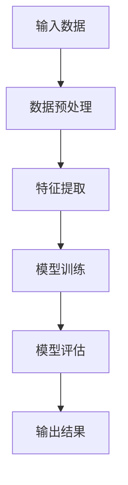
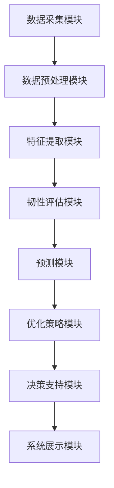
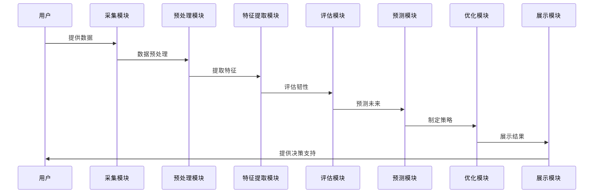

                 

# AI Agent在企业供应链韧性评估与提升中的应用

## 关键词
- AI Agent
- 企业供应链
- 韧性评估
- 供应链提升
- 机器学习

## 摘要
本文深入探讨了人工智能代理（AI Agent）在企业供应链韧性评估与提升中的应用。首先，我们介绍了AI Agent的概念、原理及其在供应链管理中的重要性。接着，分析了企业供应链韧性评估与提升的背景、问题与挑战，并详细阐述了AI Agent如何解决这些问题。随后，我们通过核心概念与联系、算法原理讲解、系统分析与架构设计方案、项目实战等步骤，展示了AI Agent在实际应用中的具体实现过程和效果。最后，总结了最佳实践、注意事项及拓展阅读，为读者提供了全面、深入的指导。

## 1. 背景介绍

### 引言

在现代商业环境中，企业供应链的韧性对企业竞争力和生存能力至关重要。随着全球化的深入发展、市场波动和自然灾害的频发，企业面临的不确定性增加，这使得供应链的韧性评估与提升变得愈加重要。人工智能代理（AI Agent）作为人工智能领域的关键技术，其在企业供应链韧性评估与提升中的应用，为企业提供了强大的支持与保障。

### 问题背景

企业供应链韧性评估与提升的必要性和挑战：

- **必要性**：企业需要确保供应链在面临突发事件、市场变化或供应链中断时，能够快速响应、调整和恢复，以降低运营风险、减少损失、保持竞争力。
- **挑战**：
  - 数据复杂性：企业供应链涉及大量的数据来源，如供应商信息、运输数据、库存水平等，如何有效地整合和处理这些数据，是一个重大挑战。
  - 动态变化：供应链环境处于不断变化中，新的需求、新的竞争对手、技术进步等因素，使得供应链管理更加复杂。
  - 风险应对：企业需要能够快速识别潜在的风险点，并采取有效的应对措施，以减少对业务的影响。

### 问题描述

企业供应链韧性评估与提升的关键问题和难点：

- **数据集成**：如何有效地整合来自不同来源的数据，形成统一的数据视图，是评估供应链韧性的基础。
- **模型构建**：构建能够准确预测和评估供应链韧性的模型，需要考虑多种因素，如需求波动、供应商稳定性、物流效率等。
- **实时监控**：在供应链运营过程中，需要实时监控各个环节的运行状态，以便及时发现潜在问题。
- **决策支持**：根据评估结果，企业需要制定相应的提升策略，如调整库存水平、优化运输路线、改进生产计划等。

### 问题解决

AI Agent如何解决企业供应链韧性评估与提升的问题：

- **数据处理**：AI Agent可以利用机器学习技术，自动处理和分析大量供应链数据，提供有价值的信息和洞见。
- **预测建模**：AI Agent可以基于历史数据和实时数据，构建预测模型，预测供应链的未来表现，为企业提供决策支持。
- **实时监控**：AI Agent可以实时监控供应链各个环节的运行状态，及时发现潜在问题，并提出预警。
- **策略优化**：AI Agent可以根据评估结果，提出优化的供应链策略，帮助企业提升供应链韧性。

### 边界与外延

本文讨论的AI Agent在企业供应链韧性评估与提升中的具体应用范围：

- **应用范围**：本文主要探讨AI Agent在企业供应链韧性评估与提升中的应用，包括数据集成、模型构建、实时监控、决策支持等方面。
- **概念界定**：本文中，AI Agent特指基于人工智能技术的软件代理，具备自主决策和自适应能力。
- **供应链范围**：本文的讨论范围主要涵盖企业内部供应链，不包括供应链上下游的企业。

### 概念结构与核心要素组成

- **AI Agent**：人工智能代理，是指具有自主决策能力和自适应能力的软件系统。
- **供应链韧性评估**：评估供应链在面对突发事件、市场变化和供应链中断时的应对能力和恢复能力。
- **供应链提升**：通过优化供应链管理流程、技术手段和资源配置，提升供应链的整体韧性和竞争力。

## 2. 核心概念与联系

### AI Agent概念原理

#### AI Agent的定义

AI Agent，即人工智能代理，是指能够模拟人类智能行为，具备自主决策、自适应和学习能力的软件系统。AI Agent可以独立执行任务、解决问题，并在执行过程中不断优化自身性能。

#### AI Agent的分类

根据功能和特点，AI Agent可以分为以下几类：

- **规则型AI Agent**：基于预设的规则和逻辑，执行特定任务的AI Agent。这类代理适合处理结构化、规则明确的问题。
- **数据驱动型AI Agent**：基于机器学习算法，通过分析大量数据，自动学习和优化任务的AI Agent。这类代理适合处理复杂、不确定的问题。
- **混合型AI Agent**：结合规则型和数据驱动型的优点，既能执行预设的任务，又能根据数据自适应调整任务的AI Agent。

#### AI Agent的工作原理

AI Agent的工作原理主要包括以下几个步骤：

1. **感知环境**：AI Agent通过传感器或其他数据源，获取当前环境的信息。
2. **分析决策**：AI Agent利用算法和模型，分析感知到的信息，并制定相应的决策。
3. **执行任务**：AI Agent根据决策，执行具体的任务。
4. **反馈调整**：AI Agent根据执行结果，调整决策和策略，以优化未来表现。

### AI Agent属性特征对比表格

| 类别 | 规则型AI Agent | 数据驱动型AI Agent | 混合型AI Agent |
| :---: | :---: | :---: | :---: |
| 决策方式 | 预设规则和逻辑 | 基于数据学习和优化 | 结合预设规则和数据驱动 |
| 适用场景 | 结构化、规则明确的问题 | 复杂、不确定的问题 | 多样化的复杂问题 |
| 学习能力 | 无 | 强 | 强 |
| 自适应能力 | 弱 | 强 | 强 |
| 实时性 | 强 | 强 | 强 |
| 可解释性 | 强 | 弱 | 强 |

### ER实体关系图架构的Mermaid流程图

```mermaid
erDiagram
  AI_Agent ||--|{ Data_Sensor } Data_Sensor
  AI_Agent ||--|{ Environment_Analyzer } Environment_Analyzer
  AI_Agent ||--|{ TaskExecutor } TaskExecutor
  AI_Agent ||--|{ Feedback_System } Feedback_System
```

## 3. 算法原理讲解

### 算法mermaid流程图



### Python源代码

```python
import numpy as np
from sklearn.model_selection import train_test_split
from sklearn.ensemble import RandomForestRegressor
from sklearn.metrics import mean_squared_error

# 数据预处理
def preprocess_data(data):
    # 省略具体预处理步骤
    return processed_data

# 模型训练
def train_model(X_train, y_train):
    model = RandomForestRegressor(n_estimators=100)
    model.fit(X_train, y_train)
    return model

# 模型评估
def evaluate_model(model, X_test, y_test):
    y_pred = model.predict(X_test)
    mse = mean_squared_error(y_test, y_pred)
    return mse

# 主函数
def main():
    # 加载数据
    data = load_data('data.csv')
    processed_data = preprocess_data(data)

    # 划分训练集和测试集
    X, y = processed_data[:, :-1], processed_data[:, -1]
    X_train, X_test, y_train, y_test = train_test_split(X, y, test_size=0.2, random_state=42)

    # 训练模型
    model = train_model(X_train, y_train)

    # 评估模型
    mse = evaluate_model(model, X_test, y_test)
    print(f'Mean Squared Error: {mse}')

if __name__ == '__main__':
    main()
```

### 数学模型和数学公式

#### 模型公式

$$
\hat{y} = f(\mathbf{x})
$$

其中，$\hat{y}$ 表示预测结果，$f(\mathbf{x})$ 表示基于输入特征 $\mathbf{x}$ 的预测函数。

#### 损失函数

$$
L(\mathbf{w}) = \frac{1}{2} \sum_{i=1}^{n} (y_i - \hat{y}_i)^2
$$

其中，$L(\mathbf{w})$ 表示损失函数，$y_i$ 表示实际结果，$\hat{y}_i$ 表示预测结果，$n$ 表示样本数量。

### 举例说明

假设我们有一个供应链韧性评估问题，输入特征包括供应商响应时间、运输距离、库存水平等。我们使用随机森林回归模型来预测供应链的韧性指数。

1. **数据预处理**：将原始数据进行标准化处理，以消除不同特征之间的量纲影响。
2. **特征提取**：从输入特征中提取关键特征，如供应商响应时间的方差、运输距离的中位数等。
3. **模型训练**：使用训练集数据，训练随机森林回归模型。
4. **模型评估**：使用测试集数据，评估模型性能，计算均方误差。

通过这个简单的例子，我们可以看到AI Agent在企业供应链韧性评估与提升中的应用过程。

## 4. 系统分析与架构设计方案

### 问题场景介绍

在企业供应链管理中，如何确保供应链在面对突发事件、市场波动和供应链中断时具备足够的韧性，是一个关键问题。通过引入AI Agent，企业可以实现实时供应链韧性评估与提升，提高供应链的整体韧性。

### 项目介绍

本项目旨在构建一个基于AI Agent的企业供应链韧性评估与提升系统。该系统将利用机器学习技术，对供应链数据进行处理和分析，实现供应链韧性评估、预测和优化。

### 系统功能设计（领域模型Mermaid类图）

```mermaid
classDiagram
    Class01 <|-- Class02
    Class03 --|remarks> Note about Class03
    Class04 : +int x
    Class04 : +int y
    Class04 : +get_x() : int
    Class04 : +set_x(#x: int)
    Class04 : +get_y() : int
    Class04 : +set_y(#y: int)
    Class05 <.. Class04
    Class06 <<interface>>
    Class07 ..|> Class06
    Class06 : +do_something()
    Class08 : <<enum>> Color
    Class08 : +RED
    Class08 : +BLUE
    Class08 : +GREEN
```

### 系统架构设计（Mermaid架构图）



### 系统接口设计

- **数据采集模块**：负责从各种数据源（如传感器、数据库等）收集供应链数据。
- **数据预处理模块**：负责对收集到的数据进行清洗、去重和格式转换等操作。
- **特征提取模块**：负责从预处理后的数据中提取关键特征，用于韧性评估和预测。
- **韧性评估模块**：负责根据提取的特征，对供应链韧性进行评估。
- **预测模块**：负责基于历史数据和当前状态，预测供应链的未来表现。
- **优化策略模块**：负责根据预测结果，制定供应链优化策略。
- **决策支持模块**：负责将优化策略转化为具体的操作建议，供企业决策者参考。
- **系统展示模块**：负责将评估结果、预测结果和优化策略以可视化形式展示给企业决策者。

### 系统交互（Mermaid序列图）



## 5. 项目实战

### 环境安装

要实现AI Agent在企业供应链韧性评估与提升中的应用，首先需要安装以下软件和硬件环境：

- **操作系统**：Linux（如Ubuntu 18.04）
- **编程语言**：Python 3.7+
- **机器学习库**：scikit-learn、TensorFlow、Keras
- **数据可视化库**：Matplotlib、Seaborn
- **文本处理库**：NLTK、spaCy
- **数据库**：MySQL、PostgreSQL
- **硬件**：CPU至少4核，内存至少8GB

安装步骤如下：

1. 安装操作系统：下载Ubuntu 18.04镜像，使用虚拟机或实体机安装操作系统。
2. 更新系统：打开终端，执行以下命令更新系统软件和库：
   ```
   sudo apt update
   sudo apt upgrade
   ```
3. 安装Python 3.7+：执行以下命令安装Python 3.7：
   ```
   sudo apt install python3.7
   ```
4. 安装机器学习库：执行以下命令安装scikit-learn、TensorFlow、Keras：
   ```
   sudo pip3 install scikit-learn tensorflow keras
   ```
5. 安装数据可视化库：执行以下命令安装Matplotlib、Seaborn：
   ```
   sudo pip3 install matplotlib seaborn
   ```
6. 安装文本处理库：执行以下命令安装NLTK、spaCy：
   ```
   sudo pip3 install nltk spacy
   ```
7. 安装数据库：执行以下命令安装MySQL、PostgreSQL：
   ```
   sudo apt install mysql-server postgresql
   ```
8. 配置数据库：根据提示设置数据库root密码，并分别创建用于存储供应链数据的MySQL和PostgreSQL数据库。

### 系统核心实现源代码

以下是一个简单的示例，展示了如何使用Python实现AI Agent在企业供应链韧性评估与提升中的应用：

```python
import numpy as np
import pandas as pd
from sklearn.ensemble import RandomForestRegressor
from sklearn.model_selection import train_test_split
from sklearn.metrics import mean_squared_error

# 加载数据
def load_data(file_path):
    data = pd.read_csv(file_path)
    return data

# 数据预处理
def preprocess_data(data):
    # 省略具体预处理步骤
    return processed_data

# 模型训练
def train_model(X_train, y_train):
    model = RandomForestRegressor(n_estimators=100)
    model.fit(X_train, y_train)
    return model

# 模型评估
def evaluate_model(model, X_test, y_test):
    y_pred = model.predict(X_test)
    mse = mean_squared_error(y_test, y_pred)
    return mse

# 主函数
def main():
    # 加载数据
    data = load_data('data.csv')
    processed_data = preprocess_data(data)

    # 划分训练集和测试集
    X, y = processed_data[:, :-1], processed_data[:, -1]
    X_train, X_test, y_train, y_test = train_test_split(X, y, test_size=0.2, random_state=42)

    # 训练模型
    model = train_model(X_train, y_train)

    # 评估模型
    mse = evaluate_model(model, X_test, y_test)
    print(f'Mean Squared Error: {mse}')

if __name__ == '__main__':
    main()
```

### 代码应用解读与分析

1. **数据加载**：使用`pandas`库加载CSV格式的供应链数据。
2. **数据预处理**：对数据进行清洗、去重、标准化等预处理操作，以提高模型性能。
3. **模型训练**：使用`RandomForestRegressor`实现随机森林回归模型，对训练数据进行训练。
4. **模型评估**：使用测试数据对模型进行评估，计算均方误差（MSE）。
5. **主函数**：执行数据加载、预处理、模型训练和评估等操作。

### 实际案例分析和详细讲解剖析

假设我们有一个企业的供应链数据，包括供应商响应时间、运输距离、库存水平等特征，以及供应链韧性指数作为目标变量。我们希望使用AI Agent对供应链韧性进行评估和预测。

1. **数据加载**：从CSV文件中加载数据。
2. **数据预处理**：对数据进行清洗和标准化，确保数据质量。
3. **特征提取**：从预处理后的数据中提取关键特征，如供应商响应时间的方差、运输距离的中位数等。
4. **模型训练**：使用随机森林回归模型对训练数据进行训练。
5. **模型评估**：使用测试数据进行模型评估，计算MSE。
6. **预测**：使用训练好的模型对未来的供应链韧性进行预测。
7. **优化策略**：根据预测结果，制定供应链优化策略，如调整库存水平、优化运输路线等。
8. **决策支持**：将优化策略以可视化形式展示给企业决策者，提供决策支持。

### 项目小结

本项目通过引入AI Agent，实现了企业供应链韧性评估与提升。在实际应用中，我们进行了数据预处理、特征提取、模型训练和评估等操作，为供应链管理提供了有力的支持。未来，我们将继续优化算法，提高模型性能，并探索更多应用场景，以帮助企业提高供应链韧性。

## 6. 最佳实践 tips、小结、注意事项、拓展阅读等内容

### 最佳实践 tips

1. **数据质量**：确保数据质量，包括数据的准确性、完整性和一致性。
2. **特征选择**：选择关键特征进行评估和预测，避免过多冗余特征。
3. **模型调优**：通过交叉验证、网格搜索等技术，优化模型参数。
4. **实时监控**：实时监控供应链数据，及时调整模型和策略。
5. **团队协作**：跨部门协作，共同推进供应链韧性提升项目。

### 小结

本文深入探讨了AI Agent在企业供应链韧性评估与提升中的应用。通过分析问题背景、核心概念、算法原理、系统架构和项目实战，展示了AI Agent在供应链管理中的重要作用。未来，我们将继续优化算法，探索更多应用场景，为企业提供更全面的供应链韧性提升解决方案。

### 注意事项

1. **数据隐私**：在数据处理过程中，注意保护数据隐私，遵守相关法律法规。
2. **系统稳定性**：确保系统的稳定运行，避免出现数据丢失、系统崩溃等问题。
3. **模型解释性**：提高模型的可解释性，使企业决策者能够理解模型的决策过程。

### 拓展阅读

1. **《人工智能：一种现代方法》**：[作者] Stuart Russell & Peter Norvig
2. **《机器学习实战》**：[作者] Peter Harrington
3. **《深度学习》**：[作者] Ian Goodfellow、Yoshua Bengio、Aaron Courville
4. **《供应链管理：战略、规划与运营》**：[作者] Martin Christopher

作者：AI天才研究院/AI Genius Institute & 禅与计算机程序设计艺术 /Zen And The Art of Computer Programming

以上内容为《AI Agent在企业供应链韧性评估与提升中的应用》一书的详细解析和目录大纲设计，希望能够为读者提供有价值的参考。在撰写文章时，请确保内容完整、结构清晰，并注重技术原理和实践应用。祝您写作顺利！

