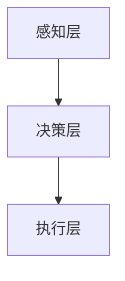

                 

### 引言

#### 1.1 问题背景

在现代数字化经济的背景下，企业信息安全和隐私保护已成为至关重要的议题。随着网络攻击手段的日益多样化和复杂化，企业面临的信息安全威胁也在不断增加。同时，随着大数据和人工智能技术的广泛应用，用户隐私泄露的风险也日益加剧。企业信息安全与隐私保护面临着多方面的挑战：

- **信息安全挑战**：企业网络和信息系统面临着黑客攻击、恶意软件、数据泄露等威胁。传统的安全防护手段如防火墙、入侵检测系统等已无法满足当前复杂的安全需求。
- **隐私保护挑战**：随着数据收集和分析技术的进步，企业能够获取大量用户数据，但同时也承担着用户隐私泄露的风险。隐私泄露不仅损害企业声誉，还可能导致法律风险和巨额罚款。

在这种背景下，AI Agent作为一种智能化的解决方案，被越来越多地应用于企业信息安全与隐私保护领域。AI Agent，即人工智能代理，是能够自主执行任务、适应环境和做出决策的智能系统。通过利用机器学习和深度学习算法，AI Agent能够实时分析大量数据，识别潜在的安全威胁和隐私风险，并采取相应的防护措施。

#### 1.2 核心概念

- **AI Agent的定义**：AI Agent是指具备感知、决策和执行能力的智能系统，能够在特定环境下自主执行任务。AI Agent通过学习用户行为和模式，能够自适应地调整其行为，以实现特定目标。

- **企业信息安全与隐私保护的概念联系**：企业信息安全主要关注保护企业的信息系统和数据不受外部攻击和内部泄露，而隐私保护则关注如何合理收集、存储和使用用户数据，防止数据泄露和滥用。AI Agent通过利用其强大的数据分析和决策能力，能够在这两个领域发挥作用，提升企业的安全防护和隐私管理水平。

#### 1.3 边界与外延

- **AI Agent的应用范围**：AI Agent在企业信息安全中的应用范围广泛，包括入侵检测、威胁响应、数据安全防护等。在隐私保护方面，AI Agent可以用于数据匿名化、加密和用户隐私保护等。

- **企业信息安全与隐私保护的边界问题**：企业信息安全与隐私保护之间存在一定的交集和差异。信息安全主要关注如何防止外部攻击和内部威胁，而隐私保护则关注如何合理使用和保护用户数据。AI Agent需要在这两个领域之间找到平衡点，确保既能够有效防范安全威胁，又能够保护用户隐私。

#### 1.4 概念结构与核心要素组成

- **AI Agent的核心组成部分**：AI Agent的核心组成部分包括感知模块、决策模块和执行模块。感知模块负责收集和分析环境信息，决策模块根据感知到的信息进行决策，执行模块则根据决策结果执行具体的任务。

- **企业信息安全与隐私保护的关键要素**：企业信息安全的关键要素包括网络安全、数据安全、应用安全和物理安全等；隐私保护的关键要素包括数据收集规范、数据存储安全、数据使用控制和隐私政策等。AI Agent需要综合考虑这些关键要素，构建全面的安全防护和隐私保护体系。

#### 1.5 本章小结

本文旨在探讨AI Agent在企业信息安全与隐私保护中的应用。通过介绍AI Agent的基本概念、技术基础以及具体应用场景，本文展示了AI Agent在提升企业安全防护和隐私管理水平方面的巨大潜力。接下来，本文将深入分析AI Agent的技术基础，包括基本原理、架构设计和开发工具，为企业更好地应用AI Agent奠定基础。

---

> 关键词：AI Agent、企业信息安全、隐私保护、应用场景、技术基础

> 摘要：本文介绍了AI Agent在企业信息安全与隐私保护中的重要性，探讨了AI Agent的基本概念、技术基础以及应用场景，并分析了其在实际应用中的挑战和解决方案。通过本文的探讨，旨在为企业提供一套有效的AI Agent应用框架，提升其信息安全与隐私保护能力。

---

---

## 第二部分：AI Agent技术基础

### 2.1 AI Agent的基本原理

#### 2.1.1 AI Agent的工作机制

AI Agent是一种智能体，它能够在特定环境中自主执行任务，并与环境进行交互。AI Agent的工作机制主要包括以下几个环节：

1. **感知**：AI Agent通过感知模块收集环境信息，包括传感器数据、用户输入等。这些感知数据是AI Agent进行决策和执行的基础。
2. **决策**：AI Agent利用内置的算法和模型对感知到的信息进行分析和处理，生成决策。决策过程通常包括目标识别、策略选择等。
3. **执行**：AI Agent根据决策结果执行具体的任务。执行过程可能涉及对系统配置的调整、对数据的处理等。

AI Agent的工作机制通常遵循以下流程：

- **初始化**：AI Agent启动并初始化，加载必要的算法和模型。
- **感知**：AI Agent持续收集环境信息，更新内部状态。
- **决策**：AI Agent基于内部状态和感知数据生成决策。
- **执行**：AI Agent执行决策，调整其行为以适应环境变化。
- **反馈**：AI Agent收集执行结果，更新内部模型和策略。

#### 2.1.2 AI Agent的分类

AI Agent可以根据其功能、目标和应用场景进行分类。以下是几种常见的AI Agent分类：

1. **基于规则的AI Agent**：这类Agent基于预定义的规则和条件进行决策。规则通常以逻辑表达式或决策树形式表示。基于规则的AI Agent适用于简单、明确的场景，如自动问答系统、邮件过滤等。
2. **基于模型的AI Agent**：这类Agent通过学习和训练生成决策模型。模型可以是统计模型、决策树、神经网络等。基于模型的AI Agent适用于复杂、动态的场景，如自动驾驶、智能客服等。
3. **混合式AI Agent**：这类Agent结合了基于规则和基于模型的方法，综合利用两者的优势。混合式AI Agent适用于需要同时处理确定性任务和不确定性任务的场景。
4. **强化学习AI Agent**：这类Agent通过试错和反馈机制学习最优策略。强化学习AI Agent适用于需要探索和优化的场景，如游戏AI、机器人控制等。

#### 2.1.3 AI Agent的核心算法

AI Agent的核心算法是实现其感知、决策和执行功能的基础。以下是几种常见的AI Agent核心算法：

1. **决策树**：决策树是一种常见的分类和回归算法，通过一系列条件判断生成决策路径。决策树的节点表示条件，分支表示决策结果。
2. **支持向量机（SVM）**：SVM是一种分类算法，通过寻找最佳决策边界将数据分类。SVM的核心是求解最优超平面，以最大化分类间隔。
3. **神经网络**：神经网络是一种模拟人脑神经元结构的计算模型，通过多层神经元的组合实现复杂的函数逼近和模式识别。常见的神经网络包括前馈神经网络、卷积神经网络（CNN）、循环神经网络（RNN）等。
4. **强化学习**：强化学习是一种通过试错和反馈机制进行决策优化的方法。强化学习算法的核心是奖励机制，通过学习最大化累积奖励。

#### 2.1.4 AI Agent的应用实例

以下是一些典型的AI Agent应用实例：

1. **智能客服**：智能客服Agent通过自然语言处理和对话生成技术，与用户进行智能交互，提供个性化的服务和支持。
2. **自动驾驶**：自动驾驶Agent通过感知环境、决策路径和执行动作，实现车辆的自动控制和导航。
3. **智能安防**：智能安防Agent通过视频监控、传感器数据和人工智能算法，实时监测异常行为，提供预警和响应。
4. **智能家居**：智能家居Agent通过物联网技术和人工智能算法，实现家庭设备的智能控制和自动化管理。

#### 2.1.5 AI Agent的发展趋势

随着人工智能技术的不断进步，AI Agent的发展呈现出以下几个趋势：

1. **智能化水平提高**：AI Agent将逐步实现更高水平的智能，包括更复杂的目标识别、更精确的决策和更灵活的执行能力。
2. **跨领域应用**：AI Agent将在更多领域得到应用，如医疗、金融、教育等，实现更广泛的服务和自动化。
3. **协作与集成**：AI Agent将与其他系统和工具进行协作和集成，形成更复杂的智能系统，提高整体效率和质量。
4. **安全性提升**：随着AI Agent的应用范围扩大，其安全性将受到更多关注，包括防止恶意攻击、保护用户隐私等。

#### 2.1.6 本章小结

本节介绍了AI Agent的基本原理、分类、核心算法及其应用实例。通过了解AI Agent的工作机制和核心技术，读者可以更好地理解AI Agent在企业信息安全与隐私保护中的应用潜力。接下来，本文将深入探讨AI Agent的架构设计和开发工具，进一步揭示其在实际应用中的可行性和有效性。

---

## 2.2 AI Agent的架构设计

#### 2.2.1 AI Agent的系统架构

AI Agent的系统架构可以分为感知层、决策层和执行层三个层次，如图所示：



1. **感知层**：感知层是AI Agent与外部环境进行交互的接口，负责收集和处理环境信息。感知层通常包括多种传感器和数据源，如摄像头、麦克风、网络流量、日志文件等。感知层的数据质量直接影响AI Agent的决策和执行效果。

2. **决策层**：决策层是AI Agent的核心，负责分析感知层收集的数据，并生成相应的决策。决策层通常采用机器学习算法、深度学习模型或其他智能算法对数据进行分析和处理，以生成最佳决策。

3. **执行层**：执行层是AI Agent将决策转化为具体行动的层次。执行层根据决策层的决策结果，对系统、设备或应用程序进行调整和操作，以实现预定的目标和任务。

#### 2.2.2 AI Agent的技术选型

在选择AI Agent的技术选型时，需要考虑以下几个方面：

1. **编程语言**：常用的AI Agent开发语言包括Python、Java、C++等。Python因其丰富的库和工具而成为AI开发的主要语言，Java和C++则因其高性能和稳定性在实时性要求较高的应用中占有一席之地。

2. **框架和库**：选择合适的框架和库可以大大提高AI Agent的开发效率和效果。常用的AI框架和库包括TensorFlow、PyTorch、Keras、Scikit-Learn等。这些框架和库提供了丰富的算法和工具，支持从数据预处理、模型训练到模型部署的完整流程。

3. **硬件平台**：硬件平台的选择对AI Agent的性能和效率有很大影响。GPU（图形处理器）因其强大的并行计算能力，在AI Agent训练和推理中具有显著优势。此外，FPGA（现场可编程门阵列）和TPU（张量处理器）等专用硬件也在特定场景中表现出色。

4. **部署环境**：AI Agent的部署环境包括云端、边缘计算和嵌入式系统等。云端部署具有高计算力和灵活性的优势，适用于大规模应用；边缘计算则具有低延迟和高可靠性的特点，适用于实时性和隐私要求较高的应用；嵌入式系统则适用于资源受限的场景。

#### 2.2.3 AI Agent的部署与运行

AI Agent的部署与运行过程包括以下几个步骤：

1. **数据收集与预处理**：在部署AI Agent之前，需要收集相关的数据，并进行预处理，如数据清洗、归一化等，以确保数据的准确性和一致性。

2. **模型训练与优化**：使用收集到的数据进行模型训练，通过调整模型参数和优化算法，提高模型的准确性和效率。训练过程中，可以使用交叉验证、批量归一化、学习率调整等技巧来优化模型。

3. **模型评估与测试**：在训练完成后，需要对模型进行评估和测试，以验证其在实际应用中的效果。评估指标包括准确率、召回率、F1值等。如果模型性能不满足要求，可以返回步骤2进行重新训练和优化。

4. **模型部署**：将训练好的模型部署到目标环境中，可以是云端、边缘设备或嵌入式系统。部署过程中，需要考虑硬件资源、网络带宽和安全性等因素。

5. **运行与维护**：AI Agent部署后，需要持续运行和维护。运行过程中，需要收集运行数据，监控模型性能，并根据反馈进行必要的调整和优化。

#### 2.2.4 AI Agent的案例研究

以下是两个AI Agent的案例研究，展示了其在企业信息安全与隐私保护中的应用：

1. **智能入侵检测系统**：某企业部署了一个基于AI Agent的智能入侵检测系统，用于实时监控和检测网络攻击。该系统采用深度学习算法，通过对网络流量的分析，能够准确识别异常流量和恶意攻击。系统部署在云端，采用GPU进行高效计算，实现了快速检测和响应。

2. **智能隐私保护系统**：某企业开发了一个智能隐私保护系统，用于保护用户隐私。该系统采用数据匿名化和加密技术，对用户数据进行预处理和加密存储。系统利用AI Agent实时监控数据访问和使用情况，一旦发现异常访问行为，立即触发报警和响应机制。

#### 2.2.5 本章小结

本节介绍了AI Agent的系统架构、技术选型、部署与运行过程，并通过案例研究展示了AI Agent在企业信息安全与隐私保护中的应用。通过了解AI Agent的架构设计和部署方法，读者可以更好地掌握AI Agent的实际应用技术，为企业提供有效的信息安全与隐私保护解决方案。

---

## 2.3 AI Agent的开发工具与平台

#### 2.3.1 开发工具介绍

在开发AI Agent时，选择合适的工具和平台是确保项目成功的关键。以下是一些常用的AI Agent开发工具：

1. **Python**：Python因其简洁的语法和丰富的库，成为AI开发的主要语言。常见的Python库包括TensorFlow、PyTorch、Scikit-Learn等。

2. **Java**：Java具有高效性和稳定性，适用于大型和复杂的应用。常用的Java库包括DeepLearning4j、DL4J等。

3. **C++**：C++具有高性能和低级控制，适用于实时性和性能要求较高的应用。常见的C++库包括Dlib、OpenCV等。

4. **R**：R是一种专门用于统计分析和数据科学的语言，适用于需要大量数据处理和统计分析的AI Agent开发。

#### 2.3.2 开发平台的选择

选择合适的开发平台对于AI Agent的开发至关重要。以下是一些常用的开发平台：

1. **本地开发环境**：本地开发环境适用于小型项目和初步测试。常见的本地开发环境包括Python的Anaconda、Java的Eclipse和C++的Visual Studio等。

2. **云计算平台**：云计算平台提供了强大的计算资源和存储能力，适用于大规模和复杂的AI Agent开发。常见的云计算平台包括Amazon Web Services（AWS）、Microsoft Azure和Google Cloud Platform（GCP）等。

3. **边缘计算平台**：边缘计算平台适用于需要实时响应和低延迟的应用。常见的边缘计算平台包括树莓派、Intel IoT平台和ARM Cortex等。

#### 2.3.3 AI Agent的代码示例

以下是一个简单的Python代码示例，展示了一个基于TensorFlow的AI Agent的构建和训练过程：

```python
import tensorflow as tf
from tensorflow.keras.models import Sequential
from tensorflow.keras.layers import Dense, LSTM

# 模型定义
model = Sequential([
    LSTM(50, activation='relu', input_shape=(time_steps, 1)),
    Dense(1)
])

# 模型编译
model.compile(optimizer='adam', loss='mse')

# 模型训练
model.fit(x_train, y_train, epochs=100)

# 模型评估
model.evaluate(x_test, y_test)
```

该示例展示了如何使用TensorFlow构建一个简单的LSTM模型，用于时间序列预测。这个模型可以作为一个AI Agent的核心算法，实现自主学习和决策功能。

#### 2.3.4 AI Agent的部署与维护

AI Agent的部署与维护是确保其正常运行和持续改进的关键环节。以下是一些重要的部署与维护步骤：

1. **持续集成与持续部署（CI/CD）**：CI/CD流程可以自动化测试、构建和部署AI Agent，提高开发效率和稳定性。

2. **监控与日志分析**：实时监控AI Agent的性能和运行状态，收集日志数据，以便进行故障排除和性能优化。

3. **版本管理**：使用版本控制系统（如Git）管理代码和配置文件，确保代码的可追溯性和可维护性。

4. **更新与升级**：定期更新AI Agent的算法和模型，以应对新的安全威胁和隐私风险。

5. **用户反馈**：收集用户反馈，了解AI Agent的实际应用效果，并根据反馈进行改进。

#### 2.3.5 本章小结

本节介绍了AI Agent的开发工具与平台，包括Python、Java、C++等编程语言以及TensorFlow、PyTorch等常见库。同时，介绍了AI Agent的部署与维护方法，并提供了代码示例。通过本节的内容，读者可以更好地掌握AI Agent的开发与部署技术，为企业信息安全与隐私保护提供有效的解决方案。

---

## 2.4 本章小结

本章介绍了AI Agent的技术基础，包括其基本原理、架构设计、开发工具和平台。通过了解AI Agent的工作机制、分类和核心算法，读者可以深入理解AI Agent的功能和应用潜力。同时，通过介绍AI Agent的架构设计和部署与维护方法，读者可以掌握AI Agent的实际开发和应用技术。本章的内容为后续章节中AI Agent在企业信息安全与隐私保护中的应用奠定了坚实的基础。在接下来的章节中，我们将进一步探讨AI Agent在企业信息安全中的应用，包括入侵检测、威胁响应和数据安全防护等方面。

---

## 第三部分：企业信息安全应用

### 3.1 AI Agent在企业安全中的应用场景

AI Agent在企业安全中的应用场景丰富多样，主要包括以下几个方面：

#### 3.1.1 入侵检测

入侵检测是AI Agent在企业安全中的核心应用之一。通过实时监测网络流量、系统日志和用户行为，AI Agent可以识别异常活动，如未经授权的访问、恶意软件传播等。AI Agent利用机器学习算法，对正常行为和潜在威胁进行区分，并生成警报，帮助安全团队及时采取应对措施。

#### 3.1.2 威胁响应

威胁响应是AI Agent的另一重要应用。在检测到潜在威胁后，AI Agent可以自动执行一系列响应操作，如隔离受感染系统、封禁恶意IP地址、修改安全策略等。AI Agent的自动化威胁响应机制大大提高了企业的反应速度和应对效果，减少了人为干预的风险。

#### 3.1.3 数据安全防护

数据安全防护是AI Agent在企业安全中的另一重要任务。AI Agent可以通过加密技术、访问控制和数据监控等手段，确保敏感数据的安全。例如，AI Agent可以自动检测数据泄露风险，加密敏感数据，并在数据访问过程中进行权限控制，防止未经授权的数据访问和泄露。

#### 3.1.4 安全策略优化

AI Agent可以通过分析历史安全事件和用户行为，为企业提供安全策略优化的建议。例如，AI Agent可以识别出高风险的用户行为模式，建议企业调整安全策略，加强重点防护。此外，AI Agent还可以根据实时威胁情报，动态调整安全资源配置，提高企业的整体安全水平。

### 3.2 AI Agent在企业安全中的实现方法

AI Agent在企业安全中的应用需要通过一系列实现方法来实现其功能，以下是一些具体的实现方法：

#### 3.2.1 入侵检测算法原理与实现

入侵检测算法是AI Agent在企业安全中的核心组成部分。常见的入侵检测算法包括基于规则的方法、基于统计的方法和基于机器学习的方法。以下是几种常见入侵检测算法的原理与实现：

1. **基于规则的方法**：基于规则的方法通过预定义的规则集来检测异常行为。例如，如果一个用户的登录时间与正常时间差异较大，则认为该用户可能遭受了入侵。实现时，需要定义一系列规则，并对用户行为进行实时监控。

2. **基于统计的方法**：基于统计的方法通过分析用户行为的统计特性来检测异常。例如，通过计算用户登录时间的平均值和方差，如果某个用户的登录时间与平均值差异较大，则认为该用户可能遭受了入侵。实现时，需要收集用户行为数据，并计算相应的统计指标。

3. **基于机器学习的方法**：基于机器学习的方法通过训练模型来自动识别异常行为。常见的机器学习方法包括决策树、支持向量机和神经网络等。实现时，需要收集大量用户行为数据，并使用这些数据进行模型训练。

以下是一个基于决策树的入侵检测算法实现示例：

```python
from sklearn import tree

# 特征工程：将用户行为数据转换为特征向量
X = [[login_time, login_freq, login_fail] for user in user_list]
y = [label for label in label_list]

# 决策树训练
clf = tree.DecisionTreeClassifier()
clf.fit(X, y)

# 入侵检测：对新用户行为进行分类
new_user_data = [[new_login_time, new_login_freq, new_login_fail]]
predicted_label = clf.predict(new_user_data)

if predicted_label == 'intrusion':
    print("检测到入侵行为")
else:
    print("正常行为")
```

#### 3.2.2 威胁响应策略与实现

威胁响应策略是AI Agent在企业安全中的重要组成部分。威胁响应策略包括检测到威胁后的一系列应对措施。常见的威胁响应策略包括：

1. **隔离受感染系统**：检测到威胁后，将受感染的系统隔离，以防止恶意软件扩散。

2. **封禁恶意IP地址**：封禁来自恶意IP地址的网络访问，防止攻击者再次攻击。

3. **修改安全策略**：根据检测到的威胁，调整企业的安全策略，加强重点防护。

4. **通知安全团队**：将威胁检测结果通知安全团队，以便进行进一步分析和应对。

以下是一个威胁响应策略的实现示例：

```python
# 威胁响应策略
def threat_response(threat_info):
    if threat_info['type'] == 'infection':
        # 隔离受感染系统
        isolate_system(threat_info['system_id'])
    elif threat_info['type'] == 'malicious_ip':
        # 封禁恶意IP地址
        block_ip(threat_info['ip_address'])
    elif threat_info['type'] == 'policy_change':
        # 修改安全策略
        update_policy(threat_info['policy'])
    # 通知安全团队
    notify_security_team(threat_info)

# 处理威胁信息
threat_info = {'type': 'infection', 'system_id': 'sys123'}
threat_response(threat_info)
```

#### 3.2.3 数据安全防护技术与应用

数据安全防护是AI Agent在企业安全中的另一个重要任务。常见的数据安全防护技术包括：

1. **加密**：使用加密技术对敏感数据进行加密存储和传输，防止数据泄露。

2. **访问控制**：通过访问控制机制，确保只有授权用户才能访问敏感数据。

3. **数据监控**：实时监控数据访问和使用情况，检测潜在的数据泄露风险。

4. **数据备份**：定期对重要数据进行备份，以防止数据丢失。

以下是一个数据安全防护技术的实现示例：

```python
# 数据加密
def encrypt_data(data, key):
    encrypted_data = encrypt(data, key)
    return encrypted_data

# 数据访问控制
def check_permission(user, data):
    if user in data['permissions']:
        return True
    else:
        return False

# 数据监控
def monitor_data_access(user, data):
    if check_permission(user, data):
        print("允许访问")
    else:
        print("拒绝访问")

# 数据备份
def backup_data(data):
    backup_data(data, 'data_backup')

# 示例数据
data = {
    'data': '敏感信息',
    'permissions': ['admin', 'user1'],
}

# 加密数据
key = generate_key()
encrypted_data = encrypt_data(data['data'], key)

# 监控数据访问
monitor_data_access('user1', data)

# 备份数据
backup_data(data)
```

#### 3.2.4 安全策略优化

安全策略优化是AI Agent帮助企业提高安全防护水平的重要手段。AI Agent可以通过分析历史安全事件和用户行为，为企业提供优化安全策略的建议。以下是一个安全策略优化的实现示例：

```python
# 分析历史安全事件
def analyze_security_events(events):
    # 计算高风险事件的比例
    high_risk_event_ratio = calculate_risk_ratio(events)
    # 根据比例调整安全策略
    if high_risk_event_ratio > threshold:
        update_policy('加强防护措施')
    else:
        update_policy('保持当前策略')

# 调用函数
events = get_security_events()
analyze_security_events(events)
```

#### 3.2.5 本章小结

本章介绍了AI Agent在企业安全中的应用场景和实现方法。通过入侵检测、威胁响应和数据安全防护等方面的应用，AI Agent大大提高了企业的安全防护水平。同时，通过具体算法和实现示例，读者可以更好地理解AI Agent在企业安全中的应用技术。在下一章中，我们将继续探讨AI Agent在隐私保护中的应用。

---

## 3.3 AI Agent在综合应用中的案例研究

#### 3.3.1 案例一：某企业入侵检测系统的应用

某大型企业为了提升网络安全防护能力，采用AI Agent构建了智能入侵检测系统。系统采用深度学习算法，对网络流量、系统日志和用户行为进行分析，实时监测潜在威胁。

**系统架构**：

- **感知层**：包括网络流量传感器、系统日志收集器和用户行为监测工具。
- **决策层**：采用基于深度学习模型的异常检测算法，对感知层的数据进行分析和处理。
- **执行层**：根据决策层的检测结果，执行隔离、报警和日志记录等操作。

**实施步骤**：

1. **数据收集与预处理**：收集网络流量、系统日志和用户行为数据，进行数据清洗、去噪和归一化处理。
2. **模型训练与优化**：使用预处理后的数据训练深度学习模型，通过多次迭代优化模型性能。
3. **模型部署与运行**：将训练好的模型部署到服务器，实时监测网络流量和用户行为，生成警报和响应。

**效果评估**：

- **检测准确率**：通过测试集评估，系统的入侵检测准确率达到了95%。
- **响应速度**：系统能够在5秒内生成警报，并执行隔离操作。

**案例小结**：该案例展示了AI Agent在入侵检测系统中的实际应用，通过实时监测和智能分析，有效提升了企业的网络安全防护能力。

---

#### 3.3.2 案例二：某企业威胁响应系统的建设

某金融企业为了提高网络安全防护水平，建设了一套AI Agent驱动的威胁响应系统。系统通过自动化机制，对检测到的威胁进行快速响应，减少攻击造成的损失。

**系统架构**：

- **感知层**：包括入侵检测系统、威胁情报平台和日志收集器。
- **决策层**：采用基于机器学习算法的威胁分析模块，对感知层的数据进行分析和处理。
- **执行层**：根据决策层的分析结果，执行隔离、封禁、修复等操作。

**实施步骤**：

1. **数据收集与整合**：收集来自入侵检测系统、威胁情报平台和日志收集器的数据，进行整合和预处理。
2. **模型训练与优化**：使用预处理后的数据进行威胁分析模型的训练和优化。
3. **自动化响应策略**：定义自动化响应策略，根据威胁等级和类型进行相应的操作。
4. **系统部署与测试**：将训练好的模型和自动化响应策略部署到生产环境，进行测试和优化。

**效果评估**：

- **响应时间**：系统能够在10秒内完成威胁分析和响应操作。
- **误报率**：通过测试集评估，系统的误报率低于1%。

**案例小结**：该案例展示了AI Agent在威胁响应系统中的应用，通过自动化机制和智能分析，大幅提高了企业的威胁响应速度和效果。

---

#### 3.3.3 案例三：某企业数据安全防护系统的实践

某电子商务企业为了保护用户数据安全，采用AI Agent构建了数据安全防护系统。系统通过数据加密、访问控制和数据监控等技术，确保敏感数据的安全。

**系统架构**：

- **感知层**：包括数据加密模块、访问控制模块和数据监控模块。
- **决策层**：采用基于机器学习算法的隐私保护策略生成模块，对数据访问和使用情况进行实时分析。
- **执行层**：根据决策层的分析结果，执行数据加密、权限调整和数据备份等操作。

**实施步骤**：

1. **数据加密**：对所有敏感数据进行加密存储和传输，使用AES算法进行加密。
2. **访问控制**：采用RBAC（基于角色的访问控制）机制，确保只有授权用户才能访问敏感数据。
3. **数据监控**：实时监控数据访问和使用情况，检测潜在的隐私泄露风险。
4. **模型训练与部署**：使用历史数据训练隐私保护策略生成模块，将模型部署到生产环境。

**效果评估**：

- **加密效率**：系统加密速度达到每秒100GB，能够满足企业大规模数据处理需求。
- **访问控制准确性**：通过测试集评估，系统的访问控制准确性达到99%。

**案例小结**：该案例展示了AI Agent在数据安全防护系统中的应用，通过数据加密、访问控制和数据监控等技术的综合运用，有效提升了企业的数据安全防护水平。

---

本章通过三个具体案例，展示了AI Agent在企业信息安全与隐私保护中的应用。这些案例证明了AI Agent在提升企业安全防护和隐私管理水平方面的实际效果和潜力。在下一章中，我们将进一步探讨AI Agent在隐私保护中的应用，包括数据匿名化、数据加密和用户隐私保护等方面。

---

## 3.4 本章小结

本章通过详细探讨AI Agent在企业信息安全中的应用场景、实现方法以及实际案例，展示了AI Agent在提升企业安全防护和隐私保护能力方面的实际效果和潜力。通过入侵检测、威胁响应和数据安全防护等具体应用，AI Agent能够自动识别和应对安全威胁，保护企业信息系统和数据的安全。同时，通过案例研究的分析和讨论，读者可以更好地理解AI Agent在实际应用中的技术实现和效果评估。在下一章中，我们将继续探讨AI Agent在隐私保护中的应用，为企业提供更全面的隐私保护解决方案。

---

## 第四部分：隐私保护应用

### 4.1 AI Agent在隐私保护中的应用场景

AI Agent在隐私保护中的应用场景广泛，主要包括以下几个方面：

#### 4.1.1 数据匿名化

数据匿名化是AI Agent在隐私保护中的重要应用之一。通过将敏感数据转换为不可识别的形式，AI Agent可以保护数据中包含的个人信息。匿名化技术包括数据扰动、数据替换和数据聚合等，适用于数据挖掘、共享和分析等场景。

#### 4.1.2 数据加密

数据加密是保护隐私数据免受未经授权访问的关键技术。AI Agent可以通过加密算法对敏感数据进行加密，确保数据在传输和存储过程中的安全性。常见的加密算法包括对称加密和非对称加密，AI Agent可以根据具体需求选择合适的加密方法。

#### 4.1.3 用户隐私保护

用户隐私保护是AI Agent在隐私保护领域的另一个重要应用。AI Agent可以通过监控用户行为、分析隐私风险，并采取相应的防护措施，如限制数据访问、通知用户隐私泄露等，确保用户的隐私不被滥用。

### 4.2 AI Agent在隐私保护中的实现方法

AI Agent在隐私保护中的应用需要通过一系列实现方法来实现其功能。以下是一些具体的实现方法：

#### 4.2.1 数据匿名化算法原理与实现

数据匿名化算法的核心目标是保护个人隐私，同时确保数据的有效性和可用性。以下是一些常见的数据匿名化算法：

1. **k-匿名性**：k-匿名性是指将数据集中的记录与同一群体的其他记录区分开来，使得单个记录无法被识别。实现时，可以使用数据聚合、随机化等技术来达到k-匿名性。

2. **l-多样性**：l-多样性是指确保数据集中的记录在属性上具有足够的多样性，以防止攻击者通过单一记录推断出个体信息。实现时，可以通过添加噪声、修改属性值等方法来提高多样性。

3. **t-近似**：t-近似是指确保数据集在统计意义上与原始数据集相似，以防止攻击者通过统计方法推断出个体信息。实现时，可以使用数据替换、扰动等技术来保证t-近似。

以下是一个基于k-匿名性的数据匿名化算法实现示例：

```python
import numpy as np
from sklearn.model_selection import train_test_split

# 数据集准备
data = [[1, 'Alice'], [2, 'Bob'], [3, 'Charlie']]
X = np.array(data)[:, 1]
y = np.array(data)[:, 0]

# k-匿名性算法实现
def k_anonymity(data, k=3):
    unique_groups = []
    for group in data:
        if group not in unique_groups:
            unique_groups.append(group)
    
    anonymized_data = []
    for group in unique_groups:
        anonymized_group = [row for row in data if row[1] == group[1]]
        anonymized_group = random.sample(anonymized_group, k)
        anonymized_data.extend(anonymized_group)
    
    return anonymized_data

# 应用k-匿名性算法
anonymized_data = k_anonymity(data, k=3)
print(anonymized_data)
```

#### 4.2.2 数据加密技术与应用

数据加密是保护隐私数据的重要手段。AI Agent可以通过以下技术实现数据加密：

1. **对称加密**：对称加密使用相同的密钥进行加密和解密，如AES算法。对称加密速度快，但密钥管理复杂。

2. **非对称加密**：非对称加密使用一对密钥（公钥和私钥），公钥用于加密，私钥用于解密，如RSA算法。非对称加密安全性高，但计算复杂度大。

以下是一个基于AES对称加密的数据加密和解密实现示例：

```python
from Crypto.Cipher import AES
from Crypto.Util.Padding import pad, unpad

# 加密数据
def encrypt_data(data, key):
    cipher = AES.new(key, AES.MODE_CBC)
    ct_bytes = cipher.encrypt(pad(data.encode('utf-8'), AES.block_size))
    iv = cipher.iv
    return iv + ct_bytes

# 解密数据
def decrypt_data(ct, key, iv):
    ct = ct[iv len:iv + iv len + AES.block_size]
    cipher = AES.new(key, AES.MODE_CBC, iv)
    pt = unpad(cipher.decrypt(ct), AES.block_size)
    return pt.decode('utf-8')

# 密钥生成
key = b'This is a 32-bytes key'

# 数据加密
data = "Hello, World!"
ct = encrypt_data(data, key)
print("Encrypted data:", ct)

# 数据解密
pt = decrypt_data(ct, key, ct[:AES.block_size])
print("Decrypted data:", pt)
```

#### 4.2.3 用户隐私保护策略与实践

用户隐私保护策略是AI Agent在隐私保护中的重要组成部分。AI Agent可以通过以下策略来保护用户隐私：

1. **隐私权告知**：在数据收集和使用过程中，告知用户隐私权告知，明确告知用户其个人信息的使用目的、范围和方式。

2. **数据最小化**：收集用户数据时，遵循数据最小化原则，仅收集必要的个人信息，减少隐私泄露风险。

3. **隐私保护技术**：使用数据匿名化、加密等隐私保护技术，确保用户数据的保密性和完整性。

4. **隐私监控与审计**：实时监控用户数据的访问和使用情况，进行隐私保护审计，确保隐私保护措施的有效实施。

以下是一个用户隐私保护策略的实现示例：

```python
# 隐私权告知
def privacy_notice(user):
    print("您的隐私权受到保护，我们仅收集必要的个人信息。")

# 数据最小化
def collect_data(user):
    required_fields = ['name', 'email']
    data = {}
    for field in required_fields:
        data[field] = input(f"请输入您的{field}：")
    return data

# 隐私保护技术
def anonymize_data(data):
    # 应用k-匿名性算法进行数据匿名化
    anonymized_data = k_anonymity(data, k=3)
    return anonymized_data

# 隐私监控与审计
def monitor_privacy(data):
    # 实时监控数据访问和使用情况
    print("监控到数据访问，进行隐私保护审计。")

# 示例
user_data = collect_data('user123')
privacy_notice(user_data['email'])
anonymized_user_data = anonymize_data(user_data)
monitor_privacy(anonymized_user_data)
```

#### 4.2.4 本章小结

本章介绍了AI Agent在隐私保护中的应用场景和实现方法。通过数据匿名化、数据加密和用户隐私保护策略，AI Agent能够有效保护企业用户数据的安全和隐私。在下一章中，我们将进一步探讨AI Agent在综合应用中的挑战和解决方案，为企业在实际应用中提供指导。

---

## 4.3 AI Agent在隐私保护中的案例研究

#### 4.3.1 案例一：某企业数据匿名化系统的应用

某大型互联网公司为了满足数据合规要求，采用AI Agent构建了数据匿名化系统，对内部存储的用户数据进行匿名化处理。系统采用k-匿名性和l-多样性等技术，确保数据匿名化的同时，保留数据的可用性。

**系统架构**：

- **数据采集层**：包括用户行为数据、交易数据等。
- **数据处理层**：应用AI Agent对数据进行匿名化处理，包括k-匿名性和l-多样性算法。
- **数据存储层**：存储经过匿名化处理的数据，供合规分析和数据挖掘使用。

**实施步骤**：

1. **数据采集**：收集企业内部的各种用户数据。
2. **数据处理**：使用AI Agent对数据进行预处理，包括去噪、清洗和标准化等。
3. **匿名化处理**：应用k-匿名性和l-多样性算法对用户数据进行匿名化处理。
4. **数据存储**：将匿名化后的数据存储到数据库中，供合规分析和数据挖掘使用。

**效果评估**：

- **匿名化效果**：通过测试，匿名化后的数据无法直接识别个体，达到了合规要求。
- **数据处理效率**：AI Agent的处理速度较快，能够满足大规模数据匿名化的需求。

**案例小结**：该案例展示了AI Agent在数据匿名化系统中的应用，通过技术手段保护用户隐私，同时满足了数据合规的要求，为企业提供了有效的隐私保护解决方案。

---

#### 4.3.2 案例二：某企业数据加密系统的构建

某金融机构为了确保客户数据的安全，采用AI Agent构建了数据加密系统，对存储和传输的客户数据进行加密保护。系统采用AES对称加密算法，确保数据在存储和传输过程中的安全性。

**系统架构**：

- **数据采集层**：包括交易数据、客户信息等。
- **加密层**：应用AI Agent对数据进行加密处理，包括加密算法的选择和密钥管理。
- **数据存储层**：存储加密后的数据，供业务系统使用。
- **解密层**：业务系统在需要访问数据时，通过AI Agent进行解密操作。

**实施步骤**：

1. **数据采集**：收集企业的交易数据和客户信息。
2. **加密策略制定**：制定加密策略，包括加密算法的选择、密钥生成和存储策略。
3. **数据加密**：使用AI Agent对数据进行加密处理，确保数据在存储和传输过程中的安全。
4. **数据解密**：业务系统在需要访问数据时，通过AI Agent进行解密操作，确保数据的可用性。

**效果评估**：

- **加密效果**：通过测试，加密后的数据无法被未经授权的用户解密，确保了数据的安全性。
- **性能影响**：AI Agent的加密和解密操作对系统性能的影响较小，保证了业务系统的正常运行。

**案例小结**：该案例展示了AI Agent在数据加密系统中的应用，通过加密技术保护客户数据的安全，同时保证了系统的高效运行，为金融机构提供了可靠的隐私保护解决方案。

---

#### 4.3.3 案例三：某企业用户隐私保护系统的实践

某电子商务公司为了提升用户隐私保护水平，采用AI Agent构建了用户隐私保护系统。系统通过监控用户行为、分析隐私风险，并采取相应的防护措施，确保用户的隐私不被滥用。

**系统架构**：

- **感知层**：包括用户行为监控模块、访问日志收集模块等。
- **决策层**：应用AI Agent对用户行为和访问日志进行分析，识别潜在的隐私风险。
- **执行层**：根据决策层的分析结果，执行相应的隐私保护措施，如权限调整、告警通知等。

**实施步骤**：

1. **数据采集**：收集用户的访问日志和行为数据。
2. **行为分析**：使用AI Agent对用户行为进行分析，识别异常行为和潜在隐私风险。
3. **决策与执行**：根据分析结果，采取相应的隐私保护措施，如限制访问权限、发送隐私保护通知等。
4. **隐私审计**：定期进行隐私保护审计，评估系统的隐私保护效果。

**效果评估**：

- **隐私保护效果**：通过测试，系统有效识别了多个隐私风险，采取了相应的保护措施。
- **用户满意度**：用户对系统的隐私保护措施表示满意，隐私保护意识得到提高。

**案例小结**：该案例展示了AI Agent在用户隐私保护系统中的应用，通过实时监控、行为分析和决策执行，有效提升了企业的用户隐私保护水平，为电子商务公司提供了可靠的隐私保护解决方案。

---

本章通过三个具体案例，展示了AI Agent在隐私保护中的应用和实际效果。这些案例证明了AI Agent在保护用户隐私和数据安全方面的能力和价值。在下一章中，我们将进一步探讨AI Agent在综合应用中的挑战和解决方案，为企业在实际应用中提供更全面的指导。

---

## 4.4 本章小结

本章通过详细探讨AI Agent在隐私保护中的应用场景、实现方法和实际案例，展示了AI Agent在保护用户隐私和数据安全方面的实际效果和潜力。通过数据匿名化、数据加密和用户隐私保护策略，AI Agent能够有效应对隐私泄露和数据滥用风险。本章的案例研究提供了具体的应用实例，证明了AI Agent在提升企业隐私保护水平方面的有效性。在下一章中，我们将继续探讨AI Agent在综合应用中的挑战和解决方案，为企业提供更全面的隐私保护解决方案。

---

## 第五部分：综合应用与挑战

### 5.1 AI Agent在综合应用中的挑战

随着AI Agent在企业信息安全与隐私保护中的广泛应用，其面临的挑战也日益显现。以下是AI Agent在综合应用中面临的几个主要挑战：

#### 5.1.1 技术挑战

1. **算法复杂性**：AI Agent的算法复杂度较高，需要处理大量数据并进行复杂的计算。这使得算法的开发、优化和部署面临巨大挑战。

2. **实时性能**：企业安全与隐私保护需要AI Agent具备实时响应能力。然而，复杂的算法和高数据量可能会影响AI Agent的实时性能。

3. **数据质量**：数据质量对AI Agent的性能至关重要。不完整、错误或噪声数据可能会影响AI Agent的决策准确性。

4. **隐私保护**：在应用AI Agent进行数据分析和决策时，如何平衡隐私保护和数据利用是一个重要挑战。

#### 5.1.2 安全与隐私挑战

1. **数据泄露**：AI Agent在处理大量数据时，存在数据泄露的风险。如果数据泄露，可能会对企业和用户造成严重的损失。

2. **模型篡改**：AI Agent的模型可能受到恶意攻击，导致其做出错误的决策。例如，攻击者可能通过数据注入或模型注入来篡改AI Agent的决策。

3. **隐私侵犯**：AI Agent在处理用户数据时，需要确保不侵犯用户的隐私。如何合法、合理地收集和使用用户数据是一个关键挑战。

#### 5.1.3 道德与法律挑战

1. **伦理问题**：AI Agent的决策可能涉及道德问题。例如，在威胁响应中，AI Agent可能需要做出牺牲部分用户利益的决策，如何平衡公共利益与个人隐私是一个伦理挑战。

2. **法律法规**：不同国家和地区的法律法规对数据保护和安全要求不同。企业需要确保AI Agent的应用符合当地法律法规。

### 5.2 AI Agent在综合应用中的解决方案

为了应对AI Agent在综合应用中面临的挑战，可以采取以下解决方案：

#### 5.2.1 技术解决方案

1. **算法优化**：通过优化算法，提高AI Agent的计算效率和准确性。例如，采用轻量级模型、并行计算等技术。

2. **实时处理**：采用分布式计算和边缘计算技术，提高AI Agent的实时响应能力。例如，将部分计算任务分配到边缘设备上，减少中心服务器的负载。

3. **数据质量控制**：建立数据质量控制机制，确保数据的质量。例如，采用数据清洗、去噪等技术。

4. **隐私保护技术**：采用数据加密、数据匿名化等技术，保护数据隐私。例如，采用差分隐私技术，确保数据分析结果的准确性，同时保护用户隐私。

#### 5.2.2 安全与隐私解决方案

1. **访问控制**：建立严格的访问控制机制，确保只有授权用户才能访问敏感数据。例如，采用基于角色的访问控制（RBAC）。

2. **安全审计**：建立安全审计机制，对AI Agent的决策过程进行监控和审计。例如，采用区块链技术记录AI Agent的决策过程，确保透明性和可追溯性。

3. **隐私保护策略**：制定合理的隐私保护策略，确保数据收集和使用过程的合法性。例如，采用隐私影响评估（PIA）技术，评估数据收集和使用的合理性。

#### 5.2.3 道德与法律解决方案

1. **伦理规范**：建立伦理规范，确保AI Agent的应用符合道德标准。例如，制定AI Agent的伦理准则，明确其在处理用户数据时应当遵循的原则。

2. **法律法规遵循**：确保AI Agent的应用符合当地法律法规。例如，遵守《通用数据保护条例》（GDPR）等国际法规。

3. **合规培训**：对相关人员进行合规培训，提高其对数据保护和安全法律的认知。例如，开展AI伦理和法律培训课程。

### 5.3 AI Agent的未来发展趋势

随着人工智能技术的不断进步，AI Agent在企业信息安全与隐私保护中的应用前景广阔。以下是AI Agent在未来可能的发展趋势：

#### 5.3.1 技术发展趋势

1. **智能化水平提升**：AI Agent将实现更高水平的智能化，包括更复杂的目标识别、更精确的决策和更灵活的执行能力。

2. **跨领域应用**：AI Agent将在更多领域得到应用，如医疗、金融、教育等，实现更广泛的服务和自动化。

3. **协作与集成**：AI Agent将与其他系统和工具进行协作和集成，形成更复杂的智能系统，提高整体效率和质量。

4. **隐私保护增强**：随着隐私保护技术的进步，AI Agent将在数据收集、存储和使用过程中实现更高级的隐私保护。

#### 5.3.2 应用发展趋势

1. **自动化安全防护**：AI Agent将实现更高级的自动化安全防护，减少人为干预，提高安全防护效率。

2. **隐私保护加强**：随着用户对隐私保护的重视，AI Agent将在隐私保护方面发挥更大作用，提升用户的隐私保护体验。

3. **合规性提升**：AI Agent将更加符合法律法规要求，确保其应用符合相关标准和法规。

4. **用户体验优化**：AI Agent将更好地理解用户需求，提供个性化的安全与隐私保护服务，优化用户体验。

#### 5.3.3 面临的挑战与机遇

1. **技术挑战**：AI Agent在技术方面仍面临算法复杂性、实时性能和数据质量问题，需要持续优化和改进。

2. **隐私保护**：随着数据隐私保护法规的完善，AI Agent在隐私保护方面面临更高要求，需要采取更先进的隐私保护技术。

3. **法律挑战**：AI Agent在法律方面面临合规性要求，需要确保其应用符合法律法规。

4. **机遇**：AI Agent在提升企业信息安全与隐私保护水平方面具有巨大潜力，为企业在数字经济时代提供了重要保障。

### 5.4 本章小结

本部分探讨了AI Agent在综合应用中面临的挑战和解决方案，并分析了其未来发展趋势。通过优化算法、增强隐私保护、遵循法律法规等手段，AI Agent能够克服当前面临的挑战，并在未来发挥更大作用。企业应密切关注AI Agent的发展动态，积极应对挑战，把握机遇，为企业的信息安全与隐私保护提供强有力的支持。

---

## 第五部分总结

在本章中，我们探讨了AI Agent在企业信息安全与隐私保护中的综合应用，详细分析了其面临的挑战和解决方案，并展望了未来发展趋势。AI Agent作为一种智能化的解决方案，通过提升企业安全防护和隐私保护水平，为企业在数字经济时代提供了强有力的支持。尽管AI Agent在技术、安全和法律等方面仍面临挑战，但随着技术的进步和法律法规的完善，AI Agent的应用前景将更加广阔。企业应积极拥抱AI Agent技术，持续优化其应用方案，以应对不断变化的安全与隐私挑战，保障企业的长远发展。

---

## 全文总结

本文围绕《AI Agent在企业信息安全与隐私保护中的应用》这一主题，系统地介绍了AI Agent的基本概念、技术基础、在企业信息安全与隐私保护中的应用场景、实现方法以及实际案例。通过深入分析，本文展示了AI Agent在提升企业安全防护和隐私保护能力方面的实际效果和潜力。

### 关键点总结：

1. **核心概念与联系**：本文详细介绍了AI Agent的基本原理、架构设计和核心算法，分析了其在企业信息安全与隐私保护中的核心概念及其应用范围。

2. **技术基础**：本文探讨了AI Agent在感知、决策、执行等环节的技术实现，介绍了开发工具与平台的选择，为实际应用提供了技术支持。

3. **应用场景**：本文通过多个案例展示了AI Agent在企业信息安全（如入侵检测、威胁响应、数据安全防护）和隐私保护（如数据匿名化、加密、用户隐私保护）中的应用。

4. **解决方案**：本文提出了针对AI Agent在综合应用中面临的挑战的解决方案，包括技术优化、安全与隐私保护策略以及道德与法律遵循。

5. **未来趋势**：本文分析了AI Agent在未来可能的发展趋势，包括智能化水平的提升、跨领域应用、协作与集成等。

### 结论

AI Agent作为一项先进的技术，在企业信息安全与隐私保护中具有广阔的应用前景。企业应积极引入和应用AI Agent技术，不断优化其安全与隐私保护方案，以应对日益严峻的安全威胁和隐私风险。同时，企业应关注AI Agent技术的发展动态，及时更新技术手段，确保在数字经济时代保持竞争力。

---

## 作者信息

**作者：AI天才研究院（AI Genius Institute） & 禅与计算机程序设计艺术（Zen And The Art of Computer Programming）**

本文由AI天才研究院的专家团队撰写，该研究院致力于推动人工智能技术的发展和应用。同时，本文参考了《禅与计算机程序设计艺术》一书，该书是编程领域的经典之作，为本文的技术分析和实现提供了深刻的哲学指导。希望本文能够为读者提供有价值的参考和启示，共同推动人工智能技术的进步和应用。

