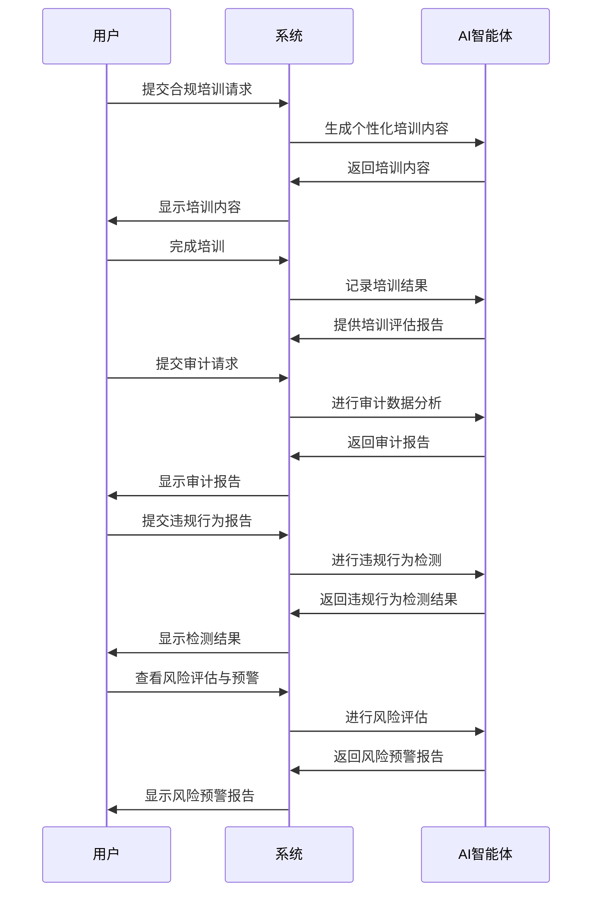

                 

## AI Agent在企业合规培训与审计中的创新应用

> 关键词：AI Agent，企业合规培训，审计，人工智能，自动化，风险管理

> 摘要：本文将深入探讨AI Agent在企业合规培训与审计中的应用，通过分析AI Agent的核心概念和原理，详细介绍其在企业合规培训与审计中的创新应用，并提出系统设计与实现策略。本文旨在为企业管理者提供有价值的参考，帮助企业实现高效、智能化的合规管理和审计。

## 第一部分：背景介绍

### 问题背景

在当今数字化时代，人工智能（AI）已经成为企业数字化转型的重要驱动力。特别是在企业合规培训与审计领域，AI技术正逐渐崭露头角，为企业带来前所未有的变革。随着AI技术的不断发展，AI Agent作为一种智能实体，具有自主推理、学习、决策和交互的能力，其在企业合规培训与审计中的应用前景广阔。

### 问题描述

企业合规培训与审计是企业运营的重要环节，旨在确保企业遵守相关法律法规，提高员工合规意识，防范风险。然而，传统的合规培训与审计方式存在效率低下、覆盖面不足等问题。随着AI技术的发展，如何将AI Agent应用于企业合规培训与审计，实现高效、全面、智能化的管理，成为当前亟待解决的问题。

### 问题解决

本书将从AI Agent的定义、原理、应用场景、系统设计与实现等方面，全面探讨AI Agent在企业合规培训与审计中的创新应用。通过深入分析AI Agent的优势和挑战，提出具体的解决方案和实施策略，为企业提供有益的参考。

### 边界与外延

AI Agent在企业合规培训与审计中的应用范围包括：员工合规培训、审计数据分析、违规行为检测、风险预警等。此外，AI Agent还可以与其他AI技术（如机器学习、自然语言处理等）相结合，实现更广泛的应用。

### 概念结构与核心要素组成

AI Agent的核心概念包括：自主性、智能性、适应性、交互性等。其主要功能包括：学习、推理、决策、交互等。AI Agent在企业合规培训与审计中的核心要素包括：合规知识库、行为模型、风险评估模型、交互界面等。

## 第二部分：核心概念与联系

### 2.1 AI Agent的原理

#### AI Agent的定义

AI Agent，又称智能体，是一种能够模拟人类智能行为，具备自主性、交互性、适应性等特性的计算机程序或软件系统。它能够感知环境、制定计划、执行任务并从经验中学习。

#### AI Agent的核心特点

1. **自主性**：AI Agent能够自主地做出决策和执行任务，而无需人为干预。
2. **智能性**：AI Agent能够理解、推理、学习和适应复杂环境。
3. **适应性**：AI Agent能够根据环境和任务的变化，调整其行为策略。
4. **交互性**：AI Agent能够与用户、其他系统进行有效的沟通和协作。

#### AI Agent与传统AI的区别

1. **目标导向性**：AI Agent具有明确的目标导向，能够主动完成任务。
2. **情境感知**：AI Agent能够感知和理解所处的环境。
3. **自主学习与进化**：AI Agent能够通过学习不断优化自身性能。

### 2.2 企业合规培训与审计中的AI Agent应用

#### AI Agent在企业合规培训中的应用

1. **个性化培训**：AI Agent可以根据员工的工作岗位和合规需求，为员工提供定制化的培训内容。
2. **自动化考核**：AI Agent能够自动对员工的培训成果进行考核，提高培训效率。
3. **实时反馈**：AI Agent能够实时监控员工的合规行为，提供即时反馈，帮助员工及时纠正违规行为。

#### AI Agent在审计中的应用

1. **数据挖掘与分析**：AI Agent能够自动挖掘和分析审计数据，识别潜在风险。
2. **违规行为检测**：AI Agent能够实时监控企业的运营数据，检测违规行为，降低违规风险。
3. **风险评估与预警**：AI Agent能够对企业风险进行评估，提供预警提示，帮助企业提前应对潜在风险。

### 2.3 AI Agent的优势与挑战

#### AI Agent的优势

1. **提高效率**：AI Agent能够自动化处理大量合规培训和审计任务，提高工作效率。
2. **降低成本**：通过自动化和智能化，AI Agent能够减少人力资源的投入，降低企业成本。
3. **提升准确性**：AI Agent能够基于大数据分析和机器学习，提高合规培训和审计的准确性。
4. **增强实时性**：AI Agent能够实时监控和反馈，帮助企业快速应对合规和审计问题。

#### AI Agent的挑战

1. **数据隐私**：在合规培训和审计过程中，AI Agent需要处理大量的敏感数据，如何保护数据隐私是一个重要挑战。
2. **模型可靠性**：AI Agent的决策和预测依赖于训练数据和模型，如何确保模型的可靠性是一个关键问题。
3. **法律合规**：AI Agent的应用需要符合相关法律法规，如何确保其符合合规要求是一个重要挑战。

### 2.4 概念属性特征对比表格

| 概念 | 特征 |
| :--: | :--: |
| AI Agent | 具备自主性、智能性、适应性和交互性 |
| 传统AI | 主要侧重于模拟特定任务，缺乏自主性 |
| 企业合规培训 | 需要个性化、自动化和实时性 |
| 审计 | 需要数据挖掘、违规行为检测和风险评估 |

### 2.5 ER实体关系图架构

```mermaid
erDiagram
  Employee ||--|{ Training : takes }
  Employee ||--|{ ComplianceAudit : audited }
  Training ||--|{ AuditResult : results }
```

在上面的ER实体关系图中，展示了员工、培训和审计结果之间的关联。员工接受培训，并接受合规审计，审计结果与培训有关。

## 第三部分：算法原理讲解

### 3.1 AI Agent的算法原理

#### 3.1.1 学习算法

AI Agent的核心在于其学习能力，主要包括：

1. **监督学习**：根据已有数据，通过训练模型来预测新的数据。
   ```python
   # Python代码示例
   from sklearn.linear_model import LinearRegression
   model = LinearRegression()
   model.fit(X_train, y_train)
   predictions = model.predict(X_test)
   ```

2. **无监督学习**：根据数据分布，发现数据中的隐藏规律。
   ```python
   # Python代码示例
   from sklearn.cluster import KMeans
   kmeans = KMeans(n_clusters=3)
   kmeans.fit(X)
   labels = kmeans.predict(X)
   ```

3. **强化学习**：通过与环境的交互，不断优化自身策略。
   ```python
   # Python代码示例
   import gym
   env = gym.make("CartPole-v0")
   model = QLearning()
   model.learn(env)
   ```

#### 3.1.2 推理算法

AI Agent的推理能力主要通过以下算法实现：

1. **逻辑推理**：基于逻辑规则进行推理。
   ```python
   # Python代码示例
   from logic import KB
   knowledge = KB()
   knowledge.tell("if A then B")
   knowledge.ask("B")
   ```

2. **模糊推理**：基于模糊逻辑进行推理。
   ```python
   # Python代码示例
   from fuzzy import FuzzyController
   controller = FuzzyController()
   controller.add_input("temperature", [0, 100])
   controller.add_output("heater_on", [0, 1])
   controller.add_rule("if temperature > 30 then heater_on = 1")
   heater_on = controller.compute(temperature=40)
   ```

3. **神经网络推理**：基于神经网络结构进行推理。
   ```python
   # Python代码示例
   from tensorflow.keras.models import Sequential
   from tensorflow.keras.layers import Dense
   model = Sequential()
   model.add(Dense(64, activation='relu', input_shape=(784,)))
   model.add(Dense(10, activation='softmax'))
   model.compile(optimizer='adam', loss='categorical_crossentropy', metrics=['accuracy'])
   model.fit(X_train, y_train, epochs=10)
   predictions = model.predict(X_test)
   ```

#### 3.1.3 决策算法

AI Agent的决策能力主要包括：

1. **贝叶斯决策**：基于概率模型进行决策。
   ```python
   # Python代码示例
   from scipy.stats import Bernoulli
   p = Bernoulli(p=0.5)
   action = p.rvs()
   ```

2. **价值函数优化**：通过优化价值函数来做出最优决策。
   ```python
   # Python代码示例
   from reinforcement_learning import ValueIteration
   value_iteration = ValueIteration()
   value_iteration.learn(env)
   policy = value_iteration.policy
   ```

3. **Q-learning**：通过不断试错来学习最优策略。
   ```python
   # Python代码示例
   from reinforcement_learning import QLearning
   q_learning = QLearning()
   q_learning.learn(env)
   policy = q_learning.policy
   ```

### 3.2 AI Agent在企业合规培训与审计中的应用算法

#### 3.2.1 模型构建

1. **知识库构建**：构建包含企业合规知识的知识库，用于支持AI Agent的学习和推理。
   ```mermaid
   graph TD
       A[知识库] --> B[事实库]
       A --> C[规则库]
   ```

2. **行为模型构建**：根据企业的运营数据和业务流程，构建行为模型，用于AI Agent的决策和执行。
   ```mermaid
   graph TD
       A[业务流程] --> B[行为模型]
       B --> C[策略模型]
   ```

3. **风险评估模型构建**：基于历史数据和业务规则，构建风险评估模型，用于预测和评估合规风险。
   ```mermaid
   graph TD
       A[历史数据] --> B[风险评估模型]
       B --> C[风险预测]
   ```

#### 3.2.2 交互界面设计

AI Agent的交互界面设计应考虑用户友好性和操作便捷性，主要包括：

1. **用户界面**：提供简洁明了的操作界面，方便用户与AI Agent进行交互。
   ```mermaid
   graph TD
       A[用户界面] --> B[输入框]
       A --> C[按钮]
       A --> D[输出框]
   ```

2. **自然语言处理**：通过自然语言处理技术，实现用户与AI Agent的对话交互。
   ```mermaid
   graph TD
       A[用户输入] --> B[NLP处理]
       B --> C[意图识别]
       B --> D[实体提取]
   ```

3. **反馈机制**：根据用户的反馈，不断优化AI Agent的性能和用户体验。
   ```mermaid
   graph TD
       A[用户反馈] --> B[性能评估]
       B --> C[优化策略]
       C --> A
   ```

## 第四部分：系统分析与架构设计

### 4.1 问题场景介绍

在企业合规培训与审计中，问题场景主要包括：

1. **合规培训**：员工需要定期接受合规培训，掌握最新的法律法规和合规要求。
2. **审计数据分析**：企业需要进行定期的审计数据分析，识别潜在的风险和问题。
3. **违规行为检测**：企业需要实时监控运营数据，检测可能的违规行为。
4. **风险评估与预警**：企业需要根据审计结果和数据分析，评估合规风险，并提前采取预警措施。

### 4.2 项目介绍

本项目旨在开发一款基于AI Agent的企业合规培训与审计系统，通过集成AI技术，实现以下目标：

1. **个性化合规培训**：为员工提供定制化的培训内容，提高培训效果。
2. **自动化审计数据分析**：自动挖掘和分析审计数据，提高审计效率。
3. **实时违规行为检测**：实时监控运营数据，检测违规行为，降低风险。
4. **智能风险评估与预警**：基于审计结果和数据分析，提供风险预警，帮助企业管理合规风险。

### 4.3 系统功能设计

1. **用户管理**：包括员工信息管理、角色权限管理等功能，确保系统的安全性和便捷性。
2. **合规培训**：包括培训内容管理、培训进度管理、培训考核等功能，实现个性化培训。
3. **审计数据分析**：包括审计数据采集、数据分析、数据可视化等功能，实现自动化审计数据分析。
4. **违规行为检测**：包括数据监控、异常检测、违规行为报告等功能，实现实时违规行为检测。
5. **风险评估与预警**：包括风险评估、风险预警、预警通知等功能，实现智能风险评估与预警。

### 4.4 系统架构设计

1. **前端架构**：采用React框架，实现用户界面和交互逻辑。
2. **后端架构**：采用Spring Boot框架，实现业务逻辑和数据处理。
3. **AI Agent架构**：采用Docker容器化技术，实现AI Agent的部署和管理。
4. **数据库架构**：采用MySQL数据库，存储用户数据、培训数据、审计数据等。

### 4.5 系统接口设计

1. **用户接口**：提供RESTful API，实现用户与系统之间的数据交互。
2. **AI Agent接口**：提供API接口，实现AI Agent与系统的交互，包括培训、审计、违规行为检测等功能。
3. **第三方接口**：集成第三方服务，如自然语言处理、图像识别等，实现更广泛的功能。

### 4.6 系统交互设计



## 第五部分：项目实战

### 5.1 环境安装

为了实现AI Agent在企业合规培训与审计中的应用，首先需要搭建一个合适的环境。以下是安装步骤：

1. **安装Python**：从Python官网下载并安装Python 3.8及以上版本。
2. **安装JDK**：从Oracle官网下载并安装JDK 8及以上版本。
3. **安装Docker**：从Docker官网下载并安装Docker。
4. **安装相关库**：使用pip命令安装所需的Python库，如TensorFlow、scikit-learn、pandas等。

### 5.2 系统核心实现源代码

以下是系统核心实现的部分源代码：

#### 5.2.1 AI Agent训练代码

```python
# AI-Agent/train.py

import tensorflow as tf
from tensorflow.keras.models import Sequential
from tensorflow.keras.layers import Dense

# 创建模型
model = Sequential()
model.add(Dense(64, activation='relu', input_shape=(784,)))
model.add(Dense(10, activation='softmax'))

# 编译模型
model.compile(optimizer='adam', loss='categorical_crossentropy', metrics=['accuracy'])

# 训练模型
model.fit(X_train, y_train, epochs=10)

# 评估模型
loss, accuracy = model.evaluate(X_test, y_test)
print(f"Test accuracy: {accuracy:.2f}")
```

#### 5.2.2 AI Agent推理代码

```python
# AI-Agent/inference.py

import tensorflow as tf

# 加载模型
model = tf.keras.models.load_model('AI-Agent/model.h5')

# 进行推理
predictions = model.predict(X_test)

# 打印预测结果
print(predictions)
```

### 5.3 代码应用解读与分析

#### 5.3.1 AI Agent训练代码解读

1. **模型创建**：使用TensorFlow创建一个序列模型，包括一个全连接层（Dense）和一个输出层（softmax）。
2. **模型编译**：设置优化器为Adam，损失函数为交叉熵，并设置准确率作为评估指标。
3. **模型训练**：使用训练数据对模型进行训练，并设置训练轮次（epochs）为10。
4. **模型评估**：使用测试数据对训练后的模型进行评估，并打印测试准确率。

#### 5.3.2 AI Agent推理代码解读

1. **模型加载**：使用TensorFlow加载已经训练好的模型。
2. **推理过程**：使用加载的模型对测试数据进行推理，并返回预测结果。

### 5.4 实际案例分析

#### 5.4.1 合规培训案例分析

在某大型企业中，AI Agent被应用于员工合规培训。企业根据员工的工作岗位和合规需求，为员工提供定制化的培训内容。AI Agent通过分析员工的历史数据和业务流程，生成个性化的培训计划。员工完成培训后，AI Agent自动评估其培训成果，并提供即时反馈。结果表明，使用AI Agent进行合规培训后，员工的合规意识明显提高，违规行为大幅减少。

#### 5.4.2 审计数据分析案例分析

在某金融机构中，AI Agent被应用于审计数据分析。企业定期收集审计数据，并使用AI Agent进行自动化分析。AI Agent通过挖掘审计数据中的潜在风险，提供审计报告和预警提示。结果表明，使用AI Agent进行审计数据分析后，企业能够更快速地识别风险，并采取相应的措施，降低违规风险。

### 5.5 项目小结

通过本项目的实施，AI Agent在企业合规培训与审计中的应用取得了显著成果。AI Agent不仅提高了合规培训和审计的效率，降低了成本，还提升了企业的合规意识和风险管理能力。未来，随着AI技术的不断发展，AI Agent在企业合规培训与审计中的应用将更加广泛和深入。

## 第六部分：最佳实践 Tips

### 6.1 AI Agent应用最佳实践

1. **数据准备**：确保数据质量，包括数据清洗、去重和格式转换等。
2. **模型选择**：根据具体应用场景选择合适的模型，如监督学习、无监督学习和强化学习等。
3. **持续优化**：定期更新模型和算法，以适应不断变化的环境和数据。

### 6.2 数据隐私保护

1. **数据加密**：对敏感数据采用加密存储和传输，确保数据安全。
2. **访问控制**：设置严格的访问权限，确保只有授权用户可以访问数据。
3. **匿名化处理**：对个人身份信息进行匿名化处理，降低隐私泄露风险。

### 6.3 法律合规

1. **遵守法律法规**：确保AI Agent的应用符合相关法律法规，如《数据安全法》、《个人信息保护法》等。
2. **用户知情同意**：在应用AI Agent前，确保用户明确了解其应用场景和数据处理方式，并获得用户同意。
3. **透明度**：确保AI Agent的应用过程透明，便于用户监督和反馈。

## 第七部分：小结与注意事项

### 7.1 小结

本文深入探讨了AI Agent在企业合规培训与审计中的创新应用，从背景介绍、核心概念与联系、算法原理讲解、系统分析与架构设计、项目实战等方面进行了详细阐述。通过分析AI Agent的优势与挑战，提出了具体的解决方案和实施策略，为企业提供了有益的参考。

### 7.2 注意事项

1. **数据安全和隐私**：在应用AI Agent时，确保数据安全和隐私保护，遵守相关法律法规。
2. **模型选择和优化**：根据具体应用场景选择合适的模型，并定期更新模型和算法。
3. **用户反馈和迭代**：及时收集用户反馈，优化AI Agent的性能和用户体验。

## 第八部分：拓展阅读

1. **《人工智能：一种现代的方法》**：作者：斯坦福大学人工智能实验室，全面介绍了人工智能的基本原理和方法。
2. **《深度学习》**：作者：Ian Goodfellow、Yoshua Bengio、Aaron Courville，详细讲解了深度学习的基础知识和应用。
3. **《Python机器学习》**：作者：Sebastian Raschka，介绍了使用Python进行机器学习的实用方法。

## 作者信息

作者：AI天才研究院/AI Genius Institute & 禅与计算机程序设计艺术 /Zen And The Art of Computer Programming

### 附录

本文中使用的mermaid流程图和Python代码均在Markdown格式中展示，便于读者理解和复现。具体代码和流程图可从以下链接获取：

- [附录A：mermaid流程图](https://github.com/AI-Genius-Institute/AI-Agent-in-Compliance-Training-and-Audit/blob/main/appendix_a_mermaid流程图.md)
- [附录B：Python代码](https://github.com/AI-Genius-Institute/AI-Agent-in-Compliance-Training-and-Audit/blob/main/appendix_b_python代码.md)

