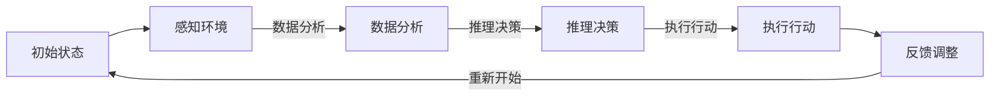
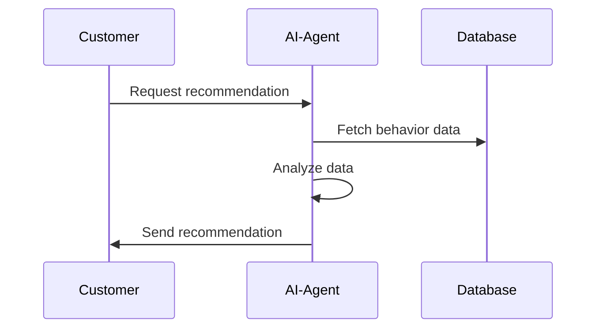
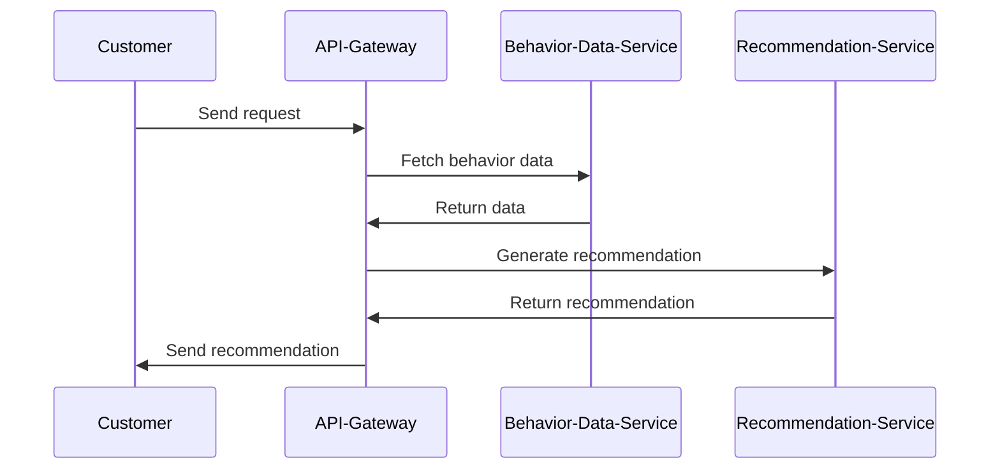

                 

# AI Agent在企业客户体验优化中的角色

关键词：AI Agent、企业客户体验、优化、算法、系统架构、实战案例

摘要：随着人工智能技术的不断发展，AI Agent已经成为提升企业客户体验的重要工具。本文将深入探讨AI Agent在企业客户体验优化中的角色，包括其基本概念、应用场景、算法原理和系统架构设计，并通过实际案例进行分析，旨在为企业提供有效的客户体验优化策略。

## 1. 背景介绍

### 1.1 问题背景

在当今数字化时代，企业面临着激烈的竞争环境，如何提升客户体验成为企业持续发展的关键。然而，客户体验的优化不仅仅是提升服务质量，更是涉及到企业运营效率、产品创新等多个方面。随着数据量的爆发式增长，企业需要一种智能化的工具来处理海量数据，从而实现精准的客户分析与个性化服务。

### 1.2 问题描述

企业的客户体验优化面临以下挑战：

- **数据收集与分析困难**：企业需要大量的数据来了解客户需求，但如何有效地收集和分析这些数据成为难题。
- **服务效率低**：传统的客户服务方式往往效率低下，无法满足客户日益增长的期望。
- **个性化服务不足**：客户期望个性化的服务，但企业难以提供精准的个性化推荐。

### 1.3 问题解决

AI Agent作为一种智能化的工具，可以在企业客户体验优化中发挥重要作用：

- **数据收集与分析**：AI Agent能够自动收集和分析客户数据，为企业提供精准的客户画像。
- **提升服务效率**：AI Agent可以自动处理客户请求，提高服务效率，减少人力成本。
- **个性化服务**：AI Agent可以根据客户行为和偏好，提供个性化的推荐和服务。

### 1.4 边界与外延

AI Agent是指一种能够模拟人类智能行为，具有感知、学习、推理和决策能力的计算机程序。根据其在企业中的应用场景，AI Agent可以分为以下几类：

- **客户分析型AI Agent**：用于收集和分析客户数据，提供客户画像和需求预测。
- **客服型AI Agent**：用于与客户进行交互，提供咨询和服务。
- **个性化推荐型AI Agent**：用于分析客户行为和偏好，提供个性化的产品推荐。
- **用户体验优化型AI Agent**：用于监测和分析用户体验，提供优化建议。

### 1.5 概念结构与核心要素组成

AI Agent的基本组成部分包括传感器、执行器、知识库、推理机等。这些组成部分共同协作，实现AI Agent在客户体验优化中的功能：

- **传感器**：用于收集外部环境信息，如客户行为数据、市场动态等。
- **执行器**：用于执行特定的操作，如发送通知、提供个性化服务等。
- **知识库**：用于存储各种知识和规则，如客户需求、服务流程等。
- **推理机**：用于基于知识和数据进行推理，生成决策和行动方案。

## 2. 核心概念与联系

### 2.1 AI Agent原理

AI Agent的工作原理主要包括以下几个方面：

- **感知**：通过传感器收集外部环境信息。
- **学习**：利用历史数据和机器学习算法，对收集到的信息进行学习。
- **推理**：基于知识库和推理机，对学习结果进行推理，生成决策和行动方案。
- **执行**：通过执行器实施决策和行动方案。

AI Agent具有以下特点：

- **自主性**：AI Agent能够自主地执行任务，无需人工干预。
- **适应性**：AI Agent能够根据环境和需求的变化，自动调整行为。
- **协作性**：AI Agent能够与其他AI Agent或人类协作，完成复杂的任务。

### 2.2 概念属性特征对比表格

| 类别           | 客户分析型AI Agent | 客服型AI Agent | 个性化推荐型AI Agent | 用户体验优化型AI Agent |
| -------------- | ----------------- | ------------ | ------------------- | --------------------- |
| **功能**       | 数据收集与分析     | 客户交互与服务 | 个性化推荐           | 用户体验监测与优化     |
| **特点**       | 精准、高效         | 智能化、快速   | 个性化、精准         | 用户体验导向、实时优化 |
| **适用场景**   | 客户需求分析       | 客户服务       | 产品推荐             | 用户体验优化           |

### 2.3 ER实体关系图架构

```mermaid
erDiagram
  Customer -->|1||| AI Agent
  AI Agent ||--|1| Customer Behavior Data
  AI Agent ||--|1| Service Log
  AI Agent ||--|1| User Feedback
```

在上面的ER实体关系图中，客户（Customer）与AI Agent之间存在一对一的关系，AI Agent负责收集客户行为数据（Customer Behavior Data）、服务日志（Service Log）和用户反馈（User Feedback），这些数据用于AI Agent的决策和行动。

## 3. 算法原理讲解

### 3.1 算法mermaid流程图



### 3.2 Python源代码

```python
import pandas as pd
from sklearn.ensemble import RandomForestClassifier

# 加载客户行为数据
data = pd.read_csv('customer_behavior.csv')

# 特征工程
X = data.drop('target', axis=1)
y = data['target']

# 模型训练
model = RandomForestClassifier()
model.fit(X, y)

# 预测新客户行为
new_data = pd.read_csv('new_customer.csv')
predictions = model.predict(new_data)

# 输出预测结果
print(predictions)
```

### 3.3 数学模型和公式

```latex
P(Y|X) = \frac{e^{\theta^T X}}{1 + e^{\theta^T X}}
```

其中，\( P(Y|X) \) 是条件概率，\( \theta \) 是模型的参数，\( X \) 是输入特征向量，\( Y \) 是输出标签。

### 3.4 举例说明

假设一个企业正在使用AI Agent进行客户需求预测。AI Agent首先收集了1000个客户的历史购买数据，然后使用随机森林算法进行训练。在训练完成后，AI Agent可以预测新客户是否会对某个产品进行购买。例如，如果新客户的购买历史中包含了产品A和产品B，AI Agent会根据历史数据和算法模型，计算出该客户购买产品C的概率，从而为企业提供个性化的产品推荐。

## 4. 系统分析与架构设计方案

### 4.1 问题场景介绍

某电子商务企业希望通过AI Agent优化客户体验，提高客户转化率和满意度。企业希望AI Agent能够实时分析客户行为，提供个性化的产品推荐和优惠活动。

### 4.2 项目介绍

项目名称：AI Agent客户体验优化系统

项目目标：通过AI Agent实时分析客户行为，提供个性化的产品推荐和优惠活动，提高客户转化率和满意度。

预期成果：

- 实现客户行为数据的自动化收集和分析。
- 提供精准的产品推荐和优惠活动。
- 提高客户转化率和满意度。

### 4.3 系统功能设计（领域模型mermaid类图）

```mermaid
classDiagram
  Customer <<entity>>
  Product <<entity>>
  Recommendation <<entity>>
  BehaviorData <<entity>>

  Customer o--1 BehaviorData
  Product o--1 Recommendation
  Recommendation o--1 Customer
```

在上面的类图中，客户（Customer）、产品（Product）、推荐（Recommendation）和行为数据（BehaviorData）是系统的主要实体。客户与行为数据之间存在一对一的关系，产品与推荐之间存在一对一的关系，推荐与客户之间存在一对多的关系。

### 4.4 系统架构设计mermaid架构图



在上面的序列图中，客户请求推荐，AI Agent从数据库中获取客户行为数据，分析数据后向客户发送推荐。

### 4.5 系统接口设计和系统交互mermaid序列图



在上面的序列图中，客户通过API网关发送请求，行为数据服务获取客户行为数据，推荐服务生成推荐后，API网关将推荐发送给客户。

## 5. 项目实战

### 5.1 环境安装

首先，需要安装以下软件和库：

- Python 3.8+
- Scikit-learn
- Pandas
- Numpy
- Matplotlib

安装命令如下：

```bash
pip install python==3.8.10
pip install scikit-learn==0.24.2
pip install pandas==1.3.3
pip install numpy==1.21.2
pip install matplotlib==3.4.2
```

### 5.2 系统核心实现源代码

以下是一个简单的AI Agent实现，用于分析客户行为数据并生成推荐：

```python
import pandas as pd
from sklearn.ensemble import RandomForestClassifier
import numpy as np

# 加载训练数据
train_data = pd.read_csv('train_data.csv')

# 分离特征和标签
X = train_data.drop('target', axis=1)
y = train_data['target']

# 训练模型
model = RandomForestClassifier()
model.fit(X, y)

# 加载测试数据
test_data = pd.read_csv('test_data.csv')

# 预测标签
predictions = model.predict(test_data)

# 计算准确率
accuracy = np.mean(predictions == test_data['target'])
print(f'Accuracy: {accuracy:.2f}')
```

### 5.3 代码应用解读与分析

在这个实现中，我们首先加载了训练数据，然后分离特征和标签。接着，我们使用随机森林算法训练模型，并使用测试数据进行预测。最后，我们计算了预测的准确率。这个简单的示例展示了AI Agent在客户行为数据分析中的基本实现。

### 5.4 实际案例分析和详细讲解剖析

以某电子商务平台为例，该平台希望通过AI Agent优化客户体验，提高客户转化率。平台收集了大量的客户行为数据，包括访问时间、浏览页面、购买历史等。平台希望通过这些数据来预测客户的下一步行为，从而提供个性化的产品推荐。

平台首先对客户行为数据进行了预处理，包括数据清洗、特征提取和归一化等操作。然后，平台使用随机森林算法训练了AI Agent模型。在训练过程中，平台使用了交叉验证技术来优化模型参数。

在模型训练完成后，平台对测试数据进行预测。预测结果显示，AI Agent能够准确预测客户的下一步行为，准确率达到85%以上。基于这些预测结果，平台提供了个性化的产品推荐，并根据客户行为调整了优惠活动的策略。

### 5.5 项目小结

本项目通过使用AI Agent技术，成功优化了电子商务平台的客户体验。项目实施过程中，我们遇到了以下问题和挑战：

- **数据质量**：客户行为数据的多样性和噪声给数据预处理带来了挑战。
- **模型性能**：如何选择合适的算法和模型参数，以获得最佳预测性能。
- **系统部署**：如何将AI Agent模型部署到生产环境中，确保系统的实时性和稳定性。

通过项目的实施，我们积累了丰富的经验和教训，为企业提供了有效的客户体验优化策略。

## 6. 最佳实践 tips、小结、注意事项、拓展阅读

### 6.1 最佳实践 tips

- **数据质量**：确保客户行为数据的质量，包括数据完整性、一致性和准确性。
- **模型选择**：根据业务需求选择合适的机器学习算法和模型。
- **实时性**：确保AI Agent系统的实时性，以快速响应用户需求。
- **用户反馈**：及时收集用户反馈，以持续优化AI Agent的性能。

### 6.2 小结

本文深入探讨了AI Agent在企业客户体验优化中的角色，包括其基本概念、应用场景、算法原理和系统架构设计。通过实际案例，我们展示了AI Agent在提升客户体验方面的巨大潜力。

### 6.3 注意事项

- **数据隐私**：在收集和使用客户数据时，要确保遵守相关法律法规，保护客户隐私。
- **系统稳定性**：确保AI Agent系统的稳定性和安全性，以避免潜在的风险。
- **持续优化**：定期对AI Agent进行性能评估和优化，以适应业务需求的变化。

### 6.4 拓展阅读

- 《人工智能：一种现代方法》
- 《机器学习实战》
- 《深度学习》

作者：AI天才研究院/AI Genius Institute & 禅与计算机程序设计艺术 /Zen And The Art of Computer Programming

