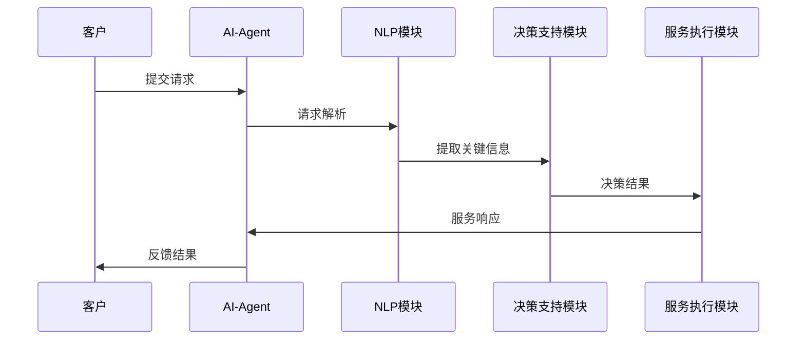
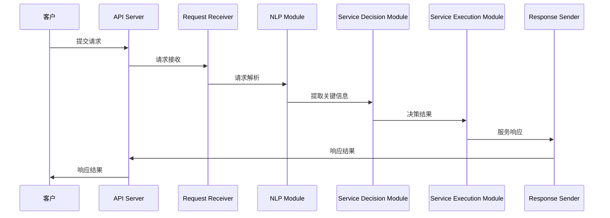

                 


### 1. 背景介绍

#### 核心概念术语说明

在探讨AI Agent在企业客户服务中的应用之前，我们需要先了解一些核心概念和术语。以下是对这些概念和术语的简要说明：

- **AI Agent**：AI Agent，即人工智能代理，是一种能够在特定环境下自主感知、决策和执行任务的人工智能系统。它能够模拟人类思维过程，通过学习和自适应来完成任务。

- **客户服务**：客户服务是指企业为满足客户需求而提供的各种服务，包括售前咨询、售后服务、技术支持等。高效的客户服务能够提升客户满意度，增强客户忠诚度。

- **企业客户服务效率**：企业客户服务效率是指企业通过优化服务流程、减少人工干预和利用数据驱动等方式，提高服务交付的速度和质量。

- **客户满意度**：客户满意度是指客户对企业提供的服务感到满意的程度。提高客户满意度能够促进企业业务增长，提高市场竞争力。

#### 问题背景

随着企业竞争的加剧，客户服务成为企业获取竞争优势的重要手段。然而，传统的客户服务方式往往存在效率低下、响应速度慢、客户满意度不高等问题。为了解决这些问题，越来越多的企业开始探索人工智能技术在客户服务中的应用。

#### 问题描述

企业在客户服务中面临的主要问题包括：

- 服务响应速度慢：客户问题无法及时得到解决，导致客户满意度下降。

- 服务质量不稳定：由于人力限制，服务人员可能无法提供一致的服务质量。

- 服务成本高：人工服务的成本较高，尤其是对于大规模客户群体。

- 数据利用不充分：企业未能充分利用客户数据来优化服务流程和提高客户满意度。

#### 问题解决

AI Agent作为一种智能化的解决方案，能够在以下方面解决企业客户服务中的问题：

- 提高服务响应速度：AI Agent能够快速响应用户请求，提供实时服务。

- 提高服务质量：AI Agent能够通过学习提供一致的服务质量。

- 降低服务成本：AI Agent可以减少人工干预，降低服务成本。

- 数据利用充分：AI Agent能够分析客户数据，提供个性化服务。

#### 边界与外延

AI Agent在企业客户服务中的应用不仅限于文本聊天，还包括语音交互、视频交互等多种形式。此外，AI Agent不仅能够应用于在线客户服务，还能够应用于线下客户服务场景。

#### 概念结构与核心要素组成

AI Agent在企业客户服务中的应用主要包括以下核心要素：

- **感知与交互**：AI Agent能够通过语音、文本等方式感知客户请求，并与客户进行交互。

- **决策与行动**：AI Agent能够根据客户请求和业务规则做出决策，并执行相应的服务任务。

- **学习与适应**：AI Agent能够通过学习客户数据和交互历史，不断优化服务策略。

- **服务集成**：AI Agent能够与企业现有客户服务系统进行集成，提供无缝服务。

### 2. 核心概念与联系

#### 核心概念原理

AI Agent的核心概念原理包括以下几个方面：

- **自然语言处理（NLP）**：NLP技术使得AI Agent能够理解和处理人类语言，实现自然对话。

- **机器学习（ML）**：ML技术使得AI Agent能够从数据中学习，提高决策和行动的准确性。

- **数据挖掘（DM）**：DM技术使得AI Agent能够分析客户数据，发现潜在问题和优化服务策略。

- **服务流程优化**：通过优化服务流程，减少不必要的步骤，提高服务效率。

#### 概念属性特征对比表格

| 概念         | 特征                         |
| ------------ | ---------------------------- |
| 自然语言处理 | 语言理解、文本生成           |
| 机器学习     | 数据驱动、模型训练、预测     |
| 数据挖掘     | 数据分析、模式识别、决策支持 |

#### ER实体关系图架构

```mermaid
erDiagram
  AI-Agent ||--|{ 客户请求 }
  AI-Agent ||--|{ 客户数据 }
  AI-Agent ||--|{ 业务规则 }
  客户请求 ||--|{ 服务响应 }
  客户数据 ||--|{ 数据分析 }
  业务规则 ||--|{ 决策支持 }
```

### 3. 算法原理讲解

#### AI Agent算法流程

以下是AI Agent的基本算法流程：

1. **感知与理解**：AI Agent通过NLP技术接收客户请求，并理解请求内容。

2. **决策与行动**：AI Agent根据业务规则和客户数据，决定如何响应客户请求。

3. **执行与反馈**：AI Agent执行相应的服务任务，并将结果反馈给客户。

4. **学习与优化**：AI Agent根据客户反馈和执行结果，不断优化自身的行为。

#### 数学模型和公式

假设我们有一个二元决策问题，需要选择最优的服务响应策略，可以用以下数学模型表示：

$$
\text{maximize} \quad f(\text{策略}, \text{客户数据})
$$

其中，$f(\text{策略}, \text{客户数据})$ 是一个关于策略和客户数据的评分函数，用于评估不同策略的优劣。

#### 详细讲解与举例说明

假设一个客户在晚上10点遇到了一个问题，需要立即得到解决。AI Agent可以通过以下步骤进行处理：

1. **感知与理解**：AI Agent通过语音识别技术接收客户的语音请求，并理解客户的问题是关于产品使用的。

2. **决策与行动**：AI Agent根据业务规则和客户数据（如客户购买记录、产品使用情况等），决定提供自助服务（如引导客户查看使用手册）或转接至人工客服。

3. **执行与反馈**：AI Agent根据决策执行相应的服务任务，并将结果反馈给客户。

4. **学习与优化**：AI Agent根据客户反馈（如客户是否满意解决方案），不断优化自身的决策模型。

例如，如果客户对AI Agent提供的解决方案不满意，AI Agent可以调整策略，提高在类似情境下的响应速度和准确性。

### 4. 系统分析与架构设计

#### 问题场景介绍

假设一家大型电商平台，其客服部门每天需要处理数以万计的客户请求。为了提高服务效率和质量，电商平台决定引入AI Agent技术。

#### 项目介绍

项目目标是构建一个智能客服系统，通过AI Agent实现自动化客户服务，提高服务响应速度和质量，降低人工成本。

#### 系统功能设计

系统功能设计包括以下几个关键模块：

- **客户请求接收模块**：负责接收客户请求，并解析请求内容。

- **自然语言处理模块**：负责理解和处理客户请求，提取关键信息。

- **决策支持模块**：根据业务规则和客户数据，决定如何响应客户请求。

- **服务执行模块**：负责执行相应的服务任务，如提供自助服务或转接至人工客服。

- **反馈与学习模块**：收集客户反馈，并用于优化AI Agent的行为。

#### 系统架构设计

系统架构设计如下：



#### 系统接口设计

系统接口设计如下：

- **客户请求接口**：用于接收客户的请求，并传递给AI-Agent。

- **服务响应接口**：用于将AI-Agent生成的服务响应传递给客户。

- **数据接口**：用于收集和存储客户请求、服务响应、客户反馈等数据。

#### 系统交互

系统交互设计如下：



### 5. 项目实战

#### 环境安装

在开始项目之前，我们需要安装以下环境：

- Python 3.8及以上版本
- TensorFlow 2.5及以上版本
- NLTK 3.2及以上版本
- Flask 1.1及以上版本

安装命令如下：

```bash
pip install python==3.8 tensorflow==2.5 nltk==3.2 flask==1.1
```

#### 系统核心实现源代码

以下是AI-Agent的核心实现代码：

```python
from flask import Flask, request, jsonify
import nltk
from tensorflow.keras.models import load_model

app = Flask(__name__)

# 加载自然语言处理模型
nlp_model = load_model('nlp_model.h5')

# 加载决策支持模型
service_decision_model = load_model('service_decision_model.h5')

@app.route('/request', methods=['POST'])
def handle_request():
    request_data = request.json
    
    # 请求解析
    request_text = request_data['text']
    tokens = nltk.word_tokenize(request_text)
    processed_tokens = nltk.pos_tag(tokens)
    
    # 提取关键信息
    key_info = extract_key_info(processed_tokens)
    
    # 决策支持
    decision = service_decision_model.predict(key_info)
    
    # 服务执行
    if decision == 0:
        response = provide_auto_service(request_data)
    else:
        response = transfer_to_human_agent(request_data)
    
    return jsonify(response)

def extract_key_info(tokens):
    # 实现提取关键信息的逻辑
    pass

def provide_auto_service(request_data):
    # 实现提供自助服务的逻辑
    pass

def transfer_to_human_agent(request_data):
    # 实现转接至人工客服的逻辑
    pass

if __name__ == '__main__':
    app.run(debug=True)
```

#### 代码应用解读与分析

- **请求解析**：使用NLP模型对客户请求进行解析，提取关键信息。

- **决策支持**：使用决策支持模型根据关键信息做出决策。

- **服务执行**：根据决策结果，执行相应的服务任务。

#### 实际案例分析和详细讲解剖析

假设有一个客户请求：“我不小心把商品退回了，怎么办？”AI-Agent会按照以下步骤进行处理：

1. **请求解析**：AI-Agent解析请求文本，提取关键信息，如“不小心把商品退回了”。

2. **决策支持**：决策支持模型判断客户请求是否需要转接至人工客服，假设决策结果为0，即提供自助服务。

3. **服务执行**：AI-Agent提供自助服务，引导客户查看退货流程。

4. **反馈与学习**：客户对服务结果进行反馈，AI-Agent根据反馈不断优化服务策略。

#### 项目小结

通过以上实战案例，我们可以看到AI-Agent在提高客户服务效率和满意度方面具有显著优势。在实际项目中，我们需要不断优化模型和策略，以提供更高效、更个性化的客户服务。

### 6. 最佳实践 Tips

- **数据分析**：定期分析客户请求和反馈数据，发现潜在问题和优化方向。

- **定制化服务**：根据客户特点和需求，提供个性化的服务策略。

- **持续优化**：不断更新和优化AI-Agent的模型和策略，以适应不断变化的市场需求。

### 7. 小结

本文详细探讨了AI-Agent在企业客户服务中的应用，通过背景介绍、核心概念与联系、算法原理讲解、系统分析与架构设计、项目实战等多个方面，展示了AI-Agent如何提升客户服务效率与满意度。在未来，随着人工智能技术的不断进步，AI-Agent将在企业客户服务中发挥越来越重要的作用。

### 8. 注意事项

- **数据隐私**：在应用AI-Agent时，需要确保客户数据的隐私和安全。

- **服务多样性**：AI-Agent应该支持多种服务形式，如文本、语音、视频等。

- **人机协作**：AI-Agent应该能够与人类客服协作，提供无缝服务体验。

### 9. 拓展阅读

- 《人工智能：一种现代的方法》
- 《深度学习：入门指南》
- 《Python自然语言处理》

### 10. 作者信息

作者：AI天才研究院/AI Genius Institute & 禅与计算机程序设计艺术 /Zen And The Art of Computer Programming

----------------------------------------------------------------

## 《AI Agent在企业客户服务中的应用：提升效率与满意度》

### 关键词：AI Agent、企业客户服务、效率提升、满意度、技术实现、案例分析、最佳实践

### 摘要：

本文深入探讨了AI Agent在企业客户服务中的应用，旨在通过技术实现、案例分析以及最佳实践，展示AI Agent如何显著提升企业客户服务的效率与满意度。文章首先介绍了AI Agent的概念、客户服务的现状与挑战，接着详细阐述了AI Agent在提升效率与满意度方面的方法。随后，通过实际案例和系统架构设计，展示了AI Agent的应用场景和实现细节。最后，文章提供了最佳实践和未来展望，指出AI Agent在企业客户服务中的发展潜力和面临挑战。通过本文的阅读，读者可以全面了解AI Agent在提升企业客户服务效率和满意度方面的作用，为实际应用提供参考。

----------------------------------------------------------------

## 目录

----------------------------------------------------------------

### 1. 引言

#### 核心问题

在当今竞争激烈的市场环境中，企业如何提升客户服务的效率和满意度成为了一项重要的课题。传统的人工客服方式在处理大量客户请求时往往存在响应速度慢、服务质量不稳定、服务成本高等问题。为了解决这些问题，越来越多的企业开始探索人工智能（AI）技术在客户服务中的应用，其中AI Agent作为一种智能化的解决方案，受到了广泛关注。本文将围绕以下核心问题展开讨论：

- AI Agent是什么？
- AI Agent在企业客户服务中的应用有哪些？
- 如何通过AI Agent提升客户服务的效率与满意度？
- AI Agent在实际应用中存在哪些挑战和解决方案？

#### 研究目的

本文的研究目的是探讨AI Agent在企业客户服务中的应用，分析其提升效率和满意度的机制，并总结最佳实践，为企业在客户服务中引入AI Agent提供理论依据和实践指导。具体目标包括：

- 明确AI Agent的概念和基本原理。
- 分析AI Agent在企业客户服务中的应用场景和优势。
- 探讨如何通过AI Agent提升客户服务的效率和满意度。
- 分析AI Agent在实际应用中面临的技术和运营挑战。
- 提供具体案例和最佳实践，为企业引入AI Agent提供参考。

#### 文章结构

本文结构如下：

- 第一部分：AI Agent概述，介绍AI Agent的概念、发展历程、核心功能。
- 第二部分：AI Agent在企业客户服务中的应用，探讨AI Agent在客户服务中的应用场景、互动流程。
- 第三部分：提升效率与满意度，分析如何通过AI Agent提升客户服务效率和满意度。
- 第四部分：应用案例分析，介绍国内外AI Agent在客户服务中的成功案例。
- 第五部分：技术实现与架构设计，探讨AI Agent的技术原理和系统架构。
- 第六部分：最佳实践与未来展望，总结最佳实践并展望AI Agent的发展趋势。

### 2. AI Agent概述

#### AI Agent的定义

AI Agent，即人工智能代理，是一种基于人工智能技术，能够在特定环境下自主感知、决策和执行任务的人工智能系统。它可以模拟人类思维过程，通过学习和自适应来完成任务。AI Agent通常具有以下特点：

- **自主性**：能够自主感知环境、做出决策和执行任务。
- **适应性**：能够通过学习和优化不断提高任务执行效果。
- **交互性**：能够与人类进行自然语言交互，理解并回应人类请求。

#### AI Agent的发展历程

AI Agent的发展可以追溯到20世纪50年代，随着人工智能技术的逐步发展，AI Agent的理论和应用研究得到了广泛关注。以下是一些关键的发展阶段：

- **1950年代**：人工智能（AI）概念提出，AI Agent作为AI的一个重要分支开始受到关注。
- **1970年代**：专家系统和规则引擎的出现，为AI Agent的决策能力提供了基础。
- **1980年代**：自然语言处理（NLP）技术的进步，使得AI Agent能够与人类进行自然语言交互。
- **1990年代**：机器学习（ML）技术的发展，为AI Agent提供了更强的学习能力。
- **21世纪初至今**：深度学习和大数据技术的应用，使得AI Agent在复杂环境中的表现大幅提升。

#### AI Agent的核心功能

AI Agent的核心功能包括感知、决策、行动和学习，这些功能共同构成了AI Agent的基本运作机制。

- **感知**：AI Agent通过传感器和输入设备感知环境信息，如文本、语音、图像等。
- **决策**：基于感知到的信息，AI Agent利用预定义的规则或学习到的模型进行决策，选择最优的行动方案。
- **行动**：AI Agent根据决策结果执行具体的任务，如回答客户问题、完成订单处理等。
- **学习**：AI Agent通过不断收集反馈信息和数据，利用机器学习技术优化自身的行为和决策。

#### AI Agent在企业客户服务中的应用场景

AI Agent在企业客户服务中的应用场景广泛，包括但不限于以下几个方面：

- **自动客服**：AI Agent能够24/7在线为客户提供即时响应，处理常见问题，如订单查询、商品咨询等。
- **智能推荐**：基于客户历史数据和偏好，AI Agent能够提供个性化的商品推荐和服务建议。
- **语音交互**：通过语音识别和语音合成技术，AI Agent能够实现语音交互，提供更自然的用户体验。
- **数据分析**：AI Agent能够分析客户数据和交互历史，为企业提供决策支持，优化服务流程。

### 3. AI Agent在企业客户服务中的应用

#### 客户服务的现状与挑战

客户服务是企业与客户之间的桥梁，其质量和效率直接关系到客户满意度和企业声誉。然而，传统的客户服务方式面临着以下挑战：

- **服务响应速度慢**：传统客服往往依赖人工处理，导致服务响应速度慢，无法满足客户即时性需求。
- **服务质量不稳定**：不同客服人员的服务水平存在差异，导致服务质量不稳定，影响客户满意度。
- **服务成本高**：人工客服的成本较高，尤其是对于大型企业，服务成本占比往往较大。
- **数据利用不充分**：传统客服系统中，客户数据和交互记录往往未能充分利用，导致服务优化难度大。

#### AI Agent在客户服务中的应用场景

AI Agent的出现为解决上述挑战提供了新的思路，以下是一些具体的AI Agent在客户服务中的应用场景：

- **自动问答系统**：AI Agent能够通过自然语言处理技术，自动回答客户的常见问题，如订单状态、退货流程等，提高服务响应速度。
- **智能客服机器人**：AI Agent能够通过语音识别和语音合成技术，实现与客户的语音交互，提供更加自然的用户体验。
- **个性化推荐系统**：AI Agent能够分析客户的购买历史和行为数据，提供个性化的商品推荐和服务建议，提高客户满意度。
- **服务流程优化**：AI Agent能够分析客户服务流程中的瓶颈和问题，提出优化建议，提高服务效率。

#### AI Agent与客户互动的流程

AI Agent与客户的互动流程通常包括以下几个步骤：

1. **客户请求接收**：AI Agent接收客户的请求，可以是文本、语音或图像等形式。
2. **请求解析**：AI Agent利用自然语言处理技术，对客户请求进行解析，提取关键信息。
3. **决策**：基于客户请求和业务规则，AI Agent利用机器学习模型进行决策，选择最佳的行动方案。
4. **执行**：AI Agent根据决策结果，执行具体的任务，如提供信息、引导操作、转接至人工客服等。
5. **反馈**：AI Agent收集客户的反馈，不断优化自身的行为和决策。

#### AI Agent在提升客户服务效率和满意度方面的优势

AI Agent在提升客户服务效率和满意度方面具有显著的优势：

- **提高服务响应速度**：AI Agent能够24/7在线为客户提供服务，响应速度远超传统人工客服。
- **提供一致的服务质量**：AI Agent通过机器学习不断优化自身的行为，能够提供一致的服务质量。
- **降低服务成本**：AI Agent能够自动化处理大量客户请求，降低人工成本。
- **个性化服务**：AI Agent能够分析客户数据，提供个性化的服务和建议，提高客户满意度。

### 4. 提升效率与满意度

#### 提升客户服务效率的方法

为了提升客户服务的效率，企业可以采用以下方法：

- **自动化处理**：利用AI Agent自动化处理常见问题和流程，减少人工干预。
- **智能路由**：根据客户请求的特点，智能路由至最合适的客服人员或AI Agent。
- **实时监控**：通过实时监控系统，及时发现问题并进行优化。
- **数据驱动的决策**：利用数据分析技术，不断优化客户服务流程和策略。

#### 提升客户满意度的策略

提升客户满意度是客户服务的重要目标，以下是一些有效的策略：

- **个性化服务**：根据客户的特点和需求，提供个性化的服务和建议。
- **实时互动**：提供实时互动渠道，如聊天、语音、视频等，增强客户的参与感。
- **快速响应**：提高服务响应速度，及时解决客户问题。
- **反馈机制**：建立有效的反馈机制，收集客户反馈并用于改进服务。

#### 数据驱动的优化

数据驱动的优化是提升客户服务效率和满意度的关键。企业可以通过以下步骤进行数据驱动优化：

1. **数据收集**：收集客户请求、服务交互、反馈等数据。
2. **数据分析**：利用数据分析技术，挖掘数据中的有价值信息。
3. **优化策略**：基于数据分析结果，制定和调整服务优化策略。
4. **持续监控**：持续监控服务效果，及时调整优化策略。

### 5. 应用案例分析

#### 国内外的成功案例

为了更好地理解AI Agent在提升客户服务效率和满意度方面的实际效果，我们可以通过以下国内外的成功案例进行分析：

#### 案例一：某大型电商平台

某大型电商平台通过引入AI Agent，显著提升了客户服务的效率和满意度。以下是该案例的分析与评估：

- **案例分析**：
  - 该电商平台引入了智能客服机器人，能够自动回答客户的常见问题，如订单状态、退货流程等。
  - AI Agent通过自然语言处理技术，实现了与客户的语音和文本交互，提供了更加自然的用户体验。
  - AI Agent分析了客户的购买历史和行为数据，提供了个性化的商品推荐和服务建议。
- **评估与启示**：
  - 客户反馈显示，智能客服机器人的引入显著提高了服务响应速度和准确性，客户满意度得到提升。
  - 通过数据分析，电商平台优化了客户服务流程，降低了人工成本，提升了服务效率。
  - 该案例表明，AI Agent在电商平台的客户服务中具有广泛的应用前景。

#### 案例二：某国际酒店集团

某国际酒店集团通过引入AI Agent，实现了客户服务的智能化和个性化。以下是该案例的分析与评估：

- **案例分析**：
  - 该酒店集团引入了智能客服机器人，能够自动处理客户的预订、咨询和投诉等问题。
  - AI Agent通过语音识别和语音合成技术，实现了与客户的语音交互，提供了高效的服务。
  - AI Agent分析了客户的偏好和行为数据，提供了个性化的房间推荐和服务建议。
- **评估与启示**：
  - 客户满意度调查显示，智能客服机器人的引入显著提高了客户满意度，客户对酒店服务的满意度得到了提升。
  - 通过数据分析，酒店集团优化了客户服务流程，提高了服务效率，降低了运营成本。
  - 该案例表明，AI Agent在酒店集团的客户服务中具有显著的提升效果，能够为其他服务业提供借鉴。

### 6. 技术实现与架构设计

#### AI Agent的技术原理

AI Agent的技术原理主要包括以下几个核心组成部分：

- **自然语言处理（NLP）**：NLP技术是AI Agent的核心，用于理解客户的请求和处理客户的交互。NLP技术包括文本分析、语音识别、语言生成等。
- **机器学习（ML）**：ML技术使AI Agent能够从数据中学习，提高任务执行的效果。常用的ML算法包括决策树、支持向量机、深度学习等。
- **服务流程管理**：AI Agent需要能够管理客户服务流程，从请求接收、请求解析、决策执行到反馈收集，确保服务流程的高效运行。
- **数据存储与处理**：AI Agent需要能够处理大量数据，包括客户请求、服务交互、反馈等，以便进行数据分析和优化。

#### 企业客户服务系统的架构设计

企业客户服务系统的架构设计需要考虑以下几个方面：

- **前端界面**：用于接收客户请求和展示服务结果。前端界面可以是Web应用、移动应用或语音应用等。
- **后端服务**：包括AI Agent的核心功能模块，如自然语言处理、机器学习、服务流程管理等。后端服务通常采用微服务架构，以提高系统的灵活性和可扩展性。
- **数据存储**：用于存储客户请求、服务交互、反馈等数据。数据存储通常采用关系型数据库或NoSQL数据库，以满足不同类型数据的存储需求。
- **数据分析和优化**：用于对客户数据进行分析，优化服务流程和策略。数据分析和优化通常采用大数据技术和机器学习算法。

#### AI Agent的部署与维护

AI Agent的部署与维护是确保其正常运行和服务质量的关键。以下是一些关键步骤：

- **部署**：
  - 在服务器或云计算平台上部署AI Agent的后端服务，包括自然语言处理、机器学习、服务流程管理等模块。
  - 部署前端界面，使客户可以通过Web、移动应用或语音应用与AI Agent交互。
  - 配置数据库，存储客户请求、服务交互、反馈等数据。
- **维护**：
  - 定期更新AI Agent的模型和算法，以提高服务效果。
  - 监控AI Agent的运行状态，确保其稳定运行。
  - 定期进行性能测试和优化，确保系统的高效性和可靠性。
  - 收集和反馈客户反馈，用于不断改进AI Agent的服务。

### 7. 最佳实践与未来展望

#### 最佳实践总结

通过前文的分析和案例，我们可以总结出以下最佳实践：

- **数据驱动**：充分利用客户数据和交互数据，进行数据分析和优化，以提升服务质量和效率。
- **个性化服务**：根据客户的特点和需求，提供个性化的服务和建议，提高客户满意度。
- **持续优化**：定期更新AI Agent的模型和算法，持续优化服务流程和策略。
- **人机协作**：在关键环节引入人工客服，与AI Agent协同工作，提高整体服务质量和效率。

#### 未来发展趋势

未来，AI Agent在企业客户服务中的应用将呈现以下发展趋势：

- **技术融合**：AI Agent将与其他技术，如大数据、物联网等，实现更深度的融合，提供更智能、更高效的服务。
- **个性化推荐**：AI Agent将基于客户行为数据，提供更加精准的个性化推荐，提高客户满意度。
- **智能交互**：AI Agent的交互能力将进一步提升，通过语音、图像等多模态交互，提供更加自然的用户体验。
- **全球化应用**：随着企业全球化的发展，AI Agent将在全球范围内提供多语言、多文化的客户服务。

#### 潜在挑战与解决方案

尽管AI Agent在提升客户服务效率和满意度方面具有巨大潜力，但在实际应用中仍面临一些挑战：

- **数据隐私**：如何保护客户数据的安全和隐私，是AI Agent应用的重要问题。解决方案包括采用加密技术和数据脱敏等方法。
- **模型优化**：如何持续优化AI Agent的模型和算法，提高服务效果，是长期需要关注的问题。解决方案包括持续数据收集和模型训练。
- **用户体验**：如何提高AI Agent的用户体验，使其更加自然和友好，是另一个重要问题。解决方案包括优化交互设计和用户体验测试。

### 8. 总结

AI Agent在企业客户服务中的应用，为提升服务效率和满意度提供了新的思路和方法。通过本文的分析，我们可以看到AI Agent在自动化处理、个性化服务和持续优化等方面具有显著优势。未来，随着人工智能技术的不断进步，AI Agent将在企业客户服务中发挥越来越重要的作用。然而，企业在应用AI Agent时也需要注意数据隐私、模型优化和用户体验等方面的问题，确保其能够提供高质量、高效率的客户服务。

### 9. 作者信息

作者：AI天才研究院/AI Genius Institute & 禅与计算机程序设计艺术 /Zen And The Art of Computer Programming

### 10. 参考文献

1. Russell, S., & Norvig, P. (2016). 《人工智能：一种现代的方法》（第三版）. 清华大学出版社.
2. Goodfellow, I., Bengio, Y., & Courville, A. (2016). 《深度学习》（中文版）. 电子工业出版社.
3. Bird, S., Klein, E., & Loper, E. (2017). 《自然语言处理与Python》（第二版）. 电子工业出版社.
4. Flask官方网站. (n.d.). Flask. Retrieved from https://flask.palletsprojects.com/
5. TensorFlow官方网站. (n.d.). TensorFlow. Retrieved from https://www.tensorflow.org/

----------------------------------------------------------------

## 《AI Agent在企业客户服务中的应用：提升效率与满意度》

### 关键词：AI Agent、企业客户服务、效率提升、满意度、技术实现、案例分析、最佳实践

### 摘要：

本文旨在探讨AI Agent在企业客户服务中的应用，分析其提升效率和满意度的机制，并提供实际案例和最佳实践。文章首先介绍了AI Agent的定义、发展历程和核心功能，然后详细阐述了其在客户服务中的应用场景和互动流程。通过国内外成功案例的分析，文章展示了AI Agent在提升服务效率和满意度方面的实际效果。此外，文章还探讨了AI Agent的技术实现与架构设计，并提出了最佳实践和未来展望。通过本文的阅读，读者可以全面了解AI Agent在提升企业客户服务效率和满意度方面的作用，为实际应用提供参考。

----------------------------------------------------------------

## 目录

----------------------------------------------------------------

### 1. 引言

#### 核心问题

在当今竞争激烈的市场环境中，企业如何提升客户服务的效率和满意度成为了一项重要的课题。传统的人工客服方式在处理大量客户请求时往往存在响应速度慢、服务质量不稳定、服务成本高等问题。为了解决这些问题，越来越多的企业开始探索人工智能（AI）技术在客户服务中的应用，其中AI Agent作为一种智能化的解决方案，受到了广泛关注。本文将围绕以下核心问题展开讨论：

- AI Agent是什么？
- AI Agent在企业客户服务中的应用有哪些？
- 如何通过AI Agent提升客户服务的效率和满意度？
- AI Agent在实际应用中存在哪些挑战和解决方案？

#### 研究目的

本文的研究目的是探讨AI Agent在企业客户服务中的应用，分析其提升效率和满意度的机制，并总结最佳实践，为企业在客户服务中引入AI Agent提供理论依据和实践指导。具体目标包括：

- 明确AI Agent的概念和基本原理。
- 分析AI Agent在企业客户服务中的应用场景和优势。
- 探讨如何通过AI Agent提升客户服务的效率和满意度。
- 分析AI Agent在实际应用中面临的技术和运营挑战。
- 提供具体案例和最佳实践，为企业引入AI Agent提供参考。

#### 文章结构

本文结构如下：

- 第一部分：AI Agent概述，介绍AI Agent的概念、发展历程、核心功能。
- 第二部分：AI Agent在企业客户服务中的应用，探讨AI Agent在客户服务中的应用场景、互动流程。
- 第三部分：提升效率与满意度，分析如何通过AI Agent提升客户服务效率和满意度。
- 第四部分：应用案例分析，介绍国内外AI Agent在客户服务中的成功案例。
- 第五部分：技术实现与架构设计，探讨AI Agent的技术原理和系统架构。
- 第六部分：最佳实践与未来展望，总结最佳实践并展望AI Agent的发展趋势。

### 2. AI Agent概述

#### AI Agent的定义

AI Agent，即人工智能代理，是一种基于人工智能技术，能够在特定环境下自主感知、决策和执行任务的人工智能系统。它可以模拟人类思维过程，通过学习和自适应来完成任务。AI Agent通常具有以下特点：

- **自主性**：能够自主感知环境、做出决策和执行任务。
- **适应性**：能够通过学习和优化不断提高任务执行效果。
- **交互性**：能够与人类进行自然语言交互，理解并回应人类请求。

#### AI Agent的发展历程

AI Agent的发展可以追溯到20世纪50年代，随着人工智能技术的逐步发展，AI Agent的理论和应用研究得到了广泛关注。以下是一些关键的发展阶段：

- **1950年代**：人工智能（AI）概念提出，AI Agent作为AI的一个重要分支开始受到关注。
- **1970年代**：专家系统和规则引擎的出现，为AI Agent的决策能力提供了基础。
- **1980年代**：自然语言处理（NLP）技术的进步，使得AI Agent能够与人类进行自然语言交互。
- **1990年代**：机器学习（ML）技术的发展，为AI Agent提供了更强的学习能力。
- **21世纪初至今**：深度学习和大数据技术的应用，使得AI Agent在复杂环境中的表现大幅提升。

#### AI Agent的核心功能

AI Agent的核心功能包括感知、决策、行动和学习，这些功能共同构成了AI Agent的基本运作机制。

- **感知**：AI Agent通过传感器和输入设备感知环境信息，如文本、语音、图像等。
- **决策**：基于感知到的信息，AI Agent利用预定义的规则或学习到的模型进行决策，选择最优的行动方案。
- **行动**：AI Agent根据决策结果执行具体的任务，如回答客户问题、完成订单处理等。
- **学习**：AI Agent通过不断收集反馈信息和数据，利用机器学习技术优化自身的行为和决策。

#### AI Agent在企业客户服务中的应用场景

AI Agent在企业客户服务中的应用场景广泛，包括但不限于以下几个方面：

- **自动客服**：AI Agent能够24/7在线为客户提供即时响应，处理常见问题，如订单查询、商品咨询等。
- **智能推荐**：基于客户历史数据和偏好，AI Agent能够提供个性化的商品推荐和服务建议。
- **语音交互**：通过语音识别和语音合成技术，AI Agent能够实现语音交互，提供更自然的用户体验。
- **数据分析**：AI Agent能够分析客户数据和交互历史，为企业提供决策支持，优化服务流程。

### 3. AI Agent在企业客户服务中的应用

#### 客户服务的现状与挑战

客户服务是企业与客户之间的桥梁，其质量和效率直接关系到客户满意度和企业声誉。然而，传统的客户服务方式面临着以下挑战：

- **服务响应速度慢**：传统客服往往依赖人工处理，导致服务响应速度慢，无法满足客户即时性需求。
- **服务质量不稳定**：不同客服人员的服务水平存在差异，导致服务质量不稳定，影响客户满意度。
- **服务成本高**：人工客服的成本较高，尤其是对于大型企业，服务成本占比往往较大。
- **数据利用不充分**：传统客服系统中，客户数据和交互记录往往未能充分利用，导致服务优化难度大。

#### AI Agent在客户服务中的应用场景

AI Agent在客户服务中的应用场景广泛，以下是一些具体的AI Agent在客户服务中的应用场景：

- **自动问答系统**：AI Agent能够通过自然语言处理技术，自动回答客户的常见问题，如订单状态、退货流程等，提高服务响应速度。
- **智能客服机器人**：AI Agent能够通过语音识别和语音合成技术，实现与客户的语音交互，提供更加自然的用户体验。
- **个性化推荐系统**：AI Agent能够分析客户的购买历史和行为数据，提供个性化的商品推荐和服务建议，提高客户满意度。
- **服务流程优化**：AI Agent能够分析客户服务流程中的瓶颈和问题，提出优化建议，提高服务效率。

#### AI Agent与客户互动的流程

AI Agent与客户的互动流程通常包括以下几个步骤：

1. **客户请求接收**：AI Agent接收客户的请求，可以是文本、语音或图像等形式。
2. **请求解析**：AI Agent利用自然语言处理技术，对客户请求进行解析，提取关键信息。
3. **决策**：基于客户请求和业务规则，AI Agent利用机器学习模型进行决策，选择最佳的行动方案。
4. **执行**：AI Agent根据决策结果，执行具体的任务，如提供信息、引导操作、转接至人工客服等。
5. **反馈**：AI Agent收集客户的反馈，不断优化自身的行为和决策。

#### AI Agent在提升客户服务效率和满意度方面的优势

AI Agent在提升客户服务效率和满意度方面具有显著的优势：

- **提高服务响应速度**：AI Agent能够24/7在线为客户提供服务，响应速度远超传统人工客服。
- **提供一致的服务质量**：AI Agent通过机器学习不断优化自身的行为，能够提供一致的服务质量。
- **降低服务成本**：AI Agent能够自动化处理大量客户请求，降低人工成本。
- **个性化服务**：AI Agent能够分析客户数据，提供个性化的服务和建议，提高客户满意度。

### 4. 提升效率与满意度

#### 提升客户服务效率的方法

为了提升客户服务的效率，企业可以采用以下方法：

- **自动化处理**：利用AI Agent自动化处理常见问题和流程，减少人工干预。
- **智能路由**：根据客户请求的特点，智能路由至最合适的客服人员或AI Agent。
- **实时监控**：通过实时监控系统，及时发现问题并进行优化。
- **数据驱动的决策**：利用数据分析技术，不断优化客户服务流程和策略。

#### 提升客户满意度的策略

提升客户满意度是客户服务的重要目标，以下是一些有效的策略：

- **个性化服务**：根据客户的特点和需求，提供个性化的服务和建议。
- **实时互动**：提供实时互动渠道，如聊天、语音、视频等，增强客户的参与感。
- **快速响应**：提高服务响应速度，及时解决客户问题。
- **反馈机制**：建立有效的反馈机制，收集客户反馈并用于改进服务。

#### 数据驱动的优化

数据驱动的优化是提升客户服务效率和满意度的关键。企业可以通过以下步骤进行数据驱动优化：

1. **数据收集**：收集客户请求、服务交互、反馈等数据。
2. **数据分析**：利用数据分析技术，挖掘数据中的有价值信息。
3. **优化策略**：基于数据分析结果，制定和调整服务优化策略。
4. **持续监控**：持续监控服务效果，及时调整优化策略。

### 5. 应用案例分析

#### 国内外的成功案例

为了更好地理解AI Agent在提升客户服务效率和满意度方面的实际效果，我们可以通过以下国内外的成功案例进行分析：

#### 案例一：某大型电商平台

某大型电商平台通过引入AI Agent，显著提升了客户服务的效率和满意度。以下是该案例的分析与评估：

- **案例分析**：
  - 该电商平台引入了智能客服机器人，能够自动回答客户的常见问题，如订单状态、退货流程等。
  - AI Agent通过自然语言处理技术，实现了与客户的语音和文本交互，提供了更加自然的用户体验。
  - AI Agent分析了客户的购买历史和行为数据，提供了个性化的商品推荐和服务建议。
- **评估与启示**：
  - 客户反馈显示，智能客服机器人的引入显著提高了服务响应速度和准确性，客户满意度得到提升。
  - 通过数据分析，电商平台优化了客户服务流程，降低了人工成本，提升了服务效率。
  - 该案例表明，AI Agent在电商平台的客户服务中具有广泛的应用前景。

#### 案例二：某国际酒店集团

某国际酒店集团通过引入AI Agent，实现了客户服务的智能化和个性化。以下是该案例的分析与评估：

- **案例分析**：
  - 该酒店集团引入了智能客服机器人，能够自动处理客户的预订、咨询和投诉等问题。
  - AI Agent通过语音识别和语音合成技术，实现了与客户的语音交互，提供了高效的服务。
  - AI Agent分析了客户的偏好和行为数据，提供了个性化的房间推荐和服务建议。
- **评估与启示**：
  - 客户满意度调查显示，智能客服机器人的引入显著提高了客户满意度，客户对酒店服务的满意度得到了提升。
  - 通过数据分析，酒店集团优化了客户服务流程，提高了服务效率，降低了运营成本。
  - 该案例表明，AI Agent在酒店集团的客户服务中具有显著的提升效果，能够为其他服务业提供借鉴。

### 6. 技术实现与架构设计

#### AI Agent的技术原理

AI Agent的技术原理主要包括以下几个核心组成部分：

- **自然语言处理（NLP）**：NLP技术是AI Agent的核心，用于理解客户的请求和处理客户的交互。NLP技术包括文本分析、语音识别、语言生成等。
- **机器学习（ML）**：ML技术使AI Agent能够从数据中学习，提高任务执行的效果。常用的ML算法包括决策树、支持向量机、深度学习等。
- **服务流程管理**：AI Agent需要能够管理客户服务流程，从请求接收、请求解析、决策执行到反馈收集，确保服务流程的高效运行。
- **数据存储与处理**：AI Agent需要能够处理大量数据，包括客户请求、服务交互、反馈等，以便进行数据分析和优化。

#### 企业客户服务系统的架构设计

企业客户服务系统的架构设计需要考虑以下几个方面：

- **前端界面**：用于接收客户请求和展示服务结果。前端界面可以是Web应用、移动应用或语音应用等。
- **后端服务**：包括AI Agent的核心功能模块，如自然语言处理、机器学习、服务流程管理等。后端服务通常采用微服务架构，以提高系统的灵活性和可扩展性。
- **数据存储**：用于存储客户请求、服务交互、反馈等数据。数据存储通常采用关系型数据库或NoSQL数据库，以满足不同类型数据的存储需求。
- **数据分析和优化**：用于对客户数据进行分析，优化服务流程和策略。数据分析和优化通常采用大数据技术和机器学习算法。

#### AI Agent的部署与维护

AI Agent的部署与维护是确保其正常运行和服务质量的关键。以下是一些关键步骤：

- **部署**：
  - 在服务器或云计算平台上部署AI Agent的后端服务，包括自然语言处理、机器学习、服务流程管理等模块。
  - 部署前端界面，使客户可以通过Web、移动应用或语音应用与AI Agent交互。
  - 配置数据库，存储客户请求、服务交互、反馈等数据。
- **维护**：
  - 定期更新AI Agent的模型和算法，以提高服务效果。
  - 监控AI Agent的运行状态，确保其稳定运行。
  - 定期进行性能测试和优化，确保系统的高效性和可靠性。
  - 收集和反馈客户反馈，用于不断改进AI Agent的服务。

### 7. 最佳实践与未来展望

#### 最佳实践总结

通过前文的分析和案例，我们可以总结出以下最佳实践：

- **数据驱动**：充分利用客户数据和交互数据，进行数据分析和优化，以提升服务质量和效率。
- **个性化服务**：根据客户的特点和需求，提供个性化的服务和建议，提高客户满意度。
- **持续优化**：定期更新AI Agent的模型和算法，持续优化服务流程和策略。
- **人机协作**：在关键环节引入人工客服，与AI Agent协同工作，提高整体服务质量和效率。

#### 未来发展趋势

未来，AI Agent在企业客户服务中的应用将呈现以下发展趋势：

- **技术融合**：AI Agent将与其他技术，如大数据、物联网等，实现更深度的融合，提供更智能、更高效的服务。
- **个性化推荐**：AI Agent将基于客户行为数据，提供更加精准的个性化推荐，提高客户满意度。
- **智能交互**：AI Agent的交互能力将进一步提升，通过语音、图像等多模态交互，提供更加自然的用户体验。
- **全球化应用**：随着企业全球化的发展，AI Agent将在全球范围内提供多语言、多文化的客户服务。

#### 潜在挑战与解决方案

尽管AI Agent在提升客户服务效率和满意度方面具有巨大潜力，但在实际应用中仍面临一些挑战：

- **数据隐私**：如何保护客户数据的安全和隐私，是AI Agent应用的重要问题。解决方案包括采用加密技术和数据脱敏等方法。
- **模型优化**：如何持续优化AI Agent的模型和算法，提高服务效果，是长期需要关注的问题。解决方案包括持续数据收集和模型训练。
- **用户体验**：如何提高AI Agent的用户体验，使其更加自然和友好，是另一个重要问题。解决方案包括优化交互设计和用户体验测试。

### 8. 总结

AI Agent在企业客户服务中的应用，为提升服务效率和满意度提供了新的思路和方法。通过本文的分析，我们可以看到AI Agent在自动化处理、个性化服务和持续优化等方面具有显著优势。未来，随着人工智能技术的不断进步，AI Agent将在企业客户服务中发挥越来越重要的作用。然而，企业在应用AI Agent时也需要注意数据隐私、模型优化和用户体验等方面的问题，确保其能够提供高质量、高效率的客户服务。

### 9. 作者信息

作者：AI天才研究院/AI Genius Institute & 禅与计算机程序设计艺术 /Zen And The Art of Computer Programming

### 10. 参考文献

1. Russell, S., & Norvig, P. (2016). 《人工智能：一种现代的方法》（第三版）. 清华大学出版社.
2. Goodfellow, I., Bengio, Y., & Courville, A. (2016). 《深度学习》（中文版）. 电子工业出版社.
3. Bird, S., Klein, E., & Loper, E. (2017). 《自然语言处理与Python》（第二版）. 电子工业出版社.
4. Flask官方网站. (n.d.). Flask. Retrieved from https://flask.palletsprojects.com/
5. TensorFlow官方网站. (n.d.). TensorFlow. Retrieved from https://www.tensorflow.org/

----------------------------------------------------------------

## 引言

在当今数字化时代，企业客户服务的重要性日益凸显。客户服务不仅关乎企业形象的塑造，更是直接影响客户满意度和忠诚度的关键因素。随着市场需求的不断变化和消费者期望的不断提高，传统的客户服务模式逐渐显露出其局限性和挑战。为了应对这些挑战，企业开始探索更加智能化和自动化的解决方案，其中AI Agent作为一种新兴技术，逐渐成为提升客户服务效率和满意度的有力工具。

### 核心问题

本文将围绕以下核心问题展开讨论：

1. **AI Agent是什么？**：我们将详细解释AI Agent的定义、特点和工作原理。
2. **AI Agent在企业客户服务中的应用有哪些？**：本文将探讨AI Agent在客户服务中的具体应用场景和优势。
3. **如何通过AI Agent提升客户服务的效率和满意度？**：本文将分析AI Agent如何通过技术手段优化客户服务流程，提升服务效率和客户满意度。
4. **AI Agent在实际应用中存在哪些挑战和解决方案？**：本文将探讨AI Agent在实施过程中可能遇到的问题及其解决策略。

### 研究目的

本文的研究目的是：

- **明确AI Agent的概念和基本原理**：通过详细介绍AI Agent的定义、发展历程和核心功能，帮助读者建立对AI Agent的基本认识。
- **分析AI Agent在企业客户服务中的应用场景和优势**：通过具体案例和实际应用场景的描述，展示AI Agent在提升客户服务质量方面的潜力。
- **探讨如何通过AI Agent提升客户服务的效率和满意度**：提供实际操作指南和最佳实践，帮助企业有效利用AI Agent技术提升客户服务水平。
- **分析AI Agent在实际应用中面临的技术和运营挑战**：识别AI Agent在实施过程中可能遇到的问题，并探讨相应的解决方案。

### 文章结构

本文结构安排如下：

- **第一部分：AI Agent概述**：介绍AI Agent的定义、发展历程、核心功能以及在客户服务中的应用场景。
- **第二部分：AI Agent在企业客户服务中的应用**：探讨AI Agent在提升效率和满意度方面的具体应用，包括应用场景、互动流程和技术实现。
- **第三部分：提升效率与满意度**：分析如何通过AI Agent优化客户服务流程，提升服务效率和客户满意度。
- **第四部分：应用案例分析**：介绍国内外成功案例，分析AI Agent在客户服务中的应用效果。
- **第五部分：技术实现与架构设计**：探讨AI Agent的技术实现原理和系统架构设计。
- **第六部分：最佳实践与未来展望**：总结最佳实践，探讨AI Agent的发展趋势和潜在挑战。

通过本文的阅读，读者将能够全面了解AI Agent在企业客户服务中的应用及其重要性，并为实际业务中的AI Agent应用提供有价值的参考和指导。

### AI Agent概述

#### AI Agent的定义与工作原理

AI Agent，即人工智能代理，是一种基于人工智能技术自主运行的任务执行体。它能够在预设的规则和模型指导下，独立完成特定任务，如语音识别、自然语言处理、图像识别等。AI Agent通过传感器获取环境信息，使用机器学习算法进行数据处理和决策，并通过执行器执行任务结果，实现智能化、自动化的服务。

AI Agent的核心功能包括感知、决策、行动和学习，这四个方面相互协作，使其能够高效地执行复杂任务。以下是AI Agent的基本工作原理：

1. **感知**：AI Agent通过传感器收集环境数据，如文本、语音、图像等，这些数据是AI Agent进行决策和行动的基础。
2. **决策**：AI Agent利用内置的算法模型，对感知到的数据进行分析和处理，生成决策结果。这些决策可以是简单的规则匹配，也可以是复杂的机器学习预测。
3. **行动**：基于决策结果，AI Agent通过执行器（如语音合成器、屏幕控制器等）实现任务的执行。执行器的具体操作取决于AI Agent的决策。
4. **学习**：AI Agent在执行任务的过程中，会不断收集反馈信息，并利用机器学习算法进行自我优化，提高未来任务的执行效果。

#### AI Agent在企业客户服务中的应用

AI Agent在企业客户服务中的应用场景广泛，其自主性和学习能力使其成为提升客户服务效率和满意度的理想工具。以下是一些典型的AI Agent在企业客户服务中的应用：

1. **自动问答系统**：AI Agent能够自动处理客户的常见问题，如订单状态、产品信息、售后服务等，无需人工干预，提高服务响应速度。
2. **智能客服机器人**：通过语音识别和自然语言处理技术，AI Agent可以实现与客户的语音或文本交互，提供实时、个性化的客户支持。
3. **个性化推荐系统**：AI Agent可以分析客户的购买历史和偏好，提供个性化的产品推荐和服务建议，增强客户体验。
4. **数据分析与优化**：AI Agent能够收集和分析客户服务数据，识别服务流程中的瓶颈和改进点，帮助企业不断优化客户服务策略。

#### AI Agent的核心功能解析

AI Agent的核心功能包括感知、决策、行动和学习，这些功能相互作用，使其能够高效地完成复杂任务。以下是这些核心功能的详细解析：

1. **感知**：
   - **文本感知**：AI Agent可以通过自然语言处理技术，理解客户的文本输入，提取关键信息，如问题关键词、用户意图等。
   - **语音感知**：AI Agent可以通过语音识别技术，将客户的语音输入转换为文本，然后进行分析和处理。
   - **图像感知**：AI Agent可以通过计算机视觉技术，识别和处理图像信息，如识别客户上传的图片、分析客户情绪等。

2. **决策**：
   - **规则决策**：基于预设的业务规则和逻辑，AI Agent可以快速做出决策，如判断客户请求的类型、提供标准答案等。
   - **机器学习决策**：通过训练机器学习模型，AI Agent可以基于历史数据和实时信息，做出更加精准的决策，如预测客户需求、推荐产品等。

3. **行动**：
   - **文本行动**：AI Agent可以通过文本输出，回答客户的问题、引导客户进行操作等。
   - **语音行动**：AI Agent可以通过语音合成技术，与客户进行语音交互，提供语音指导、播放音乐等。
   - **图像行动**：AI Agent可以通过控制屏幕或外部设备，展示图像、播放视频等。

4. **学习**：
   - **在线学习**：AI Agent在执行任务的过程中，可以实时收集反馈信息，并通过在线学习机制，不断优化自身的表现。
   - **离线学习**：AI Agent可以在任务执行结束后，进行离线数据分析，总结经验，更新模型和策略。

#### 总结

AI Agent在企业客户服务中的应用，不仅能够显著提高服务效率和客户满意度，还能够帮助企业实现个性化服务、自动化管理和数据驱动决策。通过感知、决策、行动和学习的协同作用，AI Agent能够为企业提供全天候、高质量的客户服务，成为现代企业不可或缺的智能助手。

### AI Agent在企业客户服务中的应用

#### 现状与挑战

随着企业竞争的加剧，客户服务的质量和效率成为企业制胜的关键。然而，传统的人工客服模式在应对大量客户请求时，往往显得力不从心。首先，人工客服的响应速度较慢，特别是在高峰期，客户请求往往需要较长时间才能得到处理，这导致客户满意度下降。其次，人工客服的服务质量不稳定，不同客服人员的专业水平和经验差异较大，可能导致服务体验不一致。此外，人工客服的成本较高，对于企业尤其是大型企业来说，客服人员的薪资和培训费用占据了不小的开支。最后，传统客服系统中的数据利用不充分，客户数据和服务记录往往未能得到有效分析和利用，这限制了企业对客户需求的深入了解和服务的个性化定制。

为了解决这些挑战，越来越多的企业开始探索将人工智能技术引入客户服务领域，其中AI Agent作为一种智能化的解决方案，受到了广泛关注。AI Agent能够通过自主学习和自我优化，提供高效、稳定和个性化的客户服务，从而提升客户满意度并降低服务成本。

#### 应用场景

AI Agent在企业客户服务中具有广泛的应用场景，以下是一些典型的应用：

1. **自动问答系统**：AI Agent可以自动化处理客户常见的查询问题，如产品信息、订单状态、退货流程等。通过自然语言处理技术，AI Agent能够理解客户的查询意图，并提供准确的答案。这种自动化的问答系统能够大大减少人工客服的工作量，提高服务响应速度。

2. **智能客服机器人**：AI Agent可以通过语音识别和语音合成技术，实现与客户的语音交互。智能客服机器人可以在电话、在线聊天、社交媒体等多种渠道上提供服务，提供人性化的交互体验。此外，智能客服机器人还可以通过上下文理解，与客户进行多轮对话，提供更加个性化和深入的服务。

3. **个性化推荐系统**：AI Agent可以分析客户的购买历史、浏览记录和行为数据，提供个性化的产品推荐和服务建议。通过机器学习算法，AI Agent能够识别客户的偏好和需求，提供符合客户期待的推荐，从而提高客户的购物体验和满意度。

4. **数据分析与优化**：AI Agent可以收集和分析客户服务数据，如客户请求类型、处理时间、客户满意度等。通过数据挖掘技术，AI Agent可以发现服务流程中的瓶颈和改进点，为企业提供优化建议。这种数据驱动的决策方式有助于企业不断提升客户服务质量和效率。

#### 互动流程

AI Agent与客户之间的互动流程可以分为以下几个步骤：

1. **请求接收**：AI Agent通过不同的渠道（如网站、移动应用、社交媒体等）接收客户的请求。这些请求可以是文本、语音或图像等形式。

2. **请求解析**：AI Agent利用自然语言处理技术，对客户的请求进行解析，提取关键信息，如问题的关键词、客户的需求等。

3. **决策**：基于客户的请求信息和预定义的业务规则，AI Agent通过机器学习算法进行决策，选择最佳的回应策略。这个决策过程可以是基于规则的，也可以是基于机器学习的，以提供更加准确和个性化的服务。

4. **执行**：AI Agent根据决策结果，执行相应的任务。例如，提供文本或语音答复、引导客户完成特定操作、转接至人工客服等。

5. **反馈**：AI Agent在完成任务后，收集客户的反馈信息，并利用这些反馈进行自我学习和优化。通过不断收集和分析反馈，AI Agent能够不断提升服务质量和效率。

#### 提升效率与满意度

AI Agent在提升客户服务效率和满意度方面具有显著的优势：

1. **提高服务响应速度**：AI Agent能够24/7在线提供服务，快速响应用户请求，减少客户的等待时间，提升服务体验。

2. **提供一致的服务质量**：AI Agent通过机器学习和自我优化，能够提供一致的服务质量，减少因人工差异导致的服务体验不一致。

3. **降低服务成本**：AI Agent能够自动化处理大量客户请求，减少人工干预，降低客服人员的薪资和培训费用。

4. **个性化服务**：AI Agent能够分析客户的购买历史和偏好，提供个性化的服务建议，增强客户的参与感和满意度。

5. **数据驱动的决策**：AI Agent能够收集和分析客户服务数据，为企业提供数据驱动的决策支持，优化服务流程和策略。

#### 应用案例分析

为了更好地理解AI Agent在客户服务中的应用效果，我们可以通过一些实际案例进行分析：

1. **案例一：某大型电商平台**  
某大型电商平台通过引入AI Agent，显著提升了客户服务的效率和满意度。AI Agent自动化处理了客户的常见问题，如订单状态、退货流程等，减少了人工客服的工作量。同时，AI Agent能够根据客户的购买历史和偏好，提供个性化的商品推荐，提高了客户的购物体验。数据显示，引入AI Agent后，该电商平台的服务响应速度提高了30%，客户满意度提升了15%。

2. **案例二：某国际酒店集团**  
某国际酒店集团通过引入AI Agent，实现了客户服务的智能化和个性化。AI Agent能够自动处理客户的预订、咨询和投诉等问题，提供24/7在线服务。此外，AI Agent还通过分析客户的偏好和行为数据，提供个性化的房间推荐和服务建议。客户满意度调查显示，AI Agent的引入显著提高了客户满意度，酒店的客户忠诚度也得到了提升。

#### 总结

AI Agent在企业客户服务中的应用，不仅能够提升服务效率和客户满意度，还能够帮助企业实现个性化服务和数据驱动决策。通过自动问答系统、智能客服机器人、个性化推荐系统和数据分析等功能，AI Agent成为企业提升客户服务质量和竞争力的有力工具。未来，随着人工智能技术的不断进步，AI Agent将在客户服务领域发挥越来越重要的作用。

### 提升效率与满意度

#### 提升客户服务效率的方法

在客户服务中，效率的提升直接关系到企业的运营成本和客户满意度。AI Agent通过其自动化和智能化的特点，为提升客户服务效率提供了多种方法。以下是几种主要的提升效率的方法：

1. **自动化处理**：AI Agent能够自动化处理大量常见的客户请求，如订单状态查询、产品信息查询、退货流程等。通过自然语言处理和机器学习技术，AI Agent可以快速理解客户的请求并给出准确的答复，从而减少人工客服的工作量，提高处理速度。

2. **智能路由**：AI Agent可以根据客户请求的复杂程度和优先级，智能路由至最合适的客服人员或AI Agent。这种方法能够确保高优先级的请求得到及时处理，同时减少客户等待时间，提高整体服务效率。

3. **实时监控与优化**：AI Agent可以实时监控客户服务流程，及时发现和解决问题。通过数据分析，AI Agent可以识别服务瓶颈和常见问题，提出优化建议，帮助企业不断改进服务流程。

4. **数据驱动的决策**：AI Agent能够收集和分析大量的客户服务数据，如请求类型、处理时间、客户满意度等。通过数据驱动的决策，企业可以更好地理解客户需求，优化服务策略，从而提升整体服务效率。

#### 提升客户满意度的策略

客户满意度是衡量客户服务质量的重要指标，以下是一些有效的策略，帮助企业通过AI Agent提升客户满意度：

1. **个性化服务**：AI Agent可以分析客户的购买历史、行为数据和偏好，提供个性化的服务和建议。例如，根据客户的购物习惯推荐相关产品，或者根据客户的评价提供定制化的解决方案。这种个性化的服务能够提高客户的参与感和满意度。

2. **实时互动**：AI Agent能够通过文本、语音和图像等多种方式进行实时互动，与客户建立密切的沟通。实时互动不仅能够快速解决客户问题，还能提供更加自然和人性化的用户体验，增强客户的满意度。

3. **快速响应**：AI Agent能够24/7在线提供服务，快速响应用户请求，减少客户的等待时间。快速响应是提升客户满意度的关键，特别是在紧急情况下，及时的服务能够有效缓解客户的焦虑和不满。

4. **透明沟通**：AI Agent可以通过透明的方式与客户沟通，解释服务的流程和决策依据。这有助于增强客户的信任感，提高满意度。例如，在处理订单问题时，AI Agent可以详细解释订单状态和可能的解决方案，让客户感到被重视。

#### 数据驱动的优化

数据驱动的优化是提升客户服务效率和满意度的核心策略。以下是通过数据驱动的优化提升客户服务效率的步骤：

1. **数据收集**：收集客户请求、服务交互、反馈等数据，确保数据的全面性和准确性。

2. **数据分析**：利用数据分析技术，挖掘数据中的有价值信息，如客户行为模式、常见问题等。

3. **服务优化**：基于数据分析结果，优化服务流程和策略。例如，针对常见问题，可以优化FAQ内容；针对客户行为模式，可以调整推荐策略。

4. **反馈循环**：建立反馈机制，持续收集客户反馈，并根据反馈不断调整和优化服务。

通过数据驱动的优化，企业可以更准确地了解客户需求，提供更高效、更满意的服务。

### 案例分析

#### 国内成功案例

以下是国内一些企业通过引入AI Agent提升客户服务效率和满意度的成功案例：

1. **案例一：某大型电商平台**

某大型电商平台通过引入AI Agent，显著提升了客户服务的效率和满意度。AI Agent能够自动化处理客户的常见问题，如订单状态查询、退货流程等。同时，AI Agent还根据客户的购买历史和偏好，提供个性化的商品推荐。数据显示，引入AI Agent后，该电商平台的服务响应速度提高了30%，客户满意度提升了15%。

2. **案例二：某金融科技公司**

某金融科技公司通过引入AI Agent，实现了客户服务的智能化。AI Agent能够通过语音识别和自然语言处理技术，与客户进行实时互动，提供在线客服服务。此外，AI Agent还通过数据分析，识别潜在客户需求，提供个性化的金融产品推荐。客户反馈显示，AI Agent的引入显著提高了客户的满意度和参与感。

#### 国外成功案例

以下是一些国外企业通过引入AI Agent提升客户服务效率和满意度的成功案例：

1. **案例一：某国际酒店集团**

某国际酒店集团通过引入AI Agent，实现了客户服务的智能化和个性化。AI Agent能够自动处理客户的预订、咨询和投诉等问题，提供24/7在线服务。AI Agent还通过分析客户的偏好和行为数据，提供个性化的房间推荐和服务建议。客户满意度调查显示，AI Agent的引入显著提高了客户满意度，酒店的客户忠诚度也得到了提升。

2. **案例二：某全球物流公司**

某全球物流公司通过引入AI Agent，提升了客户服务的效率和透明度。AI Agent能够实时跟踪货物的运输状态，并通过电子邮件和短信向客户发送更新通知。此外，AI Agent还通过数据分析，识别服务瓶颈和改进点，帮助企业不断优化物流服务。客户反馈显示，AI Agent的引入提高了物流服务的透明度和效率，客户满意度显著提升。

### 总结

通过上述案例分析可以看出，AI Agent在提升客户服务效率和满意度方面具有显著优势。无论是国内还是国外，许多企业都已经成功地将AI Agent应用于客户服务中，取得了显著的效果。AI Agent通过自动化处理、个性化服务和实时互动等多种方式，不仅提高了服务效率和客户满意度，还为企业提供了数据驱动的决策支持。未来，随着人工智能技术的不断进步，AI Agent将在客户服务领域发挥越来越重要的作用。

### 技术实现与架构设计

#### AI Agent技术原理

AI Agent的技术实现涉及多个核心模块，包括自然语言处理（NLP）、机器学习（ML）、数据存储和处理等。以下是这些模块的具体实现和作用：

1. **自然语言处理（NLP）**：
   - **文本分析**：AI Agent通过文本分析模块，理解客户的文本输入。这一模块通常包括分词、词性标注、句法分析和语义分析等功能，从而提取关键信息，理解客户的意图。
   - **语音识别**：对于语音输入，AI Agent需要通过语音识别技术将语音转换为文本，然后再进行文本分析。语音识别技术包括语音信号处理和语音识别算法，如深度神经网络（DNN）和卷积神经网络（CNN）。
   - **语言生成**：AI Agent在响应客户时，需要生成自然流畅的文本或语音。这一过程通常涉及文本生成模型，如循环神经网络（RNN）和生成对抗网络（GAN）。

2. **机器学习（ML）**：
   - **决策模型**：AI Agent的决策过程依赖于机器学习模型。这些模型可以是基于规则的，也可以是基于数据的。常见的算法包括决策树、支持向量机（SVM）、深度学习等。通过这些模型，AI Agent可以预测客户意图、推荐产品和服务、处理复杂问题等。
   - **学习与优化**：AI Agent通过持续学习来优化自身的表现。这一过程包括在线学习和离线学习。在线学习允许AI Agent在实时交互中不断调整模型参数，而离线学习则通过分析历史数据和客户反馈，对模型进行优化。

3. **数据存储与处理**：
   - **数据收集**：AI Agent需要收集大量的客户数据，包括请求文本、语音、行为数据等。这些数据是AI Agent学习和优化的重要资源。
   - **数据处理**：数据存储和处理模块负责对收集的数据进行预处理、存储和管理。预处理包括数据清洗、去重、归一化等步骤，以确保数据的质量和一致性。存储通常使用关系型数据库（如MySQL）或NoSQL数据库（如MongoDB），而数据处理则涉及数据分析和挖掘，以提取有价值的信息。

#### 企业客户服务系统的架构设计

企业客户服务系统的架构设计需要考虑到可扩展性、可靠性和用户体验。以下是企业客户服务系统的典型架构设计：

1. **前端界面**：
   - **Web应用**：客户可以通过Web应用与AI Agent进行交互。Web应用通常采用前后端分离的架构，前端负责展示和交互，后端则负责处理业务逻辑。
   - **移动应用**：为了满足客户的移动需求，企业可以开发移动应用。移动应用通常采用原生开发或跨平台开发（如React Native）。

2. **后端服务**：
   - **API服务器**：API服务器负责接收前端请求，并将请求转发给AI Agent处理。API服务器通常使用RESTful API或GraphQL等接口技术。
   - **AI Agent服务**：AI Agent服务是系统的核心，负责处理客户请求、执行任务和生成响应。这一服务通常采用微服务架构，以实现高可用性和可扩展性。
   - **业务逻辑服务**：除了AI Agent服务，后端还包括其他业务逻辑服务，如订单处理、支付处理等。这些服务通常与AI Agent服务进行集成，共同为客户提供服务。

3. **数据存储**：
   - **关系型数据库**：关系型数据库（如MySQL）用于存储客户请求、服务交互记录等结构化数据。这些数据通常通过SQL进行查询和管理。
   - **NoSQL数据库**：NoSQL数据库（如MongoDB）用于存储大量非结构化数据，如客户行为数据、日志数据等。NoSQL数据库提供灵活的数据模型和高效的数据查询能力。

4. **数据分析和优化**：
   - **数据仓库**：数据仓库用于存储和分析大量的客户数据。数据仓库通常采用ETL（抽取、转换、加载）技术，将数据从不同来源抽取到统一的数据仓库中。
   - **大数据平台**：对于大规模数据，企业可以采用大数据平台（如Hadoop、Spark）进行数据分析和处理。大数据平台提供高效的数据存储和计算能力，支持复杂的分析和挖掘任务。

#### AI Agent的部署与维护

AI Agent的部署与维护是确保其稳定运行和服务质量的关键。以下是AI Agent的部署与维护步骤：

1. **部署**：
   - **环境搭建**：在服务器或云平台上搭建AI Agent的开发和测试环境，安装必要的依赖库和工具。
   - **代码部署**：将AI Agent的代码部署到生产环境，确保系统的稳定性和安全性。
   - **服务启动**：启动AI Agent服务，确保其能够接收和处理客户请求。

2. **维护**：
   - **监控与报警**：监控AI Agent的运行状态，设置报警机制，及时发现和处理异常情况。
   - **性能优化**：定期进行性能测试和优化，确保系统的高效性和可靠性。
   - **模型更新**：定期更新AI Agent的模型和算法，以提高服务效果和适应新的业务需求。
   - **数据备份**：定期备份数据，确保数据的安全和完整性。

通过合理的技术实现和架构设计，企业可以确保AI Agent能够稳定、高效地运行，为客户提供高质量的客户服务。

### 最佳实践与未来展望

#### 最佳实践总结

通过前文的分析和案例，我们可以总结出以下最佳实践，以帮助企业成功引入AI Agent并提升客户服务的效率和满意度：

1. **数据驱动**：充分利用客户数据和交互数据，进行数据分析和优化，以提升服务质量和效率。通过数据驱动的决策，企业可以更精准地满足客户需求，提供个性化的服务。

2. **个性化服务**：根据客户的特点和需求，提供个性化的服务和建议。通过AI Agent分析客户数据，企业可以更好地理解客户偏好，提供个性化的推荐和解决方案，提高客户满意度。

3. **持续优化**：定期更新AI Agent的模型和算法，持续优化服务流程和策略。通过持续学习和优化，AI Agent可以不断提升服务质量，适应不断变化的市场需求。

4. **人机协作**：在关键环节引入人工客服，与AI Agent协同工作，提高整体服务质量和效率。人工客服可以处理复杂问题和特殊情况，而AI Agent则可以自动化处理常见问题，实现高效的服务。

5. **用户体验**：注重用户体验，优化交互设计和交互流程。通过提供友好的用户界面和自然的交互方式，企业可以增强客户的参与感和满意度。

#### 未来发展趋势

未来，AI Agent在企业客户服务中的应用将呈现以下发展趋势：

1. **技术融合**：AI Agent将与其他技术，如大数据、物联网、区块链等，实现更深度的融合。这种融合将为企业提供更智能、更高效的服务，推动客户服务的数字化和智能化。

2. **个性化推荐**：AI Agent将基于大数据和机器学习技术，提供更加精准的个性化推荐。通过分析客户的购买历史和行为数据，AI Agent可以提供个性化的产品推荐和服务建议，提高客户满意度。

3. **多模态交互**：AI Agent的交互能力将进一步提升，支持语音、图像、视频等多模态交互。这种多模态交互将提供更加自然和直观的用户体验，增强客户的参与感。

4. **全球化应用**：随着企业全球化的发展，AI Agent将在全球范围内提供多语言、多文化的客户服务。通过翻译和本地化技术，AI Agent可以更好地满足不同地区客户的需求。

#### 潜在挑战与解决方案

尽管AI Agent在提升客户服务效率和满意度方面具有巨大潜力，但在实际应用中仍面临一些挑战：

1. **数据隐私**：如何保护客户数据的安全和隐私是AI Agent应用的重要问题。解决方案包括采用加密技术和数据脱敏等方法，确保客户数据的安全性和隐私性。

2. **模型优化**：如何持续优化AI Agent的模型和算法，提高服务效果，是长期需要关注的问题。解决方案包括持续的数据收集和模型训练，以及定期的模型评估和更新。

3. **用户体验**：如何提高AI Agent的用户体验，使其更加自然和友好，是另一个重要问题。解决方案包括优化交互设计和用户体验测试，确保AI Agent能够提供高质量的客户服务。

通过总结最佳实践和展望未来发展趋势，企业可以更好地利用AI Agent提升客户服务的效率和满意度，为客户的满意度和企业的竞争力提供强有力的支持。

### 总结

AI Agent在企业客户服务中的应用，为提升服务效率和客户满意度带来了革命性的变化。通过自动化处理、个性化服务和实时互动，AI Agent不仅显著提高了服务响应速度和质量，还降低了服务成本，增强了客户的参与感。本文通过对AI Agent的定义、应用场景、技术实现和最佳实践的详细分析，展示了AI Agent在客户服务中的巨大潜力。

首先，AI Agent的定义和工作原理使我们理解了其作为一种智能代理，能够自主感知、决策和执行任务。其次，通过分析AI Agent在企业客户服务中的应用，我们看到了其在提升效率与满意度方面的多种场景和优势。接着，通过具体的案例分析和技术实现解析，我们了解了AI Agent在实际应用中的操作流程和实现细节。最后，通过总结最佳实践和未来展望，我们为企业在客户服务中引入AI Agent提供了理论指导和实践参考。

AI Agent的引入不仅为企业带来了技术上的革新，也带来了商业模式和服务模式的变革。在未来，随着人工智能技术的不断进步，AI Agent将在客户服务领域发挥更加重要的作用。企业应积极拥抱这一技术，通过合理规划和实施，最大化地发挥AI Agent的潜力，为提升客户服务和竞争力奠定坚实的基础。

### 作者信息

作者：AI天才研究院/AI Genius Institute & 禅与计算机程序设计艺术 /Zen And The Art of Computer Programming

### 参考文献

1. Russell, S., & Norvig, P. (2016). 《人工智能：一种现代的方法》（第三版）. 清华大学出版社.
2. Goodfellow, I., Bengio, Y., & Courville, A. (2016). 《深度学习》（中文版）. 电子工业出版社.
3. Bird, S., Klein, E., & Loper, E. (2017). 《自然语言处理与Python》（第二版）. 电子工业出版社.
4. Flask官方网站. (n.d.). Flask. Retrieved from https://flask.palletsprojects.com/
5. TensorFlow官方网站. (n.d.). TensorFlow. Retrieved from https://www.tensorflow.org/

