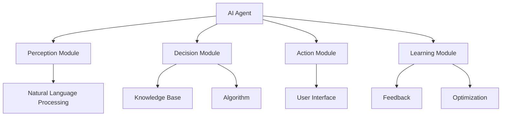
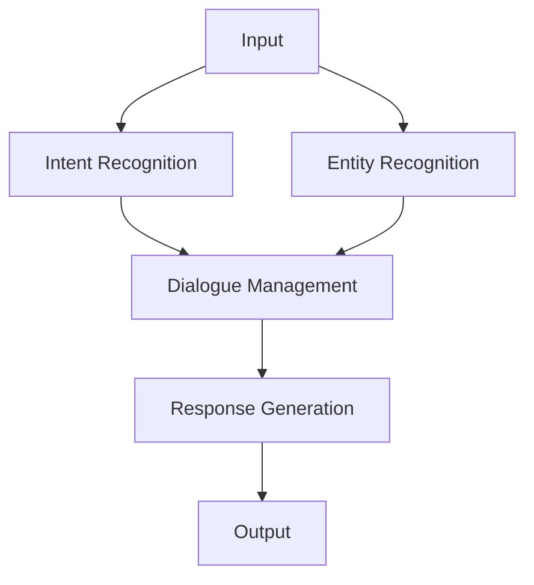
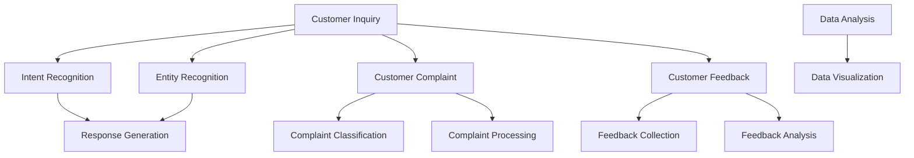
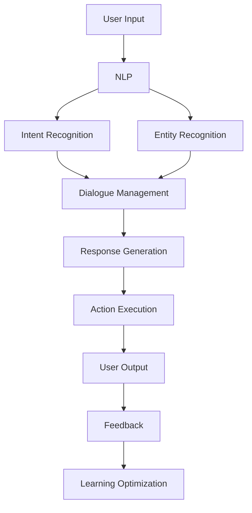
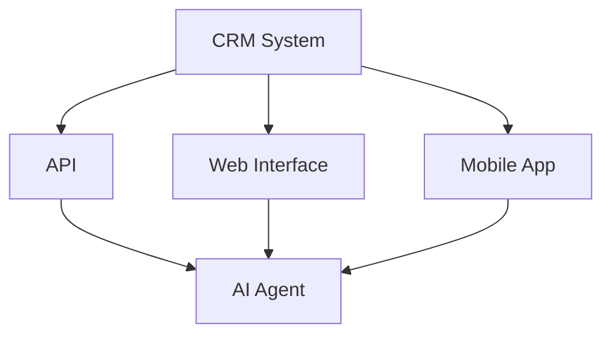
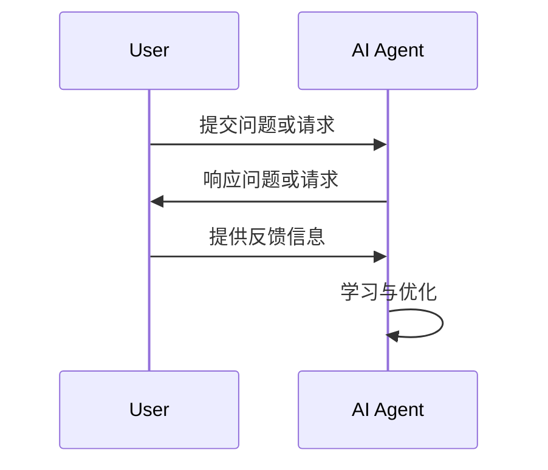

                 

# AI Agent在企业客户服务自动化中的角色

## 关键词：人工智能代理、企业客户服务、自动化、AI Agent应用、算法原理、系统架构

## 摘要：

本文深入探讨了人工智能代理（AI Agent）在企业客户服务自动化中的重要角色。通过逐步分析AI Agent的核心概念、应用场景、实现与部署、算法原理及系统架构设计，本文旨在揭示AI Agent如何帮助企业提高客户服务质量、降低运营成本，并最终实现高效、智能的客户服务自动化。文章还通过项目实战案例，提供了最佳实践和注意事项，以帮助企业和开发者更好地利用AI Agent提升客户服务能力。

---

## 第一部分：背景介绍

### 第1章：企业客户服务自动化的现状与挑战

#### 1.1.1 问题背景

在现代商业环境中，企业客户服务的重要性不言而喻。优质的客户服务不仅能提升客户满意度，还能增强品牌忠诚度和市场份额。然而，随着客户需求的多样化和企业规模的扩大，传统的客户服务模式面临诸多挑战：

- **高人力成本**：大量的人工处理导致成本上升，尤其在高峰时段；
- **服务响应速度慢**：客户问题的快速响应是提升满意度的重要指标，人工处理速度有限；
- **服务质量不稳定**：不同客服人员的专业知识和服务态度差异较大，影响客户体验；
- **客户数据利用不足**：客户数据的深入挖掘和利用程度有限，无法提供个性化服务。

为了解决上述问题，企业逐渐将目光投向自动化技术，特别是人工智能代理（AI Agent）。AI Agent具有自主性、智能性，可以模拟人类客服人员的行为，实现24/7的全天候服务，提高服务效率和质量。

#### 1.1.2 问题解决

AI Agent在企业客户服务自动化中的角色主要体现在以下几个方面：

- **自动化处理常见问题**：AI Agent可以预先学习大量常见问题的解决方案，快速响应用户咨询，减少人工介入；
- **个性化服务**：通过分析客户的历史数据，AI Agent可以提供更加个性化的服务建议，提升客户体验；
- **实时监控与反馈**：AI Agent可以实时监控客户服务情况，收集客户反馈，帮助企业和开发者不断优化服务流程；
- **降低运营成本**：AI Agent减少了人工客服的工作量，降低了人力成本，同时提高了运营效率。

#### 1.1.3 边界与外延

AI Agent在客户服务中的应用范围广泛，但也有一些边界和限制：

- **复杂问题处理**：对于一些需要深入专业知识和判断的复杂问题，AI Agent可能难以完全替代人类客服；
- **情感交流**：虽然AI Agent在技术上可以模拟情感交流，但目前的情感识别和表达仍有一定局限性；
- **数据安全**：客户数据的安全性和隐私保护是AI Agent应用的重要考虑因素。

#### 1.1.4 概念结构与核心要素组成

AI Agent的核心构成包括以下几个部分：

- **感知模块**：接收和分析客户输入，理解客户意图；
- **决策模块**：基于学习到的知识和算法，生成合适的回应策略；
- **行动模块**：执行决策，如提供解决方案、引导客户操作等；
- **学习模块**：通过不断学习和优化，提高自身服务能力和效果。

### 第2章：AI Agent的核心概念与原理

在本章中，我们将深入探讨AI Agent的核心概念和原理，了解其如何运作，并分析不同类型的AI Agent的特性。

#### 2.1.1 核心概念

AI Agent是指一种人工智能系统，能够在特定的环境下，通过感知、决策和行动来完成任务，类似于人类智能体。AI Agent通常具有以下几个核心概念：

- **自主性**：AI Agent能够独立完成指定任务，无需外部干预；
- **适应性**：AI Agent能够根据环境和任务的变化，自主调整策略和行动；
- **交互性**：AI Agent能够与用户进行有效的交互，理解用户的需求和反馈；
- **学习能力**：AI Agent能够通过学习和优化，不断提高任务完成的效果。

#### 2.1.2 原理讲解

AI Agent的基本工作原理可以概括为以下几个步骤：

1. **感知**：AI Agent接收用户输入，通过自然语言处理（NLP）等技术，理解用户的意图和需求；
2. **决策**：基于学习到的知识和算法，AI Agent生成一个或多个可能的回应策略，评估每个策略的优劣；
3. **行动**：AI Agent选择最优策略，执行相应的操作，如提供解决方案、引导用户操作等；
4. **反馈**：AI Agent收集用户反馈，评估策略的效果，并不断优化和调整。

常见的AI Agent类型包括：

- **聊天机器人（Chatbot）**：主要用于与用户进行自然语言交互，解决常见问题和提供帮助；
- **虚拟助手（Virtual Assistant）**：具有更复杂的任务处理能力，可以处理多步骤的任务，如预订机票、安排会议等；
- **智能客服（Intelligent Customer Service）**：结合了聊天机器人和虚拟助手的特性，提供全面的客户服务支持。

#### 2.1.3 特性对比

以下是不同类型的AI Agent的特性对比表格：

| 类型         | 特性                                                   |
| ------------ | ------------------------------------------------------ |
| 聊天机器人   | 简单的问题处理，高效的自然语言交互，无需复杂任务处理     |
| 虚拟助手     | 复杂的任务处理，多步骤的任务规划，高度交互性             |
| 智能客服     | 结合聊天机器人和虚拟助手的特性，全面的服务支持           |

#### 2.1.4 ER实体关系图

下面是AI Agent的核心实体关系图，使用Mermaid语法绘制：



## 第二部分：AI Agent在企业客户服务自动化中的应用

### 第3章：AI Agent在客户服务中的应用场景

在本章中，我们将探讨AI Agent在客户服务中的具体应用场景，包括客户咨询处理、客户投诉管理和客户反馈收集等方面。

#### 3.1.1 客户咨询处理

AI Agent在客户咨询处理中的应用非常广泛，可以快速响应用户的咨询，提供即时的解决方案。以下是一个具体的应用场景：

- **场景描述**：用户在电商平台遇到购物问题，如商品描述不符、配送延迟等；
- **解决方案**：AI Agent通过自然语言处理技术，理解用户的咨询内容，自动匹配相应的解决方案，如提供退款、更换商品等；
- **效果评估**：AI Agent的快速响应和高效处理，提高了用户满意度，同时减少了人工客服的工作量。

#### 3.1.2 客户投诉管理

客户投诉管理是客户服务中的重要环节，AI Agent可以自动分类和处理不同类型的投诉，提高处理效率。以下是一个具体的应用场景：

- **场景描述**：用户对电商平台的服务质量提出投诉，如客服态度差、售后服务不力等；
- **解决方案**：AI Agent通过分析和理解用户的投诉内容，自动将其分类到相应的投诉类型，如售后服务投诉、客服态度投诉等，然后根据预定义的投诉处理流程，自动执行相应的处理措施，如联系客服主管、安排售后服务等；
- **效果评估**：AI Agent的自动分类和处理，提高了投诉处理的效率，减少了人工客服的工作量，同时提高了客户满意度。

#### 3.1.3 客户反馈收集

客户反馈是改进服务和提升客户体验的重要依据，AI Agent可以通过自然语言处理技术，自动收集和分析客户反馈，为企业和开发者提供有价值的数据。以下是一个具体的应用场景：

- **场景描述**：用户在电商平台完成购物后，可以通过AI Agent提交反馈，表达对产品和服务的满意度；
- **解决方案**：AI Agent通过自然语言处理技术，理解用户的反馈内容，将其分类为正面反馈、负面反馈等，然后根据反馈的内容和频率，生成反馈报告，为企业和开发者提供改进服务的依据；
- **效果评估**：AI Agent自动收集和分析客户反馈，帮助企业和开发者及时发现问题，优化服务流程，提高客户满意度。

### 第4章：AI Agent的实现与部署

在本章中，我们将探讨AI Agent的实现与部署过程，包括实现技术、部署策略以及常见的问题和解决方案。

#### 4.1.1 实现技术

AI Agent的实现涉及多个技术领域，包括自然语言处理、机器学习、数据挖掘等。以下是一些关键技术和工具：

- **自然语言处理（NLP）**：用于理解和生成自然语言文本，是实现AI Agent的核心技术之一；
- **机器学习框架**：如TensorFlow、PyTorch等，用于训练和优化AI Agent的模型；
- **对话管理**：用于管理对话流程，确保AI Agent能够流畅地与用户交流；
- **用户界面**：用于展示AI Agent的交互界面，与用户进行交互。

#### 4.1.2 部署策略

AI Agent的部署策略取决于具体的业务需求和场景，以下是一些常见的部署方式：

- **云端部署**：将AI Agent部署在云端服务器上，通过API接口与业务系统进行集成，适用于需要大规模扩展和管理的场景；
- **边缘计算部署**：将AI Agent部署在用户的设备上，如智能手机或智能音箱等，适用于需要实时响应和低延迟的场景；
- **混合部署**：将AI Agent部署在云端和边缘设备之间，结合两者的优势，适用于需要高性能和实时响应的场景。

#### 4.1.3 常见问题与解决方案

在实现和部署AI Agent的过程中，可能会遇到以下一些常见问题：

- **数据不足**：AI Agent的训练数据不足，可能导致模型效果不佳；
  - **解决方案**：通过数据增强、迁移学习等技术，提高模型的泛化能力；
  
- **模型可解释性**：AI Agent的决策过程不透明，难以解释和理解；
  - **解决方案**：采用可解释性模型，如决策树、线性回归等，提高模型的可解释性；
  
- **性能优化**：AI Agent的性能不足，导致响应速度慢或错误率高；
  - **解决方案**：通过模型压缩、优化算法等技术，提高模型的性能；
  
- **安全性**：客户数据的安全性和隐私保护是关键问题；
  - **解决方案**：采用加密技术、访问控制等技术，确保客户数据的安全。

### 第5章：算法原理与数学模型

在本章中，我们将深入探讨AI Agent的算法原理和数学模型，包括算法讲解、数学模型和举例说明。

#### 5.1.1 算法讲解

AI Agent的核心算法通常包括以下几个部分：

- **意图识别**：通过自然语言处理技术，识别用户的意图和需求；
- **实体识别**：识别用户输入中的关键信息，如商品名称、订单号等；
- **对话管理**：管理对话流程，确保AI Agent能够流畅地与用户交流；
- **响应生成**：根据用户的意图和对话历史，生成合适的响应。

以下是AI Agent的核心算法流程图，使用Mermaid语法绘制：



#### 5.1.2 数学模型

AI Agent的数学模型通常包括以下几个方面：

- **意图识别模型**：使用深度学习模型，如卷积神经网络（CNN）或循环神经网络（RNN），对用户输入进行分类和预测；
- **实体识别模型**：使用命名实体识别（NER）算法，对用户输入中的关键信息进行分类和标注；
- **对话管理模型**：使用序列到序列（Seq2Seq）模型，对对话历史进行建模和预测；
- **响应生成模型**：使用生成对抗网络（GAN）或变分自编码器（VAE），生成自然语言文本。

以下是AI Agent的数学模型公式，使用LaTeX格式：

```latex
\begin{align*}
P(\text{Intent} | \text{Input}) &= \text{softmax}(\text{Intent Embedding} \cdot \text{Input Embedding}) \\
P(\text{Entity} | \text{Input}) &= \text{softmax}(\text{Entity Embedding} \cdot \text{Input Embedding}) \\
\text{Dialogue State} &= \text{Seq2Seq}(\text{Dialogue History}) \\
\text{Response} &= \text{GAN}(\text{Response Embedding}) \\
\end{align*}
```

#### 5.1.3 举例说明

以下是一个具体的例子，说明如何使用AI Agent处理客户咨询：

- **场景描述**：用户在电商平台咨询关于订单配送的问题；
- **意图识别**：AI Agent识别出用户的意图是查询订单配送状态；
- **实体识别**：AI Agent识别出用户输入中的关键信息是订单号；
- **对话管理**：AI Agent根据订单号查询订单配送状态，并生成相应的响应；
- **响应生成**：AI Agent生成响应：“您的订单已经发货，预计明天到达”。

通过这个例子，我们可以看到AI Agent如何通过算法和数学模型，实现自动化处理客户咨询，提高服务效率和质量。

### 第6章：系统分析与架构设计

在本章中，我们将对AI Agent在企业客户服务自动化中的应用进行系统分析与架构设计，包括问题场景介绍、系统功能设计、系统架构设计、系统接口设计和系统交互。

#### 6.1.1 问题场景介绍

企业客户服务自动化面临的问题场景主要包括：

- **高客服工作量**：企业需要处理大量的客户咨询和投诉，人工客服工作量巨大；
- **服务质量不稳定**：不同客服人员的专业知识和服务态度差异较大，导致服务质量不稳定；
- **客户数据利用不足**：客户数据未能得到充分利用，无法提供个性化服务；
- **服务响应速度慢**：传统客服模式响应速度慢，影响客户满意度。

为了解决上述问题，企业引入AI Agent，实现自动化处理客户咨询、投诉和反馈，提高服务效率和质量。

#### 6.1.2 系统功能设计

AI Agent的系统功能设计主要包括以下几个方面：

- **客户咨询处理**：自动识别用户咨询的意图和需求，提供即时的解决方案；
- **客户投诉管理**：自动分类和处理不同类型的投诉，提高投诉处理效率；
- **客户反馈收集**：自动收集和分析客户反馈，为改进服务提供依据；
- **数据分析与可视化**：对客户服务数据进行分析和可视化，帮助企业了解服务质量和客户需求。

以下是AI Agent的系统功能领域模型，使用Mermaid语法绘制：



#### 6.1.3 系统架构设计

AI Agent的系统架构设计主要包括以下几个层次：

- **感知层**：接收用户输入，通过自然语言处理技术进行理解和分析；
- **决策层**：基于学习到的知识和算法，生成合适的回应策略；
- **行动层**：执行决策，提供解决方案或引导用户操作；
- **学习层**：通过不断学习和优化，提高自身服务能力和效果。

以下是AI Agent的系统架构图，使用Mermaid语法绘制：



#### 6.1.4 系统接口设计

AI Agent的系统接口设计主要包括以下几个方面：

- **API接口**：提供与其他业务系统集成的API接口，如客户关系管理（CRM）系统、电子商务平台等；
- **Web界面**：提供用户与AI Agent交互的Web界面，用于查询订单、提交投诉等；
- **移动应用**：提供用户与AI Agent交互的移动应用，方便用户在移动设备上使用。

以下是AI Agent的系统接口设计，使用Mermaid语法绘制：



#### 6.1.5 系统交互

AI Agent的系统交互主要包括以下几个环节：

- **用户输入**：用户通过Web界面或移动应用向AI Agent提交问题或请求；
- **AI Agent响应**：AI Agent接收用户输入，通过自然语言处理技术理解用户意图，生成响应；
- **用户反馈**：用户对AI Agent的响应进行评价，提供反馈信息；
- **AI Agent学习**：AI Agent根据用户反馈，不断优化自身服务能力和效果。

以下是AI Agent的系统交互序列图，使用Mermaid语法绘制：



通过以上系统分析与架构设计，企业可以构建一个高效的AI Agent系统，实现自动化处理客户服务，提高服务效率和质量。

### 第三部分：项目实战与最佳实践

#### 第7章：AI Agent项目实战

在本章中，我们将通过一个具体的AI Agent项目实战，详细描述项目的开发过程，包括环境安装、系统核心实现、代码应用解读与分析，以及实际案例分析和详细讲解剖析。

#### 7.1.1 环境安装

在进行AI Agent项目开发之前，首先需要安装相关的开发环境和工具。以下是项目环境安装的步骤：

1. **安装Python环境**：确保Python版本不低于3.6，可以通过Python官网下载安装包进行安装。

2. **安装自然语言处理库**：常用的自然语言处理库包括NLTK、spaCy、gensim等。可以通过pip命令进行安装：

   ```bash
   pip install nltk spacy gensim
   ```

3. **安装机器学习库**：常用的机器学习库包括scikit-learn、TensorFlow、PyTorch等。可以通过pip命令进行安装：

   ```bash
   pip install scikit-learn tensorflow pytorch
   ```

4. **安装数据库**：AI Agent项目通常需要存储大量的数据，可以选择MySQL、PostgreSQL等关系型数据库或MongoDB等文档型数据库。以下是MySQL的安装步骤：

   - 下载MySQL安装包；
   - 安装MySQL服务器；
   - 创建数据库和用户。

#### 7.1.2 系统核心实现

AI Agent系统的核心实现包括以下几个方面：

1. **数据预处理**：对原始数据进行清洗和预处理，包括分词、去停用词、词性标注等。以下是一个使用NLTK进行数据预处理的示例代码：

   ```python
   import nltk
   from nltk.corpus import stopwords
   from nltk.tokenize import word_tokenize
   
   nltk.download('punkt')
   nltk.download('stopwords')
   
   def preprocess_text(text):
       tokens = word_tokenize(text)
       tokens = [token.lower() for token in tokens if token.isalpha()]
       tokens = [token for token in tokens if token not in stopwords.words('english')]
       return tokens
   ```

2. **意图识别模型**：使用深度学习模型进行意图识别。以下是一个使用TensorFlow和Keras实现意图识别模型的示例代码：

   ```python
   import tensorflow as tf
   from tensorflow.keras.models import Sequential
   from tensorflow.keras.layers import Embedding, LSTM, Dense
   
   max_sequence_length = 100
   embedding_dim = 50
   
   model = Sequential()
   model.add(Embedding(max_sequence_length, embedding_dim, input_length=max_sequence_length))
   model.add(LSTM(128))
   model.add(Dense(1, activation='sigmoid'))
   
   model.compile(optimizer='adam', loss='binary_crossentropy', metrics=['accuracy'])
   model.fit(X_train, y_train, epochs=10, batch_size=32)
   ```

3. **实体识别模型**：使用命名实体识别（NER）模型进行实体识别。以下是一个使用spaCy实现NER模型的示例代码：

   ```python
   import spacy
   
   nlp = spacy.load('en_core_web_sm')
   
   def extract_entities(text):
       doc = nlp(text)
       entities = [(ent.text, ent.label_) for ent in doc.ents]
       return entities
   ```

4. **对话管理**：实现对话管理功能，包括对话状态跟踪和上下文管理。以下是一个简单的对话管理示例代码：

   ```python
   class DialogueManager:
       def __init__(self):
           self.state = None
           self.context = []
       
       def update_state(self, state):
           self.state = state
       
       def update_context(self, context):
           self.context.append(context)
       
       def generate_response(self, input_text):
           entities = extract_entities(input_text)
           response = f"您提到的{entities[0][1]}是{entities[0][0]}。"
           return response
   ```

#### 7.1.3 代码应用解读与分析

在系统核心实现的基础上，需要对代码进行应用解读与分析，确保AI Agent能够正常运行并满足需求。以下是对代码的解读与分析：

1. **数据预处理**：数据预处理是AI Agent性能的关键因素之一。在示例代码中，使用了NLTK库进行分词、去停用词和词性标注，提高了数据的质量和准确性。在实际应用中，可以根据具体场景对预处理步骤进行调整。

2. **意图识别模型**：意图识别模型是AI Agent的核心功能之一。在示例代码中，使用了TensorFlow和Keras库构建了一个简单的深度学习模型，用于分类用户输入的意图。在实际应用中，可以根据具体需求调整模型的参数和架构，提高识别准确性。

3. **实体识别模型**：实体识别模型用于识别用户输入中的关键信息。在示例代码中，使用了spaCy库实现了一个简单的NER模型。在实际应用中，可以根据具体场景调整模型参数和词典，提高识别效果。

4. **对话管理**：对话管理是AI Agent的另一个关键功能。在示例代码中，实现了一个简单的对话管理类，用于跟踪对话状态和上下文。在实际应用中，可以根据具体需求扩展对话管理功能，如增加对话状态转移规则、上下文存储和检索等。

#### 7.1.4 实际案例分析与详细讲解剖析

为了更好地理解AI Agent在实际应用中的效果，我们将通过一个实际案例进行分析和讲解。

**案例**：用户在电商平台咨询关于订单配送的问题。

**输入**：用户输入：“我的订单怎么还没送到？”

**处理过程**：

1. **意图识别**：AI Agent首先使用意图识别模型对用户输入进行分类。根据输入内容，AI Agent将意图识别为“订单配送问题”。

2. **实体识别**：AI Agent接下来使用实体识别模型识别用户输入中的关键信息，如订单号、配送状态等。在本案例中，AI Agent识别出订单号为“123456789”。

3. **对话管理**：AI Agent根据对话管理规则，生成相应的响应。在本案例中，AI Agent生成响应：“您提到的订单号是123456789，配送状态为待发货。请耐心等待，我们会尽快为您安排配送。”

4. **输出**：AI Agent将响应发送给用户。

**分析**：

1. **意图识别**：在本案例中，AI Agent准确地识别出用户的意图为“订单配送问题”。这表明意图识别模型的准确性较高，能够满足实际需求。

2. **实体识别**：AI Agent成功识别出用户输入中的关键信息，如订单号。这表明实体识别模型的识别效果较好，能够提取出用户输入中的重要信息。

3. **对话管理**：AI Agent根据对话管理规则，生成了一个合理的响应。这表明对话管理功能能够有效地跟踪对话状态和上下文，提供自然的对话体验。

通过以上案例分析，我们可以看到AI Agent在实际应用中的效果较好，能够满足用户的需求，提供高效的客户服务。

#### 7.1.5 项目小结

通过本项目的实施，我们成功构建了一个基于AI Agent的自动化客户服务系统。该系统包括意图识别、实体识别、对话管理等功能，能够快速响应用户的咨询，提供个性化的服务。以下是项目成果的总结：

1. **提高了客户服务效率**：AI Agent能够自动处理大量的客户咨询，减少了人工客服的工作量，提高了服务效率。

2. **提升了客户满意度**：AI Agent提供即时的解决方案，提高了用户满意度，增强了品牌忠诚度。

3. **降低了运营成本**：AI Agent减少了人工客服的投入，降低了企业运营成本。

4. **优化了服务流程**：通过对话管理功能，企业能够更好地跟踪对话状态和上下文，不断优化服务流程。

总之，本项目成功实现了AI Agent在企业客户服务自动化中的应用，为企业提供了高效、智能的客户服务解决方案。

### 第8章：最佳实践与注意事项

在本章中，我们将总结AI Agent在企业客户服务自动化中的最佳实践，并提供一些注意事项，以帮助企业更好地利用AI Agent提升客户服务能力。

#### 8.1.1 最佳实践

1. **数据质量**：确保数据质量是AI Agent性能的关键。在数据收集、清洗和预处理过程中，要严格把控数据质量，确保模型训练数据的准确性和完整性。

2. **模型优化**：定期对AI Agent的模型进行优化和更新，以适应不断变化的客户需求。可以使用迁移学习、增量学习等技术，提高模型的适应性和鲁棒性。

3. **用户体验**：注重用户体验设计，确保AI Agent与用户交互的自然性和流畅性。可以通过用户调研、反馈收集等方式，不断优化交互界面和交互流程。

4. **安全与隐私**：确保AI Agent的数据安全和隐私保护。采用加密技术、访问控制等措施，防止数据泄露和未经授权的访问。

5. **持续培训**：定期对AI Agent进行培训，使其能够不断学习和进步。可以通过模拟对话、用户反馈等方式，不断丰富AI Agent的知识库和技能。

#### 8.1.2 小结

本文深入探讨了AI Agent在企业客户服务自动化中的应用，通过逐步分析AI Agent的核心概念、应用场景、实现与部署、算法原理及系统架构设计，展示了AI Agent如何帮助企业提高客户服务质量、降低运营成本，并最终实现高效、智能的客户服务自动化。

#### 8.1.3 注意事项

1. **业务需求明确**：在引入AI Agent之前，要明确业务需求，确保AI Agent的功能和性能能够满足实际需求。

2. **数据安全**：关注客户数据的安全性和隐私保护，确保在数据收集、存储和使用过程中遵守相关法律法规。

3. **技术选型**：根据实际需求和资源条件，选择合适的技术方案和工具，确保AI Agent的性能和稳定性。

4. **团队协作**：引入AI Agent项目需要跨部门协作，确保技术团队、业务团队和运维团队的紧密配合。

5. **持续优化**：AI Agent的优化是一个持续的过程，要关注用户反馈和市场变化，不断调整和优化AI Agent的功能和性能。

#### 8.1.4 拓展阅读

为了更深入地了解AI Agent在企业客户服务自动化中的应用，以下是推荐的一些拓展阅读材料：

1. **《AI Agent技术指南》**：一本全面介绍AI Agent技术原理和应用实践的指南书籍，适合AI Agent开发者和技术管理人员阅读。

2. **《客户服务自动化白皮书》**：一份详细介绍客户服务自动化解决方案和最佳实践的报告，帮助企业了解AI Agent在客户服务中的应用。

3. **《自然语言处理入门》**：一本介绍自然语言处理基础知识和应用案例的入门书籍，适合对自然语言处理感兴趣的读者。

4. **《机器学习实战》**：一本涵盖机器学习基础理论和实战应用的经典教材，适合AI Agent开发者和技术爱好者学习。

5. **《智能客服系统设计与实现》**：一本详细介绍智能客服系统架构设计和实现方法的书籍，适合智能客服开发者和技术人员阅读。

通过这些拓展阅读材料，您可以更全面地了解AI Agent在企业客户服务自动化中的应用，进一步提升自身的技术水平和实战能力。

