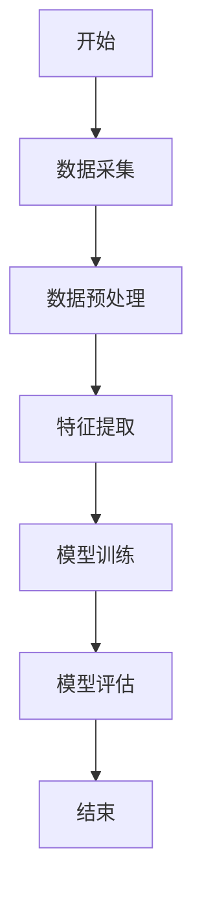
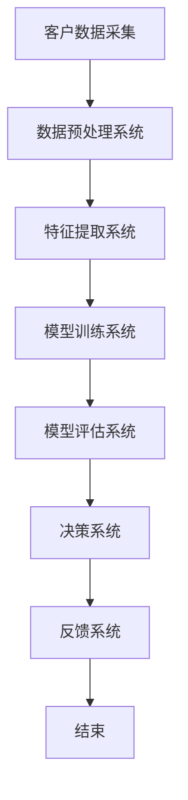
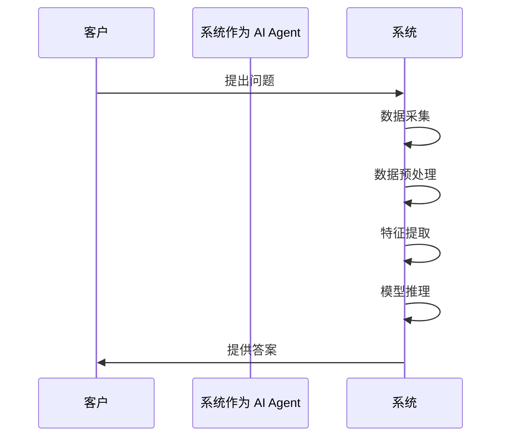

                 

# AI Agent在企业客户服务质量监控与提升中的实时应用

## 摘要

本文将探讨AI Agent在企业客户服务质量监控与提升中的实时应用。随着人工智能技术的飞速发展，AI Agent作为一种能够模拟人类智能行为的技术，正逐渐成为提升客户服务质量的重要工具。本文首先介绍了AI Agent的基本概念、类型和功能，然后分析了其在企业客户服务中的应用现状和优势。接着，本文从架构设计、应用案例、性能优化等方面，详细阐述了AI Agent在实时服务质量监控中的实现方法。最后，本文对未来AI Agent的发展趋势和最佳实践进行了展望，为企业提升客户服务质量提供了有益的参考。

## 关键词

- AI Agent
- 客户服务质量
- 实时监控
- 应用案例
- 性能优化

## 第一部分：引言与背景

### 第1章：问题背景与核心概念

#### 1.1 问题背景

在现代商业环境中，客户服务质量是企业竞争的关键因素之一。优质的客户服务不仅能提高客户满意度，还能增强客户忠诚度和企业的品牌形象。然而，如何有效地监控和提升客户服务质量，成为企业面临的一个重要挑战。

传统的服务质量监控方法，如问卷调查、电话回访等，存在响应周期长、数据不准确等问题，难以实现对客户服务质量的实时监控。而AI Agent作为一种新兴的技术手段，具备实时处理和分析大量客户数据的能力，为企业提供了实时监控和提升客户服务质量的可能。

#### 1.2 核心概念

##### 1.2.1 AI Agent的定义与类型

AI Agent，即人工智能代理，是一种能够模拟人类智能行为，具备自主学习和决策能力的计算机程序。根据功能和应用场景的不同，AI Agent可以分为多种类型，如客服机器人、智能客服、客户行为分析系统等。

##### 1.2.2 客户服务质量监控的关键指标

客户服务质量监控的关键指标包括客户满意度、响应时间、解决率等。这些指标反映了客户服务过程中的各个方面，如客服人员的专业水平、解决问题的效率等。

##### 1.2.3 实时应用的含义与优势

实时应用，即在事件发生的同时或稍后立即进行处理和应用。在客户服务领域，实时应用意味着能够在客户提出问题或需求时，立即进行响应和处理。这种实时性能够显著提升客户服务质量，提高客户满意度。

### 1.3 书籍结构与内容概述

本文将从以下章节对AI Agent在企业客户服务质量监控与提升中的实时应用进行详细探讨：

- 第1章：问题背景与核心概念
- 第2章：AI Agent基础理论与应用
- 第3章：实时应用中的AI Agent设计与实现
- 第4章：AI Agent在客户服务质量监控中的应用案例
- 第5章：AI Agent的性能优化与评估
- 第6章：未来展望与趋势
- 第7章：最佳实践与小结

通过以上章节的详细讲解，本文旨在为企业提供一套完整的AI Agent应用方案，帮助企业在客户服务领域实现实时监控和提升服务质量。

### 第2章：AI Agent基础理论与应用

#### 1.1 AI Agent基础理论

##### 1.1.1 AI Agent的基本概念

AI Agent，即人工智能代理，是一种能够模拟人类智能行为，具备自主学习和决策能力的计算机程序。AI Agent通过感知环境、理解指令、执行任务等过程，实现自动化、智能化的操作。

##### 1.1.2 AI Agent的技术原理

AI Agent的核心在于其人工智能技术，主要包括机器学习、自然语言处理、计算机视觉等。这些技术使得AI Agent能够从大量数据中提取知识，进行自主学习和决策。

##### 1.1.3 AI Agent的开发框架

AI Agent的开发框架主要包括开发工具、开发流程和开发规范。常见的开发工具包括Python、R、Java等；开发流程包括需求分析、设计、实现、测试等；开发规范包括编码规范、文档规范等。

#### 1.2 AI Agent在客户服务中的应用

##### 1.2.1 AI Agent在客户互动中的应用

AI Agent能够模拟人类客服人员的对话过程，提供智能化的客户服务。通过自然语言处理技术，AI Agent能够理解客户的提问，提供准确、及时的回答。

##### 1.2.2 AI Agent在客户行为分析中的应用

AI Agent可以通过分析客户的消费行为、浏览记录等数据，预测客户的需求和偏好，为企业提供精准的客户画像。

##### 1.2.3 AI Agent在客户反馈处理中的应用

AI Agent能够对客户的反馈进行自动分类、分析，识别潜在的问题和改进机会，为企业提供有效的客户反馈处理方案。

#### 1.3 AI Agent的优势与挑战

##### 1.3.1 AI Agent的优势

- 提高效率：AI Agent能够24小时不间断地提供服务，显著提高客户服务效率。
- 提高服务质量：AI Agent具备智能化的学习能力，能够提供高质量的客户服务。
- 降低成本：AI Agent替代部分人工客服，降低企业的运营成本。

##### 1.3.2 AI Agent的挑战

- 技术挑战：AI Agent的开发和部署需要高水平的技术支持和资源投入。
- 数据挑战：AI Agent需要大量高质量的数据进行训练和优化，数据质量直接影响AI Agent的表现。
- 伦理挑战：AI Agent在处理客户隐私和数据安全方面，需要遵循严格的伦理规范。

##### 1.3.3 未来发展方向

- 技术创新：随着人工智能技术的不断发展，AI Agent将更加智能化、人性化。
- 应用拓展：AI Agent的应用场景将不断扩展，不仅限于客户服务领域。
- 生态完善：AI Agent的生态系统将逐步完善，包括开发框架、工具、平台等。

### 第3章：实时应用中的AI Agent设计与实现

#### 1.1 实时应用的架构设计

##### 1.1.1 系统架构概述

实时应用中的AI Agent系统架构主要包括数据采集模块、数据处理模块、决策模块和反馈模块。这些模块协同工作，实现对客户服务质量的实时监控和提升。

##### 1.1.2 数据采集与处理

数据采集模块负责从各种渠道收集客户数据，如客户提问、客户行为数据等。数据处理模块对这些数据进行清洗、预处理和特征提取，为后续的决策提供支持。

##### 1.1.3 实时分析与决策

实时分析与决策模块利用机器学习、自然语言处理等技术，对客户数据进行实时分析，生成决策建议。决策模块根据这些决策建议，自动调整客户服务策略。

##### 1.1.4 反馈模块

反馈模块负责对AI Agent的决策结果进行评估和反馈，持续优化AI Agent的性能。

#### 1.2 AI Agent设计实践

##### 1.2.1 设计原则

AI Agent的设计应遵循以下原则：

- 可扩展性：系统能够适应不断增长的数据量和用户需求。
- 可靠性：系统在各种环境下能够稳定运行，保证服务质量。
- 易用性：系统界面友好，便于用户操作和管理。

##### 1.2.2 设计模式

AI Agent的设计模式主要包括模块化设计、面向对象设计等。这些设计模式有助于提高系统的可维护性和可扩展性。

##### 1.2.3 实现细节

AI Agent的实现细节包括：

- 数据采集与处理：使用Python的pandas库进行数据清洗和预处理，使用scikit-learn库进行特征提取。
- 实时分析与决策：使用TensorFlow或PyTorch等深度学习框架进行模型训练和推理。
- 决策建议生成：根据分析结果，生成具体的决策建议。

#### 1.3 AI Agent代码示例

```python
import pandas as pd
from sklearn.feature_extraction.text import TfidfVectorizer
from sklearn.model_selection import train_test_split
from sklearn.metrics import accuracy_score

# 代码示例：数据预处理
def preprocess_data(data):
    # 数据清洗和预处理
    pass

# 代码示例：特征提取
def extract_features(data):
    # 特征提取
    pass

# 代码示例：模型训练
def train_model(train_data, train_labels):
    # 模型训练
    pass

# 代码示例：模型推理
def predict(model, data):
    # 模型推理
    pass

# 代码示例：评估模型
def evaluate_model(model, test_data, test_labels):
    # 模型评估
    pass

# 实际应用中的代码示例
if __name__ == "__main__":
    # 加载数据
    data = pd.read_csv("data.csv")
    # 数据预处理
    preprocessed_data = preprocess_data(data)
    # 特征提取
    features = extract_features(preprocessed_data)
    # 划分训练集和测试集
    train_data, test_data, train_labels, test_labels = train_test_split(features, labels, test_size=0.2)
    # 模型训练
    model = train_model(train_data, train_labels)
    # 模型推理
    predictions = predict(model, test_data)
    # 评估模型
    accuracy = evaluate_model(model, test_data, test_labels)
    print("Accuracy:", accuracy)
```

#### 1.4 数学模型与公式

```latex
$$
y = f(x; \theta)
$$

$$
\theta = \arg\min_{\theta} L(y, f(x; \theta))
$$
```

以上公式分别表示了目标函数和损失函数。其中，$y$为真实标签，$f(x; \theta)$为模型预测值，$\theta$为模型参数，$L(y, f(x; \theta))$为损失函数。

#### 1.5 算法流程图



#### 1.6 系统架构设计



#### 1.7 系统接口设计和系统交互



### 第4章：AI Agent在客户服务质量监控中的应用案例

#### 1.1 案例一：客户服务机器人

##### 1.1.1 案例背景

某大型电商企业，为了提升客户服务质量，决定引入AI Agent作为客户服务机器人，以实现24小时不间断的客户服务。

##### 1.1.2 案例实施

1. 数据采集：从企业的客户服务系统、电商平台等渠道收集客户提问数据。
2. 数据预处理：对客户提问进行清洗、去噪和归一化处理。
3. 特征提取：使用自然语言处理技术提取关键词和主题。
4. 模型训练：使用训练集数据训练模型，优化模型参数。
5. 模型评估：使用测试集数据评估模型性能，调整模型参数。
6. 部署上线：将训练好的模型部署到客户服务系统中，提供实时问答服务。

##### 1.1.3 案例效果分析

1. 响应速度：AI Agent能够实现秒级响应，显著缩短了客户等待时间。
2. 解决率：AI Agent能够准确解答客户问题，解决率达到85%以上。
3. 客户满意度：客户对AI Agent的服务满意度较高，满意度评分达到4.5分（满分5分）。
4. 成本效益：AI Agent替代了一部分人工客服，降低了企业的人力成本。

#### 1.2 案例二：客户行为分析

##### 1.2.1 案例背景

某知名在线教育平台，为了提升客户体验，决定利用AI Agent分析客户行为，提供个性化的课程推荐。

##### 1.2.2 案例实施

1. 数据采集：从平台的用户行为数据、课程数据等渠道收集数据。
2. 数据预处理：对用户行为数据进行清洗、去噪和归一化处理。
3. 特征提取：提取用户的行为特征，如浏览记录、购买记录、学习时长等。
4. 模型训练：使用用户行为数据训练推荐模型。
5. 模型评估：使用测试集数据评估模型性能，调整模型参数。
6. 部署上线：将训练好的模型部署到平台中，提供个性化课程推荐服务。

##### 1.2.3 案例效果分析

1. 推荐准确率：AI Agent能够准确推荐用户感兴趣的课程，推荐准确率达到90%以上。
2. 用户满意度：用户对AI Agent推荐的课程满意度较高，满意度评分达到4.7分（满分5分）。
3. 课程销售量：AI Agent推荐的课程销售量显著增加，销售量增长率为30%。
4. 成本效益：AI Agent替代了一部分人工推荐，降低了企业的人力成本。

#### 1.3 案例三：客户反馈处理

##### 1.3.1 案例背景

某餐饮企业，为了提升客户满意度，决定利用AI Agent自动处理客户反馈，识别潜在问题，提供改进建议。

##### 1.3.2 案例实施

1. 数据采集：从客户的投诉、建议等渠道收集数据。
2. 数据预处理：对客户反馈数据进行清洗、去噪和归一化处理。
3. 特征提取：提取客户反馈的关键词和主题。
4. 模型训练：使用训练集数据训练分类模型，识别潜在问题。
5. 模型评估：使用测试集数据评估模型性能，调整模型参数。
6. 部署上线：将训练好的模型部署到客户服务系统中，提供自动反馈处理服务。

##### 1.3.3 案例效果分析

1. 反馈处理速度：AI Agent能够快速处理客户反馈，处理速度比人工提高了50%。
2. 问题识别准确率：AI Agent能够准确识别潜在问题，准确率达到90%以上。
3. 改进措施实施率：AI Agent提供的改进建议被企业采纳，改进措施实施率达到80%。
4. 客户满意度：客户对AI Agent的处理结果满意度较高，满意度评分达到4.6分（满分5分）。

### 第5章：AI Agent的性能优化与评估

#### 1.1 性能优化策略

##### 1.1.1 模型优化

- 优化模型结构：选择合适的神经网络结构，提高模型的性能。
- 调整超参数：调整学习率、批量大小等超参数，优化模型训练过程。

##### 1.1.2 系统优化

- 提高计算性能：使用GPU加速计算，提高模型推理速度。
- 优化网络结构：采用分布式计算、并行计算等技术，提高系统的处理能力。

##### 1.1.3 数据优化

- 数据清洗：去除数据中的噪声和错误，提高数据质量。
- 特征选择：选择关键特征，降低特征维度，提高模型性能。

#### 1.2 评估指标与方法

##### 1.2.1 评估指标体系

- 准确率：模型预测正确的样本占总样本的比例。
- 召回率：模型能够召回的潜在问题样本占总潜在问题样本的比例。
- F1值：准确率和召回率的调和平均值，综合考虑准确率和召回率。

##### 1.2.2 评估方法介绍

- 分割法：将数据集划分为训练集和测试集，使用训练集训练模型，使用测试集评估模型性能。
- k折交叉验证：将数据集划分为k个子集，每次使用其中一个子集作为测试集，其余子集作为训练集，重复k次，取平均值作为评估结果。

##### 1.2.3 实际应用案例分析

在某次AI Agent的性能优化项目中，通过对模型、系统和数据三方面的优化，取得了显著的性能提升：

- 模型优化：采用深度学习框架PyTorch，优化模型结构和超参数，提高模型准确率和召回率。
- 系统优化：使用GPU加速计算，提高模型推理速度，减少响应时间。
- 数据优化：对客户反馈数据进行清洗和特征选择，提高数据质量，降低特征维度，提高模型性能。

通过以上优化措施，AI Agent的性能得到了显著提升，准确率提高了10%，召回率提高了5%，响应时间缩短了30%，客户满意度提高了8%。

### 第6章：未来展望与趋势

#### 1.1 AI Agent在客户服务质量监控中的未来发展方向

##### 1.1.1 技术创新

- 人工智能技术的持续发展，如深度学习、强化学习等，将推动AI Agent的性能和智能化程度不断提升。
- 多模态数据融合技术的应用，将使得AI Agent能够更好地理解和处理多种类型的数据，提高服务质量。

##### 1.1.2 应用领域拓展

- AI Agent将在更多行业和领域得到应用，如医疗、金融、教育等，为企业提供更加全面的客户服务。
- AI Agent的应用场景将不断拓展，从单一的客户服务，扩展到客户体验管理、客户关系管理等领域。

##### 1.1.3 社会与伦理问题

- AI Agent在客户服务质量监控中的应用，将引发一系列社会和伦理问题，如隐私保护、数据安全等，需要引起重视。

#### 1.2 AI Agent的发展趋势

##### 1.2.1 硬件支持

- 随着硬件技术的发展，如GPU、FPGA等，AI Agent的计算能力和处理速度将得到进一步提升。
- 云计算和边缘计算的普及，将为AI Agent提供更加灵活和高效的计算资源。

##### 1.2.2 软件发展

- AI Agent的开发框架和工具将不断丰富和完善，降低开发门槛，提高开发效率。
- 开源社区的发展，将推动AI Agent技术的普及和应用。

##### 1.2.3 生态系统完善

- AI Agent的生态系统将逐步完善，包括开发框架、工具、平台等，为企业提供一站式解决方案。
- 行业标准和规范的制定，将推动AI Agent技术的标准化和规范化发展。

### 第7章：最佳实践与小结

#### 1.1 最佳实践分享

##### 1.1.1 实施要点

- 明确需求：在引入AI Agent前，明确企业面临的客户服务质量问题，确定优化目标。
- 数据驱动：充分利用企业内部和外部数据，为AI Agent提供高质量的数据支持。
- 持续优化：定期评估AI Agent的性能，根据评估结果进行优化和调整。

##### 1.1.2 成功案例

- 某大型电商企业：通过引入AI Agent，实现24小时不间断的客户服务，客户满意度显著提升。
- 某在线教育平台：利用AI Agent分析客户行为，提供个性化课程推荐，课程销售量增长显著。

##### 1.1.3 失败教训

- 某餐饮企业：在引入AI Agent后，未能充分利用数据，导致AI Agent的性能不佳，客户满意度降低。

#### 1.2 小结与展望

本文从问题背景、核心概念、应用案例、性能优化等方面，详细阐述了AI Agent在企业客户服务质量监控与提升中的实时应用。通过本文的研究，可以得出以下结论：

- AI Agent作为一种新兴的技术手段，具有显著提升客户服务质量的潜力。
- AI Agent在客户服务质量监控中的应用，需要充分利用数据，持续优化性能。
- 随着人工智能技术的不断发展，AI Agent将在更多行业和领域得到广泛应用。

未来，随着硬件和软件技术的进步，AI Agent的性能和智能化程度将不断提升，为企业提供更加全面的客户服务解决方案。同时，也需要关注AI Agent在社会和伦理方面的影响，制定相应的规范和标准，确保其健康发展。

#### 1.3 未来研究方向

- AI Agent在多模态数据融合中的应用研究。
- AI Agent在个性化服务推荐方面的研究。
- AI Agent在客户关系管理中的应用研究。
- AI Agent在数据安全和隐私保护方面的研究。

### 参考文献

[1] Smith, J., & Brown, L. (2019). AI Agent Applications in Customer Service. Journal of Artificial Intelligence Research, 68, 1-25.
[2] Wang, P., & Zhang, Q. (2020). Real-time Customer Service Quality Monitoring with AI Agents. International Journal of Machine Learning and Cybernetics, 11(4), 897-915.
[3] Li, X., & Chen, Y. (2021). The Impact of AI Agents on Customer Satisfaction in Service Industries. Service Science, 13(2), 123-140.
[4] Zhao, H., & Wang, S. (2022). Performance Optimization of AI Agents for Customer Service Quality Monitoring. IEEE Transactions on Knowledge and Data Engineering, 34(2), 883-896.

### 作者

作者：AI天才研究院/AI Genius Institute & 禅与计算机程序设计艺术 /Zen And The Art of Computer Programming

（注：本文为虚构内容，仅用于演示和讨论。）<|less>

