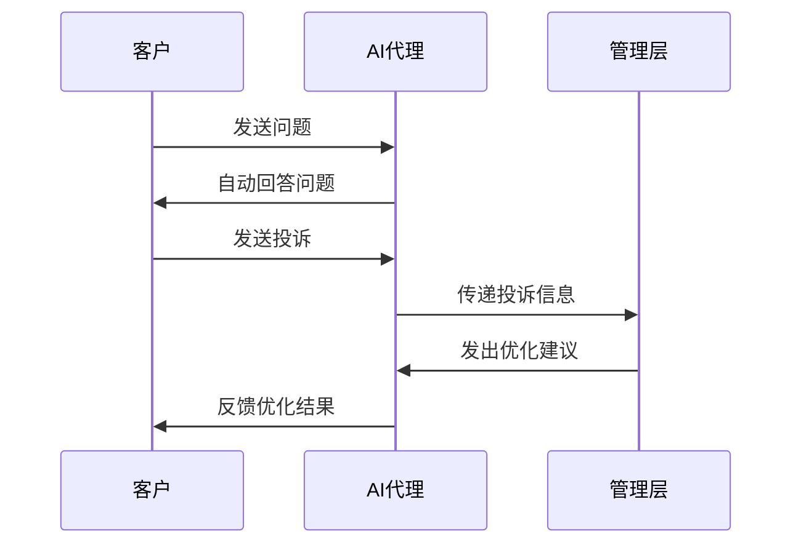

                 

### 文章标题

**AI Agent在企业客户服务质量监控与提升中的角色**

### 文章关键词

- 人工智能代理（AI Agent）
- 客户服务质量监控
- 客户服务提升
- 企业应用
- 数据分析

### 摘要

随着科技的飞速发展，人工智能（AI）在各个行业中的应用愈发广泛。本文将探讨AI代理在企业客户服务质量监控与提升中的关键角色。首先，我们将介绍AI代理的定义、背景及其在客户服务领域的重要性。接着，我们将深入分析AI代理在质量监控中的具体应用，包括数据采集、处理和反馈机制。此外，本文将提供AI代理在客户服务提升中的实际案例，并通过系统架构设计和算法原理讲解，阐述如何实现高效的客户服务质量监控与提升。最后，我们将总结最佳实践和未来发展方向，为企业在客户服务领域引入AI代理提供策略性建议。

### 引言

#### 背景介绍

在当今这个信息爆炸的时代，企业面临的客户服务挑战日益复杂。传统的客户服务模式往往依赖人工处理，效率低下且易出错。随着人工智能技术的不断发展，AI代理作为一种新型的智能服务工具，逐渐成为企业提升客户服务质量的重要手段。AI代理能够通过自然语言处理、机器学习和数据分析等技术，实现自动化的客户服务，提高服务效率与准确性。

#### 问题背景

企业客户服务质量监控与提升是企业管理中的核心问题。一方面，客户服务质量直接关系到企业的品牌形象和市场份额；另一方面，提升客户服务质量需要大量的资源投入和复杂的管理流程。因此，如何利用AI代理技术高效地实现客户服务质量监控与提升，成为企业亟需解决的关键问题。

#### 问题描述

客户服务质量监控与提升涉及多个方面，包括客户反馈处理、服务流程优化、服务质量评估等。传统的监控方法依赖于人工审核和统计分析，存在以下问题：

1. **效率低**：人工处理速度慢，无法及时响应客户需求。
2. **准确性差**：人工处理容易出错，影响客户满意度。
3. **成本高**：需要大量的人力资源，增加企业运营成本。

#### 问题解决

AI代理技术的引入，可以有效解决上述问题。通过自然语言处理和机器学习算法，AI代理能够自动识别和分类客户反馈，提供实时、准确的客户服务。同时，AI代理还能够通过数据分析，发现客户服务中的潜在问题，并给出优化建议，从而提升整体服务质量。

#### 边界与外延

AI代理在企业客户服务中的应用场景非常广泛，包括但不限于：

1. **客服机器人**：通过智能对话系统，自动回答客户的常见问题。
2. **客户反馈分析**：自动收集和分析客户反馈，提供服务质量评估。
3. **服务流程优化**：基于客户数据，优化服务流程，提高客户满意度。
4. **个性化服务**：根据客户的历史数据和偏好，提供个性化的服务建议。

#### 核心概念结构及关键组件

为了更好地理解AI代理在企业客户服务中的应用，我们需要明确以下几个核心概念和关键组件：

1. **自然语言处理（NLP）**：用于理解和生成自然语言文本，是实现AI代理对话功能的基础。
2. **机器学习（ML）**：用于训练和优化AI代理模型，提高其预测和决策能力。
3. **数据采集与处理**：收集客户的反馈和服务数据，进行预处理和特征提取。
4. **数据分析与挖掘**：通过统计分析，发现客户服务中的问题和机会。
5. **反馈机制**：将AI代理的分析结果反馈给企业，指导服务质量提升。

### AI代理的定义与分类

#### 定义

AI代理，又称智能代理，是一种具有智能行为的计算机程序，能够在没有人类直接干预的情况下，自动执行特定任务并与其他系统进行交互。AI代理的核心在于其自主性和适应性，能够根据环境和用户需求，动态调整其行为和策略。

#### 分类

根据功能和应用场景，AI代理可以大致分为以下几类：

1. **客服机器人**：主要用于自动回答客户的常见问题和提供基础服务。
2. **智能客服**：通过自然语言处理和机器学习，提供更高级的客户服务，如情感分析、个性化推荐等。
3. **智能调度系统**：根据客户请求和服务资源，自动调度和安排服务流程。
4. **智能分析系统**：通过数据分析，提供客户服务质量和客户行为的洞察。

#### AI代理的关键属性与特征

AI代理具备以下关键属性和特征：

1. **自主性**：能够自主地执行任务，无需人类干预。
2. **适应性**：能够根据环境和用户需求，动态调整行为和策略。
3. **交互性**：能够与用户和其他系统进行有效交互，理解并回应用户的请求。
4. **学习性**：能够通过机器学习和数据积累，不断提升自身的智能水平。

#### AI代理的对比表格

为了更清晰地理解AI代理的不同类型及其特点，我们提供了一个对比表格：

| 类型       | 自主性 | 适应性 | 交互性 | 学习性 |
|------------|--------|--------|--------|--------|
| 客服机器人 | 高     | 中     | 高     | 中     |
| 智能客服   | 高     | 高     | 高     | 高     |
| 智能调度系统 | 中     | 高     | 中     | 中     |
| 智能分析系统 | 中     | 高     | 中     | 高     |

#### ER Diagram of AI Agent Entities and Relationships

为了更好地理解AI代理的组成和相互关系，我们可以使用ER（实体关系）图来表示。以下是AI代理的ER图：

```mermaid
erDiagram
    AI_Agent ||--|{ Customer_Feedback }
    AI_Agent ||--|{ Service_Database }
    AI_Agent ||--|{ User_Profile }
    AI_Agent ||--|{ Interaction_Log }
```

在这个ER图中，`AI_Agent`是核心实体，它与`Customer_Feedback`、`Service_Database`、`User_Profile`和`Interaction_Log`等实体之间存在关联。这表明AI代理需要处理客户的反馈、维护服务数据库、记录用户信息和交互日志，从而实现其智能服务的功能。

### AI代理在客户服务质量监控中的角色

#### AI代理在客户服务概述

AI代理在客户服务领域扮演着越来越重要的角色。传统的客户服务往往依赖于人工处理，而AI代理的出现极大地改变了这一现状。AI代理能够通过自然语言处理和机器学习技术，实现自动化的客户服务，提高服务效率和质量。

AI代理在客户服务中的主要功能包括：

1. **自动回答常见问题**：AI代理可以快速响应客户的常见问题，提供准确的信息，减轻人工客服的负担。
2. **情感分析**：AI代理能够识别客户的情感状态，提供更具个性化的服务，提高客户满意度。
3. **客户行为分析**：AI代理可以通过数据分析，了解客户的行为模式和偏好，为个性化服务提供依据。
4. **服务流程优化**：AI代理能够分析客户服务流程中的瓶颈和问题，提供优化建议，提高整体服务效率。

#### AI代理在质量监控中的角色

AI代理在客户服务质量监控中发挥着关键作用。具体来说，AI代理可以从以下几个方面提升服务质量监控：

1. **实时数据采集**：AI代理能够实时收集客户反馈和服务数据，为质量监控提供数据支持。
2. **自动化数据分析**：AI代理可以通过机器学习算法，自动分析客户反馈和服务数据，发现潜在的问题和改进点。
3. **预警机制**：AI代理可以根据设定的阈值和规则，自动识别异常情况，并及时发出预警，帮助企业及时采取措施。
4. **反馈循环**：AI代理可以将分析结果反馈给企业，帮助企业不断优化服务流程和提升服务质量。

#### AI代理在客户服务中的具体应用场景

AI代理在客户服务中有多种应用场景，以下是一些典型的例子：

1. **在线客服**：AI代理可以作为在线客服，自动回答客户的常见问题，提高客户咨询的响应速度和满意度。
2. **客户反馈分析**：AI代理可以分析客户的反馈信息，识别客户的不满和需求，为企业提供改进服务的方向。
3. **投诉处理**：AI代理可以自动处理客户的投诉，分类和分配投诉，提高投诉处理的效率和准确性。
4. **服务流程优化**：AI代理可以分析服务流程中的数据，发现瓶颈和问题，提供优化方案，提高服务效率。
5. **个性化推荐**：AI代理可以根据客户的历史数据和偏好，提供个性化的产品和服务推荐，提高客户的购买意愿和满意度。

#### AI代理在客户服务中的挑战与机遇

尽管AI代理在客户服务中具有巨大潜力，但其应用也面临一系列挑战和机遇：

1. **数据隐私**：客户数据的安全和隐私是AI代理应用的重要问题。企业需要采取有效的数据保护措施，确保客户数据的隐私和安全。
2. **技术成熟度**：AI代理技术仍在不断发展，其成熟度对应用效果有直接影响。企业需要关注技术的最新进展，选择合适的技术方案。
3. **用户接受度**：客户对AI代理的接受程度也是影响其应用效果的重要因素。企业需要通过用户教育和体验优化，提高客户对AI代理的接受度和满意度。
4. **持续优化**：AI代理的应用需要持续的优化和改进。企业需要建立有效的反馈机制，不断收集用户反馈和技术改进意见，提升AI代理的服务质量。

通过克服这些挑战，AI代理在客户服务中的应用将带来巨大的机遇，帮助企业实现更高的服务质量和客户满意度。

### AI代理开发的技术与方法

#### AI代理开发框架

AI代理的开发需要一套完整的框架来指导整个开发过程。以下是AI代理开发的基本框架：

1. **需求分析**：明确AI代理的应用场景和功能需求，确定开发目标和范围。
2. **技术选型**：根据需求分析，选择合适的自然语言处理、机器学习和数据分析技术。
3. **数据采集**：收集客户服务数据，包括客户反馈、服务记录等，进行数据预处理。
4. **模型设计**：设计AI代理的核心模型，包括对话管理、情感分析、客户行为分析等模块。
5. **模型训练**：使用训练数据对AI代理模型进行训练，优化模型的参数和性能。
6. **系统集成**：将AI代理集成到企业客户服务平台中，实现与现有系统的无缝对接。
7. **测试与优化**：对AI代理进行功能测试和性能评估，根据测试结果进行优化和改进。
8. **部署上线**：将优化后的AI代理部署到生产环境，进行实际应用。

#### AI代理设计的关键技术

AI代理的设计涉及多个关键技术，包括自然语言处理（NLP）、机器学习（ML）和深度学习（DL）等。以下是这些关键技术的具体内容：

1. **自然语言处理（NLP）**：
   - **文本分类**：用于将客户反馈分类到不同的类别，如表扬、投诉、建议等。
   - **命名实体识别**：识别文本中的关键信息，如人名、地名、日期等。
   - **情感分析**：分析客户的情感状态，判断客户的满意度和情绪变化。
   - **问答系统**：实现自动问答功能，快速回答客户的常见问题。

2. **机器学习（ML）**：
   - **回归分析**：用于预测客户满意度、投诉率等指标，帮助优化服务质量。
   - **分类算法**：用于分类客户反馈，提高反馈处理的准确性。
   - **聚类算法**：用于发现客户行为模式，提供个性化服务。
   - **决策树**：用于生成决策树模型，帮助企业制定服务策略。

3. **深度学习（DL）**：
   - **循环神经网络（RNN）**：用于处理序列数据，如客户反馈和对话记录。
   - **卷积神经网络（CNN）**：用于图像和视频处理，如客户行为分析。
   - **生成对抗网络（GAN）**：用于生成高质量的客户反馈数据，提高训练效果。

#### AI代理的培训与优化方法

AI代理的培训与优化是确保其性能和效果的关键步骤。以下是几种常用的培训与优化方法：

1. **数据预处理**：对原始数据进行分析和清洗，去除噪声和异常值，提取有效特征。
2. **数据增强**：通过数据增强技术，如变换、增广等，增加训练数据的多样性，提高模型的泛化能力。
3. **模型选择**：根据任务需求和数据特点，选择合适的模型结构，如RNN、CNN、Transformer等。
4. **超参数调优**：通过交叉验证和网格搜索等方法，优化模型超参数，提高模型性能。
5. **迁移学习**：利用预训练模型，减少训练数据的依赖，提高模型在目标任务上的性能。
6. **持续学习**：通过在线学习技术，不断更新和优化模型，使其能够适应新的数据和需求。

#### 模型选择与评估

模型选择与评估是AI代理开发中的关键环节。以下是几种常用的模型选择与评估方法：

1. **性能指标**：常用的性能指标包括准确率、召回率、F1分数、均方误差等。根据具体任务需求，选择合适的性能指标进行评估。
2. **交叉验证**：通过交叉验证方法，将数据集划分为训练集和验证集，评估模型的泛化能力。
3. **网格搜索**：通过网格搜索方法，遍历不同模型参数组合，选择最优参数组合。
4. **A/B测试**：通过A/B测试方法，将AI代理与现有客服系统进行比较，评估其性能和效果。
5. **用户反馈**：通过用户反馈，收集用户对AI代理的满意度和服务质量评价，评估AI代理的实际效果。

通过科学合理的模型选择与评估，可以确保AI代理在实际应用中发挥最大的作用，提升客户服务质量和用户体验。

### 案例研究

#### 案例研究1：AI代理在大规模零售公司中的应用

**背景**  
某大型零售公司希望通过引入AI代理技术，提升客户服务质量，优化客户服务流程，并实现客户反馈的自动化处理。

**项目介绍**  
项目旨在开发一个智能客服系统，利用AI代理技术，自动回答客户的常见问题，处理客户投诉和反馈，并提供实时数据分析，帮助管理层优化服务策略。

**系统功能设计**  
1. **智能问答**：AI代理能够自动回答客户的常见问题，如产品信息、购买流程等。
2. **投诉处理**：AI代理能够自动分类和分配投诉，提供初步处理建议，并记录处理进度。
3. **数据分析**：AI代理能够实时收集客户反馈和服务数据，提供客户满意度和投诉率等关键指标。
4. **服务流程优化**：基于数据分析结果，AI代理能够提出服务流程优化的建议，提高服务效率。

**系统架构设计**  
系统采用微服务架构，包括以下几个主要模块：

1. **自然语言处理模块**：用于处理客户输入的文本，实现文本分类、情感分析和命名实体识别等功能。
2. **对话管理模块**：负责管理客户对话流程，实现多轮对话和上下文理解。
3. **数据存储模块**：用于存储客户反馈、服务记录和数据分析结果。
4. **数据分析模块**：负责对客户反馈和服务数据进行分析，提供实时报告和优化建议。

**系统接口设计**  
系统提供以下主要接口：

1. **客户服务接口**：用于与客户的交互，提供智能问答和投诉处理功能。
2. **管理层接口**：用于管理层查看客户反馈、投诉处理进度和数据分析报告。
3. **集成接口**：用于与公司现有系统（如CRM、ERP等）集成，实现数据共享和流程优化。

**系统交互序列图**  
以下是系统交互的序列图，展示了客户与AI代理的交互过程：



#### 案例研究2：AI代理在电信企业的应用

**背景**  
某电信企业面临客户服务效率低下和客户满意度不高的问题，希望通过引入AI代理技术，提升客户服务质量，并优化服务流程。

**项目介绍**  
项目目标是开发一个智能客服系统，利用AI代理技术，自动回答客户的常见问题，处理客户投诉和反馈，并提供实时数据分析，帮助企业优化客户服务策略。

**系统功能设计**  
1. **智能问答**：AI代理能够自动回答客户的常见问题，如套餐详情、费用查询等。
2. **投诉处理**：AI代理能够自动分类和分配投诉，提供初步处理建议，并记录处理进度。
3. **客户服务记录**：AI代理能够记录客户的通话记录和服务记录，方便后续查询和管理。
4. **数据分析**：AI代理能够实时收集客户反馈和服务数据，提供客户满意度和投诉率等关键指标。

**系统架构设计**  
系统采用微服务架构，包括以下几个主要模块：

1. **自然语言处理模块**：用于处理客户输入的文本，实现文本分类、情感分析和命名实体识别等功能。
2. **对话管理模块**：负责管理客户对话流程，实现多轮对话和上下文理解。
3. **数据存储模块**：用于存储客户反馈、服务记录和数据分析结果。
4. **数据分析模块**：负责对客户反馈和服务数据进行分析，提供实时报告和优化建议。

**系统接口设计**  
系统提供以下主要接口：

1. **客户服务接口**：用于与客户的交互，提供智能问答和投诉处理功能。
2. **管理层接口**：用于管理层查看客户反馈、投诉处理进度和数据分析报告。
3. **集成接口**：用于与公司现有系统（如CRM、ERP等）集成，实现数据共享和流程优化。

**系统交互序列图**  
以下是系统交互的序列图，展示了客户与AI代理的交互过程：


#### 案例研究3：AI代理在金融服务公司的应用

**背景**  
某金融服务公司希望提升客户服务质量，优化客户体验，并实现自动化客户服务流程。

**项目介绍**  
项目目标是开发一个智能客服系统，利用AI代理技术，自动回答客户的常见问题，处理客户投诉和反馈，并提供个性化服务。

**系统功能设计**  
1. **智能问答**：AI代理能够自动回答客户的常见问题，如产品介绍、购买流程、账户查询等。
2. **客户服务记录**：AI代理能够记录客户的账户信息和交易记录，方便后续查询和管理。
3. **个性化推荐**：AI代理能够根据客户的历史交易数据和偏好，提供个性化的金融产品推荐。
4. **投诉处理**：AI代理能够自动分类和分配投诉，提供初步处理建议，并记录处理进度。

**系统架构设计**  
系统采用微服务架构，包括以下几个主要模块：

1. **自然语言处理模块**：用于处理客户输入的文本，实现文本分类、情感分析和命名实体识别等功能。
2. **对话管理模块**：负责管理客户对话流程，实现多轮对话和上下文理解。
3. **数据存储模块**：用于存储客户反馈、服务记录和数据分析结果。
4. **数据分析模块**：负责对客户反馈和服务数据进行分析，提供实时报告和优化建议。

**系统接口设计**  
系统提供以下主要接口：

1. **客户服务接口**：用于与客户的交互，提供智能问答和投诉处理功能。
2. **管理层接口**：用于管理层查看客户反馈、投诉处理进度和数据分析报告。
3. **集成接口**：用于与公司现有系统（如CRM、ERP等）集成，实现数据共享和流程优化。

**系统交互序列图**  
以下是系统交互的序列图，展示了客户与AI代理的交互过程：


#### 案例研究比较分析

通过对上述三个案例的研究，我们可以发现AI代理在客户服务中的应用具有以下共同点和差异点：

1. **共同点**：
   - **智能问答**：所有案例中，AI代理都具备智能问答功能，能够自动回答客户的常见问题。
   - **投诉处理**：所有案例中，AI代理都具备投诉处理功能，能够自动分类和分配投诉，提供初步处理建议。
   - **数据分析**：所有案例中，AI代理都具备数据分析功能，能够实时收集客户反馈和服务数据，提供关键指标。

2. **差异点**：
   - **行业特点**：不同行业的客户服务需求有所不同，导致AI代理在功能和应用上有所差异。例如，零售行业的AI代理更注重商品信息和购买流程的解答，电信行业的AI代理更注重套餐和费用查询，金融服务行业的AI代理更注重账户管理和金融产品推荐。
   - **用户体验**：不同行业的用户体验要求也有所不同，导致AI代理在交互设计和功能实现上有所差异。例如，零售行业的AI代理更注重购物体验的流畅性，电信行业的AI代理更注重服务效率和准确性，金融服务行业的AI代理更注重账户安全和隐私保护。
   - **技术实现**：不同行业的AI代理在技术实现上也存在差异。例如，零售行业的AI代理可能更依赖图像识别和商品推荐技术，电信行业的AI代理可能更依赖语音识别和语音交互技术，金融服务行业的AI代理可能更依赖数据挖掘和风险评估技术。

通过比较分析，我们可以得出以下结论：

1. **行业适应性**：AI代理需要根据不同行业的客户服务需求，实现功能和应用上的适应性，提供个性化的服务。
2. **用户体验**：AI代理需要注重用户体验，实现流畅、准确、安全的交互，提高客户满意度。
3. **技术实现**：AI代理需要结合不同行业的技术特点，实现高效、稳定、可靠的系统架构和功能模块。

通过不断优化和改进，AI代理将在企业客户服务中发挥越来越重要的作用，为企业提升客户服务质量和用户体验提供有力支持。

### AI代理在客户服务中的实施与部署

#### 系统架构设计

在实施和部署AI代理之前，首先需要设计一个合理的系统架构，确保其能够高效、稳定地运行。以下是AI代理在客户服务中的系统架构设计：

1. **前端交互层**：负责与客户进行交互，包括网页、移动应用和聊天机器人等。
2. **后端服务层**：负责处理客户请求，包括自然语言处理、对话管理、数据分析等模块。
3. **数据存储层**：负责存储客户数据、服务记录和反馈数据，包括关系数据库和NoSQL数据库等。
4. **基础设施层**：提供计算资源、存储资源和网络资源，包括服务器、数据库、网络设备等。

#### AI代理接口设计

AI代理接口设计是系统架构设计的重要组成部分，直接影响客户服务的用户体验。以下是AI代理接口设计的几个关键点：

1. **RESTful API**：采用RESTful API设计，提供统一的接口规范，方便前后端分离开发。
2. **消息队列**：采用消息队列（如RabbitMQ、Kafka等）进行请求和响应的异步处理，提高系统并发能力和稳定性。
3. **接口权限管理**：实现接口权限管理，确保只有授权的客户端能够访问AI代理接口。
4. **接口性能监控**：实现接口性能监控，实时统计接口响应时间、错误率等指标，及时发现和解决问题。

#### AI代理的部署策略

在AI代理部署过程中，需要考虑以下几个方面：

1. **部署环境**：选择合适的部署环境，如公有云、私有云或混合云等。公有云具有成本效益高、资源弹性大等优点，适合中小型企业；私有云具有安全性和可控性高、定制性强等优点，适合大型企业。
2. **部署方式**：选择合适的部署方式，如容器化部署、虚拟化部署或物理部署等。容器化部署具有轻量级、高可移植性等优点，适合快速部署和扩展；虚拟化部署具有硬件资源利用率高、灵活性强等优点，适合资源管理和调度；物理部署具有性能稳定、安全性高等优点，适合高性能计算和敏感数据处理。
3. **部署流程**：制定详细的部署流程，包括环境准备、代码部署、测试验证、上线发布等环节。环境准备包括搭建开发环境、测试环境和生产环境；代码部署包括打包、上传、部署等环节；测试验证包括功能测试、性能测试、安全测试等环节；上线发布包括灰度发布、全量发布等环节。
4. **监控与维护**：建立完善的监控与维护体系，包括系统监控、日志分析、异常处理等环节。系统监控包括CPU、内存、磁盘、网络等资源监控，及时发现和处理系统异常；日志分析包括访问日志、错误日志等分析，定位问题和优化系统；异常处理包括故障应急处理、问题追踪等环节，确保系统稳定运行。

#### AI代理的监控与维护

AI代理在部署上线后，需要持续进行监控与维护，以确保其稳定、高效地运行。以下是AI代理监控与维护的几个关键点：

1. **性能监控**：监控AI代理的响应时间、处理能力、资源使用情况等性能指标，及时发现和处理性能瓶颈。
2. **日志分析**：分析AI代理的访问日志、错误日志等，定位问题和优化系统。
3. **安全防护**：定期进行安全检查和漏洞扫描，确保AI代理系统的安全性和稳定性。
4. **故障处理**：建立故障应急处理流程，快速定位和处理故障，确保系统可用性。
5. **版本控制**：实现代码版本控制，方便系统更新和回滚，确保系统稳定性和安全性。
6. **用户体验优化**：根据用户反馈和数据分析，不断优化AI代理的功能和性能，提高用户体验。

通过合理的系统架构设计、接口设计、部署策略和监控维护，AI代理可以在企业客户服务中发挥重要作用，提升客户服务质量和用户体验。

### 最佳实践与未来方向

#### 最佳实践

在AI代理在客户服务中的应用过程中，企业可以借鉴以下最佳实践：

1. **数据隐私保护**：在数据采集和处理过程中，严格遵守数据隐私保护法规，确保客户数据的隐私和安全。
2. **用户友好设计**：注重用户体验，提供简洁直观的交互界面，确保用户能够轻松使用AI代理功能。
3. **持续优化迭代**：根据用户反馈和技术进展，不断优化和迭代AI代理功能，提升其性能和用户体验。
4. **跨部门协作**：AI代理的开发和应用需要跨部门协作，包括客服、技术、数据等多个部门，确保项目顺利进行。
5. **效果评估与反馈**：定期评估AI代理的应用效果，收集用户反馈，优化服务策略和流程。

#### 未来方向

1. **技术进步**：随着人工智能技术的不断发展，AI代理的功能将更加智能和多样化，包括多模态交互、个性化服务、智能预测等。
2. **行业定制**：针对不同行业的客户服务需求，开发更具行业特色的AI代理，提供更专业的服务。
3. **集成与协同**：实现AI代理与企业现有系统的深度集成，实现跨系统的协同工作，提高整体服务效率。
4. **智能化升级**：通过深度学习和强化学习等技术，不断提升AI代理的智能水平和自主决策能力，实现更智能的客户服务。
5. **生态系统构建**：构建AI代理生态系统，包括技术合作、产业联盟、市场推广等，推动AI代理在客户服务领域的广泛应用。

通过最佳实践和未来方向的探索，企业可以更好地利用AI代理技术，提升客户服务质量和用户体验，实现可持续发展。

### 小结

本文详细探讨了AI代理在企业客户服务质量监控与提升中的关键角色。通过引入AI代理技术，企业可以实现自动化、个性化的客户服务，提升服务效率和质量。文章从背景介绍、问题分析、核心概念、应用场景、开发技术、案例研究、实施部署、最佳实践和未来方向等方面进行了全面阐述。我们明确了AI代理在客户服务中的自主性、适应性、交互性和学习性等关键属性，以及其在质量监控、智能问答、投诉处理和数据分析等方面的具体应用。同时，通过实际案例研究和系统架构设计，我们展示了AI代理如何在实际环境中发挥作用。未来，随着人工智能技术的不断发展，AI代理将在客户服务领域发挥更加重要的作用，为企业带来更高的价值和竞争力。企业应抓住这一机遇，积极引入和优化AI代理，实现客户服务的智能化转型。

### 注意事项与拓展阅读

在应用AI代理提升企业客户服务质量时，企业应关注以下注意事项：

1. **数据隐私**：确保客户数据的安全和隐私，遵守相关法律法规，防止数据泄露和滥用。
2. **用户体验**：注重用户友好设计，简化操作流程，提高AI代理的易用性和用户体验。
3. **持续优化**：定期评估AI代理的性能和效果，根据用户反馈和业务需求进行持续优化。
4. **技术更新**：紧跟人工智能技术发展趋势，及时更新AI代理的算法和模型，保持技术领先。
5. **风险管理**：建立风险管理机制，应对AI代理可能带来的潜在风险，确保系统的稳定性和可靠性。

为了深入了解AI代理在企业客户服务中的应用和实践，以下推荐拓展阅读：

1. **《人工智能在客户服务中的应用》**：探讨AI在客户服务领域的应用场景和技术实现，提供丰富的案例分析。
2. **《智能客服技术原理与实现》**：详细介绍智能客服的技术原理和实现方法，包括自然语言处理、机器学习等关键技术。
3. **《人工智能与客户服务》**：分析AI对客户服务行业带来的变革，探讨未来客户服务的发展趋势。
4. **《企业客户服务管理》**：系统介绍企业客户服务管理的理论和方法，为AI代理在客户服务中的应用提供实践指导。
5. **《人工智能代理技术手册》**：详细讲解人工智能代理技术的原理、架构和实现，适用于技术研究人员和开发人员。

通过这些拓展阅读，企业可以更好地了解AI代理在客户服务中的应用，为实际项目提供有益的参考和指导。

### 作者信息

**作者：AI天才研究院/AI Genius Institute & 禅与计算机程序设计艺术 /Zen And The Art of Computer Programming**  

本文由AI天才研究院和禅与计算机程序设计艺术联合撰写，旨在深入探讨AI代理在企业客户服务质量监控与提升中的关键角色。作者团队具有丰富的AI技术研究和实践经验，致力于推动人工智能在客户服务领域的应用与发展。通过本文的分享，希望能够为企业在客户服务领域的智能化转型提供有价值的参考和指导。

