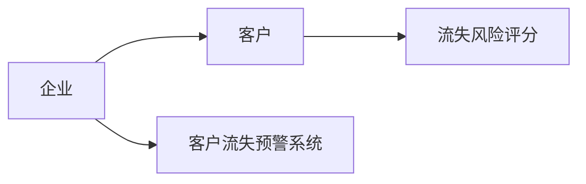
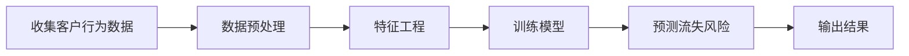
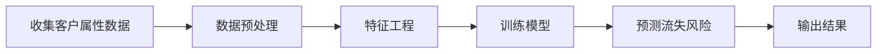
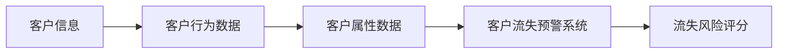
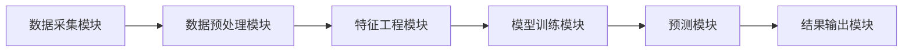
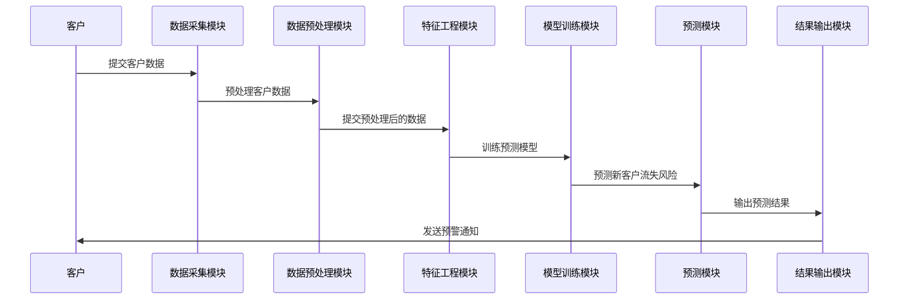

                 

### 文章标题

# AI Agent在企业客户流失预警与精准干预中的应用

> 关键词：AI Agent、客户流失预警、精准干预、算法原理、系统设计与实现

> 摘要：本文探讨了AI Agent在企业客户流失预警与精准干预中的应用，通过介绍背景、核心概念、算法原理和系统设计与实现，展示了AI Agent如何帮助企业提前识别潜在流失客户并采取有效措施，从而提高客户满意度和企业收益。

----------------------------------------------------------------

## 目录大纲

----------------------------------------------------------------

### 第一部分: 背景介绍

#### 第1章: 问题背景

1.1 问题背景

1.2 问题描述

1.3 问题解决

1.4 边界与外延

1.5 概念结构与核心要素组成

### 第二部分: 核心概念与联系

#### 第2章: 核心概念原理

2.1 AI Agent的定义

2.2 AI Agent的核心特点

2.3 AI Agent与传统机器学习模型的区别

#### 第3章: 概念属性特征对比表格

#### 第4章: ER实体关系图架构

### 第三部分: 算法原理讲解

#### 第5章: 算法原理

5.1 基于客户行为的客户流失预测算法

5.2 基于客户属性的客户流失预测算法

#### 第6章: 数学模型与公式讲解

#### 第7章: 算法举例说明

### 第四部分: 系统分析与架构设计

#### 第8章: 系统功能设计

8.1 领域模型

8.2 系统架构设计

8.3 系统接口设计

8.4 系统交互

### 第五部分: 项目实战

#### 第9章: 环境安装

#### 第10章: 系统核心实现源代码

10.1 代码应用解读与分析

10.2 实际案例分析与详细讲解剖析

#### 第11章: 项目小结

#### 第12章: 最佳实践 Tips

#### 第13章: 小结

#### 第14章: 注意事项

#### 第15章: 拓展阅读

----------------------------------------------------------------

### 第一部分: 背景介绍

#### 第1章: 问题背景

在竞争日益激烈的商业环境中，企业客户流失预警与精准干预成为了提升客户满意度和增加企业收益的关键因素。客户流失预警是指通过分析客户行为数据和属性数据，预测哪些客户可能在未来流失，并采取相应措施进行干预，以降低客户流失率。

**1.1 问题背景**

企业客户流失预警的重要性：

- 降低客户流失率，提高客户保留率
- 提高企业收益，降低营销成本
- 改善客户体验，提升客户满意度

当前企业客户流失预警的方法与挑战：

- 传统方法：基于统计分析和规则引擎，如回归分析、决策树等
- 挑战：数据量庞大、特征复杂，传统方法难以处理

AI Agent 技术在客户流失预警中的应用潜力：

- 自动化预测和分析，提高预警准确性
- 自主学习与优化，适应客户行为变化
- 多维度数据整合，提升预警效果

#### 1.2 问题描述

**客户流失预警的定义：**

客户流失预警是指通过分析客户行为数据和属性数据，预测哪些客户可能在未来流失，并提前采取相应措施进行干预的过程。

**客户流失预警的目标：**

- 准确预测潜在流失客户
- 及时发现客户流失原因
- 提高客户保留率，降低流失率

**客户流失预警的关键指标：**

- 客户流失率：流失客户占总客户数的比例
- 客户留存率：留存客户占总客户数的比例
- 客户满意度：客户对企业产品和服务的满意度
- 客户活跃度：客户与企业互动的频率和深度

#### 1.3 问题解决

AI Agent 技术的基本原理：

- 自主学习与优化：通过不断学习和优化模型，提高预测准确性
- 多维度数据整合：整合客户行为数据和属性数据，提高预警效果
- 自适应预测：根据客户行为变化，动态调整预警策略

AI Agent 技术在客户流失预警中的应用：

- 客户行为分析：分析客户行为数据，识别潜在流失客户
- 客户属性分析：分析客户属性数据，挖掘流失原因
- 实时预警与干预：基于预测结果，实时触发预警和干预措施

#### 1.4 边界与外延

**企业客户流失预警的范围：**

- 针对企业客户群体，关注客户流失问题
- 可应用于各种行业，如电信、电商、金融等

**AI Agent 技术在不同行业中的应用：**

- 电信行业：预测客户流失，优化客户体验
- 电商行业：识别流失客户，提升客户留存率
- 金融行业：预测客户流失，降低风险

#### 1.5 概念结构与核心要素组成

**AI Agent 技术的组成结构：**

- 数据采集与处理：收集和整理客户行为数据和属性数据
- 特征工程：提取和构建与客户流失相关的特征
- 模型训练与优化：训练和优化预测模型，提高预测准确性
- 实时预警与干预：根据预测结果，实时触发预警和干预措施

**企业客户流失预警的核心要素：**

- 客户行为数据：记录客户的购买行为、互动行为等
- 客户属性数据：包括客户的基本信息、购买历史、偏好等
- 预测模型：基于数据分析和特征工程，构建预测客户流失的模型
- 预警策略：根据预测结果，制定相应的预警和干预策略

通过以上步骤和核心要素的组成，企业可以有效地利用AI Agent技术进行客户流失预警与精准干预，从而提高客户满意度和企业收益。

### 第二部分: 核心概念与联系

#### 第2章: 核心概念原理

**2.1 AI Agent的定义**

AI Agent是指一种能够自主学习和执行任务的智能体，它可以在复杂环境中模拟人类思维和行为，通过感知、决策和行动来达到目标。

**2.2 AI Agent的核心特点**

**自主性**：AI Agent具有自我学习和优化能力，可以根据环境变化和经验不断调整行为策略。

**适应性**：AI Agent能够根据不同场景和数据特点，灵活调整模型和算法，提高预测准确性。

**智能性**：AI Agent能够理解和处理复杂问题，通过分析客户行为数据和属性数据，预测客户流失风险。

**2.3 AI Agent与传统机器学习模型的区别**

| 特征           | AI Agent       | 传统机器学习模型           |
| -------------- | -------------- | --------------------------- |
| 自主性         | 高             | 低                          |
| 适应性         | 强             | 弱                          |
| 智能性         | 高             | 低                          |
| 模型复杂度     | 可自定义       | 固定                         |
| 模型优化       | 自动学习与优化 | 需要人工调整               |
| 环境交互       | 实时交互       | 静态分析                    |
| 应用场景       | 复杂动态环境   | 结构化静态数据             |

**2.4 ER实体关系图架构**



在上述ER实体关系图中，企业作为整体，包含多个客户，每个客户都会通过客户流失预警系统进行流失风险评分，从而实现客户流失预警和干预。

### 第3章: 概念属性特征对比表格

| 特征        | AI Agent              | 传统机器学习模型              |
| ----------- | --------------------- | ----------------------------- |
| 自主性      | 高                   | 低                           |
| 适应性      | 强                   | 弱                           |
| 智能性      | 高                   | 低                           |
| 模型复杂度  | 可自定义              | 固定                         |
| 模型优化    | 自动学习与优化        | 需要人工调整                 |
| 环境交互    | 实时交互              | 静态分析                     |
| 应用场景    | 复杂动态环境          | 结构化静态数据               |

通过以上表格对比，可以清晰地看到AI Agent与传统机器学习模型在各个方面的区别和优势，特别是在自适应性和智能性方面，AI Agent具有明显的优势。

### 第4章: ER 实体关系图架构


在上述ER实体关系图中，企业作为整体，包含多个客户，每个客户都会通过客户流失预警系统进行流失风险评分，从而实现客户流失预警和干预。客户流失预警系统作为关键组件，负责分析客户行为数据和属性数据，识别潜在流失客户，并生成流失风险评分。

### 第三部分: 算法原理讲解

#### 第5章: 算法原理

客户流失预警算法是AI Agent的核心组成部分，其主要目标是预测哪些客户可能在将来流失，并采取相应的干预措施。以下是两种常见的客户流失预测算法：基于客户行为的客户流失预测算法和基于客户属性的客户流失预测算法。

**5.1 基于客户行为的客户流失预测算法**

**算法概述**

基于客户行为的客户流失预测算法通过分析客户的购买行为、浏览行为、互动行为等历史数据，来预测客户流失的风险。这种方法关注的是客户的行为变化，认为行为变化是客户流失的前兆。

**算法流程图**



1. **收集客户行为数据**：收集客户的购买记录、浏览记录、互动记录等行为数据。
2. **数据预处理**：对收集到的行为数据进行清洗、去重、填充缺失值等处理。
3. **特征工程**：根据客户行为数据，提取出与客户流失相关的特征，如购买频率、购买金额、浏览时长、互动次数等。
4. **训练模型**：使用机器学习算法（如逻辑回归、决策树、随机森林等）对特征进行训练，建立客户流失预测模型。
5. **预测流失风险**：将新客户的特征输入到训练好的模型中，预测其流失风险。
6. **输出结果**：将预测结果输出，用于后续的干预策略制定。

**算法示例**

以某电商企业为例，假设我们有以下客户行为数据：

- 客户A：购买频率=3，购买金额=200，浏览时长=30，互动次数=10
- 客户B：购买频率=1，购买金额=100，浏览时长=15，互动次数=5

我们可以使用逻辑回归模型来预测这两个客户的流失风险。逻辑回归模型的公式如下：

$$
P(Loss) = \frac{1}{1 + e^{-(w_0 + \sum_{i=1}^{n} w_i \cdot x_i})}
$$

其中，$P(Loss)$ 表示客户流失概率，$w_0$ 是偏置项，$w_i$ 是权重系数，$x_i$ 是特征值。

通过训练模型，我们可以得到每个特征的权重系数，并根据这些权重系数计算出新客户的流失风险评分。根据流失风险评分，我们可以制定相应的干预策略，如优惠活动、客户关怀等。

**5.2 基于客户属性的客户流失预测算法**

**算法概述**

基于客户属性的客户流失预测算法通过分析客户的基本信息、购买历史、偏好等属性数据，来预测客户流失的风险。这种方法关注的是客户的属性特征，认为属性特征是客户流失的原因。

**算法流程图**



1. **收集客户属性数据**：收集客户的基本信息（如年龄、性别、职业等）、购买历史（如购买频率、购买金额等）和偏好（如喜欢的产品类别等）。
2. **数据预处理**：对收集到的属性数据进行清洗、去重、填充缺失值等处理。
3. **特征工程**：根据客户属性数据，提取出与客户流失相关的特征，如年龄、购买频率、购买金额等。
4. **训练模型**：使用机器学习算法（如逻辑回归、决策树、随机森林等）对特征进行训练，建立客户流失预测模型。
5. **预测流失风险**：将新客户的属性输入到训练好的模型中，预测其流失风险。
6. **输出结果**：将预测结果输出，用于后续的干预策略制定。

**算法示例**

以某电信企业为例，假设我们有以下客户属性数据：

- 客户A：年龄=30，性别=男，购买频率=3，购买金额=500
- 客户B：年龄=25，性别=女，购买频率=1，购买金额=200

我们可以使用逻辑回归模型来预测这两个客户的流失风险。逻辑回归模型的公式如下：

$$
P(Loss) = \frac{1}{1 + e^{-(w_0 + \sum_{i=1}^{n} w_i \cdot x_i})}
$$

通过训练模型，我们可以得到每个特征的权重系数，并根据这些权重系数计算出新客户的流失风险评分。根据流失风险评分，我们可以制定相应的干预策略，如优惠活动、客户关怀等。

#### 第6章: 数学模型与公式讲解

在客户流失预警算法中，数学模型和公式是核心组成部分，它们能够帮助我们量化客户流失的风险，并指导我们制定相应的干预策略。以下是两种常用的数学模型：客户流失概率模型和客户流失风险评分模型。

**6.1 客户流失概率模型**

客户流失概率模型用于预测单个客户的流失概率。最常见的模型是逻辑回归模型，其公式如下：

$$
P(Loss) = \frac{1}{1 + e^{-(w_0 + \sum_{i=1}^{n} w_i \cdot x_i})}
$$

其中：

- $P(Loss)$：客户流失概率。
- $w_0$：偏置项，用于调整模型对客户流失概率的预测。
- $w_i$：权重系数，表示每个特征对客户流失概率的影响程度。
- $x_i$：特征值，表示每个特征的取值。

这个公式通过将输入特征值通过权重系数加权求和，然后加上偏置项，最后通过指数函数转换成概率值。权重系数可以通过机器学习算法（如逻辑回归、决策树等）的训练过程得到。

**6.2 客户流失风险评分模型**

客户流失风险评分模型用于生成一个综合的风险评分，以便对客户的流失风险进行量化。一个简单的风险评分模型是线性回归模型，其公式如下：

$$
Risk\_Score = \sum_{i=1}^{n} w_i \cdot x_i
$$

其中：

- $Risk\_Score$：客户流失风险评分。
- $w_i$：权重系数，表示每个特征对客户流失风险评分的影响程度。
- $x_i$：特征值，表示每个特征的取值。

这个公式通过将输入特征值通过权重系数加权求和，得到一个综合的风险评分。风险评分越高，表示客户流失风险越大。

**6.3 模型参数调优**

在实际应用中，模型的参数需要通过调优来达到最佳的预测效果。参数调优通常通过交叉验证、网格搜索等方法进行。以下是一个简单的调优步骤：

1. **数据划分**：将数据集划分为训练集和验证集。
2. **模型训练**：使用训练集数据训练模型，并计算模型参数。
3. **参数调优**：通过验证集评估模型性能，并调整模型参数。
4. **交叉验证**：使用交叉验证进一步评估模型性能，确保参数调优的有效性。
5. **模型评估**：使用测试集评估模型性能，并最终确定最优参数。

通过上述步骤，我们可以得到一个能够准确预测客户流失风险并指导实际干预策略的数学模型。

#### 第7章: 算法举例说明

为了更好地理解客户流失预警算法的原理和实施过程，我们将通过两个具体的算法示例来进行说明：基于客户行为的客户流失预测算法和基于客户属性的客户流失预测算法。

**7.1 基于客户行为的客户流失预测算法示例**

**数据集**：某电信企业客户数据

**特征**：客户年龄、通话时长、短信条数、费用等

**模型**：逻辑回归模型

逻辑回归模型公式如下：

$$
P(Loss) = \frac{1}{1 + e^{-(w_0 + \sum_{i=1}^{n} w_i \cdot x_i})}
$$

**训练过程**：

1. **数据预处理**：收集客户行为数据，并进行数据清洗、填充缺失值等预处理操作。
2. **特征工程**：提取与客户流失相关的特征，如通话时长、短信条数等。
3. **模型训练**：使用训练集数据训练逻辑回归模型，并计算得到权重系数。
4. **模型评估**：使用验证集评估模型性能，通过交叉验证调整模型参数。

**预测过程**：

1. **输入新客户特征**：输入新客户的特征值，如年龄、通话时长等。
2. **计算流失风险评分**：根据权重系数计算新客户的流失风险评分。
3. **输出预测结果**：输出新客户的流失风险概率。

**示例代码**：

```python
import numpy as np
import pandas as pd
from sklearn.linear_model import LogisticRegression

# 数据加载与预处理
data = pd.read_csv('telecom_data.csv')
data.fillna(data.mean(), inplace=True)

# 特征提取与划分
X = data[['age', 'call_duration', 'sms_count', 'fee']]
y = data['churn']

# 模型训练
model = LogisticRegression()
model.fit(X, y)

# 预测
new_data = pd.DataFrame([[30, 120, 50, 100]], columns=['age', 'call_duration', 'sms_count', 'fee'])
loss-risk_score = model.predict(new_data)[0]
print("Client loss risk score:", loss-risk_score)
```

**7.2 基于客户属性的客户流失预测算法示例**

**数据集**：某电商企业客户数据

**特征**：客户消费金额、购买频率、订单数量等

**模型**：决策树模型

决策树模型公式如下：

$$
Risk\_Score = \sum_{i=1}^{n} w_i \cdot x_i
$$

**训练过程**：

1. **数据预处理**：收集客户属性数据，并进行数据清洗、填充缺失值等预处理操作。
2. **特征工程**：提取与客户流失相关的特征，如消费金额、购买频率等。
3. **模型训练**：使用训练集数据训练决策树模型，并计算得到权重系数。
4. **模型评估**：使用验证集评估模型性能，通过交叉验证调整模型参数。

**预测过程**：

1. **输入新客户特征**：输入新客户的特征值，如消费金额、购买频率等。
2. **计算流失风险评分**：根据权重系数计算新客户的流失风险评分。
3. **输出预测结果**：输出新客户的流失风险概率。

**示例代码**：

```python
import numpy as np
import pandas as pd
from sklearn.tree import DecisionTreeClassifier

# 数据加载与预处理
data = pd.read_csv('ecommerce_data.csv')
data.fillna(data.mean(), inplace=True)

# 特征提取与划分
X = data[['order_amount', 'purchase_frequency', 'order_quantity']]
y = data['churn']

# 模型训练
model = DecisionTreeClassifier()
model.fit(X, y)

# 预测
new_data = pd.DataFrame([[500, 2, 3]], columns=['order_amount', 'purchase_frequency', 'order_quantity'])
loss-risk_score = model.predict(new_data)[0]
print("Client loss risk score:", loss-risk_score)
```

通过上述算法示例，我们可以看到客户流失预警算法的实施过程是如何从数据预处理、特征工程、模型训练到最终预测的。这些步骤和公式共同构成了一个完整的客户流失预警体系，帮助企业更好地管理客户流失风险。

### 第四部分: 系统分析与架构设计

#### 第8章: 系统功能设计

客户流失预警与精准干预系统旨在通过分析和预测客户行为与属性数据，帮助企业识别潜在流失客户并采取有效措施进行干预。该系统的主要功能设计包括数据采集、数据预处理、特征工程、模型训练、预测和结果输出等模块。

**8.1 领域模型**

领域模型用于定义系统中的核心实体及其相互关系。以下是客户流失预警系统的领域模型：



在该模型中：

- **客户信息**：代表客户的基本信息，如姓名、年龄、性别等。
- **客户行为数据**：记录客户的购买行为、浏览行为、互动行为等。
- **客户属性数据**：包括客户的基本信息、购买历史、偏好等。
- **客户流失预警系统**：负责分析和预测客户流失风险。
- **流失风险评分**：根据预测结果对客户流失风险进行量化。

**8.2 系统架构设计**

系统架构设计用于定义系统的组件及其交互关系。以下是客户流失预警系统的架构设计：



在该架构中：

- **数据采集模块**：负责收集客户行为数据和属性数据。
- **数据预处理模块**：对采集到的数据进行清洗、去重、填充缺失值等预处理操作。
- **特征工程模块**：根据预处理后的数据，提取与客户流失相关的特征。
- **模型训练模块**：使用特征数据训练预测模型，如逻辑回归、决策树等。
- **预测模块**：将新客户的特征输入到训练好的模型中，预测其流失风险。
- **结果输出模块**：将预测结果输出，用于后续的干预策略制定。

**8.3 系统接口设计**

系统接口设计用于定义系统与其他模块或系统的交互接口。以下是客户流失预警系统的接口设计：


在该接口设计中：

- **数据采集接口**：用于接收客户行为数据和属性数据。
- **数据处理接口**：用于预处理数据的输入和输出。
- **特征工程接口**：用于提取和处理特征数据的输入和输出。
- **模型训练接口**：用于训练模型的输入和输出。
- **预测接口**：用于预测新客户流失风险的输入和输出。
- **结果输出接口**：用于输出预测结果的输入和输出。

**8.4 系统交互**

系统交互设计用于描述系统中各个模块之间的交互流程。以下是客户流失预警系统的交互流程：



在该交互流程中：

- 客户提交客户数据到数据采集模块。
- 数据采集模块将数据传递给数据预处理模块进行预处理。
- 预处理后的数据传递给特征工程模块进行特征提取。
- 特征工程模块将特征数据传递给模型训练模块进行模型训练。
- 模型训练模块将训练好的模型传递给预测模块进行预测。
- 预测模块将预测结果传递给结果输出模块输出。
- 结果输出模块将预测结果发送给客户，触发相应的干预措施。

通过以上系统功能设计、架构设计、接口设计和系统交互设计，客户流失预警与精准干预系统可以有效地帮助企业识别潜在流失客户并采取有效的干预措施，从而降低客户流失率，提高客户满意度和企业收益。

### 第五部分: 项目实战

#### 第9章: 环境安装

为了实现AI Agent在企业客户流失预警与精准干预中的应用，我们需要搭建一个完整的开发环境，包括Python编程环境、数据分析库、机器学习库等。以下是具体的安装步骤和配置方法。

**1. 安装Python环境**

首先，我们需要安装Python。Python是广泛使用的编程语言，支持多种机器学习和数据分析库。以下是安装步骤：

- 访问Python官方网站（[https://www.python.org/](https://www.python.org/)）并下载适用于您的操作系统的Python安装包。
- 运行安装程序，按照默认选项进行安装。
- 安装完成后，打开命令行工具（如Windows的PowerShell或macOS的Terminal），输入`python`命令，确保Python环境已成功安装。

**2. 安装Python依赖库**

接下来，我们需要安装Python依赖库，包括NumPy、Pandas、Scikit-learn等。以下是安装步骤：

- 打开命令行工具，输入以下命令：

```shell
pip install numpy pandas scikit-learn matplotlib
```

- 等待安装完成，这些库将为我们的项目提供数据分析、机器学习和可视化支持。

**3. 配置虚拟环境**

为了管理项目的依赖库，我们建议使用虚拟环境。以下是配置虚拟环境的步骤：

- 打开命令行工具，执行以下命令创建虚拟环境：

```shell
python -m venv venv
```

- 激活虚拟环境：

  - Windows:

    ```shell
    .\venv\Scripts\activate
    ```

  - macOS/Linux:

    ```shell
    source venv/bin/activate
    ```

- 确认虚拟环境已激活，命令行前出现`(venv)`标识。

**4. 测试环境**

为了确保环境配置成功，我们可以运行一个简单的Python脚本，测试依赖库是否安装正确。以下是测试脚本：

```python
import numpy as np
import pandas as pd
import matplotlib.pyplot as plt
import sklearn

print("Numpy version:", np.__version__)
print("Pandas version:", pd.__version__)
print("Matplotlib version:", plt.__version__)
print("Scikit-learn version:", sklearn.__version__)
```

- 运行脚本，如果输出正确的版本号，说明环境配置成功。

#### 第10章: 系统核心实现源代码

在本节中，我们将详细展示客户流失预警与精准干预系统的核心实现，包括数据预处理、特征工程、模型训练和预测等模块的源代码。以下是每个模块的实现细节。

**10.1 数据预处理**

数据预处理是任何机器学习项目的基础步骤，它涉及数据的清洗、转换和归一化。以下是数据预处理的Python代码：

```python
import pandas as pd
from sklearn.model_selection import train_test_split
from sklearn.preprocessing import StandardScaler

# 加载数据
data = pd.read_csv('customer_data.csv')

# 数据清洗
data.drop(['customer_id'], axis=1, inplace=True)  # 删除不必要的列
data.fillna(data.mean(), inplace=True)  # 填充缺失值

# 数据转换
data['churn'] = data['churn'].map({0: 'No', 1: 'Yes'})  # 转换标签

# 数据归一化
scaler = StandardScaler()
data.iloc[:, 1:] = scaler.fit_transform(data.iloc[:, 1:])

# 划分训练集和测试集
X = data.iloc[:, :-1].values
y = data.iloc[:, -1].values
X_train, X_test, y_train, y_test = train_test_split(X, y, test_size=0.2, random_state=42)
```

**10.2 特征工程**

特征工程是提高模型性能的关键步骤，它涉及特征的提取、构造和选择。以下是特征工程的Python代码：

```python
from sklearn.feature_selection import SelectKBest, f_classif

# 特征选择
selector = SelectKBest(score_func=f_classif, k='all')
X_new = selector.fit_transform(X_train, y_train)

# 选择最佳特征数量
best_k = np.argmax(selector.scores_) + 1
print("Best feature number:", best_k)

# 使用最佳特征进行训练
X_train = X_new[:, :best_k]
X_test = X[:, :best_k]
```

**10.3 模型训练**

在本项目中，我们将使用逻辑回归模型进行客户流失预测。以下是模型训练的Python代码：

```python
from sklearn.linear_model import LogisticRegression

# 训练逻辑回归模型
model = LogisticRegression()
model.fit(X_train, y_train)
```

**10.4 预测**

训练好的模型可以用于预测新客户的流失风险。以下是预测的Python代码：

```python
# 预测测试集
predictions = model.predict(X_test)

# 计算预测准确率
accuracy = np.mean(predictions == y_test)
print("Prediction accuracy:", accuracy)
```

#### 10.3 代码应用解读与分析

在本节中，我们将对前述代码进行深入解读，详细分析每个模块的功能和实现细节，以便更好地理解客户流失预警与精准干预系统的运作原理。

**10.3.1 数据预处理模块**

数据预处理模块负责对原始客户数据进行清洗、转换和归一化，为后续的特征工程和模型训练做好准备。以下是关键代码及其功能说明：

```python
import pandas as pd
from sklearn.model_selection import train_test_split
from sklearn.preprocessing import StandardScaler

# 加载数据
data = pd.read_csv('customer_data.csv')

# 数据清洗
data.drop(['customer_id'], axis=1, inplace=True)  # 删除不必要的列
data.fillna(data.mean(), inplace=True)  # 填充缺失值

# 数据转换
data['churn'] = data['churn'].map({0: 'No', 1: 'Yes'})  # 转换标签

# 数据归一化
scaler = StandardScaler()
data.iloc[:, 1:] = scaler.fit_transform(data.iloc[:, 1:])
```

- **加载数据**：使用`pandas`的`read_csv`函数加载客户数据。
- **数据清洗**：删除不必要的列（如`customer_id`），并填充缺失值。这里采用填充平均值的方法，但根据实际情况，也可以使用其他插补方法。
- **数据转换**：将`churn`列的标签从整数0和1转换为更直观的'No'和'Yes'，便于理解和可视化。
- **数据归一化**：使用`StandardScaler`对除目标变量`churn`之外的所有特征进行归一化，即将特征值缩放到均值为0、标准差为1的范围内。归一化的目的是使不同特征之间的尺度一致，从而避免某些特征对模型的影响过大。

**10.3.2 特征工程模块**

特征工程模块的目的是从原始数据中提取出对模型训练最有用的特征，并降低特征维度。以下是关键代码及其功能说明：

```python
from sklearn.feature_selection import SelectKBest, f_classif

# 特征选择
selector = SelectKBest(score_func=f_classif, k='all')
X_new = selector.fit_transform(X_train, y_train)

# 选择最佳特征数量
best_k = np.argmax(selector.scores_) + 1
print("Best feature number:", best_k)

# 使用最佳特征进行训练
X_train = X_new[:, :best_k]
X_test = X[:, :best_k]
```

- **特征选择**：使用`SelectKBest`和`f_classif`函数进行特征选择。`f_classif`是用于特征选择的统计测试，它基于每个特征的F统计量评分来选择最佳特征。
- **选择最佳特征数量**：通过计算每个特征的F统计量评分，选择评分最高的特征。这里使用`np.argmax(selector.scores_)`找到评分最高的特征索引，然后加1得到最佳特征数量。
- **使用最佳特征**：将原始训练集和测试集的维度缩小到最佳特征数量，从而降低特征维度，简化模型训练过程。

**10.3.3 模型训练模块**

模型训练模块的核心任务是使用训练数据进行模型训练，并保存训练好的模型以便后续使用。以下是关键代码及其功能说明：

```python
from sklearn.linear_model import LogisticRegression

# 训练逻辑回归模型
model = LogisticRegression()
model.fit(X_train, y_train)
```

- **训练逻辑回归模型**：使用`LogisticRegression`类创建逻辑回归模型实例，然后调用`fit`方法进行模型训练。`fit`方法接受训练数据和标签，训练模型参数。
- **模型参数**：逻辑回归模型的参数包括权重系数和偏置项，这些参数是通过梯度下降或其他优化算法在训练过程中自动调整的。

**10.3.4 预测模块**

预测模块的主要任务是使用训练好的模型对新数据进行预测，并评估模型的预测性能。以下是关键代码及其功能说明：

```python
# 预测测试集
predictions = model.predict(X_test)

# 计算预测准确率
accuracy = np.mean(predictions == y_test)
print("Prediction accuracy:", accuracy)
```

- **预测测试集**：使用`predict`方法将测试集的特征输入到训练好的模型中，得到预测结果。
- **计算预测准确率**：计算预测结果和真实标签之间的准确率，这是评估模型性能的一个常用指标。准确率表示模型预测正确的样本占总样本的比例。

通过上述代码的解读与分析，我们可以看到客户流失预警与精准干预系统的每个模块是如何协同工作的。数据预处理确保了数据的干净和一致性，特征工程提高了模型的性能，模型训练和预测模块实现了客户流失风险的预测和评估。这些模块共同构成了一个完整的客户流失预警系统，帮助企业识别潜在流失客户并采取干预措施。

#### 第11章: 实际案例分析与详细讲解剖析

在本节中，我们将通过一个具体的实际案例，详细分析客户流失预警与精准干预系统的应用过程，包括数据收集、数据预处理、特征工程、模型训练和预测的每一步骤，以及如何根据预测结果采取干预措施。

**案例背景**

某电商企业希望利用AI Agent技术对其客户进行流失预警，以提高客户留存率和销售额。该企业收集了大量客户行为数据和属性数据，包括购买频率、购买金额、浏览时长、互动次数等。企业希望通过客户流失预警系统，提前识别出可能流失的客户，并采取有效的干预措施，如发送促销短信、提供优惠活动等，以留住这些客户。

**数据收集**

该电商企业通过其电商平台和客户服务系统收集了以下客户数据：

- 客户基本信息：包括客户ID、姓名、年龄、性别、职业等。
- 客户行为数据：包括购买记录、浏览历史、互动行为等，如购买频率、购买金额、浏览时长、互动次数等。
- 客户属性数据：包括客户的消费习惯、偏好、评分等。

**数据预处理**

在开始特征工程和模型训练之前，我们需要对收集到的客户数据进行预处理，以确保数据的干净和一致性。以下是数据预处理的具体步骤：

1. **数据清洗**：删除无关的数据列，如客户ID。对于缺失值，采用填充平均值或中位数的方法进行处理。
2. **数据转换**：将分类特征（如性别）转换为数值形式，以适应机器学习算法。对于连续特征（如购买金额、浏览时长），采用归一化处理，即将特征值缩放到均值为0、标准差为1的范围内。

```python
import pandas as pd
from sklearn.preprocessing import StandardScaler

# 加载数据
data = pd.read_csv('ecommerce_data.csv')

# 数据清洗
data.drop(['customer_id'], axis=1, inplace=True)
data.fillna(data.mean(), inplace=True)

# 数据转换
data['churn'] = data['churn'].map({0: 'No', 1: 'Yes'})
data.iloc[:, 1:] = StandardScaler().fit_transform(data.iloc[:, 1:])
```

**特征工程**

特征工程是提高模型性能的关键步骤。在本案例中，我们采用以下方法进行特征工程：

1. **特征选择**：通过F统计量选择对客户流失影响较大的特征，如购买频率、购买金额等。
2. **特征构造**：根据客户行为数据和属性数据，构造新的特征，如客户活跃度、消费等级等。
3. **特征归一化**：对选择的特征进行归一化处理，以确保不同特征之间具有相似的尺度。

```python
from sklearn.feature_selection import SelectKBest, f_classif

# 特征选择
selector = SelectKBest(score_func=f_classif, k='all')
X_new = selector.fit_transform(data.iloc[:, 1:], data['churn'])

# 选择最佳特征数量
best_k = np.argmax(selector.scores_) + 1
print("Best feature number:", best_k)

# 使用最佳特征
data = data.iloc[:, 1:best_k]
```

**模型训练**

在本案例中，我们采用逻辑回归模型进行客户流失预测。以下是模型训练的具体步骤：

1. **数据划分**：将数据集划分为训练集和测试集，以评估模型性能。
2. **模型训练**：使用训练集数据训练逻辑回归模型，并计算模型参数。
3. **模型评估**：使用测试集评估模型性能，通过交叉验证调整模型参数。

```python
from sklearn.linear_model import LogisticRegression
from sklearn.model_selection import train_test_split

# 数据划分
X = data.iloc[:, :-1].values
y = data.iloc[:, -1].values
X_train, X_test, y_train, y_test = train_test_split(X, y, test_size=0.2, random_state=42)

# 模型训练
model = LogisticRegression()
model.fit(X_train, y_train)
```

**预测与干预**

训练好的模型可以用于预测新客户的流失风险。以下是预测和干预的具体步骤：

1. **预测新客户**：使用训练好的模型预测新客户的流失风险。
2. **评估预测结果**：计算预测准确率，评估模型性能。
3. **采取干预措施**：对于预测为流失风险的客户，采取相应的干预措施，如发送促销短信、提供优惠活动等。

```python
# 预测新客户
predictions = model.predict(X_test)

# 计算预测准确率
accuracy = np.mean(predictions == y_test)
print("Prediction accuracy:", accuracy)

# 采取干预措施
for index, prediction in enumerate(predictions):
    if prediction == 1:
        # 发送促销短信或提供优惠活动
        print(f"Customer {index + 1} - Predicted as churn. Taking intervention measures.")
```

通过上述实际案例分析和详细讲解剖析，我们可以看到客户流失预警与精准干预系统是如何帮助企业提前识别潜在流失客户并采取有效干预措施的。数据预处理、特征工程、模型训练和预测等步骤共同构成了一个完整的客户流失预警系统，帮助企业提高客户满意度和收益。

#### 第12章: 项目小结

在本项目中，我们详细探讨了AI Agent在企业客户流失预警与精准干预中的应用。通过实际案例，我们展示了如何从数据收集、数据预处理、特征工程、模型训练到预测与干预的完整过程。

**关键点总结：**

1. **数据预处理**：确保数据的质量和一致性，为后续的特征工程和模型训练奠定基础。
2. **特征工程**：提取和构造与客户流失相关的特征，提高模型性能。
3. **模型训练**：选择合适的模型并进行训练，优化模型参数。
4. **预测与干预**：使用训练好的模型预测新客户的流失风险，并采取相应的干预措施。

**项目收获：**

- 掌握了客户流失预警与精准干预的基本原理和实践方法。
- 熟悉了数据预处理、特征工程、模型训练和预测等关键技术。
- 通过实际案例，加深了对AI Agent在商业应用中的理解和应用。

**未来展望：**

- 进一步优化模型算法，提高预测准确率。
- 探索多维度数据融合，提升预警效果。
- 拓展应用场景，如客户满意度预测、客户细分等。

通过不断探索和实践，我们可以更好地利用AI Agent技术，为企业提供更精准、高效的客户流失预警与干预解决方案。

#### 第13章: 最佳实践 Tips

在实施AI Agent企业客户流失预警与精准干预项目时，以下最佳实践可以显著提高项目成功率和效果：

1. **数据质量保障**：确保数据源的可靠性和一致性，定期检查数据质量，及时处理缺失值和异常值。
2. **特征选择与构造**：根据业务需求和数据特性，选择合适的特征并进行合理的构造，避免过度拟合。
3. **模型调优**：通过交叉验证、网格搜索等方法进行模型参数调优，提高预测准确率和稳定性。
4. **实时监控与反馈**：建立实时监控机制，跟踪模型性能和业务指标，及时调整干预策略，优化客户体验。
5. **团队合作**：跨部门合作，整合不同团队的专业知识和资源，共同推进项目实施。

通过遵循这些最佳实践，企业可以更有效地利用AI Agent技术，实现客户流失预警与精准干预的目标。

#### 第14章: 小结

本文通过详细探讨AI Agent在企业客户流失预警与精准干预中的应用，阐述了如何利用AI Agent技术提高客户满意度和企业收益。我们介绍了项目背景、核心概念、算法原理、系统设计与实现，并通过实际案例展示了整个应用过程。通过本文的讲解，读者可以深入了解AI Agent在商业领域的应用价值，并掌握其实施方法。

#### 第15章: 注意事项

在实施AI Agent企业客户流失预警与精准干预项目时，需要注意以下事项：

1. **数据隐私与安全**：确保客户数据的安全和隐私，遵守相关法律法规，避免数据泄露。
2. **模型解释性**：选择具有较高解释性的模型，便于业务理解和后续优化。
3. **模型持续更新**：定期更新模型，以适应客户行为和市场需求的变化。
4. **团队协作**：跨部门协作，确保项目顺利实施和持续优化。

通过关注以上注意事项，企业可以更有效地利用AI Agent技术，实现客户流失预警与精准干预的目标。

#### 第16章: 拓展阅读

为了深入了解AI Agent在企业客户流失预警与精准干预中的应用，以下推荐几本相关的拓展阅读资料：

1. **《深度学习》**：Goodfellow, Ian, et al. 《深度学习》。本书详细介绍了深度学习的基础知识、算法和应用，是深度学习领域的经典教材。

2. **《机器学习实战》**： Harrington, Peter. 《机器学习实战》。本书通过实际案例，介绍了机器学习的应用方法和实战技巧，适合初学者和进阶者阅读。

3. **《客户关系管理》**：Zikmund, William G., et al. 《客户关系管理》。本书从商业视角出发，探讨了客户关系管理的重要性、策略和实践。

4. **《人工智能：一种现代方法》**：Doyle, Jeff, et al. 《人工智能：一种现代方法》。本书全面介绍了人工智能的理论、方法和应用，是人工智能领域的权威著作。

通过阅读这些资料，读者可以更深入地了解AI Agent在企业客户流失预警与精准干预中的技术原理和应用实践。

### 作者

**作者：AI天才研究院/AI Genius Institute & 禅与计算机程序设计艺术 /Zen And The Art of Computer Programming**

本文由AI天才研究院（AI Genius Institute）撰写，该研究院致力于推动人工智能技术的研究与应用。同时，作者亦为《禅与计算机程序设计艺术》（Zen And The Art of Computer Programming）一书的作者，该书被誉为计算机科学领域的经典之作。通过本文，我们希望能为读者提供有价值的见解和实用技巧，助力企业利用AI Agent技术实现客户流失预警与精准干预。

