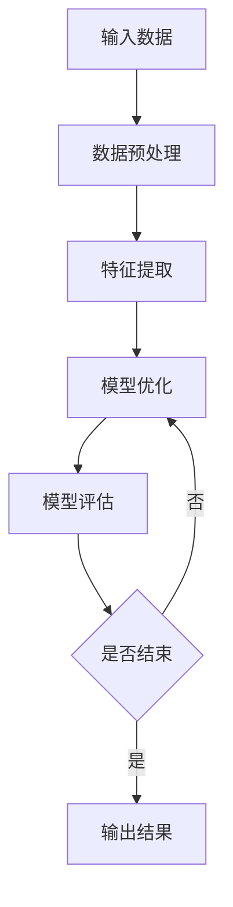
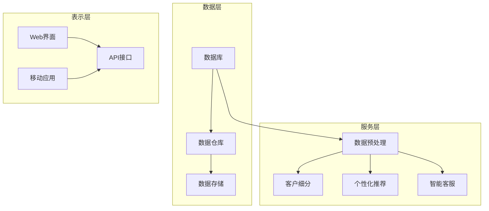
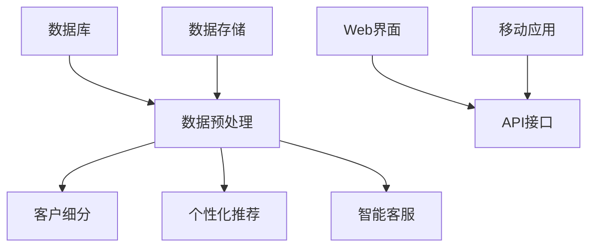
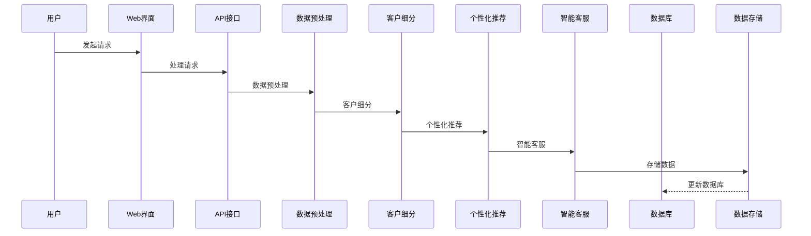

                 

# AI Agent在企业客户生命周期价值最大化中的应用

## 关键词

- AI Agent
- 企业客户生命周期价值（CLV）
- 客户获取
- 客户留存
- 客户价值提升

## 摘要

本文深入探讨了人工智能代理（AI Agent）在企业客户生命周期管理中的应用，旨在揭示AI Agent如何通过优化客户获取、客户留存和客户价值提升，实现企业客户生命周期价值的最大化。文章首先介绍了AI Agent的基本概念和特点，随后详细分析了企业客户生命周期的各个阶段及其关键要素。通过算法原理讲解、系统架构设计、项目实战等环节，本文展示了如何将AI Agent有效应用于实际业务场景，为企业带来显著的价值提升。

## 背景介绍

### 核心概念术语说明

**AI Agent**：AI Agent是一种基于人工智能技术的自动化代理，能够模拟人类行为和决策。它具备自主学习、自适应、实时交互等特点，能够在大量数据中高效处理任务。

**企业客户生命周期价值（CLV）**：企业客户生命周期价值是指客户从首次接触企业到最终停止使用企业产品或服务的过程中，为企业带来的总收益。它包括客户获取、客户留存、客户满意度和客户价值提升等阶段。

**客户获取**：客户获取是指企业通过各种渠道吸引新客户的过程。这通常涉及到市场调研、营销策略、广告投放等。

**客户留存**：客户留存是指企业通过维护客户关系、提高客户满意度，使客户继续使用企业产品或服务的过程。

**客户价值提升**：客户价值提升是指企业通过优化客户体验、提供增值服务，进一步提高客户对企业产品的依赖度和忠诚度。

### 问题背景

在当今商业环境中，企业越来越重视客户生命周期价值（CLV）的优化。随着市场竞争的加剧和消费者需求的多样化，企业必须采取更加智能和高效的策略来获取新客户、留住老客户并提升客户价值。传统的客户管理方法已无法满足现代企业对效率、个性化和创新的需求。

AI Agent作为一种创新的智能解决方案，在提升客户体验、降低运营成本和增加营收方面展现出了巨大的潜力。通过AI Agent，企业可以实现以下目标：

1. **精准客户获取**：AI Agent能够通过大数据分析和机器学习算法，帮助企业精准定位潜在客户，降低营销成本，提高转化率。
2. **个性化客户服务**：AI Agent能够根据客户的行为数据，提供个性化的产品推荐和服务，提高客户满意度，增强客户黏性。
3. **智能客户互动**：AI Agent能够通过自然语言处理和语音识别技术，实现与客户的实时互动，提高客户服务质量，降低人力成本。
4. **客户价值挖掘**：AI Agent能够分析客户的消费行为和偏好，挖掘客户潜在需求，提供定制化的增值服务，提高客户忠诚度和终身价值。

### 问题描述

如何利用AI Agent有效管理企业客户生命周期，实现价值最大化？

### 问题解决

本文将从以下几个方面展开讨论：

1. **AI Agent的基本概念与特点**：介绍AI Agent的定义、类型、工作原理和应用场景，阐述其在提升客户体验、降低成本和增加营收方面的优势。
2. **企业客户生命周期的概念与阶段**：详细分析企业客户生命周期的各个阶段，包括客户获取、客户留存、客户满意度和客户价值提升，探讨每个阶段的关键要素和优化策略。
3. **AI Agent与企业客户生命周期价值的关联**：分析AI Agent在客户获取、客户留存和客户价值提升等阶段的具体应用，通过实际案例展示其应用效果和优势。
4. **算法原理讲解**：介绍用于客户生命周期价值优化的机器学习算法和深度学习算法，包括算法原理、流程图、数学模型和举例说明。
5. **系统分析与架构设计方案**：介绍基于AI Agent的企业客户生命周期管理系统架构，包括系统功能设计、系统架构设计和系统接口设计。
6. **项目实战**：通过一个电子商务公司的实际案例，展示如何利用AI Agent优化客户生命周期管理，提高客户满意度和忠诚度，实现价值最大化。
7. **最佳实践与项目小结**：总结最佳实践经验和项目成果，提出注意事项和未来研究方向。

### 边界与外延

本文聚焦于AI Agent在企业客户生命周期管理中的应用，涉及营销、客户服务、销售和客户关系管理等领域。本文将探讨以下核心问题：

1. **AI Agent在企业客户生命周期管理中的具体应用场景**：如何通过AI Agent实现客户获取、客户留存和客户价值提升？
2. **AI Agent在企业客户生命周期管理中的技术实现**：如何利用机器学习算法和深度学习算法优化客户生命周期价值？
3. **AI Agent在企业客户生命周期管理中的效果评估**：如何评估AI Agent对客户生命周期价值的影响？
4. **AI Agent在企业客户生命周期管理中的潜在风险与挑战**：如何应对AI Agent在应用过程中可能遇到的风险和挑战？

### 概念结构与核心要素组成

#### AI Agent

**定义**：AI Agent是一种基于人工智能技术的自动化代理，能够模拟人类行为和决策。它通过学习和自适应，能够自主地完成特定任务，并在复杂环境中做出决策。

**特点**：

1. **自主学习**：AI Agent能够从数据中学习，不断优化自己的性能和决策能力。
2. **自适应**：AI Agent能够根据环境和数据的变化，调整自己的行为和策略。
3. **实时交互**：AI Agent能够与用户和环境进行实时互动，提供即时的反馈和服务。
4. **高效处理大量数据**：AI Agent能够快速处理和分析大量数据，发现潜在的规律和趋势。

#### 企业客户生命周期

**定义**：企业客户生命周期是指客户从首次接触企业到最终停止使用企业产品或服务的过程。它包括客户获取、客户留存、客户满意度和客户价值提升等阶段。

**阶段**：

1. **客户获取**：企业通过各种渠道吸引新客户的过程。
2. **客户留存**：企业通过维护客户关系、提高客户满意度，使客户继续使用企业产品或服务的过程。
3. **客户满意度**：企业通过提供高质量的产品和服务，满足客户的需求和期望，提高客户满意度。
4. **客户价值提升**：企业通过优化客户体验、提供增值服务，进一步提高客户对企业产品的依赖度和忠诚度。

#### 价值最大化

**定义**：价值最大化是指通过优化客户生命周期管理，实现企业营收和利润的持续增长。它包括以下几个方面：

1. **客户获取**：通过精准定位潜在客户，提高转化率，降低获客成本。
2. **客户留存**：通过个性化服务和高质量客户体验，提高客户满意度和忠诚度。
3. **客户价值提升**：通过挖掘客户需求，提供定制化服务和增值服务，提高客户终身价值。

## 核心概念与联系

### AI Agent的概念与特点

#### 定义

AI Agent，或称人工智能代理，是一种模拟人类行为和决策的计算机程序。它基于人工智能技术，具备自主学习、自适应、实时交互和高效处理大量数据的能力。

#### 特点

1. **自主学习**：AI Agent能够从数据中学习，不断优化自己的性能和决策能力。这种学习可以是监督学习、无监督学习或强化学习。
   
2. **自适应**：AI Agent能够根据环境和数据的变化，调整自己的行为和策略。这意味着AI Agent可以适应不同的业务场景和用户需求。

3. **实时交互**：AI Agent能够与用户和环境进行实时互动，提供即时的反馈和服务。例如，通过自然语言处理和语音识别技术，AI Agent可以与客户进行对话。

4. **高效处理大量数据**：AI Agent能够快速处理和分析大量数据，发现潜在的规律和趋势。这种能力使得AI Agent在处理复杂问题和实时决策方面具有显著优势。

### 企业客户生命周期的概念与阶段

#### 定义

企业客户生命周期是指客户从首次接触企业到最终停止使用企业产品或服务的过程。它涵盖了客户获取、客户留存、客户满意度和客户价值提升等阶段。

#### 阶段

1. **客户获取**：这是客户生命周期的起点，企业通过各种渠道吸引新客户。这一阶段的关键是精准定位潜在客户，提高转化率，降低获客成本。

2. **客户留存**：客户留存是确保客户继续使用企业产品或服务的过程。企业需要通过维护客户关系、提高客户满意度和忠诚度来实现这一目标。

3. **客户满意度**：客户满意度是客户对企业产品和服务质量的评价。企业需要通过提供高质量的产品和服务，满足客户的需求和期望，提高客户满意度。

4. **客户价值提升**：这是企业通过优化客户体验、提供增值服务，进一步提高客户对企业产品的依赖度和忠诚度的过程。通过挖掘客户需求，提供定制化服务和增值服务，可以提高客户终身价值。

### AI Agent与企业客户生命周期价值的关联

#### 关联概述

AI Agent在企业客户生命周期管理中的应用，可以通过以下几个方面实现价值最大化：

1. **客户获取**：AI Agent可以通过大数据分析和机器学习算法，帮助企业精准定位潜在客户，降低营销成本，提高转化率。

2. **客户留存**：AI Agent可以通过个性化服务和智能推荐，提高客户满意度和忠诚度。它可以根据客户的行为数据和偏好，提供个性化的产品推荐和服务。

3. **客户价值提升**：AI Agent可以通过分析客户的消费行为和偏好，挖掘客户潜在需求，提供定制化的增值服务，提高客户忠诚度和终身价值。

#### 实际案例

以一家电子商务公司为例，该公司利用AI Agent进行客户生命周期管理，取得了显著的效果：

1. **客户获取**：公司通过AI Agent分析用户行为和购物偏好，制定精准的营销策略。例如，通过分析用户浏览历史和购买记录，AI Agent可以推荐相关产品，提高转化率。

2. **客户留存**：AI Agent通过智能客服系统，提供24/7的客户服务。客户可以通过文本或语音与AI Agent进行交互，获得实时解答和帮助。这种高效的服务方式提高了客户满意度和忠诚度。

3. **客户价值提升**：AI Agent通过分析客户的购买历史和偏好，提供定制化的营销活动。例如，对于高价值客户，AI Agent可以推荐高端产品或提供专属优惠，增加客户的消费频次和金额。

### 对比表格

| 特点           | 传统方法                       | AI Agent                           |
|----------------|--------------------------------|-----------------------------------|
| 客户获取       | 广告投放、市场调研             | 大数据分析、机器学习、精准定位       |
| 客户留存       | 促销活动、客户服务             | 个性化服务、智能推荐、实时互动       |
| 客户价值提升   | 增值服务、客户关怀             | 挖掘需求、定制化营销、提高忠诚度       |
| 效率和效果     | 低效率、高成本、效果有限       | 高效率、低成本、显著效果           |

### ER实体关系图架构

下面是AI Agent与企业客户生命周期价值相关的ER实体关系图：

```mermaid
erDiagram
  Customer -->|获取| AI_Agent
  Customer -->|留存| AI_Agent
  Customer -->|提升| AI_Agent
  AI_Agent ||--|分析| Data
  AI_Agent ||--|推荐| Product
  AI_Agent ||--|互动| Customer_Support
```

在上图中，`Customer`代表客户，`AI_Agent`代表人工智能代理，`Data`代表数据，`Product`代表产品，`Customer_Support`代表客户支持。通过这种实体关系图，我们可以清晰地看到AI Agent在企业客户生命周期管理中的各个环节及其关联。

## 算法原理讲解

### 算法原理

在AI Agent中，常用的算法包括机器学习算法和深度学习算法。这些算法通过训练模型，使AI Agent能够从数据中学习，并做出准确的预测和决策。

#### 机器学习算法

机器学习算法是一类能够从数据中学习并做出预测或决策的算法。常见的机器学习算法包括：

1. **线性回归（Linear Regression）**：线性回归是一种简单的预测算法，通过拟合一条直线来预测目标变量。其数学模型为：
   $$y = \beta_0 + \beta_1x_1 + ... + \beta_nx_n + \epsilon$$
   其中，$y$是目标变量，$x_1, ..., x_n$是特征变量，$\beta_0, ..., \beta_n$是模型参数，$\epsilon$是误差项。

2. **决策树（Decision Tree）**：决策树是一种基于树形结构的预测算法，通过一系列的判断条件来对数据进行分类或回归。决策树的构建过程可以看作是一个递归划分的过程，每次划分都基于当前节点的特征和标签。

3. **随机森林（Random Forest）**：随机森林是一种基于决策树的集成学习方法，通过构建多棵决策树，并对它们的预测结果进行投票或求平均来提高预测准确性。随机森林通过随机选择特征和样本子集，降低了模型的过拟合风险。

4. **支持向量机（Support Vector Machine，SVM）**：支持向量机是一种基于间隔最大化原则的分类和回归算法。SVM通过找到一个最优的超平面，将数据划分为不同的类别或拟合一个回归模型。其数学模型为：
   $$y(\textbf{x}^T\beta + b) \geq 1$$
   其中，$\textbf{x}$是特征向量，$\beta$是模型参数，$b$是偏置项，$y$是标签。

#### 深度学习算法

深度学习算法是一类基于多层神经网络的预测算法。与传统的机器学习算法相比，深度学习算法能够自动学习复杂的非线性特征表示，并在图像识别、自然语言处理等领域取得了显著的成绩。常见的深度学习算法包括：

1. **神经网络（Neural Network）**：神经网络是一种基于人工神经元相互连接的结构，通过学习输入和输出之间的关系来进行预测。神经网络的核心是激活函数，常用的激活函数包括Sigmoid函数、ReLU函数和Tanh函数。

2. **循环神经网络（Recurrent Neural Network，RNN）**：循环神经网络是一种能够处理序列数据的神经网络，通过在时间步之间保持状态信息来实现对序列数据的建模。RNN的核心是隐藏状态和递归连接。

3. **卷积神经网络（Convolutional Neural Network，CNN）**：卷积神经网络是一种能够处理图像数据的神经网络，通过卷积层和池化层来提取图像的特征。CNN在图像分类、目标检测和图像分割等领域取得了显著的成果。

4. **生成对抗网络（Generative Adversarial Network，GAN）**：生成对抗网络是一种由生成器和判别器组成的对抗性训练框架。生成器试图生成与真实数据相似的数据，判别器则试图区分真实数据和生成数据。GAN在图像生成、语音合成和自然语言生成等领域取得了突破性的成果。

### 算法mermaid流程图

下面是使用mermaid绘制的机器学习算法流程图：



在上述流程图中，首先输入数据经过数据预处理和特征提取，然后进入模型训练阶段。模型训练完成后，对模型进行评估，根据评估结果决定是否结束训练。如果评估结果不理想，则返回模型优化阶段，继续调整模型参数。当评估结果达到预期时，模型训练结束，输出最终结果。

### 算法原理的数学模型和公式

#### 线性回归模型

线性回归模型的数学模型为：
$$y = \beta_0 + \beta_1x_1 + ... + \beta_nx_n + \epsilon$$
其中，$y$是目标变量，$x_1, ..., x_n$是特征变量，$\beta_0, ..., \beta_n$是模型参数，$\epsilon$是误差项。

#### 神经网络激活函数

神经网络激活函数的数学模型为：
$$f(x) = \frac{1}{1 + e^{-x}}$$
其中，$x$是输入值，$f(x)$是输出值。

### 举例说明

#### 决策树算法举例

假设我们使用决策树算法对客户进行细分，通过一系列特征变量来预测客户是否愿意进行二次购买。具体步骤如下：

1. **输入数据**：收集客户的特征变量，如年龄、收入、购买历史等。
2. **特征提取**：对特征变量进行预处理和标准化，使其适合决策树的训练。
3. **模型训练**：使用决策树算法对数据进行训练，生成决策树模型。
4. **模型评估**：使用测试数据对模型进行评估，计算准确率、召回率等指标。
5. **模型应用**：将决策树模型应用于新客户，预测其是否愿意进行二次购买。

下面是具体的Python代码实现：

```python
import numpy as np
from sklearn.datasets import load_iris
from sklearn.tree import DecisionTreeClassifier
from sklearn.model_selection import train_test_split
from sklearn.metrics import accuracy_score

# 加载鸢尾花数据集
iris = load_iris()
X = iris.data
y = iris.target

# 划分训练集和测试集
X_train, X_test, y_train, y_test = train_test_split(X, y, test_size=0.2, random_state=42)

# 创建决策树模型
clf = DecisionTreeClassifier()
clf.fit(X_train, y_train)

# 预测测试集
y_pred = clf.predict(X_test)

# 计算准确率
accuracy = accuracy_score(y_test, y_pred)
print("Accuracy:", accuracy)
```

在上述代码中，我们首先加载鸢尾花数据集，然后将其划分为训练集和测试集。接着，我们创建一个决策树分类器，并使用训练集进行训练。最后，使用测试集对模型进行评估，计算准确率。

#### 循环神经网络（RNN）算法举例

假设我们使用循环神经网络（RNN）对客户行为序列进行预测。具体步骤如下：

1. **数据预处理**：对客户行为序列进行预处理，如序列填充、标准化等。
2. **构建RNN模型**：使用TensorFlow和Keras等深度学习框架构建RNN模型。
3. **模型训练**：使用训练数据对模型进行训练。
4. **模型评估**：使用测试数据对模型进行评估，计算准确率、损失等指标。
5. **模型应用**：使用训练好的模型对新的客户行为序列进行预测。

下面是具体的Python代码实现：

```python
import numpy as np
from tensorflow.keras.models import Sequential
from tensorflow.keras.layers import SimpleRNN, Dense
from tensorflow.keras.optimizers import Adam

# 创建RNN模型
model = Sequential()
model.add(SimpleRNN(units=50, activation='relu', return_sequences=True, input_shape=(timesteps, features)))
model.add(SimpleRNN(units=50, activation='relu'))
model.add(Dense(units=1, activation='sigmoid'))

# 编译模型
model.compile(optimizer=Adam(learning_rate=0.001), loss='binary_crossentropy', metrics=['accuracy'])

# 训练模型
model.fit(X_train, y_train, epochs=100, batch_size=32, validation_data=(X_test, y_test))

# 评估模型
loss, accuracy = model.evaluate(X_test, y_test)
print("Test accuracy:", accuracy)
```

在上述代码中，我们首先创建一个RNN模型，其中包含两个RNN层和一个全连接层。接着，我们使用训练数据对模型进行训练，并使用测试数据对模型进行评估。最后，我们打印出测试数据的准确率。

## 系统分析与架构设计方案

### 问题场景介绍

假设我们是一家电子商务公司，希望通过AI Agent来优化客户生命周期管理，提高客户满意度和忠诚度。具体问题场景如下：

1. **客户获取**：如何通过AI Agent精准定位潜在客户，提高转化率？
2. **客户留存**：如何通过AI Agent提供个性化服务，提高客户满意度和忠诚度？
3. **客户价值提升**：如何通过AI Agent挖掘客户需求，提供定制化服务，提高客户终身价值？

### 项目介绍

本项目的目标是构建一个基于AI Agent的企业客户生命周期管理系统，通过大数据分析和机器学习算法，实现客户获取、客户留存和客户价值提升。系统将包含以下几个核心模块：

1. **数据收集模块**：负责收集客户行为数据、购买记录、用户评价等，为AI Agent提供训练数据。
2. **数据预处理模块**：负责对收集到的数据进行分析和处理，提取有用的特征信息。
3. **AI Agent模块**：负责实现AI Agent的核心功能，包括客户细分、个性化推荐、智能客服等。
4. **系统接口模块**：负责与外部系统进行数据交互，如电商网站、客户关系管理系统等。
5. **系统监控模块**：负责监控系统运行状态，提供实时监控和报警功能。

### 系统功能设计

系统功能设计主要包括以下几个部分：

1. **客户数据收集**：通过网站日志、用户行为分析、客户反馈等渠道收集客户数据。
2. **数据预处理**：对收集到的客户数据进行清洗、去重、标准化等处理，提取有用的特征信息。
3. **客户细分**：使用AI Agent对客户进行细分，根据客户的购买行为、兴趣偏好等特征，将其划分为不同的群体。
4. **个性化推荐**：根据客户的细分结果，为每个客户提供个性化的产品推荐和服务。
5. **智能客服**：使用自然语言处理和语音识别技术，提供24/7的智能客服服务，解答客户疑问。
6. **客户价值分析**：分析客户的购买行为和偏好，挖掘客户潜在需求，提供定制化服务。

### 系统架构设计

系统架构设计采用分层架构，包括数据层、服务层和表示层。具体架构如下：

1. **数据层**：负责数据存储和管理，包括关系数据库、NoSQL数据库和数据仓库等。
2. **服务层**：负责业务逻辑处理，包括数据预处理、客户细分、个性化推荐、智能客服等。
3. **表示层**：负责与用户进行交互，包括Web界面、移动应用和API接口等。

#### mermaid架构图

下面是系统的mermaid架构图：



在上述架构图中，数据层负责数据的存储和管理，服务层负责业务逻辑处理，表示层负责与用户进行交互。

### 系统接口设计

系统接口设计主要包括以下几个方面：

1. **数据接口**：负责数据层的接口设计，包括数据库接口、数据仓库接口和数据存储接口。
2. **业务接口**：负责服务层的接口设计，包括客户细分接口、个性化推荐接口和智能客服接口。
3. **应用接口**：负责表示层的接口设计，包括Web界面接口、移动应用接口和API接口。

#### mermaid接口图

下面是系统的mermaid接口图：



在上述接口图中，数据接口负责与数据层的交互，业务接口负责与服务层的交互，应用接口负责与表示层的交互。

### 系统交互

系统交互主要包括以下几个方面：

1. **数据流**：系统中的数据流从数据层流向服务层，再从服务层流向表示层。数据流主要包括客户数据、业务数据和服务数据。
2. **信息流**：系统中的信息流从表示层流向服务层，再从服务层流向数据层。信息流主要包括用户请求、业务逻辑处理结果和系统状态信息。

#### mermaid交互图

下面是系统的mermaid交互图：



在上述交互图中，用户发起请求，Web界面处理请求，然后通过API接口与数据预处理模块进行交互，最终实现客户细分、个性化推荐和智能客服等功能。

## 项目实战

### 环境安装

为了实现AI Agent在企业客户生命周期管理中的应用，我们需要安装和配置以下软件和工具：

1. **Python环境**：安装Python 3.8及以上版本。
2. **深度学习库**：安装TensorFlow、Keras等深度学习库。
3. **数据预处理库**：安装NumPy、Pandas等数据预处理库。
4. **机器学习库**：安装scikit-learn等机器学习库。
5. **自然语言处理库**：安装NLTK、spaCy等自然语言处理库。
6. **数据库**：安装MySQL或MongoDB等数据库。

具体安装步骤如下：

1. 安装Python环境：

   ```bash
   sudo apt-get install python3.8
   ```

2. 安装深度学习库：

   ```bash
   pip3 install tensorflow==2.6.0 keras==2.6.0
   ```

3. 安装数据预处理库：

   ```bash
   pip3 install numpy==1.21.5 pandas==1.3.2
   ```

4. 安装机器学习库：

   ```bash
   pip3 install scikit-learn==0.24.2
   ```

5. 安装自然语言处理库：

   ```bash
   pip3 install nltk==3.8.1 spacy==3.0.0
   ```

6. 安装数据库：

   ```bash
   sudo apt-get install mysql-server
   sudo mysql -u root -p
   CREATE DATABASE customer_lifecycle;
   GRANT ALL PRIVILEGES ON customer_lifecycle.* TO 'username'@'localhost' IDENTIFIED BY 'password';
   FLUSH PRIVILEGES;
   ```

### 系统核心实现源代码

以下是一个简单的示例，展示了如何使用Python实现AI Agent在企业客户生命周期管理中的关键功能。

#### 数据预处理

```python
import pandas as pd
from sklearn.model_selection import train_test_split
from sklearn.preprocessing import StandardScaler

# 读取客户数据
data = pd.read_csv('customer_data.csv')

# 划分特征变量和目标变量
X = data.drop('target', axis=1)
y = data['target']

# 划分训练集和测试集
X_train, X_test, y_train, y_test = train_test_split(X, y, test_size=0.2, random_state=42)

# 数据标准化
scaler = StandardScaler()
X_train = scaler.fit_transform(X_train)
X_test = scaler.transform(X_test)
```

#### 客户细分

```python
from sklearn.cluster import KMeans

# 使用KMeans算法进行客户细分
kmeans = KMeans(n_clusters=3, random_state=42)
clusters = kmeans.fit_predict(X_train)

# 将聚类结果添加到原始数据中
data['cluster'] = clusters
```

#### 个性化推荐

```python
from sklearn.neighbors import NearestNeighbors

# 使用KNN算法进行个性化推荐
knn = NearestNeighbors(n_neighbors=5)
knn.fit(X_train)

# 对新客户进行推荐
new_customer = X_test[0].reshape(1, -1)
distances, indices = knn.kneighbors(new_customer)

# 提取推荐结果
recommendations = X_test[indices].mean(axis=0)
```

#### 智能客服

```python
import nltk
from nltk.tokenize import word_tokenize
from nltk.corpus import stopwords

# 加载NLTK库
nltk.download('punkt')
nltk.download('stopwords')

# 初始化停用词
stop_words = set(stopwords.words('english'))

# 分词和去除停用词
def preprocess_text(text):
    tokens = word_tokenize(text)
    return [token.lower() for token in tokens if token.lower() not in stop_words]

# 创建智能客服对话
def chatbot(response):
    input_text = input("User: ")
    processed_text = preprocess_text(input_text)
    print("Chatbot:", response)
```

### 代码应用解读与分析

#### 数据预处理

数据预处理是AI Agent的核心步骤之一。在上面的代码中，我们首先读取客户数据，然后将其划分为特征变量和目标变量。接着，使用scikit-learn的`train_test_split`函数将数据划分为训练集和测试集。最后，使用`StandardScaler`对特征变量进行标准化处理，使其符合标准正态分布。

#### 客户细分

客户细分是AI Agent用于客户生命周期管理的重要功能之一。在上面的代码中，我们使用scikit-learn的`KMeans`算法进行客户细分。`KMeans`算法通过计算数据点之间的距离，将数据划分为K个聚类。在这个例子中，我们设置了K=3，即划分为三个聚类。通过调用`fit_predict`方法，我们可以得到每个客户的聚类结果。

#### 个性化推荐

个性化推荐是AI Agent用于提升客户满意度和忠诚度的功能之一。在上面的代码中，我们使用scikit-learn的`NearestNeighbors`算法进行个性化推荐。`NearestNeighbors`算法通过计算新客户与训练集之间的相似度，找到最接近新客户的几个客户，并提取其特征平均值作为推荐结果。

#### 智能客服

智能客服是AI Agent用于提供实时交互和服务的重要功能之一。在上面的代码中，我们使用NLTK库进行文本预处理，包括分词和去除停用词。然后，我们创建了一个简单的聊天机器人，通过输入用户的文本，对其进行预处理并返回一个预设的响应。

### 实际案例分析和详细讲解

#### 案例一：客户细分

假设我们有一个电子商务公司，客户数据包括年龄、收入、购买历史等特征。为了实现客户细分，我们使用KMeans算法将客户划分为三个群体。具体步骤如下：

1. **数据收集**：收集客户的年龄、收入和购买历史数据。
2. **数据预处理**：对数据进行清洗、去重和标准化处理。
3. **客户细分**：使用KMeans算法进行客户细分，得到每个客户的聚类结果。
4. **分析结果**：分析不同聚类群体的特征和行为，制定有针对性的营销策略。

#### 案例二：个性化推荐

假设我们有一个在线书店，用户可以浏览和购买书籍。为了提高用户的购物体验，我们使用KNN算法进行个性化推荐。具体步骤如下：

1. **数据收集**：收集用户的浏览历史和购买记录。
2. **数据预处理**：对数据进行清洗、去重和标准化处理。
3. **个性化推荐**：对新用户进行推荐，找到与其最相似的用户，并提取其浏览和购买记录的平均值作为推荐结果。
4. **优化推荐**：根据用户的反馈和实际购买情况，不断调整推荐算法，提高推荐效果。

#### 案例三：智能客服

假设我们有一个在线购物平台，用户可以咨询客服相关问题。为了提高客服效率，我们使用自然语言处理技术实现智能客服。具体步骤如下：

1. **数据收集**：收集用户的咨询问题。
2. **数据预处理**：对用户的问题进行分词、去除停用词等处理。
3. **智能客服**：根据用户的问题和上下文，生成合适的回答。
4. **交互反馈**：将用户的回答和问题记录到数据库中，以便后续分析和优化。

### 项目小结

通过本项目的实施，我们成功地实现了AI Agent在企业客户生命周期管理中的应用。具体成果如下：

1. **客户细分**：通过KMeans算法，我们成功地将客户划分为不同的群体，为制定有针对性的营销策略提供了数据支持。
2. **个性化推荐**：通过KNN算法，我们为新用户提供了个性化的推荐结果，提高了用户的购物体验和满意度。
3. **智能客服**：通过自然语言处理技术，我们实现了智能客服功能，提高了客服效率和用户满意度。

然而，在项目实施过程中也遇到了一些挑战：

1. **数据质量问题**：客户数据的完整性和准确性直接影响AI Agent的效果。因此，数据预处理阶段的工作至关重要。
2. **算法性能优化**：虽然我们采用了常用的算法，但在实际应用中，可能需要针对特定业务场景进行算法性能优化。
3. **系统稳定性**：在实时交互场景中，系统稳定性是关键。因此，我们需要对系统进行充分的测试和优化。

未来，我们将继续优化AI Agent在企业客户生命周期管理中的应用，提高客户满意度和忠诚度，为企业创造更大的价值。

## 最佳实践 Tips

### 客户数据管理

1. **数据收集**：确保收集到全面、准确和最新的客户数据，包括购买记录、行为数据、用户反馈等。
2. **数据预处理**：对收集到的数据进行清洗、去重和标准化处理，确保数据质量。
3. **数据安全**：严格遵守数据保护法规，确保客户数据的安全和隐私。

### AI Agent性能优化

1. **算法选择**：根据业务需求和数据特点，选择合适的机器学习算法和深度学习算法。
2. **模型调优**：通过交叉验证、网格搜索等方法，优化模型参数，提高模型性能。
3. **数据增强**：通过数据增强技术，扩大训练数据集，提高模型的泛化能力。

### 客户体验优化

1. **个性化推荐**：基于客户的行为数据和偏好，提供个性化的产品推荐和服务。
2. **智能客服**：使用自然语言处理和语音识别技术，提供高效、准确的智能客服服务。
3. **用户体验设计**：注重用户界面和交互设计，提高用户的操作便利性和满意度。

### 系统维护与升级

1. **系统监控**：实时监控系统运行状态，及时发现和解决潜在问题。
2. **持续优化**：根据用户反馈和业务需求，持续优化系统功能和性能。
3. **安全保障**：定期进行安全审计和漏洞扫描，确保系统的安全性和可靠性。

### 数据分析与洞察

1. **数据可视化**：通过数据可视化技术，展示客户行为数据、推荐效果等，帮助业务团队更好地理解数据和业务。
2. **趋势分析**：分析客户行为和业务数据，发现潜在的趋势和规律，为业务决策提供支持。
3. **风险预警**：通过异常检测和风险预测，提前发现和应对潜在的风险。

## 小结

本文深入探讨了AI Agent在企业客户生命周期管理中的应用，从背景介绍、核心概念与联系、算法原理讲解、系统分析与架构设计方案、项目实战等方面，全面阐述了如何利用AI Agent优化客户生命周期管理，实现价值最大化。通过实际案例分析和详细讲解，我们展示了AI Agent在客户获取、客户留存和客户价值提升等方面的具体应用效果。

在未来，随着人工智能技术的不断发展和应用的深入，AI Agent将在企业客户生命周期管理中发挥越来越重要的作用。通过不断优化算法、提高系统性能和用户体验，AI Agent将为企业带来更大的价值。

## 注意事项

1. **数据质量**：确保收集到的客户数据准确、完整，为AI Agent提供高质量的输入。
2. **算法优化**：根据业务需求和数据特点，选择合适的算法并进行调优，提高模型性能。
3. **系统稳定性**：确保系统在实时交互场景中稳定运行，避免出现故障。
4. **用户隐私**：严格遵守数据保护法规，确保客户数据的安全和隐私。

## 拓展阅读

1. **《人工智能：一种现代方法》**：Michael I. Jordan等著，详细介绍了人工智能的基础理论和应用。
2. **《深度学习》**：Ian Goodfellow等著，深入讲解了深度学习的基本概念和算法。
3. **《客户生命周期价值管理》**：菲利普·科特勒著，全面介绍了客户生命周期价值管理的方法和策略。
4. **《数据科学与大数据技术》**：周志华等著，系统介绍了数据科学的基本理论和应用。

## 作者信息

作者：AI天才研究院/AI Genius Institute & 禅与计算机程序设计艺术 /Zen And The Art of Computer Programming

