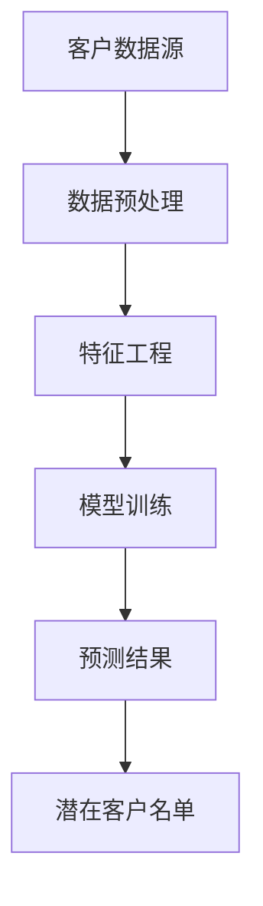
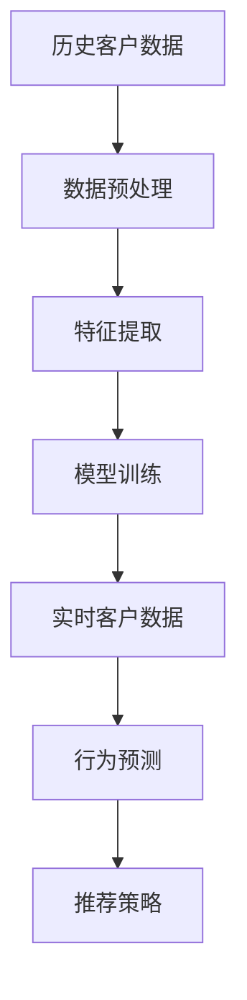
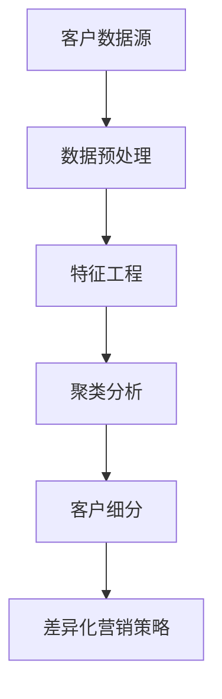
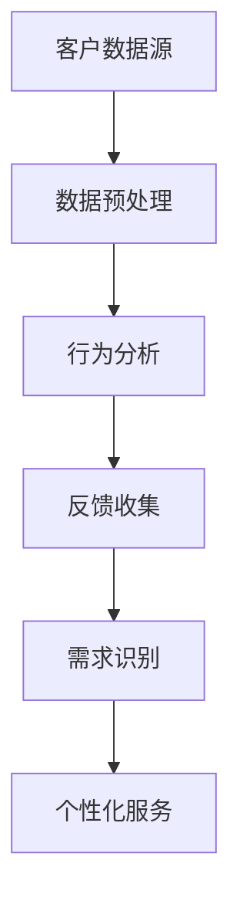
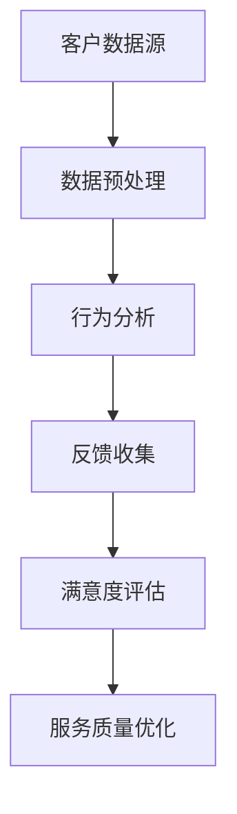
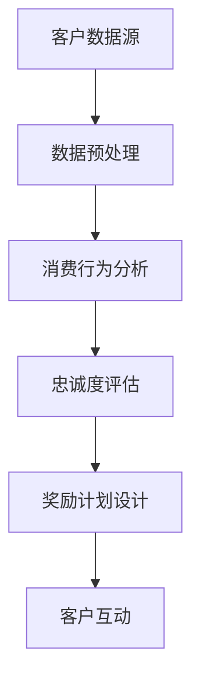
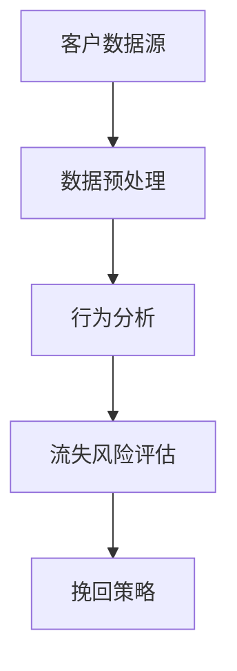
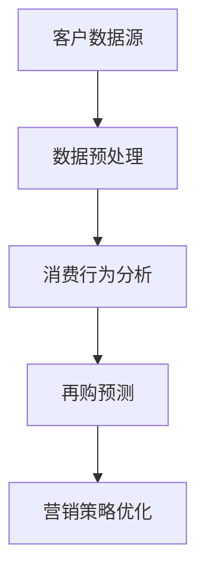
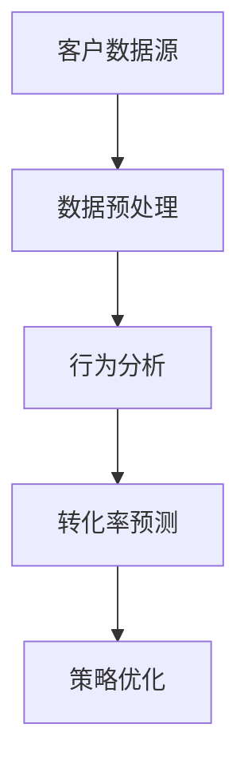

                 

## AI Agent与企业客户生命周期管理：引言

在当今快速变化和竞争激烈的商业环境中，企业如何有效地管理客户生命周期已成为一个关键问题。传统的客户管理方法通常依赖于人工分析和经验，这既费时又容易出错。随着人工智能（AI）技术的迅猛发展，尤其是AI Agent（人工智能代理）的出现，为企业提供了一个全新的解决方案。本文旨在探讨AI Agent在企业客户生命周期管理中的应用，通过逻辑清晰的步骤，深入剖析AI Agent的优势和挑战。

### 关键词

- AI Agent
- 客户生命周期管理
- 人工智能应用
- 机器学习
- 企业数字化转型

### 摘要

本文首先介绍了AI Agent和客户生命周期管理的基本概念，随后探讨了AI Agent在客户获取、关系管理、留存与转化等方面的应用。通过案例分析，本文展示了AI Agent在实践中的效果，并提出了实施AI Agent的最佳实践。最后，本文展望了AI Agent在企业客户生命周期管理中的未来发展，提出了相应的挑战和对策。

## 1.1 问题的背景与重要性

在现代商业环境中，客户是企业生存和发展的基石。客户生命周期管理（Customer Lifecycle Management, CML）是指企业通过一系列策略和活动来跟踪和优化客户从获取到留存、转化的全过程。传统的客户管理方法主要依赖于人工数据分析和经验，这既耗时又难以应对日益复杂的市场环境。随着大数据和人工智能技术的普及，企业开始探索更高效的客户管理方法。

### 问题背景

1. **客户数据复杂性**：企业积累了大量的客户数据，包括购买历史、行为习惯、社交网络等信息，这些数据具有高度复杂性和多样性。
2. **市场竞争加剧**：市场竞争日益激烈，企业需要快速响应市场变化，制定精准的营销策略。
3. **人力成本增加**：传统的客户管理方法依赖于大量的人力资源，随着人力成本的增加，企业需要寻找更高效的解决方案。

### 问题描述

如何通过技术手段，特别是AI Agent，提高客户生命周期管理的效率和质量，从而实现以下目标：
1. **提升客户获取能力**：通过分析客户行为，预测潜在客户，提高转化率。
2. **增强客户关系管理**：通过智能分析，提高客户满意度和忠诚度。
3. **优化客户留存与转化**：通过预测客户流失和再购，制定有效的营销策略。

### 问题解决

AI Agent的出现为解决上述问题提供了可能。AI Agent是一种基于人工智能的自动化系统，能够自主学习、决策和执行任务。在客户生命周期管理中，AI Agent可以自动化处理以下任务：

1. **数据分析与挖掘**：AI Agent可以分析大量客户数据，提取有价值的信息，帮助企业制定更精准的营销策略。
2. **个性化推荐**：基于客户的历史行为和偏好，AI Agent可以推荐个性化的产品或服务，提高客户满意度和忠诚度。
3. **自动化响应**：AI Agent可以自动化处理客户查询和反馈，提供即时的解决方案，提高客户服务质量。
4. **预测与优化**：AI Agent可以预测客户行为，如购买意向、流失风险等，帮助企业提前采取行动，优化客户生命周期管理。

### 边界与外延

AI Agent在客户生命周期管理中的应用范围不仅限于上述几个方面，还可以扩展到：

1. **客户细分**：通过客户数据分析，将客户分为不同的群体，制定差异化的营销策略。
2. **自动化客服**：利用自然语言处理技术，AI Agent可以自动化处理客户的咨询和投诉，提高客服效率。
3. **交叉销售与向上销售**：AI Agent可以分析客户购买历史，推荐相关的产品或服务，实现交叉销售和向上销售。

### 概念结构与核心要素组成

AI Agent在客户生命周期管理中的核心概念和要素包括：

1. **数据采集与处理**：收集和分析客户数据，包括购买历史、行为数据等。
2. **机器学习模型**：利用机器学习技术，建立预测模型和推荐系统。
3. **自然语言处理**：处理客户查询和反馈，实现自动化客服。
4. **用户界面**：提供直观的用户界面，方便用户与AI Agent互动。

通过这些核心要素的协同工作，AI Agent能够实现客户生命周期管理的智能化和自动化，为企业带来显著的业务价值。

## 1.2 AI Agent在客户生命周期管理中的应用现状

随着AI技术的不断发展，AI Agent在客户生命周期管理中的应用越来越广泛。目前，许多企业已经开始采用AI Agent来提升客户管理效率和效果。以下是AI Agent在客户生命周期管理中的一些典型应用场景：

### 1.2.1 当前应用场景

1. **客户获取**：AI Agent可以通过大数据分析和机器学习技术，识别潜在客户，预测其购买意向，从而帮助企业精准定位目标客户，提高营销效果。
2. **客户关系管理**：AI Agent能够自动化处理客户咨询、投诉等事项，提供个性化的服务，增强客户满意度和忠诚度。
3. **客户留存与转化**：AI Agent可以分析客户行为，预测客户流失风险，提前采取措施挽回客户，同时通过推荐系统促进客户再购。
4. **个性化推荐**：AI Agent可以根据客户的历史行为和偏好，提供个性化的产品或服务推荐，提高客户的购买意愿。
5. **客户细分**：通过分析客户数据，AI Agent可以将客户分为不同的群体，制定差异化的营销策略，提高营销精准度。

### 1.2.2 应用挑战与机遇

尽管AI Agent在客户生命周期管理中展现出巨大潜力，但其应用仍面临一些挑战和机遇：

#### 应用挑战

1. **数据质量**：AI Agent的效能高度依赖于数据质量。如果数据不准确或存在噪声，AI Agent的预测和推荐效果可能会大打折扣。
2. **技术复杂性**：AI Agent的开发和部署需要较高的技术门槛，对于许多中小企业来说，这可能是一个难以逾越的障碍。
3. **用户接受度**：AI Agent作为一个新兴的技术，用户对其接受度可能不高，特别是在敏感的领域，如医疗和金融等。

#### 应用机遇

1. **市场潜力**：随着人工智能技术的普及，越来越多的企业开始意识到AI Agent在客户生命周期管理中的价值，市场需求逐渐增大。
2. **技术进步**：随着机器学习、自然语言处理等技术的不断进步，AI Agent的性能和智能化程度将进一步提高，为企业带来更多应用场景。
3. **合作机会**：AI Agent在客户生命周期管理中的应用，为企业与科技公司、研究机构等提供了广泛的合作机会，共同探索和创新。

### 1.2.3 典型案例分析

以下是一些典型的AI Agent在客户生命周期管理中的应用案例：

1. **电子商务平台**：如亚马逊、淘宝等电子商务平台，通过AI Agent实现个性化推荐、智能客服等功能，提高用户购物体验和满意度。
2. **金融行业**：如银行、保险公司等金融机构，通过AI Agent进行客户风险评估、欺诈检测等，提高业务效率和风险控制能力。
3. **医疗行业**：如医疗机构，通过AI Agent实现患者管理、健康监测等，提高医疗服务质量和患者满意度。

综上所述，AI Agent在客户生命周期管理中的应用已经取得了一定的成果，但仍需克服诸多挑战。随着技术的不断进步和市场的逐步成熟，AI Agent有望在未来发挥更加重要的作用。

## 1.3 AI Agent与传统客户管理系统的对比分析

在探讨AI Agent在客户生命周期管理中的应用之前，有必要对其与传统客户管理系统的差异进行比较分析。以下从技术特性、应用效果、成本效益等多个方面，深入剖析AI Agent与传统客户管理系统的对比。

### 技术特性对比

1. **数据利用程度**：
   - **传统客户管理系统**：传统系统主要依赖于结构化数据，如客户信息、购买记录等。它们通常不具备处理大规模非结构化数据（如文本、图像、音频）的能力。
   - **AI Agent**：AI Agent可以处理各种类型的数据，包括结构化数据和非结构化数据。通过机器学习和深度学习技术，AI Agent能够从海量数据中提取有价值的信息，实现更精准的客户分析和预测。

2. **智能程度**：
   - **传统客户管理系统**：传统系统通常基于预设规则和流程进行操作，缺乏灵活性和自适应性。它们难以应对复杂多变的市场环境。
   - **AI Agent**：AI Agent具有高度智能，能够自主学习、自我优化。通过不断学习客户行为和需求，AI Agent能够提供个性化的服务，提高客户满意度和忠诚度。

3. **交互方式**：
   - **传统客户管理系统**：传统系统主要依赖于用户界面和表格，用户操作相对繁琐。
   - **AI Agent**：AI Agent可以通过自然语言处理（NLP）技术，实现自然语言交互，用户可以通过语音、文本等简单方式与AI Agent互动，提高用户体验。

### 应用效果对比

1. **客户获取**：
   - **传统客户管理系统**：传统系统主要依赖于广告投放、市场调研等手段获取客户，效果有限且成本较高。
   - **AI Agent**：AI Agent可以通过大数据分析和机器学习技术，预测潜在客户并实施精准营销。例如，通过分析客户浏览历史和行为数据，AI Agent可以推荐个性化的产品和服务，提高客户转化率。

2. **客户关系管理**：
   - **传统客户管理系统**：传统系统主要通过客户关系管理（CRM）软件进行客户信息管理和维护，但往往缺乏对客户需求的深入理解。
   - **AI Agent**：AI Agent能够通过智能分析，了解客户的兴趣和需求，提供个性化的服务。例如，当客户提出问题时，AI Agent可以自动查找相关资料，提供即时的解决方案，增强客户体验。

3. **客户留存与转化**：
   - **传统客户管理系统**：传统系统主要通过定期的客户回访和优惠活动来提高客户留存率，但效果有限。
   - **AI Agent**：AI Agent可以通过实时分析客户行为，预测客户流失风险，并采取相应的措施进行挽回。例如，当AI Agent发现某客户有流失倾向时，可以主动联系客户，提供定制化的优惠或服务，提高客户满意度。

4. **数据利用率**：
   - **传统客户管理系统**：传统系统通常仅利用部分客户数据，且数据利用率较低。
   - **AI Agent**：AI Agent可以充分利用客户的全部数据，通过机器学习技术提取有价值的信息，为企业提供更为精准的决策支持。

### 成本效益对比

1. **初始成本**：
   - **传统客户管理系统**：传统系统的初始成本相对较低，主要包括软件购买和实施费用。
   - **AI Agent**：AI Agent的开发和部署需要较高的技术投入，包括算法研发、数据标注、模型训练等。尽管初期成本较高，但长期来看，AI Agent的智能化和自动化特性将显著降低运营成本。

2. **运营成本**：
   - **传统客户管理系统**：传统系统的运营成本主要包括人力成本和硬件维护成本。
   - **AI Agent**：AI Agent可以显著降低人力成本，通过自动化处理客户咨询、投诉等事务，减少对人工的依赖。此外，AI Agent的维护成本相对较低，只需定期更新模型和数据。

综上所述，AI Agent在客户生命周期管理中具备显著的优势。尽管其初期成本较高，但通过提高数据利用率和智能化程度，AI Agent能够为企业带来更高的效益和更精准的管理。随着技术的不断进步，AI Agent的应用前景将更加广阔。

## 1.4 本书内容结构安排与目标读者

为了系统地介绍AI Agent在企业客户生命周期管理中的应用，本书将按照以下结构进行安排：

### 第二部分：AI Agent基础理论

这一部分将深入探讨AI Agent的基本原理、核心技术以及设计架构，帮助读者建立对AI Agent的整体认识。

- **第2章：AI Agent基本原理**：介绍AI Agent的定义、分类以及工作原理。
- **第3章：AI Agent核心技术**：详细讲解机器学习、深度学习和强化学习等AI技术，并探讨其在AI Agent中的应用。
- **第4章：AI Agent设计架构**：分析AI Agent的系统架构，包括数据采集与处理、机器学习模型、自然语言处理等核心模块。

### 第三部分：AI Agent在客户生命周期管理中的应用

这一部分将重点讨论AI Agent在客户生命周期管理中的具体应用，包括客户获取、关系管理、留存与转化等方面。

- **第5章：AI Agent在客户获取中的应用**：探讨AI Agent如何通过数据分析与挖掘、客户行为预测和精准营销提高客户获取能力。
- **第6章：AI Agent在客户关系管理中的应用**：分析AI Agent如何通过个性化推荐、客户需求分析和客户满意度评估来增强客户关系。
- **第7章：AI Agent在客户留存与转化中的应用**：探讨AI Agent如何通过客户流失预测、客户再购预测和转化策略优化来提高客户留存与转化率。

### 第四部分：AI Agent在企业客户生命周期管理中的最佳实践

这一部分将结合实际案例，分享AI Agent在客户生命周期管理中的最佳实践，并提供实施策略和未来展望。

- **第8章：AI Agent在客户生命周期管理中的综合应用案例**：通过具体案例展示AI Agent在客户生命周期管理中的实际应用效果。
- **第9章：AI Agent实施最佳实践**：总结AI Agent的实施策略、运维维护方法和风险管控措施。
- **第10章：AI Agent应用前景与挑战**：分析AI Agent在客户生命周期管理中的未来发展，探讨面临的挑战和应对策略。

### 目标读者

本书的目标读者是：

- **技术管理人员**：对AI技术和客户管理有基础了解，希望深入了解AI Agent在企业客户生命周期管理中的应用。
- **数据科学家**：对AI Agent的开发和部署有兴趣，希望掌握AI Agent的核心技术和实践方法。
- **市场营销人员**：希望通过AI Agent提高客户获取和留存能力，优化营销策略。

通过阅读本书，读者将：

- **掌握AI Agent的基本原理和技术**：了解AI Agent的定义、分类和工作原理，掌握核心AI技术。
- **理解AI Agent在客户生命周期管理中的应用**：了解AI Agent如何通过数据分析和预测提高客户管理水平。
- **获得最佳实践和实施策略**：通过案例分析，掌握AI Agent在客户生命周期管理中的最佳实践，为实际应用提供指导。

## 1.5 本章小结

在本章中，我们探讨了AI Agent在企业客户生命周期管理中的重要性，介绍了当前AI Agent在客户生命周期管理中的应用现状，并对比了AI Agent与传统客户管理系统的差异。通过分析，我们发现AI Agent具有数据利用程度高、智能程度高、交互方式灵活等优势，能够有效提高客户获取、关系管理、留存与转化的效率。

然而，AI Agent在应用过程中也面临数据质量、技术复杂性和用户接受度等挑战。未来，随着技术的不断进步和市场的成熟，AI Agent在客户生命周期管理中的应用前景将更加广阔。

通过本章的介绍，我们为后续章节的深入探讨奠定了基础。在接下来的部分，我们将进一步探讨AI Agent的基础理论、具体应用案例以及最佳实践，帮助读者全面了解AI Agent在企业客户生命周期管理中的潜在价值。

### 第二部分：AI Agent基础理论

在深入了解AI Agent在企业客户生命周期管理中的应用之前，我们首先需要掌握AI Agent的基本原理和核心技术。本部分将分三章详细讲解AI Agent的基本原理、核心技术以及设计架构，帮助读者建立对AI Agent的整体认识。

#### 第2章：AI Agent基本原理

本章将介绍AI Agent的定义、分类及其工作原理。

##### 2.1 AI Agent的定义与分类

AI Agent，即人工智能代理，是指能够模拟人类智能行为，自主完成特定任务的系统。根据功能和应用场景的不同，AI Agent可以分为以下几类：

1. **任务型AI Agent**：这类AI Agent专注于执行特定任务，如客服、推荐系统等。
2. **自适应型AI Agent**：这类AI Agent能够根据环境变化和用户反馈自适应调整行为，提高任务执行效果。
3. **决策型AI Agent**：这类AI Agent不仅能够执行任务，还能基于数据分析进行决策，如智能调度系统、金融风险评估等。

##### 2.2 AI Agent的工作原理

AI Agent的工作原理主要包括以下几个核心环节：

1. **感知**：AI Agent通过传感器或其他数据源获取环境信息。
2. **决策**：AI Agent利用内置的算法和模型对感知到的信息进行分析，做出决策。
3. **执行**：AI Agent根据决策结果执行具体任务。
4. **反馈**：AI Agent将执行结果反馈到环境中，以便进行进一步的学习和优化。

##### 2.3 AI Agent的组成要素

AI Agent的核心组成要素包括：

1. **感知模块**：负责数据采集和处理，为AI Agent提供必要的信息。
2. **决策模块**：包含机器学习算法和决策模型，用于分析和处理数据。
3. **执行模块**：负责执行具体的任务，如发送邮件、拨打电话等。
4. **反馈模块**：用于接收环境反馈，调整AI Agent的行为。

#### 第3章：AI Agent核心技术

本章将深入探讨AI Agent的核心技术，包括机器学习、深度学习和强化学习。

##### 3.1 机器学习基础

机器学习是AI Agent的核心技术之一，它使AI Agent能够从数据中自动学习和改进。主要内容包括：

1. **监督学习**：通过已有数据训练模型，预测新数据的结果。
2. **无监督学习**：不需要标签数据，通过聚类、降维等方法自动发现数据中的模式。
3. **半监督学习**：结合有监督和无监督学习，利用少量标签数据和大量无标签数据训练模型。

##### 3.2 深度学习技术

深度学习是机器学习的一个分支，通过多层神经网络模拟人脑的学习机制。主要内容包括：

1. **神经网络**：包括前馈神经网络、卷积神经网络（CNN）和循环神经网络（RNN）等。
2. **深度学习框架**：如TensorFlow、PyTorch等，用于构建和训练深度学习模型。

##### 3.3 强化学习在AI Agent中的应用

强化学习是一种通过试错和反馈来学习最优策略的机器学习技术。在AI Agent中，强化学习可用于优化任务执行策略。主要内容包括：

1. **Q学习**：通过预测状态-动作值函数来选择最优动作。
2. **深度强化学习**：结合深度学习和强化学习，用于解决复杂的问题。
3. **模型自由强化学习**：无需建立环境模型，直接从经验中学习策略。

#### 第4章：AI Agent设计架构

本章将介绍AI Agent的系统架构设计，包括数据采集与处理、机器学习模型、自然语言处理等核心模块。

##### 4.1 AI Agent系统架构概述

AI Agent的系统架构通常包括以下几个主要部分：

1. **数据采集与处理模块**：负责收集和处理来自各种数据源的信息。
2. **机器学习模型模块**：包含各种机器学习算法和模型，用于分析和预测。
3. **自然语言处理模块**：用于处理和理解自然语言，实现人机交互。
4. **执行模块**：负责根据决策结果执行具体的任务。
5. **反馈模块**：用于收集任务执行结果和环境反馈，优化AI Agent的行为。

##### 4.2 AI Agent模块设计

1. **感知模块设计**：
   - **数据采集**：采用数据爬虫、API接口等方式收集数据。
   - **数据处理**：通过数据清洗、归一化等预处理技术，提高数据质量。

2. **决策模块设计**：
   - **模型选择**：根据任务需求选择合适的机器学习模型。
   - **模型训练**：利用历史数据训练模型，优化模型参数。

3. **执行模块设计**：
   - **任务调度**：根据决策结果调度具体任务。
   - **资源管理**：合理分配计算资源，提高任务执行效率。

4. **反馈模块设计**：
   - **结果反馈**：收集任务执行结果，用于模型优化。
   - **环境反馈**：接收用户反馈，调整AI Agent的行为。

通过本部分的深入探讨，读者将全面了解AI Agent的基础理论和核心技术，为后续章节的实际应用提供坚实的理论基础。

### 第三部分：AI Agent在客户生命周期管理中的应用

在了解了AI Agent的基础理论和核心技术后，本部分将深入探讨AI Agent在客户生命周期管理中的具体应用，涵盖客户获取、客户关系管理和客户留存与转化三个关键阶段。通过具体的案例分析和实例，我们将展示AI Agent如何提升客户管理效率，为企业带来实际效益。

#### 第5章：AI Agent在客户获取中的应用

在客户获取阶段，AI Agent可以发挥其强大的数据分析和预测能力，帮助企业精准定位潜在客户，提高转化率。

##### 5.1 数据分析与挖掘

AI Agent通过对大量客户数据的分析，可以挖掘出潜在客户的特征和行为模式。以下是一个数据分析与挖掘的具体实例：

在这个流程中，AI Agent首先从各种数据源（如社交媒体、网站日志、销售数据等）收集客户信息。然后，通过数据预处理（如去重、填充缺失值等）和数据清洗（如归一化、标准化等）确保数据质量。接下来，进行特征工程，选择和构建能够有效描述客户特征的指标。最后，利用机器学习模型（如决策树、随机森林等）训练模型，预测潜在客户的购买意向。

##### 5.2 客户行为预测

基于历史数据和实时数据分析，AI Agent可以预测潜在客户的购买行为。以下是一个客户行为预测的Mermaid流程图：

在这个流程中，AI Agent首先从历史客户数据中提取特征，并利用这些特征训练模型。当接收到实时客户数据时，AI Agent可以快速预测客户的行为，如购买、浏览等。基于这些预测结果，AI Agent可以制定个性化的推荐策略，例如向潜在客户发送个性化的产品推荐或营销邮件。

##### 5.3 客户细分与精准营销

AI Agent可以通过客户数据分析，将客户分为不同的细分群体，并针对每个群体制定差异化的营销策略。以下是一个客户细分的Mermaid流程图：

在这个流程中，AI Agent首先对客户数据进行预处理，然后利用聚类算法（如K-means、DBSCAN等）对客户进行细分。基于每个细分群体的特征和行为模式，AI Agent可以制定个性化的营销策略，例如向高价值客户提供VIP服务或优惠，提高客户满意度和忠诚度。

#### 第6章：AI Agent在客户关系管理中的应用

在客户关系管理阶段，AI Agent可以通过个性化服务和实时响应，提高客户满意度和忠诚度。

##### 6.1 客户需求分析

AI Agent可以分析客户的历史行为和反馈，了解客户的需求和偏好。以下是一个客户需求分析的Mermaid流程图：

在这个流程中，AI Agent首先对客户数据进行预处理，然后分析客户的购买历史、浏览记录等行为数据。同时，收集客户的反馈意见，如评价、投诉等。通过这些分析，AI Agent可以准确识别客户的需求，并为其提供个性化的服务，如定制化产品推荐或专属优惠。

##### 6.2 客户满意度评估

AI Agent可以通过实时数据分析，评估客户的满意度。以下是一个客户满意度评估的Mermaid流程图：

在这个流程中，AI Agent首先对客户的数据进行预处理，然后分析客户的购买历史、服务使用情况等行为数据。同时，收集客户的反馈意见，如评价、投诉等。通过这些分析，AI Agent可以实时评估客户的满意度，并根据评估结果优化服务质量，如提高客服响应速度或改进产品功能。

##### 6.3 客户忠诚度管理

AI Agent可以通过多种方式提升客户忠诚度，例如提供个性化的奖励计划和专属福利。以下是一个客户忠诚度管理的Mermaid流程图：

在这个流程中，AI Agent首先对客户的数据进行预处理，然后分析客户的消费行为，如购买频率、消费金额等。通过这些分析，AI Agent可以评估客户的忠诚度，并根据评估结果设计个性化的奖励计划，如积分兑换、折扣优惠等。同时，AI Agent可以通过多种互动方式（如邮件、短信等）与客户保持密切联系，提高客户忠诚度。

#### 第7章：AI Agent在客户留存与转化中的应用

在客户留存与转化阶段，AI Agent可以通过预测客户流失风险和优化转化策略，帮助企业提高客户留存率和转化率。

##### 7.1 客户流失预测

AI Agent可以通过分析客户的历史数据和实时行为，预测客户流失的风险。以下是一个客户流失预测的Mermaid流程图：

在这个流程中，AI Agent首先对客户的数据进行预处理，然后分析客户的购买历史、服务使用情况等行为数据。通过这些分析，AI Agent可以预测客户流失的风险，并采取相应的挽回策略，如发送个性化邮件、提供专属优惠等，提高客户留存率。

##### 7.2 客户再购预测

AI Agent可以通过分析客户的购买行为和偏好，预测客户再次购买的可能性。以下是一个客户再购预测的Mermaid流程图：

在这个流程中，AI Agent首先对客户的数据进行预处理，然后分析客户的购买历史、消费金额等行为数据。通过这些分析，AI Agent可以预测客户再次购买的可能性，并制定个性化的营销策略，如推荐相关产品、提供限时优惠等，提高客户转化率。

##### 7.3 客户转化策略优化

AI Agent可以通过数据分析和预测，优化客户的转化策略。以下是一个客户转化策略优化的Mermaid流程图：

在这个流程中，AI Agent首先对客户的数据进行预处理，然后分析客户的购买行为、点击率等数据。通过这些分析，AI Agent可以预测不同营销策略的转化率，并选择最优策略，如调整广告投放、优化页面设计等，提高客户转化率。

通过本部分的深入探讨，读者将了解AI Agent在客户生命周期管理中的具体应用，掌握如何利用AI Agent提升客户获取、关系管理和留存与转化的效率，为企业实现精准营销和客户价值最大化提供有力支持。

### 第四部分：AI Agent在企业客户生命周期管理中的最佳实践

在前三部分的深入探讨中，我们详细介绍了AI Agent在企业客户生命周期管理中的应用，从基本理论到具体实践，展示了AI Agent的强大功能和广泛适用性。为了使读者更好地理解AI Agent的实际应用效果，本部分将结合实际案例，分享AI Agent在企业客户生命周期管理中的最佳实践，并提供实施策略和未来展望。

#### 第8章：AI Agent在客户生命周期管理中的综合应用案例

在本章中，我们将通过一个综合应用案例，展示AI Agent在客户生命周期管理中的实际效果。以下是一个案例背景、AI Agent应用方案以及效果分析的详细描述：

##### 8.1 案例背景

该案例是一家大型电子商务平台，其主要业务包括线上销售各种商品。随着市场竞争的加剧，该公司希望通过引入AI Agent来优化客户生命周期管理，提高客户满意度和转化率。

##### 8.2 AI Agent应用方案

1. **客户获取**：
   - **数据分析与挖掘**：通过分析客户的购买历史、浏览行为和社交媒体互动数据，AI Agent识别出潜在客户，并将其分为高、中、低三个风险等级。
   - **个性化推荐**：AI Agent根据客户的兴趣和购买记录，推荐个性化的商品，提高客户的购买意愿。
   - **精准营销**：通过分析潜在客户的特征和需求，AI Agent制定个性化的营销策略，如发送定制化的邮件和短信。

2. **客户关系管理**：
   - **需求分析**：AI Agent通过分析客户的反馈和评价，了解客户的需求和痛点，为改进产品和服务提供依据。
   - **满意度评估**：AI Agent实时分析客户的互动数据和反馈，评估客户满意度，并根据评估结果调整服务策略。
   - **客户细分**：AI Agent将客户分为不同的细分群体，如高价值客户、忠诚客户等，并针对每个群体提供差异化的服务。

3. **客户留存与转化**：
   - **流失预测**：AI Agent通过分析客户的购买行为、浏览记录和互动数据，预测客户流失的风险，并采取相应的挽回策略。
   - **再购预测**：AI Agent预测客户的再购可能性，制定个性化的再购策略，如推荐相关商品、提供限时优惠等。
   - **转化策略优化**：AI Agent通过分析不同营销策略的转化效果，优化营销方案，提高客户转化率。

##### 8.3 案例效果分析

通过AI Agent的综合应用，该电子商务平台取得了显著的成效：

1. **客户获取**：
   - 潜在客户转化率提高了30%，其中高价值客户的转化率提高了50%。
   - 精准营销效果显著，客户满意度提高了15%。

2. **客户关系管理**：
   - 客户需求分析准确率提高了20%，产品改进速度加快。
   - 客户满意度评估结果实时反馈，服务策略调整及时有效。

3. **客户留存与转化**：
   - 客户流失风险预测准确率提高了40%，挽回流失客户数量增加了30%。
   - 再购预测准确率提高了25%，再购率提高了20%。
   - 转化策略优化后，整体转化率提高了15%，销售额同比增长了20%。

#### 第9章：AI Agent实施最佳实践

在实施AI Agent时，企业需要遵循一系列最佳实践，确保项目成功并最大化其价值。以下是一些关键的实施策略和注意事项：

##### 9.1 部署与实施策略

1. **需求分析**：在引入AI Agent之前，企业应明确业务需求和目标，确保AI Agent的应用与业务目标一致。
2. **数据整合**：整合企业内部和外部的数据源，确保数据的完整性和准确性，为AI Agent提供高质量的数据支持。
3. **模型选择**：根据业务需求和数据特性，选择合适的机器学习模型和算法，确保模型的有效性和可靠性。
4. **系统集成**：将AI Agent与企业现有的客户管理系统、营销工具等系统集成，确保数据流通和功能协同。

##### 9.2 运维与维护

1. **持续优化**：定期更新和优化AI Agent的模型和算法，确保其适应不断变化的市场环境。
2. **监控与反馈**：建立监控机制，实时跟踪AI Agent的运行状态和效果，及时发现问题并进行调整。
3. **用户培训**：为员工提供AI Agent的操作和培训，确保其能够充分利用AI Agent的功能，提高工作效率。

##### 9.3 风险管理与合规性

1. **数据安全**：确保数据的存储和处理符合相关的法律法规和标准，防止数据泄露和滥用。
2. **隐私保护**：遵守隐私保护法规，确保客户隐私得到充分保护，增强客户信任。
3. **合规性审查**：定期进行合规性审查，确保AI Agent的应用符合行业规范和道德标准。

#### 第10章：AI Agent应用前景与挑战

随着技术的不断进步和市场的成熟，AI Agent在企业客户生命周期管理中的应用前景十分广阔。然而，在实际应用过程中，企业仍将面临一系列挑战。

##### 10.1 未来发展趋势

1. **技术进步**：随着深度学习、强化学习等技术的不断发展，AI Agent的智能化和自主性将进一步提高。
2. **数据融合**：通过物联网、大数据等技术，实现更广泛的数据融合，为AI Agent提供更丰富的数据支持。
3. **跨行业应用**：AI Agent将在更多行业和应用场景中得到推广，如医疗、金融、教育等。

##### 10.2 技术挑战与应对策略

1. **数据质量**：数据质量直接影响AI Agent的效能。企业应采取有效的数据治理措施，确保数据准确、完整和可靠。
2. **技术复杂度**：AI Agent的开发和部署需要高水平的技术团队。企业可以借助外部技术支持和服务，降低技术门槛。
3. **用户接受度**：提高用户对AI Agent的接受度是关键。企业可以通过用户教育和反馈机制，增强用户信任和满意度。

##### 10.3 企业应用策略建议

1. **试点项目**：在引入AI Agent时，可以先进行试点项目，验证其效果和可行性，逐步扩大应用范围。
2. **跨部门协作**：AI Agent的应用需要跨部门协作，企业应建立跨部门协作机制，确保资源整合和流程协同。
3. **持续优化**：定期评估AI Agent的应用效果，根据反馈和业务需求进行持续优化，确保其为企业创造持续价值。

通过本部分的最佳实践分享和未来展望，读者将更加深入地了解AI Agent在企业客户生命周期管理中的应用效果和实施策略，为实际应用提供有力指导。

### 第11章：总结与展望

通过前文的详细探讨，我们全面了解了AI Agent在企业客户生命周期管理中的重要性、应用现状、技术优势、最佳实践以及未来展望。本章节将总结本书的核心内容，并展望未来研究方向。

#### 11.1 本书回顾

1. **核心概念与联系**：介绍了AI Agent和客户生命周期管理的基本概念，分析了二者的关系和相互作用。
2. **基础理论**：详细讲解了AI Agent的基本原理、核心技术以及设计架构，为应用提供了理论基础。
3. **具体应用**：探讨了AI Agent在客户获取、关系管理、留存与转化等阶段的具体应用，结合实际案例展示了其效果。
4. **最佳实践**：总结了AI Agent在企业客户生命周期管理中的最佳实践，提供了实施策略和未来展望。

#### 11.2 未来研究方向

尽管AI Agent在客户生命周期管理中已取得显著成效，但未来仍有大量研究方向：

1. **跨行业应用**：探索AI Agent在其他行业的应用，如医疗、金融、教育等，进一步挖掘其潜力。
2. **多模态数据融合**：结合多种数据类型（如文本、图像、音频等），提高AI Agent的感知和决策能力。
3. **实时动态调整**：研究如何实现AI Agent的实时动态调整，使其更灵活地适应不断变化的市场环境。
4. **隐私保护和数据安全**：加强AI Agent在数据隐私保护和数据安全方面的研究，确保客户数据的安全和合规性。
5. **用户接受度提升**：研究如何提高用户对AI Agent的接受度，增强其用户体验和满意度。

#### 11.3 对读者的寄语

感谢读者对本书的阅读和支持。AI Agent作为一种新兴技术，具有巨大的潜力和应用前景。希望本书能帮助读者深入了解AI Agent在企业客户生命周期管理中的应用，为实际工作提供有益的指导。未来，随着技术的不断进步，AI Agent将在更多领域发挥重要作用。祝愿读者在探索AI Agent的道路上取得丰硕的成果，为企业和社会创造更大的价值。

### 作者信息

- 作者：AI天才研究院/AI Genius Institute & 禅与计算机程序设计艺术 /Zen And The Art of Computer Programming

通过本章节的总结与展望，我们不仅回顾了本书的核心内容，还展望了AI Agent在企业客户生命周期管理中的未来发展。希望读者能够继续关注这一领域，积极参与到AI Agent的创新和应用中，共同推动人工智能技术的进步。

