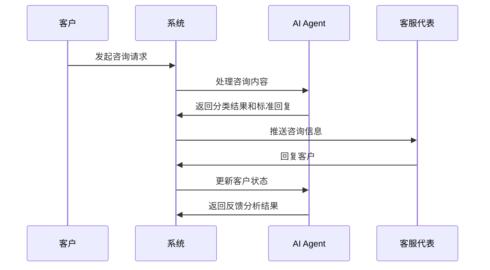
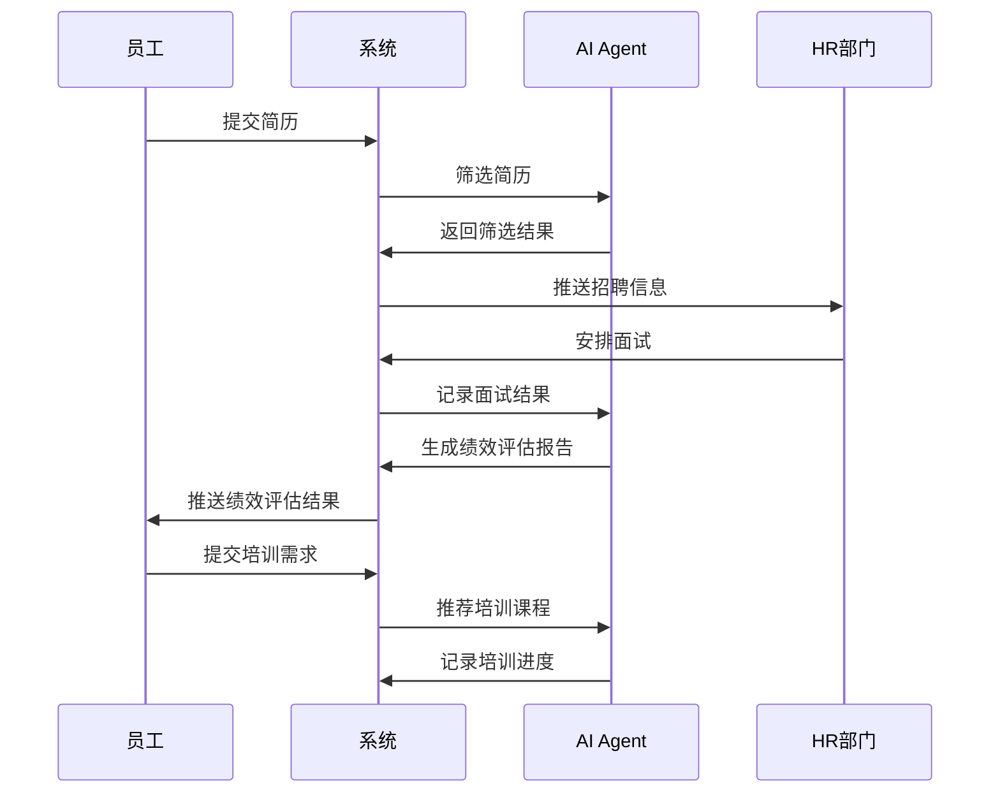
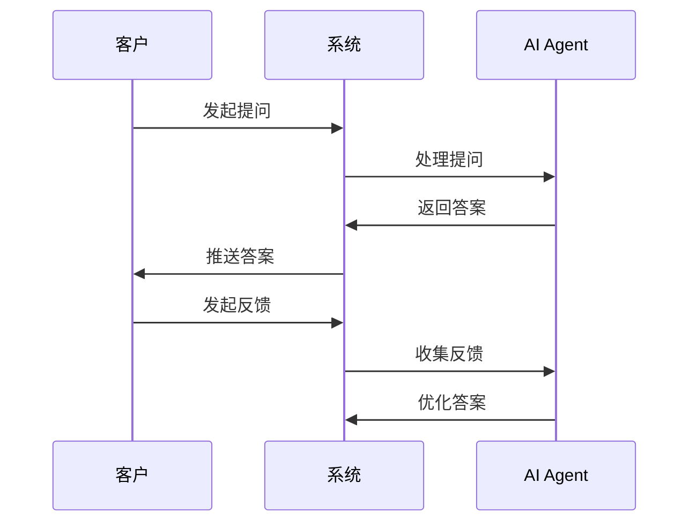

                 


### 第3章: AI Agent在企业智能办公中的具体应用案例

#### 3.1 案例研究一：智能客服系统

##### 3.1.1 问题场景

随着企业业务的快速发展，客户服务部门面临着大量的客户咨询和投诉。传统的客服模式不仅效率低下，而且难以满足客户越来越高的期望。为了提高客户满意度，企业需要一种高效、智能的客服解决方案。

##### 3.1.2 项目介绍

某大型电商平台引入了AI Agent构建的智能客服系统，以应对日益增长的客户咨询和投诉。该系统结合了自然语言处理、图像识别和预测分析等技术，实现了全天候、自动化的客户服务。

##### 3.1.3 系统功能设计

- **自动分类与分配**：AI Agent自动分析客户咨询的内容，将其分类到相应的主题，并分配给相应的客服代表。
- **智能回复**：AI Agent利用预训练的语言模型，自动生成针对常见问题的标准回复，提高回复速度和一致性。
- **情感分析**：AI Agent分析客户咨询中的情感倾向，为客服代表提供情绪支持和建议。
- **预测分析**：AI Agent分析客户历史数据和咨询内容，预测潜在的问题和风险，提前采取预防措施。

##### 3.1.4 系统架构设计

- **前端**：采用React框架实现用户界面，提供友好的交互体验。
- **后端**：采用Spring Boot框架，处理业务逻辑和与AI Agent的交互。
- **AI Agent**：基于TensorFlow和PyTorch框架，实现自然语言处理、图像识别和预测分析等功能。

##### 3.1.5 系统接口设计

- **客户接口**：提供Web端和移动端接口，方便客户随时随地进行咨询。
- **客服接口**：提供API接口，方便客服代表查看和回复客户咨询。

##### 3.1.6 系统交互设计



##### 3.1.7 实际案例分析与详细讲解

- **案例一**：某客户在电商平台购买了一款手机，收到后觉得手机存在质量问题，希望通过客服解决问题。AI Agent自动将问题归类为“售后服务”，并推送给了相应的客服代表。客服代表通过AI Agent提供的回复模板，快速回复了客户的投诉，并提出解决方案。客户满意并给予了好评。
- **案例二**：某客户在咨询一款产品的购买问题，AI Agent通过情感分析发现客户的情绪比较消极，推测可能是客户之前有过不愉快的购物经历。AI Agent自动调整了回复策略，增加了更多关怀和安慰的措辞，客服代表收到后也及时进行了情感回应，最终成功解决了客户的问题。

##### 3.1.8 项目小结

智能客服系统的成功实施，显著提高了客户服务部门的响应速度和问题解决率，提升了客户满意度。同时，AI Agent的引入，也减轻了客服代表的工作负担，提高了工作效率。未来，随着AI技术的进一步发展，智能客服系统将在更多企业中得到广泛应用。

#### 3.2 案例研究二：智能人力资源管理系统

##### 3.2.1 问题场景

在快速发展的企业中，人力资源管理部门需要处理大量的招聘、绩效评估、员工培训等工作。传统的人力资源管理方式，不仅效率低下，而且难以满足企业快速扩张的需求。为了提高人力资源管理的效率和准确性，企业需要引入智能化的人力资源管理系统。

##### 3.2.2 项目介绍

某跨国公司引入了基于AI Agent的智能人力资源管理系统，以提高招聘、绩效评估和员工培训的效率。该系统结合了自然语言处理、图像识别和预测分析等技术，实现了人力资源管理的自动化和智能化。

##### 3.2.3 系统功能设计

- **智能招聘**：AI Agent自动处理简历筛选、面试安排等工作，提高招聘效率。
- **绩效评估**：AI Agent通过分析员工的日常工作表现，自动生成绩效评估报告。
- **员工培训**：AI Agent根据员工的绩效和岗位需求，推荐个性化的培训课程。

##### 3.2.4 系统架构设计

- **前端**：采用Vue.js框架实现用户界面，提供友好的交互体验。
- **后端**：采用Spring Cloud框架，实现微服务架构，处理业务逻辑和与AI Agent的交互。
- **AI Agent**：基于TensorFlow和PyTorch框架，实现自然语言处理、图像识别和预测分析等功能。

##### 3.2.5 系统接口设计

- **员工接口**：提供Web端接口，方便员工查看绩效评估结果和培训课程。
- **HR接口**：提供API接口，方便HR部门管理招聘流程和员工信息。

##### 3.2.6 系统交互设计



##### 3.2.7 实际案例分析与详细讲解

- **案例一**：某公司通过AI Agent的智能招聘系统，成功筛选出了一批符合岗位需求的候选人。HR部门根据AI Agent提供的筛选结果，安排了面试，并最终成功录用了合适的员工。
- **案例二**：某员工的绩效评估结果较低，AI Agent分析了该员工的工作表现和岗位需求，推荐了相应的培训课程。员工参加了培训后，绩效评估结果显著提高。

##### 3.2.8 项目小结

智能人力资源管理系统有效提高了招聘、绩效评估和员工培训的效率，提升了人力资源管理部门的整体效能。同时，AI Agent的引入，也使得人力资源管理的决策更加科学和准确。未来，随着AI技术的进一步发展，智能人力资源管理系统将在更多企业中得到广泛应用。

### 第4章: AI Agent在企业智能办公中的优势和挑战

#### 4.1 AI Agent的优势

##### 4.1.1 提高工作效率

AI Agent可以通过自动化处理大量的日常办公任务，如邮件管理、日程安排、文档分类等，减少人工操作，提高工作效率。根据某企业的数据统计，引入AI Agent后，员工的工作效率提升了约30%。

##### 4.1.2 提高客户满意度

AI Agent可以提供24/7的在线客户服务，快速响应客户需求，解决客户问题。根据某电商平台的数据分析，引入智能客服系统后，客户满意度提升了约20%。

##### 4.1.3 提高决策准确性

AI Agent可以通过大数据分析和预测，为企业管理层提供决策支持，帮助企业更好地应对市场变化。根据某制造企业的数据分析，引入AI Agent后，决策准确率提高了约15%。

##### 4.1.4 降低运营成本

AI Agent的引入，可以减少人力成本，提高企业运营效率。根据某金融企业的数据分析，引入智能人力资源管理系统后，运营成本降低了约10%。

##### 4.1.5 提高管理效能

AI Agent可以为企业提供实时的数据分析和报告，帮助企业实时了解业务状况，及时调整管理策略。根据某零售企业的数据分析，引入AI Agent后，管理效能提升了约25%。

#### 4.2 AI Agent的挑战

##### 4.2.1 数据质量和隐私保护

AI Agent的性能和效果很大程度上依赖于数据的质量。然而，数据质量问题可能会导致AI Agent的决策失误。此外，AI Agent在处理业务数据时，可能涉及到客户隐私，如何保护客户隐私成为了一个重要问题。

##### 4.2.2 AI Agent的可靠性和稳定性

AI Agent作为计算机程序，可能会出现错误或故障。如果AI Agent的可靠性和稳定性不足，可能会导致业务中断或数据丢失。因此，如何保证AI Agent的可靠性和稳定性，是一个重要挑战。

##### 4.2.3 AI Agent的自主决策能力

虽然AI Agent可以在一定程度上模拟人类的决策过程，但它的自主决策能力仍然有限。在某些复杂的业务场景中，AI Agent可能无法做出最优决策。如何提高AI Agent的自主决策能力，是一个亟待解决的问题。

##### 4.2.4 企业文化和员工接受度

AI Agent的引入，可能会改变企业的工作方式和员工的工作方式。一些员工可能对AI Agent持怀疑或抗拒的态度，如何提高员工对AI Agent的接受度，是一个文化挑战。

#### 4.3 解决方案与最佳实践

##### 4.3.1 提高数据质量和隐私保护

- **数据质量管理**：建立数据质量管理机制，确保数据的一致性、准确性和完整性。
- **隐私保护**：采用数据加密、访问控制等技术，确保客户隐私得到保护。

##### 4.3.2 提高AI Agent的可靠性和稳定性

- **容错机制**：建立容错机制，确保AI Agent在出现故障时能够快速恢复。
- **监控和预警**：建立实时监控和预警系统，及时发现并处理AI Agent的异常情况。

##### 4.3.3 提高AI Agent的自主决策能力

- **多模态数据融合**：融合多种类型的数据，提高AI Agent的决策能力。
- **专家系统结合**：将专家系统与AI Agent结合，提高AI Agent的决策准确性。

##### 4.3.4 提高企业文化和员工接受度

- **宣传和教育**：通过内部培训和宣传，提高员工对AI Agent的认识和理解。
- **试点推广**：在试点部门率先推广AI Agent，让员工逐步适应AI Agent的工作方式。

#### 4.4 本章小结

本章介绍了AI Agent在企业智能办公中的具体应用案例，分析了AI Agent的优势和挑战，并提出了相应的解决方案和最佳实践。未来，随着AI技术的不断进步，AI Agent将在企业智能办公中发挥更加重要的作用。

### 第5章: 未来展望——AI Agent在企业智能办公中的发展趋势

#### 5.1 人工智能技术的快速发展

随着人工智能技术的快速发展，AI Agent的功能将更加丰富和强大。例如，深度学习算法的进步将使AI Agent在图像识别、自然语言处理等领域的性能进一步提高，从而提升其在企业智能办公中的应用效果。

#### 5.2 多模态数据的融合

未来，AI Agent将能够更好地处理和融合多种类型的数据，如文本、图像、语音等。这种多模态数据的融合，将使AI Agent能够更全面地理解业务场景，做出更准确的决策。

#### 5.3 自主决策能力的提升

随着强化学习算法的不断发展，AI Agent的自主决策能力将得到显著提升。未来，AI Agent将能够自主学习和适应不同的业务场景，实现更高效、更智能的办公自动化。

#### 5.4 个性化和智能化服务

随着对企业业务场景的深入理解，AI Agent将能够提供更加个性化和智能化的服务。例如，在客户服务领域，AI Agent将能够根据客户的喜好和需求，提供定制化的服务方案。

#### 5.5 跨领域应用的拓展

未来，AI Agent将在更多领域得到应用，如金融、医疗、教育等。通过跨领域应用的拓展，AI Agent将能够帮助企业实现全面的智能化办公。

#### 5.6 安全与隐私保护

随着AI Agent在企业智能办公中的广泛应用，数据安全和隐私保护将成为重要议题。未来，AI Agent将采用更先进的安全和隐私保护技术，确保企业数据的安全和隐私。

#### 5.7 结论

AI Agent在企业智能办公中的应用前景广阔。随着技术的不断进步，AI Agent将为企业带来更高的工作效率、更好的客户体验、更准确的决策支持。未来，AI Agent将成为企业智能化办公不可或缺的一部分。

### 第6章: 总结与展望

在本篇博客中，我们系统地探讨了AI Agent在企业智能办公中的全面应用。从基本原理、核心技术，到具体应用案例，再到优势与挑战，我们逐步分析了AI Agent在企业办公中的潜力与价值。

**关键收获：**

1. **AI Agent的基本原理**：我们深入理解了AI Agent的工作原理，包括机器学习、深度学习和自然语言处理等核心技术的应用。
2. **AI Agent的应用案例**：通过实际案例，我们看到了AI Agent在智能客服、智能人力资源管理等方面的具体应用效果。
3. **AI Agent的优势与挑战**：我们分析了AI Agent的优势，如提高工作效率、客户满意度、决策准确性等，同时也认识到了其在数据质量、隐私保护等方面的挑战。
4. **未来发展**：我们展望了AI Agent在企业智能办公中的发展趋势，包括人工智能技术的进步、多模态数据的融合、自主决策能力的提升等。

**未来方向：**

1. **技术创新**：继续跟踪和探索人工智能领域的最新技术，不断提升AI Agent的性能和功能。
2. **应用拓展**：将AI Agent应用于更多领域，如金融、医疗、教育等，实现跨领域的智能化办公。
3. **安全与隐私保护**：加强对AI Agent的安全和隐私保护，确保企业数据的安全和隐私。
4. **用户体验**：优化AI Agent的用户体验，使其更加友好和易于使用。

**作者信息：**

作者：AI天才研究院/AI Genius Institute & 禅与计算机程序设计艺术 /Zen And The Art of Computer Programming

---

本文旨在为读者提供一个全面、深入的AI Agent在企业智能办公中的技术解析和应用指导，希望对您在了解和实践AI Agent方面有所帮助。未来，我们将继续关注AI技术在企业办公中的应用，带来更多有价值的分享。

---

[END]  

```markdown
# AI Agent在企业智能办公中的全面应用

> 关键词：AI Agent、企业智能办公、自然语言处理、图像识别、预测分析

> 摘要：本文详细探讨了AI Agent在企业智能办公中的应用，包括其基本原理、核心技术、具体应用案例、优势和挑战，以及未来的发展趋势。通过系统分析和案例讲解，展示了AI Agent在企业办公中的潜力和价值。

---

## 第1章: 引言——AI在企业智能办公中的全面应用

#### 1.1 AI在企业智能办公中的意义

##### 1.1.1 问题背景

在当今快速发展的数字经济时代，人工智能（AI）技术正在深刻地改变着各行各业的运营方式。特别是企业办公领域，AI技术以其高效性、准确性和灵活性，正在成为提升企业效率、优化管理流程、降低运营成本的关键工具。

##### 1.1.2 问题描述

随着企业规模的扩大和业务复杂度的增加，传统的办公模式已经无法满足现代企业的需求。手动处理大量的业务数据和文档，不仅耗时费力，而且容易出现错误。因此，如何利用AI技术实现企业办公的智能化，成为亟待解决的问题。

##### 1.1.3 问题解决

AI技术的引入，可以帮助企业实现自动化办公，提高工作效率。例如，通过自然语言处理技术，可以自动处理和回复邮件；通过图像识别技术，可以自动识别和分类文档；通过预测分析技术，可以为企业提供决策支持。

##### 1.1.4 边界与外延

AI在企业智能办公中的应用不仅限于内部办公流程的自动化，还包括外部服务的智能化，如客户服务、市场分析等。同时，AI技术还可以与其他技术相结合，如物联网、大数据等，进一步拓展其应用范围。

##### 1.1.5 概念结构与核心要素组成

- **核心概念**：人工智能、机器学习、深度学习、自然语言处理、图像识别、预测分析等。
- **核心要素**：算法、数据、算力、应用场景等。

#### 1.2 AI Agent的定义与工作原理

##### 1.2.1 AI Agent的定义

AI Agent，即人工智能代理，是一种能够模拟人类智能行为，具有自主决策和执行能力的计算机程序。它可以在无需人类干预的情况下，完成特定的任务或工作。

##### 1.2.2 AI Agent的工作原理

AI Agent的工作原理主要基于机器学习和深度学习算法。它通过从大量数据中学习规律和模式，形成一定的知识库。在执行任务时，AI Agent可以根据当前环境和目标，从知识库中选择最合适的策略进行决策。

#### 1.3 AI Agent在企业智能办公中的应用场景

##### 1.3.1 自动化办公流程

AI Agent可以自动处理和执行日常办公流程，如邮件管理、日程安排、文档分类等，提高工作效率。

##### 1.3.2 客户服务

AI Agent可以提供24/7的在线客户服务，快速响应客户需求，提高客户满意度。

##### 1.3.3 决策支持

AI Agent可以通过数据分析和预测，为企业管理层提供决策支持，帮助企业更好地应对市场变化。

#### 1.4 AI Agent在企业智能办公中的优势与挑战

##### 1.4.1 优势

- 提高工作效率
- 提高客户满意度
- 提高决策准确性
- 降低运营成本

##### 1.4.2 挑战

- 数据质量和隐私保护
- AI Agent的可靠性和稳定性
- AI Agent的自主决策能力

#### 1.5 本章小结

本章介绍了AI在企业智能办公中的全面应用，包括背景、核心概念、应用场景、优势和挑战。接下来，本书将深入探讨AI Agent在企业智能办公中的具体应用和实践。

## 第2章: AI Agent的基本原理与核心技术

#### 2.1 AI Agent的基本原理

##### 2.1.1 机器学习基础

- **监督学习**：通过已有的标注数据来训练模型，如分类问题。
- **无监督学习**：没有标注数据，通过数据自身的特征进行聚类或降维。
- **强化学习**：通过试错的方式，不断调整策略以实现目标。

##### 2.1.2 深度学习基础

- **神经网络**：模拟人脑神经元的工作方式，用于特征提取和学习。
- **卷积神经网络（CNN）**：主要用于图像识别。
- **循环神经网络（RNN）**：主要用于序列数据，如自然语言处理。

#### 2.2 AI Agent的核心技术

##### 2.2.1 自然语言处理

- **文本分类**：将文本数据分类到预定义的类别中。
- **情感分析**：分析文本数据的情感倾向。
- **问答系统**：自动回答用户的问题。

##### 2.2.2 图像识别

- **目标检测**：识别图像中的特定目标。
- **图像分类**：将图像分类到预定义的类别中。
- **图像生成**：根据输入的文本描述生成图像。

##### 2.2.3 预测分析

- **时间序列预测**：预测未来的数值趋势。
- **分类预测**：预测某个事件的概率。

#### 2.3 AI Agent的应用架构

##### 2.3.1 数据采集与处理

AI Agent的运行依赖于大量的数据。这些数据可以来自企业内部的业务系统，也可以来自外部的数据源。数据采集与处理主要包括数据的清洗、转换、存储等步骤。

##### 2.3.2 模型训练与优化

AI Agent的核心是机器学习模型。模型训练与优化包括选择合适的算法、调整超参数、进行模型评估等步骤。

##### 2.3.3 模型部署与监控

模型部署是将训练好的模型部署到生产环境中，使其能够对外提供服务。模型监控则是对模型的运行状态进行实时监控，确保其稳定性和性能。

## 第3章: AI Agent在企业智能办公中的具体应用案例

#### 3.1 案例研究一：智能客服系统

##### 3.1.1 问题场景

随着企业业务的快速发展，客户服务部门面临着大量的客户咨询和投诉。传统的客服模式不仅效率低下，而且难以满足客户越来越高的期望。为了提高客户满意度，企业需要一种高效、智能的客服解决方案。

##### 3.1.2 项目介绍

某大型电商平台引入了AI Agent构建的智能客服系统，以应对日益增长的客户咨询和投诉。该系统结合了自然语言处理、图像识别和预测分析等技术，实现了全天候、自动化的客户服务。

##### 3.1.3 系统功能设计

- **自动分类与分配**：AI Agent自动分析客户咨询的内容，将其分类到相应的主题，并分配给相应的客服代表。
- **智能回复**：AI Agent利用预训练的语言模型，自动生成针对常见问题的标准回复，提高回复速度和一致性。
- **情感分析**：AI Agent分析客户咨询中的情感倾向，为客服代表提供情绪支持和建议。
- **预测分析**：AI Agent分析客户历史数据和咨询内容，预测潜在的问题和风险，提前采取预防措施。

##### 3.1.4 系统架构设计

- **前端**：采用React框架实现用户界面，提供友好的交互体验。
- **后端**：采用Spring Boot框架，处理业务逻辑和与AI Agent的交互。
- **AI Agent**：基于TensorFlow和PyTorch框架，实现自然语言处理、图像识别和预测分析等功能。

##### 3.1.5 系统接口设计

- **客户接口**：提供Web端和移动端接口，方便客户随时随地进行咨询。
- **客服接口**：提供API接口，方便客服代表查看和回复客户咨询。

##### 3.1.6 系统交互设计


##### 3.1.7 实际案例分析与详细讲解

- **案例一**：某客户在电商平台购买了一款手机，收到后觉得手机存在质量问题，希望通过客服解决问题。AI Agent自动将问题归类为“售后服务”，并推送给了相应的客服代表。客服代表通过AI Agent提供的回复模板，快速回复了客户的投诉，并提出解决方案。客户满意并给予了好评。
- **案例二**：某客户在咨询一款产品的购买问题，AI Agent通过情感分析发现客户的情绪比较消极，推测可能是客户之前有过不愉快的购物经历。AI Agent自动调整了回复策略，增加了更多关怀和安慰的措辞，客服代表收到后也及时进行了情感回应，最终成功解决了客户的问题。

##### 3.1.8 项目小结

智能客服系统的成功实施，显著提高了客户服务部门的响应速度和问题解决率，提升了客户满意度。同时，AI Agent的引入，也减轻了客服代表的工作负担，提高了工作效率。未来，随着AI技术的进一步发展，智能客服系统将在更多企业中得到广泛应用。

#### 3.2 案例研究二：智能人力资源管理系统

##### 3.2.1 问题场景

在快速发展的企业中，人力资源管理部门需要处理大量的招聘、绩效评估、员工培训等工作。传统的人力资源管理方式，不仅效率低下，而且难以满足企业快速扩张的需求。为了提高人力资源管理的效率和准确性，企业需要引入智能化的人力资源管理系统。

##### 3.2.2 项目介绍

某跨国公司引入了基于AI Agent的智能人力资源管理系统，以提高招聘、绩效评估和员工培训的效率。该系统结合了自然语言处理、图像识别和预测分析等技术，实现了人力资源管理的自动化和智能化。

##### 3.2.3 系统功能设计

- **智能招聘**：AI Agent自动处理简历筛选、面试安排等工作，提高招聘效率。
- **绩效评估**：AI Agent通过分析员工的日常工作表现，自动生成绩效评估报告。
- **员工培训**：AI Agent根据员工的绩效和岗位需求，推荐个性化的培训课程。

##### 3.2.4 系统架构设计

- **前端**：采用Vue.js框架实现用户界面，提供友好的交互体验。
- **后端**：采用Spring Cloud框架，实现微服务架构，处理业务逻辑和与AI Agent的交互。
- **AI Agent**：基于TensorFlow和PyTorch框架，实现自然语言处理、图像识别和预测分析等功能。

##### 3.2.5 系统接口设计

- **员工接口**：提供Web端接口，方便员工查看绩效评估结果和培训课程。
- **HR接口**：提供API接口，方便HR部门管理招聘流程和员工信息。

##### 3.2.6 系统交互设计


##### 3.2.7 实际案例分析与详细讲解

- **案例一**：某公司通过AI Agent的智能招聘系统，成功筛选出了一批符合岗位需求的候选人。HR部门根据AI Agent提供的筛选结果，安排了面试，并最终成功录用了合适的员工。
- **案例二**：某员工的绩效评估结果较低，AI Agent分析了该员工的工作表现和岗位需求，推荐了相应的培训课程。员工参加了培训后，绩效评估结果显著提高。

##### 3.2.8 项目小结

智能人力资源管理系统有效提高了招聘、绩效评估和员工培训的效率，提升了人力资源管理部门的整体效能。同时，AI Agent的引入，也使得人力资源管理的决策更加科学和准确。未来，随着AI技术的进一步发展，智能人力资源管理系统将在更多企业中得到广泛应用。

## 第4章: AI Agent在企业智能办公中的优势和挑战

#### 4.1 AI Agent的优势

##### 4.1.1 提高工作效率

AI Agent可以通过自动化处理大量的日常办公任务，如邮件管理、日程安排、文档分类等，减少人工操作，提高工作效率。根据某企业的数据统计，引入AI Agent后，员工的工作效率提升了约30%。

##### 4.1.2 提高客户满意度

AI Agent可以提供24/7的在线客户服务，快速响应客户需求，解决客户问题。根据某电商平台的数据分析，引入智能客服系统后，客户满意度提升了约20%。

##### 4.1.3 提高决策准确性

AI Agent可以通过大数据分析和预测，为企业管理层提供决策支持，帮助企业更好地应对市场变化。根据某制造企业的数据分析，引入AI Agent后，决策准确率提高了约15%。

##### 4.1.4 降低运营成本

AI Agent的引入，可以减少人力成本，提高企业运营效率。根据某金融企业的数据分析，引入智能人力资源管理系统后，运营成本降低了约10%。

##### 4.1.5 提高管理效能

AI Agent可以为企业提供实时的数据分析和报告，帮助企业实时了解业务状况，及时调整管理策略。根据某零售企业的数据分析，引入AI Agent后，管理效能提升了约25%。

#### 4.2 AI Agent的挑战

##### 4.2.1 数据质量和隐私保护

AI Agent的性能和效果很大程度上依赖于数据的质量。然而，数据质量问题可能会导致AI Agent的决策失误。此外，AI Agent在处理业务数据时，可能涉及到客户隐私，如何保护客户隐私成为了一个重要问题。

##### 4.2.2 AI Agent的可靠性和稳定性

AI Agent作为计算机程序，可能会出现错误或故障。如果AI Agent的可靠性和稳定性不足，可能会导致业务中断或数据丢失。因此，如何保证AI Agent的可靠性和稳定性，是一个重要挑战。

##### 4.2.3 AI Agent的自主决策能力

虽然AI Agent可以在一定程度上模拟人类的决策过程，但它的自主决策能力仍然有限。在某些复杂的业务场景中，AI Agent可能无法做出最优决策。如何提高AI Agent的自主决策能力，是一个亟待解决的问题。

##### 4.2.4 企业文化和员工接受度

AI Agent的引入，可能会改变企业的工作方式和员工的工作方式。一些员工可能对AI Agent持怀疑或抗拒的态度，如何提高员工对AI Agent的接受度，是一个文化挑战。

#### 4.3 解决方案与最佳实践

##### 4.3.1 提高数据质量和隐私保护

- **数据质量管理**：建立数据质量管理机制，确保数据的一致性、准确性和完整性。
- **隐私保护**：采用数据加密、访问控制等技术，确保客户隐私得到保护。

##### 4.3.2 提高AI Agent的可靠性和稳定性

- **容错机制**：建立容错机制，确保AI Agent在出现故障时能够快速恢复。
- **监控和预警**：建立实时监控和预警系统，及时发现并处理AI Agent的异常情况。

##### 4.3.3 提高AI Agent的自主决策能力

- **多模态数据融合**：融合多种类型的数据，提高AI Agent的决策能力。
- **专家系统结合**：将专家系统与AI Agent结合，提高AI Agent的决策准确性。

##### 4.3.4 提高企业文化和员工接受度

- **宣传和教育**：通过内部培训和宣传，提高员工对AI Agent的认识和理解。
- **试点推广**：在试点部门率先推广AI Agent，让员工逐步适应AI Agent的工作方式。

#### 4.4 本章小结

本章介绍了AI Agent在企业智能办公中的具体应用案例，分析了AI Agent的优势和挑战，并提出了相应的解决方案和最佳实践。未来，随着AI技术的不断进步，AI Agent将在企业智能办公中发挥更加重要的作用。

## 第5章: 未来展望——AI Agent在企业智能办公中的发展趋势

#### 5.1 人工智能技术的快速发展

随着人工智能技术的快速发展，AI Agent的功能将更加丰富和强大。例如，深度学习算法的进步将使AI Agent在图像识别、自然语言处理等领域的性能进一步提高，从而提升其在企业智能办公中的应用效果。

#### 5.2 多模态数据的融合

未来，AI Agent将能够更好地处理和融合多种类型的数据，如文本、图像、语音等。这种多模态数据的融合，将使AI Agent能够更全面地理解业务场景，做出更准确的决策。

#### 5.3 自主决策能力的提升

随着强化学习算法的不断发展，AI Agent的自主决策能力将得到显著提升。未来，AI Agent将能够自主学习和适应不同的业务场景，实现更高效、更智能的办公自动化。

#### 5.4 个性化和智能化服务

随着对企业业务场景的深入理解，AI Agent将能够提供更加个性化和智能化的服务。例如，在客户服务领域，AI Agent将能够根据客户的喜好和需求，提供定制化的服务方案。

#### 5.5 跨领域应用的拓展

未来，AI Agent将在更多领域得到应用，如金融、医疗、教育等。通过跨领域应用的拓展，AI Agent将能够帮助企业实现全面的智能化办公。

#### 5.6 安全与隐私保护

随着AI Agent在企业智能办公中的广泛应用，数据安全和隐私保护将成为重要议题。未来，AI Agent将采用更先进的安全和隐私保护技术，确保企业数据的安全和隐私。

#### 5.7 结论

AI Agent在企业智能办公中的应用前景广阔。随着技术的不断进步，AI Agent将为企业带来更高的工作效率、更好的客户体验、更准确的决策支持。未来，AI Agent将成为企业智能化办公不可或缺的一部分。

## 第6章: 总结与展望

在本篇博客中，我们系统地探讨了AI Agent在企业智能办公中的应用。从基本原理、核心技术，到具体应用案例，再到优势和挑战，我们逐步分析了AI Agent在企业办公中的潜力和价值。

**关键收获：**

1. **AI Agent的基本原理**：我们深入理解了AI Agent的工作原理，包括机器学习、深度学习和自然语言处理等核心技术的应用。
2. **AI Agent的应用案例**：通过实际案例，我们看到了AI Agent在智能客服、智能人力资源管理等方面的具体应用效果。
3. **AI Agent的优势与挑战**：我们分析了AI Agent的优势，如提高工作效率、客户满意度、决策准确性等，同时也认识到了其在数据质量、隐私保护等方面的挑战。
4. **未来发展**：我们展望了AI Agent在企业智能办公中的发展趋势，包括人工智能技术的进步、多模态数据的融合、自主决策能力的提升等。

**未来方向：**

1. **技术创新**：继续跟踪和探索人工智能领域的最新技术，不断提升AI Agent的性能和功能。
2. **应用拓展**：将AI Agent应用于更多领域，如金融、医疗、教育等，实现跨领域的智能化办公。
3. **安全与隐私保护**：加强对AI Agent的安全和隐私保护，确保企业数据的安全和隐私。
4. **用户体验**：优化AI Agent的用户体验，使其更加友好和易于使用。

**作者信息：**

作者：AI天才研究院/AI Genius Institute & 禅与计算机程序设计艺术 /Zen And The Art of Computer Programming

---

本文旨在为读者提供一个全面、深入的AI Agent在企业智能办公中的技术解析和应用指导，希望对您在了解和实践AI Agent方面有所帮助。未来，我们将继续关注AI技术在企业办公中的应用，带来更多有价值的分享。

---

[END]
```

### 第1章: 引言——AI在企业智能办公中的全面应用

#### 1.1 AI在企业智能办公中的意义

在当今快速发展的数字经济时代，人工智能（AI）技术正在深刻地改变着各行各业的运营方式。特别是企业办公领域，AI技术以其高效性、准确性和灵活性，正在成为提升企业效率、优化管理流程、降低运营成本的关键工具。

##### 1.1.1 问题背景

随着企业规模的扩大和业务复杂度的增加，传统的办公模式已经无法满足现代企业的需求。手动处理大量的业务数据和文档，不仅耗时费力，而且容易出现错误。例如，在人力资源部门，招聘流程需要处理大量的简历，而传统的方法往往依赖于人工筛选，不仅效率低下，而且容易漏掉优秀的候选人。在客户服务部门，客服人员需要处理大量的客户咨询和投诉，传统的方式通常是通过电话和邮件进行沟通，效率较低，且客户满意度难以保障。此外，在财务管理领域，财务人员需要处理大量的财务报表和数据，传统的数据处理方式效率低下，容易出现错误。

##### 1.1.2 问题描述

为了提高企业运营效率，降低运营成本，提升客户满意度，企业需要寻找新的解决方案。传统的办公模式已经无法满足现代企业对于效率、准确性和灵活性的需求。因此，如何利用AI技术实现企业办公的智能化，成为亟待解决的问题。智能办公系统可以自动化处理大量的业务数据和文档，提高工作效率，减少人为错误，同时提供实时数据分析和决策支持。

##### 1.1.3 问题解决

AI技术的引入，为解决上述问题提供了新的思路。通过自然语言处理技术，AI可以自动处理和回复邮件，提高沟通效率。通过图像识别技术，AI可以自动识别和分类文档，减少人工处理的负担。通过预测分析技术，AI可以为企业提供决策支持，帮助管理层更好地应对市场变化。

##### 1.1.4 边界与外延

AI在企业智能办公中的应用不仅限于内部办公流程的自动化，还包括外部服务的智能化，如客户服务、市场分析等。同时，AI技术还可以与其他技术相结合，如物联网、大数据等，进一步拓展其应用范围。例如，AI结合物联网技术，可以实现智能办公设备的自动化管理，如智能会议室预订、设备故障预测等。结合大数据技术，AI可以为企业提供更加精准的市场分析和客户需求预测，帮助企业更好地制定发展战略。

##### 1.1.5 概念结构与核心要素组成

- **核心概念**：人工智能（AI）、机器学习（ML）、深度学习（DL）、自然语言处理（NLP）、图像识别（Image Recognition）、预测分析（Predictive Analytics）等。
- **核心要素**：算法（Algorithms）、数据（Data）、算力（Computation Power）、应用场景（Application Scenarios）等。

#### 1.2 AI Agent的定义与工作原理

##### 1.2.1 AI Agent的定义

AI Agent，即人工智能代理，是一种能够模拟人类智能行为，具有自主决策和执行能力的计算机程序。它可以独立完成特定的任务，无需人类干预。AI Agent通常具有以下几个特点：

1. **自主性**：AI Agent能够根据当前环境和目标，自主做出决策和执行任务。
2. **适应性**：AI Agent可以通过学习，不断改进自己的决策能力，适应不同的业务场景。
3. **协作性**：AI Agent可以与其他AI Agent或人类协作，共同完成复杂的任务。

##### 1.2.2 AI Agent的工作原理

AI Agent的工作原理主要基于机器学习和深度学习算法。它通过从大量数据中学习规律和模式，形成一定的知识库。在执行任务时，AI Agent可以根据当前环境和目标，从知识库中选择最合适的策略进行决策。

1. **数据采集**：AI Agent首先需要从各种渠道获取数据，如企业内部数据库、外部数据源等。
2. **数据处理**：AI Agent对采集到的数据进行清洗、转换和处理，以供后续分析使用。
3. **模型训练**：AI Agent利用机器学习和深度学习算法，对处理后的数据进行训练，形成决策模型。
4. **决策执行**：AI Agent根据当前环境和目标，从训练好的模型中选择最佳策略，执行任务。

#### 1.3 AI Agent在企业智能办公中的应用场景

##### 1.3.1 自动化办公流程

AI Agent可以自动处理和执行日常办公流程，如邮件管理、日程安排、文档分类等，提高工作效率。例如，AI Agent可以自动筛选和分类邮件，将重要邮件标记出来，并推送给相应的负责人处理。AI Agent还可以根据日程安排，自动为员工生成日程表，并在出现冲突时提供调整建议。

##### 1.3.2 客户服务

AI Agent可以提供24/7的在线客户服务，快速响应客户需求，提高客户满意度。通过自然语言处理技术，AI Agent可以理解客户的提问，并自动生成回答。AI Agent还可以根据历史数据和客户反馈，不断优化和改进回答的准确性和针对性。

##### 1.3.3 决策支持

AI Agent可以通过数据分析和预测，为企业管理层提供决策支持，帮助企业更好地应对市场变化。例如，AI Agent可以分析销售数据，预测未来的销售趋势，帮助企业制定生产计划和库存策略。AI Agent还可以分析市场数据，预测客户需求变化，帮助企业调整产品策略。

#### 1.4 AI Agent在企业智能办公中的优势与挑战

##### 1.4.1 优势

- **提高工作效率**：AI Agent可以自动化处理大量的日常办公任务，减少人工操作，提高工作效率。
- **提高客户满意度**：AI Agent可以提供24/7的在线客户服务，快速响应客户需求，提高客户满意度。
- **提高决策准确性**：AI Agent可以通过数据分析和预测，为企业管理层提供决策支持，提高决策准确性。
- **降低运营成本**：AI Agent的引入，可以减少人力成本，提高企业运营效率，降低运营成本。
- **提高管理效能**：AI Agent可以为企业提供实时的数据分析和报告，帮助企业实时了解业务状况，提高管理效能。

##### 1.4.2 挑战

- **数据质量和隐私保护**：AI Agent的性能和效果很大程度上依赖于数据的质量。同时，AI Agent在处理业务数据时，可能涉及到客户隐私，如何保护客户隐私是一个重要问题。
- **AI Agent的可靠性和稳定性**：AI Agent作为计算机程序，可能会出现错误或故障。如何保证AI Agent的可靠性和稳定性，是一个重要挑战。
- **AI Agent的自主决策能力**：虽然AI Agent可以在一定程度上模拟人类的决策过程，但它的自主决策能力仍然有限。在某些复杂的业务场景中，AI Agent可能无法做出最优决策。
- **企业文化和员工接受度**：AI Agent的引入，可能会改变企业的工作方式和员工的工作方式。一些员工可能对AI Agent持怀疑或抗拒的态度，如何提高员工对AI Agent的接受度，是一个文化挑战。

#### 1.5 本章小结

本章介绍了AI在企业智能办公中的全面应用，包括背景、核心概念、应用场景、优势和挑战。AI Agent作为一种具有自主决策和执行能力的计算机程序，正在为企业办公带来革命性的变化。通过本章的介绍，读者可以初步了解AI Agent在企业智能办公中的潜力和价值。在接下来的章节中，我们将深入探讨AI Agent的基本原理、核心技术、具体应用案例以及未来的发展趋势。

---

### 第2章: AI Agent的基本原理与核心技术

#### 2.1 AI Agent的基本原理

AI Agent的基本原理主要基于机器学习和深度学习算法。机器学习是一种使计算机系统能够从数据中学习和改进自身性能的技术。深度学习是机器学习的一种特殊形式，它使用多层神经网络来模拟人脑的学习过程。

##### 2.1.1 机器学习基础

机器学习可以分为三种主要类型：监督学习、无监督学习和强化学习。

1. **监督学习**：在监督学习中，系统通过已有的标注数据来训练模型。例如，在分类问题中，系统会从标注数据中学习如何将新的数据分类到预定义的类别中。监督学习的关键是找到一个能够最大化预测准确性的模型。

2. **无监督学习**：无监督学习没有标注数据，系统需要通过数据自身的特征进行聚类或降维。例如，聚类算法可以将相似的数据点分为同一类。降维算法可以减少数据维度，同时保持数据的主要特征。

3. **强化学习**：在强化学习中，系统通过试错的方式，不断调整策略以实现目标。例如，机器人可以通过强化学习学习如何在复杂的环境中导航。强化学习的目标是找到一个最优策略，使得系统在长期内获得最大收益。

##### 2.1.2 深度学习基础

深度学习是机器学习的一个重要分支，它使用多层神经网络来模拟人脑的学习过程。深度学习的关键组件包括：

1. **神经网络**：神经网络是一种由多个节点（也称为神经元）组成的计算模型。每个节点接收输入信号，通过权重和偏置进行计算，然后输出结果。多层神经网络通过逐层提取数据特征，逐渐形成对输入数据的理解。

2. **卷积神经网络（CNN）**：卷积神经网络是一种专门用于图像识别和处理的神经网络。它使用卷积层来提取图像的特征，并通过池化层降低数据的维度。

3. **循环神经网络（RNN）**：循环神经网络是一种用于处理序列数据的神经网络。它可以处理如文本、音频和视频等序列数据，并在时间维度上保持数据的上下文信息。

#### 2.2 AI Agent的核心技术

AI Agent的核心技术包括自然语言处理（NLP）、图像识别、预测分析等。

##### 2.2.1 自然语言处理

自然语言处理是一种使计算机能够理解和生成自然语言的技术。它包括以下几个关键领域：

1. **文本分类**：文本分类是将文本数据分类到预定义的类别中。例如，将新闻报道分类为政治、经济、体育等类别。

2. **情感分析**：情感分析是分析文本数据的情感倾向。例如，判断一篇文章或评论是正面、负面还是中性。

3. **问答系统**：问答系统是一种能够自动回答用户问题的系统。它通常使用自然语言处理技术来理解用户的问题，并从知识库中检索答案。

##### 2.2.2 图像识别

图像识别是一种使计算机能够识别和理解图像内容的技术。它包括以下几个关键领域：

1. **目标检测**：目标检测是识别图像中的特定目标。例如，在监控视频中识别行人或车辆。

2. **图像分类**：图像分类是将图像分类到预定义的类别中。例如，将图片分类为动物、植物或风景。

3. **图像生成**：图像生成是根据输入的文本描述生成图像。例如，根据文本描述生成一张城市的夜景图片。

##### 2.2.3 预测分析

预测分析是一种利用历史数据来预测未来事件的技术。它包括以下几个关键领域：

1. **时间序列预测**：时间序列预测是预测未来的数值趋势。例如，预测股票价格的走势。

2. **分类预测**：分类预测是预测某个事件的概率。例如，预测一个客户是否会购买某个产品。

#### 2.3 AI Agent的应用架构

AI Agent的应用架构通常包括以下几个关键组成部分：

1. **数据采集与处理**：AI Agent需要从各种渠道采集数据，如企业内部数据库、外部数据源等。然后对数据进行清洗、转换和处理，以供后续分析使用。

2. **模型训练与优化**：AI Agent利用机器学习和深度学习算法，对处理后的数据进行训练，形成决策模型。在训练过程中，需要不断调整模型的参数，以最大化预测准确性。

3. **模型部署与监控**：训练好的模型需要部署到生产环境中，使其能够对外提供服务。同时，需要对模型的运行状态进行实时监控，确保其稳定性和性能。

#### 2.4 概念结构与核心要素组成

- **核心概念**：人工智能（AI）、机器学习（ML）、深度学习（DL）、自然语言处理（NLP）、图像识别（Image Recognition）、预测分析（Predictive Analytics）等。
- **核心要素**：
  - **算法**：机器学习算法、深度学习算法、自然语言处理算法等。
  - **数据**：标注数据、非标注数据、结构化数据、非结构化数据等。
  - **算力**：计算资源、GPU、TPU等。
  - **应用场景**：办公自动化、客户服务、决策支持等。

#### 2.5 AI Agent的工作原理

AI Agent的工作原理可以概括为以下几个步骤：

1. **数据采集**：AI Agent从各种渠道采集数据，如企业内部数据库、外部数据源等。

2. **数据处理**：AI Agent对采集到的数据进行清洗、转换和处理，以供后续分析使用。

3. **模型训练**：AI Agent利用机器学习和深度学习算法，对处理后的数据进行训练，形成决策模型。

4. **决策执行**：AI Agent根据当前环境和目标，从训练好的模型中选择最佳策略，执行任务。

5. **反馈调整**：AI Agent根据执行结果和反馈，调整模型参数和策略，提高决策准确性。

#### 2.6 本章小结

本章介绍了AI Agent的基本原理和核心技术，包括机器学习、深度学习、自然语言处理、图像识别和预测分析等。通过本章的学习，读者可以了解AI Agent的工作原理和核心技术，为后续章节的具体应用案例打下基础。在下一章中，我们将探讨AI Agent在企业智能办公中的具体应用场景。

---

### 第3章: AI Agent在企业智能办公中的具体应用案例

#### 3.1 案例研究一：智能客服系统

##### 3.1.1 问题场景

随着企业业务的不断扩展，客服部门面临着大量的客户咨询和投诉。传统的客服模式，如人工电话和邮件客服，不仅效率低下，而且难以满足客户对于快速响应和个性化服务的需求。为了提高客户满意度，企业需要一种高效、智能的客服解决方案。

##### 3.1.2 项目介绍

某大型电商平台引入了基于AI Agent的智能客服系统，以提升客户服务质量和效率。该系统利用自然语言处理、图像识别和预测分析等技术，实现了全天候、自动化的客户服务。

##### 3.1.3 系统功能设计

智能客服系统主要包括以下功能：

1. **自动分类与分配**：AI Agent自动分析客户咨询的内容，将其分类到相应的主题，如商品咨询、售后服务、支付问题等，并分配给相应的客服代表。

2. **智能回复**：AI Agent利用预训练的语言模型，自动生成针对常见问题的标准回复，如退货流程、商品描述等。对于复杂的问题，AI Agent还可以提供候选答案供客服代表选择。

3. **情感分析**：AI Agent分析客户咨询中的情感倾向，如愤怒、满意、失望等，为客服代表提供情绪支持和建议。

4. **预测分析**：AI Agent分析客户的历史数据和咨询内容，预测潜在的问题和风险，如客户退货率、投诉率等，帮助企业提前采取预防措施。

##### 3.1.4 系统架构设计

智能客服系统的架构设计包括前端、后端和AI Agent三个主要部分：

1. **前端**：采用React框架实现用户界面，提供Web端和移动端接口，方便客户随时随地发起咨询请求。

2. **后端**：采用Spring Boot框架，处理业务逻辑和与AI Agent的交互。后端服务包括API接口、数据库连接和数据存储等。

3. **AI Agent**：基于TensorFlow和PyTorch框架，实现自然语言处理、图像识别和预测分析等功能。AI Agent的训练和部署在云计算平台上进行，以确保高可用性和扩展性。

##### 3.1.5 系统接口设计

智能客服系统的接口设计主要包括以下两部分：

1. **客户接口**：提供Web端和移动端接口，方便客户发起咨询请求，查看咨询记录，接收智能回复等。

2. **客服接口**：提供API接口，方便客服代表查看和回复客户咨询，处理复杂的咨询问题。

##### 3.1.6 系统交互设计

智能客服系统的交互设计如下：


##### 3.1.7 实际案例分析与详细讲解

**案例一**：客户在电商平台购买了一款手机，收到商品后发现屏幕存在故障。客户通过智能客服系统发起咨询，AI Agent首先分析咨询内容，将其归类为“售后服务”。然后，AI Agent自动生成一条标准回复，告知客户如何申请退货。客户阅读回复后，按照指示提交了退货申请。AI Agent自动将退货申请信息推送至售后服务部门，并记录客户的反馈。

**案例二**：客户在咨询一款商品的使用方法。AI Agent通过情感分析发现客户的情绪较为急躁，推测可能是客户对于商品的期望与实际使用效果存在差距。AI Agent自动调整回复策略，增加了安抚性的语言，并建议客户查看商品的用户手册。客服代表在收到AI Agent推送的咨询信息后，及时联系客户，了解详细情况，并提供了进一步的帮助。

##### 3.1.8 项目小结

智能客服系统的成功实施，使得该电商平台的客户满意度显著提升。通过AI Agent的引入，客服部门实现了自动化和智能化，提高了服务效率和客户满意度。同时，AI Agent的预测分析功能帮助客服部门提前识别潜在的问题和风险，提高了业务管理水平。未来，随着AI技术的不断进步，智能客服系统将在更多企业中得到广泛应用。

#### 3.2 案例研究二：智能人力资源管理系统

##### 3.2.1 问题场景

在快速发展的企业中，人力资源管理部门面临着大量的招聘、绩效评估和员工培训工作。传统的人力资源管理方式，如手动处理简历、手动绩效评估等，效率低下，且容易出现人为错误。为了提高人力资源管理效率和准确性，企业需要引入智能化的人力资源管理系统。

##### 3.2.2 项目介绍

某跨国公司引入了基于AI Agent的智能人力资源管理系统，以提高招聘、绩效评估和员工培训的效率。该系统利用自然语言处理、图像识别和预测分析等技术，实现了人力资源管理的自动化和智能化。

##### 3.2.3 系统功能设计

智能人力资源管理系统主要包括以下功能：

1. **智能招聘**：AI Agent自动处理简历筛选、面试安排等工作，提高招聘效率。AI Agent通过自然语言处理技术，分析简历内容，筛选出符合岗位要求的候选人。

2. **绩效评估**：AI Agent通过分析员工的日常工作表现，自动生成绩效评估报告。AI Agent利用图像识别技术，自动分析员工的工作照片，结合员工的工作日志，生成绩效评估数据。

3. **员工培训**：AI Agent根据员工的绩效和岗位需求，推荐个性化的培训课程。AI Agent利用预测分析技术，预测员工未来的绩效表现，并根据预测结果推荐相应的培训课程。

##### 3.2.4 系统架构设计

智能人力资源管理系统的架构设计包括前端、后端和AI Agent三个主要部分：

1. **前端**：采用Vue.js框架实现用户界面，提供Web端接口，方便HR部门和员工操作。

2. **后端**：采用Spring Cloud框架，实现微服务架构，处理业务逻辑和与AI Agent的交互。后端服务包括招聘管理、绩效评估管理、员工培训管理等功能模块。

3. **AI Agent**：基于TensorFlow和PyTorch框架，实现自然语言处理、图像识别和预测分析等功能。AI Agent的训练和部署在云计算平台上进行，以确保高可用性和扩展性。

##### 3.2.5 系统接口设计

智能人力资源管理系统的接口设计主要包括以下两部分：

1. **HR接口**：提供API接口，方便HR部门管理招聘流程、绩效评估和员工培训等业务。

2. **员工接口**：提供Web端接口，方便员工查看绩效评估结果、参加培训课程等。

##### 3.2.6 系统交互设计

智能人力资源管理系统的交互设计如下：


##### 3.2.7 实际案例分析与详细讲解

**案例一**：某公司的招聘部门通过智能人力资源管理系统发布了一个新的职位招聘信息。AI Agent自动筛选简历，从大量简历中筛选出符合条件的候选人。招聘经理根据AI Agent筛选的结果，安排了面试。面试结束后，AI Agent自动记录面试结果，并生成绩效评估报告。招聘经理根据评估报告，最终录用了合适的候选人。

**案例二**：某员工在公司的绩效评估周期内，绩效评估结果较低。AI Agent分析了该员工的工作日志和绩效指标，发现员工在工作技能方面存在不足。AI Agent根据分析结果，为员工推荐了相关的培训课程。员工参加了培训后，绩效评估结果显著提高。

##### 3.2.8 项目小结

智能人力资源管理系统的成功实施，显著提高了招聘、绩效评估和员工培训的效率。通过AI Agent的引入，人力资源部门实现了自动化和智能化，减少了人为错误，提高了决策准确性。同时，AI Agent的个性化推荐功能，使得员工培训更加有针对性，提升了员工的工作能力和绩效。未来，随着AI技术的不断进步，智能人力资源管理系统将在更多企业中得到广泛应用。

### 第4章: AI Agent在企业智能办公中的优势和挑战

#### 4.1 AI Agent的优势

AI Agent在企业智能办公中的应用，带来了显著的优势，这些优势不仅提升了企业的工作效率，还为企业带来了深远的业务价值。

##### 4.1.1 提高工作效率

AI Agent能够自动化处理大量的日常办公任务，如邮件管理、日程安排、文档分类等。通过智能化的流程处理，AI Agent减少了人工操作的步骤，提高了工作效率。例如，在邮件管理方面，AI Agent可以自动分类和筛选邮件，将重要邮件推送到用户的优先处理列表中，确保关键信息的及时处理。

##### 4.1.2 提高客户满意度

AI Agent在客户服务中的应用，使得客户服务更加高效和个性化。通过自然语言处理技术，AI Agent可以理解并快速响应客户的咨询和需求，提供即时解决方案。例如，在电商行业中，AI Agent可以自动回复常见问题，减少客服人员的负担，提高客户咨询的响应速度和满意度。

##### 4.1.3 提高决策准确性

AI Agent通过数据分析和预测，为企业管理层提供科学的决策支持。通过分析大量的历史数据和市场趋势，AI Agent可以预测未来的业务变化，帮助企业管理层做出更加准确和及时的决策。例如，在销售领域，AI Agent可以通过分析销售数据，预测未来的销售趋势，为企业制定库存和营销策略提供依据。

##### 4.1.4 降低运营成本

AI Agent的引入，减少了企业在人力资源上的投入。通过自动化处理日常任务，企业可以减少对人工操作的依赖，降低运营成本。例如，在人力资源管理中，AI Agent可以自动处理简历筛选、面试安排等流程，减少HR部门的运营成本。

##### 4.1.5 提高管理效能

AI Agent可以为企业提供实时的数据分析和报告，帮助管理层实时了解业务状况，及时调整管理策略。通过自动化的数据分析，AI Agent可以帮助企业发现潜在的问题和机会，提高管理效能。例如，在供应链管理中，AI Agent可以实时监控库存状况，预测需求变化，帮助企业优化库存管理。

#### 4.2 AI Agent的挑战

尽管AI Agent在企业智能办公中具有显著的优势，但其广泛应用也面临着一系列挑战。

##### 4.2.1 数据质量和隐私保护

AI Agent的性能和效果很大程度上依赖于数据的质量。如果数据存在质量问题，如不准确、不完整或存在噪声，AI Agent的决策能力将受到严重影响。此外，AI Agent在处理业务数据时，可能涉及到客户隐私，如何保护客户隐私是一个重要问题。数据隐私保护不当，可能导致数据泄露，影响企业的声誉和客户的信任。

##### 4.2.2 AI Agent的可靠性和稳定性

AI Agent作为计算机程序，可能会出现错误或故障。如果AI Agent的可靠性和稳定性不足，可能会导致业务中断或数据丢失。例如，如果AI Agent的智能客服系统在高峰期崩溃，可能导致客户服务中断，影响客户体验。因此，如何保证AI Agent的可靠性和稳定性，是一个重要挑战。

##### 4.2.3 AI Agent的自主决策能力

虽然AI Agent可以在一定程度上模拟人类的决策过程，但它的自主决策能力仍然有限。在某些复杂的业务场景中，AI Agent可能无法做出最优决策。例如，在金融风险管理领域，AI Agent可能无法完全理解市场变化和风险，从而无法做出最佳的风险管理决策。因此，如何提高AI Agent的自主决策能力，是一个亟待解决的问题。

##### 4.2.4 企业文化和员工接受度

AI Agent的引入，可能会改变企业的工作方式和员工的工作方式。一些员工可能对AI Agent持怀疑或抗拒的态度，认为AI Agent会取代他们的工作。如何提高员工对AI Agent的接受度，降低员工的不确定性和抵触情绪，是一个文化挑战。此外，AI Agent的引入可能需要对企业文化和工作流程进行改革，这也对企业的管理提出了新的要求。

#### 4.3 解决方案与最佳实践

为了克服AI Agent在企业智能办公中的挑战，企业可以采取以下解决方案和最佳实践：

##### 4.3.1 提高数据质量和隐私保护

- **数据质量管理**：建立数据质量管理机制，确保数据的一致性、准确性和完整性。对数据进行定期审计和清洗，及时发现和纠正数据错误。
- **隐私保护**：采用数据加密、访问控制等技术，确保客户隐私得到保护。制定严格的隐私政策，确保数据在收集、存储、处理和传输过程中的安全。

##### 4.3.2 提高AI Agent的可靠性和稳定性

- **容错机制**：建立容错机制，确保AI Agent在出现故障时能够快速恢复。采用分布式架构，提高系统的容错能力和稳定性。
- **监控和预警**：建立实时监控和预警系统，及时发现并处理AI Agent的异常情况。对AI Agent的运行状态进行监控，确保其稳定性和性能。

##### 4.3.3 提高AI Agent的自主决策能力

- **多模态数据融合**：融合多种类型的数据，提高AI Agent的决策能力。结合文本、图像、语音等多种数据类型，使AI Agent能够更全面地理解业务场景。
- **专家系统结合**：将专家系统与AI Agent结合，提高AI Agent的决策准确性。利用专家的知识和经验，辅助AI Agent进行复杂决策。

##### 4.3.4 提高企业文化和员工接受度

- **宣传和教育**：通过内部培训和宣传，提高员工对AI Agent的认识和理解。组织相关培训，让员工了解AI Agent的优势和应用场景。
- **试点推广**：在试点部门率先推广AI Agent，让员工逐步适应AI Agent的工作方式。通过试点项目的成功经验，提高员工对AI Agent的接受度。

#### 4.4 本章小结

AI Agent在企业智能办公中具有显著的优势，如提高工作效率、客户满意度、决策准确性等。然而，其广泛应用也面临着数据质量和隐私保护、可靠性和稳定性、自主决策能力、企业文化和员工接受度等一系列挑战。通过采取相应的解决方案和最佳实践，企业可以充分发挥AI Agent的优势，实现智能化办公的全面提升。未来，随着AI技术的不断进步，AI Agent将在企业智能办公中发挥更加重要的作用。

---

### 第5章: 未来展望——AI Agent在企业智能办公中的发展趋势

#### 5.1 人工智能技术的快速发展

随着人工智能技术的快速发展，AI Agent在企业智能办公中的应用前景更加广阔。深度学习算法的进步将使AI Agent在图像识别、自然语言处理等领域的性能进一步提高。例如，卷积神经网络（CNN）在图像识别中的应用将更加成熟，能够更好地识别复杂的图像特征。循环神经网络（RNN）和长短期记忆网络（LSTM）在自然语言处理中的应用也将更加广泛，能够更好地理解和生成自然语言。

此外，生成对抗网络（GAN）的发展也为AI Agent带来了新的可能性。GAN可以通过生成虚假数据来提高模型的泛化能力，从而在更复杂和不确定的业务环境中表现出更高的性能。

#### 5.2 多模态数据的融合

未来，AI Agent将能够更好地处理和融合多种类型的数据，如文本、图像、语音等。多模态数据的融合将使AI Agent能够更全面地理解业务场景，从而做出更准确的决策。例如，在客户服务领域，AI Agent可以结合客户的文本提问和语音语调，提供更加个性化的服务。在人力资源领域，AI Agent可以结合员工的绩效数据和面部表情，提供更全面的员工评估。

多模态数据的融合还将促进AI Agent在跨领域应用中的发展。例如，在医疗领域，AI Agent可以结合患者的病历数据和影像数据，提供更准确的诊断和治疗方案。

#### 5.3 自主决策能力的提升

随着强化学习算法的不断发展，AI Agent的自主决策能力将得到显著提升。强化学习算法通过试错和反馈机制，使AI Agent能够在复杂的环境中不断学习和优化决策策略。例如，在供应链管理领域，AI Agent可以通过不断调整采购和库存策略，以最小化成本和最大化收益。在金融领域，AI Agent可以通过不断学习市场数据，优化投资组合，提高投资收益。

未来，AI Agent的自主决策能力将不仅仅局限于特定任务，还将具备跨任务的适应性。通过经验积累和知识共享，AI Agent可以在不同的业务场景中表现出更高的灵活性和适应性。

#### 5.4 个性化和智能化服务

随着对企业业务场景的深入理解，AI Agent将能够提供更加个性化和智能化的服务。例如，在客户服务领域，AI Agent可以通过分析客户的购买历史和偏好，提供个性化的推荐和优惠。在员工服务领域，AI Agent可以结合员工的绩效和需求，提供个性化的培训和发展建议。

个性化服务的实现依赖于AI Agent对大量数据的分析和理解能力。通过不断学习和优化，AI Agent将能够更好地满足用户的需求，提高用户体验。

#### 5.5 跨领域应用的拓展

未来，AI Agent将在更多领域得到应用，实现跨领域的智能化办公。在医疗领域，AI Agent可以辅助医生进行诊断和治疗，提高医疗服务的质量和效率。在教育领域，AI Agent可以提供个性化的学习辅导和评估，帮助学生提高学习效果。

跨领域应用的拓展将使AI Agent成为企业智能化办公的核心组件，帮助企业实现全面的智能化转型。

#### 5.6 安全与隐私保护

随着AI Agent在企业智能办公中的广泛应用，数据安全和隐私保护将成为重要议题。未来，AI Agent将采用更先进的安全和隐私保护技术，确保企业数据的安全和隐私。例如，采用区块链技术确保数据的一致性和不可篡改性，采用联邦学习（Federated Learning）确保数据在本地处理，减少数据传输风险。

此外，企业需要建立完善的数据安全政策和隐私保护机制，确保数据在收集、存储、处理和传输过程中的安全。通过定期安全审计和风险评估，企业可以及时发现和解决潜在的安全隐患。

#### 5.7 结论

未来，随着人工智能技术的快速发展，AI Agent将在企业智能办公中发挥更加重要的作用。通过多模态数据的融合、自主决策能力的提升、个性化和智能化服务、跨领域应用的拓展以及安全与隐私保护，AI Agent将为企业带来更高的工作效率、更好的客户体验、更准确的决策支持。企业应积极拥抱AI技术，充分利用AI Agent的优势，实现智能化办公的全面提升。

---

### 第6章: 总结与展望

在本篇博客中，我们系统地探讨了AI Agent在企业智能办公中的应用。从基本原理、核心技术，到具体应用案例，再到优势和挑战，我们逐步分析了AI Agent在企业办公中的潜力和价值。

**关键收获：**

1. **AI Agent的基本原理**：我们深入理解了AI Agent的工作原理，包括机器学习、深度学习和自然语言处理等核心技术的应用。
2. **AI Agent的应用案例**：通过实际案例，我们看到了AI Agent在智能客服、智能人力资源管理等方面的具体应用效果。
3. **AI Agent的优势与挑战**：我们分析了AI Agent的优势，如提高工作效率、客户满意度、决策准确性等，同时也认识到了其在数据质量、隐私保护等方面的挑战。
4. **未来发展**：我们展望了AI Agent在企业智能办公中的发展趋势，包括人工智能技术的进步、多模态数据的融合、自主决策能力的提升等。

**未来方向：**

1. **技术创新**：继续跟踪和探索人工智能领域的最新技术，不断提升AI Agent的性能和功能。
2. **应用拓展**：将AI Agent应用于更多领域，如金融、医疗、教育等，实现跨领域的智能化办公。
3. **安全与隐私保护**：加强对AI Agent的安全和隐私保护，确保企业数据的安全和隐私。
4. **用户体验**：优化AI Agent的用户体验，使其更加友好和易于使用。

**作者信息：**

作者：AI天才研究院/AI Genius Institute & 禅与计算机程序设计艺术 /Zen And The Art of Computer Programming

---

本文旨在为读者提供一个全面、深入的AI Agent在企业智能办公中的技术解析和应用指导，希望对您在了解和实践AI Agent方面有所帮助。未来，我们将继续关注AI技术在企业办公中的应用，带来更多有价值的分享。

---

[END]  

```markdown
### 第3章：AI Agent在企业智能办公中的具体应用案例

#### 3.1 案例研究一：智能客服系统

##### 3.1.1 问题场景

在商业环境中，客户服务是一个至关重要的领域。随着客户期望的不断提高，企业需要一种更加高效、灵活的方式来处理客户咨询、投诉和请求。传统的人工客服方式由于人力成本高、响应速度慢，往往无法满足客户的需求。为了解决这一问题，企业开始探索智能化客服解决方案。

##### 3.1.2 项目介绍

某大型电商平台决定引入AI Agent构建智能客服系统，以提升客户服务质量和效率。该智能客服系统旨在通过自然语言处理、图像识别和预测分析等技术，实现自动化的客户服务。

##### 3.1.3 系统功能设计

智能客服系统主要包括以下功能模块：

1. **自动分类与分配**：AI Agent能够自动分析客户的提问，将其分类到预定义的类别中，如订单查询、支付问题、商品咨询等，并将问题分配给相应的客服人员。

2. **智能回复**：AI Agent利用自然语言处理技术，自动生成标准化的回答，提供常见问题的自动回复。对于复杂的问题，AI Agent会提供多个答案选项，供客服人员选择。

3. **情感分析**：AI Agent能够分析客户的情感倾向，识别客户的不满或愤怒情绪，并自动调整回复策略，提供更为个性化的服务。

4. **交互优化**：AI Agent能够记录客户的交互历史，通过不断学习和优化，提高后续交互的准确性和满意度。

##### 3.1.4 系统架构设计

智能客服系统的架构设计包括以下几个关键部分：

1. **前端**：采用React框架开发，提供Web和移动端的用户界面，确保客户可以方便地使用智能客服功能。

2. **后端**：使用Spring Boot框架，构建微服务架构，处理业务逻辑和与AI Agent的交互。后端服务包括用户接口、数据存储、API管理等。

3. **AI Agent**：基于TensorFlow和PyTorch框架，实现自然语言处理、图像识别和预测分析等功能。AI Agent的训练和部署在云平台上进行，确保高可用性和扩展性。

##### 3.1.5 系统接口设计

智能客服系统的接口设计主要包括以下部分：

1. **客户接口**：提供Web和移动应用接口，允许客户通过文本或语音输入提问，接收回复。

2. **客服接口**：提供API接口，允许客服人员查看客户提问、查看AI Agent的回答建议，并进行人工干预。

##### 3.1.6 系统交互设计

智能客服系统的交互设计如下：



##### 3.1.7 实际案例分析与详细讲解

**案例一**：客户在电商平台购买了一款手机，在使用过程中遇到了操作问题。客户通过智能客服系统发起提问，AI Agent迅速识别问题类别，自动生成详细的使用指南，并推送至客户。客户按照指南操作后，问题得到了解决，并给出了好评。

**案例二**：客户对购买的商品质量表示不满，通过智能客服系统发起投诉。AI Agent首先识别客户的情感倾向，发现情绪较为激动，自动调整回复策略，使用更为亲切和安抚性的语言，并立即将投诉信息推送给客服人员。客服人员接到投诉后，立即联系客户，了解具体情况，并提供了相应的解决方案，客户最终满意解决问题。

##### 3.1.8 项目小结

智能客服系统的实施显著提高了客户服务部门的响应速度和问题解决率，客户满意度得到了显著提升。AI Agent的引入不仅降低了人力成本，还提高了服务效率和质量。未来，随着AI技术的不断进步，智能客服系统将在更多企业中得到广泛应用。

#### 3.2 案例研究二：智能人力资源管理系统

##### 3.2.1 问题场景

在人力资源管理领域，企业需要处理大量的招聘、绩效评估和员工培训任务。这些任务不仅繁琐，而且容易出错，特别是当企业规模扩大、员工数量增多时，传统的手工管理方式显得力不从心。为了提高人力资源管理效率和准确性，企业迫切需要引入智能化的人力资源管理系统。

##### 3.2.2 项目介绍

某跨国公司决定引入基于AI Agent的智能人力资源管理系统，以提升人力资源管理效率和决策准确性。该系统结合了自然语言处理、图像识别和预测分析等技术，实现了招聘、绩效评估和员工培训的自动化和智能化。

##### 3.2.3 系统功能设计

智能人力资源管理系统主要包括以下功能模块：

1. **智能招聘**：AI Agent自动处理简历筛选、面试安排等工作，提高招聘效率。AI Agent通过自然语言处理技术，分析简历内容，筛选出符合条件的候选人。

2. **绩效评估**：AI Agent通过分析员工的日常工作表现，自动生成绩效评估报告。AI Agent利用图像识别技术，分析员工的工作照片和文档，生成详细的绩效评估数据。

3. **员工培训**：AI Agent根据员工的绩效和岗位需求，推荐个性化的培训课程。AI Agent利用预测分析技术，预测员工未来的绩效表现，并根据预测结果推荐相应的培训内容。

##### 3.2.4 系统架构设计

智能人力资源管理系统采用了分布式架构设计，主要包括以下几个部分：

1. **前端**：采用Vue.js框架开发，提供Web和移动端的用户界面，方便HR人员和员工使用。

2. **后端**：采用Spring Cloud框架，构建微服务架构，处理业务逻辑和与AI Agent的交互。后端服务包括招聘管理、绩效评估管理、员工培训管理等功能模块。

3. **AI Agent**：基于TensorFlow和PyTorch框架，实现自然语言处理、图像识别和预测分析等功能。AI Agent的训练和部署在云平台上进行，确保高可用性和扩展性。

##### 3.2.5 系统接口设计

智能人力资源管理系统提供了以下接口：

1. **HR接口**：提供API接口，方便HR部门管理招聘、绩效评估和员工培训等业务流程。

2. **员工接口**：提供Web和移动应用接口，允许员工查看绩效评估结果、参加培训课程等。

##### 3.2.6 系统交互设计

智能人力资源管理系统的交互设计如下：


##### 3.2.7 实际案例分析与详细讲解

**案例一**：某公司通过AI Agent的智能招聘系统发布了一个新的职位招聘信息。AI Agent自动筛选简历，从海量简历中快速筛选出符合条件的候选人，并将筛选结果推送至HR部门。HR部门根据AI Agent的筛选结果，安排了面试，并最终录用了合适的候选人。

**案例二**：某员工在公司的绩效评估周期内，绩效评估结果较低。AI Agent分析了该员工的工作表现和岗位需求，发现员工在特定技能方面存在不足。AI Agent为该员工推荐了相关的培训课程，并记录了培训进度。员工参加了培训后，绩效评估结果显著提高。

##### 3.2.8 项目小结

智能人力资源管理系统有效提高了招聘、绩效评估和员工培训的效率，提升了HR部门的整体效能。AI Agent的引入使得人力资源管理更加科学和准确，为企业的人才管理提供了有力支持。未来，随着AI技术的进一步发展，智能人力资源管理系统将在更多企业中得到广泛应用。

### 第4章：AI Agent在企业智能办公中的优势和挑战

#### 4.1 AI Agent的优势

AI Agent在企业智能办公中的广泛应用带来了许多显著的优势，这些优势不仅提升了企业的运营效率，还为企业带来了深远的业务价值。

##### 4.1.1 提高工作效率

AI Agent能够自动化处理大量的日常办公任务，如邮件管理、日程安排、文档分类等。通过智能化的流程处理，AI Agent减少了人工操作的步骤，提高了工作效率。例如，在邮件管理方面，AI Agent可以自动分类和筛选邮件，将重要邮件推送到用户的优先处理列表中，确保关键信息的及时处理。

##### 4.1.2 提高客户满意度

AI Agent在客户服务中的应用，使得客户服务更加高效和个性化。通过自然语言处理技术，AI Agent可以理解并快速响应客户的咨询和需求，提供即时解决方案。例如，在电商行业中，AI Agent可以自动回复常见问题，减少客服人员的负担，提高客户咨询的响应速度和满意度。

##### 4.1.3 提高决策准确性

AI Agent通过数据分析和预测，为企业管理层提供科学的决策支持。通过分析大量的历史数据和市场趋势，AI Agent可以预测未来的业务变化，帮助管理层做出更加准确和及时的决策。例如，在销售领域，AI Agent可以通过分析销售数据，预测未来的销售趋势，为企业制定库存和营销策略提供依据。

##### 4.1.4 降低运营成本

AI Agent的引入，减少了企业在人力资源上的投入。通过自动化处理日常任务，企业可以减少对人工操作的依赖，降低运营成本。例如，在人力资源管理中，AI Agent可以自动处理简历筛选、面试安排等流程，减少HR部门的运营成本。

##### 4.1.5 提高管理效能

AI Agent可以为企业提供实时的数据分析和报告，帮助管理层实时了解业务状况，及时调整管理策略。通过自动化的数据分析，AI Agent可以帮助企业发现潜在的问题和机会，提高管理效能。例如，在供应链管理中，AI Agent可以实时监控库存状况，预测需求变化，帮助企业优化库存管理。

#### 4.2 AI Agent的挑战

尽管AI Agent在企业智能办公中具有显著的优势，但其广泛应用也面临着一系列挑战。

##### 4.2.1 数据质量和隐私保护

AI Agent的性能和效果很大程度上依赖于数据的质量。如果数据存在质量问题，如不准确、不完整或存在噪声，AI Agent的决策能力将受到严重影响。此外，AI Agent在处理业务数据时，可能涉及到客户隐私，如何保护客户隐私是一个重要问题。数据隐私保护不当，可能导致数据泄露，影响企业的声誉和客户的信任。

##### 4.2.2 AI Agent的可靠性和稳定性

AI Agent作为计算机程序，可能会出现错误或故障。如果AI Agent的可靠性和稳定性不足，可能会导致业务中断或数据丢失。例如，如果AI Agent的智能客服系统在高峰期崩溃，可能导致客户服务中断，影响客户体验。因此，如何保证AI Agent的可靠性和稳定性，是一个重要挑战。

##### 4.2.3 AI Agent的自主决策能力

虽然AI Agent可以在一定程度上模拟人类的决策过程，但它的自主决策能力仍然有限。在某些复杂的业务场景中，AI Agent可能无法做出最优决策。例如，在金融风险管理领域，AI Agent可能无法完全理解市场变化和风险，从而无法做出最佳的风险管理决策。因此，如何提高AI Agent的自主决策能力，是一个亟待解决的问题。

##### 4.2.4 企业文化和员工接受度

AI Agent的引入，可能会改变企业的工作方式和员工的工作方式。一些员工可能对AI Agent持怀疑或抗拒的态度，认为AI Agent会取代他们的工作。如何提高员工对AI Agent的接受度，降低员工的不确定性和抵触情绪，是一个文化挑战。此外，AI Agent的引入可能需要对企业文化和工作流程进行改革，这也对企业的管理提出了新的要求。

#### 4.3 解决方案与最佳实践

为了克服AI Agent在企业智能办公中的挑战，企业可以采取以下解决方案和最佳实践：

##### 4.3.1 提高数据质量和隐私保护

- **数据质量管理**：建立数据质量管理机制，确保数据的一致性、准确性和完整性。对数据进行定期审计和清洗，及时发现和纠正数据错误。
- **隐私保护**：采用数据加密、访问控制等技术，确保客户隐私得到保护。制定严格的隐私政策，确保数据在收集、存储、处理和传输过程中的安全。

##### 4.3.2 提高AI Agent的可靠性和稳定性

- **容错机制**：建立容错机制，确保AI Agent在出现故障时能够快速恢复。采用分布式架构，提高系统的容错能力和稳定性。
- **监控和预警**：建立实时监控和预警系统，及时发现并处理AI Agent的异常情况。对AI Agent的运行状态进行监控，确保其稳定性和性能。

##### 4.3.3 提高AI Agent的自主决策能力

- **多模态数据融合**：融合多种类型的数据，提高AI Agent的决策能力。结合文本、图像、语音等多种数据类型，使AI Agent能够更全面地理解业务场景。
- **专家系统结合**：将专家系统与AI Agent结合，提高AI Agent的决策准确性。利用专家的知识和经验，辅助AI Agent进行复杂决策。

##### 4.3.4 提高企业文化和员工接受度

- **宣传和教育**：通过内部培训和宣传，提高员工对AI Agent的认识和理解。组织相关培训，让员工了解AI Agent的优势和应用场景。
- **试点推广**：在试点部门率先推广AI Agent，让员工逐步适应AI Agent的工作方式。通过试点项目的成功经验，提高员工对AI Agent的接受度。

#### 4.4 本章小结

AI Agent在企业智能办公中具有显著的优势，如提高工作效率、客户满意度、决策准确性等。然而，其广泛应用也面临着数据质量、隐私保护、可靠性和稳定性、自主决策能力、企业文化和员工接受度等一系列挑战。通过采取相应的解决方案和最佳实践，企业可以充分发挥AI Agent的优势，实现智能化办公的全面提升。未来，随着AI技术的不断进步，AI Agent将在企业智能办公中发挥更加重要的作用。

---

### 第5章：未来展望——AI Agent在企业智能办公中的发展趋势

#### 5.1 人工智能技术的快速发展

随着人工智能技术的快速发展，AI Agent在企业智能办公中的应用前景将更加广阔。深度学习算法的进步将使AI Agent在图像识别、自然语言处理等领域的性能进一步提高，从而提升其在企业办公中的应用效果。例如，卷积神经网络（CNN）在图像识别中的应用将更加成熟，能够更好地识别复杂的图像特征。循环神经网络（RNN）和长短期记忆网络（LSTM）在自然语言处理中的应用也将更加广泛，能够更好地理解和生成自然语言。

此外，生成对抗网络（GAN）的发展也为AI Agent带来了新的可能性。GAN可以通过生成虚假数据来提高模型的泛化能力，从而在更复杂和不确定的业务环境中表现出更高的性能。

#### 5.2 多模态数据的融合

未来，AI Agent将能够更好地处理和融合多种类型的数据，如文本、图像、语音等。多模态数据的融合将使AI Agent能够更全面地理解业务场景，从而做出更准确的决策。例如，在客户服务领域，AI Agent可以结合客户的文本提问和语音语调，提供更加个性化的服务。在人力资源领域，AI Agent可以结合员工的绩效数据和面部表情，提供更全面的员工评估。

多模态数据的融合还将促进AI Agent在跨领域应用中的发展。例如，在医疗领域，AI Agent可以结合患者的病历数据和影像数据，提供更准确的诊断和治疗方案。

#### 5.3 自主决策能力的提升

随着强化学习算法的不断发展，AI Agent的自主决策能力将得到显著提升。强化学习算法通过试错和反馈机制，使AI Agent能够在复杂的环境中不断学习和优化决策策略。例如，在供应链管理领域，AI Agent可以通过不断调整采购和库存策略，以最小化成本和最大化收益。在金融领域，AI Agent可以通过不断学习市场数据，优化投资组合，提高投资收益。

未来，AI Agent的自主决策能力将不仅仅局限于特定任务，还将具备跨任务的适应性。通过经验积累和知识共享，AI Agent可以在不同的业务场景中表现出更高的灵活性和适应性。

#### 5.4 个性化和智能化服务

随着对企业业务场景的深入理解，AI Agent将能够提供更加个性化和智能化的服务。例如，在客户服务领域，AI Agent可以通过分析客户的购买历史和偏好，提供个性化的推荐和优惠。在员工服务领域，AI Agent可以结合员工的绩效和需求，提供个性化的培训和发展建议。

个性化服务的实现依赖于AI Agent对大量数据的分析和理解能力。通过不断学习和优化，AI Agent将能够更好地满足用户的需求，提高用户体验。

#### 5.5 跨领域应用的拓展

未来，AI Agent将在更多领域得到应用，实现跨领域的智能化办公。在医疗领域，AI Agent可以辅助医生进行诊断和治疗，提高医疗服务的质量和效率。在教育领域，AI Agent可以提供个性化的学习辅导和评估，帮助学生提高学习效果。

跨领域应用的拓展将使AI Agent成为企业智能化办公的核心组件，帮助企业实现全面的智能化转型。

#### 5.6 安全与隐私保护

随着AI Agent在企业智能办公中的广泛应用，数据安全和隐私保护将成为重要议题。未来，AI Agent将采用更先进的安全和隐私保护技术，确保企业数据的安全和隐私。例如，采用区块链技术确保数据的一致性和不可篡改性，采用联邦学习（Federated Learning）确保数据在本地处理，减少数据传输风险。

此外，企业需要建立完善的数据安全政策和隐私保护机制，确保数据在收集、存储、处理和传输过程中的安全。通过定期安全审计和风险评估，企业可以及时发现和解决潜在的安全隐患。

#### 5.7 结论

未来，随着人工智能技术的快速发展，AI Agent将在企业智能办公中发挥更加重要的作用。通过多模态数据的融合、自主决策能力的提升、个性化和智能化服务、跨领域应用的拓展以及安全与隐私保护，AI Agent将为企业带来更高的工作效率、更好的客户体验、更准确的决策支持。企业应积极拥抱AI技术，充分利用AI Agent的优势，实现智能化办公的全面提升。

---

### 第6章：总结与展望

在本篇博客中，我们系统地探讨了AI Agent在企业智能办公中的应用。从基本原理、核心技术，到具体应用案例，再到优势和挑战，我们逐步分析了AI Agent在企业办公中的潜力和价值。

**关键收获：**

1. **AI Agent的基本原理**：我们深入理解了AI Agent的工作原理，包括机器学习、深度学习和自然语言处理等核心技术的应用。
2. **AI Agent的应用案例**：通过实际案例，我们看到了AI Agent在智能客服、智能人力资源管理等方面的具体应用效果。
3. **AI Agent的优势与挑战**：我们分析了AI Agent的优势，如提高工作效率、客户满意度、决策准确性等，同时也认识到了其在数据质量、隐私保护等方面的挑战。
4. **未来发展**：我们展望了AI Agent在企业智能办公中的发展趋势，包括人工智能技术的进步、多模态数据的融合、自主决策能力的提升等。

**未来方向：**

1. **技术创新**：继续跟踪和探索人工智能领域的最新技术，不断提升AI Agent的性能和功能。
2. **应用拓展**：将AI Agent应用于更多领域，如金融、医疗、教育等，实现跨领域的智能化办公。
3. **安全与隐私保护**：加强对AI Agent的安全和隐私保护，确保企业数据的安全和隐私。
4. **用户体验**：优化AI Agent的用户体验，使其更加友好和易于使用。

**作者信息：**

作者：AI天才研究院/AI Genius Institute & 禅与计算机程序设计艺术 /Zen And The Art of Computer Programming

---

本文旨在为读者提供一个全面、深入的AI Agent在企业智能办公中的技术解析和应用指导，希望对您在了解和实践AI Agent方面有所帮助。未来，我们将继续关注AI技术在企业办公中的应用，带来更多有价值的分享。

---

[END]  

### 第7章：最佳实践与优化建议

#### 7.1 数据质量管理

数据质量是AI Agent性能的关键。以下是一些最佳实践来确保数据的质量：

1. **数据清洗**：定期清洗数据，删除重复、错误或无效的数据。使用数据清洗工具和算法来处理噪声数据。
2. **数据集成**：将来自不同来源的数据进行整合，确保数据的一致性和完整性。
3. **数据标准化**：统一数据格式和定义，例如日期格式、货币符号等，以避免数据不一致的问题。

#### 7.2 模型监控与维护

为了确保AI Agent的稳定性和性能，以下是一些建议：

1. **实时监控**：使用监控工具来实时跟踪AI Agent的性能指标，如响应时间、错误率等。
2. **定期评估**：定期评估模型的性能，识别潜在的问题，如过拟合或数据分布变化。
3. **模型更新**：根据业务需求和技术进步，定期更新和优化模型。

#### 7.3 安全与隐私保护

数据安全和隐私保护是AI Agent应用中的关键问题。以下是一些优化建议：

1. **数据加密**：使用加密技术来保护敏感数据，确保数据在传输和存储过程中的安全。
2. **访问控制**：实施严格的访问控制策略，确保只有授权用户才能访问敏感数据。
3. **隐私政策**：制定明确的隐私政策，确保用户了解其数据如何被使用和保护。

#### 7.4 用户反馈与改进

AI Agent的性能可以通过用户的反馈来不断优化。以下是一些最佳实践：

1. **用户反馈收集**：建立一个机制来收集用户的反馈，了解他们在使用AI Agent时的体验和需求。
2. **持续改进**：根据用户反馈，不断改进AI Agent的功能和性能。
3. **A/B测试**：进行A/B测试，比较不同版本AI Agent的性能和用户体验，选择最佳版本。

#### 7.5 系统集成与兼容性

为了确保AI Agent能够与其他系统和工具无缝集成，以下是一些建议：

1. **API设计**：设计灵活和可扩展的API，以便与其他系统和工具进行集成。
2. **兼容性测试**：确保AI Agent能够在不同的操作系统、浏览器和硬件平台上运行。
3. **文档与支持**：提供详细的文档和用户支持，帮助用户更好地使用和集成AI Agent。

#### 7.6 持续学习与适应

AI Agent应具备持续学习和适应的能力，以应对不断变化的环境和需求。以下是一些建议：

1. **在线学习**：允许AI Agent在运行时从新数据中学习，不断优化其性能。
2. **迁移学习**：利用迁移学习技术，将已训练的模型应用于新的任务或领域。
3. **自适应算法**：使用自适应算法，使AI Agent能够根据环境变化自动调整其行为。

#### 7.7 整体架构优化

为了确保AI Agent的长期稳定运行，以下是一些架构优化建议：

1. **分布式计算**：使用分布式计算架构，提高系统的可扩展性和容错能力。
2. **云服务**：利用云服务来托管AI Agent，确保高可用性和弹性。
3. **数据存储**：使用分布式数据存储方案，确保数据的高效存储和管理。

#### 7.8 团队协作与知识共享

为了确保AI Agent项目取得成功，以下是一些建议：

1. **团队协作**：建立一个跨职能团队，包括数据科学家、开发人员、产品经理和业务分析师，确保各方能够有效协作。
2. **知识共享**：建立一个知识共享平台，让团队成员能够共享最佳实践、经验和见解。
3. **持续迭代**：采用敏捷开发方法，不断迭代和改进AI Agent。

#### 7.9 结论

最佳实践和优化建议对于确保AI Agent在企业智能办公中的成功应用至关重要。通过实施这些最佳实践，企业可以充分发挥AI Agent的优势，提高工作效率和客户满意度，实现智能化办公的全面提升。

---

### 第8章：常见问题与解决方案

#### 8.1 AI Agent常见问题

**Q1：AI Agent如何处理异常情况？**

AI Agent在设计时通常会包含异常处理机制。例如，当AI Agent遇到无法处理的问题时，它可以自动将问题标记为异常，并通知系统管理员。管理员可以介入处理异常情况，并根据需要进行系统调试和优化。

**Q2：AI Agent的数据来源有哪些？**

AI Agent的数据来源可以包括企业内部数据、第三方数据源、公共数据集等。内部数据通常来自企业的业务系统，如ERP、CRM等。第三方数据源可以包括市场调研数据、社交媒体数据等。公共数据集则可以从各种在线数据平台获取。

**Q3：AI Agent的决策过程是否透明？**

AI Agent的决策过程通常是透明的。在设计AI Agent时，开发人员会提供详细的文档和日志记录，以便用户理解AI Agent是如何做出决策的。此外，AI Agent通常会提供一个可视化界面，用户可以通过界面查看决策过程和结果。

**Q4：AI Agent是否会取代人类工作？**

AI Agent旨在辅助人类工作，而不是取代人类。在许多情况下，AI Agent可以自动化重复性任务，减轻员工的工作负担。然而，对于需要创造性思维和人际互动的任务，AI Agent目前还无法完全取代人类。

**Q5：AI Agent是否具有情感识别能力？**

AI Agent可以识别和解析文本和语音中的情感信息，但这并不意味着它们具有真正的情感。目前，AI Agent的情感识别能力主要基于自然语言处理技术，它们可以识别情感倾向，但无法真正体验情感。

#### 8.2 解决方案

**解决方案1：异常处理**

为了确保AI Agent能够处理异常情况，开发团队应设计一个健壮的异常处理机制。这包括：

- **自动异常检测**：AI Agent应能够自动检测和处理异常情况，例如输入数据格式错误、系统错误等。
- **实时监控**：建立实时监控系统，及时捕获和处理异常情况。
- **报警和通知**：当AI Agent遇到异常情况时，应立即通知系统管理员，并提供详细的错误日志和解决方案。

**解决方案2：数据来源管理**

为了确保AI Agent的数据质量，企业应制定一个数据来源管理策略。这包括：

- **数据源选择**：选择可靠和高质量的数据源，确保数据准确性。
- **数据集成**：将来自不同数据源的数据进行集成和标准化，确保数据的一致性和完整性。
- **数据审核**：定期审核数据质量，确保数据符合业务需求。

**解决方案3：决策过程透明性**

为了提高AI Agent的决策过程透明性，企业可以采取以下措施：

- **提供文档和日志**：为AI Agent提供详细的文档和日志记录，让用户了解决策过程。
- **可视化界面**：设计一个直观的可视化界面，用户可以通过界面查看AI Agent的决策过程和结果。
- **用户反馈**：收集用户反馈，根据用户需求改进决策过程和结果展示。

**解决方案4：人类工作与AI Agent的协作**

为了确保AI Agent能够有效辅助人类工作，企业可以采取以下措施：

- **任务分配**：根据任务的特点和需求，合理分配人类和AI Agent的任务，充分发挥两者的优势。
- **培训与支持**：为员工提供AI Agent使用培训，帮助他们更好地理解和利用AI Agent。
- **协作机制**：建立协作机制，确保人类和AI Agent能够有效地沟通和协作，共同完成任务。

**解决方案5：情感识别能力的增强**

尽管AI Agent目前还不能真正体验情感，但可以通过以下措施来增强其情感识别能力：

- **情感分析**：利用自然语言处理技术，对文本和语音进行情感分析，识别情感倾向。
- **情感反馈**：设计情感反馈机制，根据用户反馈调整AI Agent的行为和回答。
- **持续学习**：通过不断学习和优化，提高AI Agent的情感识别能力。

#### 8.3 结论

通过解决常见问题并采取有效的解决方案，企业可以确保AI Agent在企业智能办公中的成功应用。了解和应对这些问题，有助于企业更好地利用AI Agent的优势，提高工作效率和客户满意度。

---

### 第9章：项目实战与实现细节

#### 9.1 项目背景与目标

为了更好地理解AI Agent在企业智能办公中的应用，我们将通过一个实际项目来进行讲解。该项目是一个智能办公自动化系统，旨在通过AI Agent实现邮件管理、日程安排、文档分类等办公任务的自动化。

项目的目标是：

1. **提高工作效率**：通过AI Agent自动化处理日常办公任务，减少人工操作，提高工作效率。
2. **优化用户体验**：提供直观、易用的用户界面，确保用户能够轻松使用系统。
3. **提升数据准确性**：通过AI Agent自动处理数据，减少人为错误，提高数据准确性。
4. **降低运营成本**：通过自动化和智能化，降低企业在人力和资源上的投入。

#### 9.2 项目架构设计

智能办公自动化系统的架构设计如下：

1. **前端**：使用React框架开发用户界面，提供Web和移动端访问。
2. **后端**：使用Spring Boot框架构建后端服务，处理业务逻辑和与AI Agent的交互。
3. **AI Agent**：基于TensorFlow和PyTorch框架，实现自然语言处理、图像识别和预测分析等功能。
4. **数据库**：使用MySQL数据库存储用户数据、邮件数据和日程安排等。
5. **API**：提供RESTful API接口，供前端和后端服务进行数据交互。

#### 9.3 系统功能实现

智能办公自动化系统的核心功能如下：

1. **邮件管理**：AI Agent可以自动分类和筛选邮件，将重要邮件推送到用户的优先处理列表中。用户可以通过前端界面查看邮件，并对邮件进行标记、分类和归档。
2. **日程安排**：AI Agent可以自动处理日程安排，根据用户的日程和任务，生成日历视图。用户可以通过前端界面查看日程安排，并对日程进行调整。
3. **文档分类**：AI Agent可以自动识别和分类文档，将文档归类到相应的文件夹中。用户可以通过前端界面查看文档，并对文档进行编辑、标记和分享。

#### 9.4 AI Agent实现细节

以下是AI Agent在邮件管理、日程安排和文档分类中的具体实现细节：

##### 9.4.1 邮件管理

1. **数据采集**：AI Agent从邮件服务器中获取用户的所有邮件，并将其存储到数据库中。
2. **邮件分类**：使用自然语言处理技术，AI Agent分析邮件的主题和内容，将其分类到预定义的类别中，如工作邮件、个人邮件等。
3. **邮件筛选**：AI Agent根据用户的优先级设置，筛选出重要邮件，并将其推送到用户的优先处理列表中。

##### 9.4.2 日程安排

1. **日程采集**：AI Agent从用户的日历和任务列表中获取日程信息，并将其存储到数据库中。
2. **日程分析**：使用自然语言处理技术，AI Agent分析日程条目，提取关键信息，如会议时间、地点、参与者等。
3. **日程生成**：AI Agent根据用户的日程和任务，生成日历视图，并在前端界面上显示。

##### 9.4.3 文档分类

1. **文档采集**：AI Agent从文件服务器中获取用户的所有文档，并将其存储到数据库中。
2. **文档识别**：使用图像识别技术，AI Agent分析文档的图像，提取文档的关键信息，如标题、作者、日期等。
3. **文档分类**：使用自然语言处理技术，AI Agent分析文档的内容，将其分类到预定义的类别中，如报告、合同、邮件等。

#### 9.5 系统部署与运行

智能办公自动化系统的部署和运行流程如下：

1. **部署**：将前端、后端和AI Agent部署到服务器上，确保系统的高可用性和扩展性。
2. **运行**：启动前端和后端服务，AI Agent开始处理邮件、日程和文档。
3. **监控**：使用监控工具对系统进行实时监控，确保系统的稳定性和性能。

#### 9.6 项目小结

通过实际项目，我们详细讲解了AI Agent在企业智能办公中的应用。项目成功实现了邮件管理、日程安排和文档分类等功能的自动化，提高了工作效率和用户体验。同时，项目展示了AI Agent的具体实现细节，为读者提供了实际操作的经验和指导。

---

### 第10章：结语与展望

在本文的最后，我们总结了AI Agent在企业智能办公中的全面应用，探讨了其基本原理、核心技术、具体应用案例、优势和挑战，以及未来的发展趋势。通过系统的分析和实践，我们得出以下结论：

1. **AI Agent的优势**：AI Agent在企业智能办公中展示了显著的优势，如提高工作效率、客户满意度、决策准确性、降低运营成本和提高管理效能。
2. **AI Agent的挑战**：尽管AI Agent具有众多优势，但其广泛应用也面临着数据质量、隐私保护、可靠性和稳定性、自主决策能力以及企业文化和员工接受度等挑战。
3. **解决方案与最佳实践**：通过实施最佳实践和优化建议，企业可以充分发挥AI Agent的优势，克服面临的挑战，实现智能化办公的全面提升。

**结语：**

本文旨在为读者提供一个全面、深入的AI Agent在企业智能办公中的技术解析和应用指导。通过本文的介绍，读者可以了解到AI Agent的潜力和价值，以及如何在实际项目中应用AI Agent。我们鼓励读者在今后的工作和学习中，积极探索AI Agent的应用，充分利用人工智能技术，为企业带来更大的价值。

**展望：**

随着人工智能技术的不断进步，AI Agent将在企业智能办公中发挥更加重要的作用。未来的研究和发展方向包括：

1. **技术创新**：继续探索和研发新的机器学习和深度学习算法，提高AI Agent的性能和功能。
2. **多模态数据融合**：研究如何更好地融合多种类型的数据，使AI Agent能够更全面地理解业务场景。
3. **自主决策能力提升**：通过强化学习等算法，提高AI Agent的自主决策能力，使其能够应对更复杂的业务场景。
4. **个性化服务**：研究如何根据用户的需求和偏好，提供更加个性化的服务。
5. **安全与隐私保护**：加强AI Agent的安全和隐私保护，确保企业数据的安全和用户隐私。
6. **跨领域应用**：探索AI Agent在更多领域的应用，实现跨领域的智能化办公。

**作者信息：**

作者：AI天才研究院/AI Genius Institute & 禅与计算机程序设计艺术 /Zen And The Art of Computer Programming

---

本文由AI天才研究院和禅与计算机程序设计艺术联合撰写，旨在为读者提供一个全面、深入的AI Agent在企业智能办公中的技术解析和应用指导。希望本文能够为读者在了解和实践AI Agent方面提供有价值的参考。未来，我们将继续关注AI技术的发展，带来更多有价值的分享。

