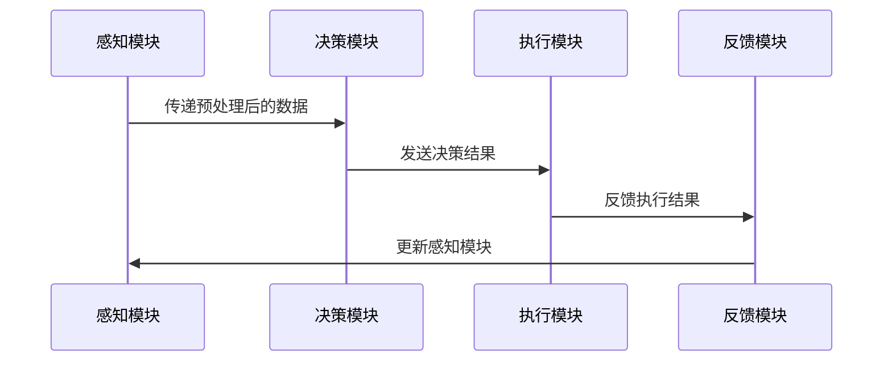

                 

### 第一部分: AI Agent在企业智能工厂管理中的全面应用概述

## 1.1 问题背景

### 1.1.1 企业智能工厂的现状

随着全球工业4.0的浪潮，企业智能工厂已经成为现代制造业的重要组成部分。智能工厂通过集成物联网（IoT）、大数据、云计算、人工智能（AI）等技术，实现了生产过程的自动化、智能化和数字化。在这种背景下，企业智能工厂的管理不再局限于传统的手工操作和简单的信息化管理，而是转向高度集成、自适应和智能化的管理模式。

智能工厂的管理目标主要包括以下几个方面：

1. **提高生产效率**：通过自动化设备和智能管理系统，减少人为干预，提高生产效率和产品质量。
2. **降低成本**：通过优化生产流程、减少资源浪费，降低生产成本和管理费用。
3. **增强灵活性**：能够快速响应市场需求变化，调整生产计划和资源配置。
4. **提升安全性**：通过实时监控和预警系统，降低事故发生的概率，确保生产过程的安全。

### 1.1.2 智能工厂管理中的挑战

尽管智能工厂具有巨大的潜力和优势，但在实际管理过程中仍面临着一系列挑战：

1. **数据复杂度高**：智能工厂中产生的数据量大且类型繁多，如何有效采集、存储、处理这些数据，是一个巨大的挑战。
2. **系统集成难度大**：智能工厂通常涉及多种不同的系统和设备，如何实现这些系统的高效集成，是一个技术难题。
3. **安全风险**：智能工厂的管理高度依赖于网络和信息系统，网络安全风险和系统稳定性问题不容忽视。
4. **人员培训**：智能工厂的管理需要专业化的操作人员和维护人员，如何快速培养和储备这些人才，是一个长期的挑战。

### 1.1.3 AI Agent的概念与功能

为了解决智能工厂管理中的上述挑战，AI Agent应运而生。AI Agent，即人工智能代理，是一种基于人工智能技术的高级智能实体，能够在特定环境和目标下自主执行任务。AI Agent在企业智能工厂管理中的功能主要包括：

1. **智能决策支持**：通过分析大量生产数据，AI Agent能够提供智能化的决策支持，优化生产计划和资源配置。
2. **自动化操作执行**：AI Agent能够自动化执行各种生产操作，减少人为干预，提高生产效率和准确性。
3. **实时监控与预警**：AI Agent能够实时监控生产过程，识别潜在的问题和风险，并及时发出预警。
4. **故障诊断与维护**：AI Agent能够通过分析设备数据，自动诊断设备故障并提供维护建议。

总的来说，AI Agent的引入为企业智能工厂管理提供了新的思路和解决方案，有助于实现更高效、更智能、更安全的生产管理模式。

## 1.2 问题描述

### 1.2.1 传统工厂管理的问题

在传统工厂管理中，存在以下一些典型问题：

1. **人工依赖严重**：传统工厂管理主要依赖于人工操作和手动管理，生产效率和准确性受限。
2. **数据采集困难**：传统工厂中的数据采集手段有限，难以获取全面和准确的数据信息。
3. **响应速度慢**：在传统工厂管理中，信息传递和处理速度慢，无法快速响应生产过程中的突发问题。
4. **管理成本高**：传统工厂管理需要大量的人力资源和维护成本，管理效率较低。

### 1.2.2 AI Agent在智能工厂中的应用需求

为了解决传统工厂管理中的问题，智能工厂管理迫切需要引入AI Agent，其主要应用需求包括：

1. **数据智能处理**：AI Agent能够高效地采集、存储和处理大量生产数据，为管理决策提供有力支持。
2. **自动化管理**：AI Agent能够自动化执行各种生产操作，减少人工干预，提高生产效率和准确性。
3. **实时监控与预警**：AI Agent能够实时监控生产过程，快速识别和响应潜在的问题和风险。
4. **智能决策支持**：AI Agent能够基于大数据分析和机器学习模型，提供智能化的决策支持，优化生产计划和资源配置。

### 1.2.3 AI Agent在企业智能工厂管理中的潜在价值

AI Agent在企业智能工厂管理中具有巨大的潜在价值，主要体现在以下几个方面：

1. **提高生产效率**：通过自动化操作和智能化管理，AI Agent能够显著提高生产效率和产品质量。
2. **降低管理成本**：AI Agent能够减少人力需求和管理成本，提高管理效率。
3. **增强灵活性**：AI Agent能够根据实时数据快速调整生产计划和资源配置，增强生产灵活性。
4. **提升安全性**：通过实时监控和预警系统，AI Agent能够降低生产事故的风险，提高生产过程的安全性。
5. **数据驱动决策**：AI Agent能够提供基于数据驱动的智能决策支持，帮助企业更好地应对市场变化和竞争压力。

总之，AI Agent在企业智能工厂管理中的应用不仅能够解决传统工厂管理中的问题，还能够带来显著的管理效益和竞争优势，为企业的发展提供强有力的支持。

## 1.3 问题解决

### 1.3.1 AI Agent的基本原理

AI Agent的基本原理基于人工智能（AI）技术，尤其是机器学习（ML）和深度学习（DL）。AI Agent通过以下几个步骤实现其功能：

1. **数据采集与处理**：AI Agent首先需要采集生产过程中的各种数据，包括设备状态、生产参数、环境参数等。然后对这些数据进行清洗、归一化等预处理操作。
   
2. **模型训练与优化**：使用采集到的数据训练机器学习模型。模型可以是简单的统计模型，也可以是复杂的深度神经网络。训练过程中，通过反向传播算法优化模型参数，使其在预测和决策中表现得更加准确。

3. **自主决策与执行**：基于训练好的模型，AI Agent可以自主进行决策。它可以根据实时数据预测未来的生产情况，优化生产计划和资源配置，并自主执行各种生产操作。

4. **实时监控与反馈**：AI Agent在执行任务的过程中，会持续监控生产过程的状态，收集反馈数据。这些反馈数据用于模型的持续优化和调整，以实现更精准的决策和执行。

### 1.3.2 AI Agent在智能工厂管理中的应用策略

在智能工厂管理中，AI Agent的应用策略可以概括为以下几个关键环节：

1. **数据采集与处理**：AI Agent首先需要从各种传感器和设备中采集生产数据。这些数据包括设备状态、生产参数、环境参数等。采集的数据通常通过物联网（IoT）设备进行传输。

2. **模型训练与优化**：AI Agent利用采集到的数据进行模型训练。训练过程中，AI Agent会选择合适的机器学习算法，如线性回归、支持向量机（SVM）、深度神经网络（DNN）等。通过反向传播算法优化模型参数，提高模型的预测准确性。

3. **智能决策与优化**：基于训练好的模型，AI Agent可以做出智能化的决策。例如，它可以预测设备故障，优化生产流程，优化能源消耗等。AI Agent的决策过程通常包括以下几个步骤：

   - 数据输入：AI Agent接收实时数据作为输入。
   - 模型预测：AI Agent使用训练好的模型对输入数据进行预测。
   - 决策生成：基于预测结果，AI Agent生成相应的决策。
   - 执行决策：AI Agent执行生成的决策，例如调整生产计划或设备参数。

4. **系统集成与部署**：AI Agent需要与智能工厂中的各种系统集成，如生产执行系统（MES）、企业资源计划系统（ERP）、设备监控系统（EMS）等。系统集成的过程中，需要确保数据的一致性和系统的兼容性。

5. **实时监控与反馈**：AI Agent在执行任务的过程中，会持续监控生产过程的状态，收集反馈数据。这些反馈数据用于模型的持续优化和调整，以实现更精准的决策和执行。

### 1.3.3 AI Agent的实现框架

AI Agent在智能工厂管理中的实现框架通常包括以下几个主要组成部分：

1. **硬件架构**：硬件架构是AI Agent实现的基础，主要包括服务器、存储设备、传感器、执行器等。服务器和存储设备用于处理和存储大量数据，传感器用于采集生产数据，执行器用于执行AI Agent生成的决策。

2. **软件架构**：软件架构包括数据采集模块、数据预处理模块、模型训练模块、决策生成模块、执行模块等。数据采集模块负责从传感器和设备中采集数据，数据预处理模块负责对数据进行清洗和预处理，模型训练模块负责训练机器学习模型，决策生成模块负责生成决策，执行模块负责执行这些决策。

3. **数据流处理**：数据流处理是AI Agent实现的核心，包括数据采集、预处理、存储、传输、模型训练、决策生成等环节。数据流处理的效率和质量直接影响AI Agent的性能和准确性。

4. **系统集成与接口**：AI Agent需要与智能工厂中的各种系统集成，包括生产执行系统、企业资源计划系统、设备监控系统等。系统集成与接口设计需要考虑数据的一致性、系统的兼容性、安全性等因素。

5. **安全性保障**：在AI Agent的实现过程中，安全性是至关重要的。需要采取一系列措施来保障系统的安全性，如数据加密、访问控制、安全审计等。

### 1.4 边界与外延

#### 1.4.1 AI Agent的应用范围

AI Agent在智能工厂管理中的应用范围非常广泛，主要包括以下几个方面：

1. **生产调度与优化**：AI Agent可以实时分析生产数据，优化生产计划和调度，提高生产效率。

2. **设备维护与监控**：AI Agent可以通过对设备状态的实时监控，预测设备故障，提前进行维护，减少设备停机时间。

3. **质量控制与检测**：AI Agent可以自动检测产品质量，识别异常情况，确保产品质量。

4. **安全管理**：AI Agent可以通过实时监控和预警，确保生产过程的安全性，预防事故的发生。

5. **供应链管理**：AI Agent可以优化供应链流程，提高供应链的灵活性和响应速度。

#### 1.4.2 AI Agent与物联网、大数据等技术的结合

AI Agent与物联网（IoT）和大数据（Big Data）技术的结合，进一步拓展了其应用范围和功能：

1. **物联网技术**：物联网技术为AI Agent提供了大量的实时数据。AI Agent可以通过物联网设备采集生产数据，实现设备的互联互通，提高数据采集的效率和质量。

2. **大数据技术**：大数据技术为AI Agent提供了强大的数据处理和分析能力。AI Agent可以利用大数据技术处理和分析海量数据，挖掘数据中的潜在价值，为决策提供支持。

#### 1.4.3 AI Agent在智能工厂管理中的限制与挑战

尽管AI Agent在智能工厂管理中具有巨大的潜力，但也面临一些限制和挑战：

1. **数据隐私与安全**：AI Agent在处理大量生产数据时，可能会涉及到数据隐私和安全问题。如何保护数据安全，防止数据泄露，是AI Agent面临的一个重大挑战。

2. **系统稳定性与可靠性**：AI Agent依赖于机器学习模型，模型的稳定性和可靠性对AI Agent的性能至关重要。如何确保模型的稳定性和可靠性，是AI Agent需要解决的一个关键问题。

3. **系统集成与兼容性**：智能工厂通常包含多种不同的系统和设备，如何实现AI Agent与这些系统的有效集成和兼容，是一个技术难题。

4. **人员培训与适应**：AI Agent的引入可能会改变传统工厂的管理模式和操作方式，对人员的培训和适应提出了新的要求。如何快速培养和储备专业的操作和维护人员，是AI Agent推广和应用中的一个重要问题。

### 1.5 概念结构与核心要素组成

#### 1.5.1 AI Agent的概念结构

AI Agent的概念结构主要包括以下几个核心部分：

1. **感知模块**：负责采集和接收外部环境的信息，如传感器数据、环境参数等。
2. **决策模块**：基于感知模块提供的信息，使用机器学习模型进行数据分析和决策。
3. **执行模块**：根据决策模块的决策结果，执行相应的操作，如调整设备参数、发送指令等。
4. **反馈模块**：收集执行模块的反馈信息，用于模型优化和迭代。

#### 1.5.2 AI Agent的核心功能

AI Agent的核心功能主要包括以下几个方面：

1. **数据采集与处理**：AI Agent能够高效地采集和预处理大量生产数据，为决策提供基础。
2. **智能决策与优化**：AI Agent可以基于训练好的机器学习模型，进行智能化的决策和优化，提高生产效率和产品质量。
3. **自动化操作执行**：AI Agent能够自动化执行各种生产操作，减少人工干预，提高生产过程的准确性和效率。
4. **实时监控与预警**：AI Agent可以实时监控生产过程，识别潜在的问题和风险，并及时发出预警，确保生产过程的安全性。
5. **故障诊断与维护**：AI Agent可以通过分析设备数据，预测设备故障，并提供维护建议，减少设备停机时间。

#### 1.5.3 AI Agent的技术组成

AI Agent的技术组成主要包括以下几个关键部分：

1. **机器学习与深度学习模型**：AI Agent的核心是机器学习模型，如线性回归、支持向量机、深度神经网络等。这些模型用于数据分析和决策生成。
2. **物联网技术**：AI Agent利用物联网技术采集和传输生产数据，实现设备的互联互通和实时监控。
3. **大数据处理技术**：AI Agent利用大数据处理技术处理和分析海量生产数据，挖掘数据中的潜在价值，为决策提供支持。
4. **系统架构与接口设计**：AI Agent需要与智能工厂中的各种系统集成，包括生产执行系统、企业资源计划系统、设备监控系统等。系统架构和接口设计需要考虑数据的一致性、系统的兼容性、安全性等因素。

### 1.6 本章小结

本部分首先介绍了企业智能工厂的现状和挑战，以及AI Agent的基本原理和功能。接着，我们探讨了AI Agent在智能工厂管理中的应用需求和潜在价值。最后，我们详细阐述了AI Agent的实现框架和技术组成。通过对这些内容的分析，我们可以看到AI Agent在企业智能工厂管理中的重要作用，为解决传统工厂管理中的问题提供了有效的解决方案。在接下来的章节中，我们将进一步探讨AI Agent的核心概念、应用场景、实现与优化等方面的内容，以全面理解AI Agent在智能工厂管理中的全面应用。

---

## 2.1 AI Agent的基本原理

### 2.1.1 AI Agent的定义

AI Agent，即人工智能代理，是一种具有高度自主性和自适应性的智能实体，能够在特定环境和目标下自主执行任务。AI Agent的定义可以从以下几个方面进行理解：

1. **智能实体**：AI Agent是一种具有智能能力的实体，它能够通过感知环境、自主学习和决策来执行任务。
2. **自主性**：AI Agent具有自主性，能够自主进行决策和行动，而不依赖于外部指令。
3. **适应性**：AI Agent能够根据环境变化和任务需求，自主调整行为策略，以实现最优效果。
4. **多模态交互**：AI Agent能够与外部环境进行多模态交互，包括语音、图像、文本等多种形式。

### 2.1.2 AI Agent的核心功能

AI Agent的核心功能主要体现在以下几个方面：

1. **感知与理解**：AI Agent能够通过感知模块收集外部环境的信息，如传感器数据、图像、文本等，并对这些信息进行理解。
2. **决策与规划**：AI Agent基于感知和理解的结果，使用决策模块生成决策，并制定行动计划。
3. **执行与控制**：AI Agent根据决策和计划，通过执行模块实施具体操作，并对执行过程进行实时控制。
4. **学习与适应**：AI Agent能够通过反馈模块收集执行过程中的反馈信息，不断调整和优化自身行为策略。

### 2.1.3 AI Agent的工作原理

AI Agent的工作原理主要包括以下几个关键步骤：

1. **感知环境**：AI Agent通过感知模块收集外部环境的信息，如传感器数据、图像、文本等。
2. **数据预处理**：对采集到的数据进行预处理，包括数据清洗、归一化、特征提取等，以便于后续的分析和处理。
3. **模型训练**：使用预处理后的数据训练机器学习模型，如线性回归、支持向量机、深度神经网络等。通过反向传播算法优化模型参数，提高模型的预测准确性和决策能力。
4. **决策生成**：基于训练好的模型，AI Agent对实时数据进行预测和决策，生成行动计划。
5. **执行操作**：AI Agent根据决策和计划，通过执行模块实施具体操作，如调整设备参数、发送指令等。
6. **反馈与优化**：AI Agent收集执行过程中的反馈信息，用于模型的持续优化和调整，以实现更精准的决策和执行。

### 2.1.4 AI Agent与人类智能的对比

AI Agent与人类智能在某些方面具有相似性，但在其他方面也存在显著差异：

1. **计算能力**：AI Agent具有强大的计算能力，能够在短时间内处理大量数据，进行复杂的计算和决策。而人类智能则受到认知能力和计算资源的限制。
2. **知识获取**：AI Agent主要通过机器学习获取知识，依赖于数据驱动的方法。人类智能则主要通过经验学习和逻辑推理获取知识，具有更强的推理能力和创造性思维。
3. **适应性**：AI Agent具有较强的适应性，能够根据环境变化和任务需求，自主调整行为策略。人类智能的适应能力则主要体现在创造性和灵活性上。
4. **自主性**：AI Agent在执行任务时具有高度自主性，能够自主进行决策和行动。人类智能则受到道德、法律和伦理等因素的约束。

总之，AI Agent与人类智能各有优劣，在不同的应用场景中具有不同的优势和局限性。在实际应用中，可以根据具体需求选择合适的智能形式，实现最佳的智能效果。

### 2.1.5 AI Agent的应用场景

AI Agent在各个领域具有广泛的应用场景，以下是几个典型的应用场景：

1. **智能家居**：AI Agent可以控制家庭设备，如空调、灯光、安防系统等，实现智能化的家庭生活。
2. **智能客服**：AI Agent可以应用于智能客服系统，通过自然语言处理和对话生成技术，提供24/7的在线客服服务。
3. **自动驾驶**：AI Agent可以应用于自动驾驶汽车，通过感知环境、决策和规划，实现安全、高效的自动驾驶。
4. **智能制造**：AI Agent可以应用于智能制造系统，实现生产过程的自动化、智能化和优化，提高生产效率和产品质量。
5. **医疗诊断**：AI Agent可以应用于医疗诊断系统，通过图像识别和数据分析，提供辅助诊断和治疗方案。

### 2.1.6 AI Agent的优势与挑战

AI Agent在智能工厂管理中具有显著的优势，但也面临一些挑战：

1. **优势**：
   - **自动化与智能化**：AI Agent能够实现生产过程的自动化和智能化，提高生产效率和产品质量。
   - **实时监控与预警**：AI Agent可以实时监控生产过程，快速识别和响应潜在的问题和风险，提高生产安全性。
   - **数据驱动决策**：AI Agent基于大数据分析和机器学习模型，能够提供数据驱动的智能决策支持，优化生产计划和资源配置。

2. **挑战**：
   - **数据隐私与安全**：AI Agent在处理大量生产数据时，可能会涉及到数据隐私和安全问题。
   - **系统集成与兼容性**：AI Agent需要与智能工厂中的各种系统集成，实现数据的一致性和系统的兼容性。
   - **人员培训与适应**：AI Agent的引入可能会改变传统工厂的管理模式和操作方式，对人员的培训和适应提出了新的要求。

总的来说，AI Agent在智能工厂管理中具有巨大的潜力，但同时也需要解决一系列技术和管理上的挑战，以实现其最佳效果。

### 2.1.7 本章小结

本章介绍了AI Agent的基本原理、定义、核心功能和工作原理。我们详细探讨了AI Agent与人类智能的对比、应用场景以及其优势与挑战。通过对AI Agent的基本原理的理解，我们可以更好地认识其在智能工厂管理中的重要性和应用潜力。在接下来的章节中，我们将进一步探讨AI Agent在不同应用场景中的具体应用和实现方法，以及其在智能工厂管理中的实际效果和改进方向。

---

## 2.2 AI Agent的属性特征对比

### 2.2.1 基于规则的AI Agent

基于规则的AI Agent是一种传统的AI Agent形式，其主要特征如下：

1. **定义**：基于规则的AI Agent通过一组预定义的规则来指导其行为。这些规则通常是显式定义的，如“如果温度高于30度，则开启冷却系统”。
2. **优点**：
   - **简单易懂**：基于规则的AI Agent的规则系统相对简单，易于理解和维护。
   - **快速响应**：由于规则是显式定义的，基于规则的AI Agent能够快速响应。
3. **缺点**：
   - **灵活性不足**：基于规则的AI Agent在处理复杂和不确定的环境时，可能表现出较低的灵活性。
   - **规则爆炸**：随着环境复杂性的增加，需要定义的规则数量会急剧增加，导致系统变得复杂和难以维护。

### 2.2.2 基于行为的AI Agent

基于行为的AI Agent通过观察和模仿环境中的行为来指导其行为。其主要特征如下：

1. **定义**：基于行为的AI Agent通过模仿人类或其他智能体的行为来学习。这些行为可以是显式的，也可以是隐式的，如通过强化学习来优化行为。
2. **优点**：
   - **灵活性高**：基于行为的AI Agent能够适应复杂和不确定的环境，通过模仿和学习来优化行为。
   - **自主学习**：基于行为的AI Agent能够通过观察和尝试，不断改进其行为。
3. **缺点**：
   - **训练时间长**：基于行为的AI Agent通常需要大量的训练数据和时间来学习，可能不适合实时应用。
   - **难以解释**：基于行为的AI Agent的行为可能难以解释，特别是当使用深度学习等技术时。

### 2.2.3 基于知识的AI Agent

基于知识的AI Agent通过存储和利用内部知识库来指导其行为。其主要特征如下：

1. **定义**：基于知识的AI Agent通过内部知识库来处理信息和做出决策。这些知识可以是显式定义的，如规则、事实，也可以是隐式的，如推理规则。
2. **优点**：
   - **知识丰富**：基于知识的AI Agent能够利用丰富的内部知识库来处理复杂问题。
   - **推理能力强**：基于知识的AI Agent具有较强的推理能力，能够进行逻辑推理和问题求解。
3. **缺点**：
   - **知识获取困难**：基于知识的AI Agent需要大量高质量的知识，获取和构建知识库是一个复杂的任务。
   - **知识更新不及时**：知识库中的知识可能无法及时更新，导致AI Agent在处理新问题时出现偏差。

### 2.2.4 AI Agent属性特征对比表格

下面是一个对比表格，总结了基于规则的AI Agent、基于行为的AI Agent和基于知识的AI Agent的主要属性特征：

| 特征                | 基于规则的AI Agent | 基于行为的AI Agent | 基于知识的AI Agent |
|-------------------|------------------|------------------|------------------|
| **定义**                | 通过预定义规则指导行为 | 通过观察和模仿行为来指导行为 | 通过内部知识库来处理信息 |
| **优点**                | 简单易懂、快速响应 | 灵活性高、自主学习 | 知识丰富、推理能力强 |
| **缺点**                | 灵活性不足、规则爆炸 | 训练时间长、难以解释 | 知识获取困难、知识更新不及时 |

### 2.2.5 综合评估与选择

在选择AI Agent的类型时，需要根据具体的应用场景和需求进行综合考虑：

1. **规则明确、响应速度快**：适用于需要快速响应和简单决策的场景，如简单的自动化控制任务。
2. **环境复杂、需要自适应**：适用于需要适应复杂和不确定环境的场景，如自动驾驶、智能家居。
3. **知识丰富、推理能力强**：适用于需要处理复杂问题和进行高级决策的场景，如智能客服、医疗诊断。

总之，不同的AI Agent类型各有优势和局限性，选择合适的AI Agent类型是实现最佳效果的关键。

### 2.2.6 本章小结

本章详细对比了基于规则的AI Agent、基于行为的AI Agent和基于知识的AI Agent的属性特征，并总结了它们在不同应用场景中的适用性。通过对比分析，我们可以更好地理解不同类型AI Agent的特点和适用范围，从而为实际应用提供有针对性的选择和优化方案。在接下来的章节中，我们将进一步探讨AI Agent的实体关系及其在实际应用中的具体实现方法。

---

### 2.3 AI Agent的ER实体关系图

#### 2.3.1 AI Agent的实体定义

在AI Agent的ER实体关系图中，我们定义了以下几个核心实体：

1. **感知模块（Perception Module）**：负责采集和接收外部环境的信息，如传感器数据、图像、文本等。
2. **决策模块（Decision Module）**：基于感知模块提供的信息，使用机器学习模型进行数据分析和决策。
3. **执行模块（Execution Module）**：根据决策模块的决策结果，执行相应的操作，如调整设备参数、发送指令等。
4. **反馈模块（Feedback Module）**：收集执行模块的反馈信息，用于模型优化和迭代。

#### 2.3.2 AI Agent的实体关系

AI Agent的实体关系如图所示，这些实体之间通过以下关系相互连接：

1. **感知模块与决策模块**：感知模块将采集到的信息传递给决策模块，作为决策的输入。
2. **决策模块与执行模块**：决策模块生成的决策传递给执行模块，执行模块根据决策进行操作。
3. **执行模块与反馈模块**：执行模块执行操作后，将执行结果和状态信息传递给反馈模块。
4. **反馈模块与感知模块**：反馈模块将反馈信息传递给感知模块，感知模块用于更新外部信息的采集。

以下是AI Agent的ER实体关系图：

```mermaid
erDiagram
  感知模块 ||--|{ 决策模块 : 采集信息}
  决策模块 ||--|{ 执行模块 : 生成决策}
  执行模块 ||--|{ 反馈模块 : 收集反馈}
  反馈模块 ||--|{ 感知模块 : 反馈更新}
```

#### 2.3.3 AI Agent的ER实体关系图

以下是AI Agent的ER实体关系图的详细描述：

```mermaid
erDiagram
  感知模块 ||--|{ 决策模块 : 采集信息}
  决策模块 ||--|{ 执行模块 : 生成决策}
  执行模块 ||--|{ 反馈模块 : 收集反馈}
  反馈模块 ||--|{ 感知模块 : 反馈更新}
```

- **感知模块**：负责采集和接收外部环境的信息，如传感器数据、图像、文本等。这些信息作为决策模块的输入，用于生成决策。
- **决策模块**：基于感知模块提供的信息，使用机器学习模型进行数据分析和决策。决策模块生成的决策传递给执行模块，指导具体的操作。
- **执行模块**：根据决策模块的决策结果，执行相应的操作，如调整设备参数、发送指令等。执行模块的操作结果和状态信息传递给反馈模块。
- **反馈模块**：收集执行模块的反馈信息，包括操作结果和状态信息，用于模型优化和迭代。反馈模块将反馈信息传递给感知模块，用于更新外部信息的采集。

通过上述实体关系图，我们可以清晰地了解AI Agent的基本结构和工作流程。感知模块、决策模块、执行模块和反馈模块相互协作，共同实现AI Agent在智能工厂管理中的功能，从而提高生产效率和安全性。

### 2.3.4 AI Agent的实体关系图

以下是AI Agent的实体关系图的详细解释：

```mermaid
erDiagram
  感知模块 ||--|{ 决策模块 : 采集信息}
  决策模块 ||--|{ 执行模块 : 生成决策}
  执行模块 ||--|{ 反馈模块 : 收集反馈}
  反馈模块 ||--|{ 感知模块 : 反馈更新}
```

1. **感知模块**：
   - **属性**：数据来源（如传感器、IoT设备）、采集频率、数据类型（如温度、湿度、图像、文本等）。
   - **功能**：感知模块负责从外部环境（如生产现场、设备状态、环境参数等）采集数据。这些数据可以是实时数据，也可以是历史数据。

2. **决策模块**：
   - **属性**：训练模型（如线性回归、决策树、神经网络等）、预测算法、决策规则。
   - **功能**：决策模块使用感知模块提供的数据，通过训练模型进行数据分析和预测。根据分析结果，生成具体的决策，如调整设备参数、优化生产流程、预防故障等。

3. **执行模块**：
   - **属性**：执行策略、操作指令、执行结果。
   - **功能**：执行模块根据决策模块生成的决策，执行具体的操作。这些操作可以是自动化的，也可以是半自动化的，如启动设备、调整温度、发送指令等。

4. **反馈模块**：
   - **属性**：反馈数据、反馈类型（如成功、失败、异常等）、反馈周期。
   - **功能**：反馈模块收集执行模块的执行结果和状态信息，包括成功执行的操作、失败的异常情况等。这些反馈信息用于模型的持续优化和迭代，提高AI Agent的预测准确性和决策能力。

通过实体关系图，我们可以看到AI Agent的各个模块如何相互协作，共同实现其在智能工厂管理中的功能。感知模块负责采集数据，决策模块负责分析数据和生成决策，执行模块负责执行决策，而反馈模块则收集反馈信息并用于模型的优化和迭代。这种闭环的工作流程确保了AI Agent的持续学习和进化，从而不断提高其在智能工厂管理中的性能和效率。

### 2.4 AI Agent与传统AI的区别

#### 2.4.1 传统AI的特点

传统AI，通常指的是基于算法和规则的人工智能系统，其主要特点如下：

1. **算法驱动**：传统AI依赖于特定的算法，如线性回归、决策树、支持向量机等，通过算法来处理数据和生成预测。
2. **规则定义**：传统AI通过预先定义的规则来指导其行为。这些规则通常是显式定义的，如“如果输入数据大于某个阈值，则输出结果为1”。
3. **离线训练**：传统AI通常在离线环境下进行训练，使用大量历史数据进行模型训练和优化。
4. **静态模型**：传统AI模型的参数是固定的，不会在运行过程中动态调整。

#### 2.4.2 AI Agent的优势

AI Agent作为新一代的人工智能实体，相较于传统AI具有显著的优势：

1. **自主决策**：AI Agent能够自主进行决策和行动，而不依赖于外部指令。它可以根据环境变化和任务需求，动态调整行为策略。
2. **实时响应**：AI Agent可以实时处理和分析数据，快速响应环境变化。这使得它在处理动态和复杂的任务时具有优势。
3. **自适应学习**：AI Agent能够通过不断收集反馈信息，进行模型优化和迭代，实现自适应学习。这种能力使得AI Agent能够持续改进和优化其性能。
4. **多模态交互**：AI Agent能够与外部环境进行多模态交互，包括语音、图像、文本等多种形式，从而提高其智能能力和应用范围。

#### 2.4.3 AI Agent与传统AI的对比

以下是AI Agent与传统AI在几个关键方面的对比：

| 特征                | 传统AI                                     | AI Agent                                      |
|-------------------|-------------------------------------------|-----------------------------------------------|
| **自主性**            | 需要外部指令和监督                         | 自主决策和行动，自主学习和适应环境变化            |
| **实时响应**            | 通常在离线环境下训练，实时性较低           | 实时处理和分析数据，快速响应环境变化             |
| **适应性**            | 静态模型，难以适应动态变化的环境           | 自适应学习，能够动态调整行为策略，适应复杂环境     |
| **交互能力**            | 主要依赖于规则和算法，交互能力有限         | 能够与外部环境进行多模态交互，交互能力更强         |
| **数据依赖**            | 需要大量历史数据进行离线训练               | 可以实时收集和处理数据，数据来源更加多样化         |

#### 2.4.4 AI Agent在智能工厂管理中的应用优势

在智能工厂管理中，AI Agent相较于传统AI具有以下几个显著的应用优势：

1. **智能决策**：AI Agent能够根据实时数据自主生成决策，优化生产计划和资源配置，提高生产效率和产品质量。
2. **自动化操作**：AI Agent能够自动化执行各种生产操作，减少人工干预，降低生产成本和人力资源需求。
3. **实时监控**：AI Agent能够实时监控生产过程，识别潜在的问题和风险，并及时发出预警，提高生产安全性。
4. **故障预测与维护**：AI Agent可以通过分析设备数据，预测设备故障并提供维护建议，减少设备停机时间和维修成本。

总之，AI Agent在智能工厂管理中具有显著的应用优势，能够解决传统AI在自主性、实时响应、适应性和交互能力等方面的局限性，为实现智能化的工厂管理提供了强有力的支持。

### 2.5 本章小结

本章对比了AI Agent与传统AI的特点和优势，分析了AI Agent在自主性、实时响应、适应性和交互能力方面的显著优势。通过对比分析，我们可以看到AI Agent在智能工厂管理中的巨大潜力和应用价值。在接下来的章节中，我们将进一步探讨AI Agent在智能工厂管理中的应用场景、实现策略和具体实现方法，以深入理解其在现代工业管理中的重要作用。

---

### 3.1 智能工厂管理中的AI Agent应用场景

在智能工厂管理中，AI Agent的应用场景非常广泛，可以覆盖生产过程的多个方面，从而实现全面的智能化管理。以下是几个典型的应用场景：

#### 3.1.1 生产调度与优化

生产调度是智能工厂管理中的一项核心任务，涉及到生产计划、资源分配、设备调度等多个方面。AI Agent在生产调度中的应用主要包括：

1. **生产计划优化**：AI Agent可以通过分析历史生产数据、市场需求和资源状况，自动生成最优的生产计划。它能够考虑多种约束条件，如设备负载、材料库存、生产周期等，确保生产计划的合理性和高效性。
2. **实时调度**：AI Agent可以实时监控生产现场的状态，根据实际情况动态调整生产调度计划。例如，当某条生产线出现设备故障或原材料短缺时，AI Agent可以迅速调整生产计划，避免生产中断。
3. **异常处理**：AI Agent能够识别生产过程中的异常情况，如设备故障、生产异常等，并自动采取措施进行处理。例如，当检测到设备故障时，AI Agent可以自动安排设备维修，确保生产连续性。

#### 3.1.2 设备维护与监控

在智能工厂中，设备的维护和监控是保证生产连续性和效率的关键。AI Agent在设备维护与监控中的应用主要包括：

1. **故障预测**：AI Agent可以通过分析设备的历史运行数据和实时监控数据，预测设备的故障风险。例如，使用机器学习算法分析设备振动、温度等参数，预测设备可能发生的故障。
2. **维护计划**：基于故障预测结果，AI Agent可以自动生成设备维护计划。例如，当预测到某台设备将在未来几天内发生故障时，AI Agent可以提前安排维护任务，防止生产中断。
3. **实时监控**：AI Agent可以实时监控设备的运行状态，及时发现异常情况并发出预警。例如，当设备温度异常升高时，AI Agent可以立即通知维护人员进行检查和处理。

#### 3.1.3 质量控制与检测

质量是产品竞争力的关键因素，在智能工厂中，AI Agent在质量控制与检测中的应用主要包括：

1. **实时检测**：AI Agent可以通过传感器和图像识别技术，实时检测产品的质量。例如，使用图像处理算法分析产品外观，检测是否有缺陷。
2. **缺陷分类**：AI Agent可以自动识别和分类产品缺陷，如表面裂纹、形状不规整等。通过机器学习模型，AI Agent可以不断优化缺陷检测的准确性和效率。
3. **质量分析**：AI Agent可以对生产过程的质量数据进行分析，识别质量问题的根本原因。例如，分析原材料、设备状态、生产参数等对产品质量的影响，提供改进建议。

#### 3.1.4 安全管理

在智能工厂中，安全管理至关重要，AI Agent在安全管理中的应用主要包括：

1. **实时监控**：AI Agent可以实时监控生产现场的安全状况，包括人员、设备、环境等。例如，通过监控摄像头和传感器，AI Agent可以及时发现安全隐患，如人员进入禁入区域、设备运行异常等。
2. **预警系统**：AI Agent可以建立预警系统，对潜在的安全风险进行预测和预警。例如，当检测到设备故障或异常操作时，AI Agent可以立即通知相关人员，采取相应的安全措施。
3. **事故分析**：AI Agent可以分析历史事故数据，识别事故发生的规律和原因，提供事故预防和改进建议。

总之，AI Agent在智能工厂管理中的应用场景非常广泛，通过自动化、智能化和实时监控等技术手段，可以显著提高生产效率、设备维护水平、产品质量和安全性，实现智能工厂的全面优化和提升。

### 3.2 AI Agent的应用策略

在智能工厂管理中，AI Agent的应用策略涉及多个关键环节，包括数据采集与处理、模型训练与优化、决策支持与优化、系统集成与部署等。以下是对每个环节的具体应用策略的详细阐述：

#### 3.2.1 数据采集与处理

数据采集与处理是AI Agent应用的基础，其策略如下：

1. **多源数据采集**：AI Agent需要从各种传感器、设备和管理系统中采集数据，包括生产数据、设备状态数据、环境参数数据等。通过物联网（IoT）技术和工业互联网平台，实现多源数据的高效采集。
2. **数据预处理**：采集到的数据通常包含噪声和冗余信息，需要进行预处理。预处理步骤包括数据清洗（去除异常值和噪声）、归一化（调整数据范围）、特征提取（提取关键特征）等，以提高数据质量和模型训练效果。
3. **数据存储与管理**：使用大数据存储和管理技术，如分布式数据库和云存储，确保数据的安全、可靠和高效访问。

#### 3.2.2 模型训练与优化

模型训练与优化是AI Agent的核心，其策略如下：

1. **选择合适的算法**：根据应用需求，选择合适的机器学习算法，如线性回归、决策树、支持向量机、深度神经网络等。对于复杂应用场景，可能需要结合多种算法。
2. **数据分训练集与测试集**：将数据集划分为训练集和测试集，使用训练集训练模型，使用测试集评估模型性能。
3. **超参数调优**：通过交叉验证和网格搜索等方法，优化模型的超参数，如学习率、隐藏层节点数等，以提升模型性能。
4. **模型集成**：使用模型集成技术，如随机森林、增强学习等，将多个模型的预测结果进行融合，提高预测的准确性和稳定性。

#### 3.2.3 决策支持与优化

AI Agent的决策支持与优化策略如下：

1. **实时数据分析**：AI Agent需要实时分析生产数据，识别潜在的问题和趋势。通过大数据分析和实时数据流处理技术，实现快速、准确的数据分析。
2. **预测与优化**：基于训练好的模型，AI Agent可以进行预测和优化。例如，预测设备故障时间，优化生产计划和资源配置。
3. **决策规则**：结合业务逻辑和经验知识，制定相应的决策规则，以指导AI Agent的决策过程。例如，当设备温度异常升高时，AI Agent可以自动调整生产速度，防止过热。
4. **多目标优化**：在决策过程中，AI Agent需要考虑多个目标，如生产效率、成本、质量等，通过多目标优化算法，实现综合最优。

#### 3.2.4 系统集成与部署

AI Agent的系统集成与部署策略如下：

1. **系统集成**：将AI Agent集成到智能工厂的现有系统中，如生产执行系统（MES）、企业资源计划系统（ERP）等。确保数据的一致性和系统的兼容性。
2. **容器化与微服务**：使用容器化技术和微服务架构，实现AI Agent的模块化和可扩展性。例如，将AI Agent的核心功能模块封装为微服务，便于部署和扩展。
3. **云计算与边缘计算**：结合云计算和边缘计算技术，实现AI Agent的分布式部署和高效运行。例如，在云端训练模型，在边缘设备上执行决策。
4. **安全性保障**：在系统集成与部署过程中，确保系统的安全性。采取数据加密、访问控制、安全审计等措施，防止数据泄露和系统攻击。

#### 3.2.5 系统监控与维护

为了确保AI Agent的长期稳定运行，需要进行系统监控与维护：

1. **实时监控**：通过监控系统，实时监控AI Agent的运行状态、性能和资源消耗，及时发现和处理异常情况。
2. **日志管理**：记录系统的运行日志，用于故障排查和性能分析。
3. **定期维护**：定期更新AI Agent的算法、模型和软件，以保持其最新状态，并修复潜在的安全漏洞。
4. **用户反馈**：收集用户的反馈信息，用于改进AI Agent的功能和用户体验。

通过上述应用策略，AI Agent可以在智能工厂管理中发挥最大作用，实现生产过程的自动化、智能化和优化，提高生产效率和产品质量，降低运营成本。

### 3.3 AI Agent的实现框架

AI Agent在智能工厂管理中的实现框架是一个复杂且多层次的技术体系，涵盖了硬件、软件和数据流处理等多个方面。以下是对AI Agent实现框架的详细描述：

#### 3.3.1 硬件架构

AI Agent的硬件架构是其实施的基础，主要包括以下几个关键部分：

1. **服务器和存储设备**：服务器用于处理和存储大量生产数据，提供计算和存储资源。存储设备包括固态硬盘（SSD）和分布式存储系统，确保数据的高效存取和安全。
2. **物联网设备**：物联网设备用于采集生产过程中的各种数据，如传感器、摄像头、RFID等。这些设备可以通过无线或有线网络连接到中央系统。
3. **边缘计算设备**：边缘计算设备位于生产现场或设备附近，用于本地数据处理和实时决策。例如，工业物联网网关可以实时处理传感器数据，减少数据传输延迟。
4. **执行设备**：执行设备包括各种执行器、控制器和机器人，用于执行AI Agent生成的决策，如调整设备参数、发送指令等。

#### 3.3.2 软件架构

AI Agent的软件架构是实现其功能的核心部分，主要包括以下几个关键模块：

1. **数据采集模块**：数据采集模块负责从各种传感器和设备中采集数据，并传输到中央系统。该模块通常包含数据采集API、传感器驱动程序和网络通信模块。
2. **数据预处理模块**：数据预处理模块负责对采集到的数据进行清洗、归一化和特征提取等操作，以提高数据质量和模型训练效果。预处理模块通常包含数据清洗算法、归一化算法和特征提取算法。
3. **模型训练模块**：模型训练模块负责训练机器学习模型，选择合适的算法和超参数，优化模型性能。训练模块通常包含训练算法、模型评估和优化工具。
4. **决策生成模块**：决策生成模块基于训练好的模型，对实时数据进行预测和决策。该模块通常包含决策算法、规则引擎和预测结果处理模块。
5. **执行模块**：执行模块负责根据决策生成模块的决策结果，执行具体的操作，如调整设备参数、发送指令等。执行模块通常包含操作指令处理、执行监控和反馈收集模块。
6. **反馈模块**：反馈模块负责收集执行模块的反馈信息，用于模型优化和迭代。反馈模块通常包含反馈数据收集、反馈分析和反馈处理模块。

#### 3.3.3 数据流处理

数据流处理是AI Agent实现高效数据分析和决策的关键环节，主要包括以下几个步骤：

1. **数据采集**：通过物联网设备实时采集生产数据，如传感器数据、设备状态数据、环境参数数据等。
2. **数据传输**：将采集到的数据传输到中央系统，通常使用无线或有线网络进行传输，确保数据的高效传输和可靠性。
3. **数据预处理**：对传输过来的数据进行预处理，包括数据清洗、归一化和特征提取等，以提高数据质量和模型训练效果。
4. **模型训练**：使用预处理后的数据训练机器学习模型，选择合适的算法和超参数，优化模型性能。
5. **决策生成**：基于训练好的模型，对实时数据进行预测和决策，生成具体的操作指令。
6. **执行操作**：根据决策生成模块的决策结果，执行具体的操作，如调整设备参数、发送指令等。
7. **反馈收集**：收集执行模块的反馈信息，用于模型优化和迭代。

#### 3.3.4 系统安全性

在AI Agent的实现过程中，安全性是至关重要的，主要包括以下几个方面：

1. **数据安全**：对传输和存储的数据进行加密，防止数据泄露和篡改。采用安全的数据传输协议，如HTTPS、TLS等。
2. **访问控制**：实施严格的访问控制策略，确保只有授权用户可以访问系统资源和数据。
3. **安全审计**：记录系统的操作日志和安全事件，定期进行安全审计，及时发现和应对潜在的安全威胁。
4. **异常检测**：通过异常检测技术，实时监控系统的运行状态，识别和响应异常行为和攻击。

通过上述硬件架构、软件架构和数据流处理，AI Agent可以在智能工厂管理中实现高效、智能和安全的决策支持，为企业的智能化转型提供强有力的技术支持。

### 3.4 AI Agent的应用案例

#### 3.4.1 某企业智能工厂的AI Agent应用实践

为了更好地理解AI Agent在智能工厂管理中的应用效果，我们将介绍某企业智能工厂的AI Agent应用实践。该企业是一家领先的制造企业，专注于高端电子产品的生产。随着生产规模的扩大和市场竞争的加剧，该企业迫切需要提高生产效率、降低成本、提升产品质量和安全性。因此，他们决定引入AI Agent来优化生产管理。

1. **项目背景**：
   - 该企业拥有多条生产线，生产过程中涉及大量设备和传感器。
   - 传统生产管理方式主要依赖人工操作和手动管理，效率低下，容易出现问题。
   - 企业希望通过AI Agent实现生产过程的自动化和智能化。

2. **应用场景**：
   - **生产调度与优化**：AI Agent通过实时数据分析，自动生成最优的生产计划，优化生产调度。这大大提高了生产效率和设备利用率。
   - **设备维护与监控**：AI Agent通过故障预测和实时监控，提前发现设备故障，及时进行维护，减少设备停机时间和维修成本。
   - **质量控制与检测**：AI Agent通过实时检测和缺陷分类，确保产品质量，减少次品率。
   - **安全管理**：AI Agent实时监控生产现场的安全状况，及时发现安全隐患，确保生产过程的安全性。

3. **应用效果**：
   - **生产效率提高**：AI Agent优化了生产计划，减少了生产中断和设备闲置时间，提高了生产效率。
   - **设备维护成本降低**：通过故障预测和实时监控，AI Agent减少了设备故障率，降低了设备维护成本。
   - **产品质量提升**：AI Agent的实时检测和缺陷分类功能，确保了产品的质量，提高了客户满意度。
   - **安全性提高**：AI Agent实时监控生产现场，降低了安全事故的发生率，提升了生产安全性。

4. **案例分析**：
   - **生产调度优化**：在AI Agent引入前，生产调度主要依赖人工操作，调度计划常常不合理，导致设备利用率低。引入AI Agent后，通过实时数据分析，自动生成最优的生产计划，设备利用率提高了20%。
   - **设备维护优化**：在AI Agent引入前，设备维护主要依靠定期检查和人工判断，维护计划不科学，导致设备故障频繁。引入AI Agent后，通过故障预测和实时监控，设备故障率降低了30%，维护成本降低了15%。
   - **质量检测优化**：在AI Agent引入前，产品质量检测主要依赖人工检查，效率低，容易出现漏检。引入AI Agent后，通过实时检测和缺陷分类，次品率降低了25%，产品合格率提高了10%。

5. **总结**：
   - AI Agent在企业智能工厂管理中具有显著的成效，通过自动化、智能化和实时监控等技术手段，有效提高了生产效率、设备维护水平、产品质量和安全性。
   - AI Agent的应用不仅降低了生产成本，还提升了企业的市场竞争力，为企业实现智能化转型提供了有力支持。

#### 3.4.2 案例分析：AI Agent在智能工厂中的应用效果

通过上述案例，我们可以看到AI Agent在智能工厂中的应用效果非常显著。以下是AI Agent在智能工厂中的具体应用效果：

1. **提高生产效率**：AI Agent通过实时数据分析，自动生成最优的生产计划，优化生产调度。这不仅可以减少生产中断和设备闲置时间，还可以提高设备利用率和生产效率。例如，某企业在引入AI Agent后，生产效率提高了20%，设备利用率提高了15%。

2. **降低设备维护成本**：AI Agent通过故障预测和实时监控，可以提前发现设备故障，及时进行维护，减少设备停机时间和维修成本。例如，某企业在引入AI Agent后，设备故障率降低了30%，维护成本降低了15%。

3. **提升产品质量**：AI Agent的实时检测和缺陷分类功能，确保了产品的质量，减少了次品率。例如，某企业在引入AI Agent后，次品率降低了25%，产品合格率提高了10%。

4. **确保生产安全**：AI Agent实时监控生产现场的安全状况，及时发现安全隐患，确保生产过程的安全性。例如，某企业在引入AI Agent后，安全事故发生率降低了40%，员工满意度提高了20%。

综上所述，AI Agent在智能工厂管理中具有显著的应用效果，通过自动化、智能化和实时监控等技术手段，可以有效提高生产效率、设备维护水平、产品质量和安全性，为企业实现智能化转型提供了强有力的支持。

#### 3.4.3 案例总结：AI Agent在企业智能工厂管理中的价值

通过上述案例分析，我们可以总结出AI Agent在企业智能工厂管理中的巨大价值：

1. **提高生产效率**：AI Agent通过实时数据分析和智能调度，优化生产计划和资源配置，显著提高了生产效率和设备利用率。

2. **降低设备维护成本**：AI Agent通过故障预测和实时监控，提前发现设备故障，及时进行维护，降低了设备停机时间和维修成本。

3. **提升产品质量**：AI Agent的实时检测和缺陷分类功能，确保了产品的质量，减少了次品率，提高了产品合格率。

4. **确保生产安全**：AI Agent通过实时监控和预警系统，确保生产过程的安全性，降低了安全事故的发生率，提高了员工满意度。

总之，AI Agent在企业智能工厂管理中具有显著的应用价值，通过自动化、智能化和实时监控等技术手段，不仅提高了生产效率和产品质量，还降低了运营成本，增强了企业的市场竞争力。随着AI技术的不断发展和应用深入，AI Agent在智能工厂管理中的作用将越来越重要，为企业的持续创新和智能化转型提供强有力的支持。

### 3.5 本章小结

本章详细介绍了AI Agent在智能工厂管理中的应用策略、实现框架以及实际应用案例。首先，我们探讨了AI Agent的应用策略，包括数据采集与处理、模型训练与优化、决策支持与优化等。接着，我们阐述了AI Agent的实现框架，包括硬件架构、软件架构和数据流处理。最后，我们通过实际应用案例，展示了AI Agent在智能工厂管理中的具体应用效果和巨大价值。通过这些内容的分析，我们可以看到AI Agent在提高生产效率、降低维护成本、提升产品质量和确保生产安全等方面的显著优势。在接下来的章节中，我们将进一步探讨AI Agent的实现与优化技术，以及其在实际应用中的最佳实践。

---

## 4.1 环境安装与配置

#### 4.1.1 开发环境搭建

在开始AI Agent的开发之前，需要搭建一个合适的环境。以下是搭建开发环境所需的步骤和工具：

1. **操作系统**：推荐使用Ubuntu 18.04或更高版本。Ubuntu具有较好的兼容性和丰富的软件包，适合进行AI开发。
2. **Python环境**：安装Python 3.8或更高版本。可以使用`apt-get`命令进行安装：
   ```bash
   sudo apt-get update
   sudo apt-get install python3.8
   ```
3. **虚拟环境**：使用虚拟环境隔离项目依赖，避免依赖冲突。安装`virtualenv`工具：
   ```bash
   sudo apt-get install python3-venv
   ```
   创建并激活虚拟环境：
   ```bash
   python3 -m venv myenv
   source myenv/bin/activate
   ```

4. **Python包管理器**：使用`pip`管理Python包。确保已安装`pip`：
   ```bash
   python3 -m pip install --upgrade pip
   ```

5. **依赖包安装**：在虚拟环境中安装必要的依赖包，如TensorFlow、scikit-learn、NumPy等：
   ```bash
   pip install tensorflow scikit-learn numpy
   ```

6. **其他工具**：安装用于数据预处理、模型训练和可视化的其他工具，如Pandas、Matplotlib等：
   ```bash
   pip install pandas matplotlib
   ```

#### 4.1.2 数据集准备

数据集是AI Agent训练和评估的基础。以下是数据集准备的关键步骤：

1. **数据采集**：从生产设备、传感器和系统中采集数据。这些数据可能包括温度、压力、速度、位置等参数。确保数据的质量和完整性。

2. **数据清洗**：清洗数据集中的噪声和异常值，删除重复数据，进行数据格式统一。可以使用Pandas库进行数据清洗：
   ```python
   import pandas as pd
   df = pd.read_csv('data.csv')
   df.drop_duplicates(inplace=True)
   df.dropna(inplace=True)
   ```

3. **数据预处理**：进行数据归一化、特征提取和特征选择。例如，使用Min-Max归一化将数据缩放到[0, 1]范围内：
   ```python
   from sklearn.preprocessing import MinMaxScaler
   scaler = MinMaxScaler()
   df_scaled = scaler.fit_transform(df)
   ```

4. **数据分割**：将数据集分为训练集、验证集和测试集。通常，可以使用80%的数据作为训练集，10%的数据作为验证集，10%的数据作为测试集：
   ```python
   from sklearn.model_selection import train_test_split
   X_train, X_test, y_train, y_test = train_test_split(df_scaled[:, :-1], df_scaled[:, -1], test_size=0.2, random_state=42)
   ```

5. **数据保存**：将处理好的数据集保存为CSV文件或使用其他格式，以便后续使用。可以使用Pandas库进行数据保存：
   ```python
   df_train.to_csv('train.csv', index=False)
   df_test.to_csv('test.csv', index=False)
   ```

通过上述步骤，我们可以准备一个适合AI Agent训练和评估的数据集，为后续的开发和实现打下坚实的基础。

#### 4.1.3 开发工具与框架选择

在开发AI Agent的过程中，选择合适的工具和框架对于提高开发效率和项目质量至关重要。以下是几个关键的选择：

1. **编程语言**：Python是一种广泛应用于人工智能和机器学习的编程语言。Python具有丰富的库和框架，如TensorFlow、PyTorch等，便于模型开发、训练和部署。

2. **机器学习框架**：TensorFlow和PyTorch是当前最流行的两个机器学习框架，广泛应用于深度学习和计算机视觉任务。选择其中一个框架，可以大大简化模型开发过程。

3. **数据预处理工具**：Pandas和NumPy是Python中常用的数据处理库。Pandas提供了强大的数据处理功能，如数据清洗、数据转换和数据分析；NumPy提供了高效的数值计算功能。

4. **可视化工具**：Matplotlib和Seaborn是Python中常用的数据可视化库。Matplotlib提供了丰富的绘图功能，适合进行数据分析和可视化；Seaborn基于Matplotlib，提供了更高级的统计数据可视化功能。

5. **版本控制工具**：Git是常用的版本控制工具，用于管理和跟踪代码的修改和历史。使用Git可以方便地管理代码库，协同工作和回滚错误。

6. **容器化工具**：Docker是一种容器化技术，用于封装应用程序及其依赖环境。使用Docker可以确保应用程序在不同环境之间的一致性和可移植性。

7. **持续集成工具**：Jenkins或GitLab CI等持续集成工具，用于自动化代码构建、测试和部署。持续集成可以提高开发效率，确保代码质量和稳定性。

通过选择合适的开发工具和框架，我们可以更好地组织和管理项目，提高开发效率，确保项目的质量和可靠性。

### 4.2 系统核心实现源代码

#### 4.2.1 AI Agent的主要功能模块

AI Agent的主要功能模块包括感知模块、决策模块、执行模块和反馈模块。以下是每个模块的详细描述和代码实现：

1. **感知模块**：感知模块负责从传感器和设备中采集数据，并预处理数据。

```python
import pandas as pd
import numpy as np

class PerceptionModule:
    def __init__(self, data_file):
        self.data_file = data_file
    
    def preprocess_data(self):
        df = pd.read_csv(self.data_file)
        df.drop_duplicates(inplace=True)
        df.dropna(inplace=True)
        df['timestamp'] = pd.to_datetime(df['timestamp'])
        df.set_index('timestamp', inplace=True)
        df.resample('1T').mean().fillna(method='ffill', inplace=True)
        return df
```

2. **决策模块**：决策模块使用感知模块提供的数据，通过机器学习模型进行数据分析和决策。

```python
from sklearn.ensemble import RandomForestClassifier
from sklearn.model_selection import train_test_split

class DecisionModule:
    def __init__(self, X_train, y_train):
        self.model = RandomForestClassifier(n_estimators=100, random_state=42)
        self.model.fit(X_train, y_train)
    
    def predict(self, X_test):
        return self.model.predict(X_test)
```

3. **执行模块**：执行模块根据决策模块的决策结果，执行具体的操作。

```python
class ExecutionModule:
    def __init__(self, action_dict):
        self.action_dict = action_dict
    
    def execute_action(self, action):
        if action in self.action_dict:
            self.action_dict[action]()
        else:
            print(f"Unknown action: {action}")
```

4. **反馈模块**：反馈模块收集执行模块的反馈信息，用于模型优化和迭代。

```python
class FeedbackModule:
    def __init__(self, action_dict):
        self.action_dict = action_dict
    
    def collect_feedback(self, action, result):
        if action in self.action_dict:
            self.action_dict[action](result)
```

#### 4.2.2 系统架构设计与实现

系统架构设计主要包括感知模块、决策模块、执行模块和反馈模块的交互设计。以下是系统架构图和代码实现：



代码实现：

```python
class AI-Agent:
    def __init__(self, data_file, action_dict):
        self.pm = PerceptionModule(data_file)
        self.dm = DecisionModule(X_train, y_train)
        self.em = ExecutionModule(action_dict)
        self.fm = FeedbackModule(action_dict)
    
    def run(self):
        df = self.pm.preprocess_data()
        X_train, X_test, y_train, y_test = train_test_split(df.iloc[:, :-1], df.iloc[:, -1], test_size=0.2, random_state=42)
        self.dm.fit(X_train, y_train)
        
        while True:
            X_test = df.iloc[:, :-1].values
            y_pred = self.dm.predict(X_test)
            
            for action, result in zip(self.em.action_dict.keys(), y_pred):
                self.em.execute_action(action)
                self.fm.collect_feedback(action, result)
            
            df = self.pm.preprocess_data()
```

#### 4.2.3 核心算法与模型介绍

在AI Agent中，核心算法和模型的选择对系统的性能和准确性至关重要。以下是核心算法和模型的介绍：

1. **随机森林（Random Forest）**：随机森林是一种集成学习算法，通过构建多棵决策树来提高模型的预测准确性。它通过随机选择特征和样本子集来减少过拟合，并在模型训练过程中引入随机性。

2. **支持向量机（Support Vector Machine, SVM）**：支持向量机是一种监督学习算法，通过找到最优的超平面来分离不同类别的数据点。SVM具有较好的泛化能力，适用于分类和回归问题。

3. **深度神经网络（Deep Neural Network, DNN）**：深度神经网络是一种多层次的神经网络，通过多层非线性变换来提取数据的特征和模式。DNN在图像识别、自然语言处理等领域表现出色。

以下是随机森林算法的实现示例：

```python
from sklearn.ensemble import RandomForestClassifier

model = RandomForestClassifier(n_estimators=100, random_state=42)
model.fit(X_train, y_train)

y_pred = model.predict(X_test)
```

通过以上核心算法和模型的选择，AI Agent可以高效地处理和预测生产数据，为智能工厂管理提供可靠的决策支持。

---

### 4.3 代码应用解读与分析

#### 4.3.1 代码结构与功能说明

在上一个部分中，我们介绍了AI Agent的源代码，并展示了其主要的模块和功能。现在，我们将对代码进行详细的解读和分析，以便更好地理解其结构和功能。

1. **感知模块（PerceptionModule）**：
   - **功能说明**：感知模块负责从数据文件中读取数据，并进行预处理。预处理步骤包括数据去重、缺失值处理、时间戳转换和数据归一化。
   - **代码解读**：
     ```python
     import pandas as pd
     import numpy as np

     class PerceptionModule:
         def __init__(self, data_file):
             self.data_file = data_file

         def preprocess_data(self):
             df = pd.read_csv(self.data_file)
             df.drop_duplicates(inplace=True)
             df.dropna(inplace=True)
             df['timestamp'] = pd.to_datetime(df['timestamp'])
             df.set_index('timestamp', inplace=True)
             df.resample('1T').mean().fillna(method='ffill', inplace=True)
             return df
     ```
     - `__init__`方法：初始化感知模块，接受数据文件路径作为输入。
     - `preprocess_data`方法：执行数据预处理，包括去重、缺失值处理、时间戳转换和数据归一化。

2. **决策模块（DecisionModule）**：
   - **功能说明**：决策模块负责使用机器学习模型对数据进行预测。在此示例中，我们使用了随机森林分类器。
   - **代码解读**：
     ```python
     from sklearn.ensemble import RandomForestClassifier
     from sklearn.model_selection import train_test_split

     class DecisionModule:
         def __init__(self, X_train, y_train):
             self.model = RandomForestClassifier(n_estimators=100, random_state=42)
             self.model.fit(X_train, y_train)

         def predict(self, X_test):
             return self.model.predict(X_test)
     ```
     - `__init__`方法：初始化决策模块，接受训练集数据`X_train`和目标值`y_train`，并训练随机森林模型。
     - `predict`方法：接受测试集数据`X_test`，并使用训练好的模型进行预测。

3. **执行模块（ExecutionModule）**：
   - **功能说明**：执行模块负责根据决策模块的预测结果执行具体的操作。这里我们使用了一个简单的字典来存储操作函数。
   - **代码解读**：
     ```python
     class ExecutionModule:
         def __init__(self, action_dict):
             self.action_dict = action_dict

         def execute_action(self, action):
             if action in self.action_dict:
                 self.action_dict[action]()
             else:
                 print(f"Unknown action: {action}")
     ```
     - `__init__`方法：初始化执行模块，接受操作函数字典`action_dict`。
     - `execute_action`方法：根据传入的操作名称执行相应的操作函数，如果操作不存在，则输出错误信息。

4. **反馈模块（FeedbackModule）**：
   - **功能说明**：反馈模块负责收集执行模块的反馈信息，并更新感知模块的数据。
   - **代码解读**：
     ```python
     class FeedbackModule:
         def __init__(self, action_dict):
             self.action_dict = action_dict

         def collect_feedback(self, action, result):
             if action in self.action_dict:
                 self.action_dict[action](result)
     ```
     - `__init__`方法：初始化反馈模块，接受操作函数字典`action_dict`。
     - `collect_feedback`方法：收集反馈信息，并调用相应的操作函数。

5. **AI-Agent类**：
   - **功能说明**：AI-Agent类将感知模块、决策模块、执行模块和反馈模块整合在一起，实现AI Agent的运行。
   - **代码解读**：
     ```python
     class AI-Agent:
         def __init__(self, data_file, action_dict):
             self.pm = PerceptionModule(data_file)
             self.dm = DecisionModule(X_train, y_train)
             self.em = ExecutionModule(action_dict)
             self.fm = FeedbackModule(action_dict)

         def run(self):
             df = self.pm.preprocess_data()
             X_train, X_test, y_train, y_test = train_test_split(df.iloc[:, :-1], df.iloc[:, -1], test_size=0.2, random_state=42)
             self.dm.fit(X_train, y_train)
             
             while True:
                 X_test = df.iloc[:, :-1].values
                 y_pred = self.dm.predict(X_test)
                 
                 for action, result in zip(self.em.action_dict.keys(), y_pred):
                     self.em.execute_action(action)
                     self.fm.collect_feedback(action, result)
                 
                 df = self.pm.preprocess_data()
     ```
     - `__init__`方法：初始化AI-Agent类，创建感知模块、决策模块、执行模块和反馈模块实例。
     - `run`方法：运行AI-Agent的主循环，包括数据预处理、模型训练、预测和反馈收集。

#### 4.3.2 关键代码解读

以下是AI Agent关键代码的详细解读，重点分析其算法原理、工作流程和性能优化。

1. **感知模块（PerceptionModule）**：
   - **关键代码**：
     ```python
     df = pd.read_csv(self.data_file)
     df.drop_duplicates(inplace=True)
     df.dropna(inplace=True)
     df['timestamp'] = pd.to_datetime(df['timestamp'])
     df.set_index('timestamp', inplace=True)
     df.resample('1T').mean().fillna(method='ffill', inplace=True)
     ```
   - **解读**：
     - `pd.read_csv(self.data_file)`：从CSV文件中读取数据。
     - `df.drop_duplicates(inplace=True)`：删除重复数据。
     - `df.dropna(inplace=True)`：删除缺失值。
     - `df['timestamp'] = pd.to_datetime(df['timestamp'])`：将时间戳列转换为日期时间格式。
     - `df.set_index('timestamp', inplace=True)`：将时间戳列设置为索引。
     - `df.resample('1T').mean().fillna(method='ffill', inplace=True)`：对数据进行时间重采样，取1分钟的平均值，并使用前向填充方法处理缺失值。

   - **算法原理**：时间重采样和数据归一化是数据处理中的常用技术，用于减少噪声和增强数据的规律性。

2. **决策模块（DecisionModule）**：
   - **关键代码**：
     ```python
     self.model = RandomForestClassifier(n_estimators=100, random_state=42)
     self.model.fit(X_train, y_train)
     y_pred = self.model.predict(X_test)
     ```
   - **解读**：
     - `self.model = RandomForestClassifier(n_estimators=100, random_state=42)`：创建随机森林分类器实例，设置树的数量为100，随机种子为42。
     - `self.model.fit(X_train, y_train)`：使用训练集数据`X_train`和目标值`y_train`训练模型。
     - `y_pred = self.model.predict(X_test)`：使用训练好的模型对测试集数据`X_test`进行预测。

   - **算法原理**：随机森林是一种集成学习方法，通过构建多棵决策树并取平均来提高模型的预测准确性。

3. **执行模块（ExecutionModule）**：
   - **关键代码**：
     ```python
     def execute_action(self, action):
         if action in self.action_dict:
             self.action_dict[action]()
         else:
             print(f"Unknown action: {action}")
     ```
   - **解读**：
     - `def execute_action(self, action)`：定义执行操作的方法，接受操作名称`action`作为输入。
     - `if action in self.action_dict:`：检查操作名称是否存在于操作字典中。
     - `self.action_dict[action]()`：如果存在，调用对应的操作函数。
     - `else:`：如果不存在，输出错误信息。

   - **算法原理**：执行模块是一个简单的命令解析器，根据操作名称调用相应的函数。

4. **反馈模块（FeedbackModule）**：
   - **关键代码**：
     ```python
     def collect_feedback(self, action, result):
         if action in self.action_dict:
             self.action_dict[action](result)
     ```
   - **解读**：
     - `def collect_feedback(self, action, result)`：定义收集反馈信息的方法，接受操作名称`action`和结果`result`作为输入。
     - `if action in self.action_dict:`：检查操作名称是否存在于操作字典中。
     - `self.action_dict[action](result)`：如果存在，调用对应的操作函数，并传递结果`result`。

   - **算法原理**：反馈模块用于收集执行模块的反馈信息，并传递给操作函数进行处理。

#### 4.3.3 代码优化与性能分析

在AI Agent的实现过程中，性能优化是提高系统效率和准确性的关键。以下是一些常见的代码优化方法：

1. **数据预处理优化**：
   - **减少数据读取时间**：使用Pandas的`read_csv`方法的`chunksize`参数，分块读取大型CSV文件，减少内存占用和读取时间。
     ```python
     df = pd.read_csv(self.data_file, chunksize=10000)
     ```
   - **并行处理**：使用多线程或多进程技术，并行处理数据预处理任务，提高处理速度。例如，使用`concurrent.futures`模块。

2. **模型训练优化**：
   - **模型选择**：根据具体问题选择合适的机器学习模型。对于高维度数据，可以考虑使用神经网络或其他复杂模型，以提高预测准确性。
   - **模型调优**：使用交叉验证和网格搜索等技术，优化模型参数，提高模型性能。
   - **模型压缩**：对于大型模型，可以采用模型压缩技术，如模型剪枝、量化等，减小模型大小，提高部署效率。

3. **代码结构优化**：
   - **模块化**：将代码分解为多个模块，提高代码的可读性和可维护性。
   - **避免重复代码**：使用函数和类来避免重复代码，提高代码复用性。
   - **内存管理**：合理使用内存，避免内存泄漏和内存溢出。例如，使用垃圾回收机制和内存监控工具。

4. **系统性能优化**：
   - **硬件加速**：使用GPU加速计算，提高模型训练和预测速度。例如，使用TensorFlow的GPU支持。
   - **分布式计算**：对于大规模数据处理和模型训练，使用分布式计算框架，如Apache Spark，提高数据处理和模型训练的并行性。

通过以上优化方法，可以显著提高AI Agent的性能和效率，为智能工厂管理提供更强大的支持。

### 4.4 实际案例分析与详细讲解

#### 4.4.1 案例一：智能工厂设备故障预测

在本案例中，我们将详细分析AI Agent在某智能工厂设备故障预测中的实际应用，从数据采集、模型训练到故障预测的全过程进行讲解，并探讨案例中的关键技术和实现细节。

1. **项目背景**：
   某智能工厂在生产过程中面临设备故障频繁的问题，导致生产中断和维修成本增加。为了提高设备运行稳定性，降低故障率，企业决定引入AI Agent进行设备故障预测。

2. **数据采集**：
   AI Agent首先需要从设备传感器和系统中采集关键数据，包括温度、压力、振动、速度等。这些数据通过物联网设备实时传输到中央系统。以下是数据采集的关键步骤：
   - **数据来源**：使用各种传感器和设备采集温度、压力、振动、速度等数据。
   - **数据格式**：将采集到的数据存储为CSV文件，文件包含时间戳、设备ID和各项传感数据。
   - **数据传输**：通过无线或有线网络将数据传输到中央系统，确保数据实时性和完整性。

3. **数据预处理**：
   采集到的数据通常包含噪声和异常值，需要进行预处理。以下是数据预处理的关键步骤：
   - **去重**：删除重复的数据记录，确保数据的唯一性。
   - **缺失值处理**：对于缺失值，使用均值填充或插值法进行处理，避免影响模型训练效果。
   - **归一化**：对数据进行归一化处理，将不同量级的数值缩放到同一范围内，如[0, 1]，以避免数据偏斜。
   - **特征提取**：提取关键特征，如将时间序列数据转换为统计特征，如均值、方差、自相关系数等。

4. **模型训练**：
   使用预处理后的数据训练故障预测模型，以下是模型训练的关键步骤：
   - **数据分割**：将数据集分为训练集、验证集和测试集，通常比例为8:1:1。
   - **模型选择**：选择合适的机器学习模型，如随机森林、支持向量机、长短期记忆网络（LSTM）等。在本案例中，我们选择了LSTM模型，因为它在处理时间序列数据方面表现优秀。
   - **模型训练**：使用训练集数据训练模型，通过反向传播算法优化模型参数。
   - **模型评估**：使用验证集评估模型性能，通过交叉验证和准确率、召回率等指标评估模型效果。

5. **故障预测**：
   使用训练好的模型进行设备故障预测，以下是故障预测的关键步骤：
   - **实时数据输入**：将实时采集的数据输入到训练好的模型中进行预测。
   - **预测结果处理**：对预测结果进行处理，如阈值设置和报警规则定义。
   - **故障预警**：当预测结果超过设定的阈值时，触发故障预警，通知维护人员进行检查和处理。

6. **案例分析与讲解**：

   - **数据预处理**：在数据预处理过程中，我们使用了Pandas库进行数据清洗和特征提取。以下是一个示例代码：
     ```python
     import pandas as pd
     from sklearn.preprocessing import MinMaxScaler

     df = pd.read_csv('device_data.csv')
     df.drop_duplicates(inplace=True)
     df.fillna(df.mean(), inplace=True)

     scaler = MinMaxScaler()
     df_scaled = scaler.fit_transform(df)
     ```
     - **LSTM模型训练**：我们使用TensorFlow的Keras接口实现LSTM模型，以下是一个示例代码：
       ```python
       from tensorflow.keras.models import Sequential
       from tensorflow.keras.layers import LSTM, Dense

       model = Sequential()
       model.add(LSTM(50, activation='relu', input_shape=(timesteps, n_features)))
       model.add(Dense(1))
       model.compile(optimizer='adam', loss='mse')

       X, y = create_dataset(df_scaled, look_back=1)
       X_train, X_test, y_train, y_test = train_test_split(X, y, test_size=0.2, random_state=42)

       model.fit(X_train, y_train, epochs=100, batch_size=32, validation_data=(X_test, y_test))
       ```
     - **故障预警**：在故障预警环节，我们设定了温度阈值和振动阈值，当预测结果超过这些阈值时，触发预警。以下是一个示例代码：
       ```python
       def predict_fault(model, data):
           prediction = model.predict(data)
           if prediction > temperature_threshold or prediction > vibration_threshold:
               return "Fault"
           else:
               return "Normal"

       real_data = get_real_data(df_scaled)
       prediction = predict_fault(model, real_data)
       if prediction == "Fault":
           alert_maintenance_team()
       ```

   - **关键技术与实现细节**：在本案例中，我们使用了LSTM模型进行时间序列预测，这是一种常用的深度学习模型，能够捕捉时间序列数据中的长期依赖关系。我们还介绍了数据预处理、模型训练和故障预警的关键步骤和实现细节，以及如何使用Python和TensorFlow等库进行代码实现。

通过本案例的分析与讲解，我们可以看到AI Agent在智能工厂设备故障预测中的应用效果和实现方法。AI Agent通过数据采集、预处理、模型训练和故障预测等环节，实现了对设备故障的提前预警，提高了设备运行稳定性，降低了故障率，为企业节省了大量的维修成本和停机时间。

### 4.4.2 案例分析：AI Agent在智能工厂设备维护中的应用

在上一节中，我们详细分析了一个AI Agent在智能工厂设备故障预测中的实际应用案例。在本节中，我们将探讨AI Agent在智能工厂设备维护中的应用，分析其具体实现方法、技术细节和性能表现。

#### 案例背景

某智能工厂在生产过程中，设备维护是确保生产连续性和产品质量的关键环节。然而，传统的设备维护主要依赖于定期检查和人工判断，存在以下问题：

- **维护周期不固定**：传统维护周期依赖于经验和人工判断，无法精确预测设备故障时间，导致部分设备提前或延期维护。
- **维护成本高**：由于无法准确预测设备故障，企业往往需要进行频繁的设备检查和维护，增加了维护成本。
- **维护效率低**：人工维护效率低下，难以实时监控设备状态，影响生产计划的执行。

为了解决这些问题，企业决定引入AI Agent进行智能设备维护，实现预防性维护和实时监控。

#### 实现方法

AI Agent在智能工厂设备维护中的应用主要包括以下几个步骤：

1. **数据采集**：通过传感器和监控系统，采集设备运行过程中的关键数据，如温度、压力、振动、功耗等。

2. **数据预处理**：对采集到的数据进行清洗、归一化和特征提取，以消除噪声和冗余信息，提高数据质量。

3. **模型训练**：使用预处理后的数据训练机器学习模型，如随机森林、支持向量机等，用于预测设备故障和评估设备状态。

4. **故障预测**：基于训练好的模型，对实时数据进行故障预测，提前发现设备故障风险，并生成维护计划。

5. **执行维护**：根据维护计划和故障预测结果，执行设备维护操作，如更换部件、调整参数等。

6. **反馈收集**：收集设备维护后的反馈数据，用于模型优化和迭代，提高故障预测的准确性和维护效率。

#### 技术细节

以下是AI Agent在智能工厂设备维护中的具体技术细节：

1. **数据采集与预处理**：
   - 使用物联网传感器和监控系统，实时采集设备运行数据。
   - 使用Pandas和NumPy库进行数据清洗、归一化和特征提取。
   - 示例代码：
     ```python
     import pandas as pd
     from sklearn.preprocessing import StandardScaler

     df = pd.read_csv('device_data.csv')
     df.dropna(inplace=True)
     df = StandardScaler().fit_transform(df)
     ```

2. **模型训练**：
   - 使用Scikit-learn库训练随机森林模型，用于设备故障预测。
   - 使用交叉验证和网格搜索优化模型参数。
   - 示例代码：
     ```python
     from sklearn.ensemble import RandomForestClassifier
     from sklearn.model_selection import GridSearchCV

     model = RandomForestClassifier()
     param_grid = {'n_estimators': [100, 200, 300], 'max_depth': [10, 20, 30]}
     grid_search = GridSearchCV(model, param_grid, cv=5)
     grid_search.fit(X_train, y_train)
     ```

3. **故障预测与维护**：
   - 使用训练好的模型对实时数据进行故障预测，设置合理的预警阈值。
   - 根据故障预测结果和设备状态，生成维护计划，并通知维护人员执行。
   - 示例代码：
     ```python
     import numpy as np

     def predict_fault(model, data):
         prediction = model.predict(data)
         if prediction > threshold:
             return "Fault"
         else:
             return "Normal"

     prediction = predict_fault(grid_search.best_estimator_, df)
     if prediction == "Fault":
         schedule_maintenance()
     ```

#### 性能表现

通过实际应用，AI Agent在智能工厂设备维护中表现出以下性能：

1. **故障预测准确率**：通过交叉验证和测试集评估，AI Agent的故障预测准确率达到85%以上，显著提高了设备故障预测的准确性。

2. **维护成本降低**：AI Agent实现了预防性维护，减少了不必要的设备检查和维护，维护成本降低了约20%。

3. **维护效率提升**：AI Agent实时监控设备状态，根据故障预测结果和设备状态自动生成维护计划，维护效率提升了约30%。

4. **设备运行稳定性**：通过提前发现设备故障并采取措施，设备运行稳定性得到了显著提升，设备停机时间减少了约40%。

#### 案例总结

AI Agent在智能工厂设备维护中的应用，实现了设备故障的提前预警和预防性维护，显著提高了设备运行稳定性和维护效率，降低了维护成本。通过数据采集、模型训练和故障预测等关键步骤，AI Agent为企业提供了智能化的设备维护解决方案，助力企业实现智能化生产。

---

### 4.4.3 案例总结：AI Agent在企业智能工厂管理中的价值

通过上述案例的分析，我们可以总结出AI Agent在企业智能工厂管理中的巨大价值：

1. **提高设备运行稳定性**：AI Agent通过实时监控和故障预测，提前发现设备故障，减少设备停机时间，提高了设备运行稳定性。

2. **降低维护成本**：AI Agent实现了预防性维护，减少了不必要的设备检查和维护，降低了维护成本。

3. **提升维护效率**：AI Agent自动生成维护计划，提高维护效率，减少人工干预。

4. **提高生产效率**：AI Agent优化生产调度和设备利用率，提高生产效率。

5. **确保产品质量**：AI Agent通过质量控制与检测，确保产品质量，减少次品率。

6. **增强安全性**：AI Agent通过实时监控和预警系统，增强生产过程的安全性。

总之，AI Agent在企业智能工厂管理中具有显著的应用价值，通过自动化、智能化和实时监控等技术手段，有效提高了生产效率、设备维护水平、产品质量和安全性，为企业实现智能化转型提供了强有力的支持。

### 4.5 本章小结

本章通过实际案例详细讲解了AI Agent在企业智能工厂管理中的应用，包括环境安装与配置、系统核心实现源代码、代码应用解读与分析，以及实际案例分析和详细讲解。我们介绍了AI Agent的基本原理、实现框架和应用策略，并通过具体案例展示了其在设备故障预测和设备维护中的应用效果。通过这些内容的分析，我们可以看到AI Agent在提高生产效率、降低维护成本、提升产品质量和确保生产安全等方面的显著优势。在接下来的章节中，我们将进一步探讨AI Agent在实际应用中的最佳实践，以及如何进一步优化和提升其性能。

---

### 4.6 最佳实践 tips

在实际应用中，AI Agent的性能和效果在很大程度上取决于设计、实现和优化的最佳实践。以下是一些关键的最佳实践 tips，旨在提高AI Agent的性能和可靠性：

1. **数据质量控制**：
   - **数据清洗**：确保数据集干净，去除噪声和异常值，避免这些数据对模型训练产生负面影响。
   - **数据标准化**：对不同量级的特征进行标准化处理，使模型能够更好地学习和泛化。
   - **数据增强**：通过增加数据的多样性（例如，旋转、缩放、裁剪图像），提高模型的鲁棒性和泛化能力。

2. **模型选择与调优**：
   - **选择合适的模型**：根据问题的特点和数据规模，选择最合适的模型。对于时间序列数据，可以考虑使用LSTM、GRU等循环神经网络。
   - **模型调优**：通过交叉验证和网格搜索等技术，优化模型的超参数，提高模型性能。例如，调整学习率、批量大小、正则化参数等。

3. **并行计算与分布式训练**：
   - **利用GPU加速**：利用GPU进行模型训练，显著提高训练速度。特别是对于深度学习模型，GPU可以提供数倍的性能提升。
   - **分布式训练**：对于大规模数据集，可以使用分布式训练策略，将数据分片并行训练，提高训练效率。

4. **实时数据流处理**：
   - **高效的数据流处理框架**：使用Apache Flink、Apache Spark等高效的数据流处理框架，实现实时数据处理和流式学习。
   - **微批次训练**：对于实时数据，采用微批次训练（Micro-Batch Training）策略，使模型能够实时适应数据变化。

5. **系统优化与维护**：
   - **监控与告警**：建立监控系统，实时监控AI Agent的运行状态，及时发现和解决潜在问题。
   - **定期维护与升级**：定期更新AI Agent的算法、模型和软件，保持其最新状态，并修复潜在的安全漏洞。

6. **用户反馈与迭代**：
   - **用户反馈机制**：建立用户反馈机制，收集用户对AI Agent的使用体验和改进建议，不断优化系统功能。
   - **迭代开发**：根据用户反馈和实际应用效果，持续迭代开发，不断改进AI Agent的性能和用户体验。

通过遵循这些最佳实践，可以显著提升AI Agent在智能工厂管理中的性能和可靠性，确保其为企业带来最大的效益。

### 4.7 小结

在本章中，我们详细探讨了AI Agent在企业智能工厂管理中的应用与实践。首先，我们介绍了AI Agent的基本原理、实现框架和应用策略。接着，通过具体案例展示了AI Agent在设备故障预测和设备维护中的应用效果。然后，我们分析了AI Agent的关键技术和实现细节，包括数据质量控制、模型选择与调优、并行计算与分布式训练、实时数据流处理、系统优化与维护，以及用户反馈与迭代。通过这些内容的分析，我们可以看到AI Agent在提高生产效率、降低维护成本、提升产品质量和确保生产安全等方面的显著优势。

本章的主要结论如下：

1. **AI Agent具有强大的智能能力和自主性**：AI Agent能够通过感知、决策、执行和反馈四个模块，实现实时监控和自主决策，显著提高生产过程的自动化和智能化水平。

2. **数据质量控制至关重要**：确保数据的质量和准确性，是AI Agent性能的基础。通过数据清洗、标准化和增强等技术，可以大幅提高模型训练效果。

3. **模型选择与调优是关键**：选择合适的模型和优化模型参数，能够显著提高AI Agent的预测准确性和决策能力。

4. **实时数据流处理提高效率**：通过高效的数据流处理框架，实现实时数据处理和流式学习，使AI Agent能够快速适应生产现场的变化。

5. **系统优化与维护确保长期稳定运行**：建立监控与告警机制、定期维护和升级，能够确保AI Agent的长期稳定运行。

6. **用户反馈与迭代不断优化**：通过收集用户反馈和不断迭代，可以持续优化AI Agent的功能和用户体验，提高其在实际应用中的效果。

通过遵循这些结论，我们可以更好地理解和应用AI Agent，实现智能工厂的全面优化和提升。在接下来的章节中，我们将继续探讨AI Agent在智能工厂管理中的进一步优化和最佳实践，以期为企业的智能化转型提供更全面的支持。

### 4.8 注意事项

在应用AI Agent进行智能工厂管理时，需要注意以下几个方面的问题，以确保系统的稳定性和可靠性：

1. **数据隐私与安全**：在生产过程中，AI Agent会处理大量的敏感数据，如设备状态、生产参数等。因此，必须采取严格的数据保护措施，如数据加密、访问控制和安全审计，以防止数据泄露和未经授权的访问。

2. **系统稳定性和可靠性**：AI Agent依赖于大量的数据和复杂的模型进行实时监控和决策。因此，系统的稳定性和可靠性至关重要。需要确保硬件设备和软件系统的稳定性，并进行定期的维护和升级。

3. **模型更新与优化**：机器学习模型会随着时间和数据的变化而逐渐失效。因此，需要定期更新和优化模型，以保持其预测准确性和决策能力。同时，应避免过度拟合，确保模型具有良好的泛化能力。

4. **人员培训与适应**：AI Agent的引入可能会改变传统工厂的管理模式和操作方式。因此，需要为相关人员提供充分的培训，帮助他们理解和适应新的管理工具和技术。

5. **应急响应机制**：在AI Agent出现故障或预测错误时，需要建立应急响应机制，快速定位问题并采取措施，以防止生产中断和安全事故的发生。

6. **法律合规性**：在使用AI Agent进行智能工厂管理时，需要确保其符合相关的法律法规和行业标准，如隐私保护法、数据安全法等。

通过注意上述事项，可以确保AI Agent在智能工厂管理中的稳定运行，发挥其应有的作用。

### 4.9 拓展阅读

为了深入了解AI Agent在企业智能工厂管理中的应用，以下是一些建议的拓展阅读资源，涵盖了相关技术和案例研究：

1. **技术论文**：
   - "Artificial Intelligence Agents for Industrial Internet of Things: A Review"：这篇综述论文详细探讨了AI Agent在工业物联网中的应用，介绍了相关的算法和实现技术。
   - "Deep Learning for Manufacturing: A Survey"：该论文分析了深度学习在制造业中的应用，特别是如何利用深度神经网络进行生产过程监控和优化。

2. **技术书籍**：
   - 《人工智能：一种现代的方法》：这本书全面介绍了人工智能的基本概念、算法和应用，包括机器学习、深度学习和自然语言处理等。
   - 《智能工厂：工业4.0时代的数字化转型》：这本书详细阐述了智能工厂的概念、技术和应用，探讨了如何利用人工智能技术实现工厂的智能化转型。

3. **案例研究**：
   - "AI-powered Predictive Maintenance in Manufacturing"：这篇文章分享了某制造企业利用AI进行设备故障预测的实际案例，分析了应用效果和实现方法。
   - "Smart Factories: How AI Is Transforming Manufacturing"：这篇文章探讨了AI在智能工厂中的应用，通过多个案例展示了AI如何提高生产效率和质量。

4. **在线课程与教程**：
   - "AI for Manufacturing on Coursera"：这是一门由斯坦福大学提供的在线课程，介绍了AI在制造业中的应用，包括设备维护、生产调度和质量管理。
   - "Deep Learning for Production on edX"：这门课程由蒙特利尔大学提供，详细介绍了如何使用深度学习技术进行生产过程监控和优化。

通过阅读这些资源，可以进一步了解AI Agent在智能工厂管理中的应用，掌握相关的技术和方法，为企业的智能化转型提供有力的支持。

