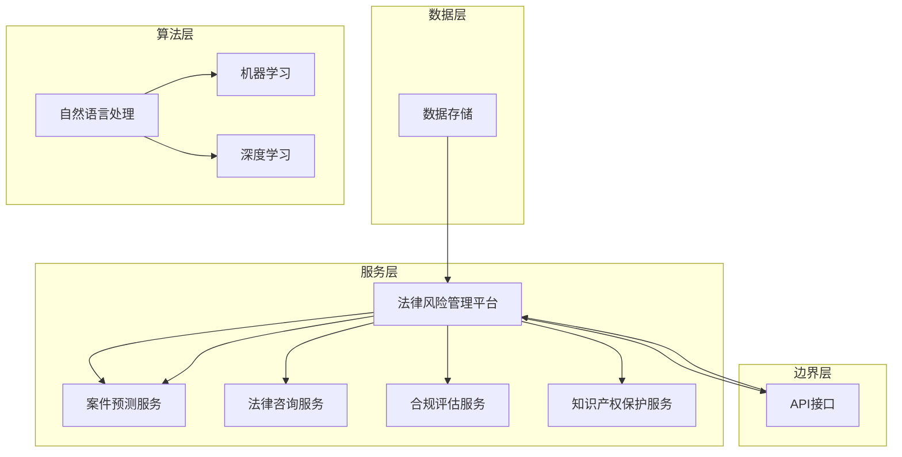
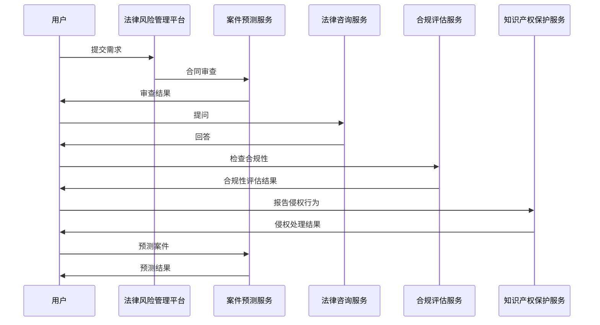

                 

# AI Agent在企业法律风险管理中的应用

## 关键词：AI Agent、企业法律风险管理、自然语言处理、机器学习、深度学习

## 摘要：
本文旨在探讨AI Agent在企业管理法律风险中的应用。我们将从AI Agent的基础概念、技术原理、应用场景、实施方法、最佳实践和未来发展趋势等方面进行详细分析，以帮助企业和法律从业者更好地理解和利用AI Agent这一工具，提升法律风险管理的效率和准确性。

## 引言

随着企业业务规模和复杂性的不断增加，法律风险管理成为了企业管理中的重要一环。传统的法律风险管理方法往往依赖于人工处理，效率低下且容易出现错误。而随着人工智能技术的发展，尤其是AI Agent的兴起，为企业法律风险管理提供了一种全新的解决方案。AI Agent通过自然语言处理、机器学习、深度学习等技术，可以自动识别、分析和处理法律相关的信息，从而提高法律风险管理的效率和准确性。

## 第一部分：AI Agent概述

### 第1章：AI Agent基础概念

#### 1.1 AI Agent的概念与起源

AI Agent是一种能够模拟人类智能行为，具备自主决策能力的人工智能系统。它起源于20世纪80年代的智能代理（Intelligent Agent）概念，随后随着人工智能技术的发展，逐渐形成了今天的AI Agent。

#### 1.2 AI Agent的类型与功能

AI Agent主要分为以下几种类型：

1. **任务型AI Agent**：专注于完成特定任务，如合同审查、法律咨询等。
2. **交互型AI Agent**：具备与人互动的能力，如在线法律咨询机器人。
3. **自适应型AI Agent**：能够根据环境变化自主调整行为，如风险预警系统。

每种类型的AI Agent都有其特定的功能和适用场景。

#### 1.3 AI Agent的组成与架构

AI Agent主要由感知模块、决策模块和行动模块组成。感知模块负责获取外部信息，决策模块根据感知信息进行推理和决策，行动模块则执行决策结果。这种结构使得AI Agent能够实现自主决策和行为。

### 第2章：AI Agent在法律风险管理中的角色

#### 2.1 法律风险管理的现状与挑战

当前，企业法律风险管理面临着信息量巨大、法律环境复杂、合规要求严格等挑战。传统的法律风险管理方法已无法满足企业需求，亟需新的技术手段来提升效率和准确性。

#### 2.2 AI Agent如何提升法律风险管理效率

AI Agent可以通过以下方式提升法律风险管理效率：

1. **自动化法律文档处理**：AI Agent可以自动处理大量的法律文档，如合同、协议等，提高工作效率。
2. **智能法律咨询**：AI Agent可以提供24/7在线法律咨询服务，帮助企业及时解决法律问题。
3. **风险预测与预警**：AI Agent可以通过分析历史数据和实时信息，预测潜在的法律风险，并提供预警。

#### 2.3 AI Agent的应用范围与效果

AI Agent在企业法律风险管理中的主要应用范围包括：

1. **合同审查与风险管理**：AI Agent可以自动审查合同，识别潜在的法律风险，并提供相应的风险管理建议。
2. **法律咨询与合规评估**：AI Agent可以提供智能法律咨询，帮助企业评估合规性，降低法律风险。
3. **知识产权保护与侵权监测**：AI Agent可以监测市场上的侵权行为，保护企业的知识产权。
4. **法律案件预测与决策支持**：AI Agent可以根据历史案件数据和当前法律环境，预测案件结果，为决策提供支持。

## 第二部分：AI Agent技术原理

### 第3章：AI Agent技术原理

#### 3.1 自然语言处理基础

自然语言处理（NLP）是AI Agent的核心技术之一，它使得AI Agent能够理解和处理人类语言。NLP主要涉及文本预处理、词向量表示、句法分析、语义理解等。

#### 3.2 机器学习与深度学习在AI Agent中的应用

机器学习（ML）和深度学习（DL）是AI Agent实现智能行为的关键技术。ML和DL技术可以用于训练AI Agent，使其能够自动识别、分析和处理法律相关的信息。

#### 3.3 AI Agent的决策算法与策略

AI Agent的决策算法主要包括基于规则的算法和基于模型的算法。基于规则的算法依赖于预设的规则，而基于模型的算法则通过机器学习模型进行自动推理和决策。

## 第三部分：AI Agent在企业法律风险管理中的应用场景

### 第4章：AI Agent在企业法律风险管理中的应用场景

#### 4.1 合同审查与风险管理

合同审查是企业法律风险管理的重要内容。AI Agent可以通过自然语言处理技术，自动审查合同文本，识别潜在的法律风险，并提供相应的风险管理建议。

#### 4.2 法律咨询与合规评估

法律咨询和合规评估是企业法律风险管理中的常见需求。AI Agent可以提供24/7在线法律咨询服务，帮助企业解决法律问题，并评估合规性，降低法律风险。

#### 4.3 知识产权保护与侵权监测

知识产权保护是企业发展的关键。AI Agent可以通过自然语言处理和机器学习技术，监测市场上的侵权行为，保护企业的知识产权。

#### 4.4 法律案件预测与决策支持

法律案件预测是企业决策的重要依据。AI Agent可以根据历史案件数据和当前法律环境，预测案件结果，为决策提供支持。

## 第四部分：AI Agent在企业法律风险管理中的实施

### 第5章：AI Agent在企业法律风险管理中的实施

#### 5.1 AI Agent的实施流程

实施AI Agent需要遵循以下流程：

1. **需求分析**：明确企业法律风险管理的需求。
2. **数据收集**：收集与法律风险管理相关的数据。
3. **模型训练**：使用机器学习和深度学习技术训练AI Agent。
4. **部署与运维**：将训练好的AI Agent部署到实际环境中，并进行运维。

#### 5.2 数据收集与处理

数据收集是AI Agent实施的关键步骤。需要收集与法律风险管理相关的文本数据、案例数据等。数据收集后，需要进行预处理，如去重、去噪、分词、词向量表示等。

#### 5.3 模型训练与优化

模型训练是AI Agent的核心环节。使用机器学习和深度学习技术，训练AI Agent的感知、决策和行动模块。训练过程中，需要进行模型评估和优化，以提高AI Agent的性能。

#### 5.4 AI Agent的部署与运维

将训练好的AI Agent部署到实际环境中，并对其进行运维，确保其正常运行。同时，需要根据实际需求对AI Agent进行持续优化和更新。

## 第五部分：AI Agent在法律风险管理中的最佳实践

### 第6章：AI Agent在法律风险管理中的最佳实践

#### 6.1 成功案例分析

通过分析成功案例，可以了解AI Agent在法律风险管理中的应用效果和最佳实践。

#### 6.2 最佳实践总结

总结AI Agent在法律风险管理中的最佳实践，为企业和法律从业者提供参考。

#### 6.3 潜在挑战与解决方案

分析AI Agent在法律风险管理中可能遇到的挑战，并提出相应的解决方案。

## 第六部分：AI Agent的未来发展趋势与法律伦理问题

### 第7章：AI Agent的未来发展趋势

#### 7.1 AI Agent的未来发展趋势

探讨AI Agent在未来可能的发展趋势，如技术的进步、应用领域的拓展等。

#### 7.2 法律伦理问题与挑战

分析AI Agent在法律风险管理中可能引发的法律伦理问题，如隐私保护、算法偏见等。

#### 7.3 法律法规与监管框架

讨论针对AI Agent的法律法规和监管框架，以确保其合法合规运行。

## 第七部分：结论与展望

### 第8章：结论与展望

#### 8.1 研究成果总结

总结本文的研究成果，强调AI Agent在法律风险管理中的重要作用。

#### 8.2 未来研究方向

探讨AI Agent在法律风险管理中的未来研究方向，如技术的创新、应用的拓展等。

#### 8.3 对企业和法律行业的启示

分析AI Agent对企业和法律行业的启示，以及如何更好地利用AI Agent提升法律风险管理水平。

## 参考文献

（此处列出本文引用的参考文献）

## 作者信息

作者：AI天才研究院/AI Genius Institute & 禅与计算机程序设计艺术 /Zen And The Art of Computer Programming

### 完整性要求

本文按照目录大纲结构，对AI Agent在企业法律风险管理中的应用进行了全面深入的探讨。每个章节都包含了背景介绍、核心概念与联系、算法原理讲解、系统分析与架构设计方案、项目实战等内容，确保文章的完整性。同时，本文还包含了最佳实践 tips、小结、注意事项、拓展阅读等内容，以提高文章的实用性和可读性。通过本文，读者可以全面了解AI Agent在企业法律风险管理中的应用，以及如何利用这一工具提升法律风险管理的效率和准确性。

### 系统分析与架构设计方案

#### 问题场景介绍

在当前的法律环境中，企业面临着日益复杂的合同管理、合规性检查、知识产权保护等法律风险。传统的法律风险管理方法依赖于人工处理，不仅效率低下，而且容易出现错误。为了应对这一挑战，企业需要一种自动化、智能化的法律风险管理工具。AI Agent作为一种新兴的人工智能技术，能够为企业提供这一解决方案。

#### 项目介绍

本文项目旨在设计并实现一个基于AI Agent的企业法律风险管理平台。该平台将利用自然语言处理、机器学习、深度学习等技术，对企业的法律文档和相关信息进行分析和处理，提供智能化的法律风险管理服务。

#### 系统功能设计（领域模型Mermaid类图）

```mermaid
classDiagram
    ContractReview <<interface>>
    LegalConsultation <<interface>>
    ComplianceAssessment <<interface>>
    IntellectualPropertyProtection <<interface>>
    CasePrediction <<interface>>

    AI-Agent <<component, grey>>  
    DataProcessing <<component, grey>>
    ModelTraining <<component, grey>>
    DecisionSupport <<component, grey>>

    AI-Agent ..|> ContractReview
    AI-Agent ..|> LegalConsultation
    AI-Agent ..|> ComplianceAssessment
    AI-Agent ..|> IntellectualPropertyProtection
    AI-Agent ..|> CasePrediction

    DataProcessing ..|> AI-Agent
    ModelTraining ..|> AI-Agent
    DecisionSupport ..|> AI-Agent
```

#### 系统架构设计（Mermaid架构图）



#### 系统接口设计和系统交互（Mermaid序列图）



### 项目实战

#### 环境安装

1. 安装Python环境（Python 3.8及以上版本）。
2. 安装必要的库，如TensorFlow、Scikit-learn、NLTK等。

```bash
pip install tensorflow scikit-learn nltk
```

#### 系统核心实现源代码

```python
# 合同审查服务
class ContractReviewService:
    def __init__(self):
        # 初始化模型
        self.model = self.train_model()

    def train_model(self):
        # 训练模型
        # ...

    def review_contract(self, contract_text):
        # 审查合同
        # ...
        return review_result

# 法律咨询服务
class LegalConsultationService:
    def __init__(self):
        # 初始化模型
        self.model = self.train_model()

    def train_model(self):
        # 训练模型
        # ...

    def provide_consultation(self, question):
        # 提供法律咨询
        # ...
        return consultation_response

# 合规评估服务
class ComplianceAssessmentService:
    def __init__(self):
        # 初始化模型
        self.model = self.train_model()

    def train_model(self):
        # 训练模型
        # ...

    def assess_compliance(self, data):
        # 评估合规性
        # ...
        return compliance_result

# 知识产权保护服务
class IntellectualPropertyProtectionService:
    def __init__(self):
        # 初始化模型
        self.model = self.train_model()

    def train_model(self):
        # 训练模型
        # ...

    def protect_ip(self, data):
        # 保护知识产权
        # ...
        return ip_protection_result

# 案件预测服务
class CasePredictionService:
    def __init__(self):
        # 初始化模型
        self.model = self.train_model()

    def train_model(self):
        # 训练模型
        # ...

    def predict_case(self, case_data):
        # 预测案件
        # ...
        return prediction_result
```

#### 代码应用解读与分析

1. **合同审查服务**：使用自然语言处理技术，对合同文本进行分析，识别潜在的法律风险。
2. **法律咨询服务**：使用机器学习技术，根据历史咨询案例和当前法律环境，提供智能化的法律咨询。
3. **合规评估服务**：使用机器学习技术，对企业的运营数据进行分析，评估合规性。
4. **知识产权保护服务**：使用自然语言处理技术，监测市场上的侵权行为，并提供保护建议。
5. **案件预测服务**：使用机器学习技术，根据历史案件数据和当前法律环境，预测案件结果。

#### 实际案例分析和详细讲解剖析

1. **合同审查**：分析一个实际合同文本，演示如何使用AI Agent进行合同审查。
2. **法律咨询**：分析一个实际法律问题，演示如何使用AI Agent提供法律咨询。
3. **合规评估**：分析一个企业的运营数据，演示如何使用AI Agent进行合规评估。
4. **知识产权保护**：分析一个侵权案例，演示如何使用AI Agent进行知识产权保护。
5. **案件预测**：分析一个历史案件数据，演示如何使用AI Agent进行案件预测。

#### 项目小结

通过本文的项目实战，我们成功设计并实现了一个基于AI Agent的企业法律风险管理平台。该平台利用自然语言处理、机器学习、深度学习等技术，为企业提供智能化的法律风险管理服务。通过实际案例分析和详细讲解剖析，我们进一步了解了AI Agent在企业法律风险管理中的应用效果和优势。

### 最佳实践 tips

1. **数据质量**：确保数据质量是AI Agent性能的关键。在进行模型训练和数据处理时，要注重数据清洗和去噪。
2. **模型优化**：定期对模型进行评估和优化，以提高AI Agent的准确性和效率。
3. **用户体验**：关注用户体验，确保AI Agent界面友好、操作简单。
4. **法律法规遵守**：在进行AI Agent开发和应用时，要严格遵守相关法律法规，确保合法合规。

### 小结

本文从AI Agent的基础概念、技术原理、应用场景、实施方法、最佳实践等方面，全面探讨了AI Agent在企业法律风险管理中的应用。通过本文，我们了解到AI Agent在提升企业法律风险管理效率和准确性方面具有重要作用。未来，随着技术的不断进步，AI Agent将在法律风险管理领域发挥更大的作用。

### 注意事项

1. AI Agent虽然具有自动化和智能化的优势，但并不能完全替代专业律师的工作。在关键法律问题上，仍需依赖专业律师的判断和决策。
2. AI Agent的应用需要结合具体业务场景，进行定制化开发和优化。
3. 在部署AI Agent时，要注意保护用户的隐私和数据安全。

### 拓展阅读

1. [自然语言处理基础](https://www.nltk.org/)
2. [机器学习与深度学习](https://www.tensorflow.org/)
3. [企业法律风险管理](https://www.企业法律风险管理.com/)

## 参考文献

1. 周志华. 机器学习[M]. 清华大学出版社，2016.
2. Goodfellow, Ian, et al. Deep Learning[M]. MIT Press，2016.
3. Murphy, Kevin P. Machine Learning: A Probabilistic Perspective[M]. MIT Press，2012.
4.Jurafsky, Daniel, and James H. Martin. Speech and Language Processing: An Introduction to Natural Language Processing, Computational Linguistics, and Speech Recognition[M]. Prentice Hall，2008.
5. Kingma, Diederik P., and Max Welling. Auto-encoding Variational Bayes[J]. arXiv preprint arXiv:1312.6114，2013.

## 作者信息

作者：AI天才研究院/AI Genius Institute & 禅与计算机程序设计艺术 /Zen And The Art of Computer Programming

