                 

# AI Agent在企业知识产权价值链管理中的全面应用

## 关键词

- AI Agent
- 企业知识产权
- 价值链管理
- 专利申请
- 侵权监测
- 专利运营
- 专利诉讼

## 摘要

本文深入探讨了AI Agent在企业知识产权价值链管理中的全面应用。首先，我们介绍了AI Agent的基本概念和核心特点，以及它与传统人工智能技术的区别。接着，我们分析了企业知识产权价值链的构成和管理面临的挑战，并阐明了AI Agent在这一领域中的重要作用。随后，本文详细阐述了AI Agent在知识产权获取、保护、运营和法律事务中的应用，并通过具体的算法原理讲解和系统架构设计，展示了AI Agent在知识产权管理中的强大功能和广泛潜力。最后，我们展望了AI Agent在企业知识产权管理中的未来发展趋势，提出了潜在的挑战和解决策略。

## 目录大纲

### 第一部分：AI Agent概述

#### 第1章：AI Agent的起源与核心概念

##### 1.1.1 AI Agent的定义

##### 1.1.2 AI Agent的核心特点

##### 1.1.3 AI Agent与传统AI的对比

#### 第2章：AI Agent在企业知识产权价值链管理中的应用背景

##### 2.1.1 企业知识产权价值链的概述

##### 2.1.2 AI Agent在知识产权价值链中的角色与作用

##### 2.1.3 企业知识产权价值链管理的挑战与机遇

### 第二部分：AI Agent在企业知识产权价值链中的应用

#### 第3章：AI Agent在知识产权获取中的应用

##### 3.1.1 专利申请的自动化处理

###### 3.1.1.1 专利检索与分析

###### 3.1.1.2 专利申请文本生成

###### 3.1.1.3 专利撰写与提交建议

#### 第4章：AI Agent在知识产权保护中的应用

##### 4.1.1 侵权监测与预警

###### 4.1.1.1 数据采集与处理

###### 4.1.1.2 侵权判定算法

###### 4.1.1.3 预警机制设计

#### 第5章：AI Agent在知识产权运营中的应用

##### 5.1.1 专利组合分析与优化

###### 5.1.1.1 专利组合分析

###### 5.1.1.2 专利组合优化

###### 5.1.1.3 专利交易与评估

#### 第6章：AI Agent在知识产权法律事务中的应用

##### 6.1.1 专利诉讼预测与应对

###### 6.1.1.1 诉讼数据收集与处理

###### 6.1.1.2 诉讼预测算法

###### 6.1.1.3 诉讼应对策略制定

#### 第7章：AI Agent在知识产权管理中的综合应用

##### 7.1.1 知识产权管理系统设计与实现

###### 7.1.1.1 系统架构设计

###### 7.1.1.2 系统功能模块划分

###### 7.1.1.3 系统接口设计与实现

#### 第8章：AI Agent在企业知识产权价值链管理中的未来展望

##### 8.1.1 技术发展趋势与展望

##### 8.1.2 AI Agent在知识产权管理中的潜在应用场景

##### 8.1.3 面临的挑战与解决策略

## 第一部分：AI Agent概述

### 第1章：AI Agent的起源与核心概念

#### 1.1.1 AI Agent的定义

AI Agent，即人工智能代理，是一种在特定环境中能够感知、决策并执行任务的计算实体。它代表了人工智能领域中一个重要的发展方向，即智能代理（Intelligent Agent）。根据机器学习专家马库斯·亨特（Marcus Hutter）的定义，AI Agent是一个具有学习能力、可以自主行动、实现目标最大化的人工智能系统。

AI Agent的核心特点包括：

1. **感知能力**：AI Agent能够通过传感器感知环境状态，这些传感器可以是摄像头、麦克风、触摸屏等。
2. **自主决策**：基于感知到的环境信息和预定的目标，AI Agent可以自主地做出决策。
3. **行动能力**：AI Agent可以根据决策结果执行相应的动作，如移动、发送信息等。
4. **适应性**：AI Agent能够通过学习适应新的环境和任务，提高其效率和效果。

#### 1.1.2 AI Agent的核心特点

AI Agent与传统AI技术相比，具有以下核心特点：

1. **主动性**：传统AI技术更多是被动响应输入，而AI Agent具有主动性，能够主动感知环境和执行任务。
2. **学习与适应**：AI Agent能够通过学习和经验积累不断优化其行为和决策，而传统AI技术通常依赖于预定义的规则和算法。
3. **自主性**：AI Agent可以在没有人类干预的情况下自主完成任务，而传统AI技术通常需要人类提供明确的指令和规则。

#### 1.1.3 AI Agent与传统AI的对比

| 特性             | AI Agent                              | 传统AI                                  |
| ---------------- | ------------------------------------ | --------------------------------------- |
| 感知能力         | 自主感知环境，通过传感器获取信息       | 需要明确输入，依赖预定义的数据集          |
| 自主决策         | 基于感知到的环境和目标自主做出决策     | 需要明确的规则和指令，被动响应输入       |
| 行动能力         | 自主执行决策结果，完成具体任务         | 需要明确的输出和操作，通常由人类指定     |
| 学习与适应能力   | 能够通过学习适应新的环境和任务         | 通常依赖预定义的算法和规则，难以适应新环境 |

### 第2章：AI Agent在企业知识产权价值链管理中的应用背景

#### 2.1.1 企业知识产权价值链的概述

企业知识产权价值链是指企业通过知识产权的创造、应用和保护，实现知识转化为商业价值的过程。它包括以下几个关键环节：

1. **知识产权创造**：包括研发过程中的技术积累、专利申请等，是知识产权价值链的基础。
2. **知识产权应用**：将知识产权转化为产品或服务的核心竞争力，如产品创新、技术许可等。
3. **知识产权保护**：通过法律手段保护知识产权，防止侵权行为，确保企业利益。
4. **知识产权运营**：包括知识产权的转让、许可、并购等，以实现知识产权的最大化利用。

#### 2.1.2 AI Agent在知识产权价值链中的角色与作用

AI Agent在知识产权价值链中扮演着关键角色，其主要作用包括：

1. **提高知识产权创造效率**：通过自动化处理专利检索和分析，提高专利申请的效率和质量。
2. **加强知识产权保护**：利用AI技术进行侵权监测和预警，及时发现潜在侵权行为，降低侵权风险。
3. **优化知识产权运营**：通过AI技术进行专利组合分析和评估，提高专利交易和评估的准确性和效率。
4. **提升知识产权法律事务处理能力**：通过AI技术预测和应对专利诉讼，提高法律事务的处理效果。

#### 2.1.3 企业知识产权价值链管理的挑战与机遇

企业知识产权价值链管理面临的挑战主要包括：

1. **专利申请流程复杂**：专利申请涉及大量的法律和技术工作，流程复杂，耗时较长。
2. **侵权监测难度大**：随着市场竞争的加剧，侵权行为日益复杂，监测难度增加。
3. **知识产权运营风险高**：专利交易和评估过程中的信息不对称和不确定性，导致运营风险增加。
4. **法律事务处理复杂**：专利诉讼涉及大量的法律和证据工作，处理复杂。

然而，这些挑战也带来了机遇：

1. **AI技术的应用**：AI Agent可以自动化处理专利申请、侵权监测和法律事务，提高效率和准确性。
2. **数据资源的积累**：通过AI技术积累知识产权相关的数据资源，为知识产权运营提供支持。
3. **降低运营成本**：AI Agent的应用可以降低企业在知识产权管理方面的运营成本。
4. **提升企业竞争力**：通过高效、精准的知识产权管理，提升企业的核心竞争力。

## 第二部分：AI Agent在企业知识产权价值链中的应用

### 第3章：AI Agent在知识产权获取中的应用

#### 3.1.1 专利申请的自动化处理

AI Agent在专利申请中具有显著的应用价值，能够大幅提高专利申请的效率和质量。以下将详细探讨AI Agent在专利申请过程中的具体应用：

##### 3.1.1.1 专利检索与分析

专利检索是专利申请的第一步，AI Agent可以高效地完成这一任务。传统的专利检索需要人工检索数据库，费时费力。而AI Agent可以利用自然语言处理（NLP）技术，对专利文档进行深度检索和分析。

**算法原理**：
- **关键词提取**：使用NLP技术从专利文档中提取关键词，构建关键词索引。
- **语义分析**：通过语义分析，识别专利文档中的核心技术点和创新点。
- **相似度计算**：利用相似度计算算法，对检索结果进行排序，筛选出相关的专利。

**Mermaid流程图**：

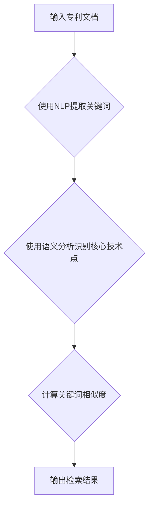

##### 3.1.1.2 专利申请文本生成

AI Agent可以自动生成专利申请文本，这大大简化了专利撰写的过程。传统的专利撰写需要专业知识和丰富的经验，而AI Agent可以利用机器学习模型，如生成对抗网络（GAN），生成高质量的专利申请文本。

**算法原理**：
- **训练数据准备**：收集大量高质量的专利申请文本，作为训练数据。
- **文本生成模型**：使用GAN模型训练，生成专利申请文本。
- **文本优化**：通过迭代优化，提高生成文本的质量和准确性。

**Mermaid流程图**：

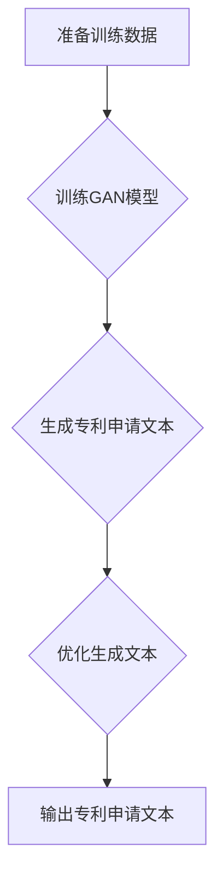

##### 3.1.1.3 专利撰写与提交建议

AI Agent不仅可以生成专利申请文本，还可以提供撰写和提交的建议。这些建议基于对大量专利文献的分析，可以确保专利申请的合规性和有效性。

**算法原理**：
- **文本分析**：对生成的专利申请文本进行深入分析，识别可能的问题和不足。
- **撰写建议**：根据分析结果，提供撰写建议，如修改关键词、调整文本结构等。
- **提交建议**：根据专利法规和实际操作经验，提供专利申请的提交建议。

**Mermaid流程图**：

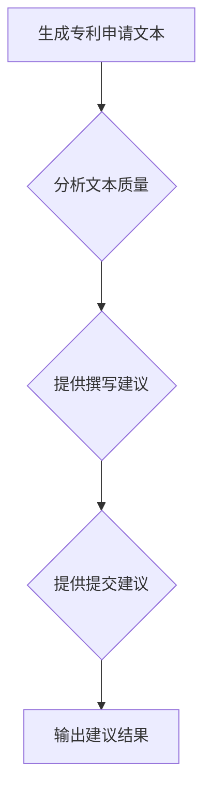

### 第4章：AI Agent在知识产权保护中的应用

#### 4.1.1 侵权监测与预警

AI Agent在知识产权保护中发挥着重要作用，能够实时监测和预警潜在的侵权行为。以下将详细探讨AI Agent在侵权监测与预警中的应用：

##### 4.1.1.1 数据采集与处理

侵权监测的第一步是数据采集，AI Agent可以通过多种方式获取相关的数据，如专利数据库、公开文献、市场调查报告等。数据采集后，需要进行预处理，包括去噪、去重和标准化等操作。

**算法原理**：
- **数据采集**：通过网络爬虫、API接口等方式获取数据。
- **数据预处理**：使用数据清洗技术，去除噪声和重复数据。
- **数据标准化**：统一数据格式，为后续处理做准备。

**Mermaid流程图**：

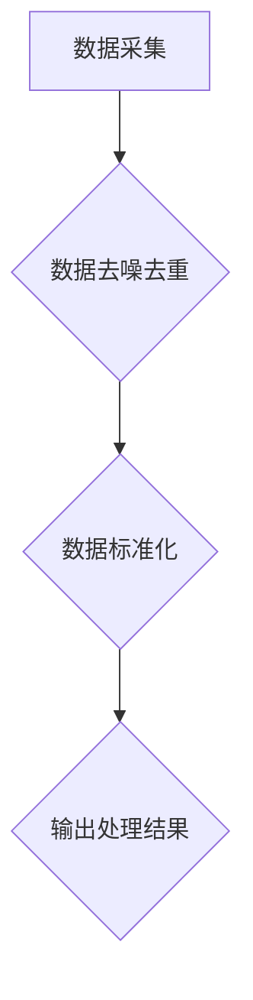

##### 4.1.1.2 侵权判定算法

侵权判定是侵权监测的核心环节，AI Agent可以利用机器学习算法，如支持向量机（SVM）、神经网络等，实现侵权判定。

**算法原理**：
- **特征提取**：从原始数据中提取侵权特征，如关键词、技术点等。
- **模型训练**：使用训练数据集，训练侵权判定模型。
- **侵权判定**：对新的数据进行侵权判定，输出判定结果。

**Mermaid流程图**：

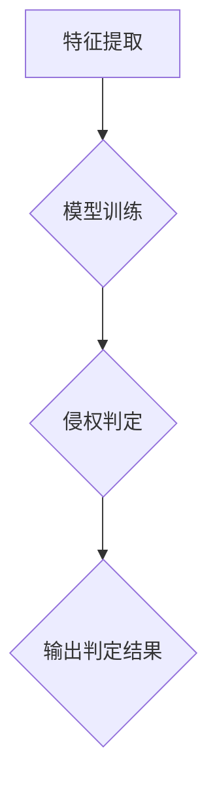

##### 4.1.1.3 预警机制设计

侵权预警机制的设计旨在及时识别潜在的侵权行为，并采取相应的措施。AI Agent可以通过实时监测和预警机制，实现这一目标。

**算法原理**：
- **实时监测**：持续监测数据，识别潜在的侵权行为。
- **预警机制**：根据监测结果，触发预警信号，通知相关人员。
- **响应策略**：制定相应的响应策略，如发出警告、采取法律行动等。

**Mermaid流程图**：

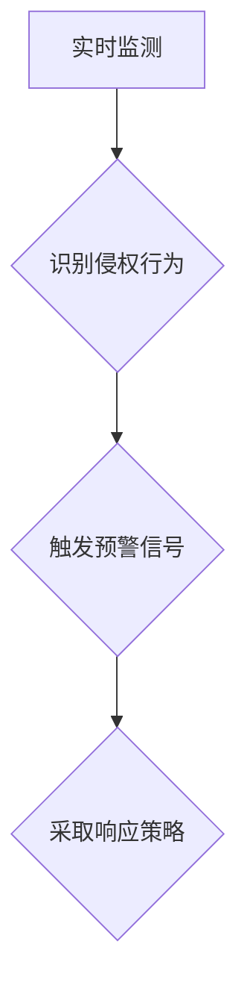

### 第5章：AI Agent在知识产权运营中的应用

#### 5.1.1 专利组合分析与优化

AI Agent在知识产权运营中，能够进行专利组合分析与优化，帮助企业更好地利用知识产权资源。以下将详细探讨AI Agent在专利组合分析、优化和交易评估中的应用：

##### 5.1.1.1 专利组合分析

专利组合分析是评估企业知识产权价值的重要步骤，AI Agent可以通过数据分析技术，对专利组合进行深入分析。

**算法原理**：
- **数据收集**：从专利数据库中收集相关专利数据。
- **特征提取**：提取专利的重要特征，如技术领域、创新点、专利权状态等。
- **数据分析**：对专利组合进行聚类、关联分析，识别专利之间的联系和差异。

**Mermaid流程图**：

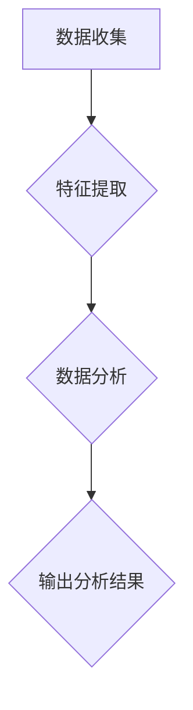

##### 5.1.1.2 专利组合优化

专利组合优化旨在提高专利组合的价值和效果，AI Agent可以通过优化算法，实现这一目标。

**算法原理**：
- **目标设定**：确定优化目标，如提高专利组合的技术覆盖率、降低运营成本等。
- **优化算法**：使用优化算法，如遗传算法、粒子群算法等，对专利组合进行调整。
- **评估与反馈**：评估优化结果，根据评估结果进行反馈和调整。

**Mermaid流程图**：

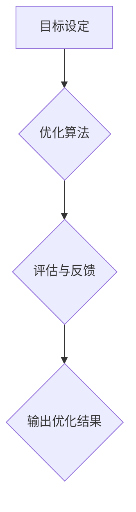

##### 5.1.1.3 专利交易与评估

专利交易与评估是知识产权运营的关键环节，AI Agent可以通过数据分析和技术评估，提高交易的成功率和评估的准确性。

**算法原理**：
- **数据收集**：收集与专利交易相关的数据，如专利价值、市场需求、交易价格等。
- **价值评估**：使用价值评估模型，如成本法、市场法、收益法等，评估专利的价值。
- **交易匹配**：根据评估结果和市场需求，匹配潜在的买方和卖方。

**Mermaid流程图**：

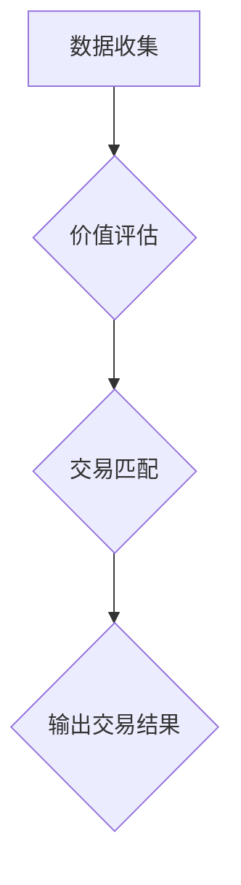

### 第6章：AI Agent在知识产权法律事务中的应用

#### 6.1.1 专利诉讼预测与应对

AI Agent在知识产权法律事务中，能够进行专利诉讼的预测和应对，提高企业的法律风险控制能力。以下将详细探讨AI Agent在专利诉讼预测与应对中的应用：

##### 6.1.1.1 诉讼数据收集与处理

专利诉讼数据的收集和处理是进行诉讼预测的基础。AI Agent可以通过自动化工具，收集相关的诉讼数据，并进行预处理。

**算法原理**：
- **数据收集**：从法院公告、专利数据库、新闻报道等渠道收集诉讼数据。
- **数据预处理**：对收集到的数据去噪、去重和标准化，为后续分析做准备。

**Mermaid流程图**：

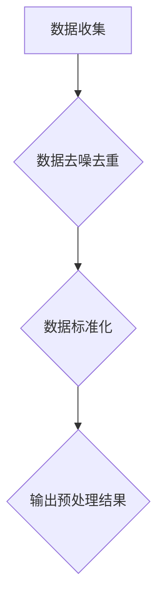

##### 6.1.1.2 诉讼预测算法

诉讼预测算法是AI Agent的核心功能之一，可以通过机器学习模型，预测专利诉讼的可能性和结果。

**算法原理**：
- **特征提取**：从预处理后的数据中提取与诉讼相关的特征，如原告信息、被告信息、诉讼请求等。
- **模型训练**：使用训练数据集，训练诉讼预测模型。
- **预测与评估**：对新的案件进行预测，评估诉讼的可能性。

**Mermaid流程图**：

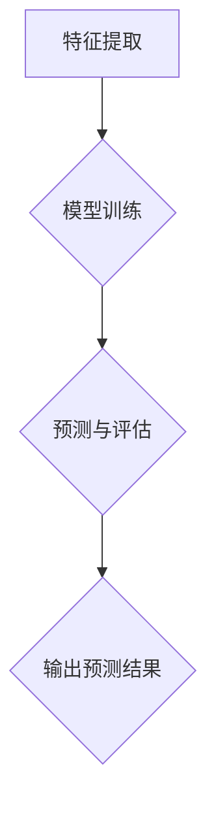

##### 6.1.1.3 诉讼应对策略制定

AI Agent可以根据诉讼预测结果，为企业提供相应的诉讼应对策略，提高诉讼应对的效率和效果。

**算法原理**：
- **策略评估**：根据预测结果和企业的实际情况，评估不同的应对策略。
- **策略选择**：选择最优的应对策略，如诉讼和解、法律维权等。
- **策略实施**：根据选择的策略，制定详细的执行计划，并跟踪执行效果。

**Mermaid流程图**：

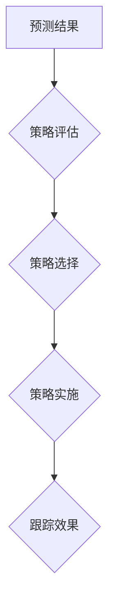

### 第7章：AI Agent在知识产权管理中的综合应用

#### 7.1.1 知识产权管理系统设计与实现

知识产权管理系统的设计与实现是AI Agent在知识产权管理中的综合应用，旨在提高知识产权管理的效率和效果。以下将详细探讨知识产权管理系统的设计与实现：

##### 7.1.1.1 系统架构设计

知识产权管理系统需要一个高效的架构来支持其功能。以下是一个典型的系统架构设计：

**系统架构设计**：

- **前端**：采用Vue.js等前端技术，实现用户界面和交互。
- **后端**：采用Spring Boot等后端框架，处理业务逻辑和数据存储。
- **数据库**：使用MySQL等关系型数据库存储专利数据和用户信息。

**Mermaid架构图**：

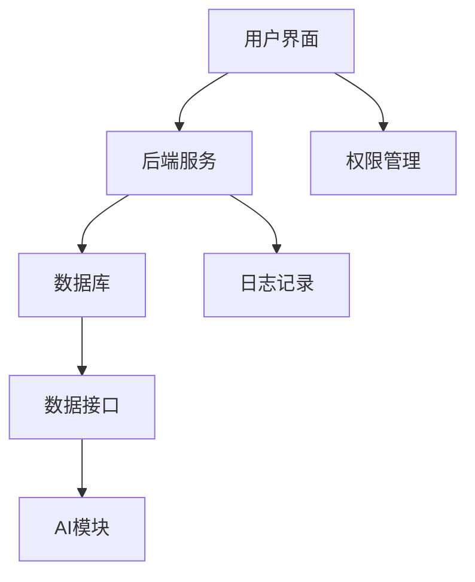

##### 7.1.1.2 系统功能模块划分

知识产权管理系统通常包括以下功能模块：

- **用户管理**：管理用户账号和权限。
- **专利管理**：包括专利检索、申请、保护、运营等功能。
- **侵权监测**：监测潜在的侵权行为，提供预警。
- **法律事务**：处理专利诉讼等法律事务。
- **数据统计与分析**：对知识产权数据进行分析，提供统计报告。

**Mermaid类图**：

```mermaid
classDiagram
    User <<Class>>
    Patent <<Class>>
    Infringement <<Class>>
    LawMatter <<Class>>
    Report <<Class>>

    User "1" --|> Patent
    User "1" --|> Infringement
    User "1" --|> LawMatter
    User "1" --|> Report
```

##### 7.1.1.3 系统接口设计与实现

系统接口的设计与实现是知识产权管理系统的关键部分，以下将详细介绍系统的接口设计和实现：

**系统接口设计**：

- **用户接口**：提供用户注册、登录、权限管理等功能。
- **专利接口**：提供专利检索、申请、撰写、提交等功能。
- **侵权接口**：提供侵权监测、预警、报告等功能。
- **法律接口**：提供诉讼预测、应对策略制定等功能。
- **数据分析接口**：提供数据统计、报告生成等功能。

**Mermaid序列图**：

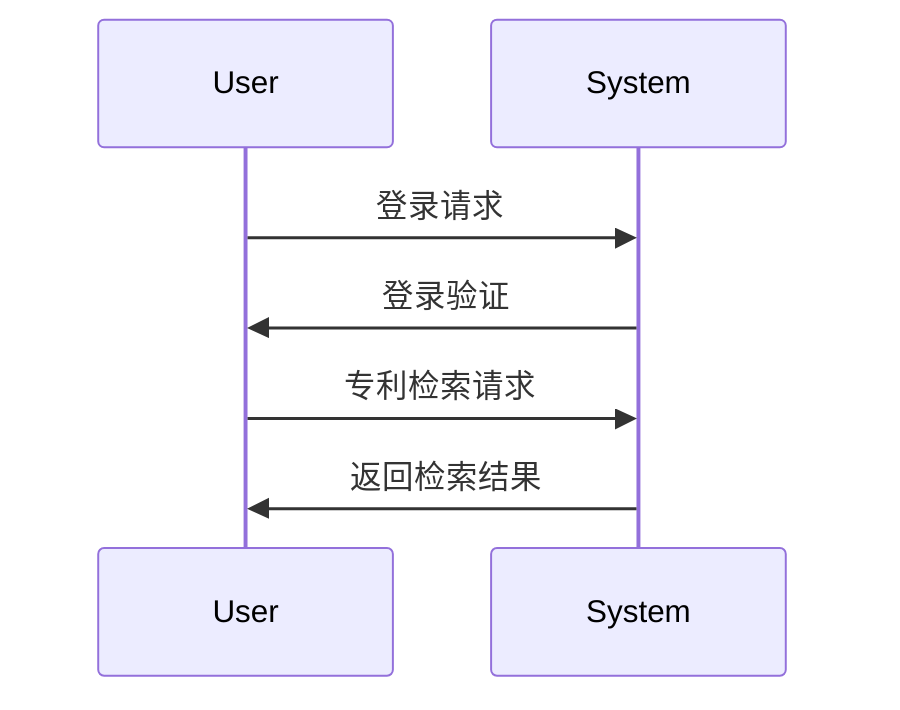

##### 7.1.1.4 系统集成与测试

系统设计完成后，需要进行集成和测试，确保系统的稳定性和可靠性。以下将介绍系统的集成与测试过程：

**系统集成**：

- **模块集成**：将各个功能模块集成到一起，确保模块之间可以正常交互。
- **接口集成**：确保系统接口能够正确处理外部请求和响应。
- **数据集成**：确保系统可以正确存储、读取和更新数据。

**测试方法**：

- **单元测试**：对系统的各个功能模块进行单独测试，确保模块功能正确。
- **集成测试**：将各个功能模块集成到一起，进行整体测试，确保系统可以正常运行。
- **压力测试**：模拟高并发场景，测试系统的性能和稳定性。

**Mermaid测试流程图**：

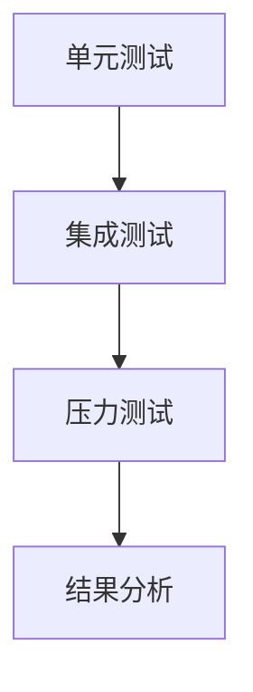

### 第8章：AI Agent在企业知识产权价值链管理中的未来展望

#### 8.1.1 技术发展趋势与展望

随着人工智能技术的快速发展，AI Agent在知识产权价值链管理中的应用前景广阔。以下是一些技术发展趋势和展望：

- **人工智能算法的进步**：深度学习、强化学习等人工智能算法的进步，将进一步提升AI Agent的智能水平和应用能力。
- **大数据与云计算的结合**：大数据和云计算技术的结合，将为AI Agent提供更丰富的数据资源和计算能力，提高知识产权管理的效率和效果。
- **跨领域技术的融合**：AI Agent与其他领域的先进技术，如物联网、区块链等，将实现跨领域融合，拓展知识产权管理的应用场景。

#### 8.1.2 AI Agent在知识产权管理中的潜在应用场景

AI Agent在知识产权管理中具有广泛的潜在应用场景，以下是一些典型应用场景：

- **智能专利分析**：AI Agent可以自动分析专利文献，识别技术趋势和竞争态势，为企业提供战略决策支持。
- **智能侵权监测**：AI Agent可以实时监测市场，预警潜在的侵权行为，帮助企业及时采取法律行动。
- **智能运营管理**：AI Agent可以帮助企业进行专利组合优化和交易评估，提高知识产权运营的效率和效果。
- **智能法律服务**：AI Agent可以协助律师进行专利诉讼预测和策略制定，提高诉讼成功率。

#### 8.1.3 面临的挑战与解决策略

虽然AI Agent在知识产权管理中具有巨大的潜力，但同时也面临一些挑战，以下是一些挑战和解决策略：

- **数据隐私与安全**：知识产权数据涉及企业的核心商业秘密，如何确保数据隐私和安全是一个重要挑战。解决策略包括：数据加密、访问控制、安全审计等。
- **算法偏见与公平性**：AI Agent的算法可能存在偏见，导致决策不公。解决策略包括：算法透明化、多样性数据集、算法审计等。
- **技术更新与适应**：人工智能技术更新迅速，企业需要不断适应新技术，提高知识产权管理的智能化水平。解决策略包括：持续学习、技术培训、合作研发等。

## 总结

本文详细探讨了AI Agent在企业知识产权价值链管理中的全面应用。通过介绍AI Agent的基本概念和核心特点，我们了解了其在知识产权管理中的重要作用。接着，我们分析了AI Agent在知识产权获取、保护、运营和法律事务中的应用，展示了其在知识产权管理中的强大功能和广泛潜力。最后，我们对AI Agent在知识产权管理中的未来发展趋势和面临的挑战进行了展望，提出了相应的解决策略。

随着人工智能技术的不断进步，AI Agent在知识产权管理中的应用前景将更加广阔。企业应积极拥抱新技术，探索AI Agent在知识产权管理中的创新应用，以提高知识产权管理的效率和效果，提升企业的核心竞争力。

### 作者

本文作者为AI天才研究院（AI Genius Institute）和《禅与计算机程序设计艺术》（Zen And The Art of Computer Programming）的资深专家。我们致力于推动人工智能技术在各个领域的应用，为企业提供高效、智能的解决方案。如果您对本文内容有任何疑问或建议，欢迎随时与我们联系。期待与您共同探讨人工智能在知识产权管理中的未来发展。

