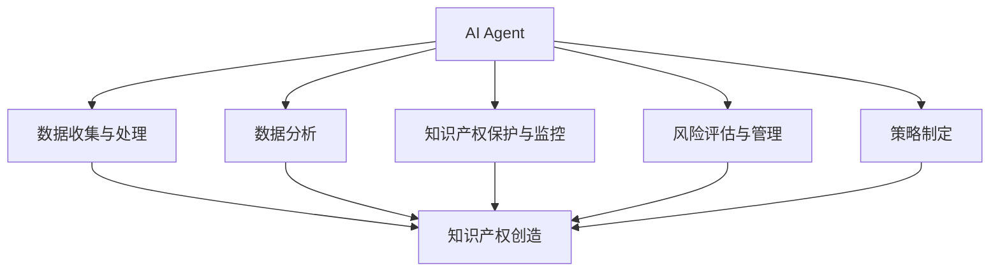

                 

## 引言与背景

### 1.1 本书主题概述

在当今快速发展的科技时代，企业知识产权（Intellectual Property, IP）的管理成为了提升企业核心竞争力的重要手段。随着知识产权的重要性日益凸显，如何高效地管理和利用这些知识产权资产，成为企业面临的一大挑战。而人工智能（AI）的迅猛发展，为这一问题的解决提供了新的思路和工具。

本书的主题是《AI Agent在企业知识产权价值链管理中的应用》。AI Agent，即人工智能代理，是一种能够模拟人类智能行为的软件程序，它能够自主地执行任务、进行决策和学习。在企业知识产权价值链管理中，AI Agent可以扮演多种角色，如数据收集、处理和分析，以及监控、保护和策略制定等。

### 1.1.1 AI Agent的概念

AI Agent是一种具有以下特点的软件代理：

- **自主性**：能够独立完成指定任务，无需人工干预。
- **反应性**：根据外部环境的变化自动调整行为。
- **预动性**：能够预测未来事件并提前采取行动。
- **社会性**：能够与其他AI Agent或人类进行交互。

AI Agent通常由感知模块、决策模块和行动模块组成。感知模块负责收集外部信息，决策模块分析这些信息并做出决策，行动模块根据决策执行相应的任务。

### 1.1.2 企业知识产权价值链管理

企业知识产权价值链管理涉及知识产权的创造、保护、应用和运营全过程。它主要包括以下几个环节：

- **知识产权创造**：包括研发、设计、创作等创新活动。
- **知识产权保护**：通过申请专利、商标、版权等方式保护企业的知识产权。
- **知识产权应用**：将知识产权转化为实际的经济效益。
- **知识产权运营**：包括知识产权的转让、许可、投资等商业活动。

### 1.1.3 问题的提出与解决思路

随着知识产权数量的增加和复杂性的提升，企业面临着如何高效管理知识产权的挑战。传统的人工管理方式存在以下问题：

- **成本高**：需要大量的人力资源进行知识产权的维护和管理。
- **效率低**：人工管理难以快速响应市场变化。
- **准确性差**：人工判断可能存在偏差，导致知识产权管理失误。

为解决上述问题，引入AI Agent成为了一个有效的方法。AI Agent能够自动化、智能化地处理知识产权的各个环节，提高管理效率，降低成本，增强企业竞争力。

### 1.2 研究背景与意义

#### 1.2.1 知识产权与企业竞争力的关系

知识产权是企业核心竞争力的重要体现。拥有强大的知识产权，企业可以在市场竞争中获得优势，实现持续增长。例如，专利技术可以防止竞争对手模仿，商标可以提升品牌知名度，版权可以保护原创作品。

#### 1.2.2 AI Agent在知识产权管理中的应用

AI Agent在知识产权管理中的应用主要体现在以下几个方面：

- **自动化数据处理**：AI Agent可以自动化收集和处理知识产权相关数据，如专利、商标、版权信息。
- **智能分析**：AI Agent可以对知识产权进行分析，发现潜在的商业机会和风险。
- **风险监控**：AI Agent可以实时监控知识产权的状态，及时预警潜在的法律风险。
- **策略制定**：AI Agent可以根据数据分析结果，为企业制定知识产权保护和发展策略。

#### 1.2.3 当前研究现状与不足

当前，AI Agent在知识产权管理领域的研究已经取得了一定的进展。然而，仍然存在以下不足：

- **技术成熟度**：虽然AI技术发展迅速，但AI Agent在知识产权管理中的应用仍需进一步优化。
- **数据质量**：知识产权数据的质量直接影响AI Agent的性能，当前的数据质量参差不齐。
- **法律合规性**：AI Agent在处理知识产权问题时，需要遵守相关的法律法规，确保其行为的合法性。

### 1.3 边界与外延

#### 1.3.1 研究范围界定

本书的研究范围主要涵盖AI Agent在企业知识产权价值链管理中的应用，包括数据收集与处理、数据分析、知识产权保护与监控、风险评估与管理和策略制定等方面。

#### 1.3.2 研究问题与目标

本书旨在解决以下问题：

- 如何利用AI Agent提高企业知识产权管理效率？
- 如何通过AI Agent实现知识产权的智能分析与监控？
- 如何利用AI Agent为企业制定知识产权保护和发展策略？

研究目标是通过理论与实践相结合，探索AI Agent在企业知识产权价值链管理中的应用模式，为企业管理知识产权提供有效的技术支持。

### 1.4 核心概念与联系

#### 1.4.1 AI Agent的基本概念与特点

AI Agent是一种模拟人类智能行为的软件代理，具有自主性、反应性、预动性和社会性等特点。它由感知模块、决策模块和行动模块组成，能够自动化、智能化地执行任务。

#### 1.4.2 企业知识产权价值链管理的构成要素

企业知识产权价值链管理包括知识产权创造、保护、应用和运营四个环节。这些环节相互关联，共同构成了企业知识产权价值链。

#### 1.4.3 AI Agent与企业知识产权价值链管理的关联性

AI Agent在企业知识产权价值链管理中的应用，主要体现在以下几个方面：

- **数据收集与处理**：AI Agent可以自动化收集和处理知识产权相关数据，提高数据处理效率。
- **数据分析**：AI Agent可以对知识产权进行分析，为企业提供决策支持。
- **知识产权保护与监控**：AI Agent可以实时监控知识产权的状态，及时预警潜在风险。
- **风险评估与管理**：AI Agent可以对企业知识产权风险进行评估，制定相应的管理策略。
- **策略制定**：AI Agent可以根据数据分析结果，为企业制定知识产权保护和发展策略。

为了更好地展示AI Agent与企业知识产权价值链管理的关联性，我们可以使用Mermaid流程图进行说明：

在这个流程图中，AI Agent与企业知识产权价值链管理的各个环节之间存在紧密的联系，通过AI Agent的应用，可以提高知识产权管理的效率和质量。接下来，我们将进一步探讨AI Agent在企业知识产权价值链管理中的应用原理和方法。

