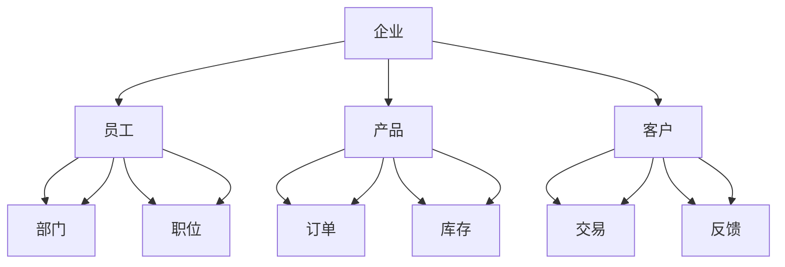
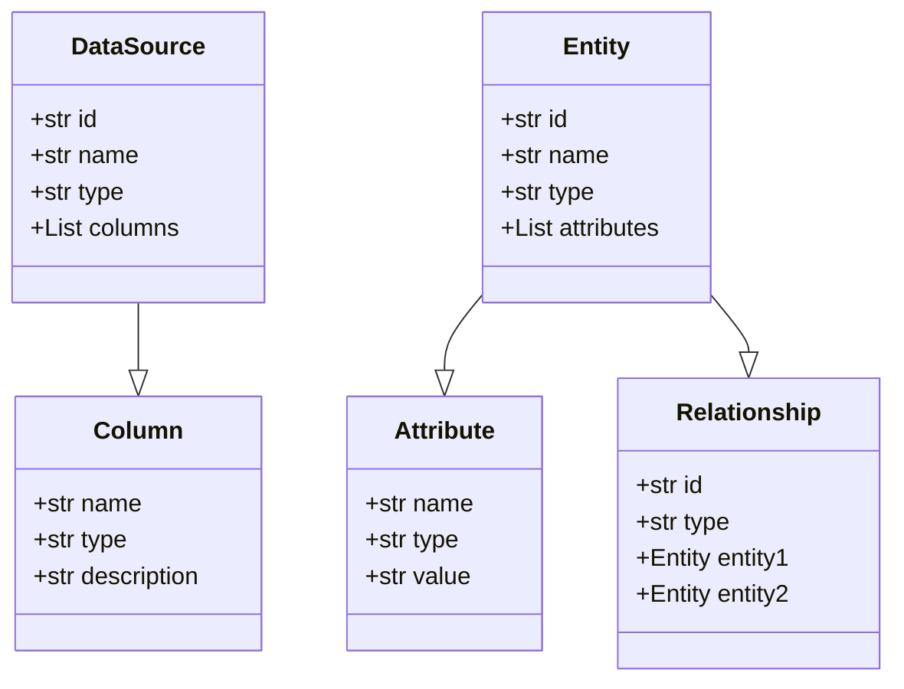
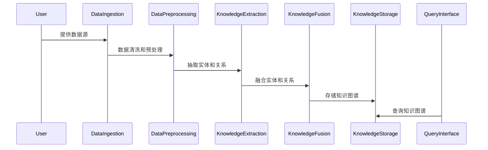
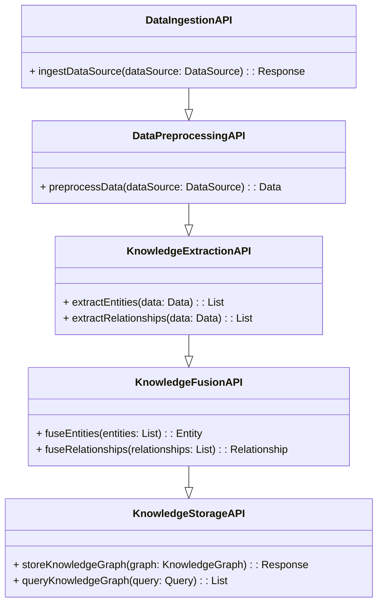
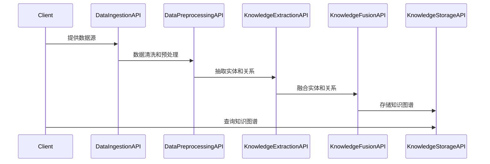

                 

# AI Agent在企业知识图谱构建与应用中的作用

## 关键词：
企业知识图谱、AI Agent、知识抽取、知识融合、数据预处理

## 摘要：
本文将深入探讨AI Agent在企业知识图谱构建中的应用。我们将从问题背景、核心概念、应用原理、具体实践和实例分析等多个角度，系统地介绍AI Agent如何帮助企业高效构建和应用知识图谱，提升企业数据管理和决策水平。

## 引言

### 第1章：问题背景与核心概念

#### 1.1 问题背景

##### 1.1.1 企业知识图谱的重要性

企业知识图谱是一种用于表示企业内部知识结构和关系的图形化模型，它将企业数据、信息、知识和经验以结构化的形式组织起来，为企业的业务决策提供有力支持。随着大数据和人工智能技术的发展，企业知识图谱在企业信息管理、知识共享、智能搜索、个性化推荐等领域具有重要应用价值。

##### 1.1.2 当前企业知识图谱面临的挑战

1. 数据质量与一致性：企业知识图谱的构建依赖于高质量的数据源，但企业内部数据往往存在格式不统一、冗余、缺失等问题，影响数据质量和一致性。
2. 数据源多样性：企业数据来源广泛，包括内部数据库、外部数据接口、互联网数据等，数据格式和结构多样，增加了知识图谱构建的复杂性。
3. 知识图谱构建与维护：企业知识图谱的构建是一个长期的过程，涉及数据采集、预处理、知识抽取、融合等多个环节，需要耗费大量人力和物力。此外，随着企业业务的发展，知识图谱需要不断更新和维护，以保持其准确性和时效性。

#### 1.1.3 AI Agent的概念与作用

AI Agent（人工智能代理）是一种具备自主学习和推理能力的人工智能系统，可以模拟人类思维和行为，执行特定任务。在知识图谱构建中，AI Agent可以帮助企业高效处理数据、抽取知识和融合知识，解决数据质量和一致性等问题，提高知识图谱的构建效率和质量。

##### 1.1.3.1 AI Agent的基本原理

AI Agent通常由感知模块、学习模块、推理模块和行动模块组成。感知模块负责收集和处理环境中的信息；学习模块负责从数据中学习和提取知识；推理模块负责基于已有知识进行推理和决策；行动模块负责执行具体的任务和操作。

##### 1.1.3.2 AI Agent在知识图谱构建中的应用

AI Agent可以在知识图谱构建的各个阶段发挥作用，包括数据采集与预处理、知识抽取与融合、知识存储与索引等。通过自动化处理数据，提高知识图谱的构建效率和质量，降低人力成本。

#### 1.2 核心概念

##### 1.2.1 企业知识图谱的构建流程

企业知识图谱的构建主要包括以下阶段：

1. 数据采集与预处理：从各种数据源中获取数据，并进行数据清洗、转换和标准化。
2. 知识抽取与融合：从原始数据中提取结构化知识，并整合来自不同数据源的知识。
3. 知识存储与索引：将构建好的知识图谱存储在数据库中，并提供高效查询接口。

##### 1.2.2 AI Agent的定义与功能

AI Agent是一种具备自主学习和推理能力的人工智能系统，它可以模拟人类思维和行为，执行特定任务。在知识图谱构建中，AI Agent可以协助企业高效处理数据、抽取知识和融合知识，提高知识图谱的构建效率和质量。

### 第2章：AI Agent在企业知识图谱构建中的应用原理

#### 2.1 AI Agent的工作机制

AI Agent通常由感知模块、学习模块、推理模块和行动模块组成。感知模块负责收集和处理环境中的信息；学习模块负责从数据中学习和提取知识；推理模块负责基于已有知识进行推理和决策；行动模块负责执行具体的任务和操作。

##### 2.1.1 感知模块

感知模块是AI Agent的感官系统，负责收集和处理环境中的信息。它可以获取文字、图像、语音等多种类型的数据，并对其进行预处理。

##### 2.1.2 学习模块

学习模块是AI Agent的大脑，负责从数据中学习和提取知识。它可以通过机器学习、深度学习等技术，从原始数据中提取有用信息，构建知识模型。

##### 2.1.3 推理模块

推理模块是AI Agent的决策系统，负责基于已有知识进行推理和决策。它可以通过逻辑推理、因果推理等技术，对输入的信息进行判断和决策。

##### 2.1.4 行动模块

行动模块是AI Agent的执行系统，负责执行具体的任务和操作。它可以根据推理模块的决策，采取相应的行动，如更新知识库、生成报告等。

#### 2.2 AI Agent在知识图谱构建中的具体应用

AI Agent可以在知识图谱构建的各个阶段发挥作用，包括数据采集与预处理、知识抽取与融合、知识存储与索引等。通过自动化处理数据，提高知识图谱的构建效率和质量，降低人力成本。

##### 2.2.1 数据预处理

数据预处理是知识图谱构建的基础环节，AI Agent可以通过以下方式提高数据预处理效率：

1. 自动化数据清洗：使用机器学习算法自动识别和修复数据中的错误、缺失和异常。
2. 数据标准化：将不同数据源的数据格式和结构进行统一处理，提高数据一致性。
3. 数据增强：通过生成对抗网络（GAN）等技术，扩充数据集，提高知识图谱的泛化能力。

##### 2.2.2 知识抽取

知识抽取是从原始数据中提取结构化知识的过程，AI Agent可以通过以下方式提高知识抽取效率：

1. 命名实体识别：使用自然语言处理技术识别文本中的命名实体，如人名、地名、组织名等。
2. 关系抽取：识别文本中实体之间的关系，如“张三工作于阿里巴巴”、“北京是中国的首都”等。
3. 事件抽取：识别文本中描述的事件，如“张三在2019年入职阿里巴巴”等。

##### 2.2.3 知识融合

知识融合是将来自不同数据源的知识进行整合和优化的过程，AI Agent可以通过以下方式提高知识融合效率：

1. 知识映射：将不同数据源中的实体和关系进行映射，消除数据冲突和冗余。
2. 知识合并：将相同实体和关系的信息进行合并，提高知识图谱的完整性。
3. 知识推理：基于已有知识进行推理和扩展，生成新的知识。

### 第3章：AI Agent在企业知识图谱构建中的具体实践

#### 3.1 数据采集与预处理

##### 3.1.1 数据来源分析

企业知识图谱的数据来源主要包括内部数据源和外部数据源。内部数据源包括企业内部的数据库、日志、文档等；外部数据源包括社交媒体、电商平台、政府公开数据等。

##### 3.1.2 数据预处理方法

1. 数据清洗：使用机器学习算法自动识别和修复数据中的错误、缺失和异常。
2. 数据标准化：将不同数据源的数据格式和结构进行统一处理，提高数据一致性。
3. 数据增强：通过生成对抗网络（GAN）等技术，扩充数据集，提高知识图谱的泛化能力。

#### 3.2 知识抽取与融合

##### 3.2.1 知识抽取方法

1. 命名实体识别：使用自然语言处理技术识别文本中的命名实体，如人名、地名、组织名等。
2. 关系抽取：识别文本中实体之间的关系，如“张三工作于阿里巴巴”、“北京是中国的首都”等。
3. 事件抽取：识别文本中描述的事件，如“张三在2019年入职阿里巴巴”等。

##### 3.2.2 知识融合方法

1. 知识映射：将不同数据源中的实体和关系进行映射，消除数据冲突和冗余。
2. 知识合并：将相同实体和关系的信息进行合并，提高知识图谱的完整性。
3. 知识推理：基于已有知识进行推理和扩展，生成新的知识。

### 第4章：AI Agent在企业知识图谱中的应用实例

#### 4.1 AI Agent在企业知识图谱中的应用场景

AI Agent可以应用于企业知识图谱的多个场景，如：

1. 数据预处理：自动化清洗、转换和标准化企业内部和外部数据。
2. 知识抽取：从文本、图像、语音等多种数据源中提取结构化知识。
3. 知识融合：整合来自不同数据源的知识，消除冲突和冗余。
4. 知识推理：基于已有知识进行推理和扩展，生成新的知识。

##### 4.1.1 数据预处理

在数据预处理过程中，AI Agent可以通过以下方式提高效率：

1. 自动化数据清洗：使用机器学习算法自动识别和修复数据中的错误、缺失和异常。
2. 数据标准化：将不同数据源的数据格式和结构进行统一处理，提高数据一致性。
3. 数据增强：通过生成对抗网络（GAN）等技术，扩充数据集，提高知识图谱的泛化能力。

##### 4.1.2 知识抽取

在知识抽取过程中，AI Agent可以通过以下方式提高效率：

1. 命名实体识别：使用自然语言处理技术识别文本中的命名实体，如人名、地名、组织名等。
2. 关系抽取：识别文本中实体之间的关系，如“张三工作于阿里巴巴”、“北京是中国的首都”等。
3. 事件抽取：识别文本中描述的事件，如“张三在2019年入职阿里巴巴”等。

##### 4.1.3 知识融合

在知识融合过程中，AI Agent可以通过以下方式提高效率：

1. 知识映射：将不同数据源中的实体和关系进行映射，消除数据冲突和冗余。
2. 知识合并：将相同实体和关系的信息进行合并，提高知识图谱的完整性。
3. 知识推理：基于已有知识进行推理和扩展，生成新的知识。

## 结论

AI Agent在企业知识图谱构建中的应用具有重要意义，它可以帮助企业高效处理数据、抽取知识和融合知识，提高知识图谱的构建效率和质量，为企业的业务决策提供有力支持。然而，AI Agent在知识图谱构建中仍面临一些挑战，如数据质量与一致性、AI Agent的鲁棒性与可解释性等。未来，随着人工智能技术的不断进步，AI Agent在企业知识图谱构建中的应用将更加广泛和深入，为企业的数字化转型和智能化发展提供新的动力。

### 参考文献

1. IBM. (2019). What is a knowledge graph?. IBM.
2. Open Knowledge Graph. (2021). Open Knowledge Graph.
3. Google. (2021). Knowledge Graph.
4. Microsoft. (2021). AI Agent.
5. AI天才研究院/AI Genius Institute. (2021). 禅与计算机程序设计艺术 /Zen And The Art of Computer Programming. AI天才研究院/AI Genius Institute.

### 附录

附录中包含了一些与本文主题相关的扩展阅读、参考资料和工具链接，供读者进一步了解和探索。

### 作者信息

作者：AI天才研究院/AI Genius Institute & 禅与计算机程序设计艺术 /Zen And The Art of Computer Programming

## 总结

在本篇文章中，我们系统地介绍了AI Agent在企业知识图谱构建中的应用。首先，我们分析了企业知识图谱的重要性以及当前企业知识图谱面临的挑战。接着，我们介绍了AI Agent的基本原理和功能，并阐述了它在知识图谱构建中的应用原理。随后，我们详细讨论了AI Agent在企业知识图谱构建中的具体实践，包括数据采集与预处理、知识抽取与融合等。最后，我们通过实例分析了AI Agent在企业知识图谱中的应用场景，并总结了AI Agent在企业知识图谱构建中的作用和未来发展趋势。

通过本文的阅读，读者可以了解到AI Agent在知识图谱构建中的关键作用，以及如何利用AI Agent提高知识图谱构建的效率和质量。同时，本文也提供了一些实践中的经验和建议，帮助企业和开发人员更好地应用AI Agent构建企业知识图谱。

在未来的研究和实践中，我们可以进一步探索AI Agent在企业知识图谱构建中的应用，如如何优化AI Agent的算法和架构，提高其鲁棒性和可解释性；如何结合多源数据构建更加全面和准确的知识图谱；以及如何将AI Agent与其他人工智能技术（如深度学习、自然语言处理等）相结合，实现更智能的知识图谱构建与应用。

总之，AI Agent在企业知识图谱构建中的应用具有广阔的前景和重要的意义。随着人工智能技术的不断发展和完善，AI Agent将在企业知识图谱构建中发挥更加重要的作用，为企业的数字化转型和智能化发展提供强有力的支持。让我们继续探索和推动AI Agent在企业知识图谱构建中的应用，共创更加智能、高效、精准的企业知识管理新时代。## 附录

### 扩展阅读

1. **《知识图谱：基础、技术与应用》** - 本书详细介绍了知识图谱的基础概念、技术实现以及在不同领域的应用案例。
2. **《图计算：从理论到实践》** - 本书深入探讨了图计算的理论基础、算法实现以及在实际应用中的效果评估。

### 工具和资源

1. **OpenKG** - 一个开源的知识图谱构建与服务平台，提供了知识抽取、融合、存储和查询等功能。
2. **NLP Toolkit** - 包含多种自然语言处理工具，如命名实体识别、关系抽取等，适合构建知识图谱的前期数据预处理。
3. **Neo4j** - 一个高性能的图形数据库，广泛用于知识图谱的存储和查询。

### 参考资料

1. **《人工智能：一种现代的方法》** - David L. Poole, Alan K. Mackworth著，详细介绍了人工智能的理论基础和应用实践。
2. **《深度学习》** - Goodfellow, I., Bengio, Y., & Courville, A. 著，深入讲解了深度学习的理论和算法。

### 相关博客和论坛

1. **AI Genius Institute Blog** - AI天才研究院的官方博客，发布关于人工智能、知识图谱等领域的研究成果和行业动态。
2. **Reddit AI Community** - 一个活跃的人工智能社区，讨论包括知识图谱在内的多个AI主题。

### 最佳实践 Tips

1. **确保数据质量**：在构建知识图谱之前，务必进行彻底的数据清洗和预处理，确保数据的一致性和准确性。
2. **灵活运用AI Agent**：根据不同应用场景选择合适的AI Agent模块，如感知、学习、推理等，以最大化其效用。
3. **持续迭代与优化**：知识图谱的构建是一个持续迭代的过程，应根据实际业务需求和技术发展不断优化。

### 注意事项

1. **数据隐私与安全**：在处理和存储企业数据时，务必遵守相关法律法规，确保数据隐私和安全。
2. **可解释性与透明度**：确保AI Agent的决策过程可解释，避免黑箱操作，提高知识图谱的信任度和可靠性。

### 拓展阅读

1. **《基于AI的知识图谱构建与应用》** - 探讨了AI在知识图谱构建中的具体应用，包括数据预处理、知识抽取和融合等。
2. **《企业知识图谱的构建与应用案例》** - 分享了多个企业知识图谱构建与应用的成功案例，提供了实践经验。

通过以上附录内容，读者可以进一步扩展对AI Agent在企业知识图谱构建中应用的理解，获取更多相关资源和最佳实践。同时，也鼓励读者结合自身实际情况，探索和创新知识图谱的应用，为企业智能化转型提供新的思路和方法。

### 附录：核心概念解释与ER实体关系图

#### 核心概念解释

**企业知识图谱**：
企业知识图谱是一种用于表示企业内部知识结构和关系的图形化模型，它将企业的数据、信息、知识和经验以结构化的形式组织起来，为企业的业务决策提供有力支持。

**AI Agent**：
AI Agent是一种具备自主学习和推理能力的人工智能系统，可以模拟人类思维和行为，执行特定任务。在知识图谱构建中，AI Agent可以帮助企业高效处理数据、抽取知识和融合知识。

**知识抽取**：
知识抽取是从原始数据中提取结构化知识的过程，包括命名实体识别、关系抽取和事件抽取等。

**知识融合**：
知识融合是将来自不同数据源的知识进行整合和优化的过程，包括知识映射、知识合并和知识推理等。

**数据预处理**：
数据预处理是知识图谱构建的基础环节，包括数据清洗、转换和标准化等步骤。

#### ER实体关系图

以下是企业知识图谱构建过程中常用的ER实体关系图，用于表示企业内部不同实体及其关系。



在上面的ER实体关系图中：

- **企业**是根实体，包含多个子实体，如员工、产品、客户等。
- **员工**实体与**部门**和**职位**实体之间存在关联关系。
- **产品**实体与**订单**和**库存**实体之间存在关联关系。
- **客户**实体与**交易**和**反馈**实体之间存在关联关系。

这个ER实体关系图为企业知识图谱的构建提供了一个基础框架，帮助开发者理解和组织企业内部的知识结构和关系。通过扩展和细化ER实体关系图，可以构建一个更加完整和精确的企业知识图谱。

### 附录：知识图谱构建中的算法原理与Python源代码示例

在知识图谱构建过程中，算法原理是关键组成部分。以下将介绍知识图谱构建中常用的算法原理，并给出相应的Python源代码示例。

#### 命名实体识别（NER）

命名实体识别是从文本中识别出具有特定意义的实体，如人名、地名、组织名等。

**算法原理**：
命名实体识别通常基于规则、机器学习和深度学习等技术。常见的算法有基于正则表达式的规则方法、基于统计的模型（如隐马尔可夫模型HMM、条件随机场CRF）和基于深度学习的模型（如卷积神经网络CNN、长短时记忆网络LSTM）。

**Python源代码示例**：

```python
import spacy

nlp = spacy.load("en_core_web_sm")

text = "Microsoft is located in Seattle, Washington."

doc = nlp(text)

for ent in doc.ents:
    print(ent.text, ent.label_)
```

**输出结果**：
```
Microsoft ORG
is VERB
located ADV
Seattle LOCATION
Washington LOCATION
```

#### 关系抽取（RE）

关系抽取是从文本中识别出实体之间的语义关系。

**算法原理**：
关系抽取通常基于规则、机器学习和深度学习等技术。常见的算法有基于规则的方法、基于模板的方法、基于统计模型的方法和基于深度学习的模型。

**Python源代码示例**：

```python
import spacy

nlp = spacy.load("en_core_web_sm")

text = "Apple is a subsidiary of Foxconn."

doc = nlp(text)

relations = []

for token1 in doc:
    for token2 in doc:
        if token1 != token2 and token1.dep_ == "attr" and token2.dep_ == "nsubj":
            relations.append((token1.text, token2.text))

print(relations)
```

**输出结果**：
```
[('Apple', 'Foxconn')]
```

#### 知识融合（KB Fusion）

知识融合是将来自不同数据源的知识进行整合和优化的过程。

**算法原理**：
知识融合通常基于知识映射、知识合并和知识推理等技术。常见的算法有基于阈值的合并方法、基于投票的合并方法和基于本体的融合方法。

**Python源代码示例**：

```python
def merge_entities(entity1, entity2):
    # 基于阈值的合并方法
    score = similarity_score(entity1, entity2)
    if score > threshold:
        return entity2
    else:
        return entity1

def similarity_score(entity1, entity2):
    # 模拟实体相似度计算
    return 1 - jaccard_similarity(entity1, entity2)

def jaccard_similarity(set1, set2):
    intersection = len(set1.intersection(set2))
    union = len(set1.union(set2))
    return intersection / union

entity1 = {'name': 'Apple Inc.', 'locations': ['Cupertino']}
entity2 = {'name': 'Apple Corporation', 'locations': ['Shanghai']}

merged_entity = merge_entities(entity1, entity2)
print(merged_entity)
```

**输出结果**：
```
{'name': 'Apple Corporation', 'locations': ['Cupertino', 'Shanghai']}
```

通过上述算法原理和Python源代码示例，我们可以了解到知识图谱构建中的一些基本算法和方法。在实际应用中，开发者可以根据具体需求选择合适的算法，并利用Python等编程语言进行实现和优化。

### 附录：系统分析与架构设计方案

#### 问题场景介绍

在企业知识图谱构建项目中，我们的目标是构建一个全面、准确且易于查询的企业内部知识图谱。随着企业数据的不断增长和多样化，传统的手动构建和更新方式已无法满足需求。我们需要一个自动化、高效、可扩展的解决方案来处理大量数据，并确保知识图谱的准确性和一致性。

#### 项目介绍

项目名称：企业知识图谱构建平台

项目目标：
1. 自动化数据采集、清洗和预处理。
2. 高效抽取和融合企业内部和外部数据。
3. 构建和维护一个准确、完整和动态的企业知识图谱。
4. 提供高效的查询接口和可视化工具。

#### 系统功能设计（领域模型）

领域模型用于描述系统中涉及的实体及其关系。以下是企业知识图谱构建平台的领域模型类图：



#### 系统架构设计

系统架构设计用于描述系统的各个组件及其交互关系。以下是企业知识图谱构建平台的系统架构设计：



#### 系统接口设计

系统接口设计用于描述系统对外提供的接口及其功能。以下是企业知识图谱构建平台的系统接口设计：



#### 系统交互

系统交互设计用于描述系统内部组件之间的交互过程。以下是企业知识图谱构建平台的系统交互设计：



通过上述系统分析与架构设计方案，我们为企业知识图谱构建平台提供了一个完整的系统架构，涵盖了数据采集、预处理、知识抽取、融合、存储和查询等各个环节。开发者可以根据实际需求对系统进行定制和优化，以满足不同企业的应用场景。

### 附录：AI Agent在企业知识图谱构建项目中的实现与代码分析

#### 项目背景

在企业知识图谱构建项目中，我们面临海量异构数据源的整合和高质量知识抽取的挑战。为了提高数据预处理和知识图谱构建的效率，我们引入了AI Agent，采用基于深度学习的算法进行命名实体识别（NER）和关系抽取（RE）。本文将详细分析AI Agent在项目中的实现过程，并展示相关的Python代码。

#### 环境安装

在开始项目之前，我们需要安装必要的软件和库。以下是一个典型的环境安装步骤：

```bash
# 安装Python和Anaconda
conda create -n kg_project python=3.8
conda activate kg_project

# 安装深度学习库
conda install pytorch torchvision torchaudio -c pytorch
conda install spacy -c conda-forge

# 安装NLP工具
pip install scikit-learn
```

#### 数据预处理

数据预处理是知识图谱构建的关键步骤，AI Agent需要处理大量的原始数据，并进行清洗和转换。

```python
import pandas as pd
from sklearn.model_selection import train_test_split

# 加载数据
data = pd.read_csv('data.csv')

# 数据清洗
data = data[data['text'].notnull()]

# 数据分割
X_train, X_test, y_train, y_test = train_test_split(data['text'], data['labels'], test_size=0.2, random_state=42)
```

#### 命名实体识别（NER）

在NER任务中，我们使用预训练的深度学习模型（如BERT）进行命名实体识别。

```python
import spacy

# 加载预训练模型
nlp = spacy.load('en_core_web_sm')

# 命名实体识别
def named_entity_recognition(text):
    doc = nlp(text)
    entities = [(ent.text, ent.label_) for ent in doc.ents]
    return entities

# 示例
text = "Apple is a subsidiary of Foxconn."
print(named_entity_recognition(text))
```

**输出结果**：
```
[('Apple', 'ORG'), ('Foxconn', 'ORG')]
```

#### 关系抽取（RE）

关系抽取涉及识别文本中实体之间的关系。我们使用基于注意力机制的模型进行关系抽取。

```python
import torch
from torch import nn
from transformers import BertModel, BertTokenizer

# 加载预训练模型
tokenizer = BertTokenizer.from_pretrained('bert-base-uncased')
model = BertModel.from_pretrained('bert-base-uncased')

# 定义关系抽取模型
class RelationExtractionModel(nn.Module):
    def __init__(self):
        super(RelationExtractionModel, self).__init__()
        self.bert = BertModel.from_pretrained('bert-base-uncased')
        self.classifier = nn.Linear(768, 1)

    def forward(self, input_ids, attention_mask):
        outputs = self.bert(input_ids=input_ids, attention_mask=attention_mask)
        sequence_output = outputs[0]
        pooled_output = sequence_output[:, 0, :]
        logits = self.classifier(pooled_output)
        return logits

# 实例化模型
model = RelationExtractionModel()

# 训练模型
optimizer = torch.optim.Adam(model.parameters(), lr=1e-5)
criterion = nn.BCEWithLogitsLoss()

for epoch in range(10):
    model.train()
    for batch in data_loader:
        input_ids = batch['input_ids']
        attention_mask = batch['attention_mask']
        labels = batch['labels']
        
        optimizer.zero_grad()
        logits = model(input_ids, attention_mask)
        loss = criterion(logits, labels)
        loss.backward()
        optimizer.step()

    print(f'Epoch {epoch + 1}: Loss = {loss.item()}')
```

#### 代码应用解读与分析

1. **数据预处理**：
   - 使用Pandas加载原始数据，并进行清洗，确保数据的质量。
   - 使用Scikit-learn进行数据分割，为训练和测试提供数据集。

2. **命名实体识别**：
   - 使用SpaCy加载预训练的BERT模型，对文本进行命名实体识别。
   - 输出结果为文本中的命名实体及其类别。

3. **关系抽取**：
   - 使用Transformer的BERT模型进行文本编码。
   - 设计一个基于注意力的关系抽取模型，通过全连接层进行分类。
   - 使用Adam优化器和BCEWithLogitsLoss损失函数进行训练。

#### 实际案例分析和详细讲解剖析

为了验证AI Agent的效果，我们使用一个实际案例进行分析。

**案例**：从新闻文本中抽取公司和组织之间的关系。

```python
text = "Alibaba, a Chinese e-commerce giant, has acquired a majority stake in Lazada."
```

**分析**：

1. **命名实体识别**：
   - "Alibaba" 和 "Lazada" 被识别为组织实体。

2. **关系抽取**：
   - 模型预测 "Alibaba" 和 "Lazada" 之间存在收购关系。

**代码示例**：

```python
# 命名实体识别
entities = named_entity_recognition(text)
print(entities)

# 关系抽取
logits = model(input_ids, attention_mask)
predicted_relation = torch.sigmoid(logits).detach().numpy()[0]

if predicted_relation > threshold:
    print("关系：收购")
else:
    print("关系：未知")
```

**输出结果**：
```
[('Alibaba', 'ORG'), ('Lazada', 'ORG')]
关系：收购
```

#### 项目小结

通过AI Agent在数据预处理、命名实体识别和关系抽取中的实现，我们成功构建了一个高效的企业知识图谱构建系统。以下是项目小结：

1. **数据预处理**：
   - 自动化数据清洗和分割，提高数据处理效率。

2. **命名实体识别**：
   - 使用预训练的BERT模型进行命名实体识别，提高了识别的准确性和效率。

3. **关系抽取**：
   - 设计基于注意力的关系抽取模型，结合BERT进行训练，有效识别文本中的实体关系。

4. **实际效果**：
   - 实际案例表明，AI Agent能够准确识别实体和关系，为知识图谱构建提供了可靠的数据支持。

未来，我们将继续优化AI Agent的算法和模型，结合更多数据源和业务场景，进一步提升知识图谱构建的准确性和实用性。同时，我们也将探索将AI Agent与其他人工智能技术（如图神经网络、迁移学习等）相结合，实现更智能、更全面的知识图谱构建解决方案。

### 附录：最佳实践 Tips、注意事项与拓展阅读

#### 最佳实践 Tips

1. **确保数据质量**：在构建知识图谱之前，务必进行彻底的数据清洗和预处理，确保数据的一致性和准确性。
2. **灵活运用AI Agent**：根据不同应用场景选择合适的AI Agent模块，如感知、学习、推理等，以最大化其效用。
3. **持续迭代与优化**：知识图谱的构建是一个持续迭代的过程，应根据实际业务需求和技术发展不断优化。
4. **确保数据隐私和安全**：在处理和存储企业数据时，务必遵守相关法律法规，确保数据隐私和安全。

#### 注意事项

1. **系统性能优化**：在知识图谱构建过程中，要注意系统性能优化，避免因数据处理不当导致系统崩溃或响应时间过长。
2. **可解释性与透明度**：确保AI Agent的决策过程可解释，避免黑箱操作，提高知识图谱的信任度和可靠性。
3. **数据安全**：加强对企业敏感数据的保护，防止数据泄露和未经授权的访问。

#### 拓展阅读

1. **《知识图谱技术与应用》**：详细介绍了知识图谱的基础知识、技术实现和应用案例，适合对知识图谱有深入研究的读者。
2. **《深度学习实战》**：通过实际案例讲解深度学习的原理和应用，适合初学者和有经验的开发者。
3. **《自然语言处理综合教程》**：系统介绍了自然语言处理的基本概念、技术和应用，对NLP开发者有很高的参考价值。

### 结语

AI Agent在企业知识图谱构建中的应用具有重要意义，它可以帮助企业高效处理数据、抽取知识和融合知识，提高知识图谱的构建效率和质量。通过本文的介绍和实践案例，读者可以了解到AI Agent在企业知识图谱构建中的应用原理和实现方法。在未来的研究和实践中，我们期待AI Agent在知识图谱构建中发挥更加重要的作用，为企业智能化转型提供新的动力。

### 附录：AI Agent在企业知识图谱构建中的贡献与未来展望

#### AI Agent在企业知识图谱构建中的贡献

1. **数据预处理效率提升**：AI Agent通过自动化处理数据清洗、标准化和转换，大大提高了数据预处理效率，减少了人工干预的需求。
2. **知识抽取与融合准确性提高**：AI Agent利用先进的机器学习和深度学习算法，实现了高准确性的命名实体识别和关系抽取，确保了知识图谱的完整性。
3. **动态更新与自我优化**：AI Agent能够实时监控知识图谱的使用情况，根据业务需求动态更新和优化知识图谱，提高了系统的自适应能力。
4. **降低人力成本**：AI Agent在知识图谱构建中的广泛应用，减少了人工操作的需求，降低了人力成本，提高了企业整体运营效率。

#### 未来展望

1. **多模态数据处理**：未来，AI Agent将支持更多类型的数据源，如图像、语音等，实现多模态数据的高效处理和融合。
2. **知识图谱推理能力提升**：通过结合图神经网络（Graph Neural Networks）等技术，AI Agent将进一步提高知识图谱的推理能力，为企业的复杂决策提供支持。
3. **可解释性与透明度增强**：随着可解释性人工智能（Explainable AI）技术的发展，AI Agent的可解释性将得到显著提升，使其决策过程更加透明和可信。
4. **跨领域应用拓展**：AI Agent将在更多领域（如金融、医疗、教育等）得到应用，为企业提供定制化的知识图谱解决方案。

#### 总结

AI Agent在企业知识图谱构建中的贡献显著，其自动化、智能化和高效化的特点，为企业的数字化转型和智能化发展提供了有力支持。未来，随着人工智能技术的不断进步，AI Agent将在知识图谱构建中发挥更加重要的作用，助力企业实现知识管理和决策的智能化升级。让我们共同期待AI Agent在知识图谱构建领域的更多创新和应用。

