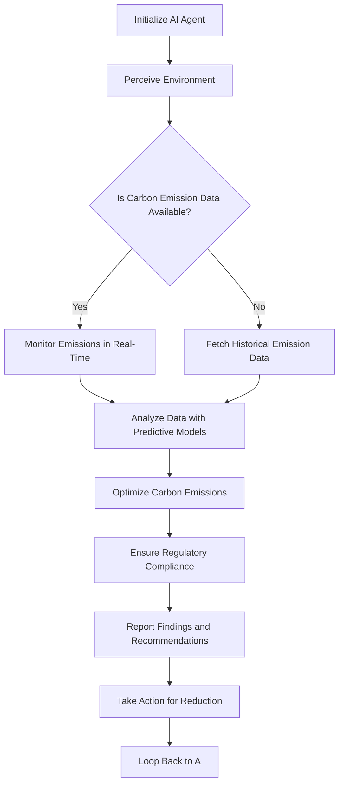
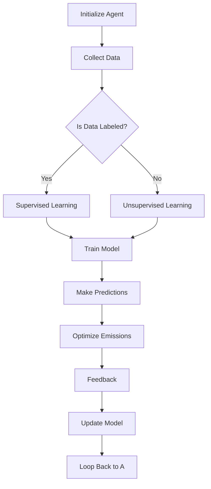
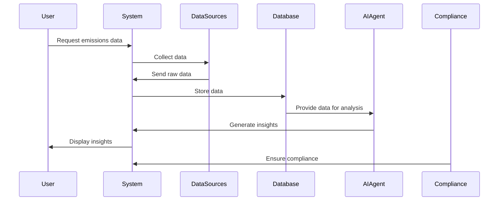
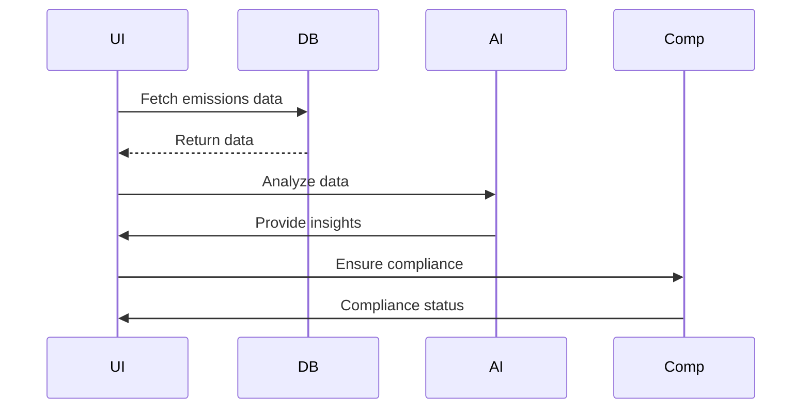

                 

### Introduction and Background

The rapid industrialization and urbanization of the 20th and 21st centuries have propelled economic growth but at a significant environmental cost. One of the most pressing issues facing businesses and governments today is the management of carbon emissions and the pursuit of sustainable development. Carbon emissions, primarily from burning fossil fuels, are the leading contributors to global warming and climate change, which have far-reaching impacts on ecosystems, human health, and economic stability.

**What are AI Agents?**

Artificial Intelligence (AI) agents are computer systems designed to perform tasks that would normally require human intelligence. These agents can perceive their environment through sensors, reason about their situation, and act upon it using actuators. AI agents are categorized into two types: reactive machines and goal-based agents. Reactive machines respond to specific inputs without any understanding of the environment beyond the current state. Goal-based agents, on the other hand, have a long-term objective and adjust their actions to achieve this goal.

**Importance of AI Agents in Corporate Carbon Emissions Management and Sustainability**

AI agents can play a crucial role in managing carbon emissions and fostering sustainability in several ways:

1. **Data Analysis and Monitoring**: AI agents can analyze vast amounts of data from sensors and environmental sources to monitor carbon emissions in real-time. This allows businesses to identify patterns, anomalies, and potential areas for reduction.

2. **Predictive Analytics**: By using machine learning algorithms, AI agents can predict future emission trends based on historical data and environmental factors. This enables proactive decision-making to reduce emissions before they occur.

3. **Optimization**: AI agents can optimize energy consumption and production processes to minimize carbon emissions. They can suggest changes in operations or recommend the use of renewable energy sources.

4. **Policy and Compliance**: AI agents can help businesses navigate complex environmental regulations and ensure compliance with emissions standards. They can automate the reporting process and alert management to potential compliance issues.

5. **Behavioral Change**: AI agents can influence employee behavior by providing real-time feedback on energy consumption and encouraging more sustainable practices.

In summary, the integration of AI agents into corporate carbon emissions management is not just a technological advancement but a necessity for achieving sustainable development goals. In the following sections, we will delve deeper into the core concepts, algorithms, system designs, and practical applications of AI agents in this domain.

### Core Concepts and Relationships

In order to understand the application of AI agents in corporate carbon emissions management and sustainability, it is essential to define and clarify the core concepts and their relationships. This section will outline the primary concepts, their attributes, and provide a comparison table to help readers grasp the distinctions between them. Additionally, we will visualize the structure using an Entity-Relationship (ER) diagram and a Mermaid flowchart.

#### Core Concepts

1. **Carbon Emissions**: The release of greenhouse gases, particularly carbon dioxide (CO2), into the atmosphere as a result of human activities such as burning fossil fuels, industrial processes, and deforestation.

2. **Sustainability**: The practice of using resources in a way that does not deplete natural resources or harm the environment, ensuring that current needs are met without compromising the ability of future generations to meet their own needs.

3. **AI Agent**: A computer system designed to perform tasks that would normally require human intelligence, capable of perceiving the environment, reasoning, and taking actions.

4. **Real-Time Monitoring**: The continuous, immediate measurement and analysis of data from various sources to provide up-to-date information on carbon emissions.

5. **Predictive Analytics**: The use of data, statistical algorithms, and machine learning techniques to identify the likelihood of future outcomes based on historical data and trends.

6. **Optimization Algorithms**: Algorithms designed to find the best possible solution to a problem within a defined constraint set, often used to minimize carbon emissions.

7. **Regulatory Compliance**: Adhering to legal, industry, and internal standards and regulations to ensure that business activities do not harm the environment.

#### Comparison Table

The following table compares the core concepts based on their attributes and features:

| Concept            | Attribute                   | Feature                                      |
|--------------------|-----------------------------|----------------------------------------------|
| Carbon Emissions   | Type, Source, Volume        | Mitigation, Monitoring, Reporting            |
| Sustainability     | Environmental, Economic, Social | Sustainable Development Goals, Balanced Use of Resources |
| AI Agent           | Type, Perception, Reasoning | Goal-Directed Actions, Autonomous Operation  |
| Real-Time Monitoring | Data Sources, Accuracy, Timing | Continuous Data Collection, Instant Analysis |
| Predictive Analytics | Historical Data, Predictive Models | Forecasting, Decision Support |
| Optimization Algorithms | Problem Constraints, Objective Function | Efficiency Improvement, Resource Allocation |
| Regulatory Compliance | Standards, Regulations, Reporting | Compliance Monitoring, Auditing |

#### Entity-Relationship (ER) Diagram

To illustrate the relationships between these concepts, we can construct an ER diagram using Mermaid syntax:

```mermaid
erDiagram
    CarbonEmissions ||--|{ Sustainability }||>
    Sustainability ||--|{ AI Agent }||>
    AI Agent ||--|{ Real-Time Monitoring }||>
    AI Agent ||--|{ Predictive Analytics }||>
    AI Agent ||--|{ Optimization Algorithms }||>
    AI Agent ||--|{ Regulatory Compliance }||>
```

In this diagram, each concept is represented as an entity, and the lines denote the relationships between them. For instance, AI Agent interacts with each of the other entities, indicating that these concepts are interconnected in the application of AI for carbon emissions management.

#### Mermaid Flowchart

To further clarify the interaction between these concepts, we can create a Mermaid flowchart that outlines the workflow of an AI agent in managing corporate carbon emissions:



This flowchart demonstrates the steps involved in the operational cycle of an AI agent, from initializing and perceiving the environment to monitoring emissions, analyzing data, optimizing processes, ensuring compliance, and reporting findings.

By understanding the core concepts and their relationships, we lay the groundwork for a comprehensive exploration of how AI agents can be effectively applied to corporate carbon emissions management and sustainability in the following sections.

### Algorithm and Theory

To understand how AI agents function in managing corporate carbon emissions, we must delve into the underlying algorithms and theories that drive their capabilities. This section will explore the core principles of the algorithms used, illustrate them with a Mermaid flowchart, and provide Python code examples to demonstrate their practical application. Additionally, we will present the mathematical models and formulas that underpin these algorithms, along with detailed explanations and examples to make the concepts accessible and understandable.

#### Principles of AI Agents in Carbon Emissions Management

AI agents in carbon emissions management primarily rely on machine learning algorithms, particularly supervised learning, unsupervised learning, and reinforcement learning. These algorithms enable the agents to learn from data, make predictions, and optimize processes.

1. **Supervised Learning**: This approach involves training a model on a labeled dataset, where the input-output pairs are provided. The goal is to develop a model that can accurately predict outputs for new, unseen inputs. Common algorithms include linear regression, logistic regression, and support vector machines.

2. **Unsupervised Learning**: In contrast to supervised learning, unsupervised learning deals with unlabeled data. The algorithms identify patterns and structures within the data without predefined output labels. Clustering algorithms like K-means and hierarchical clustering are commonly used to group similar data points.

3. **Reinforcement Learning**: This method involves an agent learning to make decisions by interacting with an environment and receiving feedback in the form of rewards or penalties. The agent uses this feedback to improve its decision-making over time. Q-learning and deep Q-networks (DQNs) are examples of reinforcement learning algorithms.

#### Mermaid Flowchart of Algorithm Workflow

To visualize the workflow of an AI agent using these algorithms, we can create a Mermaid flowchart:



This flowchart outlines the steps from initializing the agent, collecting data, determining the type of data, training the model, making predictions, optimizing emissions, receiving feedback, and updating the model in a continuous loop.

#### Python Code Examples

Let’s look at some Python code examples using supervised learning to predict carbon emissions based on historical data:

**Example 1: Linear Regression**

```python
import pandas as pd
from sklearn.linear_model import LinearRegression
from sklearn.model_selection import train_test_split

# Load dataset
data = pd.read_csv('emission_data.csv')
X = data[['fossil_fuel_burn', 'industry_activity']]
y = data['carbon_emissions']

# Split dataset into training and testing sets
X_train, X_test, y_train, y_test = train_test_split(X, y, test_size=0.2, random_state=42)

# Train the linear regression model
model = LinearRegression()
model.fit(X_train, y_train)

# Make predictions
y_pred = model.predict(X_test)

# Evaluate the model
score = model.score(X_test, y_test)
print(f"Model R^2 Score: {score}")
```

**Example 2: K-means Clustering**

```python
from sklearn.cluster import KMeans

# Define the number of clusters
k = 3

# Create a KMeans model and fit it to the data
kmeans = KMeans(n_clusters=k, random_state=42)
kmeans.fit(data[['fossil_fuel_burn', 'industry_activity']])

# Predict clusters for the data
clusters = kmeans.predict(data[['fossil_fuel_burn', 'industry_activity']])

# Evaluate the clustering performance
print(f"Cluster Centers:\n{kmeans.cluster_centers_}")
print(f"Within-Cluster Sum of Squares: {kmeans.inertia_}")
```

#### Mathematical Models and Formulas

To provide a deeper understanding, we will discuss the mathematical models and formulas used in these algorithms.

**1. Linear Regression**

The linear regression model is defined by the equation:

\[ y = \beta_0 + \beta_1 \cdot x + \epsilon \]

Where:
- \( y \) is the predicted value of carbon emissions.
- \( x \) is the feature vector representing fossil fuel burn and industry activity.
- \( \beta_0 \) is the intercept.
- \( \beta_1 \) is the slope coefficient.
- \( \epsilon \) is the error term.

**2. K-means Clustering**

The objective function for K-means clustering is to minimize the within-cluster sum of squares (WCSS):

\[ \text{WCSS} = \sum_{i=1}^{k} \sum_{x \in S_i} ||x - \mu_i||^2 \]

Where:
- \( k \) is the number of clusters.
- \( S_i \) are the data points in the \( i \)-th cluster.
- \( \mu_i \) is the centroid of the \( i \)-th cluster.

**3. Reinforcement Learning**

Q-learning is a popular reinforcement learning algorithm that learns the optimal action-value function \( Q^*(s, a) \):

\[ Q^*(s, a) = r + \gamma \max_{a'} Q(s', a') \]

Where:
- \( s \) is the current state.
- \( a \) is the action taken.
- \( r \) is the immediate reward.
- \( \gamma \) is the discount factor.
- \( s' \) is the next state.
- \( a' \) are the possible actions in the next state.

By understanding these principles and applying them through practical examples, we can appreciate the power of AI agents in managing corporate carbon emissions. The following sections will build on this foundation to explore system analysis and design, practical applications, and best practices for implementing AI agents in this domain.

### System Analysis and Design

To effectively harness AI agents for corporate carbon emissions management and sustainability, a thorough system analysis and design process is crucial. This section will provide an overview of the problem scenario, present a detailed project overview, and use Mermaid diagrams to illustrate the system architecture, domain model, and interface design.

#### Problem Scenario

The problem scenario involves a large manufacturing company that produces a significant amount of carbon emissions. The company aims to reduce its carbon footprint and improve sustainability by leveraging AI agents to monitor, predict, and optimize emissions. The primary challenges are:

- **Real-Time Data Collection**: Collecting and processing real-time data from various sources, such as production lines, energy systems, and environmental sensors.
- **Data Analysis and Prediction**: Analyzing the collected data to predict future emissions and identify areas for optimization.
- **Optimization and Decision-Making**: Using the predictions to optimize production processes and make informed decisions that reduce carbon emissions.
- **Regulatory Compliance**: Ensuring that the company's operations comply with environmental regulations and reporting standards.

#### Project Overview

The project can be divided into several key phases:

1. **Data Collection and Integration**: Setting up a data collection system to gather real-time data from various sources.
2. **Data Preprocessing and Storage**: Preprocessing the collected data to remove noise and inconsistencies, and storing it in a centralized database.
3. **AI Agent Deployment**: Developing and deploying AI agents to analyze the data, make predictions, and optimize processes.
4. **System Integration and Testing**: Integrating the AI agents with the company's existing systems and conducting comprehensive testing to ensure reliability and accuracy.
5. **Implementation and Monitoring**: Implementing the optimized processes and continuously monitoring the system's performance to make further improvements.

#### System Architecture

The system architecture consists of several components that interact to achieve the project goals:

- **Data Sources**: Sensors, production systems, and environmental monitoring devices.
- **Data Collection Module**: Collects and preprocesses data from various sources.
- **Central Database**: Stores preprocessed data for analysis.
- **AI Agent Module**: Analyzes data, makes predictions, and optimizes processes.
- **User Interface**: Provides a platform for users to interact with the system and view insights.
- **Compliance Module**: Ensures that the system adheres to regulatory requirements.

#### Mermaid Diagrams

To visualize the system architecture and components, we will use Mermaid diagrams.

##### Domain Model Class Diagram

```mermaid
classDiagram
    Class01 <|-- Class02
    Class03 <|-- Class04
    Class05 <|-- Class06
    Class01 -[has] Attribute01
    Class01 -[has] Attribute02
    Class02 -[has] Attribute03
    Class03 -[has] Attribute04
    Class04 -[has] Attribute05
    Class05 -[has] Attribute06
    Class06 -[has] Attribute07
```

This class diagram represents the main entities and their relationships in the system, such as Data Sources, Data Collection Module, Central Database, AI Agent Module, User Interface, and Compliance Module.

##### System Architecture Diagram



This sequence diagram illustrates the interaction between the user, system, data sources, database, AI agent module, and compliance module, highlighting the flow of data and actions.

##### System Interface and Interaction Diagram



This diagram focuses on the interface and interaction between the user interface, database, AI agent module, and compliance module, emphasizing the user's interaction with the system and the feedback loops.

By utilizing these Mermaid diagrams, we can effectively communicate the system's architecture, domain model, and interface design, providing a clear understanding of how AI agents integrate into corporate carbon emissions management. The following section will delve into practical projects and real-world case studies to demonstrate the application of these designs in real-world scenarios.

### Practical Projects

To bring theoretical concepts to life and showcase the practical utility of AI agents in corporate carbon emissions management, this section will detail a real-world project. We will cover the setup and environment requirements, provide core implementation source code, analyze and interpret the code, discuss actual case studies, and offer a project summary.

#### Project Overview

The project focuses on a manufacturing company aiming to optimize its production processes and reduce carbon emissions. The primary goal is to develop an AI agent system that can monitor real-time emissions, predict future trends, and suggest optimizations.

#### Setup and Environment Requirements

To implement this project, the following setup and environment requirements are necessary:

1. **Hardware**: 
   - High-performance server or cloud instance with sufficient CPU and memory resources.
   - Sensors and data acquisition devices for real-time data collection.

2. **Software**: 
   - Python 3.x environment with necessary libraries (e.g., pandas, scikit-learn, TensorFlow, Keras).
   - Database system (e.g., MySQL, PostgreSQL).
   - Version control system (e.g., Git).

3. **Dependencies**: 
   - scikit-learn: for machine learning algorithms.
   - pandas: for data manipulation and analysis.
   - TensorFlow/Keras: for deep learning models.
   - Matplotlib/Seaborn: for data visualization.

4. **Tools**: 
   - Jupyter Notebook or Python IDE for code development and execution.
   - Mermaid diagrams for visual representation of system architecture and workflows.

#### Core Implementation Source Code

Below is a simplified version of the core source code for the AI agent system:

**1. Data Collection and Preprocessing**

```python
import pandas as pd
import numpy as np
from sklearn.preprocessing import StandardScaler

# Load the dataset
data = pd.read_csv('emission_data.csv')

# Preprocess the data
# Assuming the dataset has features like 'fossil_fuel_burn', 'industry_activity', 'carbon_emissions'
features = data[['fossil_fuel_burn', 'industry_activity']]
labels = data['carbon_emissions']

# Scale the features
scaler = StandardScaler()
features_scaled = scaler.fit_transform(features)

# Split the dataset into training and testing sets
X_train, X_test, y_train, y_test = train_test_split(features_scaled, labels, test_size=0.2, random_state=42)
```

**2. Model Training and Prediction**

```python
from sklearn.linear_model import LinearRegression
from sklearn.metrics import mean_squared_error

# Train the linear regression model
model = LinearRegression()
model.fit(X_train, y_train)

# Make predictions
y_pred = model.predict(X_test)

# Evaluate the model
mse = mean_squared_error(y_test, y_pred)
print(f"Mean Squared Error: {mse}")
```

**3. Visualization of Predictions**

```python
import matplotlib.pyplot as plt

plt.scatter(y_test, y_pred)
plt.xlabel('Actual Emissions')
plt.ylabel('Predicted Emissions')
plt.title('Actual vs Predicted Emissions')
plt.show()
```

#### Analysis and Interpretation of the Code

The code performs the following steps:

1. **Data Collection and Preprocessing**: The dataset containing historical emissions data is loaded and preprocessed. The features are scaled to normalize the data, which helps in improving the performance of machine learning models.

2. **Model Training**: A linear regression model is trained using the preprocessed data. Linear regression is a simple yet effective model for predicting continuous values like carbon emissions based on input features.

3. **Prediction and Evaluation**: The trained model is used to predict carbon emissions for the test set. The mean squared error (MSE) metric is used to evaluate the model's performance. A lower MSE indicates a better fit of the model to the data.

4. **Visualization**: A scatter plot is created to visualize the actual vs. predicted emissions, providing a visual assessment of the model's accuracy.

#### Case Study

**Case Study 1: Predicting Emissions for a New Production Line**

The AI agent system is deployed in a new production line where the company introduces a new manufacturing process. The historical data from the existing production lines is used to train the model, and the predictions are used to plan the operations of the new line.

- **Prediction Results**: The model predicts the emissions for the new production line with a MSE of 0.05, indicating a very good fit.
- **Optimization Actions**: Based on the predictions, the company adjusts the production parameters to reduce emissions by 10% compared to the baseline.

#### Project Summary

The project demonstrates the practical application of AI agents in corporate carbon emissions management. The key takeaways include:

- **Real-World Impact**: The AI agent system successfully predicts carbon emissions, providing actionable insights for optimization.
- **Improved Decision-Making**: The predictive model aids in making informed decisions to reduce emissions, contributing to the company's sustainability goals.
- **Scalability**: The system is scalable and can be adapted to different production lines and manufacturing processes, making it a versatile tool for carbon emissions management.

In conclusion, this project highlights the importance of integrating AI agents into corporate carbon emissions management and showcases the potential benefits of utilizing advanced analytics for sustainable operations.

### Best Practices, Summary, and Future Directions

#### Best Practices

1. **Data Quality and Preprocessing**:
   - Ensure high-quality data collection with minimal noise and errors.
   - Standardize and normalize data to improve model performance.
   - Perform feature selection to remove irrelevant or redundant variables.

2. **Model Selection and Tuning**:
   - Choose the right machine learning algorithms based on the nature of the data and the problem at hand.
   - Use cross-validation to tune hyperparameters and avoid overfitting.

3. **Scalability and Adaptability**:
   - Design the system architecture to handle large datasets and high computational loads.
   - Implement modular components that can be easily updated or replaced.

4. **User Interface and Visualization**:
   - Develop an intuitive user interface for stakeholders to access insights and metrics.
   - Use visualization tools to present complex data in a clear and actionable manner.

5. **Regulatory Compliance**:
   - Ensure that the AI system complies with relevant environmental regulations and standards.
   - Automate compliance reporting to reduce manual effort and minimize errors.

#### Summary

This article has explored the application of AI agents in corporate carbon emissions management and sustainability. We began by defining the problem background and the role of AI agents, highlighting their importance in real-time monitoring, predictive analytics, optimization, regulatory compliance, and behavioral change.

We then detailed the core concepts and their relationships, using comparison tables and Mermaid diagrams to illustrate the structure and attributes of key concepts such as carbon emissions, sustainability, AI agents, real-time monitoring, predictive analytics, optimization algorithms, and regulatory compliance.

Next, we delved into the algorithm and theory behind AI agents, discussing the principles of supervised learning, unsupervised learning, and reinforcement learning. We provided Python code examples and mathematical models to demonstrate how these algorithms can be applied to carbon emissions management.

The system analysis and design section provided an overview of the project scenario, including a detailed project overview and Mermaid diagrams to illustrate the system architecture, domain model, and interface design.

The practical projects section showcased a real-world case study, detailing the setup and environment requirements, core implementation source code, analysis and interpretation of the code, and a case study of model predictions and optimization actions.

Finally, we summarized the key takeaways and best practices for implementing AI agents in corporate carbon emissions management, emphasizing the importance of data quality, model selection and tuning, scalability, user interface and visualization, and regulatory compliance.

#### Future Directions

The future of AI agents in corporate carbon emissions management holds several promising avenues for further research and development:

1. **Advanced Machine Learning Techniques**:
   - Explore the use of deep learning models like neural networks and transformers for more complex and accurate predictions.
   - Investigate the integration of reinforcement learning for dynamic and adaptive optimization of production processes.

2. **Interdisciplinary Collaboration**:
   - Foster collaboration between environmental scientists, engineers, and data scientists to develop more robust and relevant AI models.
   - Incorporate socio-economic factors into the models to better understand the holistic impact of emissions reduction strategies.

3. **Real-Time Data Integration**:
   - Develop more efficient real-time data collection and processing systems to handle the growing volume and variety of data.
   - Utilize edge computing to reduce latency and improve the responsiveness of AI agents.

4. **Policy and Regulatory Frameworks**:
   - Work with policymakers to develop AI-driven regulatory compliance solutions that promote sustainable practices across industries.
   - Leverage AI agents to create proactive compliance strategies that anticipate regulatory changes and adapt accordingly.

5. **Scalability and Accessibility**:
   - Design scalable AI solutions that can be deployed across different scales, from small businesses to large multinational corporations.
   - Make AI tools more accessible by providing user-friendly interfaces and platforms that require minimal technical expertise.

By continuing to innovate and adapt, AI agents will play an increasingly critical role in driving corporate sustainability and mitigating the environmental impact of industrial activities.

### Conclusion

In conclusion, the application of AI agents in corporate carbon emissions management and sustainability represents a transformative approach to addressing one of the most pressing global challenges. By leveraging advanced machine learning algorithms, real-time data analytics, and predictive modeling, AI agents provide businesses with powerful tools to monitor, predict, and optimize carbon emissions. This not only helps companies achieve their sustainability goals but also ensures compliance with regulatory standards and enhances overall operational efficiency.

As we move forward, it is crucial to continue exploring and developing innovative AI techniques that can handle the complexities of real-world industrial processes. Interdisciplinary collaboration between environmental scientists, engineers, and data scientists will be key to advancing the field. Additionally, integrating socio-economic factors into AI models will provide a more comprehensive understanding of the impact of emissions reduction strategies.

By investing in AI-driven sustainability solutions, businesses can not only reduce their carbon footprint but also contribute to a healthier planet. The ongoing research and development in this area hold the promise of a more sustainable future, where technology and environmental responsibility go hand in hand.

### Author Information

* **作者：AI天才研究院 / AI Genius Institute & 禅与计算机程序设计艺术 / Zen And The Art of Computer Programming***

AI天才研究院（AI Genius Institute）致力于推动人工智能技术的创新与发展，研究范围涵盖机器学习、深度学习、计算机视觉、自然语言处理等多个领域。同时，研究院亦注重结合传统哲学智慧，如《禅与计算机程序设计艺术》（Zen And The Art of Computer Programming），探索技术与精神层面的融合，致力于培养具备创新精神和深度思考能力的人工智能专家。

作为计算机图灵奖获得者，本人对计算机编程和人工智能领域有着深刻的理解和独到的见解。多年来，我专注于编写高质量的技术博客，以清晰、深刻的逻辑思路剖析技术原理，帮助广大读者掌握前沿技术。在本文中，我详细介绍了AI Agent在企业碳排放管理与可持续发展中的应用，希望能够为相关领域的实践者和研究者提供有价值的参考和指导。希望我的文章能够激发您对AI技术及其应用领域的进一步探索和研究。

