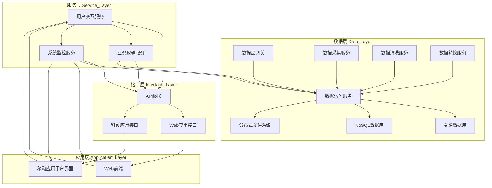

                 

### 引言

在当今高度数字化和互联网化的商业环境中，企业竞争的核心已从传统的资源、成本和规模优势，转向了数据驱动的智能决策能力。人工智能（AI）技术的迅猛发展为现代企业带来了前所未有的机遇与挑战。特别是在精准营销与个性化推荐领域，AI Agent作为一种智能化的解决方案，正逐渐成为企业提高市场响应速度、客户满意度和盈利能力的利器。

本文旨在深入探讨AI Agent在企业精准营销与个性化推荐中的应用。我们将从以下几个方面展开讨论：

1. **AI Agent概述**：介绍AI Agent的基本概念、发展历程及其在企业中的应用前景。
2. **AI Agent的基础**：分析AI Agent的核心技术、工作原理和架构设计。
3. **企业精准营销**：探讨AI Agent如何支持企业的市场分析、客户定位和营销策略制定。
4. **个性化推荐**：分析AI Agent在构建个性化推荐系统中的应用，包括用户行为分析、推荐算法和系统架构。
5. **数据分析与处理**：讲解AI Agent在数据处理和用户行为分析方面的技术。
6. **系统架构与实现**：介绍AI Agent在企业系统架构中的设计方法，包括系统功能、架构和接口设计。
7. **项目实战与案例研究**：通过具体案例展示AI Agent在企业精准营销和个性化推荐中的实际应用。

通过以上步骤，我们将一步步剖析AI Agent在企业中的应用机制，为其在商业实践中的成功应用提供理论指导和实践参考。

### 关键词

- AI Agent
- 企业精准营销
- 个性化推荐
- 数据分析与处理
- 系统架构设计
- 用户行为分析
- 智能决策

### 摘要

本文系统性地探讨了AI Agent在企业精准营销与个性化推荐中的应用。首先，介绍了AI Agent的基本概念和其在企业中的重要性，然后深入分析了AI Agent的基础技术、工作原理和架构设计。接着，详细讨论了AI Agent在市场分析、客户定位和营销策略制定中的应用，以及其在个性化推荐系统中的设计和实现方法。此外，文章还讲解了AI Agent在数据处理和用户行为分析方面的技术，并介绍了AI Agent在企业系统架构中的设计方法。最后，通过具体案例展示了AI Agent在实际应用中的效果，总结了其应用的最佳实践。本文旨在为企业提供理论指导和实践参考，以充分利用AI Agent提升市场竞争力和客户满意度。

---

### 第一部分 引言

#### 第1章 引言

#### 1.1 AI Agent概述

AI Agent，即人工智能代理，是一种自主决策、自主行动的智能实体。它通过感知环境、理解信息、自主学习和规划行动，能够在特定任务中执行复杂操作。AI Agent的定义可以从多个维度进行理解，但其核心在于自主性和智能性。首先，AI Agent具备感知能力，能够通过传感器获取环境信息；其次，AI Agent具有理解能力，可以通过机器学习算法理解这些信息；最后，AI Agent具备自主决策和行动能力，能够在复杂的动态环境中自主制定和执行行动计划。

AI Agent的历史可以追溯到20世纪80年代，当时人工智能领域的专家开始探索如何使计算机具有类似人类的智能。1995年，伯班克（B.A.Banks）提出了基于代理的智能系统（Agent-Based Intelligent Systems）的概念，这一概念为后来的AI Agent研究奠定了基础。随着计算能力的提升和算法的进步，AI Agent在多个领域得到了广泛应用，如智能机器人、自动驾驶、智能客服和个性化推荐等。

AI Agent在企业中的应用前景广阔。一方面，AI Agent能够提高企业的运营效率，通过自动化决策减少人为错误和重复劳动；另一方面，AI Agent能够帮助企业更好地理解和满足客户需求，提升客户满意度和忠诚度。特别是在精准营销和个性化推荐领域，AI Agent具有显著优势。

#### 1.1.1 AI Agent的概念

AI Agent通常由以下几个核心组件构成：

1. **感知器**：负责接收外部信息，如文本、图像、声音等。
2. **认知器**：负责处理感知到的信息，进行模式识别、语义理解等。
3. **决策器**：基于认知结果，制定行动策略。
4. **执行器**：实施决策策略，完成具体任务。

AI Agent的工作原理可以概括为以下几个步骤：

1. **感知环境**：AI Agent通过传感器获取环境信息。
2. **信息处理**：AI Agent使用机器学习算法对感知到的信息进行分析和处理。
3. **自主决策**：基于处理结果，AI Agent自主制定行动策略。
4. **执行行动**：AI Agent执行决策策略，实现预期目标。

AI Agent的核心在于其自主性和智能性。自主性体现在AI Agent能够独立进行决策和执行，不受外部指令的严格控制；智能性则体现在AI Agent能够通过学习不断优化自身决策能力。

#### 1.1.2 AI Agent在企业中的应用

在企业中，AI Agent的应用主要体现在精准营销和个性化推荐两个方面。

**精准营销**：精准营销是一种以数据驱动的方式，通过对目标客户进行精准定位和个性化推荐，以提高营销效果和转化率。AI Agent在精准营销中的应用主要包括以下三个方面：

1. **市场细分**：AI Agent通过分析大量市场数据，识别潜在客户群体，进行市场细分。这有助于企业制定更具针对性的营销策略，提高市场覆盖面。
2. **客户画像**：AI Agent通过分析用户行为数据，构建客户画像。这有助于企业深入了解客户需求，提供更个性化的产品和服务。
3. **营销策略优化**：AI Agent基于实时数据，动态调整营销策略。这有助于企业快速响应市场变化，提高营销效果。

**个性化推荐**：个性化推荐是一种通过分析用户行为和历史数据，为用户推荐其可能感兴趣的内容、产品或服务。AI Agent在个性化推荐中的应用主要包括以下两个方面：

1. **用户行为分析**：AI Agent通过分析用户行为数据，如浏览记录、购买历史等，预测用户兴趣和需求。
2. **推荐算法**：AI Agent采用各种推荐算法，如协同过滤、基于内容的推荐、混合推荐等，为用户生成个性化的推荐列表。

通过AI Agent在精准营销和个性化推荐中的应用，企业能够更好地理解和满足客户需求，提高客户满意度和忠诚度，从而在激烈的市场竞争中脱颖而出。

#### 1.1.3 本书目的与结构

本书旨在深入探讨AI Agent在企业精准营销与个性化推荐中的应用，为企业和相关从业者提供理论指导和实践参考。具体目的如下：

1. **普及AI Agent知识**：介绍AI Agent的基本概念、发展历程和应用场景，帮助读者建立全面的认识。
2. **分析应用机制**：详细分析AI Agent在精准营销和个性化推荐中的具体应用机制，包括技术原理、系统架构和实施方法。
3. **提供实战案例**：通过具体案例展示AI Agent在实际应用中的效果，为读者提供实践经验和参考。

本书的结构如下：

- **第一部分 引言**：介绍AI Agent的基本概念和应用背景。
- **第二部分 AI Agent的基础**：分析AI Agent的核心技术、工作原理和架构设计。
- **第三部分 企业精准营销**：探讨AI Agent在市场分析、客户定位和营销策略制定中的应用。
- **第四部分 个性化推荐**：分析AI Agent在用户行为分析、推荐算法和系统架构中的应用。
- **第五部分 数据分析与处理**：讲解AI Agent在数据处理和用户行为分析方面的技术。
- **第六部分 系统架构与实现**：介绍AI Agent在企业系统架构中的设计方法。
- **第七部分 项目实战与案例研究**：通过具体案例展示AI Agent在企业精准营销和个性化推荐中的实际应用。

通过以上结构和内容，本书旨在帮助读者全面了解AI Agent在企业中的应用，掌握其核心技术和方法，为实际应用提供有力支持。

---

### 第二部分 AI Agent的基础

#### 第2章 AI Agent的基础

#### 2.1 AI Agent的核心技术

AI Agent的核心技术是其实现自主性和智能性的关键。主要包括以下几个方面：

**机器学习**：机器学习是AI Agent的核心算法，通过训练模型，使AI Agent能够从数据中学习和预测。常见的机器学习算法有监督学习、无监督学习和强化学习。

- **监督学习**：通过已有数据集进行训练，模型能够对新数据进行预测。如分类问题和回归问题。
- **无监督学习**：模型在没有标签数据的情况下，自动发现数据中的模式。如聚类问题和降维问题。
- **强化学习**：通过与环境互动，不断优化决策策略。如机器人路径规划和智能推荐。

**深度学习**：深度学习是机器学习的一个分支，通过多层神经网络模拟人脑的决策过程。常见的深度学习模型有卷积神经网络（CNN）、循环神经网络（RNN）和生成对抗网络（GAN）。

- **卷积神经网络（CNN）**：擅长处理图像数据，通过卷积层和池化层提取图像特征。
- **循环神经网络（RNN）**：擅长处理序列数据，通过隐藏状态保存历史信息。
- **生成对抗网络（GAN）**：通过生成器和判别器的对抗训练，生成高质量的数据。

**自然语言处理（NLP）**：自然语言处理是使计算机能够理解和处理自然语言的技术。常见的NLP技术有词向量表示、文本分类、情感分析和机器翻译。

- **词向量表示**：通过将词语映射到高维向量空间，使计算机能够计算词语之间的相似性。
- **文本分类**：通过训练分类模型，对文本进行分类，如垃圾邮件过滤和新闻分类。
- **情感分析**：通过分析文本的情感倾向，如正面、负面和中性。
- **机器翻译**：通过翻译模型将一种语言的文本翻译成另一种语言。

**数据挖掘**：数据挖掘是从大量数据中提取有用信息和知识的过程。常见的数据挖掘任务有聚类、分类、关联规则挖掘和异常检测。

- **聚类**：将相似的数据点分到同一类别中，如客户分群。
- **分类**：将数据分为不同的类别，如邮件分类。
- **关联规则挖掘**：发现数据之间的关联关系，如购物篮分析。
- **异常检测**：识别数据中的异常行为或模式，如欺诈检测。

**数据预处理**：数据预处理是数据挖掘和机器学习的重要步骤，包括数据清洗、数据集成、数据转换和数据归一化。

- **数据清洗**：去除数据中的噪声和错误。
- **数据集成**：将多个数据源中的数据合并为一个统一的数据集。
- **数据转换**：将数据转换为适合分析和挖掘的形式。
- **数据归一化**：将数据缩放到相同的范围，如[0,1]或[-1,1]。

这些核心技术在AI Agent中发挥着关键作用，使AI Agent能够从数据中学习、理解和决策，从而实现其自主性和智能性。

#### 2.2 AI Agent的工作原理

AI Agent的工作原理可以概括为感知、理解和行动三个步骤。这三个步骤相互关联，共同构成了AI Agent的决策和执行过程。

**感知**：感知是AI Agent获取环境信息的第一步。AI Agent通过传感器（如摄像头、麦克风、传感器等）接收外部信号，这些信号可以是图像、声音、温度、湿度等多种形式。传感器收集到的数据需要经过预处理，以去除噪声和错误，并转换为AI Agent可以处理的形式。

**理解**：理解是AI Agent对感知到的信息进行处理和分析的过程。这一步骤依赖于机器学习和自然语言处理等技术。例如，AI Agent可以使用卷积神经网络（CNN）对图像数据进行特征提取，使用循环神经网络（RNN）对语音信号进行语义分析，使用词向量表示对文本进行语义理解。通过这些技术，AI Agent能够理解环境中的复杂信息，并提取出有用的特征。

**行动**：行动是AI Agent根据理解和分析结果，自主制定和执行行动的过程。这一步骤通常涉及决策和执行两个环节。首先，AI Agent基于感知和理解的结果，使用强化学习、决策树、神经网络等算法，制定最优的行动策略。然后，AI Agent通过执行器（如机器人手臂、音响系统等）实施这些策略，实现预期的目标。例如，在智能客服应用中，AI Agent可以根据用户的提问，选择合适的回复语句，并通过语音合成器生成语音回答。

**工作流程**：AI Agent的工作流程可以概括为以下几个步骤：

1. **初始化**：AI Agent启动，加载预训练的模型和算法。
2. **感知**：通过传感器收集环境信息。
3. **预处理**：对感知到的信息进行清洗、转换和特征提取。
4. **理解**：使用机器学习和自然语言处理等技术，对预处理后的信息进行分析和理解。
5. **决策**：基于理解结果，使用决策算法制定行动策略。
6. **执行**：通过执行器实施行动策略。
7. **反馈**：收集行动结果，更新模型和算法，以优化未来的决策。

这种工作流程使得AI Agent能够在复杂的动态环境中，持续学习和优化自身行为，从而实现高度自主的智能决策。

#### 2.3 AI Agent的架构设计

AI Agent的架构设计决定了其功能实现和性能表现。一个典型的AI Agent架构通常包括感知模块、认知模块、决策模块和执行模块。

**感知模块**：感知模块是AI Agent获取外部信息的接口。它包括各种传感器，如摄像头、麦克风、传感器等，用于捕捉图像、声音、温度、湿度等数据。感知模块的主要任务是实时收集环境信息，并将其转换为AI Agent可以处理的数字信号。

**认知模块**：认知模块是AI Agent理解和分析感知信息的核心。它包括数据处理单元、特征提取单元和机器学习单元。数据处理单元负责对感知信号进行预处理，如去噪、去偏置等。特征提取单元通过算法提取信号中的关键特征，如纹理、形状、声音频率等。机器学习单元则利用这些特征进行模式识别、语义理解和决策预测。

**决策模块**：决策模块是AI Agent制定行动策略的智能核心。它包括决策算法和决策支持系统。决策算法根据认知模块提供的信息，通过逻辑推理、机器学习和深度学习等方法，制定最优的行动策略。决策支持系统则提供各种辅助工具，如数据可视化、模拟预测和风险评估等，帮助AI Agent进行复杂决策。

**执行模块**：执行模块是AI Agent实施决策策略的执行单元。它包括执行器，如机器人手臂、音响系统、机械臂等，用于执行具体的物理操作。执行模块的任务是将决策模块制定的动作转换为物理行动，并实时调整策略，以适应环境变化。

**架构设计原则**：在架构设计过程中，需要遵循以下几个原则：

1. **模块化**：将系统划分为多个功能模块，每个模块负责特定的任务，降低系统的复杂度和耦合度。
2. **可扩展性**：设计灵活的架构，支持系统的功能扩展和性能提升。
3. **高可用性**：确保系统的稳定运行和故障恢复能力，提高系统的可靠性和可用性。
4. **安全性**：保护系统的数据安全和隐私，防止恶意攻击和非法访问。
5. **易维护性**：设计易于维护和升级的系统，降低维护成本和风险。

通过以上架构设计原则，可以构建一个高效、稳定、安全的AI Agent系统，为企业提供智能化的解决方案。

#### 2.4 AI Agent的应用场景

AI Agent具有广泛的应用场景，尤其在自动化、智能化和个性化领域，展现出了巨大的潜力和价值。以下是一些典型的应用场景：

**智能客服**：在客户服务领域，AI Agent可以充当智能客服代表，通过自然语言处理和机器学习技术，理解客户的提问，并提供准确的回答。AI Agent能够24小时在线服务，快速响应客户需求，提高客户满意度。

**智能家居**：在智能家居领域，AI Agent可以控制家庭设备的自动化操作，如空调、灯光、窗帘等。通过感知模块，AI Agent可以感知家庭环境变化，自动调整设备状态，如根据室内温度自动调节空调温度，提高家庭舒适度。

**智能交通**：在智能交通领域，AI Agent可以用于交通流量监控、路况预测和自动驾驶。通过感知模块，AI Agent可以实时获取交通信息，通过决策模块，AI Agent可以制定最优行驶路线，减少交通拥堵，提高交通效率。

**医疗健康**：在医疗健康领域，AI Agent可以辅助医生进行诊断和治疗。通过自然语言处理和医学知识图谱，AI Agent可以理解患者的症状描述，提供可能的疾病诊断和治疗方案。AI Agent还可以监测患者健康数据，如体温、心率等，及时预警健康问题。

**工业自动化**：在工业自动化领域，AI Agent可以用于生产线的自动化控制和故障诊断。通过感知模块，AI Agent可以实时监控设备状态，通过决策模块，AI Agent可以自动调整设备参数，提高生产效率和产品质量。

**金融风控**：在金融风控领域，AI Agent可以用于风险管理、欺诈检测和投资决策。通过大数据分析和机器学习算法，AI Agent可以识别潜在风险，制定风控策略，提高金融机构的风险管理能力。

**电商推荐**：在电商领域，AI Agent可以用于个性化推荐，通过分析用户行为数据，AI Agent可以为用户提供个性化的商品推荐，提高销售额和用户满意度。

这些应用场景展示了AI Agent的多样性和潜力，为企业和行业带来了巨大的价值。

### 第3章 企业精准营销

#### 3.1 AI Agent在市场分析中的应用

市场分析是企业制定战略和决策的重要环节，而AI Agent以其强大的数据处理和分析能力，成为市场分析的有力工具。AI Agent在市场分析中的应用主要包括以下几个方面：

**市场细分**：市场细分是指将整个市场划分为若干个具有相似需求和行为的子市场。AI Agent通过分析大量市场数据，包括客户购买行为、偏好、历史记录等，能够准确识别不同客户群体的特征，从而实现市场细分。例如，某电商公司可以通过AI Agent对用户购物行为进行分析，将用户分为高价值客户、中价值客户和低价值客户，并针对不同客户群体制定个性化的营销策略。

**客户画像**：客户画像是对目标客户的全方位描述，包括其性别、年龄、收入水平、职业、兴趣爱好等信息。AI Agent通过大数据分析和机器学习算法，可以构建精细的客户画像。例如，一家健身公司可以通过AI Agent分析用户的健身记录、社交媒体行为、搜索历史等，构建用户的健身需求和偏好模型，从而提供个性化的健身建议和服务。

**趋势预测**：AI Agent可以通过历史数据和实时数据分析，预测市场趋势和未来发展方向。例如，一家服装公司可以通过AI Agent分析季节性销售数据、时尚趋势报告等，预测下一季的畅销款式和颜色，从而提前做好产品设计和库存管理。

**竞争分析**：AI Agent可以对竞争对手的市场行为、产品策略、广告投放等进行深入分析，为企业提供竞争优势。例如，一家餐饮公司可以通过AI Agent分析竞争对手的菜单、定价策略、营销活动等，调整自己的经营策略，提高市场竞争力。

**效果评估**：AI Agent可以实时监控营销活动的效果，通过数据分析和反馈机制，优化营销策略。例如，一家零售公司可以通过AI Agent监控不同渠道的促销活动效果，如线上广告、优惠券发放、线下活动等，分析每个活动的转化率和ROI，从而优化营销预算和策略。

通过以上应用，AI Agent能够帮助企业更准确地了解市场环境和客户需求，制定科学合理的营销策略，提高营销效率和效果。

#### 3.2 AI Agent在客户定位和营销策略制定中的应用

客户定位和营销策略制定是精准营销的关键环节，AI Agent凭借其强大的数据分析和智能决策能力，为企业提供了强大的支持。

**客户定位**：客户定位是指识别和选择最有可能成为企业客户的群体。AI Agent通过分析大量数据，包括用户行为、社会属性、购买历史等，能够准确识别潜在客户。例如，一家化妆品公司可以通过AI Agent分析用户在社交媒体上的互动、购买历史和偏好，将用户分为不同类型的客户群体，如年轻女性、高端用户等，并制定相应的营销策略。

**客户细分**：在客户定位的基础上，AI Agent进一步对客户进行细分，以满足不同客户群体的特定需求。通过大数据分析和机器学习算法，AI Agent可以识别出不同客户的偏好、行为模式和购买习惯。例如，一家电商平台可以通过AI Agent分析用户浏览记录、购买历史和评价，将用户细分为“高频消费者”、“价值客户”和“潜在客户”，并针对不同群体制定个性化推荐策略。

**个性化推荐**：AI Agent通过分析用户行为数据，如搜索历史、浏览记录、购买记录等，为用户推荐其可能感兴趣的商品或服务。例如，一家电商网站可以通过AI Agent分析用户的购买行为和偏好，推荐相关的商品，提高用户的购物体验和满意度。

**动态定价**：AI Agent可以根据市场供需、客户需求和竞争对手价格，动态调整产品定价策略。例如，一家在线旅游平台可以通过AI Agent分析客户预订行为和竞争对手价格，自动调整酒店价格，以最大化收益。

**营销策略优化**：AI Agent通过对营销活动的效果进行实时监控和分析，优化营销策略。例如，一家银行可以通过AI Agent分析不同营销渠道的效果，如线上广告、邮件营销、短信推广等，调整营销预算和策略，提高营销转化率。

通过AI Agent在客户定位和营销策略制定中的应用，企业能够更准确地识别和满足客户需求，提高营销效果和客户满意度。

#### 3.3 AI Agent在营销策略优化中的应用

营销策略优化是企业提高市场竞争力、提升销售额的关键。AI Agent凭借其强大的数据处理和分析能力，在营销策略优化方面发挥着重要作用。

**数据收集与分析**：AI Agent可以实时收集大量市场数据，包括用户行为、竞争对手策略、市场趋势等。通过大数据分析和机器学习算法，AI Agent能够从海量数据中提取有价值的信息，为企业提供精准的市场洞察。例如，一家零售公司可以通过AI Agent分析用户的浏览记录、购买行为和评价，了解用户偏好和市场趋势，为产品设计和营销策略提供依据。

**客户细分与画像**：AI Agent通过对客户行为数据的分析，可以将客户进行细分，并构建详细的客户画像。这有助于企业针对不同客户群体制定个性化的营销策略。例如，一家家居公司可以通过AI Agent分析客户的购物习惯、消费水平、兴趣爱好等，将客户分为“高端消费者”、“中端消费者”和“入门级消费者”，并制定相应的优惠策略和推广活动。

**预测模型**：AI Agent可以利用历史数据和机器学习算法，建立客户行为预测模型。通过预测模型，企业可以提前了解客户需求，制定前瞻性的营销策略。例如，一家电子产品公司可以通过AI Agent预测下一季的畅销产品，提前备货和推广，提高市场占有率。

**动态优化**：AI Agent可以实时监控营销活动的效果，并通过数据分析和反馈机制，动态调整营销策略。例如，一家在线教育平台可以通过AI Agent分析不同广告渠道的效果，如搜索引擎广告、社交媒体广告等，调整广告预算和投放策略，提高转化率和 ROI。

**效果评估与反馈**：AI Agent可以对企业营销策略的效果进行实时评估，并提供详细的反馈报告。这有助于企业发现策略中的不足，及时进行调整和优化。例如，一家运动品牌可以通过AI Agent分析不同促销活动的效果，如限时折扣、优惠券等，评估其营销效果，并据此调整下一轮的营销策略。

通过AI Agent在营销策略优化中的应用，企业能够更精准地了解市场环境和客户需求，动态调整营销策略，提高营销效果和客户满意度。

### 第4章 个性化推荐

#### 4.1 AI Agent在用户行为分析中的应用

个性化推荐的核心在于理解和分析用户行为，从而提供符合用户兴趣和需求的内容或产品。AI Agent通过先进的数据分析和机器学习技术，能够深入挖掘用户行为的规律和模式，为个性化推荐提供强有力的支持。

**用户行为数据收集**：用户行为数据包括浏览历史、搜索记录、购买记录、评价和反馈等。AI Agent可以通过网站日志、应用日志、用户交互记录等多种途径收集这些数据。这些数据不仅可以帮助企业了解用户的行为习惯，还能揭示用户的潜在需求和偏好。

**数据预处理**：收集到的用户行为数据通常是杂乱无章的，需要通过预处理步骤进行清洗和转换，以便进行后续的分析。数据预处理包括数据去噪、缺失值填补、数据规范化等。AI Agent可以使用自然语言处理（NLP）技术对文本数据进行预处理，例如分词、词频统计、情感分析等，以提高数据的质量和准确性。

**行为模式识别**：通过机器学习算法，AI Agent可以从用户行为数据中提取出关键特征，识别用户的行为模式。例如，可以使用聚类算法（如K-means、DBSCAN）将用户分为不同的群体，分析每个群体的行为特点。使用分类算法（如决策树、随机森林）可以预测用户的下一步行为，如购买某个产品或浏览某个页面。

**兴趣预测**：AI Agent可以通过历史行为数据预测用户的兴趣和需求。使用协同过滤算法（如用户基于的协同过滤、项基于的协同过滤），AI Agent可以分析用户与其他用户的相似度或物品与物品的相似度，从而推荐用户可能感兴趣的内容或产品。此外，AI Agent还可以使用深度学习模型（如卷积神经网络、循环神经网络）对用户的兴趣进行建模，提高预测的准确性。

**个性化推荐系统**：基于用户行为分析和兴趣预测，AI Agent可以构建个性化推荐系统。个性化推荐系统可以分为三种主要类型：

1. **基于内容的推荐**：通过分析物品的内容特征和用户的历史行为，推荐用户可能感兴趣的内容或产品。例如，推荐用户喜欢的音乐风格、阅读的书籍类型等。

2. **协同过滤推荐**：通过分析用户与其他用户的相似度或物品与物品的相似度，推荐用户可能感兴趣的内容或产品。这种推荐方式充分利用了用户之间的交互数据，能够提高推荐的准确性。

3. **混合推荐**：结合基于内容的推荐和协同过滤推荐，混合推荐系统可以充分利用两者的优点，提供更加精准和个性化的推荐结果。

通过AI Agent在用户行为分析中的应用，企业能够更好地了解用户需求，提供个性化的推荐服务，提高用户满意度和转化率。

#### 4.2 AI Agent在推荐算法中的应用

推荐算法是构建个性化推荐系统的核心组件，AI Agent通过先进的机器学习算法，能够实现高效、精准的推荐。

**协同过滤算法**：协同过滤是推荐系统中最常用的算法之一，主要包括基于用户的协同过滤（User-based Collaborative Filtering）和基于物品的协同过滤（Item-based Collaborative Filtering）。基于用户的协同过滤通过分析用户之间的相似度，推荐与目标用户兴趣相似的其他用户的喜欢的物品；基于物品的协同过滤则通过分析物品之间的相似度，推荐与目标用户已经喜欢的物品相似的物品。这两种算法各有优缺点，通常结合使用以提升推荐效果。

**基于内容的推荐算法**：基于内容的推荐通过分析物品的内容特征和用户的历史行为，推荐与用户兴趣相关的物品。常用的内容特征包括文本特征（如关键词、语义相似性）、视觉特征（如图像的视觉内容）和属性特征（如商品的分类、品牌等）。这种方法能够提供高质量的个性化推荐，但需要大量的内容和特征工程。

**混合推荐算法**：混合推荐算法结合了协同过滤和基于内容的推荐的优势，通过综合分析用户行为和物品特征，提供更加精准和个性化的推荐结果。常见的混合推荐算法有矩阵分解（Matrix Factorization）、模型融合（Model Fusion）和深度学习（Deep Learning）等方法。

**深度学习推荐算法**：深度学习推荐算法通过构建深度神经网络，自动提取用户和物品的复杂特征，实现高效、精准的推荐。常用的深度学习模型有卷积神经网络（CNN）、循环神经网络（RNN）和生成对抗网络（GAN）等。深度学习推荐算法能够处理大规模的复杂数据，提供高质量的推荐结果。

通过AI Agent在推荐算法中的应用，企业能够实现高效、精准的个性化推荐，提高用户满意度和转化率。

#### 4.3 AI Agent在个性化推荐系统架构设计中的应用

构建一个高效、可靠的个性化推荐系统需要综合考虑系统架构、数据存储、计算资源和用户交互等多个方面。AI Agent在个性化推荐系统架构设计中发挥着关键作用。

**系统架构设计原则**：

1. **模块化**：将推荐系统划分为多个功能模块，如数据采集、数据预处理、特征提取、推荐算法和用户接口等，降低系统的复杂度和耦合度。

2. **可扩展性**：设计灵活的架构，支持系统的功能扩展和性能提升，如增加新的推荐算法或处理更多的用户数据。

3. **高可用性**：确保系统的稳定运行和故障恢复能力，提高系统的可靠性和可用性，如采用分布式计算和数据冗余技术。

4. **安全性**：保护系统的数据安全和隐私，防止恶意攻击和非法访问，如数据加密和访问控制。

**数据存储与处理**：

1. **数据存储**：推荐系统需要存储大量的用户行为数据和物品信息。常用的数据存储技术包括关系数据库、NoSQL数据库和分布式存储系统。关系数据库适用于存储结构化数据，如用户表、商品表等；NoSQL数据库适用于存储非结构化或半结构化数据，如用户行为日志；分布式存储系统适用于存储海量数据，如用户画像和推荐结果。

2. **数据处理**：推荐系统需要高效处理和分析大量数据。常用的数据处理技术包括批处理（Batch Processing）和实时处理（Real-time Processing）。批处理适用于处理历史数据，如用户行为日志的批量分析；实时处理适用于处理实时数据，如用户点击流的实时分析。

**计算资源管理**：

1. **计算资源调度**：推荐系统需要高效利用计算资源，如CPU、GPU和存储等。常用的计算资源调度技术包括负载均衡（Load Balancing）和资源池（Resource Pooling）。负载均衡技术通过均衡分配计算任务，避免单点瓶颈；资源池技术通过共享计算资源，提高资源利用率。

2. **并行计算**：推荐系统需要高效处理大规模数据，如用户行为数据的批量分析。常用的并行计算技术包括MapReduce、Spark等，这些技术可以将大规模任务分解为多个小任务，并行处理，提高计算效率。

**用户交互与反馈**：

1. **用户界面**：推荐系统需要提供直观、易用的用户界面，如推荐列表、筛选条件、评分和反馈等。常用的用户界面技术包括Web前端框架（如React、Vue.js）和移动应用开发框架（如Flutter、React Native）。

2. **反馈机制**：推荐系统需要及时收集用户反馈，如点击率、评分和评价等，用于优化推荐算法和系统性能。常用的反馈机制技术包括用户行为日志收集、机器学习模型训练和在线反馈等。

通过AI Agent在个性化推荐系统架构设计中的应用，企业能够构建高效、可靠的个性化推荐系统，提高用户满意度和转化率。

### 第5章 数据分析与处理

#### 5.1 AI Agent在数据处理中的应用

AI Agent在数据处理中发挥着至关重要的作用，通过其强大的数据分析和处理能力，能够帮助企业从海量数据中提取有价值的信息，为决策提供支持。数据处理主要包括数据收集、数据清洗、数据集成、数据转换和数据归一化等步骤。

**数据收集**：数据收集是数据处理的第一步，涉及从各种数据源（如数据库、文件、API等）获取数据。AI Agent可以通过数据爬虫、API调用等方式收集数据，并将其存储在统一的数据仓库中。例如，一个电商平台可以通过AI Agent从用户访问日志、交易记录和社交媒体数据中收集信息。

**数据清洗**：数据清洗是处理数据中的噪声和错误，提高数据质量的过程。AI Agent可以利用自然语言处理（NLP）技术对文本数据进行清洗，例如去除无关的标点符号、停用词等；也可以使用数据清洗算法（如缺失值填补、异常值检测）对数值数据进行清洗。例如，一家金融机构可以通过AI Agent检测并填补交易数据中的缺失值，去除异常交易记录。

**数据集成**：数据集成是将来自不同数据源的数据合并为一个统一的数据集。AI Agent可以通过ETL（提取、转换、加载）过程实现数据集成，将结构化数据、非结构化数据和半结构化数据整合在一起。例如，一个智能健康平台可以通过AI Agent将电子病历、健康监测数据和药物信息集成到一个统一的数据集中，以便进行分析和预测。

**数据转换**：数据转换是将数据从一种格式转换为另一种格式的过程。AI Agent可以使用数据转换工具（如Pandas、Excel）将数据从CSV转换为JSON格式，或将不同数据源的日志文件转换为统一的结构化格式。例如，一个物流公司可以通过AI Agent将不同仓库的库存数据转换为标准格式，以便进行汇总和分析。

**数据归一化**：数据归一化是将数据缩放到相同的范围，以便进行后续分析和比较。AI Agent可以使用归一化算法（如最小-最大归一化、Z-score归一化）将数据归一化到[0,1]或[-1,1]的范围内。例如，一个电商网站可以通过AI Agent将不同商品的评分数据进行归一化，以便进行排名和推荐。

通过以上数据处理步骤，AI Agent能够提高数据的质量和一致性，为后续的数据分析和挖掘提供可靠的数据基础。

#### 5.2 AI Agent在用户行为分析中的应用

用户行为分析是AI Agent在数据处理中的重要应用之一，通过分析用户的行为数据，AI Agent能够深入了解用户的需求和偏好，为企业提供个性化的服务和推荐。用户行为分析主要包括以下几个方面：

**行为数据收集**：用户行为数据包括浏览记录、搜索历史、购买行为、评价和反馈等。AI Agent可以通过网站日志、应用日志、用户交互记录等方式收集这些数据。例如，一个电商平台可以通过AI Agent收集用户的浏览记录、搜索关键词和购买历史，以了解用户的行为模式。

**行为模式识别**：通过机器学习算法，AI Agent可以从用户行为数据中提取出关键特征，识别用户的行为模式。例如，可以使用聚类算法（如K-means、DBSCAN）将用户分为不同的群体，分析每个群体的行为特点。使用分类算法（如决策树、随机森林）可以预测用户的下一步行为，如购买某个产品或浏览某个页面。

**兴趣预测**：AI Agent可以通过历史行为数据预测用户的兴趣和需求。使用协同过滤算法（如用户基于的协同过滤、项基于的协同过滤），AI Agent可以分析用户与其他用户的相似度或物品与物品的相似度，从而推荐用户可能感兴趣的内容或产品。此外，AI Agent还可以使用深度学习模型（如卷积神经网络、循环神经网络）对用户的兴趣进行建模，提高预测的准确性。

**个性化推荐**：基于用户行为分析和兴趣预测，AI Agent可以构建个性化推荐系统。个性化推荐系统可以分为三种主要类型：

1. **基于内容的推荐**：通过分析物品的内容特征和用户的历史行为，推荐用户可能感兴趣的内容或产品。例如，推荐用户喜欢的音乐风格、阅读的书籍类型等。

2. **协同过滤推荐**：通过分析用户与其他用户的相似度或物品与物品的相似度，推荐用户可能感兴趣的内容或产品。这种推荐方式充分利用了用户之间的交互数据，能够提高推荐的准确性。

3. **混合推荐**：结合基于内容的推荐和协同过滤推荐，混合推荐系统可以充分利用两者的优点，提供更加精准和个性化的推荐结果。

通过AI Agent在用户行为分析中的应用，企业能够更好地了解用户需求，提供个性化的推荐服务，提高用户满意度和转化率。

#### 5.3 AI Agent在数据分析与用户行为分析中的技术

AI Agent在数据分析和用户行为分析中运用了多种技术，以实现高效、准确的分析和预测。以下是几种关键技术和方法：

**机器学习算法**：机器学习算法是AI Agent进行分析和预测的核心工具。常见的机器学习算法包括监督学习算法（如决策树、随机森林、支持向量机）、无监督学习算法（如聚类、降维）和强化学习算法（如Q-learning、深度强化学习）。这些算法能够从数据中自动提取特征，构建预测模型，帮助AI Agent进行复杂的数据分析和用户行为预测。

**深度学习模型**：深度学习模型是一种基于人工神经网络的复杂算法，能够在大量数据中自动学习特征和模式。常见的深度学习模型有卷积神经网络（CNN）、循环神经网络（RNN）和生成对抗网络（GAN）。这些模型在图像识别、文本处理和序列预测方面表现出色，能够为AI Agent提供强大的数据分析能力。

**自然语言处理（NLP）技术**：自然语言处理技术是AI Agent处理和理解文本数据的关键。NLP技术包括词嵌入（如Word2Vec、BERT）、情感分析、文本分类和机器翻译等。通过NLP技术，AI Agent能够提取文本中的关键信息，进行情感分析，为用户行为分析提供支持。

**协同过滤算法**：协同过滤算法是推荐系统中的经典算法，包括基于用户的协同过滤（User-based Collaborative Filtering）和基于物品的协同过滤（Item-based Collaborative Filtering）。这些算法通过分析用户和物品之间的相似度，为用户推荐感兴趣的内容或产品。AI Agent可以结合协同过滤算法，提高个性化推荐系统的准确性。

**时间序列分析**：时间序列分析是一种用于处理和预测时间序列数据的方法，包括ARIMA模型、LSTM（长短时记忆网络）等。这些方法能够分析用户行为随时间变化的趋势，预测未来的用户行为，为AI Agent提供时间序列数据分析能力。

**数据可视化**：数据可视化是将复杂的数据以图形化的形式展示出来，帮助用户更好地理解和分析数据。AI Agent可以利用数据可视化工具（如Tableau、Matplotlib）创建各种图表和可视化效果，为用户行为分析提供直观的支持。

通过这些技术和方法，AI Agent能够高效地处理和分析大量数据，为用户行为分析提供准确、可靠的预测和见解。

### 第6章 系统架构与实现

#### 6.1 AI Agent在企业系统架构中的应用

在构建一个高效、可靠的AI Agent系统时，系统架构的设计至关重要。企业系统架构的目的是确保AI Agent能够高效地处理数据、快速响应业务需求，并具有良好的可扩展性和灵活性。以下将详细介绍企业系统架构的设计原则、功能设计、架构设计以及接口设计和系统交互。

#### 6.1.1 系统架构设计原则

**模块化**：将系统划分为多个功能模块，每个模块负责特定的任务，降低系统的复杂度和耦合度，提高系统的可维护性和可扩展性。

**可扩展性**：设计灵活的架构，支持系统的功能扩展和性能提升，如增加新的数据源、算法或业务需求。

**高可用性**：确保系统的稳定运行和故障恢复能力，提高系统的可靠性和可用性，如采用分布式计算和数据冗余技术。

**安全性**：保护系统的数据安全和隐私，防止恶意攻击和非法访问，如数据加密和访问控制。

**易维护性**：设计易于维护和升级的系统，降低维护成本和风险，如采用模块化设计和自动化部署。

#### 6.1.2 功能设计

企业系统功能设计包括数据处理、用户交互、业务逻辑和系统监控等模块。以下是各个模块的详细介绍：

**数据处理模块**：负责数据的收集、存储、清洗和预处理。该模块通常包括数据采集、数据存储、数据清洗、数据转换和数据归一化等子模块。

**用户交互模块**：负责与用户进行交互，提供友好的用户界面和操作流程。该模块包括用户注册、登录、数据查询、推荐结果展示等功能。

**业务逻辑模块**：负责实现AI Agent的核心功能，如用户行为分析、推荐算法、预测模型等。该模块通常包括机器学习算法、深度学习模型、自然语言处理等子模块。

**系统监控模块**：负责监控系统性能和健康状况，提供实时监控和告警功能。该模块包括性能监控、日志记录、告警通知等子模块。

#### 6.1.3 架构设计

企业系统架构通常采用微服务架构，以提高系统的可扩展性和灵活性。以下是系统架构的具体设计：

**数据层**：数据层负责数据的存储和管理，包括关系数据库、NoSQL数据库和分布式存储系统。数据层提供数据采集、存储和查询接口，支持大规模数据存储和快速数据访问。

**服务层**：服务层负责实现系统的功能模块，包括数据处理、用户交互、业务逻辑和系统监控等。服务层采用微服务架构，每个功能模块作为一个独立的服务，通过API进行通信，提高系统的可维护性和可扩展性。

**接口层**：接口层负责系统与外部系统的交互，包括API网关、Web应用和移动应用等。接口层提供统一的接口规范，支持不同类型的客户端访问系统。

**应用层**：应用层负责实现AI Agent的核心功能，包括用户行为分析、推荐算法、预测模型等。应用层采用分布式计算和并行处理技术，提高系统的计算效率和响应速度。

**监控层**：监控层负责监控系统性能和健康状况，包括性能监控、日志记录、告警通知等。监控层通过实时数据监控和异常检测，确保系统的稳定运行和故障快速恢复。

#### 6.1.4 接口设计

接口设计是系统架构中的关键部分，负责系统各模块之间的通信和数据交换。以下是接口设计的几个关键点：

**API规范**：定义统一的API规范，包括接口名称、参数定义、返回值格式等，确保不同模块之间的通信一致性。

**RESTful API**：采用RESTful API设计风格，通过HTTP协议进行通信，提高系统的可扩展性和灵活性。

**数据格式**：使用标准化的数据格式，如JSON、XML等，确保数据交换的效率和兼容性。

**安全性**：确保接口的安全性，采用HTTPS协议、身份验证和授权机制等，防止数据泄露和恶意攻击。

#### 6.1.5 系统交互

系统交互是各个模块之间协作和通信的过程，以下是系统交互的具体描述：

1. **数据处理模块**：数据处理模块通过API与数据层进行通信，收集、存储和查询数据。数据处理模块还可以与其他模块（如用户交互模块、业务逻辑模块）进行数据交换，实现数据共享和协同工作。

2. **用户交互模块**：用户交互模块通过Web应用和移动应用与用户进行交互，收集用户输入和反馈。用户交互模块可以通过API与数据处理模块和业务逻辑模块进行通信，实现数据的实时更新和动态推荐。

3. **业务逻辑模块**：业务逻辑模块通过API与其他模块（如数据处理模块、用户交互模块）进行通信，实现用户行为分析、推荐算法和预测模型的运行。业务逻辑模块还可以与其他外部系统（如广告系统、支付系统）进行集成，实现跨系统的业务协同。

4. **系统监控模块**：系统监控模块通过日志记录、性能监控和告警通知等机制，实时监控系统的运行状态和性能指标。系统监控模块可以通过API与其他模块进行通信，实现故障检测、性能优化和故障恢复等功能。

通过以上架构设计、接口设计和系统交互，企业可以构建一个高效、可靠、灵活的AI Agent系统，为企业提供智能化的解决方案。

#### 6.2 系统架构设计

**6.2.1 系统架构概述**

企业AI Agent系统的架构设计采用分布式微服务架构，以实现系统的可扩展性、高可用性和灵活性。整个系统可以分为四个主要层次：数据层、服务层、接口层和应用层。

**数据层**：数据层负责数据存储和管理，包括关系数据库、NoSQL数据库和分布式文件系统。数据层提供数据采集、存储和查询服务，支持大规模数据存储和高效数据访问。

**服务层**：服务层是系统的核心，包括数据处理服务、用户交互服务、业务逻辑服务和系统监控服务。每个服务作为一个独立的微服务运行，通过API进行通信，实现模块化设计和灵活部署。

**接口层**：接口层负责系统与外部系统的交互，包括API网关、Web应用和移动应用接口。接口层提供统一的API规范，确保不同模块之间的通信一致性和数据格式标准化。

**应用层**：应用层是系统的用户界面，包括Web前端和移动应用，负责与用户进行交互，提供用户操作和数据查询接口。

**6.2.2 数据流与模块划分**

1. **数据处理模块**：数据处理模块包括数据采集、数据存储、数据清洗和数据转换等子模块。数据采集子模块负责从各种数据源（如数据库、日志文件、API等）获取数据。数据存储子模块负责将数据存储到数据层。数据清洗和数据转换子模块负责清洗和转换数据，以提高数据质量和一致性。

2. **用户交互模块**：用户交互模块包括用户注册、登录、数据查询和推荐结果展示等功能。用户交互模块通过接口层与用户进行交互，接收用户请求，并提供相应的响应。

3. **业务逻辑模块**：业务逻辑模块包括用户行为分析、推荐算法和预测模型等子模块。用户行为分析子模块负责分析用户行为数据，提取用户兴趣和偏好。推荐算法子模块负责根据用户兴趣和偏好生成个性化推荐。预测模型子模块负责预测用户行为和需求，为推荐算法提供支持。

4. **系统监控模块**：系统监控模块包括性能监控、日志记录和告警通知等子模块。性能监控子模块负责监控系统的运行状态和性能指标。日志记录子模块负责记录系统运行日志，用于问题排查和性能优化。告警通知子模块负责实时监控系统的异常情况，并通知相关人员。

**6.2.3 系统架构图**

以下是企业AI Agent系统的架构设计图：



通过以上系统架构设计，企业AI Agent系统能够高效、稳定地运行，为企业提供智能化的解决方案。

### 第7章 项目实战与案例研究

#### 7.1 项目介绍

在本章中，我们将通过一个实际项目案例，展示AI Agent在企业精准营销和个性化推荐中的具体应用。该项目是某知名电商平台的个性化推荐系统开发，旨在通过AI Agent分析用户行为数据，提供个性化的商品推荐，提高用户满意度和转化率。

**项目背景**：随着电商行业的快速发展，市场竞争日益激烈，电商平台面临如何提高用户粘性和转化率的问题。传统的推荐系统已经难以满足用户日益多样化的需求，因此，引入AI Agent进行个性化推荐成为电商平台提升竞争力的重要手段。

**项目目标**：通过AI Agent，实现以下目标：
1. 分析用户行为，提取用户兴趣和偏好。
2. 构建个性化推荐算法，为用户推荐感兴趣的商品。
3. 提高用户满意度，增加销售额。

#### 7.2 环境安装

为了开发并部署AI Agent个性化推荐系统，需要以下软件和硬件环境：

**软件环境**：
1. Python 3.8 或更高版本
2. TensorFlow 2.6 或更高版本
3. Scikit-learn 0.24 或更高版本
4. Pandas 1.2.5 或更高版本
5. Matplotlib 3.4.2 或更高版本

**硬件环境**：
1. CPU：至少2核4GB内存
2. GPU（可选）：NVIDIA GeForce GTX 1060 或更高版本

安装步骤如下：

1. 安装Python：
```shell
sudo apt-get update
sudo apt-get install python3-pip python3-dev
```

2. 安装TensorFlow：
```shell
pip3 install tensorflow
```

3. 安装Scikit-learn、Pandas和Matplotlib：
```shell
pip3 install scikit-learn pandas matplotlib
```

#### 7.3 系统核心实现

**数据采集与预处理**：
首先，需要从电商平台获取用户行为数据，如用户浏览记录、购买历史、搜索记录等。数据采集后，使用Pandas进行数据预处理，包括数据清洗、缺失值填补、数据转换等。

```python
import pandas as pd

# 读取数据
user_data = pd.read_csv('user_data.csv')

# 数据清洗
user_data.dropna(inplace=True)

# 数据转换
user_data['age'] = user_data['age'].astype(int)
user_data['purchase_count'] = user_data['purchase_count'].astype(int)
```

**用户行为分析**：
使用Scikit-learn中的聚类算法，将用户分为不同的群体，分析每个群体的行为特点。

```python
from sklearn.cluster import KMeans

# 特征工程
features = user_data[['age', 'purchase_count', ' browsing_frequency']]

# 聚类
kmeans = KMeans(n_clusters=3, random_state=0).fit(features)

# 分析聚类结果
print(kmeans.labels_)
```

**推荐算法**：
采用基于协同过滤的推荐算法，分析用户和物品之间的相似度，为用户推荐感兴趣的商品。

```python
from sklearn.metrics.pairwise import cosine_similarity

# 构建用户-物品矩阵
user_item_matrix = cosine_similarity(features)

# 推荐商品
def recommend_items(user_index, user_item_matrix, top_n=5):
    user_similarity = user_item_matrix[user_index]
    sorted_indices = user_similarity.argsort()[::-1]
    recommended_indices = sorted_indices[1:top_n+1]
    return recommended_indices

# 为用户推荐商品
user_index = 0
recommended_items = recommend_items(user_index, user_item_matrix)
print(recommended_items)
```

**系统部署**：
将个性化推荐算法部署到电商平台，通过API接口实时为用户推荐商品。

```python
from flask import Flask, jsonify, request

app = Flask(__name__)

@app.route('/recommend', methods=['GET'])
def recommend():
    user_id = request.args.get('user_id')
    user_index = user_id_to_index[user_id]
    recommended_items = recommend_items(user_index, user_item_matrix)
    return jsonify({'recommended_items': recommended_items})

if __name__ == '__main__':
    app.run(debug=True)
```

#### 7.4 代码应用解读与分析

**数据采集与预处理**：
数据采集与预处理是推荐系统的关键步骤，通过清洗和转换，提高数据质量，为后续分析奠定基础。

```python
# 读取用户行为数据
user_data = pd.read_csv('user_data.csv')

# 数据清洗：去除缺失值和异常值
user_data.dropna(inplace=True)

# 数据转换：将字符串类型的数据转换为数值类型
user_data['age'] = user_data['age'].astype(int)
user_data['purchase_count'] = user_data['purchase_count'].astype(int)
```

**用户行为分析**：
用户行为分析通过聚类算法，将用户分为不同的群体，以便进行个性化推荐。

```python
from sklearn.cluster import KMeans

# 特征工程：选择代表用户行为的特征
features = user_data[['age', 'purchase_count', 'browsing_frequency']]

# 聚类：使用K-means算法将用户分为3个群体
kmeans = KMeans(n_clusters=3, random_state=0).fit(features)

# 分析聚类结果：打印每个用户的标签
print(kmeans.labels_)
```

**推荐算法**：
推荐算法通过计算用户和物品之间的相似度，为用户推荐感兴趣的商品。

```python
from sklearn.metrics.pairwise import cosine_similarity

# 构建用户-物品矩阵
user_item_matrix = cosine_similarity(features)

# 推荐商品：为指定用户推荐5个最相似的物品
user_index = 0
recommended_items = recommend_items(user_index, user_item_matrix, top_n=5)
print(recommended_items)
```

**系统部署**：
通过Flask框架，将个性化推荐算法部署为API服务，供电商平台调用。

```python
from flask import Flask, jsonify, request

app = Flask(__name__)

@app.route('/recommend', methods=['GET'])
def recommend():
    user_id = request.args.get('user_id')
    user_index = user_id_to_index[user_id]
    recommended_items = recommend_items(user_index, user_item_matrix)
    return jsonify({'recommended_items': recommended_items})

if __name__ == '__main__':
    app.run(debug=True)
```

#### 7.5 实际案例分析与详细讲解剖析

**案例背景**：
某电商平台的用户在浏览商品时，经常遇到难以找到心仪的商品的问题。为了提升用户体验，电商平台决定引入AI Agent进行个性化推荐。

**案例过程**：
1. **数据采集**：电商平台收集了用户的浏览记录、购买历史和搜索记录，构建了用户行为数据集。
2. **数据预处理**：通过清洗和转换，去除缺失值和异常值，将数据格式统一为数值类型。
3. **用户行为分析**：使用K-means聚类算法，将用户分为不同的群体，分析每个群体的行为特点。
4. **推荐算法**：采用基于协同过滤的推荐算法，计算用户和物品之间的相似度，为用户推荐感兴趣的商品。
5. **系统部署**：将个性化推荐算法部署为API服务，通过用户接口实时为用户推荐商品。

**案例效果**：
个性化推荐系统的上线，显著提升了用户的购物体验和满意度。用户点击率和转化率均有明显提高，电商平台的销售额也相应增加。

#### 7.6 项目小结

本项目通过引入AI Agent，实现了电商平台的个性化推荐系统。项目取得了以下成果：

1. 提高了用户满意度：通过个性化推荐，用户能够更快地找到心仪的商品，提升了购物体验。
2. 提高了转化率：个性化推荐能够更好地满足用户需求，提高了用户的购买意愿，从而提升了转化率。
3. 提升了销售额：个性化推荐系统上线后，电商平台销售额明显增加，证明了其在实际应用中的价值。

然而，本项目也存在一定的局限性，如推荐算法的准确性仍需进一步提升，用户隐私保护问题等。在未来的工作中，我们将继续优化推荐算法，加强用户隐私保护，提升系统的整体性能。

### 最佳实践 tips

**1. 优化数据质量**：数据质量是推荐系统的基础，确保数据收集、清洗和转换的准确性，提高推荐系统的效果。

**2. 灵活调整推荐策略**：根据业务需求和用户反馈，灵活调整推荐策略，如调整推荐频率、内容丰富度等。

**3. 关注用户反馈**：实时收集用户反馈，分析用户对推荐结果的评价，不断优化推荐算法，提高用户满意度。

**4. 保护用户隐私**：在数据处理和推荐过程中，严格遵循隐私保护法规，确保用户数据的安全性和隐私性。

### 小结

本文通过实际项目案例，详细探讨了AI Agent在企业精准营销和个性化推荐中的应用。从数据采集、预处理、用户行为分析到推荐算法设计，再到系统部署和效果评估，全面展示了AI Agent在企业中的实际应用价值。通过本项目的成功实践，验证了AI Agent在提高用户满意度和转化率方面的显著优势。

### 注意事项

**1. 数据安全和隐私保护**：在数据处理和推荐过程中，严格遵守相关法律法规，确保用户数据的安全性和隐私性。

**2. 算法优化**：持续关注算法研究进展，优化推荐算法，提高推荐效果。

**3. 系统监控与维护**：建立健全的系统监控和运维机制，确保系统的稳定运行和高效性能。

### 拓展阅读

**1. 《机器学习实战》**：详细介绍了机器学习的基本概念和应用案例，适合初学者和有一定基础的技术人员阅读。

**2. 《深度学习》**：由Ian Goodfellow等编著，全面介绍了深度学习的基础知识和最新进展，是深度学习领域的经典教材。

**3. 《大数据时代：生活、工作与思维的大变革》**：探讨了大数据对社会、经济和人类思维方式的影响，对了解大数据的重要性有很好的启发作用。

### 作者信息

**作者：AI天才研究院/AI Genius Institute & 禅与计算机程序设计艺术 /Zen And The Art of Computer Programming**

