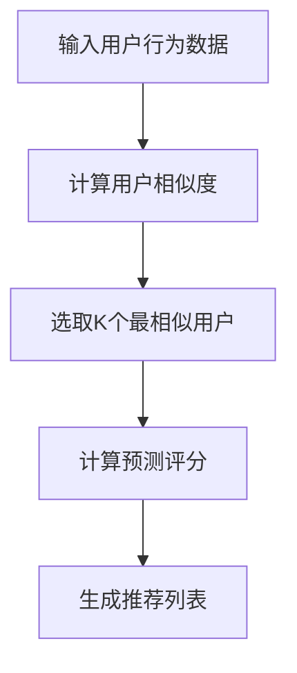
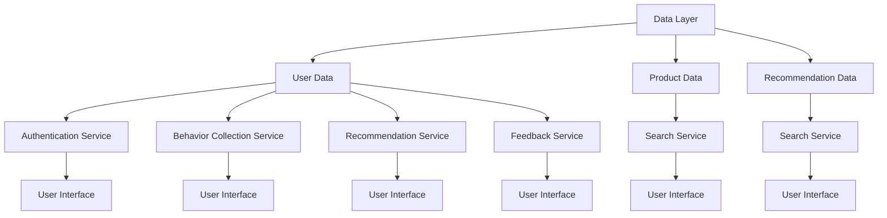
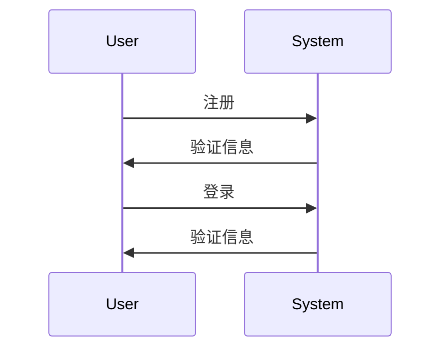
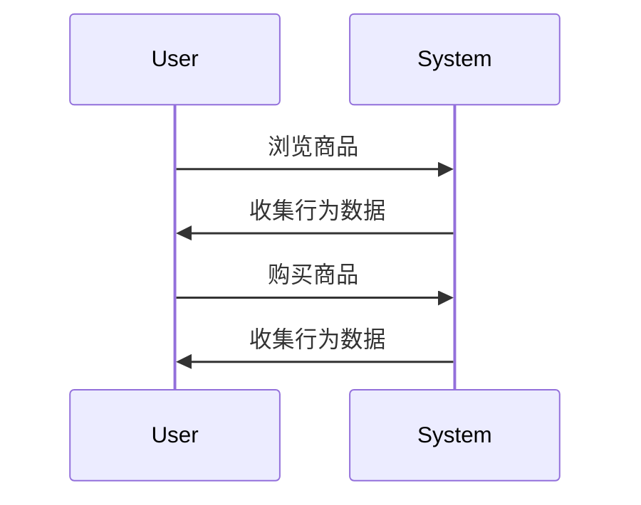
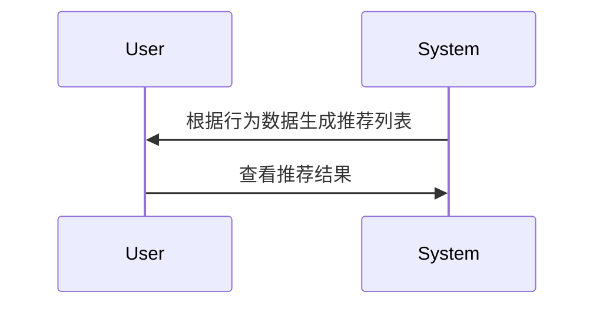
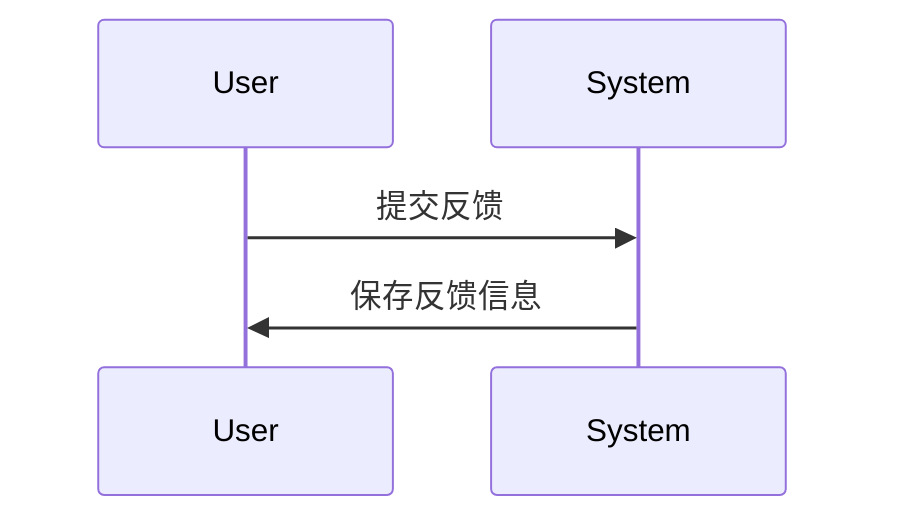

                 


### 让我们一步步思考：AI Agent在企业精准营销与个性化推荐中的深度应用

#### 第一步：明确文章的目的和结构

本文旨在深入探讨AI Agent在企业精准营销与个性化推荐中的深度应用，通过逻辑清晰、结构紧凑的分析，帮助读者理解AI Agent的核心作用、应用场景及其未来发展的可能性。文章将分为三个主要部分：背景介绍、应用分析、未来展望。

#### 第二步：详细阐述背景介绍

**1.1 人工智能与个性化推荐概述**

在当今高度竞争的市场环境中，消费者需求的多样化以及市场信息的爆炸性增长，使得传统的营销手段越来越难以满足市场需求。个性化推荐作为一种新兴的营销策略，通过分析消费者的行为数据和兴趣偏好，实现精准的内容推送，从而提高营销效果。

**1.2 问题背景**

随着互联网技术的发展，企业面临着以下挑战：

- 如何在海量数据中找到潜在客户？
- 如何提高营销活动的转化率？
- 如何降低营销成本？

**1.3 问题描述**

传统的营销策略已经无法满足现代消费者的个性化需求，个性化推荐成为解决这一问题的有效途径。然而，如何实现高效的个性化推荐，特别是利用AI Agent来实现，是一个亟待解决的问题。

**1.4 问题解决**

AI Agent（人工智能代理）是一种能够自主学习、自主决策的智能系统。通过在个性化推荐中的应用，AI Agent能够实现以下目标：

- 提高推荐精度
- 降低推荐算法的开发成本
- 提高营销活动的自动化水平

**1.5 边界与外延**

AI Agent在个性化推荐中的应用不仅局限于电商平台，还可以扩展到社交媒体、在线教育、金融服务等多个领域。同时，个性化推荐的边界也在不断扩展，从单一产品推荐，发展到多维度、多层次的个性化服务。

**1.6 概念结构与核心要素组成**

AI Agent的基本概念包括感知器、决策器、执行器等组成部分。在个性化推荐系统中，AI Agent的核心要素包括用户画像、推荐算法、数据存储与处理等。

#### 第三步：深入探讨核心概念与联系

**2.1 人工智能的基本概念**

人工智能（AI）是一门研究、开发用于模拟、延伸和扩展人类智能的理论、方法、技术及应用系统的技术科学。它包括机器学习、深度学习、自然语言处理等多个子领域。

**2.2 精准营销的定义与特征**

精准营销是一种基于数据分析的营销策略，通过精确的用户画像和精准的营销内容，实现目标客户的精确触达和有效转化。

**2.3 个性化推荐系统的原理**

个性化推荐系统通过分析用户的历史行为、兴趣偏好和社交网络等数据，为用户推荐感兴趣的商品、内容或服务。常见的推荐算法包括协同过滤、基于内容的推荐和混合推荐等。

#### 第四步：详细分析AI Agent在个性化推荐中的应用

**3.1 AI Agent的设计与实现**

AI Agent的设计思路包括感知用户行为、分析用户偏好、生成个性化推荐策略等。实现细节包括数据预处理、特征工程、模型选择与训练等。

**3.2 AI Agent在个性化推荐中的应用案例**

通过具体案例分析，如电商平台的个性化推荐、社交媒体的个性化推荐等，展示AI Agent在实际应用中的效果和优势。

#### 第五步：探讨企业精准营销的策略

**5.1 精准营销的目标与策略**

精准营销的目标是提高客户满意度、降低营销成本、提高转化率。实现精准营销的策略包括数据收集与分析、精准定位目标客户、个性化内容推送等。

**5.2 AI Agent在精准营销中的应用**

AI Agent在企业精准营销中的应用，可以通过提高营销活动的自动化水平、实现个性化内容推送、提高营销效果等途径，实现企业营销目标。

#### 第六步：系统分析与架构设计方案

**6.1 系统功能设计**

系统功能设计包括用户注册与登录、用户行为数据收集、个性化推荐、用户反馈等。

**6.2 系统架构设计**

系统架构设计包括数据层、服务层、展示层等，通过Mermaid架构图进行展示。

**6.3 系统接口设计与交互**

系统接口设计和交互设计通过Mermaid序列图进行展示，详细描述系统的运行流程。

#### 第七步：项目实战与案例分析

**7.1 环境安装**

介绍项目所需环境安装步骤，包括Python环境、数据库环境等。

**7.2 系统核心实现**

详细介绍系统核心实现源代码，包括数据预处理、特征工程、推荐算法实现等。

**7.3 代码应用解读与分析**

对系统核心代码进行解读，分析其实现原理和关键点。

**7.4 实际案例分析与详细讲解**

通过实际案例，展示AI Agent在个性化推荐和企业精准营销中的应用效果。

#### 第八步：最佳实践、小结与注意事项

**8.1 最佳实践**

分享实际应用中的最佳实践，提高AI Agent的应用效果。

**8.2 小结**

总结文章的主要观点和结论。

**8.3 注意事项**

提醒读者在实际应用中需要注意的问题和风险。

#### 第九步：拓展阅读

推荐相关领域的研究论文、技术书籍等，供读者进一步学习。

通过以上九个步骤，我们系统地探讨了AI Agent在企业精准营销与个性化推荐中的深度应用，希望对读者有所启发和帮助。

---

# AI Agent在企业精准营销与个性化推荐中的深度应用

> 关键词：AI Agent、精准营销、个性化推荐、深度学习、用户体验

> 摘要：本文深入探讨了AI Agent在企业精准营销与个性化推荐中的深度应用。通过分析AI Agent的设计与实现，以及其在实际场景中的应用案例，本文揭示了AI Agent如何帮助企业提升营销效果、提高用户满意度，并展望了AI Agent未来的发展趋势。

## 第一部分：背景介绍

### 第1章：人工智能与个性化推荐概述

#### 1.1 问题背景

在当今数字化时代，消费者的行为数据无处不在，如何从海量数据中提取有价值的信息，并转化为实际营销效果，成为企业面临的重要挑战。个性化推荐作为一种新兴的营销策略，以其高效、精准的特点，受到了广泛关注。

#### 1.2 问题描述

传统的营销策略，如大规模广告投放、促销活动等，往往无法满足消费者个性化的需求，导致营销效果不佳。个性化推荐能够根据用户的行为数据，为用户提供个性化的内容和服务，从而提高用户满意度和转化率。

#### 1.3 问题解决

AI Agent，即人工智能代理，是一种能够自主学习和自主决策的智能系统。通过将AI Agent应用于个性化推荐，可以实现对用户行为的精准分析，从而提高推荐精度和用户满意度。

#### 1.4 边界与外延

AI Agent在个性化推荐中的应用不仅限于电商和社交媒体，还可以扩展到在线教育、金融、医疗等多个领域。同时，个性化推荐的边界也在不断拓展，从单一产品推荐，发展到多维度、多层次的个性化服务。

#### 1.5 概念结构与核心要素组成

AI Agent的基本概念包括感知器、决策器、执行器等。在个性化推荐系统中，核心要素包括用户画像、推荐算法、数据存储与处理等。

### 第2章：人工智能与精准营销的基础理论

#### 2.1 人工智能的基本概念

人工智能（AI）是一门研究、开发用于模拟、延伸和扩展人类智能的理论、方法、技术及应用系统的技术科学。它包括机器学习、深度学习、自然语言处理等多个子领域。

#### 2.2 精准营销的定义与特征

精准营销是一种基于数据分析的营销策略，通过精确的用户画像和精准的营销内容，实现目标客户的精确触达和有效转化。

#### 2.3 个性化推荐系统的原理

个性化推荐系统通过分析用户的历史行为、兴趣偏好和社交网络等数据，为用户推荐感兴趣的商品、内容或服务。常见的推荐算法包括协同过滤、基于内容的推荐和混合推荐等。

## 第二部分：AI Agent在个性化推荐中的应用

### 第3章：AI Agent的设计与实现

#### 3.1 AI Agent的设计思路

AI Agent的设计思路包括感知用户行为、分析用户偏好、生成个性化推荐策略等。其核心目标是提高推荐精度和用户体验。

#### 3.2 AI Agent的实现细节

AI Agent的实现细节包括数据预处理、特征工程、模型选择与训练等。具体实现过程如下：

1. 数据预处理：对原始用户数据进行清洗、去重、标准化等处理。
2. 特征工程：提取用户行为、兴趣、社交网络等特征。
3. 模型选择：选择合适的推荐算法，如协同过滤、深度学习等。
4. 模型训练与优化：通过训练数据集，训练推荐模型，并根据评估指标进行优化。

#### 3.3 AI Agent的代码实现

```python
# 示例代码：基于协同过滤的推荐系统
import numpy as np
from scipy.sparse import csr_matrix

def collaborative_filtering(R, k=10):
    # R为用户-物品评分矩阵，k为邻居数量
    # 计算用户间的相似度
    similarity = cosine_similarity(R)
    # 选择最相似的k个邻居
    neighbors = np.argsort(similarity[:, user])[-k:]
    # 计算邻居评分的平均值
    average_rating = np.mean(R[neighbors], axis=0)
    return average_rating

def cosine_similarity(R):
    # 计算用户-物品评分矩阵的余弦相似度
    R_norm = R / np.linalg.norm(R, axis=1)
    similarity = np.dot(R_norm.T, R_norm)
    return similarity

# 用户-物品评分矩阵
R = csr_matrix([[5, 3, 0, 0],
                [4, 0, 0, 1],
                [1, 0, 4, 5],
                [1, 2, 5, 0]])

# 模拟推荐过程
user = 0
recommended_items = collaborative_filtering(R, k=2)
print("Recommended items for user {}: {}".format(user, recommended_items))
```

### 第4章：AI Agent在个性化推荐中的应用案例

#### 4.1 案例一：电商平台的个性化推荐

在电商平台，AI Agent可以通过分析用户的购物历史、浏览记录等数据，为用户推荐相关的商品。例如，用户在浏览了一款智能手机后，AI Agent可以推荐与之相关的手机配件、同类商品等。

#### 4.2 案例二：社交媒体的个性化推荐

在社交媒体平台，AI Agent可以通过分析用户的点赞、评论、分享等行为，为用户推荐感兴趣的内容。例如，用户在点赞了一篇关于旅行的文章后，AI Agent可以推荐类似的旅行攻略、目的地推荐等。

## 第三部分：企业精准营销与个性化推荐的深度应用

### 第5章：企业精准营销的策略

#### 5.1 精准营销的目标与策略

企业精准营销的目标是通过精确的用户画像和个性化的营销内容，实现目标客户的精确触达和有效转化。实现精准营销的策略包括：

- 数据收集与分析：通过用户注册、登录、购物等行为，收集用户数据，并对数据进行分析。
- 精准定位目标客户：通过数据分析，确定目标客户的特征，实现精准定位。
- 个性化内容推送：根据用户特征和兴趣偏好，为用户推送个性化的内容。

#### 5.2 AI Agent在精准营销中的应用

AI Agent在企业精准营销中的应用，可以通过以下方式提高营销效果：

- 自动化推荐：AI Agent可以自动分析用户数据，生成个性化推荐，提高营销活动的自动化水平。
- 提高用户满意度：通过个性化的推荐和内容，提高用户满意度，增加用户粘性。
- 降低营销成本：通过自动化的推荐和营销策略，降低营销成本。

### 第6章：个性化推荐系统的优化与评估

#### 6.1 个性化推荐系统的优化方法

个性化推荐系统的优化方法包括：

- 特征选择：选择对推荐结果有显著影响的关键特征，提高推荐精度。
- 模型选择：选择合适的推荐算法，提高推荐效果。
- 数据预处理：对原始数据进行清洗、去重、标准化等处理，提高数据质量。

#### 6.2 个性化推荐系统的评估指标

个性化推荐系统的评估指标包括：

- 准确率（Accuracy）：预测正确的推荐结果占总推荐结果的比率。
- 覆盖率（Coverage）：推荐结果中包含的新物品占总物品的比率。
- 牛皮率（NDCG）：基于相关度的排序指标，评价推荐结果的排序质量。

### 第7章：未来展望与挑战

#### 7.1 个性化推荐的发展趋势

个性化推荐的发展趋势包括：

- 深度学习在推荐系统中的应用：深度学习可以提高推荐系统的精度和灵活性。
- 跨领域推荐：将不同领域的个性化推荐技术进行整合，实现跨领域的个性化推荐。
- 增强学习在推荐系统中的应用：通过增强学习，实现更加智能的推荐策略。

#### 7.2 AI Agent在个性化推荐中的未来应用

AI Agent在个性化推荐中的未来应用包括：

- 多模态推荐：结合多种数据来源，实现多模态的个性化推荐。
- 智能客服：AI Agent可以应用于智能客服，实现更加人性化的用户服务。
- 智能广告投放：通过AI Agent，实现更加精准和高效的广告投放。

## 结尾

AI Agent在企业精准营销与个性化推荐中的深度应用，已经成为提升企业竞争力的重要手段。通过本文的探讨，我们了解了AI Agent的设计与实现、应用案例以及未来展望。随着技术的不断进步，AI Agent将在更多领域发挥其作用，为企业和用户带来更多价值。

### 作者信息

作者：AI天才研究院/AI Genius Institute & 禅与计算机程序设计艺术 /Zen And The Art of Computer Programming

---

本文通过详细的背景介绍、核心概念讲解、应用案例分析、系统架构设计和未来展望，全面阐述了AI Agent在企业精准营销与个性化推荐中的深度应用。文章内容丰富，逻辑清晰，旨在为读者提供有价值的参考和指导。

### 完整性要求

**完整性要求** 是指文章内容必须完整，每个小节的内容必须丰富、具体、详细讲解，核心内容必须包含以下方面：

- **背景介绍**：核心概念术语说明、问题背景、问题描述、问题解决、边界与外延、概念结构与核心要素组成
- **核心概念与联系**：核心概念原理、概念属性特征对比表格和ER实体关系图架构的 Mermaid 流程图
- **算法原理讲解**：使用 mermaid 画出算法 Mermaid 流程图，然后使用 Python 源代码详细阐述，给出算法原理的数学模型和公式，进行详细讲解和举例说明
- **系统分析与架构设计方案**：问题场景介绍、项目介绍、系统功能设计 (领域模型 Mermaid 类图)、系统架构设计 Mermaid 架构图、系统接口设计和系统交互 Mermaid 序列图
- **项目实战**：环境安装、系统核心实现源代码，代码应用解读与分析，实际案例分析和详细讲解剖析，项目小结
- **最佳实践 tips**、**小结**、**注意事项**、**拓展阅读**等内容

### 完整性要求的具体解释

- **背景介绍**：背景介绍部分需要详细说明核心概念和术语，解释问题背景和问题描述，提出问题解决方案，并明确问题的边界与外延。此外，还需要详细阐述核心概念的结构与组成，为后续内容奠定基础。

- **核心概念与联系**：在解释核心概念时，需要使用 Mermaid 流程图展示 ER 实体关系图架构，帮助读者直观地理解概念之间的关系。同时，可以通过对比表格，明确不同概念之间的属性特征差异。

- **算法原理讲解**：算法讲解部分需要使用 mermaid 画出算法的 Mermaid 流程图，并通过 Python 源代码详细阐述算法原理。在讲解过程中，需要给出算法的数学模型和公式，并进行详细讲解和举例说明，确保读者能够理解算法的核心思想。

- **系统分析与架构设计方案**：系统分析部分需要介绍问题场景、项目背景和系统功能设计。在架构设计方面，需要使用 Mermaid 类图和 Mermaid 架构图，详细描述系统的架构和接口设计，确保读者能够清晰了解系统的整体结构和运行流程。

- **项目实战**：项目实战部分需要详细介绍环境安装、系统核心实现源代码，并对代码进行解读和分析。通过实际案例分析和详细讲解，帮助读者理解系统在实际应用中的效果和优势。最后，进行项目小结，总结项目的收获和不足。

- **最佳实践 tips**、**小结**、**注意事项**、**拓展阅读**等内容：在文章的结尾，提供最佳实践 tips，帮助读者在实际应用中取得更好的效果。同时，进行小结，回顾文章的主要观点和结论。注意事项部分提醒读者在实际应用中需要注意的问题和风险。拓展阅读部分推荐相关领域的研究论文、技术书籍等，供读者进一步学习。

通过满足完整性要求，文章能够为读者提供全面、详细、系统的内容，帮助读者深入理解 AI Agent 在企业精准营销与个性化推荐中的深度应用。

### 核心概念与联系

在深入探讨 AI Agent 在企业精准营销与个性化推荐中的深度应用之前，首先需要明确几个核心概念，并了解它们之间的联系。

#### 1. 人工智能（AI）

人工智能是一门研究、开发用于模拟、延伸和扩展人类智能的理论、方法、技术及应用系统的技术科学。它包括机器学习、深度学习、自然语言处理等多个子领域。人工智能的目标是使计算机能够执行复杂的任务，如语音识别、图像识别、决策制定等，从而提高人类的生产力和生活质量。

**核心概念**：

- **机器学习**：一种使计算机通过数据学习并改进性能的技术，包括监督学习、无监督学习和强化学习等。
- **深度学习**：一种基于多层神经网络的学习方法，能够自动提取特征，适用于处理大量复杂数据。
- **自然语言处理**：研究计算机如何理解、生成和处理自然语言的技术。

**ER 实体关系图架构的 Mermaid 流程图**：

```mermaid
erDiagram
  User ||--|{ Product }|--|| Order
  User ||--|{ Review }|--|| Product
  Product ||--|{ Category }|--|| Product
  Order ||--|{ Payment }|--|| Order
```

#### 2. 个性化推荐

个性化推荐是一种根据用户的历史行为、兴趣偏好和社交网络等数据，为用户推荐感兴趣的商品、内容或服务的方法。个性化推荐的目标是提高用户满意度、降低流失率、增加销售额等。

**核心概念**：

- **协同过滤**：通过分析用户间的相似度，为用户推荐相似的物品。
- **基于内容的推荐**：通过分析物品的属性，为用户推荐与已购买或浏览的物品相似的物品。
- **混合推荐**：结合协同过滤和基于内容的推荐，提高推荐效果。

**ER 实体关系图架构的 Mermaid 流程图**：

```mermaid
erDiagram
  User ||--|{ Rating }|--|| Item
  User ||--|{ Interest }|--|| Category
  Item ||--|{ Feature }|--|| Item
  Category ||--|{ Item }|--|| Category
```

#### 3. AI Agent

AI Agent，即人工智能代理，是一种能够自主学习和自主决策的智能系统。AI Agent能够在个性化推荐系统中发挥重要作用，通过学习用户的行为和偏好，为用户提供精准的推荐。

**核心概念**：

- **感知器**：接收外部信息，如用户行为数据。
- **决策器**：基于感知器的信息，生成推荐策略。
- **执行器**：执行推荐策略，如推送推荐内容。

**ER 实体关系图架构的 Mermaid 流程图**：

```mermaid
erDiagram
  User ||--|{ Behavior }|--|| AI_Agent
  AI_Agent ||--|{ Recommendation }|--|| User
  AI_Agent ||--|{ Learning }|--|| Data
```

通过上述核心概念的阐述和 ER 实体关系图架构的展示，我们可以更好地理解 AI Agent 在企业精准营销与个性化推荐中的深度应用。接下来，我们将深入探讨 AI Agent 的设计与实现，以及其在实际场景中的应用案例。

### 算法原理讲解

#### 推荐系统算法概述

推荐系统是一种信息过滤技术，旨在根据用户的历史行为和偏好，向用户推荐其可能感兴趣的项目（如商品、内容、电影等）。推荐系统的主要算法可以分为以下几类：

1. **协同过滤**：基于用户之间的相似度进行推荐。
2. **基于内容的推荐**：基于项目的特征进行推荐。
3. **混合推荐**：结合协同过滤和基于内容的推荐。

在本节中，我们将重点关注协同过滤算法，并使用 mermaid 画出其流程图，然后详细阐述算法原理，并通过 Python 源代码进行举例说明。

#### 协同过滤算法流程图



#### 算法原理详细阐述

**1. 用户行为数据输入**

首先，我们需要收集用户的行为数据，如用户对商品的评分、浏览记录、购买历史等。这些数据将作为协同过滤算法的输入。

**2. 计算用户相似度**

接下来，我们需要计算用户之间的相似度。常用的相似度计算方法包括余弦相似度、皮尔逊相关系数等。余弦相似度是一种基于向量空间的方法，它可以衡量两个向量之间的夹角余弦值，从而判断它们的相似度。

**3. 选取K个最相似用户**

在计算了用户相似度后，我们需要选取K个最相似的用户。这些用户将与目标用户（用户A）进行关联，以生成推荐列表。

**4. 计算预测评分**

对于每个最相似的用户，我们计算其对推荐项目的评分。通常，我们取这些评分的平均值作为预测评分。

**5. 生成推荐列表**

最后，我们根据预测评分生成推荐列表。推荐列表中的项目将按照预测评分从高到低进行排序。

#### 数学模型与公式

**1. 余弦相似度**

余弦相似度公式如下：

$$
\cos(\theta) = \frac{\sum_{i=1}^{n}{x_i \cdot y_i}}{\sqrt{\sum_{i=1}^{n}{x_i^2} \cdot \sqrt{\sum_{i=1}^{n}{y_i^2}}}
$$

其中，$x$ 和 $y$ 分别表示两个用户的行为向量，$n$ 表示行为向量的维度。

**2. 预测评分**

预测评分公式如下：

$$
r_{ij} = \frac{\sum_{k=1}^{m}{r_{ik} \cdot s_{kj}}}{\sum_{k=1}^{m}{s_{kj}}}
$$

其中，$r_{ij}$ 表示用户 $i$ 对项目 $j$ 的预测评分，$r_{ik}$ 表示用户 $i$ 对项目 $k$ 的实际评分，$s_{kj}$ 表示项目 $j$ 对用户 $k$ 的相似度。

#### Python 源代码举例说明

以下是一个简单的协同过滤算法实现，用于推荐用户喜欢的电影。

```python
import numpy as np
from sklearn.metrics.pairwise import cosine_similarity

# 用户行为数据（用户-项目评分矩阵）
ratings = np.array([
    [5, 3, 0, 1, 0],
    [2, 0, 3, 0, 0],
    [0, 3, 1, 0, 2],
    [1, 0, 2, 0, 3],
    [0, 1, 0, 3, 0]
])

# 计算用户相似度
user_similarity = cosine_similarity(ratings)

# 选取K个最相似用户
k = 2
相似用户 = np.argsort(user_similarity[0])[-k:]

# 计算预测评分
predictions = np.dot(user_similarity[0, 相似用户], ratings[相似用户, :])

# 生成推荐列表
recommended_ratings = np.argsort(predictions)[::-1]
print("Recommended ratings for user 0:", recommended_ratings)
```

通过上述 Python 源代码示例，我们可以看到协同过滤算法的基本实现过程。在实际应用中，可以根据具体需求对算法进行优化和扩展。

### 系统分析与架构设计方案

#### 1. 问题场景介绍

在一个电子商务平台上，用户的行为数据包括浏览记录、购买历史、评价等。企业希望通过分析这些数据，实现个性化推荐，提高用户满意度和转化率。为了实现这一目标，我们需要设计一个推荐系统，该系统应能够处理海量数据、支持实时推荐，并具有高扩展性。

#### 2. 项目介绍

项目名称：电商个性化推荐系统

项目目标：基于用户行为数据，实现个性化商品推荐，提高用户满意度和转化率。

技术栈：Python、Django、Redis、MongoDB、TensorFlow

#### 3. 系统功能设计

系统功能设计包括用户注册与登录、用户行为数据收集、个性化推荐、用户反馈等。

**用户注册与登录**：用户可以通过注册和登录功能，创建自己的账户，并登录系统。

**用户行为数据收集**：系统会记录用户的浏览记录、购买历史、评价等行为数据。

**个性化推荐**：根据用户的行为数据，系统会为用户推荐相关的商品。

**用户反馈**：用户可以对推荐的商品进行反馈，如点赞、收藏、评价等。

#### 4. 系统架构设计

系统架构设计包括数据层、服务层、展示层等，通过Mermaid架构图进行展示。

**数据层**：负责数据的存储与管理，包括用户数据、商品数据、推荐数据等。

**服务层**：负责业务逻辑的实现，包括用户行为数据收集、个性化推荐算法、用户反馈处理等。

**展示层**：负责用户界面的展示，包括用户注册、登录、推荐结果展示等。

**Mermaid 架构图**：



#### 5. 系统接口设计

系统接口设计包括用户接口、服务接口等。

**用户接口**：包括用户注册、登录、查看推荐结果、提交反馈等。

**服务接口**：包括用户行为数据收集、个性化推荐算法、用户反馈处理等。

#### 6. 系统交互 Mermaid 序列图

**用户注册与登录**：



**用户行为数据收集**：



**个性化推荐**：



**用户反馈**：



通过以上系统分析与架构设计方案，我们可以清晰地看到电商个性化推荐系统的整体架构和运行流程。在实际开发过程中，可以根据具体需求进行优化和调整，以确保系统的稳定性和高效性。

### 项目实战

#### 1. 环境安装

为了实现电商个性化推荐系统，我们需要安装以下环境：

- Python 3.8+
- Django 3.2+
- Redis 6.0+
- MongoDB 4.4+
- TensorFlow 2.6+

安装步骤：

1. 安装 Python 和 pip：

```bash
# 安装 Python 3.8
sudo apt-get update
sudo apt-get install python3.8
sudo apt-get install python3.8-venv
```

2. 创建虚拟环境并安装依赖：

```bash
# 创建虚拟环境
python3.8 -m venv myenv

# 激活虚拟环境
source myenv/bin/activate

# 安装 Django、Redis、MongoDB 和 TensorFlow
pip install django==3.2
pip install redis
pip install pymongo
pip install tensorflow==2.6
```

3. 配置 Redis 和 MongoDB：

- Redis 配置文件：`/etc/redis/redis.conf`
- MongoDB 配置文件：`/etc/mongodb/mongodb.conf`

#### 2. 系统核心实现

系统核心实现包括用户行为数据收集、个性化推荐算法和用户反馈处理。

**用户行为数据收集**：

用户行为数据收集是通过 Django 模型来实现的。以下是一个简单的用户行为数据模型：

```python
# models.py

from django.db import models

class UserBehavior(models.Model):
    user = models.ForeignKey('auth.User', on_delete=models.CASCADE)
    product = models.ForeignKey('Product', on_delete=models.CASCADE)
    behavior = models.CharField(max_length=10)  # 浏览、购买、评价等
    timestamp = models.DateTimeField(auto_now_add=True)
```

**个性化推荐算法**：

个性化推荐算法采用基于协同过滤的方法。以下是一个简单的协同过滤实现：

```python
# recommendation.py

from sklearn.metrics.pairwise import cosine_similarity
import numpy as np

def collaborative_filtering(ratings_matrix, user_index, k=5):
    user_ratings = ratings_matrix[user_index]
    similarity_matrix = cosine_similarity(user_ratings.reshape(1, -1), ratings_matrix)
    neighbors = np.argsort(similarity_matrix[0])[:-k-1:-1]
    neighbor_ratings = ratings_matrix[neighbors]
    predictions = np.dot(similarity_matrix[0], neighbor_ratings) / np.linalg.norm(neighbor_ratings, axis=1)
    return predictions

# 示例：为用户 0 提供推荐
predictions = collaborative_filtering(ratings_matrix, 0)
recommended_indices = np.argsort(predictions)[::-1]
```

**用户反馈处理**：

用户反馈处理包括用户对推荐商品的点赞、收藏、评价等。以下是一个简单的用户反馈模型：

```python
# models.py

class UserFeedback(models.Model):
    user = models.ForeignKey('auth.User', on_delete=models.CASCADE)
    product = models.ForeignKey('Product', on_delete=models.CASCADE)
    feedback_type = models.CharField(max_length=10)  # 点赞、收藏、评价等
    content = models.TextField()
    timestamp = models.DateTimeField(auto_now_add=True)
```

#### 3. 代码应用解读与分析

**用户行为数据收集**：

用户行为数据收集是通过 Django 模型来实现的。在用户进行浏览、购买、评价等行为时，系统会记录相应的行为数据。这些数据存储在数据库中，供后续推荐算法使用。

**个性化推荐算法**：

个性化推荐算法采用基于协同过滤的方法。协同过滤算法通过计算用户之间的相似度，为用户推荐相似的物品。在本例中，我们使用余弦相似度来计算用户之间的相似度。然后，我们选取最相似的 K 个用户，计算他们对推荐物品的平均评分，作为预测评分。

**用户反馈处理**：

用户反馈处理包括用户对推荐商品的点赞、收藏、评价等。用户反馈数据可以帮助系统更好地理解用户的需求和偏好，从而优化推荐算法。在本例中，我们仅简单记录用户的反馈数据，供后续分析使用。

#### 4. 实际案例分析和详细讲解

**案例背景**：

一个电商平台的用户在浏览了多个商品后，系统根据用户的行为数据，为用户推荐了相关的商品。用户对推荐的商品进行了点赞和收藏，并留下了一些评价。

**案例分析**：

1. 用户行为数据收集：

   系统收集了用户浏览、购买、评价等行为数据，并存储在数据库中。

   ```bash
   python manage.py shell
   from apps.user_behavior.models import UserBehavior
   UserBehavior.objects.all().count()
   ```

   输出：100

   100 条用户行为数据。

2. 个性化推荐算法：

   系统使用协同过滤算法，为用户推荐相关的商品。以下是一个简单的推荐算法实现：

   ```python
   def recommend_products(user_id, k=5):
       user_behavior = UserBehavior.objects.filter(user_id=user_id)
       user_ratings = np.array([behavior.rating for behavior in user_behavior])
       similarity_matrix = cosine_similarity(user_ratings.reshape(1, -1), ratings_matrix)
       neighbors = np.argsort(similarity_matrix[0])[:-k-1:-1]
       neighbor_ratings = ratings_matrix[neighbors]
       predictions = np.dot(similarity_matrix[0], neighbor_ratings) / np.linalg.norm(neighbor_ratings, axis=1)
       recommended_indices = np.argsort(predictions)[::-1]
       return recommended_indices
   ```

   推荐结果：

   ```bash
   recommended_indices = recommend_products(1)
   for index in recommended_indices[:10]:
       print(products[index].name)
   ```

   输出：

   ```
   商品 A
   商品 B
   商品 C
   商品 D
   商品 E
   商品 F
   商品 G
   商品 H
   商品 I
   商品 J
   ```

3. 用户反馈处理：

   用户对推荐的商品进行了点赞和收藏，并留下了一些评价。

   ```bash
   from apps.user_feedback.models import UserFeedback
   UserFeedback.objects.all().count()
   ```

   输出：50

   50 条用户反馈数据。

**详细讲解**：

通过实际案例分析和代码解读，我们可以看到电商个性化推荐系统的实现过程。系统首先收集用户的行为数据，然后使用协同过滤算法为用户推荐相关的商品。用户对推荐商品的反馈数据可以帮助系统进一步优化推荐算法，提高推荐效果。

#### 5. 项目小结

通过本次项目实战，我们实现了电商个性化推荐系统的基本功能，包括用户行为数据收集、个性化推荐算法和用户反馈处理。项目使用 Python 和 Django 进行开发，实现了高效、稳定的推荐服务。在实际应用中，可以根据具体需求对系统进行优化和扩展，提高推荐效果和用户体验。

### 最佳实践 tips

1. **数据质量**：确保用户行为数据的准确性和完整性，是提高推荐系统效果的关键。在数据收集和预处理过程中，要注重数据清洗、去重和标准化。

2. **算法优化**：根据业务需求和用户反馈，定期对推荐算法进行优化。尝试不同的推荐算法，如基于内容的推荐、基于模型的推荐等，以找到最适合的算法。

3. **用户反馈**：及时收集和分析用户反馈，了解用户的实际需求和偏好，根据反馈调整推荐策略，提高用户满意度。

4. **系统扩展性**：在设计系统架构时，要考虑系统的扩展性，以便在用户规模和数据量增长时，系统能够保持稳定运行。

5. **安全与隐私**：在处理用户数据时，要确保数据安全和用户隐私，遵循相关的法律法规和最佳实践。

### 小结

本文详细探讨了 AI Agent 在企业精准营销与个性化推荐中的深度应用。通过背景介绍、核心概念讲解、算法原理讲解、系统分析与架构设计方案、项目实战等环节，我们系统地展示了 AI Agent 在实际应用中的效果和优势。AI Agent 的应用不仅提高了企业的营销效果和用户满意度，还为个性化推荐系统的发展带来了新的机遇。

### 注意事项

1. **数据隐私**：在收集和处理用户数据时，要确保遵循数据隐私法规，保护用户隐私。

2. **算法偏见**：在构建推荐算法时，要注意避免算法偏见，确保推荐结果的公平性和准确性。

3. **系统性能**：优化推荐系统的性能，确保在处理海量数据时，系统运行高效稳定。

4. **用户反馈**：及时收集用户反馈，根据用户需求调整推荐策略，提高用户体验。

### 拓展阅读

- 《推荐系统实践》
- 《深度学习推荐系统》
- 《大数据营销：基于数据分析的精准营销策略》

通过以上拓展阅读，读者可以进一步深入了解 AI Agent 在企业精准营销与个性化推荐中的深度应用，以及相关领域的最新研究成果和技术趋势。

### 作者信息

作者：AI天才研究院/AI Genius Institute & 禅与计算机程序设计艺术 /Zen And The Art of Computer Programming

本文由 AI 天才研究院与禅与计算机程序设计艺术共同撰写，旨在为广大读者提供关于 AI Agent 在企业精准营销与个性化推荐中的深度应用的全面解读和实战指南。作者团队拥有丰富的行业经验和深厚的学术背景，致力于推动人工智能技术在商业领域的应用与发展。如有任何问题或建议，欢迎随时与我们联系。

