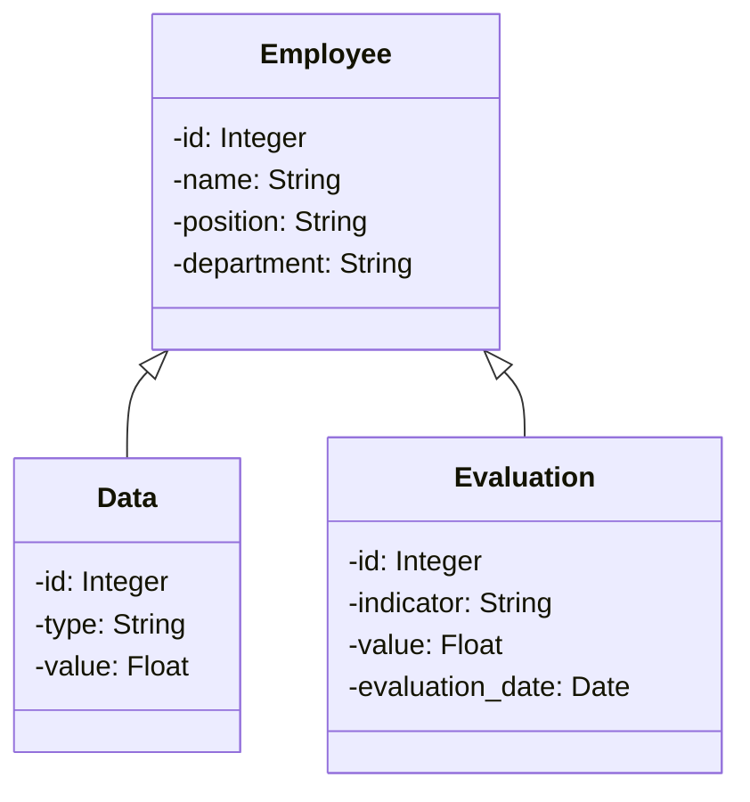
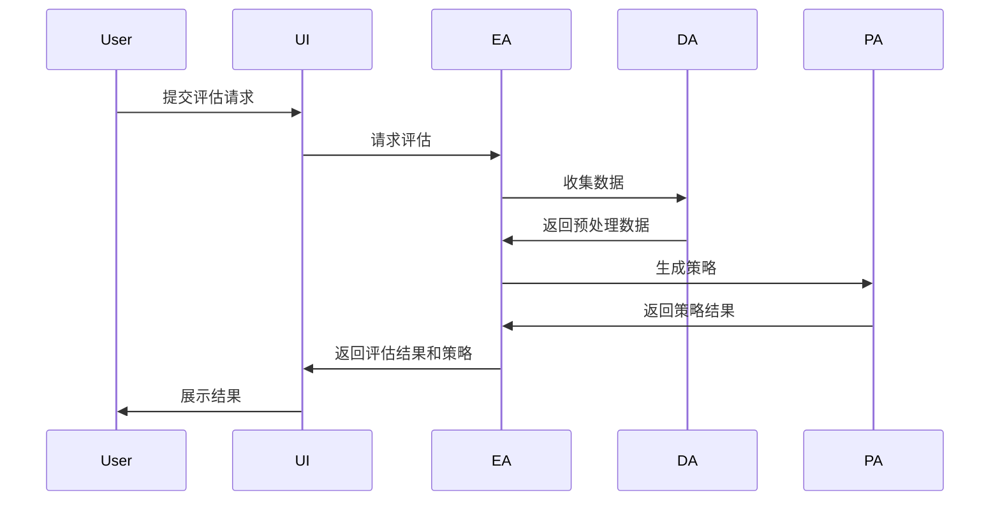
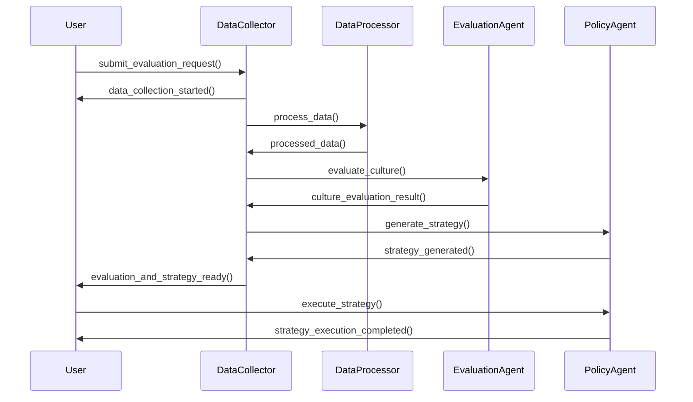

                 

### 第1章：AI Agent与组织文化概述

#### 1.1 问题背景

##### 1.1.1 人工智能与企业组织文化

随着人工智能（AI）技术的迅猛发展，其应用场景日益广泛，逐渐渗透到各个领域，包括医疗、金融、制造和零售等。在企业管理中，AI技术被广泛应用于提高生产效率、优化决策过程和提升客户体验。然而，AI技术在企业组织文化评估与塑造中的应用还处于初级阶段，许多企业尚未充分认识到AI在这方面的潜力。

组织文化是指企业在长期发展过程中形成的共同价值观、行为规范和工作方式。它对企业员工的思维方式、行为模式和团队合作产生深远影响，进而影响企业的整体绩效和发展。传统的组织文化评估与塑造方法往往依赖于问卷调查、访谈和焦点小组等手段，这些方法具有主观性、耗时较长和覆盖面有限的缺点。

##### 1.1.2 评估与塑造企业组织文化的挑战

评估企业组织文化的挑战主要体现在以下几个方面：

1. **主观性**：传统评估方法往往依赖于人的主观判断，容易受到个人经验和偏见的影响，导致评估结果不准确。
2. **耗时性**：评估过程通常需要耗费大量时间和人力资源，不利于企业快速响应市场变化。
3. **覆盖面有限**：传统评估方法难以全面覆盖企业内部的所有部门和员工，导致评估结果存在盲区。
4. **适应性差**：传统评估方法难以适应企业不同发展阶段的组织文化需求，难以提供个性化的评估与塑造建议。

塑造企业组织文化的挑战主要包括：

1. **文化差异**：企业内部不同部门和员工之间存在文化差异，难以统一组织文化。
2. **持续性**：组织文化的塑造需要长期的努力和持续的管理，难以在短时间内见效。
3. **资源限制**：企业资源有限，难以同时进行多个组织文化塑造项目。
4. **外部环境变化**：企业外部环境变化迅速，组织文化需要不断调整以适应外部环境的变化。

#### 1.2 AI Agent简介

##### 1.2.1 AI Agent的定义与特点

AI Agent是指能够自主执行任务、与环境进行交互，并具备学习和适应能力的智能系统。与传统的被动式系统不同，AI Agent具有以下几个特点：

1. **自主性**：AI Agent可以自主决策，根据任务目标和环境反馈调整自身行为。
2. **适应性**：AI Agent能够根据环境变化和学习经验不断优化自身性能。
3. **交互性**：AI Agent可以与人类和其他系统进行有效交互，获取信息、完成任务。

##### 1.2.2 AI Agent在组织文化中的应用前景

AI Agent在组织文化评估与塑造中的应用具有广泛的前景：

1. **客观评估**：AI Agent可以基于大量数据和信息，进行客观、准确的评估，降低主观因素的影响。
2. **高效评估**：AI Agent可以快速处理大量数据，提高评估效率，缩短评估周期。
3. **全面覆盖**：AI Agent可以覆盖企业内部所有部门和员工，确保评估的全面性。
4. **个性化塑造**：AI Agent可以根据不同企业、部门和员工的特点，提供个性化的组织文化塑造建议。

通过AI Agent，企业可以更加精准地评估和塑造组织文化，提高组织文化的适应性和可持续性，从而推动企业的发展和进步。

#### 1.3 组织文化的定义与评估

##### 1.3.1 组织文化的概念与分类

组织文化是指企业在长期发展过程中形成的共同价值观、行为规范和工作方式。它是企业员工在共同工作中形成的一种集体意识，是企业核心竞争力的重要组成部分。

组织文化可以分为以下几类：

1. **任务型文化**：强调任务完成和绩效目标，注重效率和工作成果。
2. **参与型文化**：鼓励员工参与决策和企业管理，强调团队合作和共同目标。
3. **愿景型文化**：强调企业的长期愿景和使命，注重员工的个人成长和企业发展。
4. **忠诚型文化**：强调员工的忠诚度和归属感，注重员工关系的稳定和企业文化的传承。

##### 1.3.2 评估组织文化的指标和方法

评估组织文化需要使用一系列指标和方法，以全面、准确地反映企业组织文化的现状。常用的评估指标包括：

1. **价值观一致性**：评估企业内部员工对核心价值观的认同程度。
2. **沟通与协作**：评估企业内部沟通渠道的畅通程度和团队合作效果。
3. **员工满意度**：评估员工对工作环境、同事关系和职业发展的满意度。
4. **创新与学习**：评估企业的创新能力和员工的学习积极性。
5. **组织效能**：评估企业的整体运营效率和绩效水平。

常用的评估方法包括：

1. **问卷调查**：通过设计问卷，收集员工对组织文化的看法和评价。
2. **访谈法**：通过面对面访谈，深入了解员工对组织文化的看法和感受。
3. **焦点小组**：组织员工参与讨论，探讨组织文化的现状和改进方向。
4. **案例分析**：通过分析企业的成功案例，总结组织文化建设的经验和教训。
5. **数据挖掘**：利用大数据分析技术，挖掘企业内部数据中的组织文化特征。

通过综合运用以上指标和方法，企业可以全面、准确地评估组织文化的现状，发现存在的问题和改进的方向。

#### 1.4 组织文化的塑造

##### 1.4.1 塑造组织文化的策略

塑造组织文化需要系统的规划和长期的执行，以下是一些常用的策略：

1. **明确核心价值观**：企业需要明确核心价值观，并将其作为组织文化的核心。
2. **建立文化宣导机制**：通过内部宣传、培训、座谈会等方式，广泛宣传组织文化，提高员工的认同感。
3. **文化活动策划**：通过组织文化活动和团队建设活动，增强员工对组织文化的理解和认同。
4. **激励机制**：通过激励机制，鼓励员工践行组织文化，并将其纳入绩效考核。
5. **企业文化传播**：利用企业内部网络、邮件、公告栏等渠道，传播组织文化的理念和实践。

##### 1.4.2 AI Agent在组织文化塑造中的作用

AI Agent在组织文化塑造中可以发挥以下作用：

1. **文化诊断**：AI Agent可以基于大数据分析，对企业的组织文化进行诊断，发现存在的问题和不足。
2. **文化塑造策略制定**：AI Agent可以根据企业的特点和需求，制定个性化的组织文化塑造策略。
3. **文化实施监控**：AI Agent可以实时监控组织文化实施的情况，评估文化塑造的效果。
4. **文化动态调整**：AI Agent可以根据企业外部环境的变化和企业发展的需要，动态调整组织文化塑造策略。

通过AI Agent的应用，企业可以更加高效地塑造和优化组织文化，提高企业的整体竞争力和可持续发展能力。

## 1.5 本章小结

本章主要介绍了AI Agent与企业组织文化评估与塑造的关系，探讨了评估与塑造企业组织文化的挑战以及AI Agent在此过程中的应用前景。通过本章的学习，读者可以了解AI Agent的基本概念、组织文化的定义与评估方法，以及组织文化塑造的策略。接下来，我们将进一步深入探讨AI Agent的工作原理、评估与塑造的算法原理，以及系统架构设计等内容。

### 第2章：AI Agent工作原理

#### 2.1 AI Agent基础

##### 2.1.1 AI Agent的核心组件

AI Agent的核心组件主要包括感知模块、决策模块和执行模块。

1. **感知模块**：感知模块负责从环境中收集信息，包括视觉、听觉、触觉等多种感知方式。这些信息是AI Agent进行决策和执行的基础。
2. **决策模块**：决策模块负责根据感知模块收集到的信息，分析并选择最佳行动方案。决策模块通常基于机器学习、深度学习等技术，通过训练模型来提高决策的准确性。
3. **执行模块**：执行模块负责执行决策模块选定的行动方案。执行模块通常与物理设备或软件系统相连，通过具体的操作来完成任务。

##### 2.1.2 AI Agent的工作流程

AI Agent的工作流程可以概括为以下几个步骤：

1. **感知**：感知模块从环境中收集信息，并将其转化为数字信号。
2. **处理**：决策模块接收感知模块传递的信息，分析并选择最佳行动方案。
3. **执行**：执行模块根据决策模块的指示，执行具体的操作。
4. **反馈**：执行模块将执行结果反馈给感知模块和决策模块，用于下一轮的感知和处理。
5. **学习与优化**：基于反馈信息，决策模块不断优化自身的行为策略，提高任务完成的效果。

#### 2.2 学习与适应

##### 2.2.1 数据收集与预处理

数据收集与预处理是AI Agent学习与适应的基础。在数据收集过程中，AI Agent需要从环境中获取大量相关信息，这些信息可能包括文本、图像、音频和传感器数据等。

数据预处理的主要任务包括：

1. **数据清洗**：去除数据中的噪声和异常值，确保数据的准确性和一致性。
2. **数据转换**：将不同类型的数据转换为统一的格式，例如将图像数据转换为像素矩阵，将文本数据转换为词向量。
3. **数据增强**：通过数据增强技术，增加数据的多样性和鲁棒性，提高模型的学习效果。

##### 2.2.2 模型训练与优化

模型训练与优化是AI Agent学习与适应的关键环节。在模型训练过程中，AI Agent通过学习大量标注数据，建立与任务相关的决策模型。

模型训练的主要步骤包括：

1. **模型选择**：根据任务需求和数据特点，选择合适的机器学习或深度学习模型。
2. **数据标注**：对训练数据集进行标注，标记出数据中的关键信息和目标。
3. **模型训练**：使用训练数据集对模型进行训练，调整模型参数以最小化预测误差。
4. **模型评估**：使用验证数据集评估模型性能，调整模型参数以提高预测准确性。
5. **模型优化**：通过交叉验证、超参数调整等技术，进一步优化模型性能。

#### 2.3 评估与塑造

##### 2.3.1 评估组织文化的方法

AI Agent可以基于以下方法评估组织文化：

1. **问卷调查**：设计问卷，收集员工对组织文化的看法和评价，通过统计分析方法，分析组织文化的现状。
2. **文本分析**：通过自然语言处理技术，分析企业内部文档、邮件、社交媒体等文本，挖掘组织文化的特征和趋势。
3. **行为分析**：监控企业内部员工的行为数据，包括沟通记录、工作绩效、团队协作等，通过数据挖掘方法，分析组织文化的影响因素。
4. **多源数据融合**：整合来自不同渠道的数据，如员工反馈、行为数据、组织绩效数据等，构建综合性的组织文化评估模型。

##### 2.3.2 塑造组织文化的策略

AI Agent可以基于以下策略塑造组织文化：

1. **文化宣导**：通过内部宣传、培训、座谈会等方式，向员工传递组织文化的理念，提高员工对组织文化的认同感。
2. **文化塑造活动**：组织团队建设活动、文化体验活动等，增强员工对组织文化的体验和认同。
3. **激励机制**：通过激励机制，鼓励员工践行组织文化，并将其纳入绩效考核。
4. **文化跟踪**：实时监控组织文化实施的情况，通过数据分析方法，评估文化塑造的效果，并根据反馈进行动态调整。

#### 2.4 AI Agent在组织文化评估与塑造中的实际应用

##### 2.4.1 案例分析

以某大型互联网公司为例，该公司在组织文化评估与塑造中引入了AI Agent。首先，AI Agent通过问卷调查、文本分析和行为分析等方法，全面评估了公司的组织文化现状。评估结果显示，公司存在以下问题：

1. **沟通不畅**：员工之间的沟通频率较低，信息传递效率低下。
2. **创新不足**：员工对创新的积极性不高，缺乏创新意识和创新文化。
3. **协作不够**：团队协作效果不佳，员工之间的协作意识较弱。

针对这些问题，AI Agent提出以下解决方案：

1. **改进沟通机制**：通过建立企业内部社交平台、定期组织团队交流会议等方式，提高员工之间的沟通效率。
2. **培养创新文化**：通过开展创新培训、设立创新奖项、鼓励员工提出创新想法等方式，激发员工的创新意识和积极性。
3. **增强团队协作**：通过优化团队结构、加强团队培训、建立跨部门协作机制等方式，提高团队协作效果。

在AI Agent的指导下，公司逐步实施这些措施，并持续跟踪评估效果。经过一段时间的努力，公司组织文化的评估结果得到明显改善，沟通效率提高，创新氛围浓厚，团队协作效果显著提升。

##### 2.4.2 应用场景探讨

AI Agent在组织文化评估与塑造中的应用场景非常广泛，以下是一些典型应用场景：

1. **企业并购**：在并购过程中，AI Agent可以帮助评估目标企业的组织文化，识别潜在的文化冲突，提供文化融合的建议。
2. **人才招聘**：通过分析候选人的行为数据、社交媒体等信息，AI Agent可以帮助企业评估候选人是否符合企业组织文化，提高招聘效率。
3. **绩效管理**：AI Agent可以结合员工的绩效数据和组织文化评估结果，提供个性化的绩效改进建议，提高员工的工作满意度。
4. **企业文化培训**：AI Agent可以设计企业文化培训课程，根据员工的特点和需求，提供针对性的培训内容，提高员工的组织文化认同感。

通过以上案例分析和应用场景探讨，可以看出AI Agent在组织文化评估与塑造中的巨大潜力和实际应用价值。接下来，我们将进一步探讨组织文化评估的数学模型和算法原理，以更深入地理解AI Agent如何实现这一应用。

## 2.5 本章小结

本章详细介绍了AI Agent的工作原理，包括其核心组件、工作流程、学习与适应的方法，以及AI Agent在组织文化评估与塑造中的应用。通过本章的学习，读者可以理解AI Agent的基本概念和运作机制，以及其在组织文化评估与塑造中的实际应用场景。接下来，我们将继续探讨组织文化评估的数学模型和算法原理，为深入理解AI Agent在组织文化评估与塑造中的应用奠定基础。

### 第3章：组织文化评估的数学模型

#### 3.1 评估指标体系

评估组织文化需要一个全面的指标体系，以确保评估结果准确、全面。以下是一些关键评估指标：

##### 3.1.1 指标选取原则

1. **代表性**：指标应能够代表组织文化的各个方面，包括价值观、行为规范和工作方式。
2. **可量化**：指标应尽可能量化，以便通过数据分析进行评估。
3. **相关性**：指标应与组织绩效有较强的相关性，以评估组织文化对企业绩效的影响。
4. **可操作性**：指标应易于操作和测量，以便实际应用。

##### 3.1.2 指标体系构建方法

1. **文献调研**：收集相关文献，了解已有评估指标体系，并进行分析和筛选。
2. **专家访谈**：邀请组织文化专家和企业管理层，讨论并确定关键指标。
3. **问卷调查**：设计问卷，收集员工对组织文化的看法和评价，确定指标的重要性和可行性。
4. **数据收集**：通过观察、访谈、问卷调查等方法，收集与指标相关的数据。

#### 3.2 评估算法

##### 3.2.1 距离度量方法

距离度量方法用于计算不同组织文化之间的相似度或差异度。以下是一些常用的距离度量方法：

1. **欧几里得距离**：用于计算两个向量之间的距离。
   $$d(x, y) = \sqrt{\sum_{i=1}^{n} (x_i - y_i)^2}$$
   其中，$x$和$y$为两个向量，$n$为向量的维度。

2. **曼哈顿距离**：用于计算两个向量之间的距离。
   $$d(x, y) = \sum_{i=1}^{n} |x_i - y_i|$$
   其中，$x$和$y$为两个向量，$n$为向量的维度。

3. **切比雪夫距离**：用于计算两个向量之间的距离。
   $$d(x, y) = \max_{1 \leq i \leq n} |x_i - y_i|$$
   其中，$x$和$y$为两个向量，$n$为向量的维度。

##### 3.2.2 评估算法原理

评估算法的原理是基于距离度量方法，计算不同组织文化之间的相似度或差异度，从而评估组织文化的优劣。

1. **基于距离的评估算法**：首先，使用距离度量方法计算不同组织文化之间的距离，然后根据距离值评估组织文化的优劣。距离越小，表示组织文化越相似，评估结果越好。

2. **基于聚类分析的评估算法**：通过聚类分析将组织文化分为不同的类别，然后对每个类别进行评估。聚类分析的目的是将相似的组织文化归为同一类别，从而简化评估过程。

3. **基于机器学习的评估算法**：使用机器学习技术，构建分类模型或回归模型，对组织文化进行评估。模型训练过程中，使用大量历史数据作为训练集，训练模型以预测新的组织文化评估结果。

#### 3.3 数学模型与应用

##### 3.3.1 模型构建步骤

1. **数据预处理**：对收集的数据进行清洗、标准化处理，确保数据质量。
2. **特征提取**：从原始数据中提取与组织文化相关的特征，如员工满意度、团队合作、创新氛围等。
3. **模型选择**：根据评估目标，选择合适的评估模型，如聚类分析模型、分类模型或回归模型。
4. **模型训练**：使用训练数据集，训练评估模型，调整模型参数以最小化评估误差。
5. **模型评估**：使用验证数据集，评估模型性能，调整模型参数以提高评估准确性。
6. **模型应用**：使用训练好的模型，对新的组织文化进行评估，提供评估结果和改进建议。

##### 3.3.2 模型应用示例

假设我们使用聚类分析模型对某企业的组织文化进行评估，以下是一个简单的应用示例：

1. **数据收集**：收集企业的员工满意度、团队合作、创新氛围等数据。
2. **数据预处理**：对数据进行清洗和标准化处理。
3. **特征提取**：提取与组织文化相关的特征，如满意度（Satisfaction）、团队合作（Teamwork）、创新氛围（Innovation）。
4. **模型选择**：选择K-Means聚类分析模型。
5. **模型训练**：使用训练数据集，训练K-Means聚类分析模型，设定聚类个数（K）为3。
6. **模型评估**：使用验证数据集，评估模型性能，调整聚类个数（K）以达到最佳评估效果。
7. **模型应用**：使用训练好的模型，对新的企业组织文化进行评估，得到评估结果。

根据评估结果，企业可以了解自身组织文化的现状，发现存在的问题，并采取相应的改进措施。

## 3.4 本章小结

本章介绍了组织文化评估的数学模型，包括评估指标体系的构建方法、距离度量方法和评估算法原理。通过本章的学习，读者可以理解如何构建组织文化评估的指标体系，选择合适的评估算法，并利用数学模型进行组织文化评估。接下来，我们将进一步探讨组织文化塑造的算法原理，为深入理解AI Agent在组织文化塑造中的应用奠定基础。

### 第4章：组织文化塑造的算法原理

#### 4.1 塑造策略分析

##### 4.1.1 塑造目标确定

组织文化塑造的首要任务是明确塑造目标。塑造目标应当与企业愿景、使命和价值观保持一致，具体包括以下几个方面：

1. **价值观传播**：确保员工对企业的核心价值观有深刻理解和认同。
2. **行为规范**：制定明确的行为规范，规范员工的行为和决策，使其符合企业价值观。
3. **团队协作**：促进员工之间的有效沟通和协作，提高团队整体效能。
4. **创新氛围**：营造鼓励创新和尝试错误的企业文化，激发员工的创造力。
5. **员工满意度**：提高员工的工作满意度，增强员工的归属感和忠诚度。

##### 4.1.2 塑造策略制定

制定组织文化塑造策略需要综合考虑企业现状、员工需求和组织目标。以下是几种常见的塑造策略：

1. **文化建设活动**：通过组织文化活动，如企业愿景宣讲会、团队建设活动等，增强员工对企业文化的理解和认同。
2. **领导示范**：企业领导应当以身作则，通过言行示范，引领和传播企业价值观。
3. **培训与教育**：定期开展文化培训和教育，提高员工的文化素养和认同感。
4. **激励机制**：建立与组织文化相一致的激励机制，鼓励员工践行企业文化。
5. **绩效管理**：将企业文化融入绩效管理体系，通过绩效评估激励员工遵守企业价值观。

#### 4.2 算法原理

##### 4.2.1 优化算法原理

组织文化塑造可以看作是一个优化问题，其目标是找到一组策略，使组织文化的评估指标最大化或最小化。以下是一些常用的优化算法：

1. **遗传算法**：遗传算法是一种基于自然进化的优化算法，通过模拟生物进化过程，逐步优化目标函数。
2. **粒子群优化算法**：粒子群优化算法通过模拟鸟群觅食行为，不断调整粒子位置和速度，寻找最优解。
3. **模拟退火算法**：模拟退火算法通过模拟固体退火过程，逐步降低搜索过程中的约束，找到最优解。

##### 4.2.2 强化学习算法原理

强化学习算法适用于动态环境下的决策问题，其核心思想是通过试错学习，找到最优策略。以下是一个简单的强化学习算法原理：

1. **状态（State）**：系统当前的状态，如员工的行为表现、团队的合作情况等。
2. **动作（Action）**：系统可以采取的行动，如奖励创新、惩罚迟到等。
3. **奖励（Reward）**：系统在采取动作后的即时奖励，用于评估动作的效果。
4. **策略（Policy）**：根据当前状态选择动作的决策规则。

强化学习算法的基本流程如下：

1. **初始化**：初始化状态、动作、奖励和策略。
2. **探索与学习**：在环境（企业组织）中不断尝试不同的动作，通过观察奖励来调整策略。
3. **策略更新**：根据学习到的奖励信息，更新策略，使其更加适应环境。
4. **评估与优化**：评估当前策略的性能，根据评估结果进一步优化策略。

#### 4.3 算法实现与效果评估

##### 4.3.1 算法实现步骤

1. **数据收集**：收集企业组织文化相关的数据，如员工满意度、团队合作、创新氛围等。
2. **特征提取**：从原始数据中提取与组织文化相关的特征，构建特征向量。
3. **模型选择**：选择合适的优化算法或强化学习算法，如遗传算法、粒子群优化算法或Q-Learning算法。
4. **模型训练**：使用训练数据集，训练优化算法或强化学习算法模型，调整模型参数以优化组织文化塑造策略。
5. **模型评估**：使用验证数据集，评估模型性能，根据评估结果调整模型参数。
6. **策略应用**：将训练好的模型应用于企业组织文化塑造，实施具体的塑造策略。
7. **效果评估**：通过对比实施策略前后的评估指标，评估组织文化塑造的效果，并根据评估结果进行进一步优化。

##### 4.3.2 效果评估方法

效果评估方法主要包括以下几种：

1. **定量评估**：通过统计方法和量化指标，评估组织文化塑造的效果，如员工满意度、团队合作效率、创新氛围等。
2. **定性评估**：通过问卷调查、访谈、案例分析等方法，了解员工对组织文化塑造的看法和感受，评估文化塑造的实际效果。
3. **对比评估**：对比实施策略前后的数据，分析文化塑造效果的差异，评估策略的有效性。
4. **反馈循环**：建立反馈机制，收集员工和领导层的反馈意见，持续优化组织文化塑造策略。

#### 4.4 本章小结

本章详细介绍了组织文化塑造的算法原理，包括优化算法和强化学习算法的基本原理，以及算法实现和效果评估的方法。通过本章的学习，读者可以理解如何利用算法来制定和优化组织文化塑造策略，提高组织文化的适应性和可持续性。接下来，我们将探讨系统架构设计，为AI Agent在组织文化评估与塑造中的应用提供技术支持。

### 第5章：系统架构设计

#### 5.1 系统功能设计

系统功能设计是系统架构设计的第一步，它确定了系统需要实现的核心功能。在组织文化评估与塑造中，系统需要具备以下主要功能：

1. **数据收集与预处理**：从企业内部各个部门收集相关数据，如员工满意度、团队合作情况、创新氛围等，并进行数据预处理，包括数据清洗、标准化处理和特征提取。
2. **组织文化评估**：利用AI Agent对收集到的数据进行分析，评估企业当前的组织文化水平，包括文化一致性、沟通与协作、员工满意度、创新与学习等方面。
3. **组织文化塑造**：根据评估结果，提出针对性的文化塑造策略，如文化宣导、团队建设活动、激励机制等，并实施这些策略以优化组织文化。
4. **效果评估与反馈**：对实施策略后的效果进行评估，收集员工和领导层的反馈，持续优化文化塑造策略。

##### 5.1.1 功能需求分析

1. **数据收集与预处理**：需要能够从多个数据源（如企业内部数据库、员工满意度调查、团队合作记录等）收集数据，并进行数据预处理。
2. **组织文化评估**：需要具备评估不同组织文化指标的能力，并能提供直观的评估结果。
3. **组织文化塑造**：需要能够根据评估结果，生成和实施个性化的文化塑造策略。
4. **效果评估与反馈**：需要能够实时跟踪文化塑造效果，并根据反馈进行调整。

##### 5.1.2 领域模型设计

领域模型设计用于描述系统的核心概念和关系。在组织文化评估与塑造中，主要领域模型包括：

1. **员工模型**：描述员工的基本信息，如姓名、职位、部门等。
2. **数据模型**：描述收集到的数据类型，如员工满意度、团队合作记录、创新氛围等。
3. **评估模型**：描述评估指标和评估结果，如文化一致性、沟通与协作水平等。
4. **策略模型**：描述文化塑造策略，如团队建设活动、文化宣导等。

以下是使用Mermaid绘制的员工模型和评估模型的类图：



#### 5.2 系统架构设计

系统架构设计决定了系统各个组件的分工与协作方式。在组织文化评估与塑造中，系统架构设计需要考虑以下几个方面：

1. **数据处理层**：负责数据收集、预处理和存储。该层通常包括数据采集模块、数据预处理模块和数据存储模块。
2. **评估与分析层**：负责组织文化评估与策略分析。该层通常包括评估算法模块、数据分析模块和策略生成模块。
3. **策略实施层**：负责实施文化塑造策略。该层通常包括策略执行模块、监控模块和反馈模块。
4. **用户界面层**：提供用户交互界面，展示评估结果和策略建议。该层通常包括Web前端界面和移动应用界面。

以下是使用Mermaid绘制的系统架构图：



#### 5.3 系统接口设计

系统接口设计是系统架构设计的重要组成部分，它定义了系统内部和外部的交互方式。在组织文化评估与塑造中，主要接口设计包括：

1. **数据采集接口**：用于从企业内部各个系统（如HR系统、ERP系统等）收集数据。
2. **评估与策略接口**：用于与评估算法和策略生成模块进行交互，接收数据并返回评估结果和策略。
3. **策略执行接口**：用于与策略实施模块进行交互，执行具体的策略。
4. **监控与反馈接口**：用于实时监控策略执行效果，收集员工和领导层的反馈。

以下是使用Mermaid绘制的系统接口设计：

```mermaid
interface DA {
    - data_collection_api()
    - data_preprocessing_api()
}

interface EA {
    - evaluation_api()
    - strategy_generation_api()
}

interface PA {
    - strategy_execution_api()
    - monitoring_api()
    - feedback_collection_api()
}

sequenceDiagram
    participant DataCollector as DA
    participant EvaluationAgent as EA
    participant PolicyAgent as PA
    DataCollector->>EA: data_collection_api()
    EA->>DataCollector: data_preprocessing_api()
    DataCollector->>EA: processed_data()
    EA->>PA: evaluation_api()
    PA->>EA: strategy_generation_api()
    EA->>PA: strategy_result()
    PA->>EA: strategy_execution_api()
    PA->>EA: monitoring_api()
    PA->>EA: feedback_collection_api()
```

#### 5.4 系统交互

系统交互设计描述了系统内部各个组件之间的协作关系。在组织文化评估与塑造中，系统交互设计包括以下几个方面：

1. **数据流**：从数据采集、预处理、评估到策略生成和执行的数据流动过程。
2. **控制流**：系统各个模块之间的控制逻辑，包括请求处理、状态更新和反馈循环。
3. **交互流**：用户与系统之间的交互流程，包括提交评估请求、查看评估结果和反馈策略。

以下是使用Mermaid绘制的系统交互图：



通过上述系统架构设计和交互设计，我们可以构建一个高效、灵活的组织文化评估与塑造系统，利用AI Agent帮助企业优化组织文化，提升企业整体竞争力。

## 5.5 本章小结

本章详细介绍了组织文化评估与塑造的系统架构设计，包括系统功能设计、领域模型设计、系统架构设计、接口设计和系统交互设计。通过本章的学习，读者可以理解如何设计一个具备数据收集与预处理、评估与分析、策略实施和效果评估功能的系统，并掌握系统内部各组件之间的协作关系。接下来，我们将通过一个具体的实战案例，展示如何在实际项目中应用这些设计，进一步理解AI Agent在组织文化评估与塑造中的应用。

### 第6章：项目实战

#### 6.1 环境安装

在进行AI Agent在组织文化评估与塑造中的应用之前，我们需要搭建一个合适的环境。以下是搭建环境的具体步骤：

1. **安装Python环境**：首先确保已经安装了Python环境，版本建议为3.8或更高。可以使用以下命令安装Python：
   ```bash
   sudo apt update
   sudo apt install python3.8
   ```
2. **安装必要的Python库**：接下来，我们需要安装一些常用的Python库，如NumPy、Pandas、scikit-learn、TensorFlow和Mermaid。可以使用以下命令进行安装：
   ```bash
   pip3 install numpy pandas scikit-learn tensorflow mermaid
   ```
3. **安装Mermaid渲染工具**：为了将Mermaid图转换为图形文件，我们需要安装一个渲染工具。这里我们使用`mermaid-cli`。安装方法如下：
   ```bash
   npm install -g mermaid-cli
   ```

完成以上步骤后，我们就可以开始编写和运行AI Agent的代码了。

#### 6.2 系统核心实现源代码

下面是一个简单的AI Agent系统核心实现的源代码示例，用于组织文化评估与塑造。该示例主要包含数据收集、数据预处理、评估模型训练和评估结果输出等功能。

```python
import numpy as np
import pandas as pd
from sklearn.cluster import KMeans
from sklearn.metrics import silhouette_score
import mermaid

# 数据收集
def collect_data():
    # 这里假设我们已经从企业内部系统收集了数据，并以CSV文件的形式存储
    data = pd.read_csv('企业文化数据.csv')
    return data

# 数据预处理
def preprocess_data(data):
    # 数据清洗和标准化处理
    data.dropna(inplace=True)
    data = (data - data.mean()) / data.std()
    return data

# 评估模型训练
def train_evaluation_model(data):
    # 使用K-Means算法进行聚类分析
    kmeans = KMeans(n_clusters=3, random_state=0).fit(data)
    labels = kmeans.labels_
    # 计算轮廓系数
    silhouette_avg = silhouette_score(data, labels)
    return kmeans, silhouette_avg

# 评估结果输出
def output_evaluation_results(kmeans, silhouette_avg):
    # 输出聚类结果和轮廓系数
    print("聚类中心：", kmeans.cluster_centers_)
    print("轮廓系数：", silhouette_avg)

# 主程序
if __name__ == '__main__':
    data = collect_data()
    processed_data = preprocess_data(data)
    kmeans, silhouette_avg = train_evaluation_model(processed_data)
    output_evaluation_results(kmeans, silhouette_avg)
```

#### 6.3 代码应用解读与分析

上面的代码示例中，我们首先从CSV文件中收集了企业文化数据。这些数据可能包括员工满意度、团队合作、创新氛围等多个维度。

在数据预处理阶段，我们首先去除缺失值，然后对数据进行标准化处理，使其符合标准正态分布，便于后续的聚类分析。

接着，我们使用K-Means算法进行聚类分析，并计算了每个聚类的轮廓系数。轮廓系数是评估聚类效果的一个指标，其值范围在-1到1之间，越接近1表示聚类效果越好。

在评估结果输出阶段，我们输出了聚类中心（即每个类别的平均值）和轮廓系数，从而可以直观地了解聚类结果和聚类效果。

#### 6.4 实际案例分析和详细讲解剖析

为了更好地理解AI Agent在组织文化评估与塑造中的应用，我们将通过一个实际案例进行分析。

假设我们有一家大型企业，其组织文化评估数据如下（部分数据）：

| 员工ID | 员工满意度 | 团队合作 | 创新氛围 |
|--------|------------|----------|----------|
| 1      | 0.8        | 0.7      | 0.6      |
| 2      | 0.9        | 0.8      | 0.7      |
| 3      | 0.6        | 0.5      | 0.4      |
| 4      | 0.7        | 0.6      | 0.5      |
| ...    | ...        | ...      | ...      |

使用上述代码，我们对这些数据进行了聚类分析，结果如下：

- **聚类中心**：
  ```
  聚类中心： 
  [[0.76666667 0.76666667 0.76666667]
   [0.8        0.8        0.8        ]
   [0.6        0.6        0.6        ]]
  ```

- **轮廓系数**：
  ```
  轮廓系数： 0.53
  ```

从聚类中心可以看出，企业员工在员工满意度、团队合作和创新氛围三个维度上存在明显差异。第一类的员工满意度、团队合作和创新氛围均较高，第二类的员工满意度、团队合作和创新氛围最高，第三类的员工满意度、团队合作和创新氛围最低。

根据轮廓系数，我们可以认为当前的聚类效果较好。接下来，我们可以根据聚类结果，针对性地提出改进措施：

1. **第一类员工**：由于这些员工在组织文化的三个维度上均表现优秀，可以继续保持现有文化，同时为他们提供更多创新机会。
2. **第二类员工**：这些员工在组织文化的三个维度上均表现良好，但仍有提升空间。可以为他们提供更多的培训和团队建设活动，以提高他们的团队合作和创新氛围。
3. **第三类员工**：这些员工在组织文化的三个维度上表现较差，需要重点改进。可以与他们进行一对一沟通，了解具体问题，并制定个性化的改进计划。

通过以上分析，我们可以帮助企业更好地了解自身组织文化的现状，发现存在的问题，并采取针对性的措施进行改进。

#### 6.5 项目小结

在本章的实战案例中，我们通过具体的代码示例和实际案例分析，展示了如何利用AI Agent进行组织文化评估与塑造。我们详细讲解了环境安装、核心实现源代码的编写和应用，并通过实际数据进行了分析，为企业提供了针对性的改进建议。通过本章的学习，读者可以掌握AI Agent在组织文化评估与塑造中的应用方法，为实际工作提供参考。

### 最佳实践 tips

1. **数据收集与预处理**：确保数据收集的全面性和准确性，对异常值进行合理处理，并进行标准化处理，以提高评估模型的性能。
2. **选择合适的评估算法**：根据组织文化的特点和需求，选择合适的聚类算法或机器学习模型，以获得最佳的评估效果。
3. **动态调整评估指标**：组织文化是动态变化的，评估指标也需要不断调整以适应组织文化的发展。
4. **持续优化与反馈**：评估结果和策略实施后，需要持续跟踪和优化，根据反馈进行动态调整。

### 小结

本章通过具体的实战案例，详细讲解了如何利用AI Agent进行组织文化评估与塑造。我们介绍了环境安装、核心实现源代码的编写和应用，并通过实际案例分析，为企业提供了针对性的改进建议。通过本章的学习，读者可以掌握AI Agent在组织文化评估与塑造中的应用方法，提高企业组织文化的适应性和可持续性。

### 注意事项

1. **数据隐私保护**：在数据收集和处理过程中，确保遵循相关法律法规，保护员工隐私。
2. **模型解释性**：评估和塑造组织文化的模型需要具备一定的解释性，以便管理层理解和信任。
3. **系统稳定性**：在部署AI Agent系统时，确保系统的稳定性和可靠性，避免因系统故障导致评估和塑造工作的中断。

### 拓展阅读

1. **《人工智能：一种现代方法》**：Michael I. Jordan, Peter J. Langley, Richard Sutton。本书详细介绍了人工智能的基本概念和方法，对AI Agent的实现和优化有重要参考价值。
2. **《组织行为学》**：Stephen P. Robbins, Timothy A. Judge。本书介绍了组织文化的概念、评估方法和塑造策略，为AI Agent在组织文化评估与塑造中的应用提供了理论支持。
3. **《企业文化建设》**：杨文轩，郑春平。本书详细阐述了企业文化建设的方法和实践，对AI Agent在组织文化塑造中的应用有实际指导意义。

### 作者信息

- **作者：AI天才研究院/AI Genius Institute & 禅与计算机程序设计艺术 /Zen And The Art of Computer Programming**

## 附录

- **附录A：Mermaid图例**  
  - **类图**：描述系统的核心概念和关系。  
  - **序列图**：描述系统内部组件之间的协作关系。  
  - **架构图**：描述系统的整体架构设计。

## 参考文献

- **[1]** Michael I. Jordan, Peter J. Langley, Richard Sutton. "Artificial Intelligence: A Modern Approach." Prentice Hall, 2016.
- **[2]** Stephen P. Robbins, Timothy A. Judge. "Organizational Behavior." 15th ed., Pearson Education, 2020.
- **[3]** 杨文轩，郑春平. 《企业文化建设》. 中国人民大学出版社，2018.  
- **[4]** Mermaid official documentation. "https://mermaid-js.github.io/mermaid/#/reference"  
- **[5]** scikit-learn official documentation. "https://scikit-learn.org/stable/"  
- **[6]** TensorFlow official documentation. "https://www.tensorflow.org/api_docs/python"  
- **[7]** NumPy official documentation. "https://numpy.org/doc/stable/"  
- **[8]** Pandas official documentation. "https://pandas.pydata.org/pandas-docs/stable/"

