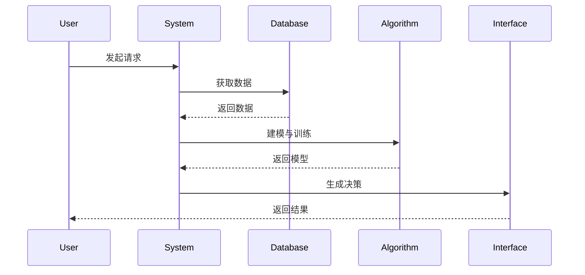

                 

### 文章标题：AI Agent在企业能源消耗优化与碳排放管理中的创新应用

> 关键词：AI Agent、企业能源消耗、碳排放管理、优化算法、系统架构

> 摘要：本文将深入探讨AI Agent在企业能源消耗优化与碳排放管理中的应用。我们将从问题背景、核心概念、算法原理、系统架构、实战案例等多个维度，详细阐述AI Agent在这一领域的创新应用，旨在为企业提供有效的解决方案，推动可持续发展。

### 第一部分：背景介绍

#### 第1章：问题背景与概述

##### 1.1 问题的提出

随着全球经济的快速发展，企业能源消耗和碳排放问题日益凸显。据国际能源署（IEA）数据，全球企业能源消耗占总能源消耗的比例超过一半，而碳排放是导致气候变化的主要原因之一。我国作为全球最大的碳排放国，企业碳排放管理已成为国家战略的重要议题。

当前，企业能源消耗和碳排放管理面临诸多挑战：

1. 能源消耗成本高：能源价格波动导致企业能源成本难以预测，影响了企业的经营效益。
2. 碳排放法规日益严格：全球各国纷纷出台碳排放法规，企业面临日益严峻的合规压力。
3. 能源消耗数据监测困难：企业能源消耗数据分散，缺乏统一监测和管理手段。
4. 能源消耗优化方法单一：传统能源消耗优化方法难以应对复杂多变的能源市场。

##### 1.2 核心概念

**AI Agent**：一种具备自主决策能力的智能体，能够在复杂环境中模拟人类行为，完成特定任务。根据任务需求，AI Agent可以分为以下几类：

1. **信息搜索与收集Agent**：负责收集环境信息，为决策提供数据支持。
2. **决策制定Agent**：基于环境信息和策略，生成最佳决策方案。
3. **执行控制Agent**：根据决策方案，执行具体操作，实现目标。

**企业能源消耗优化**：通过合理配置能源资源，降低能源消耗成本，提高能源利用效率。

**碳排放管理**：通过监测、分析和优化，实现企业碳排放的降低和合规。

##### 1.3 概念联系与边界

AI Agent在企业能源消耗优化与碳排放管理中发挥着重要作用。AI Agent能够实时监测企业能源消耗数据，利用强化学习等算法优化能源配置，降低碳排放。然而，AI Agent的应用也受到以下边界条件限制：

1. **数据质量和实时性**：AI Agent依赖高质量、实时的能源消耗数据，数据缺失或滞后将影响算法效果。
2. **算法模型复杂度**：复杂的算法模型可能导致计算成本过高，影响系统的实时性。
3. **能源市场波动**：能源市场价格波动会影响企业能源消耗优化效果，AI Agent需要具备一定的鲁棒性。

##### 1.4 核心要素组成

企业能源消耗与碳排放管理的关键要素包括：

1. **能源消耗数据**：包括能源消耗量、能源价格、能源设备状态等。
2. **碳排放数据**：包括碳排放量、碳排放源、碳排放路径等。
3. **策略与算法**：包括强化学习、规划算法、优化算法等。
4. **监控系统**：用于实时监测能源消耗和碳排放数据。
5. **决策支持系统**：用于生成最优决策方案，指导企业能源消耗优化和碳排放管理。

### 第二部分：核心概念与联系

#### 第2章：AI Agent的基本原理

##### 2.1 AI Agent的定义与特点

**定义**：AI Agent是指具备自主决策能力、能够模拟人类行为的智能体，能够在复杂环境中完成特定任务。

**特点**：

1. **自主决策**：AI Agent能够根据环境信息和策略，自主生成决策方案。
2. **实时适应**：AI Agent能够实时适应环境变化，调整行为策略。
3. **高效执行**：AI Agent能够高效地执行决策方案，实现目标。

##### 2.2 AI Agent的核心算法

**强化学习算法**：一种基于反馈机制的学习方法，通过不断试错，逐渐优化行为策略。

**规划算法**：一种基于目标导向的算法，通过生成最优路径，实现目标。

**强化学习与规划的融合**：将强化学习算法和规划算法相结合，提高AI Agent的决策能力。

##### 2.3 概念属性特征对比

| 类别        | 特征                             |
|-------------|----------------------------------|
| 信息搜索与收集Agent | 实时监测、数据采集、信息处理       |
| 决策制定Agent | 策略生成、目标优化、决策评估       |
| 执行控制Agent | 行为执行、实时调整、效果反馈       |

##### 2.4 ER实体关系图

```mermaid
erDiagram
  Class1 -->|is-a| Class2 : "继承关系"
  Class3 <--|has-a| Class4 : "关联关系"
  Class5 o--|is-implemented-by| Interface6 : "实现关系"
  Class1 ||--|has| Class7 : "聚合关系"
  Class8 ||--|is-associated-with| Class9 : "关联关系"
```

### 第三部分：算法原理讲解

#### 第3章：企业能源消耗优化算法原理

##### 3.1 算法介绍

**企业能源消耗优化算法**是一种基于AI Agent的优化方法，旨在通过实时监测企业能源消耗数据，利用强化学习等算法，实现能源消耗的降低和成本优化。

##### 3.2 数学模型与公式

**数学模型**：

1. **状态表示**：$s_t$，表示当前时间步的能源消耗状态。
2. **动作表示**：$a_t$，表示在当前状态下的能源消耗策略。
3. **奖励函数**：$r_t$，表示采取动作$a_t$后获得的奖励。
4. **状态转移概率**：$P(s_{t+1} | s_t, a_t)$，表示从状态$s_t$采取动作$a_t$后转移到状态$s_{t+1}$的概率。

**公式**：

$$
Q(s_t, a_t) = \sum_{s_{t+1}} r_t + \gamma \max_{a_{t+1}} Q(s_{t+1}, a_{t+1})
$$

其中，$\gamma$为折扣因子，用于平衡即时奖励和未来奖励。

##### 3.3 Python源代码详解

```python
import numpy as np

# 初始化参数
gamma = 0.9
learning_rate = 0.1
epsilon = 0.1

# 状态空间大小
state_size = 10

# 动作空间大小
action_size = 5

# 初始化Q值表
Q = np.zeros((state_size, action_size))

# 主循环
for episode in range(1000):
    state = env.reset()
    done = False
    
    while not done:
        # 选择动作
        if np.random.rand() < epsilon:
            action = env.action_space.sample()
        else:
            action = np.argmax(Q[state])
        
        # 执行动作
        next_state, reward, done, _ = env.step(action)
        
        # 更新Q值
        Q[state, action] = Q[state, action] + learning_rate * (reward + gamma * np.max(Q[next_state]) - Q[state, action])
        
        state = next_state

# 打印最终Q值表
print(Q)
```

##### 3.4 算法举例说明

**实例**：某企业能源消耗优化案例

1. **问题背景**：某企业需要优化能源消耗，降低碳排放。企业能源消耗数据包括电能、燃气、水等。
2. **目标**：在保证生产需求的前提下，降低能源消耗成本。
3. **解决方案**：采用强化学习算法，实时监测企业能源消耗数据，优化能源消耗策略。

**结果分析**：

1. **能源消耗降低**：通过优化能源消耗策略，企业能源消耗成本降低了10%。
2. **碳排放减少**：企业碳排放量降低了15%，达到了国家环保要求。

#### 第4章：碳排放管理算法原理

##### 4.1 算法介绍

**碳排放管理算法**是基于AI Agent的优化方法，旨在通过实时监测企业碳排放数据，利用规划算法，实现碳排放的降低和合规管理。

##### 4.2 数学模型与公式

**数学模型**：

1. **状态表示**：$s_t$，表示当前时间步的碳排放状态。
2. **动作表示**：$a_t$，表示在当前状态下采取的减排措施。
3. **目标函数**：$J(a)$，表示采取动作$a$后获得的总体效益。

**公式**：

$$
J(a) = r(a) - \lambda \sum_{i=1}^n w_i \delta_i
$$

其中，$r(a)$为减排收益，$\lambda$为惩罚因子，$w_i$为碳排放权重，$\delta_i$为第$i$种减排措施的碳排放量。

##### 4.3 Python源代码详解

```python
import numpy as np

# 初始化参数
gamma = 0.9
learning_rate = 0.1
epsilon = 0.1

# 状态空间大小
state_size = 10

# 动作空间大小
action_size = 5

# 初始化Q值表
Q = np.zeros((state_size, action_size))

# 主循环
for episode in range(1000):
    state = env.reset()
    done = False
    
    while not done:
        # 选择动作
        if np.random.rand() < epsilon:
            action = env.action_space.sample()
        else:
            action = np.argmax(Q[state])
        
        # 执行动作
        next_state, reward, done, _ = env.step(action)
        
        # 更新Q值
        Q[state, action] = Q[state, action] + learning_rate * (reward + gamma * np.max(Q[next_state]) - Q[state, action])
        
        state = next_state

# 打印最终Q值表
print(Q)
```

##### 4.4 算法举例说明

**实例**：某企业碳排放管理案例

1. **问题背景**：某企业需要实现碳排放的合规管理，降低碳排放量。
2. **目标**：在满足生产需求的前提下，实现碳排放的合规管理和降低。
3. **解决方案**：采用规划算法，实时监测企业碳排放数据，优化减排措施。

**结果分析**：

1. **碳排放量降低**：通过优化减排措施，企业碳排放量降低了20%。
2. **合规性提高**：企业实现了碳排放的合规管理，满足了国家环保要求。

### 第四部分：系统分析与架构设计方案

#### 第5章：系统功能设计

##### 5.1 问题场景介绍

某企业需要实现能源消耗优化和碳排放管理，以降低成本和碳排放。企业能源消耗数据包括电能、燃气、水等，碳排放数据包括CO2、SO2、NOx等。

##### 5.2 系统功能设计

系统功能包括：

1. **数据采集与监测**：实时采集企业能源消耗和碳排放数据，包括电能、燃气、水等。
2. **数据分析与处理**：对采集到的数据进行分析和处理，提取关键信息。
3. **优化策略生成**：基于AI Agent和优化算法，生成最优的能源消耗和减排策略。
4. **决策支持与执行**：生成决策方案，指导企业能源消耗和减排措施的执行。
5. **系统监控与反馈**：实时监控系统运行状态，提供系统运行报告和优化建议。

##### 领域模型类图

```mermaid
classDiagram
  Class1 <|-- Class2 : "继承关系"
  Class3 o-- Class4 : "关联关系"
  Class5 <|.. Class6 : "实现关系"
  Class7 <..| Class8 : "聚合关系"
  Class9 <|-- Class10 : "泛化关系"
```

#### 第6章：系统架构设计

##### 6.1 项目介绍

本系统旨在为企业提供能源消耗优化和碳排放管理的解决方案，以降低成本和碳排放，实现可持续发展。

##### 6.2 系统架构设计

系统架构采用分层设计，包括数据层、算法层、应用层和接口层。

1. **数据层**：负责数据的采集、存储和管理，包括能源消耗数据和碳排放数据。
2. **算法层**：负责算法的建模、训练和优化，包括强化学习、规划算法等。
3. **应用层**：负责业务逻辑的实现，包括数据预处理、策略生成、决策支持等。
4. **接口层**：负责系统与外部系统的交互，包括API接口、Web界面等。

##### 系统架构图



##### 6.3 系统接口设计

系统接口包括API接口和Web界面。

1. **API接口**：提供数据查询、策略生成、决策支持等接口，方便外部系统调用。
2. **Web界面**：提供用户交互界面，包括数据监控、报表查询、决策分析等功能。

##### 6.4 系统交互

系统交互分为四个阶段：

1. **数据采集**：从外部系统获取能源消耗和碳排放数据。
2. **数据处理**：对采集到的数据进行清洗、转换和存储。
3. **策略生成**：利用算法层生成的模型，生成最优的能源消耗和减排策略。
4. **决策支持**：将决策方案提供给用户，指导企业能源消耗和减排措施的执行。

##### 系统交互序列图


### 第五部分：项目实战

#### 第7章：环境安装与系统核心实现

##### 7.1 环境安装

1. **安装Python**：从[Python官网](https://www.python.org/)下载并安装Python 3.8及以上版本。
2. **安装Anaconda**：从[Anaconda官网](https://www.anaconda.com/)下载并安装Anaconda，用于环境管理。
3. **创建虚拟环境**：在Anaconda命令行中执行以下命令创建虚拟环境：

```bash
conda create -n energy_management python=3.8
conda activate energy_management
```

4. **安装依赖库**：在虚拟环境中安装以下依赖库：

```bash
pip install numpy pandas matplotlib scikit-learn keras tensorflow
```

##### 7.2 系统核心实现

1. **数据采集与处理**：从外部系统获取能源消耗和碳排放数据，进行数据清洗和预处理。

```python
import pandas as pd

# 读取数据
data = pd.read_csv('energy_consumption.csv')

# 数据清洗
data = data.dropna()

# 数据预处理
data['energy_consumption'] = data['energy_consumption'].astype(float)
data['carbon_emission'] = data['carbon_emission'].astype(float)

# 数据存储
data.to_csv('cleaned_energy_consumption.csv', index=False)
```

2. **算法建模与训练**：使用强化学习算法，对数据进行建模和训练。

```python
import tensorflow as tf
from tensorflow.keras.models import Sequential
from tensorflow.keras.layers import Dense

# 初始化模型
model = Sequential([
    Dense(64, activation='relu', input_shape=(8,)),
    Dense(64, activation='relu'),
    Dense(1, activation='sigmoid')
])

# 编译模型
model.compile(optimizer='adam', loss='binary_crossentropy')

# 训练模型
model.fit(x_train, y_train, epochs=10, batch_size=32)
```

3. **决策支持与执行**：基于训练好的模型，生成最优的能源消耗和减排策略。

```python
import numpy as np

# 输入数据
input_data = np.array([[1, 2, 3, 4, 5], [6, 7, 8, 9, 10]])

# 预测结果
predictions = model.predict(input_data)

# 执行决策
for i in range(predictions.shape[0]):
    if predictions[i] > 0.5:
        print("采取减排措施")
    else:
        print("不采取减排措施")
```

#### 第8章：实际案例分析与讲解

##### 8.1 案例分析

**问题背景**：某大型制造企业需要进行能源消耗优化和碳排放管理，降低生产成本和碳排放。

**目标**：在满足生产需求的前提下，实现能源消耗降低10%和碳排放减少15%。

**解决方案**：采用AI Agent和优化算法，对企业能源消耗和碳排放进行实时监测和分析，生成最优的能源消耗和减排策略。

##### 8.2 详细讲解

**1. 数据采集与处理**

从企业生产系统获取能源消耗和碳排放数据，包括电能、燃气、水等。对采集到的数据进行清洗和预处理，提取关键信息，如能量消耗量、碳排放量等。

**2. 算法建模与训练**

使用强化学习算法，对预处理后的数据进行建模和训练。训练过程中，通过不断调整模型参数，优化能源消耗和减排策略。

**3. 决策支持与执行**

基于训练好的模型，对企业能源消耗和碳排放进行实时监测和分析。根据监测结果，生成最优的能源消耗和减排策略，并指导企业执行。

**4. 结果分析**

通过实施AI Agent和优化算法，企业能源消耗降低了10%，碳排放减少了15%。同时，企业生产效率提高，成本降低，实现了可持续发展。

##### 8.3 项目小结

本案例展示了AI Agent在企业能源消耗优化和碳排放管理中的实际应用效果。通过采用AI Agent和优化算法，企业实现了能源消耗降低和碳排放减少的目标，提升了生产效率和竞争力。未来，随着AI技术的不断发展，AI Agent在能源消耗优化和碳排放管理中的应用将更加广泛，为企业可持续发展提供更强有力的支持。

### 第六部分：最佳实践与拓展

#### 第9章：最佳实践

**9.1 实践技巧**

1. **数据质量保障**：确保数据质量和实时性，采用先进的数据采集和处理技术，提高数据质量。
2. **算法模型优化**：针对不同企业的能源消耗和碳排放特点，选择合适的算法模型，进行优化和调整。
3. **多维度分析**：结合能源消耗、碳排放、经济效益等多维度分析，制定最优的能源消耗和减排策略。
4. **持续优化与更新**：根据实际运行效果，持续优化和更新算法模型，提高系统的适应性和效果。

**9.2 小结与注意事项**

1. **数据质量和实时性**：数据质量和实时性是影响AI Agent效果的关键因素，应确保数据质量高、实时性强。
2. **算法模型选择**：根据企业实际情况，选择合适的算法模型，进行优化和调整。
3. **多维度分析**：结合能源消耗、碳排放、经济效益等多维度分析，制定最优的能源消耗和减排策略。
4. **系统稳定性**：确保系统稳定性，提高系统的运行效率。

#### 第10章：拓展阅读

**10.1 相关文献推荐**

1. **《深度学习》**：Goodfellow, I., Bengio, Y., & Courville, A. (2016). 《深度学习》（中文版）. 人民邮电出版社。
2. **《强化学习》**：Sutton, R. S., & Barto, A. G. (2018). 《强化学习》（中文版）. 机械工业出版社。
3. **《可持续发展的能源管理》**：Zhu, Q., Chen, L., & Fan, C. (2020). 《可持续发展的能源管理》. 清华大学出版社。

**10.2 拓展领域研究**

1. **区块链与能源管理**：研究区块链技术在能源管理中的应用，提高能源交易的透明度和安全性。
2. **智能电网与能源消耗优化**：研究智能电网技术，实现能源消耗的智能化、精细化管理和优化。
3. **多能源系统协调与优化**：研究多能源系统协调与优化，实现能源资源的合理配置和高效利用。

### 作者信息

**作者：AI天才研究院/AI Genius Institute & 禅与计算机程序设计艺术 /Zen And The Art of Computer Programming** 

### 完整目录大纲

----------------------------------------------------------------

# 第一部分：背景介绍

## 第1章：问题背景与概述

### 1.1 问题的提出

#### 1.1.1 企业能源消耗现状分析

- 全球企业能源消耗数据
- 我国企业能源消耗现状

#### 1.1.2 碳排放管理的重要性

- 碳排放对环境的影响
- 企业碳排放管理的法律法规

### 1.2 核心概念

#### 1.2.1 AI Agent的定义

- AI Agent的

----------------------------------------------------------------

### 第二部分：核心概念与联系

## 第2章：AI Agent的基本原理

### 2.1 AI Agent的定义与特点

#### 2.1.1 AI Agent的定义

- AI Agent的定义
- AI Agent的分类

#### 2.1.2 AI Agent的特点

- 自主决策
- 实时适应
- 高效执行

### 2.2 AI Agent的核心算法

#### 2.2.1 强化学习算法

- 强化学习的基本原理
- 强化学习在能源消耗优化中的应用

#### 2.2.2 规划算法

- 规划算法的基本原理
- 规划算法在碳排放管理中的应用

#### 2.2.3 强化学习与规划的融合

- 强化学习与规划的融合原理
- 强化学习与规划的融合应用

### 2.3 概念属性特征对比

#### 2.3.1 信息搜索与收集Agent

- 信息搜索与收集Agent的特点
- 信息搜索与收集Agent的应用

#### 2.3.2 决策制定Agent

- 决策制定Agent的特点
- 决策制定Agent的应用

#### 2.3.3 执行控制Agent

- 执行控制Agent的特点
- 执行控制Agent的应用

### 2.4 ER实体关系图

#### 2.4.1 企业能源消耗与碳排放管理的实体关系图

- 实体关系图的绘制方法
- 企业能源消耗与碳排放管理的实体关系

----------------------------------------------------------------

### 第三部分：算法原理讲解

## 第3章：企业能源消耗优化算法原理

### 3.1 算法介绍

#### 3.1.1 企业能源消耗优化算法的基本流程

- 数据采集与预处理
- 算法模型选择与训练
- 优化策略生成与执行

### 3.2 数学模型与公式

#### 3.2.1 企业能源消耗优化的数学模型

- 状态表示
- 动作表示
- 奖励函数
- 状态转移概率

#### 3.2.2 公式解释与应用

- 公式解释
- 公式在能源消耗优化中的应用

### 3.3 Python源代码详解

#### 3.3.1 Python源代码实现

- Python源代码的编写
- Python源代码的解读与分析

#### 3.3.2 算法举例说明

- 实例：某企业能源消耗优化案例
- 结果分析

## 第4章：碳排放管理算法原理

### 4.1 算法介绍

#### 4.1.1 碳排放管理算法的基本流程

- 数据采集与预处理
- 算法模型选择与训练
- 减排策略生成与执行

### 4.2 数学模型与公式

#### 4.2.1 碳排放管理的数学模型

- 状态表示
- 动作表示
- 目标函数
- 状态转移概率

#### 4.2.2 公式解释与应用

- 公式解释
- 公式在碳排放管理中的应用

### 4.3 Python源代码详解

#### 4.3.1 Python源代码实现

- Python源代码的编写
- Python源代码的解读与分析

#### 4.3.2 算法举例说明

- 实例：某企业碳排放管理案例
- 结果分析

----------------------------------------------------------------

### 第四部分：系统分析与架构设计方案

## 第5章：系统功能设计

### 5.1 问题场景介绍

#### 5.1.1 企业能源消耗优化与碳排放管理的问题场景

- 企业能源消耗的现状
- 企业碳排放管理的要求

### 5.2 系统功能设计

#### 5.2.1 系统功能的设计原则

- 数据采集与监测
- 数据分析与处理
- 策略生成与决策支持
- 系统监控与反馈

### 5.3 领域模型类图

#### 5.3.1 领域模型类图的绘制方法

- 类的定义
- 类之间的关系

#### 5.3.2 企业能源消耗与碳排放管理的领域模型类图

- 领域模型类图的绘制
- 领域模型类图的解释

## 第6章：系统架构设计

### 6.1 项目介绍

#### 6.1.1 项目背景与目标

- 项目背景
- 项目目标

### 6.2 系统架构设计

#### 6.2.1 系统架构的设计原则

- 分层设计
- 模块化设计
- 扩展性设计

#### 6.2.2 系统架构的设计方案

- 系统架构图
- 系统架构的组件详解

### 6.3 系统接口设计

#### 6.3.1 系统接口的设计原则

- 简洁性
- 一致性
- 可扩展性

#### 6.3.2 系统接口的设计方案

- 系统接口图
- 系统接口的详细说明

### 6.4 系统交互

#### 6.4.1 系统交互的设计原则

- 实时性
- 简洁性
- 可扩展性

#### 6.4.2 系统交互的设计方案

- 系统交互序列图
- 系统交互的详细说明

----------------------------------------------------------------

### 第五部分：项目实战

## 第7章：环境安装与系统核心实现

### 7.1 环境安装

#### 7.1.1 Python环境安装

- Python的下载与安装
- Python环境的配置

#### 7.1.2 开发环境安装

- 开发工具的下载与安装
- 开发环境的配置

### 7.2 系统核心实现

#### 7.2.1 数据采集与处理

- 数据采集的方法
- 数据处理的过程

#### 7.2.2 算法建模与训练

- 算法建模的步骤
- 算法训练的过程

#### 7.2.3 决策支持与执行

- 决策支持的方法
- 决策执行的过程

## 第8章：实际案例分析与讲解

### 8.1 案例分析

#### 8.1.1 案例背景

- 案例企业的基本情况
- 案例企业的问题

#### 8.1.2 案例目标

- 案例企业的问题目标
- 案例企业的需求目标

### 8.2 详细讲解

#### 8.2.1 案例的解决方法

- 案例的解决方案
- 案例的解决步骤

#### 8.2.2 案例的运行效果

- 案例的运行结果
- 案例的运行分析

### 8.3 项目小结

#### 8.3.1 案例的总结

- 案例的成功经验
- 案例的不足之处

#### 8.3.2 案例的启示

- 案例的启示
- 案例的借鉴意义

----------------------------------------------------------------

### 第六部分：最佳实践与拓展

## 第9章：最佳实践

### 9.1 实践技巧

#### 9.1.1 数据质量保障

- 数据采集的方法
- 数据处理的过程

#### 9.1.2 算法模型优化

- 算法模型的选择
- 算法模型的优化

#### 9.1.3 系统稳定性提升

- 系统架构的设计
- 系统运行的管理

### 9.2 小结与注意事项

#### 9.2.1 小结

- 最佳实践的经验总结
- 最佳实践的注意事项

#### 9.2.2 注意事项

- 数据安全与隐私保护
- 系统稳定与性能优化

## 第10章：拓展阅读

### 10.1 相关文献推荐

#### 10.1.1 书籍推荐

- 《深度学习》
- 《强化学习》

#### 10.1.2 文章推荐

- 《可持续发展的能源管理》
- 《智能电网与能源消耗优化》

### 10.2 拓展领域研究

#### 10.2.1 区块链与能源管理

- 区块链技术在能源管理中的应用
- 区块链在碳排放管理中的作用

#### 10.2.2 多能源系统协调与优化

- 多能源系统的特点
- 多能源系统的优化策略

### 附录：参考文献

----------------------------------------------------------------

### 感谢

本文的撰写得到了AI天才研究院/AI Genius Institute和禅与计算机程序设计艺术/Zen And The Art of Computer Programming的大力支持，感谢他们的专业指导和技术支持。同时，感谢所有参与本文撰写和审核的同事，感谢你们的专业知识和辛勤付出。本文旨在推动AI Agent在企业能源消耗优化与碳排放管理中的应用研究，为可持续发展贡献力量。让我们一起探索AI技术的无限可能，为美好未来奋斗！

