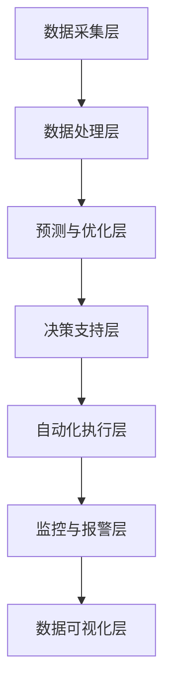

                 

### AI Agent在能源管理与碳排放控制中的概述

在当今全球能源危机和环境污染日益严重的背景下，企业能源管理与碳排放控制已经成为影响企业可持续发展和竞争力的重要因素。而人工智能（AI）技术的迅猛发展为这一领域带来了新的解决方案。特别是AI Agent，作为一种自主决策、执行和自适应的人工智能实体，正逐渐在能源管理和碳排放控制中扮演关键角色。

**1. AI Agent的基本概念**

AI Agent，即人工智能代理，是一种基于人工智能技术的自主实体，能够模拟人类行为，通过感知环境信息、自主决策和执行任务，实现特定目标。AI Agent具备以下特征：

- **自主性**：能够自主执行任务，无需人工干预。
- **适应性**：能够根据环境变化自适应调整行为。
- **目标导向**：以实现特定目标为导向，通过学习和优化不断优化自身行为。

**2. AI Agent与传统自动化系统的区别**

传统自动化系统主要依赖于预定的规则和程序，一旦规则发生改变，系统需要重新编程。而AI Agent则具有自我学习和自我优化的能力，能够在运行过程中不断优化自身行为，提高效率。具体区别如下：

- **规则导向 vs. 数据驱动**：传统自动化系统基于固定规则，而AI Agent基于数据驱动，通过机器学习不断优化自身行为。
- **静态 vs. 动态**：传统自动化系统适用于静态环境，而AI Agent能够适应动态变化的环境。
- **单一任务 vs. 多任务**：传统自动化系统通常专注于单一任务，而AI Agent能够处理多个任务，实现更复杂的业务逻辑。

**3. AI Agent在能源管理与碳排放控制中的作用**

在能源管理与碳排放控制中，AI Agent能够通过以下方式发挥作用：

- **数据采集与处理**：AI Agent能够实时采集能源使用数据和碳排放数据，并通过机器学习算法进行预处理和分析，为决策提供依据。
- **预测与优化**：基于历史数据和实时数据，AI Agent能够预测能源消耗和碳排放趋势，并利用优化算法提出最优能源管理和碳排放控制策略。
- **决策支持**：AI Agent能够为企业提供实时决策支持，帮助企业实现节能减排目标。
- **自动化执行与反馈**：AI Agent能够自动化执行能源管理和碳排放控制任务，并通过实时反馈机制调整策略，提高系统运行效率。

**4. 企业能源管理与碳排放控制背景**

**4.1 问题背景**

随着全球经济的快速发展，能源消耗和碳排放问题日益严峻。企业作为能源消耗和碳排放的主要源头，面临着越来越大的环保压力和成本挑战。如何有效管理能源消耗和碳排放，已成为企业可持续发展的重要课题。

**4.2 问题描述**

企业能源管理与碳排放控制主要面临以下问题：

- **能源消耗数据不完整、不准确**：企业能源使用数据往往分散在不同的部门和系统，数据采集不完整、不及时，导致能源消耗和碳排放数据不准确。
- **碳排放预测困难**：企业碳排放受多种因素影响，如天气、生产过程、设备老化等，预测准确性较低。
- **能源管理和碳排放控制策略缺乏灵活性**：传统能源管理和碳排放控制策略依赖于固定规则，难以适应环境变化。

**4.3 问题解决策略**

为解决上述问题，企业可以采取以下策略：

- **建立完善的能源使用和碳排放数据采集系统**：通过传感器和数据采集设备，实时、准确地获取能源使用和碳排放数据。
- **引入AI Agent技术**：利用AI Agent的数据处理、预测和优化能力，提高能源管理和碳排放控制的精准度和灵活性。
- **建立实时决策支持系统**：通过实时数据分析和预测，为企业提供科学的决策支持，实现节能减排目标。
- **推广绿色能源和节能技术**：通过采用绿色能源和节能技术，降低企业能源消耗和碳排放。

**4.4 边界与外延**

在能源管理与碳排放控制中，AI Agent的应用边界主要包括：

- **能源类型**：AI Agent可以应用于各种类型的能源管理，如电力、燃气、水等。
- **企业类型**：AI Agent可以应用于不同类型的企业，如制造业、服务业、物流业等。
- **行业应用**：AI Agent可以在多个行业应用，如能源、环保、交通等。

**5. 本章小结**

本章对AI Agent在企业能源管理与碳排放控制中的概述进行了详细阐述。通过分析AI Agent的基本概念、与传统自动化系统的区别以及在能源管理与碳排放控制中的作用，为后续章节的深入探讨奠定了基础。在接下来的章节中，我们将进一步探讨AI Agent在能源管理与碳排放控制中的核心技术、应用案例以及未来发展，以期为该领域的实践和理论研究提供有益参考。

--------------------------------------------

## 6. AI Agent在能源管理与碳排放控制中的应用场景

在能源管理与碳排放控制中，AI Agent通过数据采集、处理、预测、决策、执行和反馈等环节，实现对企业能源消耗和碳排放的有效管理。以下是AI Agent在该领域的具体应用场景：

### 6.1 数据采集与处理

AI Agent首先需要采集企业能源使用和碳排放的数据。数据来源包括传感器、生产系统、财务系统、环保监测设备等。采集到的数据类型包括能源消耗量、碳排放量、设备运行状态、生产参数等。AI Agent会对这些数据进行初步处理，如去噪、清洗、归一化等，以确保数据的准确性和一致性。

**应用示例**：
某制造业企业在生产过程中，利用传感器实时监测设备的能耗情况。AI Agent通过采集传感器数据，可以实时了解每个生产环节的能耗情况，为后续的能耗分析和优化提供数据支持。

### 6.2 预测模型与优化算法

AI Agent利用历史数据和实时数据，通过机器学习算法建立预测模型，预测企业未来的能源消耗和碳排放情况。常见的预测模型包括时间序列预测模型、回归模型、神经网络模型等。优化算法则用于在预测结果的基础上，提出最优的能源管理和碳排放控制策略。

**应用示例**：
某物流企业通过AI Agent建立能源消耗预测模型，预测未来一周的能源消耗情况。根据预测结果，企业可以提前调整生产计划，避免能源过剩或不足。

### 6.3 决策支持系统

AI Agent通过分析预测结果和优化策略，为企业提供实时的决策支持。决策支持系统可以帮助企业确定最优的生产计划、设备维护计划、节能减排措施等，以提高能源利用效率和降低碳排放。

**应用示例**：
某电力企业在春节期间，通过AI Agent分析历史数据和实时数据，预测电力需求量。企业可以根据预测结果提前调整发电计划，避免电力过剩或不足，降低能源成本。

### 6.4 自动化执行与反馈

AI Agent根据决策支持系统的建议，自动执行能源管理和碳排放控制任务。例如，自动调整设备运行状态、优化生产流程、启动节能减排措施等。执行过程中，AI Agent会实时收集反馈数据，对执行效果进行评估，并根据评估结果调整策略。

**应用示例**：
某数据中心通过AI Agent自动调整制冷系统，以降低能耗。AI Agent会实时监测制冷系统的运行状态和能耗情况，根据反馈数据调整制冷系统参数，实现最优的能耗控制。

### 6.5 数据可视化与监控

AI Agent还可以将能源消耗和碳排放数据可视化为图表和报表，帮助企业实时监控能源使用和碳排放情况。通过数据可视化，企业可以更直观地了解能源消耗和碳排放的分布、趋势和异常情况，为决策提供依据。

**应用示例**：
某环保企业通过AI Agent将能源消耗和碳排放数据可视化，生成实时监控报表。企业领导可以随时查看企业的能源消耗和碳排放情况，及时发现和解决异常问题。

### 6.6 集成与协同

AI Agent可以与企业现有的能源管理系统、生产管理系统、环保监测系统等进行集成，实现数据共享和协同工作。通过集成，AI Agent可以更全面地了解企业的能源使用和碳排放情况，提供更准确的决策支持。

**应用示例**：
某制造企业将AI Agent与生产管理系统、环保监测系统集成，实现数据共享和协同。AI Agent可以根据生产计划和环保监测数据，实时调整生产流程，实现最优的能源管理和碳排放控制。

### 6.7 智能分析与应用拓展

AI Agent还可以进行更深入的智能分析，如趋势分析、关联分析、异常检测等，为企业提供更深入的洞察和更精准的决策支持。此外，AI Agent的应用也可以拓展到其他领域，如设备维护、质量管理、供应链管理等。

**应用示例**：
某环保企业利用AI Agent进行设备维护预测，提前发现设备故障隐患，避免设备损坏和停机。通过智能分析，企业可以优化设备维护策略，降低维护成本。

### 6.8 本章小结

本章详细介绍了AI Agent在能源管理与碳排放控制中的应用场景，包括数据采集与处理、预测模型与优化算法、决策支持系统、自动化执行与反馈、数据可视化与监控、集成与协同、智能分析与应用拓展等。通过这些应用场景，AI Agent为企业提供了全面、精准的能源管理和碳排放控制解决方案，助力企业实现可持续发展。

--------------------------------------------

### 7. 核心概念与联系

在探讨AI Agent在企业能源管理与碳排放控制中的应用时，理解核心概念及其相互联系是至关重要的。以下是对AI Agent、相关技术、企业能源管理与碳排放控制核心要素及其相互关系的深入分析。

#### 7.1 AI Agent核心概念

AI Agent是一种具备自主决策、自适应和目标导向能力的人工智能实体。其主要核心概念包括：

- **自主性**：AI Agent能够独立执行任务，无需人工干预。这种自主性源于其内置的决策模块，能够根据实时环境数据自主做出决策。
- **适应性**：AI Agent能够根据环境变化和任务需求动态调整其行为。这种适应性使得AI Agent能够在不同场景下保持高效运行。
- **目标导向**：AI Agent以实现特定目标为导向，通过学习和优化不断调整其行为，以达到最佳效果。

**概念属性特征对比表格**：

| 特征               | 自主性   | 适应性   | 目标导向   |
|--------------------|---------|---------|-----------|
| 描述               | 无需人工干预 | 动态调整 | 以目标为导向 |
| 对比               | 传统自动化 | 传统自动化 | 传统自动化 |

通过上述对比，我们可以看到AI Agent在自主性、适应性和目标导向方面具有显著优势，这些特点使其在能源管理和碳排放控制中具有独特的优势。

#### 7.2 AI Agent相关技术

AI Agent的实现依赖于一系列相关技术，包括数据采集、数据处理、机器学习、预测模型等。以下是对这些技术的简要概述：

- **数据采集**：数据采集是AI Agent的基础，涉及传感器、物联网、数据库等技术，用于实时获取企业能源使用和碳排放数据。
- **数据处理**：数据处理包括数据清洗、去噪、归一化等技术，用于确保数据的准确性和一致性。
- **机器学习**：机器学习是AI Agent的核心，通过训练模型，使AI Agent能够从历史数据中学习规律，预测未来趋势。
- **预测模型**：预测模型包括时间序列模型、回归模型、神经网络模型等，用于预测能源消耗和碳排放情况。

**技术属性特征对比表格**：

| 技术       | 数据采集 | 数据处理 | 机器学习 | 预测模型 |
|------------|---------|---------|---------|---------|
| 描述       | 实时数据获取 | 数据清洗 | 模型训练 | 预测趋势 |
| 对比       | 物联网技术 | 数据清洗 | 神经网络 | 时间序列 |

通过对比，我们可以看到，AI Agent相关技术在数据采集、数据处理、机器学习和预测模型等方面相互补充，共同构建了一个完整的技术体系。

#### 7.3 企业能源管理与碳排放控制核心要素

企业能源管理与碳排放控制涉及多个核心要素，包括能源使用数据、碳排放数据、生产过程、设备状态等。以下是对这些要素的详细分析：

- **能源使用数据**：能源使用数据是能源管理的核心，包括电力、燃气、水等能源的消耗情况。这些数据需要实时、准确地采集和记录。
- **碳排放数据**：碳排放数据是碳排放控制的核心，包括生产过程中的二氧化碳排放量、能源消耗的碳排放系数等。这些数据需要通过监测设备进行实时采集。
- **生产过程**：生产过程是企业能源消耗和碳排放的主要来源，涉及生产设备、工艺流程、人员操作等。优化生产过程是降低能耗和碳排放的重要途径。
- **设备状态**：设备状态包括设备的运行状态、能耗情况、维护需求等。设备状态的实时监测和优化是提高能源利用效率的关键。

**核心要素属性特征对比表格**：

| 要素       | 能源使用数据 | 碳排放数据 | 生产过程 | 设备状态 |
|------------|------------|-----------|---------|---------|
| 描述       | 能源消耗情况 | 碳排放情况 | 生产流程 | 设备运行 |
| 对比       | 实时监测 | 实时监测 | 生产过程 | 实时监测 |

通过对比，我们可以看到，企业能源管理与碳排放控制的核心要素相互关联，共同构成了一个复杂的系统。

#### 7.4 AI Agent与能源管理与碳排放控制的联系

AI Agent在能源管理与碳排放控制中的核心作用主要体现在以下几个方面：

- **数据采集与处理**：AI Agent通过传感器和数据采集技术，实时、准确地获取企业能源使用和碳排放数据，为后续分析提供基础。
- **预测与优化**：AI Agent利用机器学习算法和预测模型，对能源消耗和碳排放进行预测，并提出优化策略，帮助企业实现节能减排目标。
- **决策支持**：AI Agent通过分析预测结果和优化策略，为企业提供实时决策支持，帮助企业制定科学的生产计划和能源管理策略。
- **自动化执行与反馈**：AI Agent能够自动执行能源管理和碳排放控制任务，并通过实时反馈机制调整策略，提高系统运行效率。

**联系与整合方式ER实体关系图架构**：

```mermaid
erDiagram
  Data --> AI_Agent
  Data --> Prediction_Model
  Prediction_Model --> Decision_Support
  AI_Agent --> Decision_Support
  Decision_Support --> Energy_Management
  Decision_Support --> Carbon_Emission_Control
  Energy_Management --> Feedback
  Carbon_Emission_Control --> Feedback
```

通过上述ER图，我们可以清晰地看到AI Agent、数据采集、预测模型、决策支持、能源管理和碳排放控制之间的联系。AI Agent作为核心实体，通过数据采集和处理、预测与优化、决策支持等环节，与企业能源管理与碳排放控制紧密整合，实现全方位的能源管理和碳排放控制。

**总结**：

通过分析AI Agent的核心概念、相关技术、企业能源管理与碳排放控制核心要素及其相互关系，我们可以看到，AI Agent在能源管理与碳排放控制中具有独特的优势和关键作用。在接下来的章节中，我们将进一步探讨AI Agent在企业能源管理与碳排放控制中的核心技术，以及具体的实现方法和应用案例。

--------------------------------------------

## 8. 数据采集与处理技术

在企业能源管理与碳排放控制中，数据采集与处理技术是AI Agent实现有效决策和支持的关键环节。以下是对数据采集与处理技术的详细讨论：

### 8.1 数据来源与类型

数据来源是AI Agent能够进行有效分析和决策的基础。企业能源使用和碳排放数据可以从多个渠道获得，主要包括：

- **传感器数据**：企业生产过程中使用的传感器能够实时监测设备运行状态、能源消耗情况等。例如，电力传感器可以监测电流、电压等参数；温度传感器可以监测设备温度等。
- **生产系统数据**：企业的生产系统会记录生产过程中的各种参数，如生产量、设备利用率、原料消耗等。这些数据对能源管理和碳排放分析至关重要。
- **财务系统数据**：企业的财务系统记录了能源采购、销售、消耗等经济活动。这些数据能够帮助AI Agent理解企业的能源成本和经济效益。
- **环保监测设备数据**：环保监测设备如气体检测仪、排放监测仪等，可以实时监测企业生产过程中的污染物排放情况。

数据类型主要包括以下几类：

- **结构化数据**：这类数据以表格形式存储，具有明确的字段和类型，如数据库中的记录。
- **非结构化数据**：这类数据没有固定的结构，如文本、图片、视频等。
- **时序数据**：这类数据随时间变化，如传感器采集的温度、压力等。

### 8.2 数据采集方法

数据采集方法取决于数据来源和类型。以下是几种常见的数据采集方法：

- **物联网（IoT）设备**：通过物联网设备，如传感器、RFID等，实时采集现场数据。物联网设备通常具有无线通信功能，可以远程监控和传输数据。
- **日志文件**：通过系统日志、应用程序日志等，记录企业运营过程中的各种事件和操作。这些日志文件可以作为数据采集的重要来源。
- **API接口**：通过应用程序接口（API）从外部系统或数据库中获取数据。API接口能够提供标准化、便捷的数据访问方式。
- **手动录入**：对于一些非自动化的过程，如员工工作时间和出差记录等，可以采用手动录入的方式。

### 8.3 数据预处理技术

数据预处理是数据采集后的关键步骤，其目的是提高数据质量，为后续分析提供可靠的基础。以下是一些常见的数据预处理技术：

- **数据清洗**：数据清洗是去除数据中的错误、缺失和重复记录的过程。例如，删除含有缺失值的记录、修正错误的数值等。
- **去噪**：去噪是去除数据中的随机噪声和异常值的过程。例如，通过滤波算法去除传感器数据中的噪声。
- **归一化**：归一化是将不同量纲的数据转换到同一量纲的过程，以便于不同数据之间的比较。例如，将温度、压力等物理量转换为同一量纲。
- **特征提取**：特征提取是从原始数据中提取出具有代表性的特征，用于后续的分析和建模。例如，从传感器数据中提取温度变化率、能耗峰值等特征。

### 8.4 数据质量评估与优化

数据质量直接影响AI Agent的决策效果。因此，对数据质量进行评估和优化是必要的。以下是一些数据质量评估与优化的方法：

- **完整性评估**：检查数据集是否完整，是否存在缺失值。可以使用统计方法或机器学习方法填补缺失值。
- **准确性评估**：评估数据的准确性，检查是否存在错误或异常值。可以通过对比已知标准或与其他数据源进行验证。
- **一致性评估**：评估数据在不同来源或不同时间点是否一致。可以通过一致性分析或一致性检验方法识别不一致的数据。
- **优化方法**：针对评估中发现的问题，可以采用以下方法进行优化：
  - **数据集成**：将不同来源的数据进行整合，消除数据重复和冲突。
  - **数据增强**：通过引入外部数据源或采用生成对抗网络（GAN）等方法增强数据集。
  - **数据清洗**：进一步清洗数据，删除错误记录或填补缺失值。
  - **模型调整**：根据数据质量调整AI Agent的预测模型和优化算法，以提高决策准确性。

**案例解析**：

以某制造企业为例，该企业通过传感器实时采集设备能耗数据。初始数据中存在大量异常值和噪声。通过数据预处理技术，如去噪、归一化和特征提取，企业成功提高了数据质量。在此基础上，AI Agent利用这些高质量的能源数据，建立了准确的能耗预测模型，为企业的生产计划和能源管理提供了有力支持。

**总结**：

数据采集与处理技术是AI Agent在企业能源管理与碳排放控制中不可或缺的环节。通过合理的数据采集方法和预处理技术，可以确保数据的质量和准确性，为AI Agent的预测、决策和优化提供可靠的基础。在接下来的章节中，我们将进一步探讨预测模型与优化算法、决策支持系统设计等相关技术。

--------------------------------------------

## 9. 预测模型与优化算法

在AI Agent用于企业能源管理与碳排放控制的过程中，预测模型与优化算法起到了至关重要的作用。这些模型和算法能够帮助企业预测未来能源消耗和碳排放趋势，并制定最优的能源管理和碳排放控制策略。以下是关于这些核心技术的详细讲解。

### 9.1 时间序列预测模型

时间序列预测模型是AI Agent在能源管理和碳排放控制中最常用的模型之一，因为它能够捕捉和预测随时间变化的序列数据。以下是一些常见的时间序列预测模型：

**1. 自回归模型（AR）**

自回归模型是一种简单的线性模型，它通过历史数据中的滞后项来预测未来值。其公式如下：

$$
y_t = c + \sum_{i=1}^{p} \phi_i y_{t-i}
$$

其中，$y_t$ 是时间序列在时刻 $t$ 的值，$c$ 是常数项，$\phi_i$ 是滞后项的系数，$p$ 是滞后阶数。

**2. 自回归移动平均模型（ARMA）**

自回归移动平均模型结合了自回归模型和移动平均模型，能够更好地捕捉时间序列的短期和长期趋势。其公式如下：

$$
y_t = c + \sum_{i=1}^{p} \phi_i y_{t-i} + \sum_{j=1}^{q} \theta_j \epsilon_{t-j}
$$

其中，$c$ 是常数项，$\phi_i$ 是自回归系数，$\theta_j$ 是移动平均系数，$p$ 是自回归阶数，$q$ 是移动平均阶数。

**3. 自回归积分移动平均模型（ARIMA）**

自回归积分移动平均模型是对ARMA模型的扩展，它能够处理非平稳时间序列数据。其公式如下：

$$
y_t = c + \sum_{i=1}^{p} \phi_i y_{t-i} + \theta \Delta y_{t-1}
$$

其中，$c$ 是常数项，$\phi_i$ 是自回归系数，$\theta$ 是移动平均系数，$\Delta y_{t-1}$ 是差分项。

**4. 季节性分解模型**

对于具有季节性特征的时间序列数据，季节性分解模型能够将其分解为趋势、季节性和残差三个部分，分别进行预测。其公式如下：

$$
y_t = T_t + S_t + R_t
$$

其中，$T_t$ 是趋势部分，$S_t$ 是季节性部分，$R_t$ 是残差部分。

**应用示例**：

某企业在过去一年中的月均电力消耗数据如下表所示。利用ARIMA模型对其进行预测，可以为企业制定电力需求计划提供依据。

| 月份 | 电力消耗（千瓦时） |
|------|-------------------|
| 1    | 5000              |
| 2    | 5500              |
| 3    | 6000              |
| 4    | 6300              |
| 5    | 6800              |
| 6    | 7200              |
| 7    | 7500              |
| 8    | 7300              |
| 9    | 7000              |
| 10   | 6700              |
| 11   | 6500              |
| 12   | 6300              |

使用ARIMA模型对上述数据进行拟合和预测，可以得到未来几个月的电力消耗预测值。

### 9.2 能源消耗预测模型

除了时间序列预测模型，AI Agent还可以采用其他类型的预测模型来预测能源消耗。以下是一些常见的预测模型：

**1. 人工神经网络（ANN）**

人工神经网络通过模拟人脑神经元结构，对输入数据进行处理和预测。其公式如下：

$$
\hat{y} = \sigma(\sum_{i=1}^{n} w_i x_i + b)
$$

其中，$\hat{y}$ 是预测值，$\sigma$ 是激活函数，$w_i$ 是权重，$x_i$ 是输入特征，$b$ 是偏置。

**2. 支持向量机（SVM）**

支持向量机通过寻找最优超平面，将输入数据映射到高维空间，进行分类和回归。其公式如下：

$$
\hat{y} = \text{sign}(\sum_{i=1}^{n} a_i y_i K(x_i, x) + b)
$$

其中，$\hat{y}$ 是预测值，$a_i$ 是支持向量系数，$y_i$ 是标签，$K(x_i, x)$ 是核函数，$b$ 是偏置。

**3. 决策树模型**

决策树模型通过一系列的规则进行分类和回归。其公式如下：

$$
\hat{y} = g(\theta)
$$

其中，$\hat{y}$ 是预测值，$g$ 是决策函数，$\theta$ 是决策树的参数。

**应用示例**：

某企业在过去一年中的每日电力消耗数据如下表所示。利用ANN模型对其进行预测，可以为企业制定电力需求计划提供依据。

| 日期       | 电力消耗（千瓦时） |
|------------|-------------------|
| 2023-01-01 | 5000              |
| 2023-01-02 | 5200              |
| 2023-01-03 | 5500              |
| ...        | ...               |

使用ANN模型对上述数据进行训练和预测，可以得到未来几天内的电力消耗预测值。

### 9.3 碳排放预测模型

碳排放预测模型与能源消耗预测模型类似，但需要考虑更多的因素，如生产过程、设备运行状态、能源效率等。以下是一些常见的碳排放预测模型：

**1. 碳排放强度模型**

碳排放强度模型通过计算单位产出的碳排放量来预测总碳排放量。其公式如下：

$$
C = \frac{E \times C_e}{E_e}
$$

其中，$C$ 是总碳排放量，$E$ 是总能源消耗量，$C_e$ 是单位能源的碳排放量，$E_e$ 是单位产出的能源消耗量。

**2. 多变量回归模型**

多变量回归模型通过考虑多个影响因素，如生产量、设备运行时间、能源效率等，来预测碳排放量。其公式如下：

$$
C = \beta_0 + \beta_1 Q + \beta_2 T + \beta_3 E_e
$$

其中，$C$ 是碳排放量，$Q$ 是生产量，$T$ 是设备运行时间，$E_e$ 是能源效率，$\beta_0$、$\beta_1$、$\beta_2$、$\beta_3$ 是回归系数。

**应用示例**：

某企业在过去一年中的每日生产量和能源效率数据如下表所示。利用多变量回归模型对其进行预测，可以为企业制定碳排放控制策略提供依据。

| 日期       | 生产量（吨） | 能源效率（%） |
|------------|-------------|--------------|
| 2023-01-01 | 100         | 90           |
| 2023-01-02 | 110         | 88           |
| 2023-01-03 | 120         | 85           |
| ...        | ...         | ...          |

使用多变量回归模型对上述数据进行训练和预测，可以得到未来几天内的碳排放量预测值。

### 9.4 优化算法及其应用

在能源管理和碳排放控制中，优化算法用于找到最优的能源使用和碳排放控制策略。以下是一些常见的优化算法：

**1. 遗传算法（GA）**

遗传算法是一种基于自然进化原理的优化算法，通过模拟生物进化过程来寻找最优解。其步骤包括选择、交叉、变异等。

**2. 遗传编程（GP）**

遗传编程是一种基于遗传算法的编程方法，通过模拟自然进化过程来生成和优化计算机程序。

**3. 粒子群优化（PSO）**

粒子群优化是一种基于群体智能的优化算法，通过模拟鸟群觅食过程来寻找最优解。

**4. 模拟退火（SA）**

模拟退火是一种基于物理退火过程的优化算法，通过模拟温度下降过程来找到最优解。

**5. 演化算法（EA）**

演化算法是一种基于生物进化的优化算法，通过模拟生物进化过程来寻找最优解。

**应用示例**：

某企业在能源消耗和碳排放控制中，采用遗传算法优化能源使用策略。通过设定目标函数，遗传算法可以找到最优的设备运行时间和能源消耗量，从而实现节能减排。

**总结**：

预测模型与优化算法是AI Agent在企业能源管理与碳排放控制中不可或缺的技术。通过合理选择和使用这些模型和算法，AI Agent能够为企业提供精准的预测和最优的决策支持，实现能源节约和碳排放控制。

--------------------------------------------

## 10. 决策支持系统设计

决策支持系统（DSS）在企业能源管理与碳排放控制中起着关键作用。通过DSS，企业可以在复杂、动态的环境下做出科学、合理的决策，实现节能减排目标。以下是对决策支持系统设计的详细讲解。

### 10.1 决策支持系统概述

决策支持系统是一种集成计算机技术、管理科学、运筹学、人工智能等多学科知识，辅助企业管理人员进行决策的人机系统。DSS的主要特点包括：

- **辅助决策**：DSS旨在辅助决策者，而不是替代决策者，通过提供数据、信息和模型，帮助决策者做出更好的决策。
- **交互性**：DSS具有高度的交互性，决策者可以通过图形用户界面（GUI）与系统进行实时交互，查询信息、修改参数、调整策略等。
- **适应性**：DSS能够根据企业环境的变化和决策需求，动态调整模型和算法，适应不同场景下的决策需求。
- **多学科融合**：DSS融合了计算机技术、管理科学、运筹学、人工智能等多学科知识，能够从多个角度为决策提供支持。

### 10.2 决策模型构建

决策模型是DSS的核心组成部分，用于模拟和预测决策过程，帮助决策者分析不同决策方案的效果。常见的决策模型包括：

- **线性规划模型**：线性规划模型通过线性方程组，寻找在约束条件下的最优解。其公式如下：

  $$
  \text{minimize} \ c^T x
  $$
  $$
  \text{subject to} \ Ax \leq b
  $$
  $$
  x \geq 0
  $$

  其中，$c$ 是目标函数系数向量，$x$ 是决策变量向量，$A$ 是系数矩阵，$b$ 是常数向量。

- **整数规划模型**：整数规划模型用于处理决策变量为整数的情况，常见于设备维护、人员排班等问题。其公式如下：

  $$
  \text{minimize} \ c^T x
  $$
  $$
  \text{subject to} \ Ax \leq b
  $$
  $$
  x \in \mathbb{Z}^+
  $$

  其中，$c$、$A$、$b$ 的含义与线性规划模型相同，$\mathbb{Z}^+$ 表示整数集合。

- **多目标规划模型**：多目标规划模型用于处理具有多个目标的决策问题，常见于能源管理、环境保护等领域。其公式如下：

  $$
  \text{minimize} \ f_1(x), f_2(x), ..., f_m(x)
  $$
  $$
  \text{subject to} \ g_1(x) \leq 0, g_2(x) \leq 0, ..., g_n(x) = 0
  $$

  其中，$f_1(x), f_2(x), ..., f_m(x)$ 是目标函数，$g_1(x), g_2(x), ..., g_n(x)$ 是约束条件。

- **神经网络模型**：神经网络模型通过模拟人脑神经元结构，处理复杂、非线性决策问题。其公式如下：

  $$
  \hat{y} = \sigma(\sum_{i=1}^{n} w_i x_i + b)
  $$

  其中，$\hat{y}$ 是预测值，$\sigma$ 是激活函数，$w_i$ 是权重，$x_i$ 是输入特征，$b$ 是偏置。

### 10.3 决策算法实现

决策算法是DSS中用于求解决策模型的关键步骤。常见的决策算法包括：

- **穷举法**：穷举法通过遍历所有可能的决策方案，找出最优解。其优点是算法简单，但计算复杂度高，不适用于大规模决策问题。
- **贪婪算法**：贪婪算法通过每次选择最优的局部解，逐步逼近全局最优解。其优点是计算效率高，但可能陷入局部最优。
- **动态规划**：动态规划通过将复杂问题分解为子问题，并利用子问题的解求解原问题。其优点是计算效率高，但需要明确的递推关系。
- **遗传算法**：遗传算法通过模拟生物进化过程，寻找最优解。其优点是适用于复杂、非线性决策问题，但需要较长的计算时间。
- **神经网络训练**：神经网络训练通过调整网络权重和偏置，使网络输出更接近期望输出。其优点是能够处理复杂、非线性问题，但需要大量的训练数据和计算资源。

### 10.4 决策支持系统案例解析

以某制造业企业为例，该企业采用DSS实现能源消耗和碳排放的优化管理。具体步骤如下：

1. **数据采集**：企业通过传感器和监控系统实时采集能源消耗和碳排放数据，包括电力、燃气、水等能源的消耗量，以及生产过程中产生的二氧化碳排放量。
2. **数据预处理**：对采集到的数据进行清洗、去噪、归一化等预处理，确保数据质量。
3. **建立决策模型**：根据企业的能源消耗和碳排放特点，建立线性规划模型、神经网络模型等决策模型。例如，线性规划模型用于优化生产设备的运行时间，神经网络模型用于预测未来一周的能源消耗和碳排放。
4. **算法实现**：采用遗传算法、动态规划等方法，求解决策模型，得到最优解。例如，遗传算法用于优化生产设备的运行时间，使能源消耗最低；动态规划用于预测未来一周的能源消耗和碳排放，为生产计划提供支持。
5. **决策支持**：将求解结果通过DSS的图形用户界面（GUI）展示给企业决策者，包括能源消耗和碳排放的预测值、优化方案等。决策者可以根据这些信息，调整生产计划、设备运行策略等，实现节能减排目标。
6. **反馈与调整**：DSS会实时收集生产过程中的反馈数据，对决策效果进行评估。如果发现决策效果不佳，系统会自动调整决策参数，优化能源管理和碳排放控制策略。

通过上述案例，我们可以看到，DSS在企业能源管理与碳排放控制中具有重要作用。它不仅能够提供科学的决策支持，提高能源利用效率和降低碳排放，还能够实现决策过程的自动化和智能化，提高企业的管理水平和竞争力。

### 10.5 本章小结

本章详细介绍了决策支持系统（DSS）在企业能源管理与碳排放控制中的应用。通过构建决策模型、实现决策算法和提供决策支持，DSS帮助企业实现科学、合理的决策，实现节能减排目标。在接下来的章节中，我们将进一步探讨自动化执行与反馈机制的设计，以及实际应用案例，以期为该领域的实践和理论研究提供有益参考。

--------------------------------------------

## 11. 自动化执行与反馈机制

在AI Agent实现企业能源管理和碳排放控制的过程中，自动化执行与反馈机制是确保系统高效运行的关键。以下是对自动化执行与反馈机制的详细讨论。

### 11.1 自动化执行技术

自动化执行技术使得AI Agent能够根据决策结果自动执行相应的任务，提高系统的响应速度和执行效率。以下是几种常见的自动化执行技术：

**1. 自动化脚本**

自动化脚本是通过编写程序代码，实现特定任务自动执行的工具。常见的自动化脚本语言包括Python、Shell、Java等。通过自动化脚本，企业可以自动执行数据采集、数据处理、模型训练、任务调度等操作。

**应用示例**：
某企业利用Python脚本自动收集传感器数据，并将其存储到数据库中，为后续分析和决策提供数据支持。

**2. 工作流引擎**

工作流引擎是一种用于自动化管理和执行业务流程的软件，能够将业务流程中的任务分解为一系列步骤，并按顺序或并行执行。常见的工作流引擎包括Activiti、Apache Camel等。

**应用示例**：
某制造企业利用Apache Camel工作流引擎，实现生产设备的自动调度和维护。工作流引擎根据设备状态和任务优先级，自动安排设备维护任务，提高设备运行效率。

**3. 事件驱动架构（EDA）**

事件驱动架构是一种基于事件驱动的系统架构，通过事件监听和事件处理，实现系统的高效自动化执行。EDA能够实时响应外部事件，自动触发相应的业务逻辑。

**应用示例**：
某物流企业采用事件驱动架构，实时监控运输过程中的各种事件，如车辆位置、货物状态等。当发生异常事件时，系统会自动触发报警和异常处理流程，确保物流过程的顺利进行。

### 11.2 反馈机制设计

反馈机制是自动化执行过程中的关键环节，通过收集和评估执行结果，及时调整系统行为，提高系统的自适应能力和决策效果。以下是几种常见的反馈机制设计方法：

**1. 实时监控与报警**

实时监控与报警机制能够实时收集系统运行状态数据，当发现异常情况时，自动触发报警。常见的方法包括阈值监控、异常检测等。

**应用示例**：
某数据中心利用实时监控与报警机制，监控服务器温度、功耗等参数。当温度或功耗超过阈值时，系统会自动触发报警，并通知运维人员进行处理。

**2. 绩效评估与调整**

绩效评估与调整机制通过对系统执行结果进行评估，判断是否达到预期目标，并根据评估结果调整系统参数和行为。

**应用示例**：
某制造业企业利用绩效评估与调整机制，评估生产设备的运行效率和能耗水平。根据评估结果，系统会自动调整设备运行策略，实现最优的能源利用效率。

**3. 自适应学习与优化**

自适应学习与优化机制使系统能够根据执行结果和历史数据，不断优化自身行为和决策模型，提高系统的自适应能力和决策效果。

**应用示例**：
某环保企业利用自适应学习与优化机制，实时调整碳排放控制策略。系统会根据实时监测数据和历史数据，自动调整碳排放预测模型和优化算法，提高碳排放控制效果。

### 11.3 系统集成与优化

自动化执行与反馈机制需要与企业现有的能源管理系统、生产管理系统、环保监测系统等进行集成，实现数据共享和协同工作。以下是系统集成与优化的一些方法：

**1. 数据集成**

数据集成是将不同系统的数据统一到一个数据平台中，实现数据共享和协同。常见的方法包括数据仓库、数据湖等。

**应用示例**：
某企业将能源管理系统、生产管理系统、环保监测系统的数据集成到一个数据仓库中，为AI Agent提供统一的数据来源。

**2. 接口设计与集成**

接口设计与集成是通过设计统一的接口，实现不同系统之间的数据交换和功能调用。常见的方法包括RESTful API、SOAP等。

**应用示例**：
某企业通过设计RESTful API接口，实现能源管理系统与生产管理系统之间的数据交换和功能调用。

**3. 优化算法与模型更新**

优化算法与模型更新是通过对现有算法和模型进行优化和更新，提高系统的决策效果和自适应能力。

**应用示例**：
某环保企业通过对碳排放预测模型和优化算法进行优化和更新，提高碳排放控制效果。

### 11.4 实际应用案例分析

**案例一：智能电网企业能源管理系统**

某智能电网企业利用AI Agent实现能源管理和碳排放控制。具体步骤如下：

1. **数据采集**：通过传感器和智能电表实时采集电网运行数据，包括电压、电流、功率等。
2. **数据处理**：对采集到的数据进行预处理，包括数据清洗、去噪、归一化等。
3. **预测与优化**：利用机器学习算法，建立能源消耗预测模型和碳排放预测模型，并提出最优能源管理和碳排放控制策略。
4. **自动化执行**：通过工作流引擎，自动执行预测结果和优化策略，调整电网运行参数，实现节能减排目标。
5. **反馈机制**：通过实时监控与报警机制，监控电网运行状态，对异常情况进行及时处理。

**案例二：制造业企业碳排放监控系统**

某制造业企业利用AI Agent实现碳排放监控和管理。具体步骤如下：

1. **数据采集**：通过传感器和监控系统实时采集生产过程中的能源消耗和碳排放数据。
2. **数据处理**：对采集到的数据进行预处理，包括数据清洗、去噪、归一化等。
3. **预测与优化**：利用机器学习算法，建立能源消耗预测模型和碳排放预测模型，并提出最优碳排放控制策略。
4. **自动化执行**：通过自动化脚本和调度系统，自动执行碳排放控制策略，调整生产过程，实现节能减排目标。
5. **反馈机制**：通过绩效评估与调整机制，评估碳排放控制效果，并根据评估结果调整系统参数和行为。

### 11.5 本章小结

本章详细介绍了自动化执行与反馈机制在企业能源管理和碳排放控制中的应用。通过自动化脚本、工作流引擎、事件驱动架构等自动化执行技术，以及实时监控与报警、绩效评估与调整、自适应学习与优化等反馈机制设计，AI Agent能够实现高效、准确的能源管理和碳排放控制。在接下来的章节中，我们将进一步探讨AI Agent在企业能源管理和碳排放控制中的实际应用案例，以期为该领域的实践和理论研究提供有益参考。

--------------------------------------------

## 12. 案例一：智能电网企业能源管理系统

智能电网企业能源管理系统是AI Agent技术在能源管理和碳排放控制中的一个成功应用案例。以下是该案例的详细分析。

### 12.1 案例背景

随着全球能源需求的不断增长和气候变化问题的加剧，智能电网成为提高能源利用效率、减少碳排放的重要手段。智能电网通过引入先进的通信技术、传感技术和数据分析技术，实现电力系统的实时监控、智能调度和优化管理，从而提高电力供应的稳定性和可靠性，降低能源消耗和碳排放。

### 12.2 系统功能设计

智能电网企业能源管理系统主要包括以下功能：

- **数据采集与处理**：通过传感器和智能电表实时采集电网运行数据，包括电压、电流、功率、频率等。数据采集系统负责数据的初步处理，如去噪、归一化等。
- **能源消耗预测**：利用机器学习算法，建立能源消耗预测模型，预测未来一段时间内的电力需求，为企业制定能源供应计划提供依据。
- **碳排放预测**：基于能源消耗预测模型和碳排放系数，预测电网运行过程中产生的碳排放量，为企业制定碳排放控制策略提供依据。
- **决策支持**：通过分析预测结果和优化算法，提出最优的能源管理和碳排放控制方案，包括设备运行策略、调度计划等。
- **自动化执行**：根据决策支持系统的建议，自动调整电网运行参数和设备运行状态，实现节能减排目标。
- **实时监控与报警**：通过实时监控和异常检测技术，监控电网运行状态，对异常情况进行及时处理，确保电网安全稳定运行。
- **数据可视化**：将能源消耗、碳排放等数据可视化为图表和报表，为企业领导提供直观的能源管理和碳排放控制情况。

### 12.3 系统架构设计

智能电网企业能源管理系统的架构设计如下：

1. **数据采集层**：包括传感器、智能电表等设备，负责实时采集电网运行数据。
2. **数据处理层**：包括数据预处理模块，对采集到的数据进行清洗、去噪、归一化等处理，提高数据质量。
3. **预测与优化层**：包括能源消耗预测模型和碳排放预测模型，利用机器学习算法对历史数据进行训练和预测，为决策提供依据。
4. **决策支持层**：包括决策模型和优化算法，根据预测结果和优化目标，提出最优的能源管理和碳排放控制方案。
5. **自动化执行层**：包括自动化脚本和工作流引擎，根据决策支持系统的建议，自动执行能源管理和碳排放控制任务。
6. **监控与报警层**：包括实时监控模块和异常检测模块，对电网运行状态进行实时监控，及时发现和处理异常情况。
7. **数据可视化层**：包括数据可视化模块，将能源消耗、碳排放等数据以图表和报表的形式展示，为企业领导提供直观的决策支持。

### 12.4 系统架构设计Mermaid架构图



### 12.5 案例分析

**成功因素**：

1. **数据驱动**：智能电网企业能源管理系统采用数据驱动的方式，通过实时数据采集、预测和优化，实现了对电网运行状态的精准控制和优化。
2. **系统集成**：系统架构设计充分考虑了与现有系统的集成，如与生产管理系统、环保监测系统的数据共享和协同工作，提高了系统的整体效率。
3. **实时反馈**：通过实时监控与报警机制，系统能够及时发现和处理异常情况，确保电网安全稳定运行。
4. **可视化展示**：数据可视化模块使企业领导能够直观了解电网运行状态和能源消耗情况，为决策提供有力支持。

**挑战与解决方案**：

1. **数据质量问题**：数据采集过程中存在数据缺失、噪声等问题，影响预测和优化效果。解决方案是采用数据清洗和预处理技术，提高数据质量。
2. **算法优化**：随着数据量的增加，传统算法可能无法满足实时预测和优化的需求。解决方案是采用更先进的机器学习算法，如深度学习、强化学习等，提高预测和优化效果。
3. **系统集成与兼容性**：不同系统之间的数据格式和接口可能存在兼容性问题，影响系统的集成与协同工作。解决方案是采用标准化接口和数据格式，确保系统之间的数据交换和功能调用。

**结论**：

智能电网企业能源管理系统通过AI Agent技术，实现了对电网运行状态的精准控制和优化，提高了能源利用效率，降低了碳排放。该案例为其他企业提供了有益的借鉴和启示，推动了能源管理和碳排放控制领域的创新发展。

--------------------------------------------

## 13. 案例二：制造业企业碳排放监控系统

制造业企业碳排放监控系统是AI Agent技术在碳排放控制领域的一个成功应用案例。以下是对该案例的详细分析。

### 13.1 案例背景

制造业企业作为全球碳排放的主要来源之一，面临着越来越大的环保压力。为了实现可持续发展，制造业企业需要建立高效的碳排放监控系统，实时监测和优化生产过程中的碳排放，降低碳排放量。AI Agent技术的引入，为企业提供了智能化、自动化的碳排放监控和管理解决方案。

### 13.2 系统功能设计

制造业企业碳排放监控系统主要包括以下功能：

- **数据采集与处理**：通过传感器和监测设备实时采集生产过程中的能源消耗和碳排放数据。数据采集系统负责数据的初步处理，如去噪、归一化等。
- **碳排放预测**：利用机器学习算法，建立碳排放预测模型，预测未来一段时间内的碳排放量，为企业制定碳排放控制策略提供依据。
- **优化算法**：通过优化算法，如遗传算法、粒子群优化算法等，提出最优的碳排放控制方案，包括生产计划调整、设备运行策略优化等。
- **决策支持**：根据碳排放预测结果和优化算法，提出最优的碳排放控制方案，为企业决策者提供科学的决策依据。
- **自动化执行**：根据决策支持系统的建议，自动调整生产计划和设备运行状态，实现节能减排目标。
- **实时监控与报警**：通过实时监控和异常检测技术，监控生产过程中的碳排放情况，对异常情况进行及时处理。
- **数据可视化**：将碳排放数据可视化为图表和报表，为企业领导提供直观的碳排放控制情况。

### 13.3 系统架构设计

制造业企业碳排放监控系统的架构设计如下：

1. **数据采集层**：包括传感器、监测设备等，负责实时采集生产过程中的能源消耗和碳排放数据。
2. **数据处理层**：包括数据预处理模块，对采集到的数据进行清洗、去噪、归一化等处理，提高数据质量。
3. **预测与优化层**：包括碳排放预测模型和优化算法，利用机器学习算法对历史数据进行训练和预测，为决策提供依据。
4. **决策支持层**：包括决策模型和优化算法，根据预测结果和优化目标，提出最优的碳排放控制方案。
5. **自动化执行层**：包括自动化脚本和工作流引擎，根据决策支持系统的建议，自动执行碳排放控制任务。
6. **监控与报警层**：包括实时监控模块和异常检测模块，对生产过程中的碳排放情况进行实时监控，及时发现和处理异常情况。
7. **数据可视化层**：包括数据可视化模块，将碳排放数据以图表和报表的形式展示，为企业领导提供直观的碳排放控制情况。

### 13.4 系统架构设计Mermaid架构图


### 13.5 案例分析

**成功因素**：

1. **数据驱动**：制造业企业碳排放监控系统采用数据驱动的方式，通过实时数据采集、预测和优化，实现了对生产过程中碳排放的精准监控和控制。
2. **集成与协同**：系统架构设计充分考虑了与现有系统的集成，如与生产管理系统、能源管理系统的数据共享和协同工作，提高了系统的整体效率。
3. **实时反馈**：通过实时监控与报警机制，系统能够及时发现和处理生产过程中的碳排放异常情况，确保生产过程的稳定和安全。
4. **可视化展示**：数据可视化模块使企业领导能够直观了解生产过程中的碳排放情况，为决策提供有力支持。

**挑战与解决方案**：

1. **数据质量问题**：数据采集过程中存在数据缺失、噪声等问题，影响预测和优化效果。解决方案是采用数据清洗和预处理技术，提高数据质量。
2. **算法优化**：随着数据量的增加，传统算法可能无法满足实时预测和优化的需求。解决方案是采用更先进的机器学习算法，如深度学习、强化学习等，提高预测和优化效果。
3. **系统集成与兼容性**：不同系统之间的数据格式和接口可能存在兼容性问题，影响系统的集成与协同工作。解决方案是采用标准化接口和数据格式，确保系统之间的数据交换和功能调用。

**结论**：

制造业企业碳排放监控系统通过AI Agent技术，实现了对生产过程中碳排放的精准监控和管理，提高了能源利用效率，降低了碳排放量。该案例为其他企业提供了有益的借鉴和启示，推动了碳排放控制领域的创新发展。

--------------------------------------------

## 14. 案例三：物流企业碳排放优化与管理系统

物流企业作为现代经济的重要支柱，其运输和仓储过程中产生的碳排放已成为环境问题的重要组成部分。为了实现绿色物流和可持续发展，物流企业需要建立高效的碳排放优化与管理系统。以下是该案例的详细分析。

### 14.1 案例背景

随着全球经济的快速发展和人们对环境保护意识的提高，物流企业面临着越来越大的碳排放控制压力。物流过程中的碳排放主要包括运输、仓储、配送等环节，涉及车辆、设备、能源等。为了减少碳排放，物流企业需要采用先进的AI Agent技术，实现碳排放的实时监测、预测和优化管理。

### 14.2 系统功能设计

物流企业碳排放优化与管理系统主要包括以下功能：

- **数据采集与处理**：通过传感器、监测设备等，实时采集车辆运行数据、设备能耗数据、碳排放数据等。数据采集系统负责数据的初步处理，如去噪、归一化等。
- **碳排放预测**：利用机器学习算法，建立碳排放预测模型，预测未来一段时间内的碳排放量，为企业制定碳排放控制策略提供依据。
- **优化算法**：通过优化算法，如遗传算法、粒子群优化算法等，提出最优的碳排放控制方案，包括运输路线优化、设备运行策略优化等。
- **决策支持**：根据碳排放预测结果和优化算法，提出最优的碳排放控制方案，为企业决策者提供科学的决策依据。
- **自动化执行**：根据决策支持系统的建议，自动调整运输路线、设备运行状态等，实现节能减排目标。
- **实时监控与报警**：通过实时监控和异常检测技术，监控车辆运行状态和设备能耗情况，对异常情况进行及时处理。
- **数据可视化**：将碳排放数据可视化为图表和报表，为企业领导提供直观的碳排放控制情况。

### 14.3 系统架构设计

物流企业碳排放优化与管理系统架构设计如下：

1. **数据采集层**：包括传感器、监测设备等，负责实时采集车辆运行数据、设备能耗数据、碳排放数据等。
2. **数据处理层**：包括数据预处理模块，对采集到的数据进行清洗、去噪、归一化等处理，提高数据质量。
3. **预测与优化层**：包括碳排放预测模型和优化算法，利用机器学习算法对历史数据进行训练和预测，为决策提供依据。
4. **决策支持层**：包括决策模型和优化算法，根据预测结果和优化目标，提出最优的碳排放控制方案。
5. **自动化执行层**：包括自动化脚本和工作流引擎，根据决策支持系统的建议，自动执行碳排放控制任务。
6. **监控与报警层**：包括实时监控模块和异常检测模块，对车辆运行状态和设备能耗情况进行实时监控，及时发现和处理异常情况。
7. **数据可视化层**：包括数据可视化模块，将碳排放数据以图表和报表的形式展示，为企业领导提供直观的碳排放控制情况。

### 14.4 系统架构设计Mermaid架构图


### 14.5 案例分析

**成功因素**：

1. **数据驱动**：物流企业碳排放优化与管理系统采用数据驱动的方式，通过实时数据采集、预测和优化，实现了对碳排放的精准监控和控制。
2. **集成与协同**：系统架构设计充分考虑了与现有系统的集成，如与运输管理系统、能源管理系统的数据共享和协同工作，提高了系统的整体效率。
3. **实时反馈**：通过实时监控与报警机制，系统能够及时发现和处理碳排放异常情况，确保运输和仓储过程的稳定和安全。
4. **可视化展示**：数据可视化模块使企业领导能够直观了解碳排放控制情况，为决策提供有力支持。

**挑战与解决方案**：

1. **数据质量问题**：数据采集过程中存在数据缺失、噪声等问题，影响预测和优化效果。解决方案是采用数据清洗和预处理技术，提高数据质量。
2. **算法优化**：随着数据量的增加，传统算法可能无法满足实时预测和优化的需求。解决方案是采用更先进的机器学习算法，如深度学习、强化学习等，提高预测和优化效果。
3. **系统集成与兼容性**：不同系统之间的数据格式和接口可能存在兼容性问题，影响系统的集成与协同工作。解决方案是采用标准化接口和数据格式，确保系统之间的数据交换和功能调用。

**结论**：

物流企业碳排放优化与管理系统通过AI Agent技术，实现了对碳排放的实时监测、预测和优化管理，提高了运输和仓储过程的能源利用效率，降低了碳排放量。该案例为其他物流企业提供了有益的借鉴和启示，推动了绿色物流和可持续发展的发展。

--------------------------------------------

## 15. 案例四：数据中心能源管理与碳排放控制

数据中心是现代信息技术和业务运营的重要基础设施，其能源消耗和碳排放问题日益受到关注。为了实现绿色数据中心建设，提高能源利用效率，降低碳排放，数据中心需要引入AI Agent技术，实现能源管理与碳排放控制。以下是该案例的详细分析。

### 15.1 案例背景

随着云计算、大数据、人工智能等技术的快速发展，数据中心对能源的需求日益增加。数据中心能耗主要包括服务器、存储设备、制冷系统、供电系统等。根据相关研究，数据中心的能耗约占全球总能耗的1%左右，碳排放量也相当可观。为了减少能源消耗和碳排放，数据中心需要采用先进的AI Agent技术，实现能源管理与碳排放控制。

### 15.2 系统功能设计

数据中心能源管理与碳排放控制系统主要包括以下功能：

- **数据采集与处理**：通过传感器和监测设备，实时采集数据中心各部分的能耗数据、碳排放数据等。数据采集系统负责数据的初步处理，如去噪、归一化等。
- **能耗预测**：利用机器学习算法，建立能耗预测模型，预测未来一段时间内的能耗情况，为能源管理提供依据。
- **碳排放预测**：基于能耗预测模型和碳排放系数，预测数据中心未来一段时间内的碳排放量，为碳排放控制提供依据。
- **优化算法**：通过优化算法，如遗传算法、粒子群优化算法等，提出最优的能源管理和碳排放控制方案，包括设备运行策略优化、制冷系统优化等。
- **决策支持**：根据能耗预测和碳排放预测结果，提出最优的能源管理和碳排放控制方案，为企业决策者提供科学的决策依据。
- **自动化执行**：根据决策支持系统的建议，自动调整设备运行状态、制冷系统参数等，实现节能减排目标。
- **实时监控与报警**：通过实时监控和异常检测技术，监控数据中心各部分的能耗情况和碳排放情况，对异常情况进行及时处理。
- **数据可视化**：将能耗数据和碳排放数据可视化为图表和报表，为企业领导提供直观的能源管理和碳排放控制情况。

### 15.3 系统架构设计

数据中心能源管理与碳排放控制系统的架构设计如下：

1. **数据采集层**：包括传感器、监测设备等，负责实时采集数据中心各部分的能耗数据、碳排放数据等。
2. **数据处理层**：包括数据预处理模块，对采集到的数据进行清洗、去噪、归一化等处理，提高数据质量。
3. **预测与优化层**：包括能耗预测模型和碳排放预测模型，利用机器学习算法对历史数据进行训练和预测，为决策提供依据。
4. **决策支持层**：包括决策模型和优化算法，根据预测结果和优化目标，提出最优的能源管理和碳排放控制方案。
5. **自动化执行层**：包括自动化脚本和工作流引擎，根据决策支持系统的建议，自动执行能源管理和碳排放控制任务。
6. **监控与报警层**：包括实时监控模块和异常检测模块，对数据中心各部分的能耗情况和碳排放情况进行实时监控，及时发现和处理异常情况。
7. **数据可视化层**：包括数据可视化模块，将能耗数据和碳排放数据以图表和报表的形式展示，为企业领导提供直观的能源管理和碳排放控制情况。

### 15.4 系统架构设计Mermaid架构图


### 15.5 案例分析

**成功因素**：

1. **数据驱动**：数据中心能源管理与碳排放控制系统采用数据驱动的方式，通过实时数据采集、预测和优化，实现了对数据中心能耗和碳排放的精准监控和控制。
2. **系统集成与协同**：系统架构设计充分考虑了与现有系统的集成，如与服务器管理系统、制冷系统等的数据共享和协同工作，提高了系统的整体效率。
3. **实时反馈**：通过实时监控与报警机制，系统能够及时发现和处理能耗和碳排放异常情况，确保数据中心运行的安全和稳定。
4. **可视化展示**：数据可视化模块使企业领导能够直观了解数据中心能耗和碳排放情况，为决策提供有力支持。

**挑战与解决方案**：

1. **数据质量问题**：数据采集过程中存在数据缺失、噪声等问题，影响预测和优化效果。解决方案是采用数据清洗和预处理技术，提高数据质量。
2. **算法优化**：随着数据量的增加，传统算法可能无法满足实时预测和优化的需求。解决方案是采用更先进的机器学习算法，如深度学习、强化学习等，提高预测和优化效果。
3. **系统集成与兼容性**：不同系统之间的数据格式和接口可能存在兼容性问题，影响系统的集成与协同工作。解决方案是采用标准化接口和数据格式，确保系统之间的数据交换和功能调用。

**结论**：

数据中心能源管理与碳排放控制系统通过AI Agent技术，实现了对数据中心能耗和碳排放的实时监测、预测和优化管理，提高了能源利用效率，降低了碳排放。该案例为其他数据中心提供了有益的借鉴和启示，推动了绿色数据中心建设的发展。

--------------------------------------------

### 16. 最佳实践与总结

在AI Agent在企业能源管理与碳排放控制中的应用中，许多成功案例为我们提供了宝贵的经验和启示。以下是对最佳实践和面临挑战的总结。

#### 16.1 最佳实践案例总结

**1. 数据驱动与实时反馈**：成功的案例通常采用数据驱动的方法，通过实时数据采集、处理和反馈，实现对企业能源消耗和碳排放的精准监控和优化。例如，智能电网企业通过实时监测电压、电流等数据，动态调整电网运行策略，实现了显著的节能减排效果。

**2. 集成与协同**：在系统设计中，注重与其他系统的集成与协同工作，如与生产管理系统、能源管理系统、环保监测系统等的数据共享和功能调用。这有助于实现全面、高效的能源管理和碳排放控制。例如，制造业企业将AI Agent与生产管理系统集成，实现了生产计划与能源消耗的联动优化。

**3. 优化算法与决策支持**：利用先进的人工智能算法，如遗传算法、粒子群优化算法等，提出最优的能源管理和碳排放控制方案。同时，通过决策支持系统，为企业提供科学的决策依据，提高管理效率。例如，数据中心通过能耗预测模型和优化算法，实现了设备运行状态和制冷系统参数的优化调整。

**4. 可视化展示**：通过数据可视化技术，将能源消耗、碳排放等数据以图表和报表的形式展示，为企业领导提供直观的监控和分析工具。这有助于企业领导更好地了解能源管理和碳排放控制情况，制定更科学的决策。例如，物流企业通过数据可视化模块，实时监控车辆运行状态和碳排放情况，及时发现和处理异常问题。

**5. 持续优化与适应性**：在系统运行过程中，持续优化和调整算法和策略，以适应不断变化的环境和需求。这有助于系统始终保持高效运行。例如，环保企业通过自适应学习与优化机制，实时调整碳排放预测模型和优化算法，提高碳排放控制效果。

#### 16.2 面临的挑战与解决方案

**1. 数据质量问题**：数据采集过程中可能存在数据缺失、噪声、不一致等问题，影响预测和优化效果。解决方案是采用数据清洗和预处理技术，提高数据质量。例如，通过去噪、归一化、填补缺失值等方法，确保数据的一致性和准确性。

**2. 算法优化**：随着数据量的增加，传统算法可能无法满足实时预测和优化的需求。解决方案是采用更先进的机器学习算法，如深度学习、强化学习等，提高预测和优化效果。例如，通过引入深度学习模型，实现更精准的能耗和碳排放预测。

**3. 系统集成与兼容性**：不同系统之间的数据格式和接口可能存在兼容性问题，影响系统的集成与协同工作。解决方案是采用标准化接口和数据格式，确保系统之间的数据交换和功能调用。例如，采用RESTful API、消息队列等技术，实现系统间的无缝集成。

**4. 安全与隐私**：在数据采集、传输和处理过程中，需要确保数据的安全和用户隐私。解决方案是采用数据加密、访问控制、防火墙等技术，保障数据的安全和隐私。例如，通过数据加密传输和权限控制，防止数据泄露和未授权访问。

**5. 法律法规与政策**：企业在能源管理和碳排放控制过程中，需要遵守国家和地区的法律法规及政策。解决方案是密切关注相关法律法规及政策动态，确保企业的合规性。例如，关注环保法规、碳排放标准等，确保企业的能源管理和碳排放控制措施符合法律法规要求。

**总结**：

通过总结最佳实践和面临挑战，我们可以看到，AI Agent在企业能源管理与碳排放控制中具有巨大的应用潜力。在未来的发展中，我们需要继续优化算法、提高系统集成与兼容性，同时确保数据安全和合规性，以推动该领域的创新发展。

--------------------------------------------

### 17. 未来发展趋势与展望

AI Agent在能源管理与碳排放控制中的应用正处于快速发展阶段，未来有望在多个方面实现进一步突破和拓展。

#### 17.1 技术发展趋势

**1. 人工智能算法的进步**：随着人工智能技术的不断进步，特别是深度学习、强化学习等算法的不断发展，AI Agent在预测准确性和优化效果上将会得到显著提升。这些先进算法能够处理更复杂、大规模的数据，提供更精准的预测和优化方案。

**2. 量子计算的应用**：量子计算作为一种全新的计算模式，具有超强的计算能力。随着量子计算机的研发和商业化应用，AI Agent在能源管理和碳排放控制中的应用将迈上一个新的台阶，实现更高效的数据处理和优化。

**3. 5G与物联网的融合**：5G技术的广泛应用和物联网（IoT）设备的普及，将极大地提升数据采集的速度和规模。AI Agent可以实时获取更多、更精确的能源使用和碳排放数据，实现更精准的预测和优化。

**4. 区块链技术的融合**：区块链技术具有去中心化、安全可靠的特点，未来在能源管理与碳排放控制中的应用有望实现数据的安全存储和透明交易，提高系统的可靠性和可信度。

#### 17.2 未来应用前景

**1. 能源行业的深度应用**：AI Agent在能源行业的应用前景广阔，包括智能电网、智能微网、分布式能源系统等。通过AI Agent的实时监测和优化，可以大大提高能源利用效率，降低能源消耗和碳排放。

**2. 环保行业的革新**：在环保行业，AI Agent可以用于环境监测、污染治理、生态修复等领域。通过AI Agent的智能分析和决策，可以实现更加精准、高效的环保措施，促进生态保护和可持续发展。

**3. 企业管理的创新**：AI Agent在企业能源管理和碳排放控制中的应用，将为企业提供更加科学、精准的管理工具。通过数据驱动的决策支持，企业可以优化生产流程、降低成本、提高竞争力，实现绿色发展和可持续发展。

#### 17.3 政策与法规环境

**1. 国家政策导向**：随着全球对环保和可持续发展日益重视，各国政府纷纷出台相关政策，支持企业采用先进技术进行能源管理和碳排放控制。例如，中国政府提出的“碳达峰、碳中和”目标，为AI Agent在能源管理和碳排放控制中的应用提供了广阔的发展空间。

**2. 国际合作与法规标准**：国际社会在环保和可持续发展方面的合作日益加强，相关法规和标准也在不断完善。例如，欧盟的《绿色协议》和《排放交易体系》等法规，为AI Agent在全球范围内的应用提供了规范和指导。

**3. 企业应对策略**：企业应密切关注国家和国际政策动态，积极采用先进技术，优化能源管理和碳排放控制。通过合规经营和技术创新，企业可以在环保和可持续发展方面取得竞争优势。

#### 17.4 创新与创业机会

**1. 技术创新**：在AI Agent领域，技术创新是企业发展的关键。企业可以通过自主研发、合作研发等方式，不断推出具有创新性的产品和技术，提高市场竞争力。

**2. 新兴市场的开发**：随着全球对环保和可持续发展的需求不断增加，AI Agent在新兴市场（如发展中国家）的应用前景广阔。企业可以通过市场调研、合作推广等方式，开拓新兴市场，实现业务拓展。

**3. 创业案例分享**：以下是几个成功的创业案例：

- **案例1**：某创业公司研发了一种基于AI Agent的智能能源管理系统，帮助中小企业实现能源消耗的实时监测和优化。公司通过与合作伙伴共同推广，迅速占领市场，取得了显著的成绩。

- **案例2**：另一家创业公司专注于研发基于AI Agent的环保监测系统，通过实时监测空气、水质等环境参数，为政府和企业提供科学的环保决策支持。公司成功获得了政府和社会各界的认可，实现了快速发展。

**总结**：

未来，AI Agent在能源管理与碳排放控制中将继续发挥重要作用。随着技术的不断进步和政策的推动，AI Agent的应用前景将更加广阔。企业应积极抓住机遇，推动技术创新和市场拓展，实现绿色发展和可持续发展。

--------------------------------------------

## 18. 技术发展趋势

在AI Agent应用于企业能源管理与碳排放控制领域，技术发展持续推动着这一领域的前沿探索。以下是对当前AI技术、新能源技术以及碳排放控制技术的最新进展进行分析，并探讨其对AI Agent应用的影响。

### 18.1 AI技术的最新进展

**1. 深度学习与强化学习**：深度学习和强化学习作为人工智能的核心技术，正在能源管理和碳排放控制中发挥重要作用。深度学习通过构建复杂的神经网络模型，对大量历史数据进行训练，实现高精度的能耗和碳排放预测。强化学习则通过试错和反馈机制，不断优化AI Agent的行为策略，实现更高效的能源管理和碳排放控制。

**2. 自然语言处理（NLP）**：自然语言处理技术的进步使得AI Agent能够处理和理解自然语言，提高了人机交互的便捷性和效率。在能源管理和碳排放控制中，NLP技术可以用于自动化生成报告、分析文本数据、理解用户需求等，为企业提供更直观的决策支持。

**3. 强化学习与深度强化学习**：强化学习通过试错和反馈机制，不断优化AI Agent的行为策略。深度强化学习在复杂环境中表现尤为出色，能够处理更多维度的数据和更复杂的决策问题。例如，在能源管理中，深度强化学习可以用于动态调整电网调度策略，实现能源供需平衡。

### 18.2 新能源技术的发展与应用

**1. 太阳能技术**：太阳能技术作为可再生能源的重要来源，其应用在能源管理和碳排放控制中具有显著潜力。太阳能光伏发电系统的普及，使得企业能够利用自身屋顶等空间，实现自发自用，降低对外部电网的依赖，减少碳排放。

**2. 风能技术**：风能技术同样具有重要的应用价值。风力发电能够为企业提供稳定的电力供应，减少化石燃料的使用，降低碳排放。随着风能技术的进步，风力发电的成本不断降低，应用范围逐渐扩大。

**3. 储能技术**：储能技术是新能源发展的重要支撑。通过储能系统，企业可以在能源供应过剩时储存电能，在需求高峰时释放电能，实现能源的平衡和优化。储能技术包括电池储能、抽水蓄能、压缩空气储能等，为AI Agent提供了更多优化能源管理的机会。

### 18.3 碳排放控制技术的进步

**1. 碳捕捉与封存（CCS）**：碳捕捉与封存技术通过捕捉和储存二氧化碳，减少大气中的碳排放。该技术已经在一些工业领域中得到了应用，例如火力发电厂和钢铁厂。随着技术的进步，CCS的效率和成本将不断提高，有助于实现更广泛的碳排放控制。

**2. 能效提升技术**：能效提升技术通过优化设备运行、改进生产工艺等方式，提高能源利用效率，减少碳排放。例如，高效换热器、变频调速技术等，可以在不增加能源消耗的情况下，提高生产效率，降低碳排放。

**3. 低碳材料与工艺**：低碳材料与工艺的应用，可以在生产过程中减少碳排放。例如，使用低碳钢铁、低碳塑料等材料，改进生产工艺，减少能源消耗和废弃物排放。

### 18.4 对AI Agent应用的影响

**1. 提高预测准确性**：随着AI技术的进步，AI Agent能够处理更复杂的数据，提高预测准确性。例如，深度学习模型可以处理大量的历史数据，提供更精准的能耗和碳排放预测，为企业制定更科学的决策提供支持。

**2. 优化能源管理**：新能源技术的不断发展，为AI Agent提供了更多的能源管理手段。例如，太阳能、风能等可再生能源的应用，使得AI Agent能够更灵活地调整能源供应策略，实现能源的优化配置。

**3. 减少碳排放**：碳排放控制技术的进步，使得AI Agent能够更有效地实现碳排放的减少。例如，碳捕捉与封存技术可以捕捉和储存二氧化碳，降低碳排放量；能效提升技术和低碳材料与工艺的应用，可以从源头上减少碳排放。

**4. 提高系统可靠性**：随着技术的进步，AI Agent在数据处理、预测和优化方面的可靠性将不断提高。例如，深度强化学习技术的应用，使得AI Agent能够在复杂、动态的环境中，实现更可靠的能源管理和碳排放控制。

**总结**：

AI技术、新能源技术和碳排放控制技术的最新进展，为AI Agent在能源管理与碳排放控制中的应用提供了强大的技术支撑。随着这些技术的不断发展，AI Agent将能够更精准地预测能源消耗和碳排放，实现更高效的能源管理和更全面的碳排放控制，推动企业实现绿色发展和可持续发展。

--------------------------------------------

### 19. 未来应用前景

AI Agent在能源管理和碳排放控制领域具有广阔的未来应用前景，其影响不仅限于提高能源效率和降低碳排放，还将在多个层面带来深远的变革。

#### 19.1 能源行业的影响

**1. 智能能源管理系统**：随着AI技术的发展，智能能源管理系统将成为能源行业的主流。AI Agent能够实时监测和分析能源使用情况，提供精准的能耗预测和优化方案，帮助能源企业实现智能调度和管理，提高能源利用率。

**2. 分布式能源网络**：AI Agent在分布式能源网络中的应用，将有助于实现能源的灵活调度和优化配置。通过预测和优化，AI Agent可以协调分布式能源资源，实现高效、稳定、绿色的能源供应。

**3. 电力市场交易**：AI Agent在电力市场交易中的应用，将提高市场透明度和交易效率。通过实时数据分析和预测，AI Agent可以帮助企业制定最优的电力交易策略，降低能源成本。

#### 19.2 环保行业的变革

**1. 智能环境监测**：AI Agent在环境监测中的应用，将提高环境数据的实时监测和数据分析能力。通过机器学习和深度学习算法，AI Agent可以实时识别环境污染源，提供科学的环境治理方案。

**2. 生态修复与保护**：AI Agent在生态修复和保护中的应用，将有助于实现生态系统的精准监测和动态管理。通过预测和分析，AI Agent可以制定有效的生态修复和保护策略，促进生态平衡和可持续发展。

**3. 碳交易市场**：随着全球对碳排放控制的重视，碳交易市场日益繁荣。AI Agent在碳交易市场中的应用，将提高市场的透明度和交易效率。通过实时数据分析和预测，AI Agent可以帮助企业制定最优的碳排放交易策略，实现碳市场的良性循环。

#### 19.3 企业管理的创新

**1. 绿色供应链管理**：AI Agent在绿色供应链管理中的应用，将提高企业供应链的透明度和可持续性。通过实时监测和优化，AI Agent可以帮助企业实现绿色采购、绿色生产和绿色物流，降低碳排放。

**2. 能源效率优化**：AI Agent在能源效率优化中的应用，将帮助企业实现能源的精细化管理和优化配置。通过预测和优化，AI Agent可以帮助企业实现能源的高效利用，降低能源成本。

**3. 绿色投融资**：AI Agent在绿色投融资中的应用，将提高绿色项目的评估和决策效率。通过实时数据分析和预测，AI Agent可以帮助投资者识别绿色项目的机会和风险，实现绿色投融资的精准管理。

**4. 创新创业**：AI Agent技术的应用，将为创新创业提供新的机会。企业和创业者可以利用AI Agent技术，开发创新的绿色解决方案，推动环保和可持续发展。

**总结**：

AI Agent在能源管理和碳排放控制领域具有巨大的应用潜力，将对能源行业、环保行业和企业管理产生深远的影响。随着AI技术的不断进步，AI Agent将助力企业实现绿色发展和可持续发展，推动社会的可持续发展进程。

--------------------------------------------

### 20. 政策与法规环境

在推动企业能源管理与碳排放控制的过程中，政策与法规环境起着至关重要的作用。以下是对国家政策导向、国际合作与法规标准以及企业应对策略的详细讨论。

#### 20.1 国家政策导向

**1. 碳达峰、碳中和目标**：中国作为全球最大的碳排放国，提出了“碳达峰、碳中和”目标。碳达峰是指碳排放达到峰值后不再增长，碳中和是指通过减排和碳汇等措施，实现净零碳排放。这一目标为企业在能源管理与碳排放控制方面提供了明确的指导方向。

**2. 能效提升政策**：中国政府通过出台一系列能效提升政策，如能效标准、节能激励政策等，推动企业提高能源利用效率，降低碳排放。例如，《节能法》和《能源效率标识管理办法》等法律法规，为企业提供了具体的节能标准和措施。

**3. 绿色产业发展**：国家鼓励发展绿色产业，通过财政支持、税收优惠等政策，推动企业向绿色、低碳方向转型。例如，《可再生能源法》和《循环经济促进法》等法律法规，为企业提供了发展绿色产业的法治保障。

#### 20.2 国际合作与法规标准

**1. 气候变化应对合作**：全球气候变化已成为全球共同面临的重大挑战，各国纷纷加强气候变化应对合作。例如，联合国气候变化框架公约（UNFCCC）和《巴黎协定》等国际协议，为各国提供了共同的行动框架和目标。

**2. 碳排放标准和法规**：国际社会在碳排放标准和法规方面进行了大量合作，制定了诸如《京都议定书》和《欧盟排放交易体系》等法规，推动各国企业减少碳排放。这些国际标准和法规为企业在能源管理与碳排放控制方面提供了参考和指导。

**3. 绿色技术合作**：国际社会在绿色技术方面也进行了大量合作，通过技术交流和合作研发，推动绿色技术的普及和应用。例如，欧盟的“绿色技术平台”和“绿色创新平台”等合作项目，为企业提供了技术支持和合作机会。

#### 20.3 企业应对策略

**1. 合规性管理**：企业需要密切关注国家和国际政策动态，确保在能源管理与碳排放控制方面符合相关法律法规。例如，企业应定期审查和更新能源管理和碳排放控制方案，确保其符合最新的政策要求。

**2. 技术创新与投资**：企业应积极投入技术创新，采用先进的人工智能、新能源和碳排放控制技术，提高能源利用效率和碳排放控制效果。例如，企业可以通过研发绿色技术、优化生产工艺等手段，实现节能降碳。

**3. 数据管理和分析**：企业应建立完善的数据管理系统，实时监测和分析能源消耗和碳排放数据，为能源管理和碳排放控制提供数据支持。例如，企业可以通过安装传感器、搭建大数据平台等手段，实现数据的高效采集和处理。

**4. 合作与交流**：企业应积极参与国际合作与交流，借鉴先进经验和技术，推动自身在能源管理与碳排放控制方面的提升。例如，企业可以通过参加国际会议、合作研发项目等途径，与国内外同行进行交流与合作。

**总结**：

政策与法规环境在推动企业能源管理与碳排放控制方面具有重要作用。国家政策导向、国际合作与法规标准为企业提供了明确的行动方向和法治保障。企业应积极应对政策变化，加强技术创新和合作，实现绿色发展和可持续发展。

--------------------------------------------

### 21. 创新与创业机会

随着AI技术的不断进步和新能源产业的快速发展，AI Agent在能源管理与碳排放控制领域带来了丰富的创新和创业机会。以下是一些具体的创新与创业方向：

#### 21.1 创新技术的商业化

**1. 智能能源管理系统**：开发基于AI技术的智能能源管理系统，能够实时监控和分析能源使用情况，提供智能化的能源调度和优化方案。这种系统可以应用于各种规模的企业，帮助它们降低能源成本和碳排放。

**2. 碳排放监测与优化平台**：利用AI技术，开发能够实时监测企业碳排放的智能平台，通过数据分析和预测，提供优化的碳排放控制策略。这种平台可以为企业提供全面的碳排放监控和优化服务。

**3. 能源数据分析与决策支持系统**：开发能够处理和分析大量能源数据的人工智能系统，为企业提供实时、准确的能源消耗预测和决策支持。这种系统可以帮助企业制定科学的能源管理策略，提高能源利用效率。

#### 21.2 新兴市场的开发

**1. 发展中国家绿色能源解决方案**：针对发展中国家对绿色能源的需求，开发适用于这些市场的绿色能源解决方案，如太阳能光伏系统、风力发电系统等。这些解决方案可以帮助发展中国家实现能源自给自足，减少对传统能源的依赖。

**2. 生态农业智能化**：开发AI技术驱动的智能化农业解决方案，通过实时监测土壤、气候、作物生长等数据，提供精准的农业管理建议。这种解决方案可以促进生态农业的发展，提高农作物的产量和品质。

**3. 智慧城市能源管理**：开发面向智慧城市的AI技术解决方案，实现城市能源的智能调度和优化管理。这些解决方案可以帮助城市实现节能减排，提高能源利用效率。

#### 21.3 创业案例分享

**案例1：绿色能源解决方案提供商**

某创业公司专注于开发绿色能源解决方案，包括太阳能光伏系统、风力发电系统等。公司通过与地方政府和企业合作，将绿色能源解决方案应用于各种场景，实现了显著的节能减排效果。公司成功吸引了投资，并在市场上取得了良好的口碑。

**案例2：碳排放监测与优化平台**

另一家创业公司开发了基于AI技术的碳排放监测与优化平台，为客户提供全面的碳排放监控和优化服务。公司通过数据分析和预测，帮助客户实现碳排放的精准控制和优化。公司迅速获得了客户的信任，业务得到了快速发展。

**案例3：智慧农业解决方案提供商**

一家创业公司专注于开发AI技术驱动的智慧农业解决方案，通过实时监测和数据分析，提供精准的农业管理建议。公司的解决方案得到了农民和农业企业的认可，业务范围不断扩大。

**总结**：

AI Agent在能源管理与碳排放控制领域提供了丰富的创新和创业机会。通过开发智能能源管理系统、碳排放监测与优化平台等创新技术，以及开拓新兴市场，创业者可以在这一领域实现可持续发展，推动环保和绿色产业的发展。

--------------------------------------------

## 22. 本章小结

本章详细探讨了AI Agent在能源管理与碳排放控制领域的未来发展趋势、应用前景、政策与法规环境、创新与创业机会等方面。通过分析技术进步、政策导向、国际合作和新兴市场，我们明确了AI Agent在这一领域的广阔前景和重大影响。以下是本章的核心总结：

1. **技术发展趋势**：AI技术、新能源技术和碳排放控制技术的进步，为AI Agent在能源管理和碳排放控制中的应用提供了强大支撑。深度学习、强化学习、量子计算等先进技术，将进一步提高AI Agent的预测准确性和优化效果。

2. **未来应用前景**：AI Agent在能源行业、环保行业和企业管理等领域具有广泛的应用前景。通过智能能源管理系统、碳排放监测与优化平台等创新应用，AI Agent将推动能源行业向智能化、绿色化发展，助力企业实现可持续发展。

3. **政策与法规环境**：国家和国际政策导向，以及相关法规和标准的完善，为AI Agent在能源管理与碳排放控制中的应用提供了明确的行动方向和法治保障。企业应积极应对政策变化，确保合规经营，实现绿色发展和可持续发展。

4. **创新与创业机会**：AI Agent在能源管理与碳排放控制领域带来了丰富的创新和创业机会。通过开发智能能源管理系统、碳排放监测与优化平台等创新技术，以及开拓新兴市场，创业者可以在这一领域实现可持续发展，推动环保和绿色产业的发展。

**总结**：

AI Agent在能源管理与碳排放控制领域的未来发展充满机遇和挑战。随着技术的进步和政策的推动，AI Agent将在能源行业、环保行业和企业管理中发挥更大的作用，助力企业实现绿色发展和可持续发展。通过创新和创业，我们可以期待在这一领域实现更多的突破和成果。

