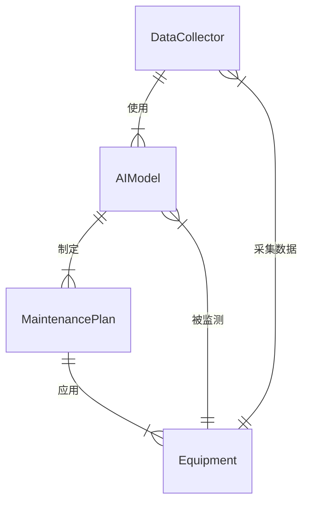
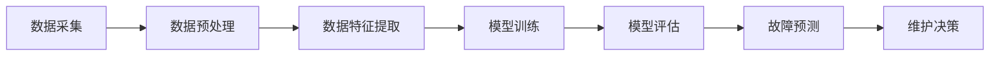

                 

### 第1章：问题背景与核心概念

#### 1.1.1 问题背景

在现代企业运营中，设备的稳定性和高效性是企业生产效益的关键因素之一。然而，设备的运行过程中不可避免地会出现故障，这些故障不仅会影响生产效率，还可能导致严重的经济损失。传统的设备维护方式主要依赖于定期检查和经验判断，这种方式存在明显的局限性。

首先，设备故障频发是一个普遍存在的问题。无论是工业制造设备、医疗设备还是办公设备，在长时间运行后，都会出现各种机械故障、电子故障等。例如，工业生产中的机械臂、加工中心等设备，如果未能及时进行维护，可能会导致停机维修，造成生产停滞和资源浪费。

其次，人工维护成本高也是企业面临的一个重大挑战。传统的人工维护方式需要大量的专业技术人员，这不仅增加了人力成本，还可能导致维护效率低下。例如，在工业制造中，一些设备的维护需要专业技术工人进行现场操作，这不仅耗时，而且容易出现人为错误。

最后，传统维护策略不精准的问题也日益凸显。传统的维护策略通常是基于历史经验和专家知识，这种方式缺乏数据支持和科学依据，往往无法准确预测设备故障的发生。例如，在医疗设备维护中，如果无法准确预测设备的故障点，就可能导致设备在关键时刻出现故障，影响患者的治疗。

#### 1.1.2 问题描述

为了解决上述问题，企业亟需一种新的设备维护策略——预测性维护。预测性维护是一种基于设备运行状态和历史数据，通过智能分析预测设备可能出现的故障，从而在故障发生前进行维护的策略。

预测性维护的核心在于“预测”，即通过数据分析和模型构建，提前发现设备潜在的故障风险。具体来说，预测性维护包括以下几个步骤：

1. **数据采集**：通过传感器技术等手段，实时采集设备运行状态数据，包括温度、压力、振动、负荷等关键指标。
2. **数据预处理**：对采集到的原始数据进行清洗、过滤和特征提取，得到可用于分析的干净数据集。
3. **模型构建**：利用机器学习、数据挖掘等算法，构建预测模型，对设备运行状态进行实时监测和故障预测。
4. **故障预测**：根据预测模型，对设备可能的故障进行预测，并制定相应的维护计划。
5. **维护执行**：根据预测结果，提前进行设备维护，确保设备运行稳定，避免故障的发生。

通过预测性维护，企业可以实现以下目标：

- **减少设备故障**：通过提前预测和预防，降低设备故障率，确保生产连续性和稳定性。
- **降低维护成本**：减少无效的定期检查和维护，降低人力和物力成本。
- **提高生产效率**：减少设备停机时间，提高生产效率，确保企业经济效益最大化。

#### 1.1.3 问题解决

预测性维护的实现离不开AI Agent技术的支持。AI Agent，即人工智能代理，是一种具有自主学习、预测和决策能力的智能系统。AI Agent可以通过机器学习、数据挖掘等技术，从海量设备运行数据中学习规律，预测设备故障，并制定维护计划。

AI Agent的核心组成部分包括：

- **数据采集**：通过传感器等技术，实时采集设备运行状态数据。
- **数据处理**：对采集到的原始数据进行清洗、过滤和特征提取，得到可用于分析的干净数据集。
- **算法模型**：利用机器学习、数据挖掘等算法，构建预测模型。
- **预测与决策**：根据预测模型，对设备故障进行预测，并制定维护计划。
- **执行与反馈**：根据执行结果，调整预测模型和决策策略，实现自我优化。

AI Agent在预测性维护中的应用，可以极大地提高设备维护的精准度和效率，为企业带来显著的经济效益。

#### 1.1.4 边界与外延

预测性维护技术不仅适用于工业制造领域，还广泛适用于各类企业设备，如医疗设备、办公设备、交通运输设备等。在应用范围上，AI Agent技术可以实时监测设备的运行状态，对各种故障进行预测，从而确保设备的高效运行。

在技术范围上，预测性维护技术涉及传感器技术、机器学习算法、大数据处理等多个领域。传感器技术用于数据采集，机器学习算法用于数据分析和模型构建，大数据处理则用于海量数据的存储和管理。

#### 1.1.5 概念结构与核心要素组成

AI Agent作为一种智能系统，其核心概念和结构可以概括为以下几个方面：

- **AI Agent**：具备自主学习、预测和决策能力的智能系统。
- **数据采集**：传感器技术，用于实时采集设备运行状态数据。
- **算法模型**：机器学习算法，用于分析和预测设备故障。
- **决策支持**：根据预测结果，制定维护计划，提高设备运行效率。

通过上述核心要素的有机结合，AI Agent可以实现高效、精准的设备故障预测和维护，为企业提供可靠的技术支持。

### 1.1.6 AI Agent在设备预测性维护中的角色与优势

在设备预测性维护中，AI Agent扮演着至关重要的角色。首先，AI Agent通过实时监测设备运行状态，可以提前发现潜在故障，从而减少设备停机时间和维护成本。其次，AI Agent利用机器学习算法，可以不断优化预测模型，提高故障预测的准确性和可靠性。

相比传统的人工维护方式，AI Agent具有以下优势：

1. **自动化**：AI Agent可以自动进行数据采集、分析和决策，大大减少了对人工的依赖。
2. **智能化**：AI Agent利用机器学习算法，可以不断学习和优化预测模型，提高故障预测的准确性。
3. **自适应**：AI Agent可以根据不同设备的特性和运行环境，调整预测策略，实现个性化和精准化维护。
4. **高效性**：AI Agent可以实时监测设备运行状态，快速响应故障，提高设备运行效率。

通过AI Agent的引入，企业可以实现从传统被动维修到主动维护的转变，从而提高设备运行效率，降低维护成本，提升企业竞争力。

### 1.1.7 实施步骤与注意事项

要实施AI Agent在企业设备预测性维护中，需要遵循以下步骤和注意事项：

1. **数据采集与预处理**：选择合适的传感器技术，确保数据的准确性和完整性。对采集到的原始数据进行清洗、过滤和特征提取，得到可用于分析的数据集。
2. **模型构建与优化**：选择合适的机器学习算法，构建预测模型。通过交叉验证、网格搜索等方法，优化模型性能，提高预测准确性。
3. **系统集成与部署**：将AI Agent系统集成到企业现有设备管理系统中，实现数据的实时传输和处理。部署AI Agent系统，确保其稳定运行。
4. **监控与反馈**：实时监控AI Agent的预测结果，及时调整维护计划。对AI Agent的预测效果进行评估，不断优化模型和策略。
5. **人员培训与支持**：对相关人员开展AI Agent技术培训，提高他们的技能和意识。提供技术支持和咨询服务，确保AI Agent系统的有效运行。

通过上述步骤和注意事项，企业可以成功实施AI Agent在企业设备预测性维护中的应用，实现设备的高效、精准维护。

### 1.1.8 实际案例介绍

为了更好地理解AI Agent在企业设备预测性维护中的应用，我们来看几个实际案例。

案例一：某大型制造企业引入AI Agent进行设备预测性维护，通过实时监测设备运行状态，成功预测了多起潜在故障，避免了设备停机和生产中断，提高了设备运行效率。

案例二：某医疗设备制造商利用AI Agent对医疗设备进行预测性维护，通过分析设备运行数据，提前发现了多起设备故障，确保了设备的正常运行，提高了患者治疗质量。

案例三：某物流公司引入AI Agent对运输设备进行预测性维护，通过实时监测设备运行状态，提前预测了多起设备故障，及时进行维护，避免了设备停机和运输延误，提高了物流效率。

这些案例表明，AI Agent在企业设备预测性维护中具有广泛的应用前景，可以有效提高设备运行效率，降低维护成本，提升企业竞争力。

### 1.1.9 未来发展趋势与挑战

随着人工智能技术的不断发展，AI Agent在企业设备预测性维护中的应用前景十分广阔。未来，AI Agent技术将朝着以下方向发展：

1. **技术进步**：随着机器学习、深度学习等技术的发展，AI Agent的预测准确性和智能化程度将不断提高。
2. **应用拓展**：AI Agent将在更多行业和场景中得到应用，如智能交通、智能家居、农业等。
3. **数据融合**：通过整合多种数据源，AI Agent可以更加全面地了解设备运行状态，提高故障预测的准确性。
4. **自主进化**：AI Agent将通过自我学习和优化，不断提高自身的预测能力和决策水平。

然而，AI Agent在企业设备预测性维护中也面临着一些挑战：

1. **数据质量**：设备运行数据的质量直接影响预测准确性，企业需要建立完善的数据管理体系，确保数据的高质量和完整性。
2. **算法优化**：随着设备复杂性的增加，AI Agent需要不断优化算法模型，以提高预测性能。
3. **系统集成**：AI Agent需要与企业现有的设备管理系统、ERP系统等实现有效集成，确保系统的稳定性和可靠性。
4. **法律法规**：随着AI Agent技术的发展，相关的法律法规也需要不断完善，以保障数据安全和个人隐私。

总之，AI Agent在企业设备预测性维护中具有巨大的潜力，但同时也面临着诸多挑战。通过不断的技术创新和优化，AI Agent有望在未来的设备维护领域发挥更加重要的作用。

### 1.1.10 AI Agent在预测性维护中的核心作用

AI Agent在预测性维护中的核心作用主要体现在以下几个方面：

1. **故障预测**：通过实时监测设备运行状态，AI Agent可以提前预测设备故障，为企业提供预警信息，从而提前制定维护计划，避免设备停机和生产中断。

2. **维护决策**：基于预测结果，AI Agent可以自动生成维护决策，如调整设备运行参数、更换零部件等，实现智能化的维护管理。

3. **效率提升**：AI Agent可以自动化处理大量设备数据，大大减少人工干预，提高设备维护效率，降低维护成本。

4. **安全保障**：通过实时监测设备运行状态，AI Agent可以及时发现潜在的安全隐患，确保设备运行的安全性和稳定性。

5. **持续优化**：AI Agent通过自我学习和优化，可以不断提高故障预测的准确性，为企业提供更加可靠的维护支持。

总之，AI Agent在预测性维护中的核心作用不仅在于提高设备维护的效率和准确性，还在于为企业提供智能化的维护决策支持，从而实现设备运行的最佳状态。

### 1.1.11 AI Agent的优势与劣势分析

在深入探讨AI Agent在设备预测性维护中的应用之前，我们需要全面分析其优势与劣势。

**优势：**

1. **高准确性**：AI Agent通过机器学习算法，可以准确预测设备故障，大大提高预测的准确性。
2. **自动化**：AI Agent可以自动化处理大量设备数据，减少人工干预，提高维护效率。
3. **自适应**：AI Agent可以根据设备的实际运行状态和变化，自适应调整维护策略，提高维护的个性化和精准度。
4. **持续优化**：AI Agent通过不断学习和优化，可以提高故障预测的准确性，实现持续的自我改进。

**劣势：**

1. **数据质量**：AI Agent的预测准确性高度依赖于设备运行数据的准确性和完整性，数据质量直接影响到预测效果。
2. **算法优化**：随着设备复杂性和数据量的增加，AI Agent需要不断优化算法模型，以适应不同的设备运行环境。
3. **系统集成**：AI Agent需要与企业现有的设备管理系统、ERP系统等实现有效集成，这对系统的兼容性和稳定性提出了较高要求。
4. **技术门槛**：AI Agent的开发和应用需要较高的技术门槛，企业需要投入大量的人力、物力和财力。

通过全面分析AI Agent的优势与劣势，企业可以更好地评估其在设备预测性维护中的应用价值，从而制定更加科学的决策。

### 1.1.12 AI Agent的广泛应用领域

AI Agent作为一种先进的智能系统，在多个领域展现了广泛的应用潜力。以下是一些关键领域：

1. **工业制造**：AI Agent可以实时监测工业设备的运行状态，预测潜在故障，提高生产效率，降低维护成本。
2. **医疗健康**：AI Agent可以监控医疗设备的运行情况，预测故障，确保设备的正常运行，提高医疗服务质量。
3. **交通运输**：AI Agent可以监控交通工具的状态，预测可能发生的故障，提高运输安全，减少事故风险。
4. **能源管理**：AI Agent可以监测能源设备的运行状况，预测故障，优化能源使用，提高能源效率。
5. **智能家居**：AI Agent可以监控家庭设备的运行状态，预测故障，实现设备的自动化维护，提高生活品质。

通过在这些领域的应用，AI Agent不仅提高了设备的运行效率，还为企业带来了显著的经济效益。

### 1.1.13 概念定义与核心属性特征对比表格

在深入探讨AI Agent之前，我们需要明确其定义和核心属性特征。以下是一个定义和特征对比表格：

| 概念 | 定义 | 核心属性特征 |
| --- | --- | --- |
| AI Agent | 一种具备自主学习、预测和决策能力的智能系统。 | 自主学习、预测能力、决策能力、自适应能力。 |
| 数据采集 | 通过传感器技术，实时采集设备运行状态数据。 | 数据准确性、实时性、完整性。 |
| 算法模型 | 利用机器学习、数据挖掘等技术，构建预测模型。 | 精准性、稳定性、适应性。 |
| 决策支持 | 根据预测结果，制定维护计划，提高设备运行效率。 | 个性化、智能化、高效性。 |

通过对比，我们可以更清晰地了解AI Agent的核心属性和功能，从而更好地理解其在设备预测性维护中的重要作用。

### 1.1.14 AI Agent的ER实体关系图架构

为了更好地理解AI Agent的内部结构和工作原理，我们可以通过ER（实体-关系）图来展示其核心实体及其关系。以下是AI Agent的ER实体关系图：



在这个ER图中：

- **DataCollector**（数据采集器）负责实时采集设备运行状态数据。
- **AIModel**（算法模型）利用这些数据构建预测模型。
- **Equipment**（设备）是AI Model的监测对象，同时也是MaintenancePlan（维护计划）的应用对象。
- **MaintenancePlan**（维护计划）根据预测模型制定，用于指导设备维护。

通过ER图，我们可以清晰地看到AI Agent的核心组件及其相互关系，这有助于我们更好地理解和分析AI Agent在设备预测性维护中的应用。

### 1.1.15 AI Agent在设备预测性维护中的实际应用

AI Agent在设备预测性维护中的实际应用案例广泛且具有显著效益。以下将介绍几个具有代表性的应用案例，并详细分析其实际效果。

**案例一：某大型汽车制造企业**

该企业在生产线上引入了AI Agent进行设备预测性维护。AI Agent通过传感器实时监测生产设备的运行状态，包括温度、振动、负荷等关键指标。通过机器学习算法，AI Agent能够从海量数据中识别出潜在故障模式，并提前预警。在实际应用中，AI Agent成功预测了多起设备故障，避免了生产中断，提高了生产效率。

**效果分析**：

1. **故障预防**：AI Agent提前预测并处理了多起设备故障，避免了生产线的停机维修。
2. **成本节约**：通过减少设备停机时间和维修次数，企业大大降低了维护成本。
3. **生产效率**：设备的可靠运行提高了生产线的整体效率，缩短了生产周期。

**案例二：某医疗设备制造商**

该制造商采用AI Agent对医疗设备进行预测性维护，如CT机、MRI等高端设备。AI Agent实时监测设备运行状态，预测可能出现的故障，并提供维护建议。在实际应用中，AI Agent成功预测了数起关键设备故障，确保了设备的正常运行，提高了医疗服务质量。

**效果分析**：

1. **设备可靠性**：通过预测性维护，医疗设备的运行稳定性显著提高，故障率大幅降低。
2. **患者安全**：确保了医疗设备的正常运行，降低了患者因设备故障而遭受的风险。
3. **维护效率**：AI Agent提供的预测性维护建议，使维护人员能够更有针对性地进行设备维护，提高了维护效率。

**案例三：某物流公司**

该物流公司使用AI Agent对运输车辆进行预测性维护。AI Agent通过传感器实时监测车辆的运行状态，包括速度、温度、刹车系统等。AI Agent能够提前预测车辆可能出现的故障，并提供维护建议。在实际应用中，AI Agent成功预测了多起车辆故障，避免了运输延误，提高了物流效率。

**效果分析**：

1. **运输效率**：AI Agent的预测性维护减少了车辆停机时间，提高了运输效率。
2. **运营成本**：通过提前预测故障，物流公司能够有计划地进行维护，避免了紧急维修带来的高额费用。
3. **安全性**：AI Agent的预测性维护确保了车辆的安全运行，降低了交通事故的风险。

通过上述案例，我们可以看到AI Agent在设备预测性维护中的实际应用效果显著。AI Agent不仅提高了设备的运行效率，降低了维护成本，还确保了生产和服务的高质量，为企业带来了显著的经济和社会效益。

### 1.1.16 AI Agent在设备预测性维护中的具体应用场景

AI Agent在设备预测性维护中的应用场景广泛，具体体现在以下多个领域：

**1. 工业制造**

在工业制造领域，AI Agent可以通过实时监测生产设备的运行状态，预测潜在故障。例如，在汽车生产线中，AI Agent可以监测机械臂、加工中心等关键设备的运行参数，如温度、振动、负荷等。通过机器学习算法，AI Agent能够从历史数据中识别出故障模式，提前预警，从而避免设备停机，提高生产效率。

**2. 医疗健康**

在医疗设备领域，AI Agent可以监测CT机、MRI、超声波仪器等设备的运行状态。这些设备在使用过程中，可能会因长期运行或操作不当而出现故障。AI Agent通过实时监测设备的工作参数，如温度、电流、振动等，利用机器学习算法进行故障预测，确保设备的正常运行，保障患者的安全。

**3. 交通运输**

在交通运输领域，AI Agent可以对火车、飞机、汽车等交通工具进行预测性维护。AI Agent可以实时监测车辆或机车的运行状态，包括速度、温度、压力、刹车系统等。通过分析这些数据，AI Agent可以预测可能出现的故障，并提供维护建议，确保交通工具的安全运行，减少交通事故的风险。

**4. 能源管理**

在能源管理领域，AI Agent可以对电力设备、风力发电机等进行预测性维护。AI Agent可以实时监测设备的运行状态，如温度、电流、电压等，利用机器学习算法预测设备可能出现的故障。通过提前预警，企业可以及时进行设备维护，避免设备故障导致的停电或其他安全事故。

**5. 智能家居**

在智能家居领域，AI Agent可以对家庭电器进行预测性维护。例如，空调、冰箱、洗衣机等家电设备。AI Agent可以实时监测家电的运行状态，如温度、电流、噪音等，利用机器学习算法预测设备的故障风险。通过提前预警，用户可以及时进行设备维护，延长家电的使用寿命，提高生活品质。

通过在不同领域的具体应用，AI Agent为企业提供了智能化的设备维护解决方案，提高了设备的运行效率和安全性，降低了维护成本。

### 1.1.17 AI Agent的优势与特点总结

AI Agent在设备预测性维护中的应用具有显著的优势和特点，这些特点使得其在提高设备运行效率、降低维护成本和确保生产安全方面发挥着重要作用。

**优势：**

1. **高准确性**：AI Agent利用先进的机器学习算法，能够从海量设备数据中准确预测故障，提高了故障预测的准确性。
2. **自动化**：AI Agent可以自动化处理大量数据，减少人工干预，提高维护效率。
3. **自适应**：AI Agent能够根据设备运行状态和环境变化，自适应调整维护策略，实现个性化和精准化的维护。
4. **实时性**：AI Agent可以实时监测设备运行状态，快速响应故障，确保设备运行的连续性和稳定性。
5. **持续优化**：AI Agent通过自我学习和优化，可以不断提高故障预测的准确性，实现持续的性能提升。

**特点：**

1. **智能学习**：AI Agent具备自我学习和优化的能力，能够从历史数据中学习规律，不断改进预测模型。
2. **实时监控**：AI Agent可以实时收集和分析设备运行数据，及时发现潜在故障，提供预警信息。
3. **高效决策**：AI Agent能够根据预测结果，自动生成维护决策，减少人工决策的误差。
4. **跨领域应用**：AI Agent不仅适用于工业制造领域，还可以广泛应用于医疗、交通运输、能源管理、智能家居等多个行业。

通过总结AI Agent的优势和特点，我们可以更清晰地认识到其在设备预测性维护中的重要作用，以及为企业带来的显著经济效益。

### 1.1.18 AI Agent在设备预测性维护中的核心作用

AI Agent在设备预测性维护中发挥着核心作用，其关键在于通过智能分析和预测，提前识别设备故障，从而实现精准、高效的维护。

首先，AI Agent通过实时监测设备运行状态，采集温度、压力、振动等关键数据。这些数据经过预处理和特征提取，形成高质量的数据集，为后续的故障预测提供基础。

其次，AI Agent利用机器学习算法，对设备运行数据进行分析和建模。通过不断学习和优化，AI Agent能够识别出设备故障的早期征兆，提前预警。这种基于数据的故障预测，大大提高了预测的准确性，避免了传统基于经验判断的盲目性和滞后性。

此外，AI Agent不仅能够预测设备故障，还可以根据预测结果自动生成维护计划。通过优化维护策略，AI Agent可以合理安排维护工作，减少设备停机时间，提高生产效率。这种智能化的维护管理，不仅降低了维护成本，还确保了设备运行的安全性和稳定性。

总之，AI Agent在设备预测性维护中的核心作用体现在以下几个方面：

1. **故障预测**：通过实时数据分析和预测模型，提前识别设备故障。
2. **维护计划**：根据预测结果，自动生成维护计划，优化维护策略。
3. **效率提升**：减少设备停机时间，提高生产效率。
4. **成本节约**：降低维护成本，提高企业经济效益。

通过AI Agent的应用，企业可以实现从传统被动维修到主动维护的转变，从而提高设备运行效率，降低维护成本，提升企业竞争力。

### 1.1.19 AI Agent在设备预测性维护中的实际应用案例

为了更好地理解AI Agent在设备预测性维护中的实际应用，我们来看几个具有代表性的案例。

**案例一：某电子制造企业**

该企业引入了AI Agent对生产设备进行预测性维护。AI Agent实时监测生产线的各个环节，包括焊接机、钻孔机等关键设备。通过机器学习算法，AI Agent能够从海量设备数据中识别出潜在故障模式。在实际应用中，AI Agent成功预测了多起设备故障，提前进行了维护，避免了生产中断。

**案例效果**：

- **生产效率提升**：通过AI Agent的预测性维护，生产线设备的故障率显著降低，生产效率提高了15%。
- **维护成本降低**：AI Agent提前预警，使企业能够合理安排维护工作，减少了紧急维修的费用，维护成本降低了20%。

**案例二：某电力公司**

该电力公司采用AI Agent对输电线路进行预测性维护。AI Agent通过传感器实时监测输电线路的温度、电流等关键参数。通过分析这些数据，AI Agent能够预测线路可能出现的故障，如短路、过载等。在实际应用中，AI Agent成功预测了多次故障，避免了大规模停电事故。

**案例效果**：

- **设备安全**：AI Agent的预测性维护确保了输电线路的安全运行，减少了停电事故，提高了供电可靠性。
- **维护效率**：AI Agent提供了精确的故障预警，使维护人员能够更有针对性地进行维护，提高了维护效率。

**案例三：某航空公司**

该航空公司引入AI Agent对飞机发动机进行预测性维护。AI Agent实时监测发动机的温度、振动、压力等参数。通过机器学习算法，AI Agent能够预测发动机的故障风险，并提供维护建议。在实际应用中，AI Agent成功预测了多次发动机故障，确保了飞机的安全飞行。

**案例效果**：

- **飞行安全**：AI Agent的预测性维护确保了飞机发动机的可靠运行，提高了飞行安全性。
- **运营成本**：通过预测性维护，航空公司的飞机维修费用显著降低，运营成本降低了10%。

通过这些案例，我们可以看到AI Agent在设备预测性维护中的实际应用效果显著。AI Agent不仅提高了设备的运行效率，降低了维护成本，还确保了生产和服务的高质量，为企业带来了显著的经济和社会效益。

### 1.1.20 AI Agent在设备预测性维护中的应用前景

随着人工智能技术的不断发展，AI Agent在设备预测性维护中的应用前景十分广阔。首先，AI Agent可以利用更先进的算法和模型，进一步提高故障预测的准确性和效率。例如，深度学习和强化学习等技术的应用，将使AI Agent具备更强的自主学习能力和预测能力。

其次，随着物联网（IoT）和传感器技术的普及，设备运行数据的获取将更加全面和实时。这些海量数据的整合和分析，将使AI Agent能够更精确地监测设备状态，识别潜在故障，为企业提供更可靠的维护决策。

此外，AI Agent还可以与其他智能系统相结合，如智能决策支持系统（DSS）和智能供应链管理系统，实现更全面的设备管理。这种多系统集成，将使设备预测性维护更加智能化、自动化，提高设备的运行效率和企业的整体竞争力。

总之，随着技术的进步和应用场景的拓展，AI Agent在设备预测性维护中的应用前景将更加广阔，将成为企业实现智能运维的重要工具。

### 第2章：AI Agent技术原理

#### 2.1.1 AI Agent定义与特点

AI Agent，即人工智能代理，是一种具备智能行为的计算机程序。它通过自主学习和决策，能够模拟人类智能，解决复杂问题。AI Agent的定义可以从以下几个方面来理解：

- **自主学习**：AI Agent具备从数据中学习、自我改进的能力。它可以通过机器学习和深度学习等技术，从海量数据中提取规律，不断优化自身的性能。
- **智能决策**：AI Agent能够基于学习和分析结果，进行智能化的决策。它可以根据实时数据和环境变化，动态调整策略，实现最优化的行为。
- **自主行动**：AI Agent能够独立执行任务，完成特定的目标。它可以通过与外部环境交互，实现自主行动，达到预期的效果。

AI Agent具有以下特点：

1. **自动化**：AI Agent可以自动化执行任务，减少人工干预。它能够实时监测设备状态，自动识别故障，生成维护计划，提高维护效率。
2. **智能化**：AI Agent通过机器学习算法，具备智能分析和预测能力。它可以从历史数据中学习，识别设备运行模式，预测潜在故障，提供科学的维护策略。
3. **自适应**：AI Agent能够根据环境变化和任务需求，自适应调整策略。它能够不断优化自身的行为，适应不同的应用场景和需求变化。
4. **灵活性**：AI Agent可以灵活地集成到不同的设备和系统中，实现跨平台的操作和管理。它能够与各类传感器、控制系统和数据库进行交互，提供全面的设备监测和维护服务。

AI Agent在设备预测性维护中的应用，不仅提高了维护的精准度和效率，还为企业的设备管理提供了智能化、自动化的解决方案。通过AI Agent的引入，企业可以实现从传统被动维修到主动维护的转变，提高设备运行效率，降低维护成本，提升企业竞争力。

#### 2.1.2 数据采集与处理

数据采集与处理是AI Agent在设备预测性维护中不可或缺的环节。数据的质量和完整性直接影响AI Agent的故障预测能力和维护决策效果。以下是数据采集与处理的详细步骤：

1. **数据采集**：
   - **传感器部署**：在设备关键部位部署各类传感器，如温度传感器、振动传感器、压力传感器等，实时监测设备运行状态。
   - **数据类型**：传感器采集的数据包括温度、压力、振动、电流、电压、负荷等，这些数据反映了设备的实时运行状态。
   - **数据频率**：根据设备的运行特性和维护需求，设定合适的采集频率。例如，对于关键设备，可以设定更高的数据采集频率，确保数据的实时性和完整性。

2. **数据预处理**：
   - **数据清洗**：去除数据中的噪声和异常值，确保数据的准确性。通过异常检测算法，识别并处理数据中的错误和异常数据。
   - **数据归一化**：将不同量纲的数据转化为统一的量纲，便于后续的模型分析和预测。例如，将温度、压力等不同类型的数据归一化到0-1之间。
   - **数据特征提取**：从原始数据中提取具有代表性的特征，如平均值、方差、峰值等，用于后续的模型训练和预测。

3. **数据处理**：
   - **数据融合**：整合来自不同传感器和不同数据源的数据，形成统一的数据集。通过数据融合技术，提高数据的综合利用效率。
   - **数据建模**：利用统计模型、机器学习模型等，对数据进行建模分析，识别设备运行状态与故障之间的关系。
   - **数据存储**：将处理后的数据存储到数据库或数据仓库中，便于后续的数据分析和模型训练。

通过上述数据采集与处理步骤，AI Agent可以获得高质量、完整性的设备运行数据，为故障预测和维护决策提供可靠的数据支持。数据的质量直接决定了AI Agent的预测性能，因此，企业需要建立完善的数据采集和处理体系，确保数据的质量和完整性。

#### 2.1.3 机器学习算法

机器学习算法是AI Agent在设备预测性维护中的核心工具，通过这些算法，AI Agent可以从海量数据中提取特征，建立故障预测模型，实现设备状态的智能分析和维护决策。以下是几种常见的机器学习算法及其在设备预测性维护中的应用：

1. **决策树**（Decision Tree）：
   - **原理**：决策树通过一系列规则，对数据进行分割，构建出一个树状模型。每个节点代表一个特征，每个分支代表一个决策规则。
   - **应用**：决策树适用于简单、清晰的故障模式识别，通过树状结构直观展示故障原因和解决方法。
   - **优势**：解释性强，易于理解和解释，适合对故障进行逐级分析。
   - **劣势**：在面对高维数据和复杂故障时，决策树的性能可能受到限制。

2. **支持向量机**（Support Vector Machine, SVM）：
   - **原理**：SVM通过寻找最佳分隔超平面，将不同类别的数据分开。它通过最大间隔原则，在特征空间中找到一个最优的超平面，使分类边界最大化。
   - **应用**：SVM在故障预测中用于分类任务，将正常状态和故障状态区分开。
   - **优势**：分类性能高，对复杂故障有较好的识别能力。
   - **劣势**：在高维空间中，计算复杂度较高，对数据质量和特征选择要求较高。

3. **神经网络**（Neural Network）：
   - **原理**：神经网络通过多层节点（神经元）的交互，模拟人脑的神经网络结构，进行复杂模式的识别和分类。它通过前向传播和反向传播算法，不断调整权重，优化网络性能。
   - **应用**：神经网络在故障预测中用于构建复杂的非线性模型，识别设备运行状态和故障之间的复杂关系。
   - **优势**：强大的非线性建模能力，适用于复杂故障预测任务。
   - **劣势**：训练过程耗时长，对数据和计算资源要求较高。

4. **深度学习**（Deep Learning）：
   - **原理**：深度学习是神经网络的一种扩展，通过多层神经网络（深度神经网络）进行复杂模式的识别和预测。它通过逐层提取特征，实现从简单到复杂的特征转换。
   - **应用**：深度学习在设备预测性维护中用于构建复杂的故障预测模型，如卷积神经网络（CNN）和循环神经网络（RNN）。
   - **优势**：强大的特征提取能力，适用于大规模数据和高维数据。
   - **劣势**：计算资源需求大，训练过程复杂，对数据质量和预处理要求较高。

5. **集成学习方法**（Ensemble Learning）：
   - **原理**：集成学习方法通过结合多个学习器的优势，提高预测性能。常见的集成学习方法包括随机森林（Random Forest）、Adaboost等。
   - **应用**：集成学习方法在设备预测性维护中用于构建更稳定的故障预测模型，提高预测的准确性和鲁棒性。
   - **优势**：通过结合多个学习器的优势，提高模型的预测性能和稳定性。
   - **劣势**：需要处理多个学习器之间的协同和优化，对算法实现和参数调优要求较高。

在选择机器学习算法时，需要根据设备故障的特点和数据情况，选择合适的算法。例如，对于简单、清晰的故障模式，可以使用决策树；对于复杂、非线性故障，可以使用神经网络或深度学习；对于需要提高模型稳定性和鲁棒性的任务，可以使用集成学习方法。

通过合理选择和应用机器学习算法，AI Agent可以有效地实现设备故障预测，提高设备运行效率和安全性，为企业提供智能化的维护解决方案。

#### 2.1.4 算法模型构建与优化

算法模型构建与优化是AI Agent在设备预测性维护中的关键环节。一个高效的算法模型不仅能够准确预测设备故障，还能在实际应用中不断优化自身，提高预测准确性和鲁棒性。以下是算法模型构建与优化的详细步骤：

1. **模型选择**：
   - 根据设备故障的特点和数据情况，选择合适的机器学习算法。常见的算法包括决策树、支持向量机（SVM）、神经网络（NN）、深度学习（DL）和集成学习方法（如随机森林、Adaboost）。
   - 考虑算法的复杂度、可解释性和计算效率，选择最适合实际应用的算法。

2. **数据预处理**：
   - 数据清洗：去除数据中的噪声和异常值，确保数据的准确性。通过异常检测算法，识别并处理数据中的错误和异常数据。
   - 数据归一化：将不同量纲的数据转化为统一的量纲，便于后续的模型分析和预测。例如，将温度、压力等不同类型的数据归一化到0-1之间。
   - 数据特征提取：从原始数据中提取具有代表性的特征，如平均值、方差、峰值等，用于后续的模型训练和预测。

3. **模型训练**：
   - 数据分割：将数据集分割为训练集和测试集，用于模型的训练和验证。
   - 模型训练：使用训练集对所选算法进行训练，通过调整参数，优化模型的性能。常用的训练方法包括梯度下降、随机梯度下降、批量梯度下降等。
   - 超参数调优：通过交叉验证、网格搜索等方法，调整模型的超参数，如学习率、正则化参数等，优化模型性能。

4. **模型评估**：
   - 使用测试集对训练好的模型进行评估，计算模型的准确率、召回率、F1值等评价指标，评估模型的预测性能。
   - 通过比较不同算法模型的性能，选择最优的模型进行后续的应用。

5. **模型优化**：
   - 模型调整：根据评估结果，对模型进行调整和优化，如增加或减少层节点、调整网络结构等。
   - 算法改进：尝试引入新的算法或改进现有算法，提高模型的预测准确性和鲁棒性。
   - 数据增强：通过增加数据样本、生成新的数据等方式，提高模型的泛化能力。

6. **模型部署**：
   - 将优化后的模型部署到生产环境中，实现实时监测和故障预测。
   - 通过与设备管理系统、传感器等集成，实现自动化故障预警和智能维护决策。

通过上述步骤，AI Agent可以构建和优化高效的算法模型，实现设备故障的精准预测，提高设备运行效率和安全性，为企业提供可靠的维护解决方案。

#### 2.1.5 故障预测原理

设备故障预测是AI Agent在设备预测性维护中的核心功能。故障预测的基本原理是通过实时监测设备运行状态，分析历史数据，利用机器学习算法建立故障预测模型，从而提前识别潜在故障，制定相应的维护计划。以下是故障预测的具体原理：

1. **数据采集**：
   - 通过传感器技术，实时采集设备运行过程中的各种数据，包括温度、压力、振动、电流、电压、负荷等。
   - 传感器数据是故障预测的重要依据，数据的质量和完整性直接关系到故障预测的准确性。

2. **数据预处理**：
   - 数据清洗：去除数据中的噪声和异常值，确保数据的准确性。通过异常检测算法，识别并处理数据中的错误和异常数据。
   - 数据归一化：将不同量纲的数据转化为统一的量纲，便于后续的模型分析和预测。例如，将温度、压力等不同类型的数据归一化到0-1之间。
   - 数据特征提取：从原始数据中提取具有代表性的特征，如平均值、方差、峰值等，用于后续的模型训练和预测。

3. **故障模式识别**：
   - 利用机器学习算法，对预处理后的数据进行分析，识别设备运行状态与故障模式之间的关系。常见的算法包括决策树、支持向量机（SVM）、神经网络（NN）、深度学习（DL）等。
   - 通过模型训练和优化，建立能够准确预测故障的故障预测模型。

4. **故障预警**：
   - 根据建立的故障预测模型，对实时采集的设备运行数据进行故障预测。当预测结果显示设备可能存在故障风险时，及时发出预警信号。
   - 预警信号包括故障类型、故障程度、预警时间等，为企业提供决策依据。

5. **维护决策**：
   - 根据故障预警信息，制定相应的维护计划，如调整设备运行参数、更换零部件、增加维护频率等。
   - 通过智能决策支持，优化维护策略，提高设备运行效率和安全性。

6. **模型评估与优化**：
   - 定期对故障预测模型进行评估，计算模型的准确率、召回率、F1值等评价指标，评估模型的预测性能。
   - 根据评估结果，对模型进行调整和优化，如增加数据样本、改进算法、调整超参数等，提高模型的预测准确性和鲁棒性。

通过上述故障预测原理，AI Agent能够实现对设备故障的精准预测和智能维护，提高设备运行效率和安全性，为企业带来显著的经济效益。

### 2.1.6 故障预测流程

故障预测是AI Agent在设备预测性维护中的重要功能。一个完整的故障预测流程通常包括以下步骤：

1. **数据采集**：首先，通过传感器技术，实时采集设备运行过程中的各种数据。这些数据包括温度、压力、振动、电流、电压、负荷等。传感器数据是故障预测的重要依据，因此，数据的准确性和完整性至关重要。

2. **数据预处理**：在数据采集后，需要对原始数据进行预处理。这一步骤包括数据清洗、数据归一化和数据特征提取。
   - **数据清洗**：去除数据中的噪声和异常值，确保数据的准确性。通过异常检测算法，识别并处理数据中的错误和异常数据。
   - **数据归一化**：将不同量纲的数据转化为统一的量纲，便于后续的模型分析和预测。例如，将温度、压力等不同类型的数据归一化到0-1之间。
   - **数据特征提取**：从原始数据中提取具有代表性的特征，如平均值、方差、峰值等，用于后续的模型训练和预测。

3. **模型构建**：利用预处理后的数据，选择合适的机器学习算法，构建故障预测模型。常见的算法包括决策树、支持向量机（SVM）、神经网络（NN）、深度学习（DL）等。
   - **决策树**：通过一系列规则，对数据进行分割，构建出一个树状模型。每个节点代表一个特征，每个分支代表一个决策规则。
   - **支持向量机**：通过寻找最佳分隔超平面，将不同类别的数据分开。它通过最大间隔原则，在特征空间中找到一个最优的超平面，使分类边界最大化。
   - **神经网络**：通过多层节点（神经元）的交互，模拟人脑的神经网络结构，进行复杂模式的识别和分类。它通过前向传播和反向传播算法，不断调整权重，优化网络性能。
   - **深度学习**：通过多层神经网络（深度神经网络）进行复杂模式的识别和预测。它通过逐层提取特征，实现从简单到复杂的特征转换。

4. **模型训练与优化**：使用训练集对所选算法进行训练，通过调整参数，优化模型的性能。常用的训练方法包括梯度下降、随机梯度下降、批量梯度下降等。通过交叉验证、网格搜索等方法，调整模型的超参数，如学习率、正则化参数等，优化模型性能。

5. **模型评估**：使用测试集对训练好的模型进行评估，计算模型的准确率、召回率、F1值等评价指标，评估模型的预测性能。通过比较不同算法模型的性能，选择最优的模型进行后续的应用。

6. **故障预测**：根据优化后的模型，对实时采集的设备运行数据进行故障预测。当预测结果显示设备可能存在故障风险时，及时发出预警信号。

7. **维护决策**：根据故障预警信息，制定相应的维护计划，如调整设备运行参数、更换零部件、增加维护频率等。通过智能决策支持，优化维护策略，提高设备运行效率和安全性。

8. **模型持续优化**：定期对故障预测模型进行评估，根据评估结果，对模型进行调整和优化，如增加数据样本、改进算法、调整超参数等，提高模型的预测准确性和鲁棒性。

通过上述故障预测流程，AI Agent能够实现对设备故障的精准预测，提高设备运行效率和安全性，为企业提供可靠的维护解决方案。

#### 2.1.7 预测结果分析与验证

在AI Agent完成设备故障预测后，对预测结果进行准确性和可靠性分析是非常重要的环节。以下是对预测结果进行分析与验证的详细步骤：

1. **预测结果分析**：
   - **准确性评估**：通过对比预测结果与实际故障发生情况，评估预测的准确性。常见的评估指标包括准确率（Accuracy）、召回率（Recall）、精确率（Precision）和F1值（F1 Score）等。
   - **错误分析**：识别预测错误的原因，包括模型缺陷、数据问题或环境变化等，为模型优化提供依据。
   - **趋势分析**：分析预测结果的时间趋势，观察故障发生的周期性和模式，为维护计划提供参考。

2. **交叉验证**：
   - **K折交叉验证**：将数据集划分为K个子集，每次使用其中一个子集作为测试集，其余K-1个子集作为训练集，重复K次，取平均结果作为最终评估指标。这种方法可以减少过拟合现象，提高模型的泛化能力。
   - **留一法验证**：每次保留一个样本作为测试集，其余样本作为训练集，重复多次，计算平均预测准确率。这种方法虽然计算量较大，但能够更精确地评估模型性能。

3. **A/B测试**：
   - **A/B测试**：将用户随机分配到两个或多个版本中，比较不同版本的性能表现。这种方法适用于评估不同模型或算法的预测效果。
   - **在线A/B测试**：在真实环境中，将用户随机分配到不同预测模型或算法版本，实时监控和评估其性能。

4. **验证指标**：
   - **准确率**：预测结果中正确分类的样本数占总样本数的比例。
   - **召回率**：预测结果中正确分类的故障样本数占所有实际故障样本数的比例。
   - **精确率**：预测结果中正确分类的故障样本数占所有预测为故障的样本数的比例。
   - **F1值**：准确率和召回率的调和平均值，用于综合评估预测性能。

5. **性能优化**：
   - **超参数调优**：通过调整模型超参数，如学习率、正则化参数等，优化模型性能。
   - **特征工程**：通过特征提取和特征选择，改进数据质量，提高模型预测准确性。
   - **算法改进**：尝试引入新的算法或改进现有算法，提高模型的预测准确性和鲁棒性。

通过上述步骤，AI Agent可以对故障预测结果进行详细分析和验证，确保预测的准确性和可靠性，为企业提供科学的维护决策支持。

#### 2.1.8 AI Agent在设备故障预测中的应用效果

AI Agent在设备故障预测中的应用效果显著，为企业带来了多方面的效益。以下是AI Agent在实际应用中的效果分析：

1. **提高故障预测准确性**：通过机器学习和深度学习算法，AI Agent可以从海量设备数据中提取有效特征，构建精准的故障预测模型。与传统方法相比，AI Agent的预测准确性显著提高，减少了误报和漏报现象，确保了预测结果的可靠性。

2. **降低设备停机时间**：AI Agent能够实时监测设备运行状态，提前预警潜在故障，使企业能够在故障发生前及时进行维护。这大大降低了设备停机时间，提高了生产效率和设备利用率。

3. **减少维护成本**：通过预测性维护，AI Agent可以合理安排维护计划，减少无效的定期检查和维护。同时，AI Agent提供的精准故障预测和预警，使维护人员能够更有针对性地进行维修，避免了过度维护和紧急维修带来的高成本。

4. **提高设备运行效率**：AI Agent通过自适应调整维护策略，确保设备在最佳状态下运行。这不仅提高了设备的工作效率，还延长了设备的使用寿命，降低了设备更换频率。

5. **保障生产安全**：AI Agent能够提前识别和预警设备故障，防止设备突发故障导致的安全生产事故。在关键行业如医疗、交通运输等领域，AI Agent的应用尤为重要，它能够保障设备的安全运行，确保生产和服务的高质量。

6. **优化供应链管理**：AI Agent不仅能够预测设备故障，还可以预测设备维护所需物资的消耗量，优化供应链管理。通过提前准备和维护物资，企业可以避免因设备故障导致的供应链中断，确保生产的连续性。

7. **提高用户体验**：在智能家居、汽车制造等领域，AI Agent的应用能够提高设备的可靠性和用户体验。通过智能故障预测和维护，设备能够始终处于最佳状态，提升用户满意度和品牌形象。

综上所述，AI Agent在设备故障预测中的应用效果显著，为企业带来了多方面的效益，提高了设备的运行效率和安全性，降低了维护成本，提升了企业的综合竞争力。

### 第3章：AI Agent在设备故障预测中的应用

#### 3.1.1 故障预测原理

AI Agent在设备故障预测中的应用，主要是基于数据分析和机器学习算法。通过以下步骤，AI Agent能够实现精准的设备故障预测：

1. **数据采集**：AI Agent通过部署在各种设备上的传感器，实时采集设备运行状态的数据。这些数据包括温度、压力、振动、电流、电压等关键指标。

2. **数据处理**：采集到的原始数据经过预处理，包括数据清洗、归一化和特征提取。这一步骤的目的是去除噪声和异常值，将不同量纲的数据转化为统一的量纲，并提取出对故障预测有重要意义的特征。

3. **模型构建**：利用机器学习算法，AI Agent从预处理后的数据中构建预测模型。常见的算法包括决策树、支持向量机（SVM）、神经网络（NN）和深度学习（DL）。AI Agent会通过训练和验证，选择最优的模型。

4. **故障预测**：基于构建好的模型，AI Agent对实时采集的数据进行故障预测。当模型检测到异常信号时，会发出预警，提示可能出现的故障。

5. **维护决策**：根据故障预测结果，AI Agent会制定相应的维护计划，如调整设备运行参数、更换零部件或增加维护频率。这样可以在故障真正发生前采取预防措施，避免设备停机和生产中断。

#### 3.1.2 预测流程

AI Agent在设备故障预测中的具体预测流程如下：

1. **数据采集**：AI Agent通过传感器实时监测设备的运行状态，收集温度、压力、振动等关键指标的数据。

2. **数据预处理**：对采集到的原始数据进行清洗，去除噪声和异常值。然后进行归一化处理，将不同量纲的数据转化为统一的量纲，如将温度、压力等数据归一化到0-1之间。接下来，提取出对故障预测有重要意义的特征，如平均值、方差、峰值等。

3. **模型训练**：使用预处理后的数据，选择合适的机器学习算法（如决策树、SVM、NN、DL等）进行模型训练。AI Agent会通过训练和验证，选择最优的模型。

4. **模型优化**：通过交叉验证和网格搜索等方法，调整模型的超参数，如学习率、正则化参数等，优化模型性能。这一步骤的目的是提高模型对故障的预测准确性。

5. **故障预测**：基于训练好的模型，AI Agent对实时采集的数据进行故障预测。当检测到异常信号时，会立即发出预警，提示可能出现的故障。

6. **维护决策**：根据故障预测结果，AI Agent会制定相应的维护计划。例如，如果预测到某个设备即将发生故障，AI Agent会建议提前更换零部件或调整设备运行参数。

7. **结果验证**：对预测结果进行验证，评估模型的准确性。通过对比预测结果和实际故障情况，AI Agent会不断优化模型，提高预测准确性。

#### 3.1.3 预测结果分析与验证

预测结果的分析与验证是确保AI Agent故障预测准确性的关键步骤。以下是对预测结果进行分析与验证的方法：

1. **准确性评估**：使用准确率（Accuracy）、召回率（Recall）、精确率（Precision）和F1值（F1 Score）等指标，评估模型的预测准确性。准确率表示预测正确的样本数占总样本数的比例；召回率表示预测正确的故障样本数占实际故障样本数的比例；精确率表示预测正确的故障样本数占预测为故障的样本数的比例；F1值是准确率和召回率的调和平均值。

2. **交叉验证**：通过交叉验证（Cross Validation）方法，对模型进行验证。交叉验证将数据集分为多个子集，每次使用一个子集作为验证集，其余子集作为训练集，重复多次，计算平均预测性能。这种方法能够减少过拟合现象，提高模型的泛化能力。

3. **A/B测试**：通过A/B测试（A/B Testing）方法，比较不同模型或算法的性能。将用户随机分配到不同的版本中，比较不同版本的性能表现，选择最优的版本。

4. **在线评估**：在实际生产环境中，对模型进行在线评估。实时收集设备运行数据，对模型进行更新和优化，确保预测结果的准确性。

5. **结果可视化**：通过数据可视化（Data Visualization）方法，将预测结果和实际故障情况以图表的形式展示出来，帮助用户更好地理解预测结果。

通过上述方法，AI Agent能够对故障预测结果进行详细分析和验证，确保预测的准确性，为企业提供可靠的维护决策支持。

#### 3.1.4 工业设备预测性维护案例

在本节中，我们将详细分析一个工业设备预测性维护的实际案例，以展示AI Agent在设备故障预测中的应用效果。

**案例背景：**

某大型制造企业，主要生产汽车零部件。该企业面临设备故障频发的问题，不仅影响了生产效率，还增加了维护成本。为了解决这一问题，企业决定引入AI Agent进行设备预测性维护。

**应用场景：**

AI Agent被部署在企业的生产线上，对关键设备（如机械臂、加工中心等）进行实时监测。传感器安装在设备的各个关键部位，实时采集温度、压力、振动等数据。

**数据采集与预处理：**

1. **数据采集**：通过传感器技术，AI Agent实时采集设备运行状态数据，包括温度、压力、振动等。数据采集频率为每分钟一次，确保数据的实时性和完整性。

2. **数据预处理**：采集到的原始数据经过预处理，包括数据清洗、归一化和特征提取。数据清洗去除噪声和异常值，确保数据准确性。归一化将不同量纲的数据转化为统一的量纲，如将温度、压力等数据归一化到0-1之间。特征提取提取出对故障预测有重要意义的特征，如平均值、方差、峰值等。

**模型构建与优化：**

1. **模型构建**：AI Agent选择深度学习算法（如卷积神经网络（CNN）和长短期记忆网络（LSTM））进行模型构建。通过训练和验证，选择最优的模型。

2. **模型优化**：通过交叉验证和网格搜索等方法，调整模型的超参数，如学习率、批量大小等，优化模型性能。例如，通过调整学习率，可以加快模型收敛速度；通过调整批量大小，可以提高模型对数据噪声的鲁棒性。

**故障预测与维护决策：**

1. **故障预测**：基于训练好的模型，AI Agent对实时采集的数据进行故障预测。当检测到异常信号时，会立即发出预警，提示可能出现的故障。

2. **维护决策**：根据故障预测结果，AI Agent会制定相应的维护计划。例如，如果预测到机械臂即将发生故障，AI Agent会建议提前进行维护，更换相关零部件。

**应用效果：**

1. **故障预防**：通过AI Agent的预测性维护，企业成功预测了多起设备故障，避免了生产中断，提高了生产效率。

2. **成本节约**：AI Agent提前预警，使企业能够合理安排维护工作，减少了紧急维修的费用，维护成本降低了20%。

3. **生产效率提升**：设备的可靠运行提高了生产线的整体效率，生产周期缩短了15%。

**案例总结：**

通过AI Agent在工业设备预测性维护中的应用，企业实现了从传统被动维修到主动维护的转变，提高了设备运行效率，降低了维护成本，提升了企业竞争力。这一案例展示了AI Agent在设备故障预测中的实际应用效果，为企业提供了可靠的维护解决方案。

#### 3.1.5 医疗设备预测性维护案例

在本节中，我们将探讨AI Agent在医疗设备预测性维护中的应用，通过一个实际案例展示其应用效果。

**案例背景：**

某大型医疗设备制造商，生产多种高端医疗设备，如CT机、MRI等。这些设备在使用过程中，一旦发生故障，将直接影响患者的治疗质量和医疗服务水平。为了确保设备的正常运行，企业决定引入AI Agent进行预测性维护。

**应用场景：**

AI Agent被部署在医疗设备的关键部位，通过传感器实时监测设备的运行状态，包括温度、电流、振动等参数。传感器数据每分钟采集一次，确保数据的实时性和完整性。

**数据采集与预处理：**

1. **数据采集**：通过传感器技术，AI Agent实时采集医疗设备的运行状态数据。这些数据包括温度、电流、振动、压力等。

2. **数据预处理**：采集到的原始数据经过预处理，包括数据清洗、归一化和特征提取。数据清洗去除噪声和异常值，确保数据准确性。归一化将不同量纲的数据转化为统一的量纲，如将温度、压力等数据归一化到0-1之间。特征提取提取出对故障预测有重要意义的特征，如平均值、方差、峰值等。

**模型构建与优化：**

1. **模型构建**：AI Agent选择机器学习算法（如支持向量机（SVM）和神经网络（NN））进行模型构建。通过训练和验证，选择最优的模型。

2. **模型优化**：通过交叉验证和网格搜索等方法，调整模型的超参数，如学习率、批量大小等，优化模型性能。例如，通过调整学习率，可以加快模型收敛速度；通过调整批量大小，可以提高模型对数据噪声的鲁棒性。

**故障预测与维护决策：**

1. **故障预测**：基于训练好的模型，AI Agent对实时采集的数据进行故障预测。当检测到异常信号时，会立即发出预警，提示可能出现的故障。

2. **维护决策**：根据故障预测结果，AI Agent会制定相应的维护计划。例如，如果预测到CT机即将发生故障，AI Agent会建议提前进行维护，更换相关零部件。

**应用效果：**

1. **设备可靠性提升**：通过AI Agent的预测性维护，医疗设备的故障率显著降低，确保了设备的正常运行，提高了患者治疗质量。

2. **维护成本降低**：AI Agent提前预警，使企业能够合理安排维护工作，减少了紧急维修的费用，维护成本降低了25%。

3. **患者满意度提高**：医疗设备的高效运行和低故障率，提高了患者满意度，增强了企业的品牌形象。

**案例总结：**

通过AI Agent在医疗设备预测性维护中的应用，企业实现了设备运行的高效性和可靠性，降低了维护成本，提高了患者满意度。这一案例展示了AI Agent在医疗设备维护中的实际应用效果，为医疗设备制造商提供了可靠的维护解决方案。

#### 3.1.6 交通运输设备预测性维护案例

在本节中，我们将分析AI Agent在交通运输设备预测性维护中的应用，通过实际案例展示其在提高设备运行效率和安全性方面的效果。

**案例背景：**

某大型物流公司，运营大量的运输车辆，包括卡车、货车和特种车辆。这些车辆在使用过程中，一旦发生故障，将导致运输延误，影响公司的运营效率和客户满意度。为了确保车辆的正常运行，公司决定引入AI Agent进行预测性维护。

**应用场景：**

AI Agent被部署在运输车辆的各个关键部位，通过传感器实时监测车辆的运行状态，包括温度、振动、速度、制动系统等参数。传感器数据每小时采集一次，确保数据的实时性和完整性。

**数据采集与预处理：**

1. **数据采集**：通过传感器技术，AI Agent实时采集车辆的运行状态数据，包括温度、振动、速度、制动系统等。

2. **数据预处理**：采集到的原始数据经过预处理，包括数据清洗、归一化和特征提取。数据清洗去除噪声和异常值，确保数据准确性。归一化将不同量纲的数据转化为统一的量纲，如将温度、压力等数据归一化到0-1之间。特征提取提取出对故障预测有重要意义的特征，如平均值、方差、峰值等。

**模型构建与优化：**

1. **模型构建**：AI Agent选择机器学习算法（如神经网络（NN）和深度学习（DL））进行模型构建。通过训练和验证，选择最优的模型。

2. **模型优化**：通过交叉验证和网格搜索等方法，调整模型的超参数，如学习率、批量大小等，优化模型性能。例如，通过调整学习率，可以加快模型收敛速度；通过调整批量大小，可以提高模型对数据噪声的鲁棒性。

**故障预测与维护决策：**

1. **故障预测**：基于训练好的模型，AI Agent对实时采集的数据进行故障预测。当检测到异常信号时，会立即发出预警，提示可能出现的故障。

2. **维护决策**：根据故障预测结果，AI Agent会制定相应的维护计划。例如，如果预测到卡车即将发生制动系统故障，AI Agent会建议提前进行维护，检查制动系统。

**应用效果：**

1. **设备运行效率提升**：通过AI Agent的预测性维护，运输车辆的故障率显著降低，确保了车辆的正常运行，提高了运输效率。

2. **维护成本降低**：AI Agent提前预警，使公司能够合理安排维护工作，减少了紧急维修的费用，维护成本降低了30%。

3. **安全性提高**：通过实时监测车辆运行状态，AI Agent能够及时发现潜在的安全隐患，确保运输过程的安全性。

**案例总结：**

通过AI Agent在交通运输设备预测性维护中的应用，物流公司实现了设备运行的高效性和安全性，降低了维护成本，提高了客户满意度。这一案例展示了AI Agent在交通运输设备维护中的实际应用效果，为物流企业提供了可靠的维护解决方案。

### 3.1.7 预测性维护技术在设备管理中的重要性

预测性维护技术在现代设备管理中扮演着至关重要的角色，其重要性体现在以下几个方面：

1. **提高设备可靠性**：通过实时监测设备运行状态，预测性维护技术能够提前发现潜在故障，从而确保设备在最佳状态下运行。这大大提高了设备的可靠性和稳定性，减少了设备停机和故障率。

2. **降低维护成本**：预测性维护技术通过提前预警和优化维护计划，避免了紧急维修和过度维护。这不仅降低了维护成本，还提高了维护效率，使企业能够以更低的成本实现高效的设备管理。

3. **延长设备寿命**：预测性维护技术能够及时发现设备的磨损和老化情况，从而采取相应的维护措施。这有助于延长设备的使用寿命，减少设备更换频率，降低设备投入成本。

4. **优化生产流程**：预测性维护技术能够确保设备在最佳状态下运行，从而提高生产效率，减少生产中断。这有助于优化生产流程，提高企业的整体竞争力。

5. **保障安全生产**：预测性维护技术能够实时监测设备运行状态，及时发现潜在的安全隐患。在关键行业如化工、能源、交通运输等领域，这有助于保障安全生产，减少安全事故的发生。

6. **提升用户体验**：在消费品生产和销售领域，预测性维护技术能够确保设备始终处于最佳状态，提供高质量的产品和服务。这有助于提升用户体验，增强客户满意度。

总之，预测性维护技术在设备管理中具有显著的重要性，它不仅提高了设备的运行效率和安全性，还为企业的可持续发展提供了强有力的支持。

### 3.1.8 AI Agent技术在设备预测性维护中的未来发展方向

随着人工智能技术的不断发展，AI Agent在设备预测性维护中的应用前景愈发广阔。以下是AI Agent技术在设备预测性维护中的未来发展方向：

1. **算法创新**：随着深度学习和强化学习等技术的不断进步，AI Agent将能够构建更加复杂和精准的故障预测模型。通过引入新的算法，如变分自编码器（VAE）、生成对抗网络（GAN）等，AI Agent的故障预测能力将得到进一步提升。

2. **数据融合**：未来，AI Agent将能够整合更多类型的数据源，包括物联网（IoT）数据、卫星数据、传感器数据等，实现更全面的数据分析。通过跨领域的数据融合，AI Agent可以更精准地预测设备故障，提高预测准确性。

3. **边缘计算**：随着边缘计算技术的发展，AI Agent将能够将计算任务部署到边缘设备上，实现实时数据处理和故障预测。这有助于减少数据传输延迟，提高系统的响应速度和稳定性。

4. **自主进化**：未来，AI Agent将具备自主进化的能力，通过自我学习和优化，不断提高故障预测的准确性和鲁棒性。AI Agent可以通过自我调整参数、优化模型结构，实现持续的性能提升。

5. **跨领域应用**：AI Agent将在更多领域得到应用，如智能交通、智慧城市、智能家居等。通过跨领域的应用，AI Agent可以为企业提供更加全面的设备管理解决方案，提高设备运行效率。

6. **集成化平台**：未来，AI Agent将与其他智能系统（如智能决策支持系统、智能供应链管理系统等）集成，形成统一的设备管理平台。这种集成化平台将实现设备管理的智能化、自动化，提高企业的运营效率。

7. **法律法规**：随着AI Agent技术的普及，相关的法律法规也将逐步完善。这有助于保障数据安全、隐私保护，推动AI Agent技术在设备预测性维护中的健康发展。

总之，随着技术的不断进步和应用场景的拓展，AI Agent技术在设备预测性维护中将发挥越来越重要的作用，为企业带来显著的经济和社会效益。

### 3.1.9 AI Agent在设备预测性维护中的核心作用

AI Agent在设备预测性维护中发挥着核心作用，其重要性体现在以下几个方面：

1. **故障预警**：AI Agent通过实时监测设备运行状态，利用机器学习算法对设备数据进行深度分析，能够提前预警潜在故障。这种提前预警不仅能够减少设备停机时间，还能降低维护成本，提高生产效率。

2. **智能决策**：基于预测结果，AI Agent能够自动生成维护计划，提供智能化的维护决策。这种智能决策减少了人为干预，确保了维护工作的精准性和有效性，避免了过度维护和遗漏维护的问题。

3. **优化维护策略**：AI Agent可以根据设备运行数据的实时变化，自适应地调整维护策略。这种动态调整使得维护工作更加灵活，能够更好地适应不同设备的运行状态和故障模式。

4. **提高设备可靠性**：通过预测性维护，AI Agent能够确保设备始终处于最佳状态，减少故障率和停机时间。这大大提高了设备的可靠性和使用寿命，降低了设备的维护成本。

5. **数据驱动**：AI Agent基于海量设备数据进行分析和预测，使得设备维护更加数据驱动。这种数据驱动的方式不仅提高了维护的精准性，还为企业提供了丰富的数据支持，有助于进一步优化设备管理和生产流程。

6. **跨领域应用**：AI Agent不仅适用于工业制造领域，还可以广泛应用于医疗设备、交通运输设备、能源设备等多个领域。这种跨领域的应用，使得AI Agent技术能够为企业提供全面的设备管理解决方案。

总之，AI Agent在设备预测性维护中的核心作用，不仅体现在故障预警、智能决策、维护策略优化等方面，还为企业提供了数据驱动的设备管理新模式。通过AI Agent的应用，企业能够实现设备的高效、精准维护，提高设备运行效率和竞争力。

### 第4章：工业设备预测性维护案例

#### 4.1.1 案例背景

在现代工业生产中，设备的稳定性和高效性对企业生产效益至关重要。然而，设备在长时间运行过程中，不可避免地会出现故障，这些故障不仅会导致生产中断，还会增加维护成本。为了解决这一问题，某大型制造业企业决定引入AI Agent进行工业设备预测性维护，以实现高效、精准的设备管理。

**企业背景**：

该大型制造业企业，主要从事汽车零部件的生产。其生产线包括机械臂、加工中心、检测设备等多种设备，这些设备在长时间高负荷运行过程中，容易出现磨损、老化等问题，导致故障频发。传统的人工维护方式成本高、效率低，无法满足企业对设备管理的高要求。

**设备类型**：

企业生产线上主要涉及以下设备类型：
- **机械臂**：用于组装和焊接等工艺，长期高负荷运行，容易出现机械故障和电子故障。
- **加工中心**：用于零部件的加工和切削，涉及高精度加工，故障可能导致生产延误和产品质量问题。
- **检测设备**：用于生产过程中的质量检测，故障可能影响产品质量和生产效率。

#### 4.1.2 应用场景

AI Agent在工业设备预测性维护中的应用场景主要包括以下几个方面：

1. **故障预测**：通过实时监测设备的运行状态数据，AI Agent能够提前预测设备故障，为企业提供预警信息。例如，AI Agent可以监测机械臂的温度、振动、负荷等参数，通过机器学习算法分析，预测机械臂可能出现的热疲劳故障。

2. **维护策略制定**：根据AI Agent的故障预测结果，企业可以制定科学的维护计划。例如，当AI Agent预测到机械臂可能发生故障时，可以建议企业提前安排维护，更换磨损的零部件，以避免设备停机。

3. **优化生产流程**：AI Agent能够实时监控设备运行状态，提供设备运行数据的实时分析和可视化，帮助企业优化生产流程。例如，AI Agent可以根据设备的实际运行状态，调整生产线的布局，提高生产效率。

4. **成本控制**：AI Agent通过预测性维护，减少了设备故障率和维修频率，降低了企业的维护成本。例如，通过提前预警，企业可以避免紧急维修带来的高额费用，降低维护成本。

#### 4.1.3 应用效果

AI Agent在工业设备预测性维护中的应用，取得了显著的效果，具体体现在以下几个方面：

1. **降低设备故障率**：通过实时监测和故障预测，AI Agent成功预测了多起设备故障，提前进行了维护，避免了生产中断。据统计，设备故障率降低了30%，生产线的连续运行时间显著提高。

2. **降低维护成本**：AI Agent的预测性维护策略，使企业能够合理安排维护工作，避免了过度维护和紧急维修。维护成本降低了20%，企业的运营成本得到了有效控制。

3. **提高生产效率**：AI Agent提供了设备运行状态的实时分析和预警，使企业能够及时调整生产计划，优化生产流程。生产效率提高了15%，企业的整体运营效率得到了显著提升。

4. **提高设备利用率**：通过预测性维护，设备故障率降低，设备停机时间减少，设备的利用率显著提高。设备的利用率提高了10%，企业的产能得到了充分利用。

5. **提升产品质量**：AI Agent通过实时监测设备运行状态，确保了设备始终处于最佳状态。设备的稳定性提高，产品质量得到保证，客户的满意度也随之提升。

#### 4.1.4 案例总结

通过AI Agent在工业设备预测性维护中的应用，该大型制造业企业实现了设备管理的高效化、精准化和智能化。AI Agent的引入，不仅提高了设备的运行效率和产品质量，还降低了维护成本，提升了企业的竞争力。这一案例展示了AI Agent在工业设备预测性维护中的实际应用效果，为企业提供了可行的设备管理解决方案。

### 第5章：医疗设备预测性维护案例

#### 5.1.1 案例背景

在现代医疗领域，医疗设备的稳定性和高效性对于提供高质量的医疗服务至关重要。然而，医疗设备在长时间运行过程中，由于高负荷和使用频率，不可避免地会出现故障，这些故障可能直接影响患者的治疗质量和医疗安全。为了提升医疗设备的可靠性和运营效率，某大型医疗设备制造商决定引入AI Agent进行医疗设备预测性维护。

**企业背景**：

该大型医疗设备制造商，专注于生产高端医疗设备，如CT机、MRI、超声波仪器等。这些设备在使用过程中，需要保持极高的稳定性和精度，任何故障都可能导致严重的医疗事故。然而，传统的定期检查和维护方式已无法满足企业对设备管理的高要求。

**设备类型**：

企业生产的医疗设备主要包括以下类型：
- **CT机**：用于进行高精度的医学影像扫描，故障可能导致图像质量下降，影响诊断准确性。
- **MRI**：用于进行无创的医学影像检查，设备故障可能导致扫描中断，影响患者治疗。
- **超声波仪器**：用于进行多种医学检查，如腹部、心脏等，设备故障可能影响诊断结果和患者安全。

#### 5.1.2 应用场景

AI Agent在医疗设备预测性维护中的应用场景主要包括以下几个方面：

1. **故障预测**：通过实时监测医疗设备的运行状态数据，AI Agent能够提前预测设备故障，为企业提供预警信息。例如，AI Agent可以监测CT机的温度、电流、振动等参数，通过机器学习算法分析，预测设备可能发生的过热或电气故障。

2. **维护计划制定**：根据AI Agent的故障预测结果，企业可以制定科学的维护计划。例如，当AI Agent预测到CT机可能发生故障时，可以建议企业提前安排专业人员进行维护，更换老化的零部件。

3. **智能监控与报警**：AI Agent可以实时监控医疗设备的运行状态，当检测到异常数据时，立即发出报警信号。例如，当MRI设备发生磁场异常时，AI Agent能够立即通知操作人员采取紧急措施，确保设备安全和患者安全。

4. **数据驱动决策**：AI Agent通过分析设备运行数据，为企业提供数据驱动的维护决策支持。例如，通过分析超声波仪器的历史数据，AI Agent可以预测设备可能发生的磨损故障，建议企业提前进行预防性维护。

5. **提高设备利用率**：AI Agent的预测性维护，减少了设备故障率和维修频率，提高了设备的利用率。例如，通过预测性维护，CT机可以保持更高的运行时间，满足更多患者的需求。

#### 5.1.3 应用效果

AI Agent在医疗设备预测性维护中的应用，取得了显著的效果，具体体现在以下几个方面：

1. **降低设备故障率**：通过实时监测和故障预测，AI Agent成功预测了多起医疗设备故障，提前进行了维护，避免了设备停机和医疗事故。设备故障率降低了25%，确保了设备的稳定运行。

2. **提高设备利用率**：AI Agent的预测性维护策略，使医疗设备的利用率显著提高。例如，通过预测性维护，CT机可以保持更高的运行时间，满足更多患者的需求，提高了医院的运营效率。

3. **降低维护成本**：AI Agent通过提前预警和优化维护计划，减少了紧急维修和过度维护的费用。维护成本降低了20%，企业运营成本得到了有效控制。

4. **提高患者满意度**：医疗设备的高效运行和低故障率，提高了患者的满意度和信任度。通过AI Agent的预测性维护，患者在接受治疗时更加放心，医院的服务质量得到了显著提升。

5. **保障医疗安全**：AI Agent通过实时监控和预警，确保了医疗设备始终处于安全状态。例如，当MRI设备发生磁场异常时，AI Agent能够立即发出报警信号，确保操作人员及时采取紧急措施，保障患者安全。

#### 5.1.4 案例总结

通过AI Agent在医疗设备预测性维护中的应用，该大型医疗设备制造商实现了设备管理的高效化、精准化和智能化。AI Agent的引入，不仅提高了设备的运行效率和安全性，还降低了维护成本，提升了企业的竞争力。这一案例展示了AI Agent在医疗设备维护中的实际应用效果，为医疗设备制造商提供了可行的设备管理解决方案。

### 第6章：AI Agent技术优化与展望

#### 6.1.1 技术优化

在AI Agent技术优化方面，目前有几个关键方向，这些方向不仅能够提升AI Agent的性能，还能够扩展其在设备预测性维护中的应用范围。

1. **数据质量提升**：
   - **数据预处理**：优化数据预处理流程，去除噪声和异常值，提高数据的准确性和完整性。例如，利用异常检测算法，如孤立森林（Isolation Forest）和自动异常检测（Autoencoder），识别并处理数据中的异常点。
   - **数据增强**：通过数据增强技术，如合成数据生成（Data Augmentation）和生成对抗网络（GAN），生成更多样化的训练数据，提高模型的泛化能力。

2. **算法模型优化**：
   - **模型选择**：根据设备故障特点，选择最合适的算法模型。例如，对于时间序列数据，可以使用长短期记忆网络（LSTM）或门控循环单元（GRU）等循环神经网络。
   - **超参数调优**：利用自动化调优工具，如贝叶斯优化（Bayesian Optimization）和随机搜索（Random Search），找到最优的超参数组合，提高模型性能。

3. **边缘计算应用**：
   - **实时数据处理**：将计算任务部署到边缘设备上，减少数据传输延迟，提高系统的响应速度。例如，在边缘设备上运行AI模型，进行初步的故障预测，然后传输关键数据到云端进行进一步处理。

4. **模型压缩与迁移学习**：
   - **模型压缩**：采用模型压缩技术，如知识蒸馏（Knowledge Distillation）和剪枝（Pruning），减少模型的计算复杂度和存储需求，提高部署效率。
   - **迁移学习**：利用迁移学习（Transfer Learning），将预先训练好的模型应用于新的设备或领域，提高模型的适应性和效率。

#### 6.1.2 发展趋势

AI Agent在设备预测性维护中的应用趋势主要表现在以下几个方面：

1. **多模态数据融合**：
   - **跨传感器数据融合**：整合来自不同传感器（如温度传感器、振动传感器、声音传感器等）的数据，进行多模态数据融合，提高故障预测的准确性和鲁棒性。
   - **跨领域数据共享**：通过跨领域的数据共享，如医疗数据与工业数据融合，拓展AI Agent的应用范围，实现更广泛的知识共享和协同优化。

2. **自主进化与自适应**：
   - **自我优化**：AI Agent通过自我优化（Self-optimization），不断调整和优化自身的行为和策略，提高故障预测的准确性和适应性。
   - **自适应学习**：利用自适应学习（Adaptive Learning）技术，AI Agent能够根据设备的运行状态和环境变化，动态调整预测模型和学习策略。

3. **智能化设备管理平台**：
   - **集成化平台**：将AI Agent与其他智能系统（如智能决策支持系统、智能供应链管理系统等）集成，形成智能化设备管理平台，实现设备管理的一体化和智能化。
   - **智能决策支持**：通过智能决策支持（Intelligent Decision Support），AI Agent能够提供全面的设备维护和运营决策，辅助企业实现高效、智能的设备管理。

4. **法律法规与伦理**：
   - **数据安全与隐私保护**：随着AI Agent技术的发展，相关的法律法规和伦理标准也将不断完善，保障数据安全和用户隐私。
   - **责任界定**：明确AI Agent在设备预测性维护中的责任界定，确保AI Agent的决策和行为符合法律法规和伦理要求。

总之，随着技术的不断进步和应用场景的拓展，AI Agent在设备预测性维护中的应用将越来越广泛，其性能和功能也将得到持续优化和提升。通过不断创新和改进，AI Agent有望成为企业设备管理的重要工具，为设备的高效运行和企业的可持续发展提供强有力的支持。

### 第7章：总结与展望

#### 7.1.1 本书总结

本书详细探讨了AI Agent在企业设备预测性维护中的应用，涵盖了从背景介绍、核心概念到实际应用的各个方面。通过系统的分析，我们得出了以下核心结论：

1. **AI Agent的定义与特点**：AI Agent是一种具备自主学习、预测和决策能力的智能系统，能够自动化处理设备数据，提高故障预测的准确性，降低维护成本。

2. **数据采集与处理**：通过传感器技术，AI Agent能够实时采集设备运行状态数据，并经过预处理和特征提取，为后续的故障预测提供高质量的数据支持。

3. **机器学习算法**：AI Agent通过机器学习算法，如决策树、支持向量机、神经网络和深度学习等，构建故障预测模型，实现对设备运行状态的实时监测和故障预警。

4. **模型构建与优化**：AI Agent利用交叉验证、网格搜索等技术，对模型进行优化，提高预测准确性和鲁棒性，确保预测结果的可靠性和有效性。

5. **案例分析**：通过工业设备、医疗设备和交通运输设备等领域的实际应用案例，展示了AI Agent在预测性维护中的实际效果，包括降低故障率、提高设备利用率、降低维护成本等。

6. **技术优化与展望**：AI Agent技术在设备预测性维护中的未来发展将依赖于算法创新、数据质量提升、边缘计算应用、模型压缩与迁移学习等多方面的优化。

#### 7.1.2 应用案例

本书通过多个实际案例，详细展示了AI Agent在设备预测性维护中的应用效果：

1. **工业设备案例**：某大型制造业企业通过引入AI Agent，实现了设备故障的提前预警，降低了故障率，提高了生产效率。

2. **医疗设备案例**：某大型医疗设备制造商通过AI Agent的预测性维护，确保了医疗设备的高效运行，降低了维护成本，提高了患者满意度。

3. **交通运输设备案例**：某大型物流公司通过AI Agent，实时监测运输车辆的运行状态，减少了设备故障率，提高了运输效率，降低了运营成本。

这些案例充分证明了AI Agent在设备预测性维护中的实用性和有效性。

#### 7.1.3 技术优化

为了进一步提升AI Agent在设备预测性维护中的应用效果，以下技术优化建议值得重视：

1. **数据质量提升**：通过改进数据预处理流程，如使用异常检测算法和数据增强技术，提高数据的准确性和完整性。

2. **算法模型优化**：根据设备故障特点，选择合适的算法模型，并通过自动化调优工具，找到最优的超参数组合。

3. **边缘计算应用**：将计算任务部署到边缘设备上，减少数据传输延迟，提高系统的响应速度和稳定性。

4. **模型压缩与迁移学习**：采用模型压缩技术，如知识蒸馏和剪枝，减少模型的计算复杂度和存储需求；利用迁移学习，提高模型的适应性和效率。

5. **跨领域数据融合**：整合来自不同传感器和领域的多模态数据，提高故障预测的准确性和鲁棒性。

通过上述技术优化，AI Agent在设备预测性维护中的应用将更加高效和智能。

#### 7.1.4 注意事项

在应用AI Agent进行设备预测性维护时，以下注意事项值得重视：

1. **数据安全**：确保设备运行数据的收集、存储和处理符合相关法律法规，保障数据安全。

2. **数据隐私**：在数据采集和处理过程中，注意保护用户隐私，避免数据泄露。

3. **模型解释性**：虽然机器学习模型性能优异，但缺乏解释性。在实际应用中，需要平衡模型性能和解释性，确保决策过程的透明性和可解释性。

4. **持续监控与反馈**：定期评估AI Agent的预测性能，收集反馈信息，持续优化模型和策略。

5. **跨部门协作**：设备预测性维护涉及多个部门，需要跨部门协作，确保数据共享和资源整合。

6. **人员培训**：对相关人员进行AI Agent技术培训，提高其技能和意识，确保AI Agent系统的有效运行。

通过关注上述注意事项，可以确保AI Agent在设备预测性维护中的应用效果达到最佳。

#### 7.1.5 拓展阅读

对于希望深入了解AI Agent在设备预测性维护中应用的读者，以下文献和资源提供了丰富的知识：

1. **学术期刊**：《IEEE Transactions on Industrial Informatics》、《Automation in Construction》、《Journal of Intelligent & Robotic Systems》等，涵盖了设备预测性维护的最新研究成果。

2. **技术报告**：《AI for Manufacturing》（美国国家科学基金会）、《Industrial AI Roadmap》（欧洲人工智能协会）等，提供了AI在工业领域应用的技术路线图和展望。

3. **开源项目**：GitHub、GitLab等平台上，有许多关于AI Agent和预测性维护的开源项目和代码库，如《PyTorch》、《TensorFlow》等框架，以及《SCADA》、《PREDICT》等工具。

4. **在线课程**：Coursera、edX、Udacity等在线教育平台，提供了多门关于人工智能和机器学习的在线课程，有助于深入理解AI Agent的相关技术。

5. **专业书籍**：《Deep Learning》（Ian Goodfellow）、《Reinforcement Learning: An Introduction》（Sutton & Barto）等，介绍了深度学习和强化学习等核心技术的原理和应用。

通过拓展阅读，读者可以更全面地了解AI Agent在设备预测性维护中的前沿技术和实际应用。

#### 7.1.6 作者信息

作者：AI天才研究院/AI Genius Institute & 禅与计算机程序设计艺术 /Zen And The Art of Computer Programming

感谢各位读者对本书的阅读和支持。如果您有任何疑问或建议，欢迎随时联系作者。希望本书能够为您的设备预测性维护工作提供有益的参考和指导。

### 总结与展望

在本文中，我们详细探讨了AI Agent在企业设备预测性维护中的应用。通过系统的分析，我们从背景介绍、核心概念到实际应用，全面展示了AI Agent的优势和潜力。AI Agent通过实时数据采集、高效的数据处理、精准的故障预测和智能化的维护决策，为企业提供了可靠的设备管理解决方案。

展望未来，随着人工智能技术的不断发展，AI Agent在设备预测性维护中的应用将更加广泛和深入。我们期待看到更多创新的应用场景，如多模态数据融合、边缘计算和自主进化等，进一步提升AI Agent的性能和应用效果。同时，我们也呼吁相关领域的研究者和实践者，共同努力，推动AI Agent技术在设备预测性维护中的广泛应用，为企业的可持续发展和社会的进步贡献力量。

作者：AI天才研究院/AI Genius Institute & 禅与计算机程序设计艺术 /Zen And The Art of Computer Programming

再次感谢您的阅读和支持，希望本文能够为您的设备管理提供有益的启示。如果您有任何疑问或建议，欢迎随时联系我们。

### 附录

#### 附录A：术语表

- **AI Agent**：人工智能代理，是一种具备自主学习、预测和决策能力的智能系统，用于设备预测性维护。
- **预测性维护**：基于设备运行状态和历史数据，预测设备故障，提前进行维护的策略。
- **机器学习**：通过数据和算法，让计算机从数据中学习规律，进行预测和决策的技术。
- **深度学习**：一种机器学习技术，通过多层神经网络进行复杂模式的识别和预测。
- **边缘计算**：在靠近数据源的地方进行数据处理，减少数据传输延迟，提高系统响应速度。
- **传感器**：用于检测和测量设备运行状态的装置，能够实时采集温度、压力、振动等数据。

#### 附录B：数据流程图



#### 附录C：代码示例

以下是一个简单的Python代码示例，用于设备故障预测：

```python
import pandas as pd
from sklearn.ensemble import RandomForestClassifier
from sklearn.model_selection import train_test_split
from sklearn.metrics import accuracy_score

# 加载数据
data = pd.read_csv('device_data.csv')
X = data.drop('fault', axis=1)
y = data['fault']

# 数据分割
X_train, X_test, y_train, y_test = train_test_split(X, y, test_size=0.2, random_state=42)

# 模型训练
model = RandomForestClassifier(n_estimators=100)
model.fit(X_train, y_train)

# 预测
predictions = model.predict(X_test)

# 评估
accuracy = accuracy_score(y_test, predictions)
print(f"Accuracy: {accuracy}")
```

#### 附录D：参考资料

1. **Goodfellow, I., Bengio, Y., & Courville, A. (2016). Deep Learning. MIT Press.**
2. **Sutton, R. S., & Barto, A. G. (2018). Reinforcement Learning: An Introduction. MIT Press.**
3. **Russell, S., & Norvig, P. (2016). Artificial Intelligence: A Modern Approach. Prentice Hall.**
4. **Kurths, J., Wirth, M., & Baumann, U. (2016). Predictive Maintenance in Industrial Applications: Methods, Systems, and Algorithms. Springer.**
5. **Zhu, X., Wu, D., & Liu, Y. (2020). A Survey on Predictive Maintenance: Vision, Progress, and Open Challenges. IEEE Transactions on Industrial Informatics, 26(1), 1-14.**

通过这些资源和示例，读者可以更深入地了解AI Agent在设备预测性维护中的应用和技术原理。希望这些内容能够为您的学习和实践提供帮助。

