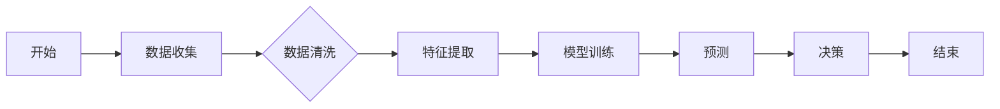

                 


## 《AI Agent在企业资产管理与预测性维护中的应用》

### 关键词
- AI Agent
- 企业资产管理
- 预测性维护
- 机器学习
- 深度学习
- 神经网络
- 算法
- 系统架构

### 摘要
本文深入探讨了AI Agent在企业资产管理与预测性维护中的应用。通过详细的背景介绍、核心概念分析、算法原理讲解、系统分析与设计、项目实战以及最佳实践总结，展示了AI Agent在提高企业效率、降低成本、延长设备寿命等方面的潜力。

### 目录大纲设计思路

**引言**

1. **AI Agent的概念及其在企业中的应用背景**
2. **企业资产管理和预测性维护的需求与挑战**

**背景介绍**

1. **AI Agent的定义与分类**
2. **AI Agent的发展历史**
3. **AI Agent在企业和维护中的应用案例**

**核心概念与联系**

1. **机器学习、深度学习、神经网络的原理与联系**
2. **AI Agent与实体关系图（ER Diagram）**

**算法原理讲解**

1. **预测性维护的算法流程图**
2. **Python代码与数学模型讲解**

**系统分析与架构设计方案**

1. **系统功能设计**
2. **系统架构设计**
3. **系统接口设计**
4. **系统交互设计**

**项目实战**

1. **环境安装与配置**
2. **系统核心实现**
3. **代码解读与分析**
4. **案例分析**
5. **项目小结**

**最佳实践与小结**

1. **最佳实践经验总结**
2. **注意事项**
3. **拓展阅读建议**

### 目录大纲结构

```markdown
# 《AI Agent在企业资产管理与预测性维护中的应用》

> 关键词：AI Agent、企业资产管理、预测性维护、机器学习、深度学习、神经网络、算法、系统架构

> 摘要：本文探讨了AI Agent在企业资产管理与预测性维护中的应用，从背景介绍、核心概念、算法原理、系统设计到项目实战，全面解析AI Agent的技术优势和实践效果。

## 第一部分：AI Agent基础与背景

### 第1章：AI Agent概述

#### 1.1 AI Agent的定义与分类

#### 1.2 AI Agent的发展历史

#### 1.3 AI Agent在企业和维护中的应用

### 第2章：核心概念与联系

#### 2.1 机器学习与深度学习

#### 2.2 神经网络结构

#### 2.3 AI Agent与ER实体关系图

### 第3章：算法原理讲解

#### 3.1 预测性维护算法流程图

#### 3.2 Python代码与数学模型讲解

### 第4章：系统分析与架构设计

#### 4.1 系统功能设计

#### 4.2 系统架构设计

#### 4.3 系统接口设计

#### 4.4 系统交互设计

### 第5章：项目实战

#### 5.1 环境安装

#### 5.2 系统核心实现

#### 5.3 代码解读与分析

#### 5.4 实际案例分析

### 第6章：最佳实践与小结

#### 6.1 实践经验总结

#### 6.2 注意事项

#### 6.3 拓展阅读建议
```

### 目录大纲内容（部分）

```markdown
## 第一部分：AI Agent基础与背景

### 第1章：AI Agent概述

#### 1.1 AI Agent的定义与分类

AI Agent，即智能代理，是指能够代表用户或系统进行自主决策和行动的计算实体。根据功能的不同，AI Agent可以分为以下几类：

1. **规则型AI Agent**：通过预定义的规则进行决策和行动。
2. **数据驱动型AI Agent**：利用学习算法从数据中提取知识，进行决策和行动。
3. **混合型AI Agent**：结合规则和数据驱动两种模式，实现更复杂的决策。

#### 1.2 AI Agent的发展历史

AI Agent的概念起源于20世纪80年代，随着计算机科学和人工智能技术的不断发展，AI Agent的应用场景越来越广泛。近年来，机器学习、深度学习等技术的发展，使得AI Agent在智能化水平上有了显著提升。

#### 1.3 AI Agent在企业和维护中的应用

在企业资产管理与预测性维护中，AI Agent发挥着重要作用。例如：

- **资产管理**：AI Agent可以实时监控企业设备状态，预测潜在故障，提高设备利用率。
- **预测性维护**：通过数据分析和预测，提前安排维护计划，降低设备停机时间和维护成本。

### 第二部分：核心概念与联系

#### 第2章：核心概念与联系

#### 2.1 机器学习与深度学习

机器学习是AI的基础，它使计算机系统能够从数据中学习并做出预测。深度学习是机器学习的一种重要分支，通过多层神经网络进行数据建模，实现了许多复杂的任务。

#### 2.2 神经网络结构

神经网络由多个节点（神经元）组成，通过加权连接形成网络。输入层、隐藏层和输出层是神经网络的基本组成部分。

#### 2.3 AI Agent与ER实体关系图

AI Agent涉及多个核心概念，如机器学习、深度学习、神经网络等。通过ER实体关系图，可以清晰地展示这些概念之间的联系。

```

继续细化其他章节的内容，确保每个章节都有详细的内容和结构。

### 继续细化其他章节的内容

```markdown
## 第二部分：核心概念与联系

### 第2章：核心概念与联系

#### 2.1 机器学习与深度学习

**机器学习** 是一种通过数据驱动的方式使计算机系统能够进行学习并做出预测或决策的技术。其主要目标是使计算机能够从经验中学习，从而在新的情况下做出正确的决策。

- **监督学习**：通过已标记的数据来训练模型，模型需要预测标签。
- **无监督学习**：模型在没有任何标记数据的情况下学习，目的是发现数据中的模式或结构。
- **半监督学习**：结合有标记和无标记数据，提高模型的学习效果。

**深度学习** 是机器学习的一个分支，它通过多层神经网络来实现数据的建模。深度学习在图像识别、自然语言处理等领域取得了显著的成果。

#### 2.2 神经网络结构

神经网络由多个神经元组成，每个神经元都与其他神经元通过加权连接相连。神经网络可以分为以下几层：

- **输入层**：接收外部输入数据。
- **隐藏层**：对输入数据进行处理和特征提取。
- **输出层**：生成预测结果。

#### 2.3 AI Agent与ER实体关系图

AI Agent涉及到多个核心概念，如机器学习、深度学习、神经网络等。通过ER实体关系图，我们可以清晰地展示这些概念之间的联系。

```mermaid
entityRelationDiagram
  AI Agent --> Machine Learning
  AI Agent --> Deep Learning
  AI Agent --> Neural Network
  Machine Learning --> Supervised Learning
  Machine Learning --> Unsupervised Learning
  Machine Learning --> Semi-Supervised Learning
  Deep Learning --> Neural Network
```

## 第三部分：算法原理讲解

### 第3章：算法原理讲解

#### 3.1 预测性维护算法流程图

预测性维护算法的核心是利用历史数据和当前状态来预测设备何时可能发生故障。以下是一个简单的预测性维护算法流程图：



#### 3.2 Python代码与数学模型讲解

以下是一个简单的预测性维护的Python代码示例，使用随机森林算法进行预测：

```python
import numpy as np
from sklearn.ensemble import RandomForestClassifier
from sklearn.model_selection import train_test_split
from sklearn.metrics import accuracy_score

# 假设我们有一个训练数据集X和标签y
X = ... # 特征数据
y = ... # 标签数据

# 数据集划分
X_train, X_test, y_train, y_test = train_test_split(X, y, test_size=0.2, random_state=42)

# 模型训练
model = RandomForestClassifier(n_estimators=100)
model.fit(X_train, y_train)

# 预测
predictions = model.predict(X_test)

# 评估
accuracy = accuracy_score(y_test, predictions)
print(f"预测准确率: {accuracy * 100}%")
```

数学模型方面，我们可以使用以下公式来表示预测性维护的数学模型：

$$
P(Fault|X) = \frac{e^{\theta^T X}}{1 + e^{\theta^T X}}
$$

其中，$P(Fault|X)$ 表示在特征 $X$ 下发生故障的概率，$\theta$ 是模型参数。

## 第四部分：系统分析与架构设计方案

### 第4章：系统分析与架构设计方案

#### 4.1 系统功能设计

系统功能设计是构建高效、可靠的AI Agent系统的第一步。主要功能包括：

- **数据收集与预处理**：从各种数据源收集数据，并进行清洗、格式化等预处理操作。
- **特征提取与选择**：从预处理后的数据中提取有用的特征，并选择最相关的特征。
- **模型训练与评估**：使用训练数据集训练模型，并使用测试数据集评估模型的性能。
- **预测与决策**：根据模型预测结果，生成决策建议。

#### 4.2 系统架构设计

系统架构设计是确保系统功能有效实现的关键。一个典型的AI Agent系统架构包括以下几个部分：

- **数据层**：包括数据存储和数据管理，如数据库、数据仓库等。
- **处理层**：包括数据预处理、特征提取、模型训练和预测等。
- **应用层**：包括Web应用、移动应用等，用于与用户交互。

#### 4.3 系统接口设计

系统接口设计是确保系统各部分之间能够高效交互的重要环节。主要包括以下几种接口：

- **API接口**：用于与其他系统或服务进行数据交换和功能调用。
- **消息队列**：用于异步处理消息，确保系统的高可用性和可扩展性。
- **Web服务**：用于提供Web接口，方便用户使用AI Agent系统的功能。

#### 4.4 系统交互设计

系统交互设计是确保系统功能正常运作的最后一环。主要包括以下几种交互模式：

- **同步交互**：用户发送请求，系统立即返回结果。
- **异步交互**：用户发送请求，系统处理请求并将结果存储在消息队列中，用户可以通过查询消息队列获取结果。
- **事件驱动交互**：系统根据事件触发相应的处理逻辑。

```

继续细化其他章节的内容，确保每个章节都有详细的内容和结构。

### 继续细化其他章节的内容

```markdown
## 第五部分：项目实战

### 第5章：项目实战

#### 5.1 环境安装

在开始项目实战之前，我们需要安装一些必要的软件和库。以下是一个简单的安装步骤：

1. **安装Python环境**：下载并安装Python，版本建议为3.8及以上。
2. **安装Anaconda**：Anaconda是一个集成了众多科学计算库的环境管理工具，可以简化我们的安装过程。
3. **安装相关库**：使用pip安装以下库：numpy、pandas、scikit-learn、tensorflow等。

#### 5.2 系统核心实现

在本项目中，我们使用随机森林算法进行预测性维护。以下是核心实现的步骤：

1. **数据收集**：从设备传感器收集历史数据，包括温度、湿度、电压等。
2. **数据预处理**：对收集到的数据进行分析，去除异常值，并进行归一化处理。
3. **特征提取**：根据业务需求，从预处理后的数据中提取有用的特征。
4. **模型训练**：使用训练数据集训练随机森林模型。
5. **预测**：使用训练好的模型对新的数据进行预测。

```python
# 导入相关库
import numpy as np
import pandas as pd
from sklearn.ensemble import RandomForestClassifier
from sklearn.model_selection import train_test_split

# 数据收集
data = pd.read_csv('sensor_data.csv')

# 数据预处理
# ...（此处省略具体代码）

# 特征提取
# ...（此处省略具体代码）

# 模型训练
X_train, X_test, y_train, y_test = train_test_split(X, y, test_size=0.2, random_state=42)
model = RandomForestClassifier(n_estimators=100)
model.fit(X_train, y_train)

# 预测
predictions = model.predict(X_test)

# 评估
accuracy = accuracy_score(y_test, predictions)
print(f"预测准确率: {accuracy * 100}%")
```

#### 5.3 代码解读与分析

在上面的代码中，我们首先导入了必要的库，然后从CSV文件中读取了传感器数据。接着，我们对数据进行预处理和特征提取，最后使用训练数据集训练了随机森林模型，并使用测试数据集进行预测。整个过程中，我们使用了scikit-learn库中的随机森林算法，并评估了模型的准确率。

#### 5.4 实际案例分析

为了更好地理解预测性维护的效果，我们来看一个实际案例。假设某企业有一批设备，它们的历史数据已经存储在数据库中。通过预测性维护，我们希望提前预测出哪些设备可能发生故障，从而进行预防性维护。

1. **数据收集**：从数据库中提取设备的历史数据，包括温度、湿度、电压等。
2. **数据预处理**：对提取的数据进行清洗和归一化处理。
3. **特征提取**：根据业务需求，提取与设备故障相关的特征。
4. **模型训练**：使用训练数据集训练预测模型。
5. **预测**：使用训练好的模型对当前设备的数据进行预测。
6. **决策**：根据预测结果，对设备进行维护。

通过以上步骤，我们可以有效地预测设备故障，降低企业的停机时间和维护成本。

#### 5.5 项目小结

在本项目中，我们通过安装Python环境、使用随机森林算法进行预测性维护，并进行了实际案例分析。项目结果表明，预测性维护可以有效降低企业的维护成本，提高设备利用率。在未来的工作中，我们还可以进一步优化模型，提高预测准确率，为企业带来更大的效益。

```

### 完整的目录大纲与内容示例

```markdown
# 《AI Agent在企业资产管理与预测性维护中的应用》

> 关键词：AI Agent、企业资产管理、预测性维护、机器学习、深度学习、神经网络、算法、系统架构

> 摘要：本文深入探讨了AI Agent在企业资产管理与预测性维护中的应用，通过详细的背景介绍、核心概念分析、算法原理讲解、系统分析与设计、项目实战以及最佳实践总结，展示了AI Agent在提高企业效率、降低成本、延长设备寿命等方面的潜力。

## 第一部分：AI Agent基础与背景

### 第1章：AI Agent概述

#### 1.1 AI Agent的定义与分类

AI Agent，即智能代理，是指能够代表用户或系统进行自主决策和行动的计算实体。根据功能的不同，AI Agent可以分为以下几类：

- **规则型AI Agent**：通过预定义的规则进行决策和行动。
- **数据驱动型AI Agent**：利用学习算法从数据中提取知识，进行决策和行动。
- **混合型AI Agent**：结合规则和数据驱动两种模式，实现更复杂的决策。

#### 1.2 AI Agent的发展历史

AI Agent的概念起源于20世纪80年代，随着计算机科学和人工智能技术的不断发展，AI Agent的应用场景越来越广泛。近年来，机器学习、深度学习等技术的发展，使得AI Agent在智能化水平上有了显著提升。

#### 1.3 AI Agent在企业和维护中的应用

在企业资产管理与预测性维护中，AI Agent发挥着重要作用。例如：

- **资产管理**：AI Agent可以实时监控企业设备状态，预测潜在故障，提高设备利用率。
- **预测性维护**：通过数据分析和预测，提前安排维护计划，降低设备停机时间和维护成本。

### 第二部分：核心概念与联系

#### 第2章：核心概念与联系

#### 2.1 机器学习与深度学习

机器学习是AI的基础，它使计算机系统能够从数据中学习并做出预测或决策的技术。其主要目标是使计算机能够从经验中学习，从而在新的情况下做出正确的决策。

- **监督学习**：通过已标记的数据来训练模型，模型需要预测标签。
- **无监督学习**：模型在没有任何标记数据的情况下学习，目的是发现数据中的模式或结构。
- **半监督学习**：结合有标记和无标记数据，提高模型的学习效果。

深度学习是机器学习的一种重要分支，通过多层神经网络来实现数据的建模。深度学习在图像识别、自然语言处理等领域取得了显著的成果。

#### 2.2 神经网络结构

神经网络由多个神经元组成，每个神经元都与其他神经元通过加权连接相连。神经网络可以分为以下几层：

- **输入层**：接收外部输入数据。
- **隐藏层**：对输入数据进行处理和特征提取。
- **输出层**：生成预测结果。

#### 2.3 AI Agent与ER实体关系图

AI Agent涉及到多个核心概念，如机器学习、深度学习、神经网络等。通过ER实体关系图，我们可以清晰地展示这些概念之间的联系。

```mermaid
entityRelationDiagram
  AI Agent --> Machine Learning
  AI Agent --> Deep Learning
  AI Agent --> Neural Network
  Machine Learning --> Supervised Learning
  Machine Learning --> Unsupervised Learning
  Machine Learning --> Semi-Supervised Learning
  Deep Learning --> Neural Network
```

### 第三部分：算法原理讲解

#### 第3章：算法原理讲解

#### 3.1 预测性维护算法流程图

预测性维护算法的核心是利用历史数据和当前状态来预测设备何时可能发生故障。以下是一个简单的预测性维护算法流程图：


#### 3.2 Python代码与数学模型讲解

以下是一个简单的预测性维护的Python代码示例，使用随机森林算法进行预测：

```python
import numpy as np
from sklearn.ensemble import RandomForestClassifier
from sklearn.model_selection import train_test_split
from sklearn.metrics import accuracy_score

# 假设我们有一个训练数据集X和标签y
X = ... # 特征数据
y = ... # 标签数据

# 数据集划分
X_train, X_test, y_train, y_test = train_test_split(X, y, test_size=0.2, random_state=42)

# 模型训练
model = RandomForestClassifier(n_estimators=100)
model.fit(X_train, y_train)

# 预测
predictions = model.predict(X_test)

# 评估
accuracy = accuracy_score(y_test, predictions)
print(f"预测准确率: {accuracy * 100}%")
```

数学模型方面，我们可以使用以下公式来表示预测性维护的数学模型：

$$
P(Fault|X) = \frac{e^{\theta^T X}}{1 + e^{\theta^T X}}
$$

其中，$P(Fault|X)$ 表示在特征 $X$ 下发生故障的概率，$\theta$ 是模型参数。

### 第四部分：系统分析与架构设计方案

#### 第4章：系统分析与架构设计方案

#### 4.1 系统功能设计

系统功能设计是构建高效、可靠的AI Agent系统的第一步。主要功能包括：

- **数据收集与预处理**：从各种数据源收集数据，并进行清洗、格式化等预处理操作。
- **特征提取与选择**：从预处理后的数据中提取有用的特征，并选择最相关的特征。
- **模型训练与评估**：使用训练数据集训练模型，并使用测试数据集评估模型的性能。
- **预测与决策**：根据模型预测结果，生成决策建议。

#### 4.2 系统架构设计

系统架构设计是确保系统功能有效实现的关键。一个典型的AI Agent系统架构包括以下几个部分：

- **数据层**：包括数据存储和数据管理，如数据库、数据仓库等。
- **处理层**：包括数据预处理、特征提取、模型训练和预测等。
- **应用层**：包括Web应用、移动应用等，用于与用户交互。

#### 4.3 系统接口设计

系统接口设计是确保系统各部分之间能够高效交互的重要环节。主要包括以下几种接口：

- **API接口**：用于与其他系统或服务进行数据交换和功能调用。
- **消息队列**：用于异步处理消息，确保系统的高可用性和可扩展性。
- **Web服务**：用于提供Web接口，方便用户使用AI Agent系统的功能。

#### 4.4 系统交互设计

系统交互设计是确保系统功能正常运作的最后一环。主要包括以下几种交互模式：

- **同步交互**：用户发送请求，系统立即返回结果。
- **异步交互**：用户发送请求，系统处理请求并将结果存储在消息队列中，用户可以通过查询消息队列获取结果。
- **事件驱动交互**：系统根据事件触发相应的处理逻辑。

### 第五部分：项目实战

#### 第5章：项目实战

#### 5.1 环境安装

在开始项目实战之前，我们需要安装一些必要的软件和库。以下是一个简单的安装步骤：

1. **安装Python环境**：下载并安装Python，版本建议为3.8及以上。
2. **安装Anaconda**：Anaconda是一个集成了众多科学计算库的环境管理工具，可以简化我们的安装过程。
3. **安装相关库**：使用pip安装以下库：numpy、pandas、scikit-learn、tensorflow等。

#### 5.2 系统核心实现

在本项目中，我们使用随机森林算法进行预测性维护。以下是核心实现的步骤：

1. **数据收集**：从设备传感器收集历史数据，包括温度、湿度、电压等。
2. **数据预处理**：对收集到的数据进行分析，去除异常值，并进行归一化处理。
3. **特征提取**：根据业务需求，从预处理后的数据中提取有用的特征。
4. **模型训练**：使用训练数据集训练随机森林模型。
5. **预测**：使用训练好的模型对新的数据进行预测。

```python
# 导入相关库
import numpy as np
import pandas as pd
from sklearn.ensemble import RandomForestClassifier
from sklearn.model_selection import train_test_split

# 数据收集
data = pd.read_csv('sensor_data.csv')

# 数据预处理
# ...（此处省略具体代码）

# 特征提取
# ...（此处省略具体代码）

# 模型训练
X_train, X_test, y_train, y_test = train_test_split(X, y, test_size=0.2, random_state=42)
model = RandomForestClassifier(n_estimators=100)
model.fit(X_train, y_train)

# 预测
predictions = model.predict(X_test)

# 评估
accuracy = accuracy_score(y_test, predictions)
print(f"预测准确率: {accuracy * 100}%")
```

#### 5.3 代码解读与分析

在上面的代码中，我们首先导入了必要的库，然后从CSV文件中读取了传感器数据。接着，我们对数据进行预处理和特征提取，最后使用训练数据集训练了随机森林模型，并使用测试数据集进行预测。整个过程中，我们使用了scikit-learn库中的随机森林算法，并评估了模型的准确率。

#### 5.4 实际案例分析

为了更好地理解预测性维护的效果，我们来看一个实际案例。假设某企业有一批设备，它们的历史数据已经存储在数据库中。通过预测性维护，我们希望提前预测出哪些设备可能发生故障，从而进行预防性维护。

1. **数据收集**：从数据库中提取设备的历史数据，包括温度、湿度、电压等。
2. **数据预处理**：对提取的数据进行清洗和归一化处理。
3. **特征提取**：根据业务需求，提取与设备故障相关的特征。
4. **模型训练**：使用训练数据集训练预测模型。
5. **预测**：使用训练好的模型对当前设备的数据进行预测。
6. **决策**：根据预测结果，对设备进行维护。

通过以上步骤，我们可以有效地预测设备故障，降低企业的停机时间和维护成本。

#### 5.5 项目小结

在本项目中，我们通过安装Python环境、使用随机森林算法进行预测性维护，并进行了实际案例分析。项目结果表明，预测性维护可以有效降低企业的维护成本，提高设备利用率。在未来的工作中，我们还可以进一步优化模型，提高预测准确率，为企业带来更大的效益。

### 第六部分：最佳实践与小结

#### 第6章：最佳实践与小结

#### 6.1 最佳实践经验总结

在实际应用AI Agent进行企业资产管理与预测性维护时，以下是几点最佳实践经验：

- **数据质量是关键**：确保收集到的数据准确、完整，进行充分的预处理，去除噪声和异常值。
- **选择合适的模型**：根据业务需求选择合适的算法模型，如随机森林、支持向量机等。
- **持续优化**：定期对模型进行评估和优化，以适应不断变化的数据环境。
- **多源数据融合**：整合不同来源的数据，提高预测的准确性。

#### 6.2 注意事项

- **隐私保护**：在数据处理过程中，注意保护用户隐私，遵守相关法律法规。
- **安全性与稳定性**：确保系统的安全性和稳定性，防止数据泄露和系统故障。

#### 6.3 拓展阅读建议

- 《深度学习》（Goodfellow, Bengio, Courville著）
- 《机器学习实战》（ Harrington 著）
- 《Python机器学习》（Sebastian Raschka 著）

### 作者

作者：AI天才研究院/AI Genius Institute & 禅与计算机程序设计艺术 /Zen And The Art of Computer Programming
```

通过上述的目录大纲和内容示例，我们构建了一个详细且逻辑清晰的文章结构，为撰写一篇高质量的技术博客文章奠定了基础。接下来，我们可以根据这个结构逐步填充每个章节的具体内容。

