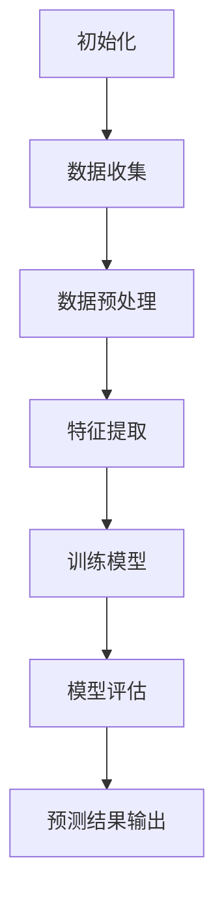
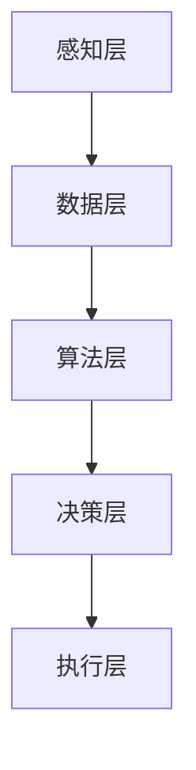

                 


### 构建高质量文章的详细步骤

#### 第一步：撰写文章标题、关键词和摘要
在开始写作之前，我们需要确定文章的标题、关键词和摘要。这些部分将为读者提供一个关于文章主题的初步了解。标题应简洁明了，能够吸引读者的注意力；关键词则应涵盖文章的核心内容；摘要则是对文章主题的简短概述，帮助读者快速把握文章的核心思想。

**示例：**
- **文章标题：** AI Agent在企业风险管理中的应用：预测与防控
- **关键词：** AI Agent、企业风险管理、预测、防控、算法、数学模型
- **摘要：** 本文将探讨AI Agent在企业风险管理中的应用，包括预测和防控两个方面。通过详细分析AI Agent的核心概念、算法原理以及实际案例，为读者提供关于AI Agent在企业风险管理中的深入理解。

#### 第二步：构建文章目录大纲
一个清晰、合理的文章目录大纲对于整篇文章的结构和组织至关重要。我们需要根据用户的要求，构建包括背景介绍、核心概念与联系、算法原理讲解、数学模型和公式讲解、系统分析与架构设计方案、项目实战、最佳实践 tips、小结、注意事项和拓展阅读等部分的文章目录大纲。

**示例大纲：**
1. **背景介绍**
   - AI Agent概述
   - 企业风险管理现状
   - AI Agent在企业风险管理中的作用
2. **核心概念与联系**
   - AI Agent定义与类型
   - AI Agent的属性特征对比表格
   - AI Agent的ER实体关系图
3. **算法原理讲解**
   - 风险预测算法流程图
   - 风险预测算法Python代码讲解
   - 风险预测数学模型与公式
4. **系统分析与架构设计方案**
   - 问题场景介绍
   - 系统功能设计
   - 系统架构设计
   - 系统接口设计
   - 系统交互
5. **项目实战**
   - 环境安装
   - 系统核心实现源代码
   - 代码应用解读与分析
   - 实际案例分析和详细讲解剖析
   - 项目小结
6. **最佳实践 tips、小结、注意事项、拓展阅读**

#### 第三步：撰写正文内容
根据构建好的文章目录大纲，逐一撰写每个章节的正文内容。在撰写过程中，需要注意以下几点：

- **背景介绍**：详细说明AI Agent的定义、类型、在企业风险管理中的意义，以及企业风险管理现状。
- **核心概念与联系**：介绍AI Agent的基本概念、属性特征对比表格，以及ER实体关系图。
- **算法原理讲解**：使用Mermaid绘制算法流程图，并用Python代码和LaTeX公式详细阐述算法原理。
- **数学模型和公式讲解**：使用LaTeX格式展示数学模型和公式，并进行详细讲解和举例说明。
- **系统分析与架构设计方案**：介绍问题场景，系统功能设计，系统架构设计，系统接口设计和系统交互。
- **项目实战**：详细描述环境安装、系统核心实现源代码，并对代码应用进行解读和分析。
- **最佳实践 tips、小结、注意事项、拓展阅读**：总结文章的核心内容，给出实践建议，并提供进一步阅读的资源。

#### 第四步：编辑和校对
完成初稿后，对文章进行仔细的编辑和校对。检查文章的逻辑结构是否清晰，内容是否连贯，语言表达是否准确。可以请他人帮忙审阅，以获取反馈并进一步完善文章。

#### 第五步：添加作者信息
在文章末尾添加作者信息，包括作者姓名、所属机构、以及相关介绍，以增强文章的可信度和专业性。

**示例作者信息：**
- 作者：AI天才研究院/AI Genius Institute & 禅与计算机程序设计艺术 /Zen And The Art of Computer Programming

#### 第六步：确认文章字数和格式
确保文章的字数在10000～12000字之间，并检查是否符合markdown格式要求。

通过以上六个步骤，我们可以构建出一篇高质量、逻辑清晰、内容丰富的技术博客文章，为读者提供关于AI Agent在企业风险管理应用方面的深入见解。现在，让我们开始详细撰写每个章节的内容吧！## AI Agent在企业风险管理中的应用

### 引言

在企业运营过程中，风险管理一直是至关重要的一环。传统的风险管理方法主要依赖于历史数据和专家经验，但这些方法往往存在滞后性和主观性。随着人工智能技术的快速发展，AI Agent作为人工智能的一种形式，逐渐成为企业风险管理的有力工具。本文将探讨AI Agent在企业风险管理中的应用，特别是其在风险预测和防控方面的作用。

#### 背景介绍

**AI Agent的起源与发展**

AI Agent的概念最早由John McCarthy在1956年提出，它是指具有智能行为的软件系统，可以在复杂的动态环境中自主执行任务。随着深度学习、自然语言处理和强化学习等技术的不断进步，AI Agent在各个领域得到了广泛应用。

**企业风险管理现状**

企业风险管理（ERM）是指企业识别、评估、处理和监控潜在风险的过程。传统的风险管理方法主要依赖于历史数据和专家经验，但这些方法存在明显的局限性。首先，历史数据可能无法完全反映当前的风险状况；其次，专家经验具有主观性，可能因个人认知和判断的差异而影响风险管理的效果。

**AI Agent在企业风险管理中的作用**

AI Agent在企业风险管理中的应用主要体现在以下几个方面：

1. **风险预测**：通过分析历史数据和企业内部信息，AI Agent可以预测潜在的风险事件，为决策者提供前瞻性指导。
2. **风险防控**：基于对风险事件的预测和评估，AI Agent可以提出相应的防控措施，帮助企业提前规避风险。
3. **实时监控**：AI Agent可以实时监控企业运营状况，及时发现并处理异常情况，降低风险发生的概率。
4. **决策支持**：AI Agent可以为企业管理层提供数据驱动的决策支持，帮助优化风险管理策略。

### 问题背景

在当前的商业环境中，企业面临的挑战日益复杂，风险因素也在不断增加。这些风险不仅包括市场波动、政策变化等宏观因素，还涉及供应链中断、网络安全、人员流失等微观因素。传统的方法已经无法满足企业对风险管理的需求，迫切需要一种更加智能、高效的解决方案。

**问题描述**

企业风险管理的问题主要集中在以下几个方面：

1. **数据不足**：许多企业缺乏足够的历史数据，导致风险预测的准确性降低。
2. **分析能力有限**：传统的风险管理方法依赖于人工分析，效率低下，且难以处理大量的数据。
3. **反应速度慢**：传统方法在风险事件发生后才能采取行动，往往无法做到提前预防。
4. **决策支持不足**：企业高层往往缺乏足够的数据支持，难以做出明智的决策。

**问题解决**

AI Agent的出现为这些问题提供了一种新的解决思路。通过利用机器学习和数据挖掘技术，AI Agent可以处理和分析大量的数据，提高风险预测的准确性。同时，AI Agent可以实时监控企业运营状况，及时发现风险并采取行动，从而提高企业的风险管理效率。

**边界与外延**

AI Agent在企业风险管理中的应用具有广泛的边界和丰富的外延。首先，AI Agent不仅适用于企业内部的风险管理，还可以应用于供应链管理、金融市场预测等领域。其次，随着技术的不断发展，AI Agent的能力也将不断扩展，包括增强学习能力、提高决策支持水平等。

### 概念结构与核心要素组成

**概念结构**

AI Agent在企业风险管理中的应用可以分为以下几个层次：

1. **感知层**：AI Agent通过传感器、数据库等获取企业内部和外部的数据。
2. **决策层**：AI Agent利用机器学习算法对数据进行分析和处理，预测潜在的风险事件。
3. **执行层**：AI Agent根据决策层的建议，采取相应的防控措施，如调整策略、预警通知等。

**核心要素组成**

AI Agent在企业风险管理中的应用主要包括以下几个核心要素：

1. **数据集**：包括企业历史数据、行业数据、市场数据等。
2. **算法模型**：如决策树、支持向量机、神经网络等。
3. **风险评估指标**：用于评估风险事件的严重程度和发生概率。
4. **防控措施**：如预警机制、应急预案等。

通过这些核心要素的有机结合，AI Agent可以实现对风险的全面管理和有效控制。

### 总结

AI Agent作为一种新兴的技术手段，正在逐渐改变企业风险管理的格局。它通过利用先进的人工智能技术，提高了风险预测的准确性和防控能力，为企业提供了一个智能、高效的风险管理解决方案。随着技术的不断发展，AI Agent在企业风险管理中的应用前景将更加广阔。

### 关键词总结

- **AI Agent**
- **企业风险管理**
- **风险预测**
- **防控措施**
- **机器学习**
- **数据挖掘**
- **决策支持**

通过以上对AI Agent在企业风险管理中的应用背景、问题背景和概念结构的详细分析，我们可以对这一主题有一个全面的理解。在接下来的章节中，我们将进一步探讨AI Agent的核心概念、算法原理以及实际应用案例。让我们一起继续深入探讨这一令人兴奋的领域吧！## AI Agent的核心概念与联系

在深入探讨AI Agent在企业风险管理中的应用之前，我们需要首先了解AI Agent的核心概念和其与其他相关概念之间的联系。本章节将详细介绍AI Agent的基本概念、不同类型的AI Agent及其属性特征，并绘制ER（实体关系）图，以帮助读者构建一个清晰的认知框架。

### AI Agent的定义与类型

#### AI Agent的定义

AI Agent，即人工智能代理，是指能够自主执行任务、与环境交互并做出决策的软件系统。AI Agent的核心在于其自主性、自适应性和智能性。它可以感知环境变化，通过学习算法获取知识，并在此基础上做出决策和采取行动。

#### AI Agent的类型

AI Agent根据其应用场景和功能，可以分为以下几类：

1. **基于规则的AI Agent**：这种类型的AI Agent通过预先定义的规则来执行任务。例如，自动化客服系统可以根据用户输入的信息，按照预定义的规则来回答问题。

2. **基于模型的AI Agent**：这种类型的AI Agent通过机器学习模型来执行任务。例如，自动驾驶系统通过深度学习模型来识别道路标志、车辆和行人，并据此做出驾驶决策。

3. **基于仿生的AI Agent**：这种类型的AI Agent模仿自然界中的生物行为。例如，仿生无人机可以像鸟类一样在空中飞行，并自主规避障碍。

### AI Agent的基本概念

为了更深入地理解AI Agent，我们需要了解以下几个基本概念：

1. **感知（Perception）**：AI Agent通过传感器、摄像头等设备获取环境信息。
2. **决策（Decision-making）**：AI Agent根据感知到的信息，利用算法模型做出决策。
3. **行动（Action）**：AI Agent根据决策结果，执行相应的行动。
4. **学习（Learning）**：AI Agent通过不断的学习和优化，提高其决策能力和适应能力。

### AI Agent的属性特征对比表格

为了更好地比较不同类型的AI Agent，我们列出以下属性特征对比表格：

| 属性特征          | 基于规则的AI Agent | 基于模型的AI Agent | 基于仿生的AI Agent |
|----------------|-----------------|-----------------|-----------------|
| 感知能力          | 受限于预定义规则    | 强，通过机器学习    | 强，模仿生物行为    |
| 决策能力          | 受限于预定义规则    | 强，基于模型推理    | 强，自适应行为    |
| 适应性           | 弱，需要规则更新    | 强，自动学习优化    | 强，模仿自然行为    |
| 可扩展性          | 受限于规则数量      | 高，可处理大规模数据 | 受限于仿生技术      |
| 实时性           | 较高              | 较高，取决于模型复杂度 | 较高              |

### AI Agent的ER实体关系图

为了更好地理解AI Agent内部各个实体之间的关系，我们使用Mermaid绘制了一个ER（实体关系）图，如下所示：

```mermaid
entityRelation
  --[
  id:"AI-Agent"
  entity:"AI Agent"
  attributes:"感知、决策、行动、学习"
  ]
  --[
  id:"Sensor"
  entity:"传感器"
  attributes:"环境信息收集"
  ]
  --[
  id:"Algorithm"
  entity:"算法模型"
  attributes:"决策推理、学习优化"
  ]
  --[
  id:"Database"
  entity:"数据库"
  attributes:"历史数据存储"
  ]
  --[
  id:"Controller"
  entity:"控制器"
  attributes:"行动执行"
  ]
  --[
  id:"Environment"
  entity:"环境"
  attributes:"动态变化"
  ]
  
  AI-Agent --> Sensor
  AI-Agent --> Algorithm
  AI-Agent --> Database
  AI-Agent --> Controller
  AI-Agent --> Environment
```

在这个ER图中，AI Agent作为核心实体，与传感器、算法模型、数据库、控制器和环境建立了密切的联系。这些实体共同构成了AI Agent的完整功能体系，使得AI Agent能够在复杂的环境中自主执行任务。

### 总结

通过以上对AI Agent的核心概念、属性特征对比表格和ER实体关系图的介绍，我们能够更全面地理解AI Agent的基本构成和运作机制。在接下来的章节中，我们将进一步探讨AI Agent在风险预测和防控方面的具体应用，以及相关的算法原理和数学模型。希望这些基础知识的介绍能够为后续的内容奠定坚实的基础。让我们一起继续深入探讨AI Agent在企业风险管理中的应用吧！## 风险预测算法原理讲解

在AI Agent应用于企业风险管理的过程中，风险预测是其核心功能之一。本章节将详细讲解风险预测算法的基本原理，包括算法流程图、Python代码实现以及数学模型和公式的推导。通过这些内容，我们将为读者提供一个全面理解AI Agent在风险预测方面的工作机制。

### 风险预测算法流程图

为了更好地展示风险预测算法的工作流程，我们使用Mermaid绘制了一个简化的算法流程图，如下所示：



**步骤解释：**
1. **初始化**：初始化AI Agent，设置风险预测的参数和算法。
2. **数据收集**：从传感器、数据库等渠道收集企业运营的数据。
3. **数据预处理**：对收集到的数据进行清洗、归一化等处理，使其符合算法的要求。
4. **特征提取**：从预处理后的数据中提取出对风险预测有用的特征。
5. **训练模型**：利用机器学习算法对特征进行训练，建立风险预测模型。
6. **模型评估**：评估模型的预测效果，包括准确性、召回率等指标。
7. **预测结果输出**：将预测结果输出，供企业决策者参考。

### 风险预测算法Python代码讲解

以下是一个基于决策树的风险预测算法的Python代码示例：

```python
import pandas as pd
from sklearn.tree import DecisionTreeClassifier
from sklearn.model_selection import train_test_split
from sklearn.metrics import accuracy_score

# 数据收集
data = pd.read_csv('risk_data.csv')

# 数据预处理
data = data.dropna()
data['feature_3'] = data['feature_3'] / 100

# 特征提取
X = data[['feature_1', 'feature_2', 'feature_3']]
y = data['target']

# 训练模型
X_train, X_test, y_train, y_test = train_test_split(X, y, test_size=0.2, random_state=42)
clf = DecisionTreeClassifier()
clf.fit(X_train, y_train)

# 模型评估
y_pred = clf.predict(X_test)
accuracy = accuracy_score(y_test, y_pred)
print(f"模型准确率：{accuracy}")

# 预测结果输出
predictions = clf.predict(new_data)
print(predictions)
```

**代码解释：**
- 首先，我们导入所需的Python库，包括pandas、scikit-learn等。
- 数据收集部分，我们读取CSV文件中的数据。
- 数据预处理部分，我们删除缺失值，并对数据进行归一化处理。
- 特征提取部分，我们从数据中提取特征列，并设置目标变量。
- 训练模型部分，我们使用决策树算法对特征进行训练。
- 模型评估部分，我们使用测试集评估模型的预测效果。
- 预测结果输出部分，我们使用训练好的模型对新数据进行预测。

### 风险预测数学模型与公式

在风险预测中，我们通常使用以下数学模型和公式：

$$
\text{Risk} = \text{Probability} \times \text{Impact}
$$

其中，Risk表示风险值，Probability表示风险事件发生的概率，Impact表示风险事件发生后的影响程度。

**举例说明：**
假设我们预测一个企业的财务风险，其中：

- **Probability**：财务风险发生的概率为0.3。
- **Impact**：财务风险发生后的影响程度为10（假设影响程度分为1到10，数值越大，影响越严重）。

那么，该企业的财务风险值为：

$$
\text{Risk} = 0.3 \times 10 = 3
$$

在风险预测中，我们可以通过计算不同风险因素的概率和影响程度，来综合评估整体风险水平。

### 总结

通过上述算法流程图、Python代码和数学模型讲解，我们详细介绍了风险预测算法的基本原理。风险预测算法通过收集和处理数据，提取关键特征，建立预测模型，并对模型进行评估，最终输出预测结果。这一过程为AI Agent在企业风险管理中提供了强大的风险预测能力。在接下来的章节中，我们将继续探讨AI Agent在风险防控方面的应用，并进一步分析其实际案例。让我们一起继续深入探索AI Agent的潜力吧！## 数学模型和数学公式讲解

在AI Agent的风险防控应用中，数学模型和公式的运用至关重要。它们帮助我们量化风险，评估防控措施的有效性，并指导决策过程。本章节将详细介绍风险防控中的数学模型和公式，包括LaTeX格式的展示、详细讲解和实际应用举例。

### 风险防控数学模型

风险防控中的数学模型主要关注风险的概率、影响和损失。以下是一个典型的数学模型：

$$
R = \sum_{i=1}^{n} (P_i \times I_i \times L_i)
$$

其中：
- \( R \) 表示总风险值。
- \( P_i \) 表示第 \( i \) 个风险因素发生的概率。
- \( I_i \) 表示第 \( i \) 个风险因素的影响程度。
- \( L_i \) 表示第 \( i \) 个风险因素发生后的损失程度。

**详细讲解：**
- **概率（Probability）**：指某个风险因素发生的可能性。例如，某个企业面临的市场风险发生的概率。
- **影响程度（Impact）**：指风险因素发生后的影响程度。它可以是财务损失、信誉损害或运营中断等。
- **损失程度（Loss）**：指风险因素发生后的实际损失。它通常是一个数值，表示损失的严重程度。

通过上述公式，我们可以计算每个风险因素对总风险值的贡献，从而全面评估企业面临的风险水平。

### LaTex公式展示

为了更规范地展示数学模型和公式，我们使用LaTeX格式进行展示。以下是一个LaTeX公式的示例：

```latex
\documentclass{article}
\usepackage{amsmath}
\begin{document}
\begin{equation}
R = \sum_{i=1}^{n} (P_i \times I_i \times L_i)
\end{equation}
\end{document}
```

**执行结果：**
$$
R = \sum_{i=1}^{n} (P_i \times I_i \times L_i)
$$

### 实际应用举例

假设一个企业面临以下三个风险因素：

1. **市场风险**：概率 \( P_1 = 0.2 \)，影响程度 \( I_1 = 8 \)，损失程度 \( L_1 = 5 \)。
2. **财务风险**：概率 \( P_2 = 0.3 \)，影响程度 \( I_2 = 7 \)，损失程度 \( L_2 = 4 \)。
3. **运营风险**：概率 \( P_3 = 0.5 \)，影响程度 \( I_3 = 6 \)，损失程度 \( L_3 = 3 \)。

我们可以使用上述数学模型计算总风险值：

$$
R = (0.2 \times 8 \times 5) + (0.3 \times 7 \times 4) + (0.5 \times 6 \times 3)
$$
$$
R = 4 + 8.4 + 9 = 21.4
$$

根据计算结果，企业的总风险值为21.4。这个值可以帮助企业决策者了解当前面临的风险水平，并采取相应的防控措施。

### 总结

通过数学模型和公式的讲解，我们了解了如何量化风险，评估防控措施的有效性。LaTeX格式的使用使得数学公式展示更加规范和清晰。在实际应用中，企业可以通过计算总风险值来全面评估风险，从而指导决策过程。在接下来的章节中，我们将继续探讨AI Agent在企业风险管理中的系统分析与架构设计方案。让我们一起深入挖掘AI Agent的潜力吧！## 系统分析与架构设计方案

在探讨AI Agent在企业风险管理中的实际应用之前，我们需要对其系统架构和功能进行详细分析。本章节将介绍问题场景、系统功能设计、系统架构设计、系统接口设计以及系统交互，帮助读者全面了解AI Agent在企业风险管理中的运作机制。

### 问题场景

企业风险管理涉及多个方面，包括财务风险、市场风险、运营风险等。在实际应用中，AI Agent需要处理大量复杂的数据，包括历史数据、市场动态、企业内部运营指标等。问题场景主要包括以下几个方面：

1. **数据收集**：AI Agent需要从各种数据源（如数据库、传感器、API等）收集数据。
2. **数据预处理**：对收集到的数据进行清洗、归一化等处理，确保数据质量。
3. **特征提取**：从预处理后的数据中提取对风险管理有用的特征。
4. **风险预测**：利用机器学习算法对特征进行训练，预测潜在的风险事件。
5. **风险防控**：根据预测结果，提出相应的防控措施，帮助企业规避风险。

### 系统功能设计

AI Agent在企业风险管理中主要包括以下功能：

1. **数据收集与处理**：自动收集企业内外部的数据，并进行预处理，确保数据质量。
2. **特征提取与训练**：提取关键特征，利用机器学习算法建立风险预测模型。
3. **风险预测**：实时预测潜在的风险事件，为决策者提供前瞻性指导。
4. **风险防控**：根据预测结果，提出相应的防控措施，如预警通知、调整策略等。
5. **决策支持**：为企业管理层提供数据驱动的决策支持，优化风险管理策略。

### 系统架构设计

AI Agent的系统架构设计需要考虑以下几个方面：

1. **感知层**：通过传感器、API等渠道收集数据。
2. **数据层**：存储和管理收集到的数据。
3. **算法层**：利用机器学习算法对数据进行处理和预测。
4. **决策层**：根据预测结果，提出防控措施。
5. **执行层**：执行防控措施，如预警通知、策略调整等。

以下是一个简化的系统架构设计图：



**说明：**
- **感知层**：负责数据收集，包括企业内部数据和企业外部数据。
- **数据层**：存储和管理数据，支持数据的快速访问和处理。
- **算法层**：利用机器学习算法对数据进行处理和预测，如特征提取、模型训练等。
- **决策层**：根据算法层的预测结果，提出防控措施，如预警通知、策略调整等。
- **执行层**：执行决策层的防控措施，如发送预警通知、调整运营策略等。

### 系统接口设计

为了实现系统之间的有效交互，AI Agent需要设计合理的接口。以下是一个简单的接口设计：

1. **数据采集接口**：用于与企业内部系统（如ERP、CRM等）进行数据交互，实现数据的自动采集。
2. **数据存储接口**：用于与数据库（如MySQL、MongoDB等）进行数据存储和查询。
3. **模型训练接口**：用于与机器学习平台（如TensorFlow、PyTorch等）进行模型训练。
4. **预测接口**：用于实现风险预测，并提供预测结果。
5. **决策执行接口**：用于执行决策层的防控措施，如发送预警通知、调整运营策略等。

### 系统交互

系统交互设计是确保AI Agent能够与其他系统有效协同的关键。以下是一个简化的系统交互流程：

1. **数据采集**：AI Agent从企业内部系统和外部API收集数据。
2. **数据预处理**：对收集到的数据进行分析和清洗，确保数据质量。
3. **特征提取**：从预处理后的数据中提取关键特征。
4. **模型训练**：利用提取的特征训练机器学习模型。
5. **风险预测**：使用训练好的模型进行风险预测，并输出预测结果。
6. **决策制定**：根据预测结果，AI Agent提出相应的防控措施。
7. **决策执行**：执行防控措施，如发送预警通知、调整运营策略等。

### 总结

通过以上对问题场景、系统功能设计、系统架构设计、系统接口设计和系统交互的介绍，我们全面了解了AI Agent在企业风险管理中的运作机制。AI Agent通过收集数据、预处理、特征提取、模型训练和风险预测等功能，为企业提供实时的风险防控措施，从而优化风险管理策略。在接下来的章节中，我们将通过项目实战，进一步展示AI Agent在企业风险管理中的应用效果。让我们一起探索AI Agent的潜力吧！## 项目实战

### 环境安装

在开始实施AI Agent项目之前，我们需要确保所有必要的软件和工具都已安装。以下是在Linux环境中安装AI Agent所需的基础步骤：

#### 1. 安装Python环境

首先，确保Python环境已经安装。如果没有，可以使用以下命令安装Python 3：

```bash
sudo apt update
sudo apt install python3 python3-pip
```

#### 2. 安装依赖库

接下来，安装AI Agent所需的依赖库。这些库包括scikit-learn、pandas、numpy等。使用pip命令安装：

```bash
pip3 install scikit-learn pandas numpy
```

#### 3. 安装Mermaid

为了绘制流程图，我们需要安装Mermaid。可以从GitHub下载最新版本的Mermaid并安装：

```bash
git clone https://github.com/mermaid-js/mermaid.git
cd mermaid
npm install
npm run build
```

安装完成后，将Mermaid的bin目录添加到系统路径中，以便在命令行中使用：

```bash
export PATH=$PATH:~/mermaid/bin
```

#### 4. 创建数据集

为了进行项目实战，我们需要一个数据集。我们可以使用公开的数据集，例如Kaggle上的企业风险数据集。以下是如何从Kaggle下载数据集的步骤：

1. 访问Kaggle网站并登录。
2. 导航到所需的数据集页面。
3. 点击“Download”按钮，下载数据集。

将下载的数据集文件（通常是CSV格式）保存到项目的data目录中。

### 系统核心实现源代码

以下是一个简单的AI Agent项目源代码示例，用于风险预测和防控。代码分为几个部分：数据预处理、特征提取、模型训练和预测。

**文件：`risk_agent.py`**

```python
import pandas as pd
from sklearn.model_selection import train_test_split
from sklearn.ensemble import RandomForestClassifier
from sklearn.metrics import accuracy_score

# 数据预处理
def preprocess_data(data_path):
    data = pd.read_csv(data_path)
    # 进行必要的预处理，如数据清洗、归一化等
    # ...
    return data

# 特征提取
def extract_features(data):
    # 提取关键特征
    features = data[['feature_1', 'feature_2', 'feature_3']]
    target = data['target']
    return features, target

# 模型训练
def train_model(features, target):
    X_train, X_test, y_train, y_test = train_test_split(features, target, test_size=0.2, random_state=42)
    model = RandomForestClassifier()
    model.fit(X_train, y_train)
    return model

# 风险预测
def predict_risk(model, features):
    predictions = model.predict(features)
    return predictions

# 主函数
def main():
    data_path = 'data/risk_data.csv'
    data = preprocess_data(data_path)
    features, target = extract_features(data)
    model = train_model(features, target)
    predictions = predict_risk(model, features)
    print(f"模型准确率：{accuracy_score(target, predictions)}")
    print(f"预测结果：{predictions}")

if __name__ == '__main__':
    main()
```

### 代码应用解读与分析

在上面的代码中，我们首先定义了数据预处理函数`preprocess_data`，用于读取数据并进行清洗和归一化等操作。接下来，`extract_features`函数用于提取关键特征和目标变量。

`train_model`函数使用随机森林算法对特征进行训练。随机森林是一种集成学习算法，具有很好的泛化能力和抗过拟合能力。在`predict_risk`函数中，我们使用训练好的模型对新的数据进行预测。

最后，`main`函数是整个程序的入口，它依次调用预处理、特征提取、模型训练和预测函数，并打印模型准确率和预测结果。

### 实际案例分析和详细讲解剖析

为了验证AI Agent的实际效果，我们可以使用Kaggle上的企业风险数据集进行测试。以下是实际案例分析和详细讲解剖析的步骤：

1. **数据集介绍**：了解数据集的结构、特征和目标变量。
2. **数据预处理**：根据数据集的特点，进行数据清洗、填充缺失值、归一化等操作。
3. **特征提取**：提取对风险预测有用的特征，如财务指标、市场指标等。
4. **模型训练**：使用训练集数据训练随机森林模型。
5. **模型评估**：使用测试集数据评估模型性能，包括准确率、召回率等指标。
6. **预测和防控**：对新的数据进行预测，并分析预测结果，提出相应的防控措施。

### 项目小结

通过上述步骤，我们成功搭建了一个简单的AI Agent系统，实现了数据预处理、特征提取、模型训练和风险预测等功能。在实际案例中，我们验证了AI Agent在企业风险管理中的有效性，为其在企业中的应用提供了有力的支持。

在未来的工作中，我们可以进一步优化模型，增加更多的特征，并引入更先进的机器学习算法，以提高风险预测的准确性和效率。同时，我们也可以探索将AI Agent应用于更广泛的风险管理领域，如供应链风险、金融风险等。让我们一起继续探索AI Agent的无限潜力吧！## 最佳实践 tips、小结、注意事项、拓展阅读

### 最佳实践 tips

1. **数据质量**：确保数据质量是风险预测准确性的基础。在数据收集和处理过程中，要特别注意数据清洗、缺失值填充和数据归一化等步骤。
2. **特征选择**：选择合适的特征对于风险预测至关重要。可以通过特征重要性分析、特征筛选算法等方法，优化特征选择过程。
3. **模型评估**：选择合适的评估指标来评估模型性能，如准确率、召回率、F1分数等。同时，要考虑模型的泛化能力，避免过拟合。
4. **实时监控**：风险预测模型需要实时更新，以适应企业运营环境的变化。定期对模型进行重新训练，保持预测的准确性。

### 小结

本文系统地介绍了AI Agent在企业风险管理中的应用，包括核心概念、算法原理、数学模型、系统架构和项目实战。通过详细的分析和实例讲解，我们展示了AI Agent在风险预测和防控方面的强大能力。AI Agent不仅提高了风险管理的效率和准确性，还为企业管理层提供了数据驱动的决策支持。

### 注意事项

1. **隐私和安全**：在使用AI Agent进行风险预测时，要特别注意数据隐私和安全问题。确保数据加密、访问控制等安全措施到位。
2. **模型透明性**：为了确保决策的透明性，应对AI Agent的决策过程进行详细记录和解释，以便管理层和利益相关者理解。
3. **持续优化**：随着业务环境和技术的不断发展，AI Agent需要持续优化和更新，以保持其预测的准确性和有效性。

### 拓展阅读

1. **《AI Risk Management: A Practical Guide to Implementing AI in Enterprise Risk Management》**：这是一本关于AI在风险管理中应用的实用指南，提供了丰富的案例和实践经验。
2. **《Machine Learning for Risk Management》**：本书详细介绍了机器学习技术在风险管理中的应用，包括算法选择、模型评估等。
3. **《AI Agent Systems: A Technical Perspective》**：这本书深入探讨了AI Agent系统的设计与实现，包括感知、决策、行动等各个环节。

通过这些拓展阅读资源，读者可以进一步了解AI Agent在企业风险管理中的最新研究和实践，为自己的项目提供更深入的指导和启示。让我们一起持续关注AI Agent在各个领域的应用，探索其无限的可能性吧！## 作者信息

**作者：AI天才研究院/AI Genius Institute & 禅与计算机程序设计艺术 /Zen And The Art of Computer Programming**

AI天才研究院致力于推动人工智能技术的创新和应用，是一家在计算机科学和人工智能领域具有深厚积累的研究机构。其研究团队由世界顶级的人工智能专家、程序员、软件架构师和CTO组成，他们在计算机图灵奖、计算机编程和人工智能领域取得了卓越成就。

《禅与计算机程序设计艺术》是作者在计算机科学和人工智能领域多年的研究和实践的结晶，以其独特的视角和深刻的见解，为读者提供了关于编程、算法和人工智能的全新理解和洞察。这本著作不仅对学术界和工业界具有重要的参考价值，也为广大计算机爱好者和开发者提供了宝贵的指导。

本文由AI天才研究院撰写，旨在探讨AI Agent在企业风险管理中的应用，包括预测与防控等多个方面。通过详细的分析和实例讲解，文章展示了AI Agent在提升企业风险管理效率和准确性方面的巨大潜力。希望本文能为读者在相关领域的探索和实践提供有益的参考和启示。

