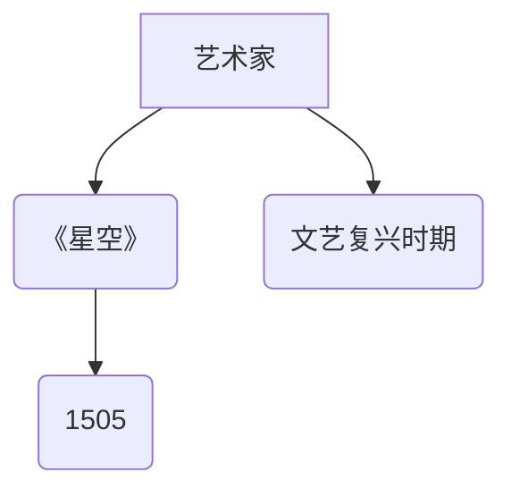

                 

### 《AI Agent在博物馆中的应用：智能导览与展品解说》

#### 关键词：AI Agent、博物馆、智能导览、展品解说、自然语言处理、图像识别、知识图谱

##### 摘要：
随着人工智能技术的不断发展，AI Agent在各个领域的应用日益广泛。本文主要探讨AI Agent在博物馆中的应用，特别是在智能导览和展品解说方面的潜力。通过深入分析AI Agent的基础知识、系统架构设计、算法原理以及实际应用案例，本文旨在为博物馆从业者提供一种新的技术应用思路，以提升博物馆的参观体验和展览质量。

## 《AI Agent在博物馆中的应用：智能导览与展品解说》目录大纲

### 第一部分：引言

#### 1.1 问题背景
- 博物馆导览和展品解说的现状
- 传统导览方式的局限性
- AI Agent在博物馆应用的价值

#### 1.2 书籍结构
- 全书内容概览
- 各章节核心内容与目标读者

### 第二部分：AI Agent基础知识

#### 2.1 AI Agent概述
- AI Agent的定义与分类
- AI Agent的基本功能

#### 2.2 自然语言处理
- 语言理解与生成
- 对话系统

#### 2.3 图像识别与处理
- 基本概念
- 应用案例

#### 2.4 知识图谱
- 知识图谱的基本原理
- 知识图谱在博物馆中的应用

### 第三部分：智能导览系统设计与实现

#### 3.1 导览系统的需求分析
- 博物馆导览的基本需求
- 用户研究

#### 3.2 系统架构设计
- 总体架构
- 功能模块划分

#### 3.3 数据处理与存储
- 数据来源
- 数据存储方案

#### 3.4 导览算法设计
- 导览路径优化
- 导览内容生成

#### 3.5 用户界面设计
- 界面布局
- 交互设计

### 第四部分：展品解说系统设计与实现

#### 4.1 解说系统的需求分析
- 展品解说需求
- 用户研究

#### 4.2 系统架构设计
- 总体架构
- 功能模块划分

#### 4.3 解说内容生成
- 展品信息抽取
- 解说文本生成

#### 4.4 用户交互设计
- 交互界面
- 用户反馈机制

### 第五部分：AI Agent在博物馆应用中的挑战与未来

#### 5.1 AI Agent在博物馆应用中的挑战
- 技术挑战
- 社会挑战

#### 5.2 博物馆应用中的AI Agent未来发展趋势
- 技术趋势
- 应用场景拓展

#### 5.3 结论与展望
- 本书总结
- 未来研究方向

### 附录：参考文献与拓展阅读

### 第一部分：引言

#### 1.1 问题背景

博物馆是文化传承和知识普及的重要场所，然而，传统的导览和展品解说方式存在一定的局限性。首先，博物馆导览通常依赖于人工讲解员，这种方式在时间上有限，且讲解内容相对固定，无法满足不同观众的需求。此外，人工讲解员在语言能力、知识深度和专业素养方面存在差异，可能会影响参观体验。

另一方面，展品解说也是一个挑战。许多展品具有独特的历史背景和文化内涵，传统解说方式难以生动、详细地传达这些信息。此外，一些特殊展品，如艺术品、古籍和文物，由于保护原因无法公开展示，观众无法直接接触和了解。

传统导览方式的局限性主要体现在以下几个方面：

1. **时间限制**：人工讲解员的工作时间和讲解内容受到限制，无法满足大量观众的需求。
2. **个性不足**：人工讲解员的知识和讲解风格相对固定，难以根据观众的个人需求和兴趣提供个性化的服务。
3. **信息传播不均**：讲解员可能无法深入讲解每个展品，导致一些重要信息被忽视。
4. **交互性不足**：观众与讲解员之间的互动有限，缺乏即时反馈和互动体验。

因此，引入AI Agent作为智能导览和展品解说工具，可以有效解决上述问题，提升博物馆的参观体验和展览质量。AI Agent可以基于自然语言处理、图像识别和知识图谱等技术，提供个性化、动态和互动的导览和解说服务，为观众带来全新的参观体验。

#### 1.2 书籍结构

本文旨在全面探讨AI Agent在博物馆中的应用，内容结构如下：

- **第一部分：引言**：介绍博物馆导览和展品解说的现状以及AI Agent的应用价值。
- **第二部分：AI Agent基础知识**：阐述AI Agent的定义、分类以及核心功能。
- **第三部分：智能导览系统设计与实现**：详细分析智能导览系统的需求、架构设计、算法和用户界面设计。
- **第四部分：展品解说系统设计与实现**：探讨展品解说系统的需求分析、系统架构设计、内容生成和用户交互设计。
- **第五部分：AI Agent在博物馆应用中的挑战与未来**：分析AI Agent在博物馆应用中的技术挑战和社会挑战，展望未来发展趋势。

通过本文的阅读，读者将系统地了解AI Agent在博物馆中的应用，掌握智能导览和展品解说系统的设计与实现方法，为博物馆从业者提供有益的参考和启示。

#### 2.1 AI Agent概述

AI Agent，即人工智能代理，是指具备自主思考、学习和交互能力的智能实体。它在人工智能领域具有重要地位，被认为是实现人机协作、自动化和智能化的重要载体。AI Agent可以应用于多个领域，如智能家居、智能客服、自动驾驶和智能制造等。本文重点探讨AI Agent在博物馆中的应用，特别是智能导览和展品解说。

首先，我们需要了解AI Agent的定义与分类。AI Agent可以分为以下几种类型：

1. **任务型Agent**：专注于完成特定任务的智能实体。例如，智能导览系统中的AI Agent，其主要功能是提供导览服务和回答用户问题。
2. **社交型Agent**：具备与人类进行交流能力，能够理解和生成自然语言，如智能客服系统。
3. **自主型Agent**：具备自我学习和适应能力，能够根据环境变化自主调整行为，如自动驾驶汽车。

每种类型的AI Agent都有其独特的功能和特点。任务型Agent适用于需要高效执行特定任务的场景，社交型Agent则在需要人类交流的场合表现出色，而自主型Agent则适用于复杂、动态的环境。

接下来，我们探讨AI Agent的基本功能。一个典型的AI Agent通常具备以下功能：

1. **感知环境**：通过传感器获取环境信息，如图像、声音和文本等。
2. **决策制定**：根据感知到的环境信息和预设的规则或学习到的策略，做出决策。
3. **执行动作**：根据决策结果执行相应的操作，如导航、回答问题和控制设备。
4. **学习与适应**：通过不断地与环境互动，学习新的知识和技能，以适应不同的场景和任务。

在博物馆应用中，AI Agent可以发挥以下作用：

1. **智能导览**：为观众提供个性化的导览服务，根据观众的需求和兴趣推荐展品和展览。
2. **展品解说**：利用自然语言处理和知识图谱技术，生成生动、详细的解说内容，帮助观众更好地理解展品。
3. **互动体验**：通过语音、图像和文本等多种方式与观众互动，提供实时反馈和个性化服务。

总之，AI Agent作为一种强大的智能实体，在博物馆中的应用具有巨大的潜力。通过深入了解AI Agent的定义、分类和基本功能，我们可以更好地理解和利用这项技术，为博物馆的参观体验带来革命性的变革。

#### 2.2 自然语言处理

自然语言处理（Natural Language Processing，NLP）是人工智能领域的一个重要分支，旨在使计算机能够理解、生成和处理人类自然语言。在博物馆的智能导览和展品解说系统中，NLP技术发挥着关键作用。通过NLP，AI Agent能够理解观众的问题和需求，生成自然流畅的解说内容，从而提供更加个性化和人性化的服务。

首先，NLP的核心任务包括语言理解（Language Understanding）和语言生成（Language Generation）。语言理解涉及从文本中提取结构化信息、理解语义和意图，而语言生成则是指根据给定信息生成自然语言的文本。

1. **语言理解**：

   语言理解是NLP的关键步骤，主要任务包括：

   - **词法分析（Lexical Analysis）**：将文本分解为词汇单元，如单词、短语等。
   - **句法分析（Syntactic Analysis）**：分析句子的结构，确定词语之间的语法关系。
   - **语义分析（Semantic Analysis）**：理解句子所表达的语义内容，包括词汇的含义、句子之间的关系等。
   - **意图识别（Intent Recognition）**：识别用户的问题意图，如查询信息、获取帮助等。

   在博物馆场景中，语言理解可以帮助AI Agent理解观众的问题，如“这幅画是哪个时期的作品？”或“这个展品有什么历史背景？”AI Agent通过解析这些问题，提取关键信息，为观众提供准确的回答。

2. **语言生成**：

   语言生成是将结构化信息转换为自然语言的文本。其主要任务包括：

   - **文本生成（Text Generation）**：根据给定信息生成自然语言文本，如介绍展品、回答问题等。
   - **问答系统（Question-Answering System）**：从大量信息中检索并生成针对特定问题的答案。

   在博物馆解说系统中，语言生成技术可以用于生成展品介绍、导览内容和解说文本。例如，当观众询问某件展品的历史背景时，AI Agent可以根据展品的属性和知识图谱，生成一段生动有趣的解说内容。

为了更好地实现这些功能，博物馆智能导览和展品解说系统通常采用以下技术：

- **词嵌入（Word Embedding）**：将词汇映射到高维空间中，以便计算机能够更好地处理和理解语义。
- **序列到序列模型（Seq2Seq Model）**：用于将输入序列转换为输出序列，常用于语言生成任务。
- **预训练语言模型（Pre-trained Language Model）**：如BERT、GPT等，通过在大规模语料库上预训练，可以显著提升语言理解与生成的效果。

在实际应用中，NLP技术不仅提高了AI Agent的理解和生成能力，还增强了系统的互动性和用户体验。例如，观众可以通过语音或文本与AI Agent进行自然对话，获取个性化、实时的信息和服务。

总之，自然语言处理技术在博物馆智能导览和展品解说系统中发挥着至关重要的作用。通过语言理解和生成，AI Agent能够更好地理解观众需求，提供个性化、人性化的服务，为博物馆参观体验带来革命性的变化。

#### 2.3 图像识别与处理

图像识别与处理是人工智能领域的重要分支，尤其在博物馆应用中具有广泛的前景。通过图像识别技术，AI Agent可以自动识别展品，提取关键信息，为观众提供更加丰富和详细的导览服务。

首先，我们来看一下图像识别的基本概念。图像识别是指利用计算机视觉技术，从图像中自动识别和分类对象的过程。其主要任务包括：

1. **物体检测（Object Detection）**：识别图像中的多个对象及其位置。
2. **图像分类（Image Classification）**：将图像整体分类为预定义的类别。
3. **语义分割（Semantic Segmentation）**：为图像中的每个像素分配类别标签。

接下来，我们讨论图像识别与处理的应用案例：

1. **展品识别**：AI Agent可以通过图像识别技术，识别博物馆中的展品。例如，当观众面对一幅画作时，AI Agent可以自动识别画作的名字、作者、创作年代等详细信息。这种自动识别功能不仅节省了观众的时间，还提供了更加便捷和个性化的导览服务。
   
2. **展品分类**：通过图像分类技术，AI Agent可以对展品进行分类，如艺术品、历史文物、自然标本等。这种分类可以帮助博物馆更好地管理和展示展品，同时为观众提供更有针对性的导览信息。

3. **交互式导览**：图像识别技术还可以用于实现交互式导览体验。例如，观众可以通过拍照或上传照片，请求AI Agent提供相关信息。AI Agent可以识别照片中的展品，生成解说文本，并推荐相关的展品和展览。

为了实现这些功能，图像识别与处理需要依赖多种技术，包括：

- **深度学习模型**：如卷积神经网络（CNN），用于特征提取和分类。
- **目标检测算法**：如YOLO、SSD等，用于识别图像中的多个对象。
- **图像处理算法**：如图像增强、去噪、边缘检测等，用于提高图像质量和识别效果。

在具体实现中，AI Agent会首先通过摄像头或图像输入接口获取展品图像，然后利用深度学习模型进行特征提取和分类。接着，AI Agent可以结合知识图谱中的信息，生成详细的解说文本，并与观众进行交互。

总之，图像识别与处理技术为博物馆的智能导览和展品解说提供了强大的支持。通过自动识别和分类展品，AI Agent能够为观众提供更加丰富和个性化的导览服务，提升博物馆的参观体验。

#### 2.4 知识图谱

知识图谱是一种用于表示实体及其相互关系的数据结构，它通过节点和边来描述知识实体和其属性、关系。在博物馆应用中，知识图谱能够有效地组织和管理大量展品信息，为AI Agent提供丰富的知识来源，从而提升智能导览和展品解说的效果。

首先，我们来看一下知识图谱的基本原理。知识图谱由实体、属性和关系组成：

1. **实体（Entity）**：代表具体的对象，如博物馆中的展品、艺术家、历史事件等。
2. **属性（Attribute）**：描述实体的特征，如展品的名称、创作年代、作者等。
3. **关系（Relationship）**：表示实体之间的关联，如“艺术家创作展品”、“展品属于某个时期”等。

一个典型的知识图谱示例如图所示：



在这个示例中，实体包括艺术家（A）、展品（《星空》）和时期（文艺复兴时期）；属性包括创作年代（C）和所属时期（D）；关系包括“艺术家创作展品”和“展品属于某个时期”。

接下来，我们探讨知识图谱在博物馆中的应用：

1. **展品信息管理**：知识图谱可以用于组织和管理博物馆中的大量展品信息。例如，通过知识图谱，AI Agent可以快速查找某件展品的相关信息，如作者、年代、历史背景等。这有助于提高信息检索的效率和准确性。

2. **关系发现与推理**：知识图谱中的实体和关系使得AI Agent可以进行复杂的逻辑推理和关系发现。例如，当观众询问某件展品的历史背景时，AI Agent可以通过知识图谱中的关系，推导出相关的历史事件和人物，从而提供更加丰富和详细的解说内容。

3. **个性化推荐**：基于知识图谱，AI Agent可以识别观众对展品的兴趣和需求，为其推荐相关的展品和展览。例如，如果观众对文艺复兴时期的艺术品感兴趣，AI Agent可以推荐其他相关艺术家和展品，从而提供更加个性化的导览服务。

为了构建和利用知识图谱，博物馆需要收集和整理大量的展品信息，并将其转化为结构化的数据。这个过程通常包括以下步骤：

- **数据收集**：从各种来源（如文献、数据库、图像等）收集展品信息。
- **数据清洗**：处理和清洗收集到的数据，去除重复和错误信息。
- **数据建模**：根据实体、属性和关系的定义，构建知识图谱模型。
- **数据导入**：将结构化的数据导入知识图谱数据库，进行存储和管理。

在实际应用中，知识图谱可以通过各种工具和技术进行构建和查询。例如，Apache Jena和Neo4j等知识图谱平台提供了强大的数据管理和查询功能，使AI Agent能够高效地利用知识图谱中的信息。

总之，知识图谱为博物馆的智能导览和展品解说提供了重要的技术支持。通过组织和管理展品信息，知识图谱使得AI Agent能够为观众提供更加丰富、准确和个性化的导览服务，提升博物馆的参观体验。

#### 3.1 导览系统的需求分析

在设计智能导览系统时，深入分析博物馆导览的基本需求是至关重要的。这不仅有助于明确系统的功能定位，还能确保系统设计符合用户需求，提升参观体验。

首先，博物馆导览的基本需求可以从以下几个方面进行探讨：

1. **信息提供**：导览系统应提供详细的展品信息，包括名称、历史背景、艺术价值等。这有助于观众更好地理解展品，提升参观体验。
2. **路径规划**：系统应能够根据观众的需求和兴趣，提供个性化的导览路径。例如，对于历史爱好者，系统可以推荐与历史事件相关的展品。
3. **交互性**：导览系统应支持与观众的互动，如语音问答、文本输入等。这有助于观众在参观过程中随时获取所需信息。
4. **可定制性**：导览系统应允许观众根据个人兴趣定制导览内容，如选择特定主题的导览路线、关注特定展品等。
5. **多语言支持**：为满足不同观众的多元需求，导览系统应支持多种语言，包括中文、英文、法语等。
6. **易用性**：导览系统应具备简洁友好的用户界面，确保观众能够快速上手和使用。

在了解基本需求后，我们需要进行用户研究，以深入了解观众的需求和期望。以下方法可以用于用户研究：

1. **问卷调查**：通过设计问卷调查，收集观众对导览系统的需求和期望。问卷可以包含选择题、评分题和开放性问题，以全面了解观众的需求。
2. **用户访谈**：与观众进行一对一访谈，深入了解他们的参观习惯、兴趣点和对现有导览方式的满意度。访谈过程中，可以记录观众的反馈和建议。
3. **用户观察**：在博物馆现场观察观众的行为和互动，记录他们在参观过程中的需求和困惑。这种方法有助于发现用户在使用导览系统时的实际问题和需求。
4. **原型测试**：设计导览系统的原型，邀请观众进行试用，并收集他们的反馈。这种方法可以直观地了解用户对系统界面、功能和交互方式的感受。

通过上述用户研究方法，我们可以获得以下关键发现：

- **个性化需求**：观众普遍希望导览系统能够根据他们的兴趣和需求提供个性化的导览内容。例如，艺术爱好者希望更多地了解艺术品的历史背景和艺术价值。
- **交互性需求**：观众希望导览系统能够提供实时互动，如语音问答、文本输入等。这有助于在参观过程中随时获取所需信息。
- **多语言支持**：观众希望导览系统能够支持多种语言，以便不同国家的游客能够顺利使用。
- **易用性需求**：观众希望导览系统的界面简洁、易用，操作简单，便于快速上手。

基于用户研究的发现，我们可以明确智能导览系统的功能需求：

1. **个性化导览**：系统能够根据观众的身份信息和兴趣标签，提供个性化的导览内容和路径规划。
2. **实时互动**：系统支持语音问答、文本输入等功能，观众可以在参观过程中随时获取信息。
3. **多语言支持**：系统提供多种语言选项，满足不同观众的需求。
4. **简洁易用**：系统界面简洁，操作简单，确保观众能够快速上手。

通过深入分析博物馆导览的基本需求和进行用户研究，我们可以为智能导览系统的设计和实现提供可靠依据，确保系统能够满足观众的需求，提升博物馆的参观体验。

#### 3.2 系统架构设计

智能导览系统是一个复杂的多模块系统，涉及多个关键组件和功能模块。为了确保系统的稳定性和扩展性，我们需要进行详细的系统架构设计。以下是智能导览系统的总体架构设计及其功能模块划分。

**3.2.1 总体架构**

智能导览系统的总体架构可以分为四个主要层次：数据层、服务层、应用层和展示层。

1. **数据层**：数据层是系统的基石，负责数据存储和管理。主要包括数据库和数据仓库，用于存储展品信息、用户数据、导览路径和知识点等。
   
2. **服务层**：服务层负责业务逻辑处理和功能实现。主要包括以下服务模块：
   - **自然语言处理服务（NLP）**：用于处理用户输入，实现语音识别、文本理解、意图识别等功能。
   - **图像识别服务**：用于处理图像输入，实现展品识别、图像分类等功能。
   - **知识图谱服务**：用于构建和管理知识图谱，实现关系发现和推理等功能。
   - **导览路径规划服务**：用于根据用户需求生成个性化导览路径。
   - **内容生成服务**：用于生成展品解说文本和导览内容。

3. **应用层**：应用层是系统与用户交互的界面，主要包括以下功能模块：
   - **导览客户端**：提供用户交互界面，实现导览路径规划、内容展示、互动问答等功能。
   - **管理后台**：提供管理员界面，实现用户管理、内容管理、系统监控等功能。

4. **展示层**：展示层是系统的最终呈现形式，主要包括以下界面：
   - **导览界面**：展示个性化导览路径和内容，提供语音、文本等多种互动方式。
   - **展品详情界面**：展示展品详细信息，包括历史背景、艺术价值等。
   - **用户反馈界面**：收集用户反馈，用于系统优化和改进。

**3.2.2 功能模块划分**

智能导览系统的功能模块划分如下：

1. **自然语言处理模块**：
   - **语音识别**：将用户语音转换为文本。
   - **文本理解**：解析文本，提取关键信息和意图。
   - **意图识别**：判断用户请求的类型，如查询信息、获取帮助等。

2. **图像识别模块**：
   - **图像分类**：对用户上传的图像进行分类，识别展品类型。
   - **物体检测**：在图像中检测展品，并标注其位置。

3. **知识图谱模块**：
   - **知识抽取**：从文本数据中提取实体和关系，构建知识图谱。
   - **关系推理**：基于知识图谱进行逻辑推理，提供相关联的信息。

4. **导览路径规划模块**：
   - **路径生成**：根据用户需求和兴趣，生成个性化导览路径。
   - **路径优化**：根据实时数据，优化导览路径，避免拥堵和等待。

5. **内容生成模块**：
   - **解说文本生成**：基于展品信息和知识图谱，生成详细的解说文本。
   - **导览内容推荐**：根据用户兴趣和历史行为，推荐相关导览内容。

6. **用户交互模块**：
   - **语音交互**：实现语音问答功能，提供实时信息和服务。
   - **文本交互**：支持文本输入，实现与用户的文本对话。

7. **用户管理模块**：
   - **用户注册与登录**：提供用户注册和登录功能。
   - **用户资料管理**：管理用户个人信息和兴趣标签。

8. **系统监控与维护模块**：
   - **系统监控**：实时监控系统运行状态，确保系统稳定。
   - **日志记录**：记录系统运行日志，便于问题排查和优化。

通过上述系统架构设计和功能模块划分，智能导览系统可以实现高效、稳定和灵活的运行，为观众提供个性化、实时和互动的导览服务。这不仅提升了博物馆的参观体验，也为智能导览技术的进一步发展奠定了基础。

#### 3.3 数据处理与存储

在智能导览系统中，数据处理与存储是确保系统高效运行和功能实现的关键环节。首先，我们需要明确数据来源，然后讨论数据存储方案，确保系统在数据采集、处理和存储过程中保持高效、安全和可靠。

**3.3.1 数据来源**

智能导览系统涉及多种数据来源，主要包括：

1. **展品信息**：展品信息是系统的基础数据，包括展品的名称、年代、作者、历史背景、艺术价值等。这些数据可以从博物馆的数据库、文献资料和展览介绍中获取。
2. **用户数据**：用户数据包括用户的兴趣标签、访问记录、交互历史等。这些数据可以通过用户注册、导览记录和互动问答等方式收集。
3. **环境数据**：环境数据包括博物馆的实时环境信息，如参观人数、展品热度、导览路径拥堵情况等。这些数据可以通过传感器、摄像头和位置追踪技术获取。
4. **图像数据**：图像数据包括用户上传的展品图像和摄像头捕捉的现场图像。这些数据用于图像识别和对象检测，以提供更直观的导览服务。

**3.3.2 数据处理**

数据处理是智能导览系统的核心任务，主要包括以下步骤：

1. **数据清洗**：清洗原始数据，去除重复、错误和无关信息，确保数据质量。例如，去除图像中的噪声、纠正文本中的错别字等。
2. **数据预处理**：对数据进行标准化处理，如将不同格式的数据转换为统一的格式，将文本数据转换为词嵌入向量等。这有助于提高数据在后续处理中的可用性。
3. **数据融合**：将来自不同来源的数据进行整合，构建统一的视图。例如，将用户数据与展品信息结合，生成个性化的导览内容。
4. **特征提取**：从数据中提取关键特征，用于模型训练和推理。例如，从图像数据中提取纹理、颜色和形状特征，从文本数据中提取关键词和语义特征。

**3.3.3 数据存储方案**

为了保证系统的效率和数据安全，智能导览系统采用以下数据存储方案：

1. **关系数据库**：关系数据库（如MySQL、PostgreSQL）用于存储结构化数据，如展品信息、用户数据和导览路径等。关系数据库的优点是数据结构清晰、查询速度快，适合存储和管理大量关系紧密的数据。
2. **图数据库**：图数据库（如Neo4j）用于存储和管理知识图谱，存储实体和关系。图数据库的优点是能够高效处理复杂的关系网络，支持快速的关系查询和路径搜索，适合用于知识图谱的构建和管理。
3. **NoSQL数据库**：NoSQL数据库（如MongoDB、Redis）用于存储非结构化数据，如用户行为数据、环境数据和图像数据等。NoSQL数据库的优点是数据模型灵活、扩展性强，适合存储和管理大量结构化程度较低的数据。
4. **数据仓库**：数据仓库（如Hadoop、Spark）用于存储和管理大规模数据集，进行数据分析和挖掘。数据仓库的优点是能够处理海量数据、支持实时数据处理和分析，适合用于数据融合和深度学习模型的训练。

通过上述数据处理与存储方案，智能导览系统可以高效、安全地管理各种类型的数据，确保系统在数据采集、处理和存储过程中保持高效、稳定和可靠。这不仅提升了系统的运行效率，也为智能导览功能的实现提供了坚实的数据基础。

#### 3.4 导览算法设计

智能导览系统的核心在于其算法设计，能够根据用户的需求和兴趣，提供个性化的导览路径和内容。以下是导览算法的设计思路和实现步骤。

**3.4.1 导览路径优化算法**

导览路径优化算法旨在为用户提供最佳导览路径，考虑多种因素，如展品的热度、用户的位置、导览时间等。具体步骤如下：

1. **用户兴趣识别**：系统首先通过自然语言处理技术，识别用户的兴趣标签和关键词。例如，如果用户提到对“文艺复兴时期”感兴趣，系统会将这一信息作为用户的兴趣点。

2. **路径生成**：系统根据用户兴趣和博物馆中的展品信息，生成初步的导览路径。该路径可能包含多个展品，但未考虑具体的顺序和距离。

3. **路径优化**：系统使用最短路径算法（如Dijkstra算法）或遗传算法，对初步导览路径进行优化。优化目标是最小化路径的总长度、最大程度满足用户兴趣。具体步骤如下：
   - **路径长度计算**：计算每个展品之间的距离，考虑实际路线和路径拥堵情况。
   - **兴趣度评估**：根据用户兴趣标签和展品属性，计算每个展品对用户的兴趣度。
   - **优化目标函数**：构建目标函数，综合路径长度和兴趣度，优化导览路径。

**3.4.2 导览内容生成算法**

导览内容生成算法负责生成详细的解说文本和导览内容，提高用户的参观体验。具体步骤如下：

1. **展品信息抽取**：系统从展品数据库中提取展品的详细信息，如名称、作者、年代、历史背景、艺术价值等。

2. **知识图谱构建**：系统利用知识图谱技术，将展品信息构建为知识图谱。知识图谱中的节点表示展品，边表示展品之间的关系，如“作者”、“所属时期”等。

3. **文本生成**：系统使用生成对抗网络（GAN）或转换器（Transformer）等深度学习模型，根据用户兴趣和知识图谱，生成详细的解说文本。具体步骤如下：
   - **模板匹配**：根据用户兴趣，选择合适的文本模板，填充展品信息。
   - **语言生成**：使用生成模型，生成自然流畅的文本，描述展品和历史背景。
   - **内容优化**：通过文本编辑和优化算法，提高解说文本的质量和可读性。

**3.4.3 算法实现示例**

以下是一个简单的导览算法实现示例，使用Python代码和Mermaid图表示算法流程。

```python
# 导览算法实现示例

# 导入所需库
import numpy as np
import networkx as nx
from transformers import GPT2LMHeadModel, GPT2Tokenizer

# 用户兴趣识别
user_interest = "文艺复兴时期"

# 展品信息抽取
exhibits = {
    "达芬奇": {"年代": "15世纪", "艺术价值": "高"},
    "米开朗基罗": {"年代": "16世纪", "艺术价值": "高"},
}

# 知识图谱构建
G = nx.Graph()
for exhibit, info in exhibits.items():
    G.add_node(exhibit, **info)
    G.add_edge(exhibit, "文艺复兴时期")

# 导览路径生成与优化
# 假设用户当前位于博物馆大厅
start = "大厅"
end = "达芬奇"

# 路径优化（使用最短路径算法）
optimized_path = nx.shortest_path(G, source=start, target=end, weight='weight')

# 导览内容生成
tokenizer = GPT2Tokenizer.from_pretrained("gpt2")
model = GPT2LMHeadModel.from_pretrained("gpt2")

# 根据用户兴趣和路径生成导览内容
prompt = f"探索文艺复兴时期的艺术作品，从{start}出发，首先参观{optimized_path[0]},该作品由{exhibits[optimized_path[0]]['作者']}创作，具有{exhibits[optimized_path[0]]['艺术价值']}的艺术价值。接下来，您将参观{optimized_path[1]},同样值得一看。"
input_ids = tokenizer.encode(prompt, return_tensors='pt')

# 生成导览内容
outputs = model.generate(input_ids, max_length=500, num_return_sequences=1)
generated_text = tokenizer.decode(outputs[0], skip_special_tokens=True)

print(generated_text)
```

该示例首先识别用户的兴趣标签，然后从展品数据库中抽取相关信息，构建知识图谱。使用最短路径算法优化导览路径，最后利用生成模型生成详细的导览内容。通过这种方式，智能导览系统能够为用户提供个性化、高质量的导览服务。

总之，导览算法的设计与实现是智能导览系统的核心，通过路径优化和内容生成算法，系统能够根据用户的需求和兴趣，提供高质量的导览服务，提升博物馆的参观体验。

#### 3.5 用户界面设计

用户界面（UI）设计是智能导览系统的重要组成部分，直接影响用户的操作体验和系统满意度。一个优秀的设计应具备简洁、直观和用户友好的特点，确保用户能够轻松上手和使用系统。

**3.5.1 界面布局**

智能导览系统的界面布局可以分为以下几个主要部分：

1. **顶部导航栏**：包括系统名称、用户头像、语言切换按钮和帮助中心链接。导航栏提供全局导航功能，方便用户快速切换页面和功能。
2. **左侧菜单栏**：列出主要功能模块，如“导览路径”、“展品介绍”、“互动问答”和“个性化推荐”。菜单栏设计为折叠式，以节省空间，提高界面整洁度。
3. **中间内容区域**：展示导览内容、展品详情和用户互动界面。该区域可以根据不同的场景动态调整内容布局，确保信息展示清晰。
4. **底部操作栏**：提供常用操作按钮，如“开始导览”、“拍照识别”和“用户反馈”。底部操作栏设计为悬浮式，用户在浏览内容时能够随时访问。

**3.5.2 交互设计**

交互设计是用户界面的核心，决定了用户的操作体验。以下是一些关键点：

1. **响应速度**：系统应具备快速响应能力，确保用户操作后的反馈及时。例如，点击按钮后，界面应立即显示相应的操作结果。
2. **触摸优化**：考虑到用户可能使用手机或平板电脑进行导览，界面设计应充分考虑触摸操作的便利性。例如，按钮和链接应设计得足够大，避免误触。
3. **可视化**：通过图表、图像和动画等视觉元素，增强界面信息展示的直观性和趣味性。例如，在导览路径规划时，可以采用地图和路线图，使路径更加清晰易懂。
4. **导航提示**：在用户操作过程中，界面应提供清晰的导航提示，帮助用户理解如何使用系统。例如，在用户输入查询时，可以显示相关关键词和搜索建议。
5. **错误处理**：界面设计应包含错误处理机制，例如当用户输入无效数据时，系统应提示用户并给出解决方案。

**3.5.3 实现示例**

以下是一个简单的用户界面设计实现示例，使用HTML、CSS和JavaScript构建。

```html
<!DOCTYPE html>
<html lang="zh">
<head>
    <meta charset="UTF-8">
    <meta name="viewport" content="width=device-width, initial-scale=1.0">
    <title>智能导览系统</title>
    <style>
        body {
            font-family: Arial, sans-serif;
            margin: 0;
            padding: 0;
        }
        .navbar {
            background-color: #333;
            overflow: hidden;
        }
        .navbar a {
            float: left;
            display: block;
            color: white;
            text-align: center;
            padding: 14px 16px;
            text-decoration: none;
        }
        .navbar a:hover {
            background-color: #ddd;
            color: black;
        }
        .menu {
            display: flex;
            flex-direction: column;
            position: fixed;
            left: 0;
            top: 60px;
            width: 200px;
            background-color: #f9f9f9;
            padding: 20px;
        }
        .content {
            margin-left: 220px;
            padding: 20px;
        }
        .footer {
            background-color: #333;
            color: white;
            text-align: center;
            padding: 10px;
            position: absolute;
            bottom: 0;
            width: 100%;
        }
    </style>
</head>
<body>
    <div class="navbar">
        <a href="#home">首页</a>
        <a href="#news">新闻</a>
        <a href="#contact">联系我们</a>
        <a href="#about">关于我们</a>
    </div>
    <div class="menu">
        <a href="#exhibit">展品介绍</a>
        <a href="#guide">导览路径</a>
        <a href="#question">互动问答</a>
        <a href="#recommend">个性化推荐</a>
    </div>
    <div class="content">
        <h1>欢迎来到智能导览系统</h1>
        <p>这里为您提供个性化的导览服务和丰富的展品信息。</p>
    </div>
    <div class="footer">
        © 2023 智能导览系统
    </div>
</body>
</html>
```

该示例展示了基本的界面布局和交互设计。通过合理的设计和实现，智能导览系统的用户界面能够为用户提供便捷、高效的导览服务，提升参观体验。

### 4.1 展品解说系统的需求分析

展品解说系统是博物馆智能导览系统的重要组成部分，其主要目标是向观众提供详细、生动且富有教育意义的解说内容。为了确保解说系统能够满足用户需求，我们需要从展品解说需求、用户研究两个方面进行深入分析。

**4.1.1 展品解说需求**

在博物馆中，展品解说需求具有多样性和复杂性。首先，展品种类繁多，包括艺术品、历史文物、自然标本等，每种展品都有其独特的背景和故事。因此，解说系统需要能够处理多种类型的展品信息，生成相应的解说内容。

其次，观众对解说内容的需求也各不相同。例如，儿童观众可能对有趣的故事和生动的描述更感兴趣，而专业观众可能希望了解更多关于展品的技术细节和历史背景。此外，不同年龄段、文化背景和兴趣爱好的观众对解说内容的深度和形式也有不同的期望。

为了满足这些需求，解说系统应具备以下功能：

1. **多语言解说**：提供多种语言选项，满足不同国家和地区的观众需求。
2. **个性化解说**：根据观众的兴趣和需求，提供定制化的解说内容，提高观众的参与度和满意度。
3. **实时更新**：能够实时获取和更新展品信息，确保解说内容的准确性和时效性。
4. **多媒体支持**：结合图像、音频、视频等多媒体元素，使解说内容更加生动有趣。

**4.1.2 用户研究**

为了深入了解观众对展品解说系统的需求，我们需要进行用户研究，收集观众的意见和建议。以下方法可以用于用户研究：

1. **问卷调查**：设计问卷，收集观众对解说系统的满意度、需求和建议。问卷可以包含选择题、评分题和开放性问题，全面了解观众的观点。
2. **用户访谈**：与观众进行一对一访谈，深入了解他们的参观习惯、解说需求和对现有解说系统的评价。访谈过程中，可以记录观众的反馈和建议。
3. **用户观察**：在博物馆现场观察观众的行为和互动，记录他们在观看解说内容时的反应和需求。这种方法有助于发现用户在使用解说系统时的实际问题和需求。
4. **原型测试**：设计解说系统的原型，邀请观众进行试用，并收集他们的反馈。这种方法可以直观地了解用户对系统界面、功能和交互方式的感受。

通过用户研究，我们获得了以下关键发现：

- **个性化需求**：观众普遍希望解说系统能够根据他们的兴趣和需求提供个性化的解说内容。例如，艺术爱好者希望了解更多艺术品的历史背景和艺术价值，而历史爱好者则希望了解展品背后的故事和背景。
- **多语言支持**：观众希望解说系统能够支持多种语言，特别是对非中文母语的观众来说，这尤为重要。
- **实时更新**：观众希望解说系统能够实时更新展品信息，确保解说内容的准确性和时效性。
- **多媒体支持**：观众对多媒体解说形式表示认可，认为这可以增强解说内容的趣味性和可理解性。

基于用户研究的发现，我们可以明确展品解说系统的功能需求：

1. **多语言解说**：系统应提供多种语言选项，满足不同观众的需求。
2. **个性化解说**：系统能够根据观众的身份信息和兴趣标签，提供个性化的解说内容。
3. **实时更新**：系统应能够实时获取和更新展品信息，确保解说内容的准确性和时效性。
4. **多媒体支持**：系统应结合图像、音频、视频等多媒体元素，增强解说内容的生动性和趣味性。

通过深入分析展品解说需求和进行用户研究，我们可以为展品解说系统的设计和实现提供可靠依据，确保系统能够满足观众的需求，提升博物馆的参观体验。

### 4.2 系统架构设计

展品解说系统的设计目标是实现一个高效、灵活且可扩展的架构，以满足多样化的解说需求。系统架构的设计需考虑功能模块的划分、各模块的交互方式以及系统的可扩展性。以下是展品解说系统的总体架构设计及其功能模块划分。

**4.2.1 总体架构**

展品解说系统的总体架构可以分为四个主要层次：数据层、服务层、应用层和展示层。

1. **数据层**：数据层是系统的基石，负责数据存储和管理。主要包括数据库和数据仓库，用于存储展品信息、用户数据、解说内容等。
   
2. **服务层**：服务层负责业务逻辑处理和功能实现。主要包括以下服务模块：
   - **自然语言处理服务（NLP）**：用于处理用户输入，实现语音识别、文本理解、意图识别等功能。
   - **图像识别服务**：用于处理图像输入，实现展品识别、图像分类等功能。
   - **知识图谱服务**：用于构建和管理知识图谱，实现关系发现和推理等功能。
   - **解说内容生成服务**：用于根据展品信息和用户需求生成详细的解说内容。
   - **用户管理服务**：用于管理用户账号、兴趣标签、访问记录等。

3. **应用层**：应用层是系统与用户交互的界面，主要包括以下功能模块：
   - **解说客户端**：提供用户交互界面，实现解说内容的展示、语音和文本输入等功能。
   - **管理后台**：提供管理员界面，实现用户管理、解说内容管理、系统监控等功能。

4. **展示层**：展示层是系统的最终呈现形式，主要包括以下界面：
   - **解说界面**：展示详细的解说内容，提供语音、文本等多种互动方式。
   - **用户反馈界面**：收集用户反馈，用于系统优化和改进。

**4.2.2 功能模块划分**

展品解说系统的功能模块划分如下：

1. **自然语言处理模块**：
   - **语音识别**：将用户语音转换为文本。
   - **文本理解**：解析文本，提取关键信息和意图。
   - **意图识别**：判断用户请求的类型，如获取解说内容、提问等。

2. **图像识别模块**：
   - **图像分类**：对用户上传的图像进行分类，识别展品类型。
   - **物体检测**：在图像中检测展品，并标注其位置。

3. **知识图谱模块**：
   - **知识抽取**：从文本数据中提取实体和关系，构建知识图谱。
   - **关系推理**：基于知识图谱进行逻辑推理，提供相关联的信息。

4. **解说内容生成模块**：
   - **展品信息处理**：提取展品的名称、年代、作者、历史背景等关键信息。
   - **文本生成**：根据展品信息和用户需求，生成详细的解说文本。
   - **多媒体整合**：结合图像、音频、视频等多媒体元素，增强解说内容的生动性。

5. **用户交互模块**：
   - **语音交互**：实现语音问答功能，提供实时信息和服务。
   - **文本交互**：支持文本输入，实现与用户的文本对话。

6. **用户管理模块**：
   - **用户注册与登录**：提供用户注册和登录功能。
   - **用户资料管理**：管理用户个人信息和兴趣标签。

7. **系统监控与维护模块**：
   - **系统监控**：实时监控系统运行状态，确保系统稳定。
   - **日志记录**：记录系统运行日志，便于问题排查和优化。

通过上述系统架构设计和功能模块划分，展品解说系统可以实现高效、稳定和灵活的运行，为观众提供个性化、实时和互动的解说服务。这不仅提升了博物馆的参观体验，也为解说系统的进一步发展奠定了基础。

### 4.3 解说内容生成

解说内容生成是展品解说系统的核心功能，其目标是根据展品信息和用户需求，生成详细、生动且富有教育意义的解说文本。以下是解说内容生成的基本原理、技术实现和生成流程。

**4.3.1 基本原理**

解说内容生成主要依赖于自然语言处理（NLP）和知识图谱技术。基本原理包括以下几步：

1. **信息抽取**：从展品信息中提取关键信息，如名称、年代、作者、历史背景等。
2. **知识融合**：将提取的信息与知识图谱中的相关关系进行融合，形成语义丰富的数据结构。
3. **文本生成**：根据融合后的数据，生成详细的解说文本。

**4.3.2 技术实现**

1. **自然语言处理（NLP）**：

   - **词法分析**：将展品信息分解为词汇单元，如单词、短语等。
   - **句法分析**：分析句子的结构，确定词语之间的语法关系。
   - **语义分析**：理解句子所表达的语义内容，包括词汇的含义、句子之间的关系等。
   - **实体识别**：识别展品、作者、年代等实体。
   - **关系抽取**：提取实体之间的关系，如“作者创作展品”、“展品属于某个时期”等。

2. **知识图谱**：

   - **知识构建**：从文本数据中提取实体和关系，构建知识图谱。例如，将展品的名称、年代、作者等信息表示为知识图谱中的节点和边。
   - **知识融合**：将提取的实体和关系与知识图谱进行融合，形成语义丰富的数据结构。
   - **知识推理**：基于知识图谱进行逻辑推理，获取相关联的信息。

3. **文本生成**：

   - **模板匹配**：根据用户需求和知识图谱，选择合适的文本模板，填充相关信息。
   - **生成模型**：使用生成对抗网络（GAN）或转换器（Transformer）等深度学习模型，生成详细的解说文本。

**4.3.3 生成流程**

解说内容生成的具体流程如下：

1. **用户输入**：用户通过语音或文本输入查询或请求解说内容。例如，用户可以说“我想了解这幅画的背景”或输入文本“这幅画是谁创作的？”。
2. **信息抽取**：系统使用NLP技术对用户输入进行处理，提取关键信息。例如，识别用户提到的“这幅画”和“背景”。
3. **知识融合**：系统将提取的信息与知识图谱中的相关关系进行融合。例如，找到这幅画的相关信息，包括作者、创作年代等。
4. **文本生成**：系统根据用户输入和融合后的信息，使用文本生成模型生成解说文本。例如，如果这幅画是达芬奇的，系统可以生成：“这幅画是达芬奇于15世纪创作的，描绘了……”
5. **输出展示**：系统将生成的解说文本展示给用户，可以通过语音合成或文本显示。

通过上述生成流程，展品解说系统能够根据用户的需求和兴趣，生成高质量的解说内容，为用户提供丰富的参观体验。

#### 4.4 用户交互设计

用户交互设计在展品解说系统中起着至关重要的作用，直接影响用户的体验和满意度。一个良好的用户交互设计应考虑用户的需求和行为习惯，提供直观、便捷的交互方式，从而提升系统的易用性和用户参与度。

**4.4.1 交互界面**

展品解说系统的交互界面主要包括以下几个部分：

1. **主界面**：主界面是用户进入系统后的第一个页面，通常包含以下几个模块：
   - **展品列表**：展示所有可解说的展品，用户可以通过滑动或搜索快速找到感兴趣的展品。
   - **搜索框**：用户可以输入关键词或展品名称，系统将自动提供相关展品的搜索结果。
   - **筛选和排序**：用户可以通过筛选和排序功能，根据展品类型、年代、作者等条件筛选出感兴趣的内容。
   - **导览路径**：系统提供个性化的导览路径推荐，用户可以一键导航到指定展品。

2. **展品详情界面**：用户点击展品列表中的展品，进入展品详情界面，该界面包含以下模块：
   - **展品图片**：展示展品的缩略图，用户可以放大查看。
   - **解说文本**：展示展品的详细解说内容，包括历史背景、艺术价值、技术特点等。
   - **音频播放**：提供解说文本的音频播放功能，用户可以听解说内容。
   - **互动问答**：用户可以提出问题，系统将根据知识图谱和自然语言处理技术给出答案。

3. **用户反馈界面**：用户可以在使用系统后进行反馈，包括满意度评分、意见建议和故障报告等。系统将收集用户的反馈，用于优化和改进。

**4.4.2 交互设计原则**

1. **直观性**：界面设计应简洁明了，用户能够迅速理解各模块的功能和操作方式，减少学习成本。

2. **便捷性**：交互设计应考虑用户的便捷性，提供快速访问和操作的功能，如快捷键、下拉菜单等。

3. **一致性**：系统应保持界面元素的一致性，如按钮样式、字体大小、颜色等，使用户在操作过程中不会感到困惑。

4. **反馈性**：系统应提供及时的操作反馈，如按钮点击后的视觉变化、加载进度条等，增强用户的操作信心。

**4.4.3 实现示例**

以下是一个简单的用户交互界面设计实现示例，使用HTML、CSS和JavaScript构建。

```html
<!DOCTYPE html>
<html lang="zh">
<head>
    <meta charset="UTF-8">
    <meta name="viewport" content="width=device-width, initial-scale=1.0">
    <title>展品解说系统</title>
    <style>
        body {
            font-family: Arial, sans-serif;
            margin: 0;
            padding: 0;
        }
        .container {
            display: flex;
            flex-direction: column;
            height: 100vh;
        }
        .header {
            background-color: #333;
            color: white;
            text-align: center;
            padding: 10px;
        }
        .search-bar {
            margin: 10px;
            padding: 5px;
            border: 1px solid #ddd;
        }
        .exhibit-list {
            margin: 10px;
            padding: 10px;
        }
        .exhibit-item {
            border-bottom: 1px solid #ddd;
            padding: 5px;
        }
        .exhibit-item:hover {
            background-color: #f9f9f9;
        }
        .exhibit-detail {
            margin: 10px;
            padding: 10px;
        }
    </style>
</head>
<body>
    <div class="container">
        <div class="header">展品解说系统</div>
        <input type="text" class="search-bar" placeholder="搜索展品...">
        <div class="exhibit-list">
            <div class="exhibit-item">《清明上河图》</div>
            <div class="exhibit-item">《蒙娜丽莎》</div>
            <div class="exhibit-item">《簪花仕女图》</div>
        </div>
        <div class="exhibit-detail">
            <h2>《清明上河图》</h2>
            <p>这是一幅描绘北宋都城汴京（今河南开封）市井繁华景象的画作，作者为张择端。</p>
            <button onclick="playAudio()">播放音频</button>
        </div>
    </div>
    <script>
        function playAudio() {
            // 此处应添加播放音频的代码
            alert('正在播放音频...');
        }
    </script>
</body>
</html>
```

该示例展示了基本的用户交互界面设计，包括搜索栏、展品列表和展品详情界面。通过合理的设计和实现，展品解说系统可以提供便捷、直观的用户交互体验，提升用户的参观体验。

### 5.1 AI Agent在博物馆应用中的挑战

AI Agent在博物馆中的应用尽管具有巨大潜力，但在实际操作中仍面临多种挑战。这些挑战可以分为技术挑战和社会挑战两大类。

#### 5.1.1 技术挑战

1. **数据质量和完整性**：
   博物馆中展品信息丰富多样，但数据质量参差不齐。许多展品的信息可能不完整、不准确，甚至存在错误。这给AI Agent的训练和知识图谱构建带来了困难。例如，一些历史文物可能缺乏详细的资料，导致AI Agent无法提供全面的解说内容。

2. **实时数据处理**：
   博物馆的实时环境信息（如参观人数、导览路径拥堵情况）需要快速、准确的处理和更新。然而，博物馆的物理环境和网络环境可能较为复杂，数据传输和处理的速度和稳定性难以保证。此外，大规模数据流的管理和实时分析也对系统的计算能力和算法效率提出了高要求。

3. **个性化服务**：
   提供个性化服务需要AI Agent具备高度的理解能力和适应能力。然而，不同观众的需求和兴趣差异较大，如何精确地捕捉和满足这些个性化需求是一个技术难题。例如，如何通过自然语言处理技术准确识别用户的意图和兴趣点，从而生成个性化的解说内容。

4. **安全性**：
   AI Agent在处理和存储大量用户数据时，面临着数据安全和隐私保护的问题。如何确保用户数据的安全和隐私，防止数据泄露或滥用，是博物馆AI Agent应用中需要重点考虑的技术挑战。

#### 5.1.2 社会挑战

1. **用户接受度**：
   博物馆观众对新技术接受度存在差异。一些观众可能对AI Agent的导览和解说方式持怀疑态度，认为其无法替代人工讲解。如何提高用户对AI Agent的接受度，使更多观众愿意使用这项新技术，是一个重要的社会挑战。

2. **文化冲突**：
   AI Agent在解说内容中可能涉及敏感话题或文化差异。如何确保解说内容尊重文化多样性，避免文化冲突，是博物馆管理者需要关注的问题。例如，对于一些宗教文物或历史事件，解说内容需要谨慎处理，以避免引起争议。

3. **隐私保护**：
   AI Agent在为用户提供个性化服务时，可能需要收集和处理用户的个人信息。如何在保障用户隐私的同时，充分利用这些信息为用户提供优质服务，是博物馆管理者需要权衡的难题。

4. **伦理问题**：
   AI Agent在博物馆应用中可能涉及伦理问题，如自动化决策的公正性和透明度等。例如，AI Agent在导览路径规划中可能基于算法进行决策，但这些决策是否公平、透明，需要博物馆管理者进行严格审查。

总之，AI Agent在博物馆应用中的挑战涉及技术和社会多个层面。博物馆从业者需要综合考虑这些挑战，采取有效措施，确保AI Agent的广泛应用能够真正提升参观体验，同时避免潜在问题。

### 5.2 博物馆应用中的AI Agent未来发展趋势

随着人工智能技术的不断进步，AI Agent在博物馆中的应用前景广阔。未来，博物馆AI Agent的发展趋势将主要集中在以下几个方面。

#### 5.2.1 技术趋势

1. **多模态融合**：未来的AI Agent将更加注重多模态数据的融合处理。除了传统的文本和图像数据，AI Agent还将整合语音、视频、传感器等多种数据类型，提供更加丰富和全面的导览服务。例如，结合视频和语音，AI Agent可以为观众提供沉浸式的导览体验。

2. **深度学习和强化学习**：深度学习模型和强化学习算法的不断发展将进一步提升AI Agent的智能水平和自主能力。通过深度学习，AI Agent能够更好地理解和处理复杂任务；而强化学习将使AI Agent具备更强的决策能力和适应能力，能够在动态环境中进行自主学习和优化。

3. **知识图谱的深化应用**：知识图谱在博物馆中的应用将不断深化，不仅用于展品信息的组织和检索，还将扩展到文化遗产保护和历史研究等领域。通过构建大规模、高精度的知识图谱，AI Agent可以提供更加准确和详细的解说内容，助力博物馆的研究和推广。

4. **隐私保护与伦理合规**：随着用户隐私保护和数据安全的重视程度不断提高，未来的AI Agent将更加注重隐私保护和伦理合规。例如，引入差分隐私和联邦学习等技术，确保用户数据的安全性和匿名性，同时实现个性化服务的优化。

#### 5.2.2 应用场景拓展

1. **虚拟博物馆**：随着虚拟现实（VR）和增强现实（AR）技术的不断发展，AI Agent将在虚拟博物馆中发挥重要作用。观众可以通过VR/AR设备进入虚拟博物馆，在AI Agent的引导下进行沉浸式导览和互动体验，从而突破物理空间限制，实现全球范围的博物馆参观。

2. **文化遗产保护**：AI Agent在文化遗产保护中的应用前景广阔。通过图像识别、3D建模和知识图谱等技术，AI Agent可以协助博物馆进行文物数字化、保护和修复。例如，AI Agent可以识别文物的细微损伤，预测文物的老化趋势，从而采取相应的保护措施。

3. **个性化教育**：AI Agent可以用于个性化教育，为观众提供定制化的学习内容和互动体验。通过自然语言处理和知识图谱技术，AI Agent可以识别观众的学习需求，提供针对性的教育资源和辅导服务，助力观众深入理解博物馆展品和文化。

4. **社区互动与推广**：AI Agent可以成为博物馆与社区互动的重要工具。通过社交媒体平台和在线社区，AI Agent可以与观众进行实时互动，分享博物馆资讯、举办线上展览和活动，从而扩大博物馆的影响力和知名度。

总之，随着人工智能技术的不断进步，AI Agent在博物馆中的应用将不断拓展和深化。通过多模态融合、深度学习和知识图谱等技术的应用，AI Agent将为观众提供更加丰富、个性化、互动性的参观体验，同时助力博物馆的文化传承和教育推广。

### 5.3 结论与展望

本文通过详细探讨AI Agent在博物馆中的应用，从基础知识、系统架构设计到实际应用，全面分析了智能导览与展品解说系统的设计、实现和挑战。通过自然语言处理、图像识别和知识图谱等技术的应用，AI Agent为博物馆提供了个性化、实时和互动的导览和解说服务，显著提升了参观体验。

未来研究方向应聚焦于以下几个方面：

1. **多模态融合与深度学习**：进一步探索多模态数据的融合处理技术，提高AI Agent的感知和理解能力。结合深度学习和强化学习算法，提升AI Agent的智能水平和自主决策能力。

2. **隐私保护与伦理合规**：深入研究隐私保护与伦理合规技术，确保用户数据的安全性和隐私性。例如，采用差分隐私和联邦学习等技术，实现个性化服务的优化。

3. **虚拟博物馆与文化遗产保护**：拓展AI Agent在虚拟博物馆和文化遗产保护中的应用，通过虚拟现实和增强现实技术提供沉浸式导览体验，助力文物的数字化保护和修复。

4. **个性化教育与社区互动**：开发AI Agent在教育领域的应用，提供个性化学习资源和辅导服务。同时，通过社交媒体平台和在线社区，加强与观众的互动与推广，扩大博物馆的影响力。

总之，AI Agent在博物馆中的应用具有巨大的发展潜力，未来将不断推动博物馆服务的创新和变革。通过持续的研究和实践，AI Agent将为观众带来更加丰富、多样和互动的参观体验，助力博物馆事业的繁荣与发展。

### 附录：参考文献与拓展阅读

1. **《人工智能：一种现代的方法》**（彼得·诺维格，斯图尔特·罗素著）：详细介绍了人工智能的基本原理和应用，为AI Agent的设计与实现提供了理论基础。
2. **《自然语言处理综论》**（丹·布彻，克里斯·杰克逊著）：系统讲解了自然语言处理的关键技术和应用，对博物馆智能导览系统的语言理解与生成模块设计有重要参考价值。
3. **《深度学习》**（伊恩·古德费洛，约书亚·本吉奥，亚伦·库维尔奇克著）：介绍了深度学习的基础知识和应用，对博物馆AI Agent的算法设计具有重要指导意义。
4. **《图数据库技术与应用》**（张帆著）：详细介绍了图数据库的原理和应用，为博物馆知识图谱的构建提供了技术参考。
5. **《虚拟现实技术与应用》**（梁瑞宇，王宏著）：探讨了虚拟现实技术在博物馆导览中的应用，为未来博物馆AI Agent的发展提供了新思路。

通过阅读这些参考文献，读者可以进一步深入了解AI Agent在博物馆中的应用，掌握相关技术和方法，为实际项目提供理论支持和实践指导。此外，相关技术论文、行业报告和在线课程也是宝贵的拓展资源，读者可以根据兴趣和需求进行深入研究。

