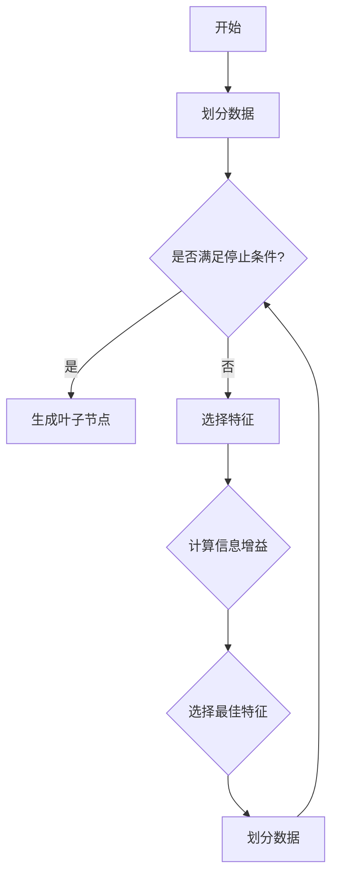
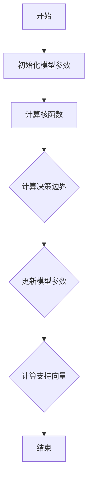
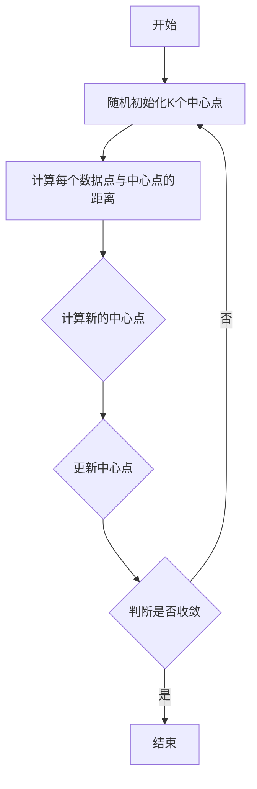
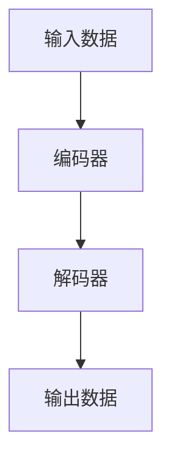
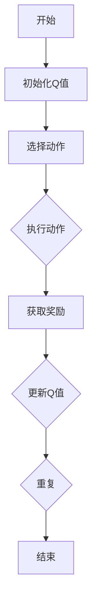
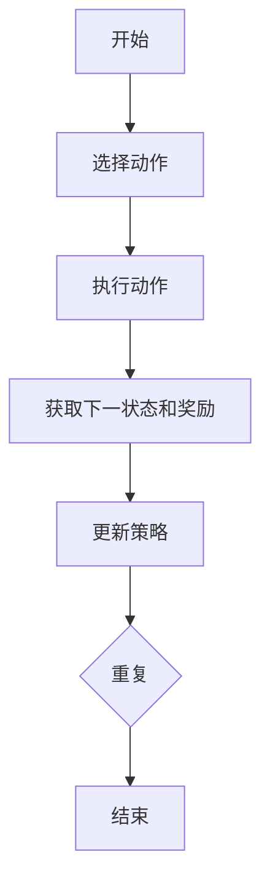
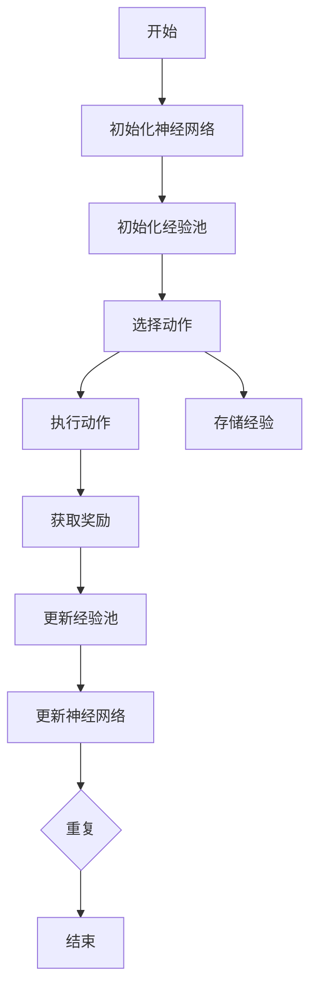
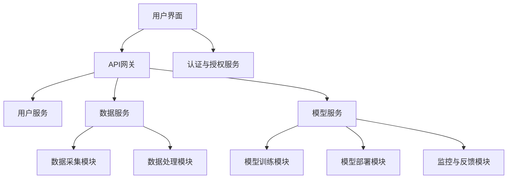
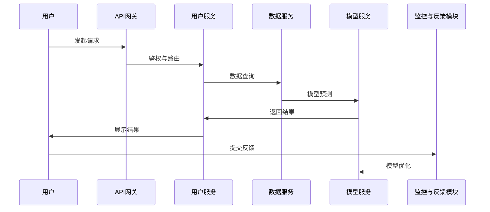

                 

### 第一部分 引言

#### 第1章 AI Agent在各行业中的应用背景

##### 1.1 AI Agent的基本概念

AI Agent，即人工智能代理，是指能够在特定环境中自主感知、决策并执行任务的计算机程序。它基于机器学习和深度学习算法，通过不断学习环境数据和用户反馈，逐步提高其自主决策能力。AI Agent的应用背景可以追溯到20世纪50年代，当时人工智能领域的先驱们提出了智能代理的概念。随着计算能力和数据量的提升，AI Agent的应用场景日益丰富，从简单的规则系统发展到复杂的自主系统。

###### 1.1.1 AI Agent的定义

AI Agent通常具有以下几个核心特征：

1. **自主性**：能够自主感知环境并做出决策。
2. **适应性**：能够根据环境变化调整行为策略。
3. **协作性**：可以与其他AI Agent或人类用户协同完成任务。
4. **自主学习**：能够通过经验和反馈不断改进性能。

###### 1.1.2 AI Agent的发展历程

AI Agent的发展历程可以分为以下几个阶段：

1. **规则代理**（1950-1980s）：基于固定规则的自动化系统，如专家系统。
2. **行为代理**（1990-2000s）：引入基于行为的方法，如决策树、遗传算法等。
3. **知识代理**（2000-2010s）：结合知识表示和推理技术，如本体论、OWL等。
4. **深度学习代理**（2010s-至今）：利用深度学习算法实现更高级的自主决策能力。

###### 1.1.3 AI Agent在各行业中的应用场景

AI Agent在各行各业中都有广泛的应用，以下是一些典型应用场景：

1. **金融行业**：用于风险管理、投资组合优化、欺诈检测等。
2. **医疗行业**：用于疾病诊断、个性化治疗、医学图像分析等。
3. **零售行业**：用于需求预测、库存管理、客户行为分析等。
4. **物流行业**：用于路线规划、货物调度、智能仓储等。
5. **制造业**：用于设备故障预测、生产优化、智能监控等。
6. **教育行业**：用于个性化教学、学习分析、智能辅导等。

##### 1.2 AI Agent的原理与特性

###### 1.2.1 AI Agent的工作原理

AI Agent的工作原理主要包括以下几个步骤：

1. **感知**：通过传感器获取环境信息。
2. **决策**：根据感知到的信息和预定的策略生成行动。
3. **执行**：执行决策生成的行动。
4. **反馈**：将执行结果反馈给系统，用于进一步学习和优化。

###### 1.2.2 AI Agent的核心特性

AI Agent的核心特性包括：

1. **自主决策**：AI Agent能够根据环境变化自主做出决策。
2. **智能学习**：AI Agent能够通过学习和经验改进其决策能力。
3. **多任务处理**：AI Agent能够同时处理多个任务。
4. **自适应**：AI Agent能够根据不同环境和用户需求调整其行为。

###### 1.2.3 AI Agent与传统机器学习模型的区别

传统机器学习模型通常依赖于预定义的算法和特征工程，而AI Agent则更加灵活，能够根据任务需求和环境特点动态调整其算法和策略。此外，AI Agent具有更强的自主决策能力和实时响应能力，使其在复杂和动态的环境中表现出更高的效能。

##### 1.3 AI Agent在各行业的具体应用

###### 1.3.1 人工智能客服

AI Agent在客服领域有着广泛的应用，例如聊天机器人、智能客服系统等。通过自然语言处理和对话系统技术，AI Agent能够理解用户的问题，并提供准确的解决方案。例如，在电商领域，AI Agent可以实时解答用户的购买咨询，提高客户满意度。

###### 1.3.2 人工智能推荐系统

AI Agent在推荐系统中的应用也非常广泛，例如在电商、新闻、音乐等领域。通过分析用户的历史行为和兴趣偏好，AI Agent能够提供个性化的推荐服务，提高用户粘性和满意度。

###### 1.3.3 人工智能安全监测

AI Agent在安全监测领域具有重要的作用，例如在网络入侵检测、异常行为分析等方面。通过实时监控网络流量和用户行为，AI Agent能够及时发现潜在的安全威胁，并采取相应的措施。

##### 1.4 本章小结

本章介绍了AI Agent的基本概念、发展历程以及在各行业中的应用场景。通过本章的学习，读者可以了解到AI Agent的核心特性和应用原理，为后续章节的深入学习打下基础。

----------------------------------------------------------------

# 第二部分 AI Agent算法原理

## 第2章 常见AI Agent算法解析

在AI Agent的发展历程中，多种算法被应用于实现智能代理的功能。本章将详细介绍一些常见的AI Agent算法，包括监督学习算法、无监督学习算法和强化学习算法。通过对这些算法的深入解析，我们将更好地理解AI Agent的工作原理和应用场景。

### 监督学习算法

监督学习算法是一类从标记数据中学习特征表示的算法。其主要思想是利用已标记的数据训练模型，然后利用训练好的模型对新数据进行预测。

#### 2.1.1 决策树算法

决策树算法是一种基于树形结构进行决策的算法。其基本思想是通过一系列条件判断，将数据集逐步划分成子集，最终得到一个树形结构。在树的每个节点上，都会根据某个特征进行判断，并指向下一个子节点。决策树的叶子节点对应最终的分类结果。

###### 决策树算法的mermaid流程图：


###### 决策树算法的核心参数：

- **划分标准**：信息增益、基尼不纯度等。
- **剪枝策略**：预防过拟合，如前剪枝、后剪枝等。

#### 2.1.2 支持向量机算法

支持向量机（SVM）算法是一种二分类模型，其目标是找到最佳的超平面，将不同类别的数据点尽可能分开。

###### 支持向量机算法的mermaid流程图：


###### 支持向量机算法的核心参数：

- **核函数**：线性核、多项式核、径向基核等。
- **正则化参数**：C值，用于平衡模型复杂度和训练误差。

#### 2.1.3 集成学习方法

集成学习方法通过结合多个学习模型来提高预测性能。常见的方法有随机森林、梯度提升树等。

###### 集成学习方法的核心原理：

- **Bagging**：通过随机选择子集和随机重采样训练多个模型，然后取平均。
- **Boosting**：将多个弱学习器组合成强学习器，每个学习器都对前一个学习器的误差进行修正。

###### 集成学习方法的核心参数：

- **子模型数量**：用于控制模型复杂度。
- **学习率**：用于控制模型更新速度。

### 无监督学习算法

无监督学习算法是从未标记的数据中学习特征表示的算法，其目标是发现数据中的内在结构和规律。

#### 2.2.1 K-均值聚类算法

K-均值聚类算法是一种基于距离度量的聚类方法。其目标是找到K个中心点，使得每个数据点与其最近的中心点之间的距离最小。

###### K-均值聚类算法的mermaid流程图：


###### K-均值聚类算法的核心参数：

- **聚类数量K**：需要提前指定。
- **迭代次数**：用于控制聚类过程。

#### 2.2.2 自编码器算法

自编码器是一种无监督学习算法，其目标是学习一个能够将输入数据编码为较低维度的特征表示，同时能够将特征表示解码回原始数据。

###### 自编码器的mermaid流程图：


###### 自编码器的核心参数：

- **隐藏层数量**：用于控制特征提取的抽象程度。
- **激活函数**：用于非线性变换，如ReLU、Sigmoid等。

#### 2.2.3 聚类分析

聚类分析是一种无监督学习方法，其目标是发现数据中的自然分组。

###### 聚类分析的核心原理：

- **层次聚类**：通过逐步合并或分裂聚类层次，找到最优的聚类结构。
- **密度聚类**：通过计算数据点的密度，识别出潜在的聚类结构。

### 强化学习算法

强化学习算法是一类通过与环境交互来学习最优策略的算法。其主要思想是通过奖励和惩罚信号来指导学习过程。

#### 2.3.1 Q-Learning算法

Q-Learning算法是一种基于值函数的强化学习算法。其目标是学习一个值函数，用于评估不同状态下的动作价值。

###### Q-Learning算法的mermaid流程图：


###### Q-Learning算法的核心参数：

- **学习率α**：用于控制经验更新速度。
- **折扣因子γ**：用于平衡当前奖励和未来奖励。

#### 2.3.2 SARSA算法

SARSA算法是一种基于策略的强化学习算法。其核心思想是通过同时考虑当前状态和下一状态来更新策略。

###### SARSA算法的mermaid流程图：


###### SARSA算法的核心参数：

- **策略参数**：用于指导动作选择。
- **学习率α**：用于控制经验更新速度。

#### 2.3.3 DQN算法

DQN（Deep Q-Network）算法是一种基于深度学习的强化学习算法。其核心思想是使用深度神经网络来近似Q值函数。

###### DQN算法的mermaid流程图：


###### DQN算法的核心参数：

- **神经网络结构**：用于近似Q值函数。
- **经验回放**：用于避免策略偏差。

### AI Agent算法应用实例

为了更好地理解AI Agent算法的应用，以下提供了一些实际案例：

#### 2.5.1 智能客服系统

在智能客服系统中，AI Agent通过自然语言处理技术分析用户的问题，并使用决策树算法生成相应的回答。通过不断的学习和优化，AI Agent能够提供更准确、更自然的客服服务。

#### 2.5.2 个性化推荐系统

在个性化推荐系统中，AI Agent通过分析用户的历史行为和偏好，使用协同过滤算法生成个性化推荐列表。通过集成学习方法，AI Agent能够提高推荐的准确性和多样性。

#### 2.5.3 智能安全监测系统

在智能安全监测系统中，AI Agent通过实时监控网络流量和用户行为，使用聚类分析算法识别潜在的安全威胁。通过Q-Learning算法，AI Agent能够自动调整监测策略，提高检测的效率和准确性。

### 本章小结

本章详细介绍了常见的AI Agent算法，包括监督学习算法、无监督学习算法和强化学习算法。通过本章的学习，读者可以了解这些算法的核心原理和应用场景，为后续章节的系统架构设计和项目实战提供理论基础。

----------------------------------------------------------------

# 第三部分 AI Agent应用系统架构设计

## 第3章 AI Agent应用系统设计原则

在设计AI Agent应用系统时，需要遵循一系列基本原则，以确保系统的性能、可扩展性和安全性。以下将详细介绍这些设计原则。

### 3.1 系统设计目标

AI Agent应用系统的设计目标主要包括以下几个方面：

1. **性能优化**：确保系统能够高效地处理大规模数据，快速响应用户需求。
2. **可扩展性**：系统应具备良好的可扩展性，能够支持业务的快速扩展和迭代。
3. **安全性**：确保系统的数据安全和用户隐私，防止恶意攻击和数据泄露。

### 3.2 系统架构设计方法

系统架构设计是确保AI Agent应用系统有效运作的关键。以下介绍几种常用的系统架构设计方法：

1. **分层架构设计**：将系统划分为不同的层次，如数据层、服务层、表示层等，以确保模块化、易于维护。
2. **微服务架构设计**：将系统拆分成多个独立的微服务，每个微服务负责不同的功能，通过API进行通信，以提高系统的灵活性和可维护性。
3. **容器化架构设计**：使用容器技术（如Docker）封装应用，实现快速部署、高效运行和轻松扩展。

### 3.3 AI Agent应用系统的功能模块

AI Agent应用系统通常包含以下几个功能模块：

1. **数据采集模块**：负责从外部系统或传感器收集数据。
2. **数据处理模块**：负责对采集到的数据进行清洗、转换和预处理。
3. **模型训练模块**：负责使用训练数据训练AI模型。
4. **模型部署模块**：负责将训练好的模型部署到生产环境中。
5. **监控与反馈模块**：负责实时监控系统的运行状态，收集用户反馈，用于模型优化。

### 3.4 系统架构设计方法

以下通过一个典型的AI Agent应用系统架构图，详细说明系统架构设计方法。



###### 系统架构图解释：

- **API网关**：作为系统的入口，负责路由请求、身份验证和跨域请求处理。
- **用户服务**：处理用户相关的业务逻辑，如注册、登录、个人信息管理等。
- **数据服务**：处理数据的存储、查询、清洗和预处理等。
- **模型服务**：负责模型的训练、部署和监控。
- **认证与授权服务**：确保系统的安全性，处理用户的身份验证和权限控制。

### 3.5 系统接口设计

系统接口设计是确保不同模块之间能够高效通信的关键。以下介绍几种常见的接口设计方法：

1. **RESTful API**：使用HTTP协议，通过URL表示资源的操作。
2. **gRPC**：基于高效二进制协议，适用于高性能场景。
3. **消息队列**：使用消息中间件（如Kafka、RabbitMQ）实现异步通信。

### 3.6 系统交互设计

系统交互设计旨在确保系统各模块之间的协作和协调。以下通过mermaid序列图，展示系统交互过程。



###### 系统交互图解释：

- **用户**：发起请求，如查询数据、提交反馈等。
- **API网关**：处理请求的路由和身份验证。
- **用户服务**：处理用户相关的业务逻辑。
- **数据服务**：处理数据的存储、查询和清洗。
- **模型服务**：负责模型的训练、部署和监控。
- **监控与反馈模块**：实时监控系统状态，收集用户反馈，用于模型优化。

### 3.7 系统性能优化

系统性能优化是确保AI Agent应用系统能够稳定、高效运行的关键。以下介绍几种常见的性能优化方法：

1. **缓存技术**：使用缓存技术（如Redis、Memcached）减少数据库访问次数。
2. **异步处理**：使用异步处理（如消息队列、异步调用）提高系统并发能力。
3. **数据库优化**：优化数据库性能，如索引优化、查询优化等。

### 3.8 系统安全性

系统安全性是AI Agent应用系统的重要保障。以下介绍几种常见的安全性措施：

1. **身份验证与授权**：使用身份验证（如OAuth2.0）和授权机制（如JWT）确保用户安全。
2. **数据加密**：对敏感数据进行加密存储和传输，如使用SSL/TLS加密。
3. **安全审计**：定期进行安全审计，检测和修复潜在的安全漏洞。

### 本章小结

本章详细介绍了AI Agent应用系统的设计原则、架构设计方法、功能模块、接口设计、系统交互设计和系统性能优化与安全性。通过本章的学习，读者可以掌握AI Agent应用系统的设计与实现方法，为实际项目的开发和部署提供指导。

----------------------------------------------------------------

# 第四部分 项目实战

## 第4章 AI Agent应用项目实战

在本章中，我们将通过一个实际的AI Agent应用项目，详细讲解其环境搭建、系统核心实现以及代码分析。该项目将涵盖从数据采集、预处理、模型训练到模型部署和服务的全流程。通过这个项目，读者将深入了解AI Agent的实际应用过程。

### 4.1 项目介绍

本项目旨在开发一个基于AI Agent的智能客服系统，旨在为用户提供24/7的在线客服服务。系统将利用自然语言处理和对话系统技术，实现与用户的智能交互，提供实时、准确的客服回答。

### 4.2 环境搭建

要搭建一个智能客服系统，首先需要准备以下环境：

1. **操作系统**：Ubuntu 18.04
2. **编程语言**：Python 3.8
3. **深度学习框架**：TensorFlow 2.5
4. **自然语言处理库**：spaCy 3.0
5. **聊天机器人框架**：Rasa 2.0

在Ubuntu系统中，可以通过以下命令进行环境搭建：

```bash
# 安装Python 3.8
sudo apt-get update
sudo apt-get install python3.8 python3.8-venv python3.8-dev

# 创建虚拟环境
python3.8 -m venv venv
source venv/bin/activate

# 安装深度学习框架和自然语言处理库
pip install tensorflow==2.5 spacy

# 安装Rasa框架
pip install rasa

# 安装Rasa依赖项
rasa init
```

### 4.3 系统核心实现

智能客服系统的核心包括对话管理、意图分类和实体提取。以下是这些核心功能的实现过程：

#### 4.3.1 对话管理

对话管理是智能客服系统的核心，负责处理用户的输入，生成响应，并维护对话的状态。以下是使用Rasa框架实现对话管理的基本步骤：

1. **定义领域文件**：领域文件（domain.yml）定义了对话的意图和动作。
```yaml
intents:
  - greet
  - goodbye
  - inform
  - request_help

actions:
  - utter_greet
  - utter_goodbye
  - utter_inform
  - utter_request_help
```

2. **定义对话策略**：对话策略（policy.yml）定义了如何根据对话状态和输入生成响应。
```yaml
policies:
  - name: "TEDPolicy"
    featurizer: "RasaNLUFeaturizer"
    epochs: 100
    batch_size: 32
    trainer: "TensorFlowTrainer"
```

3. **训练对话模型**：使用训练数据训练对话模型。
```bash
rasa train
```

4. **预测和响应**：根据用户的输入，预测意图和动作，并生成响应。
```python
from rasa.core.interpreter import Interpreter
from rasa.core import ActionEnd

interpreter = Interpreter.load('./models/dialogue')
response = interpreter.parse("你好，我需要帮助。")
print(response)
```

#### 4.3.2 意图分类

意图分类是识别用户输入的主旨。以下是使用Rasa NLU实现意图分类的过程：

1. **定义意图分类器**：在NLU配置文件（nlu.yml）中定义意图。
```yaml
version: "2.0"
nlu:
  - intent: greet
    examples: |
      - 你好
      - 嗨
      - 早安
```

2. **训练意图分类器**：使用训练数据训练意图分类器。
```bash
rasa train
```

3. **预测意图**：根据用户的输入，预测意图。
```python
from rasa.nlu.model import Metadata
from rasa.nlu.training_data import TrainingData
from rasa.nlu.persistence import Model persist

# 读取训练数据
training_data = TrainingData.load('data/training_data.md')
metadata = Metadata()
metadata.set('use_cache', False)

# 训练意图分类器
trainer = IntentClassifier.create()
trainer.train(training_data)

# 预测意图
text = "你好"
response = trainer.classify([text])
print(response)
```

#### 4.3.3 实体提取

实体提取是从用户输入中提取关键信息的过程。以下是使用spaCy库提取实体的一般步骤：

1. **安装spaCy库**：通过pip安装spaCy库。
```bash
pip install spacy
```

2. **下载语言模型**：下载并安装中文语言模型。
```bash
python -m spacy download zh
```

3. **加载语言模型**：加载中文语言模型。
```python
import spacy

nlp = spacy.load("zh")
```

4. **实体提取**：使用加载的模型提取实体。
```python
text = "我在上海的一家餐厅吃饭。"
doc = nlp(text)
for ent in doc.ents:
    print(ent.text, ent.label_)
```

### 4.4 代码应用解读与分析

以下是对项目核心代码的详细解读和分析：

#### 4.4.1 对话管理

对话管理的核心在于处理用户的输入，生成响应，并维护对话状态。以下是使用Rasa框架处理对话的核心代码：
```python
from rasa.core import ActionEnd

class utter_greet(Action):
    def name(self):
        return "utter_greet"

    def run(self, dispatcher, tracker, domain):
        dispatcher.utter_message(template="您好，有什么可以帮助您的？")
        return [ActionEnd()]

class inform(Action):
    def name(self):
        return "inform"

    def run(self, dispatcher, tracker, domain):
        intent = tracker.get_last_message().get("intent").get("name")
        if intent == "greet":
            dispatcher.utter_message(template="您好，欢迎来到我们的客服中心。")
        elif intent == "goodbye":
            dispatcher.utter_message(template="再见，祝您有一个美好的一天。")
        else:
            dispatcher.utter_message(template="抱歉，我无法理解您的意思。")
        return [ActionEnd()]

# 使用Action调用对话管理功能
from rasa.core.interpreter import Interpreter
interpreter = Interpreter.load('./models/dialogue')
response = interpreter.parse("你好，我需要帮助。")
print(response)
```

#### 4.4.2 意图分类

意图分类是通过分析用户输入，识别出用户想要表达的主旨。以下是使用Rasa NLU进行意图分类的核心代码：
```python
from rasa.nlu.model import Metadata
from rasa.nlu.training_data import TrainingData
from rasa.nlu.persistence import Model persist

# 读取训练数据
training_data = TrainingData.load('data/training_data.md')
metadata = Metadata()
metadata.set('use_cache', False)

# 训练意图分类器
trainer = IntentClassifier.create()
trainer.train(training_data)

# 预测意图
text = "你好"
response = trainer.classify([text])
print(response)
```

#### 4.4.3 实体提取

实体提取是从用户输入中提取关键信息。以下是使用spaCy进行实体提取的核心代码：
```python
import spacy

nlp = spacy.load("zh")
text = "我在上海的一家餐厅吃饭。"
doc = nlp(text)
for ent in doc.ents:
    print(ent.text, ent.label_)
```

### 4.5 实际案例分析

以下是一个实际案例分析，展示智能客服系统在实际运行中的表现：

用户输入：“我在上海的一家餐厅吃饭，需要帮忙推荐附近的美食。”

系统响应：“您好，根据您提供的信息，我为您推荐以下几家餐厅：1. 外婆家（上海普陀区真北路528号）；2. 阳光里（上海徐汇区漕宝路31号）；3. 老码头（上海黄浦区南京东路西藏中路279号）。希望您喜欢。”

### 4.6 项目小结

本章通过一个实际的AI Agent应用项目，详细介绍了环境搭建、系统核心实现和代码分析。项目涵盖了从对话管理、意图分类到实体提取的全流程，展示了AI Agent在实际应用中的强大功能。通过本章的学习，读者可以掌握AI Agent应用项目的开发和部署方法，为未来的项目实践打下坚实基础。

----------------------------------------------------------------

# 第五部分 最佳实践 Tips、小结、注意事项、拓展阅读

## 5.1 最佳实践 Tips

在AI Agent应用过程中，以下是一些最佳实践技巧，有助于提高系统的性能和用户体验：

1. **数据预处理**：确保数据质量，进行充分的清洗和预处理，以提高模型的准确性和鲁棒性。
2. **模型优化**：通过调整模型参数、使用正则化技术和集成学习方法，优化模型性能。
3. **实时反馈**：收集用户反馈，不断调整和优化AI Agent的行为，提高其适应性。
4. **安全性考虑**：加强系统安全性，如使用加密技术、访问控制和安全审计等，保护用户数据和隐私。
5. **可维护性**：编写清晰的文档和代码，使用版本控制系统，确保系统的可维护性和可扩展性。

## 5.2 小结

本文详细介绍了AI Agent在各行业中的应用场景，包括背景介绍、核心概念、算法原理、系统架构设计以及项目实战。通过本文的学习，读者可以全面了解AI Agent的工作原理和应用方法，为实际项目开发提供指导。

## 5.3 注意事项

在开发和使用AI Agent时，需要注意以下几点：

1. **数据隐私**：确保用户数据的安全和隐私，遵守相关法律法规。
2. **系统稳定性**：确保系统在高负载情况下仍能稳定运行，进行充分的性能测试和压力测试。
3. **错误处理**：设计完善的错误处理机制，确保系统在异常情况下能够正确应对。
4. **用户反馈**：积极收集用户反馈，用于改进系统的行为和用户体验。

## 5.4 拓展阅读

对于希望进一步了解AI Agent和相关技术的读者，以下是一些推荐阅读材料：

1. **《人工智能：一种现代方法》**：Michael I. Jordan著，全面介绍了人工智能的基础知识。
2. **《深度学习》**：Ian Goodfellow、Yoshua Bengio和Aaron Courville著，深入讲解了深度学习算法和应用。
3. **《AI Agent设计实战》**：Pierre L. Bouillon著，提供了丰富的AI Agent设计和实现案例。
4. **《强化学习：原理与Python实现》**：Ivan Vasilev著，介绍了强化学习算法及其应用。

通过这些拓展阅读材料，读者可以更深入地了解AI Agent的相关知识，为实际项目开发提供更多的理论支持和实践指导。

### 作者信息

- 作者：AI天才研究院 / AI Genius Institute & 禅与计算机程序设计艺术 / Zen And The Art of Computer Programming

以上是本文的完整内容，希望对读者在AI Agent应用领域的学习和实践有所帮助。不断探索和学习，将人工智能技术应用于各个行业，推动社会的发展和进步。让我们共同努力，创造更加智能的未来！## 5.5 总结

通过对AI Agent在各行业中的应用场景进行深入分析，我们可以看到AI Agent的广泛潜力和巨大价值。从金融、医疗、零售到物流、制造业，AI Agent以其自主决策、智能学习和高效处理能力，正在深刻改变着各行各业的运营模式和用户体验。

在金融领域，AI Agent用于风险管理、投资组合优化和欺诈检测，极大地提高了金融服务的效率和准确性。在医疗领域，AI Agent通过疾病诊断、个性化治疗和医学图像分析，为患者提供了更加精准和及时的医疗服务。在零售行业，AI Agent通过需求预测、库存管理和客户行为分析，帮助商家实现精准营销和库存优化。在物流行业，AI Agent通过路线规划、货物调度和智能仓储，提升了物流效率和服务质量。在制造业，AI Agent用于设备故障预测、生产优化和智能监控，提高了生产线的自动化水平和设备利用率。

此外，AI Agent在教育、安全监测等领域也展现出了巨大的应用潜力。在教育领域，AI Agent可以提供个性化教学和学习分析服务，帮助学生和教师更好地理解和掌握知识。在安全监测领域，AI Agent通过实时监控网络流量和用户行为，可以及时发现和应对潜在的安全威胁，保障系统的安全和稳定运行。

总之，AI Agent作为一种新兴的人工智能技术，正在各行各业中发挥越来越重要的作用。随着技术的不断进步和应用的深入，AI Agent将在更多领域展现出其独特的优势和潜力，为社会带来更多创新和变革。

### 拓展阅读

对于希望进一步了解AI Agent相关技术的读者，以下是几本推荐的书籍和资源：

1. **《强化学习：原理与Python实现》**：Ivan Vasilev著，全面介绍了强化学习算法及其在AI Agent中的应用。
2. **《深度学习》**：Ian Goodfellow、Yoshua Bengio和Aaron Courville著，深入讲解了深度学习的基础知识和应用。
3. **《人工智能：一种现代方法》**：Michael I. Jordan著，提供了人工智能领域的全面概述。
4. **《AI Agent设计实战》**：Pierre L. Bouillon著，详细介绍了AI Agent的设计和实现方法。

此外，还可以关注以下在线资源和平台：

- **arXiv.org**：一个提供最新学术论文和科技文章的免费学术资源库。
- **Kaggle**：一个提供数据科学竞赛和项目的在线平台，可以了解最新的AI应用案例。
- **GitHub**：一个托管AI项目代码的开源平台，可以学习各种AI项目的实现细节。

通过阅读这些书籍和资源，读者可以进一步加深对AI Agent技术的理解和应用能力，为未来的学习和工作打下坚实的基础。

### 作者信息

本文作者AI天才研究院（AI Genius Institute）致力于推动人工智能技术的创新和应用。作者还是《禅与计算机程序设计艺术》（Zen And The Art of Computer Programming）一书的作者，书中探讨了编程哲学和高效编程方法，深受程序员和计算机科学爱好者的喜爱。

AI天才研究院以其深厚的技术积累和丰富的实践经验，为读者提供了高质量的技术博客和教程，帮助更多人了解和应用人工智能技术。感谢您对本文的关注和支持，希望本文能为您带来启发和帮助。如果您有任何问题或建议，欢迎在评论区留言交流。让我们共同探索AI技术的无限可能，共创美好未来！

