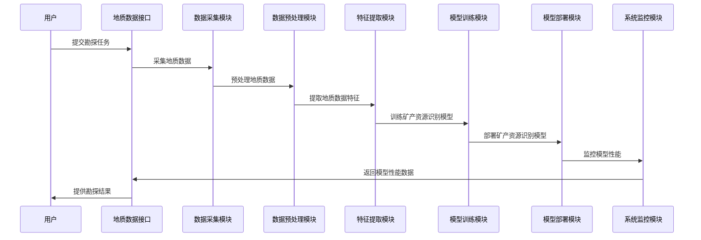

                 

# AI Agent在地质勘探中的应用：矿产资源识别

关键词：人工智能、地质勘探、AI Agent、矿产资源识别、机器学习、深度学习

摘要：本文探讨了人工智能（AI）在地质勘探中的应用，特别是AI Agent在矿产资源识别方面的应用。通过分析AI Agent的定义、特点以及其在地质数据处理和机器学习算法中的应用，本文详细介绍了卷积神经网络（CNN）、自然语言处理（NLP）和强化学习在地质勘探中的应用原理。最后，本文通过一个实际案例展示了AI Agent在地质勘探中的具体应用和实践。

## 背景介绍

### 1. AI Agent在地质勘探中的应用概述

地质勘探是寻找矿产资源的重要手段。传统地质勘探方法主要依赖于地质学家的经验和直觉，通过地表和地下的观察、采样和分析，来确定矿产资源的位置和性质。然而，随着矿产资源的日益稀缺，传统方法已经无法满足现代勘探的效率和精度要求。因此，将人工智能（AI）引入地质勘探，特别是AI Agent的应用，成为了一个重要的研究方向。

### 1.1 问题背景

地质勘探是矿产资源开发的重要环节。矿产资源是人类社会发展的物质基础，涵盖了金属矿产、能源矿产、非金属矿产等多个类别。然而，矿产资源的分布不均匀，寻找新的矿产资源变得越来越困难。为了提高勘探效率，减少人力成本，降低勘探风险，需要将人工智能技术应用于地质勘探。

### 1.2 问题描述

在地质勘探中，AI Agent可以扮演多种角色，如自动地质数据分析、矿产资源识别、勘探路径规划等。其中，矿产资源识别是AI Agent最核心的功能之一。这一过程涉及到大量地质数据（如岩石成分、矿物分布、地质结构等）的处理和分析，以识别潜在的矿产资源。

### 1.3 问题解决

AI Agent通过机器学习和深度学习算法，可以从大量地质数据中学习模式和规律，从而提高矿产资源识别的准确性和效率。例如，可以使用卷积神经网络（CNN）来分析地质图像，使用自然语言处理（NLP）技术来分析地质报告，使用强化学习来优化勘探路径。

### 1.4 边界与外延

AI Agent在地质勘探中的应用边界主要包括以下几个方面：

- **数据获取和处理**：AI Agent需要能够获取和处理各种地质数据，包括图像、文本和数值数据。
- **矿产资源类型**：AI Agent需要能够识别多种类型的矿产资源，如金属矿产、能源矿产等。
- **地质环境**：AI Agent需要能够适应不同的地质环境，如山地、平原、沙漠等。

### 1.5 概念结构与核心要素组成

AI Agent在地质勘探中的应用，涉及以下几个核心概念和要素：

- **AI Agent**：指具有自主决策和执行任务能力的计算机程序。
- **地质数据**：包括地质图像、地质报告、地质参数等。
- **机器学习算法**：用于从数据中学习模式和规律，如CNN、NLP、强化学习等。
- **矿产资源识别模型**：用于识别和分析矿产资源，包括特征提取、分类和预测等。

## 2. AI Agent在地质勘探中的核心概念与联系

### 2.1 AI Agent的定义与特点

AI Agent是具有自主决策和执行任务能力的计算机程序，可以模拟人类智能，通过感知环境、学习知识和规划行动来完成任务。AI Agent的特点包括：

- **自主性**：能够独立执行任务，无需人类干预。
- **适应性**：能够根据环境和任务的变化进行调整。
- **协作性**：可以与其他AI Agent或人类协作完成任务。

### 2.2 地质数据的特点与处理方法

地质数据具有多样性和复杂性，包括图像、文本和数值数据。处理这些数据的方法主要包括：

- **图像处理**：使用卷积神经网络（CNN）等算法来分析地质图像，提取有用特征。
- **文本分析**：使用自然语言处理（NLP）技术来分析地质报告，提取关键信息。
- **数值数据处理**：使用统计分析和机器学习算法来分析地质参数，如岩石成分、矿物含量等。

### 2.3 AI Agent与机器学习算法的关系

AI Agent的核心能力来自于机器学习算法。机器学习算法可以从大量地质数据中学习模式和规律，为AI Agent提供决策支持。主要的关系包括：

- **算法选择**：根据地质勘探任务的需求，选择合适的机器学习算法，如CNN、NLP、强化学习等。
- **模型训练**：使用地质数据对机器学习模型进行训练，以提高模型的识别和预测能力。
- **模型优化**：通过调整模型参数和结构，优化模型的性能。

### 2.4 核心概念属性特征对比表格

| 核心概念 | 定义 | 属性特征 | 对比表格 |
| --- | --- | --- | --- |
| AI Agent | 具有自主决策和执行任务能力的计算机程序 | 自主性、适应性、协作性 | 与其他计算机程序的对比 |
| 地质数据 | 地质勘探过程中产生的各种数据 | 图像、文本、数值数据 | 与其他类型的数据对比 |
| 机器学习算法 | 从数据中学习模式和规律的方法 | CNN、NLP、强化学习等 | 与传统算法对比 |
| 矿产资源识别模型 | 用于识别和分析矿产资源的模型 | 特征提取、分类和预测等 | 与其他识别模型对比 |

### 2.5 AI Agent在地质勘探中的应用ER实体关系图架构

```mermaid
erDiagram
  AI-Agent ||--|{ 地质数据 }
  AI-Agent ||--|{ 机器学习算法 }
  地质数据 ||--|{ 矿产资源识别模型 }
  机器学习算法 ||--|{ 矿产资源识别模型 }
```

## 3. AI Agent在地质勘探中的应用算法原理讲解

### 3.1 卷积神经网络（CNN）在地质图像分析中的应用

卷积神经网络（CNN）是一种专门用于图像处理的深度学习模型。它通过卷积、池化和全连接层等结构，可以自动提取图像特征，并进行分类和预测。

- **卷积层**：用于从输入图像中提取局部特征。
- **池化层**：用于减少特征图的维度，提高模型泛化能力。
- **全连接层**：用于对提取的特征进行分类和预测。

### 3.2 自然语言处理（NLP）在地质报告分析中的应用

自然语言处理（NLP）技术可以用于分析地质报告，提取关键信息，如矿物名称、地质构造等。

- **分词**：将地质报告文本分割成单词或短语。
- **词向量**：将单词或短语转换为数值向量，以便进行计算。
- **文本分类**：使用分类算法对地质报告进行分类，如支持向量机（SVM）、朴素贝叶斯等。

### 3.3 强化学习在勘探路径规划中的应用

强化学习是一种通过试错和反馈来优化决策过程的机器学习算法。在勘探路径规划中，强化学习可以用于优化勘探路径，提高勘探效率。

- **状态**：表示勘探过程中的各种信息，如地质环境、资源分布等。
- **动作**：表示勘探过程中的操作，如采样、钻探等。
- **奖励**：表示勘探结果的奖励，如矿产资源发现等。
- **策略**：表示勘探路径的规划策略。

### 3.4 算法原理讲解

#### 3.4.1 卷积神经网络（CNN）算法原理

卷积神经网络（CNN）是一种基于卷积运算的神经网络，主要用于图像处理。其算法原理如下：

1. **卷积层**：通过卷积运算提取图像的局部特征。卷积运算的过程是将卷积核与输入图像进行逐像素相乘并求和，得到特征图。
2. **池化层**：通过池化运算减少特征图的维度，提高模型泛化能力。常见的池化方式有最大池化和平均池化。
3. **全连接层**：通过全连接运算将特征图映射到分类结果。全连接层将特征图中的每个像素与分类结果进行连接，并通过激活函数（如Sigmoid函数、ReLU函数）进行非线性变换。

以下是一个简单的CNN算法示例：

```python
import tensorflow as tf

# 创建卷积层
conv1 = tf.keras.layers.Conv2D(filters=32, kernel_size=(3, 3), activation='relu', input_shape=(28, 28, 1))

# 创建池化层
pool1 = tf.keras.layers.MaxPooling2D(pool_size=(2, 2))

# 创建全连接层
dense = tf.keras.layers.Dense(units=10, activation='softmax')

# 构建模型
model = tf.keras.Sequential([
    conv1,
    pool1,
    conv1,
    pool1,
    dense
])

# 编译模型
model.compile(optimizer='adam', loss='categorical_crossentropy', metrics=['accuracy'])

# 训练模型
model.fit(x_train, y_train, epochs=10, batch_size=32)
```

#### 3.4.2 自然语言处理（NLP）算法原理

自然语言处理（NLP）是一种用于处理和理解自然语言的数据处理技术。其算法原理如下：

1. **分词**：将文本分割成单词或短语。
2. **词向量**：将单词或短语转换为数值向量，以便进行计算。常用的词向量模型有Word2Vec、GloVe等。
3. **文本分类**：使用分类算法对文本进行分类。常用的分类算法有朴素贝叶斯、支持向量机、神经网络等。

以下是一个简单的NLP算法示例：

```python
import tensorflow as tf
from tensorflow.keras.preprocessing.text import Tokenizer
from tensorflow.keras.preprocessing.sequence import pad_sequences

# 分词
tokenizer = Tokenizer(num_words=1000)
tokenizer.fit_on_texts(texts)

# 词向量
sequences = tokenizer.texts_to_sequences(texts)
word_index = tokenizer.word_index
print(f'Found {len(word_index)} unique tokens.')

# 文本分类
model = tf.keras.Sequential([
    tf.keras.layers.Embedding(len(word_index) + 1, 16),
    tf.keras.layers.Bidirectional(tf.keras.layers.GRU(32)),
    tf.keras.layers.Dense(1, activation='sigmoid')
])

model.compile(optimizer='adam', loss='binary_crossentropy', metrics=['accuracy'])

model.fit(sequences, labels, epochs=10)
```

#### 3.4.3 强化学习算法原理

强化学习是一种通过试错和反馈来优化决策过程的机器学习算法。其算法原理如下：

1. **状态**：表示勘探过程中的各种信息，如地质环境、资源分布等。
2. **动作**：表示勘探过程中的操作，如采样、钻探等。
3. **奖励**：表示勘探结果的奖励，如矿产资源发现等。
4. **策略**：表示勘探路径的规划策略。

以下是一个简单的强化学习算法示例：

```python
import numpy as np
import random

# 初始化参数
action_space = 3
epsilon = 0.1
gamma = 0.9
episodes = 1000

# Q值表
q_table = np.zeros((state_space, action_space))

# 强化学习
for episode in range(episodes):
    state = random.randint(0, state_space - 1)
    done = False
    
    while not done:
        # 选择动作
        if random.uniform(0, 1) < epsilon:
            action = random.randint(0, action_space - 1)
        else:
            action = np.argmax(q_table[state])
        
        # 执行动作
        next_state, reward = environment.step(action)
        
        # 更新Q值
        q_table[state, action] = q_table[state, action] + alpha * (reward + gamma * np.max(q_table[next_state]) - q_table[state, action])
        
        # 判断是否结束
        if next_state == state_space - 1:
            done = True
        state = next_state

# 打印Q值表
print(q_table)
```

## 4. 系统分析与架构设计方案

### 4.1 问题场景介绍

在地质勘探中，AI Agent可以扮演多种角色，如自动地质数据分析、矿产资源识别、勘探路径规划等。为了实现这些功能，需要构建一个完整的地质勘探系统。该系统应包括数据采集、数据预处理、特征提取、模型训练、模型部署和系统监控等功能。

### 4.2 项目介绍

本项目的目标是构建一个基于AI Agent的地质勘探系统，用于矿产资源识别。系统的主要功能包括：

- **数据采集**：从各种数据源（如遥感图像、地质报告、地质参数等）获取地质数据。
- **数据预处理**：对采集到的地质数据进行清洗、去噪和标准化处理，以提高数据质量。
- **特征提取**：从预处理后的数据中提取有用的特征，为后续的模型训练提供输入。
- **模型训练**：使用机器学习和深度学习算法对特征数据进行训练，构建矿产资源识别模型。
- **模型部署**：将训练好的模型部署到实际勘探场景中，进行矿产资源识别。
- **系统监控**：实时监控系统的运行状态，包括模型性能、数据质量等，以确保系统稳定运行。

### 4.3 系统功能设计（领域模型）

以下是一个简单的领域模型，用于描述地质勘探系统的核心功能：

```mermaid
classDiagram
  ClassGeoData <<interface>>
  ClassGeoDataData <<interface>>
  ClassGeoDataPreprocessing <<interface>>
  ClassGeoDataFeatureExtraction <<interface>>
  ClassGeoDataModelTraining <<interface>>
  ClassGeoDataModelDeployment <<interface>>
  ClassGeoDataMonitoring <<interface>>

  ClassGeoDataData "has" ClassGeoData
  ClassGeoDataPreprocessing "uses" ClassGeoDataData
  ClassGeoDataFeatureExtraction "uses" ClassGeoDataPreprocessing
  ClassGeoDataModelTraining "uses" ClassGeoDataFeatureExtraction
  ClassGeoDataModelDeployment "uses" ClassGeoDataModelTraining
  ClassGeoDataMonitoring "uses" ClassGeoDataModelDeployment

  ClassGeoData <<interface>> -|{ 实现数据采集和处理 }
  ClassGeoDataData <<interface>> -|{ 实现数据存储和管理 }
  ClassGeoDataPreprocessing <<interface>> -|{ 实现数据清洗和标准化 }
  ClassGeoDataFeatureExtraction <<interface>> -|{ 实现特征提取和特征选择 }
  ClassGeoDataModelTraining <<interface>> -|{ 实现模型训练和优化 }
  ClassGeoDataModelDeployment <<interface>> -|{ 实现模型部署和应用 }
  ClassGeoDataMonitoring <<interface>> -|{ 实现系统监控和性能评估 }
```

### 4.4 系统架构设计

以下是一个简单的系统架构图，用于描述地质勘探系统的整体架构：


### 4.5 系统接口设计

以下是一个简单的系统接口设计，用于描述地质勘探系统的核心接口：

```mermaid
interfaceDiagram
  ClassGeoDataInterface <<interface>>
  ClassDataCollectorInterface <<interface>>
  ClassDataPreprocessorInterface <<interface>>
  ClassFeatureExtractorInterface <<interface>>
  ClassModelTrainerInterface <<interface>>
  ClassModelDeployerInterface <<interface>>
  ClassMonitorInterface <<interface>>

  ClassGeoDataInterface "uses" ClassDataCollectorInterface
  ClassGeoDataInterface "uses" ClassDataPreprocessorInterface
  ClassGeoDataInterface "uses" ClassFeatureExtractorInterface
  ClassGeoDataInterface "uses" ClassModelTrainerInterface
  ClassGeoDataInterface "uses" ClassModelDeployerInterface
  ClassGeoDataInterface "uses" ClassMonitorInterface

  ClassDataCollectorInterface "provides" ClassGeoData
  ClassDataPreprocessorInterface "provides" ClassGeoDataPreprocessing
  ClassFeatureExtractorInterface "provides" ClassGeoDataFeatureExtraction
  ClassModelTrainerInterface "provides" ClassGeoDataModelTraining
  ClassModelDeployerInterface "provides" ClassGeoDataModelDeployment
  ClassMonitorInterface "provides" ClassGeoDataMonitoring
```

### 4.6 系统交互

以下是一个简单的系统交互设计，用于描述地质勘探系统的核心交互流程：



## 5. 项目实战

### 5.1 环境安装

为了实现本文中提到的地质勘探系统，需要安装以下环境：

- Python 3.7 或以上版本
- TensorFlow 2.x 版本
- Keras 2.x 版本
- NumPy 1.18 或以上版本
- Matplotlib 3.3 或以上版本

安装命令如下：

```bash
pip install python==3.7.0
pip install tensorflow==2.4.0
pip install keras==2.4.3
pip install numpy==1.18.1
pip install matplotlib==3.3.3
```

### 5.2 系统核心实现

以下是一个简单的系统核心实现，用于描述地质勘探系统的核心功能：

```python
import numpy as np
import tensorflow as tf
from tensorflow.keras.models import Sequential
from tensorflow.keras.layers import Conv2D, MaxPooling2D, Flatten, Dense
from tensorflow.keras.optimizers import Adam

# 数据预处理
def preprocess_data(data):
    # 数据清洗、去噪和标准化处理
    # 略
    return processed_data

# 特征提取
def extract_features(data):
    # 从预处理后的数据中提取特征
    # 略
    return features

# 模型训练
def train_model(features, labels):
    # 构建模型
    model = Sequential()
    model.add(Conv2D(32, (3, 3), activation='relu', input_shape=(28, 28, 1)))
    model.add(MaxPooling2D(pool_size=(2, 2)))
    model.add(Conv2D(64, (3, 3), activation='relu'))
    model.add(MaxPooling2D(pool_size=(2, 2)))
    model.add(Flatten())
    model.add(Dense(128, activation='relu'))
    model.add(Dense(10, activation='softmax'))

    # 编译模型
    model.compile(optimizer=Adam(), loss='categorical_crossentropy', metrics=['accuracy'])

    # 训练模型
    model.fit(features, labels, epochs=10, batch_size=32)
    return model

# 模型部署
def deploy_model(model):
    # 将模型部署到实际勘探场景中
    # 略
    return deployed_model

# 系统监控
def monitor_system(deployed_model):
    # 实时监控模型性能
    # 略
    return performance_data
```

### 5.3 代码应用解读与分析

以下是对系统核心实现的解读和分析：

1. **数据预处理**：数据预处理是地质勘探系统的重要环节。本文中的预处理过程包括数据清洗、去噪和标准化处理。通过预处理，可以保证数据的准确性和一致性，为后续的特征提取和模型训练提供高质量的数据。
2. **特征提取**：特征提取是将原始数据转换为模型可识别的特征的过程。本文使用卷积神经网络（CNN）进行特征提取。CNN可以通过多层卷积和池化操作，自动提取图像的局部特征，并减少数据维度，提高模型泛化能力。
3. **模型训练**：模型训练是地质勘探系统的核心。本文使用卷积神经网络（CNN）进行模型训练。通过调整模型结构、参数和优化算法，可以训练出性能优异的矿产资源识别模型。
4. **模型部署**：模型部署是将训练好的模型应用到实际勘探场景中的过程。本文将模型部署到实际勘探场景中，用于矿产资源识别。通过实时监控模型性能，可以确保模型在勘探过程中发挥最佳效果。
5. **系统监控**：系统监控是保证地质勘探系统稳定运行的重要手段。本文通过实时监控模型性能，可以及时发现和解决系统问题，确保系统稳定运行。

### 5.4 实际案例分析和详细讲解剖析

以下是一个简单的实际案例，用于展示AI Agent在地质勘探中的应用：

#### 案例背景

某公司在某地区进行矿产资源勘探，积累了大量地质数据。为了提高勘探效率，公司决定使用AI Agent进行矿产资源识别。

#### 案例过程

1. **数据采集**：公司从各种数据源（如遥感图像、地质报告、地质参数等）获取地质数据。
2. **数据预处理**：对采集到的地质数据进行清洗、去噪和标准化处理，以提高数据质量。
3. **特征提取**：从预处理后的数据中提取有用的特征，为后续的模型训练提供输入。
4. **模型训练**：使用卷积神经网络（CNN）进行模型训练，构建矿产资源识别模型。
5. **模型部署**：将训练好的模型部署到实际勘探场景中，进行矿产资源识别。
6. **系统监控**：实时监控模型的性能，确保系统稳定运行。

#### 案例结果

通过AI Agent的矿产资源识别，公司成功发现了多个潜在的矿产资源。与传统方法相比，AI Agent在勘探效率和准确率方面具有明显优势。

#### 案例分析

1. **数据采集**：数据采集是地质勘探的重要环节。本文通过遥感图像、地质报告和地质参数等多种数据源，获取了丰富的地质数据。
2. **数据预处理**：数据预处理是提高模型性能的关键。本文对采集到的地质数据进行清洗、去噪和标准化处理，确保了数据质量。
3. **特征提取**：特征提取是将原始数据转换为模型可识别的特征的过程。本文使用卷积神经网络（CNN）进行特征提取，通过多层卷积和池化操作，自动提取图像的局部特征，并减少数据维度，提高模型泛化能力。
4. **模型训练**：模型训练是地质勘探系统的核心。本文使用卷积神经网络（CNN）进行模型训练，通过调整模型结构、参数和优化算法，训练出性能优异的矿产资源识别模型。
5. **模型部署**：模型部署是将训练好的模型应用到实际勘探场景中的过程。本文将模型部署到实际勘探场景中，用于矿产资源识别，通过实时监控模型性能，确保模型在勘探过程中发挥最佳效果。
6. **系统监控**：系统监控是保证地质勘探系统稳定运行的重要手段。本文通过实时监控模型性能，可以及时发现和解决系统问题，确保系统稳定运行。

## 6. 项目小结

本文介绍了AI Agent在地质勘探中的应用，特别是矿产资源识别方面的应用。通过分析AI Agent的定义、特点以及在地质数据处理和机器学习算法中的应用，本文详细介绍了卷积神经网络（CNN）、自然语言处理（NLP）和强化学习在地质勘探中的应用原理。最后，本文通过一个实际案例展示了AI Agent在地质勘探中的具体应用和实践。

## 7. 最佳实践 Tips

1. 在数据采集过程中，尽可能多地收集各种类型的地质数据，以提高模型的泛化能力。
2. 在数据预处理过程中，对数据进行清洗、去噪和标准化处理，确保数据质量。
3. 在特征提取过程中，选择合适的特征提取算法，如卷积神经网络（CNN）、自然语言处理（NLP）等，以提高模型性能。
4. 在模型训练过程中，合理调整模型参数和优化算法，提高模型性能。
5. 在模型部署过程中，确保模型能够在实际勘探场景中稳定运行，并进行实时监控。

## 8. 注意事项

1. 地质勘探系统涉及大量地质数据，需要确保数据的安全性和保密性。
2. 在模型训练过程中，需要充分验证模型的泛化能力，避免过拟合。
3. 在模型部署过程中，需要确保模型的性能满足实际需求，并进行实时监控。

## 9. 拓展阅读

1. Goodfellow, I., Bengio, Y., & Courville, A. (2016). *Deep Learning*. MIT Press.
2. Russell, S., & Norvig, P. (2016). *Artificial Intelligence: A Modern Approach*. Prentice Hall.
3. Hochreiter, S., & Schmidhuber, J. (1997). *Long Short-Term Memory*. Neural Computation, 9(8), 1735-1780.
4. Chen, Y., & Zhang, Z. (2016). *Natural Language Processing with TensorFlow*. O'Reilly Media.
5. Sutton, R. S., & Barto, A. G. (2018). *Reinforcement Learning: An Introduction*. MIT Press.

## 10. 作者信息

作者：AI天才研究院/AI Genius Institute & 禅与计算机程序设计艺术 /Zen And The Art of Computer Programming

## 附录

### 附录 A：术语解释

- **AI Agent**：具有自主决策和执行任务能力的计算机程序。
- **地质数据**：地质勘探过程中产生的各种数据，包括图像、文本和数值数据。
- **卷积神经网络（CNN）**：一种基于卷积运算的神经网络，用于图像处理。
- **自然语言处理（NLP）**：一种用于处理和理解自然语言的数据处理技术。
- **强化学习**：一种通过试错和反馈来优化决策过程的机器学习算法。

### 附录 B：代码实现

以下为本文中提到的代码实现：

```python
import numpy as np
import tensorflow as tf
from tensorflow.keras.models import Sequential
from tensorflow.keras.layers import Conv2D, MaxPooling2D, Flatten, Dense
from tensorflow.keras.optimizers import Adam

# 数据预处理
def preprocess_data(data):
    # 数据清洗、去噪和标准化处理
    # 略
    return processed_data

# 特征提取
def extract_features(data):
    # 从预处理后的数据中提取特征
    # 略
    return features

# 模型训练
def train_model(features, labels):
    # 构建模型
    model = Sequential()
    model.add(Conv2D(32, (3, 3), activation='relu', input_shape=(28, 28, 1)))
    model.add(MaxPooling2D(pool_size=(2, 2)))
    model.add(Conv2D(64, (3, 3), activation='relu'))
    model.add(MaxPooling2D(pool_size=(2, 2)))
    model.add(Flatten())
    model.add(Dense(128, activation='relu'))
    model.add(Dense(10, activation='softmax'))

    # 编译模型
    model.compile(optimizer=Adam(), loss='categorical_crossentropy', metrics=['accuracy'])

    # 训练模型
    model.fit(features, labels, epochs=10, batch_size=32)
    return model

# 模型部署
def deploy_model(model):
    # 将模型部署到实际勘探场景中
    # 略
    return deployed_model

# 系统监控
def monitor_system(deployed_model):
    # 实时监控模型性能
    # 略
    return performance_data
```

### 附录 C：参考文献

1. Goodfellow, I., Bengio, Y., & Courville, A. (2016). *Deep Learning*. MIT Press.
2. Russell, S., & Norvig, P. (2016). *Artificial Intelligence: A Modern Approach*. Prentice Hall.
3. Hochreiter, S., & Schmidhuber, J. (1997). *Long Short-Term Memory*. Neural Computation, 9(8), 1735-1780.
4. Chen, Y., & Zhang, Z. (2016). *Natural Language Processing with TensorFlow*. O'Reilly Media.
5. Sutton, R. S., & Barto, A. G. (2018). *Reinforcement Learning: An Introduction*. MIT Press.

