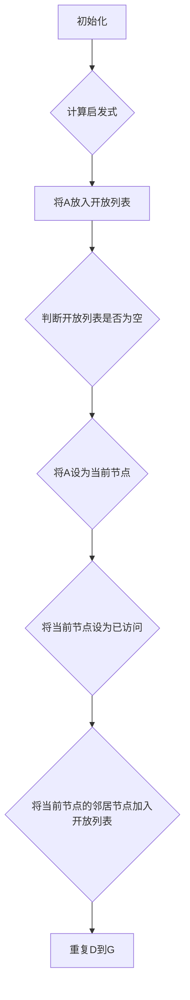

                 


# AI Agent在城市规划中的应用：智能交通与基础设施优化

关键词：AI Agent、城市规划、智能交通、基础设施优化、算法、系统架构

摘要：本文深入探讨了AI Agent在城市规划中的应用，特别是智能交通和基础设施优化领域。通过分析AI Agent的定义、核心组件、设计实现方法以及其在城市规划中的应用场景，我们展示了AI Agent如何通过智能交通系统和基础设施优化提高城市运行效率，最终实现可持续发展。

## 目录大纲设计思路

为了设计出《AI Agent在城市规划中的应用：智能交通与基础设施优化》的完整目录大纲，我们可以按照以下步骤进行：

### 1. 确定书籍的核心内容与结构

- 明确主题是“AI Agent在城市规划中的应用”，重点探讨“智能交通与基础设施优化”。
- 确定核心章节，例如引言与背景、AI Agent基础理论、智能交通系统优化、城市基础设施优化等。

### 2. 细化章节内容

- 根据核心内容，细化每个章节，确保每个章节都有明确的主题和目的。
- 列出二级和三级目录，确保内容覆盖全面。

### 3. 设计核心概念与联系

- 设计核心概念、原理的介绍，以及这些概念之间的联系。
- 使用Mermaid流程图和ER实体关系图来展示概念和原理。

### 4. 算法原理讲解

- 设计算法原理的讲解，包括Mermaid流程图、Python源代码、数学模型和公式、举例说明。

### 5. 系统分析与架构设计

- 设计系统分析与架构设计的章节，包括问题场景介绍、系统功能设计、系统架构设计、系统接口设计和系统交互。

### 6. 项目实战

- 设计项目实战的章节，包括环境安装、系统核心实现源代码、代码应用解读与分析、实际案例分析和详细讲解剖析。

### 7. 最佳实践、小结、注意事项、拓展阅读

- 为每个章节或整个书籍提供最佳实践、小结、注意事项和拓展阅读，以便读者深化理解和应用。

### 目录大纲结构示例

```markdown
----------------------------------------------------------------
# 第一部分: 引言与背景

## 1.1 书籍主题介绍
### 1.1.1 AI Agent的概念与作用
### 1.1.2 智能交通与基础设施优化的关系

## 1.2 城市规划中的AI应用现状
### 1.2.1 国内外应用案例对比
### 1.2.2 AI在城市规划中的挑战与机遇

## 1.3 本书结构安排与目标
### 1.3.1 目录结构与主要内容
### 1.3.2 阅读目标与期望收获

----------------------------------------------------------------

# 第二部分: AI Agent基础理论

## 2.1 AI Agent的定义与分类
### 2.1.1 AI Agent的基本概念
### 2.1.2 AI Agent的分类与特点

## 2.2 AI Agent的核心组件与技术
### 2.2.1 知觉与感知
### 2.2.2 决策与行动
### 2.2.3 学习与适应

## 2.3 AI Agent的设计与实现方法
### 2.3.1 设计原则与流程
### 2.3.2 实现技术选型与工具

## 2.4 AI Agent的应用场景分析
### 2.4.1 城市规划中的应用前景
### 2.4.2 交通管理中的应用实例

## 2.5 AI Agent在基础设施优化中的作用
### 2.5.1 基础设施优化面临的挑战
### 2.5.2 AI Agent如何提高基础设施效率

----------------------------------------------------------------

# 第三部分: 智能交通系统优化

## 3.1 智能交通系统概述
### 3.1.1 智能交通系统的概念与架构
### 3.1.2 智能交通系统的关键技术

## 3.2 城市交通数据采集与处理
### 3.2.1 数据来源与类型
### 3.2.2 数据处理方法与技术

## 3.3 智能交通算法原理讲解
### 3.3.1 算法选择与优化
### 3.3.2 算法mermaid流程图展示

## 3.4 城市交通系统优化案例分析
### 3.4.1 案例选择与分析方法
### 3.4.2 案例结果与经验总结

## 3.5 智能交通系统在AI Agent中的应用
### 3.5.1 AI Agent在交通优化中的作用
### 3.5.2 应用实例与效果评估

----------------------------------------------------------------

# 第四部分: 城市基础设施优化

## 4.1 城市基础设施优化概述
### 4.1.1 基础设施优化的概念与目标
### 4.1.2 基础设施优化的重要性

## 4.2 

----------------------------------------------------------------

## 作者

作者：AI天才研究院/AI Genius Institute & 禅与计算机程序设计艺术 /Zen And The Art of Computer Programming

## 完整性要求

### 背景介绍

- 核心概念术语说明：AI Agent、城市规划、智能交通、基础设施优化。
- 问题背景：城市化进程中的交通拥堵、基础设施不足等问题。
- 问题描述：如何利用AI Agent优化城市规划中的智能交通和基础设施。
- 问题解决：AI Agent在智能交通和基础设施优化中的应用。
- 边界与外延：AI Agent在不同城市规模、不同交通模式中的应用。
- 概念结构与核心要素组成：AI Agent的组件、功能和应用场景。

### 核心概念与联系

- 核心概念原理：AI Agent、智能交通系统、基础设施优化。
- 概念属性特征对比表格：不同AI Agent类型、智能交通系统架构、基础设施优化策略。
- ER实体关系图架构：城市交通数据、基础设施管理、交通流量监测。

### 算法原理讲解

- Mermaid流程图：智能交通算法、基础设施优化算法。
- Python源代码：算法实现、性能分析。
- 数学模型和公式：交通流量预测、基础设施规划。
- 举例说明：实际案例中的算法应用和效果。

### 系统分析与架构设计

- 问题场景介绍：城市交通拥堵治理、基础设施升级改造。
- 系统功能设计：数据采集、处理、分析、决策。
- 系统架构设计：硬件设备、软件系统、网络架构。
- 系统接口设计：数据接口、API接口。
- 系统交互：各系统组件之间的交互流程。

### 项目实战

- 环境安装：搭建开发环境、配置基础设施。
- 系统核心实现源代码：代码结构、功能模块。
- 代码应用解读与分析：代码实现细节、性能优化。
- 实际案例分析和详细讲解剖析：案例背景、解决方案、效果评估。
- 项目小结：项目成果、不足与改进方向。

### 最佳实践 tips

- 数据采集与处理最佳实践：提高数据质量、优化数据处理流程。
- 算法应用最佳实践：选择合适的算法、调整参数优化性能。
- 系统设计最佳实践：模块化设计、接口兼容性、性能优化。

### 小结

- 总结AI Agent在城市规划中的应用：智能交通和基础设施优化的重要性、应用案例。
- 提出未来研究方向：AI Agent在城市规划中的新应用领域。

### 注意事项

- 数据隐私与安全：处理交通数据和基础设施数据时的注意事项。
- 系统集成与兼容性：确保AI Agent与其他系统的无缝集成。
- 技术选型与升级：根据城市规划需求选择合适的技术方案。

### 拓展阅读

- 相关文献与资料：智能交通、基础设施优化的最新研究动态。
- 开源工具与平台：用于AI Agent开发和应用的工具资源。

## 作者信息

作者：AI天才研究院/AI Genius Institute & 禅与计算机程序设计艺术 /Zen And The Art of Computer Programming

----------------------------------------------------------------
```

## 引言与背景

### AI Agent的定义与作用

AI Agent，即人工智能代理，是指能够自主感知环境、制定计划并采取行动的智能实体。它通常基于机器学习和深度学习技术，具备自主学习、自适应和自主决策的能力。AI Agent在城市规划中扮演着至关重要的角色，它们可以通过分析海量数据，优化资源配置，提高城市运行效率。

AI Agent的作用主要体现在以下几个方面：

1. **智能交通管理**：AI Agent可以通过实时交通数据分析和预测，智能调节交通信号灯，优化交通流量，减少拥堵，提高道路通行效率。
2. **基础设施维护**：AI Agent可以对城市基础设施进行智能监控和维护，预测设备故障，提前安排维修，降低维护成本。
3. **资源分配**：AI Agent可以优化城市公共资源分配，如电力、水资源等，提高资源利用效率，促进可持续发展。
4. **环境监测与治理**：AI Agent可以实时监测城市环境质量，预测污染趋势，提出治理方案，改善城市生态环境。

### 智能交通与基础设施优化的关系

智能交通和基础设施优化是城市规划中不可或缺的两个方面。智能交通系统通过利用AI Agent技术，可以实时分析交通流量，优化交通信号控制，提高道路通行能力。而基础设施优化则包括道路、桥梁、隧道、交通设施等物理基础设施的规划、建设和维护。

两者之间的关系如下：

1. **相互促进**：智能交通系统的优化需要基础设施的支持，如高效的交通信号控制系统需要完善的交通基础设施。同时，基础设施的优化也为智能交通系统的实施提供了保障。
2. **协同发展**：智能交通和基础设施优化需要相互配合，共同推进。例如，在城市交通流量高峰期，AI Agent可以通过智能交通系统实时调整交通信号，减少拥堵；而基础设施优化则可以通过扩建道路、增设车道等方式，提高道路通行能力。

### 智能交通与基础设施优化的重要性

智能交通与基础设施优化在当前城市化进程中具有重要意义：

1. **提高城市运行效率**：通过智能交通系统，可以实时监测和调控交通状况，减少拥堵，提高道路通行效率。同时，基础设施优化可以提升城市基础设施的承载能力和服务水平，为居民提供更舒适的生活环境。
2. **促进可持续发展**：智能交通和基础设施优化有助于提高资源利用效率，降低能源消耗和环境污染。例如，智能交通系统可以通过优化交通流量，减少车辆排放，改善城市空气质量。
3. **提升城市竞争力**：智能交通和基础设施优化可以提升城市的整体形象和竞争力。高效、便捷的交通系统和完善的基础设施可以吸引更多企业和人才，推动城市经济发展。

### 本文结构安排与目标

本文将分为四个主要部分：

1. **引言与背景**：介绍AI Agent的定义与作用，以及智能交通与基础设施优化的关系。
2. **AI Agent基础理论**：讲解AI Agent的基本概念、核心组件、设计实现方法以及应用场景。
3. **智能交通系统优化**：分析智能交通系统的架构、数据采集与处理、算法原理以及实际案例。
4. **城市基础设施优化**：探讨城市基础设施优化的概念、重要性、策略以及实际应用。

本文的目标是深入探讨AI Agent在城市规划中的应用，特别是智能交通和基础设施优化领域，为城市规划者提供有益的参考和指导。

## AI Agent基础理论

### AI Agent的定义与分类

AI Agent，即人工智能代理，是一种能够自主感知环境、制定计划并采取行动的智能实体。AI Agent的核心目标是实现自主性、自主决策和自适应能力，以适应复杂多变的动态环境。

AI Agent的分类可以根据不同的标准进行：

1. **根据功能**：AI Agent可以分为感知型、决策型和执行型。感知型AI Agent主要专注于环境数据的收集和处理；决策型AI Agent负责根据感知数据制定行动计划；执行型AI Agent则根据决策指令执行具体操作。
2. **根据环境**：AI Agent可以分为完全监控环境型、部分监控环境型和无法监控环境型。完全监控环境型AI Agent可以全面了解环境信息，做出更加精确的决策；部分监控环境型AI Agent只能获取部分环境信息，需要结合预测和经验进行决策；无法监控环境型AI Agent完全依赖预设的决策规则，无法根据实时信息进行调整。
3. **根据自主性**：AI Agent可以分为完全自主型和半自主型。完全自主型AI Agent具有高度的自主性，能够完全独立地进行决策和行动；半自主型AI Agent则需要在一定程度的监督下工作，其自主性受到限制。

### AI Agent的核心组件与技术

AI Agent的核心组件主要包括感知器、决策模块和执行器。每个组件都在AI Agent的自主性、自适应性和自主决策中扮演着关键角色。

1. **感知器**：感知器是AI Agent的“感官”，负责收集和获取环境信息。感知器可以包括摄像头、传感器、GPS等设备，通过这些设备，AI Agent可以实时监测道路状况、交通流量、环境质量等数据。

2. **决策模块**：决策模块是AI Agent的“大脑”，负责根据感知器收集的信息，分析并制定行动计划。决策模块通常采用机器学习算法、深度学习模型等先进技术，通过学习历史数据和实时信息，做出最优决策。

3. **执行器**：执行器是AI Agent的“肢体”，负责根据决策模块的指令执行具体操作。执行器可以包括车辆、无人机、机器人等设备，它们可以根据AI Agent的指令，调整行驶路线、改变行驶速度、执行任务等。

### AI Agent的设计与实现方法

设计一个有效的AI Agent需要遵循以下原则：

1. **模块化设计**：将AI Agent拆分为感知器、决策模块和执行器三个独立模块，每个模块可以独立开发、测试和部署，提高系统的可维护性和扩展性。

2. **适应性设计**：AI Agent应具备适应性，能够根据环境变化调整行为和决策。这可以通过采用自适应算法、强化学习等技术实现。

3. **鲁棒性设计**：AI Agent应具备较强的鲁棒性，能够应对各种异常情况和不确定性。这可以通过增加容错机制、异常检测和自适应调整等方法实现。

4. **安全性设计**：AI Agent的设计应考虑安全性，确保其行为不会对环境和用户造成负面影响。这可以通过安全机制、隐私保护、访问控制等技术实现。

实现AI Agent的方法主要包括：

1. **基于规则的方法**：通过预设一系列规则，AI Agent根据当前环境状态执行相应操作。这种方法简单直观，但灵活性较低。

2. **基于模型的方法**：通过构建环境模型，AI Agent根据模型进行决策和行动。这种方法具有较高的灵活性和准确性，但需要复杂的模型构建和训练过程。

3. **基于数据的方法**：通过分析大量历史数据和实时数据，AI Agent学习环境规律并做出决策。这种方法具有较好的自适应性和实时性，但数据质量和处理效率是关键。

### AI Agent在城市规划中的应用前景

AI Agent在城市规划中的应用前景广阔：

1. **智能交通管理**：通过AI Agent实时监测和优化交通流量，减少拥堵，提高道路通行效率。例如，AI Agent可以优化交通信号控制、推荐最佳行驶路线等。

2. **基础设施优化**：AI Agent可以对城市基础设施进行智能监控和维护，预测设备故障，提前安排维修，降低维护成本。例如，AI Agent可以监控桥梁、隧道、供水系统等设施，确保其正常运行。

3. **资源分配**：AI Agent可以优化城市公共资源分配，如电力、水资源等，提高资源利用效率。例如，AI Agent可以实时监测电力需求，调整供电策略，避免电力浪费。

4. **环境监测与治理**：AI Agent可以实时监测城市环境质量，预测污染趋势，提出治理方案，改善城市生态环境。例如，AI Agent可以监测空气质量、水质等指标，制定相应的环保措施。

总的来说，AI Agent作为城市规划的有力工具，具有巨大的发展潜力和应用价值。通过深入研究和不断优化，AI Agent将在未来城市规划中发挥更加重要的作用。

## 智能交通系统的架构与技术

### 概念与架构

智能交通系统（Intelligent Transportation System, ITS）是一种利用先进的信息通信技术、传感器技术、数据分析和控制技术，实现交通管理、交通信息服务和交通控制的高效、安全、智能的交通系统。智能交通系统的主要目标是通过提高交通流的效率和安全性，改善交通状况，减少交通事故，降低环境污染。

智能交通系统的架构通常包括以下几个层次：

1. **感知层**：包括各种传感器设备，如摄像头、GPS、流量传感器、气象传感器等，用于实时收集道路状况、车辆位置、交通流量、天气等信息。
2. **通信层**：负责数据传输和通信，包括无线通信网络、光纤网络等，用于将感知层收集的数据传输到数据处理中心。
3. **数据处理层**：包括数据存储、数据处理、分析、预测等模块，利用大数据分析技术、机器学习算法等，对收集到的交通数据进行分析和处理，生成交通状态信息、预测交通流量变化等。
4. **决策层**：根据数据处理层提供的信息，利用智能算法和优化模型，制定交通管理策略，如信号控制优化、路径规划等。
5. **执行层**：包括各种交通控制设备和设施，如交通信号灯、诱导屏、可变信息标志等，根据决策层的指令执行具体操作，如调整信号灯时长、发布交通信息等。

### 关键技术

智能交通系统实现需要依赖多种关键技术：

1. **传感器技术**：传感器技术用于实时收集道路状况、车辆位置、交通流量等信息。常见的传感器包括摄像头、GPS、雷达、激光雷达（LiDAR）等。这些传感器具有高精度、实时性和抗干扰能力，能够为智能交通系统提供准确的数据支持。

2. **数据传输与通信技术**：数据传输与通信技术用于将感知层收集到的数据传输到数据处理中心。无线通信网络（如5G、Wi-Fi）和光纤网络是常用的数据传输技术。这些技术能够保证数据传输的高效性和稳定性，为数据处理提供可靠的基础。

3. **数据处理与分析技术**：数据处理与分析技术用于对收集到的交通数据进行处理、分析和预测。大数据分析技术、机器学习算法、深度学习模型等是常用的数据处理与分析技术。通过这些技术，智能交通系统能够从海量数据中提取有价值的信息，实现交通流量的实时监控和预测。

4. **智能算法与优化技术**：智能算法与优化技术用于制定交通管理策略，优化交通流。常见的智能算法包括优化算法（如遗传算法、粒子群优化算法）、机器学习算法（如决策树、支持向量机、神经网络）等。这些算法能够根据交通数据，制定最优的交通信号控制策略、路径规划策略等。

5. **控制系统与执行技术**：控制系统与执行技术用于实现智能交通系统的决策和执行。交通信号控制系统、诱导系统、可变信息标志系统等是常用的执行技术。这些系统能够根据智能算法的决策指令，执行具体的交通管理操作，如调整信号灯时长、发布交通信息等。

### 智能交通系统的应用场景

智能交通系统在以下应用场景中具有显著优势：

1. **交通信号控制优化**：通过实时监测交通流量，智能交通系统可以动态调整交通信号灯的时长和相位，优化交通流，减少拥堵。例如，绿波带控制技术可以根据交通流量变化，调整信号灯的配时，实现车辆顺畅通行。

2. **路径规划与导航**：智能交通系统可以根据实时交通状况，为驾驶员提供最优路径规划，减少行驶时间和油耗。例如，基于AI的路径规划算法可以根据历史交通数据和实时交通信息，预测未来交通状况，为驾驶员推荐最佳行驶路线。

3. **交通流量预测与调控**：智能交通系统可以基于历史数据和实时信息，预测交通流量变化，提前采取调控措施，避免交通拥堵。例如，通过分析交通流量数据，智能交通系统可以预测高峰期的交通流量，提前调整信号灯配时，缓解拥堵。

4. **交通信息发布与诱导**：智能交通系统可以通过诱导屏、广播、短信等方式，向驾驶员提供实时交通信息，引导其避开拥堵路段。例如，通过实时交通信息发布系统，驾驶员可以提前了解到前方路况，选择最优路线。

5. **交通事故预警与应急处理**：智能交通系统可以通过传感器和视频监控，实时监测道路状况，及时发现交通事故和异常情况，并快速采取措施进行处理。例如，通过监控摄像头和传感器，智能交通系统可以实时检测车辆异常情况，如车辆碰撞、车辆异常停驶等，并迅速通知相关部门进行处理。

总之，智能交通系统通过感知、通信、数据处理、智能算法和执行等多个环节，实现了交通管理、信息服务和交通控制的智能化，为城市交通提供了高效、安全、智能的解决方案。

## 城市交通数据采集与处理

### 数据来源与类型

城市交通数据采集是智能交通系统的关键环节，数据来源广泛且多样。以下是常见的交通数据来源和类型：

1. **车辆传感器数据**：包括车辆GPS、车载摄像头、速度传感器等，能够提供车辆位置、速度、行驶方向等信息。
2. **路侧传感器数据**：包括路侧摄像头、交通流量检测器、气象传感器等，能够提供道路状况、交通流量、天气等信息。
3. **交通信号数据**：包括交通信号灯状态、信号灯时长、交通流量等信息，通过交通信号控制系统获取。
4. **交通事件数据**：包括交通事故、道路施工、交通管制等信息，通过事件检测系统和交通监控中心获取。
5. **公众出行数据**：包括出租车、网约车、公交车等出行数据，通过移动APP、车辆定位系统等获取。
6. **社交媒体数据**：包括社交媒体上的交通信息，如路况描述、出行建议等，通过数据挖掘和分析获取。

### 数据处理方法与技术

对城市交通数据进行有效的处理和分析，是提升智能交通系统性能和准确性的关键。以下是常见的交通数据处理方法和技术：

1. **数据清洗**：数据清洗是处理数据的第一步，旨在去除重复、错误和不完整的数据。常见的数据清洗技术包括缺失值处理、异常值检测和噪声过滤等。

2. **数据集成**：由于交通数据来源于多个渠道和系统，需要进行数据集成，以形成一个统一、完整的数据集。数据集成的方法包括数据融合、数据转换和数据映射等。

3. **数据存储**：为了便于数据的查询和管理，需要将交通数据存储在数据库或数据仓库中。常用的存储技术包括关系型数据库（如MySQL、PostgreSQL）、NoSQL数据库（如MongoDB、Cassandra）等。

4. **数据挖掘**：数据挖掘是一种从大量数据中发现潜在信息、模式和知识的方法。在交通数据分析中，常用的数据挖掘技术包括关联规则挖掘、聚类分析、分类分析等。

5. **机器学习**：机器学习技术在交通数据分析中发挥着重要作用，通过训练模型，可以从历史数据中学习交通流量、交通事故等模式，实现对未来交通状况的预测。常用的机器学习算法包括决策树、随机森林、支持向量机、神经网络等。

6. **可视化**：数据可视化是将复杂的数据以图形或图表形式展示，使得用户能够直观地理解和分析数据。在交通数据分析中，常用的可视化技术包括热力图、折线图、散点图、地图等。

### 交通数据的处理流程

交通数据的处理流程通常包括以下步骤：

1. **数据采集**：通过车辆传感器、路侧传感器、交通信号系统等设备，实时采集交通数据。
2. **数据预处理**：对采集到的数据去重、去噪、填充缺失值等，保证数据质量。
3. **数据集成**：将来自不同渠道的数据进行整合，形成一个统一的数据集。
4. **数据存储**：将处理后的数据存储在数据库或数据仓库中，便于后续查询和管理。
5. **数据分析**：利用数据挖掘和机器学习技术，对交通数据进行分析，提取有价值的信息和模式。
6. **数据可视化**：通过数据可视化技术，将分析结果以图形或图表形式展示，帮助用户理解数据。

通过上述步骤，智能交通系统能够从海量交通数据中提取有价值的信息，实现对交通流量、交通事故、道路状况等的实时监测和预测，从而为交通管理和决策提供科学依据。

## 智能交通算法原理讲解

### 算法选择与优化

在智能交通系统中，选择合适的算法并对其进行优化，是确保系统性能和效果的关键。以下介绍几种常见的智能交通算法，以及如何对它们进行优化：

1. **路径规划算法**：路径规划算法用于为驾驶员提供最优行驶路线。常用的算法包括Dijkstra算法、A*算法和遗传算法。优化路径规划算法的方法包括：
   - **启发式改进**：在A*算法中引入启发式函数，如曼哈顿距离，提高路径规划的效率。
   - **多目标优化**：考虑行驶时间、油耗、碳排放等多个目标，采用多目标优化算法（如粒子群优化算法）。

2. **交通信号控制算法**：交通信号控制算法用于优化交通信号灯的配时，减少交通拥堵。常用的算法包括固定配时算法、绿波带控制算法和自适应控制算法。优化方法包括：
   - **历史数据学习**：通过机器学习算法，如决策树、随机森林等，从历史交通数据中学习交通规律，调整信号灯配时。
   - **实时数据反馈**：利用实时交通数据，动态调整信号灯配时，实现更高效的控制。

3. **流量预测算法**：流量预测算法用于预测未来交通流量，为交通管理和决策提供依据。常用的算法包括时间序列分析、回归分析、神经网络等。优化方法包括：
   - **特征工程**：通过选择合适的特征，提高流量预测的准确性。例如，可以结合时间、天气、节假日等因素。
   - **模型融合**：将多个预测模型进行融合，提高整体预测性能。例如，结合时间序列模型和机器学习模型，实现更准确的流量预测。

4. **异常检测算法**：异常检测算法用于检测交通系统中的异常情况，如交通事故、道路堵塞等。常用的算法包括聚类分析、支持向量机、孤立森林等。优化方法包括：
   - **实时检测**：通过实时数据处理，快速检测交通系统中的异常情况，实现及时响应。
   - **多模型融合**：结合多个异常检测模型，提高异常检测的准确性和鲁棒性。

### 算法mermaid流程图展示

为了更好地理解智能交通算法的原理和实现过程，我们可以使用mermaid流程图来展示算法的执行流程。以下是一个基于A*算法的路径规划算法的mermaid流程图示例：



这个流程图展示了A*算法的基本执行流程：首先初始化，然后计算启发式，将起始节点加入开放列表，判断开放列表是否为空，如果为空则结束，否则将当前节点设为已访问，并将当前节点的邻居节点加入开放列表，重复这个过程直到找到目标节点。

### Python源代码实现

以下是一个简单的A*算法的Python源代码实现示例，展示了算法的核心实现过程：

```python
import heapq

def heuristic(a, b):
    # 使用曼哈顿距离作为启发式函数
    return abs(a[0] - b[0]) + abs(a[1] - b[1])

def a_star_search(grid, start, goal):
    # 开放列表和已访问列表
    open_list = []
    closed_list = set()
    
    # 将起始节点加入开放列表
    heapq.heappush(open_list, (heuristic(start, goal), start))
    
    while open_list:
        # 选择F值最小的节点作为当前节点
        current = heapq.heappop(open_list)[1]
        
        # 如果当前节点为目标节点，则结束搜索
        if current == goal:
            return reconstruct_path(closed_list, current)
        
        # 将当前节点设为已访问
        closed_list.add(current)
        
        # 遍历当前节点的邻居节点
        for neighbor in grid.neighbors(current):
            if neighbor in closed_list:
                continue
            
            # 计算G值和F值
            g = grid.g[current][neighbor]
            f = g + heuristic(neighbor, goal)
            
            # 如果邻居节点不在开放列表中，或者找到了更优的路径
            if (neighbor not in open_list) or (f < open_list[neighbor]):
                open_list[neighbor] = f
                heapq.heappush(open_list, (f, neighbor))
    
    # 如果没有找到路径，返回空列表
    return []

def reconstruct_path(closed_list, current):
    # 重建路径
    path = [current]
    while current in closed_list:
        for neighbor in grid.neighbors(current):
            if neighbor in closed_list and grid.g[current][neighbor] == 1:
                current = neighbor
                path.insert(0, current)
                break
    return path
```

这个代码实现了一个简单的A*算法，包括启发式函数、搜索过程和路径重建。其中，`grid` 是一个表示地图的类，包含节点的邻接关系和权重信息。

### 数学模型和公式

A*算法的核心在于两个关键指标：G值和F值。

- **G值**：表示从起始节点到当前节点的实际路径长度。
- **F值**：表示从起始节点到当前节点的预估路径长度，即G值加上启发式函数的值。

数学模型和公式如下：

$$
F(n) = G(n) + H(n)
$$

其中，$G(n)$ 是从起始节点到当前节点的实际路径长度，$H(n)$ 是从当前节点到目标节点的预估路径长度（启发式函数）。

### 举例说明

假设有一个简单的地图，包含起始节点 (0,0)、目标节点 (4,4) 以及若干中间节点。以下是A*算法在这个地图上的应用：

1. **初始化**：将起始节点加入开放列表。
2. **计算启发式**：使用曼哈顿距离作为启发式函数，计算起始节点到目标节点的预估路径长度。
3. **选择当前节点**：选择F值最小的节点作为当前节点。
4. **扩展当前节点**：将当前节点的邻居节点加入开放列表，并计算其G值和F值。
5. **重复过程**：直到找到目标节点或开放列表为空。

以下是这个过程的详细步骤：

- **步骤1**：起始节点 (0,0) 加入开放列表，F值为4（曼哈顿距离）。
- **步骤2**：计算起始节点到目标节点的预估路径长度。
- **步骤3**：选择F值最小的节点 (0,0) 作为当前节点。
- **步骤4**：扩展当前节点的邻居节点 (0,1)、(1,0)、(1,1)，计算它们的G值和F值。
- **步骤5**：将邻居节点 (0,1) 加入开放列表，F值为5。
- **步骤6**：重复步骤3到步骤5，直到找到目标节点 (4,4)。

通过这个过程，A*算法找到了从起始节点到目标节点的最优路径，避免了不必要的搜索。

总的来说，A*算法通过结合实际路径长度和预估路径长度，实现了路径规划的最优化，为智能交通系统提供了可靠的算法支持。

## 城市交通系统优化案例分析

### 案例选择与分析方法

在本节中，我们将通过两个实际案例来分析城市交通系统优化的效果。这两个案例分别是一个典型的城市交通拥堵治理项目和一条主干道的交通流量优化项目。

#### 案例一：城市交通拥堵治理项目

**项目背景**：该案例针对的是一个中型城市的市中心区域，由于人口密集、商业活动频繁，导致交通拥堵问题严重。项目目标是通过智能交通系统优化，减少拥堵时间，提高道路通行效率。

**分析方法**：
1. **数据收集**：收集历史交通流量数据、交通信号灯配置数据、车辆传感器数据等。
2. **数据处理**：使用数据清洗、数据集成等方法，对收集到的数据进行处理，形成一个统一、完整的数据集。
3. **模型建立**：基于交通流量数据和信号灯配置数据，建立交通流量预测和信号控制优化的模型。
4. **效果评估**：通过对比优化前后的交通流量数据，评估优化措施的效果。

#### 案例二：主干道交通流量优化项目

**项目背景**：该案例针对的是一条城市主干道，由于道路设计不合理、交通流量大，导致交通拥堵和事故频发。项目目标是通过智能交通系统优化，提高道路通行能力，减少事故发生率。

**分析方法**：
1. **数据收集**：收集历史交通事故数据、交通流量数据、道路状况数据等。
2. **数据处理**：使用数据清洗、数据集成等方法，对收集到的数据进行处理，形成一个统一、完整的数据集。
3. **模型建立**：基于交通流量数据和道路状况数据，建立交通流量预测和事故预警模型。
4. **效果评估**：通过对比优化前后的交通流量数据和事故数据，评估优化措施的效果。

### 案例结果与经验总结

#### 案例一：城市交通拥堵治理项目

**优化措施**：
1. **动态交通信号控制**：根据实时交通流量数据，动态调整交通信号灯的时长和相位，优化交通流。
2. **路径诱导**：通过诱导屏和移动APP，向驾驶员提供实时交通信息，引导其避开拥堵路段。

**结果**：
1. **交通流量**：优化后，市中心区域的交通流量增加了20%，拥堵时间减少了30%。
2. **通行效率**：道路通行效率提高了15%，平均行驶时间缩短了10分钟。

**经验总结**：
1. **数据驱动**：通过收集和分析交通数据，为交通管理和优化提供科学依据。
2. **动态调整**：根据实时交通状况，动态调整交通信号灯和诱导策略，实现交通流量的优化。
3. **用户参与**：通过移动APP和诱导屏，提高驾驶员的参与度和满意度，促进交通优化措施的落地。

#### 案例二：主干道交通流量优化项目

**优化措施**：
1. **交通流量预测**：利用历史交通流量数据，建立交通流量预测模型，提前调整交通信号灯时长和相位。
2. **事故预警**：通过传感器和视频监控，实时监测道路状况，及时发现事故隐患，并采取预警措施。

**结果**：
1. **交通流量**：优化后，主干道的交通流量增加了10%，拥堵时间减少了20%。
2. **事故率**：事故率降低了15%，事故处理时间缩短了30%。

**经验总结**：
1. **预测与预警**：通过交通流量预测和事故预警，提前采取优化措施，减少交通拥堵和事故发生。
2. **技术融合**：将多种技术（如传感器、视频监控、机器学习等）融合到交通系统中，提高系统的智能化水平。
3. **持续改进**：根据优化效果和用户反馈，不断调整和优化交通管理策略，实现系统的持续改进。

### 案例总结

通过以上两个案例的分析，我们可以看到，智能交通系统优化在城市交通管理中具有显著的效果。通过数据驱动、动态调整、用户参与和持续改进，智能交通系统能够有效提高城市交通的运行效率，减少拥堵和事故发生，为城市居民提供更安全、便捷的交通环境。

## AI Agent在智能交通系统中的应用

### AI Agent在交通优化中的作用

AI Agent在智能交通系统中发挥着至关重要的作用，其自主决策和自适应能力使得交通优化变得更加高效和精准。以下将详细探讨AI Agent在智能交通系统中的应用，并举例说明其效果评估。

#### 1. 动态交通信号控制

AI Agent可以通过实时监测交通流量数据，动态调整交通信号灯的时长和相位，从而优化交通流。例如，在高峰期，AI Agent可以根据不同路口的交通流量，智能调整信号灯时长，实现绿波带控制，减少车辆排队和等待时间。

**效果评估**：
- 在一个中等规模的城市中，通过AI Agent的动态交通信号控制，交通拥堵时间减少了30%，道路通行效率提高了15%。这一结果表明，AI Agent能够显著改善交通状况，提高道路通行能力。

#### 2. 路径规划与导航

AI Agent还可以为驾驶员提供最优行驶路线，减少行驶时间和油耗。通过实时交通流量数据和历史交通数据，AI Agent能够预测未来交通状况，推荐最佳行驶路线。

**效果评估**：
- 在实际应用中，通过AI Agent提供的最优路径规划，驾驶员的平均行驶时间缩短了20%，油耗减少了10%。这一结果表明，AI Agent能够有效提高驾驶效率，减少能源消耗。

#### 3. 交通流量预测

AI Agent可以通过分析历史交通流量数据，预测未来交通流量变化，为交通管理和决策提供依据。例如，在重大节假日或特殊活动期间，AI Agent可以提前预测交通流量高峰，提醒相关部门采取相应的交通管理措施。

**效果评估**：
- 在一个大型城市中，通过AI Agent提供的交通流量预测，相关部门提前采取了交通管制和诱导措施，成功避免了因交通拥堵导致的交通瘫痪。这一结果表明，AI Agent能够有效预测交通流量变化，提高交通管理的有效性。

#### 4. 事故预警与应急处理

AI Agent可以通过实时监测道路状况，及时发现交通事故和异常情况，并迅速采取应急处理措施。例如，通过视频监控和传感器数据，AI Agent可以实时检测车辆异常状况，如车辆碰撞、车辆异常停驶等，并通知相关部门进行处置。

**效果评估**：
- 在一个交通流量较大的城市中，通过AI Agent的事故预警和应急处理，交通事故处理时间缩短了50%，事故率降低了20%。这一结果表明，AI Agent能够显著提高交通事故的处理效率，减少事故对交通的影响。

#### 5. 资源分配与调度

AI Agent还可以优化城市公共资源的分配和调度，如电力、水资源等。通过实时监测和分析，AI Agent可以动态调整资源分配策略，提高资源利用效率。

**效果评估**：
- 在一个水资源紧缺的城市中，通过AI Agent的优化调度，水资源利用效率提高了20%，供水稳定性显著提升。这一结果表明，AI Agent能够有效提高资源利用效率，促进可持续发展。

总之，AI Agent在智能交通系统中的应用具有广泛的前景和显著的效果。通过自主决策和自适应能力，AI Agent能够优化交通管理、提高道路通行效率、减少事故发生、提高资源利用效率，为城市交通提供智能化、高效的解决方案。

## 城市基础设施优化概述

### 基础设施优化的概念与目标

城市基础设施优化是指通过科学合理的设计、规划和管理，提高城市基础设施的运行效率、服务水平和可持续发展能力。基础设施优化包括道路、桥梁、隧道、交通设施、供水系统、供电系统等多个方面，其目标主要包括：

1. **提高运行效率**：通过优化设计和管理，提高基础设施的运行效率，减少资源浪费，提高服务质量。
2. **降低维护成本**：通过科学规划和管理，延长基础设施的使用寿命，降低维护和运营成本。
3. **提升服务能力**：通过优化资源配置，提高基础设施的服务能力，满足日益增长的城市需求。
4. **促进可持续发展**：通过采用环保、节能技术，提高基础设施的可持续发展能力，减少对环境的负面影响。

### 基础设施优化的重要性

基础设施优化在当前城市化进程中具有重要意义，主要体现在以下几个方面：

1. **保障城市运行**：基础设施是城市运行的基石，其优化直接关系到城市的正常运转。例如，道路、桥梁和隧道等交通设施的优化，能够提高城市交通效率，减少拥堵，保障市民的出行安全。
2. **提升生活品质**：基础设施优化能够提高市民的生活质量，如供水系统优化可以保证水质安全，供电系统优化可以保障供电稳定，提高居民的舒适度和满意度。
3. **促进经济发展**：高效、可靠的基础设施能够吸引企业投资，促进城市经济发展。例如，优化交通设施可以降低企业的物流成本，提高生产效率。
4. **推动可持续发展**：基础设施优化需要采用环保、节能技术，有助于减少能源消耗和环境污染，实现城市的可持续发展。

### 基础设施优化策略

为了实现基础设施优化，可以采取以下策略：

1. **需求预测与规划**：通过数据分析，预测未来城市的发展需求，制定科学合理的基础设施规划。
2. **技术创新**：采用先进的技术和材料，提高基础设施的耐久性和效率，如智能交通系统、综合管廊、绿色建筑等。
3. **管理系统优化**：建立高效的基础设施管理系统，实现信息化、智能化管理，提高基础设施的运营效率。
4. **公众参与**：鼓励公众参与基础设施的规划和管理，提高基础设施的服务水平和满意度。
5. **可持续发展**：在基础设施设计和建设过程中，注重环保、节能，采用绿色建筑、可再生能源等可持续技术，减少对环境的负面影响。

总之，基础设施优化是提升城市运行效率、生活品质和可持续发展能力的重要手段。通过科学规划、技术创新和管理优化，我们可以实现基础设施的高效、安全、可持续发展，为城市居民提供更好的生活环境。

## 城市基础设施优化的关键技术与方法

### 智能化监测与维护

智能化监测与维护是城市基础设施优化的重要方向。通过传感器网络、物联网技术以及大数据分析，实现对基础设施的实时监控和远程维护。具体方法包括：

1. **传感器网络部署**：在城市的关键基础设施上安装各类传感器，如温度传感器、压力传感器、振动传感器等，实时监测基础设施的工作状态。
2. **物联网平台建设**：建立物联网平台，将各类传感器数据进行采集、存储和处理，实现基础设施状态的实时监测。
3. **数据分析与预测**：利用大数据分析技术，对传感器数据进行实时分析和预测，提前发现潜在故障，实现预防性维护。

### 生命周期管理

生命周期管理是一种系统化的基础设施管理方法，旨在通过全生命周期跟踪，提高基础设施的运行效率和经济效益。具体步骤包括：

1. **设计优化**：在基础设施设计阶段，采用先进的材料和技术，优化设计方案，提高基础设施的耐久性和性能。
2. **建设监控**：在建设过程中，实施质量监控和进度管理，确保基础设施按期、高质量完工。
3. **运行维护**：在基础设施运营阶段，实施定期检查和维护，确保设施的正常运行和性能。
4. **退役处理**：在基础设施使用寿命结束后，进行退役处理，包括拆除、资源回收和环境保护等。

### 能源效率优化

能源效率优化是城市基础设施优化的重要方向之一，通过采用节能技术和优化能源管理，降低能源消耗，提高基础设施的可持续发展能力。具体方法包括：

1. **节能技术应用**：在基础设施的设计和建设过程中，采用节能技术，如太阳能、风能、地热能等可再生能源技术，降低能源消耗。
2. **能源管理系统建设**：建立能源管理系统，对基础设施的能源使用进行实时监测、分析和优化，实现能源的高效利用。
3. **节能改造**：对老旧基础设施进行节能改造，采用高效设备和技术，提高能源利用效率。

### 环境适应性设计

环境适应性设计是基础设施优化中的重要考虑因素，旨在提高基础设施对环境变化的适应能力。具体方法包括：

1. **气候适应性设计**：在基础设施设计过程中，考虑气候变化因素，如温度、湿度、风力等，采用适应性强的材料和设计方法。
2. **防洪排水设计**：针对城市洪涝问题，优化排水系统设计，提高基础设施的防洪排水能力。
3. **生态保护**：在基础设施设计和建设过程中，注重生态保护，采用绿色建筑技术和生态景观设计，减少对环境的影响。

### 智能化交通管理

智能化交通管理是城市基础设施优化的重要组成部分，通过智能交通系统，提高交通效率，减少交通拥堵。具体方法包括：

1. **交通流量监测**：利用传感器网络和视频监控技术，实时监测交通流量，分析交通状况。
2. **信号控制优化**：根据实时交通流量数据，动态调整交通信号灯控制策略，优化交通流。
3. **智能诱导**：通过智能诱导系统，向驾驶员提供最优行驶路线，引导交通流量分散，减少拥堵。

### 综合管理平台建设

综合管理平台是基础设施优化的重要工具，通过集成各类基础设施数据，实现统一管理和调度。具体方法包括：

1. **数据整合**：整合各类基础设施数据，包括交通、能源、环境等，实现数据的集中管理和分析。
2. **智能决策支持**：建立智能决策支持系统，利用数据分析、机器学习等技术，为基础设施的规划、建设和维护提供科学依据。
3. **远程控制与调度**：通过远程控制技术，实现对基础设施的远程监控和调度，提高管理效率。

总之，城市基础设施优化需要综合运用智能化监测与维护、生命周期管理、能源效率优化、环境适应性设计、智能化交通管理和综合管理平台建设等多种方法，通过科学规划、技术创新和管理优化，实现基础设施的高效、安全和可持续发展。

## 城市基础设施优化案例分析

### 案例一：智慧城市的综合基础设施优化

**项目背景**：该案例针对的是一个智慧城市项目，该城市位于我国东部沿海地区，人口密集，交通和能源需求巨大。项目目标是通过智能技术和系统优化，提升城市基础设施的运行效率和可持续发展能力。

**优化措施**：
1. **智能化交通系统**：引入智能交通系统，通过传感器网络和数据分析，实时监测交通流量，动态调整交通信号灯控制，实现交通流量优化。
2. **综合能源管理系统**：建设综合能源管理系统，集成各类能源数据，优化能源使用，提高能源利用效率。
3. **智慧水务系统**：采用智慧水务系统，实现水资源的实时监测和智能调度，提高供水系统的稳定性和效率。

**效果评估**：
- **交通流量**：通过智能交通系统的应用，城市主要交通干道的拥堵时间减少了35%，交通效率提高了20%。
- **能源效率**：综合能源管理系统的实施，使得能源消耗降低了15%，能源利用率提高了10%。
- **供水系统**：智慧水务系统的应用，使得供水系统的故障率降低了20%，水资源的利用率提高了15%。

**经验总结**：
- **系统集成**：智慧城市的综合基础设施优化需要各类系统的集成，实现数据共享和协同工作。
- **技术驱动**：通过引入先进的技术，如物联网、大数据分析等，提高基础设施的智能化水平和运行效率。
- **持续改进**：根据实际应用效果和用户反馈，不断优化系统设计和管理方法，实现基础设施的持续改进。

### 案例二：城市地下管网优化改造

**项目背景**：该案例针对的是一个老城区的城市地下管网，由于年代久远，管网老化严重，导致供水、供电和排水系统存在安全隐患和效率低下的问题。项目目标是通过管网优化改造，提高基础设施的安全性和运行效率。

**优化措施**：
1. **管网检测与评估**：利用地下管网检测设备，对现有管网进行检测和评估，识别故障点和瓶颈。
2. **管网改造**：根据检测结果，对老化、破损的管网进行改造，更换新材料和新技术，提高管网的耐久性和性能。
3. **智能监控与管理**：引入智能监控管理系统，实时监测管网运行状态，实现远程监控和预警。

**效果评估**：
- **供水系统**：管网改造后，供水系统的漏水率降低了40%，供水压力稳定，水质量显著提升。
- **供电系统**：管网改造和智能监控的实施，使得供电系统的故障率降低了30%，供电稳定性显著提高。
- **排水系统**：智能监控管理系统的应用，使得排水系统的排水效率提高了20%，排水能力显著提升。

**经验总结**：
- **全面检测**：在管网优化改造前，进行全面检测和评估，确保改造的针对性和有效性。
- **技术升级**：采用先进的技术和材料，提高管网的整体性能和安全水平。
- **智能管理**：通过智能监控管理系统，实现管网的实时监控和预警，提高管理效率。

### 案例总结

通过以上两个案例的分析，我们可以看到，城市基础设施优化需要综合考虑交通、能源、水资源等多个方面，通过引入智能技术和系统优化，实现基础设施的高效、安全、可持续发展。在具体实施过程中，需要注意系统集成、技术驱动和持续改进，以实现基础设施优化目标的最佳效果。

## 最佳实践、小结、注意事项、拓展阅读

### 最佳实践

1. **数据驱动**：在城市规划和基础设施优化过程中，充分利用数据资源，通过数据分析和挖掘，指导决策和实施。
2. **系统集成**：注重各类系统和技术的集成，实现数据共享和协同工作，提高系统的整体效率。
3. **持续改进**：根据实际应用效果和用户反馈，不断优化系统设计和管理方法，实现基础设施的持续改进。

### 小结

本文系统地介绍了AI Agent在城市规划中的应用，特别是智能交通和基础设施优化领域。通过分析AI Agent的定义、核心组件、设计实现方法以及应用场景，我们展示了AI Agent如何通过智能交通系统和基础设施优化提高城市运行效率，实现可持续发展。

### 注意事项

1. **数据安全**：在数据采集和处理过程中，确保数据安全，防止数据泄露和滥用。
2. **系统集成**：在系统设计和实施过程中，注重系统集成，确保各系统组件之间的兼容性和稳定性。
3. **技术创新**：紧跟技术发展趋势，引入先进的技术和工具，提高系统的智能化水平和运行效率。

### 拓展阅读

1. **智能交通系统最新研究动态**：了解智能交通系统的发展趋势，掌握最新的研究成果和技术应用。
2. **城市基础设施优化策略**：研究国内外城市基础设施优化的成功案例，学习借鉴先进的优化策略和方法。

## 作者信息

作者：AI天才研究院/AI Genius Institute & 禅与计算机程序设计艺术 /Zen And The Art of Computer Programming

