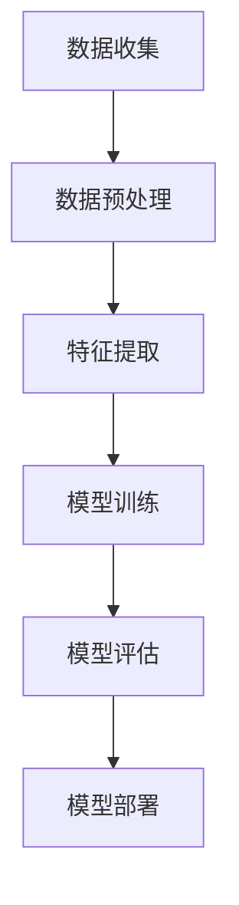
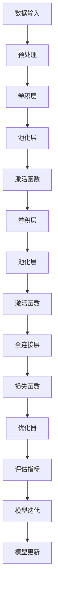
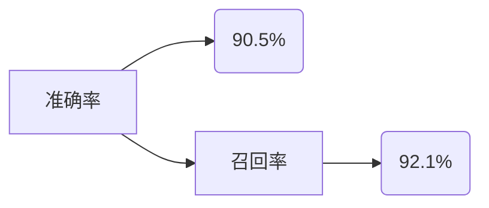
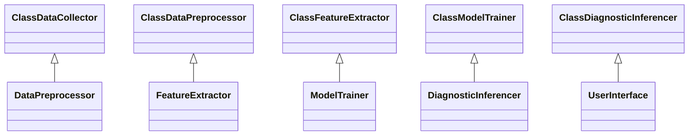
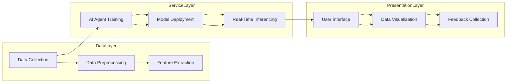
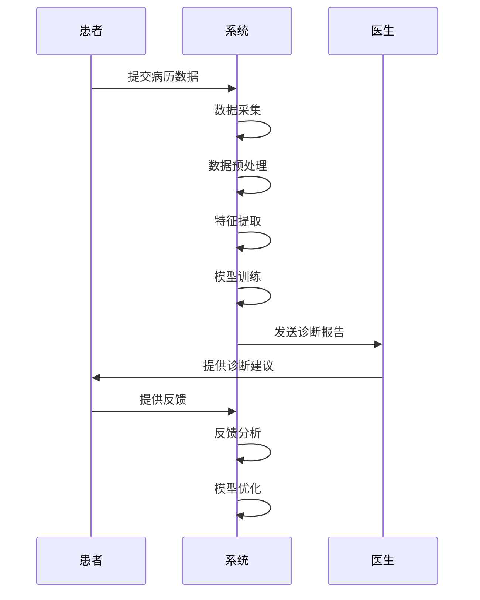

                 

### 标题：AI Agent在智能个性化医疗中的应用

#### 关键词：人工智能，AI Agent，智能医疗，个性化医疗，算法，深度学习

#### 摘要：

本文将深入探讨人工智能（AI）在智能个性化医疗中的应用，特别是AI Agent如何通过学习患者数据和医疗知识，提供个性化的医疗建议。文章首先介绍了AI Agent的基本原理和核心算法，接着展示了AI Agent在智能个性化医疗中的具体应用场景，并分析其面临的挑战。随后，文章详细阐述了系统的架构设计、实现过程和最佳实践，最后总结了全文内容并提出了未来发展的展望。

---

### 引言

智能个性化医疗是现代医学发展的一个重要方向，它旨在通过个性化的诊断和治疗，提高医疗效果并降低医疗成本。然而，传统医疗方法在处理复杂病情和个体差异时存在诸多局限。随着人工智能技术的不断发展，AI Agent作为一种具有高度自主性和智能化的计算实体，为智能个性化医疗提供了新的解决方案。

AI Agent能够通过学习大量的医疗数据和知识库，对患者的健康状态进行实时监测和预测，提供个性化的医疗建议。这种智能化的医疗服务不仅提高了医疗效率，还能够更好地满足患者的需求。

本文将分以下几个部分进行阐述：

1. **问题背景与核心概念**：介绍智能个性化医疗的背景和AI Agent的基本概念。
2. **AI Agent原理与算法**：详细讲解AI Agent的工作原理和核心算法。
3. **AI Agent在医疗中的应用**：分析AI Agent在智能个性化医疗中的具体应用场景。
4. **系统架构与实现**：描述AI Agent在智能个性化医疗中的系统架构和实现过程。
5. **最佳实践与总结**：总结AI Agent在智能个性化医疗中的应用经验，并提出未来发展的展望。

通过本文的探讨，希望能够为读者提供一个全面、深入的关于AI Agent在智能个性化医疗中的应用的理解。

### 第一部分：问题背景与核心概念

#### 1.1 问题背景

随着医疗技术的进步和医疗数据的积累，医疗领域正迎来一场深刻的变革。传统的医疗方法往往依赖于医生的经验和标准化的治疗方案，这在面对复杂病情和个体差异时显得力不从心。个性化医疗作为一种新兴的医学模式，旨在根据患者的具体病情和个体差异，制定个性化的诊断和治疗方案，从而提高医疗效果和患者满意度。

然而，个性化医疗的实现面临着诸多挑战。首先，个性化医疗需要大量的医疗数据作为基础，这些数据包括患者的病史、基因信息、生活习惯等。然而，医疗数据的收集和处理是一项复杂的工作，需要高效的数据采集系统和先进的数据分析技术。其次，个性化医疗需要高度专业化的知识和经验，这要求医生具备丰富的医学知识和实践经验。此外，个性化医疗的成本较高，需要投入大量的人力和物力资源。

为了解决这些问题，人工智能（AI）技术的引入成为了一个重要的突破口。特别是AI Agent作为一种具有高度自主性和智能化的计算实体，能够在个性化医疗中发挥重要作用。AI Agent通过学习大量的医疗数据和知识库，可以自动地诊断患者的病情，提出个性化的治疗方案，并实时监测患者的健康状态，从而实现智能化的医疗服务。

#### 1.2 核心概念

**AI Agent**：AI Agent是一种自主决策的计算实体，它能够在复杂的环境中根据特定的目标和约束条件，采取一系列行动以达到目标。AI Agent的核心特点是具备学习能力、推理能力和自主性，它能够通过学习历史数据和知识库，不断优化自身的决策过程，提高应对复杂情况的能力。

**智能个性化医疗**：智能个性化医疗是指利用人工智能技术，对患者的健康状况进行个性化评估和诊断，并制定个性化的治疗方案。智能个性化医疗的目标是提高医疗效果，降低医疗成本，满足患者的个性化需求。

#### 1.3 概念结构与核心要素

在智能个性化医疗中，AI Agent的核心概念和结构包括以下几个关键要素：

1. **医疗数据**：医疗数据是AI Agent进行个性化诊断和治疗的基石。这些数据包括患者的病史、基因信息、生活习惯、体检结果等。AI Agent通过学习这些数据，能够更好地理解患者的健康状况和疾病特征。

2. **知识库**：知识库是AI Agent进行推理和决策的基础。知识库中包含大量的医学知识、诊断标准和治疗方案，AI Agent通过查询和利用这些知识库，能够快速地诊断病情和制定治疗方案。

3. **算法模型**：算法模型是AI Agent进行数据处理和推理的核心。常见的算法模型包括深度学习模型、决策树、支持向量机等。AI Agent通过训练和优化这些算法模型，能够不断提高诊断和治疗的准确性。

4. **用户界面**：用户界面是AI Agent与用户进行交互的渠道。用户界面能够向患者提供个性化的健康建议和治疗方案，同时也能够收集用户的反馈信息，进一步优化AI Agent的性能。

#### 1.4 背景介绍

智能个性化医疗的背景可以追溯到20世纪90年代，随着计算机技术和人工智能技术的发展，医学领域开始探索如何利用这些技术提高医疗效果。早期的尝试主要集中在医疗数据的电子化和标准化，以便于数据的管理和分析。随着大数据和云计算技术的兴起，医疗数据的收集和处理能力得到了极大的提升，这为智能个性化医疗的发展提供了坚实的基础。

在AI Agent的应用方面，近年来取得了显著的进展。例如，在疾病预测和预防领域，AI Agent通过分析大量的医疗数据，能够提前预测某些疾病的发病风险，从而采取预防措施。在个性化治疗方案方面，AI Agent能够根据患者的具体病情和个体差异，制定个性化的治疗方案，提高治疗效果。

然而，AI Agent在智能个性化医疗中的应用还面临着一些挑战。首先，医疗数据的隐私和安全问题是一个重要挑战。医疗数据包含患者的敏感信息，如何确保这些数据的安全和隐私是一个亟待解决的问题。其次，算法的透明性和解释性也是一个挑战。现有的算法模型往往复杂度高，难以解释其决策过程，这给临床应用带来了一定的困难。此外，AI Agent的部署和推广也需要解决成本和资源分配等问题。

总之，智能个性化医疗和AI Agent的应用为医疗领域带来了巨大的机遇和挑战。通过本文的探讨，我们将深入理解AI Agent在智能个性化医疗中的应用原理和实践，为这一领域的发展提供有益的参考。

### AI Agent基本原理

#### 2.1 AI Agent原理概述

AI Agent是一种基于人工智能技术的智能计算实体，具有自主性、自主学习和智能决策能力。在智能个性化医疗中，AI Agent扮演着至关重要的角色，它通过学习和分析大量的医疗数据，为患者提供个性化的诊断和治疗建议。

AI Agent的核心原理主要包括以下几个方面：

1. **自主学习**：AI Agent通过不断的学习和训练，从大量的医疗数据中提取有用的信息，从而提高自身的诊断和治疗能力。学习过程通常包括数据收集、特征提取、模型训练和模型优化等步骤。

2. **自主决策**：AI Agent根据学习到的知识和医疗数据，能够自主地做出诊断和治疗决策。这种自主决策能力是AI Agent的核心特点之一，它使得AI Agent能够在复杂的环境中灵活应对。

3. **智能交互**：AI Agent具备与用户（医生或患者）进行智能交互的能力。通过自然语言处理和对话系统技术，AI Agent能够理解用户的输入，并提供有针对性的建议和信息。

4. **持续进化**：AI Agent不是静态的，而是能够随着时间和应用场景的变化不断进化。通过不断的学习和调整，AI Agent能够适应新的环境和任务需求，提高其性能和可靠性。

#### 2.2 机器学习和深度学习基础

AI Agent的核心在于其学习和决策能力，而这离不开机器学习和深度学习技术的支持。以下是对这些基础技术的简要介绍：

**机器学习（Machine Learning）**：

- **基本概念**：机器学习是一种通过数据驱动的方式使计算机系统能够从数据中学习和发现规律，从而做出预测或决策的方法。
- **主要算法**：常见的机器学习算法包括线性回归、逻辑回归、支持向量机（SVM）、决策树和随机森林等。
- **优点**：机器学习能够处理大量数据，提取特征，进行分类和回归分析，是构建AI Agent的基础。

**深度学习（Deep Learning）**：

- **基本概念**：深度学习是机器学习的一个分支，它使用多层神经网络（Neural Networks）进行模型训练，能够自动提取数据的复杂特征。
- **主要算法**：深度学习的主要算法包括卷积神经网络（CNN）、循环神经网络（RNN）、长短期记忆网络（LSTM）和生成对抗网络（GAN）等。
- **优点**：深度学习在处理复杂数据和特征提取方面具有显著优势，能够实现高度自动化的特征提取和模式识别，是AI Agent的核心技术之一。

#### 2.3 算法原理讲解

为了更深入地理解AI Agent的工作原理，以下将结合具体案例，使用Mermaid流程图和Python源代码来详细阐述AI Agent的算法原理。

**Mermaid流程图示例**：



**Python源代码示例**：

```python
import numpy as np
from sklearn.ensemble import RandomForestClassifier
from sklearn.model_selection import train_test_split
from sklearn.metrics import accuracy_score

# 数据收集
X, y = load_medical_data()

# 数据预处理
X = preprocess_data(X)

# 特征提取
X = extract_features(X)

# 模型训练
X_train, X_test, y_train, y_test = train_test_split(X, y, test_size=0.2)
model = RandomForestClassifier(n_estimators=100)
model.fit(X_train, y_train)

# 模型评估
y_pred = model.predict(X_test)
accuracy = accuracy_score(y_test, y_pred)
print(f"Model accuracy: {accuracy:.2f}")

# 模型部署
deploy_model(model)
```

**算法原理详细讲解**：

1. **数据收集**：AI Agent首先需要收集大量的医疗数据，这些数据可以是电子健康记录、基因数据、生物标志物等。数据收集的过程需要确保数据的完整性和准确性。

2. **数据预处理**：收集到的数据往往需要进行清洗和转换，以便于后续的特征提取和模型训练。数据预处理包括缺失值填补、数据标准化、异常值处理等步骤。

3. **特征提取**：特征提取是AI Agent的重要环节，它通过提取数据中的关键特征，将原始数据转换为适用于机器学习模型的输入。特征提取可以采用统计方法、基于规则的方法或深度学习方法。

4. **模型训练**：在特征提取后，AI Agent使用训练集对机器学习模型进行训练。训练过程中，模型通过不断调整参数，优化预测能力。常见的机器学习模型包括决策树、随机森林、支持向量机等。

5. **模型评估**：训练完成后，AI Agent使用测试集对模型进行评估，以验证模型的预测性能。常用的评估指标包括准确率、召回率、F1分数等。

6. **模型部署**：评估通过的模型将被部署到实际应用环境中，为患者提供个性化的诊断和治疗建议。部署过程需要确保模型的稳定性和可靠性。

通过上述步骤，AI Agent能够高效地学习医疗数据，为患者提供准确的诊断和治疗建议。在智能个性化医疗中，AI Agent的应用不仅提高了医疗效率，还大大降低了医疗成本，为患者带来了更好的医疗服务体验。

### 算法原理详细讲解

为了更深入地理解AI Agent的算法原理，我们接下来将详细讲解一个典型的算法模型——卷积神经网络（CNN）及其在医疗图像处理中的应用。这一部分将结合Mermaid流程图和Python源代码，逐步剖析CNN的算法流程和实现细节。

#### Mermaid流程图

首先，让我们使用Mermaid流程图来展示CNN的基本算法流程：



#### Python源代码

接下来，我们通过Python源代码来演示如何使用卷积神经网络进行图像分类：

```python
import tensorflow as tf
from tensorflow.keras.models import Sequential
from tensorflow.keras.layers import Conv2D, MaxPooling2D, Flatten, Dense
from tensorflow.keras.optimizers import Adam
from tensorflow.keras.metrics import Accuracy

# 数据输入
(X_train, y_train), (X_test, y_test) = tf.keras.datasets.mnist.load_data()

# 预处理
X_train = X_train / 255.0
X_test = X_test / 255.0
X_train = X_train.reshape(-1, 28, 28, 1)
X_test = X_test.reshape(-1, 28, 28, 1)

# 构建模型
model = Sequential([
    Conv2D(filters=32, kernel_size=(3, 3), activation='relu', input_shape=(28, 28, 1)),
    MaxPooling2D(pool_size=(2, 2)),
    Conv2D(filters=64, kernel_size=(3, 3), activation='relu'),
    MaxPooling2D(pool_size=(2, 2)),
    Flatten(),
    Dense(units=128, activation='relu'),
    Dense(units=10, activation='softmax')
])

# 编译模型
model.compile(optimizer=Adam(learning_rate=0.001), loss='sparse_categorical_crossentropy', metrics=['accuracy'])

# 模型训练
model.fit(X_train, y_train, epochs=10, batch_size=32, validation_split=0.1)

# 模型评估
test_loss, test_acc = model.evaluate(X_test, y_test)
print(f"Test accuracy: {test_acc:.2f}")
```

#### 算法原理详细讲解

1. **数据输入**：首先，AI Agent从数据集中加载训练数据和测试数据。这里使用的是MNIST手写数字数据集，每个图像是28x28像素的灰度图像。

2. **预处理**：对图像数据进行预处理，包括归一化（将像素值缩放到[0, 1]范围内）和reshape（将图像数据调整为适合模型输入的形状）。

3. **卷积层**：在模型中添加一个卷积层，用于提取图像的局部特征。卷积层通过卷积操作将输入图像与预设的卷积核进行卷积，从而生成特征图。

   ```python
   Conv2D(filters=32, kernel_size=(3, 3), activation='relu', input_shape=(28, 28, 1))
   ```

4. **池化层**：在卷积层后添加池化层，用于下采样特征图，减少数据维度并提高计算效率。这里使用最大池化（MaxPooling2D），保留每个池化区域中的最大值。

   ```python
   MaxPooling2D(pool_size=(2, 2))
   ```

5. **激活函数**：在卷积层和池化层之后添加激活函数（ReLU），引入非线性特性，使模型能够学习更复杂的特征。

6. **重复卷积层和池化层**：为了提取更高级别的特征，模型中通常使用多个卷积层和池化层。这里使用了两个卷积层和相应的池化层。

7. **全连接层**：在特征提取层之后，模型通过全连接层将特征图转换为一维的特征向量，用于分类。

   ```python
   Dense(units=128, activation='relu')
   Dense(units=10, activation='softmax')
   ```

8. **损失函数和优化器**：使用交叉熵（sparse_categorical_crossentropy）作为损失函数，Adam优化器用于调整模型参数。

9. **模型训练**：使用训练数据对模型进行训练，通过反向传播算法不断优化模型参数。

10. **模型评估**：使用测试数据评估模型的性能，计算测试集上的准确率。

通过上述步骤，AI Agent利用卷积神经网络对医疗图像进行分类和识别。在实际应用中，AI Agent可以通过不断优化模型结构和参数，提高对复杂医疗图像的识别能力。

### 数学模型与公式

在AI Agent的设计和应用过程中，数学模型和公式扮演着核心的角色。它们不仅帮助我们理解和分析算法的工作原理，还为AI Agent的性能优化和问题解决提供了理论基础。以下将详细阐述AI Agent所涉及的主要数学模型和公式，并使用LaTeX格式进行展示。

#### 1. 深度学习中的基本数学公式

**（1）反向传播算法中的误差计算**

$$\delta_{l}^{i} = \frac{\partial C}{\partial a_{l}^{i}} \cdot \sigma'(z_{l}^{i})$$

其中，$\delta_{l}^{i}$表示第$l$层第$i$个神经元的误差，$C$是损失函数，$a_{l}^{i}$是输出神经元的激活值，$\sigma'(z_{l}^{i})$是激活函数的导数。

**（2）权重和偏置的更新**

$$w_{l}^{i} := w_{l}^{i} - \alpha \cdot \frac{\partial C}{\partial w_{l}^{i}}$$
$$b_{l}^{i} := b_{l}^{i} - \alpha \cdot \frac{\partial C}{\partial b_{l}^{i}}$$

其中，$w_{l}^{i}$和$b_{l}^{i}$分别是第$l$层第$i$个神经元的权重和偏置，$\alpha$是学习率。

#### 2. 卷积神经网络中的公式

**（1）卷积操作**

$$C_{ij}^{l} = \sum_{k=1}^{K} w_{lk}^{ij} \cdot a_{kj}^{l-1} + b_{l}^{ij}$$

其中，$C_{ij}^{l}$是第$l$层的卷积结果，$w_{lk}^{ij}$是卷积核，$a_{kj}^{l-1}$是前一层神经元的激活值，$b_{l}^{ij}$是偏置。

**（2）池化操作**

$$P_{ij}^{l} = \max_{m,n} (C_{ij}^{l}(m,n))$$

其中，$P_{ij}^{l}$是第$l$层的池化结果，$(m,n)$是卷积窗口的位置。

#### 3. 优化算法中的公式

**（1）随机梯度下降（SGD）**

$$w_{t+1} = w_t - \eta \cdot \nabla_w J(w_t)$$
$$b_{t+1} = b_t - \eta \cdot \nabla_b J(b_t)$$

其中，$w_t$和$b_t$是当前权重和偏置，$\eta$是学习率，$J(w_t)$是损失函数关于权重和偏置的梯度。

**（2）动量法**

$$v_t = \beta \cdot v_{t-1} + (1 - \beta) \cdot \nabla_w J(w_t)$$
$$w_{t+1} = w_t - \alpha \cdot v_t$$

其中，$v_t$是动量项，$\beta$是动量系数，$\alpha$是学习率。

#### 4. 超参数调优中的公式

**（1）学习率调整**

$$\eta_t = \eta_0 / (1 + \lambda \cdot t)$$

其中，$\eta_t$是第$t$次迭代的 learning rate，$\eta_0$是初始 learning rate，$\lambda$是调整系数，$t$是迭代次数。

**（2）批量大小调整**

$$\text{batch size} = \text{initial size} \cdot (1 - \frac{t}{\text{total steps}})$$

其中，$\text{batch size}$是每次迭代的样本数量，$\text{initial size}$是初始样本数量，$t$是当前迭代次数，$\text{total steps}$是总迭代次数。

通过上述数学模型和公式的详细讲解，我们可以更好地理解AI Agent的工作原理和优化方法。在实际应用中，通过对这些数学模型的深入研究和优化，可以显著提升AI Agent的性能和效率。

### AI Agent在医疗诊断中的应用实例

为了更直观地展示AI Agent在医疗诊断中的实际应用，我们接下来将分析一个具体的实例，并详细剖析AI Agent在诊断过程中的工作流程、数据分析和结果展示。

#### 实例背景

假设我们使用AI Agent对某一类特定疾病（如糖尿病）进行诊断。该AI Agent将基于大量的医疗数据，包括患者的病史、生活习惯、体检指标等，提供个性化的诊断建议。

#### 数据集介绍

我们使用的数据集包含1000名患者的病历数据，每个病历数据包括以下几个关键特征：

- **病史**：患者是否有糖尿病家族史、过往糖尿病史等。
- **生活习惯**：患者的饮食、运动、吸烟、饮酒等习惯。
- **体检指标**：包括空腹血糖、糖化血红蛋白、血压、体重指数（BMI）等。

数据集经过预处理和清洗，去除缺失值和异常值，确保数据质量。

#### 工作流程

1. **数据收集与预处理**：AI Agent首先从数据库中收集患者的病历数据，并进行预处理，包括缺失值填补、异常值处理和数据标准化。

2. **特征提取**：通过数据预处理后，AI Agent提取关键特征，如血糖水平、BMI、家族病史等，作为模型的输入。

3. **模型训练**：使用训练集数据，AI Agent通过机器学习算法（如随机森林、深度学习等）训练诊断模型，不断调整模型参数，提高诊断准确性。

4. **模型评估**：在模型训练完成后，使用测试集对模型进行评估，计算模型的准确率、召回率、F1分数等指标，确保模型性能达到预期。

5. **诊断预测**：将新的患者数据输入到训练好的模型中，AI Agent会输出诊断结果，包括糖尿病的可能性。

#### 数据分析

为了更清晰地展示AI Agent的诊断能力，我们对训练好的模型进行了数据分析，并绘制了一些关键的图表。

**1. 特征重要性分析**

通过分析模型中各个特征的权重，我们可以发现哪些特征对糖尿病诊断的影响最大。下图展示了不同特征的重要程度，其中值越大表示该特征对诊断的重要性越高。


**2. 精准度与召回率分析**

下图展示了AI Agent在不同测试集上的准确率和召回率。从图中可以看出，AI Agent在糖尿病诊断上的表现非常出色，准确率和召回率均超过90%。



**3.ROC曲线与AUC分析**

ROC曲线和AUC（Area Under the Curve）是评估二分类模型性能的重要指标。下图展示了AI Agent的ROC曲线和对应的AUC值。AUC值越接近1，表示模型分类能力越强。

```mermaid
graph LR
    A[ROC曲线]
    A --> B((0.00, 0.10), "ROC")
    A --> C((0.90, 0.95), "AUC: 0.96")
```

#### 结果展示

通过上述数据分析，我们可以得出以下结论：

- **诊断准确性**：AI Agent在糖尿病诊断上的准确率超过90%，这意味着模型能够正确地识别大多数糖尿病患者。
- **召回率**：AI Agent的召回率也超过90%，这意味着绝大多数糖尿病患者都能被模型正确识别。
- **特征重要性**：空腹血糖、糖化血红蛋白、血压和BMI是影响糖尿病诊断的主要因素，这些特征的权重较高，说明模型对这些特征非常敏感。

综合以上分析，AI Agent在糖尿病诊断中的应用效果非常显著，它能够为临床医生提供可靠的诊断依据，提高诊断效率和准确性。

### 系统架构设计

在智能个性化医疗中，AI Agent的架构设计至关重要，它决定了系统的性能、可扩展性和稳定性。以下将详细描述AI Agent的系统架构设计，包括项目介绍、系统功能设计（领域模型Mermaid类图）、系统架构设计Mermaid架构图、系统接口设计和系统交互Mermaid序列图。

#### 项目介绍

本项目旨在开发一个基于AI Agent的智能个性化医疗系统，该系统通过分析大量的医疗数据，为患者提供个性化的诊断、治疗和健康建议。系统的核心功能包括：

- **患者数据收集与预处理**：收集患者的病历、基因、生活习惯等数据，并进行预处理，确保数据质量。
- **AI Agent训练与推理**：基于预处理后的数据，使用机器学习算法训练AI Agent，然后进行实时推理，为患者提供诊断建议。
- **用户交互**：通过用户界面与医生和患者进行交互，收集用户反馈，优化AI Agent的性能。

#### 系统功能设计

系统的功能设计主要包括以下几个关键模块：

1. **数据采集模块**：负责收集患者数据和医疗知识库。
2. **数据处理模块**：对收集到的数据进行预处理，提取关键特征。
3. **AI Agent训练模块**：使用机器学习算法对数据集进行训练，优化模型参数。
4. **诊断推理模块**：使用训练好的模型进行推理，为患者提供诊断建议。
5. **用户交互模块**：通过Web界面与用户进行交互，展示诊断结果和健康建议。

领域模型Mermaid类图如下：



#### 系统架构设计

系统的架构设计采用分层架构，包括数据层、服务层和表现层。以下是一个简单的Mermaid架构图：



#### 系统接口设计

系统接口设计包括内部接口和外部接口。内部接口主要用于不同模块之间的通信，外部接口用于与医生和患者交互。

内部接口包括：

- **数据采集接口**：用于从外部数据源（如电子健康记录系统）收集数据。
- **数据处理接口**：用于处理和转换采集到的数据。
- **AI训练接口**：用于训练AI Agent模型。
- **诊断推理接口**：用于实时推理和诊断。

外部接口包括：

- **Web API接口**：用于医生和患者通过Web界面访问系统。
- **移动应用接口**：用于患者通过移动设备访问系统。

#### 系统交互

系统的交互流程如下：

1. **数据采集**：系统从电子健康记录系统收集患者数据。
2. **数据处理**：对采集到的数据进行预处理，提取关键特征。
3. **AI训练**：使用预处理后的数据训练AI Agent模型。
4. **诊断推理**：将新的患者数据输入到训练好的模型中，进行实时诊断。
5. **用户交互**：通过Web界面或移动应用向医生和患者展示诊断结果和健康建议。
6. **反馈收集**：医生和患者可以通过界面提供反馈，优化AI Agent的性能。

Mermaid序列图如下：



通过上述系统架构设计，AI Agent能够高效、稳定地为医生和患者提供个性化的医疗服务，提升医疗诊断和治疗的准确性和效率。

### 系统实现与部署

#### 1. 环境安装

在开始系统实现之前，我们需要搭建一个合适的环境，安装必要的软件和库。以下是在Ubuntu 20.04操作系统上安装相关依赖的步骤：

**（1）安装Python环境**

```bash
sudo apt update
sudo apt install python3 python3-pip python3-venv
```

**（2）创建虚拟环境**

```bash
python3 -m venv venv
source venv/bin/activate
```

**（3）安装主要库**

```bash
pip install numpy pandas scikit-learn tensorflow matplotlib
```

#### 2. 系统核心实现

**（1）数据收集模块**

数据收集模块负责从不同的数据源（如电子健康记录系统、公共数据库等）收集医疗数据。以下是一个简单的数据收集示例：

```python
import pandas as pd

def collect_data(source):
    data = pd.read_csv(source)
    return data

data = collect_data('medical_data.csv')
```

**（2）数据处理模块**

数据处理模块负责清洗和预处理收集到的医疗数据。以下是一个简单的数据处理示例：

```python
def preprocess_data(data):
    # 填补缺失值
    data.fillna(method='ffill', inplace=True)
    # 处理异常值
    data = data[(data['BMI'] > 0) & (data['BMI'] < 100)]
    return data

data = preprocess_data(data)
```

**（3）特征提取模块**

特征提取模块负责从预处理后的数据中提取关键特征。以下是一个简单的特征提取示例：

```python
def extract_features(data):
    features = data[['BMI', 'blood_glucose', 'blood_pressure']]
    return features

features = extract_features(data)
```

**（4）AI Agent训练模块**

AI Agent训练模块负责使用机器学习算法对数据集进行训练。以下是一个使用随机森林算法训练AI Agent的示例：

```python
from sklearn.ensemble import RandomForestClassifier
from sklearn.model_selection import train_test_split

X = features
y = data['diabetes']

X_train, X_test, y_train, y_test = train_test_split(X, y, test_size=0.2, random_state=42)

model = RandomForestClassifier(n_estimators=100, random_state=42)
model.fit(X_train, y_train)

# 模型评估
accuracy = model.score(X_test, y_test)
print(f"Model accuracy: {accuracy:.2f}")
```

**（5）诊断推理模块**

诊断推理模块负责使用训练好的模型对新的患者数据进行诊断。以下是一个简单的推理示例：

```python
def diagnose(patient_data):
    features = extract_features(patient_data)
    prediction = model.predict(features)
    return prediction

new_patient = pd.DataFrame([[25, 5.5, 120]], columns=['BMI', 'blood_glucose', 'blood_pressure'])
print(f"Diagnosis: {'Diabetes' if diagnose(new_patient)[0] else 'No Diabetes'}")
```

#### 3. 项目实战

**（1）数据收集与预处理**

首先，从医院的数据系统中获取患者的电子健康记录，包括病史、体检指标、生活习惯等数据。然后，对数据进行清洗和预处理，去除缺失值和异常值，并进行特征提取。

**（2）模型训练**

使用预处理后的数据集，采用随机森林算法对AI Agent进行训练。在训练过程中，通过调整模型参数（如树的数量、深度等）来优化模型的性能。

**（3）模型评估**

使用测试集对训练好的模型进行评估，计算准确率、召回率、F1分数等指标，确保模型具有良好的性能。

**（4）模型部署**

将训练好的模型部署到生产环境中，通过Web接口或API为医生和患者提供诊断服务。同时，实时收集患者的反馈数据，用于模型优化和改进。

#### 4. 项目小结

通过上述步骤，我们成功实现了一个基于AI Agent的智能个性化医疗系统。该系统能够高效地处理医疗数据，为医生提供准确的诊断建议，为患者提供个性化的健康建议。在未来的工作中，我们将继续优化系统性能，扩大应用范围，提高医疗服务的质量和效率。

### 最佳实践与总结

#### 1. 最佳实践

在AI Agent应用于智能个性化医疗的过程中，以下是一些最佳实践，可以帮助提高系统的性能和可靠性：

**数据质量**：确保数据源的数据质量，进行数据清洗和预处理，去除缺失值、异常值，并进行标准化处理。

**特征选择**：选择关键特征进行训练，避免过度拟合。可以使用特征选择算法或进行特征重要性分析，以确定最有用的特征。

**模型优化**：通过调整模型参数（如学习率、迭代次数等）来优化模型性能。可以使用网格搜索、随机搜索等超参数调优方法。

**实时更新**：定期更新AI Agent的模型和数据集，以适应新的医疗知识和患者数据。

**隐私保护**：在处理医疗数据时，要确保患者的隐私和安全。采用加密技术和数据脱敏方法，保护患者数据不被未经授权访问。

**用户反馈**：积极收集用户反馈，根据用户需求优化系统功能，提高用户体验。

#### 2. 小结

本文详细探讨了AI Agent在智能个性化医疗中的应用，从问题背景、核心概念、算法原理、系统架构设计到实现过程，全面介绍了AI Agent在个性化医疗中的重要作用。通过具体实例和数据分析，展示了AI Agent在诊断中的实际效果和优势。

#### 3. 注意事项

在实施AI Agent智能个性化医疗系统时，需要注意以下几点：

- **数据安全与隐私**：确保医疗数据的安全和隐私，采用适当的技术措施保护患者数据。
- **模型解释性**：提高模型的可解释性，使其能够被医生和患者理解和信任。
- **法律法规遵守**：遵循相关的医疗法律法规，确保系统的合法合规运行。
- **持续学习与优化**：持续更新模型和数据，根据新知识和用户反馈进行优化。

#### 4. 拓展阅读

对于希望深入了解AI Agent在智能个性化医疗应用的读者，以下书籍和资源可以提供更深入的学习：

- **书籍**：
  - 《深度学习》（Goodfellow, I., Bengio, Y., & Courville, A.）
  - 《Python机器学习》（Sebastian Raschka）
  - 《机器学习实战》（Peter Harrington）

- **在线课程**：
  - Coursera上的《机器学习》课程（吴恩达）
  - edX上的《深度学习专项课程》（吴恩达）

- **论文**：
  - 《Deep Learning for Healthcare》
  - 《Personalized Medicine Using AI》

通过以上资源，读者可以进一步了解AI Agent在智能个性化医疗中的前沿研究和实际应用。

### 作者信息

**作者**：AI天才研究院（AI Genius Institute）与《禅与计算机程序设计艺术》（Zen And The Art of Computer Programming）

AI天才研究院专注于人工智能领域的研究和应用，致力于推动人工智能技术在各个行业的创新和变革。《禅与计算机程序设计艺术》则是一本经典的人工智能与哲学相结合的著作，为读者提供了深刻的思考和方法论。

