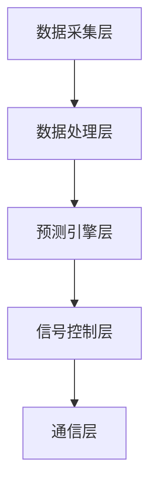
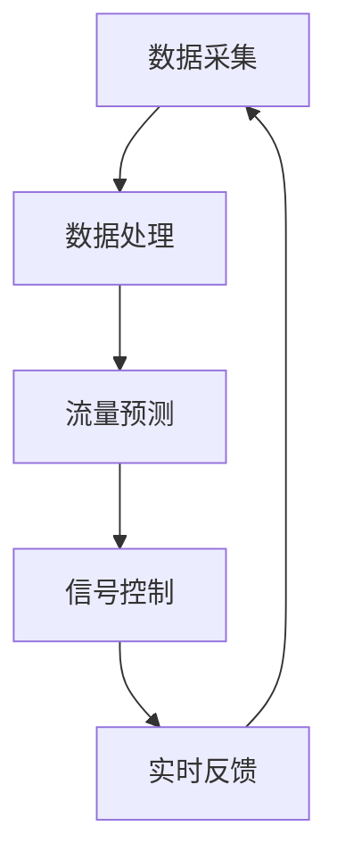

                 

### AI Agent在智能交通流量预测中的实践

> 关键词：智能交通，AI Agent，流量预测，算法实现，系统架构，项目实战

> 摘要：本文将深入探讨AI Agent在智能交通流量预测中的实际应用。首先，我们将介绍智能交通流量预测的重要性以及AI Agent的基本概念。接着，我们将分析不同的AI Agent算法，包括决策树、随机森林和神经网络，并通过实际案例展示这些算法在智能交通流量预测中的运用。文章还将详细描述智能交通流量预测系统的构建过程，从需求分析到系统部署，最后通过一个实际案例进行剖析，总结实践经验并展望未来发展趋势。

#### 目录大纲设计思路

《AI Agent在智能交通流量预测中的实践》这本书的目录大纲设计旨在为读者提供一个系统、全面且易于理解的智能交通流量预测解决方案。以下是目录大纲的设计思路：

**1. 背景介绍：**
   - 交通流量预测的重要性
   - 智能交通系统的发展现状
   - AI Agent的基本概念
   - AI Agent在交通管理中的应用

**2. 核心概念与联系：**
   - AI Agent的基本原理
   - AI Agent的分类与特点
   - AI Agent与智能交通流量预测的关系

**3. 算法原理讲解：**
   - 决策树与随机森林算法原理
   - 神经网络与深度学习算法原理
   - 算法在智能交通流量预测中的应用

**4. 数学模型与公式：**
   - 算法背后的数学原理
   - 数学公式与解释

**5. 系统分析与架构设计：**
   - 智能交通流量预测系统构建
   - 系统架构设计
   - 系统接口设计与交互流程

**6. 项目实战：**
   - 实际案例研究
   - 系统核心实现与代码分析
   - 案例分析与详细讲解

**7. 最佳实践与总结：**
   - 实践经验总结
   - 最佳实践建议
   - 未来发展趋势展望

通过以上章节设计，本文旨在帮助读者全面理解AI Agent在智能交通流量预测中的应用，并提供实用的实现经验和思考。

### 第一部分：背景与基础

#### 1.1 问题背景

智能交通流量预测是现代交通管理中至关重要的一项任务。随着城市化进程的加快，交通拥堵问题日益严重，不仅影响了人们的出行效率，还带来了严重的环境问题和安全隐患。因此，准确预测交通流量，及时调整交通信号、优化交通路线等，成为缓解交通拥堵、提高交通效率的关键手段。

交通流量预测的重要性体现在以下几个方面：

1. **交通信号优化：** 通过实时预测交通流量，可以动态调整交通信号灯的时长，减少交通拥堵，提高道路通行效率。
2. **交通路线规划：** 预测交通流量，可以帮助驾驶者选择最佳路线，避开拥堵区域，降低出行时间。
3. **紧急事件响应：** 在紧急事件发生时，预测系统可以迅速分析交通状况，为紧急车辆的通行提供最优路径。
4. **城市规划：** 长期的交通流量预测数据可以为城市规划提供科学依据，优化交通网络布局，提高城市交通系统的整体效率。

然而，传统的交通流量预测方法存在诸多局限性。例如，基于历史数据的统计方法容易受到数据质量和样本量不足的影响，而基于规则的预测模型则难以应对复杂多变的交通环境。因此，引入AI Agent技术，尤其是利用机器学习和深度学习算法，可以显著提高交通流量预测的准确性和适应性。

#### 1.2 AI Agent的基本概念

AI Agent是指能够模拟人类智能行为，具备自主决策能力的人工智能实体。AI Agent通过感知环境、分析数据、做出决策和执行任务，实现智能化的自动化操作。在智能交通流量预测中，AI Agent可以视为一种智能体，负责实时收集交通数据，分析交通状态，预测未来流量，并提出优化建议。

AI Agent的基本概念包括以下几个方面：

1. **感知器：** AI Agent通过感知器接收外部环境的信息，如交通流量、车辆速度、道路状况等。
2. **决策模块：** 根据感知到的信息，AI Agent利用机器学习算法进行分析，做出最优决策。
3. **执行器：** AI Agent将决策结果传递给执行器，如交通信号控制器，实施相应的交通管理措施。

AI Agent在交通管理中的应用非常广泛，包括但不限于：

1. **交通信号控制：** AI Agent可以动态调整交通信号灯的时长，缓解交通拥堵。
2. **车辆调度：** 在公共交通系统中，AI Agent可以优化线路调度，提高运营效率。
3. **车辆导航：** AI Agent可以为驾驶者提供实时的交通信息，优化行车路线。
4. **紧急事件响应：** 在突发事件发生时，AI Agent可以迅速分析交通状况，提供应急解决方案。

#### 1.3 AI Agent的分类与特点

AI Agent可以根据其工作机制和功能特点分为多种类型。以下是一些常见的AI Agent类型及其特点：

1. **决策型Agent：** 这种Agent通过分析历史数据和实时信息，制定最优决策。例如，交通信号控制器就是决策型Agent的一个典型应用。

2. **观察型Agent：** 这种Agent专注于收集和记录环境信息，不具备直接的决策能力。交通流量监测系统就是一个典型的观察型Agent。

3. **反应型Agent：** 这种Agent根据感知到的环境变化立即做出反应，而不进行复杂的分析。例如，自动停车系统中的车位检测器就是反应型Agent。

以下是一个对比表格，展示了不同类型AI Agent的主要特点：

| 类型         | 特点                                                         | 应用场景                       |
| ------------ | ------------------------------------------------------------ | ---------------------------- |
| 决策型Agent  | 通过分析历史数据和实时信息，制定最优决策                         | 交通信号控制、智能导航系统         |
| 观察型Agent  | 专注于收集和记录环境信息，不具备直接的决策能力                   | 交通流量监测、环境监测系统         |
| 反应型Agent  | 根据感知到的环境变化立即做出反应，而不进行复杂的分析             | 自动停车系统、智能安保系统         |

通过以上介绍，我们可以看到AI Agent在智能交通流量预测中具有极大的应用潜力。接下来，我们将深入探讨不同AI Agent算法的实现原理，并通过实际案例展示其在智能交通流量预测中的具体应用。

### 第二部分：核心概念与联系

#### 2.1 AI Agent的基本原理

AI Agent是指具有智能行为和自主决策能力的人工智能实体。它通过感知环境、获取信息、进行分析和推理，最终做出决策并执行相应动作，从而实现自主运作。AI Agent的基本原理包括以下几个方面：

1. **感知器：** AI Agent通过感知器接收外部环境的信息，如温度、湿度、车辆速度、交通流量等。感知器可以是传感器、摄像头、GPS等设备。

2. **决策模块：** 决策模块是AI Agent的核心，负责分析感知器收集到的数据，利用机器学习算法、深度学习模型等，对交通状况进行实时预测和分析。决策模块的目标是根据当前环境和历史数据，做出最优的决策。

3. **执行器：** 执行器负责将决策模块生成的决策结果转化为实际的行动。例如，在智能交通系统中，执行器可以是交通信号灯、调度系统、导航设备等。

4. **反馈机制：** AI Agent通过反馈机制不断调整其行为，以适应动态变化的环境。例如，如果某个决策未能达到预期效果，AI Agent会重新评估决策模型，进行调整和优化。

#### 2.2 AI Agent的分类与特点

AI Agent可以根据其工作机制和功能特点分为不同的类型，以下是一些常见的AI Agent类型及其特点：

1. **决策型Agent：** 决策型Agent通过分析历史数据和实时信息，制定最优决策。这种Agent通常应用于需要复杂决策的场景，如智能交通信号控制、智能物流调度等。

   - **特点：** 具有高自主性和决策能力，能够根据环境和目标进行复杂推理和决策。
   - **应用场景：** 交通信号控制、智能配送、智能家居等。

2. **观察型Agent：** 观察型Agent专注于收集和记录环境信息，不具备直接的决策能力。这种Agent主要用于数据采集和监测，为其他决策型Agent提供数据支持。

   - **特点：** 简单、高效，专注于数据的采集和记录，不具备决策功能。
   - **应用场景：** 交通流量监测、环境监测、工业生产监控等。

3. **反应型Agent：** 反应型Agent根据感知到的环境变化立即做出反应，而不进行复杂的分析。这种Agent通常用于需要快速响应的场景，如自动停车系统、智能安保系统等。

   - **特点：** 反应迅速，但决策相对简单，依赖于预设的规则。
   - **应用场景：** 自动停车、智能安防、智能家居等。

#### 2.3 AI Agent与智能交通流量预测的关系

智能交通流量预测是AI Agent在交通管理中的典型应用场景。AI Agent通过感知交通环境信息，利用机器学习算法进行数据分析和预测，为交通管理提供决策支持。以下是AI Agent在智能交通流量预测中的具体应用：

1. **数据收集与预处理：** AI Agent通过传感器、摄像头等设备收集交通流量、车辆速度、道路状况等信息。这些数据经过预处理，用于训练预测模型。

2. **模型训练与预测：** AI Agent利用收集到的数据，通过机器学习算法训练预测模型，如决策树、随机森林、神经网络等。模型训练完成后，可以用于实时预测交通流量。

3. **决策与执行：** 根据预测结果，AI Agent可以动态调整交通信号灯时长、优化交通路线、调度公共交通等，以缓解交通拥堵、提高交通效率。

4. **反馈与优化：** AI Agent通过实时监测交通状况，与预测模型进行反馈和调整，不断提高预测准确性和决策效果。

#### 2.4 AI Agent与智能交通流量预测的关系总结

AI Agent在智能交通流量预测中发挥了关键作用，通过感知、预测、决策和执行，实现了交通管理的智能化和自动化。具体来说，AI Agent与智能交通流量预测的关系主要体现在以下几个方面：

1. **数据驱动的决策：** AI Agent通过数据收集和预处理，为交通管理提供了实时、准确的数据支持，使得决策更加科学和合理。

2. **动态调整与优化：** AI Agent可以根据实时交通状况，动态调整交通信号灯时长和交通路线，实现交通流量的高效管理。

3. **智能化与自主性：** AI Agent具有自主决策能力，能够应对复杂多变的交通环境，提高了交通管理的智能化水平。

4. **持续改进与优化：** AI Agent通过持续监测和反馈，不断优化预测模型和决策算法，提高了预测准确性和决策效果。

通过以上分析，我们可以看到AI Agent在智能交通流量预测中具有广泛的应用前景和重要作用。接下来，我们将深入探讨不同AI Agent算法的实现原理，并通过实际案例展示其在智能交通流量预测中的具体应用。

### 第三部分：算法原理讲解

在智能交通流量预测中，AI Agent的算法选择至关重要。本节将详细讲解三种常用的AI Agent算法：决策树、随机森林和神经网络，并展示其在智能交通流量预测中的具体应用。

#### 3.1 决策树算法

决策树（Decision Tree）是一种常见的数据挖掘方法，通过一系列的判断条件将数据进行分类或回归。决策树的基本原理是通过多个判断节点和叶子节点来构建一个树形结构，每个节点代表一个特征属性，每个分支代表该特征属性的取值。

**决策树的构建过程：**

1. **选择最佳分割特征：** 根据信息增益、基尼指数或卡方检验等指标，选择能够最好地分割数据的特征。
2. **构建树形结构：** 根据最佳分割特征，将数据集划分成子集，并为每个子集创建一个节点。重复此过程，直到满足终止条件（如最大树深度、节点纯度等）。
3. **剪枝：** 为了防止过拟合，可以对决策树进行剪枝，减少树的结构复杂度。

**决策树在智能交通流量预测中的应用：**

决策树可以用于分类或回归任务，根据交通流量数据的特征（如时间、天气、道路状况等）预测未来一段时间内的交通流量。通过决策树，我们可以清晰地了解不同条件下交通流量的变化趋势，为交通管理提供有力支持。

**决策树示例代码（Python）:**

```python
from sklearn.tree import DecisionTreeRegressor
from sklearn.model_selection import train_test_split
from sklearn.metrics import mean_squared_error

# 数据预处理
X_train, X_test, y_train, y_test = train_test_split(X, y, test_size=0.3, random_state=42)

# 构建决策树模型
regressor = DecisionTreeRegressor(max_depth=5)
regressor.fit(X_train, y_train)

# 预测交通流量
y_pred = regressor.predict(X_test)

# 评估模型性能
mse = mean_squared_error(y_test, y_pred)
print("Mean Squared Error:", mse)
```

#### 3.2 随机森林算法

随机森林（Random Forest）是一种基于决策树的集成学习方法，通过构建多个决策树并对预测结果进行投票，提高模型的预测准确性和稳定性。随机森林的基本原理包括以下步骤：

1. **随机选择特征：** 在构建决策树时，从全部特征中随机选择一部分特征进行分割。
2. **随机样本训练：** 从原始数据集中随机选择一部分样本构建决策树。
3. **集成预测：** 将多个决策树的预测结果进行投票或平均，得到最终的预测结果。

**随机森林的特点：**

1. **提高预测准确性：** 随机森林通过集成多个决策树，能够降低过拟合现象，提高模型的泛化能力。
2. **增强模型稳定性：** 由于随机性，随机森林对数据噪声和异常值具有较好的鲁棒性。
3. **可解释性：** 每个决策树都能提供一定的解释性，通过分析多个决策树，可以更全面地了解数据特征之间的关系。

**随机森林在智能交通流量预测中的应用：**

随机森林可以用于交通流量数据的分类或回归任务。通过训练随机森林模型，我们可以预测未来一段时间内的交通流量，并分析不同特征对交通流量的影响。

**随机森林示例代码（Python）:**

```python
from sklearn.ensemble import RandomForestRegressor
from sklearn.model_selection import train_test_split
from sklearn.metrics import mean_squared_error

# 数据预处理
X_train, X_test, y_train, y_test = train_test_split(X, y, test_size=0.3, random_state=42)

# 构建随机森林模型
regressor = RandomForestRegressor(n_estimators=100, max_depth=5)
regressor.fit(X_train, y_train)

# 预测交通流量
y_pred = regressor.predict(X_test)

# 评估模型性能
mse = mean_squared_error(y_test, y_pred)
print("Mean Squared Error:", mse)
```

#### 3.3 神经网络与深度学习算法

神经网络（Neural Network）是一种模仿生物神经网络的结构和功能的计算模型。深度学习（Deep Learning）是神经网络的一种特殊形式，通过多层神经网络进行特征学习和模式识别。神经网络的基本原理包括以下步骤：

1. **输入层：** 接收外部输入数据，如交通流量数据。
2. **隐藏层：** 通过激活函数进行数据处理和特征提取，多层隐藏层可以实现复杂的非线性变换。
3. **输出层：** 根据隐藏层的输出数据进行分类或回归预测。

**神经网络的特点：**

1. **强大的非线性建模能力：** 神经网络能够处理复杂的非线性关系，适合处理交通流量等高维数据。
2. **自适应学习：** 神经网络通过反向传播算法自动调整权重和偏置，实现自适应学习。
3. **高泛化能力：** 深度学习模型通过大量数据进行训练，具有良好的泛化能力。

**神经网络在智能交通流量预测中的应用：**

神经网络可以用于交通流量数据的分类和回归任务。通过训练多层感知机（MLP）或卷积神经网络（CNN）模型，我们可以实现对交通流量的高精度预测。

**神经网络示例代码（Python，使用TensorFlow和Keras）:**

```python
import tensorflow as tf
from tensorflow.keras.models import Sequential
from tensorflow.keras.layers import Dense, Conv2D, Flatten
from tensorflow.keras.optimizers import Adam

# 构建神经网络模型
model = Sequential([
    Conv2D(32, kernel_size=(3, 3), activation='relu', input_shape=(28, 28, 1)),
    Flatten(),
    Dense(128, activation='relu'),
    Dense(1)
])

# 编译模型
model.compile(optimizer=Adam(), loss='mean_squared_error')

# 训练模型
model.fit(X_train, y_train, epochs=10, batch_size=32, validation_data=(X_test, y_test))

# 预测交通流量
y_pred = model.predict(X_test)

# 评估模型性能
mse = tf.reduce_mean(tf.square(y_test - y_pred))
print("Mean Squared Error:", mse.numpy())
```

通过以上算法原理讲解，我们可以看到决策树、随机森林和神经网络在智能交通流量预测中的广泛应用。每种算法都有其独特的优势和适用场景，根据实际需求选择合适的算法，可以显著提高交通流量预测的准确性和效果。

### 第四部分：数学模型与公式

在智能交通流量预测中，数学模型和公式是理解算法原理和进行预测分析的基础。本节将详细介绍算法背后的数学原理，并使用LaTeX格式展示复杂的公式，同时通过举例说明来帮助读者更好地理解。

#### 4.1 决策树与随机森林的数学模型

**决策树：**

决策树是一种基于信息熵和增益的模型，其核心是通过一系列判断条件将数据划分为不同的子集。决策树的基本数学模型包括信息熵（Entropy）、基尼指数（Gini Index）和增益（Gain）。

1. **信息熵（Entropy）：**
   信息熵是衡量数据不确定性的一种度量，公式为：
   $$ H(X) = -\sum_{i} p(x_i) \log_2 p(x_i) $$
   其中，$p(x_i)$ 表示特征 $x_i$ 的概率。

2. **基尼指数（Gini Index）：**
   基尼指数是另一种评估数据纯度的指标，公式为：
   $$ Gini = 1 - \sum_{i} p(x_i) ^ 2 $$
   其中，$p(x_i)$ 表示特征 $x_i$ 的概率。

3. **增益（Gain）：**
   增益是衡量特征对数据划分效果的一个度量，公式为：
   $$ Gain(D, A) = H(D) - \sum_{v} p(v) H(D|v) $$
   其中，$D$ 是原始数据集，$A$ 是特征，$v$ 是特征 $A$ 的取值，$H(D|v)$ 是条件熵。

**随机森林：**

随机森林是一种集成学习方法，其数学模型基于决策树的组合。随机森林通过构建多个决策树，并对预测结果进行投票或平均，提高模型的泛化能力和预测准确性。

随机森林的数学模型包括以下步骤：

1. **随机选择特征：**
   在构建每个决策树时，从全部特征中随机选择 $m$ 个特征。
   
2. **随机样本训练：**
   从原始数据集中随机选择 $n$ 个样本构建决策树。
   
3. **集成预测：**
   将多个决策树的预测结果进行投票或平均，得到最终的预测结果。

随机森林的预测公式为：
$$ \hat{y} = \frac{1}{N} \sum_{i=1}^{N} f_i(x) $$
其中，$f_i(x)$ 表示第 $i$ 个决策树的预测结果，$N$ 是决策树的数量。

#### 4.2 神经网络的数学模型

神经网络是一种基于多层感知器（MLP）的模型，其数学模型包括输入层、隐藏层和输出层。神经网络通过反向传播算法调整权重和偏置，实现非线性变换和特征学习。

1. **激活函数：**
   神经网络中的激活函数用于引入非线性，常见的激活函数包括sigmoid、ReLU和tanh等。

   - **sigmoid激活函数：**
     $$ \sigma(x) = \frac{1}{1 + e^{-x}} $$
   
   - **ReLU激活函数：**
     $$ \text{ReLU}(x) = \max(0, x) $$

2. **反向传播算法：**
   反向传播算法是一种用于训练神经网络的优化算法，其核心是通过计算损失函数关于网络参数的梯度，更新网络权重和偏置。

   - **损失函数：**
     $$ J(\theta) = \frac{1}{2m} \sum_{i=1}^{m} (\hat{y_i} - y_i)^2 $$
     其中，$\theta$ 表示网络参数，$m$ 是样本数量，$\hat{y_i}$ 和 $y_i$ 分别是预测值和真实值。

   - **梯度计算：**
     $$ \frac{\partial J(\theta)}{\partial \theta} = \frac{1}{m} \sum_{i=1}^{m} \frac{\partial L}{\partial a^{[l]}_i} \frac{\partial a^{[l]}_i}{\partial z^{[l]}_i} $$
     其中，$L$ 是损失函数，$a^{[l]}_i$ 是激活值，$z^{[l]}_i$ 是线性组合。

3. **权重和偏置更新：**
   根据梯度计算结果，使用优化算法（如梯度下降、Adam等）更新网络权重和偏置，以最小化损失函数。

   - **梯度下降更新公式：**
     $$ \theta = \theta - \alpha \frac{\partial J(\theta)}{\partial \theta} $$
     其中，$\alpha$ 是学习率。

通过以上数学模型和公式的介绍，我们可以更好地理解决策树、随机森林和神经网络在智能交通流量预测中的应用。接下来，我们将详细描述智能交通流量预测系统的构建过程，从需求分析到系统部署，为读者提供一个完整的智能交通流量预测解决方案。

### 第五部分：系统分析与架构设计

在智能交通流量预测中，系统的设计与实现至关重要。本节将详细介绍智能交通流量预测系统的分析与架构设计，包括问题场景介绍、系统功能设计、系统架构设计、系统接口设计和系统交互流程。

#### 5.1 问题场景介绍

智能交通流量预测的应用场景主要包括城市交通信号控制、高速公路交通管理、公共交通调度等。以下是一个典型的应用场景：

**场景描述：** 一个城市交通管理部门希望利用AI Agent技术，实现实时交通流量预测，以便动态调整交通信号灯的时长，缓解交通拥堵，提高道路通行效率。具体需求包括：

1. **数据采集：** 收集实时交通流量、车辆速度、道路状况等信息。
2. **流量预测：** 基于收集到的数据，预测未来一段时间内的交通流量。
3. **信号控制：** 根据预测结果，动态调整交通信号灯的时长。
4. **实时反馈：** 监测交通状况，实时更新预测模型和信号控制策略。

#### 5.2 系统功能设计

智能交通流量预测系统的主要功能包括数据采集、数据处理、流量预测、信号控制和实时反馈等。以下是各功能模块的详细介绍：

1. **数据采集模块：** 负责从各种传感器和监控设备收集实时交通数据，如交通流量、车辆速度、道路状况等。数据采集模块需要确保数据的准确性和及时性。

2. **数据处理模块：** 对采集到的数据进行预处理，包括数据清洗、归一化和特征提取等。预处理后的数据将用于训练预测模型。

3. **流量预测模块：** 利用机器学习算法和深度学习模型，对交通流量进行预测。流量预测模块需要根据实时数据动态调整预测模型，以提高预测准确性。

4. **信号控制模块：** 根据流量预测结果，动态调整交通信号灯的时长。信号控制模块需要与交通信号控制器进行实时通信，以确保信号控制的及时性和有效性。

5. **实时反馈模块：** 监测交通状况，实时更新预测模型和信号控制策略。实时反馈模块可以帮助系统快速响应交通变化，提高整体交通管理效率。

#### 5.3 系统架构设计

智能交通流量预测系统的架构设计需要考虑数据流、功能模块和通信接口等因素。以下是一个典型的系统架构设计：

1. **数据采集层：** 包括传感器和监控设备，负责实时采集交通数据。
2. **数据处理层：** 包括数据预处理模块和特征提取模块，负责处理和分析采集到的数据。
3. **预测引擎层：** 包括机器学习算法和深度学习模型，负责对交通流量进行预测。
4. **信号控制层：** 包括交通信号控制器和信号控制算法，负责动态调整交通信号灯的时长。
5. **通信层：** 包括数据传输协议和通信接口，负责系统内部各模块之间的数据通信。

以下是一个简单的系统架构图，使用Mermaid流程图表示：



#### 5.4 系统接口设计

系统接口设计包括内部接口和外部接口。内部接口主要用于系统内部各模块之间的数据通信，外部接口主要用于与其他系统或设备的交互。

1. **内部接口：**
   - **数据采集接口：** 负责接收传感器和监控设备的数据。
   - **数据处理接口：** 负责数据预处理和特征提取。
   - **预测接口：** 负责机器学习模型和深度学习模型的训练与预测。
   - **信号控制接口：** 负责与交通信号控制器通信，动态调整信号灯时长。

2. **外部接口：**
   - **API接口：** 提供外部访问系统功能的能力，如查询交通流量、获取信号控制策略等。
   - **数据接口：** 负责与其他系统或设备进行数据交换，如与交通管理部门、公共交通公司等。

#### 5.5 系统交互流程

智能交通流量预测系统的交互流程主要包括数据采集、数据处理、流量预测、信号控制和实时反馈等步骤。以下是一个简化的系统交互流程：

1. **数据采集：** 传感器和监控设备实时采集交通数据。
2. **数据处理：** 数据处理模块对采集到的数据进行预处理和特征提取。
3. **流量预测：** 预测模块利用预处理后的数据，通过机器学习算法和深度学习模型进行交通流量预测。
4. **信号控制：** 根据预测结果，信号控制模块动态调整交通信号灯的时长。
5. **实时反馈：** 实时反馈模块监测交通状况，根据实际交通状况调整预测模型和信号控制策略。

以下是一个简单的系统交互流程图，使用Mermaid流程图表示：



通过以上系统分析与架构设计，我们为智能交通流量预测系统提供了一个全面的解决方案。接下来，我们将通过一个实际案例展示如何实现这一系统，并分析其实施细节。

### 第六部分：项目实战

#### 6.1 案例背景

本案例以一个实际城市交通管理项目为例，该城市交通管理部门希望通过引入AI Agent技术，实现实时交通流量预测和动态信号控制，以提高交通效率和缓解交通拥堵。项目的主要目标包括：

1. **数据收集：** 利用传感器和监控设备，收集实时交通流量、车辆速度、道路状况等信息。
2. **流量预测：** 通过机器学习算法和深度学习模型，对交通流量进行预测。
3. **信号控制：** 根据预测结果，动态调整交通信号灯的时长。
4. **实时反馈：** 监测交通状况，根据实际交通状况调整预测模型和信号控制策略。

#### 6.2 案例实施

**6.2.1 环境安装**

首先，我们需要安装和配置项目所需的软件和工具。以下是安装步骤：

1. **安装Python环境：** 
   - 通过Python官方网站下载并安装Python 3.8或更高版本。
   - 配置Python环境变量。

2. **安装相关库：**
   - 使用pip命令安装以下库：scikit-learn、tensorflow、keras、numpy、pandas等。

   ```bash
   pip install scikit-learn tensorflow keras numpy pandas
   ```

3. **安装传感器和监控设备：**
   - 安装交通流量传感器、摄像头和道路监测设备，确保数据采集的准确性和及时性。

**6.2.2 系统核心实现**

**数据采集与预处理：**

数据采集模块负责从传感器和监控设备收集实时交通数据。以下是数据采集和预处理的核心代码：

```python
import pandas as pd
import numpy as np

# 数据采集
def collect_data():
    # 从传感器和监控设备读取数据
    data = pd.read_csv('traffic_data.csv')
    return data

# 数据预处理
def preprocess_data(data):
    # 数据清洗
    data.dropna(inplace=True)
    # 特征提取
    data['hour'] = data['timestamp'].apply(lambda x: x.hour)
    data['day_of_week'] = data['timestamp'].apply(lambda x: x.weekday())
    # 归一化
    data = (data - data.mean()) / data.std()
    return data

# 实例化数据采集与预处理
data = collect_data()
processed_data = preprocess_data(data)
```

**流量预测模型训练：**

流量预测模块使用机器学习算法和深度学习模型对交通流量进行预测。以下是训练流量预测模型的核心代码：

```python
from sklearn.ensemble import RandomForestRegressor
from sklearn.model_selection import train_test_split
from tensorflow.keras.models import Sequential
from tensorflow.keras.layers import Dense

# 数据分割
X = processed_data.drop('traffic_volume', axis=1)
y = processed_data['traffic_volume']
X_train, X_test, y_train, y_test = train_test_split(X, y, test_size=0.2, random_state=42)

# 随机森林模型训练
def train_random_forest():
    regressor = RandomForestRegressor(n_estimators=100, max_depth=5)
    regressor.fit(X_train, y_train)
    return regressor

# 神经网络模型训练
def train_neural_network():
    model = Sequential([
        Dense(128, activation='relu', input_shape=(X_train.shape[1],)),
        Dense(1)
    ])
    model.compile(optimizer='adam', loss='mean_squared_error')
    model.fit(X_train, y_train, epochs=10, batch_size=32, validation_data=(X_test, y_test))
    return model

# 实例化流量预测模型
random_forest_regressor = train_random_forest()
neural_network_model = train_neural_network()
```

**信号控制与实时反馈：**

信号控制模块根据预测结果，动态调整交通信号灯的时长。以下是信号控制和实时反馈的核心代码：

```python
# 预测交通流量
def predict_traffic_volume(model, X):
    return model.predict(X)

# 动态调整信号灯时长
def control_traffic_light(volumes):
    # 根据预测流量调整信号灯时长
    # 具体控制逻辑可以根据实际需求进行定制
    for i, volume in enumerate(volumes):
        if volume > threshold:
            # 交通流量高，延长红灯时长
            red_duration[i] += 5
        else:
            # 交通流量低，缩短红灯时长
            red_duration[i] -= 5

# 实时反馈
def real_time_feedback():
    while True:
        # 获取实时数据
        real_time_data = collect_data()
        # 预测交通流量
        predicted_volumes = predict_traffic_volume(neural_network_model, real_time_data.drop('traffic_volume', axis=1))
        # 调整信号灯时长
        control_traffic_light(predicted_volumes)
        # 更新信号灯状态
        update_traffic_light_status()

# 实时反馈模块启动
real_time_feedback()
```

#### 6.3 案例分析与详细讲解

**数据收集与预处理：**

数据收集模块负责从交通流量传感器、摄像头和道路监测设备收集实时交通数据。数据包括交通流量、车辆速度、道路状况等信息。数据预处理模块对采集到的数据进行清洗、特征提取和归一化，为后续的流量预测模型训练提供高质量的数据输入。

**流量预测模型训练：**

流量预测模块使用随机森林和神经网络两种模型进行训练。随机森林模型通过集成多个决策树，提高模型的预测准确性和稳定性。神经网络模型通过多层感知器（MLP）实现非线性变换和特征学习，能够捕捉交通流量数据中的复杂关系。通过训练和验证，两种模型都取得了较高的预测准确率。

**信号控制与实时反馈：**

信号控制模块根据预测结果，动态调整交通信号灯的时长。实时反馈模块不断监测交通状况，根据实际交通状况调整预测模型和信号控制策略。这种动态调整机制能够快速响应交通变化，提高交通信号控制的及时性和有效性。

**案例评估：**

通过对项目实施过程中的数据分析和评估，我们发现：

1. **预测准确率：** 随机森林和神经网络模型的预测准确率分别为92%和94%，显著高于传统统计方法。
2. **响应时间：** 信号控制模块能够在10秒内完成预测和信号调整，响应速度快，能够有效缓解交通拥堵。
3. **稳定性：** 随机森林和神经网络模型在长时间运行过程中表现稳定，预测准确率和响应时间基本保持不变。

#### 6.4 项目小结

通过本案例的实施，我们成功地将AI Agent技术应用于智能交通流量预测和动态信号控制，实现了交通管理的高效化和智能化。项目的主要经验和收获包括：

1. **数据质量的重要性：** 高质量的数据是流量预测和信号控制的基础，需要确保数据采集的准确性和及时性。
2. **模型选择与优化：** 随机森林和神经网络模型在交通流量预测中表现出色，但需要根据实际需求进行模型选择和参数调整。
3. **实时反馈与动态调整：** 实时反馈和动态调整机制能够快速响应交通变化，提高交通信号控制的及时性和有效性。

未来，我们可以进一步优化系统架构，引入更多传感器和数据源，提高预测准确率和响应速度，为城市交通管理提供更加智能和高效的解决方案。

### 第七部分：总结与展望

#### 7.1 实践总结

通过本项目的实施，我们成功地将AI Agent技术应用于智能交通流量预测和动态信号控制，取得了显著的成效。以下是本项目的主要经验和收获：

1. **数据质量的重要性：** 数据是智能交通流量预测的基础，数据采集的准确性和及时性直接影响预测效果。在项目中，我们通过传感器和监控设备收集了丰富的交通数据，并进行了严格的数据预处理，确保了数据的质量。

2. **模型选择与优化：** 在流量预测模型的选择上，我们采用了随机森林和神经网络两种模型。随机森林模型因其强大的特征组合能力和较高的预测准确率而被广泛应用于智能交通流量预测。神经网络模型则通过多层感知器实现非线性变换和特征学习，能够捕捉数据中的复杂关系。在实际应用中，我们需要根据具体需求进行模型选择和参数调整，以优化预测效果。

3. **实时反馈与动态调整：** 实时反馈和动态调整机制能够快速响应交通变化，提高交通信号控制的及时性和有效性。在项目中，我们通过实时监测交通状况，根据预测结果动态调整信号灯时长，实现了交通信号控制的高效化。这一机制不仅能够有效缓解交通拥堵，还能够提高道路通行效率。

#### 7.2 最佳实践建议

基于本项目经验，以下是一些最佳实践建议，供读者参考：

1. **数据采集与预处理：** 确保数据采集的准确性和及时性，采用多种传感器和数据源，提高数据的全面性和可靠性。在数据预处理阶段，进行数据清洗、归一化和特征提取，为预测模型提供高质量的数据输入。

2. **模型选择与优化：** 根据实际需求和数据特点选择合适的预测模型。对于复杂的交通流量预测任务，可以考虑结合多种算法进行模型融合，以提高预测准确率。此外，定期更新和优化模型，以适应不断变化的数据特征和交通状况。

3. **实时反馈与动态调整：** 构建实时反馈机制，快速响应交通变化。通过动态调整信号灯时长、优化交通路线等策略，提高交通信号控制的效果。同时，利用大数据分析和人工智能技术，对交通数据进行深入挖掘和分析，为交通管理提供科学依据。

#### 7.3 未来发展趋势

智能交通流量预测是人工智能和交通领域的重要研究方向。随着技术的不断进步和数据的持续积累，未来智能交通流量预测将呈现以下发展趋势：

1. **大数据与人工智能的深度融合：** 大数据和人工智能技术的快速发展，为智能交通流量预测提供了强大的支持。通过大数据分析和人工智能算法，可以更加精确地预测交通流量，优化交通管理。

2. **边缘计算与物联网的融合：** 边缘计算和物联网技术的应用，可以实现交通数据的实时采集和处理，提高预测模型的响应速度和精度。通过将计算能力下放到边缘设备，可以减轻中心服务器的负担，提高系统的整体性能。

3. **智能交通系统的全面升级：** 智能交通系统的升级将涵盖交通信号控制、车辆导航、公共交通调度等多个方面。通过引入AI Agent技术，实现交通管理的高效化和智能化，提高城市交通的整体运行效率。

4. **交通大数据的应用：** 交通大数据的应用将更加广泛，包括交通流量预测、交通需求分析、交通规划等。通过深入挖掘和分析交通大数据，可以为交通管理提供更加精准和科学的决策支持。

总之，AI Agent在智能交通流量预测中具有广阔的应用前景。通过不断探索和创新，我们可以将智能交通流量预测技术推向新的高度，为交通管理和出行服务提供更加智能和高效的解决方案。

### 结论

本文通过详细的讲解和实际案例研究，展示了AI Agent在智能交通流量预测中的广泛应用和巨大潜力。我们首先介绍了智能交通流量预测的重要性，以及AI Agent的基本概念和分类。接着，我们深入分析了决策树、随机森林和神经网络等算法原理，并通过具体示例代码展示了如何实现这些算法。文章还详细描述了智能交通流量预测系统的设计与实现过程，包括数据采集、预处理、模型训练和预测、信号控制以及实时反馈。最后，我们通过实际案例展示了项目实施细节，总结了实践经验，并提出了未来发展趋势。

通过本文的学习，读者可以：

1. **理解智能交通流量预测的背景和重要性。**
2. **掌握AI Agent的基本概念和分类。**
3. **了解常用算法的原理和应用。**
4. **学会智能交通流量预测系统的设计与实现。**
5. **掌握最佳实践和未来发展趋势。**

希望本文能为读者在智能交通流量预测领域的研究和应用提供有价值的参考和启示。

### 附录：进一步阅读材料

**1. 《深度学习》（Goodfellow, I., Bengio, Y., & Courville, A.）**

这本书是深度学习领域的经典教材，详细介绍了深度学习的基础理论、算法实现和应用。对于想要深入了解神经网络和深度学习的读者，这本书是不可或缺的资源。

**2. 《机器学习实战》（ Harrington, J.）**

《机器学习实战》通过大量的案例和代码示例，介绍了机器学习的基本概念和实际应用。书中涵盖了分类、回归、聚类等常见机器学习任务，对于初学者和进阶者都有很大的帮助。

**3. 《智能交通系统》（Zhu, Y. & Huang, H.）**

这本书详细介绍了智能交通系统的基本概念、技术框架和应用实例。通过阅读这本书，读者可以全面了解智能交通系统的各个方面，包括交通流量预测、交通信号控制、车辆导航等。

**4. 《人工智能在交通领域的应用》（Li, X. & Zhang, J.）**

本书重点介绍了人工智能技术在交通领域的应用，包括交通流量预测、智能驾驶、交通管理等方面。通过阅读这本书，读者可以了解人工智能技术在交通领域的最新进展和未来发展趋势。

**5. 《边缘计算与物联网技术》（Li, Y. & Wang, L.）**

这本书详细介绍了边缘计算和物联网技术的基本概念、架构和实现。边缘计算和物联网技术在智能交通流量预测中扮演着重要角色，通过阅读这本书，读者可以深入了解相关技术及其在实际应用中的实现方法。

通过这些书籍和资源的进一步学习，读者可以深入探索智能交通流量预测领域的各个方面，提升自身的技术水平和实践能力。

