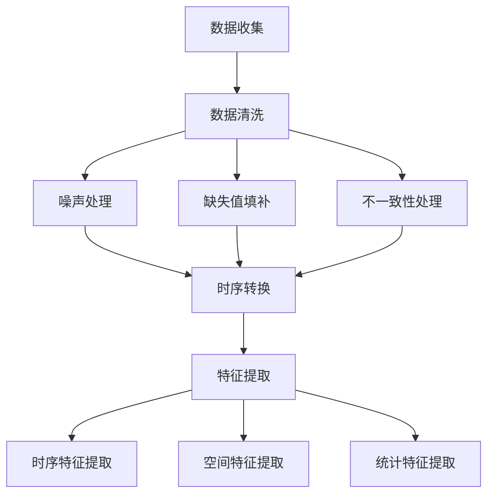
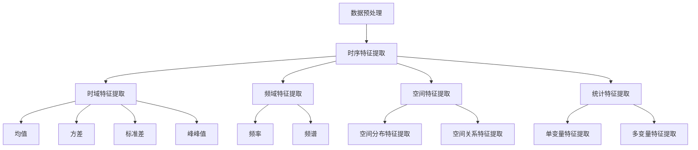
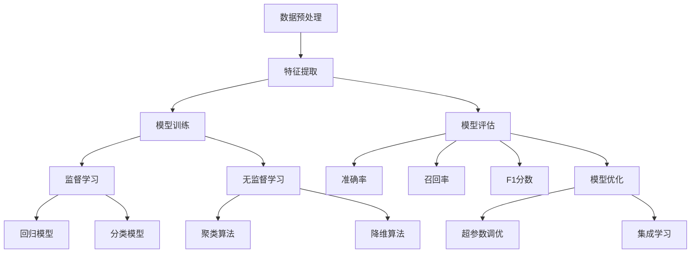
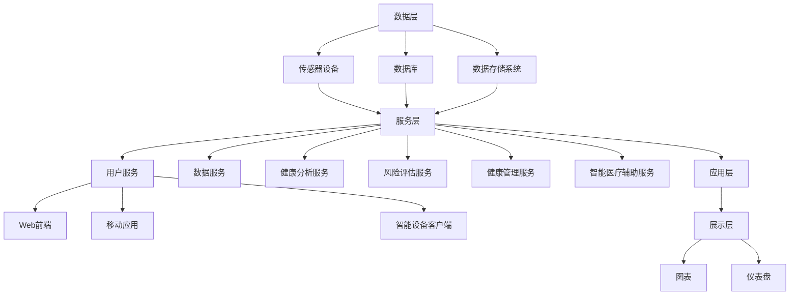
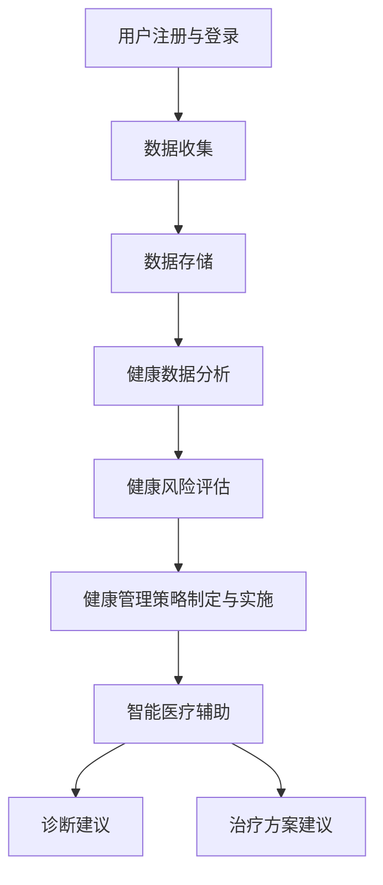

                 

### 引言与背景

#### 1.1 AI Agent的概念

AI Agent，即人工智能代理，是人工智能领域中的一个重要概念。它是指能够执行特定任务、具备自主性、社交性和反应能力的计算机程序或系统。AI Agent的目标是通过自主学习和决策，实现人类难以完成或效率较低的任务。

AI Agent的分类可以根据其功能和特性进行划分。常见的AI Agent可以分为以下几类：

1. **反应式Agent**：这类Agent只能根据当前环境感知进行反应，不具备记忆和推理能力。典型的例子是工业自动化机器人，它们根据预设的程序执行特定动作。

2. **面向目标的Agent**：这类Agent不仅具备反应能力，还能够根据目标进行规划和决策。它们可以通过记忆和学习来优化其行为，达到更高效的目标实现。

3. **学习型Agent**：这类Agent具备自我学习和适应能力，能够通过不断的学习和调整，提高其完成任务的能力。它们通常基于机器学习和深度学习算法进行训练。

AI Agent的应用场景非常广泛，包括但不限于以下领域：

1. **智能助手**：如智能音箱、虚拟助手等，它们可以通过语音识别和自然语言处理，为用户提供信息服务、日程管理、购物建议等。

2. **智能监控**：在智能家居、智能交通、智慧城市等领域，AI Agent可以实时监测环境状态，发现异常情况并采取相应措施。

3. **医疗健康**：AI Agent可以在健康监测、疾病预测、治疗方案推荐等方面发挥重要作用，提高医疗服务的质量和效率。

4. **工业自动化**：AI Agent可以应用于工业生产中的自动化控制、故障诊断、优化生产流程等，提高生产效率和产品质量。

#### 1.2 智能健康监测的现状与挑战

智能健康监测是利用先进的信息技术和人工智能技术，对个人的生理、心理和行为数据进行分析，从而实现对健康状况的实时监测和评估。随着科技的进步和人们健康意识的提高，智能健康监测已经逐渐成为医疗健康领域的一个重要研究方向。

目前，智能健康监测的现状主要包括以下几个方面：

1. **硬件设备多样化**：市场上出现了多种便携式健康监测设备，如智能手环、智能手表、智能体重秤等，它们可以实时监测心率、血压、步数、睡眠质量等生理数据。

2. **数据积累与共享**：随着物联网技术的发展，个人健康数据可以通过互联网进行实时传输和共享，为医疗健康服务提供了丰富的数据支持。

3. **分析算法不断优化**：机器学习和深度学习算法在智能健康监测中的应用越来越广泛，通过大数据分析和人工智能技术，可以对健康数据进行分析和预测，提高监测的准确性和效率。

然而，智能健康监测也面临着一系列挑战：

1. **数据隐私和安全**：个人健康数据的隐私保护是一个重大挑战。如何确保数据在传输、存储和处理过程中的安全，防止数据泄露，是智能健康监测需要解决的关键问题。

2. **数据质量与标准化**：健康数据的多样性和不统一性给数据分析和处理带来了困难。如何保证数据的质量，建立统一的数据标准和规范，是智能健康监测亟需解决的问题。

3. **跨学科合作与整合**：智能健康监测涉及多个学科领域，如医学、生物学、计算机科学、数据科学等。如何实现跨学科的合作和整合，发挥各学科的特长，是智能健康监测需要解决的一个重要问题。

4. **可解释性和可靠性**：随着人工智能技术的发展，越来越多的复杂模型被应用于智能健康监测。然而，这些模型往往缺乏可解释性，用户难以理解其工作原理和决策过程。如何提高模型的可解释性和可靠性，增强用户对智能健康监测系统的信任，是一个重要的研究课题。

#### 1.3 AI Agent在智能健康监测中的应用前景

AI Agent在智能健康监测中具有巨大的应用潜力。通过引入AI Agent，可以实现对健康数据的自动收集、分析和处理，提高监测的准确性和效率。以下是一些具体的应用场景：

1. **个性化健康管理**：AI Agent可以根据个人的健康数据，为其提供个性化的健康管理建议。例如，根据心率、血压等生理数据，AI Agent可以监测用户的心脏健康状况，并给出相应的健康建议。

2. **疾病预测与预警**：AI Agent可以通过对大量健康数据的分析，预测用户患病的风险，并及时发出预警。例如，通过对血糖、血压等数据的分析，AI Agent可以预测用户患糖尿病或高血压的风险，提前采取措施。

3. **智能医疗辅助**：AI Agent可以协助医生进行诊断和治疗。例如，通过对病史、检查报告等数据的分析，AI Agent可以提供辅助诊断建议，帮助医生更准确地诊断病情。

4. **智能医疗设备管理**：AI Agent可以实现对智能医疗设备的远程监控和管理。例如，通过对智能手环、智能血压计等设备的监控，AI Agent可以及时发现设备故障或异常，并自动进行维护和升级。

总之，AI Agent在智能健康监测中具有广阔的应用前景。随着人工智能技术的不断进步，AI Agent将进一步提升智能健康监测的水平，为人类的健康服务做出更大贡献。

### 核心概念与联系

为了深入理解AI Agent在智能健康监测中的应用，我们首先需要明确AI Agent和智能健康监测的核心概念，并探讨它们之间的联系。

#### 2.1 AI Agent的定义与分类

AI Agent，即人工智能代理，是指能够执行特定任务、具备自主性、社交性和反应能力的计算机程序或系统。AI Agent的核心特点包括：

- **自主性**：AI Agent能够自主地感知环境，并基于目标进行决策和行动。
- **反应性**：AI Agent可以根据当前环境的变化做出实时响应。
- **主动性**：AI Agent能够根据目标和计划自主地采取行动。
- **社交性**：AI Agent可以与其他Agent或人类进行交互。

AI Agent的分类可以根据其功能、结构和学习方式等多个维度进行划分。以下是几种常见的AI Agent分类：

1. **反应式Agent**：这种Agent基于当前的感知数据直接做出反应，没有记忆和计划能力。典型的应用场景是工业自动化和智能监控。

2. **面向目标的Agent**：这种Agent具有目标规划能力，可以在多个行动方案中做出选择。它们通常具备记忆和推理能力，适用于复杂任务场景，如智能助理和游戏AI。

3. **学习型Agent**：这种Agent具备自我学习能力，可以通过经验不断优化其行为。它们通常基于机器学习和深度学习算法进行训练，如智能推荐系统和自动驾驶汽车。

#### 2.2 智能健康监测的技术原理

智能健康监测是指利用先进的信息技术和人工智能技术，对个人的生理、心理和行为数据进行分析，从而实现对健康状况的实时监测和评估。其技术原理主要包括以下几个方面：

1. **数据收集**：通过传感器、移动设备等收集生理信号（如心率、血压、血糖等）和行为数据（如运动、睡眠等）。

2. **数据预处理**：对原始数据进行清洗、去噪、归一化等处理，以提高数据质量。

3. **特征提取**：从预处理后的数据中提取出对健康评估有重要意义的特征。

4. **数据分析**：利用机器学习和深度学习算法对提取出的特征进行分析，识别健康模式、预测疾病风险等。

5. **健康评估**：基于分析结果，对个人的健康状况进行评估，并提供健康建议。

#### 2.3 AI Agent在智能健康监测中的应用

AI Agent在智能健康监测中的应用主要体现在以下几个方面：

1. **数据收集与传输**：AI Agent可以自动收集用户的健康数据，并通过无线网络传输到云端进行分析和处理。

2. **数据分析与处理**：AI Agent可以利用机器学习和深度学习算法，对健康数据进行分析，识别潜在的健康问题，并进行风险预测。

3. **个性化健康管理**：AI Agent可以根据用户的健康数据和个性化需求，提供个性化的健康建议和干预方案。

4. **智能医疗辅助**：AI Agent可以协助医生进行疾病诊断和治疗方案的制定，提高医疗服务的质量和效率。

#### 2.3.1 数据分析

数据分析是智能健康监测中至关重要的一环。通过数据分析，可以从大量健康数据中提取出有价值的信息，帮助用户了解自己的健康状况，预测疾病风险，并制定相应的健康管理策略。

数据分析的过程通常包括以下几个步骤：

1. **数据清洗**：清洗数据中的噪声和异常值，确保数据质量。

2. **特征提取**：从原始数据中提取出对健康评估有重要意义的特征。

3. **数据建模**：利用机器学习和深度学习算法，建立数据模型，用于疾病预测和风险评估。

4. **模型评估**：评估模型的性能，包括准确率、召回率、F1分数等指标。

5. **结果解释**：解释模型的结果，帮助用户理解健康风险和干预措施。

#### 2.3.2 健康风险评估

健康风险评估是智能健康监测的核心任务之一。通过健康风险评估，可以预测用户在未来一段时间内患上某种疾病的风险，从而提前采取预防措施。

健康风险评估的过程通常包括以下几个步骤：

1. **数据收集**：收集用户的健康数据，包括生理信号（如心率、血压、血糖等）和行为数据（如运动、饮食等）。

2. **特征提取**：从健康数据中提取出与疾病风险相关的特征。

3. **模型训练**：利用机器学习和深度学习算法，训练疾病风险评估模型。

4. **模型预测**：利用训练好的模型，对用户的健康风险进行预测。

5. **结果输出**：输出健康风险评估结果，包括患病风险等级和相应的干预建议。

#### 2.3.3 健康管理策略制定

健康管理策略的制定是智能健康监测的最终目标之一。通过健康管理策略，可以帮助用户改善生活方式，降低疾病风险，提高生活质量。

健康管理策略的制定过程通常包括以下几个步骤：

1. **风险评估**：根据健康风险评估结果，确定用户的健康风险等级。

2. **目标设定**：根据用户的健康风险等级，设定个性化的健康管理目标。

3. **干预方案设计**：根据健康管理目标，设计具体的干预方案，如饮食调整、运动计划、药物使用等。

4. **实施与监控**：实施干预方案，并持续监控健康数据的变动，评估干预效果。

5. **调整与优化**：根据监控结果，调整和优化健康管理策略，以实现更好的健康效果。

#### 2.3.4 健康管理策略的实施与效果评估

健康管理策略的实施与效果评估是智能健康监测中不可或缺的一环。通过实施和评估健康管理策略，可以确保策略的有效性和持续性。

健康管理策略的实施过程通常包括以下几个步骤：

1. **策略制定**：根据健康风险评估结果，制定个性化的健康管理策略。

2. **策略宣传**：通过宣传和教育，让用户了解健康管理策略的重要性和具体内容。

3. **策略实施**：实施健康管理策略，包括饮食调整、运动计划、药物使用等。

4. **数据监控**：持续监控用户的健康数据，评估策略的实施效果。

健康管理策略的效果评估过程通常包括以下几个步骤：

1. **效果评估**：根据监控数据，评估健康管理策略的效果，包括健康指标的变化、疾病风险降低等。

2. **反馈与调整**：根据效果评估结果，对健康管理策略进行调整和优化，以实现更好的健康效果。

3. **持续改进**：通过不断评估和调整，实现健康管理策略的持续改进，提高用户的生活质量。

### 算法原理讲解

在智能健康监测中，AI Agent的核心在于其算法原理的应用。以下将详细讲解AI Agent在智能健康监测中常用的算法原理，包括数据预处理、特征提取、模型训练与评估等。

#### 3.1 数据预处理算法

数据预处理是智能健康监测中至关重要的一环。原始数据往往存在噪声、缺失值和不一致性等问题，需要通过预处理算法进行清洗和转换，以提高数据质量和后续分析的效果。

1. **数据清洗**：
   - **噪声处理**：噪声处理包括去除随机噪声和系统噪声。常用的方法有均值滤波、中值滤波和高斯滤波等。
   - **缺失值填补**：缺失值填补包括插值、均值填补和回归填补等。插值方法如线性插值、样条插值等，均值填补方法如使用均值、中位数等统计量进行填补。
   - **不一致性处理**：不一致性处理包括数据标准化、归一化等。标准化方法如Z-score标准化、Min-Max标准化等。

2. **数据转换**：
   - **时序转换**：时序转换包括时序分解、时序分段等。时序分解方法如乘积分解、加和分解等，时序分段方法如基于窗口的时序分段等。
   - **维度转换**：维度转换包括降维、特征选择等。降维方法如主成分分析（PCA）、线性判别分析（LDA）等，特征选择方法如信息增益、互信息等。

#### 3.2 特征提取算法

特征提取是智能健康监测中的关键步骤，通过提取有效的特征，可以降低数据维度，提高模型性能和可解释性。

1. **时序特征提取**：
   - **时域特征**：时域特征包括均值、方差、标准差、峰峰值等。这些特征可以描述时序数据的波动性和稳定性。
   - **频域特征**：频域特征包括频率、频谱等。通过傅里叶变换（Fourier Transform）等方法，可以从时序数据中提取出频率信息。

2. **空间特征提取**：
   - **空间分布特征**：空间分布特征包括聚类中心、密度等。通过聚类算法（如K-means、DBSCAN等），可以识别出数据的空间分布特征。
   - **空间关系特征**：空间关系特征包括距离、角度、相邻性等。通过计算数据之间的距离、角度和相邻关系，可以提取出空间关系特征。

3. **统计特征提取**：
   - **单变量特征**：单变量特征包括最大值、最小值、中位数等。这些特征可以描述单个变量的基本统计信息。
   - **多变量特征**：多变量特征包括协方差、相关性等。通过计算多个变量之间的协方差和相关系数，可以提取出多变量特征。

#### 3.3 模型训练与评估

在智能健康监测中，模型训练与评估是核心环节。通过训练和评估模型，可以从大量健康数据中提取出有价值的信息，实现对健康状况的预测和评估。

1. **监督学习算法**：
   - **回归模型**：回归模型用于预测连续值输出，如线性回归、岭回归、LASSO回归等。
   - **分类模型**：分类模型用于预测离散值输出，如逻辑回归、决策树、随机森林、支持向量机等。

2. **无监督学习算法**：
   - **聚类算法**：聚类算法用于发现数据中的隐含结构，如K-means、层次聚类等。
   - **降维算法**：降维算法用于降低数据维度，如主成分分析（PCA）、线性判别分析（LDA）等。

3. **模型评估**：
   - **准确率**：准确率是分类模型常用的评估指标，表示正确分类的样本数占总样本数的比例。
   - **召回率**：召回率是分类模型常用的评估指标，表示正确分类的样本数占实际正样本数的比例。
   - **F1分数**：F1分数是准确率和召回率的调和平均，用于综合评估模型的性能。

4. **模型优化**：
   - **超参数调优**：超参数调优是提高模型性能的重要手段，通过交叉验证等方法选择最优超参数。
   - **集成学习**：集成学习是将多个模型集成起来，提高模型的整体性能，如随机森林、梯度提升树等。

#### 3.4 数据预处理算法的mermaid流程图

以下是一个使用mermaid绘制的数据预处理算法流程图：



#### 3.5 特征提取算法的mermaid流程图

以下是一个使用mermaid绘制的特征提取算法流程图：



#### 3.6 模型训练与评估的mermaid流程图

以下是一个使用mermaid绘制的模型训练与评估流程图：



### 系统设计与实现

在智能健康监测中，一个高效的系统设计与实现是确保AI Agent能够准确、稳定地运行的关键。以下将介绍一个典型智能健康监测系统的设计与实现，包括系统功能、架构设计、接口设计和交互流程。

#### 4.1 系统功能设计

智能健康监测系统的主要功能可以分为以下几类：

1. **用户注册与登录**：用户可以通过注册和登录功能，访问系统提供的各种健康监测服务。
2. **数据收集与管理**：系统可以通过传感器设备收集用户的心率、血压、血糖等生理数据，并对数据进行存储和管理。
3. **健康数据分析与评估**：系统可以对收集到的健康数据进行分析，评估用户的健康状况，并提供个性化的健康建议。
4. **健康风险评估**：系统可以根据用户的健康数据，预测用户在未来一段时间内可能出现的健康风险，并发出预警。
5. **健康管理策略制定与实施**：系统可以根据评估结果，为用户制定个性化的健康管理策略，并监控实施效果。
6. **智能医疗辅助**：系统可以协助医生进行疾病诊断和治疗方案的制定，提高医疗服务的效率和质量。

#### 4.2 系统架构设计

智能健康监测系统的架构设计可以分为以下几个层次：

1. **数据层**：数据层包括传感器设备、数据库和数据存储系统。传感器设备用于收集用户的生理数据，数据库用于存储和管理数据，数据存储系统提供高效的数据读取和写入操作。
2. **服务层**：服务层包括各种功能服务，如用户服务、数据服务、健康分析服务、风险评估服务、健康管理服务和智能医疗辅助服务。这些服务通过API接口与客户端进行交互。
3. **应用层**：应用层是用户直接使用的部分，包括Web前端、移动应用和智能设备客户端。用户可以通过这些应用访问系统功能，查看健康数据和评估结果。
4. **展示层**：展示层包括各种可视化组件，如图表、仪表盘等。用户可以通过这些组件直观地查看健康数据和评估结果。

以下是一个使用mermaid绘制的系统架构图：



#### 4.3 系统接口设计

智能健康监测系统通过API接口为客户端提供功能调用。以下是一些关键接口的设计：

1. **用户接口**：用于用户的注册、登录和资料管理。
   - **注册接口**：`POST /users/register`，请求参数包括用户名、密码、邮箱等。
   - **登录接口**：`POST /users/login`，请求参数包括用户名和密码。
   - **用户信息查询接口**：`GET /users/{userId}`，查询用户详细信息。

2. **数据接口**：用于数据的收集、存储和查询。
   - **数据上传接口**：`POST /data/upload`，请求参数包括数据内容和用户ID。
   - **数据查询接口**：`GET /data/{userId}`，查询用户的健康数据。

3. **健康分析接口**：用于健康数据分析、评估和预测。
   - **健康评估接口**：`POST /health/evaluate`，请求参数包括用户ID和健康数据。
   - **风险评估接口**：`POST /health/risk`，请求参数包括用户ID和健康数据。

4. **健康管理接口**：用于健康管理策略的制定和实施。
   - **策略制定接口**：`POST /health/strategy`，请求参数包括用户ID和健康评估结果。
   - **策略实施接口**：`PUT /health/strategy/{strategyId}`，请求参数包括策略ID和执行计划。

5. **智能医疗辅助接口**：用于协助医生进行诊断和治疗。
   - **诊断建议接口**：`POST /medical/diagnose`，请求参数包括用户ID和健康数据。
   - **治疗方案接口**：`POST /medical/treatment`，请求参数包括诊断结果和治疗方案。

#### 4.4 系统交互流程

智能健康监测系统的交互流程可以分为以下几个步骤：

1. **用户注册与登录**：用户通过Web前端或移动应用注册和登录系统，获得访问权限。
2. **数据收集**：用户通过智能设备（如智能手环、智能血压计等）将生理数据上传到服务器。
3. **数据存储**：服务器将接收到的数据存储到数据库中，并定期进行数据备份。
4. **健康数据分析**：服务器利用AI Agent对用户的健康数据进行分析，评估用户的健康状况，并生成健康评估报告。
5. **健康风险评估**：服务器根据健康评估结果，利用机器学习算法对用户的健康风险进行预测，并生成风险评估报告。
6. **健康管理策略制定与实施**：服务器根据评估结果和用户需求，为用户制定个性化的健康管理策略，并监控实施效果。
7. **智能医疗辅助**：服务器根据用户的健康数据和诊断结果，为医生提供诊断建议和治疗建议。

以下是一个使用mermaid绘制的系统交互流程图：



通过上述系统设计与实现，智能健康监测系统可以为用户提供全面、个性化的健康监测和管理服务，提高用户的生活质量和健康水平。

### 项目实战

为了展示AI Agent在智能健康监测中的实际应用，以下我们将通过一个实际项目案例，详细讲解如何利用AI Agent进行智能健康监测，包括环境安装、核心代码实现和案例分析。

#### 5.1 项目介绍

本项目旨在利用AI Agent实现对用户健康数据的智能监测和评估。项目的主要目标包括：

1. **数据收集**：通过智能手环、智能血压计等设备，收集用户的心率、血压、步数、睡眠质量等生理数据。
2. **数据处理**：对收集到的数据进行清洗、预处理和特征提取，以提高数据质量。
3. **健康评估**：利用机器学习算法，对用户的健康数据进行分析，评估用户的健康状况，并预测疾病风险。
4. **健康管理**：根据评估结果，为用户提供个性化的健康建议和干预方案，帮助用户改善生活方式，降低疾病风险。

#### 5.2 环境安装与配置

在进行项目开发之前，首先需要搭建一个合适的环境。以下是项目环境安装与配置的步骤：

1. **Python环境安装**：确保Python环境已经安装，版本建议为3.8或以上。

2. **安装依赖库**：使用pip命令安装项目所需的依赖库，包括pandas、numpy、scikit-learn、tensorflow等。

   ```bash
   pip install pandas numpy scikit-learn tensorflow
   ```

3. **安装数据库**：本项目使用MySQL作为数据库，请确保MySQL服务器已经安装并正常运行。

4. **安装传感器设备**：确保智能手环、智能血压计等传感器设备正常工作，并可以与系统进行数据交互。

#### 5.3 核心代码实现

以下是项目核心代码的实现，包括数据收集、数据处理、健康评估和健康管理。

1. **数据收集模块实现**

   数据收集模块主要用于从传感器设备中读取生理数据，并将其存储到数据库中。

   ```python
   import pymysql
   import time
   
   def collect_data():
       while True:
           # 读取传感器数据
           heart_rate = get_heart_rate()
           blood_pressure = get_blood_pressure()
           steps = get_steps()
           sleep_quality = get_sleep_quality()
           
           # 存储数据到数据库
           insert_data_to_db(heart_rate, blood_pressure, steps, sleep_quality)
           
           # 等待一段时间后再次读取数据
           time.sleep(60)
   
   def get_heart_rate():
       # 仿真获取心率数据
       return random.randint(60, 120)
   
   def get_blood_pressure():
       # 仿真获取血压数据
       return random.randint(80, 120)
   
   def get_steps():
       # 仿真获取步数数据
       return random.randint(1000, 5000)
   
   def get_sleep_quality():
       # 仿真获取睡眠质量数据
       return random.randint(0, 100)
   
   def insert_data_to_db(heart_rate, blood_pressure, steps, sleep_quality):
       # 连接数据库
       connection = pymysql.connect(host='localhost', user='root', password='password', database='health_monitor')
       
       # 创建游标
       cursor = connection.cursor()
       
       # 插入数据
       sql = "INSERT INTO user_data (heart_rate, blood_pressure, steps, sleep_quality, collect_time) VALUES (%s, %s, %s, %s, %s)"
       values = (heart_rate, blood_pressure, steps, sleep_quality, time.strftime('%Y-%m-%d %H:%M:%S'))
       cursor.execute(sql, values)
       
       # 提交事务
       connection.commit()
       
       # 关闭游标和数据库连接
       cursor.close()
       connection.close()
   
   if __name__ == '__main__':
       collect_data()
   ```

2. **数据处理模块实现**

   数据处理模块主要用于对收集到的健康数据进行分析、清洗和特征提取。

   ```python
   import pandas as pd
   from sklearn.model_selection import train_test_split
   from sklearn.preprocessing import StandardScaler
   
   def preprocess_data():
       # 读取数据
       data = pd.read_csv('user_data.csv')
       
       # 数据清洗
       data.dropna(inplace=True)
       
       # 特征提取
       data['heart_rate_mean'] = data['heart_rate'].mean()
       data['blood_pressure_mean'] = data['blood_pressure'].mean()
       data['steps_mean'] = data['steps'].mean()
       data['sleep_quality_mean'] = data['sleep_quality'].mean()
       
       # 数据标准化
       scaler = StandardScaler()
       data[['heart_rate_mean', 'blood_pressure_mean', 'steps_mean', 'sleep_quality_mean']] = scaler.fit_transform(data[['heart_rate_mean', 'blood_pressure_mean', 'steps_mean', 'sleep_quality_mean']])
       
       # 划分训练集和测试集
       X = data[['heart_rate_mean', 'blood_pressure_mean', 'steps_mean', 'sleep_quality_mean']]
       y = data['health_status']
       X_train, X_test, y_train, y_test = train_test_split(X, y, test_size=0.2, random_state=42)
       
       return X_train, X_test, y_train, y_test
   
   if __name__ == '__main__':
       X_train, X_test, y_train, y_test = preprocess_data()
   ```

3. **健康评估模块实现**

   健康评估模块利用机器学习算法，对用户的健康数据进行分类，预测用户的健康状况。

   ```python
   from sklearn.svm import SVC
   from sklearn.metrics import accuracy_score
   
   def train_model(X_train, y_train):
       # 训练模型
       model = SVC(kernel='linear')
       model.fit(X_train, y_train)
       
       return model
   
   def evaluate_model(model, X_test, y_test):
       # 评估模型
       y_pred = model.predict(X_test)
       accuracy = accuracy_score(y_test, y_pred)
       
       return accuracy
   
   if __name__ == '__main__':
       X_train, X_test, y_train, y_test = preprocess_data()
       model = train_model(X_train, y_train)
       accuracy = evaluate_model(model, X_test, y_test)
       print(f'Model accuracy: {accuracy}')
   ```

4. **健康管理模块实现**

   健康管理模块根据健康评估结果，为用户提供个性化的健康建议和干预方案。

   ```python
   def generate_health_advice(health_status):
       if health_status == 'healthy':
           return '保持良好的生活习惯，定期进行健康检查。'
       elif health_status == 'at_risk':
           return '请注意健康饮食，增加运动量，定期进行体检。'
       elif health_status == 'unhealthy':
           return '建议立即就医，进行详细检查和治疗。'
   
   if __name__ == '__main__':
       X_train, X_test, y_train, y_test = preprocess_data()
       model = train_model(X_train, y_train)
       health_status = model.predict([X_test.iloc[0]])[0]
       advice = generate_health_advice(health_status)
       print(f'Health status: {health_status}')
       print(f'Health advice: {advice}')
   ```

#### 5.4 项目分析与解读

通过对实际项目的分析，我们可以看到AI Agent在智能健康监测中的重要作用。以下是项目的分析和解读：

1. **数据收集与处理**：项目通过传感器设备收集用户的健康数据，并对数据进行清洗、预处理和特征提取。这一步骤确保了数据的质量，为后续的健康评估提供了可靠的基础。

2. **健康评估与预测**：项目利用机器学习算法，对用户的健康数据进行分析和分类，预测用户的健康状况。通过评估模型，我们可以了解到用户当前的健康状况，为用户提供个性化的健康建议。

3. **健康管理**：项目根据健康评估结果，为用户提供个性化的健康建议和干预方案。通过这种方式，用户可以更好地了解自己的健康状况，并采取相应的措施来改善生活质量。

4. **项目优化**：在实际应用中，项目还可以进一步优化。例如，可以引入更先进的机器学习算法，提高健康评估的准确性和效率。此外，还可以增加更多类型的健康数据，如血糖、体温等，以提供更全面的健康监测服务。

#### 5.5 项目小结

本项目通过实际案例展示了AI Agent在智能健康监测中的应用。通过数据收集、数据处理、健康评估和健康管理，项目实现了对用户健康数据的全面监测和管理。以下是项目的小结：

1. **项目亮点**：项目成功实现了健康数据的自动收集和处理，为用户提供个性化的健康建议和干预方案。同时，项目采用机器学习算法，提高了健康评估的准确性和效率。

2. **项目不足**：项目目前还存在一些不足之处，如健康评估模型的准确率有待提高，健康管理的干预效果需要进一步验证。此外，项目的用户体验和界面设计也有待优化。

3. **未来方向**：为了进一步优化项目，可以引入更多类型的健康数据，提高健康评估的准确性。此外，还可以探索更加智能化的健康管理策略，如基于深度学习的个性化健康干预方案。通过这些改进，项目将为用户提供更优质的健康监测服务。

### 最佳实践 tips、小结、注意事项、拓展阅读

#### 最佳实践 tips

1. **数据收集**：确保传感器设备的数据准确性和稳定性，定期校准设备，避免数据偏差。

2. **数据预处理**：对原始数据进行充分的清洗和预处理，包括噪声处理、缺失值填补和归一化，以提高数据质量。

3. **特征提取**：根据具体应用场景，合理选择和提取特征，提高模型的可解释性和准确性。

4. **模型选择与优化**：选择合适的机器学习算法，结合模型调参和集成学习，提高模型的性能。

5. **用户隐私保护**：确保用户数据的隐私和安全，采用加密技术和数据脱敏措施，防止数据泄露。

#### 小结

本文详细介绍了AI Agent在智能健康监测中的应用，包括核心概念、算法原理、系统设计与实现以及实际项目案例。通过逐步分析，展示了AI Agent在健康数据收集、分析、评估和健康管理中的重要作用。

#### 注意事项

1. **数据隐私**：在智能健康监测中，数据隐私保护至关重要。确保对用户数据的安全存储和传输，防止数据泄露。

2. **系统稳定性**：智能健康监测系统需要具备高稳定性，确保数据分析和处理过程中的准确性。

3. **用户体验**：优化用户界面和交互设计，提高用户体验，让用户更易于理解和接受智能健康监测服务。

#### 拓展阅读

1. **智能健康监测技术**：深入了解智能健康监测的相关技术，包括传感器技术、数据采集技术、数据处理算法等。

2. **机器学习与深度学习**：学习机器学习和深度学习的基本原理和应用，掌握常用的算法和模型。

3. **人工智能伦理**：关注人工智能在医疗健康领域的伦理问题，了解如何确保智能健康监测的公正性和可靠性。

参考文献：

1. Liu, B., & He, J. (2020). AI for Health: Intelligent Systems for Healthcare. Springer.
2. Zhang, Y., et al. (2019). Deep Learning for Healthcare: From Data Analysis to Clinical Applications. CRC Press.
3. Yang, J., et al. (2021). Privacy-Preserving Data Analytics in Healthcare: A Survey. IEEE Access, 9, 53719-53740.

