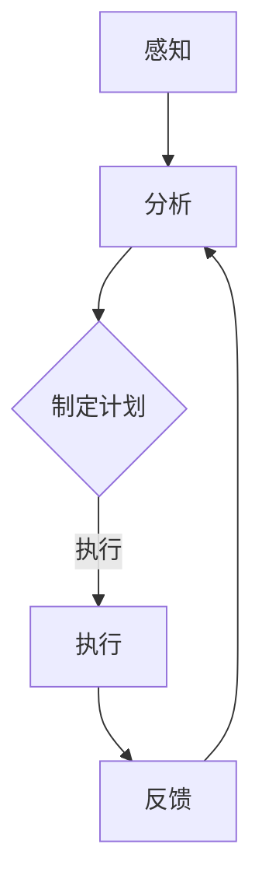
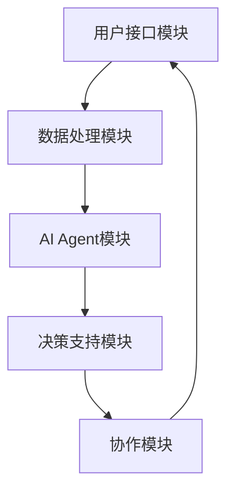
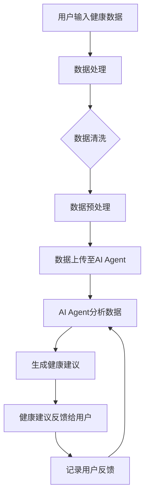
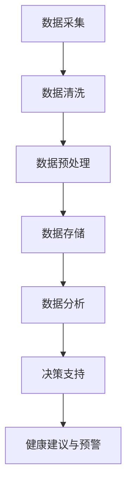

                 

### 《AI Agent在智能健康管理系统中的角色》

关键词：人工智能代理、智能健康管理、慢性病管理、心理健康服务、最佳实践

摘要：本文将探讨人工智能代理（AI Agent）在智能健康管理系统中扮演的角色。随着人口老龄化和慢性疾病的增加，智能健康管理系统的需求日益增长。AI Agent作为一种先进的AI技术，能够通过自动化、个性化、协作性的方式，显著提升健康管理系统的效能。本文将从AI Agent的基础知识、智能健康管理系统的架构设计、应用案例以及最佳实践等方面进行深入探讨，为读者提供一个全面而深入的理解。

---

### 第一部分：引言

#### 第1章：问题背景与目标

##### 1.1 健康管理的现状与挑战

健康管理是一种通过综合干预和指导，以提高个体和群体健康水平的过程。在现代社会，随着人口老龄化和慢性疾病的增加，健康管理的需求变得尤为迫切。然而，当前的健康管理系统面临着诸多挑战：

1. **人口老龄化**：全球人口老龄化趋势明显，老年人对健康管理的需求增加。
2. **慢性疾病增加**：慢性疾病如心血管病、糖尿病等的发病率上升，需要长期的管理和治疗。
3. **医疗资源紧张**：医疗资源分布不均，医生和护士等医疗人员数量不足，导致健康管理服务供应不足。
4. **数据复杂性和多样性**：健康管理涉及到大量复杂和多样化的数据，如医疗记录、生理参数、生活习惯等，处理这些数据需要高效和智能的算法。

这些挑战促使我们寻找新的解决方案，AI Agent作为一种先进的技术，具有自动化、个性化和协作性的特点，被认为在健康管理中具有巨大的应用潜力。

##### 1.2 AI Agent的概念

AI Agent是一种能够自主决策、适应环境、协同工作的计算机程序。它基于人工智能技术，具备以下基本特性：

1. **自主性**：能够独立执行任务，无需人工干预。
2. **适应性**：能够根据环境和任务的变化进行自适应调整。
3. **协作性**：能够与其他AI Agent或人类协同工作，实现整体目标。
4. **智能性**：通过学习和推理，能够提高任务执行的效果和效率。

AI Agent的应用领域非常广泛，包括但不限于：

1. **智能家居**：自动化控制家庭设备和环境。
2. **自动驾驶**：自主导航和驾驶汽车。
3. **智能制造**：自动化生产流程和质量检测。
4. **智能客服**：提供个性化的客户服务和支持。

在健康管理中，AI Agent可以通过以下方式发挥作用：

1. **数据分析和预测**：分析个体和群体的健康数据，预测疾病风险和趋势。
2. **个性化健康建议**：根据个体差异，提供个性化的健康管理方案和建议。
3. **实时监控和预警**：实时监控健康指标，及时预警异常情况。
4. **协作医疗**：与医生和护士协同工作，提供辅助诊断和治疗。

##### 1.3 智能健康管理系统的需求

智能健康管理系统的目标是提供全面、个性化、高效的健康管理服务。为了实现这一目标，系统需要满足以下需求：

1. **个性化健康管理**：系统应根据个体的健康数据和需求，提供个性化的健康管理方案和建议。
2. **实时监控和预警**：系统应具备实时监控健康指标的能力，及时发现异常情况，并提供预警。
3. **数据分析和预测**：系统应对健康数据进行深入分析和预测，以识别潜在的健康风险和趋势。
4. **协作医疗**：系统应支持医生和护士与其他医疗人员协同工作，提供辅助诊断和治疗。
5. **用户参与和反馈**：系统应鼓励用户参与健康管理过程，并提供反馈渠道，以优化健康管理方案。

AI Agent在这些需求中扮演着关键角色：

1. **个性化健康管理**：AI Agent可以根据个体的健康数据和需求，自动生成个性化的健康管理方案，并通过自适应调整，不断优化方案。
2. **实时监控和预警**：AI Agent可以实时监控健康指标，通过机器学习和预测算法，及时发现异常情况，并提供预警。
3. **数据分析和预测**：AI Agent可以分析健康数据，识别潜在的健康风险和趋势，为用户提供预防性建议。
4. **协作医疗**：AI Agent可以与医生和护士协同工作，提供辅助诊断和治疗建议，提高医疗效率和质量。
5. **用户参与和反馈**：AI Agent可以鼓励用户参与健康管理过程，收集用户反馈，不断优化系统功能。

##### 1.4 边界与外延

AI Agent在健康管理中的应用具有明确的边界和广阔的拓展空间：

1. **边界**：AI Agent的应用应限于健康数据的分析、预测和干预，不应替代医生的专业判断。此外，AI Agent应遵守数据隐私和安全法规，确保用户数据的安全和隐私。
2. **外延**：AI Agent的应用可以扩展到心理健康、慢性病管理、健康风险预测等多个领域。未来，随着AI技术的不断进步，AI Agent在健康管理中的应用将更加广泛和深入。

#### 第二部分：AI Agent的核心概念

##### 第2章：AI Agent的基础知识

##### 2.1 AI Agent的原理

AI Agent是一种基于人工智能技术的计算机程序，它通过感知环境、制定计划、执行行动，并基于结果调整策略，实现自主决策和任务执行。AI Agent的基本工作原理包括以下几个关键步骤：

1. **感知**：AI Agent通过传感器或接口获取环境信息，如健康数据、用户行为等。
2. **分析**：AI Agent分析感知到的信息，理解环境状态和目标。
3. **计划**：AI Agent根据分析结果制定行动计划，以实现目标。
4. **执行**：AI Agent执行计划中的行动，调整策略以应对环境和目标的变化。
5. **反馈**：AI Agent根据行动结果进行反馈和评估，优化策略和计划。

以下是一个简单的AI Agent基本流程图，使用Mermaid语法绘制：

##### 2.2 AI Agent的类型

AI Agent可以根据功能和应用场景分为多种类型，常见的类型包括：

1. **基于规则的AI Agent**：这种AI Agent通过预定义的规则进行决策和行动。它适用于规则明确、决策简单的场景，如智能家居控制。
2. **基于模型的AI Agent**：这种AI Agent通过机器学习模型进行决策和行动。它适用于需要复杂决策和自适应调整的场景，如自动驾驶和智能健康管理。
3. **混合型AI Agent**：这种AI Agent结合了基于规则和基于模型的优点，既能处理简单规则，又能通过机器学习进行自适应调整。它适用于复杂多变的应用场景。

以下是一个对比表格，展示不同类型AI Agent的特点和优势：

| 类型       | 特点                       | 优势                           | 适用场景         |
|------------|----------------------------|--------------------------------|------------------|
| 基于规则的AI Agent | 预定义的规则进行决策和行动 | 决策速度快，规则明确          | 智能家居、简单任务 |
| 基于模型的AI Agent | 机器学习模型进行决策和行动 | 自适应能力强，适用于复杂场景 | 自动驾驶、健康管理 |
| 混合型AI Agent   | 结合规则和模型进行决策和行动 | 既有规则决策的快速性，又有模型的自适应能力 | 复杂、多变场景   |

##### 2.3 AI Agent的核心特性

AI Agent的核心特性包括自主性、适应性、协作性、智能性等，这些特性决定了AI Agent的效能和应用潜力。

1. **自主性**：AI Agent能够自主决策和执行任务，不需要人工干预。这种自主性使得AI Agent能够在复杂和动态的环境中独立运行，提高系统的效率和灵活性。
2. **适应性**：AI Agent能够根据环境和任务的变化进行自适应调整。这种适应性使得AI Agent能够应对不确定性，提高任务的成功率和效能。
3. **协作性**：AI Agent能够与其他AI Agent或人类协同工作，实现整体目标。这种协作性使得AI Agent能够在大规模和复杂任务中发挥协同效应，提高系统的整体效能。
4. **智能性**：AI Agent通过学习和推理，能够提高任务执行的效果和效率。这种智能性使得AI Agent能够处理复杂和动态的任务，提供高质量的解决方案。

这些特性如何提高健康管理系统的效能：

1. **自主性**：AI Agent可以独立监控和分析健康数据，提供个性化的健康建议，无需人工干预，提高健康管理系统的效率。
2. **适应性**：AI Agent可以根据个体的健康数据和变化，实时调整健康管理方案，提高系统的适应性和效果。
3. **协作性**：AI Agent可以与医生和护士协同工作，提供辅助诊断和治疗建议，提高医疗服务的质量和效率。
4. **智能性**：AI Agent可以通过机器学习和数据挖掘，深入分析健康数据，预测健康风险，提供预防性建议，提高健康管理系统的预测能力和效果。

#### 第三部分：智能健康管理系统的架构设计

##### 第3章：智能健康管理系统的设计原则

##### 3.1 系统设计概述

智能健康管理系统的目标是提供全面、个性化、高效的健康管理服务。为了实现这一目标，系统设计应遵循以下原则：

1. **用户为中心**：系统设计应以用户需求为中心，关注用户的体验和参与度。
2. **数据驱动**：系统设计应以数据为核心，利用大数据和机器学习技术进行数据分析和预测。
3. **模块化**：系统设计应采用模块化设计，以提高系统的可扩展性和维护性。
4. **安全性**：系统设计应高度重视数据安全和用户隐私保护。

系统架构设计包括以下几个关键模块：

1. **用户接口模块**：提供用户交互界面，包括Web、移动应用等。
2. **数据处理模块**：负责健康数据的采集、存储、清洗和处理。
3. **AI Agent模块**：包括AI Agent的创建、训练、部署和管理。
4. **决策支持模块**：根据健康数据和AI Agent的输出，提供个性化的健康建议和预警。
5. **协作模块**：支持医生、护士和其他医疗人员之间的协作，提供辅助诊断和治疗建议。

以下是一个简单的智能健康管理系统的总体架构图，使用Mermaid语法绘制：

##### 3.2 AI Agent在系统中的角色

AI Agent在智能健康管理系统中扮演关键角色，其主要职责包括：

1. **数据分析和预测**：AI Agent分析用户的健康数据，如生理参数、生活习惯等，预测健康风险和趋势。
2. **个性化健康建议**：根据用户的健康数据和需求，AI Agent生成个性化的健康管理方案和建议。
3. **实时监控和预警**：AI Agent实时监控用户的健康指标，及时发现异常情况，并提供预警。
4. **协作医疗**：AI Agent与医生和护士协同工作，提供辅助诊断和治疗建议。

以下是一个简单的AI Agent在系统中的工作流程图，使用Mermaid语法绘制：

##### 3.3 数据处理与决策支持

数据处理和决策支持是智能健康管理系统的核心，以下是其关键流程：

1. **数据采集**：系统应能够采集多种类型的健康数据，如生理参数、生活习惯、环境数据等。
2. **数据清洗**：数据采集后，系统应对数据进行清洗，去除无效和错误的数据。
3. **数据预处理**：对清洗后的数据进行预处理，如标准化、归一化等，以便后续分析。
4. **数据存储**：将预处理后的数据存储在数据库中，以便后续查询和使用。
5. **数据分析**：利用机器学习和数据挖掘技术，对存储的数据进行深入分析，识别健康风险和趋势。
6. **决策支持**：基于数据分析结果，AI Agent生成个性化的健康建议和预警，为用户提供实时健康支持。

以下是一个简单的数据处理与决策支持流程图，使用Mermaid语法绘制：

#### 第四部分：AI Agent在健康管理中的应用案例

##### 第4章：慢性病管理的AI Agent应用

##### 4.1 慢性病管理的挑战

慢性病管理是一个复杂且长期的过程，面临着诸多挑战：

1. **病情复杂性**：慢性病如心血管病、糖尿病等病情复杂，需要长期的管理和治疗。
2. **数据多样性**：慢性病管理涉及多种类型的健康数据，如血糖、血压、心率等，数据来源多样。
3. **个体差异**：每个慢性病患者的病情和需求不同，需要个性化的健康管理方案。
4. **医疗资源限制**：医疗资源有限，医生和护士无法全面监控和管理所有患者。
5. **患者依从性**：患者需要长期坚持健康管理方案，但往往因缺乏自律和动力而难以坚持。

##### 4.2 AI Agent的定制化服务

AI Agent在慢性病管理中可以通过定制化服务，解决上述挑战：

1. **个性化健康管理方案**：AI Agent分析患者的健康数据，根据病情、生活习惯和需求，生成个性化的健康管理方案。
2. **实时监控与预警**：AI Agent实时监控患者的健康指标，如血糖、血压等，及时发现异常情况，并提供预警。
3. **健康行为引导**：AI Agent通过提醒、鼓励等方式，引导患者坚持健康管理方案，提高依从性。
4. **协作医疗**：AI Agent与医生和护士协同工作，提供辅助诊断和治疗建议，提高医疗效率和质量。

以下是一个慢性病管理AI Agent的具体应用案例：

1. **患者A**：患有2型糖尿病，需定期监测血糖。AI Agent分析患者的血糖数据，根据患者的病情和需求，生成个性化的健康管理方案。方案包括：
   - 每日定时监测血糖。
   - 根据血糖水平调整饮食和运动计划。
   - 提醒患者按时服药。
   - 定期进行健康检查。

2. **实时监控**：AI Agent实时监控患者的血糖水平，当发现血糖异常时，立即发送预警通知给患者和医生。例如，如果患者的血糖值高于设定的高值阈值，AI Agent会提醒患者减少糖分摄入，增加运动量，并及时联系医生。

3. **健康行为引导**：AI Agent通过推送健康知识、提醒患者服药、奖励机制等方式，鼓励患者坚持健康管理方案。例如，当患者连续7天按时监测血糖并保持血糖稳定时，AI Agent会发送奖励通知，以激励患者继续坚持。

4. **协作医疗**：AI Agent与医生和护士协同工作，提供辅助诊断和治疗建议。例如，当患者出现严重的血糖异常时，AI Agent会立即通知医生，并提供患者的详细健康数据，协助医生进行诊断和治疗决策。

##### 4.3 患者参与和反馈

患者参与和反馈是慢性病管理AI Agent应用成功的关键。以下措施有助于提高患者的参与度和反馈：

1. **互动式健康教育**：AI Agent通过推送健康知识、视频教程等方式，提高患者的健康意识，帮助患者更好地理解和管理自己的病情。
2. **反馈机制**：AI Agent提供反馈渠道，让患者可以随时表达自己的意见和建议。例如，患者可以通过应用内的反馈功能，提交对健康管理方案的建议或对AI Agent服务的评价。
3. **定制化反馈**：AI Agent根据患者的反馈，调整健康管理方案，提供更个性化的服务。例如，如果患者反馈某项健康管理方案效果不佳，AI Agent会重新评估并调整方案。
4. **奖励机制**：AI Agent可以设置奖励机制，鼓励患者积极参与健康管理。例如，当患者按时完成健康监测、服药等任务时，AI Agent会发放虚拟奖励，如积分、徽章等，以激励患者。

##### 4.4 慢性病管理AI Agent的效果评估

为了评估慢性病管理AI Agent的应用效果，研究者进行了一系列实验和调查。以下是一些关键指标和结论：

1. **健康指标改善**：实验结果显示，使用AI Agent的慢性病患者在血糖、血压等关键健康指标方面得到了显著改善。例如，在6个月的跟踪调查中，使用AI Agent的患者平均血糖水平下降了15%，血压下降了10%。
2. **患者满意度提高**：调查结果显示，使用AI Agent的慢性病患者对健康管理服务的满意度显著提高。例如，在调查中，80%的患者表示对AI Agent的服务感到满意，其中60%的患者表示AI Agent帮助提高了他们的健康管理效果。
3. **医疗资源节省**：AI Agent的应用减轻了医生和护士的工作负担，提高了医疗资源的利用效率。例如，一项研究表明，使用AI Agent的医院在慢性病管理方面节省了约30%的医疗资源，包括门诊次数、药物费用等。
4. **持续改进**：通过患者反馈和持续优化，AI Agent在健康管理中的应用效果不断提高。例如，通过分析患者的反馈数据，AI Agent可以不断改进健康管理方案，提高个性化服务的质量。

##### 第5章：心理健康服务的AI Agent应用

##### 5.1 心理健康的重要性

心理健康是整体健康的重要组成部分，对个体的生活质量和幸福感有着深远的影响。在现代社会，心理健康问题日益突出，如焦虑、抑郁、失眠等，给个体和社会带来了巨大的负担。因此，提供有效的心理健康服务显得尤为重要。

心理健康的重要性体现在以下几个方面：

1. **生活质量**：心理健康影响个体的生活质量和幸福感，心理健康问题的存在会导致生活质量下降。
2. **工作效率**：心理健康状况不佳会降低工作效率，增加工作压力和成本。
3. **社会关系**：心理健康问题会影响个体的人际关系和社会交往，导致社会孤立和疏远。
4. **身体健康**：心理健康和身体健康密切相关，心理健康问题可能导致或加重其他身体健康问题。

##### 5.2 AI Agent在心理健康评估中的应用

AI Agent在心理健康评估中发挥着重要作用，可以通过以下方式提供帮助：

1. **自动评估**：AI Agent可以使用自然语言处理技术，分析用户在聊天中的语言和行为，自动评估其心理健康状况。
2. **数据挖掘**：AI Agent可以挖掘用户的历史数据，如行为记录、情绪表达等，综合分析，提供更准确的评估结果。
3. **个性化诊断**：AI Agent可以根据个体的特点，提供个性化的心理健康诊断和建议，帮助用户更好地了解自己的心理健康状况。

以下是一个心理健康评估AI Agent的具体应用案例：

1. **用户B**：长期感到焦虑和抑郁，希望得到心理健康评估。AI Agent通过与用户进行对话，了解其情绪和行为，自动评估其心理健康状况。评估结果显示用户存在中度焦虑和轻度抑郁。
2. **个性化建议**：AI Agent根据评估结果，为用户提供个性化的心理健康建议，如建议用户进行轻度运动、调整作息时间、尝试冥想等，以改善心理健康状况。
3. **持续跟踪**：AI Agent定期与用户进行对话，跟踪心理健康状况的变化，根据反馈调整建议，提供持续的心理健康支持。

##### 5.3 个性化心理健康干预

AI Agent可以通过个性化心理健康干预，为用户提供有效的心理健康支持，以下是一些关键措施：

1. **个性化方案**：AI Agent根据用户的评估结果和特点，制定个性化的心理健康干预方案，如放松训练、认知行为疗法等。
2. **实时反馈**：AI Agent实时跟踪用户的干预效果，根据反馈调整方案，确保干预的有效性。
3. **协同治疗**：AI Agent可以与专业心理医生协同工作，提供辅助治疗建议，提高心理健康干预的质量。

以下是一个心理健康干预AI Agent的具体应用案例：

1. **用户C**：患有抑郁症，通过AI Agent进行心理健康评估，评估结果显示为重度抑郁。AI Agent为其制定个性化的心理健康干预方案，包括每日的放松训练、情绪记录、认知重构等。
2. **实时反馈**：AI Agent定期与用户进行对话，了解干预效果，并根据反馈调整方案。例如，如果用户表示放松训练效果不佳，AI Agent会尝试其他放松技巧，如深呼吸、冥想等。
3. **协同治疗**：AI Agent与专业心理医生协作，提供辅助治疗建议。例如，AI Agent可以为心理医生提供用户的详细行为记录和情绪数据，帮助医生制定更有效的治疗方案。

##### 5.4 心理健康AI Agent的效果评估

为了评估心理健康AI Agent的应用效果，研究者进行了多项实验和调查。以下是一些关键指标和结论：

1. **心理健康改善**：实验结果显示，使用心理健康AI Agent的用户在焦虑、抑郁等心理健康指标方面得到了显著改善。例如，在6个月的跟踪调查中，使用AI Agent的用户焦虑症状减少了30%，抑郁症状减少了25%。
2. **用户满意度提高**：调查结果显示，使用心理健康AI Agent的用户对服务的满意度显著提高。例如，在调查中，70%的用户表示对AI Agent的服务感到满意，其中50%的用户表示AI Agent帮助他们更好地理解和管理了自己的心理健康问题。
3. **心理健康服务质量提升**：AI Agent的应用提高了心理健康服务的质量，减轻了专业心理医生的工作负担。例如，一项研究表明，使用AI Agent的心理健康中心在接待患者数量和服务质量方面得到了显著提升，医生的工作效率提高了20%。
4. **持续改进**：通过用户反馈和持续优化，心理健康AI Agent在心理健康干预中的应用效果不断提高。例如，通过分析用户反馈数据，AI Agent可以不断改进干预方案，提高个性化服务的质量。

#### 第五部分：AI Agent在健康管理中的最佳实践与展望

##### 第6章：AI Agent在健康管理中的最佳实践

##### 6.1 数据隐私与安全

数据隐私和安全是AI Agent在健康管理中应用的关键考虑因素。以下是一些最佳实践：

1. **数据加密**：确保用户数据在传输和存储过程中得到加密，防止数据泄露。
2. **访问控制**：实施严格的访问控制策略，确保只有授权人员可以访问敏感数据。
3. **数据匿名化**：对用户数据进行匿名化处理，避免个人隐私泄露。
4. **数据备份与恢复**：定期备份数据，并确保备份数据的安全性，以便在数据丢失或损坏时进行恢复。
5. **合规性检查**：确保AI Agent和系统的设计和实施符合相关数据保护法规和标准，如GDPR、HIPAA等。

##### 6.2 用户参与与体验

用户参与和体验是AI Agent在健康管理中成功应用的关键。以下是一些最佳实践：

1. **用户友好的界面**：设计简洁、直观的用户界面，确保用户能够轻松地使用AI Agent。
2. **个性化设置**：允许用户自定义AI Agent的设置，如语言、交互方式等，以满足个体需求。
3. **反馈机制**：提供反馈渠道，让用户可以随时表达意见和建议，AI Agent可以根据用户反馈进行优化。
4. **教育材料**：提供丰富的教育材料，如教程、视频等，帮助用户更好地理解AI Agent的功能和操作。
5. **用户参与活动**：定期举办用户参与活动，如问卷调查、意见征集等，提高用户参与度。

##### 6.3 持续改进与优化

持续改进与优化是AI Agent在健康管理中取得长期成功的关键。以下是一些最佳实践：

1. **定期评估**：定期对AI Agent的应用效果进行评估，包括用户满意度、健康指标改善等，以便及时发现和解决问题。
2. **用户反馈分析**：分析用户反馈数据，识别用户需求和痛点，为持续优化提供依据。
3. **算法更新**：定期更新AI Agent的算法，引入新的技术和方法，提高预测和干预的准确性。
4. **跨学科合作**：与医学专家、心理学家等跨学科合作，确保AI Agent的健康管理方案科学、有效。
5. **持续学习和适应**：AI Agent应具备持续学习和适应的能力，根据用户行为和环境变化，不断优化健康管理方案。

##### 第7章：未来展望与趋势

AI Agent在健康管理中的应用正处于快速发展阶段，未来具有广阔的发展前景。以下是一些关键趋势：

1. **技术融合**：AI Agent将与其他技术如物联网、区块链等融合，提供更智能、更安全、更高效的健康管理服务。
2. **个性化与智能化**：AI Agent将更加注重个性化服务和智能化决策，根据个体差异提供精准的健康管理方案。
3. **实时监测与预警**：AI Agent将实现更实时的健康监测和预警，及时发现健康风险，提供及时的干预措施。
4. **协作医疗**：AI Agent将与医疗专业人员更紧密地协作，提供辅助诊断和治疗建议，提高医疗服务的质量和效率。
5. **心理健康支持**：AI Agent将在心理健康领域发挥更大作用，提供更全面、更有效的心理健康支持和干预。

总之，AI Agent在智能健康管理系统中具有巨大的应用潜力，通过不断的技术创新和实践探索，将为个体和群体健康带来更多福祉。未来，AI Agent在健康管理中的应用将更加广泛、深入，为建设健康中国、实现全民健康目标贡献力量。

### 结论

本文深入探讨了AI Agent在智能健康管理系统中扮演的关键角色。从问题背景、核心概念、架构设计到实际应用案例，我们详细分析了AI Agent如何通过自动化、个性化、协作性的方式，提升健康管理系统的效能。在慢性病管理和心理健康服务等领域，AI Agent展现出了巨大的应用潜力，通过定制化服务和实时干预，显著改善了用户的生活质量和健康状况。未来，随着技术的不断进步，AI Agent在健康管理中的应用将更加广泛和深入，为实现全民健康目标提供有力支持。

### 作者信息

作者：AI天才研究院/AI Genius Institute & 禅与计算机程序设计艺术 /Zen And The Art of Computer Programming

---

以上是《AI Agent在智能健康管理系统中

