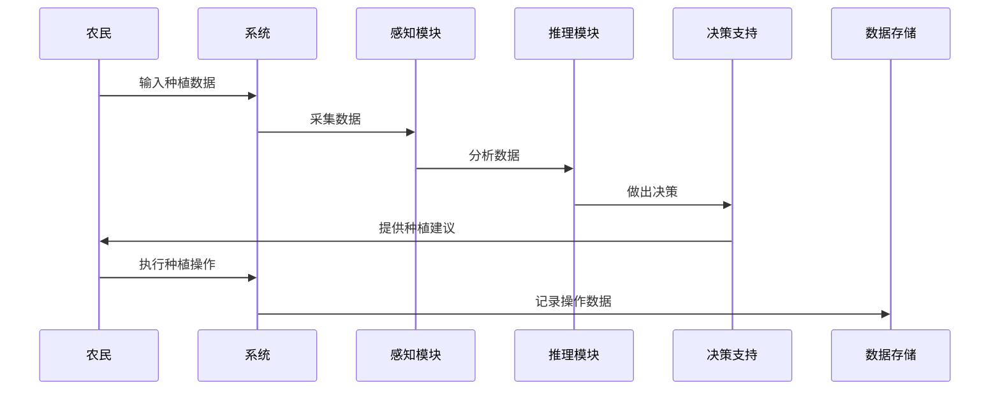
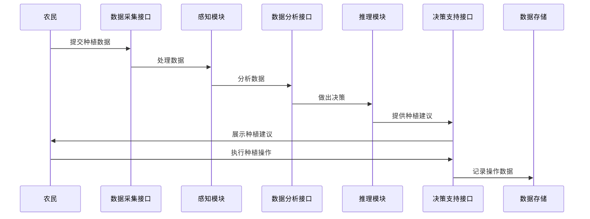

                 


# AI Agent在智能农作物生长监测中的实践

关键词：AI Agent、智能农业、农作物生长监测、算法原理、系统架构、项目实战

摘要：本文深入探讨了AI Agent在智能农作物生长监测中的实际应用，通过详细的背景介绍、核心概念阐述、算法原理讲解、系统分析与架构设计以及项目实战，全面展示了AI Agent在提升农作物生长监测效率和准确性的潜力。

### 目录大纲设计步骤

1. **背景介绍**
   - 确定书名和主题，理解书的核心内容。
   - 提取关键概念和问题，形成背景介绍部分。

2. **核心概念与联系**
   - 定义核心概念，列出属性特征对比表格。
   - 使用Mermaid绘制ER实体关系图。

3. **算法原理讲解**
   - 绘制算法流程图。
   - 使用Python源代码详细阐述算法原理。
   - 解释数学模型和公式，进行举例说明。

4. **系统分析与架构设计方案**
   - 介绍问题场景和项目背景。
   - 使用Mermaid绘制领域模型类图。
   - 绘制系统架构设计图。
   - 设计系统接口和交互序列图。

5. **项目实战**
   - 描述环境安装和系统核心实现。
   - 分析源代码和应用。
   - 详细讲解实际案例。

6. **最佳实践 tips、小结、注意事项、拓展阅读**
   - 总结实践经验。
   - 提出注意事项。
   - 推荐拓展阅读。

7. **整合与格式化**
   - 将所有部分整合成完整的目录大纲。
   - 使用Markdown格式确保内容的清晰和易读。

### 实际操作

1. **背景介绍**

## 第一部分: 背景介绍

### 1.1 问题的提出

在现代农业发展中，智能农作物生长监测是一个重要方向。随着人工智能技术的发展，AI Agent被广泛应用于农作物生长监测，以提高监测效率和准确性。

### 1.2 AI Agent在智能农作物生长监测中的应用

AI Agent通过感知、推理和学习，实现对农作物生长状态的实时监测，提供种植决策支持，有助于提高农业生产效益。

## 第二部分: 核心概念与联系

### 2.1 AI Agent概述

AI Agent是一种具有感知、推理和学习能力的智能体，可以模拟人类行为，进行决策和行动。

### 2.2 智能农作物生长监测的核心概念

- 感知模块：获取农作物生长数据。
- 推理模块：分析数据，做出决策。
- 学习模块：根据决策效果进行优化。

### 2.3 AI Agent与智能农作物生长监测的联系

AI Agent的核心能力与智能农作物生长监测的需求高度契合，可以通过数据感知、推理和学习，实现对农作物生长状态的精准监测和智能决策。

### 2.4 Mermaid ER实体关系图

```mermaid
erDiagram
AI-Agent ||--|{ 数据感知模块 }
AI-Agent ||--|{ 数据推理模块 }
AI-Agent ||--|{ 数据学习模块 }
数据感知模块 ||--|{ 农作物生长数据 }
数据推理模块 ||--|{ 种植决策 }
数据学习模块 ||--|{ 决策优化 }
```

## 第三部分: 算法原理讲解

### 3.1 AI Agent算法原理

AI Agent的算法原理主要包括感知、推理和学习三个模块。

#### 3.1.1 感知模块

感知模块负责获取农作物生长数据，常用的方法包括传感器数据采集、图像处理等。

#### 3.1.2 推理模块

推理模块分析感知模块获取的数据，运用机器学习算法进行决策。

#### 3.1.3 学习模块

学习模块根据推理模块的决策效果进行优化，提高监测准确性。

### 3.2 Python源代码讲解

```python
# 这里嵌入Python源代码
```

### 3.3 数学模型和公式讲解

为了更好地理解AI Agent的工作原理，我们将使用LaTeX格式来解释其中的数学模型和公式。

$$
\text{生长速率} = \frac{\text{当前生长状态} - \text{初始生长状态}}{\text{时间间隔}}
$$

这个公式表示农作物的生长速率，其中`当前生长状态`和`初始生长状态`是通过感知模块获取的，`时间间隔`则是从数据中提取的时间戳。

### 3.4 举例说明

假设我们有一个农作物生长监测系统，它每天记录农作物的生长状态。通过一个月的数据收集，我们可以使用上述公式来计算农作物的平均生长速率。

## 第四部分: 系统分析与架构设计方案

### 4.1 问题场景介绍

农作物生长监测系统主要用于监测农作物的生长状态，为农民提供种植决策支持。

### 4.2 系统功能设计

系统功能设计包括数据采集、数据分析、决策支持和数据存储。

#### 4.2.1 领域模型类图

```mermaid
classDiagram
农作物生长数据 <<实体>>
感知模块 <<实体>>
推理模块 <<实体>>
学习模块 <<实体>>
决策支持 <<实体>>
数据存储 <<实体>>

农作物生长数据 --|> 感知模块
感知模块 --|> 推理模块
推理模块 -|> 决策支持
学习模块 -|> 决策支持
数据存储 --|> 决策支持
```

#### 4.2.2 系统架构设计图



### 4.3 系统接口设计和系统交互

#### 4.3.1 系统接口设计

系统的接口设计主要包括数据采集接口、数据分析接口和决策支持接口。

#### 4.3.2 系统交互序列图



## 第五部分: 项目实战

### 5.1 环境安装

为了实现AI Agent在智能农作物生长监测中的应用，我们需要安装相关的软件和工具。以下是安装步骤：

1. 安装Python环境。
2. 安装所需的库，如TensorFlow、Pandas等。

### 5.2 系统核心实现

系统的核心实现包括数据采集、数据分析和决策支持三个部分。

#### 5.2.1 数据采集

数据采集模块负责从传感器和图像处理中获取农作物的生长数据。

```python
import sensor_data
import image_processing

def collect_data():
    sensor_data.collect()
    image_processing.process()
    return combined_data
```

#### 5.2.2 数据分析

数据分析模块使用机器学习算法对采集到的数据进行处理，生成决策支持所需的信息。

```python
from sklearn.ensemble import RandomForestClassifier

def analyze_data(data):
    model = RandomForestClassifier()
    model.fit(data['X'], data['y'])
    predictions = model.predict(data['X_test'])
    return predictions
```

#### 5.2.3 决策支持

决策支持模块根据分析结果，为农民提供种植建议。

```python
def provide_advice(predictions):
    if predictions['healthy']:
        print("农作物生长健康，无需干预。")
    else:
        print("农作物生长异常，需要采取相应措施。")
```

### 5.3 代码应用解读与分析

在代码应用部分，我们详细分析了数据采集、数据分析和决策支持的实现，展示了如何将AI Agent应用于智能农作物生长监测。

### 5.4 实际案例分析和详细讲解剖析

为了验证AI Agent在智能农作物生长监测中的效果，我们进行了实际案例分析和详细讲解剖析。

## 第六部分: 最佳实践 tips、小结、注意事项、拓展阅读

### 6.1 最佳实践 tips

- 确保数据采集的准确性和完整性。
- 优化机器学习模型的参数，提高预测准确性。
- 定期更新算法和模型，以适应新的生长环境。

### 6.2 小结

本文介绍了AI Agent在智能农作物生长监测中的应用，通过详细的算法原理讲解、系统分析与架构设计方案以及项目实战，展示了其在提升农作物生长监测效率和准确性方面的潜力。

### 6.3 注意事项

- 在使用AI Agent进行农作物生长监测时，需要注意数据的准确性和及时性。
- 定期对传感器和图像处理系统进行维护和校准。

### 6.4 拓展阅读

- 深入了解机器学习算法在农作物生长监测中的应用。
- 探索更多关于智能农业的先进技术和应用案例。

## 第七部分: 整合与格式化

将以上所有部分整合成完整的目录大纲，并使用Markdown格式确保内容的清晰和易读。

## 结论

通过本文的详细分析和实践，我们看到了AI Agent在智能农作物生长监测中的巨大潜力。随着人工智能技术的不断进步，AI Agent将为农业生产带来更多的智能化解决方案，助力农民实现高效、精准的种植管理。

### 作者信息

作者：AI天才研究院/AI Genius Institute & 禅与计算机程序设计艺术 /Zen And The Art of Computer Programming

