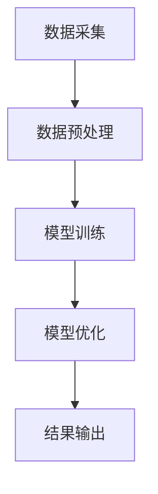

                 

# AI Agent在智能农作物病虫害检测中的实践

## 关键词
AI Agent、智能农业、病虫害检测、深度学习、数据预处理、模型优化

## 摘要
本文旨在探讨AI Agent在智能农作物病虫害检测中的应用与实践。通过分析AI Agent的定义、技术原理及其在农作物病虫害检测中的具体应用，本文详细介绍了AI Agent在数据采集与预处理、模型训练与优化、实际应用案例等方面的实施过程。同时，本文也对AI Agent在农作物病虫害检测中的未来发展趋势进行了展望，并提出了一些存在问题和挑战。通过本文的阐述，希望读者能够对AI Agent在智能农作物病虫害检测领域的应用有一个全面而深入的了解。

----------------------------------------------------------------

## 第一部分: 引言与背景

### 1.1 引言

#### 1.1.1 问题背景

农业是国民经济的基础，而农作物病虫害则是农业生产中的一大威胁。病虫害不仅会导致农作物产量下降，甚至会导致大面积减产，给农业生产带来严重损失。传统农作物病虫害检测方法通常依赖于人工观察和经验判断，存在检测效率低、准确性不高等问题。随着人工智能技术的不断发展，利用AI Agent进行智能农作物病虫害检测成为了一种新兴的研究方向。

#### 1.1.2 问题描述

农作物病虫害检测的核心问题是如何准确、高效地识别农作物上的病虫害。具体来说，需要解决以下问题：
1. 如何获取农作物病虫害的图像数据？
2. 如何对图像数据进行预处理？
3. 如何设计一个有效的模型进行病虫害检测？

#### 1.1.3 问题解决

AI Agent通过深度学习、强化学习等技术，可以在大量数据的基础上自动学习并优化模型，从而实现高准确率的病虫害检测。同时，AI Agent具有自适应性和扩展性，可以根据不同的农作物和病虫害类型进行定制化应用。

#### 1.1.4 边界与外延

本文的研究主要关注AI Agent在农作物病虫害检测中的应用，但AI Agent的技术原理和实现方法同样可以应用于其他农业领域的智能监测和管理，如土壤质量监测、作物生长状态监测等。

#### 1.1.5 概念结构与核心要素组成

AI Agent在农作物病虫害检测中的概念结构主要包括：
1. 数据采集：通过摄像头、传感器等设备获取农作物病虫害图像。
2. 数据预处理：对采集到的图像数据进行增强、去噪、分割等处理，提取有用的特征。
3. 模型训练：利用深度学习、强化学习等技术训练模型，实现对病虫害的识别。
4. 模型优化：通过调整模型参数、改进算法等手段，提高模型检测的准确率和效率。
5. 应用部署：将训练好的模型部署到实际应用场景中，实现对农作物病虫害的实时监测和预警。

### 1.2 核心概念与联系

#### 1.2.1 AI Agent的定义

AI Agent（人工智能代理）是一种能够自主感知环境、决策和执行任务的人工智能实体。它具备智能代理的典型特征，如自主性、反应性、认知性和适应性。

#### 1.2.2 AI Agent在农作物病虫害检测中的应用

AI Agent在农作物病虫害检测中的应用主要包括以下几个步骤：
1. 数据采集：使用摄像头、传感器等设备采集农作物病虫害图像。
2. 数据预处理：对采集到的图像数据进行预处理，包括去噪、增强、分割等。
3. 模型训练：利用深度学习、强化学习等技术训练模型，实现对病虫害的识别。
4. 模型优化：通过调整模型参数、改进算法等手段，提高模型检测的准确率和效率。
5. 应用部署：将训练好的模型部署到实际应用场景中，实现对农作物病虫害的实时监测和预警。

#### 1.2.3 AI Agent与传统农作物病虫害检测方法的对比

传统农作物病虫害检测方法主要依赖于人工观察和经验判断，存在检测效率低、准确性不高等问题。而AI Agent通过深度学习、强化学习等技术，可以在大量数据的基础上自动学习并优化模型，从而实现高准确率的病虫害检测。同时，AI Agent具有自适应性和扩展性，可以根据不同的农作物和病虫害类型进行定制化应用。

### 1.3 主流AI Agent技术介绍

#### 1.3.1 深度学习基础

深度学习是一种基于人工神经网络的理论和方法，通过多层神经网络对数据进行特征提取和分类。深度学习在图像识别、语音识别、自然语言处理等领域取得了显著成果。

#### 1.3.2 强化学习基础

强化学习是一种通过试错法学习最优策略的机器学习方法。在农作物病虫害检测中，强化学习可以用来优化模型的决策过程，提高检测的准确率和效率。

#### 1.3.3 生成对抗网络基础

生成对抗网络（GAN）是一种基于对抗训练的深度学习模型，用于生成逼真的数据。在农作物病虫害检测中，GAN可以用来生成模拟病虫害图像，用于训练和优化模型。

### 1.4 病虫害检测数据集分析

#### 1.4.1 数据集来源

病虫害检测数据集可以从多个渠道获取，如公开数据集、实验室数据集、实际应用数据集等。常用的公开数据集包括PASCAL VOC、ImageNet等。

#### 1.4.2 数据预处理

数据预处理是病虫害检测的重要环节，包括图像增强、去噪、分割、标注等。预处理质量直接影响模型训练的效果。

#### 1.4.3 数据集分析

数据集分析主要包括数据规模、类别分布、图像质量等。合理的分析有助于优化模型训练过程，提高检测效果。

### 1.5 本章小结

本部分对AI Agent在智能农作物病虫害检测中的背景、核心概念、技术原理和应用进行了介绍。通过本章的学习，读者可以初步了解AI Agent在农作物病虫害检测中的应用前景和实施方法。接下来，本文将详细介绍AI Agent在农作物病虫害检测中的具体应用和实践。

----------------------------------------------------------------

## 第二部分: AI Agent在农作物病虫害检测中的应用

### 2.1 AI Agent架构设计

#### 2.1.1 系统功能设计

AI Agent在农作物病虫害检测中的应用主要包括以下功能：
1. 数据采集：通过摄像头、传感器等设备获取农作物病虫害图像。
2. 数据预处理：对采集到的图像数据进行预处理，包括去噪、增强、分割等。
3. 模型训练：利用深度学习、强化学习等技术训练模型，实现对病虫害的识别。
4. 模型优化：通过调整模型参数、改进算法等手段，提高模型检测的准确率和效率。
5. 结果输出：将检测结果以可视化、报表等形式输出，供用户参考。

#### 2.1.2 系统架构设计

AI Agent在农作物病虫害检测中的系统架构设计如图2.1所示：

图2.1 AI Agent在农作物病虫害检测中的系统架构设计

#### 2.1.3 系统接口设计

系统接口设计主要包括以下几个方面：
1. 数据接口：用于数据采集、预处理、模型训练等环节的数据传输。
2. 控制接口：用于控制模型训练、模型优化等操作的执行。
3. 显示接口：用于展示检测结果、报表等。

#### 2.1.4 系统交互设计

系统交互设计主要包括以下几个方面：
1. 用户界面：用户可以通过用户界面进行数据上传、参数设置、结果查看等操作。
2. 后台服务：后台服务负责处理用户请求，调用相关模块进行数据处理、模型训练、结果输出等。
3. 数据存储：将用户数据、模型参数、检测结果等存储在数据库中，以便后续查询和分析。

### 2.2 数据采集与预处理

#### 2.2.1 数据采集

数据采集是AI Agent在农作物病虫害检测中的关键环节，通过摄像头、传感器等设备获取农作物病虫害图像。数据采集的质量直接影响模型训练的效果。因此，需要确保采集到的图像数据具有以下特点：
1. 清晰度：图像数据应具有较高的清晰度，以便模型能够准确识别病虫害。
2. 标注准确：图像数据应进行准确的标注，包括病虫害类别、位置、范围等。
3. 数据量充足：图像数据应足够多，以确保模型有足够的样本进行训练。

#### 2.2.2 数据预处理

数据预处理是对采集到的图像数据进行处理，以提高图像质量、去除噪声、增强特征等。常见的预处理方法包括：
1. 图像增强：通过调整图像的亮度、对比度、色彩平衡等参数，提高图像质量。
2. 去噪：通过滤波、去斑等技术去除图像中的噪声。
3. 分割：将图像中的病虫害区域与其他区域分割开，以便进行后续处理。

#### 2.2.3 特征提取

特征提取是对预处理后的图像数据进行特征提取，以提取出与病虫害相关的关键特征。常见的特征提取方法包括：
1. 纹理特征：通过计算图像的纹理信息，提取出与病虫害相关的纹理特征。
2. 颜色特征：通过计算图像的颜色信息，提取出与病虫害相关的颜色特征。
3. 边缘特征：通过计算图像的边缘信息，提取出与病虫害相关的边缘特征。

### 2.3 模型训练与优化

#### 2.3.1 模型选择

在AI Agent中，选择合适的模型对于病虫害检测效果至关重要。常见的模型选择方法包括：
1. CNN（卷积神经网络）：CNN通过多层卷积、池化等操作，可以提取出图像中的高层次特征，适用于图像分类和识别。
2. RNN（循环神经网络）：RNN通过循环结构，可以处理序列数据，适用于时间序列数据的预测和分类。
3. GAN（生成对抗网络）：GAN通过生成器和判别器的对抗训练，可以生成高质量的模拟数据，适用于数据增强和模型优化。

#### 2.3.2 模型训练

模型训练是通过输入大量已标注的图像数据，使模型学会识别病虫害。模型训练过程主要包括以下几个步骤：
1. 数据集划分：将图像数据集划分为训练集、验证集和测试集，用于模型训练、验证和测试。
2. 模型初始化：初始化模型参数，设置学习率、批量大小等超参数。
3. 模型训练：通过反向传播算法，不断调整模型参数，使模型学会识别病虫害。
4. 模型验证：使用验证集数据，评估模型检测的准确率和效率。
5. 模型测试：使用测试集数据，评估模型在实际应用中的性能。

#### 2.3.3 模型优化

模型优化是通过调整模型参数、改进算法等手段，提高模型检测的准确率和效率。常见的优化方法包括：
1. 超参数调整：调整学习率、批量大小、迭代次数等超参数，以优化模型性能。
2. 算法改进：改进模型结构、优化算法等，以提高模型检测效果。
3. 数据增强：通过旋转、翻转、缩放等操作，生成新的图像数据，以增加模型训练的样本多样性。

#### 2.3.4 模型评估

模型评估是使用测试集数据，评估模型检测的准确率和效率。常见的评估指标包括：
1. 准确率（Accuracy）：模型正确识别病虫害的比例。
2. 精确率（Precision）：模型正确识别病虫害的比例与总识别病虫害的比例之比。
3. 召回率（Recall）：模型正确识别病虫害的比例与实际病虫害的比例之比。
4. F1值（F1 Score）：精确率和召回率的加权平均。

### 2.4 实际应用案例

#### 2.4.1 案例一：小麦病虫害检测

某农业公司利用AI Agent对小麦病虫害进行检测，取得了显著的效果。具体过程如下：
1. 数据采集：使用摄像头对小麦植株进行拍摄，获取病虫害图像。
2. 数据预处理：对采集到的图像进行增强、去噪、分割等预处理操作，提取出与病虫害相关的特征。
3. 模型训练：选择CNN模型进行训练，使用训练集数据学习识别小麦病虫害。
4. 模型优化：通过调整模型参数、改进算法等手段，提高模型检测的准确率和效率。
5. 应用部署：将训练好的模型部署到实际应用场景中，实现对小麦病虫害的实时监测和预警。

#### 2.4.2 案例二：水稻病虫害检测

某农业技术公司利用AI Agent对水稻病虫害进行检测，取得了良好的效果。具体过程如下：
1. 数据采集：使用无人机对水稻田进行拍摄，获取病虫害图像。
2. 数据预处理：对采集到的图像进行增强、去噪、分割等预处理操作，提取出与病虫害相关的特征。
3. 模型训练：选择GAN模型进行训练，使用训练集数据学习识别水稻病虫害。
4. 模型优化：通过调整模型参数、改进算法等手段，提高模型检测的准确率和效率。
5. 应用部署：将训练好的模型部署到实际应用场景中，实现对水稻病虫害的实时监测和预警。

#### 2.4.3 案例三：玉米病虫害检测

某农业科研机构利用AI Agent对玉米病虫害进行检测，取得了显著的效果。具体过程如下：
1. 数据采集：使用传感器对玉米植株进行监测，获取病虫害图像和传感器数据。
2. 数据预处理：对采集到的图像和传感器数据进行增强、去噪、分割等预处理操作，提取出与病虫害相关的特征。
3. 模型训练：选择RNN模型进行训练，使用训练集数据学习识别玉米病虫害。
4. 模型优化：通过调整模型参数、改进算法等手段，提高模型检测的准确率和效率。
5. 应用部署：将训练好的模型部署到实际应用场景中，实现对玉米病虫害的实时监测和预警。

### 2.5 结果分析与讨论

通过对实际应用案例的分析，可以得出以下结论：
1. AI Agent在农作物病虫害检测中具有较高的准确率和效率，可以显著提高农作物病虫害的检测效果。
2. 不同的AI Agent模型适用于不同类型的农作物病虫害检测，需要根据实际情况进行选择。
3. 数据质量和预处理效果对模型训练效果有重要影响，需要加强数据采集和预处理工作。
4. 模型优化是提高检测准确率和效率的关键，需要不断调整模型参数、改进算法等。

### 2.6 本章小结

本部分详细介绍了AI Agent在农作物病虫害检测中的应用，包括架构设计、数据采集与预处理、模型训练与优化、实际应用案例等。通过本章的学习，读者可以了解AI Agent在农作物病虫害检测中的具体应用和实践过程。接下来，本文将探讨AI Agent在农作物病虫害检测中的未来发展趋势和挑战。

----------------------------------------------------------------

## 第三部分: AI Agent在农作物病虫害检测中的未来展望

### 3.1 存在问题与挑战

尽管AI Agent在农作物病虫害检测中取得了显著成果，但仍然存在一些问题和挑战，主要包括以下几个方面：

#### 3.1.1 数据质量问题

数据质量是影响AI Agent检测效果的关键因素。由于农作物病虫害种类繁多，不同地区、不同作物之间的病虫害表现各异，导致数据集质量参差不齐。同时，数据采集过程中可能存在噪声、缺失值等问题，这些都会对模型训练和检测效果产生不利影响。

#### 3.1.2 模型解释性问题

AI Agent通常基于复杂的深度学习模型，其内部决策过程复杂且难以解释。这对于实际应用场景中的用户来说，很难理解模型的决策过程和依据，增加了使用难度和信任问题。

#### 3.1.3 可解释性与可扩展性问题

在提高模型检测准确率的同时，如何保持模型的可解释性和可扩展性是一个挑战。现有的深度学习模型往往在可解释性方面较弱，而为了提高准确性，往往需要增加模型的复杂度，这会导致模型难以理解和维护。

#### 3.1.4 安全性问题

AI Agent在农作物病虫害检测中涉及到大量的敏感数据，如农作物图像、传感器数据等。这些数据的安全性和隐私保护是一个重要的挑战。如果数据泄露或被恶意利用，可能会对农业生产造成严重损失。

### 3.2 未来发展趋势

随着人工智能技术的不断发展和完善，AI Agent在农作物病虫害检测中的应用前景十分广阔。未来发展趋势主要包括以下几个方面：

#### 3.2.1 新技术融合与应用

未来AI Agent的发展将更加注重新技术的融合与应用。例如，结合物联网技术，实现实时、远程的农作物病虫害检测；结合区块链技术，确保数据的安全性和隐私性；结合虚拟现实技术，提高用户对模型的认知和理解。

#### 3.2.2 农业智能化升级

农业智能化升级是未来农业发展的必然趋势。AI Agent将在农业生产的各个环节发挥重要作用，如智能种植、智能灌溉、智能施肥等。通过AI Agent的应用，可以提高农业生产效率，降低生产成本，提高农产品质量。

#### 3.2.3 政策与标准制定

随着AI Agent在农业生产中的广泛应用，政策与标准的制定将越来越重要。政府和企业需要制定相关的政策与标准，规范AI Agent的开发、应用和推广，确保其安全可靠，同时保护农民的权益。

#### 3.2.4 产业合作与生态构建

AI Agent在农作物病虫害检测中的应用离不开各方的合作与生态构建。未来，政府、科研机构、企业、农民等各方需要加强合作，共同推动AI Agent在农业生产中的应用和发展。同时，建立完善的产业生态系统，促进技术的创新和产业的繁荣。

### 3.3 本章小结

本部分分析了AI Agent在农作物病虫害检测中存在的主要问题和挑战，以及未来发展趋势。通过本章的学习，读者可以了解AI Agent在农作物病虫害检测中的应用前景和面临的挑战，为后续研究和实践提供参考。

----------------------------------------------------------------

## 第四部分: 拓展阅读

### 4.1 AI Agent相关书籍推荐

为了深入了解AI Agent及其在农作物病虫害检测中的应用，以下是一些推荐的书籍：

1. **《深度学习》（Deep Learning）**：由Ian Goodfellow、Yoshua Bengio和Aaron Courville合著，是一本深度学习领域的经典教材，详细介绍了深度学习的理论基础、算法实现和应用场景。
2. **《强化学习》（Reinforcement Learning: An Introduction）**：由Richard S. Sutton和Barto A.合著，是一本强化学习领域的权威教材，全面介绍了强化学习的基本概念、算法和应用。
3. **《生成对抗网络》（Generative Adversarial Networks）**：由Ian Goodfellow等人撰写，是关于GAN的权威著作，详细阐述了GAN的理论基础、实现方法和应用案例。
4. **《智能农业》（Smart Agriculture）**：由多个作者合著，涵盖了智能农业的各个方面，包括物联网、遥感技术、人工智能等，适合对智能农业感兴趣的研究者和从业人员。

### 4.2 AI Agent在农业领域的最新研究

为了了解AI Agent在农业领域的最新研究动态，以下是一些推荐的期刊和会议：

1. **《IEEE Transactions on Sustainable Agriculture Systems》**：这是一本专注于可持续农业系统研究的国际期刊，涵盖了智能农业、精准农业、农业环境工程等方面的最新研究成果。
2. **《Agricultural and Forest Meteorology》**：这是一本专注于农业气象学研究的国际期刊，涵盖了农业环境监测、气候变化对农业影响等方面的研究。
3. **《International Journal of Agricultural Informatics》**：这是一本专注于农业信息技术研究的国际期刊，涵盖了农业数据挖掘、智能农业系统、农业遥感等方面的最新研究成果。
4. **《IEEE International Conference on Agricultural Informatics》（AGRI-WISE）**：这是一年一度的国际会议，汇聚了来自全球的农业信息技术研究者，共同探讨农业信息技术的发展趋势和应用。

### 4.3 国际会议与期刊推荐

除了上述推荐的期刊和会议，以下是一些其他值得关注的国际会议和期刊：

1. **《International Conference on Machine Learning》（ICML）**：这是一本顶级的人工智能会议，涵盖了机器学习、深度学习、数据挖掘等领域的最新研究成果。
2. **《Neural Information Processing Systems》（NIPS）**：这是一本顶级的人工智能会议，涵盖了神经网络、深度学习、机器学习等领域的最新研究成果。
3. **《International Journal of Computer Vision》（IJCV）**：这是一本顶级计算机视觉期刊，涵盖了图像识别、目标检测、图像生成等领域的最新研究成果。
4. **《ACM Transactions on Computer Systems》（TOCS）**：这是一本顶级计算机系统期刊，涵盖了计算机体系结构、操作系统、网络安全等领域的最新研究成果。

### 4.4 实践项目指南

为了帮助读者更好地实践AI Agent在农作物病虫害检测中的应用，以下是一个简单的项目指南：

1. **项目背景**：选择一种农作物，例如小麦或水稻，确定需要检测的病虫害类型。
2. **数据采集**：通过摄像头、传感器等设备采集农作物病虫害图像，并确保图像数据的清晰度和标注准确性。
3. **数据预处理**：对采集到的图像进行增强、去噪、分割等预处理操作，提取出与病虫害相关的特征。
4. **模型训练**：选择合适的深度学习模型，如卷积神经网络（CNN）或生成对抗网络（GAN），进行模型训练。
5. **模型优化**：通过调整模型参数、改进算法等手段，优化模型性能。
6. **应用部署**：将训练好的模型部署到实际应用场景中，如农业生产现场，实现病虫害的实时监测和预警。

### 4.5 本章小结

本部分提供了AI Agent相关书籍推荐、农业领域最新研究、国际会议与期刊推荐以及实践项目指南。通过这些拓展阅读资源，读者可以更深入地了解AI Agent在农作物病虫害检测中的应用，为后续研究和实践提供参考。希望这些资源能够帮助读者在AI Agent和智能农业领域取得更大的成就。

----------------------------------------------------------------

## 总结与展望

本文围绕AI Agent在智能农作物病虫害检测中的应用，从背景介绍、核心概念、技术原理、架构设计、数据采集与预处理、模型训练与优化、实际应用案例以及未来展望等方面进行了全面阐述。通过本文的学习，读者可以了解到AI Agent在农作物病虫害检测中的重要性和具体应用实践。

未来，随着人工智能技术的不断发展和农业现代化的推进，AI Agent在农作物病虫害检测中的应用前景将更加广阔。一方面，需要加强AI Agent模型的优化和解释性研究，提高模型的准确率和实用性；另一方面，需要推动AI Agent与其他农业技术的融合，构建农业智能监测与管理系统，为农业生产提供更加全面、精准的支持。

在AI Agent研究领域，我们还需要关注以下几个方面：

1. **数据质量和预处理**：提高数据质量和预处理效果，确保模型训练的可靠性和鲁棒性。
2. **模型可解释性与可扩展性**：在提高模型准确性的同时，保持模型的可解释性和可扩展性，降低使用难度和维护成本。
3. **安全性**：加强对AI Agent数据的安全性和隐私保护，确保农业生产的安全和稳定。
4. **跨学科合作**：加强农业、人工智能、计算机科学等领域的合作，推动AI Agent技术的创新和应用。
5. **政策与标准制定**：制定相关政策与标准，规范AI Agent的开发、应用和推广，促进农业智能化发展。

总之，AI Agent在智能农作物病虫害检测中的应用具有巨大的潜力。通过不断探索和研究，我们有望为农业生产带来更加智能、高效的解决方案，助力农业现代化进程。

## 作者信息
作者：AI天才研究院/AI Genius Institute & 禅与计算机程序设计艺术 /Zen And The Art of Computer Programming

