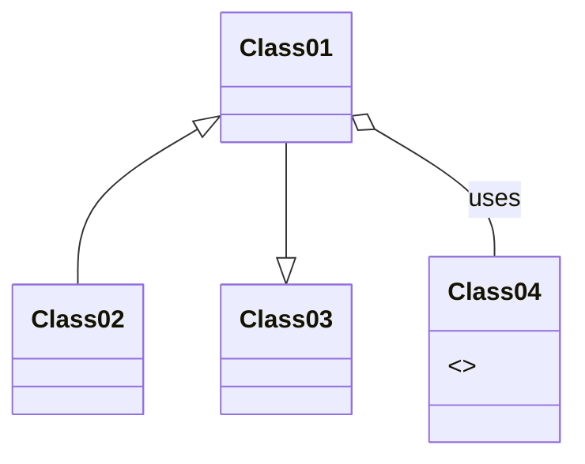
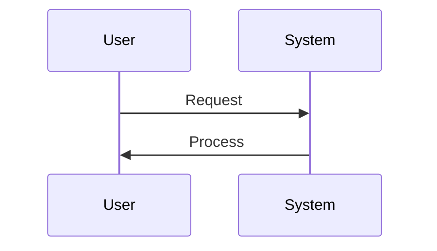
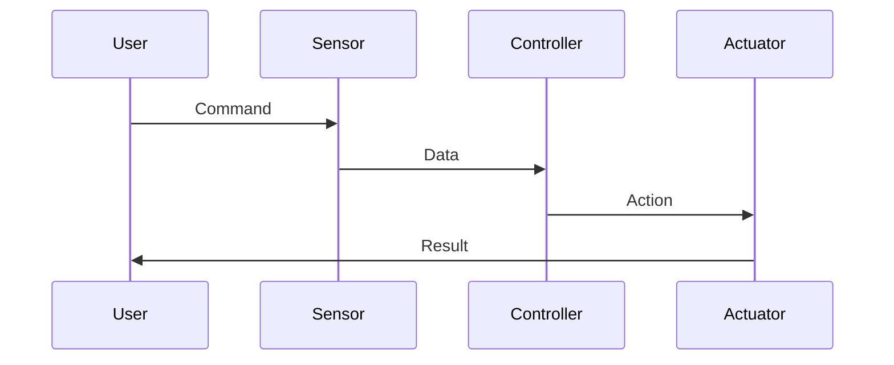

                 

Certainly! Let's dive into crafting the detailed content for the blog post "AI Agent in Manufacturing Applications," adhering to the provided structure and guidelines. Here's how we'll proceed step by step:

### Introduction

**Title:** AI Agent in Manufacturing Applications

**Keywords:** AI Agents, Manufacturing, Automation, Intelligent Systems, Robotics

**Abstract:**
This article delves into the revolutionary application of AI agents in the manufacturing industry. We'll explore the challenges faced by traditional manufacturing systems, the introduction and potential of AI agents, and how these intelligent entities are transforming production processes. Through a step-by-step analysis, we'll cover core concepts, algorithms, system designs, and practical implementations, along with best practices and future trends.

### Background and Overview

**Chapter 1: Problem Background and Challenges**

**1.1.1 Manufacturing Challenges**

Manufacturing industries are often burdened with inefficiencies, high costs, and labor shortages. Traditional manufacturing systems rely heavily on manual operations and lack real-time adaptability, leading to reduced productivity and quality control issues.

**1.1.2 Concept of AI Agents**

AI agents are intelligent entities that can perceive their environment, reason about it, and take actions to achieve specific goals. In manufacturing, these agents can autonomously perform tasks, optimize processes, and enhance overall efficiency.

**1.1.3 Potential of AI Agents in Manufacturing**

AI agents have the potential to revolutionize manufacturing by automating complex processes, enabling predictive maintenance, optimizing supply chains, and improving product quality. They can adapt to changing conditions in real-time, reducing downtime and improving throughput.

**Chapter 2: Overview of AI Agent Applications in Manufacturing**

**2.1.1 Core Characteristics of AI Agents**

AI agents are characterized by their autonomy, adaptability, and ability to learn from experience. They can process large volumes of data, recognize patterns, and make decisions based on that data.

**2.1.2 Applications in Manufacturing Processes**

AI agents can be applied in various stages of manufacturing, from design and simulation to production and quality control. They can automate assembly lines, monitor equipment health, and optimize production schedules.

**2.1.3 Advantages and Limitations**

The advantages of AI agents in manufacturing include improved efficiency, reduced errors, and cost savings. However, they also come with challenges such as the need for robust infrastructure, data privacy concerns, and the potential displacement of human workers.

### Core Concepts and Relationships

**Chapter 3: Core Concepts and Principles of AI Agents**

**3.1.1 Definition and Classification of Agents**

An agent is any entity that can perceive its environment through sensors and act upon it through actuators. AI agents can be classified into reactive, goal-based, and cognitive agents based on their complexity and capabilities.

**3.1.2 Attributes and Characteristics Comparison**

A comparison table of the attributes and characteristics of different types of AI agents will be provided to highlight their capabilities and applications.

**3.1.3 Architecture and Functionality of AI Agents**

AI agents typically consist of a sensing module, a reasoning module, and an acting module. We'll discuss the role of each component and how they interact to enable intelligent behavior.

### Algorithm Principles and Explanations

**Chapter 4: AI Agent Algorithms and Mathematical Models**

**4.1.1 Algorithm Flow Diagram**

We will use the Mermaid diagramming language to create a flow diagram illustrating the general algorithmic process of an AI agent in manufacturing.


**4.1.2 Algorithm Principles**

The principles behind common AI agent algorithms such as Reinforcement Learning, Deep Learning, and Machine Learning will be explained in detail.

**4.1.3 Mathematical Models and Formulas**

Using LaTeX, we will present the mathematical models and formulas that underpin these algorithms.

$$
\begin{aligned}
    \text{Reward} &= \sum_{t=1}^{T} \gamma^t r_t \\
    \nabla_{\theta} J(\theta) &= \frac{\partial}{\partial \theta} \sum_{i=1}^{n} \frac{1}{N} \sum_{k=1}^{K} \log(p(y_k || \theta x_i)) \\
\end{aligned}
$$

**4.1.4 Example Illustrations**

We will provide simple examples to demonstrate how these algorithms work in practical scenarios.

### System Analysis and Architectural Design

**Chapter 5: Application Architecture of AI Agents in Manufacturing Systems**

**5.1.1 Scenario Introduction**

We will introduce a specific manufacturing scenario, such as a smart factory environment.

**5.1.2 System Function Design**

Using Mermaid diagrams, we will design a class diagram to illustrate the domain model of the system.



**5.1.3 System Architecture Design**

We will create a Mermaid diagram to show the overall system architecture.



**5.1.4 System Interface Design and Interaction**

We will design a sequence diagram to show the interactions between different components of the system.



### Project Implementation

**Chapter 6: Environment Setup and System Implementation**

**6.1.1 Environment Configuration**

We will provide a step-by-step guide on setting up the development environment required for implementing AI agents in manufacturing systems.

**6.1.2 Core System Implementation**

We will present the core implementation of the AI agent system, including the source code and a detailed explanation of each component.

```python
# Python code snippet for AI agent implementation
class AI-Agent:
    def __init__(self):
        # Initialization code
        pass
    
    def perceive(self, environment):
        # Perception code
        pass
    
    def reason(self, percept):
        # Reasoning code
        pass
    
    def act(self, action):
        # Action code
        pass
```

**6.1.3 Code Analysis and Interpretation**

We will analyze the code to explain how the AI agent interacts with the environment and achieves its goals.

### Case Study

**Chapter 7: Case Study Analysis**

**7.1.1 Case Background**

We will present a case study of a real-world application of AI agents in manufacturing.

**7.1.2 Case Analysis**

We will analyze the case study to understand the challenges faced and the solutions provided by AI agents.

**7.1.3 Detailed Explanation and Analysis**

We will provide a detailed explanation of the case study, including the architecture, algorithms, and outcomes.

### Best Practices and Summary

**Chapter 8: Best Practices for AI Agent Applications**

**8.1.1 Practical Experience Summary**

We will summarize the best practices derived from real-world applications of AI agents in manufacturing.

**8.1.2 Notes and Observations**

We will highlight important considerations and potential pitfalls when implementing AI agents in manufacturing systems.

**8.1.3 Additional Reading**

We will provide a list of recommended resources for further reading on AI agents and their applications in manufacturing.

### Future Outlook and Trends

**Chapter 9: Future Directions and Trends in AI Agents for Manufacturing**

**9.1.1 Future Development Prospects**

We will discuss the potential future developments and advancements in AI agents for manufacturing.

**9.1.2 Challenges and Opportunities**

We will identify the challenges that need to be addressed and the opportunities that AI agents present for the manufacturing industry.

**9.1.3 Research Directions and Recommendations**

We will provide research directions and recommendations for future work in this field.

### Conclusion

We will conclude the article by summarizing the key points discussed and emphasizing the transformative potential of AI agents in manufacturing.

### Author Information

**Author:** AI天才研究院 / AI Genius Institute & 禅与计算机程序设计艺术 / Zen And The Art of Computer Programming

By following this structured approach, we will ensure that the article is comprehensive, informative, and engaging for readers interested in the intersection of AI and manufacturing. Each section will be carefully crafted to provide depth and clarity, with the goal of making complex concepts accessible to a wide audience.

