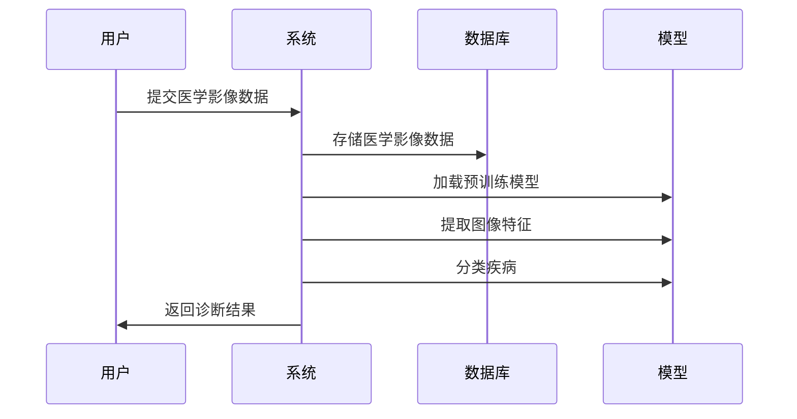

                 

# AI Agent在智能医疗影像分析中的角色

关键词：AI Agent、智能医疗影像分析、图像识别、深度学习、机器学习、系统架构

摘要：随着人工智能技术的飞速发展，AI Agent在智能医疗影像分析中扮演着越来越重要的角色。本文将从背景介绍、核心概念、应用案例、技术原理、系统架构和未来展望六个部分，系统性地探讨AI Agent在智能医疗影像分析中的应用和作用，以期为相关领域的研究和实践提供参考。

## 第一部分：智能医疗影像分析概述

### 1.1 智能医疗影像的定义

智能医疗影像是指利用人工智能技术对医学影像进行自动化分析、诊断和预测的过程。它结合了计算机视觉、机器学习和深度学习等前沿技术，通过图像识别、特征提取和模式分类等方法，实现对医学影像数据的智能分析和解读。

### 1.2 智能医疗影像分析的重要性

智能医疗影像分析在医疗领域具有重要的意义。首先，它可以帮助医生快速、准确地识别疾病，提高诊断效率。其次，通过大规模数据分析，可以挖掘出疾病的潜在规律，为疾病预防提供科学依据。此外，智能医疗影像分析还可以减轻医生的工作负担，降低医疗成本，提高医疗资源的利用效率。

### 1.3 当前智能医疗影像分析的现状

目前，智能医疗影像分析已经取得了一系列重要进展。例如，在肺癌筛查方面，AI Agent已经能够实现自动化的结节检测和风险评估；在脑部病变诊断方面，AI Agent可以辅助医生进行脑瘤的分类和定位。然而，智能医疗影像分析仍面临一些挑战，如数据质量、算法精度和可解释性等。

## 第二部分：AI Agent基本概念

### 2.1 AI Agent的定义

AI Agent是指具有感知、决策和执行能力的人工智能实体，可以自主地完成特定的任务。在智能医疗影像分析中，AI Agent可以充当医生的辅助角色，帮助医生进行疾病诊断和预测。

### 2.2 AI Agent的特点

AI Agent具有以下特点：

1. 感知：能够从环境获取信息，如医学影像数据。
2. 决策：根据获取的信息，通过算法进行决策，如疾病诊断。
3. 执行：根据决策执行具体的操作，如生成诊断报告。

### 2.3 AI Agent的类型

AI Agent可以分为以下几类：

1. 专家系统：基于规则的人工智能系统，适用于处理结构化数据。
2. 数据驱动模型：基于大数据和机器学习技术，适用于处理非结构化数据。
3. 强化学习模型：通过试错和反馈，逐步优化行为策略。

## 第三部分：AI Agent在医疗影像分析中的应用

### 3.1 图像识别的基本原理

图像识别是智能医疗影像分析的核心技术之一。其基本原理是：通过特征提取和模式分类，将图像数据转换为可供机器学习的特征向量，然后利用分类算法进行疾病诊断。

### 3.2 AI Agent在图像识别中的应用

AI Agent在图像识别中的应用主要包括：

1. 结节检测：通过对胸部CT影像的结节检测，辅助医生进行肺癌筛查。
2. 脑部病变诊断：通过对脑部MRI影像的分析，辅助医生进行脑瘤分类和定位。
3. 骨折诊断：通过对X光影像的分析，辅助医生进行骨折检测和分类。

### 3.3 应用实例分析

以下是一个应用实例：使用AI Agent对肺癌进行筛查。

1. 数据准备：收集胸部CT影像数据，并进行预处理，如图像增强、归一化等。
2. 特征提取：利用卷积神经网络（CNN）对图像进行特征提取，生成特征向量。
3. 模型训练：使用训练集数据训练分类模型，如支持向量机（SVM）或深度神经网络（DNN）。
4. 模型评估：使用验证集对模型进行评估，调整模型参数，提高分类准确率。
5. 模型部署：将训练好的模型部署到实际系统中，对新的CT影像进行肺癌筛查。

## 第四部分：AI Agent在医疗影像分析中的技术基础

### 4.1 机器学习基础

机器学习是AI Agent在医疗影像分析中的核心技术之一。机器学习的基本原理是通过学习历史数据，提取特征，建立预测模型。

### 4.2 深度学习基础

深度学习是机器学习的一个分支，具有自动提取特征的能力。深度学习模型主要包括卷积神经网络（CNN）和循环神经网络（RNN）。

### 4.3 自然语言处理基础

自然语言处理（NLP）是AI Agent在医疗影像分析中用于处理文本数据的技术。NLP的关键技术包括词向量、句法分析和语义理解。

## 第五部分：智能医疗影像分析系统的架构设计

### 5.1 系统功能设计

智能医疗影像分析系统主要包括以下功能：

1. 数据预处理：包括图像增强、归一化、数据增强等。
2. 特征提取：利用深度学习模型提取图像特征。
3. 模型训练：使用训练数据训练分类模型。
4. 模型评估：使用验证数据评估模型性能。
5. 模型部署：将训练好的模型部署到实际系统中。

### 5.2 系统架构设计

智能医疗影像分析系统可以分为以下几个层次：

1. 数据层：包括医学影像数据、标注数据等。
2. 模型层：包括深度学习模型、分类模型等。
3. 算法层：包括图像处理算法、特征提取算法等。
4. 应用层：包括Web应用、移动应用等。

### 5.3 系统接口设计

智能医疗影像分析系统需要设计以下接口：

1. 数据接口：用于数据导入、导出和预处理。
2. 模型接口：用于模型训练、评估和部署。
3. 服务接口：用于提供API服务，方便其他系统调用。

### 5.4 系统交互

智能医疗影像分析系统的工作流程可以表示为以下序列图：

## 第六部分：AI Agent在医疗影像分析中的案例研究

### 6.1 案例一：肺癌筛查

在本案例中，我们使用AI Agent对胸部CT影像进行肺癌筛查。具体步骤如下：

1. 数据准备：收集胸部CT影像数据，并进行预处理。
2. 模型训练：使用训练数据训练卷积神经网络（CNN）模型。
3. 模型评估：使用验证数据评估模型性能。
4. 模型部署：将训练好的模型部署到实际系统中。
5. 应用：对新的CT影像进行肺癌筛查。

### 6.2 案例二：脑部病变诊断

在本案例中，我们使用AI Agent对脑部MRI影像进行病变诊断。具体步骤如下：

1. 数据准备：收集脑部MRI影像数据，并进行预处理。
2. 模型训练：使用训练数据训练深度神经网络（DNN）模型。
3. 模型评估：使用验证数据评估模型性能。
4. 模型部署：将训练好的模型部署到实际系统中。
5. 应用：对新的MRI影像进行病变诊断。

### 6.3 案例三：骨折诊断

在本案例中，我们使用AI Agent对X光影像进行骨折诊断。具体步骤如下：

1. 数据准备：收集X光影像数据，并进行预处理。
2. 模型训练：使用训练数据训练支持向量机（SVM）模型。
3. 模型评估：使用验证数据评估模型性能。
4. 模型部署：将训练好的模型部署到实际系统中。
5. 应用：对新的X光影像进行骨折诊断。

## 第七部分：未来展望

### 7.1 技术发展展望

随着人工智能技术的不断进步，AI Agent在智能医疗影像分析中的应用前景将更加广阔。未来，我们将看到更先进的算法、更高效的模型和更广泛的应用场景。

### 7.2 应用前景展望

AI Agent在智能医疗影像分析中的应用将极大地改变医疗行业的面貌。它将为医生提供强大的辅助工具，提高诊断准确率和效率，降低医疗成本。

### 7.3 挑战与机遇

虽然AI Agent在智能医疗影像分析中具有巨大的潜力，但同时也面临一些挑战，如数据质量、算法可解释性和隐私保护等。只有克服这些挑战，才能充分发挥AI Agent在医疗领域的价值。

## 总结

AI Agent在智能医疗影像分析中扮演着越来越重要的角色。通过本文的探讨，我们了解了AI Agent的基本概念、应用案例、技术原理和系统架构。未来，随着人工智能技术的不断进步，AI Agent将在医疗领域发挥更大的作用。

### 作者

作者：AI天才研究院/AI Genius Institute & 禅与计算机程序设计艺术 /Zen And The Art of Computer Programming

