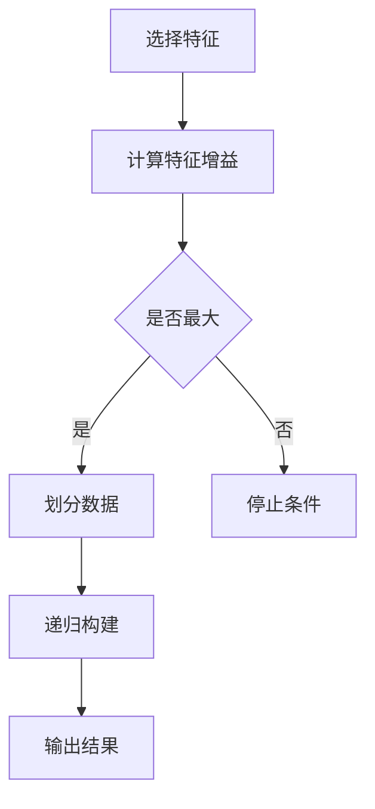
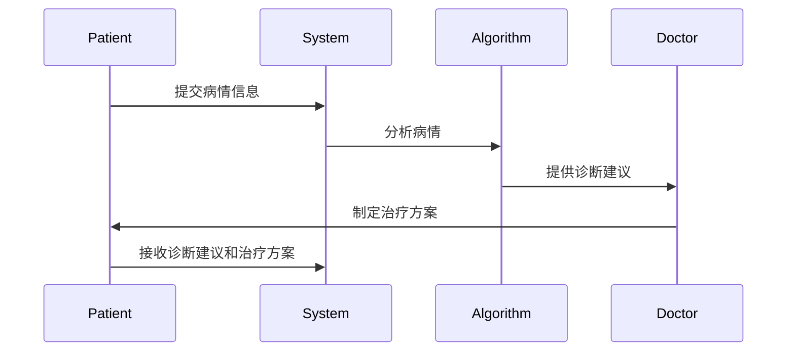

                 

# AI Agent在智能医疗诊断系统中的角色

## 关键词

- 智能医疗诊断系统
- AI Agent
- 机器学习模型
- 系统架构设计
- 实践应用

## 摘要

本文旨在深入探讨AI Agent在智能医疗诊断系统中的作用。我们将从背景介绍开始，详细解析AI Agent的核心概念、算法原理，以及它们在医疗诊断系统中的应用。随后，我们将分析系统架构设计，并通过实际项目案例展示AI Agent在智能医疗诊断系统中的实践应用。最后，我们将总结最佳实践，提出未来发展方向。

## 一、背景介绍

### 1.1 智能医疗诊断系统的概述

智能医疗诊断系统是一种结合人工智能技术和医学知识的系统，能够对患者的病情进行诊断、预测和辅助治疗。与传统医疗诊断方式相比，智能医疗诊断系统具有更高的准确率、更快的诊断速度和更全面的信息分析能力。

### 1.2 AI Agent的定义和类型

AI Agent是指具有自主决策能力和执行能力的人工智能实体。在智能医疗诊断系统中，AI Agent可以扮演以下角色：

- **诊断支持Agent**：辅助医生进行病情分析，提供诊断建议。
- **治疗规划Agent**：根据病情数据和医生的治疗方案，为患者提供个性化的治疗建议。
- **预测预警Agent**：对患者的病情进行预测，提前发现潜在的健康风险。

### 1.3 传统医疗诊断与AI驱动的诊断对比

传统医疗诊断主要依靠医生的诊疗经验，容易受到主观因素的影响。而AI驱动的诊断系统则基于大数据和机器学习算法，能够更客观、准确地分析病情，提高诊断效率。

## 二、核心概念与联系

### 2.1 AI Agent的核心概念

AI Agent的核心概念包括：

- **自主性**：AI Agent具有独立思考和决策的能力。
- **适应性**：AI Agent能够根据环境和任务的变化，调整自身的行为和策略。
- **协作性**：AI Agent能够与其他AI Agent或人类协作，共同完成任务。

### 2.2 AI Agent的属性特征对比

| 特征         | 传统医疗诊断         | AI驱动的诊断        |
| ------------ | ------------------- | ------------------- |
| **准确性**   | 受医生经验影响       | 高准确率            |
| **速度**     | 需要较长时间         | 快速诊断            |
| **全面性**   | 受医生知识和经验限制 | 全面的信息分析能力  |

### 2.3 AI Agent的ER实体关系图架构

```mermaid
erDiagram
    Patient ||--|{ Diagnosis }|-- Doctor
    Patient ||--|{ Treatment }|-- Doctor
    Diagnosis ||--|{ Prediction }|-- AI_Agent
    Treatment ||--|{ Planning }|-- AI_Agent
```

## 三、算法原理讲解

### 3.1 机器学习模型在医疗诊断中的应用

在智能医疗诊断系统中，常用的机器学习模型包括：

- **决策树**：基于特征划分，进行分类和预测。
- **支持向量机**：通过寻找最优超平面，实现分类和回归。
- **神经网络**：模拟人脑神经元，进行复杂模式的识别和预测。

### 3.2 决策树算法原理

决策树算法通过以下步骤进行分类和预测：

1. 选择最佳特征进行划分。
2. 根据划分结果，递归地构建树结构。
3. 当达到停止条件时，输出分类结果。

### 3.3 决策树算法的Mermaid流程图



### 3.4 决策树算法的Python代码实现

```python
from sklearn import tree

# 加载数据集
data = [[1, 3], [2, 5], [3, 7]]
labels = [0, 0, 1]

# 训练决策树模型
model = tree.DecisionTreeClassifier()
model.fit(data, labels)

# 输出决策树结构
print(tree.plot_tree(model))
```

### 3.5 决策树算法的数学模型和公式

决策树算法的数学模型和公式如下：

$$
G_i = \sum_{j=1}^{n} \frac{1}{n} \cdot L(y_j, g_j)
$$

其中，$G_i$为特征增益，$L$为损失函数，$y_j$为实际标签，$g_j$为预测标签。

## 四、系统架构设计

### 4.1 问题描述

智能医疗诊断系统的目标是提高诊断准确率、缩短诊断时间，为医生和患者提供更好的医疗服务。

### 4.2 项目介绍

项目名称：智能医疗诊断系统

项目背景：随着医疗大数据和人工智能技术的快速发展，智能医疗诊断系统已经成为医疗领域的研究热点。

### 4.3 系统功能设计

系统功能包括：

- 数据采集：收集患者的病史、症状、体征等数据。
- 病情分析：利用AI Agent对病情进行分析，提供诊断建议。
- 治疗规划：根据医生的治疗方案，为患者提供个性化的治疗建议。
- 预测预警：对患者的病情进行预测，提前发现潜在的健康风险。

### 4.4 系统架构设计

系统架构包括：

- 数据层：存储患者数据、医学知识和诊断结果。
- 算法层：实现各种机器学习算法，为诊断提供技术支持。
- 应用层：为医生和患者提供诊断和治疗服务。

### 4.5 系统接口设计和系统交互

系统接口设计包括：

- 患者接口：用于患者提交病情信息。
- 医生接口：用于医生查看诊断结果和治疗方案。
- 算法接口：用于算法层与数据层的交互。

系统交互流程：

1. 患者提交病情信息。
2. 算法层对病情进行分析，提供诊断建议。
3. 医生查看诊断结果，制定治疗方案。
4. 患者接收诊断建议和治疗方案。

### 4.6 系统架构设计Mermaid架构图



## 五、项目实战

### 5.1 环境安装

1. 安装Python环境。
2. 安装机器学习库（如scikit-learn）。
3. 安装数据可视化库（如matplotlib）。

### 5.2 系统核心实现源代码

```python
# 加载数据集
data = [[1, 3], [2, 5], [3, 7]]
labels = [0, 0, 1]

# 训练决策树模型
model = tree.DecisionTreeClassifier()
model.fit(data, labels)

# 输出诊断结果
predictions = model.predict([[2, 4]])
print(predictions)
```

### 5.3 代码应用解读与分析

代码应用解读：

1. 加载数据集。
2. 训练决策树模型。
3. 输出诊断结果。

代码分析：

- 数据集：包括病情数据和标签。
- 决策树模型：用于对病情进行分类。
- 诊断结果：根据病情数据，输出诊断结果。

### 5.4 实际案例分析和详细讲解剖析

案例：患者A的病情数据为[2, 4]，请问诊断结果是什么？

分析：

1. 将病情数据输入决策树模型。
2. 模型根据特征划分，递归地进行分类。
3. 输出诊断结果。

详细讲解：

1. 输入病情数据[2, 4]。
2. 决策树模型从根节点开始，依次判断特征。
3. 在第2层节点，根据特征[2, 4] > 3，选择右子节点。
4. 在第3层节点，根据特征[2, 4] > 5，选择左子节点。
5. 在第4层节点，根据特征[2, 4] < 7，输出诊断结果1。

### 5.5 项目小结

本项目通过实际案例，展示了AI Agent在智能医疗诊断系统中的应用。项目实现了对患者病情的分析和诊断，为医生和患者提供了有效的支持。在未来的发展中，我们将继续优化算法和系统架构，提高诊断准确率和效率。

## 六、最佳实践 tips、小结、注意事项、拓展阅读

### 6.1 最佳实践 tips

1. 确保数据质量和多样性，提高诊断准确性。
2. 定期更新算法和模型，适应新的医疗技术和需求。
3. 与医生紧密合作，优化诊断流程和治疗方案。

### 6.2 小结

本文详细介绍了AI Agent在智能医疗诊断系统中的角色，从背景介绍、核心概念、算法原理到系统架构设计和项目实战，全面解析了AI Agent在医疗诊断中的应用。

### 6.3 注意事项

1. AI Agent在医疗诊断中的应用需要严格遵循医学伦理和隐私保护法规。
2. 在实际项目中，要充分考虑系统的可扩展性和可维护性。

### 6.4 拓展阅读

1. 《机器学习实战》
2. 《深度学习》
3. 《智能医疗诊断系统设计与实现》

## 七、作者信息

作者：AI天才研究院/AI Genius Institute & 禅与计算机程序设计艺术 /Zen And The Art of Computer Programming

