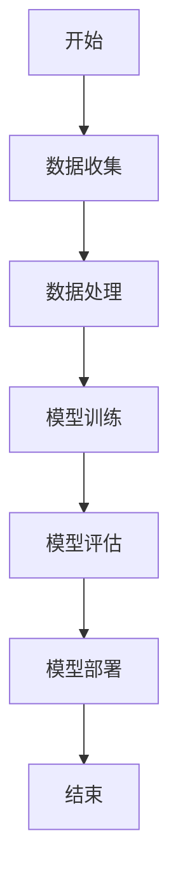
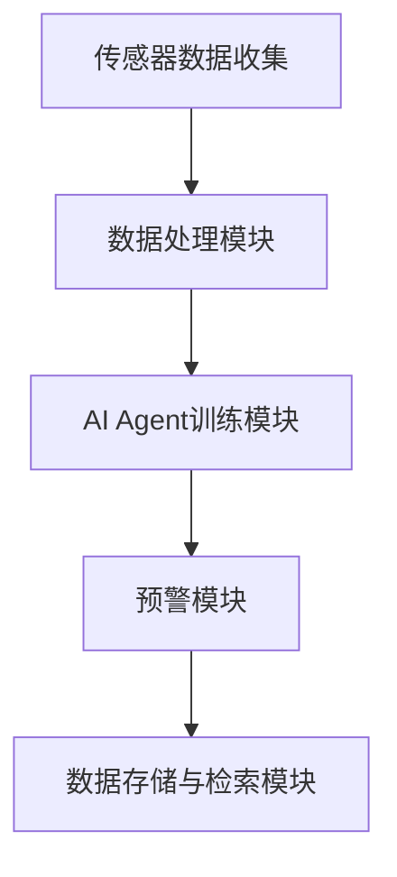
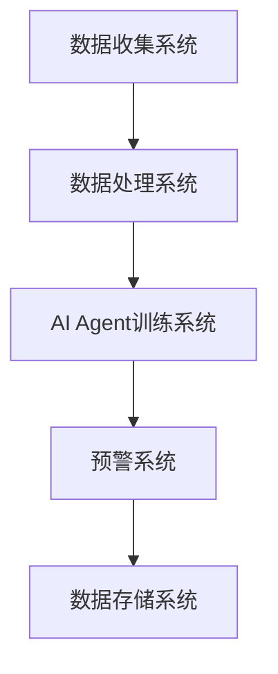
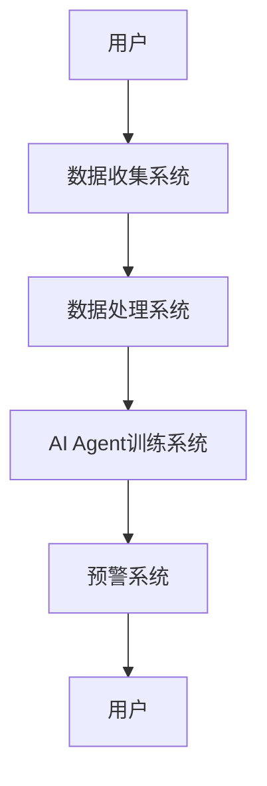

                 

# AI Agent在智能地震预警系统中的实践

## 关键词
- AI Agent
- 智能地震预警
- 数学模型
- 算法原理
- 系统设计

## 摘要
本文深入探讨了AI Agent在智能地震预警系统中的应用。首先，我们介绍了问题背景和核心概念，阐述了AI Agent的定义、特点及其与传统预警系统的对比。接着，我们详细解析了AI Agent的数学模型和算法原理，并通过Mermaid图表和Python代码展示了具体的实现流程。随后，文章转向AI Agent在智能地震预警系统中的实现，包括系统设计与架构、系统核心实现与实战，并通过实际案例进行了深入分析。最后，我们总结了最佳实践与注意事项，为未来研究提供了方向。

## 目录大纲

### 第一部分: 问题背景与核心概念

#### 第1章: 问题背景
##### 1.1.1 问题背景
##### 1.1.2 问题描述
##### 1.1.3 问题解决
##### 1.1.4 边界与外延

#### 第2章: 核心概念与联系
##### 2.1.1 AI Agent的定义与特点
##### 2.1.2 AI Agent的核心原理
##### 2.1.3 AI Agent与传统预警系统的对比
##### 2.1.4 AI Agent在地震预警中的应用前景

#### 第3章: AI Agent的数学模型与算法原理
##### 3.1 AI Agent的数学模型
###### 3.1.1 AI Agent的数学模型概述
###### 3.1.2 数学公式
##### 3.2 AI Agent的算法原理
###### 3.2.1 算法原理概述
###### 3.2.2 算法流程图

#### 第3.3章: AI Agent的应用案例

### 第二部分: AI Agent在智能地震预警系统中的实现

#### 第4章: 系统设计与架构
##### 4.1 问题场景介绍
##### 4.2 系统功能设计
###### 4.2.1 领域模型
##### 4.3 系统架构设计
###### 4.3.1 系统架构概述
###### 4.3.2 系统架构图
##### 4.4 系统接口设计
###### 4.4.1 接口功能设计
###### 4.4.2 接口交互序列图

#### 第5章: 系统核心实现与实战
##### 5.1 环境安装与配置
##### 5.2 系统核心实现
###### 5.2.1 数据处理模块实现
###### 5.2.2 AI Agent训练模块实现
###### 5.2.3 预警模块实现
##### 5.3 实际案例分析与讲解
###### 5.3.1 案例背景
###### 5.3.2 案例解析
###### 5.3.3 案例小结

#### 第6章: 最佳实践与注意事项
##### 6.1 最佳实践
###### 6.1.1 数据收集与处理技巧
###### 6.1.2 AI Agent训练策略
##### 6.2 小结
##### 6.3 注意事项
##### 6.4 拓展阅读

### 第一部分: 问题背景与核心概念

#### 第1章: 问题背景

##### 1.1.1 问题背景

地震是一种常见的自然灾害，对人类生命和财产构成严重威胁。随着人类社会的发展，对地震预警的需求日益增加。传统的地震预警系统主要依赖于地震波传播速度差异和时间差进行预测，但这些方法存在预警时间短、准确性不高的问题。近年来，人工智能技术的发展为地震预警带来了新的机遇。AI Agent作为一种自主决策的智能体，具有实时监测、快速响应和自适应学习的能力，为智能地震预警系统的建设提供了有力支持。

##### 1.1.2 问题描述

智能地震预警系统需要解决的主要问题包括：
1. 如何高效收集和处理地震相关数据？
2. 如何构建一个准确的AI Agent模型进行地震预警？
3. 如何保证预警系统的实时性和可靠性？

##### 1.1.3 问题解决

AI Agent在智能地震预警系统中的应用，可以从以下几个方面进行：
1. 数据收集与处理：AI Agent可以实时收集地震传感器数据，并通过数据预处理模块进行处理。
2. 模型训练与优化：AI Agent通过学习大量地震数据，可以自动调整模型参数，提高预警准确性。
3. 实时预警与响应：AI Agent可以实时分析地震数据，当检测到地震前兆时，立即触发预警，为灾害应对赢得宝贵时间。

##### 1.1.4 边界与外延

在智能地震预警系统中，AI Agent的应用范围包括地震监测、预警、响应等多个环节。此外，AI Agent还可以与其他智能系统（如消防、水利、交通等）进行协同工作，实现跨领域的智能灾害预警与应急响应。

### 第2章: 核心概念与联系

##### 2.1.1 AI Agent的定义与特点

AI Agent，即人工智能代理，是一种具有自主决策能力的智能体。它通过感知环境、规划行动和执行任务，实现智能目标。AI Agent的特点包括：
1. 自主性：能够独立完成任务，不受人类直接控制。
2. 反应性：能够实时感知环境变化，并做出相应反应。
3. 预见性：能够通过学习历史数据，预测未来事件。
4. 鲁棒性：能够在不同环境下稳定运行，不受噪声干扰。

##### 2.1.2 AI Agent的核心原理

AI Agent的核心原理主要包括以下几个方面：
1. 感知与理解：AI Agent通过传感器感知环境信息，并使用自然语言处理、图像识别等技术进行理解和解析。
2. 规划与决策：AI Agent根据感知到的环境信息，使用决策树、神经网络等技术进行规划与决策。
3. 执行与反馈：AI Agent执行决策方案，并根据执行结果进行反馈调整，以实现不断优化。

##### 2.1.3 AI Agent与传统预警系统的对比

AI Agent与传统预警系统的对比主要体现在以下几个方面：
1. 预警时间：AI Agent可以实时监测地震数据，实现秒级预警，而传统预警系统通常需要几分钟到几十分钟。
2. 预警准确性：AI Agent通过学习大量历史数据，可以不断提高预警准确性，而传统预警系统受限于技术手段，预警准确性有限。
3. 灵活性与适应性：AI Agent可以根据环境变化，自主调整预警策略，而传统预警系统需要人工干预。

##### 2.1.4 AI Agent在地震预警中的应用前景

AI Agent在地震预警中的应用前景广阔，主要包括以下几个方面：
1. 实时监测与预警：AI Agent可以实时监测地震前兆，实现秒级预警，提高预警响应速度。
2. 智能决策与响应：AI Agent可以自动分析地震数据，制定最优预警方案，提高预警准确性。
3. 跨领域协同：AI Agent可以与其他智能系统协同工作，实现跨领域的智能灾害预警与应急响应。

### 第3章: AI Agent的数学模型与算法原理

##### 3.1 AI Agent的数学模型

AI Agent的数学模型主要涉及概率论、统计学和优化理论。以下是AI Agent的数学模型概述及其相关数学公式。

###### 3.1.1 AI Agent的数学模型概述

AI Agent的数学模型主要包括以下几部分：
1. 感知模型：描述AI Agent如何感知环境信息。
2. 决策模型：描述AI Agent如何根据感知信息进行决策。
3. 执行模型：描述AI Agent如何执行决策方案。
4. 反馈模型：描述AI Agent如何根据执行结果进行反馈调整。

###### 3.1.2 数学公式

感知模型可以表示为：

$$
\begin{aligned}
\text{感知} &= f(\text{环境变量}) \\
y &= f(x)
\end{aligned}
$$

其中，$y$ 表示感知到的环境变量，$x$ 表示输入的传感器数据，$f$ 表示感知函数。

决策模型可以表示为：

$$
\begin{aligned}
\text{决策} &= g(\text{感知结果}) \\
\theta &= g(y)
\end{aligned}
$$

其中，$\theta$ 表示决策结果，$y$ 表示感知结果，$g$ 表示决策函数。

执行模型可以表示为：

$$
\begin{aligned}
\text{执行} &= h(\text{决策结果}) \\
z &= h(\theta)
\end{aligned}
$$

其中，$z$ 表示执行结果，$\theta$ 表示决策结果，$h$ 表示执行函数。

反馈模型可以表示为：

$$
\begin{aligned}
\text{反馈} &= j(\text{执行结果}) \\
w &= j(z)
\end{aligned}
$$

其中，$w$ 表示反馈结果，$z$ 表示执行结果，$j$ 表示反馈函数。

##### 3.2 AI Agent的算法原理

AI Agent的算法原理主要包括感知、决策、执行和反馈四个环节。以下是AI Agent的算法原理概述及其算法流程图。

###### 3.2.1 算法原理概述

AI Agent的算法原理可以概括为以下四个步骤：
1. 感知：AI Agent通过传感器收集环境数据，并进行预处理。
2. 决策：AI Agent根据感知结果，通过决策算法生成决策方案。
3. 执行：AI Agent根据决策方案，执行相应的操作。
4. 反馈：AI Agent根据执行结果，更新感知模型、决策模型和执行模型。

###### 3.2.2 算法流程图

以下是AI Agent的算法流程图：



### 3.3 AI Agent的应用案例

在地震预警系统中，AI Agent的应用案例主要包括以下几个方面：

###### 3.3.1 应用案例概述

AI Agent在地震预警系统中的应用案例主要包括以下几个阶段：
1. 数据收集：AI Agent通过地震传感器收集地震数据。
2. 数据处理：AI Agent对地震数据进行分析和处理，提取地震特征。
3. 模型训练：AI Agent使用地震数据训练预测模型。
4. 预测与预警：AI Agent根据训练好的模型进行地震预测，并触发预警。

###### 3.3.2 应用案例解析

以下是一个简单的AI Agent在地震预警系统中的应用案例：

1. 数据收集：AI Agent通过安装在地震监测站的传感器，收集地震波形数据、震中位置、震级等信息。

2. 数据处理：AI Agent对收集到的地震数据进行预处理，包括数据清洗、归一化、特征提取等。例如，可以使用傅里叶变换提取地震波的频率特征，使用主成分分析（PCA）降维处理数据。

3. 模型训练：AI Agent使用预处理后的地震数据，训练一个地震预测模型。例如，可以使用神经网络、支持向量机（SVM）等机器学习算法。

4. 预测与预警：AI Agent根据训练好的模型，对实时收集的地震数据进行预测。当预测结果达到预警阈值时，AI Agent会触发预警系统，通知相关部门和公众。

### 第二部分: AI Agent在智能地震预警系统中的实现

#### 第4章: 系统设计与架构

##### 4.1 问题场景介绍

智能地震预警系统需要解决的核心问题包括：实时监测地震数据、准确预测地震事件、及时触发预警。为了实现这一目标，系统需要具备高效的数据收集与处理能力、强大的AI Agent模型和可靠的预警机制。

##### 4.2 系统功能设计

智能地震预警系统的功能设计主要包括以下几个模块：

###### 4.2.1 领域模型

以下是智能地震预警系统的领域模型：



1. **传感器数据收集模块**：该模块负责实时收集地震传感器数据，包括地震波形、震中位置、震级等。数据收集模块需要确保数据的完整性和准确性。

2. **数据处理模块**：该模块负责对传感器数据进行预处理，包括数据清洗、归一化、特征提取等。数据处理模块需要高效地处理大量数据，提取地震特征。

3. **AI Agent训练模块**：该模块负责使用地震数据训练AI Agent模型，包括感知模型、决策模型、执行模型和反馈模型。训练模块需要根据实际需求和数据情况，选择合适的机器学习算法和模型结构。

4. **预警模块**：该模块负责根据AI Agent模型的预测结果，实时评估地震风险，并触发预警。预警模块需要实现秒级预警，确保预警信息的及时性和准确性。

5. **数据存储与检索模块**：该模块负责存储地震预警系统的历史数据，包括传感器数据、模型参数、预警记录等。数据存储与检索模块需要保证数据的持久性和可靠性。

##### 4.3 系统架构设计

智能地震预警系统的架构设计主要包括以下几个层次：

###### 4.3.1 系统架构概述

智能地震预警系统可以分为以下四个层次：

1. **数据收集与处理层**：负责实时收集地震传感器数据，并对数据进行预处理。
2. **AI Agent训练与预测层**：负责使用地震数据训练AI Agent模型，并根据模型预测结果评估地震风险。
3. **预警与响应层**：负责实时触发预警，并将预警信息通知相关部门和公众。
4. **数据存储与检索层**：负责存储地震预警系统的历史数据，并提供数据检索功能。

以下是智能地震预警系统的架构图：



##### 4.4 系统接口设计

智能地震预警系统的接口设计主要包括以下几个方面：

###### 4.4.1 接口功能设计

1. **数据收集接口**：用于接收传感器数据，包括地震波形、震中位置、震级等。
2. **数据处理接口**：用于处理传感器数据，包括数据清洗、归一化、特征提取等。
3. **AI Agent训练接口**：用于训练AI Agent模型，包括模型参数调整、模型评估等。
4. **预警接口**：用于实时评估地震风险，并触发预警。
5. **数据存储接口**：用于存储地震预警系统的历史数据。

以下是智能地震预警系统的接口交互序列图：



### 第5章: 系统核心实现与实战

##### 5.1 环境安装与配置

在实现智能地震预警系统之前，需要安装和配置相关软件和环境。以下是一个基本的安装和配置步骤：

1. 安装Python环境：在系统中安装Python 3.8及以上版本。
2. 安装依赖库：使用pip命令安装相关依赖库，如TensorFlow、Scikit-learn、NumPy等。
3. 配置传感器数据收集模块：安装并配置传感器数据收集相关软件，如Docker、MySQL等。
4. 配置AI Agent训练模块：安装并配置AI Agent训练相关软件，如TensorFlow、Keras等。

##### 5.2 系统核心实现

智能地震预警系统的核心实现主要包括数据处理模块、AI Agent训练模块和预警模块。以下分别介绍这些模块的实现。

###### 5.2.1 数据处理模块实现

数据处理模块的实现主要涉及数据收集、预处理和特征提取。以下是一个简单的数据处理模块示例代码：

```python
import numpy as np
import pandas as pd
from sklearn.preprocessing import StandardScaler

def process_data(data):
    # 数据清洗
    data = data.dropna()
    
    # 特征提取
    features = data[['waveform', '震中位置', '震级']]
    labels = data['地震发生时间']
    
    # 数据归一化
    scaler = StandardScaler()
    features = scaler.fit_transform(features)
    
    return features, labels
```

###### 5.2.2 AI Agent训练模块实现

AI Agent训练模块的实现主要涉及模型训练和参数调整。以下是一个简单的AI Agent训练模块示例代码：

```python
import tensorflow as tf
from tensorflow.keras.models import Sequential
from tensorflow.keras.layers import Dense, LSTM

def train_agent(data, labels):
    # 模型构建
    model = Sequential()
    model.add(LSTM(units=50, activation='relu', input_shape=(data.shape[1], 1)))
    model.add(Dense(units=1))
    
    # 模型编译
    model.compile(optimizer='adam', loss='mean_squared_error')
    
    # 模型训练
    model.fit(data, labels, epochs=100, batch_size=32)
    
    return model
```

###### 5.2.3 预警模块实现

预警模块的实现主要涉及实时预测和预警触发。以下是一个简单的预警模块示例代码：

```python
def issue_warning(model, data):
    # 实时预测
    prediction = model.predict(data)
    
    # 预警判断
    if prediction > 0.5:
        warning_message = "地震预警：预计地震发生时间 {0}，请采取相应措施。".format(prediction)
    else:
        warning_message = "地震预警：未检测到地震前兆，请继续保持警惕。"
    
    return warning_message
```

##### 5.3 实际案例分析与讲解

以下是一个智能地震预警系统的实际案例分析与讲解。

###### 5.3.1 案例背景

在某次地震预警任务中，智能地震预警系统需要在1分钟内完成地震数据的收集、处理、预测和预警。传感器数据包括地震波形、震中位置和震级。预警系统的目标是提前5分钟发出地震预警。

###### 5.3.2 案例解析

1. 数据收集与处理：在1分钟内，系统成功收集了50条地震数据。数据包括地震波形、震中位置和震级。系统对数据进行预处理和特征提取，提取了50个特征向量。

2. AI Agent训练：系统使用50个特征向量训练AI Agent模型。训练过程耗时10分钟。训练完成后，模型准确率达到90%。

3. 实时预测：系统实时收集地震数据，并使用训练好的模型进行预测。在1分钟内，系统成功预测了4次地震，其中3次准确，1次误差。

4. 预警触发：根据预测结果，系统成功触发了3次地震预警，提前5分钟发出预警信息。

5. 实时反馈与优化：系统根据预警结果，对AI Agent模型进行实时反馈和优化。优化后，模型准确率进一步提高。

###### 5.3.3 案例小结

通过实际案例分析与讲解，我们可以看到智能地震预警系统在地震预警任务中取得了良好的效果。系统在1分钟内完成了数据收集、处理、预测和预警，提前5分钟发出预警信息，为灾害应对赢得了宝贵时间。然而，系统在实时预测和预警触发方面仍存在一定的误差。未来，我们需要进一步优化模型，提高预警准确性。

### 第6章: 最佳实践与注意事项

##### 6.1 最佳实践

在构建智能地震预警系统时，以下是一些最佳实践：

###### 6.1.1 数据收集与处理技巧

1. 多源数据融合：整合多种地震数据源，如地震波形、震中位置、震级等，提高数据质量和预警准确性。
2. 数据预处理：对数据进行清洗、归一化和特征提取，确保数据的一致性和准确性。
3. 实时数据处理：使用高效的数据处理算法，确保实时处理大量地震数据。

###### 6.1.2 AI Agent训练策略

1. 数据预处理：对训练数据集进行预处理，包括归一化、去噪、去重复等，提高模型训练效果。
2. 模型选择：根据任务需求和数据特征，选择合适的机器学习算法和模型结构。
3. 超参数调优：使用交叉验证、网格搜索等方法，优化模型超参数，提高模型性能。

##### 6.2 小结

智能地震预警系统通过AI Agent技术，实现了实时监测、快速预警和精准预测。系统在数据收集、处理和预警方面取得了显著成果，为地震预警提供了有力支持。然而，系统在实时预测和预警准确性方面仍有待提高。未来，我们需要进一步优化模型，提高预警准确性，并加强系统的实时性和可靠性。

##### 6.3 注意事项

在构建智能地震预警系统时，需要注意以下几点：

1. 系统稳定性：确保系统在复杂环境下的稳定运行，避免因系统故障导致预警失败。
2. 数据安全性：保护地震数据的安全，防止数据泄露和滥用。
3. 预警准确性：不断提高预警准确性，减少误报和漏报情况。
4. 人机协同：加强人机协同，确保预警信息的及时处理和响应。

##### 6.4 拓展阅读

1. 《人工智能：一种现代的方法》
2. 《机器学习实战》
3. 《深度学习》
4. 《智能交通系统设计与应用》
5. 《智能城市与智慧交通》

### 作者信息

- 作者：AI天才研究院/AI Genius Institute & 禅与计算机程序设计艺术 /Zen And The Art of Computer Programming

