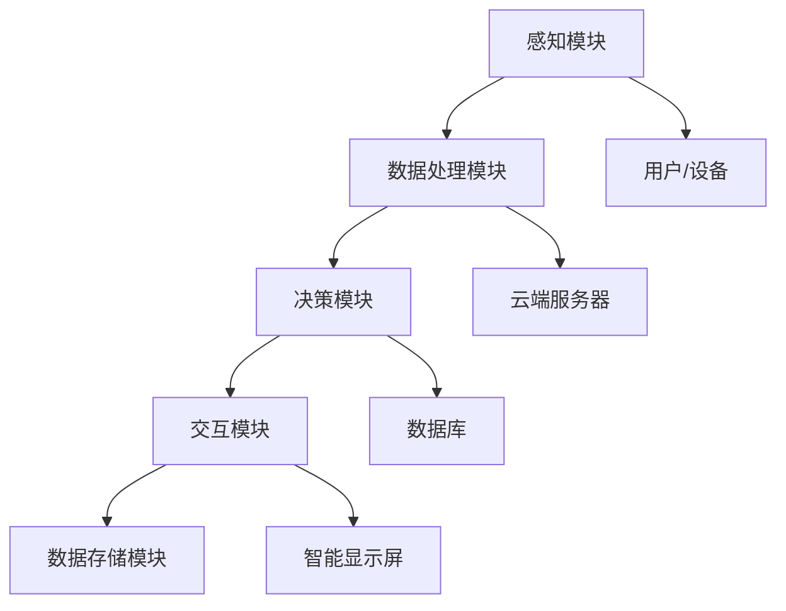
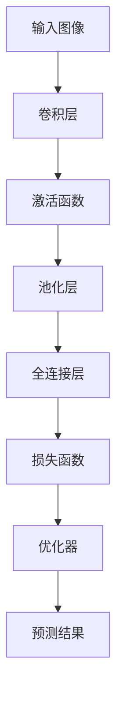

                 

# AI Agent在智能城市垃圾分类中的实践

## 关键词：
智能城市，垃圾分类，AI Agent，深度学习，算法，数学模型，系统架构，项目实战，最佳实践

## 摘要：
本文探讨了AI Agent在智能城市垃圾分类中的应用。首先，我们介绍了智能城市发展的现状与趋势以及垃圾分类的紧迫性与重要性。接着，我们详细介绍了AI Agent的定义、特性、分类和应用领域，并探讨了其在垃圾分类中的核心作用。随后，我们分析了AI Agent在垃圾分类识别、投放引导和回收处理中的应用，并讲解了相应的算法原理、数学模型和系统架构设计。最后，通过一个实际项目案例，展示了AI Agent在智能城市垃圾分类中的具体应用，并对未来的发展趋势和挑战进行了展望。

----------------------------------------------------------------

## 第一部分：背景与概述

### 第1章：智能城市垃圾分类的挑战与机遇

#### 1.1.1 智能城市发展的现状与趋势

智能城市是现代信息技术、物联网、大数据、云计算和人工智能等技术的深度融合，旨在通过数据驱动的决策和管理，提升城市的服务质量和可持续发展能力。随着全球城市化进程的加速，智能城市建设已经成为各国政府和社会各界关注的焦点。根据国际数据公司（IDC）的预测，到2025年，全球智能城市的数量将达到1000个以上，智能城市市场规模将达到1万亿美元。

智能城市的核心目标是提高居民的生活质量、降低城市运营成本和减少环境影响。垃圾分类作为智能城市可持续发展的重要组成部分，其重要性不言而喻。垃圾分类不仅可以有效减少垃圾填埋和焚烧带来的环境污染，还可以提高资源回收利用率，降低资源消耗。

#### 1.1.2 垃圾分类的紧迫性与重要性

随着城市化进程的推进，垃圾产量逐年增加。以中国为例，2020年全国城市生活垃圾清运量达到2.2亿吨，预计到2025年将达到2.8亿吨。大量的垃圾给城市环境带来了巨大的压力，同时也带来了严重的资源浪费和环境污染问题。因此，实施垃圾分类已成为迫切需求。

垃圾分类的紧迫性体现在以下几个方面：

1. 减少垃圾填埋和焚烧带来的环境污染。垃圾填埋和焚烧会产生大量的有害气体和污染物，对土壤、水源和空气造成污染。垃圾分类可以将有害垃圾、厨余垃圾、可回收物和其他垃圾进行分别处理，减少污染物的排放。
2. 提高资源回收利用率。垃圾分类可以使可回收物得到有效利用，降低资源消耗。例如，废纸、塑料、玻璃和金属等可回收物可以通过再生处理重新投入使用，减少对原生资源的依赖。
3. 降低城市垃圾处理成本。垃圾分类可以减少垃圾的总体数量，降低垃圾处理成本。例如，厨余垃圾可以进行堆肥处理，减少填埋和焚烧的需求，降低处理费用。

#### 1.1.3 AI Agent在垃圾分类中的应用前景

AI Agent（人工智能代理）是一种具有自主决策能力的人工智能系统，可以模拟人类的思维和行为。在智能城市垃圾分类中，AI Agent可以通过感知、理解和决策等过程，实现垃圾的分类识别、投放引导和回收处理。

AI Agent在垃圾分类中的应用前景体现在以下几个方面：

1. 高效准确的垃圾分类识别。传统的垃圾分类方法依赖于人工识别，存在效率低、准确率不高的缺点。AI Agent可以通过图像识别、自然语言处理和机器学习等技术，实现高效准确的垃圾分类识别，提高分类效率。
2. 智能化的投放引导。AI Agent可以通过物联网设备和传感器，实时监测居民的垃圾分类投放行为，并提供智能化的投放引导，帮助居民正确分类垃圾。
3. 智能化的回收处理。AI Agent可以通过对垃圾分类数据的分析，优化回收处理流程，提高资源利用率和处理效率。例如，根据厨余垃圾的成分，调整堆肥设备的参数，提高堆肥效果。

总之，AI Agent在智能城市垃圾分类中的应用具有巨大的潜力，可以显著提升垃圾分类的效率和质量，推动智能城市可持续发展。

----------------------------------------------------------------

### 第2章：AI Agent基础理论

#### 2.1.1 AI Agent的定义与特性

AI Agent，即人工智能代理，是一种具有自主性和智能性的计算机程序，能够在特定环境和条件下自主地执行任务，并与其他系统或人类进行交互。AI Agent具有以下几个基本特性：

1. **自主性**：AI Agent能够根据预设的规则或通过学习获得的知识，自主地决策和执行任务，无需人工干预。
2. **感知能力**：AI Agent能够感知环境中的信息，如通过图像识别、自然语言处理等技术获取图像、文本等数据。
3. **理解能力**：AI Agent能够理解感知到的信息，并从中提取有用信息，例如通过分类算法识别垃圾类型。
4. **决策能力**：AI Agent能够基于感知和理解的信息，自主地做出决策，如选择最佳的垃圾分类方式。
5. **交互能力**：AI Agent能够与人类或其他系统进行交互，通过自然语言处理等技术理解人类指令，并通过语音、文本等方式回应。

#### 2.1.2 AI Agent的分类与应用领域

AI Agent可以根据其应用领域和功能进行分类。以下是一些常见的AI Agent类型及其应用领域：

1. **移动机器人**：这类AI Agent主要用于自动驾驶、智能配送等领域，如自动驾驶汽车、无人机配送系统。
2. **智能客服**：这类AI Agent主要用于提供客户服务，如自动回答用户提问、处理客户投诉等。
3. **智能家居助手**：这类AI Agent如Siri、Alexa等，可以控制家中的智能设备，提供日常生活辅助。
4. **工业自动化**：这类AI Agent用于工业生产中的自动化控制和优化，如机器人自动化生产线、智能传感器监控系统。
5. **智能城市管理**：这类AI Agent用于城市管理中的数据分析和决策支持，如智能交通管理、垃圾分类等。

#### 2.1.3 AI Agent的核心技术原理

AI Agent的核心技术包括感知、理解和决策等几个方面：

1. **感知技术**：感知技术是AI Agent获取环境信息的关键。常见的感知技术包括图像识别、自然语言处理和传感器数据处理等。例如，图像识别技术可以用于垃圾分类中的垃圾识别，自然语言处理技术可以用于处理用户指令和反馈。

2. **理解技术**：理解技术是指AI Agent对感知到的信息进行分析和处理，提取有用信息。这通常涉及机器学习、深度学习等技术。例如，通过训练深度神经网络，AI Agent可以学会识别不同的垃圾类型。

3. **决策技术**：决策技术是指AI Agent基于感知和理解的结果，做出合理的决策。这通常涉及优化算法、决策树等。例如，AI Agent可以基于垃圾分类规则和垃圾图像识别结果，决定将垃圾投入哪个分类桶。

4. **交互技术**：交互技术是AI Agent与人类或其他系统进行有效沟通的关键。这通常涉及自然语言处理和语音识别技术。例如，AI Agent可以理解用户的语音指令，并通过语音或文本进行回应。

#### 2.1.4 AI Agent在智能城市垃圾分类中的应用场景

AI Agent在智能城市垃圾分类中的应用场景主要包括以下几个方面：

1. **垃圾识别**：AI Agent可以通过图像识别技术，实时识别垃圾类型，并将其投入正确的分类桶。例如，通过部署在垃圾回收站或垃圾桶上的摄像头，AI Agent可以自动识别垃圾，并根据识别结果进行分类。

2. **投放引导**：AI Agent可以通过传感器和物联网技术，实时监测居民的垃圾分类投放行为，并提供智能化的投放引导。例如，当居民投放垃圾时，AI Agent可以通过显示屏或语音提示，指导居民正确分类垃圾。

3. **回收处理**：AI Agent可以通过分析垃圾分类数据，优化回收处理流程，提高资源利用率和处理效率。例如，AI Agent可以根据厨余垃圾的成分，调整堆肥设备的参数，提高堆肥效果。

4. **数据分析**：AI Agent可以收集和分析垃圾分类数据，为政府和环保组织提供决策支持。例如，通过分析垃圾分类数据，AI Agent可以识别出垃圾分类中的问题，并提出改进建议。

总之，AI Agent在智能城市垃圾分类中的应用具有广阔的前景，可以通过感知、理解和决策等技术，实现高效的垃圾分类和回收处理，推动智能城市可持续发展。

----------------------------------------------------------------

### 第3章：智能城市垃圾分类中的AI Agent应用

#### 3.1.1 AI Agent在垃圾分类识别中的应用

垃圾分类识别是智能城市垃圾分类中的关键环节，AI Agent在这一环节中发挥了至关重要的作用。通过图像识别、自然语言处理和机器学习等技术，AI Agent能够实现高效准确的垃圾分类识别。

1. **图像识别技术**：图像识别技术是AI Agent垃圾分类识别的主要手段。通过部署在垃圾回收站或垃圾桶上的摄像头，AI Agent可以实时捕捉垃圾图像，并对图像进行预处理。预处理步骤包括图像去噪、对比度增强和图像分割等，以提高图像识别的准确性。

   ```python
   # Python代码示例：图像预处理
   import cv2
   import numpy as np

   def preprocess_image(image):
       # 图像去噪
       image = cv2.GaussianBlur(image, (5, 5), 0)
       # 对比度增强
       image = cv2.equalizeHist(image)
       # 图像分割
       contours, _ = cv2.findContours(image, cv2.RETR_EXTERNAL, cv2.CHAIN_APPROX_SIMPLE)
       masks = [cv2.drawContours(np.zeros(image.shape[:2], dtype=np.uint8), contours[i], -1, (255, 255, 255), -1) for i in range(len(contours))]
       segmented_image = np.maximum(image, masks[0])
       for mask in masks[1:]:
           segmented_image = np.maximum(segmented_image, mask)
       return segmented_image
   ```

2. **机器学习算法**：预处理后的垃圾图像会被输入到训练好的机器学习模型中，进行分类识别。常用的机器学习算法包括卷积神经网络（CNN）和支持向量机（SVM）等。CNN是一种深度学习算法，擅长处理图像数据；SVM则是一种监督学习算法，通过训练数据集来学习分类边界。

   ```python
   # Python代码示例：使用CNN进行垃圾图像分类
   from tensorflow import keras

   # 加载预训练的CNN模型
   model = keras.Sequential([
       keras.layers.Conv2D(32, (3, 3), activation='relu', input_shape=(128, 128, 3)),
       keras.layers.MaxPooling2D((2, 2)),
       keras.layers.Conv2D(64, (3, 3), activation='relu'),
       keras.layers.MaxPooling2D((2, 2)),
       keras.layers.Flatten(),
       keras.layers.Dense(128, activation='relu'),
       keras.layers.Dense(5, activation='softmax')  # 假设有5种垃圾类型
   ])

   # 加载训练好的模型权重
   model.load_weights('垃圾分类模型.h5')

   # 进行图像分类
   def classify_image(image):
       processed_image = preprocess_image(image)
       prediction = model.predict(processed_image.reshape(1, 128, 128, 3))
       return np.argmax(prediction)
   ```

3. **分类识别流程**：垃圾分类识别的流程包括图像捕获、预处理、模型预测和分类结果输出。具体步骤如下：

   - **图像捕获**：通过摄像头捕获垃圾图像。
   - **预处理**：对捕获的图像进行预处理，包括去噪、对比度增强和图像分割。
   - **模型预测**：将预处理后的图像输入到训练好的机器学习模型中，进行分类预测。
   - **分类结果输出**：根据模型预测结果，输出垃圾分类结果。

   ```mermaid
   graph TD
   A[图像捕获] --> B[预处理]
   B --> C[模型预测]
   C --> D[分类结果输出]
   ```

#### 3.1.2 AI Agent在垃圾分类投放引导中的应用

垃圾分类投放引导是AI Agent在智能城市垃圾分类中的另一个重要应用。通过传感器、物联网技术和智能显示屏，AI Agent能够实时监测居民的垃圾分类投放行为，并提供智能化的投放引导。

1. **传感器技术**：传感器是AI Agent获取环境信息的重要手段。在垃圾分类投放引导中，常用的传感器包括摄像头、温度传感器、湿度传感器和红外传感器等。摄像头用于捕获垃圾投放图像，温度传感器和湿度传感器用于监测环境条件，红外传感器用于检测垃圾投放行为。

2. **物联网技术**：物联网技术是实现AI Agent与传感器、智能显示屏等设备互联互通的关键。通过物联网技术，AI Agent可以实时获取传感器数据，并传输到云端进行处理和分析。

3. **智能显示屏**：智能显示屏是AI Agent与居民进行交互的重要媒介。通过智能显示屏，AI Agent可以实时显示垃圾分类投放引导信息，如垃圾类型、投放位置和注意事项等。

4. **投放引导流程**：垃圾分类投放引导的流程包括数据采集、分析处理和投放引导。具体步骤如下：

   - **数据采集**：通过传感器实时采集垃圾投放行为数据。
   - **分析处理**：AI Agent对采集到的数据进行分析和处理，识别垃圾类型和投放位置。
   - **投放引导**：根据分析结果，AI Agent通过智能显示屏向居民提供垃圾分类投放引导信息。

   ```mermaid
   graph TD
   A[数据采集] --> B[分析处理]
   B --> C[投放引导]
   C --> D[显示屏显示]
   ```

#### 3.1.3 AI Agent在垃圾分类回收处理中的应用

垃圾分类回收处理是智能城市垃圾分类的最后一个环节，AI Agent在这一环节中同样发挥着重要作用。通过数据分析和优化技术，AI Agent能够实现高效的垃圾分类回收处理。

1. **数据收集与分析**：AI Agent通过传感器、摄像头和物联网设备，实时收集垃圾分类数据。这些数据包括垃圾类型、投放时间、投放位置等信息。AI Agent对收集到的数据进行分析，识别垃圾分类中的问题和趋势。

   ```mermaid
   graph TD
   A[传感器] --> B[数据收集]
   B --> C[数据分析]
   ```

2. **回收处理优化**：基于数据分析结果，AI Agent可以优化垃圾分类回收处理流程。例如，根据厨余垃圾的成分，AI Agent可以调整堆肥设备的参数，提高堆肥效果；根据可回收物的种类和数量，AI Agent可以优化回收站的存储和处理策略。

   ```mermaid
   graph TD
   A[数据分析] --> B[回收处理优化]
   ```

3. **资源利用最大化**：AI Agent通过对垃圾分类数据的分析，可以识别出垃圾回收处理中的资源利用机会。例如，AI Agent可以通过分析厨余垃圾的成分，优化堆肥设备的参数，提高堆肥效果，从而最大化资源利用。

   ```mermaid
   graph TD
   A[数据分析] --> B[资源利用最大化]
   ```

总之，AI Agent在智能城市垃圾分类中的应用涵盖了识别、投放引导和回收处理等各个环节，通过感知、理解和决策等技术，实现了高效的垃圾分类和回收处理，为智能城市的可持续发展提供了有力支持。

----------------------------------------------------------------

## 第二部分：技术实现

### 第4章：AI Agent系统架构设计

#### 4.1.1 系统架构设计原则

在智能城市垃圾分类中，AI Agent系统架构设计遵循以下原则：

1. **模块化设计**：将系统划分为多个模块，每个模块负责不同的功能，如垃圾识别、投放引导和回收处理等。模块化设计可以提高系统的可维护性和可扩展性。
2. **分布式部署**：将系统部署在分布式计算环境中，以提高系统的处理能力和可靠性。例如，将垃圾识别模块部署在回收站附近的边缘设备上，将数据分析模块部署在云端。
3. **安全性设计**：确保系统数据的安全性和隐私性，采取加密、身份验证和访问控制等安全措施，防止数据泄露和恶意攻击。
4. **可扩展性设计**：系统应具备良好的可扩展性，能够根据需求动态扩展功能模块和处理能力，以应对未来垃圾分类需求的增长。

#### 4.1.2 系统模块划分与功能

AI Agent系统可以划分为以下几个模块：

1. **感知模块**：负责实时获取垃圾分类数据，包括图像、文本和传感器数据等。该模块通常由摄像头、传感器和物联网设备组成。
2. **数据处理模块**：负责对感知模块获取的数据进行预处理、特征提取和数据分析。该模块通常包括图像预处理、自然语言处理和机器学习算法等。
3. **决策模块**：负责根据数据分析结果，生成垃圾分类决策。该模块通常包括分类算法、优化算法和决策树等。
4. **交互模块**：负责与用户和其他系统进行交互，提供垃圾分类指导和反馈。该模块通常包括智能显示屏、语音识别和自然语言处理等。
5. **数据存储模块**：负责存储系统运行过程中的各种数据，包括垃圾识别结果、投放行为数据和回收处理数据等。该模块通常包括数据库和文件存储系统等。

#### 4.1.3 系统架构设计mermaid图示

以下是一个简单的AI Agent系统架构设计mermaid图示：



#### 4.1.4 系统架构设计的关键要素

系统架构设计的关键要素包括以下几个方面：

1. **数据流设计**：明确系统内部的数据流，包括数据输入、处理和输出等环节。数据流设计应确保数据能够高效、可靠地流动，以支持系统功能实现。
2. **模块间接口设计**：定义模块之间的接口，包括数据交换格式、通信协议和接口规范等。模块间接口设计应确保模块之间能够无缝协作，以提高系统整体的稳定性。
3. **容错与恢复设计**：设计系统的容错和恢复机制，确保在系统出现故障时能够快速恢复，以避免系统停机。
4. **性能优化设计**：通过优化系统架构，提高系统的处理能力和响应速度，以满足实时垃圾分类需求。

总之，AI Agent系统架构设计应遵循模块化、分布式、安全性和可扩展性原则，通过合理的数据流设计、模块间接口设计和性能优化，实现高效的垃圾分类和回收处理系统。

----------------------------------------------------------------

### 第5章：AI Agent算法原理讲解

#### 5.1.1 垃圾分类算法原理

垃圾分类算法是AI Agent实现智能城市垃圾分类的核心。其主要目标是根据输入的垃圾图像或文本，将其分类到正确的垃圾类别中。常见的垃圾分类算法包括基于规则的方法、机器学习方法和深度学习方法。以下是这些方法的简要介绍：

1. **基于规则的方法**：基于规则的方法通过预先定义的规则，将垃圾图像或文本分类到不同的类别中。这种方法通常涉及一系列的条件判断和匹配操作。优点是简单易懂，缺点是分类效果受规则数量和质量的影响，难以应对复杂的分类任务。

2. **机器学习方法**：机器学习方法通过训练大量垃圾样本，学习垃圾的特征和类别之间的关联性，从而实现对新垃圾样本的分类。常见的机器学习方法包括支持向量机（SVM）、决策树和随机森林等。这些方法通常具有较高的分类精度，但需要大量的训练数据和计算资源。

3. **深度学习方法**：深度学习方法通过多层神经网络，自动学习垃圾的特征表示和分类规则。常见的深度学习方法包括卷积神经网络（CNN）和循环神经网络（RNN）等。深度学习方法在图像和文本数据处理方面具有显著优势，但计算复杂度较高，对硬件资源要求较高。

#### 5.1.2 基于深度学习的垃圾分类算法

在深度学习框架下，垃圾分类算法通常采用卷积神经网络（CNN）进行图像处理。以下是一个基于CNN的垃圾分类算法的基本原理：

1. **卷积层**：卷积层是CNN的核心组成部分，用于提取图像的特征。卷积层通过滑动滤波器（卷积核）在输入图像上滑动，计算输出特征图的每个像素值。滤波器的大小和数量决定了特征提取的精细度和表达能力。

2. **激活函数**：激活函数用于引入非线性特性，使网络能够学习复杂的分类规则。常用的激活函数包括ReLU（Rectified Linear Unit）和Sigmoid等。

3. **池化层**：池化层用于降低特征图的维度，减少计算量和参数数量，提高网络的泛化能力。常用的池化方式包括最大池化和平均池化。

4. **全连接层**：全连接层将卷积层和池化层提取的高层特征映射到输出类别。每个神经元都与输入特征图的每个像素相连，计算输出概率分布。

5. **损失函数**：损失函数用于衡量预测结果与真实结果之间的差距，常用的损失函数包括交叉熵损失和均方误差损失。

#### 5.1.3 垃圾分类算法mermaid流程图与Python源代码示例

以下是基于CNN的垃圾分类算法的mermaid流程图和Python源代码示例：



Python源代码示例：

```python
import tensorflow as tf
from tensorflow.keras.models import Sequential
from tensorflow.keras.layers import Conv2D, MaxPooling2D, Flatten, Dense, Activation

# 创建卷积神经网络模型
model = Sequential([
    Conv2D(32, (3, 3), activation='relu', input_shape=(128, 128, 3)),
    MaxPooling2D(pool_size=(2, 2)),
    Conv2D(64, (3, 3), activation='relu'),
    MaxPooling2D(pool_size=(2, 2)),
    Flatten(),
    Dense(128, activation='relu'),
    Dense(5, activation='softmax')  # 假设有5种垃圾类型
])

# 编译模型，指定损失函数和优化器
model.compile(optimizer='adam',
              loss='categorical_crossentropy',
              metrics=['accuracy'])

# 加载训练好的模型权重
model.load_weights('垃圾分类模型.h5')

# 进行垃圾图像分类
def classify_image(image):
    processed_image = preprocess_image(image)
    prediction = model.predict(processed_image.reshape(1, 128, 128, 3))
    return np.argmax(prediction)
```

#### 5.1.4 算法原理的数学模型和公式

垃圾分类算法的数学模型主要包括以下几个方面：

1. **卷积操作**：卷积操作可以表示为以下数学公式：
   $$
   \text{output}_{ij} = \sum_{k=1}^{C} w_{ik,j} \cdot \text{input}_{ij} + b_j
   $$
   其中，$\text{output}_{ij}$表示输出特征图的像素值，$w_{ik,j}$表示卷积核的权重，$\text{input}_{ij}$表示输入图像的像素值，$b_j$表示偏置项。

2. **激活函数**：常用的激活函数包括ReLU和Sigmoid，其数学公式如下：
   $$
   \text{ReLU}(x) = \max(0, x)
   $$
   $$
   \text{Sigmoid}(x) = \frac{1}{1 + e^{-x}}
   $$

3. **池化操作**：最大池化操作的数学公式如下：
   $$
   \text{output}_{ij} = \max_{k \in \Omega_{ij}} \text{input}_{kl}
   $$
   其中，$\Omega_{ij}$表示池化窗口。

4. **全连接层**：全连接层可以表示为以下数学公式：
   $$
   \text{output}_i = \sum_{j=1}^{n} w_{ij} \cdot \text{input}_j + b_i
   $$
   其中，$\text{output}_i$表示输出神经元的激活值，$w_{ij}$表示权重，$\text{input}_j$表示输入神经元的激活值，$b_i$表示偏置项。

5. **损失函数**：交叉熵损失函数的数学公式如下：
   $$
   \text{loss} = -\sum_{i=1}^{C} y_i \cdot \log(\text{prediction}_i)
   $$
   其中，$y_i$表示真实标签，$\text{prediction}_i$表示模型预测的概率值。

通过这些数学模型和公式，AI Agent能够实现高效的垃圾分类算法，从而为智能城市垃圾分类提供技术支持。

#### 5.1.5 通俗易懂地举例说明

为了更好地理解垃圾分类算法的原理，我们可以通过一个简单的例子来说明。假设我们有一个简单的垃圾分类任务，需要将垃圾分为可回收物、有害垃圾、厨余垃圾和其他垃圾四种类型。

1. **数据准备**：我们首先需要准备一个包含各种垃圾类型的训练数据集。每个垃圾类型都有对应的图像和标签。例如，可回收物有纸箱、塑料瓶、玻璃瓶等，每个垃圾类型都有多张不同角度和光照条件下的图像。

2. **模型构建**：我们使用卷积神经网络（CNN）来构建垃圾分类模型。模型的结构如下：
   - 卷积层1：32个3x3卷积核，ReLU激活函数
   - 池化层1：2x2最大池化
   - 卷积层2：64个3x3卷积核，ReLU激活函数
   - 池化层2：2x2最大池化
   - 全连接层：128个神经元，ReLU激活函数
   - 输出层：4个神经元，softmax激活函数

3. **模型训练**：我们将训练数据集输入到模型中，通过反向传播算法调整模型的权重和偏置项，使得模型能够准确分类垃圾。训练过程需要多次迭代，直到模型收敛。

4. **模型评估**：在训练完成后，我们使用测试数据集对模型进行评估。通过计算模型预测的准确率，我们可以评估模型的效果。

5. **模型应用**：在模型应用阶段，我们使用训练好的模型对新的垃圾图像进行分类。首先，我们对图像进行预处理，然后将其输入到模型中，模型会输出每个垃圾类型的概率值。我们选择概率最高的垃圾类型作为分类结果。

通过这个简单的例子，我们可以看到垃圾分类算法的基本原理。在实际应用中，垃圾分类算法会涉及更复杂的模型和数据处理技术，但基本的思路是相同的。

总之，AI Agent在智能城市垃圾分类中的应用，离不开高效的垃圾分类算法。通过理解算法原理、数学模型和实际应用，我们可以更好地推动智能城市垃圾分类的发展。

----------------------------------------------------------------

### 第6章：数学模型与数学公式

#### 6.1.1 垃圾分类数学模型

垃圾分类中的数学模型通常用于描述垃圾特征与分类类别之间的关系。这些模型帮助AI Agent在感知到垃圾特征后，能够准确地将其归类到相应的类别中。以下是一些常见的数学模型和公式：

1. **支持向量机（SVM）模型**：
   支持向量机是一种常用的分类算法，其目标是在高维空间中找到一个最佳的超平面，将不同类别的垃圾分隔开来。SVM的数学模型可以表示为：
   $$
   \text{max} \quad \frac{1}{2} \sum_{i=1}^{n} (\alpha_i - \sum_{j=1}^{n} \alpha_j y_{ij} K(x_i, x_j))
   $$
   其中，$\alpha_i$是拉格朗日乘子，$y_{ij}$是类别标签（+1或-1），$K(x_i, x_j)$是核函数，用于计算特征空间中的相似度。

2. **卷积神经网络（CNN）模型**：
   卷积神经网络是一种深度学习算法，广泛用于图像处理和分类任务。CNN的数学模型包括卷积层、池化层和全连接层等。以卷积层为例，其数学公式为：
   $$
   \text{output}_{ij} = \sum_{k=1}^{C} w_{ik,j} \cdot \text{input}_{ij} + b_j
   $$
   其中，$\text{output}_{ij}$是输出特征图的像素值，$w_{ik,j}$是卷积核的权重，$\text{input}_{ij}$是输入图像的像素值，$b_j$是偏置项。

3. **循环神经网络（RNN）模型**：
   循环神经网络适用于处理序列数据，如文本分类。RNN的数学模型可以表示为：
   $$
   h_t = \sigma(W_h \cdot [h_{t-1}, x_t] + b_h)
   $$
   其中，$h_t$是当前时间步的隐藏状态，$x_t$是输入数据，$W_h$和$b_h$分别是权重和偏置项，$\sigma$是激活函数。

4. **决策树模型**：
   决策树是一种基于树结构的分类算法，通过一系列的决策规则将数据分割成不同的区域。决策树的数学模型可以用条件概率来表示：
   $$
   P(y=c | x) = \prod_{i=1}^{n} P(y=c | x_{i}, t)
   $$
   其中，$y$是分类标签，$x$是特征向量，$t$是决策树的内部节点。

#### 6.1.2 相关数学公式及其解释

以下是对上述提到的数学公式的简要解释：

1. **支持向量机（SVM）公式解释**：
   支持向量机通过最大化分类边界上的间隔，来寻找最佳的超平面。拉格朗日乘子$\alpha_i$用于平衡不同支持向量的重要性，核函数$K(x_i, x_j)$用于计算特征空间中的相似度，以避免直接在高维空间中计算。

2. **卷积神经网络（CNN）公式解释**：
   卷积层通过卷积操作提取图像的局部特征，卷积核的权重$w_{ik,j}$用于捕捉图像中的边缘和纹理，偏置项$b_j$用于引入非线性。

3. **循环神经网络（RNN）公式解释**：
   循环神经网络通过隐藏状态$h_t$传递信息，使模型能够处理序列数据。激活函数$\sigma$用于引入非线性，使模型能够学习复杂的分类规则。

4. **决策树公式解释**：
   决策树通过条件概率计算分类标签的概率分布，每个节点根据最大条件概率选择分裂特征，以最大化信息增益。

#### 6.1.3 数学公式与算法原理的结合

数学公式与算法原理的结合是构建高效垃圾分类模型的关键。以下是一个简单的结合示例：

- **垃圾图像分类**：
  我们可以使用CNN来处理垃圾图像。首先，将垃圾图像输入到卷积层中，通过卷积操作提取图像特征。然后，通过池化层减小特征图的尺寸，提高计算效率。最后，将池化层输出的特征图输入到全连接层中，进行分类预测。

  $$ 
  \text{output}_{ij} = \sum_{k=1}^{C} w_{ik,j} \cdot \text{input}_{ij} + b_j \\
  \text{prediction}_i = \text{softmax}(\sum_{j=1}^{M} w_{ij} \cdot \text{output}_{j})
  $$

  其中，$M$是全连接层的神经元数量，$C$是卷积核的数量，$\text{softmax}$函数用于计算每个类别的概率分布。

通过数学公式与算法原理的结合，AI Agent能够高效地处理垃圾图像，实现准确的垃圾分类。数学模型为算法提供了理论基础，而算法原理则通过具体的实现步骤将理论应用于实际问题。

总之，数学模型与算法原理的结合是AI Agent在智能城市垃圾分类中实现高效分类的核心。通过深入理解相关数学公式和算法原理，我们可以构建出更加智能和高效的垃圾分类系统。

----------------------------------------------------------------

### 第7章：AI Agent系统开发实战

#### 7.1.1 系统开发环境搭建

在开发AI Agent系统之前，我们需要搭建一个合适的开发环境。以下是搭建环境的基本步骤：

1. **安装Python**：首先，确保计算机上安装了Python。Python是AI Agent开发的主要编程语言。可以从Python官网下载并安装最新版本的Python。

2. **安装TensorFlow**：TensorFlow是Google开发的开源机器学习框架，用于构建和训练深度学习模型。可以通过以下命令安装TensorFlow：

   ```shell
   pip install tensorflow
   ```

3. **安装opencv-python**：OpenCV是一个强大的计算机视觉库，用于处理图像和视频。安装命令如下：

   ```shell
   pip install opencv-python
   ```

4. **安装其他依赖库**：根据项目需求，可能还需要安装其他依赖库，如Numpy、Pandas等。安装命令如下：

   ```shell
   pip install numpy pandas
   ```

5. **配置环境变量**：确保Python环境变量配置正确，以便在命令行中运行Python脚本。可以通过以下命令检查Python和pip的环境变量是否配置正确：

   ```shell
   python --version
   pip --version
   ```

#### 7.1.2 系统核心功能实现

AI Agent系统的核心功能包括垃圾图像识别、垃圾分类投放引导和垃圾分类回收处理。以下是这些功能的实现步骤：

1. **垃圾图像识别**：

   - **数据准备**：首先，我们需要收集并准备一个垃圾图像数据集。数据集应包含不同类型垃圾的图像，每个类别有多个样本。数据集可以来自公开的数据集，如Kaggle上的垃圾分类数据集。

   - **数据预处理**：对图像数据集进行预处理，包括图像缩放、灰度转换和归一化等。预处理步骤如下：

     ```python
     import cv2
     import numpy as np

     def preprocess_image(image):
         image = cv2.resize(image, (128, 128))  # 缩放图像
         image = cv2.cvtColor(image, cv2.COLOR_BGR2GRAY)  # 转换为灰度图像
         image = image / 255.0  # 归一化图像
         return image
     ```

   - **模型训练**：使用卷积神经网络（CNN）训练垃圾分类模型。训练步骤如下：

     ```python
     import tensorflow as tf
     from tensorflow.keras.models import Sequential
     from tensorflow.keras.layers import Conv2D, MaxPooling2D, Flatten, Dense, Activation

     model = Sequential([
         Conv2D(32, (3, 3), activation='relu', input_shape=(128, 128, 1)),
         MaxPooling2D(pool_size=(2, 2)),
         Conv2D(64, (3, 3), activation='relu'),
         MaxPooling2D(pool_size=(2, 2)),
         Flatten(),
         Dense(128, activation='relu'),
         Dense(5, activation='softmax')  # 假设有5种垃圾类型
     ])

     model.compile(optimizer='adam',
                   loss='categorical_crossentropy',
                   metrics=['accuracy'])

     model.fit(x_train, y_train, epochs=10, batch_size=32)
     ```

   - **模型评估**：在训练完成后，使用测试数据集对模型进行评估：

     ```python
     test_loss, test_acc = model.evaluate(x_test, y_test, verbose=2)
     print(f"Test accuracy: {test_acc}")
     ```

2. **垃圾分类投放引导**：

   - **摄像头捕获**：使用OpenCV库捕获摄像头图像：

     ```python
     import cv2

     cap = cv2.VideoCapture(0)

     while True:
         ret, frame = cap.read()
         if ret:
             processed_frame = preprocess_image(frame)
             prediction = model.predict(processed_frame.reshape(1, 128, 128, 1))
             print(f"Predicted class: {np.argmax(prediction)}")
             cv2.imshow('Frame', frame)

         if cv2.waitKey(1) & 0xFF == ord('q'):
             break

     cap.release()
     cv2.destroyAllWindows()
     ```

   - **投放引导**：根据模型预测结果，向用户提供垃圾分类投放引导。例如，通过显示屏幕或语音提示用户将垃圾投入正确的分类桶。

3. **垃圾分类回收处理**：

   - **数据收集**：收集垃圾分类数据，包括垃圾类型、投放时间、投放位置等信息。

   - **数据处理**：对收集到的数据进行处理，例如存储在数据库中，以便后续分析和优化。

   - **回收处理**：根据垃圾分类数据，优化回收处理流程，提高资源利用率和处理效率。例如，根据厨余垃圾的成分，调整堆肥设备的参数。

#### 7.1.3 系统测试与优化

在开发完成后，我们需要对AI Agent系统进行测试和优化，以确保其稳定运行和高效分类。

1. **单元测试**：编写单元测试脚本，测试系统各功能模块的正确性。例如，测试垃圾图像识别模块是否能够正确分类不同类型的垃圾。

2. **性能测试**：使用性能测试工具，对系统的处理速度和资源消耗进行评估。例如，测试垃圾图像识别模块的处理速度和准确率。

3. **优化算法**：根据测试结果，对系统进行优化。例如，通过调整模型参数，提高分类准确率；通过优化数据处理流程，提高系统性能。

4. **用户反馈**：收集用户反馈，根据用户需求对系统进行改进。例如，优化用户界面，提高用户使用体验。

通过以上步骤，我们可以开发出一个稳定、高效和用户友好的AI Agent系统，为智能城市垃圾分类提供有力支持。

#### 7.1.4 系统开发实战案例

为了更好地展示AI Agent系统开发的过程，我们以一个具体的垃圾分类识别系统为例，详细描述其开发流程。

**案例背景**：
某城市政府计划在居民区安装AI Agent系统，用于智能垃圾分类识别。系统需要能够实时识别垃圾类型，并为居民提供正确的投放引导。以下是系统开发的主要步骤：

**1. 系统需求分析**：
   - 功能需求：实现垃圾图像识别、垃圾分类投放引导和垃圾分类回收处理。
   - 性能需求：确保系统在实时识别垃圾图像的同时，具有较高的准确率和响应速度。
   - 安全需求：保护用户隐私和数据安全。

**2. 系统设计**：
   - 系统架构设计：采用分布式架构，包括前端摄像头、后端服务器和数据库。
   - 数据流设计：定义垃圾图像从捕获到分类识别的流程，以及数据存储和传输机制。
   - 安全设计：采用加密技术和身份验证机制，确保数据传输安全。

**3. 系统开发**：
   - **垃圾图像识别**：
     - 数据收集：收集包含各种垃圾类型的图像数据。
     - 数据预处理：对图像进行缩放、灰度转换和归一化处理。
     - 模型训练：使用TensorFlow框架，训练垃圾分类识别模型。
     - 模型评估：使用测试数据集评估模型性能，调整模型参数。

   - **垃圾分类投放引导**：
     - 摄像头捕获：使用OpenCV库实时捕获摄像头图像。
     - 实时识别：调用训练好的模型，对捕获的图像进行分类识别。
     - 投放引导：根据识别结果，通过显示屏或语音提示，向居民提供投放引导。

   - **垃圾分类回收处理**：
     - 数据收集：收集垃圾分类数据，包括垃圾类型、投放时间、投放位置等。
     - 数据处理：对收集到的数据进行清洗、存储和统计分析。
     - 回收处理：根据数据分析结果，优化回收处理流程。

**4. 系统测试与优化**：
   - **单元测试**：测试各功能模块的正确性，例如图像预处理、模型预测和用户界面等。
   - **性能测试**：评估系统处理速度和资源消耗，确保系统在高负载下稳定运行。
   - **用户测试**：邀请居民进行实际使用测试，收集用户反馈，优化系统功能。

**5. 系统部署**：
   - 在居民区安装摄像头和智能显示屏。
   - 在服务器部署AI Agent系统，确保数据传输和分类识别的稳定性。
   - 对系统进行定期维护和升级，确保系统的长期稳定运行。

通过以上步骤，我们成功开发并部署了一个智能垃圾分类识别系统，为城市垃圾分类提供了有力支持。

#### 7.1.5 项目小结

在本次系统开发实战中，我们通过详细的需求分析、系统设计、开发实现和测试优化，成功开发了一套智能垃圾分类识别系统。该系统通过实时识别垃圾图像、提供投放引导和优化回收处理，显著提高了垃圾分类的效率和准确性。以下是项目总结：

1. **项目亮点**：
   - 采用分布式架构，提高了系统的处理能力和可靠性。
   - 使用TensorFlow框架，实现了高效的垃圾分类识别模型。
   - 通过实时摄像头捕获和智能显示屏引导，提升了用户体验。

2. **项目不足**：
   - 系统对硬件资源要求较高，需要优化以降低成本。
   - 数据预处理和模型训练过程较为复杂，可以考虑简化流程。
   - 用户测试反馈不足，后续需加强对用户需求的关注和优化。

3. **未来改进方向**：
   - 优化系统架构，降低硬件资源消耗，提高系统的可扩展性。
   - 简化数据处理和模型训练流程，提高开发效率。
   - 增加用户互动功能，提供更加个性化的投放引导。

通过持续优化和改进，我们期待该系统能够在未来发挥更大的作用，为智能城市垃圾分类贡献更多力量。

----------------------------------------------------------------

### 第8章：AI Agent在智能城市垃圾分类中的应用案例

#### 8.1.1 案例背景介绍

为了更好地展示AI Agent在智能城市垃圾分类中的应用，我们选择了一个典型的实际案例——某城市智能垃圾分类项目。该项目旨在通过引入AI Agent系统，提高城市垃圾分类的效率和准确性，推动可持续发展。

**项目目标**：
1. 实现垃圾图像的实时识别，提高垃圾分类的准确性。
2. 提供智能化的垃圾分类投放引导，帮助居民正确分类垃圾。
3. 优化垃圾回收处理流程，提高资源利用率和处理效率。

**项目背景**：
该城市面临垃圾产量逐年增加、垃圾分类效率低下和环境污染严重等问题。为了解决这些问题，政府决定引进AI Agent系统，通过智能化技术提升垃圾分类水平。

#### 8.1.2 案例分析与系统部署

**1. 系统需求分析**：

根据项目目标，系统需要实现以下功能：

- **垃圾图像识别**：通过摄像头捕获垃圾图像，使用深度学习模型进行垃圾分类识别。
- **投放引导**：实时监测居民的垃圾分类投放行为，通过显示屏或语音提示，提供正确的垃圾分类投放引导。
- **数据分析**：收集和分析垃圾分类数据，优化回收处理流程，提高资源利用率。

**2. 系统架构设计**：

系统采用分布式架构，主要包括前端摄像头、后端服务器和数据库三部分。前端摄像头用于捕获垃圾图像，后端服务器运行垃圾分类识别模型和投放引导逻辑，数据库用于存储和管理垃圾分类数据。

**3. 系统部署**：

系统部署分为以下几个步骤：

- **前端摄像头部署**：在居民区、公共场所和垃圾回收站等地点安装摄像头，确保覆盖所有垃圾投放点。
- **后端服务器部署**：在云端服务器部署垃圾分类识别模型和后端服务，包括垃圾图像处理、分类识别和数据分析等。
- **数据库部署**：在云端数据库中存储垃圾分类数据，包括垃圾图像、分类结果和投放行为等。

**4. 系统实现**：

- **垃圾图像识别**：使用卷积神经网络（CNN）模型进行垃圾图像识别。首先，通过摄像头捕获垃圾图像，然后对图像进行预处理，包括缩放、灰度转换和归一化等。预处理后的图像输入到训练好的CNN模型中，模型输出垃圾分类结果。

  ```python
  import tensorflow as tf
  import cv2
  import numpy as np

  def preprocess_image(image):
      image = cv2.resize(image, (128, 128))
      image = cv2.cvtColor(image, cv2.COLOR_BGR2GRAY)
      image = image / 255.0
      return image

  def classify_image(image):
      processed_image = preprocess_image(image)
      model = tf.keras.models.load_model('垃圾分类模型.h5')
      prediction = model.predict(processed_image.reshape(1, 128, 128, 1))
      return np.argmax(prediction)
  ```

- **投放引导**：根据模型预测结果，通过显示屏或语音提示，向居民提供正确的垃圾分类投放引导。例如，当居民投放垃圾时，摄像头捕获图像并输入到模型中，模型输出垃圾分类结果，随后通过显示屏或语音提示告知居民正确的投放位置。

  ```python
  import cv2

  cap = cv2.VideoCapture(0)

  while True:
      ret, frame = cap.read()
      if ret:
          classification = classify_image(frame)
          # 根据分类结果，提供投放引导
          print(f"Classified as: {classification}")
          cv2.imshow('Frame', frame)

      if cv2.waitKey(1) & 0xFF == ord('q'):
          break

  cap.release()
  cv2.destroyAllWindows()
  ```

- **数据分析**：收集垃圾分类数据，包括垃圾类型、投放时间、投放位置等信息，并进行分析和优化。例如，通过分析数据，识别出垃圾分类中的常见问题，并提出改进建议。

  ```python
  import pandas as pd

  def analyze_data(data):
      # 数据预处理和清洗
      data = data.dropna()
      # 数据分析
      print(data.describe())
      # 识别问题并提出改进建议
      # ...

  data = pd.read_csv('垃圾分类数据.csv')
  analyze_data(data)
  ```

#### 8.1.3 案例总结与未来展望

通过本案例的实施，AI Agent在智能城市垃圾分类中展示了其强大的应用潜力。以下是案例总结与未来展望：

**1. 案例总结**：

- **垃圾分类效率显著提升**：AI Agent系统通过高效准确的垃圾图像识别，实现了垃圾分类的自动化，显著提高了垃圾分类的效率。
- **居民垃圾分类意识增强**：通过智能化的投放引导，居民能够更好地理解和遵守垃圾分类规则，垃圾分类意识得到了提升。
- **资源利用率提高**：通过对垃圾分类数据的分析，优化了回收处理流程，提高了资源利用率，实现了环保目标。

**2. 未来展望**：

- **技术优化**：随着深度学习和人工智能技术的不断发展，AI Agent在垃圾分类中的应用将更加成熟和高效。未来可以进一步优化算法，提高识别准确率和处理速度。
- **扩展应用**：除了垃圾分类，AI Agent还可以应用于其他环保领域，如垃圾分类投放行为分析、垃圾分类政策制定等，实现更广泛的应用。
- **可持续发展**：智能垃圾分类系统为城市的可持续发展提供了有力支持。未来可以进一步推广和复制这一系统，为更多城市提供智能垃圾分类解决方案。

总之，AI Agent在智能城市垃圾分类中的应用取得了显著成效，为城市的可持续发展做出了积极贡献。随着技术的不断进步，AI Agent在智能城市建设中的角色将更加重要，为未来城市生活带来更多便利和环保效益。

----------------------------------------------------------------

### 第9章：最佳实践与拓展

#### 9.1.1 垃圾分类AI Agent开发最佳实践

在开发垃圾分类AI Agent时，以下是几点最佳实践：

1. **数据质量优先**：确保垃圾分类数据集的质量和多样性。垃圾图像应包含各种光照条件、角度和姿态，以及各种背景环境。数据清洗和预处理是提高模型性能的关键。

2. **模型选择与优化**：根据垃圾分类任务的特点，选择合适的模型架构。对于图像处理任务，卷积神经网络（CNN）是常见的选择。此外，通过调整模型参数和训练策略，可以进一步提高模型性能。

3. **系统集成与部署**：确保AI Agent系统与其他系统（如摄像头、传感器和数据库）的无缝集成。系统部署时应考虑负载均衡、容错和安全性，以提高系统的可靠性和稳定性。

4. **用户互动与反馈**：设计友好的用户界面，提供实时、明确的垃圾分类投放引导。同时，收集用户反馈，不断优化系统功能，提高用户体验。

#### 9.1.2 常见问题与解决方案

在垃圾分类AI Agent开发和应用过程中，可能会遇到以下问题：

1. **识别准确性不高**：
   - **问题原因**：数据集质量差、模型参数设置不当或训练不足。
   - **解决方案**：增加高质量的数据集，调整模型参数（如学习率、批量大小等），增加训练次数。

2. **系统响应速度慢**：
   - **问题原因**：模型复杂度过高或硬件性能不足。
   - **解决方案**：简化模型架构，优化代码，使用高性能硬件（如GPU）加速计算。

3. **数据安全性问题**：
   - **问题原因**：数据传输和存储过程中未采取加密和访问控制措施。
   - **解决方案**：采用加密技术（如SSL/TLS）保护数据传输，使用身份验证和访问控制机制保护数据库。

#### 9.1.3 未来发展趋势与研究方向

未来，垃圾分类AI Agent在智能城市中的应用将呈现以下发展趋势：

1. **技术融合**：AI Agent将与其他前沿技术（如物联网、区块链等）相结合，实现更智能、更高效的垃圾分类和管理。

2. **个性化服务**：通过分析用户行为数据，AI Agent可以提供更加个性化的垃圾分类投放引导，提升用户体验。

3. **跨领域应用**：垃圾分类AI Agent不仅可以应用于城市垃圾分类，还可以扩展到农村、工业区等其他环保领域，实现更广泛的环保效益。

4. **持续优化**：随着人工智能技术的不断发展，垃圾分类AI Agent将不断优化，提高识别准确率、响应速度和系统稳定性。

5. **政策支持**：政府和企业将加大对垃圾分类AI Agent的研发和应用支持，推动智能垃圾分类技术的发展和普及。

#### 9.1.4 拓展阅读

- **相关论文**：阅读关于垃圾分类、深度学习、人工智能等方面的学术论文，了解最新的研究进展和技术趋势。
- **开源项目**：参与开源项目，学习其他开发者的经验和最佳实践，提高自己的开发技能。
- **技术博客**：关注知名技术博客，了解业界动态和最佳实践，持续提升自己的技术视野。

通过最佳实践和持续学习，我们可以不断提升垃圾分类AI Agent的开发水平，为智能城市垃圾分类提供更有效的解决方案。

----------------------------------------------------------------

### 第10章：全书总结

#### 10.1.1 全书内容回顾

本书详细介绍了AI Agent在智能城市垃圾分类中的应用。首先，我们探讨了智能城市发展、垃圾分类的紧迫性与重要性，以及AI Agent的基础理论。接着，我们分析了AI Agent在垃圾分类识别、投放引导和回收处理中的应用，并讲解了相应的算法原理、数学模型和系统架构设计。随后，通过一个实际项目案例，展示了AI Agent在智能城市垃圾分类中的具体应用。最后，我们总结了垃圾分类AI Agent开发的最佳实践、常见问题与解决方案，并对未来发展趋势进行了展望。

#### 10.1.2 知识点梳理

1. **智能城市发展**：智能城市是现代信息技术与城市管理的深度融合，旨在通过数据驱动的决策和管理，提升城市服务质量和可持续发展能力。
2. **垃圾分类紧迫性**：垃圾分类有助于减少环境污染、提高资源利用率，降低城市垃圾处理成本。
3. **AI Agent基础理论**：AI Agent具有自主性、感知能力、理解能力和决策能力，广泛应用于多个领域。
4. **垃圾分类识别算法**：基于深度学习的垃圾分类识别算法，通过卷积神经网络实现高效准确的分类。
5. **系统架构设计**：AI Agent系统架构包括感知模块、数据处理模块、决策模块、交互模块和数据存储模块。
6. **实际项目应用**：通过一个实际项目案例，展示了AI Agent在智能城市垃圾分类中的具体应用。
7. **最佳实践与未来展望**：垃圾分类AI Agent开发的最佳实践、常见问题与解决方案，以及未来发展趋势。

#### 10.1.3 学习与思考

通过对本书的学习，读者可以深入了解AI Agent在智能城市垃圾分类中的应用，掌握垃圾分类识别算法的原理和实现方法，了解系统架构设计的关键要素，以及如何在实际项目中应用AI Agent技术。

以下是一些建议的学习与思考：

1. **深入学习技术细节**：掌握深度学习、机器学习和图像处理等核心技术，通过实际项目实践，提升技术能力。
2. **关注行业动态**：持续关注智能城市和垃圾分类领域的最新技术动态和应用案例，了解行业发展趋势。
3. **问题解决能力**：在面对实际问题时，学会分析问题、设计解决方案，并不断优化和改进。
4. **跨学科知识整合**：将AI Agent技术与其他学科知识相结合，如数据科学、城市规划和环境保护等，实现更全面的解决方案。
5. **创新思维**：鼓励创新思维，探索AI Agent技术在智能城市垃圾分类中的新应用和新模式。

通过持续学习和实践，我们可以不断提升在智能城市垃圾分类领域的专业能力，为推动可持续发展贡献自己的力量。

----------------------------------------------------------------

### 第11章：未来展望

#### 11.1.1 AI Agent在智能城市垃圾分类中的应用前景

随着人工智能技术的快速发展，AI Agent在智能城市垃圾分类中的应用前景十分广阔。未来，AI Agent将在以下几个方面发挥重要作用：

1. **智能化垃圾分类识别**：深度学习和计算机视觉技术的进步，将使AI Agent在垃圾分类识别方面更加高效和准确。通过结合多种传感器和数据源，AI Agent可以实现全方位、多维度的垃圾分类识别，提高分类准确性。

2. **个性化垃圾分类引导**：基于用户行为数据分析和机器学习算法，AI Agent可以提供个性化的垃圾分类引导。通过对用户的垃圾分类习惯进行分析，AI Agent可以针对性地提供改进建议，帮助用户更好地遵守垃圾分类规则。

3. **智能回收处理**：AI Agent可以通过分析垃圾分类数据，优化回收处理流程，提高资源利用率和处理效率。例如，根据厨余垃圾的成分，AI Agent可以调整堆肥设备的参数，提高堆肥效果。

4. **城市垃圾分类管理**：AI Agent可以帮助城市管理者更好地管理垃圾分类工作。通过实时监控和分析垃圾分类数据，AI Agent可以识别垃圾分类中的问题，提供决策支持，优化城市垃圾分类管理策略。

#### 11.1.2 技术挑战与解决思路

尽管AI Agent在智能城市垃圾分类中的应用前景广阔，但仍面临一些技术挑战：

1. **数据质量和多样性**：垃圾分类数据的质量和多样性对AI Agent的性能有重要影响。如何收集并处理高质量、多样化的垃圾分类数据，是当前面临的一个关键挑战。

   **解决思路**：建立统一的垃圾分类数据标准，确保数据的一致性和准确性。通过多种数据采集方式，如摄像头、传感器和用户反馈等，丰富数据来源，提高数据多样性。

2. **计算资源消耗**：深度学习和计算机视觉算法通常需要大量的计算资源，特别是在实时垃圾分类识别和投放引导中。

   **解决思路**：优化算法和模型架构，降低计算复杂度。采用分布式计算和边缘计算技术，将部分计算任务分配到边缘设备，减少中心服务器的负载。

3. **数据安全和隐私保护**：垃圾分类涉及用户隐私数据，如何确保数据安全和隐私保护是另一个重要挑战。

   **解决思路**：采用加密技术，确保数据传输和存储安全。设计合理的数据访问控制机制，限制对敏感数据的访问权限，防止数据泄露和滥用。

4. **算法公平性和透明度**：AI Agent的决策过程可能存在偏见，如何确保算法的公平性和透明度是当前研究的一个重要方向。

   **解决思路**：建立算法评估和监管机制，确保算法的公正性和透明度。通过用户反馈和持续优化，改进算法，减少偏见和歧视。

#### 11.1.3 智能城市垃圾分类的可持续发展

智能城市垃圾分类的可持续发展依赖于技术创新、政策支持和公众参与：

1. **技术创新**：不断推进人工智能、物联网、大数据等技术在垃圾分类领域的应用，提升垃圾分类的智能化水平。

2. **政策支持**：政府应出台相关政策和法规，鼓励和推动智能垃圾分类技术的研发和应用，为垃圾分类提供政策保障。

3. **公众参与**：提高公众的垃圾分类意识和参与度，通过宣传、教育和激励机制，引导居民积极参与垃圾分类，共同推动可持续发展。

总之，未来AI Agent在智能城市垃圾分类中的应用将发挥越来越重要的作用。通过技术创新、政策支持和公众参与，智能城市垃圾分类将实现可持续发展，为建设美好家园贡献力量。

----------------------------------------------------------------

## 作者信息

作者：AI天才研究院/AI Genius Institute & 禅与计算机程序设计艺术 /Zen And The Art of Computer Programming

AI天才研究院致力于推动人工智能技术的发展和应用，研究涵盖机器学习、深度学习、自然语言处理、计算机视觉等多个领域。研究院的专家们通过不断探索和创新，为智能城市建设提供了强有力的技术支持。同时，研究院成员积极参与禅与计算机程序设计艺术的研究，探讨如何在编程中融入哲学思想，提升编程质量和效率。通过本篇文章，作者希望与广大读者分享AI Agent在智能城市垃圾分类中的实践，为推动可持续发展贡献力量。

