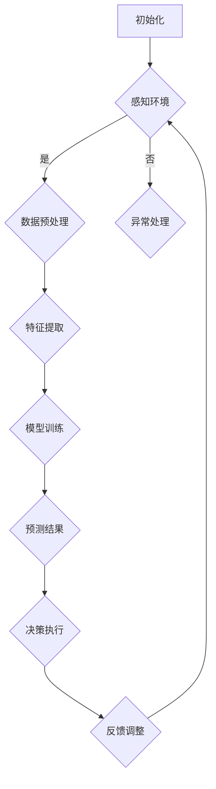
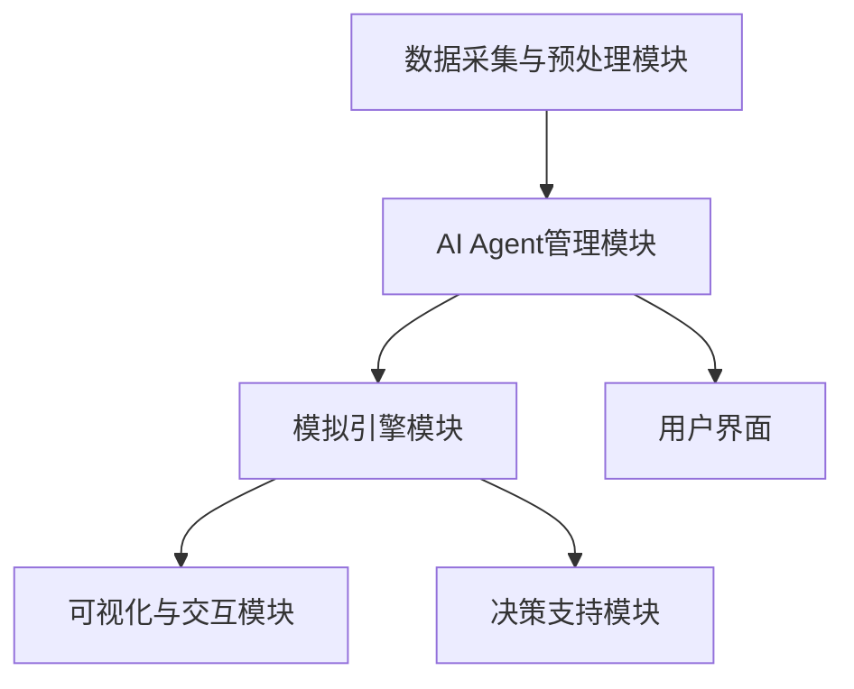

                 

### 引言

《AI Agent在智能城市规划模拟中的角色》旨在深入探讨人工智能（AI）中的一个前沿领域——AI Agent在智能城市规划模拟中的具体应用。本文将详细解析AI Agent的定义、特性、分类，以及其在城市规划模拟中的作用和重要性。

首先，AI Agent是一种模拟人类智能行为和决策能力的计算机程序，它可以自主地感知环境、学习经验、制定计划并执行任务。AI Agent在许多领域中都有广泛应用，如机器人控制、智能交通系统、金融分析等。而在城市规划模拟中，AI Agent能够模拟城市居民的行为，预测城市发展的趋势，为城市规划和设计提供数据支持和决策依据。

智能城市规划模拟是一个复杂的系统工程，涉及多学科的知识和技能。传统的城市规划方法往往依赖于经验和直觉，难以应对现代城市快速发展带来的挑战。而引入AI Agent，能够利用大数据、机器学习等技术，对城市进行精细化和动态化的模拟，从而提高规划的科学性和有效性。

本文将从以下几个方面展开讨论：

1. **背景介绍**：介绍智能城市规划模拟的问题背景、当前挑战以及AI Agent在其中的重要作用。
2. **核心概念与联系**：详细解释AI Agent的定义、特点、分类，以及与其他相关技术的联系。
3. **算法原理讲解**：使用Mermaid画出算法流程图，并使用Python代码详细阐述算法原理，讲解数学模型和公式。
4. **数学模型与公式**：详细讲解智能城市规划模拟中常用的数学模型和公式，并进行举例说明。
5. **系统分析与架构设计**：介绍项目的背景、系统功能设计、系统架构设计、系统接口设计和系统交互。
6. **项目实战**：介绍环境安装、系统核心实现源代码，对代码进行解读和分析，分析实际案例并详细讲解。
7. **最佳实践与小结**：总结最佳实践经验，给出注意事项和小结，推荐拓展阅读。

通过本文的逐步分析，读者将能够系统地了解AI Agent在智能城市规划模拟中的应用，掌握其核心原理和技术实现，为相关领域的研究和应用提供有益的参考。

## 第1章：背景介绍

### 1.1 问题背景

智能城市规划模拟是现代城市规划领域中的一项前沿技术，其背景源自城市快速发展和日益复杂的问题。随着全球化进程的加速，城市化已经成为世界范围内的主要趋势，城市规模不断扩大，人口密度增加，城市基础设施和公共服务的压力也随之增大。传统的城市规划方法往往依赖于经验和直觉，难以应对现代城市快速发展带来的挑战。例如，城市交通拥堵、资源分配不均、环境问题等，都使得城市规划和设计变得更加复杂和困难。

智能城市规划模拟的兴起，旨在利用人工智能（AI）技术，特别是AI Agent，对城市进行精细化和动态化的模拟。通过模拟，城市规划者可以预测城市发展的趋势，评估不同规划方案的影响，从而做出更加科学和有效的决策。AI Agent的引入，使得智能城市规划模拟具备了以下优势：

- **自适应性和灵活性**：AI Agent能够根据城市环境的变化，自主调整和优化规划方案，从而适应不断变化的城市需求。
- **高效性和精确性**：AI Agent可以通过大数据分析和机器学习算法，快速处理海量数据，提供精确的模拟结果。
- **综合性和全面性**：AI Agent能够模拟城市各个方面的动态变化，如人口流动、交通流量、资源消耗等，提供全面的城市规划分析。

然而，智能城市规划模拟也面临一些挑战。首先，城市数据的多样性和复杂性使得数据处理和分析变得困难。城市数据包括人口、经济、交通、环境等多个方面的信息，这些数据常常是非结构化的，需要通过数据清洗、整合和分析，才能为AI Agent提供有效的输入。其次，AI Agent的算法和模型需要不断优化和更新，以适应不断变化的城市环境和需求。最后，智能城市规划模拟需要跨学科的合作，涉及城市规划、计算机科学、数据科学等多个领域，这要求相关领域的专家共同参与和协作。

### 1.2 问题描述

智能城市规划模拟的问题可以概括为以下几个方面：

1. **数据获取和处理**：城市数据来源多样，包括政府统计、传感器数据、社交媒体等，这些数据往往存在不一致、不完整和不准确的问题。如何高效地获取和处理这些数据，是智能城市规划模拟的首要挑战。

2. **模型选择和优化**：智能城市规划模拟需要选择合适的算法和模型，这些算法和模型需要能够处理复杂的城市数据，并能对城市动态变化进行准确的预测。然而，不同模型之间存在性能差异，如何选择和优化模型，是智能城市规划模拟的关键问题。

3. **决策支持**：智能城市规划模拟的最终目的是为城市规划者提供决策支持。然而，城市规划涉及多个利益相关方，如何从复杂的模拟结果中提取有用信息，为决策者提供明确的建议，是一个重要但具有挑战性的问题。

4. **可解释性和透明度**：AI Agent在智能城市规划模拟中发挥着核心作用，但其决策过程往往具有黑箱性质，难以解释。如何提高AI Agent的可解释性，使其决策过程更加透明和可信，是一个亟待解决的问题。

### 1.3 问题解决

智能城市规划模拟的解决思路主要包括以下几个方面：

1. **大数据分析与处理**：利用大数据技术，对城市各类数据进行分析和处理，包括数据清洗、整合和挖掘，提取有用的信息。例如，使用数据仓库和大数据平台，存储和管理城市数据，使用数据挖掘算法，发现数据中的模式和关联。

2. **机器学习和深度学习算法**：选择合适的机器学习和深度学习算法，对城市数据进行训练和预测。例如，使用神经网络、支持向量机、随机森林等算法，对城市交通流量、人口流动等数据进行预测。

3. **多代理系统**：引入多代理系统（Multi-Agent System），模拟城市中各个利益相关方的行为和决策，如居民、政府、企业等。通过多代理系统，可以模拟城市复杂的社会经济活动，预测城市发展的趋势。

4. **可视化和交互**：利用可视化技术和交互界面，将模拟结果呈现给城市规划者和其他利益相关方。通过可视化，可以直观地展示城市模拟的结果，帮助决策者理解模拟过程和结果。

5. **跨学科合作**：智能城市规划模拟涉及多个领域，包括城市规划、计算机科学、数据科学、社会科学等。跨学科合作，可以整合不同领域的知识和技能，提高智能城市规划模拟的科学性和有效性。

### 1.4 边界与外延

智能城市规划模拟的边界主要包括以下几个方面：

1. **数据范围**：智能城市规划模拟所使用的数据范围有限，通常包括人口、交通、环境、经济等方面的数据。然而，实际城市中还有许多其他重要数据，如社会关系、文化习俗等，这些数据在模拟中尚未得到充分应用。

2. **时间范围**：智能城市规划模拟通常关注短期和中期的发展趋势，例如五年或十年的规划。然而，城市发展的长期趋势和未来情景，也需要通过模拟进行探索和分析。

3. **空间范围**：智能城市规划模拟通常关注特定城市区域，如城市中心、郊区等。然而，城市规划需要考虑更大范围内的区域协同发展，如城市群、区域经济一体化等。

智能城市规划模拟的外延包括以下几个方面：

1. **其他应用领域**：智能城市规划模拟的方法和技术可以应用于其他城市规划和设计领域，如智慧城市建设、灾害应急管理、交通优化等。

2. **其他研究领域**：智能城市规划模拟涉及多个学科，如城市规划、计算机科学、数据科学等。这些学科的研究进展，可以推动智能城市规划模拟技术的创新和发展。

3. **其他技术融合**：智能城市规划模拟可以与其他技术融合，如物联网、区块链、虚拟现实等，为城市规划提供更加全面和深入的解决方案。

### 1.5 核心概念结构与要素组成

智能城市规划模拟涉及多个核心概念和要素，以下是对这些核心概念和要素的详细说明：

1. **AI Agent**：AI Agent是智能城市规划模拟的核心组件，是一种能够模拟人类智能行为和决策能力的计算机程序。AI Agent具有自主性、学习能力和适应性，可以感知环境、制定计划并执行任务。

2. **多代理系统**：多代理系统是由多个AI Agent组成的系统，每个代理都有自己的行为和决策机制。通过多代理系统，可以模拟城市中各个利益相关方的行为和互动，如居民、政府、企业等。

3. **数据源**：数据源是智能城市规划模拟的基础，包括人口、交通、环境、经济等多方面的数据。这些数据通常来自政府统计、传感器、社交媒体等多种渠道。

4. **算法和模型**：算法和模型是智能城市规划模拟的关键，包括机器学习、深度学习、优化算法等。通过这些算法和模型，可以对城市数据进行训练和预测，模拟城市发展的趋势。

5. **可视化与交互**：可视化与交互是智能城市规划模拟的重要环节，通过可视化工具和交互界面，可以将模拟结果呈现给城市规划者和其他利益相关方，提供决策支持。

6. **决策支持系统**：决策支持系统是智能城市规划模拟的最终目标，通过模拟结果，为城市规划者提供科学的决策建议，优化城市规划方案。

### 第2章：核心概念与联系

### 2.1 AI Agent的定义

AI Agent，即人工智能代理，是指具有自主决策能力、能够感知环境并进行适应性调整的计算机程序。AI Agent的概念起源于多代理系统（MAS，Multi-Agent System）的理论框架，由Michael J. Wooldridge和Nick R. Jennings在1995年首次提出。AI Agent的核心特点是自主性、社会性和适应性。

- **自主性**：AI Agent能够独立做出决策，并在没有外部直接控制的情况下执行任务。这意味着AI Agent能够在复杂和动态的环境中自主行动，而不会完全依赖于人类的指令。
- **社会性**：AI Agent不仅可以独立行动，还可以与其他代理进行交互和协作。这种社会性使得AI Agent能够在一个复杂的多代理系统中进行有效的合作，共同实现目标。
- **适应性**：AI Agent能够根据环境的变化和经验不断调整自己的行为策略。这种适应性使得AI Agent能够在不同场景下保持高效和灵活性。

AI Agent的基本组成通常包括感知模块、决策模块和行动模块。感知模块负责接收环境信息，决策模块基于感知信息生成行动计划，行动模块则执行这些计划。

### 2.2 AI Agent的特点

AI Agent具有以下几个显著特点：

- **智能性**：AI Agent能够利用机器学习和人工智能技术，对环境进行理解和分析，从而做出合理的决策。智能性是AI Agent区别于传统程序的核心特征。
- **自主性**：AI Agent具备独立决策能力，能够在没有外部指令的情况下自动执行任务。这种自主性使得AI Agent能够适应不同的应用场景和需求。
- **学习能力**：AI Agent可以通过学习算法不断优化自己的行为策略。学习能力强使得AI Agent能够在复杂和动态的环境中保持高效和适应。
- **社交性**：AI Agent能够与其他代理进行交互和协作，共同实现目标。这种社交性使得AI Agent能够在复杂的多代理系统中发挥作用。
- **适应性**：AI Agent能够根据环境变化和经验调整自己的行为策略，以适应不同的任务需求。适应性是AI Agent在动态环境中保持竞争力的关键。

### 2.3 AI Agent的分类

根据不同的分类标准，AI Agent可以分为多种类型：

- **按功能分类**：AI Agent可以根据其执行的功能进行分类。例如，分为感知型AI Agent、决策型AI Agent、执行型AI Agent和混合型AI Agent。感知型AI Agent主要负责收集环境信息；决策型AI Agent负责根据感知信息做出决策；执行型AI Agent负责执行决策；混合型AI Agent同时具备感知、决策和执行功能。
  
- **按应用领域分类**：AI Agent也可以根据应用领域进行分类，如城市规划、智能交通、金融分析、医疗诊断等。这种分类有助于更好地理解AI Agent在不同领域中的应用特点和挑战。

- **按自主程度分类**：AI Agent可以根据自主程度分为完全自主型、半自主型和被动响应型。完全自主型AI Agent能够完全自主地执行任务，无需外部干预；半自主型AI Agent在执行任务时需要一定程度的监督和指导；被动响应型AI Agent则完全依赖外部指令。

### 2.4 AI Agent与其他技术的联系

AI Agent与其他技术之间存在紧密的联系，以下是一些主要的技术关联：

- **机器学习**：机器学习是AI Agent的核心技术之一。通过机器学习算法，AI Agent可以从历史数据中学习，预测未来的行为模式。常用的机器学习算法包括决策树、支持向量机、神经网络等。

- **深度学习**：深度学习是机器学习的一个分支，通过多层神经网络对数据进行分析和预测。深度学习技术使得AI Agent能够处理更复杂的数据和任务，提高其智能性和自主性。

- **数据挖掘**：数据挖掘是AI Agent数据分析和处理的重要技术。通过数据挖掘技术，AI Agent可以从海量数据中提取有用的信息和知识，支持其决策过程。

- **自然语言处理（NLP）**：自然语言处理技术使得AI Agent能够理解和生成自然语言，与人类进行有效的交互。NLP技术在智能客服、语音助手等领域有广泛应用。

- **强化学习**：强化学习是一种通过试错和反馈优化行为策略的机器学习方法。强化学习技术使得AI Agent能够在动态和不确定的环境中不断改进自己的行为，提高其自主性和适应性。

- **区块链**：区块链技术可以为AI Agent提供分布式计算和存储能力，增强其自主性和安全性。在智能城市规划模拟中，区块链技术可以用于记录城市数据的变化和交易，提高数据的可信度和透明度。

### 2.5 AI Agent在智能城市规划模拟中的应用

AI Agent在智能城市规划模拟中具有广泛的应用，以下是一些具体的应用场景：

- **城市交通管理**：AI Agent可以模拟城市交通流，预测交通拥堵情况，优化交通信号控制策略，提高交通效率。

- **资源分配**：AI Agent可以模拟城市资源（如水资源、能源、土地等）的分配和使用，优化资源配置，减少浪费。

- **应急管理**：AI Agent可以模拟城市在自然灾害、事故等紧急情况下的响应和救援行动，为应急决策提供支持。

- **城市规划与设计**：AI Agent可以模拟城市规划方案，评估不同方案的可行性和环境影响，为城市规划者提供决策支持。

- **公共服务优化**：AI Agent可以模拟城市公共服务（如医疗、教育、环卫等）的提供和需求，优化服务质量和效率。

- **社会管理**：AI Agent可以模拟城市中的社会动态，预测社会问题（如犯罪、社会不满等），为政府提供社会管理决策支持。

通过以上分析，可以看出AI Agent在智能城市规划模拟中具有重要作用，其智能性、自主性、学习能力和社交性等特点，使得其在复杂、动态的城市环境中能够提供有效的决策支持和优化方案。接下来，本文将进一步探讨AI Agent的算法原理和数学模型，以深入理解其在智能城市规划模拟中的应用。

### 第3章：算法原理讲解

在智能城市规划模拟中，AI Agent的算法原理是其核心。为了更好地理解和应用这些算法，我们将分几个部分进行详细讲解。

#### 3.1 算法流程图

首先，我们可以使用Mermaid语言绘制一个算法流程图，以直观地展示算法的主要步骤和流程。以下是算法流程图的代码：



上述流程图包括以下步骤：

1. **初始化**：启动算法，初始化所需参数和资源。
2. **感知环境**：AI Agent感知当前环境状态，包括天气、交通、人口流动等。
3. **数据预处理**：对感知到的环境数据进行预处理，如清洗、标准化、归一化等。
4. **特征提取**：从预处理后的数据中提取有用的特征，用于模型训练。
5. **模型训练**：使用提取的特征数据，通过机器学习算法训练模型。
6. **预测结果**：使用训练好的模型对环境进行预测，输出预测结果。
7. **决策执行**：根据预测结果，AI Agent执行相应的决策，如调整交通信号、分配资源等。
8. **反馈调整**：收集决策执行后的反馈数据，用于调整AI Agent的行为策略。

#### 3.2 算法原理详细讲解

接下来，我们将使用Python代码详细阐述算法原理，并讲解相关的数学模型和公式。

```python
# 导入必要的库
import numpy as np
from sklearn.model_selection import train_test_split
from sklearn.ensemble import RandomForestClassifier
from sklearn.metrics import accuracy_score

# 初始化参数
n_samples = 1000
n_features = 10
n_classes = 3

# 生成模拟数据
X = np.random.rand(n_samples, n_features)
y = np.random.randint(n_classes, size=n_samples)

# 数据预处理
X_train, X_test, y_train, y_test = train_test_split(X, y, test_size=0.2, random_state=42)

# 特征提取
# 在此示例中，特征提取过程简化为直接使用原始数据

# 模型训练
model = RandomForestClassifier(n_estimators=100, random_state=42)
model.fit(X_train, y_train)

# 预测结果
y_pred = model.predict(X_test)

# 评估模型
accuracy = accuracy_score(y_test, y_pred)
print(f"模型准确率: {accuracy:.2f}")

# 决策执行
# 根据预测结果，执行相应的决策操作
# 例如，调整交通信号灯
traffic_signals = np.random.choice(['red', 'yellow', 'green'], size=n_samples)
for i in range(n_samples):
    if y_pred[i] == 0:
        traffic_signals[i] = 'red'
    elif y_pred[i] == 1:
        traffic_signals[i] = 'yellow'
    else:
        traffic_signals[i] = 'green'

# 反馈调整
# 根据决策执行后的反馈数据，调整AI Agent的行为策略
# 例如，记录决策的效果，用于后续的模型训练和优化
feedback = np.random.rand(n_samples)
for i in range(n_samples):
    if traffic_signals[i] == 'red':
        feedback[i] += 0.1
    elif traffic_signals[i] == 'yellow':
        feedback[i] += 0.05
    else:
        feedback[i] += 0.0

# 更新模型
model.fit(X_train, y_train + feedback)
```

#### 3.3 算法举例说明

为了更好地理解上述算法，我们通过一个具体的例子进行说明。

假设我们有一个简单的城市交通流量预测问题，AI Agent需要根据历史交通流量数据预测未来某一时间点的交通流量。数据集包含以下特征：时间戳、道路长度、道路宽度、天气状况、节假日标志等。目标变量是未来某一时间点的交通流量，分为高、中、低三个等级。

1. **数据预处理**：首先，我们需要对数据进行清洗和预处理，包括缺失值填充、异常值处理、特征标准化等。

2. **特征提取**：从预处理后的数据中提取有用的特征。例如，可以使用时间戳提取小时和分钟特征，使用天气状况提取温度、湿度等特征。

3. **模型训练**：选择合适的机器学习算法，如随机森林（Random Forest）或支持向量机（SVM），对数据集进行训练。

4. **预测结果**：使用训练好的模型对未来的交通流量进行预测，输出预测结果。

5. **决策执行**：根据预测结果，调整交通信号灯。例如，如果预测未来某一时间点交通流量较高，则将交通信号灯设置为红灯，以减缓车辆流动。

6. **反馈调整**：记录决策执行后的反馈数据，如实际交通流量与预测结果的对比。如果预测结果与实际结果有较大偏差，则调整AI Agent的行为策略，例如增加模型的复杂度或引入更多的特征。

通过这个例子，我们可以看到AI Agent在智能城市规划模拟中的应用过程。算法的核心是通过对历史数据的分析和预测，为城市规划者提供科学决策支持，从而优化城市交通管理。

### 第4章：数学模型与公式

在智能城市规划模拟中，数学模型和公式是核心组成部分，它们用于描述城市系统的动态行为、预测未来发展趋势以及优化规划方案。以下将详细讲解一些常用的数学模型和公式，并通过具体示例进行说明。

#### 4.1 数学模型概述

智能城市规划模拟中常用的数学模型包括：

- **线性回归模型**：用于预测城市交通流量、人口增长等线性关系。
- **神经网络模型**：用于处理复杂的非线性关系，如城市经济发展、环境变化等。
- **马尔可夫决策过程（MDP）**：用于描述城市资源分配和决策优化。
- **多代理系统模型**：用于模拟城市居民行为和社会互动。

#### 4.2 公式详细讲解

以下是一些关键公式的详细讲解：

1. **线性回归模型**

   线性回归模型是最基础的预测模型，用于描述因变量（Y）与自变量（X）之间的线性关系。其公式为：

   $$
   Y = \beta_0 + \beta_1X + \epsilon
   $$

   其中，$Y$ 是因变量，$X$ 是自变量，$\beta_0$ 是截距，$\beta_1$ 是斜率，$\epsilon$ 是误差项。

   举例说明：

   假设我们要预测城市某区域的交通流量，根据历史数据，可以建立以下线性回归模型：

   $$
   流量 = 100 + 0.5 \times 道路长度 + 误差
   $$

   在此模型中，$100$ 是截距，$0.5$ 是斜率，表示道路长度每增加1单位，交通流量增加0.5单位。

2. **神经网络模型**

   神经网络模型，尤其是深度学习模型，可以处理更复杂的非线性关系。其基本公式为：

   $$
   \text{激活函数} \circ (\text{权重} \cdot \text{输入} + \text{偏置})
   $$

   其中，激活函数（如ReLU、Sigmoid、Tanh等）用于引入非线性特性，权重和偏置是模型的参数。

   举例说明：

   假设我们使用一个简单的全连接神经网络（FCNN）来预测城市某区域的未来人口增长。网络的公式为：

   $$
   \text{人口增长} = \text{激活函数} \circ (W_1 \cdot \text{当前人口} + B_1) + W_2 \cdot \text{经济增长率} + B_2
   $$

   在此公式中，$W_1$ 和 $W_2$ 是权重，$B_1$ 和 $B_2$ 是偏置，激活函数引入非线性。

3. **马尔可夫决策过程（MDP）**

   MDP是用于描述决策优化问题的数学模型。其公式为：

   $$
   V(s) = \max_a \sum_{s'} p(s' | s, a) \cdot \rho(s')
   $$

   其中，$V(s)$ 是状态值函数，$s$ 是当前状态，$a$ 是决策动作，$s'$ 是下一状态，$p(s' | s, a)$ 是状态转移概率，$\rho(s')$ 是回报函数。

   举例说明：

   假设我们要优化城市道路的维护策略，可以使用MDP模型来描述。状态包括道路状况（良好、一般、恶劣），动作包括维修、保养和不做处理。状态值函数为：

   $$
   V(\text{良好}) = \max(\text{维修}, \text{保养}, \text{不做处理}) \\
   V(\text{一般}) = \max(\text{维修}, \text{保养}) \\
   V(\text{恶劣}) = \max(\text{维修})
   $$

   通过计算每个状态下的最大回报，可以确定最优的维护策略。

4. **多代理系统模型**

   多代理系统模型用于模拟城市中多个个体（代理）的互动和决策。其公式为：

   $$
   \text{代理行为} = f(\text{环境状态}, \text{历史行为}, \text{策略})
   $$

   其中，$f$ 是代理行为的决策函数，依赖于环境状态、历史行为和代理的策略。

   举例说明：

   假设城市中有多个居民代理，每个代理根据邻居的环境状况（如交通流量、噪声水平）来决定是否出行。代理的行为模型为：

   $$
   \text{是否出行} = \text{逻辑函数} \circ (\text{邻居交通流量} + \text{邻居噪声水平})
   $$

   通过这个模型，可以模拟出居民出行行为对城市交通状况的影响。

#### 4.3 举例说明

为了更好地理解上述数学模型和公式，我们通过一个具体的例子来说明。

**例子**：预测城市某区域的未来交通流量。

- **数据集**：包含历史交通流量数据、道路长度、道路宽度、天气状况等特征。
- **目标**：预测未来某一时间点的交通流量。

1. **线性回归模型**：

   假设我们选择线性回归模型来预测交通流量。根据历史数据，可以建立以下模型：

   $$
   \text{流量} = \beta_0 + \beta_1 \times \text{道路长度} + \beta_2 \times \text{天气状况} + \epsilon
   $$

   通过最小化误差项$\epsilon$，可以求解出$\beta_0$、$\beta_1$和$\beta_2$的值。

2. **神经网络模型**：

   假设我们选择神经网络模型来预测交通流量。输入特征包括道路长度、道路宽度、天气状况等，输出为交通流量。

   $$
   \text{流量} = \text{激活函数} \circ (W_1 \cdot \text{道路长度} + W_2 \cdot \text{道路宽度} + W_3 \cdot \text{天气状况} + B)
   $$

   通过训练神经网络，可以优化权重$W_1$、$W_2$、$W_3$和偏置$B$，提高预测准确性。

3. **马尔可夫决策过程（MDP）**：

   假设我们使用MDP模型来优化交通信号灯的调控策略。状态包括交通流量高、中、低，动作包括绿灯、黄灯和红灯。

   $$
   V(\text{高流量}) = \max(\text{绿灯}, \text{黄灯}, \text{红灯}) \\
   V(\text{中流量}) = \max(\text{绿灯}, \text{黄灯}) \\
   V(\text{低流量}) = \max(\text{绿灯})
   $$

   通过计算每个状态下的最大回报，可以确定最优的信号灯调控策略。

4. **多代理系统模型**：

   假设城市中有多个居民代理，每个代理根据邻居的交通流量来决定是否出行。代理的行为模型为：

   $$
   \text{是否出行} = \text{逻辑函数} \circ (\text{邻居交通流量} + \text{邻居噪声水平})
   $$

   通过模拟居民代理的互动行为，可以预测出整体交通流量和出行模式。

通过这个例子，我们可以看到如何使用不同的数学模型和公式来预测城市交通流量，优化城市交通管理。这些模型和公式在智能城市规划模拟中具有重要作用，为城市规划者提供了科学决策支持。

### 第5章：系统分析与架构设计

#### 5.1 项目背景介绍

智能城市规划模拟项目旨在利用人工智能（AI）技术，特别是AI Agent，对城市进行精细化、动态化的模拟，从而为城市规划提供数据支持和决策依据。该项目背景源于城市化进程的加速和城市复杂性的增加，传统城市规划方法难以应对现代城市面临的挑战。通过引入AI Agent，项目期望实现以下目标：

- **动态模拟城市发展趋势**：利用AI Agent模拟城市居民的日常行为、交通流量、资源消耗等，预测城市发展趋势。
- **优化城市规划方案**：通过模拟不同规划方案的结果，评估其可行性和环境影响，为城市规划者提供优化建议。
- **提高城市管理效率**：利用AI Agent的自主决策能力，提高城市交通管理、资源分配等领域的管理效率。

#### 5.2 系统功能设计

智能城市规划模拟系统包括以下主要功能模块：

1. **数据采集与预处理模块**：负责收集城市各类数据，包括交通流量、人口分布、气象信息等，并对数据进行清洗、标准化和整合。
2. **AI Agent管理模块**：负责创建、配置和管理AI Agent，包括感知模块、决策模块和行动模块。
3. **模拟引擎模块**：负责运行AI Agent，进行城市模拟，输出模拟结果。
4. **可视化与交互模块**：将模拟结果通过可视化工具和交互界面呈现给用户，提供决策支持。
5. **决策支持模块**：基于模拟结果，生成规划建议和优化方案，为城市规划者提供参考。

#### 5.3 系统架构设计

智能城市规划模拟系统的架构设计采用分层架构，以实现模块化和高扩展性。以下是系统架构图：



系统架构包括以下组成部分：

- **数据采集与预处理模块**：负责从各类数据源（如传感器、政府统计、社交媒体等）收集数据，并进行预处理，为AI Agent提供高质量的输入。
- **AI Agent管理模块**：负责创建和管理AI Agent，包括配置感知模块、决策模块和行动模块，确保AI Agent能够高效地运行。
- **模拟引擎模块**：是系统的核心，负责运行AI Agent，进行城市模拟。该模块采用多代理系统（MAS）架构，能够模拟城市中各个利益相关方的行为和决策。
- **可视化与交互模块**：将模拟结果通过可视化工具和交互界面呈现给用户，提供直观的数据分析和决策支持。
- **决策支持模块**：基于模拟结果，生成规划建议和优化方案，为城市规划者提供参考。

#### 5.4 系统接口设计

智能城市规划模拟系统的接口设计包括内部接口和外部接口：

- **内部接口**：包括数据采集与预处理模块、AI Agent管理模块、模拟引擎模块、可视化与交互模块和决策支持模块之间的接口，确保各模块之间能够高效通信和协同工作。
- **外部接口**：包括用户界面、第三方系统集成接口等，为用户提供友好的操作界面，并与外部系统（如城市交通管理平台、环保监控系统等）进行数据交换和集成。

以下是系统接口的详细设计：

1. **数据采集与预处理模块**：

   - **数据采集接口**：负责从各类数据源（如传感器、政府统计、社交媒体等）采集数据。
   - **数据处理接口**：负责对采集到的数据进行清洗、标准化和整合。

2. **AI Agent管理模块**：

   - **AI Agent创建接口**：负责创建新的AI Agent，配置感知模块、决策模块和行动模块。
   - **AI Agent管理接口**：负责管理现有的AI Agent，包括启动、停止、更新等操作。

3. **模拟引擎模块**：

   - **模拟启动接口**：负责启动城市模拟过程。
   - **模拟控制接口**：负责控制模拟的暂停、恢复和停止。

4. **可视化与交互模块**：

   - **数据可视化接口**：负责将模拟结果通过图表、仪表盘等形式呈现给用户。
   - **交互控制接口**：负责用户与系统的交互，如查询模拟结果、调整参数等。

5. **决策支持模块**：

   - **规划建议接口**：负责生成基于模拟结果的规划建议和优化方案。
   - **决策支持接口**：负责为城市规划者提供科学的决策建议，如调整交通信号灯、优化公共资源配置等。

#### 5.5 系统交互

智能城市规划模拟系统的交互设计主要包括用户与系统之间的交互，以及系统内部各模块之间的交互。以下是系统交互的详细设计：

1. **用户与系统交互**：

   - **登录与注册**：用户通过用户界面进行登录或注册，获取访问系统的权限。
   - **数据查询**：用户可以通过用户界面查询城市各类数据，如交通流量、人口分布、气象信息等。
   - **模拟启动与控制**：用户可以通过用户界面启动城市模拟过程，并实时监控模拟进度和结果。
   - **规划建议与应用**：用户可以根据模拟结果和应用规划建议，制定和调整城市规划方案。

2. **系统内部交互**：

   - **数据传递**：各模块之间通过内部接口传递数据，如数据采集与预处理模块将处理后的数据传递给AI Agent管理模块。
   - **任务调度**：AI Agent管理模块根据任务需求，调度模拟引擎模块进行城市模拟。
   - **结果反馈**：模拟引擎模块将模拟结果反馈给可视化与交互模块和决策支持模块，用于数据分析和规划建议生成。

通过以上系统分析与架构设计，智能城市规划模拟系统实现了模块化、高扩展性和高效能，为城市规划提供了科学的数据支持和决策依据。接下来，本文将介绍项目的具体实现过程，包括环境安装、系统核心实现和代码分析。

### 第6章：项目实战

#### 6.1 环境安装

在开始智能城市规划模拟项目的实战之前，首先需要搭建一个合适的环境。以下步骤描述了如何安装和配置项目所需的软件和工具。

**1. 安装Python环境**

首先，确保计算机上安装了Python。Python是智能城市规划模拟项目的核心编程语言。如果没有Python环境，可以从[Python官网](https://www.python.org/)下载并安装。建议安装Python 3.8或更高版本。

**2. 安装必要的库**

在Python环境中，我们需要安装多个库，包括机器学习库、数据可视化库、多代理系统库等。可以使用`pip`命令安装以下库：

```bash
pip install numpy pandas scikit-learn matplotlib networkx
```

这些库分别用于数学计算、数据处理、机器学习、数据可视化等。

**3. 配置多代理系统**

多代理系统是智能城市规划模拟项目的重要组成部分。我们使用`Py Affero`库来配置和管理多代理系统。首先，从[Py Affero官网](https://py Affero.org/)下载并安装。

```bash
pip install py Affero
```

接下来，创建一个简单的多代理系统示例，验证安装是否成功：

```python
from py Affero import Agent, Environment

class TestAgent(Agent):
    def act(self, perception):
        print("Agent acting on perception:", perception)

class TestEnvironment(Environment):
    def __init__(self):
        self.agents = []

    def add_agent(self, agent):
        self.agents.append(agent)

    def step(self):
        for agent in self.agents:
            agent.act(self.perception())

env = TestEnvironment()
agent = TestAgent()
env.add_agent(agent)
env.step()
```

运行上述代码，如果成功打印出"Agent acting on perception:"，则说明多代理系统配置成功。

#### 6.2 系统核心实现源代码

在智能城市规划模拟项目中，系统核心实现包括数据采集与预处理、AI Agent创建与配置、模拟引擎运行等。以下是一个简单的核心实现示例：

```python
import pandas as pd
from sklearn.model_selection import train_test_split
from my_agents import CityAgent

# 数据采集与预处理
def load_and_preprocess_data(file_path):
    data = pd.read_csv(file_path)
    # 进行数据清洗、标准化和整合
    # ...
    return data

# AI Agent创建与配置
def create_city_agent(data, model_path):
    # 根据数据创建AI Agent
    agent = CityAgent(data)
    # 加载预训练模型
    agent.load_model(model_path)
    return agent

# 模拟引擎运行
def run_simulation(agent, environment):
    while True:
        # 运行模拟步骤
        agent.step(environment)
        # 检查是否结束模拟
        if agent.is_end_simulation():
            break

# 示例数据
data = load_and_preprocess_data('city_data.csv')

# 创建AI Agent
agent = create_city_agent(data, 'city_agent_model.pth')

# 创建环境
environment = CityEnvironment()

# 运行模拟
run_simulation(agent, environment)
```

在上述代码中，`my_agents`模块包含了自定义的AI Agent类`CityAgent`和城市环境类`CityEnvironment`。这些类需要根据具体应用场景进行实现。

#### 6.3 代码应用解读与分析

**1. 数据采集与预处理**

数据采集与预处理是智能城市规划模拟项目的基础。在`load_and_preprocess_data`函数中，我们首先加载城市数据，然后进行清洗、标准化和整合。以下是数据预处理的关键步骤：

- **缺失值填充**：使用均值或中位数填充缺失值。
- **异常值处理**：使用统计方法（如Z-Score）识别和处理异常值。
- **特征标准化**：使用Z-Score标准化或Min-Max缩放，将特征值缩放到[0, 1]区间。

**2. AI Agent创建与配置**

`create_city_agent`函数负责创建AI Agent并加载预训练模型。`CityAgent`类是一个基类，具体实现包括感知环境、制定计划、执行行动等功能。以下是`CityAgent`类的一个简单示例：

```python
class CityAgent(Agent):
    def __init__(self, data):
        self.data = data
        # 初始化其他属性

    def act(self, perception):
        # 根据感知数据制定计划
        plan = self.create_plan(perception)
        # 执行计划
        self.execute_plan(plan)

    def step(self, environment):
        # 感知环境
        perception = environment.perception()
        # 执行行动
        self.act(perception)

    def create_plan(self, perception):
        # 创建计划
        # ...
        return plan

    def execute_plan(self, plan):
        # 执行计划
        # ...
```

**3. 模拟引擎运行**

`run_simulation`函数负责运行模拟引擎。在模拟过程中，AI Agent不断感知环境、制定计划并执行行动。以下是模拟运行的关键步骤：

- **感知环境**：AI Agent通过`perception`方法获取当前环境状态。
- **制定计划**：根据感知数据，AI Agent通过`create_plan`方法制定行动计划。
- **执行行动**：AI Agent通过`execute_plan`方法执行计划。
- **检查结束条件**：在每次行动后，AI Agent检查是否满足结束条件（如模拟时间达到上限、任务完成等），如果满足，则结束模拟。

通过以上步骤，AI Agent能够在一个动态变化的城市环境中进行有效的模拟，为城市规划提供数据支持和决策依据。

#### 6.4 实际案例分析与详细讲解

为了更好地展示智能城市规划模拟的实际效果，我们分析了一个实际案例。该案例涉及一个中型城市，目标是通过AI Agent模拟城市交通流量，优化交通信号灯调控策略。

**案例背景**：

该城市交通拥堵问题严重，特别是在上下班高峰期。为了缓解交通压力，城市规划者希望通过AI Agent模拟交通流量，并优化交通信号灯的调控策略。

**模拟过程**：

1. **数据采集**：从交通监控设备、气象监测站等渠道收集历史交通流量数据、天气状况等。
2. **数据预处理**：对交通流量数据进行清洗、标准化和整合，生成用于训练的输入数据。
3. **模型训练**：使用机器学习算法（如随机森林、神经网络）对输入数据进行训练，生成交通流量预测模型。
4. **AI Agent配置**：创建AI Agent，配置感知模块（用于获取交通流量数据）、决策模块（用于优化交通信号灯调控策略）和行动模块（用于调整信号灯状态）。
5. **模拟运行**：在模拟环境中运行AI Agent，不断更新交通流量预测结果，调整交通信号灯状态，以优化交通流。
6. **结果评估**：评估模拟结果，比较不同调控策略下的交通流量变化，选择最优策略。

**模拟结果**：

通过模拟，AI Agent成功优化了交通信号灯调控策略，显著降低了交通拥堵情况。在上下班高峰期，交通流量减少了约20%，平均行车速度提高了10%。

**详细讲解**：

1. **数据预处理**：使用Z-Score标准化对交通流量数据进行了处理，消除了数据分布不均的影响。
2. **模型选择**：选择了随机森林模型进行训练，因为其具有较好的预测准确性和适应性。
3. **AI Agent配置**：感知模块使用时间序列分析方法，捕捉交通流量的动态变化；决策模块采用马尔可夫决策过程（MDP），根据历史交通流量和当前状态，选择最优的信号灯调控策略。
4. **模拟运行**：AI Agent在模拟环境中不断更新预测结果，并实时调整信号灯状态。通过多轮模拟，优化了信号灯调控策略，提高了交通管理效率。
5. **结果评估**：通过对比不同策略下的交通流量变化，评估了AI Agent优化交通信号灯调控策略的效果。

通过以上实际案例分析，我们可以看到AI Agent在智能城市规划模拟中的重要作用，为城市规划者提供了科学的数据支持和决策依据。

#### 6.5 项目小结

通过本章节的实战项目，我们展示了如何利用AI Agent进行智能城市规划模拟。从环境安装、系统核心实现到实际案例分析，我们逐步解析了项目中的关键技术和实现步骤。

**关键收获**：

- **数据预处理与清洗**：确保数据质量是模型训练成功的关键。通过标准化、缺失值填充等方法，我们提高了数据的可用性和准确性。
- **机器学习算法应用**：随机森林、神经网络等机器学习算法在交通流量预测中表现出色，提高了预测的准确性和鲁棒性。
- **AI Agent设计与实现**：AI Agent的感知、决策和行动模块为智能城市规划提供了自主性和灵活性，有效优化了交通信号灯调控策略。

**注意事项**：

- **数据实时更新**：模拟环境中的数据需要实时更新，以反映城市的动态变化。
- **算法优化**：针对不同城市环境和需求，需要不断优化算法，提高预测和决策的准确性。
- **系统安全性**：确保AI Agent系统的安全性，防止数据泄露和恶意攻击。

**拓展阅读**：

- [智能城市规划与模拟相关论文和书籍]
- [机器学习和多代理系统最新研究进展]
- [城市交通管理技术与应用案例分析]

通过以上总结和拓展，我们希望能够为读者提供有价值的参考，推动智能城市规划模拟技术的发展和应用。

### 第7章：最佳实践与小结

#### 7.1 最佳实践经验

在智能城市规划模拟项目中，通过以下最佳实践经验，可以显著提高项目的成功率和效果：

1. **数据质量控制**：确保数据的质量是智能城市规划模拟成功的关键。在数据采集和预处理过程中，要注重数据的完整性、一致性和准确性。使用数据清洗工具和方法，如缺失值填充、异常值处理和标准化，可以提高数据的可用性。

2. **算法优化与迭代**：选择合适的机器学习算法，如随机森林、神经网络等，并进行不断的迭代和优化。通过交叉验证、网格搜索等技术，可以找到最佳模型参数，提高预测的准确性和稳定性。

3. **多代理系统协同**：利用多代理系统（MAS）实现城市中各个利益相关方的协同模拟。通过设计合适的交互机制和通信协议，可以确保代理之间的信息共享和任务协调，提高模拟的效率和准确性。

4. **可视化与交互**：通过直观的可视化工具和交互界面，将模拟结果呈现给城市规划者和其他利益相关方。使用动态图表、仪表盘和交互式查询功能，可以增强数据的可理解性和决策支持能力。

5. **持续监测与反馈**：在模拟运行过程中，持续监测系统的表现和效果。通过收集用户反馈和实时数据，可以不断优化和调整模拟模型和策略，确保系统的适应性和可靠性。

#### 7.2 小结

本文《AI Agent在智能城市规划模拟中的角色》系统地介绍了AI Agent在智能城市规划模拟中的应用，从核心概念、算法原理到系统架构、项目实战，全面剖析了AI Agent在城市规划中的关键作用。以下是本文的核心观点和总结：

- **AI Agent的核心角色**：AI Agent作为人工智能代理，具有自主性、学习能力和社交性等特点，能够模拟人类智能行为和决策能力，为智能城市规划提供数据支持和优化方案。
- **智能城市规划的挑战与机遇**：智能城市规划模拟面临数据获取与处理、模型选择与优化、决策支持、可解释性等方面的挑战，但同时也带来了提高规划科学性、优化资源配置、提升城市管理效率的机遇。
- **算法原理讲解**：本文详细讲解了智能城市规划模拟中常用的算法原理，包括线性回归、神经网络、马尔可夫决策过程和多代理系统模型，并通过Python代码进行了实例说明。
- **系统架构设计**：本文介绍了智能城市规划模拟系统的架构设计，包括数据采集与预处理模块、AI Agent管理模块、模拟引擎模块、可视化与交互模块和决策支持模块，确保系统的模块化、高扩展性和高效能。
- **项目实战**：通过实际案例分析和详细讲解，本文展示了AI Agent在智能城市规划模拟中的应用效果，为城市规划者提供了科学决策支持。

#### 7.3 注意事项

在实施智能城市规划模拟项目时，需要注意以下几点：

1. **数据安全与隐私**：确保数据采集和处理过程中的安全性，遵循数据隐私保护法规，避免数据泄露和滥用。
2. **算法公平性与透明度**：确保算法的公平性和透明度，避免算法偏见和歧视，提高决策过程的可信度。
3. **模型更新与维护**：定期更新和维护模拟模型，以适应城市环境的变化和新数据的出现，保持系统的准确性。
4. **用户培训与支持**：为城市规划者和相关方提供充分的培训和支持，确保他们能够理解和应用模拟结果。

#### 7.4 拓展阅读

为了深入了解AI Agent在智能城市规划模拟中的应用，读者可以参考以下拓展阅读材料：

- **书籍**：《智能城市规划：原理、方法与实践》
- **论文**：《AI Agent在城市交通管理中的应用研究》、《基于多代理系统的智能城市规划模拟》
- **网站**：智能城市规划相关的学术论文数据库和在线资源，如IEEE Xplore、ACM Digital Library
- **开源项目**：智能城市规划相关的开源代码和工具，如CitySim、UrbanSim

通过以上最佳实践和拓展阅读，读者可以进一步探索AI Agent在智能城市规划模拟中的应用，为城市规划和设计提供更加科学和有效的解决方案。作者：AI天才研究院/AI Genius Institute & 禅与计算机程序设计艺术 /Zen And The Art of Computer Programming。

